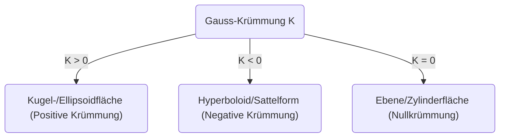
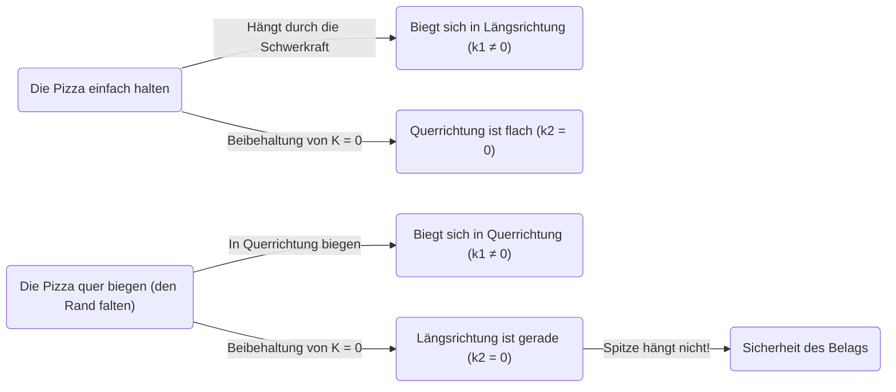

In der Welt der Mathematik können auf den ersten Blick abstrakt und schwer verständlich wirkende Konzepte an unerwarteten Stellen in unserem Alltag nützlich sein. Eines der besten Beispiele hierfür ist das von Carl Friedrich Gauss entdeckte ** Theorema Egregium ** (Bemerkenswerter Lehrsatz). Dieser Satz ist als eines der wichtigsten und schönsten Ergebnisse im Bereich der Differentialgeometrie bekannt.

In diesem Artikel werden wir tief eintauchen, beginnend mit der mathematischen Bedeutung dieses ** Theorema Egregium **, über die Frage, was eine gekrümmte Fläche ist, bis hin dazu, warum uns dieses Theorem enorm hilft, wenn wir Pizza essen.

## 1. Was ist die Gauss-Krümmung?

Um das Theorema Egregium zu verstehen, müssen wir zunächst das Konzept der „Krümmung“ verstehen. In jedem Punkt auf einer Fläche ist die Krümmung ein Indikator, der angibt, wie sehr die Fläche „gekrümmt“ ist.

Um das Maß der Krümmung in einem bestimmten Punkt zu messen, schneiden wir die Fläche mit verschiedenen Ebenen, die durch diesen Punkt verlaufen. Dann erhalten wir verschiedene Kurven. Unter diesen gibt es eine Richtung, in der sie am stärksten gekrümmt ist (maximale Hauptkrümmung $\kappa_1$), und eine Richtung, in der sie am schwächsten gekrümmt ist (minimale Hauptkrümmung $\kappa_2$). Die Gauss-Krümmung $K$ wird als das Produkt dieser beiden Hauptkrümmungen definiert.

$$
K = \kappa_1 \cdot \kappa_2
$$

Je nach dem Wert dieser Gauss-Krümmung $K$ wird die Fläche in diesem Punkt in drei Typen eingeteilt.

1. ** $K > 0$ (Positive Krümmung) **: Eine Fläche, die in alle Richtungen zur selben Seite gekrümmt ist, wie eine Kugeloberfläche.
2. ** $K < 0$ (Negative Krümmung) **: Eine Fläche, die in eine Richtung nach oben und in eine andere Richtung nach unten gekrümmt ist, wie ein Pferdesattel oder ein Kartoffelchip.
3. ** $K = 0$ (Nullkrümmung) **: Eine Fläche, die in mindestens eine Richtung überhaupt nicht gekrümmt ist (eine gerade Linie bildet), wie eine Ebene oder ein Zylinder.

## 2. Die Essenz des Theorema Egregium

Im Jahr 1828 veröffentlichte Gauss eine bahnbrechende Arbeit über gekrümmte Flächen. Darin präsentierte er das ** Theorema Egregium ** (lateinisch für „Bemerkenswerter Lehrsatz“). Dieses Theorem besagt folgendes:

> "Die Gauss-Krümmung einer Fläche bleibt unverändert, egal wie man die Fläche biegt (ohne sie zu dehnen oder zu zerreißen)."

Mit anderen Worten, die Gauss-Krümmung ist eine "innere" Eigenschaft der Fläche und hängt nicht davon ab, wie sie im umgebenden dreidimensionalen Raum platziert ist. Solange man den Abstand (die Metrik) zwischen zwei Punkten auf der Fläche messen kann, lässt sich die Gauss-Krümmung berechnen, ohne den äußeren Raum betrachten zu müssen.

Dies war ein überraschendes, der Intuition widersprechendes Ergebnis. Denn die Hauptkrümmungen $\kappa_1$ und $\kappa_2$ selbst ändern sich, wenn man die Fläche biegt. Aber ihr Produkt, $K$, ändert sich niemals.

### Beispiel Papierrollen

Betrachten wir ein flaches Blatt Papier. Die Gauss-Krümmung einer Ebene ist $K = 0$. Wir versuchen, dieses Papier zu rollen, um einen Zylinder zu formen. Der Zylinder ist in Umfangsrichtung gekrümmt ($\kappa_1 \neq 0$), aber entlang der Längsachse gerade ($\kappa_2 = 0$). Daher ist die Gauss-Krümmung $K = \kappa_1 \cdot 0 = 0$, womit sie dieselbe Krümmung wie die Ebene beibehält.

Das ist der Grund, warum wir Papier zu einem Zylinder oder Kegel rollen können, ohne es zu zerreißen. Umgekehrt ist die Gauss-Krümmung einer Kugel $K > 0$, sodass es unmöglich ist, eine Kugel mit flachem Papier zu umhüllen, ohne Falten zu erzeugen. Dass wir eine Weltkarte nicht exakt auf einer Ebene zeichnen können (es entstehen Verzerrungen von Entfernungen und Flächen), liegt genau an diesem ** Theorema Egregium **.

## 3. Das Pizza-Theorem: Differentialgeometrie im Alltag

Nun kommen wir zu einer äußerst faszinierenden Anwendung. Wie halten Sie ein dünnes, großes Stück Pizza, wenn Sie es essen? Wenn man es einfach am Rand hält, hängt die Spitze nach unten, der Belag fällt ab und es kommt zu einer Katastrophe.

Um dies zu verhindern, dürften die meisten Menschen das ** Pizzastück am Rand unbewusst in eine U-Form falten ** und so halten. Warum hängt die Pizzaspitze nicht mehr nach unten, wenn man das tut?

Hier kommt das ** Theorema Egregium ** ins Spiel.

Ein Pizzastück, das flach auf einem Tisch liegt, hat eine Gauss-Krümmung von $K = 0$. Auch wenn man die Pizza in die Hand nimmt, muss (solange sich der Teig nicht dehnt oder zusammenzieht) gemäß dem Theorema Egregium ihre Gauss-Krümmung bei $K = 0$ bleiben.

$$
K = \kappa_1 \cdot \kappa_2 = 0
$$

Diese Gleichung bedeutet: „In jedem Punkt muss die Hauptkrümmung in mindestens einer Richtung null sein (das heißt, in einer Richtung muss eine gerade Linie beibehalten werden)“.

Wenn man die Pizza flach hält, biegt sich die Spitze durch die Schwerkraft nach unten (zum Beispiel in der Längsrichtung ist $\kappa_1 \neq 0$). Um die Gleichung $K = 0$ zu erfüllen, muss die Querrichtung ($\kappa_2$) $0$ werden (gerade werden), was aber nicht verhindert, dass die Pizza nach unten hängt.

Was passiert jedoch, wenn man den Rand in Querrichtung in eine Talfalte biegt?
In diesem Fall haben Sie absichtlich eine Krümmung ($\kappa_1 \neq 0$) in Querrichtung erzeugt. Laut dem Theorem muss $K$ als Ganzes $0$ sein, sodass zwangsläufig die Krümmung in der anderen Richtung (also der Längsrichtung) $\kappa_2$ erzwungenermaßen $0$ wird.

Das heißt, durch das Biegen der Pizza in Querrichtung sorgt ein mathematisches Gesetz dafür, dass die Pizza in Längsrichtung gerade (steif) bleibt, was ein Herunterhängen der Spitze physikalisch unmöglich macht. Das ist nicht bloß eine Faustregel, sondern eine perfekte Lösung, die den geometrischen Gesetzen des Universums folgt.

## 4. Weitere Anwendungen und Tiefen des Theorema Egregium

Nicht nur beim Pizza-Essen, sondern auch in der Ingenieurwissenschaft, der Architektur und überall in der Natur findet sich dieses Prinzip.

- ** Wellblech und Wellpappe **: Indem man eine flache Platte wellenförmig bearbeitet, verleiht man ihr in einer Richtung Krümmung und erhöht so drastisch ihre Steifigkeit (Widerstand gegen Biegung) in der senkrechten Richtung.
- ** Pflanzenblätter **: Die Blätter und Blütenblätter vieler Pflanzen haben sich natürlicherweise zu gewellten Formen entwickelt, um Wind und ihrem eigenen Gewicht standzuhalten.
- ** Gebäude **: Bei Bauwerken, die große Räume mit dünnen Materialien überdachen, wie Schalenstrukturen, werden die mechanische Festigkeit und die geometrischen Eigenschaften gekrümmter Flächen genutzt.

Dieses von Gauss entdeckte Theorem wurde später von seinem Schüler Bernhard Riemann auf höherdimensionale Mannigfaltigkeiten erweitert (Riemannsche Geometrie) und bildete schließlich die mathematische Grundlage in Albert Einsteins allgemeiner Relativitätstheorie, um die Schwerkraft als „Krümmung der Raumzeit“ zu beschreiben.

## 5. Fazit

Hinter unserer unbewussten Handlung, „den Rand der Pizza zu falten“, verbarg sich ein tiefes und schönes mathematisches Gesetz, das bis zu Einsteins Kosmologie reicht.

Das ** Theorema Egregium ** ist wohl das leckerste und verständlichste Beispiel dafür, wie abstrakte Mathematik die reale Welt beherrscht. Wenn Sie das nächste Mal Pizza essen, denken Sie an Carl Friedrich Gauss und seine großartige Entdeckung, während Sie ein perfekt gefaltetes Stück genießen.
