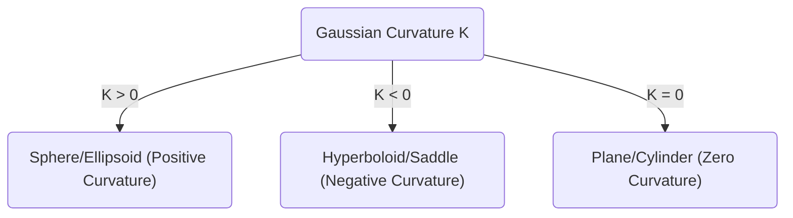
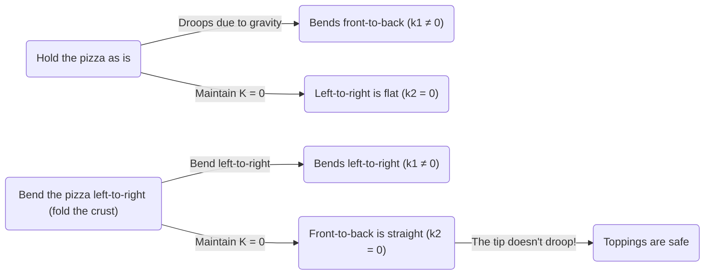

In the world of mathematics, concepts that seem abstract and difficult at first glance can sometimes be useful in unexpected situations in our daily lives. One of the best examples of this is the ** Theorema Egregium ** discovered by [Carl Friedrich Gauss](https://kenji.blog/en/p/gauss/). This theorem is known as one of the most important and beautiful results in the field of differential geometry.

In this article, we will delve deeply, starting from the mathematical meaning of this ** Theorema Egregium ** , exploring what a surface is, and uncovering why this theorem is extremely useful when we eat pizza.

## 1. What is Gaussian Curvature?

To understand the Theorema Egregium, we first need to understand the concept of "curvature." Curvature is an indicator that shows how much a surface is "curved" at each point on the surface.

To measure the degree of bending at a certain point, let's cut the surface with various planes passing through that point. This will yield various curves, among which there is a direction that curves the tightest (maximum principal curvature $\kappa_1$) and a direction that curves the most gently (minimum principal curvature $\kappa_2$). The Gaussian curvature $K$ is defined as the product of these two principal curvatures.

$$
K = \kappa_1 \cdot \kappa_2
$$

Depending on the value of this Gaussian curvature $K$, the surface at that point is classified into three types.

1. ** $K > 0$ (Positive Curvature) **: A surface that curves in the same direction in all directions, like a sphere.
2. ** $K < 0$ (Negative Curvature) **: A surface that curves upward in one direction and downward in another direction, like a horse saddle or a potato chip.
3. ** $K = 0$ (Zero Curvature) **: A surface that does not curve at all (forms a straight line) in at least one direction, like a plane or a cylinder.

## 2. The Essence of the Theorema Egregium

In 1828, Gauss published a groundbreaking paper on surfaces. What was presented there is the ** Theorema Egregium ** (meaning "Remarkable Theorem" in Latin). This theorem claims the following:

> "The Gaussian curvature of a surface is invariant under any bending of the surface (without stretching or tearing it)."

In other words, Gaussian curvature is an "intrinsic" property of a surface, and it does not depend on how it is embedded in the surrounding 3D space. As long as the distance (metric) between two points on the surface can be measured, the Gaussian curvature can be calculated without looking at the external space.

This was a surprising result that contradicted intuition. This is because the principal curvatures $\kappa_1$ and $\kappa_2$ themselves change when the surface is bent. However, their product $K$ never changes.

### The Example of Rolling Paper

Let's consider a flat piece of paper. The Gaussian curvature of a plane is $K = 0$. Let's try rolling this paper to make a cylinder. The cylinder is curved along its circumference ($\kappa_1 \neq 0$), but it is straight along its long axis ($\kappa_2 = 0$). Therefore, the Gaussian curvature is $K = \kappa_1 \cdot 0 = 0$, maintaining the same curvature as the plane.

This is the reason why we can roll paper into a cylinder or cone without tearing it. Conversely, because the Gaussian curvature of a sphere is $K > 0$, it is impossible to wrap a sphere with a flat piece of paper without creating wrinkles. The fact that a world map cannot be accurately drawn on a flat plane (resulting in distortions of distance and area) is precisely due to this ** Theorema Egregium ** .

## 3. The Pizza Theorem: Differential Geometry Hidden in Everyday Life

Now, here is a very interesting application. When you eat a thin, large slice of pizza, how do you hold it? If you hold it by the edge as is, the tip will droop down, and the toppings will fall off, resulting in a disaster.

To prevent this, many people unconsciously hold the crust of the pizza by ** bending it lightly into a U-shape ** . Why does doing this prevent the tip of the pizza from drooping?

This is where the ** Theorema Egregium ** comes in.

A slice of pizza placed on a flat table has a Gaussian curvature of $K = 0$. Even when you pick up the pizza, according to the Theorema Egregium, its Gaussian curvature must remain $K = 0$ (as long as the dough does not stretch or shrink).

$$
K = \kappa_1 \cdot \kappa_2 = 0
$$

What this equation means is that "at any point, the principal curvature in at least one direction must be zero (in other words, it must maintain a straight line in a certain direction)."

If you hold the pizza flat, gravity will cause the tip to bend downward (for example, $\kappa_1 \neq 0$ in the front-to-back direction). To satisfy the equation $K = 0$, the left-to-right direction ($\kappa_2$) must become $0$ (become straight), but this does not prevent the pizza from drooping down.

However, what happens if you fold the crust part into a valley fold on the left and right?
At this time, you have intentionally given curvature ($\kappa_1 \neq 0$) in the left-to-right direction. According to the theorem, the overall $K$ must be $0$, so the curvature $\kappa_2$ in the other direction (that is, the front-to-back direction) is forcibly forced to be $0$.

In other words, by bending the pizza horizontally, the mathematical laws work to keep the pizza straight (rigid) vertically, making it physically impossible for the tip to droop. This is not just an empirical rule, but a perfect solution that follows the geometric laws of the universe.

## 4. Further Applications and Depths of the Theorema Egregium

Beyond just how to eat pizza, this principle can be seen everywhere in engineering, architecture, and the natural world.

- ** Corrugated iron and cardboard **: By processing flat plates into a wavy shape, curvature is given in a certain direction, dramatically increasing the rigidity (resistance to bending) in the perpendicular direction.
- ** Plant leaves **: Many plant leaves and petals have naturally evolved into wavy shapes to withstand wind and their own weight.
- ** Architecture **: In buildings that cover large spaces with thin materials, such as shell structures, the mechanical strength and geometric properties of curved surfaces are utilized.

This theorem discovered by Gauss was later extended to higher-dimensional manifolds by his student [Bernhard Riemann](https://kenji.blog/en/p/riemann/) ([Riemann](https://kenji.blog/en/p/riemann/)ian geometry), and eventually became the mathematical foundation for describing gravity as the "distortion of spacetime" in Albert Einstein's general theory of relativity.

## 5. Conclusion

Behind the act of "folding the crust of a pizza," which we do unconsciously, lay deep and beautiful mathematical laws that connect even to Einstein's cosmology.

The ** Theorema Egregium ** can be said to be the most delicious and easy-to-understand example showing how abstract mathematics governs the real world. The next time you eat pizza, please enjoy your perfectly folded slice while thinking of [Carl Friedrich Gauss](https://kenji.blog/en/p/gauss/) and his great discovery.
