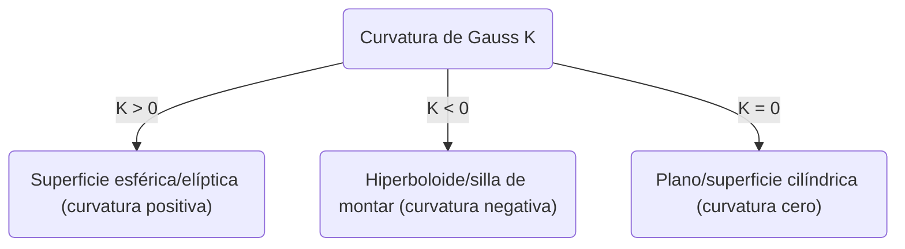
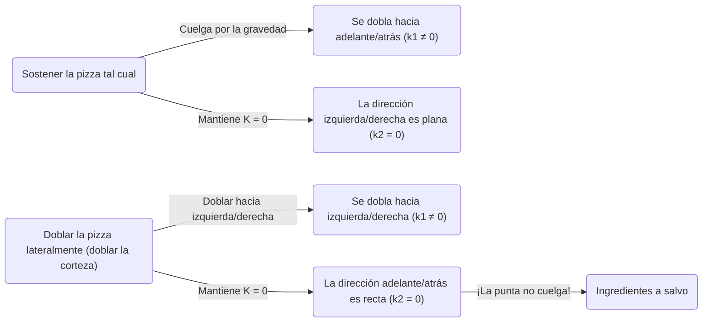

En el mundo de las matemáticas, conceptos que a primera vista parecen abstractos y complejos, a veces resultan útiles en situaciones inesperadas de nuestra vida cotidiana. Uno de los mejores ejemplos es el ** Teorema Egregium ** (Teorema Destacado o Sorprendente) descubierto por [Carl Friedrich Gauss](https://kenji.blog/es/p/gauss/). Este teorema es conocido como uno de los resultados más importantes y hermosos en el campo de la geometría diferencial.

En este artículo, comenzaremos desde el significado matemático de este ** Teorema Egregium **, profundizaremos en qué es una superficie curva y, finalmente, por qué este teorema es extremadamente útil cuando comemos pizza.

## 1. ¿Qué es la curvatura de Gauss?

Para entender el teorema egregium, primero debemos entender el concepto de "curvatura". La curvatura es un indicador que muestra qué tan "curvada" está una superficie en cada punto sobre ella.

Para medir el grado de curvatura en un cierto punto, intentamos cortar la superficie con varios planos que pasan por ese punto. Así, obtenemos varias curvas, pero entre ellas existe una dirección que se curva más fuertemente (curvatura principal máxima $\kappa_1$) y una dirección que se curva más suavemente (curvatura principal mínima $\kappa_2$). La curvatura de Gauss $K$ se define como el producto de estas dos curvaturas principales.

$$
K = \kappa_1 \cdot \kappa_2
$$

Dependiendo del valor de esta curvatura de Gauss $K$, las superficies se clasifican en 3 tipos en ese punto.

1. ** $K > 0$ (curvatura positiva) **: Como una esfera, una superficie que se curva hacia el mismo lado en todas las direcciones.
2. ** $K < 0$ (curvatura negativa) **: Como una silla de montar (saddle) o unas patatas fritas, una superficie que se curva hacia arriba en una dirección y hacia abajo en otra dirección.
3. ** $K = 0$ (curvatura cero) **: Como un plano o un cilindro, una superficie que no está curvada en absoluto (es una línea recta) en al menos una dirección.

## 2. La esencia del Teorema Egregium

En 1828, Gauss publicó un artículo revolucionario sobre superficies curvas. Allí se presentó el ** Theorema Egregium ** (que significa "Teorema Sorprendente" en latín). Este teorema afirma lo siguiente:

> "La curvatura de Gauss de una superficie es invariante sin importar cómo se doble la superficie (sin estirarla ni romperla)"

En otras palabras, la curvatura de Gauss es una propiedad "intrínseca" de la superficie y no depende de cómo esté situada en el espacio tridimensional circundante. Mientras se pueda medir la distancia (métrica) entre dos puntos en la superficie, se puede calcular la curvatura de Gauss sin mirar el espacio exterior.

Este fue un resultado sorprendente que iba en contra de la intuición. Esto se debe a que las curvaturas principales $\kappa_1$ y $\kappa_2$ mismas cambian cuando se dobla la superficie. Sin embargo, su producto $K$ nunca cambia.

### El ejemplo de enrollar un papel

Consideremos un papel plano. La curvatura de Gauss del plano es $K = 0$. Intentemos enrollar este papel para hacer un cilindro. El cilindro está curvado en la dirección alrededor del círculo ($\kappa_1 \neq 0$), pero es recto en la dirección del eje longitudinal ($\kappa_2 = 0$). Por lo tanto, la curvatura de Gauss es $K = \kappa_1 \cdot 0 = 0$, manteniendo la misma curvatura que el plano.

Esta es la razón por la que podemos enrollar un papel en un cilindro o cono sin romperlo. Por el contrario, dado que la curvatura de Gauss de una esfera es $K > 0$, es imposible envolver una esfera con un papel plano sin hacer arrugas. El hecho de que no podamos dibujar con precisión un mapa del mundo en un plano (se produce distorsión en la distancia y el área) también se debe exactamente a este ** Teorema Egregium **.

## 3. El teorema de la pizza: geometría diferencial oculta en la vida cotidiana

Ahora, aquí viene una aplicación muy interesante. Cuando todos ustedes comen una rebanada de pizza delgada y grande, ¿cómo la sostienen? Si la sostienes por el borde tal cual, la punta colgará hacia abajo, los ingredientes se caerán y será un desastre.

Para evitar esto, muchas personas, sin darse cuenta, ** doblan ligeramente la parte del borde (corteza) de la pizza en forma de U ** al sostenerla. ¿Por qué al hacer esto la punta de la pizza ya no cuelga hacia abajo?

Aquí es donde entra el ** Teorema Egregium **.

Una rebanada de pizza colocada sobre una mesa plana tiene una curvatura de Gauss $K = 0$. Incluso cuando tomas la pizza en tu mano, de acuerdo con el teorema egregium (siempre y cuando la masa no se estire ni se contraiga), su curvatura de Gauss debe mantenerse en $K = 0$.

$$
K = \kappa_1 \cdot \kappa_2 = 0
$$

Lo que significa esta ecuación es que, "en cualquier punto, la curvatura principal en al menos una dirección debe ser cero (es decir, debe mantener una línea recta en cierta dirección)".

Si sostienes la pizza plana, la punta se dobla hacia abajo debido a la gravedad (por ejemplo, en la dirección de adelante hacia atrás, $\kappa_1 \neq 0$). Para satisfacer la ecuación $K = 0$, la dirección izquierda-derecha ($\kappa_2$) debe ser $0$ (debe ser recta), pero esto no evita que la pizza cuelgue hacia abajo.

Sin embargo, ¿qué sucede cuando doblas la corteza en un pliegue de valle de izquierda a derecha?
En este momento, has dado intencionalmente una curvatura ($\kappa_1 \neq 0$) en la dirección izquierda-derecha. Según el teorema, dado que la $K$ general debe ser $0$, inevitablemente la curvatura $\kappa_2$ en la otra dirección (es decir, la dirección de adelante hacia atrás) es forzada a ser $0$.

En otras palabras, al doblar la pizza transversalmente, las leyes matemáticas actúan para mantener la pizza recta (rígida) longitudinalmente, haciendo físicamente imposible que la punta cuelgue hacia abajo. Esta no es una simple regla empírica, sino una solución perfecta que sigue las leyes geométricas del universo.

## 4. Más aplicaciones y profundidades del Teorema Egregium

No solo en cómo comer pizza, este principio se puede ver en todas partes en la ingeniería, la arquitectura y el mundo natural.

- ** Chapa de hierro corrugado / Cartón **: Al procesar placas planas en formas onduladas, se les da curvatura en una dirección, aumentando drásticamente su rigidez (resistencia a la flexión) en la dirección perpendicular.
- ** Hojas de las plantas **: Muchas hojas y pétalos de plantas han evolucionado naturalmente hacia formas onduladas para soportar el viento y su propio peso.
- ** Edificios **: En edificios que cubren grandes espacios con materiales delgados, como las estructuras de concha (shell), se utilizan la resistencia mecánica y las propiedades geométricas que tienen las superficies curvas.

Este teorema descubierto por Gauss fue posteriormente extendido por su discípulo [Bernhard Riemann](https://kenji.blog/es/p/riemann/) a variedades de dimensiones superiores (geometría riemanniana), y eventualmente se convirtió en la base matemática en la teoría de la relatividad general de Albert Einstein para describir la gravedad como la "distorsión del espacio-tiempo".

## 5. Conclusión

Detrás del acto de "doblar la corteza de la pizza" que hacemos inconscientemente, se escondían leyes matemáticas profundas y hermosas que conectan incluso con la cosmología de Einstein.

Se podría decir que el ** Teorema Egregium ** es el ejemplo más delicioso y fácil de entender de cómo las matemáticas abstractas gobiernan el mundo real. La próxima vez que comas pizza, intenta saborear una porción doblada en la forma perfecta mientras piensas en [Carl Friedrich Gauss](https://kenji.blog/es/p/gauss/) y su gran descubrimiento.
