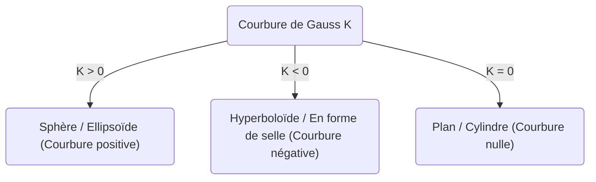
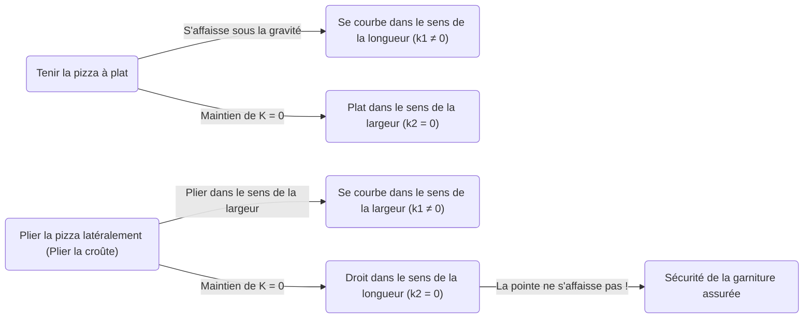

Dans le monde des mathématiques, des concepts qui semblent à première vue abstraits et difficiles peuvent s'avérer utiles dans des situations inattendues de notre vie quotidienne. L'un des meilleurs exemples est le ** Theorema Egregium ** (Théorème remarquable) découvert par [Carl Friedrich Gauss](https://kenji.blog/fr/p/gauss/). Ce théorème est connu comme l'un des résultats les plus importants et les plus beaux dans le domaine de la géométrie différentielle.

Dans cet article, nous allons explorer en profondeur la signification mathématique de ce ** Theorema Egregium **, ce qu'est une surface, et pourquoi ce théorème est extrêmement utile lorsque nous mangeons une pizza.

## 1. Qu'est-ce que la courbure de Gauss ?

Pour comprendre le théorème remarquable, nous devons d'abord comprendre le concept de « courbure ». La courbure est un indicateur qui montre à quel point une surface est « courbée » en chaque point de celle-ci.

Pour mesurer la courbure en un point donné, nous coupons la surface avec différents plans passant par ce point. Cela donne différentes courbes, parmi lesquelles il y a une direction où la courbe est la plus prononcée (courbure principale maximale $\kappa_1$) et une direction où elle est la plus douce (courbure principale minimale $\kappa_2$). La courbure de Gauss $K$ est définie comme le produit de ces deux courbures principales.

$$
K = \kappa_1 \cdot \kappa_2
$$

Selon la valeur de cette courbure de Gauss $K$, la surface en ce point est classée en trois types.

1. ** $K > 0$ (Courbure positive) ** : Une surface courbée du même côté dans toutes les directions, comme une sphère.
2. ** $K < 0$ (Courbure négative) ** : Une surface courbée vers le haut dans une direction et vers le bas dans une autre, comme une selle de cheval ou une chips.
3. ** $K = 0$ (Courbure nulle) ** : Une surface qui n'est pas du tout courbée (qui est une ligne droite) dans au moins une direction, comme un plan ou un cylindre.

## 2. L'essence du Theorema Egregium

En 1828, Gauss a publié un article révolutionnaire sur les surfaces. C'est là qu'il a présenté le ** Theorema Egregium ** (qui signifie « Théorème remarquable » en latin). Ce théorème affirme ce qui suit :

> « La courbure de Gauss d'une surface est invariante quelle que soit la façon dont on plie la surface (sans l'étirer ni la déchirer). »

En d'autres termes, la courbure de Gauss est une propriété « intrinsèque » de la surface, et elle ne dépend pas de la façon dont elle est placée dans l'espace tridimensionnel environnant. Tant que l'on peut mesurer la distance (la métrique) entre deux points sur la surface, on peut calculer la courbure de Gauss sans même regarder l'espace extérieur.

C'était un résultat surprenant et contre-intuitif. En effet, les courbures principales $\kappa_1$ et $\kappa_2$ elles-mêmes changent lorsqu'on plie la surface. Cependant, leur produit $K$ ne change jamais.

### L'exemple de la feuille de papier roulée

Considérons une feuille de papier plate. La courbure de Gauss d'un plan est $K = 0$. Roulons ce papier pour en faire un cylindre. Le cylindre est courbé dans la direction de la circonférence du cercle ($\kappa_1 \neq 0$), mais il est droit le long de son axe long ($\kappa_2 = 0$). Par conséquent, la courbure de Gauss est $K = \kappa_1 \cdot 0 = 0$, conservant ainsi la même courbure que le plan.

C'est la raison pour laquelle nous pouvons rouler une feuille de papier en un cylindre ou un cône sans la déchirer. Inversement, la courbure de Gauss d'une sphère étant $K > 0$, il est impossible d'envelopper une sphère avec une feuille de papier plate sans faire de plis. C'est précisément à cause de ce ** Theorema Egregium ** qu'il est impossible de dessiner une carte du monde exacte sur un plan (il y aura toujours des distorsions de distance ou de surface).

## 3. Le théorème de la pizza : La géométrie différentielle au quotidien

Voici maintenant une application très intéressante. Comment tenez-vous une grande et fine part de pizza lorsque vous la mangez ? Si vous la tenez simplement par le bord, la pointe va s'affaisser, et la garniture va tomber, ce qui serait un désastre.

Pour éviter cela, la plupart des gens tiendront inconsciemment la pizza en ** pliant légèrement la croûte en forme de U **. Pourquoi la pointe de la pizza ne s'affaisse-t-elle plus lorsque l'on fait cela ?

C'est ici qu'intervient le ** Theorema Egregium **.

Une part de pizza posée sur une table plane a une courbure de Gauss $K = 0$. Lorsque vous prenez la pizza (tant que la pâte ne s'étire ni ne se contracte), selon le théorème remarquable, sa courbure de Gauss doit rester $K = 0$.

$$
K = \kappa_1 \cdot \kappa_2 = 0
$$

Ce que signifie cette équation, c'est qu'« en tout point, la courbure principale dans au moins une direction doit être nulle (c'est-à-dire qu'elle doit rester une ligne droite dans une certaine direction) ».

Si vous tenez la pizza à plat, la gravité fait que la pointe se courbe vers le bas (par exemple, dans le sens de la longueur $\kappa_1 \neq 0$). Pour satisfaire l'équation $K = 0$, la direction latérale ($\kappa_2$) doit devenir $0$ (devenir droite), mais cela n'empêche pas la pizza de s'affaisser.

Cependant, que se passe-t-il si vous pliez la croûte en forme de vallée de gauche à droite ?
À ce moment-là, vous avez intentionnellement donné une courbure ($\kappa_1 \neq 0$) dans le sens de la largeur. Selon le théorème, la courbure globale $K$ devant être $0$, la courbure $\kappa_2$ dans l'autre direction (c'est-à-dire dans le sens de la longueur) devient obligatoirement $0$.

En d'autres termes, en pliant la pizza latéralement, les lois mathématiques forcent la pizza à rester droite (et rigide) dans le sens de la longueur, rendant physiquement impossible l'affaissement de la pointe. Ce n'est pas seulement une règle empirique, mais une solution parfaite qui suit les lois géométriques de l'univers.

## 4. Autres applications et profondeurs du Theorema Egregium

Outre la façon de manger une pizza, ce principe se retrouve partout dans l'ingénierie, l'architecture et la nature.

- ** Tôles ondulées et carton ondulé ** : En donnant une forme ondulée à une plaque plane, on lui donne une courbure dans une direction, ce qui augmente considérablement sa rigidité (sa résistance à la flexion) dans la direction perpendiculaire.
- ** Feuilles de plantes ** : De nombreuses feuilles et pétales de plantes ont naturellement évolué vers des formes ondulées pour résister au vent et à leur propre poids.
- ** Bâtiments ** : Les structures en coque et autres bâtiments qui couvrent de grands espaces avec des matériaux fins exploitent la résistance mécanique et les propriétés géométriques des surfaces courbes.

Ce théorème découvert par Gauss a ensuite été étendu aux variétés de dimensions supérieures par son disciple [Bernhard Riemann](https://kenji.blog/fr/p/riemann/) (géométrie riemannienne), et a fini par devenir le fondement mathématique de la théorie de la relativité générale d'Albert Einstein pour décrire la gravité comme une « distorsion de l'espace-temps ».

## 5. Conclusion

Derrière notre acte inconscient de « plier la croûte d'une pizza » se cachait une loi mathématique profonde et magnifique qui est liée jusqu'à la cosmologie d'Einstein.

Le ** Theorema Egregium ** est sans doute l'exemple le plus délicieux et le plus facile à comprendre de la façon dont des mathématiques abstraites régissent le monde réel. La prochaine fois que vous mangerez une pizza, n'hésitez pas à déguster votre part pliée à la perfection tout en pensant à [Carl Friedrich Gauss](https://kenji.blog/fr/p/gauss/) et à sa grande découverte.
