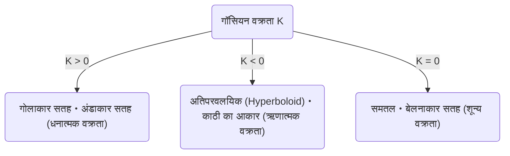
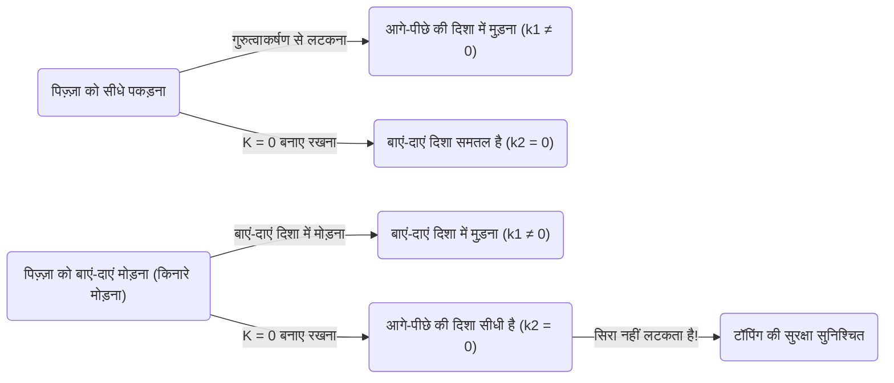

गणित की दुनिया में, पहली नज़र में अमूर्त और जटिल लगने वाली अवधारणाएँ कभी-कभी हमारे दैनिक जीवन की अप्रत्याशित स्थितियों में उपयोगी हो सकती हैं। इसका सबसे अच्छा उदाहरण कार्ल फ्रेडरिक गॉस द्वारा खोजा गया ** अद्भुत प्रमेय ** (Theorema Egregium) है। यह प्रमेय डिफरेंशियल ज्यामिति (Differential Geometry) के क्षेत्र में सबसे महत्वपूर्ण और सुंदर परिणामों में से एक के रूप में जाना जाता है।

इस लेख में, हम इस ** अद्भुत प्रमेय ** के गणितीय अर्थ से शुरू करके, सतह (Surface) क्या है, और यह प्रमेय पिज़्ज़ा खाते समय हमारे लिए इतना उपयोगी क्यों है, इस पर गहराई से विचार करेंगे।

## 1. गॉसियन वक्रता (Gaussian Curvature) क्या है?

अद्भुत प्रमेय को समझने के लिए, सबसे पहले "वक्रता" (Curvature) की अवधारणा को समझना आवश्यक है। किसी सतह के प्रत्येक बिंदु पर, सतह कितनी "झुकी" या "मुड़ी" हुई है, यह वक्रता को दर्शाता है।

किसी बिंदु पर वक्रता को मापने के लिए, उस बिंदु से गुजरने वाले विभिन्न तलों (Planes) के माध्यम से सतह को काटने का प्रयास करें। तब विभिन्न वक्र (Curves) प्राप्त होते हैं, जिनमें से सबसे अधिक मुड़ी हुई दिशा (अधिकतम मुख्य वक्रता $\kappa_1$) और सबसे कम मुड़ी हुई दिशा (न्यूनतम मुख्य वक्रता $\kappa_2$) होती है। गॉसियन वक्रता $K$ को इन 2 मुख्य वक्रताओं के गुणनफल के रूप में परिभाषित किया जाता है।

$$
K = \kappa_1 \cdot \kappa_2
$$

इस गॉसियन वक्रता $K$ के मान के आधार पर, सतह को उस बिंदु पर 3 प्रकारों में वर्गीकृत किया जाता है।

1. ** $K > 0$ (धनात्मक वक्रता) **: एक सतह जो एक गोले (Sphere) की तरह सभी दिशाओं में एक ही तरफ मुड़ी होती है।
2. ** $K < 0$ (ऋणात्मक वक्रता) **: घोड़े की काठी (Saddle) या आलू के चिप्स (Potato chips) की तरह, एक दिशा में ऊपर और दूसरी दिशा में नीचे मुड़ी हुई सतह।
3. ** $K = 0$ (शून्य वक्रता) **: एक समतल (Plane) या बेलन (Cylinder) की तरह, एक सतह जो कम से कम एक दिशा में बिल्कुल भी मुड़ी नहीं होती है (अर्थात एक सीधी रेखा होती है)।

## 2. अद्भुत प्रमेय (Theorema Egregium) का सार

1828 में, गॉस ने सतहों पर एक अभूतपूर्व शोध पत्र प्रकाशित किया। वहीं ** Theorema Egregium ** (लैटिन में "अद्भुत प्रमेय" का अर्थ) प्रस्तुत किया गया था। यह प्रमेय निम्नलिखित दावा करता है:

> "किसी सतह की गॉसियन वक्रता अपरिवर्तित रहती है, चाहे सतह को (बिना खींचे या फाड़े) कैसे भी मोड़ा जाए।"

दूसरे शब्दों में, गॉसियन वक्रता सतह का एक "आंतरिक" (Intrinsic) गुण है, और यह इस बात पर निर्भर नहीं करता है कि इसे आसपास के 3D स्थान (3D Space) में कैसे रखा गया है। जब तक आप सतह पर 2 बिंदुओं (मेट्रिक) के बीच की दूरी को माप सकते हैं, आप बाहरी स्थान को देखे बिना गॉसियन वक्रता की गणना कर सकते हैं।

यह अंतर्ज्ञान (Intuition) के विपरीत एक आश्चर्यजनक परिणाम था। ऐसा इसलिए है क्योंकि मुख्य वक्रता $\kappa_1$ और $\kappa_2$ स्वयं सतह के झुकने पर बदल जाती हैं। हालाँकि, उनका गुणनफल, $K$, कभी नहीं बदलता है।

### कागज को मोड़ने का उदाहरण

आइए एक सपाट कागज पर विचार करें। समतल की गॉसियन वक्रता $K = 0$ है। आइए इस कागज को मोड़कर एक बेलन (Cylinder) बनाते हैं। बेलन वृत्त की परिधि की दिशा में मुड़ा हुआ है ($\kappa_1 \neq 0$), लेकिन यह लंबी धुरी (Long axis) की दिशा में सीधा है ($\kappa_2 = 0$)। इसलिए, गॉसियन वक्रता $K = \kappa_1 \cdot 0 = 0$ हो जाती है, जो एक समतल की तरह ही वक्रता बनाए रखती है।

यही कारण है कि हम एक कागज को बिना फाड़े बेलन या शंकु (Cone) में मोड़ सकते हैं। इसके विपरीत, एक गोले की गॉसियन वक्रता $K > 0$ होती है, इसलिए किसी समतल कागज को बिना झुर्रियां (Wrinkles) बनाए एक गोले पर लपेटना असंभव है। दुनिया के नक्शे (World Map) को एक समतल पर सटीक रूप से न बना पाने (दूरी और क्षेत्र की विकृति होती है) का कारण भी यही ** अद्भुत प्रमेय ** है।

## 3. पिज़्ज़ा का प्रमेय: दैनिक जीवन में छिपी डिफरेंशियल ज्यामिति

खैर, यहाँ से एक बहुत ही दिलचस्प अनुप्रयोग शुरू होता है। जब आप पिज़्ज़ा का एक पतला और बड़ा टुकड़ा (Slice) खाते हैं, तो आप उसे कैसे पकड़ते हैं? यदि आप इसे किनारों से ही पकड़ते हैं, तो सिरा नीचे लटक जाएगा, टॉपिंग (Toppings) गिर जाएगी और यह एक बड़ी आपदा बन जाएगी।

इसे रोकने के लिए, बहुत से लोग अनजाने में ** पिज़्ज़ा के किनारे को U-आकार में हल्का सा मोड़कर ** पकड़ते हैं। ऐसा करने पर पिज़्ज़ा का सिरा नीचे लटकना क्यों बंद कर देता है?

यहाँ ** अद्भुत प्रमेय ** का प्रवेश होता है।

एक समतल मेज पर रखे पिज़्ज़ा के स्लाइस की गॉसियन वक्रता $K = 0$ होती है। जब आप पिज़्ज़ा उठाते हैं, तब भी (जब तक कि आटा खिंचता या सिकुड़ता नहीं है) अद्भुत प्रमेय के अनुसार इसकी गॉसियन वक्रता को $K = 0$ ही रहना चाहिए।

$$
K = \kappa_1 \cdot \kappa_2 = 0
$$

इस समीकरण का अर्थ यह है कि, "किसी भी बिंदु पर, कम से कम एक दिशा की मुख्य वक्रता शून्य होनी चाहिए (अर्थात, एक दिशा में एक सीधी रेखा बनाए रखनी चाहिए)।"

यदि आप पिज़्ज़ा को समतल (Flat) पकड़ते हैं, तो गुरुत्वाकर्षण के कारण सिरा नीचे की ओर झुक जाएगा (उदाहरण के लिए, आगे-पीछे की दिशा में $\kappa_1 \neq 0$)। समीकरण $K = 0$ को संतुष्ट करने के लिए, बाएं-दाएं दिशा ($\kappa_2$) का $0$ होना (सीधा होना) आवश्यक है, लेकिन यह पिज़्ज़ा को नीचे लटकने से नहीं रोकता है।

लेकिन, अगर आप किनारों को बाएँ और दाएँ घाटी (Valley fold) की तरह मोड़ें तो क्या होगा?

इस समय, आपने जानबूझकर बाएँ और दाएँ दिशाओं में वक्रता ($\kappa_1 \neq 0$) दी है। प्रमेय के अनुसार, समग्र $K$ शून्य ($0$) होना चाहिए, इसलिए अनिवार्य रूप से दूसरी दिशा (अर्थात आगे और पीछे की दिशा) की वक्रता $\kappa_2$ को बलपूर्वक $0$ कर दिया जाता है।

दूसरे शब्दों में, पिज़्ज़ा को क्षैतिज रूप से मोड़ने पर, गणितीय नियम पिज़्ज़ा को लंबवत रूप से सीधा (कठोर) रखने का काम करता है, जिससे इसके सिरे का नीचे लटकना भौतिक रूप से असंभव हो जाता है। यह सिर्फ एक अनुभवजन्य नियम (Rule of thumb) नहीं है, बल्कि ब्रह्मांड के ज्यामितीय नियमों द्वारा शासित एक आदर्श समाधान है।

## 4. अद्भुत प्रमेय के और अधिक अनुप्रयोग और गहराई

पिज़्ज़ा खाने के तरीके के अलावा, यह सिद्धांत इंजीनियरिंग, वास्तुकला और प्रकृति में हर जगह देखा जा सकता है।

- ** नालीदार लोहे की चादरें और कार्डबोर्ड (Corrugated iron & Cardboard) **: समतल चादरों को लहरदार (Corrugated) आकार में संसाधित करके, उन्हें एक निश्चित दिशा में वक्रता दी जाती है, जो उस लंबवत दिशा में उनकी कठोरता (मुड़ने का प्रतिरोध) को काफी बढ़ा देती है।
- ** पौधों की पत्तियां **: कई पौधों की पत्तियां और पंखुड़ियां हवा और अपने वजन का सामना करने के लिए स्वाभाविक रूप से लहरदार (Wavy) आकार में विकसित हुई हैं।
- ** इमारतें (Buildings) **: शेल स्ट्रक्चर (Shell structures) जैसी इमारतें, जो पतली सामग्रियों का उपयोग करके बड़ी जगहों को कवर करती हैं, वे घुमावदार सतहों की यांत्रिक शक्ति और ज्यामितीय गुणों का लाभ उठाती हैं।

गॉस द्वारा खोजे गए इस प्रमेय को बाद में उनके छात्र बर्नहार्ड रीमैन (Bernhard Riemann) द्वारा उच्च-आयामी मैनिफोल्ड्स (High-dimensional manifolds) में विस्तारित किया गया (रीमैनियन ज्यामिति), और अंततः अल्बर्ट आइंस्टीन के सामान्य सापेक्षता के सिद्धांत (General Theory of Relativity) में, गुरुत्वाकर्षण को "स्पेस-टाइम की विकृति (Distortion of spacetime)" के रूप में वर्णित करने के लिए गणितीय आधार बन गया।

## 5. निष्कर्ष

अनजाने में "पिज़्ज़ा के किनारे मोड़ने" की हमारी क्रिया के पीछे गहरे और सुंदर गणितीय नियम छिपे हुए हैं, जो आइंस्टीन की ब्रह्मांड विज्ञान (Cosmology) तक भी पहुँचते हैं।

** अद्भुत प्रमेय ** इसका सबसे स्वादिष्ट और समझने में आसान उदाहरण है कि कैसे अमूर्त गणित भौतिक दुनिया को नियंत्रित करता है। अगली बार जब आप पिज़्ज़ा खाएं, तो कार्ल फ्रेडरिक गॉस और उनकी महान खोज को याद करते हुए, पूरी तरह से मुड़े हुए स्लाइस का आनंद लें।
