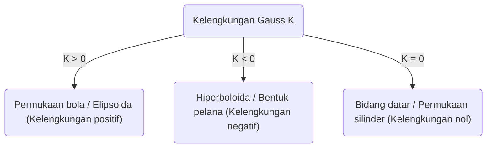
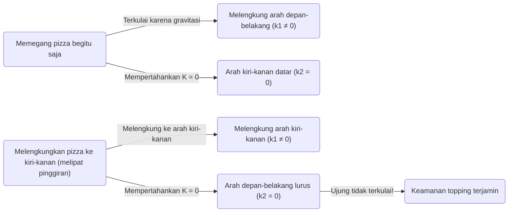

Dalam dunia matematika, konsep yang sekilas terlihat abstrak dan sulit dipahami terkadang berguna di situasi yang tidak terduga dalam kehidupan sehari-hari kita. Salah satu contoh terbaik dari hal ini adalah ** Teorema Mengagumkan ** (Theorema Egregium) yang ditemukan oleh Carl Friedrich Gauss. Teorema ini dikenal sebagai salah satu hasil paling penting dan indah dalam bidang geometri diferensial.

Pada artikel ini, kita akan menggali lebih dalam, mulai dari makna matematis dari ** Teorema Mengagumkan ** ini, apa itu permukaan lengkung, hingga mengapa teorema ini sangat berguna ketika kita makan pizza.

## 1. Apa itu Kelengkungan Gauss?

Untuk memahami teorema yang mengagumkan ini, pertama-tama kita perlu memahami konsep "kelengkungan". Kelengkungan adalah indikator yang menunjukkan seberapa "melengkung" suatu permukaan pada setiap titik di permukaannya.

Untuk mengukur kelengkungan di suatu titik, kita mencoba memotong permukaan tersebut dengan berbagai bidang datar yang melewati titik tersebut. Dengan melakukan itu, kita mendapatkan berbagai kurva, dan di antara kurva-kurva tersebut ada arah dengan lengkungan paling tajam (kelengkungan utama maksimum $\kappa_1$) dan arah dengan lengkungan paling landai (kelengkungan utama minimum $\kappa_2$). Kelengkungan Gauss $K$ didefinisikan sebagai hasil kali dari kedua kelengkungan utama ini.

$$
K = \kappa_1 \cdot \kappa_2
$$

Berdasarkan nilai Kelengkungan Gauss $K$ ini, permukaan diklasifikasikan menjadi 3 jenis pada titik tersebut.

1. ** $K > 0$ (Kelengkungan positif) **: Permukaan yang melengkung ke sisi yang sama di semua arah, seperti permukaan bola.
2. ** $K < 0$ (Kelengkungan negatif) **: Permukaan yang melengkung ke atas di satu arah, dan melengkung ke bawah di arah lain, seperti pelana kuda atau keripik kentang.
3. ** $K = 0$ (Kelengkungan nol) **: Permukaan yang sama sekali tidak melengkung (berupa garis lurus) setidaknya di satu arah, seperti bidang datar atau silinder.

## 2. Esensi dari Theorema Egregium (Teorema Mengagumkan)

Pada tahun 1828, Gauss menerbitkan sebuah makalah terobosan mengenai permukaan melengkung. Di sanalah ** Theorema Egregium ** (bahasa Latin yang berarti "Teorema Mengagumkan") diperkenalkan. Teorema ini menyatakan hal berikut:

> "Kelengkungan Gauss dari sebuah permukaan adalah invarian (tidak berubah) tidak peduli bagaimana permukaan tersebut dibengkokkan (tanpa diregangkan atau dirobek)."

Dengan kata lain, kelengkungan Gauss adalah sifat "intrinsik" dari sebuah permukaan, dan tidak bergantung pada bagaimana permukaan tersebut ditempatkan di ruang 3 dimensi di sekitarnya. Selama kita dapat mengukur jarak (metrik) antara dua titik pada permukaan, kita dapat menghitung kelengkungan Gauss tanpa harus melihat ruang luarnya.

Ini adalah hasil mengejutkan yang berlawanan dengan intuisi. Sebab, kelengkungan utama $\kappa_1$ dan $\kappa_2$ itu sendiri akan berubah jika permukaannya dibengkokkan. Namun, hasil kalinya, yaitu $K$, tidak akan pernah berubah.

### Contoh Menggulung Kertas

Mari kita bayangkan selembar kertas datar. Kelengkungan Gauss dari bidang datar adalah $K = 0$. Kita akan mencoba menggulung kertas ini untuk membuat sebuah silinder. Silinder tersebut melengkung di sepanjang arah keliling lingkaran ($\kappa_1 \neq 0$), tetapi lurus di sepanjang arah sumbu panjangnya ($\kappa_2 = 0$). Oleh karena itu, kelengkungan Gauss-nya menjadi $K = \kappa_1 \cdot 0 = 0$, yang mempertahankan kelengkungan yang sama dengan bidang datar.

Inilah sebabnya mengapa kita dapat menggulung kertas menjadi silinder atau kerucut tanpa merobeknya. Sebaliknya, karena kelengkungan Gauss dari permukaan bola adalah $K > 0$, mustahil untuk membungkus bola dengan kertas datar tanpa membuat lipatan atau kerutan. Fakta bahwa peta dunia tidak dapat digambar dengan akurat pada bidang datar (terdapat distorsi jarak atau luas) juga tepat disebabkan oleh ** Teorema Mengagumkan ** ini.

## 3. Teorema Pizza: Geometri Diferensial yang Tersembunyi dalam Kehidupan Sehari-hari

Nah, dari sinilah penerapan yang sangat menarik dimulai. Bagaimana cara Anda memegang sepotong pizza yang tipis dan besar saat memakannya? Jika Anda memegangnya di bagian ujung pinggiran begitu saja, ujung depannya akan jatuh terkulai, dan topping-nya akan tumpah berjatuhan menjadi bencana.

Untuk mencegah hal ini, banyak orang secara tidak sadar memegang pizza dengan ** melipat sedikit bagian pinggirannya menjadi bentuk huruf U **. Mengapa dengan melakukan ini ujung pizza tidak lagi jatuh terkulai?

Di sinilah ** Teorema Mengagumkan ** muncul.

Sepotong pizza yang diletakkan di atas meja datar memiliki kelengkungan Gauss $K = 0$. Bahkan saat Anda mengambil pizza tersebut, (selama adonannya tidak meregang atau menyusut) menurut Teorema Mengagumkan, kelengkungan Gauss-nya harus tetap dipertahankan pada $K = 0$.

$$
K = \kappa_1 \cdot \kappa_2 = 0
$$

Persamaan ini berarti bahwa "di titik mana pun, setidaknya salah satu arah kelengkungan utamanya harus nol (dengan kata lain, harus mempertahankan garis lurus pada suatu arah)".

Jika Anda memegang pizza dalam keadaan datar, gaya gravitasi akan membuat ujungnya melengkung ke bawah (misalnya $\kappa_1 \neq 0$ pada arah depan-belakang). Untuk memenuhi persamaan $K = 0$, arah kiri-kanan ($\kappa_2$) harus menjadi $0$ (menjadi lurus), namun hal ini tidak mencegah pizza jatuh terkulai ke bawah.

Lalu, apa yang terjadi jika Anda melipat bagian pinggirannya ke arah kiri dan kanan (lipatan lembah)?
Pada saat ini, Anda secara sengaja memberikan kelengkungan ($\kappa_1 \neq 0$) pada arah kiri-kanan. Menurut teorema tersebut, karena $K$ secara keseluruhan harus bernilai $0$, maka secara tak terelakkan kelengkungan pada arah yang satu lagi (yaitu arah depan-belakang) $\kappa_2$ dipaksa menjadi $0$.

Dengan kata lain, dengan melengkungkan pizza ke arah samping, hukum matematis bekerja untuk menjaga pizza tetap lurus (kaku) ke arah depan, membuat ujungnya secara fisik mustahil untuk jatuh terkulai. Ini bukan sekadar aturan praktis belaka, melainkan solusi sempurna yang mengikuti hukum geometris alam semesta.

## 4. Aplikasi Lebih Lanjut dan Kedalaman dari Teorema Mengagumkan

Tidak hanya pada cara makan pizza, prinsip ini juga dapat ditemukan di mana-mana dalam teknik, arsitektur, dan alam.

- ** Pelat besi bergelombang / Kardus **: Dengan memproses pelat datar menjadi bentuk bergelombang, kelengkungan diberikan pada satu arah, yang secara drastis meningkatkan kekakuan (ketahanan terhadap lengkungan) pada arah tegak lurusnya.
- ** Daun tanaman **: Banyak daun dan kelopak bunga secara alami berevolusi menjadi bentuk bergelombang untuk menahan angin dan beratnya sendiri.
- ** Bangunan **: Pada struktur bangunan yang menutupi ruang besar dengan material tipis, seperti struktur cangkang (shell), kekuatan mekanis dan sifat geometris dari permukaan melengkung dimanfaatkan.

Teorema yang ditemukan oleh Gauss ini, kemudian diperluas ke manifold berdimensi tinggi oleh muridnya, Bernhard Riemann (Geometri Riemann), dan pada akhirnya menjadi fondasi matematis dalam Teori Relativitas Umum Albert Einstein untuk mendeskripsikan gravitasi sebagai "lengkungan ruang-waktu".

## 5. Penutup

Di balik tindakan "melipat pinggiran pizza" yang kita lakukan secara tidak sadar, tersembunyi hukum matematika yang mendalam dan indah, yang bahkan terhubung dengan kosmologi Einstein.

** Teorema Mengagumkan ** bisa dikatakan sebagai contoh yang paling lezat dan mudah dipahami yang menunjukkan bagaimana matematika abstrak menguasai dunia nyata. Saat Anda makan pizza berikutnya, silakan nikmati potongan yang dilipat ke dalam bentuk sempurna sambil mengenang Carl Friedrich Gauss dan penemuannya yang luar biasa.
