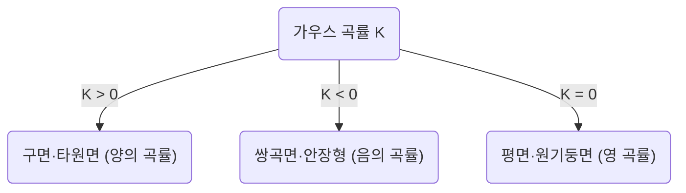
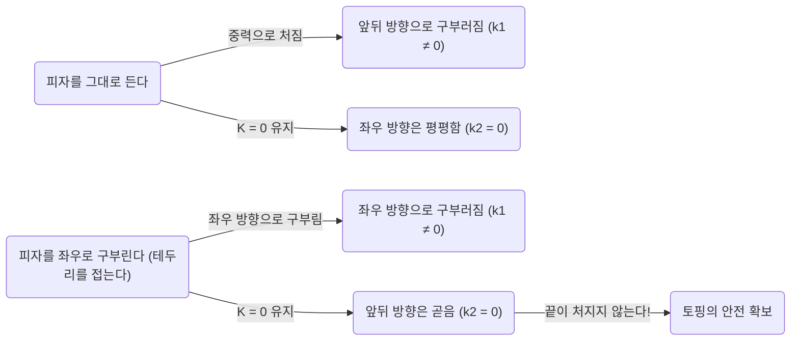

수학의 세계에서는 일견 추상적이고 난해한 개념이 우리의 일상생활 중 뜻밖의 상황에서 도움이 되는 경우가 있습니다. 그 대표적인 예 중 하나가 칼 프리드리히 가우스가 발견한 **경이로운 정리** (Theorema Egregium)입니다. 이 정리는 미분 기하학이라는 분야에서 가장 중요하고 아름다운 결과 중 하나로 알려져 있습니다.

본 기사에서는 이 **경이로운 정리** 의 수학적 의미에서 시작하여, 곡면이란 무엇인지, 그리고 왜 이 정리가 우리가 피자를 먹을 때 매우 유용하게 쓰이는지까지 깊이 파헤쳐 보겠습니다.

## 1. 가우스 곡률이란 무엇인가?

경이로운 정리를 이해하기 위해서는 먼저 '곡률'이라는 개념을 이해할 필요가 있습니다. 곡면 상의 각 점에서 면이 얼마나 '구부러져 있는지'를 나타내는 지표가 곡률입니다.

어떤 점에서의 구부러진 정도를 측정하기 위해 그 점을 지나는 다양한 평면으로 곡면을 절단해 봅니다. 그러면 다양한 곡선이 얻어지는데, 그중에서 가장 급격하게 구부러진 방향(최대 주곡률 $\kappa_1$)과 가장 완만하게 구부러진 방향(최소 주곡률 $\kappa_2$)이 존재합니다. 가우스 곡률 $K$ 는 이 두 주곡률의 곱으로 정의됩니다.

$$
K = \kappa_1 \cdot \kappa_2
$$

이 가우스 곡률 $K$ 의 값에 따라 곡면은 그 점에서 세 가지 유형으로 분류됩니다.

1. **$K > 0$(양의 곡률)**: 구면과 같이 모든 방향으로 같은 쪽으로 구부러진 면.
2. **$K < 0$(음의 곡률)**: 말안장(새들)이나 감자칩과 같이 어떤 방향으로는 위로, 다른 방향으로는 아래로 구부러진 면.
3. **$K = 0$(영 곡률)**: 평면이나 원기둥과 같이 적어도 한 방향으로는 전혀 구부러지지 않은(직선으로 되어 있는) 면.

## 2. 경이로운 정리(Theorema Egregium)의 진수

1828년, 가우스는 곡면에 관한 획기적인 논문을 발표했습니다. 거기서 제시된 것이 **Theorema Egregium** (라틴어로 '경이로운 정리'라는 의미)입니다. 이 정리는 다음과 같이 주장합니다.

> "곡면의 가우스 곡률은 곡면을 (늘이거나 찢지 않고) 어떻게 구부리더라도 불변이다"

바꿔 말하면, 가우스 곡률은 곡면에 '내재적인' 성질이며, 주위의 3차원 공간에 어떻게 놓여 있는지에 의존하지 않는다는 것입니다. 곡면 상의 두 점 사이의 거리(계량)만 측정할 수 있다면, 바깥 공간을 보지 않고도 가우스 곡률을 계산할 수 있습니다.

이는 직관에 반하는 놀라운 결과였습니다. 왜냐하면 주곡률 $\kappa_1$ 과 $\kappa_2$ 자체는 곡면을 구부리면 변화하기 때문입니다. 그러나 그들의 곱인 $K$ 는 결코 변하지 않습니다.

### 종이를 마는 예

평평한 종이를 생각해 봅시다. 평면의 가우스 곡률은 $K = 0$ 입니다. 이 종이를 말아서 원기둥을 만들어 봅니다. 원기둥은 원의 둘레 방향으로는 구부러져 있지만($\kappa_1 \neq 0$), 장축 방향으로는 곧습니다($\kappa_2 = 0$). 따라서 가우스 곡률은 $K = \kappa_1 \cdot 0 = 0$ 이 되어, 평면과 동일한 곡률을 유지합니다.

이것이 우리가 종이를 찢지 않고 원기둥이나 원뿔로 말 수 있는 이유입니다. 반대로 구면의 가우스 곡률은 $K > 0$ 이기 때문에, 평평한 종이로 주름을 만들지 않고 구를 감싸는 것은 불가능합니다. 세계 지도를 평면에 정확하게 그릴 수 없는(거리나 면적의 왜곡이 발생하는) 것도 바로 이 **경이로운 정리** 가 원인인 것입니다.

## 3. 피자 정리: 일상에 숨어 있는 미분 기하학

자, 지금부터가 매우 흥미로운 응용입니다. 여러분은 얇고 큰 조각의 피자를 먹을 때 어떻게 잡습니까? 그대로 끝을 잡으면 끝부분이 축 처져서 토핑이 떨어지는 대참사가 발생하고 맙니다.

이를 방지하기 위해 많은 사람들은 무의식중에 **피자의 테두리 부분을 U자 모양으로 가볍게 접어서** 잡을 것입니다. 왜 이렇게 하면 피자의 끝이 처지지 않는 것일까요?

여기서 **경이로운 정리** 가 등장합니다.

평평한 테이블 위에 놓인 피자 조각은 가우스 곡률 $K = 0$ 입니다. 피자를 손에 들더라도 (도우가 늘어나거나 줄어들지 않는 한) 경이로운 정리에 의해 그 가우스 곡률은 $K = 0$ 그대로 유지되어야 합니다.

$$
K = \kappa_1 \cdot \kappa_2 = 0
$$

이 방정식이 의미하는 것은 "어느 점에서든 적어도 한 방향의 주곡률은 0이어야 한다(즉, 어떤 방향으로는 곧은 직선을 유지해야 한다)"는 것입니다.

피자를 평평한 채로 들면 중력에 의해 끝이 아래를 향해 구부러집니다(예를 들어 앞뒤 방향으로 $\kappa_1 \neq 0$). 방정식 $K = 0$ 을 만족하기 위해서는 좌우 방향($\kappa_2$)이 $0$ 이 될(곧아질) 필요가 있지만, 이는 피자가 아래로 처지는 것을 막지 못합니다.

하지만 테두리 부분을 좌우로 계곡 접기 하듯이 접으면 어떻게 될까요?
이때 당신은 좌우 방향으로 의도적으로 곡률($\kappa_1 \neq 0$)을 준 것이 됩니다. 정리에 따르면 전체로서의 $K$ 는 $0$ 이어야 하기 때문에, 필연적으로 다른 한 방향(즉 앞뒤 방향)의 곡률 $\kappa_2$ 가 강제적으로 $0$ 이 됩니다.

즉, 피자를 가로 방향으로 구부림으로써, 수학적인 법칙이 피자를 세로 방향으로 곧게(단단하게) 유지하도록 작용하여, 끝이 처지는 것을 물리적으로 불가능하게 만드는 것입니다. 이것은 단순한 경험 법칙이 아니라, 우주의 기하학적 법칙을 따른 완벽한 해결책인 것입니다.

## 4. 경이로운 정리의 더 깊은 응용과 심연

피자 먹는 법뿐만 아니라 이 원리는 공학이나 건축, 자연계의 곳곳에서 볼 수 있습니다.

- **골판 철판·골판지**: 평평한 판을 물결 모양으로 가공함으로써 어떤 방향에 대해 곡률을 부여하고, 그 수직 방향에 대한 강성(구부러지기 어려움)을 비약적으로 높이고 있습니다.
- **식물의 잎**: 많은 식물의 잎이나 꽃잎은 바람이나 자체 무게를 견디기 위해 자연스럽게 물결치는 듯한 모양으로 진화했습니다.
- **건축물**: 쉘 구조 등 얇은 재료로 큰 공간을 덮는 건축물에는 곡면이 가지는 역학적인 강도와 기하학적인 성질이 활용되고 있습니다.

가우스가 발견한 이 정리는 훗날 제자인 베른하르트 리만(Bernhard Riemann)에 의해 고차원 다양체로 확장되었고(리만 기하학), 이윽고 알베르트 아인슈타인의 일반 상대성 이론에서 중력을 '시공간의 왜곡'으로 기술하기 위한 수학적 기초가 되었습니다.

## 5. 맺음말

우리가 무의식적으로 행하고 있는 '피자 테두리 접기'라는 행위의 이면에는 아인슈타인의 우주론에까지 이어지는, 깊고 아름다운 수학의 법칙이 숨겨져 있었습니다.

**경이로운 정리** 는 추상적인 수학이 어떻게 현실 세계를 지배하고 있는지를 보여주는, 가장 맛있고 알기 쉬운 예라고 할 수 있을 것입니다. 다음에 피자를 먹을 때는 꼭 칼 프리드리히 가우스와 그의 위대한 발견을 떠올리며, 완벽한 형태로 접은 조각을 맛보시길 바랍니다.
