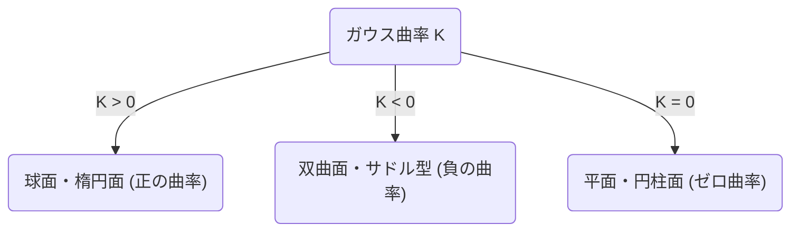
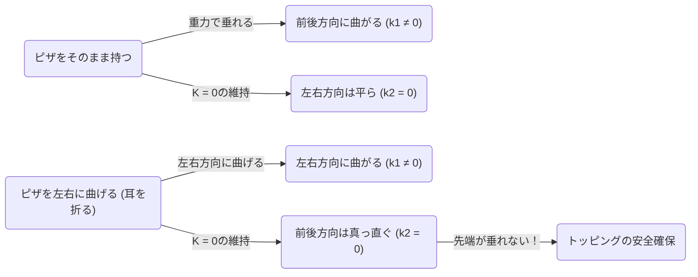

数学の世界には、一見すると抽象的で難解な概念が、私たちの日常生活の思わぬ場面で役立つことがあります。その最たる例の一つが、カール・フリードリヒ・[ガウス](https://kenji.blog/p/gauss/)が発見した **驚異の定理** （Theorema Egregium）です。この定理は、微分幾何学という分野における最も重要で美しい結果の一つとして知られています。

本記事では、この **驚異の定理** の数学的な意味から始まり、曲面とは何か、そしてなぜこの定理が私たちがピザを食べる時に非常に役立つのかまで、深く掘り下げていきます。

## 1. [ガウス](https://kenji.blog/p/gauss/)曲率とは何か？

驚異の定理を理解するためには、まず「曲率」という概念を理解する必要があります。曲面上の各点において、面がどれくらい「曲がっているか」を示す指標が曲率です。

ある点での曲がり具合を測るために、その点を通る様々な平面で曲面を切断してみます。すると、様々な曲線が得られますが、その中で最もきつく曲がっている方向（最大主曲率 $\kappa_1$）と、最も緩やかに曲がっている方向（最小主曲率 $\kappa_2$）が存在します。[ガウス](https://kenji.blog/p/gauss/)曲率 $K$ は、これら2つの主曲率の積として定義されます。

$$
K = \kappa_1 \cdot \kappa_2
$$

この[ガウス](https://kenji.blog/p/gauss/)曲率 $K$ の値によって、曲面はその点において3つのタイプに分類されます。

1. **$K > 0$（正の曲率）**: 球面のように、すべての方向に同じ側に曲がっている面。
2. **$K < 0$（負の曲率）**: 馬の鞍（サドル）やポテトチップスのように、ある方向には上に、別の方向には下に曲がっている面。
3. **$K = 0$（ゼロ曲率）**: 平面や円柱のように、少なくとも一つの方向には全く曲がっていない（直線となっている）面。

## 2. 驚異の定理（Theorema Egregium）の真髄

1828年、[ガウス](https://kenji.blog/p/gauss/)は曲面に関する画期的な論文を発表しました。そこで示されたのが **Theorema Egregium** （ラテン語で「驚異の定理」の意味）です。この定理は次のように主張します。

> 「曲面の[ガウス](https://kenji.blog/p/gauss/)曲率は、曲面を（引き伸ばしたり破いたりせずに）どのように曲げても不変である」

言い換えれば、[ガウス](https://kenji.blog/p/gauss/)曲率は曲面に「内在的」な性質であり、周囲の3次元空間にどのように置かれているかには依存しないということです。曲面上の2点間の距離（計量）さえ測定できれば、外側の空間を見なくても[ガウス](https://kenji.blog/p/gauss/)曲率を計算できるのです。

これは直感に反する驚くべき結果でした。なぜなら、主曲率 $\kappa_1$ と $\kappa_2$ 自体は、曲面を曲げると変化するからです。しかし、それらの積である $K$ は、決して変化しません。

### 紙を丸める例

平らな紙を考えてみましょう。平面の[ガウス](https://kenji.blog/p/gauss/)曲率は $K = 0$ です。この紙を丸めて円柱を作ってみます。円柱は、円の周り方向には曲がっていますが（$\kappa_1 \neq 0$）、長軸方向には真っ直ぐです（$\kappa_2 = 0$）。したがって、[ガウス](https://kenji.blog/p/gauss/)曲率は $K = \kappa_1 \cdot 0 = 0$ となり、平面と同じ曲率を保ちます。

これが、私たちが紙を破かずに円柱や円錐に丸めることができる理由です。逆に、球面の[ガウス](https://kenji.blog/p/gauss/)曲率は $K > 0$ であるため、平らな紙でシワを作らずに球を包むことは不可能です。世界地図を平面に正確に描くことができない（距離や面積の歪みが生じる）のも、まさにこの **驚異の定理** が原因なのです。

## 3. ピザの定理：日常に潜む微分幾何学

さて、ここからが非常に興味深い応用です。皆さんは、薄くて大きなスライスのピザを食べる時、どのように持ちますか？そのまま端を持つと、先端が垂れ下がってしまい、トッピングが落ちて大惨事になってしまいます。

これを防ぐために、多くの人は無意識のうちに **ピザの耳の部分をU字型に軽く折り曲げて** 持つはずです。なぜこうするとピザの先端は垂れ下がらなくなるのでしょうか？

ここで **驚異の定理** が登場します。

平らなテーブルの上に置かれたピザのスライスは、[ガウス](https://kenji.blog/p/gauss/)曲率 $K = 0$ です。ピザを手に取っても、（生地が伸び縮みしない限り）驚異の定理により、その[ガウス](https://kenji.blog/p/gauss/)曲率は $K = 0$ のまま保たれなければなりません。

$$
K = \kappa_1 \cdot \kappa_2 = 0
$$

この方程式が意味するのは、「どの点においても、少なくとも1つの方向の主曲率はゼロでなければならない（つまり、ある方向には真っ直ぐな直線を保たなければならない）」ということです。

ピザを平らなまま持つと、重力によって先端が下に向かって曲がります（例えば前後の方向で $\kappa_1 \neq 0$）。方程式 $K = 0$ を満たすためには、左右の方向（$\kappa_2$）が $0$ になる（真っ直ぐになる）必要がありますが、これはピザが下に垂れ下がることを防ぎません。

しかし、耳の部分を左右に谷折りに曲げるとどうなるでしょうか？
この時、あなたは左右の方向に意図的に曲率（$\kappa_1 \neq 0$）を与えたことになります。定理によれば、全体としての $K$ は $0$ でなければならないため、必然的にもう一つの方向（つまり前後方向）の曲率 $\kappa_2$ が強制的に $0$ になります。

つまり、ピザを横方向に曲げることで、数学的な法則がピザを縦方向に真っ直ぐ（硬く）保つように働き、先端が垂れ下がるのを物理的に不可能にするのです。これは単なる経験則ではなく、宇宙の幾何学的法則に従った完璧な解決策なのです。

## 4. 驚異の定理の更なる応用と深淵

ピザの食べ方だけでなく、この原理は工学や建築、自然界の至る所で見られます。

- **波板鉄板・段ボール**: 平らな板を波状に加工することで、ある方向に対して曲率を与え、その垂直方向に対する剛性（曲がりにくさ）を飛躍的に高めています。
- **植物の葉**: 多くの植物の葉や花びらは、風や自重に耐えるために、自然に波打つような形状に進化しています。
- **建築物**: シェル構造など、薄い材料で大きな空間を覆う建築物には、曲面が持つ力学的な強度と幾何学的な性質が活用されています。

[ガウス](https://kenji.blog/p/gauss/)が発見したこの定理は、後に弟子のベルンハルト・リーマンによって高次元の多様体へと拡張され（[リーマン](https://kenji.blog/p/riemann/)幾何学）、やがてアルベルト・アインシュタインの一般相対性理論において、重力を「時空の歪み」として記述するための数学的基礎となりました。

## 5. 終わりに

私たちが無意識に行っている「ピザの耳を折る」という行為の背後には、アインシュタインの宇宙論にまで繋がる、深く美しい数学の法則が隠されていました。

**驚異の定理** は、抽象的な数学がいかにして現実世界を支配しているかを示す、最も美味しくて分かりやすい例と言えるでしょう。次にピザを食べる時は、ぜひカール・フリードリヒ・[ガウス](https://kenji.blog/p/gauss/)と彼の偉大な発見に思いを馳せながら、完璧な形に折り曲げたスライスを味わってみてください。
