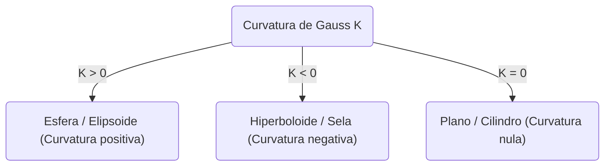
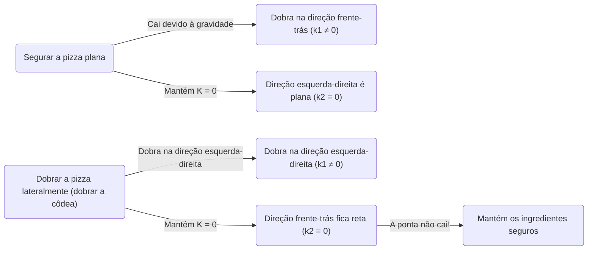

No mundo da matemática, conceitos aparentemente abstratos e difíceis podem por vezes ser úteis em situações inesperadas da nossa vida quotidiana. Um dos melhores exemplos disto é o ** Teorema Notável ** (Theorema Egregium) descoberto por [Carl Friedrich Gauss](https://kenji.blog/pt/p/gauss/). Este teorema é conhecido como um dos resultados mais importantes e belos no campo da geometria diferencial.

Neste artigo, aprofundaremos o significado matemático deste ** Teorema Notável **, o que é uma superfície, e por que este teorema é extremamente útil quando comemos pizza.

## 1. O que é a Curvatura de Gauss?

Para entender o teorema notável, primeiro precisamos de entender o conceito de "curvatura". Em cada ponto de uma superfície, a curvatura é uma medida de quão "curvada" a superfície está.

Para medir a curvatura num ponto, tentamos cortar a superfície com vários planos que passam por esse ponto. Isso resulta em várias curvas, mas entre elas existe a direção da curvatura mais apertada (curvatura principal máxima $\kappa_1$) e a direção da curvatura mais suave (curvatura principal mínima $\kappa_2$). A curvatura de Gauss $K$ é definida como o produto destas duas curvaturas principais.

$$
K = \kappa_1 \cdot \kappa_2
$$

Dependendo do valor desta curvatura de Gauss $K$, a superfície classifica-se em três tipos nesse ponto:

1. ** $K > 0$ (curvatura positiva) **: Uma superfície que se curva para o mesmo lado em todas as direções, como uma esfera.
2. ** $K < 0$ (curvatura negativa) **: Uma superfície que se curva para cima numa direção e para baixo noutra, como uma sela de cavalo ou uma batata frita.
3. ** $K = 0$ (curvatura nula) **: Uma superfície que não tem nenhuma curvatura (é uma linha reta) em pelo menos uma direção, como um plano ou um cilindro.

## 2. A Essência do Theorema Egregium

Em 1828, Gauss publicou um artigo inovador sobre superfícies. Nele apresentou o ** Theorema Egregium ** (que significa "Teorema Notável" em latim). Este teorema afirma o seguinte:

> "A curvatura de Gauss de uma superfície é invariante, independentemente de como a superfície é dobrada (sem esticar nem rasgar)."

Por outras palavras, a curvatura de Gauss é uma propriedade "intrínseca" à superfície, e não depende de como está colocada no espaço tridimensional circundante. Desde que possamos medir a distância (a métrica) entre dois pontos na superfície, podemos calcular a curvatura de Gauss sem olhar para o espaço exterior.

Este foi um resultado surpreendente e contra-intuitivo. Porque as próprias curvaturas principais $\kappa_1$ e $\kappa_2$ mudam quando dobramos a superfície. No entanto, o seu produto, $K$, nunca muda.

### Exemplo de enrolar papel

Considere um papel plano. A curvatura de Gauss do plano é $K = 0$. Tentemos enrolar este papel para fazer um cilindro. O cilindro está curvado em torno do círculo ($\kappa_1 \neq 0$), mas é reto ao longo do seu eixo longo ($\kappa_2 = 0$). Portanto, a curvatura de Gauss é $K = \kappa_1 \cdot 0 = 0$, mantendo a mesma curvatura do plano.

Esta é a razão pela qual podemos enrolar papel em cilindros ou cones sem o rasgar. Inversamente, como a curvatura de Gauss de uma esfera é $K > 0$, é impossível embrulhar uma esfera com papel plano sem fazer vincos. O facto de não podermos desenhar com precisão um mapa do mundo num plano (causando distorções na distância e área) é precisamente devido a este ** Teorema Notável **.

## 3. O Teorema da Pizza: Geometria Diferencial no Quotidiano

Agora, aqui está uma aplicação fascinante. Como pega quando come uma fatia fina e grande de pizza? Se pegar simplesmente pela extremidade, a ponta descairá, os ingredientes cairão, e será um desastre.

Para evitar isto, a maioria das pessoas dobra inconscientemente ** a côdea da pizza ligeiramente em forma de U ** ao segurá-la. Porque é que isto impede a ponta da pizza de descair?

Aqui entra o ** Teorema Notável **.

Uma fatia de pizza pousada numa mesa plana tem uma curvatura de Gauss $K = 0$. Mesmo quando pega na pizza, de acordo com o teorema notável (desde que a massa não estique nem encolha), a sua curvatura de Gauss deve permanecer $K = 0$.

$$
K = \kappa_1 \cdot \kappa_2 = 0
$$

O que esta equação significa é que "em qualquer ponto, a curvatura principal em pelo menos uma direção deve ser zero (ou seja, deve manter-se reta numa determinada direção)".

Se segurar a pizza plana, a gravidade faz com que a ponta se curve para baixo (por exemplo, na direção de trás para a frente $\kappa_1 \neq 0$). Para satisfazer a equação $K = 0$, a direção esquerda-direita ($\kappa_2$) deve tornar-se $0$ (ficar reta), mas isto não impede que a pizza descaia para baixo.

Mas o que acontece se dobrar a côdea com um vinco de vale na direção esquerda-direita?
Neste momento, introduziu intencionalmente uma curvatura na direção esquerda-direita ($\kappa_1 \neq 0$). De acordo com o teorema, como o $K$ global deve ser $0$, a curvatura na outra direção (ou seja, a direção da frente para trás) $\kappa_2$ é forçada a ser $0$.

Por outras palavras, ao dobrar a pizza lateralmente, as leis matemáticas obrigam a pizza a manter-se reta (rígida) longitudinalmente, tornando fisicamente impossível que a ponta descaia. Esta não é apenas uma regra prática empírica, mas uma solução perfeita que obedece às leis geométricas do universo.

## 4. Aplicações Adicionais e a Profundeza do Teorema Notável

Para além de como comer pizza, este princípio pode ser visto na engenharia, arquitetura e por toda a natureza.

- ** Chapa ondulada e papelão **: Ao processar painéis planos em formas onduladas, adiciona-se curvatura numa direção, o que aumenta drasticamente a rigidez na direção perpendicular.
- ** Folhas de plantas **: As folhas e pétalas de muitas plantas evoluíram naturalmente formas onduladas para resistir ao vento e ao seu próprio peso.
- ** Arquitetura **: Estruturas de casca (shell structures), edifícios que cobrem grandes espaços com materiais finos, utilizam a força mecânica e as propriedades geométricas de superfícies curvas.

Este teorema descoberto por Gauss foi mais tarde expandido para variedades de alta dimensão pelo seu aluno [Bernhard Riemann](https://kenji.blog/pt/p/riemann/) (geometria [Riemann](https://kenji.blog/pt/p/riemann/)iana), e tornou-se a base matemática para descrever a gravidade como a "curvatura do espaço-tempo" na teoria da relatividade geral de Albert Einstein.

## 5. Conclusão

Por detrás da nossa ação inconsciente de "dobrar a côdea da pizza" esconde-se uma lei matemática profunda e bela que até se liga à cosmologia de Einstein.

O ** Teorema Notável ** é indiscutivelmente o exemplo mais saboroso e fácil de compreender de como a matemática abstrata governa o mundo real. Da próxima vez que comer pizza, saboreie a sua fatia perfeitamente dobrada enquanto pensa em [Carl Friedrich Gauss](https://kenji.blog/pt/p/gauss/) e na sua grande descoberta.
