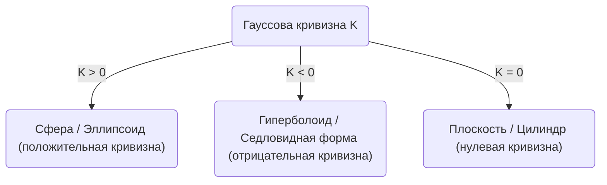
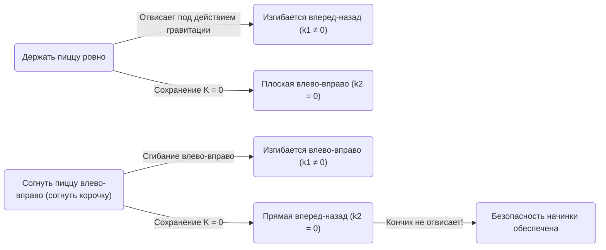

В мире математики на первый взгляд абстрактные и сложные концепции могут оказаться полезными в самых неожиданных ситуациях нашей повседневной жизни. Один из лучших примеров этого - ** Замечательная теорема ** (Theorema Egregium), открытая Карлом Фридрихом Гауссом. Эта теорема известна как один из самых важных и красивых результатов в области дифференциальной геометрии.

В этой статье мы глубоко погрузимся в суть вопроса, начиная с математического смысла этой ** Замечательной теоремы **, того, что такое поверхность, и заканчивая тем, почему эта теорема так полезна, когда мы едим пиццу.

## 1. Что такое гауссова кривизна?

Чтобы понять Замечательную теорему, нам сначала нужно понять концепцию «кривизны». В каждой точке поверхности кривизна — это показатель того, насколько поверхность «искривлена».

Чтобы измерить степень кривизны в определенной точке, давайте разрежем поверхность различными плоскостями, проходящими через эту точку. В результате мы получим различные кривые, среди которых есть направление с наибольшим изгибом (максимальная главная кривизна $\kappa_1$) и направление с наименьшим изгибом (минимальная главная кривизна $\kappa_2$). Гауссова кривизна $K$ определяется как произведение этих двух главных кривизн.

$$
K = \kappa_1 \cdot \kappa_2
$$

В зависимости от значения этой гауссовой кривизны $K$ поверхность в этой точке делится на три типа:

1. ** $K > 0$ (положительная кривизна) **: Поверхность, искривленная в одну и ту же сторону во всех направлениях, как сфера.
2. ** $K < 0$ (отрицательная кривизна) **: Поверхность, которая изгибается вверх в одном направлении и вниз в другом, как лошадиное седло или картофельные чипсы.
3. ** $K = 0$ (нулевая кривизна) **: Поверхность, которая вообще не искривлена (является прямой линией) по крайней мере в одном направлении, как плоскость или цилиндр.

## 2. Суть Замечательной теоремы (Theorema Egregium)

В 1828 году Гаусс опубликовал революционную работу о поверхностях. В ней была представлена ** Theorema Egregium ** (с латинского означает «Замечательная теорема»). Эта теорема утверждает следующее:

> «Гауссова кривизна поверхности остается неизменной, как бы ни изгибали поверхность (не растягивая и не разрывая ее).»

Другими словами, гауссова кривизна — это «внутреннее» свойство поверхности, и она не зависит от того, как она расположена в окружающем трехмерном пространстве. Пока вы можете измерить расстояние (метрику) между двумя точками на поверхности, вы можете вычислить гауссову кривизну, не глядя на внешнее пространство.

Это был удивительный, нелогичный результат. Причина в том, что сами главные кривизны $\kappa_1$ и $\kappa_2$ меняются при изгибе поверхности. Однако их произведение $K$ никогда не меняется.

### Пример со сворачиванием бумаги

Рассмотрим плоский лист бумаги. Гауссова кривизна плоскости равна $K = 0$. Давайте свернем этот лист бумаги, чтобы получился цилиндр. Цилиндр искривлен по окружности ($\kappa_1 \neq 0$), но остается прямым вдоль длинной оси ($\kappa_2 = 0$). Таким образом, гауссова кривизна становится $K = \kappa_1 \cdot 0 = 0$, сохраняя ту же кривизну, что и плоскость.

Именно поэтому мы можем свернуть бумагу в цилиндр или конус, не порвав ее. С другой стороны, поскольку гауссова кривизна сферы равна $K > 0$, невозможно обернуть сферу плоским листом бумаги без образования складок. Тот факт, что карту мира невозможно точно нарисовать на плоскости (возникают искажения расстояний и площадей), также является следствием этой самой ** Замечательной теоремы **.

## 3. Теорема о пицце: дифференциальная геометрия, скрытая в повседневной жизни

А теперь начинается самое интересное применение. Как вы держите большой тонкий кусок пиццы, когда едите его? Если вы просто возьмете его за край, кончик отвиснет вниз, а начинка упадет, что приведет к катастрофе.

Чтобы предотвратить это, многие люди неосознанно держат пиццу, ** слегка сгибая корочку в форме буквы U **. Почему при этом кончик пиццы перестает отвисать?

Здесь вступает в игру ** Замечательная теорема **.

Кусок пиццы, лежащий на плоском столе, имеет гауссову кривизну $K = 0$. Даже когда вы берете пиццу в руки, согласно Замечательной теореме (при условии, что тесто не растягивается и не сжимается), ее гауссова кривизна должна оставаться равной $K = 0$.

$$
K = \kappa_1 \cdot \kappa_2 = 0
$$

Это уравнение означает, что «в любой точке главная кривизна по крайней мере в одном направлении должна быть равна нулю (то есть она должна сохранять прямую линию в определенном направлении)».

Если держать пиццу ровно, гравитация заставит кончик изогнуться вниз (например, $\kappa_1 \neq 0$ в направлении вперед-назад). Чтобы удовлетворить уравнению $K = 0$, направление влево-вправо ($\kappa_2$) должно стать равным $0$ (стать прямым), но это не мешает пицце отвисать вниз.

Но что произойдет, если вы согнете корочку влево и вправо?
В этот момент вы намеренно придаете кривизну ($\kappa_1 \neq 0$) в направлении влево-вправо. Согласно теореме, поскольку общая $K$ должна быть равна $0$, кривизна $\kappa_2$ в другом направлении (т.е. в направлении вперед-назад) неизбежно и принудительно становится равной $0$.

Другими словами, изгибание пиццы в поперечном направлении заставляет математические законы удерживать пиццу прямой (жесткой) в продольном направлении, делая физически невозможным отвисание кончика. Это не просто эмпирическое правило, а идеальное решение, подчиняющееся геометрическим законам Вселенной.

## 4. Дальнейшие применения и глубины Замечательной теоремы

Этот принцип можно увидеть не только в том, как мы едим пиццу, но и в инженерии, архитектуре и повсюду в природе.

- ** Гофрированные железные листы и картон **: Придавая плоскому листу волнообразную форму, мы задаем кривизну в определенном направлении, что значительно увеличивает его жесткость (сопротивление изгибу) в перпендикулярном направлении.
- ** Листья растений **: Листья и лепестки многих растений эволюционировали, чтобы естественным образом принимать волнистую форму, чтобы выдерживать ветер и собственный вес.
- ** Архитектура **: Оболочечные конструкции и другие архитектурные сооружения, покрывающие большие пространства тонкими материалами, используют механическую прочность и геометрические свойства изогнутых поверхностей.

Эта теорема, открытая Гауссом, позже была расширена его учеником Бернхардом Риманом на многообразия высших измерений (риманова геометрия), и в конечном итоге стала математической основой общей теории относительности Альберта Эйнштейна для описания гравитации как «искривления пространства-времени».

## 5. В заключение

За действием «складывания корочки пиццы», которое мы выполняем бессознательно, скрываются глубокие и красивые математические законы, которые связаны даже с космологией Эйнштейна.

** Замечательная теорема ** — пожалуй, самый вкусный и понятный пример того, как абстрактная математика управляет реальным миром. В следующий раз, когда будете есть пиццу, насладитесь идеально сложенным куском, думая о Карле Фридрихе Гауссе и его великом открытии.
