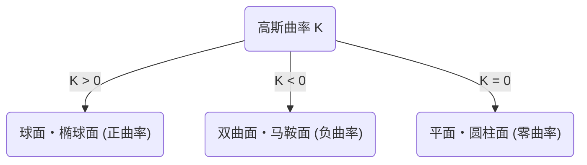
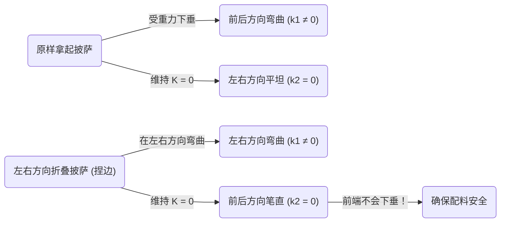

在数学世界中，乍看之下抽象且晦涩的概念，有时会在我们日常生活中意想不到的场合派上用场。其中最典型的一个例子，就是[卡尔·弗里德里希·高斯](https://kenji.blog/zh-cn/p/gauss/)发现的 **绝妙定理** （Theorema Egregium）。这一定理被认为是微分几何学领域中最重要且最优美的结果之一。

在本文中，我们将从这个 **绝妙定理** 的数学意义开始，深入探讨什么是曲面，以及为什么这个定理在我们在吃披萨时会非常有用。

## 1. 什么是高斯曲率？

为了理解绝妙定理，首先必须理解“曲率”这个概念。曲面上各点的曲率，是表示该面“弯曲程度”的指标。

为了测量某个点的弯曲程度，我们尝试用穿过该点的各种平面来切割曲面。这样我们会得到各种曲线，其中存在一个弯曲得最厉害的方向（最大主曲率 $\kappa_1$），以及一个弯曲得最平缓的方向（最小主曲率 $\kappa_2$）。高斯曲率 $K$ 被定义为这两个主曲率的乘积。

$$
K = \kappa_1 \cdot \kappa_2
$$

根据这个高斯曲率 $K$ 的值，曲面在该点处可以分为三种类型。

1. **$K > 0$（正曲率）** : 像球面一样，向所有方向都在同一侧弯曲的面。
2. **$K < 0$（负曲率）** : 像马鞍或薯片一样，在一个方向上向上弯曲，在另一个方向上向下弯曲的面。
3. **$K = 0$（零曲率）** : 像平面或圆柱面一样，至少在一个方向上完全不弯曲（呈直线）的面。

## 2. 绝妙定理（Theorema Egregium）的精髓

1828年，高斯发表了一篇关于曲面的划时代论文。其中提出的就是 **Theorema Egregium** （拉丁语，意为“绝妙定理”）。这一定理主张如下：

> “曲面的高斯曲率，无论如何弯曲曲面（在不拉伸或撕裂的情况下），都保持不变。”

换句话说，高斯曲率是曲面的“内在”性质，不依赖于它在周围三维空间中是如何放置的。只要能测量曲面上两点之间的距离（度量），即使不看外部空间也能计算出高斯曲率。

这是一个有悖直觉的惊人结果。因为当我们弯曲曲面时，主曲率 $\kappa_1$ 和 $\kappa_2$ 本身是会发生变化的。然而，它们的乘积 $K$ 却绝对不会改变。

### 卷纸的例子

让我们想象一张平整的纸。平面的高斯曲率是 $K = 0$。我们试着将这张纸卷成圆柱。圆柱在圆周方向上是弯曲的（$\kappa_1 \neq 0$），但在长轴方向上是笔直的（$\kappa_2 = 0$）。因此，高斯曲率 $K = \kappa_1 \cdot 0 = 0$，保持与平面相同的曲率。

这就是为什么我们可以在不撕破纸的情况下，将其卷成圆柱或圆锥的原因。反之，因为球面的高斯曲率 $K > 0$，所以不可能用一张平整的纸在不产生褶皱的情况下包裹住球体。世界地图无法准确地绘制在平面上（会产生距离和面积的扭曲），也正是这个 **绝妙定理** 所导致的结果。

## 3. 披萨定理：潜藏在日常生活中的微分几何学

那么，接下来是非常有趣的实际应用。大家在吃又薄又大片的披萨时，是怎么拿的呢？如果直接拿住边缘，前端就会垂下来，上面的配料也会掉落，造成一场“灾难”。

为了防止这种情况，许多人应该会在无意识中 **把披萨的边捏成U字型折叠起来** 拿着。为什么这样做披萨的前端就不会下垂了呢？

这时候 **绝妙定理** 就登场了。

放在平坦桌子上的披萨切片，高斯曲率是 $K = 0$。即使把披萨拿在手里，根据绝妙定理（只要面饼不发生拉伸或收缩），它的高斯曲率必须保持 $K = 0$。

$$
K = \kappa_1 \cdot \kappa_2 = 0
$$

这个方程的含义是，“在任何一点，至少有一个方向的主曲率必须为零（也就是说，在某个方向上必须保持笔直的直线）”。

如果平端着披萨，在重力作用下前端会向下弯曲（例如前后方向 $\kappa_1 \neq 0$）。为了满足方程 $K = 0$，左右方向（$\kappa_2$）必须变为 $0$（即变得笔直），但这并不能阻止披萨向下垂落。

但是，如果将披萨边缘在左右方向上捏出一个凹折（谷折），会发生什么呢？
此时，你在左右方向上人为地赋予了曲率（$\kappa_1 \neq 0$）。根据定理，因为整体的 $K$ 必须为 $0$，所以必然导致另一个方向（即前后方向）的曲率 $\kappa_2$ 被强制变为 $0$。

也就是说，通过在横向上弯曲披萨，数学法则会迫使披萨在纵向上保持笔直（变硬），从而在物理上使前端不可能垂下。这不仅仅是单纯的经验法则，更是遵循宇宙几何学法则的完美解决方案。

## 4. 绝妙定理的更深远应用与奥秘

不仅限于吃披萨的方式，这个原理在工程学、建筑学以及自然界中都随处可见。

- **波纹钢板・瓦楞纸板** : 通过将平坦的板材加工成波浪状，赋予其在某个方向上的曲率，从而大幅提高了其垂直方向上的刚性（抗弯曲能力）。
- **植物的叶子** : 许多植物的叶子和花瓣为了承受风力和自身重量，自然进化出了波浪般的形状。
- **建筑物** : 薄壳结构等用轻薄材料覆盖大空间的建筑物，就利用了曲面所具备的力学强度和几何学性质。

高斯发现的这个定理，后来被他的学生[波恩哈德·黎曼](https://kenji.blog/zh-cn/p/riemann/)扩展到了高维流形上（黎曼几何学），并在日后成为阿尔伯特·爱因斯坦广义相对论中将重力描述为“时空扭曲”的数学基础。

## 5. 结语

我们在无意识中做出的“折起披萨边”的行为背后，隐藏着甚至能与爱因斯坦宇宙论联系起来的、深邃而优美的数学法则。

**绝妙定理** 可以说是展示抽象数学如何支配现实世界的最美味、最易懂的例子。下次吃披萨的时候，请一定要一边回想着[卡尔·弗里德里希·高斯](https://kenji.blog/zh-cn/p/gauss/)和他伟大的发现，一边品尝被折叠成完美形状的美味切片。
