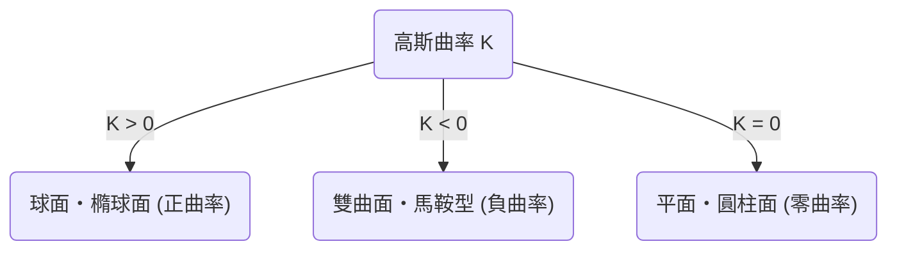
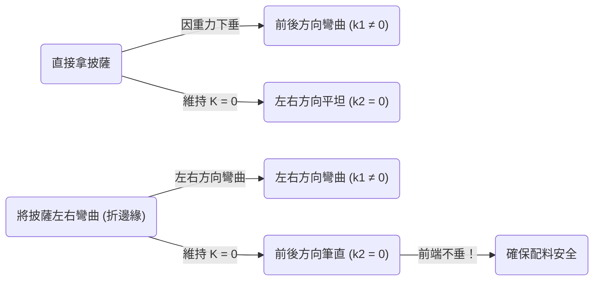

在數學的世界裡，乍看之下抽象且艱澀的概念，有時會在我們日常生活中意想不到的場合派上用場。其中最典型的例子之一，就是卡爾·弗里德里希·高斯所發現的 **絕妙定理** （Theorema Egregium）。這個定理在微分幾何學領域中，被視為最重要且最美麗的成果之一。

本文將從 **絕妙定理** 的數學意義開始，探討什麼是曲面，並深入探究為什麼這個定理在我們吃披薩時非常有用。

## 1. 什麼是高斯曲率？

為了理解絕妙定理，我們首先需要理解「曲率」這個概念。在曲面上的每一點，表示該面「彎曲」程度的指標就是曲率。

為了測量某一點的彎曲程度，我們試著用通過該點的各種平面來切斷曲面。這樣會得到各種曲線，其中存在著彎曲得最厲害的方向（最大主曲率 $\kappa_1$），以及彎曲得最平緩的方向（最小主曲率 $\kappa_2$）。高斯曲率 $K$ 被定義為這兩個主曲率的乘積。

$$
K = \kappa_1 \cdot \kappa_2
$$

根據這個高斯曲率 $K$ 的值，曲面在該點會被分為三種類型。

1. **$K > 0$（正曲率）** : 像球面一樣，朝著所有方向都向同一側彎曲的面。
2. **$K < 0$（負曲率）** : 像馬鞍或洋芋片一樣，在某個方向朝上彎曲，在另一個方向則朝下彎曲的面。
3. **$K = 0$（零曲率）** : 像平面或圓柱面一樣，至少在一個方向上完全沒有彎曲（呈直線）的面。

## 2. 絕妙定理（Theorema Egregium）的精髓

1828年，高斯發表了一篇關於曲面的劃時代論文。其中提出的便是 **Theorema Egregium** （拉丁文，意為「絕妙定理」）。這個定理主張如下：

> 「曲面的高斯曲率，無論如何彎曲該曲面（在不拉伸或撕裂的情況下），都保持不變」

換句話說，高斯曲率是曲面的「內蘊」性質，並不依賴於它在周圍的3維空間中是如何被放置的。只要能測量曲面上兩點之間的距離（度量），即使不看外部空間也能計算出高斯曲率。

這是一個違背直覺且令人驚訝的結果。因為主曲率 $\kappa_1$ 和 $\kappa_2$ 本身，在彎曲曲面時是會改變的。但是，它們的乘積 $K$ 卻絕對不會改變。

### 捲紙的例子

讓我們想像一張平坦的紙。平面的高斯曲率是 $K = 0$。我們試著把這張紙捲起來做成圓柱。圓柱在沿著圓周的方向是彎曲的（$\kappa_1 \neq 0$），但在長軸方向是筆直的（$\kappa_2 = 0$）。因此，高斯曲率為 $K = \kappa_1 \cdot 0 = 0$，保持了與平面相同的曲率。

這就是為什麼我們可以在不撕破紙的情況下，將其捲成圓柱或圓錐的原因。相反地，因為球面的高斯曲率是 $K > 0$，所以不可能用一張平坦的紙在不產生皺褶的情況下包住一個球體。無法將世界地圖準確地繪製在平面上（會產生距離或面積的扭曲），也正是這個 **絕妙定理** 所造成的。

## 3. 披薩定理：隱藏在日常中的微分幾何學

那麼，接下來是非常有趣的應用。大家在吃又薄又大片的披薩時，是怎麼拿的呢？如果直接拿著邊緣，前端就會垂下來，配料掉落而釀成慘劇。

為了防止這種情況，很多人應該會在無意識中 **將披薩的邊緣稍微折成U字型** 來拿。為什麼這樣做，披薩的前端就不會垂下來了呢？

這時候 **絕妙定理** 就登場了。

放在平坦桌面上的披薩切片，其高斯曲率為 $K = 0$。當你拿起披薩時（只要餅皮不伸縮），根據絕妙定理，其高斯曲率必須保持在 $K = 0$。

$$
K = \kappa_1 \cdot \kappa_2 = 0
$$

這個方程式意味著，「在任何一點上，至少在一個方向的主曲率必須為零（也就是說，必須在某個方向上保持筆直的直線）」。

如果平平地拿著披薩，由於重力的關係，前端會向下彎曲（例如在前後方向上 $\kappa_1 \neq 0$）。為了滿足方程式 $K = 0$，左右方向（$\kappa_2$）就必須為 $0$（變成筆直的），但這無法防止披薩向下低垂。

可是，如果把邊緣部分向左右折成谷折，會發生什麼事呢？
這時，你就有意地在左右方向給予了曲率（$\kappa_1 \neq 0$）。根據定理，整體的 $K$ 必須為 $0$，因此另一個方向（也就是前後方向）的曲率 $\kappa_2$ 就會被強制變成 $0$。

也就是說，藉由橫向彎曲披薩，數學法則就會發揮作用，使披薩在縱向保持筆直（堅硬），在物理上使其前端無法下垂。這不僅僅是經驗法則，而是遵循宇宙幾何法則的完美解決方案。

## 4. 絕妙定理的進一步應用與深淵

不僅僅是吃披薩的方法，這個原理在工程學、建築學以及自然界的各個角落都能見到。

- **波浪鐵板・瓦楞紙板** : 將平坦的板子加工成波浪狀，在某個方向給予曲率，能使其在垂直方向的剛性（抗彎性）大幅提升。
- **植物的葉子** : 許多植物的葉子或花瓣，為了承受風力或自身重量，會自然進化出波浪狀的形狀。
- **建築物** : 像薄殼結構這樣用薄材料覆蓋大空間的建築物，就活用了曲面所具備的力學強度與幾何學性質。

高斯發現的這個定理，後來被其弟子波恩哈德·黎曼推廣到高維流形（黎曼幾何學），最終在阿爾伯特·愛因斯坦的廣義相對論中，成為將重力描述為「時空扭曲」的數學基礎。

## 5. 結語

在我們無意識進行的「折披薩邊緣」行為背後，隱藏著能連結到愛因斯坦宇宙學的、深奧且美麗的數學法則。

可以說， **絕妙定理** 是展示抽象數學如何支配現實世界，最美味且最容易理解的例子。下次吃披薩時，請務必一邊想著卡爾·弗里德里希·高斯和他偉大的發現，一邊品嚐折成完美形狀的披薩切片。
