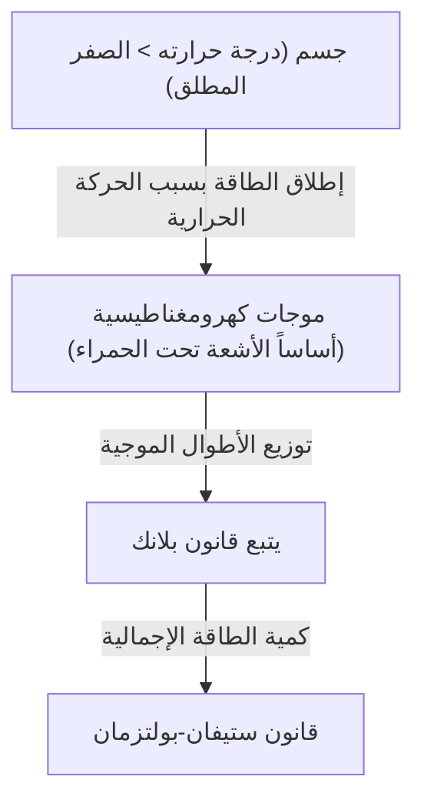
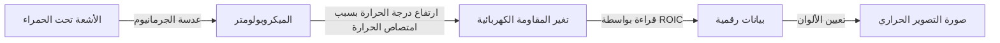

## مقدمة: دعوة إلى عالم "الحرارة" غير المرئية

كل الأشياء من حولنا، طالما أنها ليست عند الصفر المطلق (273.15 درجة مئوية تحت الصفر)، تنبعث منها دائمًا موجات كهرومغناطيسية في شكل "إشعاع حراري". تقنية "التصوير الحراري" (Thermography) هي التقنية التي تلتقط هذه الموجات الكهرومغناطيسية غير المرئية للعين البشرية، وخاصة "الأشعة تحت الحمراء"، وتصور توزيع درجات الحرارة كألوان.

بسبب جائحة فيروس كورونا المستجد، زادت فرص رؤية الشاشات التي تقيس درجة حرارة سطح الجسم عند مداخل المطارات والمرافق التجارية بشكل هائل. ومع ذلك، لا تقتصر استخدامات التصوير الحراري على الرعاية الطبية والصحة العامة. فهي تلعب دورًا حيويًا في عدد لا يحصى من المجالات التي تدعم المجتمع الحديث، بدءًا من اكتشاف ضعف العزل في المباني، واكتشاف ارتفاع درجة حرارة المعدات الكهربائية، والبحث عن الأشخاص المفقودين في الظلام، وحتى أجهزة الاستشعار الليلية للسيارات ذاتية القيادة.

في هذا المقال، سنشرح بشكل شامل من الأساسيات كيف تعتمد هذه التقنية السحرية على قوانين الفيزياء، وكيف تقوم الأجهزة الحديثة بتحويل الأشعة تحت الحمراء إلى إشارات كهربائية.

## الأساس الفيزيائي: تقاطع الحرارة والضوء

لفهم مبدأ التصوير الحراري، من الضروري أولاً توضيح العلاقة بين "الضوء (الموجات الكهرومغناطيسية)" و"الحرارة".

### إشعاع الجسم الأسود (Black-body Radiation)

في الفيزياء، يشير "الجسم الأسود" إلى جسم مثالي يمتص تمامًا جميع الأطوال الموجية للموجات الكهرومغناطيسية الساقطة عليه من الخارج، وينبعث منه أيضًا إشعاع حراري وفقًا لدرجة حرارته. وعلى الرغم من أن الأجسام الحقيقية ليست أجسامًا سوداء مثالية، فإن قانون إشعاع الجسم الأسود يمثل أساسًا قويًا لفهم الإشعاع الحراري لأي جسم.

عندما يمتلك الجسم حرارة (تهتز الجزيئات والذرات)، تنبعث هذه الطاقة كموجات كهرومغناطيسية. عندما تكون درجة الحرارة منخفضة، تنبعث بشكل أساسي أشعة تحت حمراء ذات طول موجي طويل، ومع ارتفاع درجة الحرارة، تنتقل الذروة نحو الضوء المرئي ذي الطول الموجي القصير (الأحمر، الأصفر، الأبيض). هذا هو السبب في أن الحديد يتوهج باللون الأحمر عند تسخينه، ويضيء باللون الأبيض عندما يصبح أكثر سخونة.

### قانون ستيفان-بولتزمان (Stefan-Boltzmann Law)

أحد أهم قوانين الفيزياء في التصوير الحراري هو "قانون ستيفان-بولتزمان"، الذي اكتشفه جوزيف ستيفان تجريبيًا في عام 1879 وأثبته نظريًا لودفيغ بولتزمان في عام 1884.

ينص هذا القانون على أن "الكمية الإجمالية للطاقة المنبعثة من الجسم الأسود (الانبعاثية الإشعاعية) تتناسب طرديًا مع القوة الرابعة لدرجة حرارته المطلقة".

$$ E = \sigma T^4 $$

حيث:
- $E$ هي الانبعاثية الإشعاعية (الطاقة المنبعثة لكل وحدة مساحة)
- $\sigma$ (سيغما) هو ثابت ستيفان-بولتزمان (حوالي $5.67 \times 10^{-8} \, \text{W/(m}^2\cdot\text{K}^4\text{)}$)
- $T$ هي درجة الحرارة المطلقة (كلفن، K)

هذه الخاصية المتمثلة في "التناسب مع القوة الرابعة" لها أهمية حاسمة بالنسبة للتصوير الحراري. حتى لو ارتفعت درجة الحرارة بشكل طفيف جدًا، فإن كمية طاقة الأشعة تحت الحمراء المنبعثة تزداد بشكل كبير. على سبيل المثال، حتى الارتفاع الطفيف في درجة الحرارة عن درجة حرارة الغرفة (حوالي 300 كلفن) سيُظهر اختلافًا ملحوظًا في الطاقة التي تصل إلى المستشعر، مما يجعل من الممكن اكتشاف الاختلافات الدقيقة في درجات الحرارة بحساسية عالية.

### أهمية الانبعاثية (Emissivity)

نظرًا لأن الأجسام الحقيقية ليست أجسامًا سوداء مثالية، فمن الضروري ضرب كمية الطاقة المذكورة أعلاه في "الانبعاثية ($\epsilon$)".

$$ E = \epsilon \sigma T^4 $$

تتراوح قيمة الانبعاثية بين 0 و 1.
- **الجسم الأسود**: $\epsilon = 1.0$
- **جلد الإنسان**: $\epsilon \approx 0.98$ (قريب جدًا من الجسم الأسود في نطاق الأشعة تحت الحمراء)
- **المعادن المصقولة**: $\epsilon \approx 0.02 - 0.1$ (تميل إلى عكس الأشعة تحت الحمراء ويصعب انبعاث حرارتها الخاصة)

من أجل قياس درجة الحرارة بدقة باستخدام التصوير الحراري، من الضروري ضبط انبعاثية الجسم المستهدف بشكل صحيح. عند محاولة قياس درجة حرارة سطح معدني، غالبًا ما يلتقط الكاميرا انعكاسات من مصادر حرارية محيطة، مما يؤدي إلى نتائج قياس تختلف عن درجة الحرارة الفعلية.

## آلية مستشعرات الأشعة تحت الحمراء: تحويل الحرارة إلى كهرباء

بينما تستخدم الكاميرات مستشعرات مثل CMOS أو CCD لالتقاط الضوء المرئي، فإن كاميرات التصوير الحراري مجهزة بمستشعرات خاصة للأشعة تحت الحمراء. يمكن تقسيمها بشكل عام إلى "نوع مبرد" و"نوع غير مبرد"، ولكن النوع غير المبرد الذي يستخدم "الميكروبولومتر" (Microbolometer) هو الذي أصبح واسع الانتشار في السنوات الأخيرة.

### هيكل ومبدأ الميكروبولومتر

الميكروبولومتر هو عنصر دقيق يكتشف الحرارة ويغير مقاومته الكهربائية. المئات من الآلاف من هذه العناصر مرتبة في شكل شبكة (مصفوفة) تشكل قلب نظام التصوير الحراري.

1. **امتصاص الأشعة تحت الحمراء**:
   تمر الأشعة تحت الحمراء عبر العدسة (غالبًا ما تُصنع من مواد خاصة مثل الجرمانيوم لأن الزجاج العادي لا يسمح بمرور الأشعة تحت الحمراء) وتضرب سطح الميكروبولومتر (عادة ما يكون أكسيد الفاناديوم أو السيليكون غير المتبلور).
2. **ارتفاع درجة الحرارة**:
   ترتفع درجة حرارة البكسلات التي امتصت طاقة الأشعة تحت الحمراء قليلاً (من بضعة ملي كلفن إلى بضعة أعشار من الدرجة).
3. **تغير قيمة المقاومة**:
   مع ارتفاع درجة الحرارة، تتغير قيمة المقاومة الكهربائية للعنصر.
4. **التحويل إلى إشارات كهربائية**:
   تقوم دائرة القراءة المتكاملة (ROIC) الموجودة خلفها بقراءة هذا التغير في المقاومة كتغير في الجهد أو التيار وتحويله إلى بيانات رقمية.
5. **التصوير (معالجة الألوان الزائفة)**:
   يتم تخصيص ألوان زائفة (False Color) للبيانات الرقمية لدرجة الحرارة، مثل الأحمر والأبيض للأجزاء ذات درجات الحرارة المرتفعة، والأزرق والأسود للأجزاء ذات درجات الحرارة المنخفضة، لإنشاء صورة (مخطط حراري) يمكننا رؤيتها وفهمها بأعيننا.

### ثورة المستشعرات غير المبردة

في الماضي، كانت كاميرات الأشعة تحت الحمراء عالية الحساسية تتطلب التبريد إلى درجات حرارة منخفضة للغاية (حوالي -200 درجة مئوية) باستخدام النيتروجين السائل أو مبرد ستيرلينغ، لمنع الحرارة (التيار المظلم) المنبعثة من المستشعر نفسه من التداخل مع القياسات (النوع المبرد). كانت هذه الأجهزة كبيرة جدًا وثقيلة ومكلفة وتستغرق وقتًا طويلاً لبدء التشغيل.

ومع ذلك، بفضل التقدم في تكنولوجيا النظم الكهروميكانيكية الصغرى (MEMS)، تم وضع الميكروبولومترات (النوع غير المبرد) التي تعمل في درجة حرارة الغرفة قيد الاستخدام العملي. من خلال تصغير المستشعر وإنشاء هيكل يعزل التوصيل الحراري من البيئة المحيطة (هيكل معلق)، أصبح من الممكن الحصول على حساسية كافية حتى بدون تبريد. ونتيجة لذلك، أصبحت كاميرات التصوير الحراري أصغر حجمًا وأقل تكلفة، وتطورت إلى وحدات يمكن تضمينها في الهواتف الذكية.

## التطبيقات الواسعة للتصوير الحراري

لقد أحدثت القدرة على تصور الحرارة غير المرئية ثورة في العديد من الصناعات وحياة الناس.

### 1. الرعاية الطبية والرعاية الصحية وتدابير مكافحة الأمراض المعدية
تُعرف هذه التقنية بشكل أفضل بفحص درجة حرارة سطح الجسم. نظرًا لأنه يمكن قياس درجات حرارة عدد كبير من الأشخاص على الفور وبدون تلامس، فهي ضرورية للحجر الصحي في المطارات والكشف عن الأشخاص المصابين بالحمى في أماكن الفعاليات. بالإضافة إلى ذلك، نظرًا لأنه يمكن تصور انخفاض درجة حرارة الجلد بسبب ضعف تدفق الدم، فإنه يُستخدم أيضًا كأداة تشخيصية مساعدة في الإعدادات الطبية، مثل تشخيص اضطرابات الأوعية الدموية وتحديد مناطق الالتهاب في الطب الرياضي.

### 2. تشخيص البنية التحتية والمباني
من خلال التقاط صور حرارية لجدران وأسقف المباني، يمكن اكتشاف العيوب في المواد العازلة، وتسرب التيارات الهوائية، وتراكم الرطوبة بسبب تسرب المياه (تنخفض درجة الحرارة عن محيطها بسبب حرارة التبخر عندما تتبخر الرطوبة) دون إتلاف المبنى. لقد أصبحت أداة اختبار غير مدمرة قوية للغاية في تشخيص توفير الطاقة ومسوحات تقادم المباني.

### 3. صيانة وفحص المعدات الصناعية (الصيانة التنبؤية)
غالبًا ما تصاحب المعدات الكهربائية والميكانيكية في المصانع، مثل المحركات ولوحات التوزيع والمحولات، حرارة غير طبيعية قبل حدوث أعطال أو دوائر قصر. من خلال عمليات الفحص المنتظمة باستخدام التصوير الحراري، يمكن اكتشاف مناطق التسخين غير الطبيعية (النقاط الساخنة) في مرحلة مبكرة، مما يتيح "الصيانة التنبؤية" التي تمنع الحوادث الخطيرة وتوقف تشغيل المصنع.

### 4. الأمن والمراقبة الليلية
بينما لا تعمل كاميرات الضوء المرئي في الظلام الدامس بدون مصدر ضوء، يلتقط التصوير الحراري الحرارة (الأشعة تحت الحمراء) المنبعثة من الهدف نفسه، مما يسمح بالحصول على صور واضحة حتى بدون أي ضوء. تحظى خصائصه بتقدير كبير، حيث يمكنه اكتشاف الأهداف حتى في الطقس السيئ أو عبر الدخان، مما يجعله مفيدًا للكشف عن الدخلاء، وحرس الحدود، والبحث عن المفقودين في البحر.

### 5. أجهزة استشعار السيارات (الرؤية الليلية)
في السنوات الأخيرة، زاد دمج كاميرات الأشعة تحت الحمراء البعيدة كجزء من أنظمة مساعدة السائق المتقدمة (ADAS) في السيارات. أثناء القيادة ليلاً، تكتشف حرارة المشاة والحيوانات البرية على مسافات لا تصل إليها المصابيح الأمامية، وتقوم بتحذير السائق أو تنشيط الفرملة التلقائية، مما يساهم في تقليل الحوادث الليلية.

## الخلاصة والتوقعات المستقبلية

بدءًا من الفيزياء الكلاسيكية المتمثلة في قانون ستيفان-بولتزمان وحتى أحدث مصفوفات الميكروبولومتر باستخدام تقنية MEMS، يمكن القول إن التصوير الحراري هو تقنية تمثل بلورة الحكمة البشرية.

في المستقبل، مع زيادة عدد بكسلات المستشعر والمزيد من التخفيضات في التكلفة، من المتوقع أن يندمج مع تكنولوجيا تحليل الصور باستخدام الذكاء الاصطناعي (AI). بدلاً من مجرد إظهار درجة الحرارة بالألوان، ستنتشر أنظمة المراقبة الآلية بالكامل حيث يتعلم الذكاء الاصطناعي أنماط الحالات الشاذة تلقائيًا ويتوقع ويبلغ أن "هذا الجهاز لديه احتمال كبير للفشل في غضون أيام قليلة".

عالم "الحرارة" غير المرئية. تستمر تقنية التصوير الحراري التي تصور هذا العالم في تطوير مجتمعنا ليصبح أكثر أمانًا وكفاءة وراحة.
