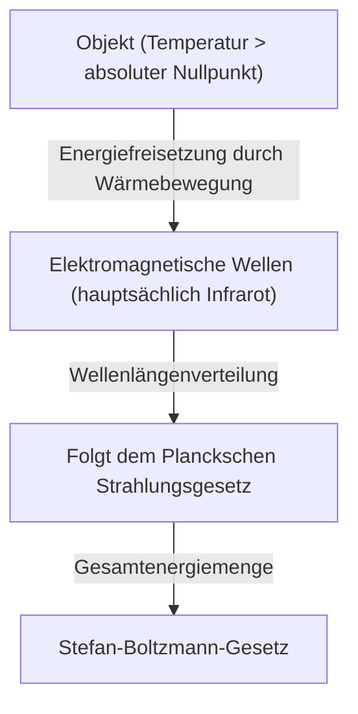
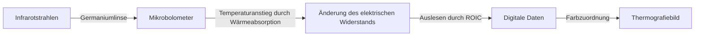

## Einführung: Eine Einladung in die Welt der unsichtbaren "Wärme"

Alle Objekte in unserer Umgebung senden ständig elektromagnetische Wellen in Form von "Wärmestrahlung" aus, es sei denn, sie befinden sich am absoluten Nullpunkt (minus 273,15 Grad Celsius). Die Technologie, die diese für das menschliche Auge unsichtbaren elektromagnetischen Wellen, insbesondere "Infrarotstrahlen", erfasst und die Temperaturverteilung als Farbe visualisiert, ist die "Thermografie".

Aufgrund der COVID-19-Pandemie ist die Zahl der Monitore zur Messung der Körperoberflächentemperatur an den Eingängen von Flughäfen und kommerziellen Einrichtungen explosionsartig gestiegen. Die Anwendungsmöglichkeiten der Thermografie beschränken sich jedoch nicht auf die Medizin oder die öffentliche Gesundheit. Sie ist in unzähligen Bereichen aktiv, die die moderne Gesellschaft unterstützen, wie zum Beispiel bei der Entdeckung von schlechter Gebäudeisolierung, der Erkennung von Überhitzung in elektrischen Anlagen, der Suche nach vermissten Personen im Dunkeln und sogar als Nachtsensor für autonom fahrende Autos.

In diesem Artikel werden wir von Grund auf detailliert erklären, wie diese magische Technologie auf physikalischen Gesetzen beruht und wie modernste Hardware Infrarotstrahlen in elektrische Signale umwandelt.

## Physikalische Grundlagen: Die Schnittstelle von Wärme und Licht

Um das Prinzip der Thermografie zu verstehen, ist es zunächst notwendig, die Beziehung zwischen "Licht (elektromagnetischen Wellen)" und "Wärme" zu klären.

### Schwarzkörperstrahlung (Black-body Radiation)

In der Physik bezieht sich der Begriff "Schwarzer Körper" auf ein ideales Objekt, das alle einfallenden elektromagnetischen Wellen jeglicher Wellenlänge vollständig absorbiert und auch Wärmestrahlung entsprechend seiner eigenen Temperatur abgibt. Echte Objekte sind keine perfekten schwarzen Körper, aber das Gesetz der Schwarzkörperstrahlung bildet eine starke Grundlage für das Verständnis der Wärmestrahlung aller Objekte.

Wenn ein Objekt Wärme hat (Moleküle und Atome vibrieren), wird diese Energie als elektromagnetische Wellen freigesetzt. Bei niedrigen Temperaturen werden hauptsächlich Infrarotstrahlen mit langen Wellenlängen abgestrahlt. Wenn die Temperatur steigt, verschiebt sich der Peak zu sichtbarem Licht mit kürzeren Wellenlängen (rot, gelb, weiß). Aus diesem Grund leuchtet Eisen beim Erhitzen rot und bei höheren Temperaturen weiß.

### Stefan-Boltzmann-Gesetz (Stefan-Boltzmann Law)

Eines der wichtigsten physikalischen Gesetze in der Thermografie ist das "Stefan-Boltzmann-Gesetz", das 1879 von Josef Stefan experimentell entdeckt und 1884 von Ludwig Boltzmann theoretisch bewiesen wurde.

Dieses Gesetz besagt: "Die Gesamtmenge der von einem schwarzen Körper abgestrahlten Energie (spezifische Ausstrahlung) ist proportional zur vierten Potenz seiner absoluten Temperatur."

$$ E = \sigma T^4 $$

Hierbei ist:
- $E$ die spezifische Ausstrahlung (pro Flächeneinheit abgestrahlte Energie)
- $\sigma$ (Sigma) die Stefan-Boltzmann-Konstante (ca. $5.67 \times 10^{-8} \, \text{W/(m}^2\cdot\text{K}^4\text{)}$)
- $T$ die absolute Temperatur (Kelvin, K)

Diese Eigenschaft, "proportional zur vierten Potenz" zu sein, ist für die Thermografie von entscheidender Bedeutung. Wenn die Temperatur auch nur geringfügig ansteigt, nimmt die Menge der abgestrahlten Infrarotenergie dramatisch zu. Wenn beispielsweise die Temperatur leicht über Raumtemperatur (etwa 300 K) steigt, zeigt sich der Unterschied in der Energie, die den Sensor erreicht, deutlich. Dies macht es möglich, winzige Temperaturunterschiede mit hoher Empfindlichkeit zu erfassen.

### Die Bedeutung des Emissionsgrads (Emissivity)

Da reale Objekte keine idealen schwarzen Körper sind, muss die obige Energiemenge mit dem "Emissionsgrad ($\epsilon$)" multipliziert werden.

$$ E = \epsilon \sigma T^4 $$

Der Emissionsgrad hat einen Wert zwischen 0 und 1.
- **Schwarzer Körper**: $\epsilon = 1.0$
- **Menschliche Haut**: $\epsilon \approx 0.98$ (im Infrarotbereich sehr nahe an einem schwarzen Körper)
- **Poliertes Metall**: $\epsilon \approx 0.02 - 0.1$ (reflektiert Infrarotstrahlen leicht und strahlt die eigene Wärme schwer ab)

Um mit der Thermografie genaue Temperaturen zu messen, ist es unerlässlich, den Emissionsgrad des Zielobjekts korrekt einzustellen. Beim Versuch, die Temperatur einer Metalloberfläche zu messen, ist es üblich, dass die Reflexionen umgebender Wärmequellen erfasst werden, was zu Messergebnissen führt, die sich von der tatsächlichen Temperatur unterscheiden.

## Der Mechanismus des Infrarotsensors: Wärme in Elektrizität umwandeln

Während Kameras Sensoren wie CMOS oder CCD verwenden, um sichtbares Licht zu erfassen, sind Thermografiekameras mit speziellen Infrarotsensoren ausgestattet. Sie werden grob in "gekühlte" und "ungekühlte" Typen unterteilt, aber in den letzten Jahren hat sich der ungekühlte Sensor mit einem "Mikrobolometer (Microbolometer)" weit verbreitet.

### Struktur und Prinzip des Mikrobolometers

Ein Mikrobolometer ist ein winziges Element, das Wärme wahrnimmt und seinen eigenen elektrischen Widerstand ändert. Das Herzstück der Thermografie besteht aus Hunderttausenden dieser Elemente, die in einem gitterförmigen Muster (Array) angeordnet sind.

1. **Absorption von Infrarotstrahlen**:
   Infrarotstrahlen, die durch die Linse eintreten (gewöhnliches Glas lässt keine Infrarotstrahlen durch, daher werden spezielle Materialien wie Germanium verwendet), treffen auf die Oberfläche des Mikrobolometers (normalerweise Vanadiumoxid oder amorphes Silizium).
2. **Temperaturanstieg**:
   Die Pixel, die die Energie der Infrarotstrahlen absorbiert haben, steigen leicht in der Temperatur (von wenigen Millikelvin bis zu einem Bruchteil eines Grades).
3. **Änderung des Widerstandswerts**:
   Mit steigender Temperatur ändert sich der elektrische Widerstandswert des Elements.
4. **Umwandlung in elektrische Signale**:
   Die dahinterliegende Ausleseschaltung (ROIC) liest diese Änderung des Widerstandswerts als Spannungs- oder Stromänderung ab und wandelt sie in digitale Daten um.
5. **Bildgebung (Falschfarbenverarbeitung)**:
   Den digitalisierten Temperaturdaten werden Pseudofarben (Falschfarben) wie Rot oder Weiß für Bereiche mit hoher Temperatur und Blau oder Schwarz für Bereiche mit niedriger Temperatur zugewiesen, um ein Bild (Thermogramm) zu erzeugen, das wir visuell verstehen können.

### Die Revolution der ungekühlten Sensoren

In der Vergangenheit mussten hochempfindliche Infrarotkameras mit flüssigem Stickstoff oder Stirlingkühlern (gekühlter Typ) auf kryogene Temperaturen (etwa -200 °C) gekühlt werden, damit die vom Sensor selbst erzeugte Wärme (Dunkelstrom) die Messung nicht störte. Diese waren sehr groß, schwer, teuer und brauchten lange zum Starten.

Durch Fortschritte in der MEMS-Technologie (mikroelektromechanische Systeme) wurden jedoch bei Raumtemperatur arbeitende Mikrobolometer (ungekühlter Typ) in die Praxis umgesetzt. Durch die Miniaturisierung des Sensors und die Schaffung einer Struktur, die die Wärmeleitung von der Umgebung unterbricht (Hängestruktur), gelang es, auch ohne Kühlung eine ausreichende Empfindlichkeit zu erreichen. Infolgedessen sind Thermografiekameras kleiner und kostengünstiger geworden und haben sich zu Modulen entwickelt, die in Smartphones eingebaut werden können.

## Vielfältige Anwendungen der Thermografie

Die Fähigkeit, unsichtbare Wärme zu visualisieren, revolutioniert viele Branchen und das Leben der Menschen.

### 1. Medizin/Gesundheitswesen und Infektionsbekämpfung
Am bekanntesten als Screening der Körperoberflächentemperatur. Da die Temperatur vieler Menschen sofort berührungslos gemessen werden kann, ist sie für die Quarantäne auf Flughäfen und die Erkennung fiebernder Personen auf Veranstaltungsorten unerlässlich. Da sie den durch schlechte Durchblutung verursachten Abfall der Hauttemperatur visualisieren kann, wird sie auch im medizinischen Bereich als unterstützendes Diagnosewerkzeug verwendet, beispielsweise zur Diagnose von Gefäßerkrankungen oder zur Identifizierung von Entzündungsbereichen in der Sportmedizin.

### 2. Diagnose von Infrastruktur und Gebäuden
Wenn die Wände oder das Dach eines Gebäudes mit einer Thermografiekamera fotografiert werden, können Fehler in der Isolierung, das Eindringen von Zugluft und die Ansammlung von Feuchtigkeit durch Regenlecks (die Temperatur sinkt aufgrund der Verdunstungswärme, wenn Feuchtigkeit verdunstet, unter die der Umgebung) ohne Zerstörung entdeckt werden. Es ist ein sehr leistungsfähiges zerstörungsfreies Inspektionswerkzeug für Gebäudeenergiediagnosen und Alterungsuntersuchungen.

### 3. Wartung und Inspektion von Industrieanlagen (Predictive Maintenance)
Elektrische und mechanische Anlagen wie Fabrikmotoren, Schalttafeln und Transformatoren werden oft von ungewöhnlicher Wärmeentwicklung begleitet, bevor Ausfälle oder Kurzschlüsse auftreten. Regelmäßige Inspektionen mittels Thermografie ermöglichen eine "vorausschauende Wartung" (Predictive Maintenance), die ungewöhnlich heiße Stellen (Hotspots) frühzeitig erkennt und schwere Unfälle oder Fabrikstillstände verhindert.

### 4. Sicherheit und Nachtüberwachung
Während Kameras für sichtbares Licht bei völliger Dunkelheit ohne Lichtquelle nicht funktionieren, kann die Thermografie auch ohne jegliches Licht klare Bilder liefern, da sie die vom Objekt selbst abgegebene Wärme (Infrarotstrahlen) erfasst. Die Eigenschaft, Ziele auch bei schlechtem Wetter oder durch Rauch hindurch zu erkennen, wird für die Erkennung von Eindringlingen, den Grenzschutz oder die Suche nach Vermissten auf See sehr geschätzt.

### 5. Fahrzeugsensoren (Nachtsicht)
In den letzten Jahren wurden Ferninfrarotkameras als Teil von fortschrittlichen Fahrerassistenzsystemen (ADAS) in Autos eingebaut. Bei Nachtfahrten tragen sie zur Reduzierung von nächtlichen Unfällen bei, indem sie Fußgänger und Wildtiere, die außerhalb der Reichweite der Scheinwerfer liegen, anhand ihrer Wärme erkennen, den Fahrer warnen oder automatische Bremsen aktivieren.

## Fazit und Zukunftsaussichten

Beginnend mit der klassischen Physik des Stefan-Boltzmann-Gesetzes bis hin zu den neuesten Mikrobolometer-Arrays unter Verwendung der MEMS-Technologie ist die Thermografie eine Technologie, die als Kristallisation menschlicher Weisheit bezeichnet werden kann.

Es wird erwartet, dass Sensoren in Zukunft höhere Pixelzahlen und noch geringere Kosten aufweisen und mit Bildanalysetechnologien unter Verwendung von KI (Künstlicher Intelligenz) kombiniert werden. Anstatt die Temperatur nur durch Farbe anzuzeigen, werden sich vollautomatische Überwachungssysteme durchsetzen, in denen KI abnormale Muster automatisch lernt und Vorhersagen und Warnungen wie "Dieses Gerät wird in wenigen Tagen mit hoher Wahrscheinlichkeit ausfallen" ausgibt.

Die Welt der unsichtbaren "Wärme". Die Thermografietechnologie, die diese visualisiert, entwickelt sich weiter, um unsere Gesellschaft sicherer, effizienter und komfortabler zu machen.
