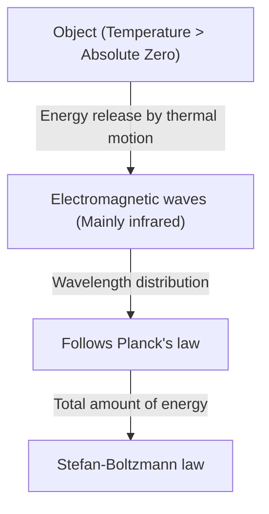
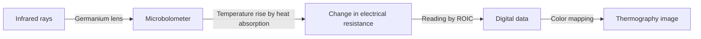

## Introduction: An Invitation to the Invisible World of "Heat"

Every object around us, as long as it is not at absolute zero (-273.15 degrees Celsius), constantly emits electromagnetic waves in the form of "thermal radiation". "Thermography" is the technology that captures these electromagnetic waves, especially "infrared rays," which are invisible to the human eye, and visualizes the temperature distribution as colors.

With the COVID-19 pandemic, we have seen an explosive increase in monitors measuring body surface temperature at the entrances of airports and commercial facilities. However, the applications of thermography are not limited to medical care and public health. From finding poor insulation in buildings, detecting overheating in electrical equipment, searching for missing persons in the dark, and even serving as night sensors for autonomous vehicles, it plays an active role in countless fields that support modern society.

In this article, we will thoroughly explain from the basics how this magical technology is built on physical laws, and how the latest hardware converts infrared rays into electrical signals.

## Physical Basics: The Intersection of Heat and Light

To understand the principles of thermography, it is first necessary to unravel the relationship between "light (electromagnetic waves)" and "heat".

### Black-body Radiation

In physics, a "black body" refers to an ideal object that completely absorbs all wavelengths of electromagnetic waves incident from the outside, and also emits thermal radiation according to its own temperature. Although real objects are not perfect black bodies, the law of black-body radiation provides a powerful foundation for understanding the thermal radiation of all objects.

When an object has heat (molecules and atoms vibrate), its energy is released as electromagnetic waves. When the temperature is low, long-wavelength infrared rays are mainly emitted, and as the temperature rises, the peak shifts to shorter-wavelength visible light (red, yellow, white). This is why iron glows red when heated, and shines white at even higher temperatures.

### Stefan-Boltzmann Law

One of the most important physical laws in thermography is the "Stefan-Boltzmann Law", which was experimentally discovered by Josef Stefan in 1879 and theoretically proven by Ludwig Boltzmann in 1884.

This law states that "the total amount of energy radiated by a black body (radiant exitance) is proportional to the fourth power of its absolute temperature."

$$ E = \sigma T^4 $$

Here,
- $E$ is the radiant exitance (energy radiated per unit area)
- $\sigma$ (sigma) is the Stefan-Boltzmann constant (approximately $5.67 \times 10^{-8} \, \text{W/(m}^2\cdot\text{K}^4\text{)}$)
- $T$ is the absolute temperature (Kelvin, K)

This property of being "proportional to the fourth power" has a decisive meaning for thermography. Even a slight increase in temperature results in a dramatic increase in the amount of infrared energy radiated. For example, even if the temperature rises slightly from room temperature (about 300K), the difference in the energy reaching the sensor becomes prominent, making it possible to detect minute temperature differences with high sensitivity.

### The Importance of Emissivity

Since real objects are not ideal black bodies, it is necessary to multiply the above energy amount by the "emissivity ($\epsilon$)".

$$ E = \epsilon \sigma T^4 $$

Emissivity has a value between 0 and 1.
- **Black body**: $\epsilon = 1.0$
- **Human skin**: $\epsilon \approx 0.98$ (very close to a black body in the infrared region)
- **Polished metal**: $\epsilon \approx 0.02 - 0.1$ (tends to reflect infrared rays and is unlikely to radiate its own heat)

In order to measure temperature accurately with thermography, it is essential to set the emissivity of the target object correctly. When trying to measure the temperature of a metal surface, it often picks up the reflection of surrounding heat sources, resulting in a measurement that differs from the actual temperature.

## Infrared Sensor Mechanism: Converting Heat into Electricity

While CMOS and CCD sensors are used for cameras to capture visible light, thermography cameras are equipped with special infrared sensors. They can be broadly divided into "cooled" and "uncooled" types, but the one widely used in recent years is the uncooled sensor using a "Microbolometer".

### Structure and Principle of a Microbolometer

A microbolometer is a minute element that senses heat and changes its own electrical resistance. Hundreds of thousands of these elements arranged in a grid (array) form the heart of thermography.

1. **Absorption of infrared rays**:
   Infrared rays entering through a lens (since ordinary glass does not pass infrared rays, special materials such as germanium are used) strike the surface of the microbolometer (usually vanadium oxide or amorphous silicon).
2. **Temperature rise**:
   The pixels that absorb the energy of the infrared rays rise in temperature slightly (from a few millikelvins to a few tenths of a degree).
3. **Change in resistance**:
   As the temperature rises, the electrical resistance of the element changes.
4. **Conversion to electrical signals**:
   The Readout Integrated Circuit (ROIC) located behind reads this change in resistance as a change in voltage or current, and converts it into digital data.
5. **Imaging (False color processing)**:
   For the digitized temperature data, pseudo-colors (false colors) such as red or white for high-temperature areas and blue or black for low-temperature areas are assigned, generating an image (thermogram) that we can visually understand.

### The Revolution of Uncooled Sensors

In the past, highly sensitive infrared cameras needed to be cooled to cryogenic temperatures (around -200°C) using liquid nitrogen or Stirling coolers so that the heat generated by the sensor itself (dark current) would not interfere with the measurement (cooled type). This was very large, heavy, expensive, and took time to start up.

However, with the advancement of MEMS (Micro-Electro-Mechanical Systems) technology, microbolometers that operate at room temperature (uncooled type) have been put to practical use. By miniaturizing the sensors and creating a structure that cuts off heat conduction from the surroundings (suspended structure), it succeeded in obtaining sufficient sensitivity even without cooling. As a result, thermography cameras have become smaller and cheaper, evolving to the point of modules that can be installed in smartphones.

## Wide Applications of Thermography

The ability to visualize invisible heat has revolutionized many industries and people's lives.

### 1. Medical/Healthcare and Infectious Disease Control
It is best known for body surface temperature screening. Because it can measure the temperature of many people instantly without contact, it is indispensable for quarantine at airports and detecting people with fever at event venues. In addition, since it can visualize the decrease in skin temperature due to poor blood flow, it is also utilized as an auxiliary diagnostic tool in medical settings, such as diagnosing vascular disorders and identifying inflamed areas in sports medicine.

### 2. Diagnosis of Infrastructure and Buildings
When shooting the walls or roofs of buildings with thermography, you can find missing insulation, drafts entering, and moisture retention due to rain leaks (the temperature drops compared to the surroundings due to the heat of vaporization when moisture evaporates) without destroying them. It has become a very powerful non-destructive inspection tool in building energy conservation diagnostics and aging investigations.

### 3. Maintenance and Inspection of Industrial Equipment (Predictive Maintenance)
Electrical and mechanical equipment such as motors, switchboards, and transformers in factories are often accompanied by abnormal heat generation before a failure or short circuit occurs. Regular inspections using thermography make it possible to perform "predictive maintenance" to detect abnormal heating points (hot spots) early and prevent serious accidents and factory shutdowns.

### 4. Security and Night Surveillance
While visible light cameras do not function in complete darkness with no light source, thermography captures the heat (infrared rays) emitted by the object itself, so it can obtain clear images even without any light. The characteristic of being able to discover targets even in bad weather or through smoke is highly valued in detecting intruders, border security, or searching for missing persons at sea.

### 5. In-Vehicle Sensors (Night Vision)
In recent years, the installation of far-infrared cameras as part of Advanced Driver Assistance Systems (ADAS) in automobiles has been progressing. When driving at night, it detects pedestrians and wild animals far away that headlights cannot reach by their heat, and contributes to reducing nighttime accidents by issuing warnings to drivers or activating automatic brakes.

## Conclusion and Future Prospects

From the classical physics of the Stefan-Boltzmann law to the latest microbolometer arrays using MEMS technology, thermography is a technology that can be called a crystallization of human wisdom.

In the future, as sensors become higher in pixel count and further reduced in cost, integration with image analysis technology using AI (Artificial Intelligence) is expected. Rather than simply showing temperature in color, a fully automated monitoring system where AI automatically learns abnormal patterns and predicts and notifies that "this equipment has a high probability of breaking down in a few days" will become widespread.

The invisible world of "heat". The thermography technology that visualizes it continues to evolve our society into a safer, more efficient, and more comfortable one.
