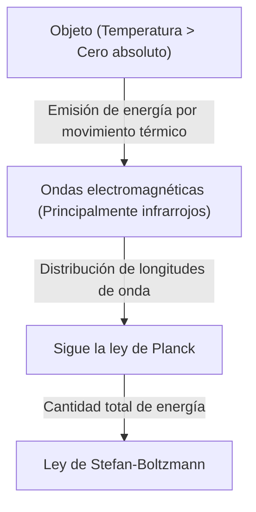
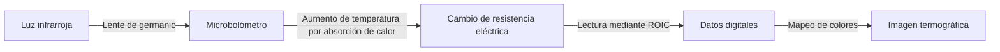

## Introducción: Una invitación al mundo invisible del "calor"

Todos los objetos de nuestro entorno, siempre y cuando no se encuentren en el cero absoluto (menos 273,15 grados Celsius), emiten constantemente ondas electromagnéticas en forma de "radiación térmica". La "termografía" es la tecnología que capta estas ondas electromagnéticas invisibles para el ojo humano, especialmente la "luz infrarroja", y visualiza la distribución de la temperatura a través del color.

Con la pandemia de COVID-19, hemos visto una explosión de monitores que miden la temperatura corporal en las entradas de aeropuertos y centros comerciales. Sin embargo, las aplicaciones de la termografía van más allá de la medicina y la salud pública. Desde la detección de aislamientos defectuosos en edificios, pasando por la detección de sobrecalentamientos en equipos eléctricos y la búsqueda de personas desaparecidas en la oscuridad, hasta los sensores nocturnos de los coches autónomos, esta tecnología resulta vital en innumerables campos que sustentan la sociedad moderna.

En este artículo, explicaremos en detalle y desde lo más básico cómo esta mágica tecnología se basa en las leyes de la física, y cómo el hardware más avanzado convierte los rayos infrarrojos en señales eléctricas.

## Fundamentos físicos: La intersección entre calor y luz

Para comprender los principios de la termografía, primero debemos descifrar la relación entre la "luz (ondas electromagnéticas)" y el "calor".

### Radiación de cuerpo negro (Black-body Radiation)

En física, un "cuerpo negro" es un objeto ideal que absorbe completamente todas las ondas electromagnéticas de cualquier longitud de onda que incidan sobre él, y que al mismo tiempo emite radiación térmica en función de su propia temperatura. Aunque los objetos reales no son cuerpos negros perfectos, la ley de radiación del cuerpo negro constituye una poderosa base para comprender la radiación térmica de cualquier objeto.

Cuando un objeto tiene calor (es decir, sus moléculas o átomos vibran), esa energía se libera en forma de ondas electromagnéticas. A bajas temperaturas, se emite principalmente radiación infrarroja de longitud de onda larga, y a medida que la temperatura aumenta, el pico se desplaza hacia la luz visible de longitud de onda más corta (rojo, amarillo, blanco). Por eso el hierro brilla en color rojo cuando se calienta y alcanza un brillo blanco a temperaturas aún más altas.

### Ley de Stefan-Boltzmann (Stefan-Boltzmann Law)

Una de las leyes físicas más importantes en la termografía es la "Ley de Stefan-Boltzmann", descubierta experimentalmente por Josef Stefan en 1879 y demostrada teóricamente por Ludwig Boltzmann en 1884.

Esta ley establece que "la cantidad total de energía radiada por un cuerpo negro (emitancia radiante) es proporcional a la cuarta potencia de su temperatura absoluta".

$$ E = \sigma T^4 $$

Donde:
- $E$ es la emitancia radiante (energía radiada por unidad de área)
- $\sigma$ (sigma) es la constante de Stefan-Boltzmann (aproximadamente $5.67 \times 10^{-8} \, \text{W/(m}^2\cdot\text{K}^4\text{)}$)
- $T$ es la temperatura absoluta (Kelvin, K)

Esta característica de ser "proporcional a la cuarta potencia" tiene una importancia decisiva para la termografía. Un aumento mínimo de la temperatura provoca un incremento drástico de la cantidad de energía infrarroja emitida. Por ejemplo, incluso si la temperatura se eleva solo ligeramente por encima de la temperatura ambiente (unos 300K), la diferencia de energía que llega al sensor resulta muy evidente, lo que permite detectar variaciones minúsculas de temperatura con alta sensibilidad.

### La importancia de la emisividad (Emissivity)

Dado que los objetos reales no son cuerpos negros ideales, es necesario multiplicar la cantidad de energía mencionada anteriormente por la "emisividad ($\epsilon$)".

$$ E = \epsilon \sigma T^4 $$

La emisividad tiene un valor entre 0 y 1.
- **Cuerpo negro**: $\epsilon = 1.0$
- **Piel humana**: $\epsilon \approx 0.98$ (Muy similar a un cuerpo negro en la región infrarroja)
- **Metal pulido**: $\epsilon \approx 0.02 - 0.1$ (Refleja fácilmente los rayos infrarrojos y apenas irradia su propio calor)

Para medir la temperatura con precisión mediante termografía, es imprescindible ajustar correctamente la emisividad del objeto. Al intentar medir la temperatura de una superficie metálica, el sensor suele captar los reflejos de las fuentes de calor circundantes, lo que frecuentemente da como resultado mediciones que difieren de la temperatura real.

## Mecanismo de los sensores infrarrojos: Convirtiendo el calor en electricidad

Mientras que las cámaras convencionales utilizan sensores como CMOS o CCD para capturar la luz visible, las cámaras termográficas emplean sensores infrarrojos especiales. Existen fundamentalmente dos tipos: "refrigerados" y "no refrigerados", pero en los últimos años se han popularizado ampliamente los sensores no refrigerados que utilizan "microbolómetros (Microbolometers)".

### Estructura y funcionamiento del microbolómetro

Un microbolómetro es un dispositivo diminuto que detecta el calor y cambia su resistencia eléctrica. El corazón de la cámara termográfica está formado por cientos de miles de estos elementos dispuestos en una cuadrícula (matriz).

1. **Absorción de luz infrarroja**:
   Los rayos infrarrojos que entran a través de la lente (los vidrios comunes no dejan pasar los infrarrojos, por lo que se utilizan materiales especiales como el germanio) inciden en la superficie del microbolómetro (usualmente de óxido de vanadio o silicio amorfo).
2. **Aumento de temperatura**:
   Los píxeles que absorben la energía de los rayos infrarrojos experimentan un ligero aumento de temperatura (desde unos pocos milikelvins hasta unas décimas de grado).
3. **Cambio en el valor de resistencia**:
   A medida que aumenta la temperatura, cambia la resistencia eléctrica del elemento.
4. **Conversión a señal eléctrica**:
   Un circuito integrado de lectura (ROIC) situado detrás lee este cambio de resistencia como un cambio de voltaje o corriente y lo convierte en datos digitales.
5. **Formación de la imagen (Procesamiento de falso color)**:
   A los datos de temperatura digitalizados se les asignan pseudocolores (falso color), como rojo o blanco para las partes de alta temperatura, y azul o negro para las partes de baja temperatura, generando una imagen (termograma) que nuestros ojos pueden comprender y visualizar.

### La revolución de los sensores no refrigerados

Antiguamente, las cámaras infrarrojas de alta sensibilidad requerían enfriarse a temperaturas criogénicas (cerca de -200 °C) utilizando nitrógeno líquido o enfriadores Stirling para evitar que el calor generado por el propio sensor (corriente oscura) interfiriera con las mediciones (tipo refrigerado). Estos sistemas eran muy grandes, pesados, costosos y tardaban mucho en encenderse.

Sin embargo, los avances en la tecnología MEMS (Sistemas Microelectromecánicos) permitieron el uso práctico de microbolómetros que funcionan a temperatura ambiente (tipo no refrigerado). Al miniaturizar los sensores y utilizar una estructura que aísla la conducción de calor del entorno (estructura suspendida), se logró obtener una sensibilidad suficiente incluso sin refrigeración. Esto ha permitido que las cámaras termográficas se vuelvan más pequeñas y asequibles, evolucionando hasta convertirse en módulos que pueden integrarse en teléfonos inteligentes.

## Amplia gama de aplicaciones de la termografía

La capacidad de visualizar el calor invisible ha revolucionado muchas industrias y la vida de las personas.

### 1. Medicina, salud pública y prevención de infecciones
Es más conocida por su uso en el cribado de la temperatura corporal. Dado que permite medir la temperatura de muchas personas de forma instantánea y sin contacto, resulta indispensable para los controles sanitarios en aeropuertos y la detección de personas con fiebre en eventos. Además, al visualizar la caída de la temperatura de la piel debida al deterioro del flujo sanguíneo, se utiliza como herramienta de diagnóstico complementaria en el ámbito médico, como en el diagnóstico de trastornos vasculares o la identificación de zonas inflamadas en la medicina deportiva.

### 2. Diagnóstico de infraestructuras y edificios
Al fotografiar las paredes y los techos de un edificio con termografía, es posible detectar defectos en el aislamiento, infiltraciones de corrientes de aire y retención de humedad por goteras (la temperatura desciende en relación con el entorno debido al calor de vaporización cuando la humedad se evapora) sin necesidad de destruir nada. Constituye una herramienta de inspección no destructiva muy potente en las auditorías de eficiencia energética de edificios y las investigaciones de envejecimiento.

### 3. Mantenimiento e inspección de equipos industriales (Mantenimiento predictivo)
Los equipos eléctricos y mecánicos de las fábricas, como motores, cuadros de distribución y transformadores, a menudo experimentan un calentamiento anormal antes de que se produzca una avería o un cortocircuito. Las inspecciones periódicas mediante termografía permiten detectar de forma temprana las áreas de calentamiento anómalo (puntos calientes), lo que facilita un "mantenimiento predictivo" que previene accidentes graves o interrupciones en el funcionamiento de la fábrica.

### 4. Seguridad y vigilancia nocturna
Las cámaras de luz visible no funcionan en la oscuridad total sin una fuente de luz, pero la termografía capta el calor (rayos infrarrojos) emitido por el propio objeto, lo que permite obtener imágenes nítidas incluso sin luz alguna. Esta característica, que permite descubrir objetivos a pesar del mal tiempo o el humo, es muy valorada en la detección de intrusos, el control de fronteras o la búsqueda de personas desaparecidas en el mar.

### 5. Sensores para vehículos (Visión nocturna)
En los últimos años, se ha incrementado la integración de cámaras de infrarrojo lejano como parte de los Sistemas Avanzados de Asistencia al Conductor (ADAS) en los automóviles. Durante la conducción nocturna, detectan mediante calor a peatones y animales salvajes que se encuentran más allá del alcance de los faros, y advierten al conductor o activan los frenos automáticos, lo que contribuye a reducir los accidentes nocturnos.

## Conclusión y perspectivas de futuro

Desde la física clásica con la ley de Stefan-Boltzmann hasta las matrices de microbolómetros más modernas que utilizan tecnología MEMS, la termografía es una tecnología que bien puede considerarse la culminación de la sabiduría humana.

En el futuro, junto con el aumento de la resolución de los sensores y la reducción continua de los costes, se espera su integración con la tecnología de análisis de imágenes mediante IA (Inteligencia Artificial). En lugar de limitarse a mostrar las temperaturas en color, se popularizarán sistemas de monitorización completamente automatizados en los que la IA aprenderá de forma automática los patrones anómalos y emitirá predicciones como: "Existe una alta probabilidad de que este equipo se averíe en los próximos días".

El mundo invisible del "calor". La tecnología de termografía que lo hace visible continúa haciendo que nuestra sociedad evolucione hacia algo más seguro, eficiente y confortable.
