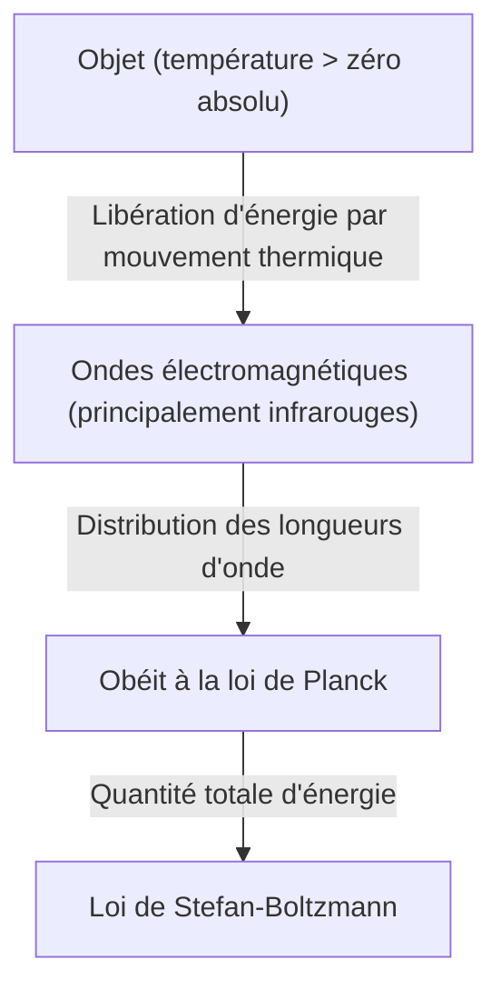

## Introduction : Une invitation dans le monde invisible de la "chaleur"

Tous les objets de notre environnement, à condition qu'ils ne soient pas au zéro absolu (-273,15 degrés Celsius), émettent constamment des ondes électromagnétiques sous forme de "rayonnement thermique". La technologie qui permet de capter ces ondes invisibles à l'œil humain, en particulier les "rayons infrarouges", et de visualiser la répartition de la température sous forme de couleurs, s'appelle la "thermographie".

Avec la pandémie du nouveau coronavirus, les occasions de voir des moniteurs mesurant la température corporelle à l'entrée des aéroports ou des centres commerciaux ont augmenté de manière explosive. Cependant, les applications de la thermographie ne se limitent pas à la médecine ou à la santé publique. De la détection d'une mauvaise isolation des bâtiments au repérage de la surchauffe d'équipements électriques, en passant par la recherche de personnes disparues dans l'obscurité ou même comme capteur nocturne pour les voitures autonomes, elle est active dans d'innombrables domaines qui soutiennent la société moderne.

Dans cet article, nous expliquerons de manière approfondie, depuis les bases, comment cette technologie magique repose sur les lois de la physique et comment le matériel récent convertit les rayons infrarouges en signaux électriques.

## Les bases physiques : L'intersection de la chaleur et de la lumière

Pour comprendre le principe de la thermographie, il est d'abord nécessaire d'élucider la relation entre la "lumière (onde électromagnétique)" et la "chaleur".

### Le rayonnement du corps noir (Black-body Radiation)

En physique, un "corps noir" désigne un objet idéal qui absorbe parfaitement toutes les longueurs d'onde des ondes électromagnétiques incidentes provenant de l'extérieur, et qui émet un rayonnement thermique en fonction de sa propre température. Bien que les objets réels ne soient pas de parfaits corps noirs, la loi du rayonnement du corps noir constitue une base solide pour comprendre le rayonnement thermique de n'importe quel objet.

Lorsqu'un objet possède de la chaleur (ses molécules ou atomes vibrent), cette énergie est libérée sous forme d'ondes électromagnétiques. À basse température, ce sont principalement des rayons infrarouges à grande longueur d'onde qui sont émis. À mesure que la température augmente, le pic se déplace vers la lumière visible à longueur d'onde plus courte (rouge, jaune, blanc). C'est pourquoi le fer chauffé brille en rouge, puis d'un éclat blanc à des températures encore plus élevées.

### La loi de Stefan-Boltzmann (Stefan-Boltzmann Law)

L'une des lois physiques les plus importantes pour la thermographie est la "loi de Stefan-Boltzmann", découverte expérimentalement par Jožef Stefan en 1879 et démontrée théoriquement par Ludwig Boltzmann en 1884.

Cette loi stipule que "la quantité totale d'énergie émise par un corps noir (l'émittance rayonnante) est proportionnelle à la quatrième puissance de sa température absolue".

$$ E = \sigma T^4 $$

Ici,
- $E$ est l'émittance rayonnante (énergie émise par unité de surface)
- $\sigma$ (sigma) est la constante de Stefan-Boltzmann (environ $5,67 \times 10^{-8} \, \text{W/(m}^2\cdot\text{K}^4\text{)}$)
- $T$ est la température absolue (Kelvin, K)

Cette propriété d'être "proportionnelle à la quatrième puissance" a une signification décisive pour la thermographie. Même si la température n'augmente que très peu, la quantité d'énergie infrarouge émise augmente de manière spectaculaire. Par exemple, avec une simple légère augmentation par rapport à la température ambiante (environ 300 K), la différence d'énergie atteignant le capteur est remarquable, ce qui permet de détecter d'infimes différences de température avec une grande sensibilité.

### L'importance de l'émissivité (Emissivity)

Les objets réels n'étant pas des corps noirs idéaux, il est nécessaire de multiplier la quantité d'énergie ci-dessus par "l'émissivité ($\epsilon$)".

$$ E = \epsilon \sigma T^4 $$

L'émissivité a une valeur comprise entre 0 et 1.
- **Corps noir** : $\epsilon = 1,0$
- **Peau humaine** : $\epsilon \approx 0,98$ (très proche d'un corps noir dans la plage infrarouge)
- **Métal poli** : $\epsilon \approx 0,02 - 0,1$ (réfléchit facilement les infrarouges et a du mal à émettre sa propre chaleur)

Pour mesurer avec précision la température grâce à la thermographie, il est indispensable de régler correctement l'émissivité de l'objet ciblé. Si l'on tente de mesurer la température d'une surface métallique, le capteur captera souvent les reflets des sources de chaleur environnantes, ce qui entraînera des résultats de mesure différents de la température réelle.

## Le mécanisme des capteurs infrarouges : Transformer la chaleur en électricité

Alors que les caméras utilisent des capteurs tels que les CMOS ou CCD pour capturer la lumière visible, les caméras thermographiques sont équipées de capteurs infrarouges spéciaux. Il en existe deux grandes catégories, "refroidis" et "non refroidis", mais ce sont les capteurs non refroidis utilisant des "microbolomètres (Microbolometer)" qui se sont largement démocratisés ces dernières années.

### Structure et principe du microbolomètre

Le microbolomètre est un composant minuscule qui détecte la chaleur et modifie sa propre résistance électrique. Des centaines de milliers de ces éléments disposés en grille (matrice) constituent le cœur de la thermographie.

1. **Absorption des infrarouges** :
   Les rayons infrarouges, après avoir traversé la lentille (le verre ordinaire ne laissant pas passer les infrarouges, des matériaux spéciaux comme le germanium sont utilisés), frappent la surface du microbolomètre (généralement en oxyde de vanadium ou en silicium amorphe).
2. **Élévation de température** :
   Les pixels ayant absorbé l'énergie infrarouge voient leur température augmenter légèrement (de quelques millikelvins à environ un dixième de degré).
3. **Modification de la valeur de la résistance** :
   Lorsque la température augmente, la résistance électrique du composant change.
4. **Conversion en signal électrique** :
   Le circuit intégré de lecture (ROIC) situé à l'arrière lit cette variation de résistance sous forme de variation de tension ou de courant et la convertit en données numériques.
5. **Formation de l'image (traitement en fausses couleurs)** :
   Aux données de température numérisées, des pseudo-couleurs (fausses couleurs) sont attribuées, par exemple le rouge ou le blanc pour les parties à haute température, et le bleu ou le noir pour les parties à basse température, afin de générer une image compréhensible pour nos yeux (thermogramme).

### La révolution des capteurs non refroidis

Autrefois, les caméras infrarouges à haute sensibilité devaient être refroidies à des températures cryogéniques (autour de -200°C) à l'aide d'azote liquide ou de refroidisseurs Stirling (type refroidi), afin que la chaleur émise par le capteur lui-même (courant d'obscurité) n'interfère pas avec la mesure. Elles étaient très grandes, lourdes, chères et lentes à démarrer.

Cependant, grâce aux avancées des technologies MEMS (systèmes micro-électromécaniques), des microbolomètres fonctionnant à température ambiante (type non refroidi) ont été développés. En miniaturisant le capteur et en créant une structure qui coupe la conduction thermique de l'environnement (structure suspendue), on a réussi à obtenir une sensibilité suffisante même sans refroidissement. Ainsi, les caméras thermographiques sont devenues plus petites, moins chères, et ont même évolué vers des modules pouvant être intégrés dans des smartphones.

## Les vastes applications de la thermographie

La capacité de visualiser la chaleur invisible révolutionne de nombreuses industries et le quotidien des gens.

### 1. Médecine, santé et lutte contre les maladies infectieuses
C'est le domaine le plus connu pour le dépistage de la température corporelle. Comme elle peut mesurer instantanément et sans contact la température de nombreuses personnes, elle est indispensable pour les quarantaines dans les aéroports ou la détection des personnes fiévreuses lors d'événements. De plus, comme elle peut visualiser la baisse de la température cutanée due à une mauvaise circulation sanguine, elle est également utilisée dans le milieu médical comme outil de diagnostic auxiliaire pour l'identification de troubles vasculaires ou de zones enflammées en médecine du sport.

### 2. Diagnostic des infrastructures et des bâtiments
Photographier les murs ou le toit d'un bâtiment par thermographie permet de découvrir, sans les détruire, des défauts d'isolation, des infiltrations d'air ou la stagnation d'humidité due à des fuites d'eau (la température baisse par rapport à l'environnement à cause de la chaleur de vaporisation lorsque l'eau s'évapore). C'est devenu un outil d'inspection non destructif extrêmement puissant pour le diagnostic énergétique ou l'étude du vieillissement des bâtiments.

### 3. Maintenance et inspection des équipements industriels (maintenance prédictive)
Les équipements électriques et mécaniques des usines, tels que les moteurs, les tableaux de distribution ou les transformateurs, s'accompagnent souvent d'une production de chaleur anormale avant de tomber en panne ou de court-circuiter. Les inspections thermographiques régulières permettent de détecter précocement les zones de chauffage anormales (points chauds), rendant ainsi possible une "maintenance prédictive" qui prévient les accidents graves ou l'arrêt de la production.

### 4. Sécurité et surveillance nocturne
Alors que les caméras à lumière visible ne fonctionnent pas dans l'obscurité totale sans source de lumière, la thermographie capte la chaleur (infrarouge) émise par l'objet lui-même, ce qui permet d'obtenir des images nettes même en l'absence de lumière. Sa capacité à repérer des cibles à travers les intempéries ou la fumée est très appréciée pour la détection d'intrus, la surveillance des frontières ou la recherche de personnes disparues en mer.

### 5. Capteurs embarqués (vision nocturne)
Ces dernières années, les caméras à infrarouge lointain sont de plus en plus intégrées dans le cadre des systèmes avancés d'assistance au conducteur (ADAS). Lors de la conduite de nuit, elles détectent par la chaleur la présence de piétons ou d'animaux sauvages éloignés que les phares ne peuvent atteindre, et contribuent à réduire les accidents nocturnes en avertissant le conducteur ou en activant le freinage automatique.

## Conclusion et perspectives d'avenir

De la physique classique de la loi de Stefan-Boltzmann aux dernières matrices de microbolomètres utilisant la technologie MEMS, la thermographie est une technologie qui peut être considérée comme l'aboutissement de la sagesse humaine.

À l'avenir, avec l'augmentation du nombre de pixels des capteurs et la poursuite de la réduction des coûts, on s'attend à une fusion avec les technologies d'analyse d'images par IA (intelligence artificielle). Au lieu de simplement indiquer la température par des couleurs, des systèmes de surveillance entièrement automatisés se démocratiseront : l'IA apprendra automatiquement les modèles d'anomalie et notifiera en prédisant que "cet équipement a une forte probabilité de tomber en panne dans quelques jours".

Le monde invisible de la "chaleur". La technologie thermographique qui le visualise continuera d'évoluer pour rendre notre société plus sûre, plus efficace et plus confortable.
