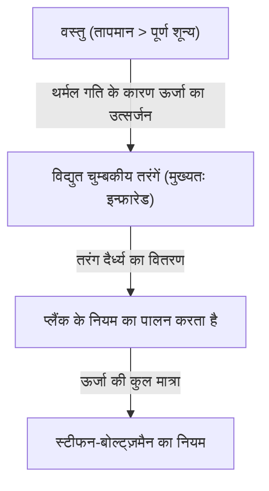
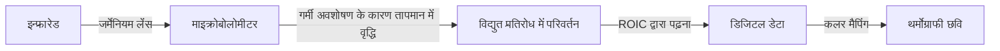

## प्रस्तावना: अदृश्य "गर्मी" की दुनिया में एक निमंत्रण

हमारे आस-पास की सभी वस्तुएं, जब तक कि वे पूर्ण शून्य (माइनस 273.15 डिग्री सेल्सियस) पर न हों, हमेशा "थर्मल विकिरण" के रूप में विद्युत चुम्बकीय तरंगें उत्सर्जित करती हैं। "थर्मोग्राफी" एक ऐसी तकनीक है जो इस विद्युत चुम्बकीय तरंग को पकड़ती है, विशेष रूप से "इन्फ्रारेड (अवरक्त)", जो मानव आंखों के लिए अदृश्य है, और तापमान वितरण को रंगों के रूप में दर्शाती है।

कोविड-19 महामारी के कारण, हवाई अड्डों और व्यावसायिक सुविधाओं के प्रवेश द्वारों पर शरीर की सतह के तापमान को मापने वाले मॉनिटर देखने के अवसर में भारी वृद्धि हुई है। हालांकि, थर्मोग्राफी का उपयोग केवल चिकित्सा और सार्वजनिक स्वास्थ्य तक ही सीमित नहीं है। यह आधुनिक समाज का समर्थन करने वाले अनगिनत क्षेत्रों में सक्रिय है, जैसे कि इमारतों में खराब इन्सुलेशन का पता लगाना, बिजली के उपकरणों में अति ताप का पता लगाना, अंधेरे में लापता लोगों की खोज करना, और यहां तक कि स्वायत्त ड्राइविंग वाहनों के लिए नाइट सेंसर के रूप में कार्य करना।

इस लेख में, हम बुनियादी बातों से पूरी तरह से समझाएंगे कि यह जादुई तकनीक भौतिकी के नियमों पर कैसे आधारित है, और नवीनतम हार्डवेयर कैसे इन्फ्रारेड को विद्युत संकेतों में परिवर्तित करता है।

## भौतिकी के मूल सिद्धांत: गर्मी और प्रकाश का प्रतिच्छेदन

थर्मोग्राफी के सिद्धांत को समझने के लिए, सबसे पहले "प्रकाश (विद्युत चुम्बकीय तरंग)" और "गर्मी" के बीच के संबंध को स्पष्ट करना आवश्यक है।

### ब्लैक-बॉडी रेडिएशन (Black-body Radiation)

भौतिकी में, एक "ब्लैक बॉडी" एक आदर्श वस्तु को संदर्भित करता है जो बाहर से आने वाली सभी तरंग दैर्ध्य की विद्युत चुम्बकीय तरंगों को पूरी तरह से अवशोषित करता है और अपने स्वयं के तापमान के अनुसार थर्मल विकिरण उत्सर्जित करता है। यद्यपि वास्तविक वस्तुएं पूर्ण ब्लैक बॉडी नहीं हैं, लेकिन ब्लैक बॉडी रेडिएशन के नियम किसी भी वस्तु के थर्मल विकिरण को समझने के लिए एक मजबूत आधार प्रदान करते हैं।

जब कोई वस्तु गर्मी रखती है (अणु या परमाणु कंपन करते हैं), तो उसकी ऊर्जा विद्युत चुम्बकीय तरंगों के रूप में जारी होती है। जब तापमान कम होता है, तो मुख्य रूप से लंबी तरंग दैर्ध्य वाले इन्फ्रारेड उत्सर्जित होते हैं, और जैसे-जैसे तापमान बढ़ता है, शिखर छोटी तरंग दैर्ध्य वाले दृश्य प्रकाश (लाल, पीला, सफेद) की ओर स्थानांतरित हो जाता है। यही कारण है कि लोहे को गर्म करने पर वह लाल चमकता है, और अधिक तापमान पर सफेद चमकने लगता है।

### स्टीफन-बोल्ट्ज़मैन का नियम (Stefan-Boltzmann Law)

थर्मोग्राफी में सबसे महत्वपूर्ण भौतिकी नियमों में से एक "स्टीफन-बोल्ट्ज़मैन का नियम" है, जिसे 1879 में जोसेफ स्टीफन द्वारा प्रयोगात्मक रूप से खोजा गया था और 1884 में लुडविग बोल्ट्ज़मैन द्वारा सैद्धांतिक रूप से सिद्ध किया गया था।

यह नियम बताता है कि "ब्लैक बॉडी द्वारा उत्सर्जित ऊर्जा की कुल मात्रा (विकिरण उत्सर्जन) उसके पूर्ण तापमान की चौथी घात के समानुपाती होती है।"

$$ E = \sigma T^4 $$

यहाँ,
- $E$ विकिरण उत्सर्जन है (प्रति इकाई क्षेत्र में उत्सर्जित ऊर्जा)
- $\sigma$ (सिग्मा) स्टीफन-बोल्ट्ज़मैन स्थिरांक है (लगभग $5.67 \times 10^{-8} \, \text{W/(m}^2\cdot\text{K}^4\text{)}$)
- $T$ पूर्ण तापमान है (केल्विन, K)

यह "चौथी घात के समानुपाती" गुण थर्मोग्राफी के लिए एक निर्णायक अर्थ रखता है। यदि तापमान थोड़ा भी बढ़ता है, तो उत्सर्जित इन्फ्रारेड ऊर्जा की मात्रा में नाटकीय रूप से वृद्धि होती है। उदाहरण के लिए, कमरे के तापमान (लगभग 300K) से थोड़ा सा भी तापमान बढ़ने पर, सेंसर तक पहुंचने वाली ऊर्जा का अंतर स्पष्ट रूप से दिखाई देता है, जिससे उच्च संवेदनशीलता के साथ मिनट तापमान अंतर का पता लगाना संभव हो जाता है।

### उत्सर्जन (Emissivity) का महत्व

चूंकि वास्तविक वस्तुएं आदर्श ब्लैक बॉडी नहीं हैं, इसलिए ऊर्जा की उपरोक्त मात्रा को "उत्सर्जन (\epsilon)" से गुणा करना आवश्यक है।

$$ E = \epsilon \sigma T^4 $$

उत्सर्जन का मान 0 से 1 के बीच होता है।
- **ब्लैक बॉडी**: $\epsilon = 1.0$
- **मानव त्वचा**: $\epsilon \approx 0.98$ (इन्फ्रारेड क्षेत्र में ब्लैक बॉडी के बहुत करीब)
- **पॉलिश की गई धातु**: $\epsilon \approx 0.02 - 0.1$ (इन्फ्रारेड को आसानी से प्रतिबिंबित करता है और अपनी गर्मी का उत्सर्जन करना मुश्किल है)

थर्मोग्राफी के साथ तापमान को सटीक रूप से मापने के लिए, लक्ष्य वस्तु के उत्सर्जन को सही ढंग से सेट करना आवश्यक है। यदि आप किसी धातु की सतह के तापमान को मापने का प्रयास करते हैं, तो यह अक्सर आसपास के गर्मी स्रोतों के प्रतिबिंब को पकड़ लेगा, जिसके परिणामस्वरूप वास्तविक तापमान से भिन्न माप परिणाम होंगे।

## इन्फ्रारेड सेंसर का तंत्र: गर्मी को बिजली में बदलना

CMOS और CCD जैसे सेंसर का उपयोग कैमरों द्वारा दृश्य प्रकाश को पकड़ने के लिए किया जाता है, लेकिन थर्मोग्राफी कैमरे विशेष इन्फ्रारेड सेंसर से लैस होते हैं। उन्हें मोटे तौर पर "कूल्ड (ठंडा)" और "अनकूल्ड (बिना ठंडा)" में विभाजित किया जा सकता है, लेकिन हाल के वर्षों में व्यापक रूप से लोकप्रिय एक अनकूल्ड सेंसर है जो "माइक्रोबोलोमीटर (Microbolometer)" का उपयोग करता है।

### माइक्रोबोलोमीटर की संरचना और सिद्धांत

माइक्रोबोलोमीटर एक छोटा तत्व है जो गर्मी को महसूस करता है और अपने विद्युत प्रतिरोध को बदलता है। इस तरह के लाखों तत्वों को एक ग्रिड (सरणी) में व्यवस्थित किया गया है, जो थर्मोग्राफी का दिल है।

1. **इन्फ्रारेड का अवशोषण**:
   लेंस से गुजरने वाली इन्फ्रारेड किरणें (जर्मेनियम जैसी विशेष सामग्रियों का उपयोग किया जाता है क्योंकि सामान्य कांच इन्फ्रारेड को पारित होने नहीं देता है) माइक्रोबोलोमीटर की सतह (आमतौर पर वैनेडियम ऑक्साइड या अनाकार सिलिकॉन) से टकराती हैं।
2. **तापमान में वृद्धि**:
   इन्फ्रारेड ऊर्जा को अवशोषित करने वाले पिक्सेल का तापमान थोड़ा बढ़ जाता है (कुछ मिलीकेल्विन से एक डिग्री के कुछ दसवें हिस्से तक)।
3. **प्रतिरोध मान में परिवर्तन**:
   जैसे ही तापमान बढ़ता है, तत्व का विद्युत प्रतिरोध मान बदल जाता है।
4. **विद्युत संकेतों में रूपांतरण**:
   इसके पीछे मौजूद रीडआउट इंटीग्रेटेड सर्किट (ROIC) इस प्रतिरोध परिवर्तन को वोल्टेज या करंट में परिवर्तन के रूप में पढ़ता है और इसे डिजिटल डेटा में परिवर्तित करता है।
5. **इमेजिंग (फॉल्स कलर प्रोसेसिंग)**:
   डिजीटल तापमान डेटा के लिए, उच्च तापमान वाले हिस्सों को लाल और सफेद जैसे छद्म रंग (फॉल्स कलर) और कम तापमान वाले हिस्सों को नीला और काला रंग दिया जाता है, जिससे एक छवि (थर्मोग्राम) उत्पन्न होती है जिसे हम अपनी आंखों से देखकर समझ सकते हैं।

### अनकूल्ड सेंसर की क्रांति

अतीत में, अत्यधिक संवेदनशील इन्फ्रारेड कैमरों को तरल नाइट्रोजन या स्टर्लिंग कूलर (कूल्ड प्रकार) का उपयोग करके क्रायोजेनिक तापमान (लगभग -200 डिग्री सेल्सियस) तक ठंडा करने की आवश्यकता होती थी, ताकि सेंसर द्वारा उत्सर्जित गर्मी (डार्क करंट) माप में हस्तक्षेप न करे। यह बहुत बड़ा, भारी, महंगा था और इसे शुरू होने में बहुत समय लगता था।

हालाँकि, MEMS (माइक्रो-इलेक्ट्रो-मैकेनिकल सिस्टम) तकनीक में प्रगति के साथ, कमरे के तापमान पर संचालित होने वाले माइक्रोबोलोमीटर (अनकूल्ड प्रकार) को व्यावहारिक उपयोग में लाया गया है। सेंसर को छोटा करके और एक ऐसी संरचना बनाकर जो परिवेश से गर्मी के संवहन को रोकती है (निलंबित संरचना), वे बिना ठंडा किए भी पर्याप्त संवेदनशीलता प्राप्त करने में सफल रहे। नतीजतन, थर्मोग्राफी कैमरे छोटे और सस्ते हो गए हैं, और स्मार्टफोन में स्थापित किए जा सकने वाले मॉड्यूल में विकसित हुए हैं।

## थर्मोग्राफी के व्यापक उपयोग

अदृश्य गर्मी को देखने की क्षमता ने कई उद्योगों और लोगों के जीवन में क्रांति ला दी है।

### 1. चिकित्सा/स्वास्थ्य सेवा और संक्रामक रोग नियंत्रण
इसे शरीर की सतह के तापमान की जांच के लिए सबसे अच्छी तरह से जाना जाता है। चूंकि यह संपर्क के बिना तुरंत बड़ी संख्या में लोगों के तापमान को माप सकता है, यह हवाई अड्डों पर संगरोध और घटना स्थलों पर बुखार वाले लोगों का पता लगाने के लिए अपरिहार्य है। इसके अलावा, चूंकि यह रक्त प्रवाह के बिगड़ने के कारण त्वचा के तापमान में कमी की कल्पना कर सकता है, इसलिए इसका उपयोग चिकित्सा क्षेत्र में एक सहायक नैदानिक उपकरण के रूप में भी किया जाता है, जैसे कि संवहनी विकारों का निदान करना और खेल चिकित्सा में सूजन वाले क्षेत्रों की पहचान करना।

### 2. बुनियादी ढांचे और इमारतों का निदान
थर्मोग्राफी के साथ किसी इमारत की दीवारों और छतों की तस्वीरें खींचकर, आप इन्सुलेशन की कमी, ड्राफ्ट के प्रवेश, या रिसाव के कारण पानी के संचय (आसपास के क्षेत्र की तुलना में तापमान कम हो जाता है जब पानी वाष्पित होता है तो वाष्पीकरण की गर्मी के कारण) को नष्ट किए बिना पा सकते हैं। इमारतों के ऊर्जा-बचत निदान और उम्र बढ़ने की जांच में यह एक बहुत ही शक्तिशाली गैर-विनाशकारी निरीक्षण उपकरण बन गया है।

### 3. औद्योगिक उपकरणों का रखरखाव और निरीक्षण (पूर्वानुमानित रखरखाव)
कारखानों में मोटर्स, स्विचबोर्ड और ट्रांसफार्मर जैसे इलेक्ट्रिकल और मैकेनिकल उपकरण अक्सर विफलता या शॉर्ट सर्किट से पहले असामान्य रूप से गर्म हो जाते हैं। थर्मोग्राफी के साथ नियमित निरीक्षण से असामान्य रूप से गर्म क्षेत्रों (हॉट स्पॉट) का जल्द पता लगाया जा सकता है, जिससे "पूर्वानुमानित रखरखाव" संभव हो जाता है जो गंभीर दुर्घटनाओं और कारखाने के शटडाउन को होने से रोकता है।

### 4. सुरक्षा और रात्रि निगरानी
दृश्य प्रकाश कैमरे पूर्ण अंधकार में काम नहीं करते हैं जहां कोई प्रकाश स्रोत नहीं होता है, लेकिन थर्मोग्राफी लक्ष्य वस्तु द्वारा ही उत्सर्जित गर्मी (इन्फ्रारेड) को पकड़ लेती है, इसलिए बिना किसी प्रकाश के भी स्पष्ट चित्र प्राप्त किए जा सकते हैं। घुसपैठियों का पता लगाने, सीमा सुरक्षा, या समुद्र में लापता लोगों की खोज के लिए खराब मौसम या धुएं के माध्यम से भी लक्ष्यों को खोजने की क्षमता उपयोगी है।

### 5. इन-व्हीकल सेंसर (नाइट विजन)
हाल के वर्षों में, ऑटोमोबाइल के लिए उन्नत चालक सहायता प्रणाली (ADAS) के हिस्से के रूप में दूर-अवरक्त (far-infrared) कैमरों की स्थापना आगे बढ़ रही है। रात में ड्राइविंग करते समय, यह पैदल चलने वालों और जंगली जानवरों को गर्मी से दूर से पता लगाता है, जहां हेडलाइट्स नहीं पहुंच सकती हैं, और ड्राइवरों को चेतावनी देता है या स्वचालित ब्रेक को सक्रिय करता है, जो रात में दुर्घटनाओं को कम करने में योगदान देता है।

## निष्कर्ष और भविष्य की संभावनाएं

स्टीफन-बोल्ट्ज़मैन के नियम के क्लासिकल भौतिकी से शुरू होकर MEMS तकनीक का उपयोग करते हुए नवीनतम माइक्रोबोलोमीटर सरणियों तक, थर्मोग्राफी एक ऐसी तकनीक है जिसे मानव ज्ञान का क्रिस्टलीकरण कहा जा सकता है।

भविष्य में, सेंसर के उच्च पिक्सेल गिनती और आगे की लागत में कमी की उम्मीद है, साथ ही एआई (कृत्रिम बुद्धिमत्ता) के उपयोग से छवि विश्लेषण तकनीक के साथ एकीकरण की भी उम्मीद है। तापमान को केवल रंगों में दिखाने के बजाय, पूरी तरह से स्वचालित निगरानी प्रणालियां जो एआई को विसंगति पैटर्न को स्वचालित रूप से सीखने और भविष्यवाणी करने की अनुमति देती हैं कि "इस उपकरण के कुछ दिनों में विफल होने की उच्च संभावना है" लोकप्रिय हो जाएंगी।

अदृश्य "गर्मी" की दुनिया। थर्मोग्राफी तकनीक जो इसकी कल्पना करती है, हमारे समाज को सुरक्षित, अधिक कुशल और आरामदायक बनाने के लिए विकसित हो रही है।
