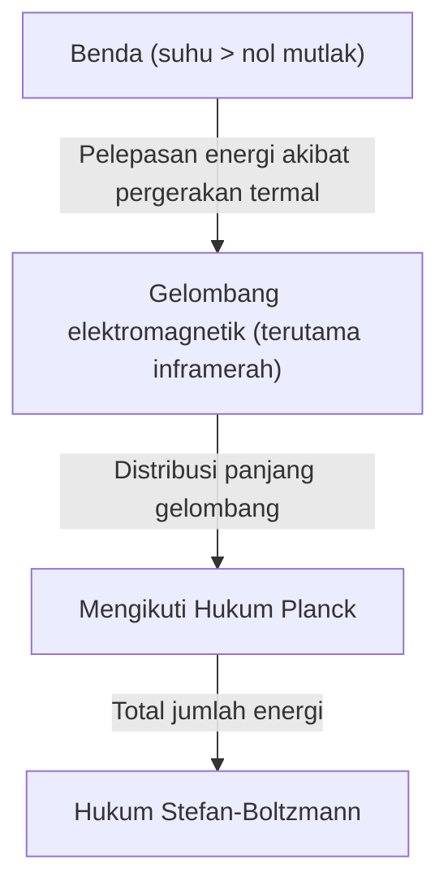
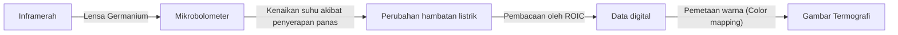

## Pendahuluan: Undangan ke Dunia 'Panas' yang Tak Terlihat

Semua benda di sekitar kita, selama tidak berada pada nol mutlak (minus 273,15 derajat Celcius), terus-menerus memancarkan gelombang elektromagnetik dalam bentuk "radiasi termal". Teknologi yang menangkap gelombang elektromagnetik yang tidak terlihat oleh mata manusia, khususnya "inframerah", dan memvisualisasikan distribusi suhu sebagai warna adalah "Termografi".

Seiring dengan pandemi COVID-19, kesempatan untuk melihat monitor yang mengukur suhu permukaan tubuh di pintu masuk bandara dan fasilitas komersial meningkat secara drastis. Namun, aplikasi termografi tidak terbatas pada medis dan kesehatan masyarakat. Teknologi ini memainkan peran aktif di berbagai bidang yang mendukung masyarakat modern, mulai dari mendeteksi isolasi termal yang buruk pada bangunan, mendeteksi panas berlebih pada peralatan listrik, mencari orang yang hilang dalam kegelapan, hingga sensor malam untuk mobil self-driving (otonom).

Dalam artikel ini, kami akan menjelaskan secara mendalam dari dasar-dasarnya mengenai bagaimana teknologi magis ini dibangun di atas hukum-hukum fisika, dan bagaimana perangkat keras terbaru mengubah inframerah menjadi sinyal listrik.

## Dasar-Dasar Fisika: Persimpangan Antara Panas dan Cahaya

Untuk memahami prinsip termografi, pertama-tama kita perlu menguraikan hubungan antara "cahaya (gelombang elektromagnetik)" dan "panas".

### Radiasi Benda Hitam (Black-body Radiation)

Dalam fisika, "benda hitam" merujuk pada benda ideal yang menyerap sepenuhnya semua gelombang elektromagnetik dari panjang gelombang apa pun yang datang dari luar, dan juga memancarkan radiasi termal sesuai dengan suhunya sendiri. Meskipun benda nyata bukanlah benda hitam yang sempurna, hukum radiasi benda hitam memberikan fondasi yang kuat untuk memahami radiasi termal dari semua benda.

Ketika suatu benda memiliki panas (molekul atau atom bergetar), energinya dilepaskan sebagai gelombang elektromagnetik. Pada suhu rendah, terutama memancarkan inframerah dengan panjang gelombang yang panjang, dan saat suhu meningkat, puncaknya bergeser ke cahaya tampak dengan panjang gelombang yang lebih pendek (merah, kuning, putih). Inilah sebabnya mengapa besi bersinar merah ketika dipanaskan dan bersinar putih pada suhu yang lebih tinggi.

### Hukum Stefan-Boltzmann (Stefan-Boltzmann Law)

Salah satu hukum fisika yang paling penting dalam termografi adalah "Hukum Stefan-Boltzmann", yang ditemukan secara eksperimental oleh Josef Stefan pada tahun 1879 dan dibuktikan secara teoretis oleh Ludwig Boltzmann pada tahun 1884.

Hukum ini menyatakan bahwa "total energi yang dipancarkan oleh benda hitam (emitansi radiasi) sebanding dengan pangkat empat dari suhu mutlaknya".

$$ E = \sigma T^4 $$

Di sini,
- $E$ adalah emitansi radiasi (energi yang dipancarkan per satuan luas)
- $\sigma$ (sigma) adalah konstanta Stefan-Boltzmann (sekitar $5,67 \times 10^{-8} \, \text{W/(m}^2\cdot\text{K}^4\text{)}$)
- $T$ adalah suhu mutlak (Kelvin, K)

Sifat "sebanding dengan pangkat empat" ini memiliki arti yang menentukan bagi termografi. Bahkan jika suhu meningkat sedikit saja, jumlah energi inframerah yang dipancarkan meningkat secara dramatis. Misalnya, bahkan jika suhu hanya naik sedikit dari suhu ruangan (sekitar 300K), perbedaan energi yang mencapai sensor akan terlihat dengan jelas, sehingga memungkinkan deteksi perbedaan suhu yang sangat kecil dengan sensitivitas tinggi.

### Pentingnya Emisivitas (Emissivity)

Karena benda nyata bukanlah benda hitam yang ideal, kita perlu mengalikan jumlah energi di atas dengan "emisivitas ($\epsilon$)".

$$ E = \epsilon \sigma T^4 $$

Emisivitas memiliki nilai antara 0 dan 1.
- **Benda Hitam**: $\epsilon = 1.0$
- **Kulit Manusia**: $\epsilon \approx 0.98$ (Sangat mendekati benda hitam di wilayah inframerah)
- **Logam yang Dipoles**: $\epsilon \approx 0.02 - 0.1$ (Cenderung memantulkan inframerah dan sulit memancarkan panasnya sendiri)

Untuk mengukur suhu secara akurat dengan termografi, sangat penting untuk mengatur emisivitas objek dengan benar. Jika Anda mencoba mengukur suhu permukaan logam, Anda sering kali menangkap pantulan dari sumber panas di sekitarnya, sehingga menghasilkan hasil pengukuran yang berbeda dari suhu sebenarnya.

## Mekanisme Sensor Inframerah: Mengubah Panas Menjadi Listrik

Sensor seperti CMOS dan CCD digunakan untuk kamera yang menangkap cahaya tampak, tetapi kamera termografi dilengkapi dengan sensor inframerah khusus. Secara garis besar dibagi menjadi tipe "berpendingin (cooled)" dan "tak berpendingin (uncooled)", namun yang telah menyebar luas dalam beberapa tahun terakhir adalah sensor tak berpendingin yang menggunakan "mikrobolometer (Microbolometer)".

### Struktur dan Prinsip Mikrobolometer

Mikrobolometer adalah elemen mikroskopis yang mendeteksi panas dan mengubah hambatan listriknya sendiri. Ratusan ribu elemen ini yang disusun dalam bentuk grid (array) adalah jantung dari termografi.

1. **Penyerapan Inframerah**:
   Inframerah yang masuk melalui lensa (kaca biasa tidak mentransmisikan inframerah, sehingga bahan khusus seperti germanium digunakan) mengenai permukaan mikrobolometer (biasanya vanadium oksida atau silikon amorf).
2. **Kenaikan Suhu**:
   Piksel yang telah menyerap energi inframerah mengalami sedikit kenaikan suhu (dari beberapa mili-Kelvin hingga sekitar beberapa persepuluh derajat).
3. **Perubahan Nilai Hambatan**:
   Saat suhu meningkat, nilai hambatan listrik elemen akan berubah.
4. **Konversi ke Sinyal Listrik**:
   Sirkuit terpadu pembacaan (ROIC) di belakangnya membaca perubahan nilai hambatan ini sebagai perubahan tegangan atau arus, dan mengubahnya menjadi data digital.
5. **Pencitraan (Pemrosesan False Color)**:
   Terhadap data suhu yang didigitalkan, warna semu (false color) seperti merah atau putih ditetapkan untuk bagian bersuhu tinggi dan biru atau hitam untuk bagian bersuhu rendah, menghasilkan gambar (termogram) yang dapat dipahami oleh mata kita.

### Revolusi Sensor Tak Berpendingin

Di masa lalu, kamera inframerah bersensitivitas tinggi harus didinginkan ke suhu kriogenik (sekitar -200℃) menggunakan nitrogen cair atau pendingin Stirling, agar panas yang dihasilkan oleh sensor itu sendiri (arus gelap) tidak mengganggu pengukuran (tipe berpendingin). Peralatan ini sangat besar, berat, mahal, dan membutuhkan waktu lama untuk dinyalakan.

Namun, karena kemajuan teknologi MEMS (Sistem Mikro-Elektromekanis), mikrobolometer yang beroperasi pada suhu kamar (tipe tak berpendingin) telah digunakan secara praktis. Dengan mengecilkan sensor dan menggunakan struktur yang memutus konduksi panas dari sekitarnya (struktur tersuspensi), berhasil mendapatkan sensitivitas yang memadai bahkan tanpa pendinginan. Berkat hal ini, kamera termografi menjadi lebih kecil dan lebih murah, bahkan berevolusi menjadi modul yang dapat dipasang di smartphone.

## Berbagai Aplikasi Termografi yang Luas

Kemampuan untuk memvisualisasikan panas yang tak terlihat telah merevolusi banyak industri dan kehidupan masyarakat.

### 1. Medis, Perawatan Kesehatan, dan Penanggulangan Penyakit Menular
Ini paling dikenal sebagai alat penyaringan untuk suhu permukaan tubuh. Karena dapat mengukur suhu banyak orang secara instan dan tanpa kontak, ini sangat penting untuk karantina bandara dan mendeteksi orang yang demam di tempat acara. Selain itu, karena dapat memvisualisasikan penurunan suhu kulit akibat peredaran darah yang buruk, ini juga dimanfaatkan di bidang medis sebagai alat diagnostik tambahan untuk mendiagnosis gangguan pembuluh darah dan mengidentifikasi area peradangan dalam kedokteran olahraga.

### 2. Diagnosis Infrastruktur dan Bangunan
Mengambil gambar dinding dan atap bangunan dengan termografi dapat mendeteksi kerusakan pada bahan insulasi, masuknya angin yang melalui celah, dan akumulasi kelembapan akibat kebocoran hujan (suhu turun dibandingkan sekitarnya karena panas penguapan saat kelembapan menguap) tanpa harus merusaknya. Alat ini telah menjadi alat inspeksi non-destruktif yang sangat kuat dalam diagnosis hemat energi dan survei penuaan bangunan.

### 3. Pemeliharaan dan Inspeksi Peralatan Industri (Pemeliharaan Prediktif)
Peralatan listrik dan mekanis seperti motor, panel distribusi, dan transformator di pabrik sering kali disertai dengan panas yang tidak normal sebelum terjadi kerusakan atau korsleting. Inspeksi rutin dengan termografi memungkinkan "pemeliharaan prediktif (predictive maintenance)", yaitu mendeteksi bagian pemanasan abnormal (hot spot) pada tahap awal dan mencegah kecelakaan serius serta penghentian operasi pabrik.

### 4. Keamanan dan Pengawasan Malam Hari
Kamera cahaya tampak tidak berfungsi dalam kegelapan total tanpa sumber cahaya, tetapi karena termografi menangkap panas (inframerah) yang dipancarkan oleh objek itu sendiri, maka gambar yang jelas dapat diperoleh bahkan tanpa cahaya sama sekali. Karakteristik ini berguna untuk mendeteksi penyusup, keamanan perbatasan, atau mencari orang yang hilang di laut, dan kemampuannya untuk menemukan target bahkan dalam cuaca buruk atau melalui asap sangat dihargai.

### 5. Sensor Otomotif (Night Vision)
Dalam beberapa tahun terakhir, pemasangan kamera inframerah jauh telah berkembang sebagai bagian dari Advanced Driver-Assistance Systems (ADAS) di dalam mobil. Saat mengemudi di malam hari, teknologi ini mendeteksi pejalan kaki dan satwa liar dengan panas di kejauhan yang tidak terjangkau oleh lampu depan kendaraan. Ini berkontribusi dalam mengurangi kecelakaan di malam hari dengan memberikan peringatan kepada pengemudi dan mengaktifkan pengereman otomatis.

## Kesimpulan dan Prospek Masa Depan

Berawal dari fisika klasik yaitu Hukum Stefan-Boltzmann, hingga ke array mikrobolometer terbaru yang menggunakan teknologi MEMS, termografi adalah teknologi yang dapat dikatakan sebagai kristalisasi kebijaksanaan manusia.

Di masa depan, seiring dengan jumlah piksel sensor yang lebih tinggi dan biaya yang lebih rendah, kita dapat mengharapkan perpaduan dengan teknologi analisis gambar oleh AI (Kecerdasan Buatan). Tidak hanya menunjukkan suhu dalam bentuk warna, namun sistem pemantauan yang sepenuhnya otomatis yang dapat dipelajari secara otomatis oleh AI dan memprediksi serta memberi tahu bahwa "peralatan ini memiliki probabilitas tinggi untuk rusak dalam beberapa hari" akan menyebar secara luas.

Dunia 'panas' yang tak terlihat. Teknologi termografi yang memvisualisasikannya terus mengembangkan masyarakat kita menjadi lebih aman, efisien, dan nyaman.
