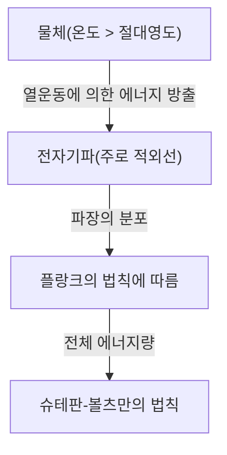

## 서론: 보이지 않는 '열'의 세계로의 초대

우리의 주변에 있는 모든 물체는 절대영도(섭씨 영하 273.15도)가 아닌 이상 항상 '열복사'라는 형태로 전자기파를 방출하고 있습니다. 인간의 눈에는 보이지 않는 이 전자기파, 특히 '적외선'을 포착하여 온도 분포를 색상으로 시각화하는 기술이 바로 '열화상(Thermography)'입니다.

코로나19의 유행으로 공항이나 상업 시설의 입구에서 체표 온도를 측정하는 모니터를 볼 기회가 폭발적으로 늘어났습니다. 하지만 열화상 카메라의 용도는 의료나 공중보건에만 그치지 않습니다. 건물의 단열 불량 발견, 전기 설비의 과열 감지, 어둠 속에서의 조난자 수색, 나아가 자율주행차의 야간 센서까지 현대 사회를 지탱하는 무수한 분야에서 활약하고 있습니다.

이 글에서는 이 마법 같은 기술이 어떻게 물리 법칙을 바탕으로 성립되어 있는지, 그리고 최신 하드웨어가 어떻게 적외선을 전기 신호로 변환하고 있는지를 기초부터 철저하게 해설합니다.

## 물리학적 기초: 열과 빛의 교차점

열화상의 원리를 이해하기 위해서는 먼저 '빛(전자기파)'과 '열'의 관계를 밝혀낼 필요가 있습니다.

### 흑체 복사(Black-body Radiation)

물리학에서 '흑체'란 외부에서 입사하는 모든 파장의 전자기파를 완전히 흡수하고, 또한 자신의 온도에 따라 열복사를 하는 이상적인 물체를 가리킵니다. 현실의 물체는 완전한 흑체가 아니지만, 흑체 복사의 법칙은 모든 물체의 열복사를 이해하기 위한 강력한 기초가 됩니다.

물체가 열을 가지면(분자나 원자가 진동하면) 그 에너지는 전자기파로 방출됩니다. 온도가 낮을 때는 파장이 긴 적외선이 주로 방출되고, 온도가 높아질수록 파장이 짧은 가시광선(빨간색, 노란색, 흰색)으로 피크가 이동해 갑니다. 철을 가열하면 붉게 빛나고, 더 고온이 되면 하얗게 빛나는 것은 이 때문입니다.

### 슈테판-볼츠만의 법칙(Stefan-Boltzmann Law)

열화상에서 가장 중요한 물리 법칙 중 하나가 1879년 요제프 슈테판에 의해 실험적으로 발견되고 1884년 루트비히 볼츠만에 의해 이론적으로 증명된 '슈테판-볼츠만의 법칙'입니다.

이 법칙은 "흑체가 방출하는 에너지의 총량(방사 발산도)은 그 절대온도의 4제곱에 비례한다"는 것입니다.

$$ E = \sigma T^4 $$

여기서,
- $E$ 는 방사 발산도(단위 면적당 방출되는 에너지)
- $\sigma$(시그마)는 슈테판-볼츠만 상수(약 $5.67 \times 10^{-8} \, \text{W/(m}^2\cdot\text{K}^4\text{)}$)
- $T$ 는 절대온도(켈빈, K)

이 '4제곱에 비례한다'는 성질이 열화상에 결정적인 의미를 갖습니다. 온도가 조금만 상승해도 방출되는 적외선의 에너지량은 극적으로 증가합니다. 예를 들어 온도가 실온(약 300K)에서 조금만 올라가도 센서에 도달하는 에너지의 차이는 현저하게 나타나기 때문에, 미세한 온도 차이를 고감도로 검출하는 것이 가능해집니다.

### 방사율(Emissivity)의 중요성

현실의 물체는 이상적인 흑체가 아니기 때문에 위의 에너지량에 '방사율($\epsilon$)'을 곱해야 합니다.

$$ E = \epsilon \sigma T^4 $$

방사율은 0에서 1 사이의 값을 갖습니다.
- **흑체**: $\epsilon = 1.0$
- **인간의 피부**: $\epsilon \approx 0.98$(적외선 영역에서 매우 흑체에 가까움)
- **광택이 나는 금속**: $\epsilon \approx 0.02 - 0.1$(적외선을 반사하기 쉽고, 자신의 열은 방출하기 어려움)

열화상 카메라로 정확한 온도를 측정하기 위해서는 대상물의 방사율을 올바르게 설정하는 것이 필수적입니다. 금속 표면의 온도를 측정하려고 하면 주변 열원의 반사를 포착하게 되어 실제 온도와 다른 측정 결과가 나오는 경우가 많습니다.

## 적외선 센서의 메커니즘: 열을 전기로 바꾸다

카메라가 가시광선을 포착하는 데에는 CMOS나 CCD와 같은 센서가 사용되지만, 열화상 카메라에는 특수한 적외선 센서가 탑재되어 있습니다. 크게 '냉각형'과 '비냉각형'이 존재하는데, 최근 널리 보급되고 있는 것은 '마이크로볼로미터(Microbolometer)'를 이용한 비냉각형 센서입니다.

### 마이크로볼로미터의 구조와 원리

마이크로볼로미터는 열을 감지하여 자신의 전기 저항을 변화시키는 미세한 소자입니다. 이 소자가 수십만 개, 격자 모양(배열)으로 늘어선 것이 열화상 카메라의 심장부가 됩니다.

1. **적외선 흡수**:
   렌즈(일반적인 유리는 적외선을 통과시키지 않기 때문에 게르마늄 등의 특수 소재가 사용됩니다)를 통과하여 들어온 적외선이 마이크로볼로미터의 표면(일반적으로 산화바나듐이나 비정질 실리콘)에 닿습니다.
2. **온도 상승**:
   적외선의 에너지를 흡수한 픽셀은 아주 약간(수 밀리켈빈에서 수십 분의 1도 정도) 온도가 상승합니다.
3. **저항값 변화**:
   온도가 상승하면 소자의 전기 저항값이 변화합니다.
4. **전기 신호로 변환**:
   배후에 있는 판독 집적 회로(ROIC)가 이 저항값의 변화를 전압이나 전류의 변화로 판독하여 디지털 데이터로 변환합니다.
5. **이미지화(폴스 컬러 처리)**:
   디지털화된 온도 데이터에 대해, 온도가 높은 부분은 빨간색이나 흰색, 낮은 부분은 파란색이나 검은색 등 유사 색상(폴스 컬러)을 할당하여 우리가 눈으로 보고 이해할 수 있는 화상(서모그램)을 생성합니다.

### 비냉각형 센서의 혁명

과거의 고감도 적외선 카메라는 센서 자체가 방출하는 열(암전류)이 측정에 방해가 되지 않도록 액체 질소나 스털링 쿨러를 사용하여 극저온(약 -200℃)으로 냉각해야 했습니다(냉각형). 이는 매우 크고, 무겁고, 비싸며, 부팅하는 데 시간이 걸렸습니다.

그러나 MEMS(미세 전자 기계 시스템) 기술의 진보로 실온에서 작동하는 마이크로볼로미터(비냉각형)가 실용화되었습니다. 센서를 극소화하고, 주변으로부터의 열전도를 차단하는 구조(공중 부양 구조)로 만듦으로써 냉각 없이도 충분한 감도를 얻는 데 성공한 것입니다. 이로써 열화상 카메라는 소형화·저가화되었고, 스마트폰에 탑재 가능한 모듈로까지 진화를 이루었습니다.

## 열화상의 광범위한 용도

눈에 보이지 않는 열을 시각화하는 능력은 많은 산업과 사람들의 생활에 혁명을 가져오고 있습니다.

### 1. 의료·헬스케어 및 감염병 대책
체표 온도의 스크리닝 용도로 가장 잘 알려져 있습니다. 비접촉으로 순식간에 다수의 사람의 온도를 측정할 수 있기 때문에 공항의 검역이나 이벤트 행사장에서의 발열자 감지에 필수적입니다. 또한, 혈류 악화로 인한 피부 온도 저하를 시각화할 수 있기 때문에 혈관 장애의 진단이나 스포츠 의학에서의 염증 부위 특정 등 의료 현장에서도 보조적인 진단 도구로 활용되고 있습니다.

### 2. 인프라·건축물 진단
건물의 벽이나 지붕을 열화상 카메라로 촬영하면 단열재의 결손, 틈새바람의 침입, 비가 새어 발생한 수분의 정체(수분이 증발할 때의 기화열로 주변보다 온도가 낮아짐) 등을 파괴하지 않고 발견할 수 있습니다. 건물의 에너지 절약 진단이나 노후화 조사에 있어서 매우 강력한 비파괴 검사 도구가 되고 있습니다.

### 3. 산업 설비의 보수·점검(예지 보전)
공장의 모터, 배전반, 변압기 등의 전기·기계 설비는 고장이나 합선이 일어나기 전에 비정상적인 발열을 동반하는 경우가 많습니다. 열화상을 통한 정기적인 점검에 의해 이상 가열 부위(핫스팟)를 조기에 발견하고, 중대한 사고나 공장 가동 중단을 미연에 방지하는 '예지 보전'이 가능해집니다.

### 4. 보안 및 야간 감시
가시광선 카메라는 광원이 없는 완전한 어둠 속에서는 기능하지 않지만, 열화상 카메라는 대상물 자체가 방출하는 열(적외선)을 포착하기 때문에 일절의 빛이 없어도 선명한 영상을 얻을 수 있습니다. 침입자 감지, 국경 수비, 또는 해상에서의 조난자 수색 등 악천후나 연기 너머로도 대상을 발견할 수 있는 특성이 중용되고 있습니다.

### 5. 차량용 센서(나이트 비전)
최근 자동차의 첨단 운전자 지원 시스템(ADAS)의 일부로 원적외선 카메라 탑재가 진행되고 있습니다. 야간 주행 시 전조등이 닿지 않는 멀리 있는 보행자나 야생 동물을 열로 감지하여 운전자에게 경고를 발하거나 자동 브레이크를 작동시킴으로써 야간 사고 감소에 기여하고 있습니다.

## 요약 및 미래에 대한 전망

슈테판-볼츠만의 법칙이라는 고전적인 물리학에서 시작하여 MEMS 기술을 이용한 최신의 마이크로볼로미터 배열에 이르기까지, 열화상 카메라는 인류 지혜의 결정체라고도 할 수 있는 기술입니다.

앞으로 센서의 고화소화와 더욱더 비용을 낮추는 기술이 진행됨과 동시에, AI(인공지능)를 통한 화상 해석 기술과의 융합이 기대되고 있습니다. 단순히 온도를 색으로 나타내는 것뿐만 아니라, AI가 이상 패턴을 자동으로 학습하여 "이 설비는 며칠 뒤에 고장 날 확률이 높다"고 예측하고 통지하는 완전 자동화된 모니터링 시스템이 보급되어 갈 것입니다.

눈에 보이지 않는 '열'의 세계. 그것을 시각화하는 열화상 기술은 우리 사회를 보다 안전하고 효율적이며 쾌적한 것으로 계속 진화시키고 있습니다.
