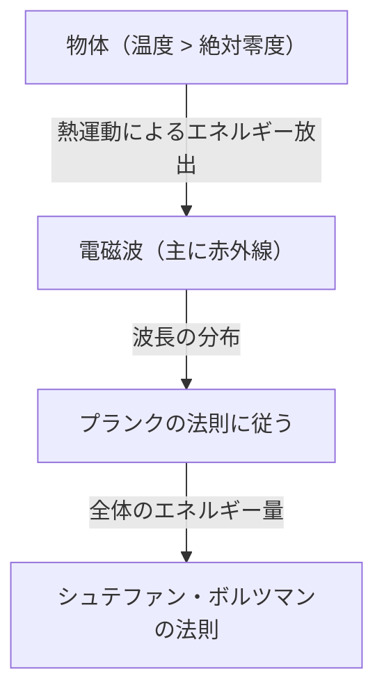
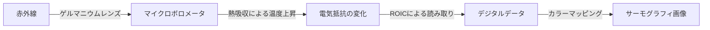

## はじめに：見えない「熱」の世界への招待

私たちの身の回りにあるすべての物体は、それが絶対零度（摂氏マイナス273.15度）でない限り、常に「熱放射」という形で電磁波を放っています。人間の目には見えないこの電磁波、特に「赤外線」を捉え、温度分布を色として可視化する技術が「サーモグラフィ」です。

新型コロナウイルスの流行により、空港や商業施設の入り口で体表温度を測定するモニターを見かける機会が爆発的に増えました。しかし、サーモグラフィの用途は医療や公衆衛生にとどまりません。建物の断熱不良の発見、電気設備の過熱検知、暗闇での遭難者捜索、さらには自動運転車の夜間センサーまで、現代社会を支える無数の分野で活躍しています。

本記事では、この魔法のような技術がいかにして物理法則から成り立っているのか、そして最新のハードウェアがいかにして赤外線を電気信号に変換しているのかを、基礎から徹底的に解説します。

## 物理学的基礎：熱と光の交差点

サーモグラフィの原理を理解するためには、まず「光（電磁波）」と「熱」の関係性を解き明かす必要があります。

### 黒体放射（Black-body Radiation）

物理学において「黒体」とは、外部から入射するすべての波長の電磁波を完全に吸収し、また自身の温度に応じて熱放射を行う理想的な物体のことを指します。現実の物体は完全な黒体ではありませんが、黒体放射の法則はあらゆる物体の熱放射を理解するための強力な基礎となります。

物体が熱を持つ（分子や原子が振動する）と、そのエネルギーは電磁波として放出されます。温度が低いときは波長の長い赤外線が主に放射され、温度が高くなるにつれて波長の短い可視光線（赤、黄、白）へとピークがシフトしていきます。鉄を熱すると赤く光り、さらに高温になると白く輝くのはこのためです。

### シュテファン・ボルツマンの法則（Stefan-Boltzmann Law）

サーモグラフィにおいて最も重要な物理法則の一つが、1879年にヨーゼフ・シュテファンによって実験的に発見され、1884年にルートヴィッヒ・ボルツマンによって理論的に証明された「シュテファン・ボルツマンの法則」です。

この法則は、「黒体が放射するエネルギーの総量（放射発散度）は、その絶対温度の4乗に比例する」というものです。

$$ E = \sigma T^4 $$

ここで、
- $E$ は放射発散度（単位面積あたりに放射されるエネルギー）
- $\sigma$（シグマ）はシュテファン・ボルツマン定数（約 $5.67 \times 10^{-8} \, \text{W/(m}^2\cdot\text{K}^4\text{)}$）
- $T$ は絶対温度（ケルビン, K）

この「4乗に比例する」という性質が、サーモグラフィにとって決定的な意味を持ちます。温度がわずかでも上昇すると、放射される赤外線のエネルギー量は劇的に増加します。例えば、温度が室温（約300K）から少し上がるだけで、センサーに届くエネルギーの差は顕著に現れるため、微小な温度差を高感度で検出することが可能になるのです。

### 放射率（Emissivity）の重要性

現実の物体は理想的な黒体ではないため、上記のエネルギー量に「放射率（$\epsilon$）」を掛け合わせる必要があります。

$$ E = \epsilon \sigma T^4 $$

放射率は0から1の間の値を持ちます。
- **黒体**: $\epsilon = 1.0$
- **人間の皮膚**: $\epsilon \approx 0.98$（赤外線領域において非常に黒体に近い）
- **磨かれた金属**: $\epsilon \approx 0.02 - 0.1$（赤外線を反射しやすく、自身の熱は放射しにくい）

サーモグラフィで正確な温度を測定するためには、対象物の放射率を正しく設定することが不可欠です。金属表面の温度を測ろうとすると、周囲の熱源の反射を拾ってしまい、実際の温度とは異なる測定結果が出ることがよくあります。

## 赤外線センサーのメカニズム：熱を電気に変える

カメラが可視光を捉えるのにはCMOSやCCDといったセンサーが使われますが、サーモグラフィカメラには特殊な赤外線センサーが搭載されています。大きく分けて「冷却型」と「非冷却型」が存在しますが、近年広く普及しているのは「マイクロボロメータ（Microbolometer）」を用いた非冷却型センサーです。

### マイクロボロメータの構造と原理

マイクロボロメータは、熱を感知して自身の電気抵抗を変化させる微小な素子です。この素子が数十万個、格子状（アレイ）に並べられたものがサーモグラフィの心臓部となります。

1. **赤外線の吸収**:
   レンズ（一般的なガラスは赤外線を通さないため、ゲルマニウムなどの特殊な素材が使われます）を通って入ってきた赤外線が、マイクロボロメータの表面（通常は酸化バナジウムやアモルファスシリコン）に当たります。
2. **温度上昇**:
   赤外線のエネルギーを吸収したピクセルは、わずかに（数ミリケルビンから数十分の1度程度）温度が上昇します。
3. **抵抗値の変化**:
   温度が上昇すると、素子の電気抵抗値が変化します。
4. **電気信号への変換**:
   背後にある読み出し集積回路（ROIC）がこの抵抗値の変化を電圧や電流の変化として読み取り、デジタルデータに変換します。
5. **画像化（フォールスカラー処理）**:
   デジタル化された温度データに対して、温度の高い部分を赤や白、低い部分を青や黒といった疑似カラー（フォールスカラー）を割り当てて、私たちが目で見て理解できる画像（サーモグラム）を生成します。

### 非冷却型センサーの革命

かつての高感度な赤外線カメラは、センサー自体が発する熱（暗電流）が測定の邪魔にならないよう、液体窒素やスターリングクーラーを使って極低温（-200℃付近）に冷却する必要がありました（冷却型）。これは非常に大きく、重く、高価で、起動に時間がかかりました。

しかし、MEMS（微小電気機械システム）技術の進歩により、室温で動作するマイクロボロメータ（非冷却型）が実用化されました。センサーを極小化し、周囲からの熱伝導を断つ構造（宙吊り構造）にすることで、冷却なしでも十分な感度を得ることに成功したのです。これにより、サーモグラフィカメラは小型化・低価格化し、スマートフォンに搭載可能なモジュールにまで進化を遂げました。

## サーモグラフィの広範な用途

目に見えない熱を可視化する能力は、多くの産業と人々の生活に革命をもたらしています。

### 1. 医療・ヘルスケアと感染症対策
体表温度のスクリーニングとして最もよく知られています。非接触で瞬時に多数の人の温度を測定できるため、空港の検疫やイベント会場での発熱者検知に不可欠です。また、血流の悪化による皮膚温度の低下を可視化できるため、血管障害の診断やスポーツ医学における炎症部位の特定など、医療現場でも補助的な診断ツールとして活用されています。

### 2. インフラ・建築物の診断
建物の壁や屋根をサーモグラフィで撮影すると、断熱材の欠損、隙間風の侵入、雨漏りによる水分の滞留（水分が蒸発する際の気化熱で周囲より温度が下がる）などを破壊することなく発見できます。建物の省エネ診断や老朽化調査において、非常に強力な非破壊検査ツールとなっています。

### 3. 産業設備の保守・点検（予知保全）
工場のモーター、配電盤、変圧器などの電気・機械設備は、故障やショートが起きる前に異常な発熱を伴うことが多くあります。サーモグラフィによる定期的な点検により、異常加熱部位（ホットスポット）を早期に発見し、重大な事故や工場稼働の停止を未然に防ぐ「予知保全」が可能になります。

### 4. セキュリティと夜間監視
可視光カメラは光源がない完全な暗闇では機能しませんが、サーモグラフィは対象物自体が発する熱（赤外線）を捉えるため、一切の光がなくても鮮明な映像を得ることができます。侵入者の検知、国境警備、または海上での遭難者捜索など、悪天候や煙越しでも対象を発見できる特性が重宝されています。

### 5. 車載センサー（ナイトビジョン）
近年、自動車の先進運転支援システム（ADAS）の一部として、遠赤外線カメラの搭載が進んでいます。夜間走行時において、ヘッドライトの届かない遠くにいる歩行者や野生動物を熱で検知し、ドライバーに警告を発したり自動ブレーキを作動させたりすることで、夜間の事故低減に寄与しています。

## まとめと未来への展望

シュテファン・ボルツマンの法則という古典的な物理学から始まり、MEMS技術を用いた最新のマイクロボロメータアレイに至るまで、サーモグラフィは人類の叡智の結晶とも言える技術です。

今後、センサーの高画素化とさらなる低コスト化が進むとともに、AI（人工知能）による画像解析技術との融合が期待されています。単に温度を色で示すだけでなく、AIが異常パターンを自動で学習し、「この設備はあと数日で故障する確率が高い」と予測して通知する完全自動化されたモニタリングシステムが普及していくでしょう。

目に見えない「熱」の世界。それを可視化するサーモグラフィ技術は、私たちの社会をより安全で、効率的で、快適なものへと進化させ続けています。
