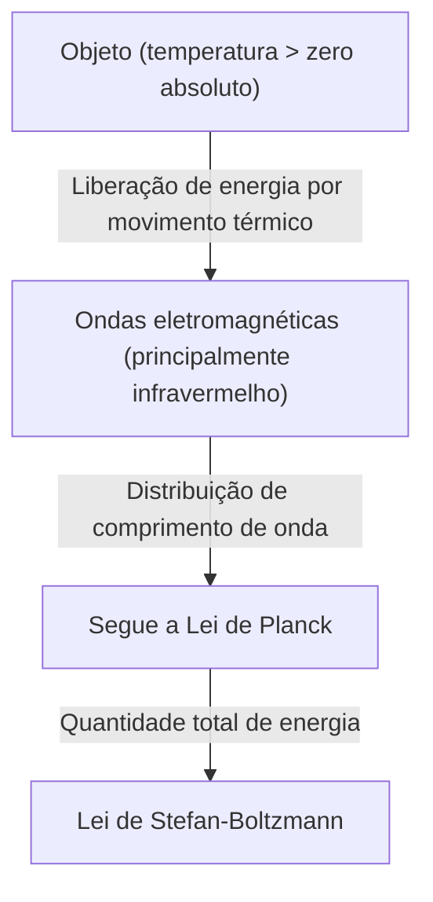
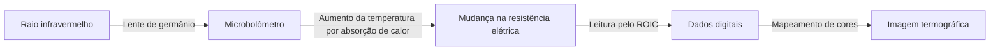

## Introdução: Um convite ao mundo invisível do "calor"

Todos os objetos ao nosso redor, a menos que estejam no zero absoluto (menos 273,15 graus Celsius), emitem constantemente ondas eletromagnéticas na forma de "radiação térmica". A "termografia" é a tecnologia que capta essas ondas eletromagnéticas invisíveis ao olho humano, especialmente a "radiação infravermelha", e visualiza a distribuição de temperatura por meio de cores.

Com a pandemia da COVID-19, aumentaram explosivamente as oportunidades de ver monitores medindo a temperatura da superfície corporal nas entradas de aeroportos e instalações comerciais. No entanto, as aplicações da termografia não se limitam à medicina e saúde pública. Desde a descoberta de falhas de isolamento em edifícios e a detecção de superaquecimento em equipamentos elétricos, até a busca por pessoas perdidas no escuro e os sensores noturnos em carros autônomos, ela atua em inúmeras áreas que sustentam a sociedade moderna.

Neste artigo, explicaremos detalhadamente desde os fundamentos como essa tecnologia aparentemente mágica se baseia nas leis da física, e como o hardware mais recente converte os raios infravermelhos em sinais elétricos.

## Fundamentos físicos: A intersecção da luz e do calor

Para entender o princípio da termografia, precisamos primeiro desvendar a relação entre "luz (ondas eletromagnéticas)" e "calor".

### Radiação de corpo negro (Black-body Radiation)

Na física, um "corpo negro" refere-se a um objeto ideal que absorve perfeitamente todas as ondas eletromagnéticas de qualquer comprimento de onda incidentes e emite radiação térmica de acordo com sua própria temperatura. Objetos reais não são corpos negros perfeitos, mas a lei da radiação de corpo negro serve como uma base poderosa para entender a radiação térmica de todos os objetos.

Quando um objeto tem calor (moléculas e átomos vibram), essa energia é liberada como ondas eletromagnéticas. Em temperaturas mais baixas, os raios infravermelhos de comprimento de onda longo são irradiados principalmente, e à medida que a temperatura sobe, o pico muda para a luz visível de comprimento de onda mais curto (vermelho, amarelo, branco). É por isso que o ferro brilha em vermelho quando aquecido e em branco brilhante em temperaturas ainda mais altas.

### Lei de Stefan-Boltzmann (Stefan-Boltzmann Law)

Uma das leis físicas mais importantes na termografia é a "Lei de Stefan-Boltzmann", descoberta experimentalmente por Josef Stefan em 1879 e provada teoricamente por Ludwig Boltzmann em 1884.

Esta lei afirma que "a quantidade total de energia irradiada por um corpo negro (emitância radiante) é proporcional à quarta potência da sua temperatura absoluta".

$$ E = \sigma T^4 $$

Onde,
- $E$ é a emitância radiante (energia irradiada por unidade de área)
- $\sigma$ (sigma) é a constante de Stefan-Boltzmann (cerca de $5.67 \times 10^{-8} \, \text{W/(m}^2\cdot\text{K}^4\text{)}$)
- $T$ é a temperatura absoluta (Kelvin, K)

Esta propriedade de "proporcionalidade à quarta potência" tem um significado decisivo para a termografia. Mesmo que a temperatura suba levemente, a quantidade de energia infravermelha irradiada aumenta drasticamente. Por exemplo, apenas com um pequeno aumento na temperatura ambiente (cerca de 300K), a diferença na energia que chega ao sensor torna-se proeminente, o que torna possível detectar variações diminutas de temperatura com alta sensibilidade.

### A importância da emissividade (Emissivity)

Como os objetos reais não são corpos negros ideais, é necessário multiplicar a quantidade de energia acima pela "emissividade ($\epsilon$)".

$$ E = \epsilon \sigma T^4 $$

A emissividade tem um valor entre 0 e 1.
- **Corpo negro**: $\epsilon = 1.0$
- **Pele humana**: $\epsilon \approx 0.98$ (muito próximo de um corpo negro na região do infravermelho)
- **Metal polido**: $\epsilon \approx 0.02 - 0.1$ (reflete facilmente os raios infravermelhos e dificilmente irradia seu próprio calor)

Para medir a temperatura com precisão usando a termografia, é essencial definir corretamente a emissividade do objeto alvo. Se você tentar medir a temperatura da superfície de um metal, muitas vezes captará os reflexos das fontes de calor ao redor, resultando em medições que diferem da temperatura real.

## Mecanismo dos sensores infravermelhos: Transformando calor em eletricidade

Enquanto as câmeras comuns usam sensores como CMOS e CCD para capturar luz visível, as câmeras termográficas são equipadas com sensores infravermelhos especiais. Eles são amplamente divididos em tipos "refrigerados" e "não refrigerados", mas o que se tornou amplamente difundido nos últimos anos é o sensor do tipo não refrigerado que utiliza um "microbolômetro (Microbolometer)".

### Estrutura e princípio do microbolômetro

Um microbolômetro é um elemento minúsculo que detecta o calor e altera sua própria resistência elétrica. Centenas de milhares desses elementos dispostos em uma grade (matriz) formam o coração de uma câmera termográfica.

1. **Absorção de raios infravermelhos**:
   Os raios infravermelhos que entram através da lente (vidro comum não permite a passagem de raios infravermelhos, portanto, são usados materiais especiais como germânio) atingem a superfície do microbolômetro (geralmente óxido de vanádio ou silício amorfo).
2. **Aumento da temperatura**:
   Os pixels que absorvem a energia dos raios infravermelhos têm um ligeiro aumento de temperatura (de alguns milikelvins a frações de um grau).
3. **Mudança na resistência**:
   À medida que a temperatura sobe, o valor da resistência elétrica do elemento muda.
4. **Conversão em sinal elétrico**:
   O circuito integrado de leitura (ROIC) por trás dele lê essa mudança no valor da resistência como uma mudança na tensão ou corrente e a converte em dados digitais.
5. **Geração de imagem (Processamento de falsa cor)**:
   Aos dados digitais de temperatura são atribuídas pseudo-cores (falsas cores) - como vermelho e branco para as partes mais quentes, e azul e preto para as partes mais frias - gerando uma imagem (termograma) que podemos ver e entender com nossos olhos.

### A revolução dos sensores não refrigerados

No passado, as câmeras infravermelhas de alta sensibilidade exigiam resfriamento para temperaturas extremamente baixas (em torno de -200 °C) usando nitrogênio líquido ou refrigeradores Stirling (tipo refrigerado) para que o calor (corrente de fuga) gerado pelo próprio sensor não interferisse na medição. Elas eram muito grandes, pesadas, caras e demoravam para ligar.

No entanto, com os avanços na tecnologia MEMS (Sistemas Microeletromecânicos), foram práticos os microbolômetros que operam à temperatura ambiente (tipo não refrigerado). Ao miniaturizar o sensor e adotar uma estrutura (estrutura suspensa) que corta a condução de calor ao redor, foi possível obter sensibilidade suficiente mesmo sem resfriamento. Como resultado, as câmeras termográficas tornaram-se menores e mais baratas, evoluindo até mesmo para módulos que podem ser embutidos em smartphones.

## Amplas aplicações da termografia

A capacidade de visualizar o calor invisível revolucionou muitas indústrias e a vida das pessoas.

### 1. Medicina, Saúde e Controle de Doenças Infecciosas
A aplicação mais conhecida é a triagem da temperatura da superfície corporal. Como pode medir a temperatura de muitas pessoas instantaneamente sem contato, é indispensável na triagem em aeroportos e detecção de febre em locais de eventos. Além disso, como pode visualizar a queda na temperatura da pele devido ao fluxo sanguíneo deficiente, também é usado como uma ferramenta de diagnóstico auxiliar em ambientes médicos, como no diagnóstico de distúrbios vasculares ou na identificação de áreas de inflamação na medicina esportiva.

### 2. Diagnóstico de Infraestrutura e Edifícios
Tirar fotos de paredes e telhados de edifícios com termografia permite descobrir falhas no isolamento, infiltração de correntes de ar e retenção de umidade por goteiras (a temperatura cai em relação ao redor devido ao calor de vaporização quando a água evapora) sem destruí-los. Tornou-se uma ferramenta de teste não destrutivo extremamente poderosa em diagnósticos de conservação de energia e investigações de deterioração de edifícios.

### 3. Manutenção e Inspeção de Equipamentos Industriais (Manutenção Preditiva)
Equipamentos elétricos e mecânicos como motores em fábricas, quadros de distribuição e transformadores geralmente apresentam geração de calor anormal antes que ocorram falhas ou curtos-circuitos. Inspeções termográficas regulares permitem a detecção precoce de áreas de aquecimento anormal (hot spots), tornando possível a "manutenção preditiva" para prevenir acidentes graves e paradas das operações da fábrica.

### 4. Segurança e Vigilância Noturna
Embora as câmeras de luz visível não funcionem na escuridão total sem uma fonte de luz, a termografia capta o calor (radiação infravermelha) emitido pelo próprio objeto alvo, permitindo obter imagens nítidas mesmo sem qualquer luz. Sua característica de poder encontrar o alvo mesmo em mau tempo ou através de fumaça é inestimável na detecção de intrusos, segurança de fronteiras ou busca de pessoas perdidas no mar.

### 5. Sensores Automotivos (Visão Noturna)
Nos últimos anos, as câmeras de infravermelho distante têm sido cada vez mais instaladas como parte de sistemas avançados de assistência ao motorista (ADAS) em automóveis. Ao dirigir à noite, elas detectam pelo calor pedestres e animais selvagens distantes fora do alcance dos faróis, e alertam o motorista ou ativam freios automáticos, contribuindo para a redução de acidentes noturnos.

## Conclusão e Perspectivas Futuras

Desde os fundamentos clássicos da física de Stefan-Boltzmann até as mais recentes matrizes de microbolômetros que usam a tecnologia MEMS, a termografia é uma tecnologia que pode ser considerada uma cristalização da sabedoria humana.

No futuro, à medida que avançar o aumento da contagem de pixels e a redução adicional de custos dos sensores, espera-se uma integração com as tecnologias de análise de imagem baseadas em IA (Inteligência Artificial). Em vez de simplesmente mostrar a temperatura através de cores, a IA aprenderá os padrões anormais automaticamente e se popularizará um sistema de monitoramento totalmente automatizado que preveja e notifique: "este equipamento tem alta probabilidade de falhar em alguns dias".

O mundo invisível do "calor". A tecnologia da termografia que o visualiza continuará evoluindo para tornar nossa sociedade mais segura, mais eficiente e mais confortável.
