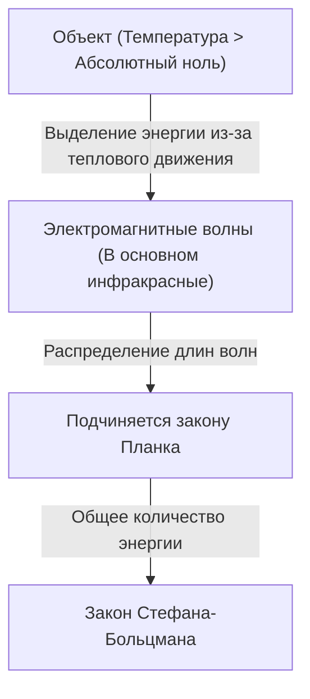

## Введение: Приглашение в невидимый мир 'тепла'

Все окружающие нас объекты, если их температура не равна абсолютному нулю (минус 273,15 градуса Цельсия), постоянно излучают электромагнитные волны в виде "теплового излучения". Технология, которая улавливает эти невидимые для человеческого глаза электромагнитные волны, в частности "инфракрасные лучи", и визуализирует распределение температур в виде цветов, называется "тепловидением" (термографией).

В связи с пандемией COVID-19 возможность увидеть мониторы, измеряющие температуру поверхности тела на входах в аэропорты и коммерческие объекты, резко возросла. Однако применение тепловидения не ограничивается медициной и здравоохранением. От обнаружения дефектов теплоизоляции зданий, выявления перегрева электрооборудования, поиска пропавших без вести в темноте до датчиков ночного видения для беспилотных автомобилей — эта технология активно используется в бесчисленных областях, поддерживающих современное общество.

В этой статье мы подробно и с самых основ объясним, как эта магическая технология опирается на законы физики, и как новейшее аппаратное обеспечение преобразует инфракрасное излучение в электрические сигналы.

## Физические основы: Пересечение тепла и света

Чтобы понять принцип работы тепловидения, необходимо сначала разобраться в связи между "светом (электромагнитными волнами)" и "теплом".

### Излучение абсолютно черного тела (Black-body Radiation)

В физике "абсолютно черное тело" — это идеальный объект, который полностью поглощает все падающие на него электромагнитные волны любой длины, а также излучает тепло в зависимости от своей температуры. Реальные объекты не являются абсолютно черными телами, но законы излучения черного тела служат мощной основой для понимания теплового излучения любого объекта.

Когда объект обладает теплом (молекулы и атомы вибрируют), его энергия выделяется в виде электромагнитных волн. При низких температурах в основном излучаются длинноволновые инфракрасные лучи, а по мере повышения температуры пик смещается к коротковолновому видимому свету (красный, желтый, белый). Именно поэтому при нагревании железо светится красным, а при еще более высоких температурах — ярко-белым.

### Закон Стефана-Больцмана (Stefan-Boltzmann Law)

Одним из важнейших физических законов в тепловидении является "закон Стефана-Больцмана", экспериментально открытый Йозефом Стефаном в 1879 году и теоретически доказанный Людвигом Больцманом в 1884 году.

Этот закон гласит: "Общее количество энергии, излучаемой абсолютно черным телом (излучательная способность), пропорционально четвертой степени его абсолютной температуры".

$$ E = \sigma T^4 $$

Где:
- $E$ — излучательная способность (энергия, излучаемая на единицу площади)
- $\sigma$ (сигма) — постоянная Стефана-Больцмана (около $5.67 \times 10^{-8} \, \text{W/(m}^2\cdot\text{K}^4\text{)}$)
- $T$ — абсолютная температура (в Кельвинах, K)

Свойство "пропорционально четвертой степени" имеет решающее значение для тепловидения. Даже при незначительном повышении температуры количество излучаемой инфракрасной энергии резко возрастает. Например, даже если температура немного поднимется по сравнению с комнатной (около 300K), разница в энергии, достигающей датчика, станет весьма заметной, что позволяет с высокой чувствительностью обнаруживать малейшие перепады температур.

### Важность коэффициента излучения (Emissivity)

Поскольку реальные объекты не являются идеальными черными телами, необходимо умножить вышеуказанное количество энергии на "коэффициент излучения ($\epsilon$)".

$$ E = \epsilon \sigma T^4 $$

Коэффициент излучения принимает значения от 0 до 1.
- **Абсолютно черное тело**: $\epsilon = 1.0$
- **Кожа человека**: $\epsilon \approx 0.98$ (очень близко к черному телу в инфракрасном диапазоне)
- **Полированный металл**: $\epsilon \approx 0.02 - 0.1$ (легко отражает инфракрасные лучи и плохо излучает собственное тепло)

Для точного измерения температуры с помощью тепловизора крайне важно правильно настроить коэффициент излучения объекта. При попытке измерить температуру металлической поверхности часто можно получить результаты измерения, отличающиеся от реальной температуры, из-за улавливания отражений от окружающих источников тепла.

## Механизм инфракрасных датчиков: Преобразование тепла в электричество

Хотя для захвата видимого света в камерах используются такие датчики, как CMOS или CCD, в тепловизионных камерах устанавливаются специальные инфракрасные датчики. В общих чертах они делятся на "охлаждаемые" и "неохлаждаемые", но в последние годы наибольшее распространение получили неохлаждаемые датчики с использованием "микроболометров" (Microbolometer).

### Конструкция и принцип работы микроболометра

Микроболометр — это крошечный элемент, который изменяет свое электрическое сопротивление при обнаружении тепла. Сотни тысяч таких элементов, расположенных в виде сетки (матрицы), составляют сердце тепловизора.

1. **Поглощение инфракрасного излучения**:
   Инфракрасные лучи, прошедшие через объектив (обычное стекло не пропускает инфракрасные лучи, поэтому используются специальные материалы, такие как германий), попадают на поверхность микроболометра (обычно это оксид ванадия или аморфный кремний).
2. **Повышение температуры**:
   Пиксели, поглотившие инфракрасную энергию, незначительно нагреваются (от нескольких милликельвинов до десятых долей градуса).
3. **Изменение сопротивления**:
   При повышении температуры электрическое сопротивление элемента изменяется.
4. **Преобразование в электрический сигнал**:
   Расположенная за ними интегральная схема считывания (ROIC) считывает это изменение сопротивления как изменение напряжения или тока и преобразует его в цифровые данные.
5. **Создание изображения (Обработка в псевдоцветах)**:
   Оцифрованным данным о температуре назначаются псевдоцвета (false color): участки с высокой температурой становятся красными или белыми, а участки с низкой — синими или черными, что позволяет сгенерировать понятное нашему глазу изображение (термограмму).

### Революция неохлаждаемых датчиков

В прошлом высокочувствительным инфракрасным камерам требовалось охлаждение до сверхнизких температур (около -200℃) с помощью жидкого азота или кулеров Стирлинга, чтобы тепло (темновой ток), выделяемое самим датчиком, не мешало измерениям (охлаждаемый тип). Такие камеры были очень большими, тяжелыми, дорогими и требовали много времени для запуска.

Однако, благодаря достижениям в области технологий MEMS (микроэлектромеханические системы), стали практически применимыми микроболометры, работающие при комнатной температуре (неохлаждаемый тип). За счет минимизации датчиков и создания структуры, изолирующей от теплопроводности окружающей среды (подвесная конструкция), удалось добиться достаточной чувствительности даже без охлаждения. В результате тепловизионные камеры стали компактнее, дешевле и эволюционировали до модулей, которые можно встраивать в смартфоны.

## Широкий спектр применения тепловидения

Способность визуализировать невидимое тепло произвела революцию во многих отраслях промышленности и жизни людей.

### 1. Медицина, здравоохранение и борьба с инфекционными заболеваниями
Широко известно как средство скрининга температуры поверхности тела. Поскольку оно позволяет мгновенно и бесконтактно измерять температуру большого количества людей, оно незаменимо для карантина в аэропортах и обнаружения людей с температурой на массовых мероприятиях. Кроме того, поскольку оно позволяет визуализировать снижение температуры кожи из-за ухудшения кровотока, оно также используется в медицинских учреждениях в качестве вспомогательного диагностического инструмента, например, для диагностики сосудистых заболеваний и выявления участков воспаления в спортивной медицине.

### 2. Инспекция инфраструктуры и зданий
Если сфотографировать стены или крышу здания с помощью тепловизора, можно без разрушения конструкции обнаружить дефекты теплоизоляции, проникновение сквозняков и скопление влаги от протечек дождя (температура падает ниже температуры окружающей среды из-за теплоты испарения при высыхании влаги). Это чрезвычайно мощный инструмент неразрушающего контроля при диагностике энергосбережения зданий и обследовании на предмет износа.

### 3. Техническое обслуживание и инспекция промышленного оборудования (Предиктивное обслуживание)
Электрическое и механическое оборудование на заводах, такое как двигатели, распределительные щиты и трансформаторы, часто вызывает аномальное выделение тепла до того, как произойдет поломка или короткое замыкание. Регулярные проверки с помощью тепловизоров позволяют на ранней стадии обнаруживать участки с аномальным нагревом (горячие точки), делая возможным "предиктивное обслуживание", предотвращающее серьезные аварии и остановку производства.

### 4. Безопасность и ночное наблюдение
Камеры видимого света не работают в полной темноте без источника света, но поскольку тепловидение улавливает тепло (инфракрасные лучи), излучаемое самим объектом, можно получить четкие изображения даже при полном отсутствии света. Его способность обнаруживать цели даже в плохую погоду или сквозь дым высоко ценится при обнаружении злоумышленников, охране границ или поиске людей, терпящих бедствие на море.

### 5. Автомобильные датчики (Ночное видение)
В последние годы дальние инфракрасные камеры все чаще устанавливаются в качестве части современных систем помощи водителю (ADAS) в автомобилях. При вождении в ночное время они с помощью тепла обнаруживают пешеходов и диких животных, находящихся вне зоны действия фар, предупреждая водителей и активируя автоматическое торможение, что способствует снижению числа ночных аварий.

## Заключение и перспективы на будущее

От классической физики закона Стефана-Больцмана до новейших микроболометрических матриц с использованием технологии MEMS — тепловидение является технологией, которую можно назвать кристаллизацией человеческой мудрости.

Ожидается, что в будущем вместе с увеличением количества пикселей датчиков и дальнейшим снижением стоимости, будет происходить интеграция с технологиями анализа изображений с использованием искусственного интеллекта (ИИ). Помимо простого отображения температуры цветом, получат распространение полностью автоматизированные системы мониторинга, в которых ИИ автоматически изучает паттерны аномалий, прогнозирует и отправляет уведомления, например: "Высока вероятность того, что это оборудование выйдет из строя через несколько дней".

Невидимый мир "тепла". Технология тепловидения, которая визуализирует его, продолжает развиваться, делая наше общество более безопасным, эффективным и комфортным.
