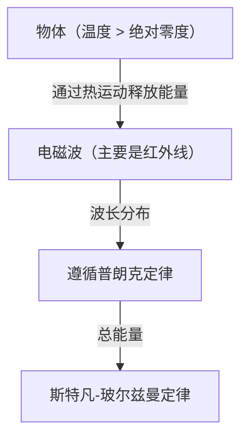

## 引言：通往不可见的“热”世界之旅

我们周围的所有物体，只要其温度不为绝对零度（摄氏零下273.15度），就始终在以“热辐射”的形式发射电磁波。能够捕捉人类肉眼无法看到的这种电磁波，尤其是“红外线”，并将温度分布通过颜色可视化的技术，就是“热像仪”（或红外热成像）。

随着新冠疫情的爆发，我们在机场和商业设施入口处看到测量体表温度显示屏的机会呈现爆炸性增长。然而，热像仪的应用并不仅限于医疗和公共卫生。从发现建筑物隔热不良、检测电气设备过热、在黑暗中搜救遇险者，到自动驾驶汽车的夜间传感器，它正活跃在支撑现代社会的无数领域中。

本文将从基础出发，彻底解析这项如同魔法般的技术是如何建立在物理定律之上的，以及最新的硬件是如何将红外线转化为电信号的。

## 物理学基础：热与光的交汇点

为了理解热像仪的原理，首先必须揭开“光（电磁波）”与“热”之间的关系。

### 黑体辐射（Black-body Radiation）

在物理学中，“黑体”是指能够完全吸收从外部入射的所有波长的电磁波，并根据自身温度进行热辐射的理想物体。现实中的物体并不是完美的黑体，但黑体辐射定律为了解所有物体的热辐射提供了强大的基础。

当物体具有热量（分子和原子振动）时，其能量会作为电磁波释放。温度较低时，主要辐射长波长的红外线；随着温度升高，峰值会向波长较短的可见光（红、黄、白）移动。这就是为什么铁被加热时会发出红光，温度更高时会发出白光的原因。

### 斯特凡-玻尔兹曼定律（Stefan-Boltzmann Law）

热像仪中最重要的物理定律之一，是1879年由约瑟夫·斯特凡通过实验发现，并于1884年由路德维希·玻尔兹曼在理论上证明的“斯特凡-玻尔兹曼定律”。

该定律指出，“黑体辐射的总能量（辐射出射度）与其绝对温度的四次方成正比”。

$$ E = \sigma T^4 $$

其中，
- $E$ 是辐射出射度（单位面积辐射的能量）
- $\sigma$（西格玛）是斯特凡-玻尔兹曼常数（约 $5.67 \times 10^{-8} \, \text{W/(m}^2\cdot\text{K}^4\text{)}$）
- $T$ 是绝对温度（开尔文, K）

这种“与四次方成正比”的特性，对热像仪具有决定性的意义。即使温度只有极其微小的上升，辐射出的红外线能量也会急剧增加。例如，仅当温度从室温（约300K）稍微上升一点，到达传感器的能量差就会显著表现出来，从而使得以高灵敏度检测微小的温差成为可能。

### 发射率（Emissivity）的重要性

由于现实中的物体并非理想的黑体，因此必须将上述能量乘以“发射率（$\epsilon$）”。

$$ E = \epsilon \sigma T^4 $$

发射率的值介于0到1之间。
- **黑体**: $\epsilon = 1.0$
- **人类皮肤**: $\epsilon \approx 0.98$（在红外线区域非常接近黑体）
- **抛光金属**: $\epsilon \approx 0.02 - 0.1$（容易反射红外线，自身热量难以辐射）

为了使用热像仪准确测量温度，正确设置目标物的发射率是必不可少的。如果要测量金属表面的温度，往往会捕捉到周围热源的反射，导致测量结果与实际温度出现偏差。

## 红外传感器机制：将热转化为电

通常的相机捕捉可见光使用的是CMOS或CCD等传感器，而热像仪相机搭载的则是特殊的红外传感器。它们大致可分为“制冷型”和“非制冷型”，但近年来广泛普及的是使用“微测辐射热计（Microbolometer）”的非制冷型传感器。

### 微测辐射热计的结构与原理

微测辐射热计是一种通过感知热量来改变自身电阻值的微小元件。数十万个这样的元件以网格状（阵列）排列，构成了热像仪的核心。

1. **吸收红外线**:
   穿过透镜（普通玻璃无法让红外线穿透，因此使用锗等特殊材料）进入的红外线，照射在微测辐射热计的表面（通常是氧化钒或非晶硅）上。
2. **温度上升**:
   吸收了红外线能量的像素，其温度会发生微小上升（数毫开尔文到几十分之一度左右）。
3. **电阻值变化**:
   温度上升时，元件的电阻值会发生变化。
4. **转换为电信号**:
   背后的读出集成电路（ROIC）将这种电阻值的变化读取为电压或电流的变化，并将其转换为数字数据。
5. **成像（伪彩色处理）**:
   对数字化的温度数据，为高温部分分配红色或白色，为低温部分分配蓝色或黑色等伪彩色（False color），从而生成我们肉眼能够看懂的图像（热力图）。

### 非制冷型传感器的革命

过去高灵敏度的红外相机，为了防止传感器自身发出的热量（暗电流）干扰测量，必须使用液氮或斯特林制冷机将其冷却至极低温（约-200℃）（制冷型）。这导致设备非常庞大、笨重、昂贵，并且启动需要很长时间。

然而，随着MEMS（微机电系统）技术的进步，在室温下工作的微测辐射热计（非制冷型）被投入实际应用。通过将传感器极小化，并采用隔绝周围热传导的结构（悬浮结构），即使不冷却也能成功获得足够的灵敏度。这使得热像仪相机实现了小型化和低成本化，甚至进化成了可以搭载在智能手机上的模块。

## 热像仪的广泛应用

将不可见的热量可视化的能力，正在给众多产业和人们的生活带来革命。

### 1. 医疗保健与传染病对策
这是作为体表温度筛查最广为人知的应用。由于可以在非接触状态下瞬间测量多人的温度，因此它在机场检疫和活动场地发热者检测中不可或缺。此外，它能将血流不畅导致的皮肤温度下降可视化，因此在医疗现场也被用作诊断血管疾病或在运动医学中确定炎症部位的辅助诊断工具。

### 2. 基础设施与建筑物诊断
使用热像仪拍摄建筑物的墙壁或屋顶，可以在不进行破坏的情况下发现隔热材料的缺失、冷风的侵入以及漏水导致的水分滞留（水分蒸发时的汽化热会使周围温度降低）。在建筑物的节能诊断和老化调查中，它是一种非常强大的无损检测工具。

### 3. 工业设备的维护与检查（预测性维护）
工厂的电机、配电盘、变压器等电气和机械设备，在发生故障或短路之前往往伴有异常发热。通过使用热像仪进行定期检查，可以尽早发现异常发热部位（热点），从而实现防范重大事故或工厂停工于未然的“预测性维护”。

### 4. 安防与夜间监控
可见光相机在没有光源的完全黑暗中无法发挥作用，但热像仪捕捉的是目标物自身发出的热量（红外线），因此即使没有任何光线也能获得清晰的图像。这种在恶劣天气或烟雾中也能发现目标的特性，使其在入侵者检测、边境巡逻或海上遇险者搜救等领域备受重视。

### 5. 车载传感器（夜视系统）
近年来，远红外相机越来越多地被用作汽车高级驾驶辅助系统（ADAS）的一部分。在夜间行驶时，它能通过热量检测到前照灯照射不到的远处的行人或野生动物，向驾驶员发出警告或启动自动刹车，从而为减少夜间事故做出了贡献。

## 总结与未来展望

从斯特凡-玻尔兹曼定律这一经典物理学出发，到使用MEMS技术的最新微测辐射热计阵列，热像仪可以说是人类智慧结晶的技术。

未来，随着传感器像素的提高和成本的进一步降低，预计其将与AI（人工智能）的图像分析技术相融合。不仅只是用颜色显示温度，AI还能自动学习异常模式，并预测通知“该设备很有可能在几天后发生故障”，这种完全自动化的监控系统将会得到普及。

不可见的“热”世界。将其可视化的热像仪技术，正不断推动我们的社会向着更安全、更高效、更舒适的方向发展。
