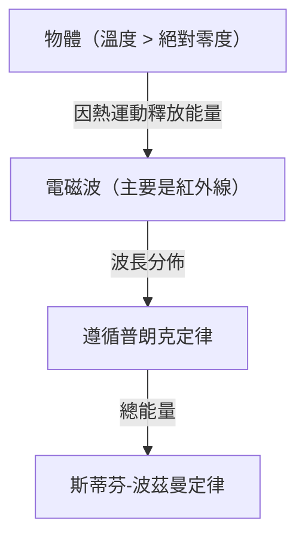
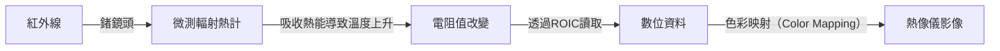

## 前言：邀請您進入看不見的「熱」世界

我們周遭的所有物體，只要不是在絕對零度（攝氏零下273.15度），都會不斷以「熱輻射」的形式散發電磁波。這種人類肉眼看不見的電磁波，尤其是「紅外線」，將其捕捉並把溫度分佈以顏色視覺化的技術，就是「熱像儀（Thermography）」。

受到新冠病毒疫情的影響，在機場或商業設施入口處看到測量體表溫度螢幕的機會呈爆發性增長。然而，熱像儀的用途不僅限於醫療與公共衛生。從發現建築物隔熱不良、檢測電氣設備過熱、黑暗中的遇難者搜救，甚至是自動駕駛車的夜間感測器，它在支撐現代社會的無數領域中發揮著作用。

本文將從基礎開始，徹底解說這項有如魔法般的技術是如何建立在物理定律之上，以及最新的硬體是如何將紅外線轉換為電子訊號的。

## 物理學基礎：熱與光的交會點

為了理解熱像儀的原理，我們必須先釐清「光（電磁波）」與「熱」之間的關係。

### 黑體輻射（Black-body Radiation）

在物理學中，「黑體」是指一個理想物體，它能完全吸收從外部入射的所有波長的電磁波，並根據自身的溫度進行熱輻射。現實中的物體並非完美的黑體，但黑體輻射定律是理解所有物體熱輻射的強大基礎。

當物體帶有熱能（分子或原子振動）時，其能量會以電磁波的形式釋放出來。溫度較低時，主要輻射出波長較長的紅外線；隨著溫度升高，峰值會向波長較短的可見光（紅、黃、白）偏移。這就是為什麼加熱鐵塊時它會發紅光，溫度更高時則會發出耀眼白光的原因。

### 斯蒂芬-波茲曼定律（Stefan-Boltzmann Law）

在熱像儀中最重要的一個物理定律，是由約瑟夫·斯蒂芬（Josef Stefan）於1879年透過實驗發現，並於1884年由路德維希·波茲曼（Ludwig Boltzmann）從理論上證明的「斯蒂芬-波茲曼定律」。

這項定律指出，「黑體輻射的總能量（輻射出射度），與其絕對溫度的四次方成正比」。

$$ E = \sigma T^4 $$

在這裡，
- $E$ 是輻射出射度（單位面積輻射出的能量）
- $\sigma$（Sigma）是斯蒂芬-波茲曼常數（約 $5.67 \times 10^{-8} \, \text{W/(m}^2\cdot\text{K}^4\text{)}$）
- $T$ 是絕對溫度（克耳文, K）

這個「與四次方成正比」的特性，對熱像儀有著決定性的意義。只要溫度有微小的上升，輻射出的紅外線能量就會劇烈增加。例如，溫度只要從室溫（約300K）稍微上升一點，到達感測器的能量差異就會非常明顯，因此能夠以高靈敏度檢測出微小的溫度差異。

### 發射率（Emissivity）的重要性

因為現實中的物體並非理想的黑體，所以必須在上述能量乘上「發射率（$\epsilon$）」：

$$ E = \epsilon \sigma T^4 $$

發射率的數值介於0到1之間。
- **黑體**: $\epsilon = 1.0$
- **人類皮膚**: $\epsilon \approx 0.98$（在紅外線區域非常接近黑體）
- **拋光金屬**: $\epsilon \approx 0.02 - 0.1$（容易反射紅外線，本身熱能不易輻射）

為了用熱像儀準確測量溫度，正確設定目標物的發射率是不可或缺的。如果試圖測量金屬表面的溫度，經常會捕捉到周圍熱源的反射，導致測量結果與實際溫度不符。

## 紅外線感測器的機制：將熱轉化為電

相機捕捉可見光時使用的是CMOS或CCD等感測器，而熱像儀則搭載了特殊的紅外線感測器。它大致可分為「冷卻型」與「非冷卻型」，近年來廣泛普及的是使用「微測輻射熱計（Microbolometer）」的非冷卻型感測器。

### 微測輻射熱計的構造與原理

微測輻射熱計是一種微小元件，它能感知熱能並改變自身的電阻值。數十萬個這種元件以網格狀（陣列）排列，就構成了熱像儀的核心部分。

1. **吸收紅外線**:
   穿過鏡頭（因為一般玻璃無法穿透紅外線，所以會使用鍺等特殊材料）進入的紅外線，會照射在微測輻射熱計的表面（通常是氧化釩或非晶矽）。
2. **溫度上升**:
   吸收了紅外線能量的像素，其溫度會微幅上升（大約幾毫克耳文到幾十分之一度）。
3. **電阻值改變**:
   當溫度上升時，元件的電阻值會發生變化。
4. **轉換為電子訊號**:
   位於後方的讀出積體電路（ROIC）會將這個電阻值的變化讀取為電壓或電流的變化，並轉換成數位資料。
5. **影像化（偽色彩處理）**:
   針對數位化的溫度資料，將溫度高的部分分配為紅或白，溫度低的部分分配為青或黑等偽色彩（False Color），從而生成我們肉眼可見且易於理解的影像（熱像圖）。

### 非冷卻型感測器的革命

過去高靈敏度的紅外線相機，為了避免感測器本身產生的熱能（暗電流）干擾測量，必須使用液態氮或史特林冷卻器（Stirling cooler）將其冷卻至極低溫（約-200℃付近）（冷卻型）。這使得設備體積龐大、沉重、昂貴，且啟動需要時間。

然而，隨著微機電系統（MEMS）技術的進步，能在室溫下運作的微測輻射熱計（非冷卻型）已成功商業化。透過將感測器極小化，並採用隔絕周圍熱傳導的結構（懸空結構），成功地在不冷卻的情況下獲得足夠的靈敏度。這使得熱像儀相機得以小型化、低價化，甚至進化到可作為模組搭載於智慧型手機上。

## 熱像儀的廣泛應用

將看不見的熱能視覺化的能力，為許多產業和人們的生活帶來了革命。

### 1. 醫療、健康照護與傳染病防治
最廣為人知的是作為體表溫度的篩檢。由於能以非接觸方式瞬間測量多人的溫度，它在機場檢疫和活動會場的發燒者檢測中不可或缺。此外，由於能視覺化因血液循環不良導致的皮膚溫度下降，因此在醫療現場也作為輔助診斷工具，例如診斷血管障礙或定位運動醫學中的發炎部位。

### 2. 基礎設施與建築物的診斷
當使用熱像儀拍攝建築物的牆壁或屋頂時，可以在不破壞結構的情況下，發現隔熱材料的缺失、冷風的侵入、以及漏水造成的水分滯留（水分蒸發時的汽化熱會使周圍溫度下降）。這在建築物的節能診斷和老化調查中，是非常強大的非破壞性檢測工具。

### 3. 工業設備的維護與檢查（預知保養）
工廠中的馬達、配電盤、變壓器等電氣與機械設備，在發生故障或短路之前，通常會伴隨著異常發熱。透過熱像儀的定期檢查，能及早發現異常加熱部位（熱點），從而實現防範重大事故或工廠停工於未然的「預知保養」。

### 4. 監控與夜間監視
可見光相機在沒有光源的完全黑暗中無法運作，但熱像儀是捕捉目標物本身散發的熱能（紅外線），因此即使完全沒有光線，也能獲得清晰的影像。這種即使在惡劣天氣或穿越煙霧也能發現目標的特性，在入侵者檢測、邊境巡防或海上遇難者搜救中備受重視。

### 5. 車載感測器（夜視系統）
近年來，作為汽車先進駕駛輔助系統（ADAS）的一部分，遠紅外線相機的搭載正日益普及。在夜間行駛時，它能透過熱能檢測到車頭燈照射不到的遠處行人或野生動物，並向駕駛員發出警告或啟動自動煞車，從而有助於減少夜間事故。

## 總結與對未來的展望

從斯蒂芬-波茲曼定律這個古典物理學開始，到使用MEMS技術的最新微測輻射熱計陣列，熱像儀可以說是人類智慧結晶的技術。

未來，隨著感測器邁向更高畫素與進一步降低成本，預期將會與人工智慧（AI）的影像分析技術相互融合。不再只是單純地用顏色顯示溫度，AI能自動學習異常模式，並預測發出「此設備在幾天內發生故障的機率很高」的通知，完全自動化的監控系統將會逐漸普及。

看不見的「熱」世界。將其視覺化的熱像儀技術，正持續使我們的社會朝向更安全、更有效率、更舒適的方向進化。
