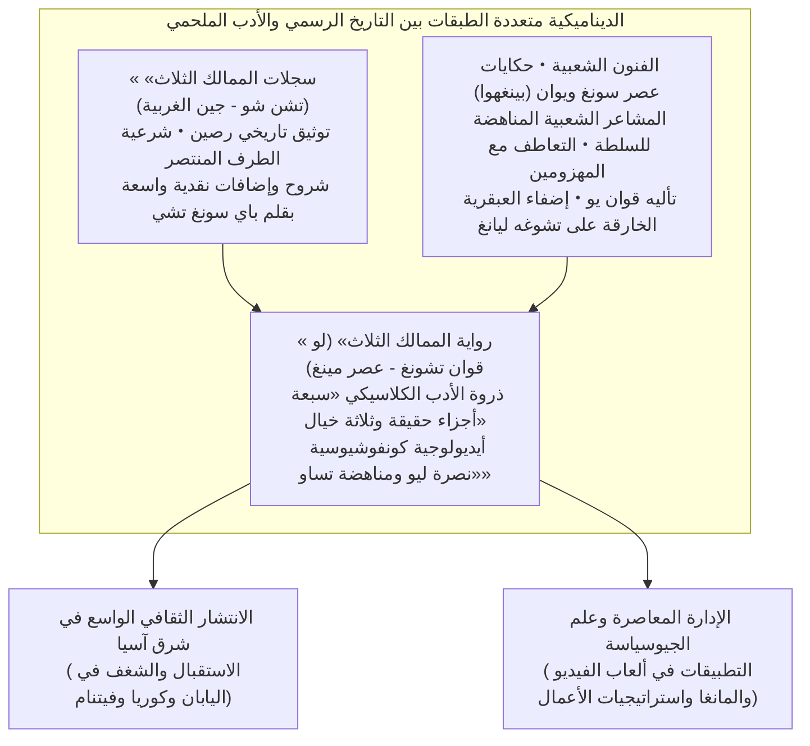
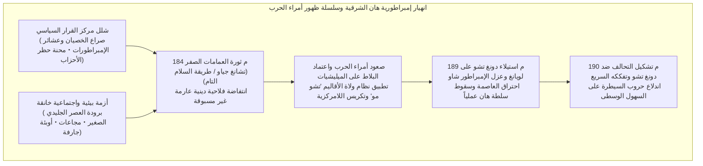
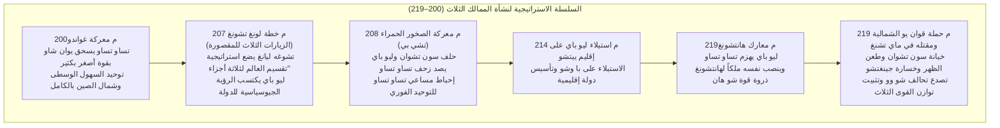
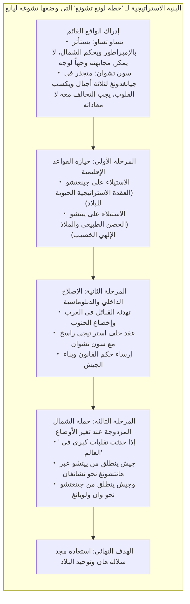
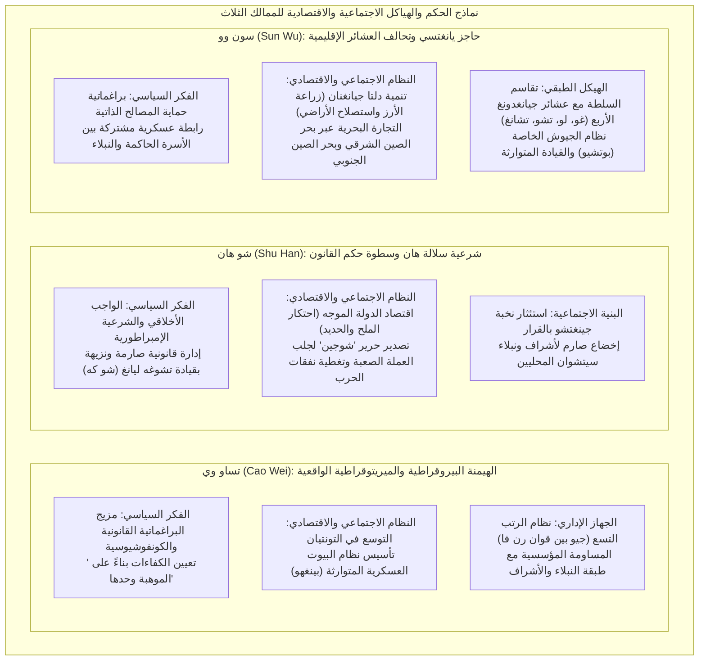

## مقدمة: لماذا يستمر سحر «عصر الممالك الثلاث» في أسر البشرية بعد 1800 عام؟

يمتد نحو قرن من الزمان بين اندلاع «ثورة العمامات الصفر» في عام 184 للميلاد، وقيام إمبراطورية جين الغربية (Western Jin) بإخضاع مملكة سون وو وتوحيد البلاد في عام 280 للميلاد. وعلى مدى 1800 عام، لا تزال ملحمة الصعود والسقوط في **«عصر الممالك الثلاث» (Three Kingdoms period)**، التي دارت رحاها على امتداد السهول الشاسعة لشرق أوراسيا، تأسر الخيال الفكري ووجدان الناس ليس فقط في شرق آسيا، بل في شتى أصقاع العالم.

لماذا تفردت هذه الحقبة العاصفة، من بين سائر فترات الانتقال والتحولات السلالية في تاريخ الصين الطويل، بمثل هذا البريق الثقافي الساطع والتأثير الخالد؟

السبب الجوهري يكمن في البنية المزدوجة الفريدة لعالم الممالك الثلاث: فهو يجمع بتناغم فذ بين **الحقيقة التاريخية الصارمة المتمثلة في «سجلات الممالك الثلاث الرسمية» (سان قوه تشي، تدوين تشن شو، وشروح وتدقيق باي سونغ تشي)** القائمة على النقد التاريخي الدقيق للمصادر المعاصرة، وبين **ذروة الأدب الروائي والتاريخي الكلاسيكي المتمثلة في «رواية الممالك الثلاث» (سان قوه ياني، للمؤلف لو قوان تشونغ)** التي نضجت في عهد سلالة مينغ بعد قرون متطاولة من الحكايات الشعبية والعروض المسرحية المتراكمة.



إذا تأملنا الواقع التاريخي المجرد، كان عصر الممالك الثلاث عصراً موحشاً ودموياً؛ حيث اقترن انهيار نظام إمبراطورية هان الشرقية بانخفاض حاد في عدد السكان، وموجة صقيع مناخي ومجاعات مهلكة وحروب لا تنقطع. وتشير السجلات إلى أن عدد السكان المسجلين، الذي بلغ قرابة 56 مليون نسمة في ذروة عهد هان الشرقية، تراجع تراجعاً مروعاً في أواخر العصر ليقارب 8 ملايين نسمة فقط في مجموع الممالك الثلاث: وي، وشو، وو (وحتى مع احتساب الفارين من الإحصاء واللاجئين، فإن الخراب الاجتماعي كان مطلقاً).

ومع ذلك، انبثقت من قلب هذا الفراغ المؤسسي والصراع الوجودي الشرس **«ابتكارات استراتيجية عبقرية»** و**«تجارب غير مسبوقة في هندسة الدولة»** حطمت التقاليد الطبقية البالية والشرعيات المتوارثة:
- مبدأ التوظيف الميريتوقراطي القائم على الكفاءة المحضة («تعيين الكفاءات بناءً على الموهبة وحدها» / 唯才是挙) ونظام المستوطنات الزراعية العسكرية «التونتيان» اللذان ابتكرهما تساو تساو (Cao Cao) لحل معضلة التموين.
- الرؤية الجيوسياسية الشاملة المتمثلة في «خطة لونغ تشونغ» (天下三分之计 / Longzhong Plan) التي وضعها تشوغه ليانغ (Zhuge Liang) لتمكين دولة صغيرة من مجابهة قوى عظمى، مدعومة بسيادة صارمة ومجردة للقانون.
- استصلاح وتنمية أراضي حوض نهر يانغتسي (منطقة جيانغنان) وحماية ثغورها بقيادة سون تشوان (Sun Quan)، وما تلاها من إرهاصات أول دولة تجارية بحرية متطلعة نحو بحر الصين الشرقي والجنوبي.

وفوق كل ذلك، جاءت التراجيديا النفسية والصراع الإنساني الخالد بين القادة والحكماء وعامة الناس: العقلانية الباردة والوحدة الموحشة لتساو تساو، الصمود الأخلاقي والتشبث النبيل بالواجب لدى ليو باي، الولاء الأسطوري والمآل المأساوي لقوان يو، واستشهاد تشوغه ليانغ في سبيل قضية خاسرة يعلم سلفاً مصيرها. كل هذا ارتقى بالحقبة لتغدو ملحمة إنسانية خالدة تتجاوز قيود الزمان والمكان.

في هذا الدليل المفصل، لن نكتفي بسرد القصص المثيرة أو تلخيص الأحداث، بل **سنشرح ونفكك ملحمة الممالك الثلاث تفكيكاً شاملاً من زوايا علم التاريخ، والفكر السياسي، والجيوسياسة العسكرية، والأنظمة الاجتماعية والاقتصادية، وتاريخ التلقي الأدبي**. سنفحص الفجوة بين الوثائق الرسمية والأسطورة الأدبية، ونغوص في أعماق عقول واستراتيجيات أولئك الذين صاغوا مصير العالم في زمن الفوضى.

---

## الفصل الأول: شفق سلالة هان الشرقية واندلاع صراع أمراء الحرب (184–200م)

بدأت شرارة عصر الممالك الثلاث بالانهيار الداخلي المأساوي لإمبراطورية هان العظيمة (هان السابقة وهان اللاحقة)، التي حافظت على وحدة العالم الصيني طوال أربعة قرون. لماذا تهاوت هذه الإمبراطورية المركزية العاتية بهذه السرعة وسمحت بتمزق البلاد إلى إقطاعيات عسكرية متناحرة؟ في عمق هذه الكارثة، تشابكت مظاهر الترهل المؤسسي، وفساد قمة السلطة، وتغيرات مناخية كوكبية بالغة القسوة.



### 1.1 استبداد الخصيان وعشائر الإمبراطورات و«محنة حظر الأحزاب»: العجز الهيكلي لإمبراطورية هان

وقعت المنظومة السياسية لهان الشرقية (25–220م) في نصفها الثاني في حلقة مفرغة مدمرة، نجمت عن توالي اعتلاء أباطرة قاصرين سدة العرش.

فحينما يكون الإمبراطور طفلاً صغيراً، تقبض والدته الإمبراطورة الأرملة وعشيرتها، المعروفون باسم **«واي تشي» (عشائر أصهار الإمبراطور)**، على مقاليد الأمور. وحين يشب الإمبراطور عن الطوق ويسعى لاسترداد سلطته المباشرة، لم يكن يجد أمامه سوى التحالف السري مع **«الخصيان» (حاشية القصر الداخلية)** المقيمين معه ليلاً ونهاراً داخل الحريم الإمبراطوري لاستئصال أصهار أمه بالقوة المسلحة. بيد أن الخصيان، بمجرد استيلائهم على مقاليد الأمور، كانوا ينغمسون في الفساد وابتزاز الأموال وتعيين أقاربهم حكاماً على الأقاليم يمارسون أبشع ألوان الطغيان. ومع الجيل التالي وتولي إمبراطور طفل جديد، تعود عشائر الإمبراطورات لقمع الخصيان. وهكذا دارت رحى تصفيات دموية مستمرة لا تنتهي.

في مواجهة هذا الانحدار الأخلاقي، تصدى موظفو البلاط المتشبعون بالقيم الكونفوشيوسية وطلاب الأكاديمية الإمبراطورية (تاي شيويه) لفضح فساد الخصيان بشجاعة نادرة. وأطلق هؤلاء المثقفون على أنفسهم لقب «التيار النقي» (تشينغ ليو)، بينما نعتوا الخصيان وأتباعهم بـ «التيار العكر» (تشو ليو).

لكن زمرة الخصيان أحست بالخطر الداهم، فأوعزت إلى الإمبراطور بشن حملة قمع شعواء، متهمة علماء «التيار النقي» بالتآمر وتأليف أحزاب وجماعات تهدد أمن الدولة. وعُرفت هذه النكبة بـ **«محنة حظر الأحزاب» (دانغ قو تشي هو)** عامي 166 و169 للميلاد. أُعدم وسُجن المئات من خيرة العلماء وكبار المسؤولين، وحُرم الآلاف نهائياً من تولي الوظائف العامة.

أصابت هذه الضربة سلطة هان الأخلاقية بمقتل لا شفاء منه؛ إذ يئست النخب الإقطاعية والمثقفون في الأقاليم من الحكومة المركزية تماماً، وفقدوا أي رغبة في الدفاع عن هيبة وقوانين الدولة. وفي هذا الفراغ المفرغ من الشرعية، تهيأت الأرضية الخصبة لصعود قوى عسكرية محلية لا تدين بالولاء لأحد.

### 1.2 موجة الصقيع والمجاعة والوباء و«ثورة العمامات الصفر»

وما كادت نيران الفساد السياسي تستعر حتى حلت كوارث الطبيعة لتدفع المجتمع نحو الهاوية.

تؤكد دراسات المناخ القديم والديموغرافيا التاريخية أن شرق آسيا في النصف الثاني من القرن الثاني والقرن الثالث دخل مرحلة مبكرة من برودة ما يُعرف بـ **«العصر الجليدي الصغير» (Little Ice Age)**. توالت فصول الشتاء القارس وسنوات الجفاف والصقيع الصيفي، مما دمر المحاصيل الزراعية في حوضي النهر الأصفر ونهر يانغتسي. ومع تفشي سوء التغذية، اجتاحت البلاد **أوبئة وطواعين كارثية** (يُرجح أنها كانت التيفوس أو الجدري). ووصف الشاعر تساو تشي ذلك المشهد الجنائزي في مرثيته الشهيرة «وصف الوباء» قائلاً: «في كل دار بكاء على جثث الموتى ممددة في الطرقات، وفي كل غرفة عويل ونواح يفطر القلوب».

وسط هذا القنوط المطلق، برز كاهن طاوِيّ من مقاطعة جولُو (بمقاطعة خبي الحالية) يُدعى **تشانغ جياو (Zhang Jiao)**.

أسس تشانغ جياو طائفة دينية جديدة دمجت أفكار الإمبراطور الأصفر ولاوتزه بالمعتقدات الشعبية، وسماها **«طريقة السلام التام» (تايبينغ داو / Taipingdao)**. طاف يعالج المرضى بالماء المبارك الممزوج بالتعاويذ («فو شوي»)، ويدعو التائبين إلى الاعتراف بخطاياهم علناً، فالتف حوله مئات الآلاف من الفلاحين الجياع كالسيل الجارف. نظم تشانغ جياو أتباعه عسكرياً، وقسم البلاد إلى 36 قيادة عسكرية («فانغ»)، وأعد العدة لانقلاب شامل ضد النظام الحاكم.

وكان شعارهم تلك النبوءة الخالدة التي سرت كالنار في الهشيم:
> **«蒼天已死、黃天當立、歲在甲子、天下大吉»**  
> (ماتت السماء الزرقاء، وحان قيام السماء الصفراء؛ وفي عام جيا تسي، يحل الخير العظيم على العالم!)

«السماء الزرقاء» التي ترمز لحكم هان استنفدت تفويضها الإلهي، ويجب أن تخلفها «السماء الصفراء» التي ترمز لعنصر الأرض الطاهر. وعام «جيا تسي» (184 للميلاد، مستهل الدورة الستينية الجديدة للتقويم الصيني) هو موعد قيام الثورة الكبرى.

في فبراير من عام 184م، عصب مئات الآلاف من المريدين رؤوسهم بقطع قماش صفراء وأعلنوا الثورة المسلحة. واشتعلت **«ثورة العمامات الصفر» (Yellow Turban Rebellion)** كالصاعقة في خبي وخنان وشاندونغ، قلب الإمبراطورية النابض. أُحرقت المقار الحكومية، وقُتل الحكام أو ولوا الأدبار.

أصاب الهلع بلاط الإمبراطورية، فسارع بتجريد الجيوش بقيادة كبار القادة العسكريين: هوانغفو سونغ (Huangfu Song)، وتشو جيون (Zhu Jun)، ولو تشي (Lu Zhi)، وأصدر عفواً عاماً عن المحظورين في «محنة حظر الأحزاب» لكسب ود النخب. وهنا برز على مسرح الأحداث قادة شباب سيغيرون وجه التاريخ: تساو تساو، وليو باي، وسون جيان.

تمكنت القوات الإمبراطورية من سحق القوة الرئيسية للثورة في العام ذاته، لا سيما بعد وفاة تشانغ جياو المفاجئة بالمرض. غير أن فلول الثوار تحولوا إلى حركات تمرد وعصابات مسلحة مستقلة تشن حروب عصابات مستمرة (مثل عصابات الجبل الأسود والموجة البيضاء). وإزاء عجز الحكومة عن فرض الأمن، استحدث البلاط عام 188م **«نظام ولاة الأقاليم» (تشو مو / Zhoumu)**، مانحاً حكام المقاطعات صلاحيات عسكرية وإدارية ومالية مطلقة. وكان هذا الإجراء بمثابة رصاصة الرحمة على مركزية الدولة؛ حيث تحول الحكام تلقائياً إلى **أمراء حرب مستقلين (Warlords)** يتصرفون كملوك متوجين في أقاليمهم.

### 1.3 استبداد دونغ تشو وحريق لويانغ: الانهيار التام للنظام القديم

في عام 189م، تُوفي الإمبراطور لينغ، واحتدم الصراع بين زعيم عشيرة الإمبراطورة خه جين (He Jin) وكبار الخصيان المعروفين بـ «المرافقين الدائمين العشرة» (شي تشانغ شي). وفي محاولة منه لترهيب الخصيان بالقوة العسكرية، ارتكب خه جين حماقة استدعاء الجنرال المتعطش للدماء **دونغ تشو (Dong Zhuo)**، قائد القوات الحدودية المتمرسة في إقليم ليانغتشو الشمالي الغربي، للزحف بجيشه نحو العاصمة لويانغ.

ولكن قبل وصول دونغ تشو، كشف الخصيان المؤامرة ونصبوا كميناً لـ خه جين داخل القصر وقطعوا رأسه. استشاط الضباط الشباب من أبناء الأسر النبيلة، وفي طليعتهم يوان شاو (Yuan Shao) وتساو تساو، غضباً واقتحموا القصور وقتلوا أكثر من ألفي خصي في مذبحة دموية مروعة.

استغل دونغ تشو هذه الفوضى واحتل العاصمة المنكوبة لويانغ بقواته الجرارة. وبوحشية وغطرسة بدوي فظ، أرهب دونغ تشو أشراف البلاط، وعزل الإمبراطور الصغير شاو ونفاه ليقتله لاحقاً بالسم، وأجلس مكانه الإمبراطور شيان (ليو شيه) البالغ تسع سنوات. ثم نصب نفسه في منصب «شيانغ قوه» (رئيس الوزراء المطلق الصلاحيات)، محتكراً كل مفاصل السلطة.

كان حكم الإرهاب والبطش الذي فرضه دونغ تشو بمثابة إذلال لا يُحتمل لأشراف الصين. وفي عام 190م، هب أمراء وحكام المناطق الواقعة شرق ممر هانغو لتشكيل **«التحالف العسكري المناهض لـ دونغ تشو»**، متخذين من يوان شاو زعيماً أعلى للتحالف، وانضم إليه تساو تساو وسون جيان ويوان شو وغيرهم.

إزاء ضغط التحالف، أقدم دونغ تشو على تطبيق سياسة الأرض المحروقة بأبشع صورها: أجبر الملايين من سكان العاصمة التاريخية لويانغ على الهجرة قسراً على الأقدام إلى العاصمة الغربية تشانغآن (شيآن حالياً)، وقام بنهب القصور والمعابد وحرق المنازل ونبش قبور الأباطرة السابقين بحثاً عن الذهب، ثم أضرم النيران في لويانغ لتتحول أعظم حاضرة حضارية في شرق آسيا في ليلة واحدة إلى أطلال مدخنة.

والمفارقة المأساوية أن قادة التحالف، الذين رفعوا شعار نصرة العدالة، تملكهم الخوف من سطوة جيش دونغ تشو، فتوقفوا عن التقدم، وانصرفوا إلى إقامة المآدب وتبادل المؤامرات واقتطاع الأراضي لأنفسهم. وحين حاول تساو تساو وسون جيان مطاردة دونغ تشو بمفردهما، مُنيا بهزائم مريرة لغياب الإسناد. وسرعان ما تفكك التحالف بسبب الشقاق الداخلي. لقد اندثر نظام الإمبراطورية القديمة إلى غير رجعة، ودخلت الصين رسمياً **«عصر تناحر أمراء الحرب»**.

(أما الطاغية دونغ تشو نفسه، فلقي مصرعه في عام 192م في تشانغآن إثر مؤامرة حاكها وزيره وانغ يون (Wang Yun) بالاشتراك مع ابنه بالتبني الفارس الذي لا يُقهر ليو بو (Lu Bu)، وأُلقيت جثته في سوق المدينة ليُحرق شحم بطنه كدهن للقناديل).

### 1.4 معارك السيطرة على السهول الوسطى: صعود وسقوط القوى الإقليمية

تحولت السهول الوسطى (حوض النهر الأصفر الخصيب) بعد تدمير النظام القديم إلى حلبة صراع ضارٍ تنافست فيه قوى متعددة، من أبرزها:

- **يوان شاو (Yuan Shao)**: سليل أرفع العائلات الأرستقراطية شأناً («أربعة أجيال تولت المناصب الثلاثة العليا»). استطاع بعد حروب طاحنة سحق منافسه الشمالي غونغسون تسان، ووحد المقاطعات الأربع الكبرى شمال النهر (جي، وتشنغ، ويو، وبينغ)، مؤسساً أضخم قوة عسكرية في ذلك الزمان.
- **يوان شو (Yuan Shu)**: الأخ الشقيق (أو غير الشقيق) لـ يوان شاو، تمركز في منطقة هواينان. ولما وقع الختم الإمبراطوري المتوارث في يديه، أصيب بجنون العظمة وأعلن نفسه إمبراطوراً لدولة «تشونغ»، مما جلب عليه سخط الجميع حتى هلك من الجوع والنبذ.
- **سون تسيه (Sun Ce)**: الابن الأكبر لـ سون جيان (نمر جيانغدونغ). لُقب بـ «الفاتح الصغير» (شياو باوانغ) لشجاعته وحنكته، وتمكن في غضون سنوات قليلة من بسط سيطرته الخاطفة على المقاطعات الست جنوب نهر يانغتسي (جيانغدونغ)، واضعاً حجر الأساس المتين لدولة سون وو، قبل أن يغتاله قتلة مأجورون عام 200م وهو في سن السادسة والعشرين.
- **ليو بو (Lu Bu)**: الفارس المغوار الذي قيل فيه: «بين الرجال ليو بو، وبين الخيول الأرنب الأحمر». لكنه اتصف بالتقلب ونكث العهود؛ غدر بـ دينغ يوان ثم قتل دونغ تشو، ثم غدر بـ ليو باي وانتزع منه إقليم شيوتشو، حتى انتهى به المطاف محاصراً في شيابي بيد تساو تساو وليو باي، ليُعدم شنقاً بعد خيانة ضباطه له.
- **ليو بياو (Liu Biao)**: النبيل الحكيم الذي حكم إقليم جينغتشو (حوض يانغتسي الأوسط) باقتدار ومسالمة، وحمى أراضيه من ويلات الحرب، فاستقبل مئات الآلاف من النازحين والعلماء، لكنه افتقر إلى الطموح الإمبراطوري وظل حبيس النزعة الدفاعية.
- **ليو باي (Liu Bei)**: الذي زعم انتسابه إلى الإمبراطور جينغ من سلالة هان السابقة، لكنه نشأ فقيراً يبيع الصنادل المصنوعة من القش لإعالة والدته. عقد حلف إخاء وثيقاً مع قوان يو وتشانغ فاي، وتنازل له تاو تشيان عن حكم شيوتشو لكن ليو بو غدر به وسلبه إياها. ظل قائداً متجولاً يلجأ إلى تساو تساو، ثم يوان شاو، ثم ليو بياو. ورغم افتقاره للأرض، تمتع بكاريزما طاغية وسمعة عريضة في حب الشعب واجتذاب القلوب.

### 1.5 صعود تساو تساو واستراتيجية «حماية الإمبراطور»: المواءمة بين الشرعية والواقعية

وسط هذه الفوضى العارمة، برز رجل فذ فاق أقرانه ببعد نظره الاستراتيجي وعمق تدبيره؛ إنه **تساو تساو (Cao Cao, لقبه الأدبي منغ ده)**.

كان تساو تساو ينحدر من عائلة خادم خصي (تبنى جده الخصي الشهير تساو تنغ والده)، ولذا كان كبار النبلاء ينظرون إليه بازدراء. لكن تساو تساو كان عبقرية استثنائية متعددة الجوانب: قائداً عسكرياً فذاً، ورجل دولة داهية لا يعرف العاطفة، وشاعراً يُعد من أعظم شعراء الأدب الصيني في كل العصور.

كانت أولى قفزاته الاستراتيجية الحاسمة في عام 196م حين أقدم على **«استقبال الإمبراطور شيان ورعايته» (獻帝奉戴)**.  
فالإمبراطور الشاب، بعد هروبه من بطش بقايا قادة دونغ تشو في تشانغآن، كان يتضور جوعاً ويهيم بين أطلال لويانغ المحترقة. وبمشورة مستشاره الداهية سيو يو (Xun Yu)، سارع تساو تساو بجيشه لحماية الإمبراطور ونقله إلى معقله الحصين في شيو تشانغ (مدينة شيوتشانغ الحالية بمقاطعة خنان).

منح هذا التحرك الذكي تساو تساو بطاقة رابحة مطلقة في اللعبة السياسية:
> **«الاستئثار بابن السماء لإصدار الأوامر للأمراء والإقطاعيين» (挟天子以令諸侯)**

فمن وجهة نظر القوى الأخرى، غدا كل هجوم على تساو تساو تمرداً سافراً على العرش الإمبراطوري. وبصفته القائد العام ثم رئيس الوزراء، بات تساو تساو يصدر المراسيم الرسمية الممهورة بالختم الإمبراطوري لدمغ خصومه بالخيانة، وإضفاء الشرعية المطلقة على حملاته العسكرية بوصفها «جيش الدولة الذي يقمع المتمردين».

وفي الوقت ذاته، دشن تساو تساو إصلاحاً اقتصادياً هيكلياً لإعادة إعمار السهول الوسطى: **«نظام التونتيان» (المستوطنات الزراعية - Tuntian system)** في عام 196م بمبادرة من تساو تشي وهان هاو. أممت الدولة مساحات شاسعة من الأراضي التي هجرها أصحابها، وجندت اللاجئين المشردين وزودتهم بالأبقار والمحاريث والبذور لاستصلاحها. واشترطت الدولة تقاضي 50% إلى 60% من المحصول كضريبة إيجار، وفي المقابل أعفت الفلاحين من التجنيد الإجباري ووفرت لهم الحماية.

مكن هذا النظام جيوش تساو تساو من التغلب تماماً على معضلة «نقص المؤن والقمح» التي فتكت بخصومه، وادخر ملايين الأكياس من الحبوب. وبعد أن امتلك الشرعية السياسية العظمى (حماية الإمبراطور) والركيزة الاقتصادية المتينة (نظام التونتيان)، وقف تساو تساو على قدم المساواة ليدخل معركة الحسم الكبرى ضد مارد الشمال يوان شاو.

---

## الفصل الثاني: تصادم العمالقة والطريق نحو التوازن الثلاثي (200–219م)

تمثل السنوات العشرون الممتدة من عام 200 إلى 219م الحقبة الذهبية الأكثر إثارة وزخماً في تاريخ الممالك الثلاث؛ حيث اختزلت الفوضى تدريجياً لتنتهي باقتسام العالم الصيني بين ثلاث قوى عملاقة: «وي، وشو، وو».

وقد حُسم هذا المسار التاريخي عبر ثلاث حملات ومعارك كبرى فاصلة: **معركة غواندو (200م)**، و**معركة الصخور الحمراء / تشي بي (208م)**، و**معارك هانتشونغ وفان تشنغ (219م)**.



### 2.1 معركة غواندو (200م): كيف التهمت القلة جيش المارد عبر استخبارات الإمداد؟

في عام 200 للميلاد، اشتعلت نيران معركة غواندو التاريخية الفاصلة للسيطرة على شمال الصين.

وقف على طرفي النزاع عملاقان: **يوان شاو**، سيد المقاطعات الشمالية الأربع، بجيش عرمرم قوامه 100 ألف من المشاة و10 آلاف فارس؛ في مواجهة **تساو تساو**، حامي الإمبراطور، الذي لم تتجاوز قواته 20 إلى 30 ألف جندي على أقصى تقدير. كانت نسبة القوى تفوق ثلاثة إلى أربعة أضعاف لصالح يوان شاو، واعتبر جميع المراقبين هزيمة تساو تساو أمراً محتوماً.

عبرت قوات يوان شاو النهر الأصفر وتحصنت قوات تساو تساو في معسكر غواندو الحصين (شمال شرق مقاطعة تشونغمو بمقاطعة خنان الحالية) لتخوض حرب استنزاف دفاعية. بنى يوان شاو تلالاً ترابية ونصب عليها أبراجاً خشبية رشق منها معسكر تساو تساو بوابل من السهام، وحفر أنفاقاً تحت الأرض لاختراق الحصن. ورد تساو تساو باختراع مجانيق حجرية («عربات قذف الحجارة») حطمت الأبراج الخشبية، وحفر خنادق عميقة قطعت الأنفاق.

بيد أن طول أمد الحصار كاد يخنق قوات تساو تساو المفتقرة للزاد والعتاد؛ إذ نفدت المؤن، وأنهك الجوع الجنود، وبلغ اليأس بـ تساو تساو حداً جعله يكتب إلى سيو يو في العاصمة مبدياً رغبته في الانسحاب. فجاءه رد سيو يو الحازم: «التراجع الآن يعني ضياع العالم وتسليمه لـ يوان شاو. اثبت مكانك وتربص بثغرة الخصم».

وجاءت نقطة التحول التاريخية الدرامية عبر انهيار جبهة يوان شاو في مجال **«المعلومات واللوجستيات»**.

فقد اختلف أحد كبار مستشاري يوان شاو، وهو **سيو يو (Xu You)**، مع سيده حين رفض خطته لمباغتة شيو تشانغ، وتزامن ذلك مع اكتشاف اختلاسات مالية لعائلة سيو يو، مما عرضه لغضب يوان شاو. فما كان من سيو يو إلا أن تسلل ليلاً تحت جنح الظلام وانشق لاجئاً إلى معسكر تساو تساو.

ولما بلغت تساو تساو بشرى وصول صديق صباه سيو يو، طار لقاياه فرحاً لدرجة أنه ركض حافي القدمين دون أن ينتعل حذاءه لاستقباله. وأفشى سيو يو السر العسكري الفاصل:
> «إن كل مؤن جيش يوان شاو، البالغة عشرات الآلاف من عربات الغلال، مكدسة في مستودعات **أوتشاو (Wuchao)** الخلفية. وقائد الحامية تشونيو تشيونغ غافل ومفرط في السكر. فإذا قدت خيالتك النخبة في إغارة ليلية وأحرقتها، انهار جيش يوان شاو الضخم من تلقاء نفسه دون قتال».

اتخذ تساو تساو قراره على الفور. قاد بنفسه 5000 فارس من خيرة مقاتليه، متنكرين برايات جيش يوان شاو، ولطخوا وجوههم بالسواد، وكمموا أفواه الخيول بقطع خشبية لمنع الصهيل، وتسللوا خلف خطوط العدو وشنوا هجوماً صاعقاً على أوتشاو. وبعد معركة ضارية، أبادوا الحامية وأحرقوا كل مخازن الغلال والمؤن عن بكرة أبيها.

ولما رأى جنود يوان شاو ألسنة اللهب تلتهم عنان السماء في أوتشاو، استبد بهم الذعر وتداعت صفوفهم. وسرعان ما انشق القائدان البارزان تشانغ هه (Zhang He) وغاو لان وانضما إلى تساو تساو، فانهارت الجبهة تماماً. وفر يوان شاو مع ابنه الأكبر يوان تان شمالاً عبر النهر الأصفر، ولم ينجُ معهما سوى 800 فارس.

لم تكن غواندو مجرد انتصار عسكري، بل كانت انتصاراً للفكر العقلاني الحديث القائم على الكفاءة والسرعة وسلاح الاستخبارات والتموين، على الأرستقراطية التقليدية المعتمدة على النسب وكثرة العدد والتردد في اتخاذ القرار. وتوفي يوان شاو بعدها كمداً، ليقضي تساو تساو على أبنائه واحداً تلو الآخر، وبحلول عام 207م، بعد إخضاعه قبائل ووهوان الشمالية، **أحكم سيطرته التامة على شمال الصين والسهول الوسطى**.

### 2.2 شتات ليو باي و«الزيارات الثلاث للمقصورة»: الصدمة الجيوسياسية لخطة لونغ تشونغ

بينما كان تساو تساو يوحد الشمال بقبضة من حديد، كان **ليو باي (Liu Bei)** يعاني ألم الشتات والحرمان من الأرض، لاجئاً لدى حاكم جينغتشو ليو بياو، ومرابطاً في بلدة شينيه الصغيرة المغمورة. كان قد تجاوز الأربعين من عمره، وفي أحد الأيام تحسس فخذيه وبكى ندماً («حسرة شحم الفخذين»): «في السابق لم أكن أفارق ظهر جوادي، فكانت عضلاتي مشدودة. والآن تراكم الشحم على فخذي، ومضى العمر دون أن أنجز شيئاً يُذكر في سبيل الأمة!»

لكن في عام 207 للميلاد، حدث اللقاء التاريخي الذي غير مجرى تاريخ الصين إلى الأبد: لقاؤه بشاب نابغة مغمور يبلغ من العمر 27 عاماً، يعيش متوارياً في مقصورة ريفية بقرية لونغ تشونغ بضواحي شيانغيانغ، وهو **تشوغه ليانغ (Zhuge Liang, لقبه الأدبي كونغ مينغ)**.

زار ليو باي بنفسه تلك الكوخ المتواضع ثلاث مرات ملتمساً النصح والمشورة بتواضع جم، وهي الواقعة الشهيرة بـ **«الزيارات الثلاث للمقصورة» (Three Visits to the Thatched Cottage)**. وفي داخل تلك الحجرة المتواضعة، بسط تشوغه ليانغ بين يدي ليو باي المخطط الجيوسياسي الخالد لتوحيد الصين، والمعروف بـ **«خطة لونغ تشونغ» (Longzhong Plan / 隆中対)**.



تميزت استراتيجية تشوغه ليانغ بصلابة الواقعية السياسية المجردة:
1. **التمييز الدقيق بين العدو والحليف**: تساو تساو يمسك بالإمبراطور ويسيطر على السهول الوسطى، ولا يجوز الاصطدام المباشر به. وسون تشوان متجذر في جيانغدونغ ويجب أن يكون حليفاً استراتيجياً لا عدواً.
2. **انتقاء الأراضي المستهدفة**: مقاطعة جينغتشو مفتاح الطرق المائية والبرية بين الشمال والجنوب، ولكن حاكمها ليو بياو عاجز عن حمايتها. ومقاطعة ييتشو (حوض سيتشوان) قلعة طبيعية محاطة بسلاسل جبلية منيعة وهي سلة خبز غنية، وحاكمها ليو تشانغ ضعيف. يجب الاستيلاء على هذين الإقليمين ليشكلا جناحين للدولة المأمولة.
3. **الكماشة المزدوجة في التوقيت المناسب**: بعد ترتيب البيت الداخلي واسترضاء الأقليات وعقد حلف فولاذي مع سون تشوان، ينتظر ليو باي لحظة وقوع فتنة أو أزمة كبرى في بلاط تساو تساو («إذا طرأ تغيير على العالم»)، فيتحرك الجيش الرئيسي من سيتشوان شمالاً نحو تشانغآن، بينما يقود جنرال موثوق جيشاً آخر من جينغتشو نحو لويانغ. وحينئذ سيستقبلهم الشعب بحفاوة، ويُعاد إحياء عرش هان.

أحس ليو باي كأن غشاوة انقشعت عن عينيه، وهتف بفرح غامر: «إن حصولي على كونغ مينغ كحصول السمكة على الماء!» وتحول ليو باي من قائد مرتزقة تائه إلى قائد دولة يحمل مشروعاً تاريخياً واضح المعالم.

### 2.3 معركة الصخور الحمراء (208م): حصن يانغتسي المائي ومنعطف مصير الأمة

في صيف عام 208م، وعقب إحكام سيطرته على الشمال، قاد تساو تساو مئات الآلاف من المقاتلين جنوباً لابتلاع البلاد دفعة واحدة. ومات ليو بياو كمداً، وسارع ابنه وخليفته ليو تسونغ بالاستسلام دون قتال. فر ليو باي جنوباً يجر وراءه حشود اللاجئين، ولاحقته خيالة تساو تساو النخبة («خيالة النمور والفهود») لتباغته في تشانغبان وتوقع به هزيمة ساحقة (وفي هذا الانسحاب سطع نجم شجاعة تشاو يون في إنقاذ الرضيع ووقفة تشانغ فاي البطولية فوق جسر تشانغبان).

لجأ ليو باي إلى شياكو (ووهان الحالية)، وقرر إرسال تشوغه ليانغ في مهمة دبلوماسية حرجة إلى مقر **سون تشوان (Sun Quan)** لإقناعه بالتحالف. وكانت غالبية مستشاري سون تشوان بزعامة تشانغ تشاو يلحون عليه بالاستسلام لتساو تساو لتفادي الهلاك المحتوم. غير أن تشوغه ليانغ تكاتف مع القائد العام للجيش **تشو يو (Zhou Yu)** والوزير **لو سو (Lu Su)** لتغيير المعادلة.

فند تشو يو نقاط ضعف جيش تساو تساو بدقة متناهية:
1. اعتماده الأساسي على خيالة ومشاة الشمال، وهم عاجزون تماماً عن القتال النهري ويصابون بدوار البحر.
2. طول مسافة الزحف وإجهاد الجند سيؤديان حتماً إلى تفشي الأوبئة الفتاكة.
3. قلة العلف للخيول وصعوبة الحفاظ على خطوط إمداد الحبوب عبر المستنقعات.

استل سون تشوان سيفه وقطع زاوية طاولته معلناً: «من يجرؤ بعد اليوم على الحديث عن الاستسلام، فسيكون مصيره كمصير هذه الطاولة!» وسير أسطولاً نخبوياً من 30 ألف مقاتل بقيادة تشو يو ليتحد مع قوات ليو باي ويبحر غرباً في نهر يانغتسي.

وفي شتاء عام 208م، تقابل الجيشان عند **الصخور الحمراء (تشي بي / Battle of Red Cliffs)** على ضفاف نهر يانغتسي.

ولمواجهة دوار البحر بين جنوده، ارتكب تساو تساو خطأً فادحاً بربط سفنه الحربية الضخمة ببعضها البعض بسلاسل حديدية وألواح خشبية لتثبيتها. ورأى نائب تشو يو، القائد العجوز **هوانغ غاي (Huang Gai)**، الفرصة الذهبية؛ فأرسل خطاب استسلام زائفاً إلى تساو تساو، وقاد عشرات السفن السريعة المحملة بالقش اليابس والزيوت المشتعلة نحو أسطول تساو تساو.

ومع هبوب رياح جنوبية شرقية قوية ومفاجئة، أضرمت سفن هوانغ غاي النيران في نفسها واقتحمت الأسطول المقيد بالحديد كالصواعق. وسرعان ما امتد اللهيب من سفينة إلى أخرى عبر السلاسل، وتحول سطح نهر يانغتسي في لحظات إلى بحر هائج من النيران، وامتد الحريق إلى المعسكرات البرية، ليتعرض جيش تساو تساو لنكبة لم يشهد لها التاريخ مثيلاً.

فر تساو تساو بما تبقى من حرسه عبر ممر هوا رونغ الموحل والمليء بالأوبئة عائداً إلى الشمال يجر أذيال الخيبة.

كانت معركة الصخور الحمراء أكبر ملحمة مائية في تاريخ الصين، و**حطمت إلى الأبد حلم تساو تساو بتوحيد الصين في ضربة خاطفة**، ورسمت الحدود الجيوسياسية التي جعلت «تقسيم العالم إلى ثلاثة أجزاء» أمراً واقعاً لا مفر منه.

### 2.4 غزو إقليم ييتشو ومعارك هانتشونغ (211–219م): ترسيم حدود شو هان

عقب النصر المؤزر في تشي بي، بسط ليو باي سيطرته سريعاً على الأجزاء الجنوبية من إقليم جينغتشو ليحظى لأول مرة بقاعدة انطلاق. لكن اكتمال خطة لونغ تشونغ كان يقتضي الاستيلاء على الملاذ العظيم في الغرب: **إقليم ييتشو (حوض سيتشوان)**.

في عام 211م، استنجد حاكم ييتشو ليو تشانغ بـ ليو باي لصد تهديد المتصوف تشانغ لو في الشمال. وشجع المستشاران بانغ تونغ (Pang Tong) وفا تشنغ (Fa Zheng) ليو باي على انتهاز الفرصة لانتزاع الإقليم. ورغم مقتل بانغ تونغ المفجع في معركة وادي طائر الفينيق، تمكن ليو باي في عام 214م من محاصرة عاصمة الإقليم تشنغدو وإجبار ليو تشانغ على الاستسلام. وانضم إلى معسكر ليو باي قادة أكفاء مثل الجنرال العجوز هوانغ تشونغ والفارس الشمالي الغربي الرهيب ما تشاو (Ma Chao).

وفي عام 217م، شن ليو باي أجرأ حملاته لانتزاع **هانتشونغ (Hanzhong)**، البوابة الشمالية المنيعة لسيتشوان؛ إذ إن بقاءها في يد وي كان يمثل سيفاً مسلطاً على عنق تشنغدو.

وفي معركة جبل دينغ جون، وبفضل تخطيط فا تشنغ العسكري البارع، انقض هوانغ تشونغ في هجوم خاطف من قمة التل ليصرع القائد العام لقوات وي في الغرب **سياهاو يوان (Xiahou Yuan)**. وقاد تساو تساو بنفسه جيشاً عرمرماً لاستعادة هانتشونغ، بيد أن ليو باي استدرجه لحرب عصابات واستنزاف جبلية قاسية وقطع خطوط إمداده، حتى اضطر تساو تساو للانسحاب مكرراً كلمته المأثورة: «ضلوع الدجاج» (طعام لا لحم فيه ورميه خسارة).

وفي خريف عام 219م، أحكم ليو باي قبضته على هانتشونغ، وتوج نفسه **«ملكاً لهانتشونغ» (Hanzhong Wang)**. وبلغت قوة شو هان ذروتها التاريخية، وباتت طبول الزحف النهائي نحو الشمال قاب قوسين أو أدنى.

### 2.5 حملة قوان يو الشمالية ومصرعه في ماي تشنغ: خسارة جينغتشو والانهيار الاستراتيجي

ولكن في لحظة المجد الأسمى، وقعت الطامة الكبرى التي قلبت موازين دولة شو رأساً على عقب؛ وكان بطلها القائد الأسطوري المؤتمن على جينغتشو: **قوان يو (Guan Yu)**.

ففي صيف 219م، وبالتزامن مع انتصار ليو باي في هانتشونغ، قاد قوان يو فيالق جينغتشو شمالاً وحاصر معقل تساو تساو الحصين في فان تشنغ. واستغل قوان يو الأمطار الطوفانية وفيضان نهر هانشو ليغرق فيالق التعزيزات السبعة بقيادة يو جين، ويأسر الأخير ويقطع رأس القائد العنيد بانغ ده.

**«زلزلت هيبة قوان يو أرجاء الصين» (威震華夏)**، حتى إن تساو تساو من شدة رعبه تشاور بجدية في نقل العاصمة من شيو تشانغ إلى أقصى الشمال.

لكن هذا النجاح الساحق كشف عن صدع مميت في العلاقات مع الشريك **سون تشوان**.  
فجينغتشو بالنسبة لـ ليو باي كانت وثبة للتحرك شمالاً، لكنها بالنسبة لـ سون تشوان كانت تهديداً أمنياً مطلقاً لوقوع مجرى النهر الأعلى في يد دولة أخرى. وخاطب قائد جيش وو الجديد **ليو منغ (Lu Meng)** سيده قائلاً: «إذا هزم قوان يو تساو تساو، فسنكون الضحية التالية. فرصتنا الآن هي ضربه في الظهر واستعادة جينغتشو بأكملها!»

وكان قوان يو، رغم بأسه الخارق، رجلاً مفرط الكبرياء يزدري الدبلوماسيين وطبقة الأدباء. فحين طلب سون تشوان مصاهرته، رد عليه باحتقار: «كيف ترضى ابنة النمر أن تتزوج جرو كلب؟!»، كما أهان قادة مؤخرة جيشه مثل مي فانغ (شقيق زوجة ليو باي) وشي رن.

عقد تساو تساو وسون تشوان حلفاً سرياً لمباغتة قوان يو. وتظاهر ليو منغ بالمرض، وتنازل ظاهرياً عن القيادة للضابط المغمور **لو شيوين (Lu Xun)** ليخدع قوان يو. واطمأن قوان يو ونقل حاميات الحراسة الخلفية لمهاجمة فان تشنغ.

وفي تلك اللحظة، نفذ ليو منغ خطته الماكرة: ارتدى جنوده ملابس تجار بيضاء، وصعدوا في قوارب عادية بنهر يانغتسي دون لفت الأنظار («العبور بالثياب البيضاء» / 白衣渡江)، وأسروا حراس الأبراج واستولوا على عاصمة الإقليم جيانغلينغ دون إراقة قطرة دم واحدة، واستسلم مي فانغ وشي رن لـ وو على الفور.

انهار جيش قوان يو بين ليلة وضحاها بعد قطع خطوط رجعته وتجريده من قواعده، واعتصم بقلعة ماي تشنغ الصغيرة. وأثناء محاولته شق طريقه غرباً عبر المضايق نحو سيتشوان، وقع في كمين محكم، وقُبض عليه وقُطع رأسه مع ابنه قوان بينغ، وأُرسل رأسه مقطوعاً إلى تساو تساو.

كان مقتل قوان يو و**فقدان إقليم جينغتشو** كارثة جيوسياسية قاصمة لا تعوض لدولة شو هان؛ حيث أُجهض سيناريو الهجوم المزدوج على الشمال المخطط له في لونغ تشونغ نهائياً، وانحصرت شو في قفص سيتشوان الجبلي الضيق المحدود السكان والموارد (أقل من مليون نسمة). واشتعلت في صدر ليو باي نيران الغضب والرغبة في الانتقام لأخيه، ليدفع البلاد نحو جحيم حرب كارثية جديدة.

---

## الفصل الثالث: البنى المؤسسية والأنظمة المقارنة للممالك الثلاث

لم تكن حقبة الممالك الثلاث مجرد نزاع عسكري بين ثلاثة قادة عسكريين، بل كانت ميداناً لـ **«تجارب اجتماعية وسياسية واقتصادية غير مسبوقة»**، خاضتها دول تباينت جذرياً في جغرافيتها، وتركيبتها السكانية، وأنظمتها الطبقية، وأيديولوجياتها الحاكمة.



### 3.1 تساو وي: إمبراطورية الميريتوقراطية والإصلاحات الهيكلية الكبرى

في عام 220م، وعقب وفاة تساو تساو، أجبر ابنه وخليفته **تساو بي (Cao Pi, الإمبراطور ون)** الإمبراطور الأخير لسلالة هان على التنازل الشكلي عن العرش سلمياً («شان ران»)، معلناً قيام إمبراطورية **«وي»** رسمياً ونهاية حكم سلالة هان الذي دام أربعة قرون.

تميزت وي بامتلاكها القوة الديموغرافية والإنتاجية الساحقة، وبنهجها الواقعي الجريء في نسف التقاليد:

1. **مبدأ «تعيين الكفاءات بناءً على الموهبة وحدها» (唯才是挙 / Weicai Shiju)**:  
   كان نظام التوظيف في عهد هان يعتمد على التوصيات الأخلاقية المحلية («شياو ليان» - البر بالوالدين والنزاهة)، مما حوله إلى شبكة محسوبيات بين العائلات الأرستقراطية.  
   أصدر تساو تساو مراسيمه الثلاثة الشهيرة للبحث عن المواهب في أعوام 210 و214 و217م، معلناً صراحة: «حتى لو كان المرء غير بارٍ بوالديه أو مشكوكاً في نزاهته، فطالما امتلك الحيلة والموهبة العسكرية والإدارية، فيجب استخدامه!» أتاح هذا النهج البراغماتي تصعيد دهاة استراتيجيين مغمورين مثل غوو جيا وجيا شيو وتشنغ يو، وتقليد قيادة الجيش لجنرالات أسرى تحولوا لصفه مثل تشانغ لياو وشيو هوانغ وتشانغ هه.

2. **من «التونتيان» إلى نظام الطبقة العسكرية الوراثية «بينغهو»**:  
   تطورت مستوطنات التونتيان من مستوطنات مدنية للمهجرين إلى مستوطنات عسكرية استراتيجية على خطوط المواجهة في هواينان، مما وفر لوجستيات محلية مستدامة. وفوق ذلك، فصلت وي العائلات العسكرية عن عموم الشعب قانونياً عبر **«نظام البيوت العسكرية الوراثية» (بينغهو / Binghu system)**؛ بحيث يتوارث الأبناء الخدمة العسكرية إجبارياً وتتزوج البنات حصراً من عائلات عسكرية، مما ضمن جيشاً نظامياً دائماً مدرباً يفوق نصف مليون مقاتل.

3. **تأسيس «نظام الرتب التسع لاختيار الموظفين» (جيو بين قوان رن فا)**:  
   استحدثه الوزير الأرستقراطي **تشن تشيون (Chen Qun)** عام 220م متزامناً مع تولي تساو بي العرش. يقوم النظام على تعيين قضاة تقييم («تشونغ تشنغ») في كل مقاطعة لتقسيم المرشحين إلى 9 درجات وفقاً لأخلاقهم ومواهبهم، وتعيينهم في الوظائف بناءً على هذه الدرجات.  
   مثل هذا النظام تسوية بين العرش ونفوذ العائلات الأرستقراطية الكبرى. ولاحقاً احتكرت الأرستقراطية مناصب التقييم، مما أدى للمقولة الشهيرة: «لا فقير في المراتب العليا، ولا نبيل في المراتب الدنيا»، مشكلاً الأساس الراسخ للنظام الطبقي الأرستقراطي الذي هيمن على الصين طوال القرون اللاحقة.

### 3.2 شو هان: الملاذ الجبلي الصغير وسطوة الشرعية وسيادة القانون

رداً على إعلان تساو بي قيام دولة وي، أعلن ليو باي في تشنغدو عام 221م تنصيب نفسه إمبراطوراً شرعياً لمواصلة عرش هان، ولذا فإن الاسم الرسمي للدولة هو **«هان»** (وتسمى في كتب التاريخ «شو» أو «شو هان»).

كان العيب الجوهري القاتل لدولة شو هو **صغر حجمها الديموغرافي والجغرافي المدقع**؛ فبينما كانت وي تستأثر بـ 70% من سكان الصين (أكثر من 4.4 مليون نسمة) وسهولها الزراعية العريضة، انحصرت شو في أودية سيتشوان الجبلية الوعرة، حيث **لم يتجاوز تعداد سكانها المسجلين سوى 900 ألف إلى مليون نسمة**، وجيشها نحو 100 ألف جندي (أي ربع أو ثلث قوة وي).

وللصمود أمام هذا العملاق، انتهج رئيس وزرائها ومدير شؤونها الفعلي تشوغه ليانغ مذهباً قانونياً صارماً وعادلاً (المذهب القانوني / Legalism):

1. **السيادة المطلقة للقانون («مدونة قوانين شو» / شو كه)**:  
   أثنى المؤرخ تشن شو على حكم تشوغه ليانغ قائلاً: «أقام الحدود وسن اللوائح، وأوضح العقاب والثواب بعدل مطلق؛ فما من خير إلا وكافأه، وما من شر إلا وعاقبه، واستسلمت القلوب لهيبته ونزاهته». ورغم صرامة القوانين، انعدم الفساد وأحس الشعب بالعدالة المطلقة؛ فكان الجميع متساوين أمام القانون بصرف النظر عن مكانتهم.

2. **الاقتصاد الموجه: حرير شوجين واحتكار الملح والحديد**:  
   لتمويل حروبه المستمرة، أدار تشوغه ليانغ اقتصاداً مركزياً صارماً؛ فطوّر صناعة نسيج **حرير شوجين (Shu brocade)** الفاخر الذي كانت تطرزه الدولة وتصدره حتى إلى أراضي الأعداء في وي وو، محققة عوائد ضخمة من الذهب واستيراد الخيول، إلى جانب استغلال آبار الملح العميقة التي شكلت عصب الخزانة.

3. **التناقض الهيكلي: نخبة جينغتشو ضد أعيان سيتشوان**:  
   عاشت شو هان صراعاً صامتاً مكتوماً بين الأقلية الحاكمة الوافدة مع ليو باي من **مقاطعة جينغتشو** (تشوغه ليانغ، وجيانغ وان، وفاي يي) الذين هيمنوا على قيادة الجيش والوزارة، وبين **الأغلبية المحلية من أعيان سيتشوان** (مثل الفيلسوف تشياو تشو) الذين تم تهميشهم سياسياً. وكان هذا الصدع الداخلي هو ما سهل استسلام شو لاحقاً دون قتال.

### 3.3 سون وو: حاجز يانغتسي وحكومة تحالف العشائر الإقليمية

بفضل انتصاراته البحرية واغتيال قوان يو، أعلن سون تشوان نفسه ملكاً لـ وو عام 222م، ثم توج إمبراطوراً في جيانيي (نانكينغ حالياً) عام 229م، لتولد مملكة **«وو» (سون وو / وو الشرقية)**.

لم تكن سون وو دولة مركزية كـ وي، ولا دولة عقائدية كـ شو، بل كانت **«حكومة ائتلافية من العشائر الإقليمية»** يتقاسم فيها آل سون الحكم مع أمراء الإقطاع المحليين:

1. **التحالف مع «عائلات جيانغدونغ الأربع الكبرى»**:  
   حكمت منطقة جنوب يانغتسي تاريخياً أربع عائلات أرستقراطية متجذرة: **غو (Gu)، ولو (Lu)، وتشو (Zhu)، وتشانغ (Zhang)**. تصالح سون تشوان معهم بذكاء، وعين أبناءهم قادة للجيوش ووزراء (وأبرزهم لو شيوين الذي غدا القائد العام ورئيس الوزراء)، وتصاهر معهم بالمصاهرة العائلية.

2. **نظام «البوتشيو» والقيادة الوراثية للفيالق**:  
   تميز جيش وو بنزعة لا مركزية فريدة؛ فالجنرالات لم يكونوا يقودون مجندين نظاميين فحسب، بل كانوا ينزلون الميدان ومعهم جيوشهم وعشائرهم الخاصة المسماة **«بوتشيو» (Buqu)**. وعند وفاة الجنرال، تورث قواته ومقاطعته مباشرة لابنه أو شقيقه الأصغر.  
   جعل هذا النظام جيش وو وحشاً كاسراً في المعارك الدفاعية («حيث يقاتل كل امرئ دفاعاً عن أرضه وعشيرته»)، لكنه جعله عاجزاً ومتردداً في حملات الهجوم على الشمال، لخوف النبلاء من إفناء جيوشهم الخاصة. فكانت وو «حصناً منيعاً في الدفاع، وهشة في الهجوم».

3. **نهضة حوض يانغتسي وإرهاصات الإمبراطورية البحرية**:  
   يُسجل لـ سون وو فضل تاريخي في استصلاح مستنقعات جنوب الصين الوعرة وشق قنوات الري، مما حول جيانغنان إلى سلة الأرز الكبرى للصين. كما أخضعت قبائل «شانيوّيه» الجبلية وأدمجت مئات الآلاف منهم كمزارعين وجنود أشداء.  
   وعلى الصعيد البحري، استغل سون تشوان تفوقه الملاحي وأرسل عام 230م أسطولاً عسكرياً ضخماً قوامه 10 آلاف جندي بقيادة الجنرالين وي ون وتشوغه تشي لاكتشاف جزيرة **«ييتشو» (تايوان حالياً)** وجزيرة دان تشو، وهو أول توثيق رسمي في السجلات الإمبراطورية لبعثة صينية إلى تايوان. كما سيرت وو سفنها التجارية عبر بحار الجنوب إلى فيتنام وشبه جزيرة الملايو والمحيط الهندي.

```
【جدول المقارنة الشاملة للقوة الشاملة والأنظمة بين الممالك الثلاث (حوالي عام 260م)】
```

| محور المقارنة | تساو وي (Cao Wei) | شو هان (Shu Han) | سون وو (Sun Wu) |
| :--- | :--- | :--- | :--- |
| **العاصمة** | لويانغ (Luoyang) | تشنغدو (Chengdu) | جيانيي (Jianye: نانكينغ حالياً) |
| **النطاق الجغرافي** | السهول الوسطى، خبي، شاندونغ، شانشي، شنشي، هواينان، لياودونغ (~60% من الصين) | ييتشو (حوض سيتشوان، هانتشونغ، جبال يوننان وغويتشو الجنوبية) | يانغتشو، جنوب جينغتشو، جياوتشو (حوض يانغتسي، غوانغدونغ، شمال فيتنام) |
| **عدد السكان والأسر** | **~660 ألف أسرة / ~4.4 مليون نسمة** (~60% من مجمل سكان الصين) | **~280 ألف أسرة / ~940 ألف نسمة** (~13% من مجمل سكان الصين) | **~520 ألف أسرة / ~2.3 مليون نسمة** (~27% من مجمل سكان الصين) |
| **الجيش النظامي** | **~400–500 ألف مقاتل** (مشاة السهول، خيالة ووهوان وسيانبي) | **~100 ألف مقاتل** (مشاة الجبال، رماة القوس التكراري، حرس الأذن البيضاء) | **~230 ألف مقاتل** (أسطول يانغتسي النهري، محاربو شانيوّيه، جيوش بوتشيو) |
| **الأيديولوجيا والحكم** | مزيج قانوني-كونفوشيوسي، ميريتوقراطية الكفاءة، بيروقراطية مركزية | شرعية سلالة هان الكونفوشيوسية، مذهب قانوني صارم ونزيه («شو كه») | ائتلاف فيدرالي بين الأسرة الحاكمة والنبلاء، توازن لا مركزي |
| **نظام التوظيف** | **نظام الرتب التسع** (تقييم قضاة تشونغ تشنغ)، مراسيم طلب الكفاءات | التعيين المباشر بحكمة تشوغه ليانغ، الثواب والعقاب بنصوص القانون | تزكيات العشائر الكبرى، توارث القيادات العسكرية، الهيمنة الأرستقراطية |
| **العماد الاقتصادي** | زراعة القمح والذرة، **مستوطنات التونتيان**، احتكار الملح والحديد | زراعة الأرز في سيتشوان، **تصدير حرير شوجين**، استخراج ملح الآبار | زراعة الأرز واستصلاح دلتا جيانغنان، **التجارة البحرية**، ملح البحر |
| **الميزة الجيوسياسية** | تفوق سكاني كاسح، خطوط تموين متدفقة، تفوق ساحق في سلاح الفرسان | حصن جبال سيتشوان الوعرة المنيعة («قلعة دفاعية طبيعية مطلقة») | حاجز مياه نهر يانغتسي العاتي، تفوق بحري وملاحي لا يُضاهى |
| **نقطة الضعف الهيكلية** | صعود الأرستقراطية وتآكل هيبة العرش (تمهيداً لانقلاب عائلة سيما) | ضآلة سكانية واقتصادية خانقة، صراع صامت بين نخبة جينغتشو وسيتشوان | تشرذم الجيش بسبب نظام الجيوش الخاصة، غياب الرغبة في التوسع الخارجي |

---

## الفصل الرابع: إرث تشوغه ليانغ وشفق الممالك الثلاث (220–280م)

شهد النصف الثاني من عصر الممالك الثلاث رحيل جيل الرواد والعمالقة تباعاً. وخفت بريق الأساطير أمام قسوة موازين القوى الديموغرافية والترهل الإداري، لتدخل الحقبة طور «شفق الممالك الثلاث».

تمحور هذا العصر حول ملحمتين محوريتين: تضحية رئيس وزراء شو **تشوغه ليانغ** بحياته في حملات الشمال اليائسة، والتحول الداخلي الخطير في إمبراطورية وي الذي توج بانقلاب واغتصاب **عائلة سيما (Sima clan)** للعرش.

### 4.1 حرب ثأر ليو باي ونكبة معركة ييلينغ (222م): وصية قصر بايدي

في عام 221م، وفور اعتلائه عرش الإمبراطورية، اتخذ ليو باي قراره المصيري بشن **حملة كبرى لغزو مملكة وو**.

كانت تحركه رغبة عمياء في الثأر لأخيه الروحي قوان يو واستعادة جينغتشو التي بدونها تموت خطة لونغ تشونغ. ورغم التوسلات المخلصة من تشوغه ليانغ والجنرال تشاو يون بتجنب هذه المغامرة، ضرب ليو باي بكل التحذيرات عرض الحائط. وقبل المسير، فُجع بمقتل أخيه الثالث تشانغ فاي الذي اغتاله ضابطاه غدراً أثناء نومه وفرا إلى وو. ومع ذلك، قاد ليو باي 40 إلى 50 ألفاً من خيرة جند سيتشوان وزحف بهم في مجرى يانغتسي مقتحماً أراضي وو كالطوفان.

حقق جيش ليو باي انتصارات ساحقة في المراحل الأولى واحتل مئات الأميال على طول ضفاف النهر. وأدرك سون تشوان الخطر الداهم، فعين القائد الشاب الحكيم **لو شيوين (Lu Xun)** قائداً عاماً وفوض إليه صلاحيات الحرب المطلقة.

اتبع لو شيوين استراتيجية **الدفاع المرن والاستنزاف التام**. وتجنب الاشتباك المباشر، وتحصن في المضايق الجبلية صابراً على استفزازات جيش شو. وحين حل قيظ الصيف اللافح، اضطر جنود ليو باي لتفادي حرارة النهر والتراجع إلى غابات الجبال الكثيفة، ناشرين معسكراتهم على امتداد 700 لي (350 كيلومتراً) في خط دفاعي متصل سمي «المعسكرات المتسلسلة» (ليان ينغ).

وهنا لاحت اللحظة القاتلة التي ترقبها لو شيوين طويلاً.  
ففي ليلة من ليالي يونيو عام 222م هبت فيها رياح عاتية، أمر لو شيوين قواته بحمل حزم القش والمشاعل وشن **هجوماً نارياً شاملاً** براً وبحراً على معسكرات شو المحشورة في الغابات الجبلية. تحولت الغابات إلى جحيم مستعر من النيران، وسُدت طرق النجاة، وسقط الآلاف في الهاوية، ودُمر جيش شو عن آخره في **«معركة ييلينغ» (Battle of Yiling)**.

نجا ليو باي بأعجوبة بفضل حرسه المخلصين، ولجأ مكسور الفؤاد إلى قلعة بايدي (يونغآن). وهناك، وتحت وطأة الهزيمة والكمد، اعتل جسده واحتضر. وفي أبريل من عام 223م، دعا تشوغه ليانغ إلى جوار فراشه ونطق بوصيته التاريخية الخالدة المسماة **«استيداع اليتيم في بايدي» (白帝城託孤)**:
> **«إن موهبتك تفوق موهبة تساو بي بعشرة أضعاف، وأنت قادر لا محالة على إقرار أمن الدولة وإتمام الأمر الجلل. فإذا كان ابني (ليو تشان) أهلاً للمساعدة، فأعنه وسدده؛ وإن كان غير ذي كفاءة ولا يصلح للحكم، فاستأثر بالأمر بنفسك واحكم البلاد (君可自取之)!»**

كان تفويض المونارك لرئيس وزرائه بالاستيلاء على العرش إذا عجز ابنه سابقة مذهلة وغير مسبوقة في تاريخ الحضارة الكونفوشيوسية، وتجسيداً للثقة المطلقة التي لا تشوبها شائبة. فبكى تشوغه ليانغ وانكب على الأرض يضرب جبهته بالبلاط حتى سالت دماؤه وأقسم قائلاً:
> **«أعاهدك يا مولاي أن أبذل قصارى جهدي، وأحفظ أمانة الإخلاص والوفاء، حتى ألقى الله شهيداً في سبيلك!»**

توفي ليو باي، واعتلى العرش ابنه الشاب ليو تشان (آ دو) البالغ 17 عاماً، وألقيت أعباء حماية تلك الدولة الهشة المحاصرة بالأعداء على عاتق تشوغه ليانغ وحده.

### 4.2 حملة تشوغه ليانغ الجنوبية («فتح القلوب») وبيان «تشو شي بياو»

بدأ تشوغه ليانغ مهامه بإعادة إحياء **التحالف الاستراتيجي مع سون وو**، موفداً الدبلوماسي البارع دِينغ تشي لإقناع سون تشوان بأن وي وو متلازمتان كالشفة والأسنان؛ إذا سقطت إحداهما لحقت بها الأخرى.

ثم التفت لتهدئة الثورات المتفجرة في أقاليم الجنوب (نان تشونغ: يوننان وغويتشو حالياً). وفي عام 225م، قاد تشوغه ليانغ جيشه جنوباً بنفسه، وهناك قدم له مستشاره المقرب ما سو (Ma Su) النصيحة الذهبية التي أضحت قاعدة خالدة في فنون مكافحة التمرد:
> **«فتح القلوب هو الأسمى، وفتح الحصون هو الأدنى. وخوض معركة العقول أجدى من خوض معركة السيوف (攻心為上、攻城為下、心戦為上、兵戦為下).»**

طبق تشوغه ليانغ هذه الحكمة عملياً مع زعيم التمرد الجنوبي **منغ هوه (Meng Huo)**؛ فكان كلما أسره، أكرم وفادته وأطلعه على معسكره ثم أطلق سراحه، مكرراً ذلك سبع مرات («أَسْرُه سبعاً وإطلاقه سبعاً» / 七縦七擒)، حتى سجد منغ هوه باكياً: «إنك يا سيدي صاحب هيبة إلهية، ولن يتمرد أهل الجنوب بعد اليوم أبداً!»

منح تشوغه ليانغ زعماء الجنوب حكماً ذاتياً واسعاً دون أن يترك حاميات عسكرية تثقل كاهلهم، مما جعل الجنوب رافداً مالياً وعسكرياً سخياً يمد شو بالذهب والفضة والحديد والخيول ورماة الرماح الأشداء.

وفي عام 227م، وبعد تأمين الجبهة الخلفية، تفرغ تشوغه ليانغ لتحقيق أمنية حياته الكبرى: **«حملات غزو الشمال» (Northern Expeditions)**. وقبل الانطلاق بجيشه نحو الشمال، رفع إلى الإمبراطور الشاب بيانه التاريخي ذائع الصيت في الأدب الصيني: **«بيان التجريد العسكري» (تشو شي بياو / Qian Chushi Biao)**:
> «قضى الإمبراطور الراحل نحبه دون أن يتم نصف أمره الجلل. والآن انقسم العالم إلى ثلاثة أجزاء، ومقاطعتنا ييتشو تعاني الإنهاك والفقر، وإنها والله لساعة الخطر الوجودي الداهم…»

### 4.3 سجل حملات الشمال الخمس (228–234م): سقوط الشهاب في سهول ووتشانغ

بين ربيع 228 وخريف 234 للميلاد، جرد تشوغه ليانغ خمس حملات عسكرية عاتية لاختراق سلاسل جبال تشينلينغ الشاهقة ومباغتة معاقل وي في تشانغآن.

كانت حملات الشمال مغامرة شديدة القسوة لدولة ضئيلة كـ شو أمام مارد كـ وي، لكن تشوغه ليانغ كان يؤمن بفلسفة الهجوم الوقائي: «إذا ركنت الدولة الصغيرة إلى الدعة، اتسعت فجوة القوة مع الدولة الكبرى مع الأيام، وكان مصيرنا الزوال المحتوم. فالهجوم هو أجدى سبل الدفاع».

```
【خلاصة حملات تشوغه ليانغ الشمالية الخمس】
・الحملة الأولى (ربيع 228م): غزو مباغت لمنطقة لونغ يو؛ انضمت ثلاث مقاطعات لـ شو، وكسب القائد الفذ جيانغ وي. بيد أن القائد ما سو خالف الأوامر وعسكر فوق قمة التل في معركة جيتينغ، فحوصر وهُزم أمام تشانغ هه. اضطر الجيش للانسحاب، ونفذ تشوغه ليانغ في تلميذه النجيب حكم الإعدام باكياً («إعدام ما سو والدموع تنهمر»).
・الحملة الثانية (شتاء 228م): حصار قلعة تشن تسانغ؛ استبسل قائد حامية وي هاو تشاو في الدفاع، ونفدت المؤن فانسحب جيش شو وقتل ملاحقه وانغ شوانغ.
・الحملة الثالثة (ربيع 229م): السيطرة الناجحة على مقاطعتي وودو ويينبينغ الحدوديتين وضمهما لسيادة شو.
・الحملة الرابعة (ربيع 231م): استخدام عربات النقل الميكانيكية «الثيران الخشبية». محاصرة تشي شان وهزيمة قوات سيما يي في شانغ غوي. لكن وزير الإمداد لي يان ماطل في إرسال المؤن وكذب في تقاريره، مما أجبر الجيش على العودة؛ وأثناء الانسحاب قتل رماة شو القائد الأسطوري لـ وي تشانغ هه في وادي مومينداو.
・الحملة الخامسة (ربيع 234م): الدفع بآليات «الخيول المنسابة» والخروج عبر ممر شيي غو، والتحصن في سهول ووتشانغ جنوب نهر وي شوي، وزراعة الأرض بالتشارك مع الأهالي لإقامة حرب حصار طويلة الأمد في مواجهة سيما يي.
```

كان العدو اللدود لـ تشوغه ليانغ في تلك الحروب هو **استحالة نقل الإمدادات اللوجستية عبر الجبال الشاهقة الوعرة**؛ فكان الحمال يستهلك معظم حمولته من الحبوب قبل بلوغ المعسكر. وللتغلب على هذا العائق، ابتكر تشوغه ليانغ آلات نقل خشبية متطورة تشبه العربات اليدوية ذات التروس سميت **«الثيران الخشبية» (مو نيو)** و**«الخيول المنسابة» (ليو ما)**.

وفي الحملة الخامسة والأخيرة عام 234م على **سهول ووتشانغ (Wuzhang Plains)**، اصطدم تشوغه ليانغ بقائد وي الداهية **سيما يي (Sima Yi, لقبه تشونغ دا)**.

أدرك سيما يي تفوق تشوغه ليانغ العسكري، فلزم معسكره رافضاً الخروج للمبارزة إطلاقاً. وحين أرسل له تشوغه ليانغ ثياب نساء وحلياً استهزاءً بجبنه، استقبلها سيما يي بابتسامة، وسأل مبعوث شو عن حياة تشوغه ليانغ اليومية. وحين علم أن المستشار يصحو فجراً وينام بعد منتصف الليل، ويفصل بنفسه في العقوبات التي تتجاوز عشرين جلدة، ولا يأكل سوى قبضة صغيرة من الأرز، قال سيما يي لمن حوله: «تشوغه ليانغ يجهد عقله وجسده ويأكل نزراً يسيراً، فأنّى له أن يعيش طويلاً؟!»

وصدقت فراسته؛ ففي ليلة 23 أغسطس من عام 234م، خارت قوى تشوغه ليانغ وتوفي في معسكره بسهول ووتشانغ وهو في الرابعة والخمسين من عمره، بعد أن استنزف جسده في خدمة وطنه.

انسحب جيش شو بنظام فائق كتماناً لموته، ولما أدرك سيما يي الانسحاب وطاردهم، استدار جيش شو فجأة لشن هجوم مضاد، فظن سيما يي أن تشوغه ليانغ لا يزال حياً ونصب له فخاً، فولى الأدبار في ذعر شديد. ومن هنا سرت الحكمة الشعبية الساخرة: **«تشوغه الميت يطرد تشونغ دا الحي» (死諸葛走生仲達)**.

### 4.4 الانهيار الداخلي لـ تساو وي وانقلاب عائلة سيما

مع رحيل تشوغه ليانغ، زال الخطر الخارجي الأكبر عن وي، لكن جبهتها الداخلية تفجرت بصراع مرير على قمة الهرم.

توفي الإمبراطور تساو روي في سن مبكرة، وتولى العرش طفل في الثامنة (تساو فانغ)، وتشكلت الوصاية من قائد العشيرة الإمبراطورية **تساو شوان (Cao Shuang)** والجنرال المخضرم **سيما يي**. استأثر تساو شوان بالحكم وعزل سيما يي في منصب فخري شرفي، فتظاهر الأخير بالخرف والجنون، ولزم سريره يرتجف ويسيل حساء الأرز من فمه حتى اطمأن خصومه لزوال خطره.

وفي يناير من عام 249م، وحين خرج تساو شوان مع الإمبراطور لزيارة مقابر غاوبينغ التذكارية خارج العاصمة، انتفض العجوز السبعيني كالنمر الكاسر في **«حادثة مقابر غاوبينغ» (Incident at Gaoping Tombs)**. سيطر سيما يي على لويانغ بميليشياته السرية، وأعطى عهداً على نهر لوشوي بالأمان لـ تساو شوان إذا استسلم، وما إن استسلم حتى أباد عشيرته وأتباعه قاطبة بلا رحمة.

وانتقلت مقاليد وي إلى ابني سيما يي: **سيما شي (Sima Shi)** و**سيما تشاو (Sima Zhao)**، وغدا أباطرة وي دُمى محركة. وفي عام 260م، صرخ الإمبراطور الشاب تساو ماو يأساً: «إن نوايا سيما تشاو يعلمها كل عابر سبيل في الطريق!» (司馬昭之心、路人皆知)، وقاد حرسه الشخصي بالسيف لمهاجمة قصر سيما تشاو، لكنه قُتل طعناً بالرماح في وضح النهار في قارعة الطريق، لتصل شرعية آل تساو إلى نهايتها البائسة.

### 4.5 فناء الممالك الثلاث وتوحيد البلاد على يد جين الغربية (263–280م)

أراد سيما تشاو تتويج صعود عائلته بانتصار عسكري حاسم يمنحه تفويض العرش؛ وكان الهدف هو **«غزو شو هان»**.

وكانت شو قد استنزفت تماماً بحملات قائدها **جيانغ وي (Jiang Wei)** الشمالية الإحدى عشرة التي أنهكت قوى الشعب، بينما غرق قصر تشنغدو في الفساد بتسلط الخصي الخائن هوانغ هاو على عقل الإمبراطور ليو تشان.

وفي عام 263م، جردت وي 180 ألف مقاتل بقيادة تشونغ هوي و**دنغ آي (Deng Ai)**. اعتصم جيانغ وي في ممر **جيانغه (Jiange)** الحصين المنيع، مجبراً قوات تشونغ هوي البالغة 100 ألف مقاتل على التوقف في مأزق جبلي مسدود.

وهنا اجترح الجنرال الداهية دنغ آي واحدة من أعظم المعجزات العسكرية التكتيكية في تاريخ الحروب:  
اختار دنغ آي الالتفاف عبر **«سلاسل جبال يينبينغ»** الشاهقة الوعرة غير المسلوكة. لف جنوده أنفسهم بالبطانيات وتدحرجوا من فوق الجروف الصخرية الساحقة، وقطعوا مسافة 700 لي من البراري الوعرة غير المأهولة، ليظهروا فجأة كالأشباح في عمق أراضي شو خلف خطوط الدفاع في جيانغيو وميان تشو. وحين هُزمت الحامية الأخيرة، دب الرعب في قصر تشنغدو، وبمشورة الفيلسوف تشياو تشو، استسلم الإمبراطور ليو تشان دون خوض قتال. **وفي عام 263م، سقطت شو هان وانطوت صفحتها بعد 43 عاماً من تأسيسها.**

وفي عام 265م، أكمل نجل سيما تشاو، **سيما يان (Sima Yan, الإمبراطور وو)**، الاستيلاء على السلطة وأجبر آخر أباطرة وي على التنازل، معلناً قيام سلالة **«جين الغربية» (Western Jin)**.

ولم يبقَ سوى مملكة سون وو التي كانت تتآكل من الداخل تحت وطأة استبداد وجنون إمبراطورها الرابع الطاغية **سون هاو (Sun Hao)**. وفي عام 280م، شنت جين الغربية حملة ساحقة شارك فيها 200 ألف مقاتل براً وبحراً؛ فزحف الجنرال دو يو براً كـ «الخيزران المنشطر» (مصدر مثل الصعود الكاسح)، بينما أبحر الأدميرال **وانغ جيون (Wang Jun)** بأسطول عملاق عبر يانغتسي، محرقاً السلاسل الحديدية التي نصبها جيش وو في قاع النهر بواسطة طوافات عملاقة محملة بالمشاعل. وسقطت العاصمة جيانيي، واستسلم سون هاو مقيداً بحبل في عنقه.

وبعد **96 عاماً** من تفجر ثورة العمامات الصفر عام 184م، توحدت بلاد الصين الممزقة أخيراً تحت لواء سلالة جين الغربية.

---

## الفصل الخامس: سجلات التاريخ الرسمي مقابل «رواية الممالك الثلاث» — نقد الفجوة بين الواقع والخيال

إن الغالبية الساحقة من المعارف الشائعة لدى الجمهور المعاصر حول حقبة الممالك الثلاث مستمدة من الرواية التاريخية الشهيرة **«رواية الممالك الثلاث» (Romance of the Three Kingdoms / سان قوه ياني)** التي صاغها الكاتب **لو قوان تشونغ (Luo Guanzhong)** في أوائل عهد سلالة مينغ (القرن الرابع عشر).

غير أن مشرط البحث التاريخي يكشف عن تباين صارخ بين الحقيقة والأدب. وكما عبر الناقد الأدبي في عهد تشينغ تشانغ شيويه تشنغ، فإن طبيعة الرواية تقوم على معادلة **«سبعة أجزاء من الحقيقة وثلاثة أجزاء من الخيال» (七実三虚)**؛ حيث احتفظ المؤلف بالهيكل التاريخي العام، لكنه أعاد بناء وتعديل الشخصيات والوقائع خدمة لأهداف ترفيهية وأيديولوجية محددة.

وفي هذا الفصل، نجري مقارنة نقدية دقيقة بين **«سجلات الممالك الثلاث الرسمية» (سان قوه تشي) بقلم تشن شو وشروح باي سونغ تشي**، وبين رواية لو قوان تشونغ، مفسرين كيف تغلبت الأسطورة الأدبية على وقائع التاريخ في الوعي الجمعي.

### 5.1 سياق تدوين تشن شو وشروح وتدقيق باي سونغ تشي

كان مؤلف التاريخ الرسمي تشن شو (233–297م) في الأصل موظفاً في دولة شو هان وتلميذاً لعالمها تشياو تشو. وعقب سقوط وطنه، انتقل للخدمة في بلاط سلالة جين الغربية المنتصرة كمؤرخ رسمي، وألف سفره التاريخي الخالد المكون من 65 مجلداً («كتاب وي» 30 مجلداً، و«كتاب شو» 15 مجلداً، و«كتاب وو» 20 مجلداً).

كان موقف تشن شو شديد الحرج والتعقيد:  
فإمبراطورية جين الغربية استمدت شرعيتها ونقل العرش إليها مباشرة من دولة وي؛ ومن ثم، ولكي يبرهن تشن شو على شرعية البيت الحاكم الجديد، كان ملزماً باعتبار **«دولة وي هي الخليفة الشرعي الوحيد لسلالة هان»**. ولهذا السبب، أفرد سجلات الأباطرة («بين جيه») لحكام وي فقط (تساو تساو وتساو بي)، بينما وضع سير ليو باي وسون تشوان في رتبة تراجم التابعين («ليه تشوان»).

ومع ذلك، لم يخفِ تشن شو تعاطفه الدفين وتوقيره لوطنه الأم شو هان؛ فوصف ليو باي بصفات المجد والشهامة كوارث روحي لهان، وخص تشوغه ليانغ بأسمى آيات التبجيل وجعل سيرته مجلداً مستقلاً. واشتُهر أسلوبه بالدقة والبلاغة والإيجاز، وعُد كتابه من أمهات التواريخ الصينية إلى جانب «سجلات المؤرخ الكبير» لـ سيما تشيان.

غير أن إيجاز تشن شو الشديد ترك فجوات واسعة. وبعد 130 عاماً، كلف إمبراطور سلالة سونغ الجنوبية العالم المحقق **باي سونغ تشي (Pei Songzhi, 372–451م)** بوضع حواشٍ وشروح مفصلة. وجمع الأخير ما يربو على 140 مصدراً معاصراً مفقوداً اليوم من وثائق ورسائل وشهادات شفوية، وناقش تناقضاتها بعين الناقد الصارم. وفاقت شروح باي سونغ تشي متن كتاب تشن شو الأصلي حجماً وتفصيلاً، مانحة تاريخ الممالك الثلاث ثراءً وثائقياً استثنائياً.

### 5.2 لماذا صُوِّر ليو باي بطلاً مطلقاً وتساو تساو شريراً غادراً؟ الفكر الأيديولوجي لنصرة ليو

تقوم رواية الممالك الثلاث على ركيزة أيديولوجية صارمة هي: **«نصرة ليو واعتباره صاحب الحق الشرعي، والتنديد بـ تساو تساو بوصفه غاصباً خائناً» (擁劉反曹 / Yong Liu Fan Cao)**. كيف ترسخ هذا المنطق الحاسم بين الأبيض والأسود؟

يرجع ذلك إلى ثلاث صدمات تاريخية كبرى مرت بها الحضارة الصينية:

1. **الأدب الشعبي والانحياز الفطري للضحية النبيلة**:  
   روى الشاعر التانغي لي شانغ ين أن أطفال الحارات كانوا يتحلقون حول الحكواتي الشعبي؛ فإذا سمعوا بهزيمة ليو باي بكوا وانتحبوا، وإذا سمعوا بانتكاسة تساو تساو صفقوا وهللوا فرحاً. فالوجدان الشعبي تعاطف تلقائياً مع المستضعف المثابر ذي النبل الأخلاقي ومقت الحاكم المستبد الباطش.
2. **فلسفة الكونفوشيوسية الجديدة في عهد سونغ وانقلاب مفهوم الشرعية**:  
   حدث التحول الحاسم في القرن الثاني عشر إبان عهد سلالة سونغ الجنوبية؛ حين اجتاحت قبائل الجورشن (سلالة جين) شمال الصين واحتلت العاصمة، واضطر البلاط الصيني للفرار جنوباً خلف نهر يانغتسي. احتاجت النخبة المنكوبة إلى مسوغ فلسفي يجيب عن السؤال: «كيف تكون دويلتنا الصغيرة في الجنوب هي الممثل الشرعي للصين وليست الإمبراطورية الغاصبة العريضة في الشمال؟»  
   وهنا تصدى الفيلسوف الأكبر **تشو شي (Zhu Xi)** ليعلن في كتابه التاريخي أن **دولة شو هان كانت هي الممثل الشرعي الوحيد للأمة الصينية**، وأن تساو تساو كان مجرد مغتصب عاصٍ. فتحولت الشرعية من معيار السيطرة على الأرض إلى معيار الواجب الأخلاقي والعدالة.
3. **سردية إحياء الهوية الصينية في عهد مينغ**:  
   عقب طرد المغول (سلالة يوان) وتأسيس سلالة مينغ الوطنية، مزج لو قوان تشونغ الحكايات الشعبية بقيم الولاء والوفاء الكونفوشيوسية، مكرساً ملحمته كصراع كوني بين الخير المتجسد في ليو باي، والشر الدنيوي المتمثل في مكر تساو تساو.

### 5.3 التشريح النقدي لأربعة مشاهد أسطورية شهيرة

دعونا نفحص كيف اختلفت أشهر روايات الأدب الخيالية عن الحقيقة التاريخية الموثقة:

#### ① حقيقة «قسم حديقة الخوخ» (مؤاخاة الفرسان الثلاثة)
- **في الرواية**: يجتمع ليو باي وقوان يو وتشانغ فاي في بستان خوخ متفتح بدار الأخير، ويذبحون القرابين ويقسمون للسماء والأرض: «رغم أننا لم نولد في يوم واحد، فإننا نرجو أن نموت في نفس اليوم والشهر والسنة».
- **في التاريخ الرسمي**: **لا وجود لمثل هذا القسم على الإطلاق في الوثائق**. تذكر سيرة قوان يو نصاً: «كان ليو باي ينام مع قوان يو وتشانغ فاي على فراش واحد، وكانت محبتهما له كمحبة الإخوة». فالمؤاخاة كانت صياغة درامية متأخرة مستوحاة من ثقافة الجمعيات السرية والأخويات الشعبية في عهدي سونغ ومينغ.

#### ② تفكيك أساطير معركة الصخور الحمراء (تشي بي)
- **استعارة السهام بالقوارب العشبية (تساوتشوان جيه جيان)**: تتحدث الرواية عن حيلة تشوغه ليانغ بالاقتراب ليلاً وسط الضباب بقوارب محملة بتماثيل قش ليغنم 100 ألف سهم من رماة تساو تساو.  
  *الحقيقة*: هذه الواقعة حدثت تاريخياً لـ **سون تشوان** بعد خمس سنوات (عام 213م) في معركة روجياوكو؛ حين خرج في قارب استطلاع وأمطره رماة تساو بالسهام حتى كاد القارب ينقلب من ثقل السهام في أحد جانبيه، فأمر بتدوير القارب ليتلقى الجانب الآخر السهام ويتزن، ثم عاد سالماً. واستعار الروائي هذا الموقف ونسبه لذكاء تشوغه ليانغ.
- **استدعاء الرياح الجنوبية الشرقية (جيه دونغ فنغ)**: صعود تشوغه ليانغ على مذبح النجوم بزي كاهن طاوِيّ ليستنزل الرياح بكرامات سحرية.  
  *الحقيقة*: خيال أدبي بحت؛ فالرياح كانت ظاهرة مناخية معروفة محلياً لبحارة يانغتسي في أوائل الشتاء، استغلها تشو يو وأميراله هوانغ غاي لتنفيذ خطة الإحراق.
- **تشويه صورة تشو يو**: تصوير الرواية للقائد المظفر تشو يو كرجل حسود ضيق الصدر يهتف عند موته: «يا سماء! إذا كنتِ قد خلقتِ تشو يو، فلماذا خلقتِ تشوغه ليانغ؟!»  
  *الحقيقة*: تشو يو في التاريخ كان فارساً نبيلاً فائق الوسامة («تشو يو الجميل»)، شهماً وكريم الخصال ومحبوباً من الجميع. ونصر تشي بي هو **صنيعة أسطول وو بقيادة تشو يو وهوانغ غاي ولو سو بالكامل**، وكان تشوغه ليانغ حينها مبعوثاً سياسياً في المؤخرة ولم يقد سفينة واحدة.
- **ممر هوا رونغ وتسامح قوان يو**: اعتراض قوان يو طريق تساو تساو الهارب وتركه يمر وفاءً لمعروفه القديم وبكائهما سوياً.  
  *الحقيقة*: خيال روائي محض؛ تاريخياً تأخر جيش ليو باي في الوصول للممر، وحين وصل كان تساو تساو قد غادر الوحل ونجا بنفسه.

#### ③ أكذوبة «استراتيجية الحصن الخالي» (كونغ تشنغ جيه)
- **في الرواية**: بعد نكبة جيتينغ، يُفاجأ تشوغه ليانغ بجيش سيما يي البالغ 150 ألفاً يحيط ببلدة شي تشنغ، فيفتح الأبواب ويجلس فوق السور يعزف على القيثارة بهدوء، فيهرب سيما يي ظناً منه بوجود كمين ضخم.
- **في التاريخ**: **تلفيق أدبي مطلق لا أصل له**. أثناء الحملة الأولى، كان سيما يي مرابطاً في إقليم خنان (على بعد مئات الكيلومترات)، ولم يكن في مسرح العمليات أصلاً، والجيش الذي واجه شو كان بقيادة تشانغ هه وتساو تشن. وقد فند المؤرخ باي سونغ تشي هذه الرواية المنسوبة لراوٍ يُدعى غوو تشونغ وأثبت بطلانها التام.

#### ④ تأليه قوان يو: من جنرال مقاتل إلى «إمبراطور الحرب المقدس» وإله الثروة
صُور قوان يو في الرواية كأيقونة مقدسة للوفاء؛ واشتُهرت بطولاته في اجتياز خمس بوابات وقتل ستة جنرالات، وكشط السم من عظام ذراعه أثناء لعب الشطرنج دون مهدئ.  
وتاريخياً، كان قوان يو فارساً مغواراً شجاعاً، لكنه كان متعجرفاً متكبراً أضاع إقليمه وأسقط دولته بغروره وسوء دبلوماسيته.  
ومع ذلك، أسر استشهاده المأساوي ضمير الشعب. وتوالت السلالات الحاكمة من عصر سونغ في إضفاء الألقاب الإلهية عليه، حتى نُصب في عهد مينغ وتشينغ حامياً للدولة بلقب **«الإمبراطور المقدس قوان» (قوان دي)**، واتخذه التجار الصينيون في الشتات **«إلهاً للثروة والتجارة» (تساي شين)** كرمز للمحافظة على العهود التجارية والأمانة. ولا تكاد تخلو مدينة صينية أو حي صيني في العالم اليوم من معبد مكرس لذكراه.

```
【جدول تفصيلي للمقارنة بين وقائع التاريخ الرسمي (سان قوه تشي) وخيال الرواية الكلاسيكية】
```

| المشهد أو الشخصية | الحقيقة التاريخية (تشن شو / شروح باي سونغ تشي) | الحبكة الأدبية في الرواية (لو قوان تشونغ) |
| :--- | :--- | :--- |
| **قسم حديقة الخوخ** | لا وجود لطقس إخاء رسمي؛ عاشوا بروح مودة تشبه الإخوة | قسم مقدس في بستان خوخ بالموت معاً في نفس اليوم لخدمة الأمة |
| **سيف التنين ورمح الأفعى** | أسلحة العصر كانت السيوف المستقيمة والرماح؛ السيوف الهلالية ظهرت في عهد سونغ | قوان يو يقاتل بسيف هلالي وزنه 82 رطلاً وتشانغ فاي برمح الأفعى |
| **قتل هوا شيون مع قدح الخمر** | هوا شيون قُتل في معركة يانغرين على يد قوات سون جيان | قوان يو يحتز رأسه ويعود به قبل أن يبرد قدح الخمر الدافئ |
| **خطة الحيلة المتسلسلة ودياو تشان** | ارتبط ليو بو بعلاقة سرية مع إحدى وصيفات دونغ تشو دون ذكر لاسم دياو تشان | الفتاة الفاتنة دياو تشان تفتن الرجلين وتوقعهما في الشقاق بإيعاز من وانغ يون |
| **شخصية تساو تساو** | «رجل استثنائي وبطل فاق عصره»، مصلح عبقري وقائد صارم وشاعر ملهم | «وزير كفء في السلم وخائن شرير في الشدة»، طاغية ماكر بلا ضمير |
| **الزيارات الثلاث للمقصورة** | وقعت تاريخياً كما ورد في «بيان التجريد»، وترافقت مع رغبة تشوغه ليانغ بالظهور | ليو باي يقف بخشوع لساعات طويلة تحت الثلوج بانتظار استيقاظ الحكيم |
| **بطل معركة الصخور الحمراء** | تشو يو وهوانغ غاي ولو سو (قيادة أسطول مملكة وو) | تشوغه ليانغ (حيل القوارب العشبية، استدعاء الرياح، السخرية من تشو يو) |
| **ممر هوا رونغ** | وصل ليو باي متأخراً بعد أن تمكن تساو تساو من الخروج من المستنقعات | قوان يو يترصد له ويذرف الدموع وفاءً لعهده القديم ويطلق سراحه |
| **استراتيجية الحصن الخالي** | سيما يي كان في خنان بعيداً عن الجبهة؛ الحادثة ملفقة ولا أساس لها | تشوغه ليانغ يعزف على القيثارة على السور ويهزم جيشاً من 150 ألفاً |
| **وصية ليو باي في بايدي** | قوله «استأثر بالحكم بنفسك» حقيقة تاريخية تعكس ذروة ثقة الحاكم بوزيره | صُوِّرت كفحص واختبار سيكولوجي ذكي لمدى إخلاص ووفاء تشوغه ليانغ |
| **تشوغه الميت يطرد سيما الحي** | انسحب جيش شو بنظام عسكري متقن فارتاع سيما يي من الهجوم المضاد | نصب تمثال خشبي منحوت بدقة لـ تشوغه ليانغ جعل جنود وي يولون الأدبار |

---

## الفصل السادس: دروس الفكر العسكري والجيوسياسة والقيادة المعاصرة

يكمن سر خلود ملحمة الممالك الثلاث في كونها تقدم **أغنى مختبر حي لدراسة الحالات (Case Studies) في تاريخ البشرية**، فيما يتصل باتخاذ القرارات في بيئات المخاطر العالية، والحتميات الجيوسياسية، ونماذج القيادة الاستراتيجية.

### 6.1 ممارسة «فن الحرب» لـ سون تزو: النظرية العسكرية عند تساو تساو

استندت الفلسفة الحربية في ذلك العصر إلى تراث عبقري الحرب **سون تزو (Sun Tzu)**، وكان أعظم من طبقها على أرض الواقع هو **تساو تساو**.

ففي الصين القديمة، كان تساو تساو هو من قام بجمع وتنقيح فصول كتاب «فن الحرب» الثلاثة عشر الغامضة، وأضاف إليها شروحه العسكرية المستفادة من تجاربه الميدانية، ليخرج كتاب **«شروح الإمبراطور وو ملك وي على سون تزو» (魏武注孫子)**. وكتب في مقدمته: «قرأت كتب حرب شتى، وكان كتاب سون تزو أعظمها غوراً؛ غير أن شروحه القديمة امتلأت بالزلل، فجردت خلاصته وشرحت غوامضه».

وتتلخص مدرسة تساو تساو العسكرية في ثلاثة مبادئ حاكمة:
1. **«الحرب خدعة» (兵者詭道也)**: مباغتة الخصم بضربة قاصمة في خاصرته الرخوة غير المحمية في توقيت غير متوقع (الإغارة الليلية على أوتشاو، والزحف الخاطف على جبل باي لانغ شان).
2. **الأهمية المطلقة للجاسوسية والمعلومات**: معرفة سيكولوجية الخصم وتوزيع إمداداته بدقة. وكان قرار تصديق معلومات المنشق سيو يو والتصرف الفوري بموجبها هو ما قلب موازين التاريخ الصيني.
3. **السيادة لمن يملك اللوجستيات المتصلة**: توطين المقاتلين والمزارعين في نظام التونتيان لتحقيق الاكتفاء الذاتي وشن حروب استنزاف طويلة النفس.

### 6.2 الحتميات الجيوسياسية الثلاث: كيف رسمت التضاريس مصائر الدول؟

كما يؤكد مؤرخو الجيوسياسة، كان صعود وسقوط الممالك الثلاث محكوماً بالبنية الجغرافية **(Geopolitics)** لأقاليمها:

```
【البنية الجيوسياسية الحاكمة لمسرح الممالك الثلاث】
```

1. **السهول الوسطى (وي): المركز السكاني والزراعي والساحة المكشوفة**:  
   امتلك حوض النهر الأصفر أخصب التربات وأكثف الكتل السكانية، وكان امتلاكه كفيلاً بمنح صاحبه التفوق النهائي في حروب الاستنزاف. بيد أنها كانت أرضاً مفتوحة تفتقر للحواجز الطبيعية وتتلقى الهجمات من الجهات الأربع («أرض المعارك الأربع»). واحتاج تساو تساو لعشرين عاماً من القتال الضاري لتأمين هذا المركز المكشوف.
2. **إقليم با وشو (شو): الحصن الطبيعي والمحبس الخانق**:  
   كان حوض سيتشوان المحاط بجبال تشينلينغ ودابا الشاهقة ملاذاً طبيعياً معزولاً يتمتع بخصوبة هائلة بفضل نظام ري دوجيانغيان التاريخي. كانت سيتشوان حصناً لا يُقتحم، لكنها كانت محبساً يستحيل الانطلاق منه هجومياً؛ فالسبيل الوحيد نحو الشمال كان الجسور الخشبية المعلقة فوق الهاويات السحيقة. ومهما بلغت عبقرية تشوغه ليانغ، فقد وقفت وعورة الجبال حائلاً دون الحفاظ على تموين جيوشه على أبواب تشانغآن.
3. **دلتا جيانغنان (وو): درع نهر يانغتسي والنافذة البحرية**:  
   شكل مجرى نهر يانغتسي المائي العاتي حاجزاً طبيعياً منع خيالة الشمال من الزحف جنوباً. وتفوق أسطول وو تفوقاً مطلقاً في حرب المياه؛ بيد أن قوات وو، بمجرد عبورها النهر شمالاً للقتال في السهول، كانت تتناثر أمام اندفاع الفرسان (وهو ما رسخ عقدة هزيمة خفي التاريخية، حيث سحق تشانغ لياو بـ 800 فارس جيش سون تشوان البالغ 100 ألف مقاتل).

### 6.3 المقارنة النقدية لأنماط القيادة الثلاثة

قدم قادة الممالك الثلاث ثلاثة نماذج كلاسيكية بارزة في علم القيادة وإدارة المنظمات المعاصرة:

```
【مصفوفة مقارنة الخصائص القيادية لزعماء الممالك الثلاث】
```

| القائد | نمط القيادة | نقاط القوة وأسلوب الإدارة | نقاط الضعف والمخاطر الهيكلية | الدروس المستفادة للمنظمات والشركات المعاصرة |
| :--- | :--- | :--- | :--- | :--- |
| **تساو تساو** | **الميريتوقراطي・صاحب الرؤية** | تقديس الكفاءة المطلقة وتعيين المواهب، حسم القرارات بسرعة البرق، القيادة من الخطوط الأمامية، كاريزما أدبية فذة | ارتياب وشكوك مفرطة، صدام مع الأسر النبيلة، تعثر وصراع في توريث القيادة | نموذج المؤسس المبتكر الجريء؛ ملائم جداً للتحولات السريعة في بيئات الأزمات والمنافسة الشرسة. |
| **ليو باي** | **التعاطفي・المفوض للصلاحيات** | الإنسانية ونبل المقصد، كاريزما اجتذاب القلوب والوفاء، منح الثقة الكاملة والتفويض المطلق للمساعدين، صلابة لا تنكسر | التهور والانقياد وراء العواطف (كارثة حرب ييلينغ)، بطء مأسسة النظام الداخلي | قائد يوفر الأمان النفسي ويلهم فريقه بالرؤية النبيلة؛ عبقري في حشد الطاقات في ظروف انعدام الموارد. |
| **سون تشوان** | **الموفق・الدبلوماسي المتوازن** | تصعيد وجوه شابة وتفويضها (تشو يو، لو شيوين)، الموازنة بين مصالح العشائر والشركاء، واقعية دفاعية، إدارة ماهرة للأزمات | جنون العظمة في خريف العمر، اضطرابات دموية في مسألة ولاية العهد | نموذج المدير التنفيذي التوافقي؛ ملائم لإدارة التحالفات المعقدة والدفاع عن الحصة السوقية الحالية. |

### 6.4 منظومة المستشارين وآليات صنع القرار الاستراتيجي

السر الأكبر لنجاح قادة الممالك الثلاث كان قدرتهم على بناء «مخازن الأدمغة» (Think Tanks) الفعالة.

كان مجلس مستشاري تساو تساو نموذجاً لتكامل التخصصات: **سيو يو** رسم التوجهات الجيوسياسية الكبرى؛ **غوو جيا** قدم المناورات التكتيكية الخاطفة في قلب الميدان؛ **جيا شيو** حلل نفسية الخصوم بنظرة براغماتية باردة؛ و**تسوي يان** و**ماو جيه** أدارا سيادة القانون والنزاهة. وكان تساو تساو يدفع مستشاريه للتناظر، ويستمع للآراء المتعارضة، ثم يتحمل مسؤولية القرار الفوري الحاسم وحده.

وعلى العكس، تاه ليو باي في سنوات شتاته الأولى لاعتماده على شجاعة رفاقه وحدسهم دون استراتيجية، حتى وجد عبقرية **تشوغه ليانغ** الشاملة التي بنت الإدارة والقانون والدبلوماسية، ثم أردفها بالحنكة التكتيكية لـ **فا تشنغ** في معارك الميدان.

ويبقى الدرس الإداري الأزلي: «الزعيم العظيم ليس من يدعي معرفة كل شيء، بل من يجمع حوله خبراء يفوقونه ذكاءً، ويمتلك التواضع والشجاعة لسماع آرائهم والعمل بها».

---

## الفصل السابع: التلقي الثقافي في شرق آسيا والإرث المعاصر

تخطت أصداء الممالك الثلاث حدود الصين، لتتجذر بعمق في الوجدان الثقافي لليابان وكوريا وفيتنام، وتغدو منبعاً لا ينضب لإلهام الفكر والوجدان الإنساني في العالم بأسره.

### 7.1 محطات الشغف بـ «الممالك الثلاث» في اليابان

يعود اتصال اليابان بالممالك الثلاث إلى عهد نارا؛ حيث تسجل مدونة «شوكو نيهونغي» أن محاضرات أكاديمية حول تاريخ «سان قوه تشي» أُلقيت في البلاط عام 714 للميلاد. وفي عصور الساموراي، استشهدت ملاحم «حكاية هيكي» و«تايهيكي» ببطولات فرسان الممالك الثلاث كنماذج للشرف العسكري.

وفي عهد إيدو، قام الراهب البوذي كونان بونزان بترجمة الرواية إلى اليابانية في مؤلفه التاريخي **«تسو زوكو سانغوكوشي» (1689–1692م)**، فحققت انتشاراً هائلاً، وتنافس عباقرة فن الأوكييو-إيه مثل كاتسوشيكا هوكوساي وأوتاغاوا كونيوشي في رسم لوحات ملحمية لأبطالها.

وفي القرن العشرين، صاغ الأديب الكبير **إيجي يوشيكاوا (Yoshikawa Eiji)** روايته الشهيرة **«سانغوكوشي» (1939–1943م)** المنشورة مسلسلة في الصحف، مانحاً الشخصيات أبعاداً سيكولوجية وإنسانية عميقة قربتها من الوجدان المعاصر.

وفجرت نسخة يوشيكاوا ثورة في الوسائط الإعلامية المعاصرة:
- **مانغا «سانغوكوشي» للفنان ميتسوتيرو يوكوياما (1971–1979م)**: في 60 مجلداً ضخماً، شكلت المدخل التعليمي للأجيال المعاصرة.
- **مسرح الدمى التلفزيوني لقناة NHK (1982–1984م)**: الذي دمج إبداع صانع العرائس كيهاتشيرو كاواموتو مع موسيقى هاروومي هوسونو.
- **سلسلة ألعاب الفيديو الاستراتيجية لشركة كوي تيكمو (Koei Tecmo) (منذ 1985 وحتى اليوم)**: التي طافت العالم وأعادت تصدير هذا التراث حتى إلى موطنه الأصلي في الصين وكوريا.

### 7.2 حكم واستبصارات خالدة لعالم الأعمال والجيوسياسة الراهن

لماذا يُقبل القادة والمديرون اليوم على دراسة الممالك الثلاث؟ لأن معترك الاقتصاد المعولم والمنافسة الدولية يعكس تماماً بيئة اللامركزية والاضطراب التي ميزت تلك العصور:

1. **الواقعية الباردة في إدارة التحالفات (Alliances)**:  
   يقدم صعود وسقوط حلف شو وو درساً لا يقدر بثمن في الشراكات التجارية والعلاقات الدولية: فالحلف يتماسك طالما وجد عدو مشترك ضخم (وي / شركة احتكارية)، لكنه يتحول لصراع دموي فور الاصطدام حول الحصص السوقية الإقليمية.
2. **هندسة محفظة الكفاءات البشرية**:  
   كيف تقود العباقرة المشاكسين غريبي الأطوار (فا تشنغ، وي يان، بانغ تونغ)، وأين توظف الموظفين المخلصين محدودي القدرات؟ تمثل ميريتوقراطية تساو تساو ومسطرة تشوغه ليانغ القضائية الجذور الأولى لـ «إدارة المواهب» المعاصرة (Talent Management).
3. **شجاعة الانسحاب وتحديد سقف الخسائر (Stop-loss)**:  
   أصعب فنون الاستراتيجية هو الاعتراف بالهزيمة لتقليص الضرر؛ فبينما كابر يوان شاو في غواندو حتى خسر جيشه بالكامل، سارع تساو تساو في تشي بي فور إدراكه الهزيمة بإحراق بقية سفنه والفرار لترميم قواعده وإنقاذ دولته. إن سرعة وقف النزيف هي التي تضمن البقاء في عالم التجارة المعاصر.

### 7.3 خاتمة: إشراقة الأرواح في زمن الفوضى

إن ما يلامس شغاف قلوبنا في قصة الممالك الثلاث ليس مجرد سجل انتصارات المنتصرين، بل **«جماليات ونبل أولئك الذين سقطوا في معترك الحياة»**.

فالذي وحد الصين في نهاية المطاف لم يكن تساو تساو، ولا ليو باي، ولا سون تشوان؛ بل كان عائلة سيما الغادرة التي أسست سلالة جين الغربية الرمادية القصيرة الأجل. ومع ذلك، فإن من خلدهم التاريخ في وجدانه ليس هو الإمبراطور سيما يان المنتصر، بل هو ليو باي الذي نهض من رماد الفقر متمسكاً بعهد الوفاء؛ وتشوغه ليانغ الذي احترق في شفق سهول ووتشانغ فداءً لقضية يعلم مآلها؛ وتساو تساو الذي نظم الشعر البديع وهو يمتشق سيفه في الميدان.

كيف نحيا؟ وكيف نعانق الطموح؟ وكيف نكافح صروف القدر الغاشم؟

إن دماء ودموع وبريق عقول هؤلاء الأبطال الذين جابوا سهول الصين قبل ثمانية عشر قرناً ستبقى شعلة وهاجة خالدة تنير دروب الإنسانية في ليل القرن الحادي والعشرين العاصف.

---

```
【الجدول الزمني العام لأبرز معارك وأحداث عصر الممالك الثلاث (184–280م)】
```

| السنة | المعركة أو الحدث التاريخي | الأطراف المتحاربة | المنتصر | الدلالة التاريخية والنتيجة الاستراتيجية |
| :---: | :--- | :--- | :---: | :--- |
| **184** | **ثورة العمامات الصفر** | جيش إمبراطورية هان ضد أتباع تايبينغ داو (تشانغ جياو) | البلاط | انتفاضة فلاحية دينية؛ صعود أمراء الحرب بالأقاليم وبداية انهيار هان |
| **190** | **تشكيل التحالف ضد دونغ تشو** | تحالف الأمراء (يوان شاو، تساو تساو) ضد دونغ تشو | تعادل | حريق لويانغ ونقل العاصمة لتشانغآن؛ تفكك الحلف وتدشين صراع أمراء الحرب |
| **200** | **معركة غواندو** | تساو تساو ضد يوان شاو | **تساو تساو** | مباغتة مستودع أوتشاو؛ انتصار تساو تساو بقوة صغيرة وتثبيت سيادته على الشمال |
| **208** | **معركة الصخور الحمراء (تشي بي)** | حلف سون تشوان وليو باي ضد تساو تساو | **التحالف** | هجوم ناري مدمر بنهر يانغتسي؛ سحق أسطول تساو تساو وإرساء 'تقسيم العالم لثلاثة' |
| **214** | **غزو ليو باي لإقليم ييتشو** | ليو باي ضد ليو تشانغ | **ليو باي** | إخضاع حوض سيتشوان واكتمال الركيزة الجغرافية لدولة شو هان |
| **219** | **معارك جبل دينغ جون وهانتشونغ** | ليو باي ضد تساو تساو (سياهاو يوان) | **ليو باي** | مقتل سياهاو يوان؛ هزيمة تساو تساو وتتويج ليو باي ملكاً لهانتشونغ في ذروة مجده |
| **219** | **معركة فان تشنغ ومصرع قوان يو** | قوان يو ضد قوات وي وو المتحالفة | **وي وو** | عملية 'العبور بالثياب البيضاء' لـ ليو منغ؛ سقوط جينغتشو ومقتل قوان يو وتصدع الحلف |
| **220** | **سقوط هان وتأسيس مملكة وي** | تساو بي (تنازل الإمبراطور شيان) | **تساو بي** | إجبار إمبراطور هان على التنازل؛ قيام إمبراطورية وي والبدء الرسمي للممالك الثلاث |
| **221** | **تأسيس مملكة شو هان** | ليو باي (تتويجه إمبراطوراً) | **ليو باي** | تتويج ليو باي في تشنغدو كخليفة شرعي لسلالة هان واختيار شعار تشانغ وو |
| **222** | **معركة ييلينغ** | شو (ليو باي) ضد وو (لو شيوين) | **سون وو** | إبادة معسكرات شو بحريق هائل؛ فرار ليو باي لقلعة بايدي ووفاته بعد وصيته |
| **225** | **حملة تشوغه ليانغ الجنوبية** | شو ضد قبائل نان تشونغ (منغ هوه) | **شو** | تطبيق استراتيجية 'فتح القلوب' وأسر منغ هوه 7 مرات؛ تأمين الموارد والجنود |
| **228** | **حملة الشمال الأولى ومعركة جيتينغ** | شو (تشوغه ليانغ) ضد وي (تشانغ هه) | **وي** | خطأ ما سو العسكري في جيتينغ؛ انسحاب جيش شو وإعدام ما سو والدموع تنهمر |
| **229** | **تتويج سون تشوان إمبراطوراً** | سون تشوان (تأسيس مملكة وو) | **سون تشوان** | التتويج في ووتشانغ ونقل العاصمة لجيانيي؛ اكتمال توازن الأباطرة الثلاثة |
| **234** | **حملة الشمال الخامسة وموقعة ووتشانغ** | شو (تشوغه ليانغ) ضد وي (سيما يي) | تعادل | استشهاد تشوغه ليانغ بالمرض في المعسكر؛ خرافة 'تشوغه الميت يطرد سيما الحي' |
| **249** | **حادثة مقابر غاوبينغ** | سيما يي ضد تساو شوان | **سيما يي** | انقلاب عسكري خاطف في لويانغ؛ تصفية عشيرة تساو واستيلاء آل سيما على السلطة |
| **263** | **سقوط مملكة شو هان** | وي (دنغ آي، تشونغ هوي) ضد شو (ليو تشان) | **وي** | معجزة دنغ آي باختراق جبال يينبينغ؛ استسلام ليو تشان وسقوط شو بعد 43 عاماً |
| **265** | **سقوط وي وتأسيس جين الغربية** | سيما يان (تنازل تساو هوان) | **سيما يان** | حفيد سيما يي يخلع إمبراطور وي وينصب نفسه إمبراطوراً لـ جين الغربية |
| **280** | **سقوط سون وو وإعادة توحيد الصين** | جين (وانغ جيون، دو يو) ضد وو (سون هاو) | **جين الغربية** | سقوط جيانيي واستسلام الطاغية سون هاو؛ إسدال الستار على قرن من الفوضى وتوحيد البلاد |
