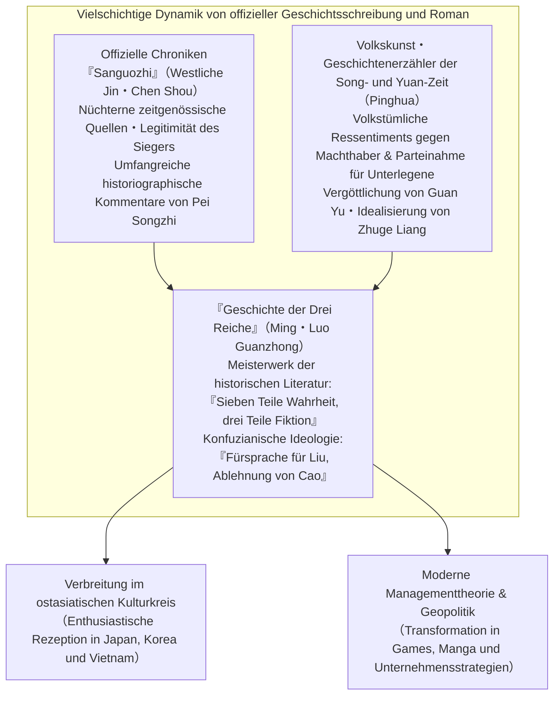
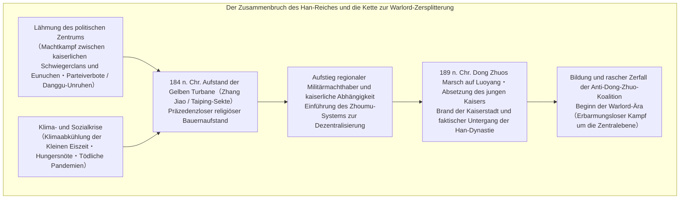
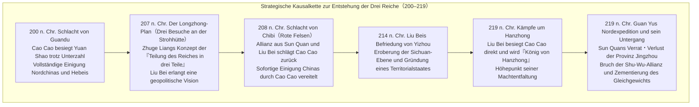
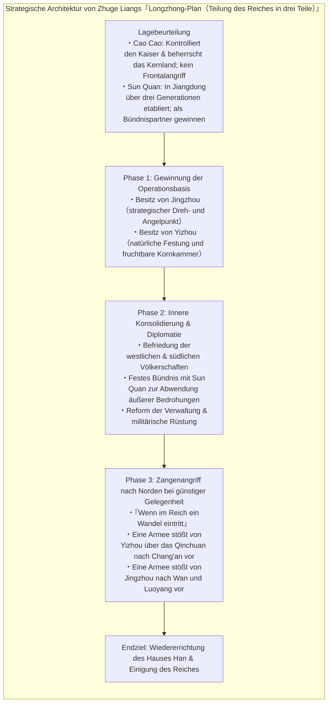
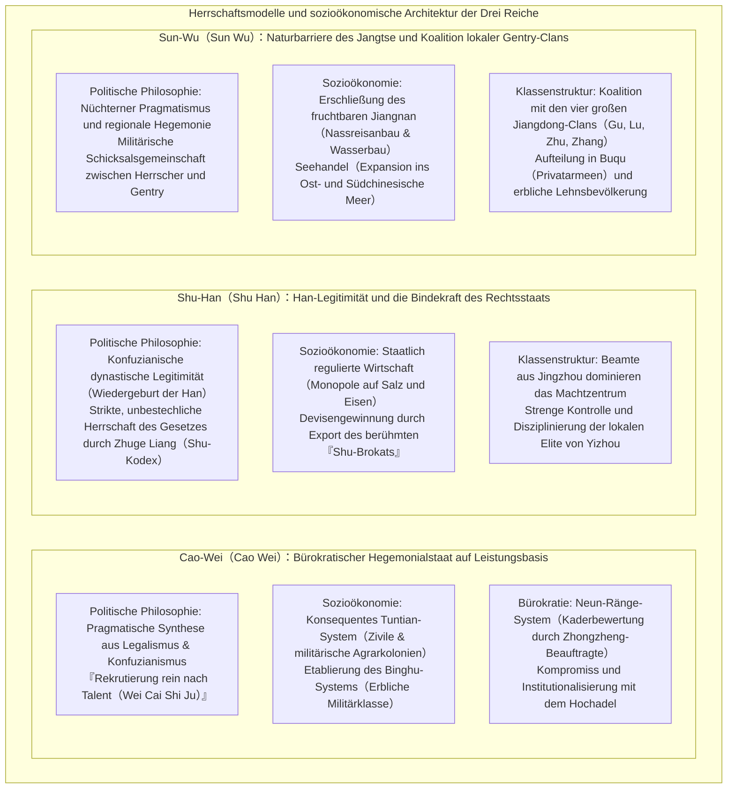

## Einleitung: Warum faszinieren die „Drei Reiche“ die Menschheit seit über 1800 Jahren?

Vom Ausbruch des „Aufstands der Gelben Turbane“ im Jahre 184 n. Chr. bis zur endgültigen Unterwerfung des Staates Sun-Wu durch die Westliche Jin-Dynastie (Western Jin) im Jahre 280 n. Chr. verging nahezu ein ganzes Jahrhundert. Der Aufstieg und Fall der **„Zeit der Drei Reiche“ (Three Kingdoms period)**, der sich auf den weiten Steppen und Ebenen am östlichen Rand des eurasischen Kontinents vollzog, übt auch nach mehr als 1.800 Jahren eine ungebrochene Faszination auf die intellektuelle Vorstellungskraft und Leidenschaft von Menschen in ganz Ostasien und der gesamten Welt aus.

Warum strahlt ausgerechnet dieser Umbruch unter den unzähligen dynastischen Wechselfällen der chinesischen Geschichte ein derart intensiv magnetisches Kulturfeld aus?

Der wesentliche Grund hierfür liegt in der unvergleichlichen „Doppelstruktur“ der Welt der Drei Reiche: Sie ruht einerseits auf den **offiziellen historischen Chroniken der『Drei Reiche』（*Sanguozhi*, verfasst von Chen Shou mit den umfangreichen Kommentaren von Pei Songzhi）**, die einer strengen quellenkritischen Geschichtswissenschaft verpflichtet sind, und andererseits auf dem unübertroffenen Meisterwerk des historischen Romans, der **『Geschichte der Drei Reiche』（*Sanguo Yanyi*, verfasst von Luo Guanzhong）**, das in der Ming-Zeit nach tausendjähriger Anhäufung volkstümlicher Begeisterung, mündlicher Erzähltraditionen und Bühnenspiele seine vollendete literarische Gestalt fand.



Als historische Realität betrachtet, war die Epoche der Drei Reiche ein finsteres Zeitalter verheerender Zerstörung: Der Zusammenbruch der Ordnung des Späteren Han-Reiches ging einher mit einem dramatischen Bevölkerungssturz, klimatischer Abkühlung, Hungersnöten und erbarmungslosen Bürgerkriegen. Zählte das Han-Reich zu seiner Blütezeit noch etwa 56 Millionen registrierte Einwohner, so sank die erfasste Bevölkerung gegen Ende der Dreiteilung in den Territorien von Wei, Shu und Wu zusammengenommen auf schätzungsweise 8 Millionen Menschen (selbst unter Berücksichtigung von nicht erfassten Haushalten und zahllosen Kriegsflüchtlingen hatte die gesellschaftliche Verheerung ein extremes Ausmaß erreicht).

Doch gerade aus diesem institutionellen Vakuum und dem existentiellen Überlebenskampf heraus erwuchsen immer wieder **„bahnbrechende strategische Innovationen“** und **„kühne Experimente staatlicher Neuordnung“**, welche die erstarrten Autoritäten und überkommenen Standesordnungen zertrümmerten:
- Das von Cao Cao (Cao Cao) geschaffene, rein leistungsorientierte Personalrekrutierungssystem („Erhebet einzig das Talent“ / *Wei Cai Shi Ju*) und das agrarökonomische Kolonisationsmodell des „Tuntian-Systems“ (*Tuntian*), welches das chronische Problem der militärischen Nahrungsmittelversorgung löste.
- Der von Zhuge Liang (Zhuge Liang) entworfene geopolitische Masterplan der „Teilung des Reiches in drei Teile“ (*Longzhong-Plan* / *Longzhong Dui*), der es einem Kleinstaat ermöglichen sollte, einen übermächtigen Hegemonen niederzuringen, flankiert von einer unbestechlich strengen Herrschaft des geschriebenen Gesetzes (Legalismus).
- Die von Sun Quan (Sun Quan) unter Ausnutzung der natürlichen Barriere des Jangtse vorangetriebene Urbarmachung und wirtschaftliche Erschließung der Jiangnan-Region, die zur Keimzelle eines auf das Ost- und Südchinesische Meer ausgerichteten maritimen Handelsreiches wurde.

Vor allem aber wurde das dramatische Kräftemessen der menschlichen Psyche – getragen von den Warlords, Strategen, Kriegern und namenlosen Bauern jener Ära – zu einem zeitlosen Epos verdichtet: Cao Caos kühler Rationalismus und seine tragische Einsamkeit; Liu Beis bodenständige Menschlichkeit (Renyi) und sein unbeugsamer Überlebenswille; Guan Yus stolze Loyalität und sein bitterer Untergang; Zhuge Liangs bedingungslose Aufopferung für eine im Grunde unerreichbare historische Mission. All dies erhob die Epoche zu einem über Epochen und Kulturräume hinweg strahlenden Monument des menschlichen Geistes.

Der vorliegende Beitrag unternimmt es, dieses monumentale Panorama der Drei Reiche über eine bloße Anekdotensammlung oder Handlungszusammenfassung hinaus **aus sämtlichen Perspektiven der Geschichtswissenschaft, der politischen Philosophie, der Militärgeopolitik, der sozioökonomischen Institutionengeschichte sowie der Literaturrezeption lückenlos und tiefgreifend zu sezieren**. Indem die Differenzen zwischen offizieller Historie und Romanfiktion objektiv herausgearbeitet werden, dringen wir zu den tiefsten Triebfedern und strategischen Entwürfen jener Persönlichkeiten vor, die dieses Zeitalter des Chaos prägten.

---

## 1. Kapitel: Der Niedergang der Han-Dynastie und der Anbruch der Warlord-Zersplitterung (184–200 n. Chr.)

Der Auftakt zur Epoche der Drei Reiche begann mit dem spektakulären Selbstzerfall des großen Han-Imperiums (Frühere und Spätere Han), das die chinesische Welt über vier Jahrhunderte hinweg geeint hatte. Warum verlor ein derart mächtiger, zentralisierter Staat in rasender Geschwindigkeit seine Bindekraft und ließ die Zersplitterung in regionale Militärdiktaturen und Warlord-Herrschaften zu? Hinter diesem Niedergang verbarg sich eine verhängnisvolle Verflechtung aus institutioneller Ermüdung, moralischer Verwesung im Machtzentrum und globalen Klimaveränderungen.



### 1.1 Die Willkür von Eunuchen und kaiserlichen Schwiegerclans sowie die „Danggu-Unruhen“: Das strukturelle Versagen des Han-Reiches

Die politische Struktur der Späteren Han-Dynastie (Östliche Han: 25–220 n. Chr.) geriet ab ihrer mittleren Phase in einen verhängnisvollen Teufelskreis. Ursache war die ununterbrochene Thronbesteigung minderjähriger oder gar im Säuglingsalter befindlicher Kaiser.

War ein Monarch noch ein Kind, rissen die Kaiserinmutter und deren familiäre Verwandtschaft – die **„kaiserlichen Schwiegerclans“ (Waici)** – die faktische Regierungsgewalt an sich. Erreichte der Kaiser das Jugendalter und erstrebte eine eigenständige Regentschaft, blieb ihm im abgeschotteten Palastinneren meist nur ein Bündnis mit den **„Palasteunuchen“ (Huan-guan)**, mit denen er Tag für Tag zusammenlebte, um die Schwiegerclans durch blutige Palastcoups gewaltsam auszuschalten. Sobald jedoch die Eunuchenclique die Macht innehatte, bereicherte sie sich maßlos, vergab Provinzposten an eigene Verwandte und errichtete ein Regime aus Bestechung und Tyrannei. Dies wiederum führte in der nächsten Generation dazu, dass die neuen Schwiegerclans zurückschlugen und die Eunuchen verfolgten – eine endlose Spirale blutiger Machtkämpfe.

Gegen diese Missstände regte sich bei den konfuzianisch geprägten Berufsbeamten und den Studenten der kaiserlichen Universität (Taixue) erbitterter Widerstand. Sie prangerten die moralische Korruption der Eunuchen offen an, nannten sich selbst stolz die „Reine Strömung“ (*Qingliu-Fraktion*) und verachteten die Eunuchen und deren Günstlinge als „Trübe Strömung“ (*Zhuoliu-Fraktion*).

In die Enge getrieben, manipulierten die Eunuchen den Kaiser und bezichtigten die Gelehrten der Reinen Strömung, eine illegale Verschwörung („Fraktionsbildung zur Zerrüttung des Staates“) angezettelt zu haben. Die Folge waren die beiden verheerenden Säuberungswellen der Jahre 166 und 169 n. Chr., die als **„Danggu-Unruhen“ (Verbot der Parteigänger / *Danggu zhi Huo*)** in die Geschichte eingingen. Hunderte hochrangige Beamte und Intellektuelle wurden hingerichtet oder starben in Kerkern; Tausende wurden auf Lebenszeit mit Berufsverboten belegt und aus dem Staatsdienst verbannt.

Dieser Schlag war für das Han-Reich eine irreparable, tödliche Wunde. Die lokale Gentry, die regionalen Landbesitzer und die Bildungselite verloren jegliches Vertrauen in die Zentralregierung. Der Wille, das Gesetz und die moralische Autorität des Kaisers zu verteidigen, erlosch vollends. In dem Vakuum, das der Verlust der kaiserlichen Autorität hinterließ, entstand der ideale Nährboden für den unaufhaltsamen Aufstieg bewaffneter Regionalkräfte.

### 1.2 Klimaabkühlung, Hungersnöte, Pandemien und der „Aufstand der Gelben Turbane“

Zu der politischen Fäulnis traten dramatische Umbrüche der Natur hinzu.

Erkenntnisse der Paläoklimatologie und der historischen Demographie belegen, dass Ostasien in der zweiten Hälfte des 2. und zu Beginn des 3. Jahrhunderts in die Anfangsphase eines Kältezyklus der sogenannten **„Kleinen Eiszeit“ (Little Ice Age)** eintrat. Extrem harte Winter und sommerliche Dürre- sowie Kältekatastrophen traten in rascher Folge auf, wodurch die landwirtschaftliche Produktivität an Gelbem Fluss und Jangtse dramatisch einbrach. Auf die durch chronische Mangelernährung geschwächte Bevölkerung trafen verheerende **Pandemien (vermutlich verheerende Ausbrüche von Fleckfieber, Typhus oder Pocken)**. In der berühmten Elegie *Shuoyi Fu* („Über die Seuche“) hielt der Dichter Cao Zhi jene apokalyptischen Zustände fest: *„In jedem Haus liegt die Qual einer Leiche, in jedem Gemach hallt das Wehgeschrei; manche Sippen wurden gänzlich ausgelöscht, manche Familien verloren jeden Erben.“*

Inmitten dieser tiefen Verzweiflung trat im Bezirk Julu (in der heutigen Provinz Hebei) der daoistische Meister **Zhang Jiao (Zhang Jiao)** auf den Plan.

Zhang Jiao begründete eine neue religiöse Heilsbewegung namens **„Taipingdao“ (Weg des Großen Friedens)**, die Lehren des Gelben Kaisers (Huangdi) und von Laozi mit volkstümlichen Heilpraktiken verschmolz. Er zog umher, reichte Kranken rituell geweihtes Wasser (*Fushui*), nahm Beichten zur Reue über begangene Verfehlungen ab und gewann innerhalb kürzester Zeit Hunderttausende verzweifelte Bauern für seine Bewegung. Zhang Jiao formierte seine Anhängerschaft straff militärisch und unterteilte das Reich in 36 Heeresteilbezirke (*Fang*), um einen koordinierten Generalaufstand vorzubereiten.

Als Fanal diente eine bis heute berühmte prophetische Losung:
> **„Cang Tian Yi Si, Huang Tian Dang Li, Sui Zai Jiazi, Tianxia Daji.“**  
> (Der blaue Himmel ist bereits tot, der gelbe Himmel soll sich erheben; im Jahre Jiazi herrscht großes Heil unter dem Himmel.)

Der „Blaue Himmel“, Symbol für die kosmische Tugend des Han-Hauses, hatte seine himmlische Legitimität verwirkt. An seine Stelle sollte der dem Erdelement zugeordnete „Gelbe Himmel“ treten. Das Jahr 184 n. Chr. – Beginn eines neuen 60-Jahre-Zyklus im chinesischen Kalender (*Jiazi*) – sollte das Schicksalsjahr der großen Umwälzung werden.

Im Februar 184 n. Chr. erhoben sich Hunderttausende Gläubige mit gelben Kopftüchern als Erkennungszeichen zum bewaffneten Aufstand. Dies war der Ausbruch des **„Aufstands der Gelben Turbane“ (Yellow Turban Rebellion)**. Der Flächenbrand erfasste die Kernlande Hebei, Henan und Shandong: Behörden wurden niedergebrannt, Magistrate ermordet oder in die Flucht geschlagen.

Ein von Panik erfasster Kaiserhof entsandte die verdienten Generäle Huangfu Song (Huangfu Song), Zhu Jun (Zhu Jun) und Lu Zhi (Lu Zhi), hob die Verbote gegen die konfuzianischen Gelehrten auf, um deren Loyalität zu sichern, und rief reichsweit zur Aufstellung von Freiwilligenverbänden auf. In diesen Schlachten betraten Männer wie Cao Cao, Liu Bei und Sun Jian erstmals als Anführer von Bürgermilizen und kaiserlichen Hilfstruppen die historische Bühne.

Zwar wurde die Hauptmacht der Rebellen noch im selben Jahr nach dem plötzlichen Krankheitstod von Zhang Jiao durch die kaiserlichen Armeen zerschlagen, doch die Überlebenden zersplitterten in autonome Partisanenarmeen wie die „Heishan-Banditen“ (Schwarze Berge) oder die „Baibo-Banditen“ (Weiße Welle) und führten den Guerillakrieg reichsweit fort. Da die kaiserliche Zentralgewalt die Ordnung aus eigener Kraft nicht mehr wiederherstellen konnte, führte sie im Jahre 188 n. Chr. das verhängnisvolle **„Zhoumu-System“ (Provinzgouverneurs-System)** ein. Den Gouverneuren der Provinzen (*Zhoumu*) wurde die ungeteilte militärische, administrative und steuerliche Vollmacht über ihre Regionen übertragen. Dies war der entscheidende Auslöser, der aus regionalen Verwaltungsbeamten faktisch souveräne, erbliche **Militärherrscher (Warlords)** machte.

### 1.3 Dong Zhuos Schreckensherrschaft und der Brand von Luoyang: Der totale Zusammenbruch der alten Ordnung

Als im Jahre 189 n. Chr. Kaiser Lingdi verstarb, eskalierte der Machtkampf am Hofe zwischen He Jin (He Jin), dem Anführer der kaiserlichen Schwiegerclans, und den mächtigen „Zehn Eunuchen“ (*Shi Changshi*) in seine finale Phase. Um die Eunuchen militärisch einzuschüchtern, rief He Jin den im nordwestlichen Grenzland Liangzhou stationierten General **Dong Zhuo (Dong Zhuo)** herbei, der eine kampferprobte, aus Han-Chinesen und nomadischen Hilfsvölkern bestehende Privatarmee kommandierte.

Doch noch ehe Dong Zhuo die Tore Luoyangs erreichte, durchschauten die Eunuchen das Vorhaben und ermordeten He Jin im Palastbezirk. Voller Zorn stürmten junge Gardeoffiziere aus dem Hochadel – darunter Yuan Shao (Yuan Shao) und der junge Cao Cao – die Palastanlagen und verübten ein beispielloses Blutbad, bei dem mehr als 2.000 Eunuchen niedergemetzelt wurden.

In das so entstandene anarchische Machtvakuum stieß Dong Zhuo mit seinen Truppen vor. Der grobschlächtige Warlord aus den Grenzlanden schüchterte den alteingesessenen Adel mit brutaler Waffengewalt ein, setzte den jungen Kaiser Shaodi ab und erhob dessen jüngeren Halbbruder Liu Xie (Kaiser Xiandi) auf den Thron. Sich selbst ernannte er zum allmächtigen Premierminister (*Xiangguo*) und riss die gesamte Staatsgewalt an sich.

Dong Zhuos Terrorherrschaft, gekennzeichnet durch Willkür, Schändungen und Hinrichtungen, empfanden die traditionellen konfuzianischen Beamten als unerträgliche Erniedrigung. Im Jahre 190 n. Chr. bildeten die Machthaber östlich des Hangu-Passes unter der Führung von Yuan Shao eine schlagkräftige Koalition: die **„Anti-Dong-Zhuo-Koalitionsarmee“**. Zu ihren prominenten Mitgliedern zählten Cao Cao, Sun Jian, Yuan Shu, Qiao Mao und Bao Xin.

Angesichts des militärischen Drucks der Koalition griff Dong Zhuo zu einer Politik der verbrannten Erde von beispielloser Grausamkeit: Er zwang Millionen Bewohner der jahrhundertealten Metropole Luoyang zu einem Gewaltmarsch in die westliche Residenz Chang'an (heutiges Xi'an). Anschließend ließ er sämtliche Paläste, kaiserliche Ahnentempel, Bibliotheken, Wohnhäuser und sogar die Gräber der Han-Kaiser systematisch plündern und in Brand stecken. Die größte und prächtigste Kulturmetropole Ostasiens sank binnen weniger Tage in Schutt und Asche.

Die Tragik verschärfte sich dadurch, dass die Anti-Dong-Zhuo-Koalition, die unter hehren ideologischen Parolen angetreten war, vor Dong Zhuos Elitetruppen zurückschreckte. Statt offensiv vorzugehen, verharrten die Warlords in ihren Lagern, veranstalteten Gelage und belauerten einander voller Misstrauen um Territorialgewinne. Empört unternahmen Cao Cao und Sun Jian eigenständige Vorstöße, erlitten jedoch empfindliche Verluste. Die Koalition zerbrach an internen Intrigen, ohne Dong Zhuo besiegt zu haben. Die imperiale Ordnung des Han-Reiches war damit unwiederbringlich zertrümmert – das Zeitalter des Faustrechts, die **„Ära der Warlord-Zersplitterung“**, hatte begonnen.

(Der Tyrann Dong Zhuo selbst fand schließlich 192 n. Chr. in Chang'an sein Ende: Er fiel einem Komplott seines engsten Vertrauten und Adoptivsohns Lu Bu (Lu Bu) sowie des Ministers Wang Yun (Wang Yun) zum Opfer; sein Leichnam wurde auf dem Marktplatz von Chang'an öffentlich zur Schau gestellt und angezündet.)

### 1.4 Der Kampf um die Zentralebene: Aufstieg und Fall der Warlords

Nach der Einäscherung der kaiserlichen Ordnung verwandelte sich das Kernland der chinesischen Zivilisation – die Zentralebene (*Zhongyuan*, das fruchtbare Stromgebiet am Mittellauf und Unterlauf des Gelben Flusses) – in eine Arena erbarmungsloser Ausscheidungskämpfe. Die wichtigsten Akteure dieser formativen Phase waren:

- **Yuan Shao (Yuan Shao)**: Spross des angesehensten Hochadelsgeschlechts des Reiches („Vier Generationen, drei Kanzlerämter“ / *Si Shi San Gong*). Nach einem zähen Ringen bezwang er seinen nördlichen Rivalen Gongsun Zan und unterwarf die vier wohlhabenden Provinzen nördlich des Gelben Flusses (Ji, Qing, You und Bing), wodurch er zum mächtigsten Heerführer Nordchinas aufstieg.
- **Yuan Shu (Yuan Shu)**: Cousin (oder Halbbruder) von Yuan Shao. Er herrschte über die Region Huainan (nördliches Anhui). Als er in den Besitz des kaiserlichen Erb-Jadesiegels (*Chuan Guo Yuxi*) gelangte, das Sun Jian aus den Trümmern Luoyangs geborgen hatte, verfiel er einem größenwahnsinnigen Traum und proklamierte sich selbst zum Kaiser der kurzlebigen Zhong-Dynastie. Allseits isoliert und angefeindet, trieb er sich rasch in den Ruin.
- **Sun Ce (Sun Ce)**: Der älteste Sohn von Sun Jian, dem „Tiger von Jiangdong“. Ausgestattet mit mitreißendem Charisma und überragender Tapferkeit – weshalb er den Beinamen „Kleiner Bezwinger“ (*Xiaobaowang*) erhielt –, eroberte er nach dem Tod seines Vaters in wenigen Jahren im Handstreich die sechs Komtureien südlich des Jangtse. Er schuf damit das unerschütterliche territoriale Fundament des späteren Staates Wu, fiel jedoch im Jahr 200 n. Chr. im Alter von nur 26 Jahren dem Racheanschlag gedungener Attentäter zum Opfer.
- **Lu Bu (Lu Bu)**: Ein Krieger von übermenschlicher physischer Schlagkraft, gefeiert im Sprichwort: *„Unter den Menschen Lu Bu, unter den Pferden Chitu (Rotes Rassepferd)“*. Doch bar jeder strategischen Verlässlichkeit hinterging er nacheinander seine Förderer Ding Yuan und Dong Zhuo. Nach rastloser Wanderschaft entriss er Liu Bei die Provinz Xuzhou, wurde jedoch schließlich in Xiapi von den vereinten Kräften Cao Caos und Liu Beis eingekesselt und nach dem Verrat seiner eigenen Offiziere hingerichtet.
- **Liu Biao (Liu Biao)**: Ein hochgebildeter Aristokrat und Gelehrter, der die strategisch vitale und wasserreiche Provinz Jingzhou (am Mittellauf des Jangtse) verwaltete. Er bot Zehntausenden vor dem Krieg fliehenden Gelehrten und Bauern Zuflucht, förderte die Wissenschaft und bewahrte lange Zeit den Frieden. Da es ihm jedoch an Weitblick und imperialem Ehrgeiz mangelte, blieb er ein reiner „Bewahrer des Status quo“.
- **Liu Bei (Liu Bei)**: Zwar berief er sich auf die Abstammung von Kaiser Jing der Früheren Han-Dynastie, war jedoch in bitterer Armut aufgewachsen und hatte in seiner Jugend Strohsandalen und Bastmatten geflochten, um seine verwitwete Mutter zu ernähren. Verbunden durch einen unauflöslichen Loyalitätseid mit Guan Yu und Zhang Fei, übernahm er zeitweilig Xuzhou von Tao Qian, verlor es an Lu Bu und irrte jahrelang als Schutzsuchender von Warlord zu Warlord – über Cao Cao und Yuan Shao bis hin zu Liu Biao. Obgleich er über kein eigenes Territorium verfügte, besaß er durch seine tiefe moralische Integrität und seine außergewöhnliche menschliche Anziehungskraft reichsweites Ansehen.

### 1.5 Cao Caos Aufstieg und die „Aufnahme des Kaisers Xiandi“: Synthese aus politischer Legitimität und radikalem Rationalismus

Aus diesem Gewirr rivalisierender Kriegsherren ragte eine Gestalt durch überlegenes strategisches Genie hervor: **Cao Cao (Cao Cao, Hofname Mengde)**.

Als Nachkomme einer einflussreichen Eunuchenfamilie – sein Adoptivgroßvater Cao Teng war ein mächtiger Palasteunuch gewesen – begegnete der alte Hochadel wie etwa Yuan Shao ihm mit spürbarem Standeshochmut. Doch Cao Cao vereinte in sich die Qualitäten eines genialen Feldherrn, eines eiskalten Staatsmannes und eines der herausragendsten Dichter seiner Zeit.

Cao Caos erster meisterhafter Schachzug von weltgeschichtlicher Tragweite vollzog sich im Jahre 196 n. Chr. mit der **„Aufnahme des Kaisers Xiandi“ (*Fengying Xiandi*)**.

Der junge Kaiser war den mörderischen Machtkämpfen von Dong Zhuos verbliebenen Offizieren (Li Jue und Guo Si) in Chang'an entkommen und irrte hungernd und mittellos durch die rauchenden Trümmer der alten Hauptstadt Luoyang. Auf den dringenden Rat seines Chefstrategen Xun Yu (Xun Yu) handelte Cao Cao blitzschnell: Er stellte den Monarchen unter seinen militärischen Schutz und überführte den Hofstaat in sein eigenes Hauptquartier nach Xuchang (in der heutigen Provinz Henan).

Damit erlangte Cao Cao den ultimativen politischen Trumpf:
> **„Den Himmelssohn beherbergen, um den Lehnsfürsten zu gebieten“ (*Xia Tianzi Yi Ling Shouhou*)**

Von nun an bedeutete jeder Angriff auf Cao Cao einen Hochverrat am amtierenden Kaiser. Als Kanzler und faktischer Regent konnte Cao Cao die kaiserlichen Dekrete und Edikte im Namen des Himmelssohnes erlassen, gegnerische Warlords offiziell zu Rebellen stempeln und seine eigenen Eroberungsfeldzüge als völkerrechtlich legitimierte Strafexpeditionen der regulären Regierungstruppen darstellen.

Nahezu zeitgleich setzte Cao Cao eine bahnbrechende Wirtschaftsreform ins Werk, um die verheerte Zentralebene ökonomisch zu revitalisieren: die Einführung des **„Tuntian-Systems“ (*Tuntian-System*, agrarische Militär- und Zivilkolonien)** im Jahre 196 n. Chr. auf Anregung von Zao Zhi und Han Hao. Unzählige durch die Kriege verlassene Ländereien wurden zu staatlichem Eigentum erklärt. Die Behörden siedelten heimatlose Kriegsflüchtlinge auf diesen Parzellen an, statteten sie mit staatlichem Saatgut und Pflugochsen aus und verpflichteten sie zur landwirtschaftlichen Bewirtschaftung. Im Gegenzug für die Abgabe von 50 bis 60 Prozent der Ernte an den Staat wurden die Siedler vom allgemeinen Kriegsdienst freigestellt, und ihre physische Existenz wurde gesichert.

Durch das Tuntian-System überwand Cao Caos Verwaltung das chronische Problem, an dem alle anderen Warlords scheiterten: den Mangel an Proviant und Nachschub. Binnen weniger Jahre füllten sich die kaiserlichen Speicher mit Millionen Scheffeln Getreide. Gestützt auf dieses Doppel-Fundament aus unanfechtbarer politischer Legitimität (Kaiserschutz) und solider materiell-logistischer Autonomie (Tuntian-System), rüstete sich Cao Cao zum unausweichlichen Endkampf mit dem Koloss des Nordens: Yuan Shao.

---

## 2. Kapitel: Das Aufeinanderprallen der Hegemonen und der Weg zum Dreiecks-Patt (200–219 n. Chr.)

Die rund zwei Jahrzehnte zwischen 200 und 219 n. Chr. bilden die dramatischste und strategisch dichteste Epoche der Drei Reiche: Aus dem chaotischen Trümmerfeld rivalisierender Warlords kristallisierten sich schrittweise die drei Großmächte „Wei, Shu und Wu“ heraus.

Drei weltgeschichtliche Schlüsselkampagnen gaben dieser Entwicklung die entscheidende Richtung: die **„Schlacht von Guandu (200 n. Chr.)“**, die **„Schlacht von Chibi (208 n. Chr.)“** sowie die **„Kämpfe um Hanzhong und Fancheng (219 n. Chr.)“**.



### 2.1 Die Schlacht von Guandu (200 n. Chr.): Der Informationskrieg, in dem die Minderzahl den Riesen verschlang

Im Jahre 200 n. Chr. entbrannte um die Vorherrschaft im Norden Chinas der legendäre Entscheidungskampf: die **„Schlacht von Guandu“ (Battle of Guandu)**.

Hier standen sich zwei ungleiche Mächte gegenüber: Auf der einen Seite **Yuan Shao (Yuan Shao)**, der unangefochtene Gigant, der die vier Hebei-Provinzen beherrschte und eine Armee von 100.000 erlesenen Fußsoldaten sowie 10.000 schweren Reitern ins Feld führte; auf der anderen Seite **Cao Cao (Cao Cao)**, der zwar den Kaiser in seinen Händen hielt, jedoch über kaum mehr als 20.000 bis 30.000 Mann verfügte. Yuan Shao genoss eine erdrückende personelle Überlegenheit von drei- bis vierfacher Stärke. Rein rechnerisch galt Cao Caos Vernichtung als ausgemachte Sache.

Nachdem Yuan Shaos Streitkräfte den Gelben Fluss überschritten hatten und nach Süden vorstießen, zog sich Cao Cao in die befestigten Stellungen bei Guandu (nordöstlich des heutigen Kreises Zhongmu in Henan) zurück, wo die Front in einem zähen Abnutzungskrieg erstarrte. Yuan Shao ließ riesige Erdwälle aufschütten und hölzerne Geschosstürme errichten, von denen aus Pfeilhagel auf Cao Caos Lager niederging; zugleich gruben seine Pioniere Stollen, um die Befestigungen zu unterminieren. Cao Cao konterte mit technischen Innovationen: Er konstruierte schwere Steinschleudern – die sogenannten „Donnerwagen“ (*Fashiche*) –, die Yuan Shaos Türme zerschmetterten, und hob tiefe Ringgräben aus, welche die gegnerischen Stollen abfingen.

Doch mit jedem Tag des Stillstands geriet Cao Caos Heer tiefer in Bedrängnis. Die Proviantvorräte schwanden rapide, die Truppen litten unter Erschöpfung und Hunger, und Cao Cao selbst war derart entmutigt, dass er einen vertraulichen Brief an Xun Yu in die Heimatbasis Xuchang sandte, in dem er über einen geordneten Rückzug nachdachte. Xun Yu antwortete mit unnachgiebiger Schärfe: *„Wenn Ihr jetzt weicht, fällt das ganze Reich an Yuan Shao. Ihr müsst standhalten und auf den einen Riss in seiner Rüstung warten.“*

Und dieser Riss tat sich auf – nicht auf dem Schlachtfeld, sondern an der Nahtstelle von **„Geheimdienstinformationen und Logistik“**.

Einer von Yuan Shaos profiliertesten Chefberatern, **Xu You (Xu You)**, hatte seinem Herrn vorgeschlagen, die Streitkräfte zu teilen und mit einem schnellen Reiterkorps das entblößte Xuchang zu überfallen. Yuan Shao lehnte den Plan ab. Als zeitgleich bekannt wurde, dass Angehörige von Xu Yous Sippe sich der Korruption schuldig gemacht hatten, drohte ihm die Verhaftung. Voller Verbitterung flüchtete Xu You im Schutz der Dunkelheit in Cao Caos Lager.

Als Cao Cao von der Ankunft seines Jugendfreundes erfuhr, eilte er barfuß – ohne Zeit zu finden, seine Schuhe anzuziehen – aus seinem Zelt, um ihn freudig zu umarmen. Xu You verriet ihm das bestgehütete militärische Geheimnis des Feindes:
> „Yuan Shaos gesamter Heeresproviant – Zehntausende Wagenladungen an Korn – lagert im rückwärtigen Depot von **Wuchao (Wuchao)**. Der Kommandant Chunyu Qiong (Chunyu Qiong) wiegt sich in trügerischer Sicherheit und vernachlässigt die Wachen. Wenn Ihr jetzt mit einer Elitekavallerie einen nächtlichen Handstreich wagt und das Lager einäschert, bricht Yuan Shaos Riesenheer binnen drei Tagen ohne Kampf von selbst in sich zusammen.“

Cao Cao fackelte nicht. Er stellte persönlich eine Elitetruppe von 5.000 leichten Reitern zusammen. Um die feindlichen Patrouillen zu täuschen, führten sie die Banner Yuan Shaos mit sich, schwärzten ihre Gesichter und ließen die Pferde auf Holzstäbchen beißen, um jedes Geräusch zu ersticken. Im Morgengrauen überfielen sie Wuchao. Nach blutigem Ringen wurde Chunyu Qiongs Garnison niedergemacht und das gesamte Vorratslager in Brand gesteckt.

Als Yuan Shaos Soldaten die meterhohen Rauchsäulen am Horizont aufsteigen sahen, brach panisches Entsetzen aus. Als kurz darauf die berühmten Generäle Zhang He (Zhang He) und Gao Lan mit ihren Verbänden zu Cao Cao überliefen, kollabierte Yuan Shaos Front vollständig. Yuan Shao selbst entkam dem Inferno mit seinem ältesten Sohn Yuan Tan und kaum 800 Reitern über den Gelben Fluss nach Norden.

Die Schlacht von Guandu war weit mehr als ein taktischer Triumph: Sie markiert den glanzvollen Sieg einer modernen, meritokratischen, auf Schnelligkeit und Logistik basierenden Kriegsführung über die behäbige, von internen Eifersüchteleien gelähmte Feudalaristokratie alter Schule. Nach Yuan Shaos bald darauf folgendem Tod zerschlug Cao Cao dessen zerstrittene Nachkommen, unterwarf 207 n. Chr. die nomadischen Wuhuan im Norden und vollendete damit die **vollständige Vereinigung Nordchinas (Zentralebene und Hebei)** unter seiner eisernen Faust.

### 2.2 Liu Beis Irrfahrten und die „Drei Besuche an der Strohhütte“: Die geopolitische Sprengkraft des Longzhong-Plans

Während Cao Cao den Norden militärisch zusammenschmiedete, saß **Liu Bei (Liu Bei)** nach endlosen Irrfahrten im abgelegenen Grenzstädtchen Xinye (Xinye, im heutigen Nanyang in Henan), geduldet vom Provinzgouverneur Liu Biao. Er stand bereits im fünften Lebensjahrzehnt und beklagte in bitteren Momenten den „Ansatz von Fett an seinen Schenkeln“ (*Birou zhi Tan*) – das traurige Zeugnis eines Kriegers, der vom Pferderücken verbannt ist, ohne Großes vollbracht zu haben.

Doch im Jahre 207 n. Chr. sollte eine historische Begegnung die Weichen für die Zukunft ganz Chinas neu stellen: die Zusammenkunft mit einem 27-jährigen, bis dahin völlig unbekannten Gelehrten, der zurückgezogen in einer Strohhütte im Dorf Longzhong nahe Xiangyang lebte – **Zhuge Liang (Zhuge Liang, Hofname Kongming)**.

Liu Bei reiste voller Demut dreimal persönlich zu dessen bescheidener Klause, um den jungen Denker um Rat anzuflehen – ein Vorgang, der als **„Drei Besuche an der Strohhütte“ (Three Visits to the Thatched Cottage / *San Gu Zhi Li*)** in die Weltliteratur einging. Und in jener einfachen Hütte breitete Zhuge Liang vor den Augen des heimatlosen Warlords einen geopolitischen Meisterplan aus: das epochale Konzept der **„Teilung des Reiches in drei Teile“ (*Longzhong-Plan* / *Longzhong Dui*)**.



Zhuge Liangs Analyse bestach durch kompromisslosen Realismus:
1. **Nüchterne Freund-Feind-Bestimmung**: Cao Cao kontrolliert den Himmelssohn und besitzt die Ressourcen des Nordens; ein frontaler Zusammenstoß führt unweigerlich ins Verderben. Sun Quan hingegen sitzt seit drei Generationen fest im Sattel von Jiangdong und genießt das Vertrauen des Volkes; er darf keinesfalls bekämpft, sondern muss als unentbehrlicher Bundesgenosse gewonnen werden.
2. **Besitznahme der Schlüsselregionen**: Die Provinz Jingzhou verbindet im Norden Han- und Mian-Fluss, reicht im Süden bis zum Südmeer und öffnet nach Westen den Zugang nach Sichuan; sie ist der Dreh- und Angelpunkt für die militärische Beherrschung des Reiches. Da Liu Biao zu schwach ist, sie zu halten, muss Liu Bei sie übernehmen. Die westliche Provinz Yizhou (Sichuan-Becken) wiederum ist eine von Gebirgen geschützte, fruchtbare Festung der Natur („Land des Überflusses“ / *Tianfu*), deren Herrscher Liu Zhang träge und unfähig ist. Diese beiden Provinzen müssen das Fundament eines neuen Staates bilden.
3. **Strategischer Zangenangriff bei einer Krise im Norden**: Sobald die innere Verwaltung reformiert, die Stämme im Südwesten befriedet und die Allianz mit Sun Quan unverbrüchlich geknüpft ist, soll beim Eintreten einer tiefgreifenden Krise im Norden (*„Wenn im Reich ein Wandel eintritt“*) eine Doppeloffensive gestartet werden: Eine Hauptarmee stößt von Yizhou aus durch die Pässe nach Chang'an vor, während ein fähiger Marschall mit einer zweiten Streitmacht von Jingzhou aus direkt auf Wan und Luoyang marschiert. Vom Volk als Befreier begrüßt, würde das Haus Han glorreich wiedererstehen.

Als Liu Bei diese Ausführungen vernahm, wichen alle Zweifel von ihm: *„Dass ich Kongming gewonnen habe, ist wie das Wasser für den Fisch.“* Aus dem unsteten, glücklosen Freischärlerkommandanten war durch Zhuge Liangs strategische Blaupause ein visionärer Staatsgründer geworden.

### 2.3 Die Schlacht von Chibi (208 n. Chr.): Die Wasserfestung am Jangtse und die historische Wasserscheide

Kaum war der Longzhong-Plan formuliert, brach im Sommer 208 n. Chr. das Unheil herein: Cao Cao setzte sich an der Spitze einer gewaltigen Streitmacht persönlich nach Süden in Bewegung. Zu allem Unglück starb Liu Biao, und dessen jüngerer Sohn Liu Cong kapitulierte feige vor den heranrückenden Truppen. Liu Bei musste überstürzt nach Süden fliehen. Bei Changban (Dangyang) holte ihn Cao Caos gefürchtete Elitekavallerie, die „Tiger- und Leoparden-Reiter“ (*Hubaoqi*), ein. Liu Bei verlor seine gesamte Habe, trennte sich im Chaos von Weib und Kind und entkam nur um Haaresbreite (inmitten dieser Verzweiflungsschlacht wurden die Legenden von Zhao Yuns todesmutiger Rettung des Säuglings Liu Shan und Zhang Feis furchtlosem Stand auf der Changban-Brücke geboren).

Liu Bei zog sich nach Xiakou (dem heutigen Wuhan) zurück und suchte fieberhaft das Bündnis mit **Sun Quan (Sun Quan)**, dem jungen Herrscher über das Untere Jangtse-Becken. Zhuge Liang reiste als Gesandter nach Jiangdong und schmiedete im Verbund mit Sun Quans genialem Militärbefehlshaber **Zhou Yu (Zhou Yu)** und dem Weitblicker **Lu Su (Lu Su)** eine schlagkräftige Kriegskoalition.

Während viele zivile Minister Sun Quans panisch zur Kapitulation rieten – schließlich verfüge Cao Cao über Hunderttausende Krieger, den Kaiser und nun auch über die erbeutete Flotte von Jingzhou –, legte Zhou Yu die verborgenen Achillesfersen des Invasors schonungslos offen:
1. Cao Caos Truppen bestanden aus Reitern und Landsoldaten des Nordens, die auf dem Wasser vollkommen hilflos waren.
2. Nach einem Tausende Meilen langen Eilmarsch waren Mensch und Pferd völlig entkräftet; der Ausbruch seuchenartiger Krankheiten im feuchten Klima des Südens war vorprogrammiert.
3. Der Mangel an Pferdefutter und die extreme Überdehnung der Nachschublinien würden die Versorgung unweigerlich erdrosseln.

Entschlossen zog Sun Quan sein Schwert, hieb eine Ecke seines Schreibtisches ab und verkündete: *„Wer noch einmal von Kapitulation spricht, dessen Haupt soll fallen wie diese Tischecke!“* Er unterstellte Zhou Yu eine Flotte von 30.000 erlesenen Seesoldaten und sandte sie an die Seite Liu Beis flussaufwärts.

Im Winter des Jahres 208 n. Chr. trafen die verfeindeten Heere an einer Enge des Jangtse aufeinander: die **„Schlacht von Chibi“ (Battle of Red Cliffs / Schlacht an den Roten Felsen)**.

Um der grassierenden Seekrankheit seiner Nordmänner Herr zu werden, hatte Cao Cao seine Kriegsschiffe mit schweren Eisenketten und Holzbohlen fest miteinander verbinden lassen, sodass sie ruhig wie ein Ponton auf den Wellen lagen. Als Zhou Yus Vizekommandant **Huang Gai (Huang Gai)** dies erkannte, ersann er eine tödliche List: Er sandte Cao Cao ein gefälschtes Überläuferschreiben und näherte sich der feindlichen Flotte mit Dutzenden wendiger Stoßboote, die bis zum Rand mit trockenem Reisig, Stroh und Lampenöl beladen waren.

Ein plötzlich einsetzender, heftiger Südostwind trieb die Schiffe direkt auf Cao Caos Armada zu. In Sichtweite entfachten Huang Gais Matrosen das Feuer und sprangen in Beiboote. Die lichterloh brennenden Brandboote bohrten sich mit voller Wucht in die starr aneinandergeketteten Kolosse Cao Caos. Binnen Minuten griff das Feuer von Schiff zu Schiff über; der Jangtse verwandelte sich in ein unentrinnbares Feuermeer. Der orkanartige Wind trug die Flammen bis in die riesigen Landlager am Ufer, wo Chaos und Verderben ausbrachen.

Cao Cao musste mit den kläglichen Trümmern seiner Armee über den morastigen, von Seuchen verseuchten Huarong-Pfad die Flucht nach Norden antreten.

Die Schlacht von Chibi gilt als größte Seeschlacht der Antike und als **weltgeschichtlicher Wendepunkt, der Cao Caos Traum einer blitzartigen Einigung des Reiches für immer vernichtete**. Der Jangtse war als unüberwindbare Grenze etabliert, und Zhuge Liangs Vision einer Dreiteilung der Welt war aus der Theorie in die Realität übergegangen.

### 2.4 Der Kampf um Yizhou und die Schlachten um Hanzhong (211–219 n. Chr.): Territoriale Festigung von Shu-Han

Im Gefolge des Triumphs von Chibi sicherte sich Liu Bei rasch die Kontrolle über den südlichen Teil von Jingzhou (Wuling, Changsha, Lingling und Guiyang). Doch um das Konzept der Dreiteilung zu vollenden, war die Inbesitznahme des fruchtbaren und gebirgigen **„Yizhou“ (Sichuan-Becken)** unverzichtbar.

Im Jahre 211 n. Chr. beging der Gouverneur von Yizhou, Liu Zhang (Liu Zhang), einen fatalen Fehler: Bedroht durch den Aufstieg des religiösen Warlords Zhang Lu im Norden, lud er seinen entfernten Verwandten Liu Bei mit dessen Truppen nach Sichuan ein. Berater wie Zhuge Liang, Pang Tong (Pang Tong) und Fa Zheng (Fa Zheng) beschworen Liu Bei, diese einmalige Gunst der Stunde zu nutzen.

Nach langem moralischen Zögern entschloss sich Liu Bei zum Handeln. Trotz schmerzhafter Rückschläge – darunter der Tod seines brillanten Strategen Pang Tong am Hügel des Gefallenen Phönix (*Luofengpo*) – schlossen seine Truppen 214 n. Chr. die Provinzhauptstadt Chengdu ein. Liu Zhang kapitulierte, und Liu Bei übernahm die Herrschaft über ganz Sichuan. Sein Heer war nun mit herausragenden Generälen bestückt: Zu Guan Yu, Zhang Fei und Zhao Yun gesellten sich der gefürchtete Reiterführer Ma Chao (Ma Chao) aus Liangzhou sowie der erfahrene Haudegen Huang Zhong (Huang Zhong).

Im Jahre 217 n. Chr. eröffnete Liu Bei den Feldzug um das strategische Nordtor Sichuans: **„Hanzhong“ (Hanzhong)**. Eingebettet zwischen dem Qinling- und dem Daba-Gebirge bildete Hanzhong den Riegel zu Sichuan; solange Wei diesen Pass beherrschte, drohte Chengdu die ständige Strangulierung.

Unter der meisterhaften Operationsführung von Fa Zheng gelang Liu Bei der entscheidende Durchbruch: In der Schlacht am Berg Dingjun überrumpelte Huang Zhong das Lager des gegnerischen Oberbefehlshabers **Xiahou Yuan (Xiahou Yuan)** und schlug ihn eigenhändig nieder. Als Cao Cao persönlich mit einem Riesenheer herbeieilte, um das Blatt zu wenden, zog sich Liu Bei geschickt in unüberwindbare Bergfestungen zurück und zermürbte die kaiserlichen Linien im Kleinkrieg. Von Nachschubmangel zerrüttet, gab Cao Cao das Terrain mit dem berühmten Seufzer auf, Hanzhong sei wie eine „Hühnerrippe“ (*Jilei*) – zu wertlos, um dafür zu verbluten, aber zu schade, um es kampflos wegzugeben.

Im Herbst 219 n. Chr. proklamierte sich Liu Bei nach der vollständigen Einnahme Hanzhongs vor seinen versammelten Heerführern zum **„König von Hanzhong“**. Der einstige Strohsandalenflechter war nun dem Usurpator Cao Cao ebenbürtig und hielt die Fäden eines mächtigen Staates in den Händen. Der Tag der großen Nordexpedition schien zum Greifen nah.

### 2.5 Guan Yus Nordexpedition und sein tragisches Ende bei Maicheng: Der Verlust von Jingzhou als strategischer Wendepunkt

Doch auf dem Zenit der Macht traf das junge Reich von Shu-Han die verheerendste Katastrophe seiner Existenz – ausgelöst durch den ungestümen Vorstoß des Marschalls **Guan Yu (Guan Yu)**.

Im Sommer 219 n. Chr., ermutigt durch Liu Beis Triumphe in Hanzhong, führte Guan Yu die Elitetruppen von Jingzhou nach Norden und kesselte die Schlüsselveste Fancheng (Fancheng, im heutigen Xiangyang) ein, die von Cao Caos treuem General Cao Ren verteidigt wurde. Als sintflutartige Regenfälle den Han-Fluss über die Ufer treten ließen, nutzte Guan Yu die Gunst des Elements: Er ertränkte die herannahenden Entsatzheere unter Yu Jin (Yu Jin) in den Fluten, nahm 30.000 Gefangene und ließ den unbeugsamen Haudegen Pang De (Pang De) hinrichten.

Dieser Sieg, der als **„Erschütterung ganz Chinas“ (*Wei Zhen Huaxia*)** gefeiert wurde, versetzte Cao Cao in solche Panik, dass er ernsthaft erwog, die kaiserliche Residenz von Xuchang weit nach Norden zu verlegen.

Doch Guan Yus spektakulärer Triumph riss die latenten Spannungen mit dem Bundesgenossen **Sun Quan** unwiderruflich auf. Für Liu Bei war Jingzhou das unverzichtbare Sprungbrett für den Zangenangriff auf den Norden; für Sun Quan hingegen war es ein unerträglicher Zustand, dass eine fremde Militärmacht den gesamten Oberlauf des Jangtse dominierte. Nach Lu Sus Tod hatte **Lu Meng (Lu Meng)** den Oberbefehl in Wu übernommen. Er warnte Sun Quan eindringlich: *„Wenn Guan Yu Fancheng bricht, wird er morgen Jiangdong unterjochen. Wir müssen zuschlagen, solange seine Truppen an der Front gebunden sind.“*

Hinzu kam Guan Yus fatale Hybris. Der Krieger blickte voller Verachtung auf Diplomaten und die Gentry herab: Einen ehrenvollen Heiratsantrag Sun Quans wies er schroff ab mit den Worten: *„Wie dürfte die Tochter eines Tigers den Sohn eines Hundes ehelichen?!“* Zudem demütigte er seine rückwärtigen Festungskommandanten Mi Fang (den Schwager Liu Beis) und Shi Ren, die er wegen kleinerer Versäumnisse mit dem Tode bedrohte.

Auf Anraten von Sima Yi (Sima Yi) und Jiang Ji schloss Cao Cao einen Geheimvertrag mit Sun Quan: Wu sollte Guan Yu in den Rücken fallen und dafür die unangefochtene Oberhoheit über ganz Jiangnan erhalten.

Lu Meng täuschte eine schwere Erkrankung vor und übergab das Kommando demonstrativ an den jungen, gänzlich unbekannten Offizier **Lu Xun (Lu Xun)**. Eingelullt von schmeichlerischen Briefen Lu Xuns zog Guan Yu auch seine letzten Reserven von der Südgrenze ab und warf sie gegen Fancheng. In diesem Moment schlug die Falle zu: Als Händler verkleidete Seesoldaten von Wu glitten in getarnten Kähnen den Jangtse hinauf, überwältigten die Leuchtfeuerposten im Handstreich und nahmen die Hauptstadt Jiangling kampflos ein (**„Überquerung des Flusses im weißen Gewand“ / *Baiyi Dujiang*)**. Mi Fang und Shi Ren ergaben sich dem Feind ohne Gegenwehr.

Als die Nachricht von der Besetzung seiner Heimatbasis die Front erreichte, brach Guan Yus Heer auseinander. Mit einer Handvoll Getreuer zog er sich in die Burg Maicheng (Maicheng) zurück. Bei dem Versuch, nach Westen durchzubrechen, geriet er in einen Hinterhalt, wurde gefangen genommen und mitsamt seinem Sohn Guan Ping enthauptet. Sein Haupt wurde in einer Kiste an Cao Cao gesandt.

Guan Yus Tod und der **„Verlust von Jingzhou“** waren für Shu-Han ein unheilvoller, irreparabler strategischer Genickschlag:
Die fundamentale Achse des Longzhong-Plans – der zeitgleiche Zweifrontenangriff aus Sichuan und von Jingzhou aus – war für immer pulverisiert. Shu-Han war fortan auf das unwegsame Bergland von Sichuan zurückgeworfen, ein Zwergstaat mit kaum einer Million Einwohnern, umklammert von übermächtigen Feinden. Und der Schmerz über den Verlust seines Waffenbruders sollte Liu Bei bald in einen Rachekrieg stürzen, der das Reich an den Rand des Abgrunds bringen würde.

---

## 3. Kapitel: Das Staatsbild der Drei Reiche – Institutionen, Wirtschaft und Militär im Vergleich

Die Ära der Drei Reiche war keineswegs bloß ein Waffengang dreier ambitionierter Kriegsherren. Vielmehr traten hier drei völlig divergierende geographische Räume, Gesellschaftsstrukturen und Herrschaftsphilosophien gegeneinander an, die in einem mörderischen Ausleseprozess jeweils eigene **„institutionelle Gesellschaftsexperimente“** hervorbrachten.

Das bürokratische Hegemonialreich **„Cao-Wei (Wei)“** in der nordchinesischen Tiefebene, der von konfuzianischer Legitimität beseelte, straff legalistische Bergstaat **„Shu-Han (Shu)“** in Sichuan und die maritime, auf einer Gentry-Föderation fußende Dynastie **„Sun-Wu (Wu)“** im wasserreichen Jiangnan: Ein systematischer Strukturvergleich dieser drei Mächte offenbart, wie sehr diese Epoche den Übergang zur chinesischen Vormoderne prägte.



### 3.1 Cao-Wei: Großreich der Meritokratie und institutionellen Innovationen

Nach dem Tode Cao Caos im Jahre 220 n. Chr. vollzog dessen ältester Sohn **Cao Pi (Cao Pi, Kaiser Wendi)** den letzten formalen Schritt: Er zwang den letzten Han-Herrscher Xiandi zur formellen Abdankung (*Shanrang*) und proklamierte sich selbst zum Kaiser. Damit war das Haus Han nach über 400 Jahren offiziell erloschen; das Reich **„Wei“** war geboren.

Weis unangefochtene Vormachtstellung beruhte auf zwei Pfeilern: seiner **erdrückenden demographischen und materiellen Übermacht** (mehr als 60 % der Gesamtbevölkerung und das produktivste Ackerland) sowie einem bemerkenswerten **institutionellen Radikalismus**.

1. **„Wei Cai Shi Ju“ und radikale Leistungsauslese**:
   In der späten Han-Epoche erfolgte die Beamtenrekrutierung über das sogenannte *Xiangju-Lixuan-System*, bei dem Kandidaten auf Grundlage ihres moralischen Rufs („kindliche Pietät und Unbestechlichkeit“ / *Xiaolian*) von lokalen Eliten empfohlen wurden. Dies war zu einem verkrusteten System der Vetternwirtschaft unter den Hochadelsclans verkommen.
   Cao Cao erließ in den Jahren 210, 214 und 217 n. Chr. drei revolutionäre **„Erlasse zur Talentsuche“ (*Qiu Cai Ling* / *Wei Cai Shi Ju*)**: *„Selbst wenn einer der Untreue oder des Mangels an Pietät geziehen wird – besitzt er nur überragende strategische Begabung, so bringt ihn zu mir!“* Dank dieses Prinzips traten Außenseiter und gewiefte Taktiker wie Guo Jia (Guo Jia), Jia Xu (Jia Xu) und Cheng Yu (Cheng Yu) an die Spitze des Staates; feindliche Generäle wie Zhang Liao (Zhang Liao), Xu Huang (Xu Huang) und Zhang He wurden vorurteilsfrei zu Oberbefehlshabern ernannt.
2. **Evolution des Tuntian-Systems zum „Binghu-System“**:
   Das anfänglich zur Linderung der Hungersnot geschaffene Tuntian-System wurde von den zivilen Kolonien (*Mintun*) systematisch zu militärischen Agrarkolonien (*Juntun*) weiterentwickelt, insbesondere an den bedrohten Frontlinien in Huainan (Shouchun), wodurch Heere von Hunderttausenden direkt vor Ort ohne zehrende Trecks ernährt werden konnten. Zugleich schuf Wei das **„Binghu-System“ (*Binghu-System*)**: Militärhaushalte wurden juristisch dauerhaft von der Zivilbevölkerung getrennt; der Wehrdienst vererbte sich zwingend vom Vater auf den Sohn. Damit stand Wei ein gewaltiges, ständiges Berufsheer zur Verfügung.
3. **Schaffung des „Neun-Ränge-Systems“ (*Jiupin Guanren Fa*)**:
   Im Jahre 220 n. Chr. führte Cao Pi auf Vorschlag des aus dem Hochadel stammenden Spitzenbeamten **Chen Qun (Chen Qun)** eine völlig neue Beamtenordnung ein: das Neun-Ränge-Kadersystem (*Jiupin Zhongzheng Zhi*). Sogenannte „Zhongzheng-Beauftragte“ prüften die Talente und Lebensführung der Kandidaten in den Regionen und stuften sie in Ränge von 1 (höchster) bis 9 (niedrigster) ein, woraus sich die ministerielle Laufbahn ableitete.
   Obgleich als Reform gegen willkürliche Patronage gedacht, war das System ein politischer Kompromiss mit den mächtigen Gentry-Clans. Da die einflussreichen Aristokraten die Posten der Prüfer bald monopolisierten, verkehrte sich das System in sein Gegenteil, was zu der berühmten Klage führte: *„In den obersten Rängen findet sich kein Spross aus niederem Hause, in den untersten Rängen kein Sohn der Aristokratie.“* Es legte das Fundament für die erstarrte Adelsherrschaft der späteren Jin- und Südlichen Dynastien.

### 3.2 Shu-Han: Der kleine Rechtsstaat auf dem Fundament dynastischer Legitimität

Als Antwort auf Cao Pis Thronbesteigung proklamierte sich Liu Bei 221 n. Chr. in Chengdu seinerseits zum Kaiser. Als rechtmäßiger Nachfahre des kaiserlichen Hauses beanspruchte er die Fortführung der Han-Herrschaft; der offizielle Staatsname lautete daher schlicht **„Han“ (geschichtlich als Shu oder Shu-Han bezeichnet)**.

Shu-Hans kardinales Dilemma war seine **eklatante strukturelle Unterlegenheit**: Während Wei über mehr als 4 Millionen Bürger gebot, verfügte Shu über ein staatlich registriertes Staatsvolk von **kaum 900.000 bis 1.000.000 Einwohnern** und eine Heeresstärke von kaum 100.000 Mann – weniger als ein Viertel der Ressourcen seines Erzfeindes.

Um in diesem David-gegen-Goliath-Verhältnis überhaupt überlebensfähig zu sein, errichtete Zhuge Liang als Kanzler und faktischer Regierungschef ein Regime von absolutem **„Legalismus (Herrschaft des geschriebenen Rechts)“**:

1. **Unbestechliche Gleichheit vor dem Gesetz (*Shuke*)**:
   Im Geschichtswerk *Sanguozhi* rühmt Chen Shou Zhuge Liangs Administration in höchsten Tönen:
   > *„Er ordnete die Gesetze und fasste klare Satzungen ab; er verwaltete die Vollmachten mit Bedacht und wog Wahrheit und Täuschung auf das Genaueste ab. Sein Geist war lauter, Belohnung und Strafe glasklar dargelegt. Es gab kein Gutes, das unbelohnt, und kein Böses, das ungesühnt blieb.“*
   Gemeinsam mit Fa Zheng kodifizierte Zhuge Liang das **„Shu-Gesetzbuch“ (*Shuke*)**. Selbst verdiente Veteranen und engste Vertraute wurden bei Rechtsbrüchen gnadenlos degradiert oder hingerichtet; niederste Untertanen bei Verdiensten sofort befördert. Da Zhuge Liang selbst in äußerster Bescheidenheit lebte und absolute Transparenz walten ließ, murrte das Volk nicht über die Härte der Gesetze, sondern verehrte seine unbestechliche Gerechtigkeit.
2. **Staatswirtschaft: Die Seidenstraße des „Shu-Brokats“ und Salzmonopole**:
   Um die erdrückenden Rüstungsausgaben für künftige Feldzüge aufzubringen, monopolisierte Zhuge Liang vitale Wirtschaftszweige:
   - **Förderung des Shu-Brokats (*Shujin*)**: Die Produktion der weltberühmten, hochkomplexen Seidenstoffe Sichuans wurde in staatlichen Großmanufakturen in der „Brokat-Stadt“ (*Jinguancheng*, Chengdu) konzentriert. Die Seide war so begehrt, dass sie selbst in die gegnerischen Staaten Wei und Wu geschmuggelt bzw. exportiert wurde und Shu riesige Devisenströme in Form von Gold, Silber, Kupfer und Getreide bescherte. Zhuge Liang konstatierte selbst: *„Dass unsere Heere mit Waffen und Proviant versehen sind, danken wir allein dem Brokat.“*
   - **Monopolisierung von Tiefbrunnen-Salz und Eisen**: Den privaten Gentry-Clans wurde das Recht auf Salz- und Eisengewinnung entzogen und dem Staatsschatz unterstellt, was die fiskalische Unabhängigkeit der Zentralgewalt sicherte.
3. **Der ungelöste Systemkonflikt: Jingzhou-Zuwanderer versus lokale Yizhou-Eliten**:
   Unter der straffen Oberfläche gärte ein permanenter Schwelbrand: Die aus Jingzhou stammenden Emigranten um Liu Bei und Zhuge Liang (später fortgeführt von Jiang Wan und Fei Yi) besetzten sämtliche Schaltstellen der Macht in Armee und Kabinett. Die einheimischen Sichuan-Clans (repräsentiert durch Gelehrte wie Qiao Zhou) fühlten sich politisch an den Rand gedrängt und murrten gegen die endlosen kriegerischen Belastungen der Nordexpeditionen – eine Kluft, die 263 n. Chr. zum kampflosen Zusammenbruch Shus führen sollte.

### 3.3 Sun-Wu: Die Naturbarriere des Jangtse und die Koalitionsherrschaft lokaler Gentry-Clans

Nach dem Abwehrsieg bei Chibi und der Zerschlagung Guan Yus nahm Sun Quan 222 n. Chr. den Titel eines „Königs von Wu“ an und krönte sich 229 n. Chr. in Wuchang (später verlegt nach Jianye, dem heutigen Nanjing) zum Kaiser von **„Wu“ (Sun-Wu / Östliches Wu)**.

Wus politisches Gefüge unterschied sich grundlegend von seinen Rivalen: Es war weder ein straff bürokratischer Zentralstaat wie Wei noch eine ideologisch gedrillte Rechtsstaatsdiktatur wie Shu, sondern eine **„aristokratische Föderation“** zwischen dem Herrscherhaus Sun und den mächtigen einheimischen Großgrundbesitzer-Clans.

1. **Die Koalitionsformel mit den „Vier Großen Clans von Jiangdong“**:
   In Jiangdong herrschten seit Generationen vier übermächtige Adelsgeschlechter: **Gu (Gu), Lu (Lu), Zhu (Zhu) und Zhang (Zhang)**.
   Während Sun Jian und Sun Ce anfänglich versucht hatten, diese Eliten gewaltsam niederzuhalten, schlug Sun Quan den Weg pragmatischer Kooperation ein. Er band ihre Söhne durch Heiratspolitik an den Hof und vertraute ihnen Spitzenämter an. Die Ernennung von Lu Xun (Lu Xun) – dem unangefochtenen Kopf des Lu-Clans – zum Großkommandanten und Kanzler zementierte diese Machtbalance.
2. **„Buqu“ und das System erblicher Truppenführung (*Shixi Lingbing Zhi*)**:
   Die Streitkräfte von Wu waren zutiefst dezentral organisiert. Offiziere führten nicht bloß reguläre Wehrpflichtige, sondern eigene **„Buqu“ (private Kriegergefolgschaften und Hörige)**. Verstarb ein General, gingen dessen Truppenkörper und Lehen automatisch im Erbgang an dessen Sohn oder jüngeren Bruder über.
   Dieses Klientelsystem verlieh Wu bei Verteidigungsschlachten eine unbezwingbare Härte – verteidigten die Soldaten doch wortwörtlich Haus, Hof und Familie. Wollte Wu jedoch offensive Vorstöße nach Norden wagen, verweigerten die Clans den Gehorsam oder agierten extrem zögerlich, da kein Adliger seine privaten Krieger für die imperiale Krone opfern wollte. Wu blieb daher bis zuletzt ein Staat, der „in der Defensive unbezwingbar, in der Offensive jedoch impotent“ war.
3. **Erschließung Jiangnans und maritime Pioniertaten**:
   Historisch vollbrachte Wu die fundamentale Leistung, die vormals unwegsamen Sümpfe und Dschungel Südchinas urbar zu machen:
   - **Trockenlegung, Nassfeldbau und Shanyue-Assimilation**: Wu forcierte Entwässerungsprojekte und verwandelte Jiangnan in eine blühende Kornkammer. Die kriegerischen Urvölker der Bergwälder – die **„Shanyue“ (Shanyue)** – wurden von Generälen wie Lu Xun und Zhuge Ke unterworfen; Hunderttausende wurden in die Ebenen umgesiedelt, wo sie als produktive Reisbauern und gefürchtete Stoßtrupps integriert wurden.
   - **Seefahrt und maritime Handelsbeziehungen**: Gestützt auf hochentwickelte Schiffsbaukunst entsandte Sun Quan im Jahre 230 n. Chr. eine Expeditionsflotte von 10.000 Mann unter den Kapitänen Wei Wen und Zhuge Zhi über das Meer, um die Inseln **„Yizhou“ (Taiwan)** und Danzhou zu erkunden – das früheste amtliche Dokument einer staatlichen chinesischen Gesandtschaft nach Taiwan. Überdies trieb Wu regen Seehandel entlang der Küsten von Jiaozhi (Nordvietnam) bis zur Malaiischen Halbinsel und in den Golf von Bengalen.

```
【Umfassende Vergleichende System- und Leistungsanalyse der Drei Reiche (um 260 n. Chr.)】
```

| Vergleichskategorie | Cao-Wei (Wei) | Shu-Han (Shu) | Sun-Wu (Wu) |
| :--- | :--- | :--- | :--- |
| **Hauptstadt** | Luoyang (Luoyang) | Chengdu (Chengdu) | Jianye (Jianye: heutiges Nanjing) |
| **Territoriale Ausdehnung** | Zentralebene, Hebei, Shandong, Shanxi, Shaanxi, Huainan, Liaodong (ca. 60 % des Reichs) | Yizhou (Sichuan-Becken, Hanzhong, Gebirgszonen von Yunnan & Guizhou) | Yangzhou, südliches Jingzhou, Jiaozhou (Jangtse-Becken, Guangdong, Nordvietnam) |
| **Geschätzte Haushalte / Bevölkerung** | **ca. 660.000 Haushalte / ca. 4.400.000 Einwohner** (ca. 60 % der Gesamtbevölkerung) | **ca. 280.000 Haushalte / ca. 940.000 Einwohner** (ca. 13 % der Gesamtbevölkerung) | **ca. 520.000 Haushalte / ca. 2.300.000 Einwohner** (ca. 27 % der Gesamtbevölkerung) |
| **Stehendes Heer** | **ca. 400.000 bis 500.000 Mann** (Schlagkräftige Infanterie & Kavallerie, Wuhuan- und Xianbei-Reiter) | **ca. 100.000 Mann** (Gebirgsjäger, Repetierarmbrust-Schützen, weiße Elitegarden) | **ca. 230.000 Mann** (Überlegene Jangtse-Kriegsflotte, Shanyue-Einheiten, private Buqu-Verbände) |
| **Politisches System & Doktrin** | Synthese aus Legalismus & Konfuzianismus; Meritokratie; zentralisierte Reichsbürokratie | Dynastische Han-Legitimität; unerbittlicher, egalitärer Legalismus (*Shuke*) | Föderative Koalition mit lokaler Gentry; dezentralisierte Herrscher-Clan-Gemeinschaft |
| **Personal- & Kadersystem** | **Neun-Ränge-System** (*Jiupin Guanren Fa*); Talentsuch-Erlasse (*Wei Cai Shi Ju*) | Direkte Kanzler-Autokratie durch Zhuge Liang; kodifizierte Leistungsbeurteilung | Empfehlungen der Großgrundbesitzer; erbliche Truppenführung (*Shixi Lingbing*) |
| **Wirtschaftliche Kernbasis** | Trockenfeldbau des Nordens (Weizen/Hirse); **Tuntian-Kolonien (Zivil & Militär)**; Staats-Eisen | Intensiver Nassreisanbau; **Shu-Brokat (Exportmonopol)**; Tiefbrunnen-Salzgewinnung | Reisanbau im Jiangnan-Schwemmland; **Maritimer Fern- und Südseehandel**; Meersalz |
| **Geopolitische Stärken** | Erdrückendes demographisches Gewicht; gigantische Getreidespeicher; mobile Reiterei | Natürliche Gebirgsfestung Sichuans; nahezu unüberwindliche äußere Pass-Verteidigung | Gewaltige natürliche Wasserbarriere des Jangtse; überlegene Marine- und Werftkapazitäten |
| **Strukturelle Achillesferse** | Usurpationsgefahr durch den Hochadel (Aufstieg des Sima-Clans); offene Flanken der Ebene | Extreme demographische Zwerghaftigkeit; unversöhnlicher Riss zwischen Einheimischen und Jingzhou-Elite | Mangelnde Schlagkraft bei Offensivkriegen durch partikulare Eigeninteressen der Clan-Generäle |

---

## 4. Kapitel: Zhuge Liangs Vermächtnis und die Dämmerung der Drei Reiche (220–280 n. Chr.)

Die zweite Hälfte des Jahrhunderts nach der Etablierung des Dreiecks-Gleichgewichts war die Ära der „Dämmerung der Drei Reiche“: Die charismatischen Gründerväter traten nacheinander von der Weltbühne ab, während die kalten Gesetzmäßigkeiten materieller Kräfteverhältnisse und institutioneller Auszehrung das Schicksal der Nationen besiegelten.

Im Gravitationszentrum dieser Epoche standen zwei miteinander verflochtene Großdramen: das tragische Lebenswerk von Shu-Hans Kanzler **Zhuge Liang (Zhuge Liang)**, der bis zu seinem letzten Atemzug versuchte, das Schicksal durch offensive Nordfeldzüge zu bezwingen, und der schleichende militärische Staatsstreich des **Sima-Clans (Sima clan)** im Herzen des nördlichen Hegemonialreiches Wei.

### 4.1 Liu Beis Rachefeldzug und die Schlacht von Yiling (222 n. Chr.): Das Vermächtnis von Baidicheng

Die erste fundamentale Staatsentscheidung, die Liu Bei nach seiner Kaiserkrönung im Jahre 221 n. Chr. traf, war – ungeachtet der verzweifelten Warnungen Zhuge Liangs und Zhao Yuns – die Ausrufung eines unerbittlichen **„Ostfeldzuges zur Vernichtung von Sun-Wu“**.

Zwei Motive trieben ihn an: die verzehrende persönliche Trauer um seinen ermordeten Eidbruder Guan Yu und das brennende Verlangen nach Rache, gepaart mit der strategischen Einsicht, dass der Verlust von Jingzhou das Konzept der Reichseinigung im Keim erstickt hatte. Als kurz vor dem Aufbruch auch noch Zhang Fei (Zhang Fei) im Schlaf von meuternden Offizieren (Fan Qiang und Zhang Da) hinterrücks ermordet und dessen Haupt nach Wu geschickt wurde, kannte Liu Beis Zorn keine Grenzen mehr. Er führte persönlich ein Heer von 40.000 bis 50.000 Elitekriegern den Jangtse hinab und überrannte die vorderen Verteidigungslinien von Wu im Sturm.

Angesichts der tödlichen Bedrohung übertrug Sun Quan dem jungen Strategen **Lu Xun (Lu Xun)** als Großkommandant die uneingeschränkte militärische Vollmacht über sämtliche Streitkräfte.

Lu Xun wählte eine Taktik von **„äußerster defensiver Geduld“**:
Er vermied jede Entscheidungsschlacht, ignorierte die Schmähungen des Feindes und hielt seine Truppen in unzugänglichen Festungsstellungen zurück. Als die sengende Sommerhitze über die Schluchten des Jangtse hereinbrach, verlegte Liu Bei seine Truppen aus den unerträglich heißen Tälern in die schattigen Berghänge. Er ließ ein über 700 Li (rund 350 Kilometer) langes, zusammenhängendes Kettenlager aus Palisaden und Schilfzelten im dichten Wald errichten – die sogenannte „Lianying-Aufstellung“ (*Lianying*).

Genau auf diesen fatalen Kardinalfehler hatte Lu Xun gewartet.
In einer stürmischen Nacht im Juni 222 n. Chr. befahl Lu Xun den Generalangriff: Jeder seiner Seesoldaten und Infanteristen trug ein Bündel trockenes Schilf und brennende Fackeln. Sowohl von den Flussbooten als auch von den Bergkämmen aus entfachten Wus Truppen ein **„flammendes Brandinferno“**. Das riesige Waldlager von Shu stand schlagartig in Flammen. Eingekeilt auf engen Bergpfaden verbrannten Zehntausende; die Fliehenden stürzten in die tiefen Schluchten des Jangtse, und ganze Armeekorps wurden buchstäblich ausgelöscht.

Liu Bei entkam der Katastrophe nur dank des todesmutigen Einsatzes seiner Leibgarde und rettete sich in die Festung Baidicheng (Baidicheng, Yong'an) am Eingang der Schluchten. Dies war die weltgeschichtlich berühmte **„Schlacht von Yiling“ (Battle of Yiling)**.

Vom Gram über die vernichtende Niederlage und den Verlust seiner treuesten Weggefährten gezeichnet, brach Liu Bei schwer krank zusammen. Im April 223 n. Chr. rief er Zhuge Liang an sein Sterbebett in Baidicheng und sprach die denkwürdigsten Worte der chinesischen Herrschergeschichte – das **„Vermächtnis von Baidicheng“ (*Tuogu*)**:
> **„Euer Talent übertrifft dasjenige von Cao Pi um das Zehnfache; Ihr allein vermögt das Reich zu sichern und das große Werk der Einigung zu vollenden. Wenn mein Sohn [Liu Shan] würdig ist, so steht ihm zur Seite. Doch sollte er unfähig und ohne Verstand sein, so nehmt den Thron für Euch selbst und regiert das Reich! (*Jun Ke Zi Qu Zhi*)“**

Einen Minister aufzufordern, bei Unfähigkeit des Kronprinzen selbst die kaiserliche Würde zu usurpieren, war im konfuzianischen Moralkodex ein absolut unerhörter, revolutionärer Vorgang. Tief erschüttert warf sich Zhuge Liang zu Boden, schlug seine Stirn blutig auf dem Estrich auf und schwor unter Tränen:
> **„Euer Knecht wird seine letzten Kräfte bis zum Äußersten aufbieten, unerschütterliche Loyalität bis in den Tod bewahren und niemals von seiner Pflicht weichen!“**

Liu Bei schloss für immer die Augen. Sein 17-jähriger, unbedarfter Sohn Liu Shan (Liu Shan) bestieg den Thron. Die gesamte Last eines zerrütteten, verarmten, von übermächtigen Feinden umringten Rumpfstaates ruhte von nun an allein auf den Schultern Zhuge Liangs.

### 4.2 Zhuge Liangs Südexpedition („Gewinnung der Herzen“) und die Denkschrift *Chushi Biao*

Als Regent ergriff Zhuge Liang umgehend Maßnahmen zur Stabilisierung des Reiches. Sein erster diplomatischer Meisterzug war die **Wiederbelebung der Allianz mit Sun-Wu**: Er entsandte den gewandten Diplomaten Deng Zhi nach Jianye, der Sun Quan davon überzeugte, dass Shu und Wu wie „Lippen und Zähne“ zusammenhielten – fielen die Lippen, so würden die Zähne unweigerlich der Kälte preisgegeben.

Sodann wandte er sich der Befriedung der südlichen Provinzen zu (Nanzhong: das heutige Yunnan, Guizhou und Süd-Sichuan), wo lokale Stämme und Clanchefs Liu Beis Tod genutzt hatten, um die Rebellion auszurufen. Im Jahre 225 n. Chr. zog Zhuge Liang persönlich an der Spitze eines Expeditionskorps nach Süden. Vor dem Aufbruch gab ihm sein junger Stratege Ma Su (Ma Su) einen Leitsatz mit auf den Weg, der zur Quintessenz moderner Aufstandsbekämpfung werden sollte:
> **„Die Herzen zu gewinnen ist die höchste Kunst, Städte zu stürmen ist die niederste; der Krieg um die Seelen steht über dem Krieg mit Waffen (*Gong Xin Wei Shang, Gong Cheng Wei Xia*).“**

Zhuge Liang handelte buchstabengetreu nach dieser Maxime: Wann immer der Anführer der Rebellen, der charismatische Stammesfürst **Meng Huo (Meng Huo)**, in seine Hände fiel, ließ er ihn bewirten, durch die disziplinierten Heerlager führen und wieder auf freien Fuß setzen, damit dieser seine Unterwerfung aus freiem Willen erklären möge. Dies bildete den historischen Kern der im Roman verewigten Episode des „Siebenmaligen Fangens und siebenmaligen Freilassens“ (*Qi Zong Qi Qin*). Beim siebten Mal brach Meng Huo weinend zusammen und schwor: *„Der Kanzler besitzt die Macht des Himmels; nimmermehr werden die Völker des Südens abtrünnig werden!“*

Zhuge Liang stationierte bewusst keine Besatzungstruppen im Süden und beließ die Verwaltung in den Händen der indigenen Eliten. Damit beseitigte er die Bedrohung im Rücken und erschloss Shu-Han reiche Zuflüsse an Gold, Silber, Eisen, Lack, Kriegspferden und schlagkräftigen Hilfskontingenten für die künftige Reichskasse.

Im Jahre 227 n. Chr., nach seiner triumphalen Rückkehr nach Chengdu, rüstete Zhuge Liang zur Vollendung seines Lebenswerkes: der **„Nordexpedition gegen das Usurpatorenreich Wei“**. Beim Verlassen der Hauptstadt überreichte er dem jungen Kaiser Liu Shan jene Denkschrift, die bis heute als unerreichtes Meisterwerk der klassischen chinesischen Prosa gefeiert wird: die **„Erste Denkschrift zum Heeresaufbruch“ (*Qian Chushi Biao*)**.

> *„Der verstorbene Kaiser vollendete sein Werk noch nicht zur Hälfte, da schied er schon dahin. Nun ist die Welt in drei Reiche geteilt, und unser Yizhou ist erschöpft. Dies ist fürwahr die Stunde höchster Gefahr für Sein oder Nichtsein...“*

In diesem Dokument verschmolzen tiefe persönliche Dankbarkeit gegenüber Liu Bei, der eherne Eid unzerbrüchlicher Treue sowie kluge Ratschläge für eine gerechte Staatsführung. Generationen von Gelehrten urteilten später: *„Wer die Chushi Biao liest, ohne Tränen zu vergießen, dem fehlt es an wahrer Loyalität.“*

### 4.3 Die fünf Nordexpeditionen (228–234 n. Chr.): Der gefallene Stern auf den Wuzhang-Ebenen

Zwischen dem Frühjahr 228 und dem Herbst 234 n. Chr. unternahm Zhuge Liang insgesamt fünf großangelegte **„Nordexpeditionen“ (Northern Expeditions)**.

Das Qinling-Gebirge zu überwinden, um das Herzland von Wei um Chang'an zu attackieren, war für das ressourcenarme Shu ein hochriskantes Wagnis. Doch Zhuge Liang folgte einer klaren strategischen Doktrin: Würde sich Shu defensiv in den Bergen Sichuans einigeln, so würde die wirtschaftliche und demographische Schere zu Wei mit jedem Jahr weiter auseinanderklaffen; der Untergang wäre nur eine Frage der Zeit. Der permanente Angriff war das einzige Mittel zur aktiven Selbstbehauptung.

```
【Die fünf Nordexpeditionen von Zhuge Liang im Überblick】
・1. Nordexpedition (Frühjahr 228): Überraschungsvorstoß nach Longyou (südliches Gansu). Die drei Komtureien Tianshui, Nan'an und Anding laufen zu Shu über; der geniale junge General Jiang Wei wird gewonnen. Doch Ma Su missachtet bei Jieting alle Befehle, schlägt sein Lager auf einer wasserlosen Bergkuppe auf und wird von Weis General Zhang He vernichtend geschlagen. Zhuge Liang muss die Kampagne abbrechen und vollzieht unter Tränen die Hinrichtung seines Musterschülers („Tränen vergossen für Ma Su“ / Hui Lei Zhan Ma Su).
・2. Nordexpedition (Winter 228): Belagerung der Festung Chencang. Weis Kommandant Hao Zhao leistet mit wenigen Tausend Mann erbitterten Widerstand; wegen Proviantmangels muss Shu abziehen. Beim Rückzug wird Weis Verfolgergeneral Wang Shuang im Hinterhalt getötet.
・3. Nordexpedition (Frühjahr 229): Erfolgreiche Annexion der Grenzkomtureien Wudu und Yinping, die dauerhaft in das Territorium von Shu-Han eingegliedert werden.
・4. Nordexpedition (Frühjahr 231): Erster Großeinsatz des neuartigen Transportmittels „Hölzerner Ochse“ (Muniu). Belagerung des Berges Qishan und direkte Konfrontation mit Weis Oberbefehlshaber Sima Yi. Zhuge Liang schlägt Sima Yis Truppen bei Shanggui, doch wegen gefälschter Berichte und Nachschubsabotage durch den Minister Li Yan im fernen Chengdu muss der Rückzug angetreten werden. Beim Rückzug wird Weis legendärer Krieger Zhang He in der Mumen-Schlucht durch Bogenschützen getötet.
・5. Nordexpedition (Frühjahr 234): Einsatz des „Fließenden Pferdes“ (Liuma). Vormarsch durch das Xiegu-Tal bis auf die Wuzhang-Ebenen (im heutigen Kreis Qishan, Provinz Shaanxi). Zhuge Liang lässt seine Soldaten mit den einheimischen Bauern Ackerbau betreiben (Tuntian), um eine dauerhafte Logistikbasis für den Endkampf gegen Sima Yi zu schaffen.
```

Der erbarmungsloseste Gegner Zhuge Liangs war nicht die kaiserliche Armee von Wei, sondern **die unüberwindliche Gebirgsgeographie Sichuans, die jeden logistischen Nachschub erdrosselte**. Ein Soldat verbrauchte auf den schmalen Pfaden mehr Getreide, als er tragen konnte. Um diesen logistischen Flaschenhals zu knacken, erfand Zhuge Liang die mechanischen Transporter **„Hölzerner Ochse“ (*Muniu*)** und **„Fließendes Pferd* (*Liuma*)** – hochentwickelte Schubkarrenkonstruktionen mit Hebel- und Zahnradmechanik, die schwerste Lasten sicher über halsbrecherische Saumpfade befördern konnten.

Im Jahre 234 n. Chr. bezog Zhuge Liang auf den **Wuzhang-Ebenen (Wuzhang Plains)** am Südufer des Wei-Flusses Stellung und rüstete sich für den Abnutzungskrieg.

Sein Widersacher **Sima Yi (Sima Yi, Hofname Zhongda)** erkannte die Genialität seines Kontrahenten und wählte eine eiskalte Hinhaltetaktik: Er verbarrikadierte sich hinter tiefen Erdwällen und weigerte sich strikt, die Schlacht anzunehmen. Selbst als Zhuge Liang ihm zur Demütigung Frauenkleider und Perlenschmuck ins Lager sandte, um ihn als feige Memme zu brandmarken, lächelte Sima Yi gelassen und zog die Gewänder an. Als er von einem Gesandten aus Shu erfuhr, dass Zhuge Liang von morgens bis tief in die Nacht arbeite, jede Strafe ab zwanzig Stockhieben persönlich prüfe und kaum ein paar Handvoll Reis am Tage esse, prophezeite Sima Yi kühl: *„Kongming bürdet sich alle Lasten auf und verzehrt kaum Nahrung – wie könnte er noch lange weilen?“*

Die düstere Prophezeiung bewahrheitete sich. Völlig entkräftet von chronischer Überarbeitung und seelischer Last hauchte Zhuge Liang in der Nacht des 23. August 234 n. Chr. im Zelt auf den Wuzhang-Ebenen sein Leben aus. Er wurde 54 Jahre alt.

Nach seinem Ableben trat die Shu-Armee gemäß seinen geheimen Weisungen den geordneten Rückzug an, hielt den Tod des Kanzlers jedoch streng geheim. Als Sima Yi die Verfolgung aufnahm, ließ Shus Nachhut plötzlich die Trommeln rühren und wandte sich mit wehenden Bannern zum Gegenangriff. Vor Schrecken erstarrt, Zhuge Liang habe seinen Tod nur vorgetäuscht, um eine Falle zu stellen, gab Sima Yi überstürzt den Befehl zur panischen Flucht. Daraus entstand das sprichwörtliche Bonmot: **„Der tote Kongming schlägt den lebenden Zhongda in die Flucht“ (*Si Kongming Zou Sheng Zhongda*)**.

Zhuge Liang war es nicht vergönnt gewesen, das Haus Han wiederaufzurichten. Doch seine Lauterkeit, sein Genie und seine unerschütterliche Aufopferung machten ihn in den Augen der Nachwelt zu einer unsterblichen Lichtgestalt, die jeden Sieger an sittlicher Größe überragte.

### 4.4 Der innere Zerfall von Cao-Wei und die Usurpation der Sima-Familie

Nach dem Abtreten ihres gefährlichsten Gegners verlagerte sich das Drama in das Innere des Staates Cao-Wei, wo sich eine fundamentale Verschiebung der Machttektonik vollzog.

Auf Cao Pi folgte dessen Sohn Cao Rui (Kaiser Mingdi), der jedoch früh verstarb und die Krone dem erst achtjährigen Kindkaiser Cao Fang hinterließ. Zur Vormundschaft wurden zwei Regenten berufen: der prinzliche Aristokrat **Cao Shuang (Cao Shuang)** und der Veteran **Sima Yi**.

Cao Shuang scharte eine Clique von Hofgünstlingen um sich, monopolisierte die Ressourcen des Staates und drängte Sima Yi auf den einflusslosen Ehrenposten des „Großen Lehrers“ (*Taifu*) ab. Sima Yi reagierte mit meisterhafter Heuchelei: Er zog sich vollständig ins Privatleben zurück und spielte über Jahre hinweg die Rolle eines altersschwachen Tattergreises, der schwerhörig war und sich die Medizin zittrig über das Kinn schüttete.

Im Januar 249 n. Chr. schlug die Stunde des Staatsstreichs: Als Cao Shuang mit dem Kindkaiser Luoyang verließ, um die Ahnen an den Gaoping-Gräbern zu beopfern, warf der 70-jährige Sima Yi die Maske ab. Dies war der **„Staatsstreich an den Gaoping-Gräbern“ (*Incident at Gaoping Tombs* / *Gaopingling zhi Bian*)**. Sima Yi riegelte die Stadttore ab, besetzte das kaiserliche Arsenal und ließ Cao Shuang und dessen gesamte Gefolgschaft wegen Hochverrats mitsamt ihren Sippen bis ins dritte Glied hinrichten. Mit einem Schlag riss der Sima-Clan die ungeteilte militärische und politische Exekutivgewalt in Wei an sich.

Nach Sima Yis Tod erbten seine Söhne **Sima Shi (Sima Shi)** und **Sima Zhao (Sima Zhao)** die Schreckensherrschaft. Das kaiserliche Haus der Cao sank zu bloßen Marionetten herab. Als sich der junge Kaiser Cao Mao im Jahre 260 n. Chr. weigerte, die Demütigungen länger zu ertragen, rief er die unvergessenen Worte aus:
> **„Das Herz von Sima Zhao kennt jeder Passant auf der Straße! (*Sima Zhao zhi Xin, Lu Ren Jie Zhi*)“**

Verzweifelt stürmte der Monarch mit einigen Palastdienern los, um Sima Zhaos Residenz anzugreifen – und wurde auf offener Straße von Sima Zhaos Schergen am helllichten Tag erstochen. Die moralische Legitimität der Wei-Dynastie war damit unwiderruflich erloschen.

### 4.5 Der Untergang der Drei Reiche und die Einigung durch die Westliche Jin (263–280 n. Chr.)

Um den Boden für die formelle kaiserliche Krönung seiner Sippe zu bereiten, suchte Sima Zhao nach einem beispiellosen militärischen Triumph: der **„Vernichtung von Shu-Han“**.

In Shu stand der treue Schüler Zhuge Liangs, **Jiang Wei (Jiang Wei)**, an der Spitze der Streitkräfte. Mit unerbittlicher Hartnäckigkeit unternahm er elf Nordfeldzüge, doch die ständigen Rüstungslasten saugten das Land restlos aus. Am Hofe in Chengdu regierte die Dekadenz: Kaiser Liu Shan vertraute blind dem korrupten Eunuchen Huang Hao; die lokale Elite verweigerte jede weitere Gefolgschaft.

Im Jahre 263 n. Chr. setzte Sima Zhao eine Invasionsarmee von 180.000 Mann unter Zhong Hui (Zhong Hui) und **Deng Ai (Deng Ai)** in Marsch. Jiang Wei warf sich dem Feind entgegen und verbarrikadierte sich in der uneinnehmbaren Felsenfestung **Jiange (Jiange)**, wo er Zhong Huis 100.000 Soldaten monatelang aufrieb.

In dieser ausweglosen Lage wagte Deng Ai eine der waghalsigsten Operationen der Weltgeschichte:
Er führte eine Elite-Gebirgsabteilung auf Schleichwegen durch das **„unwegsame Yinping-Massiv“ (Yinping)**. Über 700 Li bahnten sich die Soldaten ihren Weg durch unberührte Urwälder; an gähnenden Abgründen wickelten sich Deng Ai und seine Krieger in Wolldecken und ließen sich die senkrechten Felswände hinabrollen. Völlig unerwartet tauchten sie hinter den Linien der Shu-Armee vor den Toren von Jiangyou und Mianzhu auf und schlugen die letzten Reserven unter Zhuge Liangs Sohn Zhuge Zhan. Als die Kunde von Deng Ais Erscheinen Chengdu erreichte, brach Panik aus. Auf Anraten des gelehrten Defätisten Qiao Zhou (Qiao Zhou) kapitulierte Kaiser Liu Shan kampflos. **Im Jahre 263 n. Chr. erlosch Shu-Han nach 43 Jahren seines Bestehens.**

Im Jahre 265 n. Chr. vollendete Sima Zhaos Sohn **Sima Yan (Sima Yan, Kaiser Wudi)** den dynastischen Umsturz: Er zwang den letzten Wei-Kaiser Cao Huan zur Abdankung und rief die **„Jin-Dynastie“ (Westliche Jin / Western Jin)** aus.

Nun blieb allein Sun-Wu übrig. Dort regierte der vierte Monarch **Sun Hao (Sun Hao)**, ein paranoider Sadist, der Minister hinrichten ließ und sein Volk mit exorbitanten Steuern knechtete. Im Jahre 280 n. Chr. startete Kaiser Sima Yan eine gewaltige Zangenoffensive mit 200.000 Kriegern zu Land und zu Wasser: Während General Du Yu (Du Yu) mit unaufhaltsamer Wucht an Land vorstieß (Ursprung der Redensart „Mit der Wucht eines spaltenden Bambusrohrs“ / *Po Zhu zhi Shi*), segelte die gewaltige Flussflotte des Admirals **Wang Jun (Wang Jun)** von Sichuan aus den Jangtse hinab. Die von den Verteidigern quer über den Fluss gespannten schweren Eisenketten ließ Wang Jun durch riesige, mit Pech getränkte Floße einfach verbrennen. Binnen weniger Wochen kapitulierte die Hauptstadt Jianye; Sun Hao unterwarf sich barhäuptig und gefesselt.

Genau **96 Jahre** nach dem Ausbruch des Aufstands der Gelben Turbane im Jahre 184 n. Chr. waren die zerrissenen Reiche Chinas unter dem Szepter der Westlichen Jin wieder zu einem einzigen Reich verschmolzen.

---

## 5. Kapitel: Offizielle Historie『Sanguozhi』vs. Roman『Sanguo Yanyi』—— Die Kluft zwischen Fiktion und Realität

Nahezu neunzig Prozent der Vorstellungen, die moderne Rezipienten mit den Persönlichkeiten und Schlachten der Drei Reiche verbinden, speisen sich nicht aus nüchternen Geschichtsquellen, sondern aus dem im 14. Jahrhundert (frühe Ming-Dynastie) von **Luo Guanzhong (Luo Guanzhong)** kompilierten Meisterroman **『Geschichte der Drei Reiche』（*Sanguo Yanyi* / Romance of the Three Kingdoms）**.

Unterzieht man diesen monumentalen Text jedoch einer strengen historiographischen Überprüfung, so offenbart sich eine tiefe Zäsur zwischen Fakten und künstlerischer Ausschmückung. Wie der berühmte Gelehrte der Qing-Zeit, Zhang Xuecheng, treffend formulierte, besteht der Roman aus **„sieben Teilen Wahrheit und drei Teilen Fiktion“ (*Qi Shi San Xu*)**: Das tragende historische Skelett ist authentisch, doch Fleisch, Nerven und Seele wurden zum Zwecke dramatischer Überhöhung, moralischer Didaktik und ideologischer Parteinahme radikal transformiert.

In diesem Kapitel sezieren wir das Spannungsverhältnis zwischen den primären Chroniken des **Chen Shou (Chen Shou)** aus der Jin-Zeit und dem literarischen Meisterwerk Luo Guanzhongs, um die Mechanismen freizulegen, durch welche die Fiktion die historische Wirklichkeit überlagerte.

### 5.1 Chen Shous historiographischer Hintergrund und Pei Songzhis Kommentare: Die Entstehung des historischen Kanons

Chen Shou (233–297 n. Chr.), der Autor des offiziellen Geschichtswerkes *Sanguozhi*, stammte gebürtig aus Nanchong in Sichuan. Er war Beamter im Staat Shu-Han gewesen und hatte unter Qiao Zhou, einem der führenden Gelehrten des Reiches, studiert. Nach dem Fall von Shu trat er in den Dienst der siegreichen Westlichen Jin-Dynastie und verfasste als kaiserlicher Geschichtsschreiber (*Zhuozhelang*) in privater Gelehrsamkeit die insgesamt 65 Bände des Werkes (30 Bände *Wei Shu*, 15 Bände *Shu Shu*, 20 Bände *Wu Shu*).

Chen Shous historiographische Ausgangslage war hochgradig prekär:
Die Westliche Jin-Dynastie leitete ihr kaiserliches Mandat direkt aus der formalen Abdankung des Wei-Hauses ab. Wollte Chen Shou die Legitimität der Jin nicht infrage stellen – was ihn den Kopf gekostet hätte –, war er gezwungen, **„Cao-Wei als das einzig legitime kaiserliche Herrscherhaus Chinas“** anzuerkennen. Aus diesem formalen Grunde erhielten im *Sanguozhi* ausschließlich die Herrscher von Wei (Cao Cao, Cao Pi usw.) den protokollarischen Status von „Kaiserlichen Annalen“ (*Benji*). Liu Bei und Sun Quan hingegen wurden unter den Titeln „Biographie des Ersten Herrn“ (*Xianzhu Zhuan*) bzw. „Biographie des Herrn von Wu“ (*Wuzhu Zhuan*) rubriziert und rangierten rein nomenklatorisch unter den „Biographien“ (*Liezhuan*), gleichsam als Provinzialfürsten.

Gleichwohl bewahrte Chen Shou seiner geschlagenen Heimat Shu-Han tiefen Respekt. Er stilisierte Liu Bei mit großer Würde als wahren Erben der Han-Tradition und widmete Zhuge Liang als einzigem Premierminister eine eigenständige, ungeteilte Biographie, in der er dessen sittliche Größe rückhaltlos pries. Chen Shous Sprache bestach durch lakonische Prägnanz, Eleganz und strikte Quellenkritik, weshalb sein Werk neben Sima Qians *Shiji* und Ban Gus *Hanshu* zu den „Vier Großen Geschichtswerken“ der Antike gerechnet wird.

Da Chen Shous Text jedoch extrem verdichtet war und zahllose Details überging, beauftragte Kaiser Wen der Früheren Song-Dynastie rund 130 Jahre später den Gelehrten **Pei Songzhi (Pei Songzhi, 372–451 n. Chr.)** mit einer umfassenden Kommentierung. Pei Songzhi leistete eine monumentale Forschungsarbeit: Er trug über 140 bis dahin zirkulierende, heute größtenteils verlorene Chroniken, Memoiren, Briefwechsel und Regionalüberlieferungen zusammen und fügte sie als Fußnoten bei (**Pei-Songzhi-Kommentar / *Pei Songzhi Zhu*)**. Der Umfang dieser Kommentare übertrifft Chen Shous Grundtext um mehr als das Doppelte. Indem Pei Songzhi widersprüchliche Versionen unzensiert nebeneinanderstellte und oft scharfzüngig kritisierte, verlieh er der Geschichtsschreibung der Drei Reiche eine plastische, lebendige Tiefenschärfe von unschätzbarem Wert.

### 5.2 Warum wurde Liu Bei der Held und Cao Cao der Schurke? Die Ideengeschichte von „Yong Liu Fan Cao“

Die narrative Architektur des Romans *Sanguo Yanyi* wird von einem unerbittlichen Dogma beherrscht: **„Yong Liu Fan Cao“ (Fürsprache für Liu Bei als legitimen Helden, Verdammung Cao Caos als treulosem Usurpator)**. Warum setzte sich diese moralische Schwarz-Weiß-Zeichnung derart dominant durch?

Dahinter stehen tiefsitzende historische Traumata der chinesischen Geistesgeschichte zwischen Tang-, Song- und Ming-Zeit:

1. **Volkstümliche Erzähltraditionen (*Pinghua*) und die Parteinahme für den Underdog**:
   Bereits ein berühmtes Gedicht des Tang-Lyrikers Li Shangyin belegt, dass Straßenerzähler auf den Märkten die Drei Reiche vortrugen und Kinder in Tränen ausbrachen, wenn Liu Bei eine Niederlage erlitt, während sie jubelten und in die Hände klatschten, wenn Cao Cao geschlagen wurde. Die menschliche Sehnsucht, für den bedrängten, tugendhaften Schwachen Partei zu ergreifen (*Hangan-biiki* im japanischen Kulturraum), schuf im einfachen Volk ganz spontan das Narrativ vom edlen Liu Bei gegen den übermächtigen Tyrannen.
2. **Die neokonfuzianische Wende unter Zhu Xi in der Südlichen Song-Zeit**:
   Den entscheidenden ideologischen Paradigmenwechsel vollzog im 12. Jahrhundert die Philosophie des Neokonfuzianismus. Nach der verheerenden Niederlage gegen die nomadischen Jurchen (Jin-Dynastie), bei der die Song den gesamten Norden Chinas einbüßten und an den Jangtse flüchten mussten (Südliche Song), brauchten die Han-Intellektuellen eine Theorie, um die Legitimität eines verkleinerten Staates im Süden zu rechtfertigen.
   Der Meisterphilosoph **Zhu Xi (Zhu Xi)** verwarf in seinem Monumentalwerk *Zizhi Tongjian Gangmu* die alte Wei-Legitimität und dekretierte: **„Allein Shu-Han trug das rechtmäßige Himmelsmandat.“** Cao Cao wurde rückwirkend zum illegitimen Banditen und Verräter erklärt, während Liu Bei und Zhuge Liang zu den reinsten Verkörperungen konfuzianischer Loyalität und kosmischer Gerechtigkeit erhoben wurden.
3. **Das Restaurationsnarrativ der frühen Ming-Dynastie**:
   Nachdem das chinesische Volk im 14. Jahrhundert die verhasste mongolische Fremdherrschaft der Yuan-Dynastie abgeschüttelt hatte, suchte die frühe Ming-Kultur nach literarischen Vorbildern für die Wiederaufrichtung der nationalen Han-Identität. Luo Guanzhong griff diese Strömungen meisterhaft auf, goss die moralischen Kategorien von Zhu Xi in epische Prosa und schuf den unüberbrückbaren Gegensatz zwischen dem lichtvollen Liu Bei und dem finsteren Usurpator Cao Cao.

### 5.3 Dekonstruktion legendärer Episoden: Vier fundamentale Fallbeispiele

Welche der berühmtesten Szenen des Romans halten einer quellenkritischen Prüfung stand? Eine exemplarische Dekonstruktion:

#### ① Der „Schwur im Pfirsichgarten“ (*Taoyuan Jieyi*)
- **Roman**: Liu Bei, Guan Yu und Zhang Fei versammeln sich im blühenden Pfirsichgarten hinter Zhang Feis Anwesen, opfern einen schwarzen Ochsen und ein weißes Pferd, verneigen sich vor Himmel und Erde und schwören: *„Obgleich an verschiedenen Tagen geboren, erflehen wir, am selben Tage, im selben Monat und im selben Jahre zu sterben.“* Dies ist der ikonische Prolog der Drei Reiche.
- **Historische Realität**: Ein formaler Bruderschaftsschwur im Pfirsichgarten ist **historisch nicht nachweisbar**. Im *Sanguozhi* (Biographie des Guan Yu) heißt es schlicht: *„Liu Bei teilte mit Guan Yu und Zhang Fei Lager und Decke, und ihre Zuneigung zueinander glich der von Brüdern.“* Der Roman projizierte die im Mittelalter (Song- und Yuan-Zeit) florierende Bruderschaftskultur von Geheimbünden und Gilden nachträglich auf die Antike.

#### ② Die Mythen der „Schlacht von Chibi“
Die Schlacht an den Roten Felsen ist das literarische Herzstück des Romans – und zugleich der Abschnitt mit den massivsten Erfindungen:
- **„Strohschiffe borgen Pfeile“ (*Cao Chuan Jie Jian*)**: Zhuge Liang lässt zwanzig mit Strohmännern besetzte Boote im dichten Frühnebel an Cao Caos Lager heranrudern; die feindlichen Bogenschützen schießen über 100.000 Pfeile in das Stroh, die Zhuge Liang triumphierend erbeutet.  
  $\rightarrow$ **Historische Realität**: Dies war keineswegs Zhuge Liangs Idee. Das historische Ereignis trug sich erst fünf Jahre später (213 n. Chr.) bei Ruxukou zu: **Sun Quan** fuhr mit einem Kriegsschiff auf Aufklärungskurs an Cao Caos Linien heran; als eine Seite des Schiffes von Pfeilen übersät wurde und zu kentern drohte, ließ Sun Quan das Schiff wenden, um auch die andere Flanke beschießen zu lassen, stellte so das Gleichgewicht wieder her und kehrte unversehrt zurück. Luo Guanzhong übertrug diese Heldentat eigenmächtig auf Zhuge Liang.
- **„Das Herbeiflehen des Ostwinds“ (*Jie Dongfeng*)**: Zhuge Liang errichtet einen daoistischen Sieben-Sterne-Altar, kleidet sich in Zaubergewänder und beschwört durch magische Rituale den für den Brandangriff lebenswichtigen Südostwind herbei.  
  $\rightarrow$ **Historische Realität**: Reine fantastische Fiktion. Zhuge Liang war kein Zauberer. Die kurzzeitigen Südostwinde am Mittellauf des Jangtse im Spätherbst waren ein bekanntes mikroklimatisches Inversionsphänomen, das die lokalen Kapitäne von Wu (Zhou Yu und Huang Gai) aus empirischer Erfahrung kannten und strategisch einkalkulierten.
- **Herabwürdigung Zhou Yus und Idealisierung Zhuge Liangs**: Im Roman verbrennt Zhou Yu vor rasender Eifersucht auf Zhuge Liangs überlegenen Verstand und stirbt schließlich mit dem Fluch: *„Da der Himmel schon Zhou Yu erschaffen hat – warum musste er auch noch Zhuge Liang gebären?! (*Ji Sheng Yu, He Sheng Liang*)“*.  
  $\rightarrow$ **Historische Realität**: Der historische Zhou Yu war von vollendeter Schönheit („Der schöne Zhou Yu“ / *Mei Zhoulang*), edelmütigem Charakter und großer politischer Weitsicht. Der Sieg von Chibi gebührt zu nahezu **hundert Prozent Zhou Yu, Huang Gai und den Kriegern von Wu**. Zhuge Liang hatte die diplomatische Koalition geschmiedet, war jedoch an der operativen Schlachtführung auf dem Fluss überhaupt nicht beteiligt.
- **Der „Huarong-Pfad“ (Guan Yu schont Cao Cao)**: Guan Yu fängt den flüchtigen Cao Cao im Morast ab, erinnert sich jedoch unter Tränen an dessen frühere Großzügigkeit und lässt ihn unter Einsatz seines eigenen Kopfes entkommen.  
  $\rightarrow$ **Historische Realität**: Vollständige Erfindung. Historisch verfolgte Liu Bei Cao Cao tatsächlich über den Huarong-Pfad, kam jedoch schlicht zu spät; als seine Truppen die Fackeln entzündeten, hatte sich Cao Cao bereits durch den Schlamm gerettet.

#### ③ Die Fiktion der „List der leeren Stadt“ (*Kongcheng Ji*)
- **Roman**: Nach der Niederlage bei Jieting sitzt Zhuge Liang mit nur wenigen Hundert Zivilisten in Xicheng, als plötzlich Sima Yi mit 150.000 Kriegern anrückt. Zhuge Liang lässt alle Tore weit öffnen, setzt sich im Priestergewand gelassen auf die Stadtmauer, zündet Weihrauch an und spielt virtuos die Zither. Sima Yi fürchtet einen tödlichen Hinterhalt und bläst panisch zum Rückzug.
- **Historische Realität**: **Eine absolute historiographische Fälschung**. Zum Zeitpunkt der Ersten Nordexpedition 228 n. Chr. befand sich Sima Yi im Hunderte Kilometer entfernten Wancheng (in Henan) und hatte mit den Operationen im Westen nicht das Geringste zu tun (die Befehlshaber auf Wei-Seite waren Cao Zhen und Zhang He). Bereits Pei Songzhi wies diese von einem gewissen Guo Chong erfundene Anekdote Punkt für Punkt als lächerliche Legende zurück.

#### ④ Die Vergöttlichung Guan Yus: Vom hitzköpfigen General zum „Kriegsgott“ und „Gott des Reichtums“
Im Roman verkörpert Guan Yu das absolute Ideal von Loyalität und Ehrenhaftigkeit. Episoden wie das „Durchbrechen von fünf Pässen und Enthaupten von sechs Generälen“ oder das „Abschaben des Knochens zur Giftbehandlung“ (*Guagu Liaodu*), während er ungerührt Schach spielte, machten ihn zur Legende.

Im *Sanguozhi* wird Guan Yu zwar als furchtloser Krieger von gewaltiger Kraft geschildert („Kämpfer gegen Zehntausende“ / *Wanren Di*), doch historisch war er jähzornig, überheblich und verachtete die administrative Elite. Sein diplomatischer Dilettantismus führte zum Bruch mit Wu und zum Verlust von Jingzhou – dem strategischen Todesurteil für Shu-Han.

Dass ausgerechnet dieser tragisch gescheiterte Feldherr zum höchsten Gott aufstieg, ist ein faszinierendes Phänomen der Religionsgeschichte: Seine unbedingte Loyalität sprach das Volk an. Vom Song-Kaiserhof mit Fürstentiteln geehrt, erhoben ihn die Ming- und Qing-Kaiser schließlich zum **„Heiligen Kriegskaiser Guan“ (*Guan Sheng Di Jun* / Guan Di)** – dem offiziellen Schutzpatron des Reiches. Zugleich machten ihn die Händler der Shanxi-Gilde wegen seiner Verlässlichkeit zum Schutzgott des Handels (**Gott des Reichtums / *Caishen***). Über die weltweiten Diaspora-Netzwerke der Überseechinesen entstanden Guan-Di-Tempel rund um den Globus – eine Apotheose, die in der Weltgeschichte ihresgleichen sucht.

```
【Offizielle Historie『Sanguozhi』 vs. Roman『Sanguo Yanyi』: Synoptischer Faktencheck】
```

| Thema / Episode | Historischer Befund im *Sanguozhi* (Chen Shou / Pei Songzhi) | Dramatisierung & Fiktion im Roman *Sanguo Yanyi* (Luo Guanzhong) |
| :--- | :--- | :--- |
| **Schwur im Pfirsichgarten** | Kein ritueller Schwur belegt; familiäre Intimität („schliefen auf einer Liege“) | Feierlicher Blutsbruderschaftsschwur im blühenden Pfirsichgarten |
| **Waffen: Krummschwert & Schlange** | Typische Han-Waffen: gerade Reiterdegen (*Huan首dao*) & Stoßlanzen | Guan Yu führt das 82 Pfund schwere Krummschwert; Zhang Fei die Schlangenlanze |
| **Enthauptung von Hua Xiong** | Sun Jian besiegt und tötet Hua Xiong in der Schlacht von Yangren | Guan Yu köpft Hua Xiong im Handstreich, ehe sein gereichter Wein erkaltet |
| **Schönheitsfalle der Diaochan** | Lu Bu hatte eine heimliche Affäre mit einer Zofe Dong Zhuos | Minister Wang Yun opfert seine Adoptivtochter Diaochan, um Dong Zhuo zu stürzen |
| **Charakterbild Cao Caos** | „Einzigartige Persönlichkeit, Genie über seiner Zeit“; Reformer & Dichter | „Fähiger Minister im Frieden, schurkischer Bandit im Chaos“; eiskalter Tyrann |
| **Drei Besuche an der Strohhütte** | Liu Bei besuchte Zhuge Liang dreimal (bestätigt in *Chushi Biao*) | Dramatische Ausgestaltung: Liu Bei harrt stundenlang im Schnee vor der Hütte aus |
| **Sieger der Schlacht von Chibi** | Nahezu ausschließlicher Verdienst von Zhou Yu, Huang Gai und Lu Su | Zhuge Liangs Zauberkünste (Pfeile borgen, Wind rufen) erringen den Sieg |
| **Huarong-Pfad nach Chibi** | Liu Bei setzte zur Verfolgung an, kam jedoch schlicht zu spät | Guan Yu lässt Cao Cao aus edler persönlicher Dankbarkeit weinend entkommen |
| **List der leeren Stadt** | Reine Fiktion; Sima Yi war 228 n. Chr. Hunderte Kilometer entfernt | Zhuge Liang vertreibt Sima Yis 150.000 Mann allein durch Zitherspiel auf der Mauer |
| **Liu Beis Vermächtnis** | „Nehmt den Thron selbst“ ist historisch verbürgt; herrscherlicher Vertrauensakt | Psychologischer Schachzug des Kaisers, um Zhuge Liangs Treue ultimativ zu binden |
| **Toter Kongming vertreibt Zhongda** | Panik Sima Yis vor einem Gegenangriff der disziplinierten Nachhut | Sima Yi flieht entsetzt vor einer lebensechten geschnitzten Holzfigur Kongmings |

---

## 6. Kapitel: Militärphilosophie, Geopolitik und Führungskunst: Zeitlose Lektionen

Dass die Epoche der Drei Reiche über Epochen und Sprachgrenzen hinweg unvermindert studiert wird, rührt vor allem daher, dass sie eine unvergleichliche Schatzkammer historischer Fallstudien (*Case Studies*) zu **„strategischer Entscheidungsfindung unter extremer Unsicherheit“**, **„geopolitischen Sachzwängen“** und **„Typologien moderner Menschenführung“** darstellt.

Aus den Perspektiven moderner Managementlehre, Organisationssoziologie und internationaler Politik lassen sich die fundamentalen Lehren wie folgt aufschlüsseln:

### 6.1 Die Praxis der Kriegskunst des Sunzi: Cao Caos Militärtheorie und das Primat des Intellekts

Den militärischen Operationen der Epoche lag der Geist des klassischen Traktats **『Sunzi』（*Sun Tzu: Die Kunst des Krieges*）** aus der Zeit der Frühlings- und Herbstannalen zugrunde. Dessen brillantester Praktiker und theoretischer Erneuerer war zweifellos **Cao Cao**.

Im antiken China war der Text der dreizehn Kapitel des *Sunzi* durch Jahrhunderte fragmentiert und korrumpiert worden. Es war Cao Cao, der den Urtext kritisch redigierte, mit eigenen praxisnahen Randglossen versah und ihm jene maßgebliche Fassung gab, die bis heute tradiert wird: das Werk **『Wei Wu Zhu Sunzi』（*Kommentar des kaiserlichen Kriegsherrn von Wei zum Sunzi*）**. Im Vorwort schrieb Cao Cao programmatisch: *„Ich habe viele Schriften über die Kriegskunst studiert, doch die Worte des Sunzi reichen am tiefsten. Weil aber alte Ausleger sich in dunklen Spekulationen verloren, habe ich das Wesentliche herausgearbeitet und mit klaren Worten erläutert.“*

Cao Caos operative Doktrin ruhte auf drei unumstößlichen Pfeilern:
1. **„Kriegführung beruht auf Täuschung und List“ (*Bing Zhe, Gui Dao Ye*)**: Wie der nächtliche Überfall auf Wuchao bei Guandu oder der blitzartige Gewaltmarsch gegen die Wuhuan am Berg Bailang bewiesen, galt es, den Gegner dort zu treffen, wo er es am wenigsten erwartete, und seine unvorbereitete Flanke zu zerschmettern.
2. **„Das absolute Primat der Aufklärung (Spione und Verräter)“**: Keine Operation wurde begonnen, ohne zuvor die psychologische Verfassung der feindlichen Generale, interne Spannungen und die genaue Lage der Lebensmitteldepots erkundet zu haben. Cao Caos Entschlusskraft, die Informationen des Überläufers Xu You ohne Zögern in die Tat umzusetzen, ist das klassische Lehrstück hierfür.
3. **„Wer die Logistik beherrscht, beherrscht den Sieg“**: Durch die Einführung des Tuntian-Ackerbaus machte er die Heeresversorgung autark und schuf Nachschublinien, die selbst zähesten Belagerungen standhielten.

### 6.2 Drei geopolitische Restriktionen: Wie die Topographie das Schicksal der Reiche diktierte

Wie der Historiker Toshikuni Hihara treffend nachwies, war der Aufstieg und Fall der Drei Reiche zu einem Großteil durch die **„geopolitische Struktur“ (Geopolitics)** ihrer jeweiligen Kernlande determiniert.

```
【Die geopolitische Matrix der Drei Reiche】
```

1. **Die Zentralebene (Wei): Das demographische Schwergewicht in offener Flur**:  
   Die nordchinesische Tiefebene an Mittel- und Unterlauf des Gelben Flusses besaß den fruchtbarsten Lössboden und beherbergte das Gros der Reichsbevölkerung. Wer diese Ebene kontrollierte, verfügte über eine unerschöpfliche Rekrutierungs- und Steuerbasis. Doch das flache Terrain besaß keinerlei natürliche Gebirgs- oder Wasserbarrieren; es war das klassische „Land der vier Schlachtfelder“ (*Si Zhan zhi Di*), das von allen Seiten verwundbar war. Indem Cao Cao diese Ebene mit eiserner Härte einte, schuf er die materielle Übermacht, die Wei im Zermürbungskrieg letztlich unbesiegbar machte.
2. **Bashu / Sichuan (Shu): Die uneinnehmbare Festung als logistisches Gefängnis**:  
   Das Sichuan-Becken (*Bashu*) war von den schroffen Gipfeln des Qinling- und Daba-Gebirges umschlossen – ein uneinnehmbarer natürlicher Bunker. Im Inneren sorgte das geniale antike Bewässerungssystem von Dujiangyan für reiche Ernten. Zur Verteidigung gab es kein idealeres Terrain. Doch jeder Versuch einer imperialen Expansion nach Norden scheiterte an den berüchtigten „Plankenwegen“ (*Zhandao*), die an schwindelerregenden Felswänden über Abgründe führten. Zhuge Liangs Feldzüge scheiterten nicht an taktischem Unvermögen, sondern an dieser unerbittlichen Gebirgsgeographie, die jeden Proviantnachschub aufzehrte, noch ehe die Ebene von Chang'an erreicht war.
3. **Jiangnan (Wu): Der Schutzwall des Jangtse und die maritime Grenze**:  
   Der mächtige Strom des Jangtse bildete ein unüberwindliches nasses Grab für die Reiterhorden des Nordens. Wus Kriegsschiffe und amphibische Streitkräfte dominierten den Fluss unangefochten. Doch sobald die Truppen von Wu den Strom nach Norden überschritten, um die weiten Ebenen von Huainan zu erobern, wurden sie von der mobilen Kavallerie Weis regelmäßig zersprengt (das „Hefei-Trauma“, bei dem Weis General Zhang Liao im Jahre 215 n. Chr. mit nur 800 Reitern Sun Quans 100.000 Mann starkes Invasionsheer in die Flucht schlug, ist hierfür das bleibende Mahnmal).

### 6.3 Vergleichende Typologie der drei Führungspersönlichkeiten

Die drei Staatsgründer verkörperten völlig unterschiedliche Führungsstile (*Leadership-Typologien*), die bis heute als universelle Blaupausen für Führungskräfte in Politik und Wirtschaft herangezogen werden.

```
【Vergleichende Analyse der Führungsstile von Cao Cao, Liu Bei und Sun Quan】
```

| Führer | Führungstypus | Besondere Stärken & Leitungsstil | Strukturelle Risiken & Schattenseiten | Relevanz für moderne Organisationen |
| :--- | :--- | :--- | :--- | :--- |
| **Cao Cao** | **Meritokratischer Visionär** | Radikal leistungsorientierte Personalpolitik (*Wei Cai Shi Ju*); atemberaubende Entscheidungsgeschwindigkeit; persönliche Frontführung; poetisches Charisma | Tiefes inneres Misstrauen; Konflikte zwischen Familien-Clan und Hochadelseliten; schwierige Nachfolgeregelung | Der charismatische Gründer-CEO disruptiver Innovationsunternehmen: unübertroffen bei schnellen Markt- und Systemtransformationen. |
| **Liu Bei** | **Empathischer Befähiger (Empowerment)** | Unerschütterliche Menschlichkeit (*Renyi*); außergewöhnliche Integrationskraft und persönliche Tugend; uneingeschränktes Vertrauen in Gefolgsleute; enorme Resilienz | Hang zu emotionalen Fehlentscheidungen (Rachefeldzug bei Yiling); Versäumnis frühzeitiger bürokratischer Institutionalisierung | Der werteorientierte Servant-Leader: schafft höchste psychologische Sicherheit und extrem loyale Hochleistungsteams in schweren Krisen. |
| **Sun Quan** | **Konsensorientierter Balancierer** | Mutige Frühförderung junger Talente (Zhou Yu, Lu Xun); meisterhafter Interessenausgleich zwischen Gentry-Clans; kühles Krisenmanagement; Defensiv-Pragmatismus | Destruktive Paranoia im Alter; verheerende dynastische Erbfolgestreitigkeiten (*Zwei-Paläste-Krise*); mangelnde offensive Expansionskraft | Der ausgleichende Aufsichtsratsvorsitzende oder Konsortiallenker: ideal für den Schutz bestehender Marktanteile und heterogene Koalitionen. |

### 6.4 Das Ökosystem der Berater und die institutionelle Entscheidungsfindung

Ein weiterer faszinierender Aspekt der Epoche ist das vielschichtige **Ökosystem der Stabsberater und Militärphilosophen (*Moushi*)**.

Cao Caos Hauptquartier glich einer Denkfabrik moderner Prägung: Er versammelte Spezialisten für jede Denkdisziplin um sich – **Xun Yu**, der den übergeordneten geopolitischen Masterplan entwarf; **Guo Jia**, der waghalsige psychologische Risikoprofile erstellte; **Jia Xu**, der eiskalte, amoralische Überlebensstrategien ersann; sowie **Cui Yan** und **Mao Jie**, die ein unbestechliches Beamtenrecht durchsetzten. Cao Cao ließ diese Intellektuellen bewusst miteinander debattieren, wog deren divergierende Handlungsoptionen gegeneinander ab und entschied in Sekundenbruchteilen auf eigene Verantwortung.

Liu Bei hingegen agierte jahrelang als reiner Bauch- und Gefühlsführer ohne festen Beraterstab und war dadurch ständigen Niederlagen ausgeliefert. Erst die Verpflichtung **Zhuge Liangs** – eines Allround-Genies für Strategie, Verwaltung und Außenpolitik – transformierte sein Schicksal. Als ihm im Feldzug um Hanzhong mit **Fa Zheng (Fa Zheng)** zudem ein brillanter Taktiker zur Seite stand, war er erstmals in der Lage, Cao Cao auf offenem Feld direkt zu schlagen.

Die zeitlose Erkenntnis lautet: *„Wahre Spitzenkräfte zeichnen sich dadurch aus, dass sie Persönlichkeiten um sich scharen, die auf ihren Fachgebieten weitaus klüger sind als sie selbst – und dass sie die Demut besitzen, deren Ratschlägen aufmerksam Gehör zu schenken.“*

---

## 7. Kapitel: Die Ausbreitung im ostasiatischen Kulturraum und das moderne Erbe

Die Saga der Drei Reiche blieb keineswegs auf den chinesischen Kulturraum beschränkt. Sie wanderte über die Meere und Gebirgsketten und wurde in Japan, auf der Koreanischen Halbinsel sowie in Vietnam zu einem integralen Bestandteil der nationalen Psyche, der Ethik und der Alltagskultur.

### 7.1 Die enthusiastische Rezeptionsgeschichte der „Drei Reiche“ in Japan

In Japan reicht die Beschäftigung mit den Drei Reichen bis in die Nara-Zeit zurück. Im kaiserlichen Geschichtswerk *Shoku Nihongi* ist dokumentiert, dass im Jahre 714 n. Chr. an der kaiserlichen Akademie (*Daigaku-ryō*) Vorlesungen über die Chroniken *Sanguozhi* abgehalten wurden. Die Hofaristokratie der Heian-Zeit las das Geschichtswerk als Grundbildung; in den mittelalterlichen Krieger-Epen (*Heike Monogatari* und *Taiheiki*) wimmelt es von Zitaten, Vergleichen und strategischen Analogien zu den Helden der Drei Reiche.

In der Edo-Zeit erlebte die Rezeption eine explosionsartige Popularisierung: Unter dem Pseudonym Kōnan Bunzan übersetzte der Kōtō-Mönch Eshima Shu den Roman *Sanguo Yanyi* in ein elegantes, lebendiges Japanisch mit chinesischen Mischstilen (**『Tsūzoku Sangokushi』, publiziert 1689–1692**). Das Buch wurde zum monumentalen Bestseller der Epoche. Es eroberte die städtischen Lesebühnen und die Welt des Kabuki; Meister der Farbholzschnitte (*Ukiyo-e*) wie Katsushika Hokusai und Utagawa Kuniyoshi wetteiferten darin, Guan Yu, Zhang Fei und Zhao Yun in heroischen Posen darzustellen.

Im 20. Jahrhundert schuf der Schriftsteller **Eiji Yoshikawa (Yoshikawa Eiji)** mit seinem in den Jahren 1939 bis 1943 als Zeitungsserie erschienenen Meisterroman **『Sangokushi』** die bis heute gültige Urform des japanischen Drei-Reiche-Bildes. Yoshikawa humanisierte den Text: Er milderte die Grausamkeiten des Originals ab, verlieh Cao Cao die tiefsinnige Seele eines suchenden Dichters, unterstrich Liu Beis kindliche Pietät und zeichnete Zhuge Liangs stille Melancholie in ergreifenden Farben nach.

Auf diesem Fundament entfaltete sich in der Nachkriegszeit eine weltweite Medienexplosion:
- **Mitsuteru Yokoyamas Manga-Epos『Sangokushi』（1971–1979）**: Ein monumentales 60-bändiges Werk, das vom Aufstand der Gelben Turbane bis zum Tod Zhuge Liangs reicht und Generationen von Lesern in Japan als unvergesslicher Einstieg diente.
- **NHK-Puppenspiel『Sangokushi』（1982–1984）**: Die kunstvollen, seelenvollen Puppen des Meisters Kihachirō Kawamoto, untermalt von der Musik Haruomi Hosonos, bannten Millionen Kinder und Erwachsene vor die Fernsehschirme.
- **Koei Tecmos historische Simulationsspiel-Reihe『Romance of the Three Kingdoms』（1985 bis heute）**: Das revolutionäre Spielprinzip, bei dem der Spieler selbst als Warlord nach der Reichseinigung strebt, wurde zum globalen Phänomen und strahlte millionenfach nach China, Taiwan, Südkorea und in den Westen zurück.

### 7.2 Universelle Weisheiten für moderne Wirtschaft und Geopolitik

Warum vertiefen sich Spitzenmanager, Staatsmänner und Strategen auch im 21. Jahrhundert mit unverminderter Leidenschaft in die Drei Reiche? Weil die multipolare Dynamik jener Epoche den unberechenbaren Stürmen der heutigen globalen Welt verblüffend präzise gleicht.

1. **Die kalte Mechanik strategischer Allianzen**:  
   Die wechselvolle Geschichte der Allianz zwischen Shu und Wu führt plastisch vor Augen, wie Bündnisse zwischen Unternehmen oder Staaten funktionieren: Solange ein übermächtiger gemeinsamer Konkurrent (Wei / ein marktbeherrschender Monopolist) droht, hält das Bündnis felsenfest. Doch sobald partikulare Interessen um Territorien (Marktanteile) kollidieren, verkehrt sich der gestrige Bundesgenosse in den gefährlichsten Verräter.
2. **Design komplementärer Talent-Portfolios**:  
   Wie integriert man exzentrische, schwierige Genies (Fa Zheng, Wei Yan, Pang Tong), und wie verhindert man, dass wohlmeinende, aber mittelmäßige Höflinge (wie im Kabinett des jungen Liu Shan) den Staatsapparat lähmen? Cao Caos kompromisslose Leistungsauslese und Zhuge Liangs transparente Kriterien bieten bis heute das Fundament zeitgemäßen Talentmanagements.
3. **Der Mut zur schmerzvollen Schadensbegrenzung (*Risk Management*)**:  
   Die wahre Meisterschaft eines Strategen zeigt sich nicht im Siegestaumel, sondern im Augenblick der Niederlage. Während Yuan Shao bei Guandu an verletztem Stolz festhielt und dadurch seine gesamte Armee ruinierte, zog Cao Cao nach dem Desaster von Chibi unverzüglich den Schlussstrich: Er gab die Flotte verloren, rettete die Kerntruppen durch die Sümpfe und widmete sich umgehend der inneren Konsolidierung seines Heimatlandes.

### 7.3 Epilog: Der Glanz des menschlichen Geistes in finsterer Zeit

Wenn uns das Epos der Drei Reiche bis ins Mark erschüttert, dann liegt das nicht an den Siegeshymnen triumphierender Eroberer, sondern an der **„erhabenen Ästhetik des scheiternden Idealismus“**.

Am Ende errangen weder Cao Cao noch Liu Bei noch Sun Quan die dauerhafte Reichseinigung. Die Früchte ihres jahrzehntelangen Ringens fielen an den usurpatorischen Sima-Clan der Westlichen Jin-Dynastie. Doch im kollektiven Gedächtnis der Menschheit überstrahlen die Besiegten ihre Bezwinger um Längen: Niemand besingt den kalten Sieger Sima Yan; unvergessen aber bleiben Liu Bei, der aus den Trümmern für Gerechtigkeit stritt; Zhuge Liang, der auf den Wuzhang-Ebenen einsam für ein übermenschliches Gelöbnis verglühte; und Cao Cao, der auf seinem Schlachtross den Nachthimmel besang.

Wie soll der Mensch leben? Wie soll er seine Ideale bewahren, wenn das Schicksal sich gegen ihn verschworen hat?

Das Ringen jener Heroen vor 1.800 Jahren auf den staubigen Schlachtfeldern Chinas war kein sinnloses Morden, sondern ein Fanal der Selbstbehauptung des menschlichen Geistes. Ihr vergossenes Herzblut und das Leuchten ihres Intellekts bleiben ein unvergänglicher Leitstern für unsere eigene unruhige Gegenwart.

---

```
【Umfassende Chronologische Gesamttabelle der Kampagnen und Politischen Umwälzungen (184–280 n. Chr.)】
```

| Jahr (n. Chr.) | Historisches Ereignis / Kampagne | Hauptkontrahenten | Sieger | Historische Bedeutung & Strategische Konsequenz |
| :---: | :--- | :--- | :---: | :--- |
| **184** | **Aufstand der Gelben Turbane** | Kaiserliches Han-Heer vs. Taipingdao-Sekte (Zhang Jiao) | Han-Hof | Massiver religiöser Bauernaufstand; Aufstieg regionaler Warlords (*Zhoumu*) und Beginn des imperialen Zerfalls |
| **190** | **Formierung der Anti-Dong-Zhuo-Koalition** | Feudale Kriegsherren (Yuan Shao, Cao Cao u. a.) vs. Dong Zhuo | Unentschieden | Einäscherung Luoyangs und Zwangsumsiedlung nach Chang'an; Zerfall der Allianz leitet das Zeitalter der Warlord-Zersplitterung ein |
| **200** | **Schlacht von Guandu** | Cao Cao vs. Yuan Shao | **Cao Cao** | Taktischer Triumph durch Überfall auf das Kornlager Wuchao; Cao Cao erringt die unangefochtene Vorherrschaft in Nordchina |
| **208** | **Schlacht von Chibi (Rote Felsen)** | Allianz aus Sun Quan & Liu Bei vs. Cao Cao | **Allianz** | Vernichtung von Cao Caos Flotte durch Brandangriff auf dem Jangtse; Scheitern der blitzartigen Reichseinigung und Keimzelle der Dreiteilung |
| **214** | **Liu Beis Befriedung von Yizhou** | Liu Bei vs. Liu Zhang | **Liu Bei** | Einnahme von Chengdu; Errichtung der territorialen und wirtschaftlichen Machtbasis für das spätere Reich Shu-Han |
| **219** | **Schlacht am Berg Dingjun & Hanzhong-Feldzug** | Liu Bei vs. Cao Cao (Xiahou Yuan) | **Liu Bei** | Xiahou Yuan fällt im Gefecht; Cao Cao zieht sich geschlagen zurück; Liu Bei proklamiert sich zum „König von Hanzhong“ |
| **219** | **Schlacht von Fancheng & Tragödie bei Maicheng** | Guan Yu vs. Koalition aus Cao Cao & Sun Quan | **Wei & Wu** | Lu Mengs Flussüberquerung in Verkleidung; Guan Yu gerät in Gefangenschaft und wird enthauptet; Shu verliert Jingzhou für immer |
| **220** | **Untergang der Han-Dynastie & Ausrufung von Wei** | Cao Pi (erzwingt Abdankung von Kaiser Xiandi) | **Cao Pi** | Ende des 400-jährigen Han-Imperiums; formelle Konstituierung der Wei-Dynastie und Beginn der offiziellen Drei-Reiche-Ära |
| **221** | **Gründung von Shu-Han** | Liu Bei (Kaiserkrönung in Chengdu) | **Liu Bei** | Liu Bei beansprucht als rechtmäßiger Erbe die kaiserliche Han-Sukzession; Ausrufung der Ära Zhangwu |
| **222** | **Schlacht von Yiling** | Shu-Han (Liu Bei) vs. Sun-Wu (Lu Xun) | **Sun-Wu** | Lu Xun vernichtet Liu Beis 700-Li-Kettenlager durch Feuer; Liu Bei flieht nach Baidicheng und stirbt nach feierlichem Thronvermächtnis |
| **225** | **Zhuge Liangs Südexpedition** | Shu-Han vs. Südliche Stammesvölker (Meng Huo) | **Shu-Han** | Doktrin der „Gewinnung der Herzen“ (*Gong Xin*); siebenmalige Begnadigung Meng Huos; Erschließung von Ressourcen für künftige Nordfeldzüge |
| **228** | **1. Nordexpedition & Schlacht von Jieting** | Shu-Han (Zhuge Liang) vs. Wei (Zhang He) | **Wei** | Ma Sus verhängnisvoller Fehler auf dem Berg führt zum Verlust Jietings; Rückzug Shus und schmerzhafte Hinrichtung Ma Sus |
| **229** | **Kaiserkrönung von Sun Quan** | Sun Quan (Ausrufung des Reiches Wu) | **Sun Quan** | Thronbesteigung in Wuchang und Verlegung der Hauptstadt nach Jianye; Vollendung des diplomatischen Dreiecks mit drei Kaisern |
| **234** | **5. Nordexpedition & Schlacht auf den Wuzhang-Ebenen** | Shu-Han (Zhuge Liang) vs. Wei (Sima Yi) | Unentschieden | Zermürbendes Stellungslager am Wei-Fluss; Zhuge Liang stirbt an Erschöpfung; geordneter Rückzug Shus („Toter Kongming vertreibt Zhongda“) |
| **249** | **Staatsstreich an den Gaoping-Gräbern** | Sima Yi vs. Cao Shuang | **Sima Yi** | Blitzartiger Palastumsturz während der kaiserlichen Grabvisitation; Vernichtung des Cao-Shuang-Clans und Machtergreifung der Sima |
| **263** | **Untergang von Shu-Han** | Wei (Deng Ai & Zhong Hui) vs. Shu-Han (Jiang Wei & Liu Shan) | **Wei** | Deng Ais waghalsige Überquerung des Yinping-Gebirges; kampflose Kapitulation von Kaiser Liu Shan; Ende von Shu-Han nach 43 Jahren |
| **265** | **Ende von Wei & Ausrufung der Westlichen Jin** | Sima Yan (erzwingt Abdankung von Kaiser Cao Huan) | **Sima Yan** | Sima Yis Enkel begründet die Jin-Dynastie; formelles Erlöschen der Wei-Herrschaft |
| **280** | **Untergang von Sun-Wu & Wiedervereinigung des Reiches** | Jin (Wang Jun & Du Yu) vs. Sun-Wu (Sun Hao) | **Westliche Jin** | Durchbruch der Jangtse-Kettenflotte und Vorstoß an Land; Kapitulation des Tyrannen Sun Hao; Ende der 96-jährigen Epoche der Spaltung |
