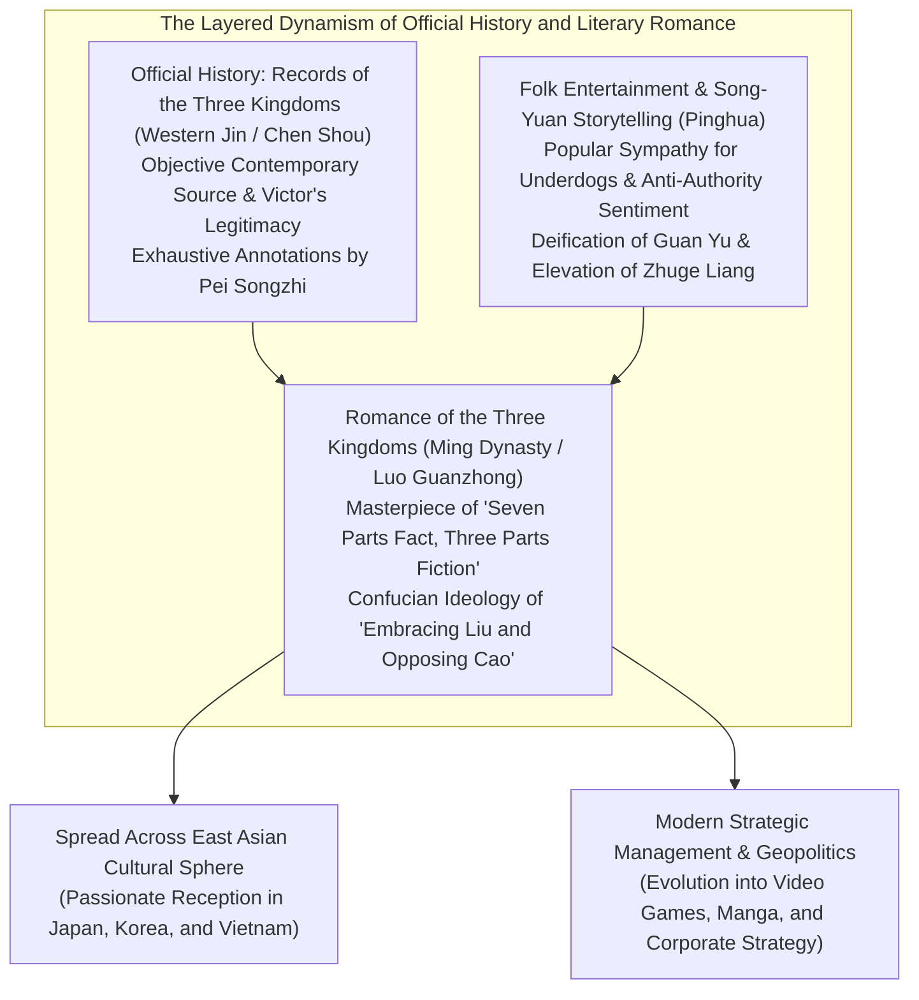
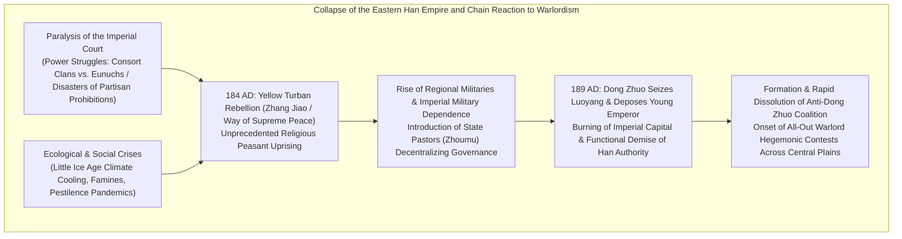
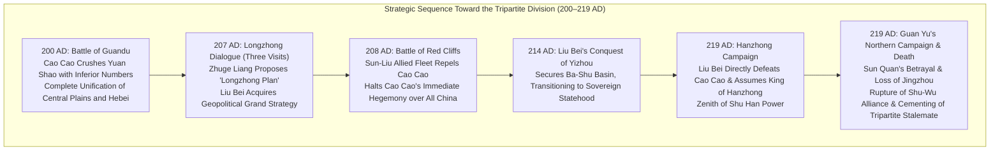
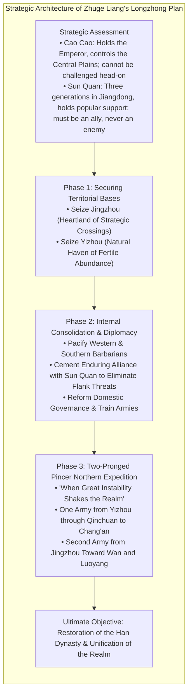
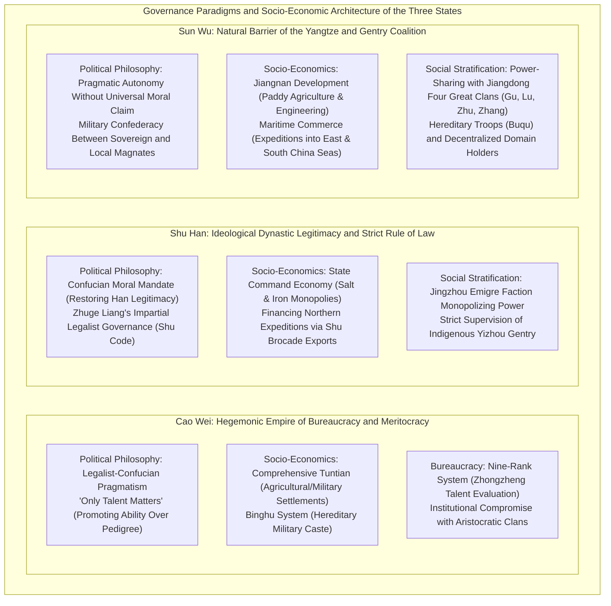

## Introduction: Why the "Three Kingdoms" Continues to Fascinate After 1,800 Years

Roughly a century elapsed between the outbreak of the Yellow Turban Rebellion in 184 AD and the final conquest of Sun Wu by the Western Jin in 280 AD, which reunified the realm. Across the vast plains of the Chinese subcontinent at the eastern terminus of Eurasia, the rise and fall of the **Three Kingdoms period (三國時代)** has, across 1,800 years of historical time, continued to captivate the intellectual imagination, passions, and cultural consciousness of people across East Asia and the wider world.

Why does the turbulence of this particular era, among all the myriad dynastic transitions in Chinese imperial history, continue to exert such an extraordinary cultural magnetism?

The fundamental reason lies in the fact that the world of the "Three Kingdoms" possesses an unparalleled "dual structure": the **official history *Records of the Three Kingdoms* (《三國志》, *Sanguozhi*)**, written by Chen Shou (陳壽) and critically annotated by Pei Songzhi (裴松之), rooted in rigorous historiographical criticism; and the pinnacle of pre-modern historical fiction, the ***Romance of the Three Kingdoms* (《三國演義》, *Sanguo Yanyi*)**, authored by Luo Guanzhong (羅貫中) during the Ming dynasty after absorbing a millennium of popular fervor, oral storytelling (讲唱 / 平话), and theatrical drama.



Historically, the Three Kingdoms period was a brutal epoch of devastation, marked by catastrophic population decline, climatic cooling, famines, and relentless warfare accompanying the collapse of the Eastern Han institutional order. The registered imperial census, which stood at approximately 56 million individuals at the zenith of the Eastern Han, plummeted to an estimated 8 million combined across Wei, Shu, and Wu by the twilight of the tripartite division (even accounting for unregistered households, hidden serfs, and wandering refugees, the physical devastation of society was extreme).

Yet, out of this institutional vacuum and hyper-competitive struggle for existence emerged a succession of profound **intellectual breakthroughs** and bold **experiments in statecraft** that shattered traditional conventions and hereditary hierarchies:
- Cao Cao (曹操)'s meritocratic talent selection decrees ("Promote Talent Alone" / *Wei cai shi ju*, 唯才是舉) and the revolutionary agricultural colony system (*Tuntian*, 屯田制), which resolved catastrophic logistical bottlenecks.
- Zhuge Liang (諸葛亮)'s master geopolitical grand design, the "Longzhong Plan" (隆中對), devised to enable a small peripheral state to overcome a continental hegemon, coupled with his incorruptible, strict Legalist rule of law.
- Sun Quan (孫權)'s development of the Jiangnan wetlands behind the natural moat of the Yangtze River, pioneering an outward-looking maritime and commercial state reaching into the East and South China Seas.

Above all, the intense psychological and moral dramas enacted by warlords, grand strategists, battlefield commanders, and common folk—Cao Cao's icy rationalism and existential isolation; Liu Bei's unyielding perseverance and earthy benevolence (*Renyi*, 仁義); Guan Yu's haughty chivalry and tragic hubris; and Zhuge Liang's supreme martyrdom in service of an impossible dynastic cause—transcended national frontiers and historical epochs to become a universal testament to human striving.

This monograph provides an exhaustive, multi-dimensional analysis of the Three Kingdoms epoch, looking beyond mere narrative retellings to deconstruct its **historiography, political philosophy, military geopolitics, socio-economic institutions, and literary reception history**. By critically evaluating the divide between official chronicle and literary romance, we illuminate the profound strategies and convictions of those who navigated this immortal age of chaos.

---

## Chapter 1: The Setting Sun of the Eastern Han and the Dawn of Competing Warlords (184–200 AD)

The opening chords of the Three Kingdoms era sounded with the cataclysmic collapse of the Han Dynasty (Western and Eastern Han), an empire that had unified the Chinese world for four centuries. Why did a seemingly impregnable centralized state rapidly lose its centripetal authority, ceding power to provincial magnates and autonomous warlords? Beneath this collapse lay a toxic entanglement of institutional fatigue, rot at the imperial court, and global climatic shifts.



### 1.1 The Tyranny of Eunuchs and Consort Clans, and the "Disasters of the Partisan Prohibitions": Structural Dysfunction of the Eastern Han

From the mid-period of the Eastern Han (25–220 AD) onward, imperial court politics fell into a pathological vicious cycle, driven by a succession of child emperors ascending the dragon throne.

Whenever an emperor was crowned in infancy or childhood, substantive imperial authority was seized by the Empress Dowager and her powerful maternal kinsmen, known as the **"Consort Clan" (*Waici*, 外戚)**. As the young sovereign reached maturity and sought to assert direct personal rule, he found himself isolated from the outer court bureaucracy. To reclaim sovereign authority, the emperor inevitably allied with the palace **eunuchs (*Huanguan*, 宦官)** who attended his intimate daily life, employing them to execute bloody palace coups that eliminated the consort clans. Once entrenched in power, however, the corrupt eunuch factions indulged in unbridled nepotism, venality, and the sale of public offices, appointing their relatives to provincial governorships where they fleeced the populace. In response, subsequent generations of consort clans would mobilize to suppress the eunuchs—a grotesque, cyclical bloodletting that paralyzed the central government for decades.

In protest against this moral decay, Confucian scholar-bureaucrats and thousands of students at the Imperial Academy (*Taixue*, 太學) launched fierce denunciations of eunuch depravity. These scholar-officials proudly styled themselves the "Pure Stream" (*Qingliu*, 清流派), while condemning the court eunuchs and their sycophants as the "Turbid Stream" (*Zhuoliu*, 濁流派).

Alarmed by this organized opposition, the entrenched eunuchs manipulated the emperor into declaring that the Pure Stream scholar-officials were conspiring to form subversive factions (*Pengdang*, 朋黨) to undermine the state. This triggered the horrific **"Disasters of the Partisan Prohibitions" (*Danggu zhi huo*, 黨錮之禍)** in 166 and 169 AD. Hundreds of eminent scholars, ministers, and intellectual luminaries were executed, tortured, or perished in imperial dungeons, while several thousand officials were permanently proscribed from public office.

This sweeping purge inflicted a mortal wound upon the Eastern Han dynasty. Regional landed magnates (*Haozu*, 豪族) and the educated elite became thoroughly alienated from the central court, abandoning their moral commitment to upholding imperial law. In the vacuum created by the collapse of the court's moral authority, the structural conditions for armed regional separatism expanded with explosive speed.

### 1.2 Climate Cooling, Famine, Epidemics, and the "Yellow Turban Rebellion"

Compounding the political decay were catastrophic ecological shocks.

Research in paleoclimatology and historical demography demonstrates that during the late second and third centuries AD, East Asia entered the opening phases of a prolonged **"Little Ice Age"** cooling cycle. Severe, freezing winters were accompanied by recurrent summer droughts and frost damage, devastating agricultural yields across the fertile Yellow River and Yangtze basins. Chronically malnourished populations fell prey to catastrophic pandemics (believed by epidemiologists to be virulent strains of typhus or smallpox). The famous Jian'an-era poet Cao Zhi (曹植) bore witness to this living hell in his *Shuoyi Fu* (說疫賦 / *Rhapsody on the Plague*): "Every household embraced the sorrow of stiff corpses; every room resounded with the wailing of mourning."

At this moment of existential despair, a Daoist healer named **Zhang Jiao (張角)** appeared from Julu Commandery in Hebei.

Zhang Jiao founded an apocalyptic religious movement known as the **"Way of Supreme Peace" (*Taipingdao*, 太平道)**, syncretizing early Daoist philosophy (Huang-Lao thought) with mystical folk healing. Preaching that illness was a consequence of sin, he administered sanctified water (*Fushui*, 符水) and led mass confession rituals. Hundreds of thousands of starving, disease-stricken peasants flocked to his banner across northern and central China. Zhang Jiao organized his followers into a vast clandestine military hierarchy, dividing the empire into 36 *Fang* (方, military districts) in preparation for a synchronized imperial insurrection.

The movement rallied behind a celebrated apocalyptic prophecy:
> **"蒼天已死、黃天當立、歲在甲子、天下大吉"**  
> *(The Azure Sky is already dead; the Yellow Sky shall soon arise. When the year is Jiazi, there shall be great fortune under Heaven.)*

The cosmic mandate of the Han dynasty, embodied by the "Azure Sky" (*Cangtian*), had exhausted its cosmic virtue. It was to be replaced by the "Yellow Sky" (*Huangtian*), representing the virtue of Earth. The year 184 AD—a *Jiazi* year, inaugurating a brand new 60-year sexagenary cycle—was ordained as the cosmic moment of divine revolution.

In the second lunar month of 184 AD, rebel disciples wearing yellow headscarves rose in coordinated revolt across the heartlands of Hebei, Henan, and Shandong. This was the **"Yellow Turban Rebellion" (黃巾之亂)**. Imperial administrative offices were torched, and imperial magistrates were murdered or put to flight.

Stunned into action, the Han court dispatched seasoned imperial generals including Huangfu Song (皇甫嵩), Zhu Jun (朱儁), and Lu Zhi (盧植), while rescinding the Partisan Prohibitions to recruit the alienated scholar-gentry. Concurrently, charismatic young figures who would define the next century—Cao Cao, Liu Bei, and Sun Jian—stepped onto the stage of history at the head of provincial militias and volunteer battalions.

Although Zhang Jiao succumbed to illness within the year and the principal rebel host was crushed by imperial counter-offensives, surviving remnants fractured into autonomous brigand confederacies, such as the "Black Mountain Bandits" (*Heishan Ze*) and "White Wave Bandits" (*Baibo Ze*), waging relentless guerrilla campaigns nationwide. Incapable of restoring civil order from Luoyang, the imperial court in 188 AD adopted an fateful reform: the institutionalization of **"State Pastors" (*Zhoumu*, 州牧)**. By vesting these provincial governors with supreme, unchecked civil, fiscal, and military authority over entire administrative provinces (*Zhou*), the Han court effectively decentralized its monopoly on violence. Provincial governors instantly transformed into fully autonomous regional **warlords**.

### 1.3 Dong Zhuo's Tyranny and the Burning of Luoyang: Complete Collapse of the Old Order

In 189 AD, the death of Emperor Ling brought the long-simmering standoff between Consort General-in-Chief He Jin (何進) and the powerful eunuch cabal (the "Ten Regular Attendants" / *Shi Changshi*) to a lethal crescendo. Seeking overwhelming military intimidation, He Jin summoned **Dong Zhuo (董卓)**—a ruthless frontier commander stationed in Liangzhou who led a formidable army of Han and non-Han cavalry—to march upon the imperial capital of Luoyang.

Before Dong Zhuo reached the capital gates, the eunuchs discovered the conspiracy and ambushed He Jin inside the palace, decapitating him. Outraged, young patrician officers Yuan Shao (袁紹) and Cao Cao stormed the imperial palaces, slaughtering over two thousand eunuchs in a bloody purge.

Exploiting the complete collapse of administrative authority, Dong Zhuo marched his battle-hardened legions into Luoyang. As a crude provincial military strongman, Dong Zhuo despised the court nobility. He deposed the young Emperor Shao, enthroned the eight-year-old Emperor Xian (劉協), and appointed himself Chancellor of State (*Xiangguo*, 相國), concentrating total political authority in his own hands.

Dong Zhuo's reign of terror provoked immediate armed defiance from the traditional elite. In 190 AD, regional lords east of Hangu Pass formed the **"Anti-Dong Zhuo Coalition"**, electing Yuan Shao as supreme confederate commander. Warlords including Cao Cao, Sun Jian, Yuan Shu, Qiao Mao, and Bao Xin joined this grand alliance.

Confronted by coalition forces, Dong Zhuo executed a monstrous scorched-earth strategy. He forcibly deported millions of Luoyang's citizens on a brutal winter death march westward to Chang'an (modern Xi'an), and systematically ransacked, looted, and burned Luoyang to the ground—incinerating imperial palaces, ministries, ancestral shrines, private homes, and imperial mausoleums. The premier metropolis of East Asian civilization was reduced overnight to a wasteland of smoldering ash.

Tragically, the Anti-Dong Zhuo Coalition, paralyzed by the sheer martial ferocity of Dong Zhuo's troops, refused to press forward. The allied warlords fell into petty territorial squabbles, mutual suspicion, and lavish banqueting. When Cao Cao and Sun Jian launched solitary offensive thrusts, they suffered tactical reversals. The coalition disbanded without deposing the tyrant. The ancient imperial order was extinguished; the brutal Darwinian era of **warring warlords** had officially commenced.

*(Dong Zhuo's reign of terror was terminated in 192 AD in Chang'an, where he was assassinated in a palace plot engineered by Minister over the Masses Wang Yun [王允] and Dong Zhuo's adoptive son and bodyguard, the peerless warrior Lu Bu [呂布]. Dong Zhuo's corpulent corpse was exposed in the marketplace, where guards lit a wick inside his navel, letting his bodily fat fuel a flame for days.)*

### 1.4 The Contest for the Central Plains: Rise and Fall of the Warlords

With the collapse of central authority, the Central Plains (the rich agricultural basin of the middle and lower Yellow River) became a slaughterhouse of competing warlords. The primary contenders and their strategic trajectories were:

- **Yuan Shao (袁紹)**: Scion of the prestigious "Four Generations, Three Excellencies" (四世三公) aristocratic house, boasting unparalleled pedigree. After a protracted war of attrition, he annihilated his northern rival Gongsun Zan, consolidating the "Four Provinces of Hebei" (Jizhou, Qingzhou, Youzhou, and Bingzhou) to assemble the most formidable military host in the realm.
- **Yuan Shu (袁術)**: Yuan Shao's half-brother (or cousin), entrenched in Huainan (the lower Huai River basin). Possessing the Imperial Jade Seal (*Chuanguo Yuxi*) brought back from the ruins of Luoyang by Sun Jian, he fell prey to megalomania and declared himself Emperor of the Zhong (仲家) dynasty. Denounced as a traitor by all factions, he faced universal hostility and starved to death in military isolation.
- **Sun Ce (孫策)**: Eldest son of Sun Jian ("The Tiger of Jiangdong"). Celebrated as the "Little Conqueror" (*Xiao Ba Wang*, 小霸王) for his dazzling martial prowess and personal charisma, he conquered the six commanderies of Jiangdong south of the lower Yangtze within five short years following his father's death. He laid the unshakeable territorial and political foundation of the Sun Wu regime before being assassinated in 200 AD at the age of twenty-six.
- **Lu Bu (呂布)**: Universally hailed as "Among men, Lu Bu; among horses, Red Hare" (人中呂布，馬中赤兔). A peerless tactical warrior of fickle allegiances, he betrayed his benefactor Ding Yuan and his foster father Dong Zhuo, eventually seizing Xuzhou from Liu Bei. Besieged by the joint forces of Cao Cao and Liu Bei at Xiapi in 198 AD, he was betrayed by his mutinous lieutenants and executed.
- **Liu Biao (劉表)**: A cultured Confucian aristocrat who governed the prosperous and strategically vital province of Jingzhou along the middle Yangtze. Offering sanctuary to scholars and tens of thousands of refugees fleeing the war-torn north, he patronized classical academies and preserved regional peace, but remained an unambitious, conservative provincial defender lacking the hunger for empire.
- **Liu Bei (劉備)**: Claiming descent from Emperor Jing of the Western Han, Liu Bei rose from extreme poverty, weaving straw mats and selling sandals to support his widowed mother. Bound by profound fraternal fidelity to Guan Yu and Zhang Fei, he was granted Xuzhou by Tao Qian, lost it to Lu Bu, and spent decades wandering as a client general under Cao Cao, Yuan Shao, and Liu Biao. Though devoid of a permanent territorial base, his magnetic personal integrity (*Renyi*) and resilience made his moral reputation renowned across the empire.

### 1.5 The Rise of Cao Cao and "Escorting the Heavenly Emperor": The Union of Legitimacy and Rationalism

Amidst this crowded field of warlords, **Cao Cao (曹操, styled Mengde)** emerged as a statesman of extraordinary strategic vision.

Originating from a court-connected family (his father Cao Song was the adopted son of the influential court eunuch Cao Teng), Cao Cao was viewed with aristocratic disdain by old patrician dynasties like the Yuans. Yet Cao Cao was a multifaceted genius: an astute military theorist, a ruthless Machiavellian political realist, and a celebrated poet who revolutionized classical Chinese verse.

Cao Cao's first decisive strategic breakthrough came in 196 AD with the policy of **"Escorting the Heavenly Emperor" (*Fengying Tianzi*, 奉迎天子)**.
Following the assassination of Dong Zhuo and years of starvation in the ruins of Luoyang at the hands of rebel officers Li Jue and Guo Si, the teenage Emperor Xian was a sovereign in name only. Acting on the far-sighted counsel of his chief strategist **Xun Yu (荀彧)**, Cao Cao marched to Luoyang, took the emperor under his protection, and relocated the imperial court to his fortified base of Xuchang (Henan).

This single stroke conferred upon Cao Cao absolute political legitimacy:
> **"Holding the Son of Heaven to command the feudatories" (*Xia Tianzi yi ling zhuhou*, 挟天子以令諸侯 / *Feng Tianzi yi ling buchen*, 奉天子以令不臣)**

For competing warlords, attacking Cao Cao now meant committing high treason against the Emperor of China. As General-in-Chief (*Da Jiangjun*) and subsequently Imperial Chancellor (*Chengxiang*), Cao Cao possessed the authority to issue imperial edicts stamped with the imperial seal, transforming his military campaigns into lawful punitive expeditions by the imperial army against unlawful rebels.

Simultaneously, Cao Cao initiated an economic innovation to revive the agrarian foundation of the war-ravaged north: the **Tuntian System (*Tuntianzhi*, 屯田制)**, implemented in 196 AD at the urging of Zao Zhi (棗祇) and Han Hao (韓浩). The state confiscated vast tracts of depopulated, abandoned farmland and settled fleeing war refugees, organizing them into quasi-military agricultural cooperatives (*Min tun*, civil tuntian). The state supplied farm tools, draft oxen, and seeds. In return, the peasants paid 50% to 60% of their harvest as crop-tax directly to the state, while receiving total exemption from military conscription.

The Tuntian system solved the single greatest bottleneck that crippled all contemporary armies: chronic grain starvation. Accumulating millions of bushels of grain in secure regional silos, Cao Cao established an invincible material and logistical base. Armed with undisputed political legitimacy (*Holding the Emperor*) and an abundant food supply (*Tuntian*), Cao Cao was prepared to face the northern leviathan: Yuan Shao.

---

## Chapter 2: The Clash of Hegemons and the Road to the Tripartite Division (200–219 AD)

The two decades between 200 and 219 AD constituted the dramatic golden age of the Three Kingdoms epoch, during which the chaotic free-for-all of regional warlords coalesced into the permanent tripartite standoff of Wei, Shu, and Wu.

This transformative era was propelled by three monumental military campaigns: the **Battle of Guandu (200 AD)**, the **Battle of Red Cliffs (208 AD)**, and the **Hanzhong and Fancheng Campaigns (219 AD)**.



### 2.1 The Battle of Guandu (200 AD): Intelligence Warfare Where the Few Swallowed the Giant

In 200 AD, the titanic struggle for mastery over northern China erupted in the celebrated **Battle of Guandu (官渡之戰)**.

The contest pitted **Yuan Shao (袁紹)**, commanding 100,000 veteran infantry and 10,000 elite northern cavalry from the four provinces of Hebei, against **Cao Cao (曹操)**, who could marshal barely 20,000 to 30,000 troops. Outnumbered roughly three or four to one, Cao Cao's defeat appeared inevitable to most contemporary observers.

Yuan Shao crossed the Yellow River and advanced southward, while Cao Cao established fortified defensive lines at Guandu (northeast of modern Zhongmu County, Henan). Yuan Shao built high earthen ramparts and archery towers to shower Cao Cao's camp with arrows. Cao Cao countered by constructing counterweight catapults (known as "Thunder Carts" or stone-throwers, *Fashiche*, 發石車) that smashed Yuan Shao's towers, and dug deep perimeter trenches to intercept Yuan Shao's subterranean sappers.

Yet as the stalemate dragged on for months, Cao Cao's force began to crack under the strain of logistical exhaustion. Granaries emptied, soldiers collapsed from malnutrition, and Cao Cao himself wavered, writing a secret letter to Xun Yu in Xuchang proposing a tactical withdrawal. Xun Yu replied with a legendary strategic exhortation: "Your position at Guandu mirrors that of Liu Bang and Xiang Yu at Xingyang. You hold the throat of the realm; whoever yields first will lose everything. Await the enemy's internal fracture!"

The decisive turning point arrived through a catastrophic intelligence leak within Yuan Shao's command.

**Xu You (許攸)**, one of Yuan Shao's senior strategists, had advised Yuan Shao to divide his forces and launch a surprise cavalry raid against Cao Cao's undefended capital at Xuchang. When Yuan Shao rejected the plan and Xu You's relatives were arrested in the rear for financial corruption, a disillusioned Xu You defected to Cao Cao's camp under cover of darkness.

Upon hearing of Xu You's arrival, Cao Cao was so overjoyed that he dashed out of his tent barefoot, without waiting to put on his shoes, to embrace his childhood acquaintance. Xu You delivered the decisive intelligence that changed the course of Chinese history:
> "Yuan Shao's entire grain reserve—tens of thousands of wagons—is stored at the rear depot of **Wuchao (烏巢)**. The garrison commander, Chunyu Qiong (淳于瓊), is complacent and negligent in security. If you lead an elite cavalry detachment to launch a night attack and torch the depot, Yuan Shao's host of a hundred thousand will disintegrate without a battle."

Cao Cao acted with lightning decisiveness. Handpicking 5,000 elite light horsemen, Cao Cao had them disguise themselves under Yuan Shao's banners, blackened their faces, inserted wooden gags in the horses' mouths to eliminate noise, and slipped through enemy lines. Reaching Wuchao before dawn, Cao Cao launched a ferocious surprise assault, annihilating Chunyu Qiong's garrison and burning Yuan Shao's entire grain reserve to ash.

Seeing the night sky ablaze with the inferno at Wuchao, Yuan Shao's army succumbed to uncontrollable panic. When Yuan Shao's veteran field marshals **Zhang He (張郃)** and Gao Lan defected to Cao Cao, the northern front collapsed completely. Yuan Shao fled north across the Yellow River with only 800 surviving horsemen, abandoning his army, baggage, and imperial ambitions.

Guandu was far more than an operational victory; it was a profound institutional triumph. Cao Cao's modern meritocracy, agile centralized decision-making, and laser-like focus on intelligence and logistics triumphed decisively over Yuan Shao's sluggish aristocratic conservatism and factional infighting. Following Yuan Shao's death from illness, Cao Cao systematically eliminated the surviving Yuan brothers, subdued the northern Wuhuan nomads at Mount Bailang in 207 AD, and achieved the **complete unification of Northern China**.

### 2.2 Liu Bei's Wanderings and the "Three Visits to the Cottage": The Geopolitical Impact of the Longzhong Plan

While Cao Cao consolidated the north into an unassailable empire, **Liu Bei (劉備)** remained an itinerant warlord. Taking refuge under Liu Biao in Jingzhou, he was relegated to the small border outpost of Xinye (Nanyang, Henan). Now in his late forties, Liu Bei shed tears in private, giving voice to the famous "Lament of the Thigh Flesh" (*Binrou zhi tan*, 髀肉之歎)—mourning that without horses to ride into battle, his inner thighs had grown soft with fat, while his life was slipping away with nothing accomplished.

In 207 AD, however, Liu Bei experienced a fateful encounter that altered the trajectory of Chinese history: his meeting with the 27-year-old hermit scholar **Zhuge Liang (諸葛亮, styled Kongming)**, who resided in seclusion in a thatched cottage in Longzhong, outside Xiangyang.

Recognizing greatness, Liu Bei personally traveled three times to the rustic hermitage to solicit counsel—an event celebrated throughout world culture as the **"Three Visits to the Thatched Cottage" (*San Gu Maolu*, 三顧茅廬)**. Within the confines of that modest hut, Zhuge Liang unfurled his master geopolitical blueprint for restoring the Han dynasty: the immortal **"Longzhong Plan" (隆中對, *Longzhong Dui*)**.



Zhuge Liang's strategic analysis was grounded in cold geopolitical realism:
1. **Clear Division Between Friend and Foe**: Cao Cao controlled the Son of Heaven and dominated the northern plains; he was too formidable to be challenged head-on. Sun Quan was deeply rooted across Jiangdong over three generations, commanding popular affection; he must be cultivated as an indispensable strategic ally, never an enemy.
2. **Identification of Territorial Objectives**: Jingzhou sat at the strategic crossroads of the empire—connecting north to the Han and Mian rivers, south to the Southern Seas, east to Wu, and west to Ba-Shu—a true "land for martial endeavor" (*Yongwu zhi guo*). Yet Liu Biao lacked the resolve to hold it. Yizhou (the Sichuan basin) was a fertile, self-sufficient continental fortress surrounded by impassable mountain ramparts—a "natural haven of heaven" (*Tianfu zhi guo*)—yet governed by the weak-willed Liu Zhang. Liu Bei must seize both provinces as his sovereign foundation.
3. **The Two-Pronged Pincer Northern Expedition**: After establishing administrative stability, pacifying southwestern ethnic minorities, and solidifying an ironclad alliance with Sun Quan, Liu Bei would wait until "great political disruption shook the realm" (e.g., succession turmoil or domestic rebellion within Cao Cao's realm). At that moment, Liu Bei would personally lead the main army out of Yizhou through Qinchuan toward Chang'an, while a senior general would lead the Jingzhou legions northward toward Wan and Luoyang. Caught in this strategic pincer, the populace would welcome the Han restorers with baskets of rice and jugs of wine.

Listening to this breathtaking vision, Liu Bei felt the blinding fog of confusion dissipate from his mind. He famously proclaimed: "Finding Kongming is to me what water is to a fish!" (*Ru yu de shui*, 如魚得水). Liu Bei ceased to be a wandering mercenary captain; with Zhuge Liang as his grand strategist, he was reborn as a transformational statesman possessed of an imperial vision.

### 2.3 The Battle of Red Cliffs (208 AD): The Yangtze Aquatic Fortress and Watershed of the Realm

In the summer of 208 AD, barely months after the Longzhong Plan was formulated, Cao Cao led a massive imperial host of hundreds of thousands southward to conquer Jingzhou and extinguish all southern resistance.

Disaster struck immediately: Liu Biao died of illness, and his younger son and successor, Liu Cong (劉琮), surrendered the entire province without firing an arrow. Caught unprepared, Liu Bei retreated southward accompanied by over one hundred thousand civilian refugees. At Dangyang-Changban (長坂坡), Cao Cao's elite cavalry, the legendary "Tiger and Leopard Cavalry" (*Hubaogi*), caught up with the column, routing Liu Bei's force and forcing him to abandon his family in a desperate flight (a chaotic retreat immortalized by Zhao Yun's heroic rescue of Liu Bei's infant son Liu Shan, and Zhang Fei standing solitary guard atop the Changban Bridge).

Reaching Xiakou (modern Wuhan), Liu Bei sought an alliance with the young ruler of Jiangdong, **Sun Quan (孫權)**. Zhuge Liang traveled personally to Sun Quan's headquarters at Chaisang, where he formed a close partnership with Sun Quan's supreme military commander, **Zhou Yu (周瑜)**, and diplomat **Lu Su (魯肅)**, successfully steering the Wu court toward war.

While the majority of Sun Quan's conservative civilian ministers urged unconditional capitulation to Cao Cao, Zhou Yu cut through the defeatism with a masterly strategic assessment, pinpointing three fatal vulnerabilities in Cao Cao's host:
1. Cao Cao's army was composed primarily of northern cavalry and infantry who were entirely unaccustomed to naval warfare.
2. Having marched thousands of miles across harsh terrain, the troops were physically exhausted, making the outbreak of epidemics inevitable.
3. Operating deep in southern river networks, horse forage and grain supply lines would prove unsustainable over a prolonged winter campaign.

Convinced by Zhou Yu's analysis, Sun Quan drew his sword, severed the corner of his conference desk, and roared: "Whosoever dares speak of surrender again shall share the fate of this desk!" He assigned Zhou Yu command of 30,000 elite naval forces to join Liu Bei's army and sail up the Yangtze to confront the northern armada.

In the winter of 208 AD, at the strategic river narrows of **Red Cliffs (赤壁之戰, Battle of Red Cliffs)**, the fate of imperial China was decided.

To alleviate chronic seasickness among his northern infantry, Cao Cao had chained his colossal warships together side-by-side with iron cables, laying wooden planks across their decks to form a floating pontoon citadel. Observing this rigid disposition, Zhou Yu's veteran vice commander, **Huang Gai (黃蓋)**, proposed a devastating incendiary stratagem.

Huang Gai dispatched a fraudulent letter of defection to Cao Cao. At the appointed hour, he approached the northern armada at the head of several dozen swift assault craft packed with dry reeds, firewood, and fish oil, covered under oiled canvas.

Propelled by an unseasonal, furious southeasterly gale, Huang Gai's flotilla accelerated. When within several hundred yards of Cao Cao's fleet, the vessels were set ablaze simultaneously, transforming into raging firebrands that crashed into Cao Cao's chained armada. The fire spread uncontrollably from ship to ship across the iron chains, turning the Yangtze into an apocalyptic inferno. Blown by high winds, the flames leaped onto Cao Cao's shore encampments, incinerating tents and supply dumps.

Cao Cao's forces disintegrated in utter pandemonium. Cao Cao was forced to execute a catastrophic retreat northward through the muddy, disease-infested marshes of the Huarong Trail (華容道), leaving behind tens of thousands of frozen, starved, and drowned soldiers.

The Battle of Red Cliffs was the largest naval engagement in ancient Chinese military history. It shattered Cao Cao's dream of immediate national unification and secured the Yangtze River basin for the southern powers. The geopolitical premise of Zhuge Liang's Longzhong Plan—a tripartite division of the realm—had become reality.

### 2.4 The Struggle for Yizhou and the Hanzhong Campaign (211–219 AD): Consolidation of Shu Han's Territory

In the wake of Red Cliffs, Liu Bei swiftly pacified the four commanderies of southern Jingzhou (Wuling, Changsha, Lingling, Guiyang), securing his long-coveted territorial foothold. Yet to fulfill the Longzhong Plan, the acquisition of the vast western basin of **Yizhou (Sichuan)** was non-negotiable.

In 211 AD, Liu Zhang (劉璋), Governor of Yizhou, faced mounting pressure from the religious theocracy of Zhang Lu (leader of the Way of the Five Pecks of Rice) in Hanzhong. Panicking, Liu Zhang invited his kinsman Liu Bei into Sichuan to provide military defense. Top strategists Pang Tong (龐統), Fa Zheng (法正), and Zhuge Liang urged Liu Bei to seize this heaven-sent opportunity.

After agonizing over moral considerations, Liu Bei resolved upon the invasion of Sichuan. Despite the tragic loss of brilliant advisor Pang Tong at the Battle of Luofengpo, Liu Bei besieged Chengdu in 214 AD. Liu Zhang surrendered, and Liu Bei annexed the entirety of Yizhou. Liu Bei's officer corps now glittered with peerless martial talent: Guan Yu, Zhang Fei, Zhao Yun, the fearsome northwestern general Ma Chao (馬超), and veteran archer-commander Huang Zhong (黃忠).

In 217 AD, Liu Bei launched a monumental strategic offensive to capture **Hanzhong (漢中)**, the northern gateway to Sichuan. Nestled between the towering Qinling and Daba mountain ranges, Hanzhong was the strategic shield of Chengdu; so long as Wei held Hanzhong, Sichuan lived with a dagger at its throat.

During the Hanzhong Campaign, guided by the tactical genius of Fa Zheng, Huang Zhong executed an uphill assault at the **Battle of Mount Dingjun (定軍山之戰)** in 219 AD, ambushing and slaying **Xiahou Yuan (夏侯淵)**, Wei's supreme western theater commander.

Enraged, Cao Cao personally led a relief army into Hanzhong. Liu Bei, however, refused open-field engagement, waging an asymmetric, fortified mountain campaign that severed Cao Cao's supply routes. Frustrated and logistically depleted, Cao Cao famously gave the password "Chicken Ribs" (*Jilei*, 雞肋—tasteless to eat, yet wasteful to discard) and ordered a complete retreat.

In the autumn of 219 AD, having conquered Hanzhong, Liu Bei was acclaimed by his civil and military officials as the **"King of Hanzhong" (漢中王)**. Rising from an itinerant sandal-weaver to a crowned king standing toe-to-toe with Cao Cao, Liu Bei had reached the zenith of his fortunes. The restoration of the Han dynasty seemed within arm's reach.

### 2.5 Guan Yu's Northern Expedition and Death at Maicheng: Loss of Jingzhou and Strategic Rupture

Yet at the very summit of triumph, an apocalyptic disaster struck that doomed Shu Han's grand strategy. The catastrophe was ignited by the unilateral northern offensive of **Guan Yu (關羽)**, commander of Shu's forces in Jingzhou.

In the autumn of 219 AD, coordinating with Liu Bei's victory in Hanzhong, Guan Yu led his Jingzhou army north to besiege Cao Cao's critical southern fortress of Fancheng (modern Xiangyang, Hubei). Taking advantage of torrential autumn deluges that caused the Han River to overflow its banks, Guan Yu deployed his river navy to submerge the seven relief armies led by veteran Wei general Yu Jin (于禁). Guan Yu captured Yu Jin, beheaded the unyielding general Pang De (龐德), and tightened the siege around Cao Ren inside Fancheng.

Guan Yu's triumph was so absolute that it was hailed as **"Awe Shaking the Central Plains" (*Wei zhen Huaxia*, 威震華夏)**. Terrified, Cao Cao convened an emergency council and seriously debated moving the imperial capital from Xuchang north of the Yellow River to avoid Guan Yu's vanguard.

However, Guan Yu's dazzling success exposed a fatal strategic rift with their nominal ally, **Sun Quan**.

To Liu Bei, Jingzhou was the eastern launchpad for the Longzhong pincer offensive; to Sun Quan, having a foreign, aggressive power commanding the upper reaches of the Yangtze posed an existential threat to Jiangdong. Following the death of the pro-alliance diplomat Lu Su, Wu's new commander **Lu Meng (呂蒙)** secretly advised Sun Quan: "If Guan Yu smashes Cao Cao, his next victim will be Wu. We must strike his rear and take Jingzhou now!"

Guan Yu's haughty personality compounded the crisis. When Sun Quan proposed a marriage alliance between his son and Guan Yu's daughter, Guan Yu insulted the envoy, barking: "How can the daughter of a tiger marry the pup of a dog!" Furthermore, Guan Yu had publicly threatened his own logistics officers, Nan Commandery Administrator Mi Fang (Liu Bei's brother-in-law) and Shi Ren, alienating his rear guard.

Acting on the advice of Sima Yi (司馬懿) and Jiang Ji, Cao Cao dispatched secret envoys to Sun Quan, offering full recognition of Wu's sovereignty over the south in exchange for a surprise attack on Guan Yu's rear.

Lu Meng executed a brilliant deception. Feigning serious illness, he withdrew from the front line, replaced by the young, scholarly **Lu Xun (陸遜)**, whose subservient letters flattered Guan Yu into believing Wu posed no danger. Convinced, Guan Yu stripped his rear garrisons in Jingzhou to reinforce the siege at Fancheng.

The moment Guan Yu's back was turned, Lu Meng unleashed the legendary operation **"Crossing the River in White Robes" (*Baiyi Dujiang*, 白衣渡江)**. Elite Wu troops disguised as merchants in civilian white robes sailed up the Yangtze, neutralized Guan Yu's beacon towers, and seized Jiangling without shedding a drop of blood. Terrified of Guan Yu's retribution, Mi Fang and Shi Ren opened their gates and surrendered.

Cut off from his base and supplies, Guan Yu's army collapsed in panic as news arrived that their families in Jiangling were being treated benevolently by Wu. Accompanied by only a few hundred loyal retainers, Guan Yu withdrew to the small outpost of Maicheng (麥城). Attempting to break through Wu's encirclement to reach Sichuan, Guan Yu and his son Guan Ping were ambushed, captured, and summarily executed. Guan Yu's severed head was sent to Cao Cao.

The death of Guan Yu and the **catastrophic loss of Jingzhou** inflicted a fatal blow upon Shu Han.
The core assumption of Zhuge Liang's Longzhong Plan—a coordinated two-pronged offensive from Yizhou and Jingzhou—was annihilated forever. Shu Han was permanently confined to the rugged, landlocked Sichuan basin, a mountain redoubt with **fewer than one million inhabitants**. Meanwhile, Liu Bei's grief and fury over the murder of his sworn brother set the stage for an all-consuming war of revenge that would shake the three realms.

---

## Chapter 3: Comparative Anatomy of the Three States — Institutions, Economy, and Military

The Three Kingdoms period was far more than a romantic duel among three charismatic warlords. It was an era of intense **socio-political experimentation**, in which three sovereign entities—operating under radically different topographies, demographic realities, and political philosophies—competed to construct viable statehood under conditions of total warfare.

**Cao Wei (魏)** across the northern plains, the isolated micro-state of **Shu Han (蜀漢)** in the Sichuan basin, and the riverine maritime regime of **Sun Wu (吳)** in the southern wetlands developed contrasting institutional, economic, and military systems that prefigured the medieval transformation of Chinese civilization.



### 3.1 Cao Wei: Hegemonic Empire of Meritocracy and Institutional Innovation

In 220 AD, following Cao Cao's death, his heir **Cao Pi (曹丕, Emperor Wen)** coerced Emperor Xian into abdicating the throne through the ritual of *Shanrang* (abdication backed by military supremacy), founding the dynasty of **Wei (魏)**. This marked the official demise of the 400-year Han Dynasty.

Wei's decisive advantage lay in its **overwhelming structural supremacy** in population, territory, and arable land, coupled with bold **institutional realism**.

1. **"Promote Talent Alone" (*Wei cai shi ju*, 唯才是舉) and Meritocracy**:
   In the Eastern Han, official recruitment operated via the *Xiangju Lixuan* (郷挙里選) recommendation system, which evaluated candidates based on moral reputation (such as "Filial and Incorrupt", *Xiaolian*). By the late Han, this system had degenerated into a corrupt cartel where patrician families monopolized appointments.
   Cao Cao shattered this nepotistic framework by issuing three successive "Orders Seeking Talent" (*Qiu Cai Ling*, 求才令) in 210, 214, and 217 AD. He proclaimed: "Even if a man is deficient in filial piety or benevolence, if he possesses talent and strategic genius, he shall be recruited." This ruthlessly pragmatic meritocracy allowed Cao Cao to employ eccentric tactical geniuses like Guo Jia (郭嘉), Jia Xu (賈詡), and Cheng Yu (程昱), while promoting defected enemy generals like Zhang Liao (張遼), Xu Huang (徐晃), and Zhang He (張郃) to supreme command positions.

2. **From Tuntian to the "Military Household" (*Binghu*, 兵戶制) System**:
   Cao Cao's agricultural colony system evolved from civilian refugee settlements (*Min tun*) into frontline military settlements (*Jun tun*). Along the Huainan frontier confronting Wu, tens of thousands of soldier-farmers established self-sufficient supply centers that produced millions of bushels of grain on-site. Furthermore, Wei legally segregated military lineages from civilian commoners, establishing the hereditary **Military Household System (*Binghuzhi*, 兵戶制)**. Sons of soldiers were legally obligated to serve as soldiers in perpetuity, securing a permanent, professional standing army.

3. **The "Nine-Rank System" (*Jiupin Guanrenfa*, 九品官人法)**:
   In 220 AD, as Cao Pi prepared to ascend the imperial throne, he adopted the personnel system designed by aristocratic statesman **Chen Qun (陳羣)**, known as the Nine-Rank System (or *Jiupin Zhongzhengzhi*).
   The central court appointed "Rectifiers" (*Zhongzheng*, 中正官) across all commanderates and provinces to evaluate local candidates into nine hierarchical grades (from Grade 1 to Grade 9) based on ability and conduct, matching them to corresponding imperial bureaucratic posts.
   While originally intended to combine central meritocracy with local evaluation, the system represented a structural compromise between the imperial court and powerful regional patrician lineages. Over time, high aristocratic families monopolized the Zhongzheng offices, giving rise to the famous indictment: **"No low-born in the upper ranks; no noble-born in the lower ranks" (上品無寒門，下品無勢族)**. The Nine-Rank System established the institutional foundation for the medieval Chinese aristocracy that would dominate the Western Jin and Southern and Northern Dynasties for centuries.

### 3.2 Shu Han: An Ideological Micro-State Governed by Legalist Principles

In 221 AD, following Cao Pi's usurpation of the Han throne, Liu Bei declared himself Emperor in Chengdu, maintaining that his state was the direct continuation of the Han dynasty. Officially named **"Han" (漢, known to history as Shu or Shu Han)**, the regime based its legitimacy entirely upon its Confucian moral mandate to restore the fallen empire.

Yet Shu Han's structural reality was that of an **extreme demographic and territorial micro-state**. While Wei governed over 4.4 million registered subjects across 60–70% of the empire's territory, Shu Han was confined to the rugged Sichuan basin and southern highlands, possessing a registered census of only **approximately 900,000 to 1,000,000 citizens** and a standing army of roughly 100,000 men (less than one-fourth of Wei's strength).

To ensure that this peripheral micro-state was not pulverized by Wei's continental weight, Zhuge Liang—serving as Chancellor and supreme executive—instituted an uncompromising regime of **strict Legalist governance (*Fajia*)**.

1. **Rigorous and Impartial Rule of Law (The *Shu Code*, 蜀科)**:
   In his biography of Zhuge Liang in the *Records of the Three Kingdoms*, Chen Shou offered unstinting praise for his legalist administration:
   > **"He clarified laws and statutes, rectified ordinances, held power with equity, and penetrated false pretenses. He opened his heart in fairness and made rewards and punishments crystal clear. No good deed went unrewarded; no wickedness went unpunished."**
   Collaborating with Fa Zheng and legal specialists, Zhuge Liang codified the foundational statutes of the state: the **Shu Code (*Shuke*, 蜀科)**. Regardless of aristocratic status or battlefield merit, those who violated the law faced unsparing punishment; conversely, even men of humble birth were promoted if they demonstrated competence. By establishing an incorruptible, transparent bureaucracy, Zhuge Liang won the profound trust of the Sichuan populace, who accepted strict laws because they were applied with absolute impartiality.

2. **State-Directed Command Economy: Shu Brocade and Salt-Iron Monopolies**:
   To finance the immense costs of perpetual northern military campaigns from a tiny economic base, Zhuge Liang enacted aggressive state mercantilism:
   - **Promotion of Shu Brocade (*Shujin*, 蜀錦)**: Sichuan produced world-renowned, luxury multi-colored silk brocade. Zhuge Liang centralized brocade production under state-run workshops in Chengdu (known as the "Brocade City", *Jinguan Cheng*). The exquisite quality of Shu brocade made it an irreplaceable luxury commodity across Wei and Wu. Exported through commercial networks and merchant smuggling, Shu brocade generated massive inflows of bullion, gold, and strategic supplies. Zhuge Liang himself admitted: "Our military equipment and treasuries today depend entirely upon the profits of brocade."
   - **State Salt and Iron Monopolies**: Reviving the state-monopoly policies of Emperor Wu of the Western Han, Zhuge Liang placed Sichuan's abundant brine salt wells and iron smelting works under strict government monopolies. This dismantled the independent economic power of local Sichuan magnates, concentrating revenue directly in the imperial treasury.

3. **Internal Factional Friction: The Jingzhou Émigrés vs. Indigenous Yizhou Gentry**:
   Beneath Shu Han's disciplined facade simmered a profound social fault-line: the governance of the state was monopolized by the **minority Jingzhou émigré faction** (Zhuge Liang, Jiang Wan, Fei Yi, and Liu Bei's original inner circle), while the **indigenous Sichuan gentry** (exemplified by intellectuals like Qiao Zhou) were largely excluded from top civil and military leadership. This deep structural alienation resurfaced when northern armies invaded in 263 AD, prompting the local Sichuan elites to advocate instant, bloodless capitulation.

### 3.3 Sun Wu: The Natural Barrier of the Yangtze and the Gentry Coalition Government

Following the victory at Red Cliffs and the reconquest of Jingzhou, Sun Quan styled himself King of Wu in 222 AD, and ascended the imperial throne at Wuchang (later relocating to Jianye, modern Nanjing) in 229 AD, establishing the dynasty of **Wu (孫吳 / 東吳)**.

The essence of the Sun Wu state was neither Wei's bureaucratic autocracy nor Shu Han's ideological centralization. Rather, it was a **decentralized aristocratic coalition**, formed through power-sharing compromises between the reigning Sun clan and the powerful, landed gentry families of Jiangnan.

1. **The Coalition with the Four Great Clans of Jiangdong (*Jiangdong Sixing*, 江東四姓)**:
   Across the Jiangnan basin, four entrenched aristocratic lineages possessed vast landed estates, private armies, and deep lineage networks: the **Gu (顧), Lu (陸), Zhu (朱), and Zhang (張)** clans.
   The early Sun rulers (Sun Jian and Sun Ce) had attempted to subjugate these local gentry by military terror, provoking fierce rebellions. Sun Quan, gifted with consummate diplomatic pragmatism, reversed course. He integrated their scions into the imperial cabinet, formed intermarriages with their daughters, and elevated their representatives to supreme military and civil posts—most notably appointing **Lu Xun (陸遜)** as Grand Commander (*Da Dudu*) and Chancellor (*Chengxiang*).

2. **Hereditary Command (*Shixi Lingbing*, 世襲領兵制) and Private Retainers (*Buqu*, 部曲)**:
   Wu's military architecture was uniquely feudal and decentralized. Generals did not merely command imperial conscripts; they brought to the battlefield their own private military households and hereditary retainers, known as **Buqu (部曲)**. When a general died or fell in battle, his command, fief, and private army were legally inherited by his son or younger brother (*Shixi Lingbing*).
   This hereditary structure produced ferocious combat cohesion when defending their native soil ("protecting our ancestral homes"), making Wu virtually unassailable along the Yangtze. However, it created a fatal operational limitation: during foreign offensive campaigns into the north, aristocratic commanders were reluctant to risk the lives of their private retainers, rendering Wu's armies notoriously passive and frail in offensive warfare.

3. **Agrarian Reclamation of Jiangnan and the Birth of a Maritime Empire**:
   Sun Wu's most enduring historical contribution was the rapid development of Jiangnan from a malarial wetland into an agricultural powerhouse, alongside pioneering maritime exploration.
   - **Wetland Drainage and Assimilation of the Shanyue (山越)**: Wu engineered extensive irrigation canals and drained low-lying wetlands, turning Jiangnan into a rich rice basket. Simultaneously, Wu generals Lu Xun and Zhuge Ke launched military campaigns against the fierce indigenous mountain tribes, the **Shanyue (山越)**. Wu forced hundreds of thousands of pacified Shanyue to relocate to the river plains, incorporating them as agricultural tenants and elite assault infantry.
   - **Maritime Exploration and South China Sea Commerce**: Leveraging superior shipbuilding technology and naval mastery, Sun Quan in 230 AD dispatched generals Wei Wen (衛溫) and Zhuge Zhi (諸葛直) at the head of a 10,000-man naval fleet to explore **"Yizhou" (夷洲, modern Taiwan)** and Danzhou—the earliest recorded official state mission to Taiwan in standard Chinese dynastic histories. Furthermore, Wu developed flourishing maritime trade routes connecting Jiaozhi (northern Vietnam) across the South China Sea, the Malay Peninsula, and the Indian Ocean, amassing extraordinary wealth through maritime commerce.

```
【Comprehensive Comparative Table: Cao Wei vs. Shu Han vs. Sun Wu (Circa 260 AD)】
```

| Comparative Dimension | Cao Wei (曹魏) | Shu Han (蜀漢) | Sun Wu (孫吳) |
| :--- | :--- | :--- | :--- |
| **Imperial Capital** | Luoyang (洛陽) | Chengdu (成都) | Jianye (建業, modern Nanjing) |
| **Territorial Scope** | Central Plains, Hebei, Shandong, Shanxi, Shaanxi, Huainan, Liaodong (~60% of empire) | Yizhou (Sichuan Basin, Hanzhong, tribal southern highlands of Yunnan/Guizhou) | Yangzhou, southern Jingzhou, Jiaozhou (Lower/Middle Yangtze, Guangdong, northern Vietnam) |
| **Estimated Census / Population** | **~660,000 households / ~4,400,000 people** (~60% of total) | **~280,000 households / ~940,000 people** (~13% of total) | **~520,000 households / ~2,300,000 people** (~27% of total) |
| **Standing Armed Forces** | **~400,000–500,000 troops** (Elite Central Plains infantry/cavalry, Wuhuan/Xianbei horsemen) | **~100,000 troops** (Mountain infantry, repeating-crossbow corps, elite White-Eared guard) | **~230,000 troops** (Invincible riverine navy, Shanyue infantry, aristocratic Buqu private armies) |
| **Ideology & Governance Model** | Legalist-Confucian syncretism, meritocratic autocracy, centralized bureaucracy | Han dynastic legitimacy, uncompromising Legalist rule of law (*Shuke*) | Gentry-monarch coalition, decentralized consensus, regional aristocratic federalism |
| **Primary Personnel System** | **Nine-Rank System (九品官人法)** (Zhongzheng evaluation), Orders Seeking Talent | Direct imperial meritocratic appointments by Zhuge Liang, statutory reward/punishment | Aristocratic gentry recommendation, hereditary military succession, elite clans |
| **Core Economic Foundation** | Dryland wheat/millet farming, **Tuntian (Civil & Military Colonies)**, state salt/iron | Paddy rice agriculture, **Shu Brocade state monopoly exports**, well-salt extraction | Wetland paddy agriculture, hydraulic engineering, **Maritime South China Sea commerce** |
| **Geopolitical Strengths** | Crushing demographic dominance, vast strategic depth, mobile strike cavalry | Impassable mountain ramparts creating an "impregnable continental haven" | The colossal natural water barrier of the Yangtze River, unrivaled naval mastery |
| **Structural Vulnerabilities** | Rise of entrenched aristocratic clans eroding imperial power (leading to Sima usurpation) | Tiny population base, crushing economic strain of northern wars, Jingzhou-Yizhou factionalism | Military decentralization via private retainers (*Buqu*), chronic aversion to offensive campaigns |

---

## Chapter 4: Zhuge Liang's Legacy and the Twilight of the Three Kingdoms (220–280 AD)

The final six decades of the Three Kingdoms era saw the departure of the founding titans. As the fire of youthful heroism faded, the cold arithmetic of demographic realities, institutional exhaustion, and political usurpation decided the destiny of the three realms.

This tragic twilight was illuminated by **Zhuge Liang's (諸葛亮)** relentless, desperate Northern Expeditions to fulfill his sacred pledge, set against the internal military coups and dynastic usurpation orchestrated by the **Sima clan (司馬氏)** within Cao Wei.

### 4.1 Liu Bei's Revenge and the Battle of Yiling (222 AD): The Entrustment at Baidicheng

In 221 AD, immediately upon ascending the imperial throne, Liu Bei's first major decision was to launch a massive **punitive campaign against Sun Wu (東征)**, brushing aside passionate protests from Zhuge Liang and Zhao Yun.

Driven by unquenchable grief over Guan Yu's death and the strategic necessity of reclaiming Jingzhou to revive the Longzhong Plan, Liu Bei mobilized an elite force of 40,000 to 50,000 troops. Prior to departure, tragedy struck again: his remaining sworn brother, **Zhang Fei (張飛)**, was murdered in his sleep by disgruntled subordinates Fan Jiang and Zhang Da, who fled to Wu with his head. Weeping bitterly, Liu Bei led his army down the Yangtze, smashing Wu's frontline outposts in a whirlwind advance.

Confronting this existential crisis, Sun Quan placed total military authority in the hands of the young commander **Lu Xun (陸遜)**, appointing him Grand Commander (*Da Dudu*).

Lu Xun adopted a strategy of **rigorous strategic attrition**.
Refusing open-field battle, Lu Xun conceded hundreds of miles of mountainous terrain, anchoring his forces in heavily fortified bottlenecks. As the sweltering summer arrived, Liu Bei's forces—confined to the narrow gorges of the Yangtze—sought relief from the blistering heat by stringing their encampments along the shaded mountain forests, forming an unbroken line of camps extending over 700 *li* (approximately 350 kilometers), known as the **"Linked Encampments" (*Lianying*, 連營)**.

This was precisely the fatal error Lu Xun had patiently awaited.
In June 222 AD, seizing upon a favorable gale, Lu Xun ordered every soldier to carry a bundle of dry thatch and a torch, launching a synchronized **all-out incendiary attack** by land and river. The dry mountain forests and wooden palisades erupted into an uncontrollable sea of fire. Trapped along narrow defiles, Liu Bei's army was consumed by flames or driven off precipices, suffering near-total annihilation.

Escorted by a handful of bodyguards, Liu Bei barely escaped the inferno, taking refuge inside the frontier stronghold of Baidicheng (Yong'an). This catastrophic engagement was the **Battle of Yiling (夷陵之戰)**.

Shattered by grief and physical exhaustion, Liu Bei fell mortally ill. In April 223 AD, summoning Zhuge Liang to his bedside in Baidicheng, Liu Bei uttered the most extraordinary deathbed testament in Chinese imperial history—the **"Entrustment at Baidicheng" (白帝城託孤, *Baidicheng Tuogu*)**:
> **"Your talent, sir, is ten times that of Cao Pi. You will surely bring peace to the state and accomplish the great enterprise. If my heir is worthy of assistance, assist him. If he proves untalented and unworthy, you may take the throne yourself and rule the realm (君可自取之)."**

For an emperor to explicitly grant a minister permission to usurp the throne was unprecedented in Confucian political history. Weeping tears of blood, Zhuge Liang threw himself to the floor, knocking his head against the ground until it bled:
> **"Your servant dares only exhaust his sinews and marrow, offering pure fidelity unto death (臣敢竭股肱之力，效忠貞之節，繼之以死)!"**

Liu Bei died shortly thereafter. The 17-year-old, mediocre crown prince Liu Shan (劉禪) ascended the throne. The entire survival of a traumatized, isolated micro-state, surrounded by hostile empires, fell squarely upon the frail shoulders of Zhuge Liang.

### 4.2 Zhuge Liang's Southern Campaign ("Attacking the Mind is Paramount") and the Memorial on Taking the Field (*Qian Chushi Biao*)

Zhuge Liang's immediate priority was to repair the shattered **alliance with Sun Wu**. Dispatching the silver-tongued diplomat Deng Zhi (鄧芝) to Jianye, he persuaded Sun Quan that Wei's continental supremacy meant that Shu and Wu were as mutually dependent as "lips and teeth" (*Chun-chi xiang-yi*), successfully renewing the military pact.

Next, Zhuge Liang turned to pacify the tribal southern highlands of Nanzhong (modern Yunnan, Guizhou, and southern Sichuan), which had erupted in rebellion following Liu Bei's defeat at Yiling.

In 225 AD, Zhuge Liang personally commanded the southern expedition. Before departure, his close confidant and strategist **Ma Su (馬謖)** delivered a profound maxim on counter-insurgency warfare:
> **"Attacking the mind is the superior strategy; attacking walled cities is the inferior strategy. Winning the hearts of the people is superior; waging physical warfare is inferior (攻心為上，攻城為下，心戰為上，兵戰為下)."**

Zhuge Liang put this philosophy into practice. Confronting the rebel tribal chieftain **Meng Huo (孟獲)**, Zhuge Liang captured him alive, escorted him through the Shu encampment, and repeatedly released him to fight again, doing so until Meng Huo was genuinely awed and submitted from the bottom of his soul (the historical foundation of the celebrated legend of the "Seven Captures and Seven Releases", *Qizhong Qiqin*). Meng Huo wept and bowed: "Your Excellency possesses divine awe; the southern peoples shall never rebel again!"

Critically, Zhuge Liang stationed no northern garrisons in Nanzhong and appointed native chieftains to administer their own tribes. In doing so, he eliminated rear flank threats while securing a continuous flow of gold, silver, iron, lacquer, tea, warhorses, and fierce tribal warriors to fuel the imperial treasury.

Returning in triumph to Chengdu in 227 AD, Zhuge Liang prepared to embark upon the crowning enterprise of his life: the **Northern Expeditions (北伐)** to destroy Wei and restore the Han dynasty. Before marching north, he submitted to the young Emperor Liu Shan his immortal petition, the **"Former Memorial on Taking the Field" (*Qian Chushi Biao*, 前出師表)**, revered as one of the twin masterpieces of classical Chinese prose:

> *"The Late Emperor had not yet accomplished half of his enterprise before passing away in the midst of his journey. Today the realm is divided into three, and Yizhou is exhausted. Verily, this is a critical juncture of life and death..."*

Burning with devotion to Liu Bei, profound personal humility, and wise counsel on good governance and judicial integrity, this memorial was so moving that later generations remarked: "He who reads the *Memorial on Taking the Field* without shedding tears is assuredly devoid of loyalty."

### 4.3 The Chronicle of the Northern Expeditions (228–234 AD): A Star Falls on the Wuzhang Plains

Between 228 and 234 AD, Zhuge Liang launched **five major Northern Expeditions** across the treacherous Qinling mountain range against Cao Wei.

From a purely quantitative perspective, a micro-state of one million people attacking an empire of over four million was a military impossibility. Yet Zhuge Liang operated under an unyielding strategic doctrine of **active offensive defense**: "If a small state rests in passive isolation, the power disparity with the hegemon will widen inexorably until doom arrives. Waging offensive war is our sole path to survival."

```
【Chronicle of Zhuge Liang's Five Northern Expeditions】
• First Expedition (Spring 228 AD): A lightning offensive into Longyou (southern Gansu). The three commanderies of Tianshui, Nan'an, and Anding defected to Shu. The brilliant young officer Jiang Wei (姜維) was recruited. However, Ma Su violated Zhuge Liang's tactical orders at the Battle of Jieting, camping atop an isolated hill without water; he was surrounded and routed by veteran Wei commander Zhang He. Zhuge Liang was forced to retreat, tearfully executing his beloved disciple ("Weeping as He Beheads Ma Su", 揮淚斬馬謖).
• Second Expedition (Winter 228 AD): Zhuge Liang besieged the fortress of Chencang, but was repulsed by the heroic, ingenious defense of Wei commander Hao Zhao. Running out of grain, Zhuge Liang withdrew, ambushing and slaying the pursuing Wei general Wang Shuang.
• Third Expedition (Spring 229 AD): Shu forces annexed the two western border commanderies of Wudu and Yinping, consolidating Shu's northwestern defensive perimeter.
• Fourth Expedition (Spring 231 AD): Zhuge Liang deployed the revolutionary "Wooden Oxen" transport vehicles, besieging Mount Qi. He engaged Sima Yi directly, defeating Wei forces at Shanggui. However, logistics minister Li Yan failed to deliver grain on time and fabricated reports, forcing an agonizing retreat. In the retreat, Zhuge Liang ambushed and killed Wei's legendary marshal Zhang He at Mumen Pass.
• Fifth Expedition (Spring 234 AD): Deploying the improved "Flowing Horses," Zhuge Liang exited the Xie Valley and established fortified camps at the Wuzhang Plains (Qishan County, Shaanxi), south of the Wei River. He settled his soldiers alongside local peasants to farm the land, preparing for a multi-year war of attrition against Sima Yi.
```

The insurmountable adversary confronting Zhuge Liang was not merely the martial might of Wei, but the **brutal physical geography of the Qinling Mountains**. Winding across narrow gallery roads (*Zhandao*) suspended over bottomless chasms, Shu pack-soldiers consumed most of the grain they carried simply keeping themselves alive on the march. To conquer this logistical barrier, Zhuge Liang engineered the celebrated **"Wooden Oxen" (*Muniu*, 木牛)** and **"Flowing Horses" (*Liuma*, 流馬)**—ingenious mechanical wheelbarrows and gear-assisted handcarts designed specifically for steep alpine tracks.

During the Fifth Expedition in 234 AD on the **Wuzhang Plains (五丈原)**, Zhuge Liang faced his ultimate nemesis: the master of defensive attrition, **Sima Yi (司馬懿, styled Zhongda)**.

Aware of Zhuge Liang's operational brilliance, Sima Yi locked his fortress gates and steadfastly refused open battle. When Zhuge Liang sent him women's garments and headdresses to mock him as a coward, Sima Yi calmly accepted the insults with a smile. Instead, Sima Yi probed the Shu envoy about Zhuge Liang's daily habits: "How does the Chancellor eat and sleep? How heavy is his administrative load?" The envoy candidly replied: "His Excellency rises at dawn and sleeps after midnight. Every infraction exceeding twenty lashes of the rod is reviewed by his own hand, yet he consumes less than a bowl of rice a day." Hearing this, Sima Yi sighed to his aides: "Zhuge Kongming eats so little yet labors so exhaustingly; how can he long survive?"

The grim prophecy was fulfilled. Worn down by decades of relentless mental and physical toil, Zhuge Liang collapsed in camp. On the night of August 23, 234 AD, amid the autumn winds of the Wuzhang Plains, Zhuge Liang passed away at the age of fifty-four.

Following Zhuge Liang's secret instructions, the Shu army concealed his death, dismantled their camps, and began an orderly retreat. When Sima Yi realized the camps were empty and led a furious cavalry pursuit, the Shu rearguard suddenly halted, beat war drums, and turned to offer battle with banners held high. Terrified that Zhuge Liang had feigned death to lure him into an ambush, Sima Yi panicked and ordered an immediate retreat. This inspired the enduring popular proverb: **"A dead Zhuge puts to flight a living Zhongda!" (死諸葛走生仲達)**.

Zhuge Liang failed to restore the Han dynasty. Yet his incorruptible integrity, transcendent intellect, and supreme devotion to a tragic cause shone brighter than the worldly triumph of his conquerors, enshrining him forever as the ultimate moral exemplar of Eastern civilization.

### 4.4 Internal Collapse of Cao Wei and Usurpation by the Sima Clan

With the passing of Zhuge Liang, the external threat receded, only for a ferocious internal power struggle to erupt within the imperial court of Cao Wei.

Following the premature death of Emperor Wen (Cao Pi) and Emperor Ming (Cao Rui), the eight-year-old child emperor Cao Fang ascended the throne in 239 AD. Sovereign authority was split between two co-regents: imperial clansman **Cao Shuang (曹爽)** and veteran statesman **Sima Yi**.

Cao Shuang systematically sidelined the traditional civil aristocracy, surrounding himself with cronies and relegating Sima Yi to the powerless, ceremonial dignity of Grand Tutor (*Taifu*). Sima Yi responded with consummate Machiavellian patience: he retreated to his private estate and feigned catastrophic dementia—acting deaf, trembling uncontrollably, and letting medicinal broth spill down his robes whenever imperial visitors arrived.

In January 249 AD, the moment of strike arrived. While Cao Shuang and his brothers accompanied the young emperor outside Luoyang to visit the ancestral tombs at Gaoping, the 70-year-old Sima Yi sprang into action. This was the **Incident at the Gaoping Tombs (高平陵之變)**. Sima Yi mobilized his secret retainers, seized the imperial armory and palaces in Luoyang, and placed the city under martial law. Promising Cao Shuang that his life would be spared if he surrendered power, Sima Yi persuaded him to capitulate—only to ruthlessly violate the pledge, exterminating Cao Shuang, his brothers, and their entire clans to the third degree on charges of treason.

With this coup, all military and civil authority in Wei passed irrevocably into the hands of the **Sima clan**.
Following Sima Yi's death, supreme power was inherited by his eldest son, **Sima Shi (司馬師)**, and upon his death, by his second son, **Sima Zhao (司馬昭)**. The Wei emperors were reduced to helpless puppets. In 260 AD, the young, proud Emperor Cao Mao (曹髦), unable to bear the humiliation, exclaimed: **"The ambition in Sima Zhao's heart is known to every passerby on the street!" (司馬昭之心，路人皆知)**. Cao Mao led his palace guards in a suicidal assault against Sima Zhao's mansion, only to be butchered in broad daylight by Sima Zhao's henchmen. The moral legitimacy of the Cao Wei dynasty was extinguished.

### 4.5 The Fall of the Three Kingdoms and Western Jin's Unification (263–280 AD)

To pave the way for his own imperial coronation, Sima Zhao required a supreme military triumph: the **conquest of Shu Han**.

In Chengdu, Zhuge Liang's military successor, **Jiang Wei (姜維)**, had launched eleven desperate Northern Expeditions. Though winning tactical engagements, these relentless campaigns completely exhausted Shu's meager resources. At court, the inept Emperor Liu Shan surrendered governance to the corrupt eunuch **Huang Hao (黃皓)**, alienating ministers and demoralizing the populace.

In 263 AD, Sima Zhao mobilized 180,000 troops under commanders Zhong Hui (鍾會) and **Deng Ai (鄧艾)**. Jiang Wei concentrated his forces at the natural gateway of **Jiange (劍閣)**, an impregnable cliffside citadel where his 50,000 men successfully stalemated Zhong Hui's 100,000-man main army.

At this stalemate, Deng Ai executed one of the most audacious alpine maneuvers in world military history.
Leading an elite detachment of 30,000 men, Deng Ai bypassed Jiange by plunging into the **trackless mountains of Yinping (陰平)**. Crossing 700 *li* of uninhabited, snow-covered crags, Deng Ai's soldiers wrapped themselves in felt blankets and rolled down thousand-foot precipices. Appearing like ghosts behind Shu's defensive lines, Deng Ai crushed the final imperial guard at Mianzhu, slaying Zhuge Liang's son Zhuge Zhan.

Terror paralyzed Chengdu. Overriding patriotic resistance, the defeatist scholar Qiao Zhou persuaded Liu Shan to surrender without a fight. **In 263 AD, Shu Han was extinguished after forty-three years of existence.**

In 265 AD, Sima Zhao's heir, **Sima Yan (司馬炎, Emperor Wu of Jin)**, completed the inevitable dynastic transition, forcing the last Wei puppet emperor Cao Huan to abdicate. Sima Yan established the **Western Jin Dynasty (西晉)**.

The sole surviving state, Sun Wu, was plunging into internal tyranny under its fourth emperor, the sadistic despot **Sun Hao (孫晧)**. In 280 AD, Emperor Wu of Jin launched a massive, coordinated land and river offensive of 200,000 troops. Jin commander Du Yu (杜預) swept through Jingzhou with irresistible momentum—giving rise to the idiom **"Like splitting bamboo" (*Po zhu zhi shi*, 破竹之勢)**—while Admiral **Wang Jun (王濬)** led a colossal armada of multideck warships down the Yangtze from Sichuan. Wang Jun deployed giant flaming rafts to burn through the underwater iron chains Wu had stretched across the river narrows, and sailed directly to the walls of Jianye. Sun Hao bound himself and surrendered.

**Ninety-six years** after the outbreak of the Yellow Turban Rebellion in 184 AD, the fractured Chinese world was finally reunified under the Western Jin in 280 AD.

---

## Chapter 5: Official History (*Records of the Three Kingdoms*) vs. Historical Novel (*Romance of the Three Kingdoms*) — The Divergence Between Fact and Fiction

Fully ninety percent of what modern global culture understands as the "Three Kingdoms" derives not from contemporary historical documents, but from the 14th-century Ming dynasty historical novel, **Luo Guanzhong's (羅貫中) *Romance of the Three Kingdoms* (《三國演義》, *Sanguo Yanyi*)**.

Yet when subjected to rigorous historiographical analysis, a profound divide emerges between historical fact and literary romance. As the Qing dynasty literary critic Zhang Xuecheng famously observed, the *Romance* is **"Seven parts fact, three parts fiction" (七實三虛, *Qi shi san xu*)**. While preserving the overarching historical framework, Luo Guanzhong radically reinvented characters, chronological sequences, and battle scenes to serve dramatic entertainment and specific Confucian ideological agendas.

This chapter deconstructs the historiographical genesis of Chen Shou's official chronicle, examines the ideological evolution of "Embracing Liu and Opposing Cao," and anatomizes how literature eclipsed historical reality.

### 5.1 Chen Shou's Historiographical Context and Pei Songzhi's Commentary

The official dynastic history, the ***Records of the Three Kingdoms* (《三國志》, *Sanguozhi*)**, was authored by **Chen Shou (陳壽, 233–297 AD)**. A native of Nanchong in Sichuan, Chen Shou served as a civil official in Shu Han under the mentorship of scholar Qiao Zhou. Following Shu's fall, he entered the service of the Western Jin dynasty, eventually compiling the 65-volume masterwork as imperial Senior Recorder (*Zhuzuo Lang*): 30 volumes for the *Book of Wei*, 15 for the *Book of Shu*, and 20 for the *Book of Wu*.

Chen Shou operated under severe political constraints.
The Western Jin derived its dynastic legitimacy from the formal abdication (*Shanrang*) of Cao Wei. Consequently, to uphold Jin's political legitimacy, Chen Shou was compelled to recognize **Wei as the sole legitimate imperial dynasty**. Accordingly, the rulers of Wei (Cao Cao, Cao Pi, Cao Rui) are honored with "Basic Annals" (*Benji*, 本紀), whereas Liu Bei is designated merely as "Former Lord" (*Xianzhu*, 先主) and Sun Quan as "Lord of Wu" (*Wuzhu*, 吳主), their lives recorded within the lesser category of "Biographies" (*Liezhuan*, 列傳).

Nevertheless, Chen Shou harbored deep affection for his native Shu Han. He depicted Liu Bei as a paragon of humane majesty and devoted an unprecedented single volume exclusively to Zhuge Liang, praising his character as pure and eternal. Chen Shou's prose was celebrated for its extraordinary concision, restraint, and historical discernment, earning him acclaim alongside Sima Qian (*Records of the Grand Historian*) and Ban Gu (*Book of Han*) as a premier "conscientious historian" (*Liangshi*, 良史).

Yet Chen Shou's extreme economy of words resulted in significant omissions. Recognizing this, Emperor Wen of the Liu Song dynasty in 429 AD commissioned scholar **Pei Songzhi (裴松之, 372–451 AD)** to annotate the text. Pei Songzhi compiled the **"Pei Songzhi Commentary" (裴松之注)**, meticulously integrating material from over 140 lost contemporary texts, private memoirs, official battle reports, and folk rumors. Pei's annotations actually exceeded Chen Shou's original text in volume, recording contradictory accounts and vigorously critiquing historical claims, thereby bestowing upon the Three Kingdoms period an unparalleled level of historical richness and multi-dimensional resolution.

### 5.2 Why Liu Bei Became the Hero and Cao Cao the Villain: The Ideological Evolution of "Embracing Liu and Opposing Cao" (擁劉反曹)

The supreme narrative ideology governing the *Romance of the Three Kingdoms* is **"Embracing Liu and Opposing Cao" (*Yong Liu Fan Cao*, 擁劉反曹)**: exalting Liu Bei as the righteous dynastic heir while branding Cao Cao as an unprincipled, treacherous usurper. How did this stark moral dichotomy develop?

Its genesis reflects deep historical trauma and ideological transformations across a millennium of Chinese society:

1. **Folk Storytelling (*Pinghua*) and Sympathy for the Underdog**:
   As early as the Tang dynasty, oral storytelling (*Shuohua*) flourished in urban marketplaces. The Tang poet Li Shangyin recorded that when street storytellers recounted Three Kingdoms tales, children "wept upon hearing that Liu Bei was defeated, and clapped their hands in joy upon hearing that Cao Cao was bested." Popular sympathy naturally gravitated toward the moral underdog who persevered against overwhelming odds.
2. **Southern Song Neo-Confucianism and the Inversion of Legitimacy**:
   The decisive historiographical revolution occurred during the 12th century under the Southern Song Dynasty (1127–1279 AD). Driven south of the Yangtze by the nomadic Jurchen Jin empire, Han Chinese intellectuals faced an agonizing dilemma: how could a truncated southern regime claim to be the sole legitimate ruler of China when northern barbarians occupied the ancient Central Plains?
   The preeminent Neo-Confucian philosopher **Zhu Xi (朱熹)** resolved this crisis in his *Zizhi Tongjian Gangmu* (資治通鑑綱目). Overturning centuries of historical convention, Zhu Xi stripped Cao Wei of imperial legitimacy, declaring **Shu Han to be the sole legitimate dynasty of the Three Kingdoms**. Cao Cao was branded an illegitimate usurper who held the territory without the mandate, while Liu Bei—preserving the Han imperial bloodline in Sichuan—was consecrated as the true champion of moral righteousness.
3. **The Early Ming Han-Restoration Narrative**:
   In the 14th century, having newly overthrown the Mongol Yuan dynasty to establish the native Ming dynasty, Han Chinese society embraced narratives of ethnic and dynastic restoration. Drawing upon folk storytelling scripts (*Sanguozhi Pinghua*) and the historical bedrock of the *Records*, Luo Guanzhong codified this Confucian moral vision into an immortal epic of righteous loyalty versus Machiavellian tyranny.

### 5.3 Fact vs. Fiction in Famous Episodes

How do the iconic episodes celebrated in the *Romance* stand up against authentic historical documentation?

#### ① The "Oath of the Peach Garden" (桃園三結義)
- ***Romance***: Liu Bei, Guan Yu, and Zhang Fei meet in a flourishing peach garden behind Zhang Fei's residence, slaughter a black bull and white horse, burn incense, and swear a sacred brotherhood before Heaven and Earth: "Though born on different days, we pray to die on the same day of the same month of the same year."
- **Historical Fact**: **No record of a sworn brotherhood ceremony exists in official history.** The *Records of the Three Kingdoms* (Biography of Guan Yu) states merely that Liu Bei, Guan Yu, and Zhang Fei "slept upon the same bed, and their mutual affection was like that of brothers." The dramatic peach garden ritual was a literary invention originating in Song and Yuan theater, projecting onto the ancient heroes the brotherhood rituals (*Jieyi*) of medieval secret societies and merchant guilds.

#### ② Deconstructing the Myths of the Battle of Red Cliffs
The Battle of Red Cliffs is the narrative climax where Luo Guanzhong concentrated his most extravagant fictional exaggerations:
- **Borrowing Arrows with Thatched Boats (草船借箭)**: The legendary scene where Zhuge Liang sails twenty boats laden with straw dummies through dense morning fog toward Cao Cao's camp, tricking Cao Cao into shooting 100,000 arrows into the straw.  
  $
ightarrow$ **Historical Fact**: This was **not Zhuge Liang's deed**. Five years later, in 213 AD at the Battle of Ruxu, **Sun Quan** personally sailed a reconnaissance craft to inspect Cao Cao's fleet. When Cao Cao's archers blanketed one side of the vessel with arrows, causing it to list heavily, Sun Quan calmly ordered the vessel rotated so arrows would strike the opposite side, evening the weight before sailing home. The novelist transferred this exploit to Zhuge Liang to illustrate divine intellect.
- **Summoning the Southeastern Gale (借東風)**: Zhuge Liang erects a Seven-Star Altar, dons Daoist robes, and through esoteric rituals summons the southeasterly wind required for the fire attack.  
  $
ightarrow$ **Historical Fact**: Complete fantasy. Zhuge Liang possessed no supernatural powers. The sudden winter southeasterly winds along the middle Yangtze are well-documented local microclimatic phenomena (such as seasonal temperature inversions), which naval commander Zhou Yu understood and exploited through pragmatic meteorology.
- **The Diminution of Zhou Yu and Deification of Zhuge Liang**: In the novel, Zhou Yu is portrayed as a petty, jealous commander obsessed with assassinating Zhuge Liang, finally coughing blood and crying: "Since Heaven gave birth to Zhou Yu, why did it also produce Zhuge Liang!" (*Ji sheng Yu, he sheng Liang!*).  
  $
ightarrow$ **Historical Fact**: Official history portrays Zhou Yu as an exceptionally magnanimous, elegant, and cultured statesman ("Zhou the Magnificent", *Mei Zhou Lang*), revered by contemporaries. The victory at Red Cliffs was **virtually 100% the operational achievement of Zhou Yu, Huang Gai, and the Sun Wu navy**. Zhuge Liang's role was strictly diplomatic; he returned to Liu Bei's base following the alliance negotiations and commanded no frontline troops at Red Cliffs.
- **The Huarong Trail (華容道)**: Guan Yu waits in ambush for the fleeing Cao Cao, but allows him to escape out of personal gratitude for Cao Cao's past chivalry, risking execution under martial law.  
  $
ightarrow$ **Historical Fact**: Pure fiction. Official history records that Liu Bei did attempt to intercept Cao Cao at Huarong, but arrived too late; by the time Liu Bei set fires to the brush, Cao Cao had already escaped the marshlands.

#### ③ The Invention of the "Empty City Strategy" (空城計)
- ***Romance***: Following the defeat at Jieting, Zhuge Liang is trapped inside Xicheng with barely 2,500 soldiers when Sima Yi approaches with 150,000 troops. Zhuge Liang throws open the city gates, orders sweepers to clean the streets, and sits atop the ramparts playing his zither (*guqin*) serenely. Suspecting an ambush, Sima Yi retreats in haste.
- **Historical Fact**: **Complete fabrication.** During the First Northern Expedition in 228 AD, Sima Yi was garrisoned at Wan in Henan, serving as Commander of the Central Army, and was nowhere near the western front at Jieting or Longyou (the Wei forces facing Zhuge Liang were commanded by Zhang He and Cao Zhen). Pei Songzhi thoroughly demolished this tale as an absurd folk rumor invented by a later writer named Guo Chong.

#### ④ The Deification of Guan Yu: From Mortal General to the "Holy Emperor Guan"
In the novel, Guan Yu is elevated into the supreme embodiment of chivalric loyalty, celebrated in episodes such as "Riding Solo for a Thousand Li and Slaying Six Generals at Five Passes" (過五關斬六將) and "Scraping the Bone to Treat Poison" (刮骨療毒) while playing chess unperturbed.

In authentic history, Guan Yu was indeed an extraordinarily courageous warrior hailed as "a match for ten thousand men" (*Wanren di*). Yet he was also fatally flawed: arrogant, contemptuous of scholar-officials, and politically inept, his strategic blunders directly precipitated the loss of Jingzhou and the crippling of Shu Han.

Yet Guan Yu's tragic death and unwavering loyalty captured the religious imagination of Chinese society. From the Song dynasty onward, successive emperors bestowed posthumous divine titles (Marquis, King, Emperor, God). By the Ming and Qing dynasties, Guan Yu was canonized as the supreme protector deity of the Chinese empire: the **"Holy Emperor Guan" (*Guan Sheng Di Jun*, 關聖帝君)**. Concurrently, merchants adopted him as the **"God of Wealth" (*Caishen*, 財神)**, honoring his unbreakable word and trustworthiness. Today, Guan Di temples stand in every Chinatown across the globe—a religious transformation of a battlefield general that has no equivalent in world history.

```
【Official History (Records of the Three Kingdoms) vs. Historical Novel (Romance of the Three Kingdoms): Comparative Table】
```

| Historical Event / Character | Official History (*Records of the Three Kingdoms*) | The Novel (*Romance of the Three Kingdoms*) |
| :--- | :--- | :--- |
| **Oath of the Peach Garden** | No formal ceremony recorded; "loved one another like brothers" | Sworn brotherhood before Heaven/Earth in Zhang Fei's peach garden |
| **Signature Weapons** | Straight iron swords (*Dao*) and spears; heavy glaives did not exist | Guan Yu wields the 82-catty Green Dragon Crescent Blade; Zhang Fei wields Serpent Spear |
| **Slaying of Hua Xiong** | Slayed in battle at Yangren by **Sun Jian** | Guan Yu decapitates Hua Xiong before his cup of heated wine grows cold |
| **Diaochan & Interlocking Stratagem** | Lu Bu had a secret illicit affair with Dong Zhuo's maidservant | Wang Yun's foster daughter Diaochan seduces both men to drive a lethal wedge |
| **Portrayal of Cao Cao** | "An extraordinary man, a hero transcending his age"; brilliant statesman-poet | "Capable minister in peace, treacherous villain in chaos"; ruthless, paranoid villain |
| **Three Visits to the Cottage** | Liu Bei visited three times (*Chushi Biao*); some sources suggest mutual seeking | Celebrated drama of Liu Bei waiting in deep snow while Zhuge Liang naps |
| **Architect of Red Cliffs Victory** | Zhou Yu, Huang Gai, and the Sun Wu riverine navy | Zhuge Liang's mystical genius (Borrowing Arrows, Summoning Winds) |
| **Huarong Trail Interception** | Liu Bei pursued too late; Cao Cao had already traversed the mud | Guan Yu releases Cao Cao out of sentimental chivalry and past gratitude |
| **The Empty City Strategy** | Fabricated folk tale; Sima Yi was garrisoned hundreds of miles away in Henan | Zhuge Liang plays zither atop open city walls, routing 150,000 Wei troops |
| **Baidicheng Testament** | Liu Bei's "You may take the throne" is authentic historical fact | Emphasized as a sovereign testing the ultimate fidelity of his minister |
| **Dead Zhuge Scares Living Zhongda** | Sima Yi retreated when Shu rearguard unexpectedly formed battle lines | Sima Yi flees in terror upon encountering a lifelike wooden statue of Zhuge Liang |

---

## Chapter 6: Military Philosophy, Geopolitics, and Lessons in Leadership

The enduring power of the Three Kingdoms across eighteen centuries lies in its status as an unparalleled living laboratory of **strategic decision-making under existential crisis, geopolitical determinism, and organizational leadership**.

Through the lenses of modern management, operational strategy, and international relations, the Three Kingdoms provides timeless case studies in human enterprise.

### 6.1 Practical Application of Sun Tzu's Art of War: Cao Cao's Military Theory

The military campaigns of the Three Kingdoms were underpinned by the strategic philosophy of **Sun Tzu's *The Art of War* (《孫子兵法》)**. The paramount practitioner and codifier of this art was **Cao Cao**.

In ancient China, the thirteen chapters of *Sun Tzu* were notoriously obscure and corrupted by erroneous commentaries. Cao Cao personally edited, compiled, and annotated the text, producing the seminal work **"Wei Martial Emperor's Commentary on Sun Tzu" (魏武注孫子)**, which established the canonical version studied today. In his preface, Cao Cao wrote: "I have read many military manuals, but Sun Tzu's is the most profound. Yet ancient commentaries missed the essence; therefore, I have excised errors and illuminated its core doctrines."

Cao Cao's military practice exemplified three fundamental principles of Sun Tzu:
1. **"Warfare is the Way of Deception" (*Bingzhe, gui dao ye*, 兵者詭道也)**: As demonstrated by his lightning night raid on Wuchao during the Battle of Guandu and his forced march through Mount Bailang, Cao Cao struck where the enemy least expected, achieving operational surprise through deception and speed.
2. **"Supreme Value of Intelligence and Espionage"**: Cao Cao never launched a campaign without an exhaustive assessment of the enemy's psychological state, internal rivalries, and logistical depots. His immediate operationalization of Xu You's defection intelligence illustrates the primacy of timely information.
3. **"Mastery of Logistics Decides the Victor"**: Through the Tuntian system, Cao Cao institutionalized grain self-sufficiency, ensuring that his field armies could sustain protracted sieges and multi-theater campaigns without bankrupting the state.

### 6.2 Three Geopolitical Constraints: How Topography Dictated Destiny

As modern geopolitical historians emphasize, the rise and fall of the Three Kingdoms was largely predetermined by the **geographical architecture** of their respective territorial bastions:

```
【The Geopolitical Realities of the Three Theaters】
```

1. **The Central Plains (Wei): Agricultural Hegemony and Demographic Dominance**:
   The vast alluvial plains of the Yellow River basin possessed China's richest soils and densest population. Control of this heartland conferred decisive demographic and economic superiority. However, devoid of natural mountain or river barriers, it was a "land of four battles" (*Si zhan zhi di*), open to invasion from all directions. By unifying this open plain, Cao Cao secured an overwhelming material base that enabled Wei to absorb strategic defeats and ultimately grind down its peripheral rivals.
2. **Ba-Shu (Shu): Natural Fortress and the "Prison Without Exit"**:
   The Sichuan basin was an impregnable redoubt surrounded by the towering Qinling and Daba mountain ranges, fed by the sophisticated Dujiangyan irrigation system. While virtually unassailable by external invaders, it was a geopolitical trap: breaking out required traversing precipitous gallery roads (*Zhandao*) suspended over chasms, where armies burned through their supplies before reaching the battlefront. Zhuge Liang's tragic operational ceiling—continually running out of food on the plains of Shaanxi—was the direct consequence of this mountain geography.
3. **Jiangnan (Wu): The Great Aquatic Moat and the Maritime Flank**:
   The colossal width and torrential currents of the Yangtze River formed an impassable barrier against northern cavalry. Wu's naval technology and amphibious tactics made it invincible within its river networks. Yet whenever Wu armies crossed the Yangtze to invade the northern plains, they were easily enveloped and crushed by northern cavalry (as demonstrated at the Battle of Hefei, where Zhang Liao's 800 shock cavalry routed Sun Quan's 100,000-man army). Wu was geographically destined to be an unassailable defensive fortress incapable of northern conquest.

### 6.3 Leadership Typology of the Three Masters

The founding sovereigns of the Three Kingdoms embodied three distinct models of organizational leadership, providing profound archetypes for modern executive management:

```
【Comparative Leadership Matrix: The Three Founding Sovereigns】
```

| Sovereign | Leadership Archetype | Core Strengths & Management Style | Structural Vulnerabilities & Risks | Takeaways for Modern Organizations |
| :--- | :--- | :--- | :--- | :--- |
| **Cao Cao (曹操)** | **Meritocratic & Visionary Archetype** | Radical meritocracy ("Promote Talent Alone"), lightning decision-making, leading from the front, towering poetic vision and charisma | Deep-seated paranoia, friction with conservative patrician elites, succession turbulence | Ideal for founder-CEOs driving disruptive innovation; thrives in hyper-competitive markets requiring speed and talent density. |
| **Liu Bei (劉備)** | **Empathic & Empowering Archetype** | Moral integrity (*Renyi*), magnetic emotional intelligence, absolute delegation to domain experts, indomitable resilience through failure | Vulnerable to emotional overreach (e.g., disastrous revenge at Yiling), slower institutionalization of systems | Archetype for mission-driven leaders building high-trust organizations with immense psychological safety; supreme resilience in adversity. |
| **Sun Quan (孫權)** | **Consensus-Building & Diplomatic Balancing Archetype** | Audacious talent spotting (elevating youth like Zhou Yu and Lu Xun), consensus among aristocratic stakeholders, pragmatic crisis defense | Late-career paranoia, lethal succession feuds (Two Palaces Crisis), aversion to high-risk expansion | Master of stakeholder management and joint-venture alliances; supremely effective in market defense and mature ecosystem governance. |

### 6.4 Ecosystem of Strategists and Organizational Decision-Making

A fascinating dimension of the Three Kingdoms is the sophisticated advisory ecosystems that surrounded the supreme commanders.

Cao Cao built a **competitive, multi-disciplinary advisory council**:
- **Xun Yu (荀彧)** formulated long-term grand strategy and imperial legitimacy.
- **Guo Jia (郭嘉)** provided audacious psychological warfare and battlefield tactical shock.
- **Jia Xu (賈詡)** offered cold, Machiavellian realism, penetrating human vulnerabilities.
- **Cui Yan (崔琰)** and **Mao Jie (毛玠)** maintained institutional ethics and incorruptible recruitment standards.
Cao Cao encouraged these diverse intellects to debate conflicting policy options before him, synthesizing their advice and executing decisions with absolute personal accountability.

Liu Bei, having wandered for decades relying solely upon personal instinct and the physical prowess of Guan Yu and Zhang Fei, transformed into a state builder only after acquiring **Zhuge Liang** as his premier statesman and **Fa Zheng (法正)** as his tactical military director. The union of Liu Bei's emotional appeal with Zhuge Liang's systemic statecraft demonstrates that even the most charismatic visionary cannot build enduring enterprise without an operational architect.

The timeless institutional principle remains clear: **Great leaders surround themselves with specialists far more talented than themselves, cultivate an environment of candid dissent, and possess the wisdom to act decisively upon expert counsel.**

---

## Chapter 7: Cultural Transmission Across East Asia and Modern Legacy

The saga of the Three Kingdoms transcended the borders of China, permeating Japan, the Korean Peninsula, Vietnam, and the wider world to become an integral element of East Asian cultural identity, ethical philosophy, and modern mass entertainment.

### 7.1 History of the Passionate Reception in Japan

Japan's engagement with the Three Kingdoms dates to antiquity. The *Shoku Nihongi* (続日本紀) records that in 714 AD, during the Nara period, official lectures on the *Records of the Three Kingdoms* were delivered at the Imperial Academy (*Daigaku-ryō*). Heian-period courtiers studied the text as essential classical education, and medieval martial epics like the *Tale of the Heike* (*Heike Monogatari*) and *Taiheiki* drew extensively upon Three Kingdoms idioms, tactical maneuvers, and psychological tropes.

During the Edo period, Kyoto Zen monk Konan Bunzan (江島樹) translated the *Romance* into elegant Sino-Japanese vernacular prose, publishing **"Popular Romance of the Three Kingdoms" (*Tsūzoku Sangokushi*, 通俗三国志, 1689–1692)**. The book became an explosive national bestseller. Storytellers recited its episodes in urban theaters, while premier Ukiyo-e woodblock masters such as Katsushika Hokusai and Utagawa Kuniyoshi produced dynamic prints of Three Kingdoms warriors.

In the modern era, the definitive reinterpretation that shaped modern Japanese perception was **Eiji Yoshikawa's (吉川英治) novel *Sangokushi* (三国志)**, serialized in newspapers from 1939 to 1943. While honoring Luo Guanzhong's narrative backbone, Yoshikawa infused the characters with deep psychological nuance—humanizing Cao Cao as a tormented poetic soul, Liu Bei as a filial son, and Zhuge Liang as a tragic philosopher-statesman.

Yoshikawa's literary masterpiece triggered an unprecedented wave of modern Japanese pop-culture adaptations:
- **Mitsuteru Yokoyama's Manga *Sangokushi* (1971–1979)**: Spanning 60 volumes, this epic manga educated multiple generations of Japanese readers, serving as the definitive introduction to the era.
- **NHK's *Puppet Theater: Romance of the Three Kingdoms* (1982–1984)**: Featuring master puppeteer Kihachiro Kawamoto's expressive puppets, celebrated voice actors, and Haruomi Hosono's evocative musical score, this broadcast captivated millions across the nation.
- **Koei Tecmo's *Romance of the Three Kingdoms* and *Dynasty Warriors* Video Game Franchises (1985–Present)**: Revolutionizing global digital entertainment, Koei's historical simulation series allowed players to step into the shoes of warlords to reunify China. Re-exported to China, Taiwan, South Korea, and the Western world, these video games established a global fandom for the Three Kingdoms.

### 7.2 Timeless Strategic Wisdom for Modern Business and Geopolitics

Why do modern executives, strategists, and political analysts continue to study the Three Kingdoms? Because modern international competition and global market dynamics mirror the hyper-uncertain, multi-polar anarchy of the Three Kingdoms:

1. **The Ruthless Dynamics of Strategic Alliances**:
   The fragile alliance between Shu and Wu illustrates the operational reality of corporate joint ventures and geopolitical pacts: partnerships remain viable only so long as an existential common competitor (Wei / market monopoly) threatens both parties. The moment territorial interests (market share) clash, yesterday's ally becomes today's deadliest saboteur.
2. **Talent Portfolio Architecture**:
   How should an organization manage volatile, sharp-edged geniuses (e.g., Fa Zheng, Wei Yan, Pang Tong) versus loyal but structurally limited managers (e.g., the Shu bureaucracy under Liu Shan)? Cao Cao's talent recruitment decrees and Zhuge Liang's transparent metrics provide foundational paradigms for contemporary talent management.
3. **The Discipline of Decisive Withdrawal (Risk Management)**:
   The supreme test of leadership is not seizing victory, but managing failure. Yuan Shao's fatal hesitation at Guandu destroyed his entire lineage, whereas Cao Cao's instant, unsentimental decision to abandon his burning fleet at Red Cliffs and retreat through Huarong preserved his empire's core strength to fight another day. Knowing when to cut losses is the ultimate survival skill.

### 7.3 Epilogue: The Radiant Humanity of Those Who Struggled Through Chaos

The Three Kingdoms endures in the human heart not because it records the sterile triumph of a conqueror, but because it captures the **tragic nobility of human aspiration in defiance of destiny**.

The ultimate victor who unified the realm was neither Cao Cao, nor Liu Bei, nor Sun Quan, but the calculating Sima clan of the Western Jin. Yet historical memory does not celebrate Sima Yan. Humanity forever reveres Liu Bei, who rose from poverty and championed righteousness across decades of defeat; Zhuge Liang, who gave his dying breath beneath the autumn stars of the Wuzhang Plains for an impossible dream; and Cao Cao, who forged an empire through towering intellect and poetic fire.

How should human beings live? How should we hold fast to our ideals? How do we confront the crushing weight of an absurd destiny?

The blood, tears, and intellectual brilliance shed across the ancient plains of China eighteen centuries ago remain an eternal, unfading beacon illuminating the path of humanity through the turbulent currents of our own age.

---

```
【Complete Chronological Timeline of the Three Kingdoms Era (184–280 AD)】
```

| Year (AD) | Historical Event / Campaign | Principal Belligerents | Victor | Historical Significance & Strategic Outcome |
| :---: | :--- | :--- | :---: | :--- |
| **184** | **Yellow Turban Rebellion** | Han Imperial Forces vs. Way of Supreme Peace (Zhang Jiao) | Han Court | Apocalyptic religious uprising; triggers rise of State Pastors (*Zhoumu*) and structural collapse of Han |
| **190** | **Anti-Dong Zhuo Coalition Formed** | Regional Warlord Coalition (Yuan Shao, Cao Cao, etc.) vs. Dong Zhuo | Inconclusive | Dong Zhuo burns Luoyang and moves to Chang'an; coalition dissolves, initiating warlord free-for-all |
| **200** | **Battle of Guandu** | Cao Cao vs. Yuan Shao | **Cao Cao** | Cao Cao's surprise raid on Wuchao grain depot crushes Yuan Shao; secures northern Chinese hegemony |
| **208** | **Battle of Red Cliffs** | Sun Quan & Liu Bei Allied Fleet vs. Cao Cao | **Allied Fleet** | Riverine fire attack destroys Cao Cao's armada; halts instant conquest, creating tripartite division |
| **214** | **Liu Bei's Conquest of Yizhou** | Liu Bei vs. Liu Zhang | **Liu Bei** | Captures Chengdu and annexes Sichuan basin, completing territorial base of Shu Han |
| **219** | **Battle of Mount Dingjun & Hanzhong** | Liu Bei vs. Cao Cao (Xiahou Yuan) | **Liu Bei** | Huang Zhong slays Xiahou Yuan; Liu Bei repels Cao Cao and crowns himself "King of Hanzhong" |
| **219** | **Battle of Fancheng & Fall of Guan Yu** | Guan Yu vs. Cao Cao & Sun Quan Coalition | **Wei & Wu** | Lu Meng's "White Robes Crossing" captures Jingzhou; Guan Yu executed; Shu-Wu alliance shatters |
| **220** | **Fall of Han & Founding of Cao Wei** | Cao Pi (Forced Abdication of Emperor Xian) | **Cao Pi** | Demise of the 400-year Han dynasty; Cao Wei established; Nine-Rank System institutionalized |
| **221** | **Founding of Shu Han** | Liu Bei (Imperial Coronation in Chengdu) | **Liu Bei** | Liu Bei ascends throne as legitimate successor of Han dynasty; adopts era name Zhangwu |
| **222** | **Battle of Yiling** | Shu Han (Liu Bei) vs. Sun Wu (Lu Xun) | **Sun Wu** | Lu Xun's fire attack destroys Shu army; Liu Bei flees to Baidicheng; entrusts state to Zhuge Liang |
| **225** | **Zhuge Liang's Southern Campaign** | Shu Han vs. Nanzhong Tribal Chieftains (Meng Huo) | **Shu Han** | "Attacking the Mind"; Meng Huo submits (*Seven Captures*); secures southern resources for northern wars |
| **228** | **First Northern Expedition & Jieting** | Shu Han (Zhuge Liang) vs. Cao Wei (Zhang He) | **Cao Wei** | Ma Su loses Jieting; Zhuge Liang executes Ma Su and retreats; recruits young officer Jiang Wei |
| **229** | **Sun Quan Crowning as Emperor** | Sun Quan (Founding of Sun Wu) | **Sun Quan** | Sun Quan crowned Emperor at Wuchang/Jianye; completes formal tripartite imperial division |
| **234** | **Fifth Northern Expedition & Wuzhang Plains** | Shu Han (Zhuge Liang) vs. Cao Wei (Sima Yi) | Inconclusive | Zhuge Liang dies of exhaustion in camp; "Dead Zhuge scares living Zhongda"; Shu retreats safely |
| **249** | **Incident at Gaoping Tombs** | Sima Yi vs. Cao Shuang | **Sima Yi** | Sima Yi's lightning palace coup exterminates Cao Shuang faction; Sima clan seizes total power in Wei |
| **263** | **Conquest of Shu Han** | Cao Wei (Deng Ai & Zhong Hui) vs. Shu Han | **Cao Wei** | Deng Ai's alpine crossing of Yinping; Emperor Liu Shan surrenders; Shu Han extinguished after 43 years |
| **265** | **Fall of Wei & Founding of Western Jin** | Sima Yan (Forced Abdication of Cao Huan) | **Sima Yan** | Sima Yan ascends throne as Emperor Wu; founds Western Jin dynasty, reducing Cao Wei to history |
| **280** | **Fall of Sun Wu & Re-Unification** | Western Jin (Wang Jun & Du Yu) vs. Sun Wu | **Western Jin** | Massive land-naval blitz captures Jianye; Sun Hao surrenders; 96 years of Three Kingdoms division ends |
