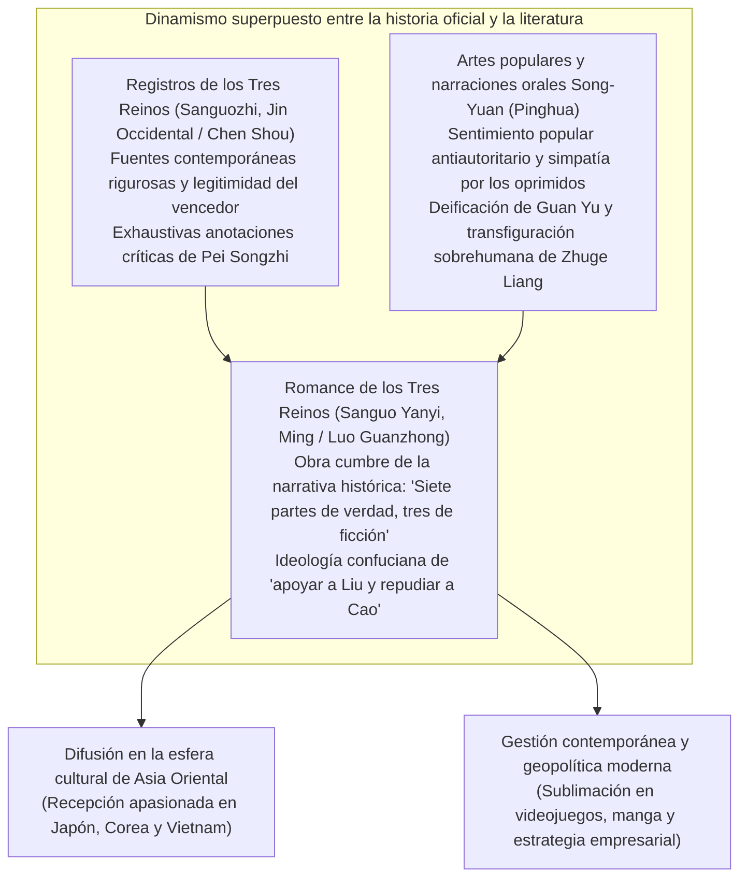
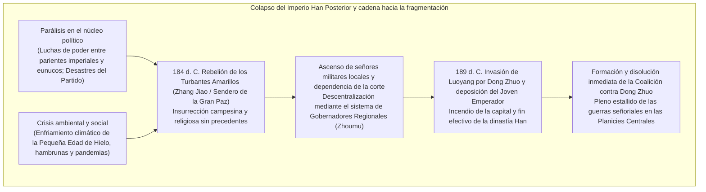
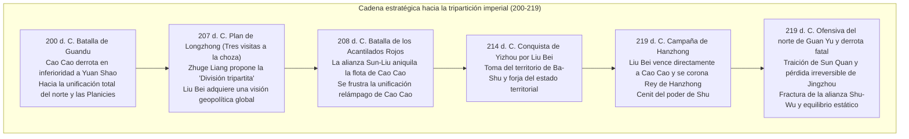
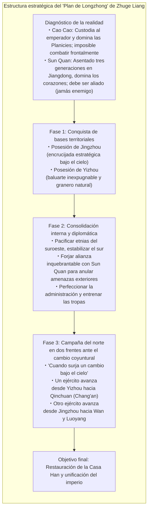
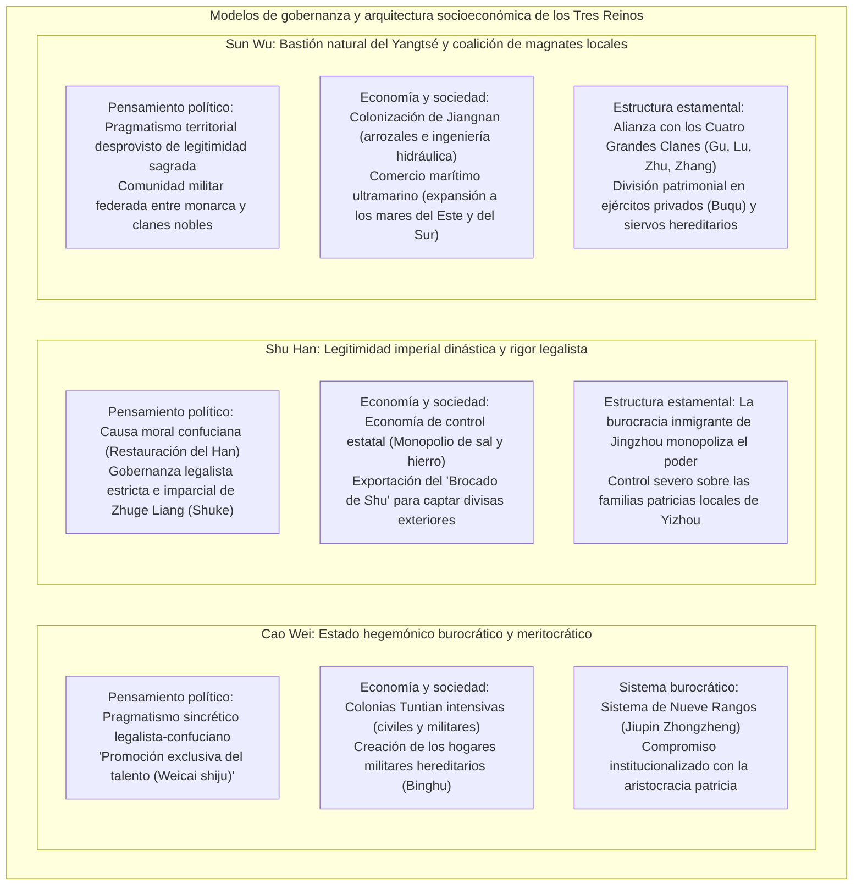

## Introducción: ¿Por qué los «Tres Reinos» siguen fascinando a la humanidad tras más de 1.800 años?

Desde el estallido de la «Rebelión de los Turbantes Amarillos» en el año 184 d. C. hasta la unificación definitiva del imperio por la dinastía Jin Occidental (Western Jin) en el año 280 d. C. tras someter al reino de Sun Wu, transcurrió aproximadamente un siglo. Las vicisitudes, auge y caída del **«Periodo de los Tres Reinos (Three Kingdoms period)»**, libradas sobre los inmensos llanos y valles de China en el extremo oriental del continente euroasiático, han traspasado más de 1.800 años de historia y continúan cautivando con fuerza incombustible la imaginación intelectual y la pasión de incontables personas, no solo en Asia Oriental, sino en el mundo entero.

¿Por qué, entre las numerosas transiciones dinásticas que jalonan la milenaria historia china, las convulsiones de esta época en particular siguen proyectando un campo magnético cultural tan extraordinariamente vigoroso?

La razón primordial radica en que el universo de los «Tres Reinos» posee una insólita «estructura dual»: por un lado, se sustenta en la rigurosa veracidad factual de la **historia oficial, los «Registros de los Tres Reinos» (*Sanguozhi*, redactados por Chen Shou con las eruditas anotaciones de Pei Songzhi)**; por el otro, se nutre de la cúspide de la narrativa histórica tradicional, el **«Romance de los Tres Reinos» (*Sanguo Yanyi*, atribuido a Luo Guanzhong)**, cristalizado durante la dinastía Ming tras absorber un milenio de devoción popular, relatos orales de plaza pública y representaciones teatrales.



Como hecho histórico estricto, el periodo de los Tres Reinos fue una era de una ferocidad desoladora, sacudida por el desplome institucional del Imperio Han Posterior, un colapso demográfico abrumador, un drástico enfriamiento climático, hambrunas generalizadas y guerras despiadadas. Mientras que en el cenit del Han Posterior la población censada alcanzaba unos 56 millones de almas, hacia finales del periodo de la tripartición, sumando los tres reinos de Wei, Shu y Wu, el censo se había desplomado a apenas unos 8 millones de personas (incluso si se descuentan los hogares no registrados y las poblaciones de desplazados fugitivos, el grado de devastación social rozó límites catastróficos).

Sin embargo, en medio de este vacío normativo y de esta encarnizada lucha por la supervivencia biológica y política, florecieron con vigor inaudito la **«innovación de la sagacidad estratégica»** y audaces **«experimentos de diseño estatal»** que demolieron la autoridad fosilizada y los órdenes estamentales preexistentes:
- Cao Cao instauró un sistema de reclutamiento basado estrictamente en el talento individual (*Weicai shiju*, «promover exclusivamente la aptitud») por encima de los prejuicios morales de linaje, al tiempo que resolvió la crónica penuria de suministros militares mediante las colonias agropecuarias estatales (*Tuntian*).
- Zhuge Liang concibió el magistral diseño geopolítico del «Plan de Longzhong» (*Longzhongdui*, la división tripartita del imperio), formulado para que un estado territorialmente diminuto pudiera desafiar y absorber a un coloso, complementándolo con un Estado de derecho riguroso, incorruptible e imparcial.
- Sun Quan, aprovechando el baluarte natural infranqueable del río Yangtsé, impulsó el desarrollo agrícola de las tierras vírgenes de Jiangnan y sentó las bases pioneras de un estado mercantil marítimo con proyección hacia el Mar de China Oriental y el Mar de la China Meridional.

Y por encima de todo, el drama humano desatado por los caudillos, estrategas, generales y masas anónimas que atravesaron este torbellino —el frío racionalismo y la irremediable soledad de Cao Cao, la indomable benevolencia y terquedad de Liu Bei, la altiva lealtad y el destino trágico de Guan Yu, o la inmolación de Zhuge Liang en el altar de una causa imperial imposible— se sublimó en un himno universal a la condición humana que trasciende épocas y fronteras geográficas.

En este estudio exhaustivo, nos proponemos diseccionar el grandioso fresco de los «Tres Reinos», alejándonos de la mera yuxtaposición de anécdotas o resúmenes novelescos, para **examinarlo minuciosamente desde todos los prismas: la historiografía crítica, el pensamiento político, la geopolítica militar, las instituciones socioeconómicas y la historia de su recepción cultural**. Al deslindar con objetividad las divergencias entre los registros históricos y la ficción del *Romance*, desvelaremos la auténtica profundidad ideológica y estratégica de quienes combatieron en aquella era de fuego y ceniza.

---

## Capítulo 1: El ocaso de la dinastía Han Posterior y el preludio del fraccionamiento señorial (184–200 d. C.)

El telón de los Tres Reinos se levantó con la espectacular desintegración interna del Imperio Han (Han Anterior y Posterior), una dinastía que durante cuatro siglos había vertebrado y unificado el mundo de la civilización china. ¿Por qué una estructura centralizada tan monumental perdió su fuerza cohesiva con semejante celeridad, permitiendo el surgimiento de magnates locales y señores de la guerra armados? En los cimientos de este colapso convergieron la fatiga institucional, la corrupción gangrenosa del poder central y una severa alteración climática a escala global.



### 1.1 La tiranía de eunucos y consortes, y los «Desastres del Partido»: Disfunción estructural del Imperio Han Posterior

A partir de su meridiano, la arquitectura política del Han Posterior (Han Oriental: 25–220 d. C.) quedó atrapada en un bucle destructivo provocado por la prematura y reiterada ascensión al trono de emperadores que apenas eran niños.

Cuando el soberano era menor de edad, el timón del Estado era usurpado por la emperatriz viuda y su clan familiar, conocidos como los **«parientes consortes» (*Waici*)**. A medida que el joven monarca crecía e intentaba recuperar el ejercicio personal de su autoridad, no tenía más opción que aliarse en la intimidad de los aposentos palaciegos con los **«eunucos» (*Huan-guan*)**, su único entorno cotidiano, para purgar militarmente a la parentela consorte. No obstante, una vez investidos de poder absoluto, los eunucos caían en una codicia desenfrenada, colocando a sus parientes al frente de prefecturas y comandancias regionales, multiplicando la extorsión y el cohecho. Ante ello, la siguiente generación de parientes consortes volvía a tomar las armas para degollar a los eunucos. Este sangriento carrusel faccional se repitió de manera incesante.

Frente a esta degradación, el estamento letrado y los burócratas formados en la ética confuciana, junto con los estudiantes de la Universidad Imperial (*Taixue*), alzaron la voz para denunciar con vehemencia la podredumbre cortesana. Se autodenominaron con orgullo la «facción de la corriente pura» (*Qingliu-pai*), mientras tachaban despectivamente a los eunucos y a sus secuaces oportunistas de «facción de la corriente turbia» (*Zhaoliu-pai*).

Sintiéndose acorralados, los eunucos manipularon la voluntad del emperador para incriminar falsamente a los letrados confucianos, acusándolos de «conspirar en facciones ilícitas para perturbar el orden dinástico». Esta maniobra desató purgas devastadoras en los años 166 y 169 d. C., conocidas en la historiografía como los **«Desastres del Partido» (*Danggu zhi huo*)**. Cientos de altos dignatarios, filósofos y letrados ilustres fueron ejecutados o murieron bajo tortura en las mazmorras imperiales, y millares de ellos fueron castigados con la inhabilitación perpetua y el destierro civil.

Esta purga masiva asestó una herida mortal al régimen del Han Posterior. Las élites aristocráticas locales y la clase intelectual provincial perdieron toda fe en la legitimidad moral del gobierno central, extinguiéndose en ellos cualquier anhelo de defender las leyes y la autoridad del trono. En ese vacío moral e institucional comenzó a abonarse con pasmosa celeridad el terreno para el alzamiento de poderes militares autónomos.

### 1.2 Enfriamiento climático, hambruna, peste y la «Rebelión de los Turbantes Amarillos»

Al descalabro político vino a sumarse una catástrofe natural de inmensas proporciones.

Investigaciones contemporáneas en paleoclimatología y demografía histórica demuestran que, entre finales del siglo II y el siglo III, el este de Asia se adentró en la fase incipiente de un ciclo de severo enfriamiento climático englobado en la denominada **«Pequeña Edad de Hielo»**. Inviernos glaciales y veranos marcados por sequías inclementes o heladas extemporáneas se sucedieron año tras año, infligiendo daños demoledores a la productividad agrícola en las cuencas de los ríos Amarillo y Yangtsé. Por añadidura, sobre una población famélica y desnutrida cayó una catastrófica **pandemia pestilente** (presumiblemente una combinación letal de tifus y viruela). El literato Cao Zhi, en su célebre texto de la era Jian'an titulado *Shuoyi Fu* («Rapsodia sobre la peste»), dejó constancia de una estampa verdaderamente infernal: «En cada hogar se lloraba la tragedia de cadáveres insepultos; en cada cámara resonaba el desgarrador lamento de la agonía».

En el vórtice de esta desesperación colectiva surgió en la comandancia de Julu (en la actual provincia de Hebei) un místico taoísta llamado **Zhang Jiao**.

Zhang Jiao fundó el **«Sendero de la Gran Paz» (*Taipingdao*)**, una corriente religiosa sincrética que fundía doctrinas del mítico Emperador Amarillo y Laozi con rituales mágicos y sanaciones populares. Distribuyendo aguas lustrales encantadas (*fushui*) entre los enfermos y exigiendo la confesión pública de los pecados, desplegó un proselitismo arrollador. En un abrir y cerrar de ojos, cientos de miles de campesinos agónicos se convirtieron en sus fervientes acólitos. Zhang Jiao articuló a sus fieles en una rigurosa estructura militar, dividiendo el territorio en 36 circunscripciones castrenses denominadas *Fang*, y preparó un alzamiento armado simultáneo en todo el imperio.

Como consigna revolucionaria enarbolaron una profecía en verso sumamente célebre:
> **«蒼天已死、黃天當立、歲在甲子、天下大吉»**  
> *(El Cielo Azul ha muerto, el Cielo Amarillo debe erigirse; en el año Jiazi, habrá gran ventura bajo el cielo).*

El «Cielo Azul» (*Cangtian*), símbolo del mandato del Han vinculado al elemento fuego/madera, había agotado su hálito cósmico; en su lugar debía ascender el «Cielo Amarillo» (*Huangtian*), emblema de la virtud de la tierra. El año 184 d. C., coincidente con el inicio del ciclo sexagesimal chino (*Jiazi*), representaba el momento señalado para la gran refundación mesiánica.

En el segundo mes del año 184, cientos de miles de insurrectos se lanzaron a la rebelión cubriendo sus cabezas con turbantes amarillos como distintivo sagrado. Así estalló la **«Rebelión de los Turbantes Amarillos» (*Huangjin zhi luan*)**. Las llamas del alzamiento devoraron el corazón del imperio —Hebei, Henan, Shandong—: las sedes gubernamentales fueron reducidas a cenizas y los magistrados resultaron linchados o puestos en fuga.

Aterrada, la corte imperial despachó a sus generales más prestigiosos, como Huangfu Song, Zhu Jun y Lu Zhi, al tiempo que decretaba una amnistía general para los letrados represaliados en los Desastres del Partido en un desesperado intento por recabar su cooperación. Fue en este escenario de emergencia cuando figuras destinadas a transformar la historia, como Cao Cao, Liu Bei y Sun Jian, irrumpieron en el proscenio dirigiendo huestes de voluntarios y regimientos imperiales.

El núcleo de la rebelión fue aplastado en el plazo de un año debido a la férrea ofensiva de los ejércitos gubernamentales y a la repentina muerte por enfermedad del propio Zhang Jiao. No obstante, las partidas remanentes se fragmentaron en temibles organizaciones guerrilleras como los bandoleros de Heishan («Montaña Negra») y Baibo («Ola Blanca»), que continuaron hostigando el territorio durante décadas. Incapaz ya de garantizar el orden público por sus propios medios, la corte imperial tomó en el año 188 d. C. una resolución trascendental: instaurar el **«sistema de Gobernadores Regionales» (*Zhoumu*)**, concediendo a los mandatarios provinciales atribuciones plenipotenciarias sobre el ejército, la administración civil y la recaudación fiscal. La concesión de semejante poder hegemónico convirtió de facto a estos gobernadores en señores de la guerra (*warlords*) autónomos e independientes, decretando la sentencia de muerte del centralismo imperial.

### 1.3 La tiranía de Dong Zhuo y el incendio de Luoyang: Colapso total del viejo orden

En el año 189 d. C., tras el fallecimiento del emperador Ling, la pugna en la corte entre el líder de los parientes consortes, el general en jefe He Jin, y la cúpula de los eunucos (los «Diez Asistentes» o *Shichangshi*) alcanzó su desenlace definitivo. En una temeraria maniobra para intimidar a sus adversarios palaciegos, He Jin convocó a la capital, Luoyang, a **Dong Zhuo**, un rudo y temible comandante militar que gobernaba la remota provincia occidental de Liangzhou al mando de una aguerrida tropa mixta de veteranos y jinetes de etnias no han.

Sin embargo, instantes antes de que Dong Zhuo cruzara las puertas de la metrópoli, los eunucos, alertados de la conspiración, emboscaron y decapitaron a He Jin en el palacio. Enfurecidos por este magnicidio, jóvenes oficiales aristócratas como Yuan Shao y Cao Cao irrumpieron espada en mano en el recinto sagrado, desencadenando una carnicería que se saldó con el exterminio indiscriminado de más de 2.000 eunucos.

En mitad de la anarquía resultante, Dong Zhuo entró en Luoyang sin encontrar resistencia, haciendo valer la aplastante superioridad de su caballería pesada. Despreciando a la vieja nobleza letrada, el caudillo fronterizo depuso con insolencia al Joven Emperador (emperador Shao) y entronizó en su lugar al dócil infante Liu Xie (el emperador Xian). Autoerigiéndose en Gran Canciller (*Xiangguo*), Dong Zhuo acaparó de forma absoluta los resortes del Estado.

El régimen de terror, sevicia y desmanes implantado por Dong Zhuo resultó una humillación intolerable para los estamentos aristocráticos del imperio. En el año 190 d. C., bajo la presidencia honorífica de Yuan Shao, los señores feudales y gobernadores de las provincias situadas al este del paso de Hangu convocaron una gigantesca alianza armada: la **«Coalición contra Dong Zhuo»**. Entre sus filas figuraban nombres que forjarían el destino de la época: Cao Cao, Sun Jian, Yuan Shu, Qiao Mao, Bao Xin, entre otros.

Frente a la presión de la confederación, Dong Zhuo adoptó una resolución de tierra quemada sencillamente espeluznante: obligó a punta de lanza a millones de habitantes de Luoyang a un éxodo forzoso hacia la occidental Chang'an (actual Xi'an), saqueó sistemáticamente las tumbas de los antiguos emperadores y prendió fuego a palacios, templos ancestrales, dependencias ministeriales y viviendas populares. Luoyang, la capital más suntuosa y poblada de Asia Oriental durante siglos, quedó convertida en pocas noches en un páramo fantasmal de escombros humeantes.

De manera harto reveladora, la coalición que se había congregado en nombre de la lealtad imperial vaciló aterrorizada ante el poder bélico de Dong Zhuo. Incapaces de coordinar un avance frontal, sus líderes pasaron los meses entregados al banqueteo, el espionaje recíproco y la anexión clandestina de territorios vecinos. Indignados por semejante cobardía, Cao Cao y Sun Jian lanzaron incursiones independientes, pero sufrieron sangrientas embestidas. Sin haber abatido al tirano, la coalición se desintegró devorada por disputas fratricidas. El viejo orden imperial se extinguió para siempre, dando paso formal a la **«era del fraccionamiento señorial»**, donde imperó la ley de la selva más despiadada.

*(El propio Dong Zhuo no sobreviviría mucho tiempo a sus desmanes: en el año 192 d. C., fue asesinado en Chang'an mediante una conspiración urdida por el ministro Wang Yun y ejecutada por el hijo adoptivo del tirano, el sin par guerrero Lü Bu. El cadáver de Dong Zhuo fue arrojado al mercado de la ciudad, donde la multitud enfurecida le clavó una mecha en el ombligo y encendió su abundante grasa corporal como una antorcha grotesca).*

### 1.4 La lucha por la hegemonía en las Planicies Centrales: Auge y caída de los señores feudales

Con el imperio convertido en cenizas, las fértiles llanuras agrícolas del curso medio y bajo del río Amarillo (*Zhongyuan*, las Planicies Centrales) se transformaron en un implacable campo de torneos a muerte. En aquel tablero ensangrentado destacaron los siguientes actores principales:

- **Yuan Shao**: Heredero del linaje más encumbrado del imperio, condecorado con el blasón de «cuatro generaciones y tres cancilleres» (*Sishi sangong*). Tras librar encarnizadas guerras y exterminar a Gongsun Zan en el norte, consolidó bajo su mando indiscutido las cuatro ricas provincias septentrionales (Jizhou, Qingzhou, Youzhou y Bingzhou), erigiéndose en el potentado militar más temible del orbe chino.
- **Yuan Shu**: Primo (o medio hermano menor) de Yuan Shao. Apoyado en la cuenca de Huainan (en la provincia de Yangzhou), y tras arrebatar a Sun Jian el Sello Imperial Hereditario (*Chuanguo Xi*), se dejó cegar por delirios de grandeza y se autoproclamó emperador de la efímera dinastía Zhongjia. Aislado diplomáticamente y execrado por todos, acabó autodestruyéndose en la miseria y el abandono.
- **Sun Ce**: Primogénito de Sun Jian, el «Tigre de Jiangdong». Con una fiereza marcial y un carisma que le valieron el sobrenombre de «Pequeño Conquistador» (*Xiaoba Wang*), pacificó a sangre y fuego en un puñado de campañas relámpago las seis comandancias situadas al sur del bajo Yangtsé tras la temprana muerte de su padre. Cimentó en solitario la infranqueable base territorial del futuro estado de Wu, pero en el año 200 d. C., con apenas 26 años, fue emboscado por asesinos y perdió la vida prematuramente.
- **Lü Bu**: Ensalzado como el guerrero más formidable de su generación bajo el aforismo «Entre los hombres, Lü Bu; entre los corceles, Liebre Roja». No obstante, su ligereza ética y su constante proclividad a la traición (liquidó sucesivamente a sus protectores Ding Yuan y Dong Zhuo) lo condenaron a una existencia errante. Tras usurpar la provincia de Xuzhou a Liu Bei, fue finalmente sitiado en Xiapi por las fuerzas coaligadas de Cao Cao y Liu Bei, siendo capturado por la defección de sus propios oficiales y condenado a la horca.
- **Liu Biao**: Prestigioso patricio de la corriente letrada que rigió con estabilidad la estratégica y próspera provincia de Jingzhou, en el curso medio del Yangtsé. Ofreció generoso asilo a legiones de eruditos y refugiados que huían del infierno del norte, promoviendo las academias clásicas y la paz interior; sin embargo, carecía de ambición militar expansiva, limitándose al rol de un celoso custodio de sus fronteras.
- **Liu Bei**: Pese a proclamarse descendiente legítimo del emperador Jing del Han Anterior, había pasado su juventud trenzando y vendiendo alpargatas de paja para sustentar a su anciana madre. Un héroe forjado en el barro que trabó un lazo indisoluble de fraternidad marcial con Guan Yu y Zhang Fei. Habiendo recibido pacíficamente el gobierno de Xuzhou del noble Tao Qian, le fue arrebatado por Lü Bu, viéndose obligado a vagar como huésped armado al amparo sucesivo de Gongsun Zan, Cao Cao, Yuan Shao y Liu Biao. Sin poseer un palmo de tierra firme propio, su asombrosa gravedad ética y su magnética benevolencia (*Ren*) le granjearon una reverencia universal en todo el territorio.

### 1.5 El ascenso de Cao Cao y la «Custodia del Emperador Xian»: Fusión de legitimidad política y pragmatismo racional

Entre esta maraña de caudillos feudales, emergió con una visión estratégica incomparablemente superior la figura de **Cao Cao (nombre de cortesía: Mengde)**.

Perteneciente al estamento eunuco por adopción (su abuelo adoptivo fue el influyente eunuco palaciego Cao Teng), Cao Cao era mirado con altanero desdén por la aristocracia patricia tradicional encarnada por linajes como el de Yuan Shao. Sin embargo, Cao Cao reunía en una sola persona a un genial táctico militar, un estadista de pulso helado y a uno de los más excelsos poetas y estilistas líricos que jamás conoció la lengua clásica china.

El primer golpe maestro que catapultó su destino tuvo lugar en el año 196 d. C.: **el acogimiento tutelar del emperador Xian**.

Tras escapar milagrosamente de los remanentes de Dong Zhuo (Li Jue y Guo Si) en Chang'an, el desdichado y famélico soberano vagaba entre las ruinas calcinadas de Luoyang. Atendiendo al sagaz consejo de su principal estratega, Xun Yu, Cao Cao acudió al rescate del monarca, escoltándolo solemnemente hasta su propia plaza fuerte en Xuchang (en la moderna provincia de Henan).

Con este único movimiento, Cao Cao conquistó una carta política invencible, condensada en la famosa máxima:
> **«挟天子以令诸侯» (*Xie tianzi yi ling zhouhou* — «Sujetar al Hijo del Cielo para dictar órdenes a los señores feudales»).**

A partir de entonces, cualquier señor de la guerra que osara empuñar las armas contra Cao Cao incurría automáticamente en el delito de alta traición contra la corona imperial. Investido con las más altas dignidades de la corte (General en Jefe y, posteriormente, Gran Canciller), Cao Cao pudo redactar edictos sancionados por el sello imperial para anatematizar a sus rivales como rebeldes sediciosos, justificando todas sus campañas bélicas como legítimas expediciones de pacificación del ejército regular del Estado.

En paralelo a esta ventaja ideológica, acometió una reforma estructural sin precedentes para reactivar la destrozada economía de las Planicies Centrales: la implantación de las **colonias agropecuarias militares y civiles (*Tuntian*)**, ideadas en 196 d. C. por sus ministros Zao Zhi y Han Hao. Todas las inmensas extensiones agrícolas abandonadas por efecto de la contienda fueron declaradas bienes de dominio público. Se congregó a masas de campesinos fugitivos, a quienes la corona dotó de arados, bueyes de labranza y simientes. Como contraprestación, los labradores entregaban al fisco estatal entre el 50 % y el 60 % de sus cosechas en concepto de renta de la tierra, quedando a cambio eximidos de la leva militar y protegidos de las correrías armadas.

Gracias al sistema *Tuntian*, el ejército de Cao Cao resolvió de raíz la escasez crónica de alimentos que consumía a las fuerzas rivales, logrando almacenar millones de sacos de grano en silos fortificados. Habiendo articulado de forma armoniosa una incontestable legitimidad política (el amparo del emperador) y una base productiva y logística autárquica (las colonias agrícolas), Cao Cao se preparó para el choque frontal e inevitable con el coloso del norte: Yuan Shao.

---

## Capítulo 2: El choque de hegemonías y el camino hacia la tripartición (200–219 d. C.)

Las dos décadas comprendidas entre los años 200 y 219 d. C. constituyeron la edad dorada, más vibrante y de mayor densidad estratégica en la epopeya de los Tres Reinos. A través de este periodo, el caos informe de los incontables caudillos provinciales decantó y cristalizó finalmente en la división del imperio en tres grandes potencias: **Wei, Shu y Wu**.

El curso de esta metamorfosis vino determinado por tres monumentales campañas bélicas: la **Batalla de Guandu (200 d. C.)**, la **Batalla de los Acantilados Rojos (208 d. C.)** y la **Guerra por Hanzhong y Fancheng (219 d. C.)**.



### 2.1 La Batalla de Guandu (200 d. C.): La guerra de inteligencia en la que pocos devoraron a un gigante

En el año 200 d. C., estalló el duelo supremo por la supremacía del norte de China: la célebre **«Batalla de Guandu» (Battle of Guandu)**.

Frente a frente se situaban, por un lado, el coloso del momento, **Yuan Shao**, dueño absoluto de las cuatro provincias septentrionales con un ejército imperial de 100.000 infantes de choque y 10.000 jinetes selectos; por el otro, **Cao Cao**, quien, custodiando al emperador, apenas lograba reunir bajo sus estandartes a un contingente de entre 20.000 y 30.000 soldados. La disparidad numérica era abrumadora, de casi cuatro a uno. A los ojos de cualquier observador militar imparcial, el aniquilamiento de Cao Cao parecía un hecho consumado.

Tras cruzar el río Amarillo en su avance hacia el sur, las huestes de Yuan Shao chocaron contra las fortificaciones atrincheradas de Cao Cao en Guandu (al noreste del actual condado de Zhongmu, Henan). La contienda derivó en una sangrienta guerra de desgaste estático. Los zapadores de Yuan Shao erigieron altas colinas de tierra coronadas con torres de madera para acribillar con flechas el interior del campamento enemigo y excavaron galerías subterráneas para socavar las murallas. Cao Cao respondió desplegando ingeniosas catapultas de tracción humana («carros lanzapiedras» o *Fashiche*) que trituraron las torres de asedio y cavó profundas trincheras perimetrales que cortaron en seco los túneles enemigos.

A pesar de estas contramedidas tácticas, la prolongación del asedio comenzó a asfixiar inexorablemente al ejército de Cao Cao, críticamente inferior en recursos y reservas de grano. Agotados los víveres y con sus tropas al borde del colapso físico y moral, el propio Cao Cao, presa de la zozobra, remitió una misiva reservada a su ministro Xun Yu en Xuchang contemplando una retirada de emergencia. La respuesta de Xun Yu fue inflexible: «Si retrocedes un solo paso, el imperio caerá en manos de Yuan Shao. Mantente firme y aguarda a que surja una fisura en el adversario».

Pronto se presentó el viraje providencial de la contienda: una fractura interna generada en el nexo entre **la inteligencia militar y la cadena de suministro**.

**Xu You**, uno de los principales consejeros de Yuan Shao, había recomendado dividir las fuerzas para lanzar un ataque nocturno por sorpresa contra la desprotegida Xuchang. Al ser desestimada su sugerencia por Yuan Shao y salir a la luz simultáneamente un escándalo de malversación que involucraba a parientes de Xu You, este fue blanco de la ira del magnate. Desesperado y sintiéndose amenazado de muerte, Xu You desertó al amparo de las sombras y se presentó en el cuartel general de Cao Cao.

Enterado de la llegada de su viejo camarada de juventud, la tradición cuenta que Cao Cao salió descalzo de su tienda, sin tiempo de calzarse las sandalias, y lo acogió con júbilo desbordante. Xu You le reveló el secreto más celosamente guardado del ejército enemigo:
> «La totalidad de las provisiones de grano de Yuan Shao, compuestas por decenas de miles de carromatos, se halla concentrada en su base logística de **Wuchao**. Su comandante, Chunyu Qiong, es un hombre confiado e indolente que desatiende la vigilancia. Si conduces a una tropa de élite para incendiar ese enclave en un golpe nocturno relámpago, los cientos de miles de soldados de Yuan Shao se derrumbarán sin necesidad de entablar combate».

Cao Cao actuó con una audacia fulminante. Poniéndose él mismo a la vanguardia de 5.000 jinetes escogidos que enarbolaban insignias enemigas, con los rostros tiznados de carbón y maderas en las bocas de los corceles para asegurar un silencio sepulcral, eludió los puestos de avanzada de Yuan Shao y asaltó por sorpresa los depósitos de Wuchao. Tras un encarnizado combate, las fuerzas de Chunyu Qiong fueron aniquiladas y los inmensos arsenales de forraje y grano quedaron reducidos a cenizas.

Al contemplar las descomunales llamaradas de Wuchao que iluminaban el horizonte nocturno, el pánico cundió de forma histérica entre las filas de Yuan Shao. La posterior defección y rendición inmediata a Cao Cao de dos de los generales más reputados del clan Yuan, Zhang He y Gao Lan, provocó el colapso absoluto del frente. Yuan Shao y su primogénito, Yuan Tan, despojados de sus pertrechos y abandonando a su ejército, apenas lograron huir cruzando el río Amarillo al frente de una escolta residual de 800 jinetes.

La victoria en Guandu trascendió el ámbito meramente militar. Representó el triunfo categórico de un modelo meritocrático, ágil en la toma de decisiones y obsesionado con la logística y el valor de la información estratégica, sobre una aristocracia patricia que fiaba su destino al abolengo dinástico y a la masa bruta de sus levas, sorda a las advertencias de sus propios asesores. Tras el posterior fallecimiento por enfermedad de Yuan Shao, Cao Cao procedió a desarticular metódicamente a los herederos del clan Yuan y, tras someter en el año 207 d. C. a la belicosa confederación de los jinetes nómadas Wuhuan en la frontera norte, culminó la **unificación total del norte de China (las Planicies Centrales y Hebei)** bajo su hegemonía indiscutida.

### 2.2 Liu Bei deambulante y las «Tres visitas a la choza»: El impacto geopolítico del Plan de Longzhong

Mientras el norte quedaba unificado bajo el puño de hierro de Cao Cao, **Liu Bei**, privado de asiento propio y vagando por el imperio como un huésped armado, se hallaba guarecido bajo el amparo de Liu Biao en la remota guarnición de Xinye (en la provincia de Henan). Superados ya los cuarenta años de edad, pasaba los días consumiéndose en la melancolía del célebre lamento conocido como *Binrou zhi tan* (el dolor de notar que, alejado de las fatigas de la guerra, la grasa volvía a acumularse ociosamente en sus muslos).

Sin embargo, en el año 207 d. C. se produjo un acontecimiento que alteraría de manera irreversible el destino de Liu Bei y el curso de la historia universal: su encuentro con un brillante joven de 27 años que vivía retirado en una humilde morada campesina en Longzhong, a las afueras de Xiangyang: **Zhuge Liang (nombre de cortesía: Kongming)**.

Liu Bei, venciendo cualquier prurito jerárquico, acudió en persona en tres ocasiones consecutivas a solicitar la sabiduría de aquel joven anónimo, episodio inmortalizado como las **«Tres visitas a la choza de paja» (*San gu maolu*)**. Y fue en el humilde recinto de aquella estancia rústica donde Zhuge Liang desplegó ante los ojos del veterano caudillo el más formidable plan maestro de la geopolítica clásica china: el **«Plan de Longzhong» (*Longzhongdui*)**, la gran doctrina de la división tripartita del imperio.



Los postulados vertebrales concebidos por Zhuge Liang brillaban por un realismo descarnado:
1. **Diferenciación nítida entre adversario irreductible y aliado natural**: Cao Cao, respaldado por la autoridad imperial del Hijo del Cielo y dueño del potencial demográfico del norte, no podía ser desafiado en un choque frontal. Sun Quan, cuya dinastía llevaba tres generaciones arraigada en las tierras meridionales de Jiangdong con un arraigo civil indiscutible, debía ser cultivado como un socio defensivo permanente, jamás como un contendiente.
2. **Selección precisa de los objetivos territoriales**: Jingzhou representaba una encrucijada geográfica de primer orden («un territorio donde concurren las armas»), comunicada por agua con los ríos Han y Mian al norte, con los mares del sur, con Wu al este y con Ba y Shu al oeste; no obstante, su señor Liu Biao carecía del vigor militar para conservarla. Por su parte, Yizhou (la cuenca de Sichuan) era una fortaleza natural inexpugnable rodeada por murallas montañosas y regada por tierras prodigiosamente fértiles («el granero otorgado por el Cielo»), cuyo gobernador, Liu Zhang, era un mandatario incompetente y apático. Liu Bei debía adueñarse de ambas provincias para cimentar su propio estado soberano.
3. **Ofensiva del norte en tenaza ante la oportunidad coyuntural**: Tras afianzar el gobierno interior, apaciguar a las tribus fronterizas y soldar un pacto militar inquebrantable con Sun Quan, se aguardaría a que aconteciera «un cataclismo en el imperio» (una rebelión civil o un cisma sucesorio en el régimen de Cao Cao). En ese instante crucial, un cuerpo expedicionario principal partiría desde Yizhou (Hanzhong) rumbo a Chang'an a través de Qinchuan, mientras un general de suprema confianza avanzaría simultáneamente desde Jingzhou hacia Wan y Luoyang. Sorprendidas en una pinza estratégica irresistible, las poblaciones someterían sus voluntades a Liu Bei, consumándose con éxito la restauración dinástica de los Han.

Al escuchar este soberbio diseño, Liu Bei sintió que la densa niebla que había cegado su vida errante se disipaba de golpe, exclamando conmovido: «Tener a Kongming a mi lado es para mí como para el pez hallar de nuevo el agua» (*el lazo del pez y el agua*). Aquel humilde soldado de fortuna que durante decenios no había pasado de ser un condotiero a sueldo, despertó por fin, bajo la tutela del más insigne estratega de la época, a su verdadera vocación: la de un estadista fundador de imperios.

### 2.3 La Batalla de los Acantilados Rojos (208 d. C.): La fortaleza acuática del Yangtsé y la encrucijada del imperio

En el verano del año 208 d. C., apenas formulado el Plan de Longzhong, Cao Cao emprendió una monumental campaña relámpago de conquista hacia el sur al mando de cientos de miles de veteranos. Para colmo de desdichas, el gobernador de Jingzhou, Liu Biao, falleció repentinamente de enfermedad, y su pusilánime heredero, Liu Cong, entregó la provincia sin disparar una flecha. Liu Bei se vio impelido a una dramática huida hacia el sur escoltando a decenas de miles de civiles fugitivos, siendo alcanzado en Changban (Dangyang) por la implacable caballería de choque de Cao Cao («la Caballería de Tigres y Leopardos» o *Hubaoqi*). La derrota fue atroz, viéndose forzado a abandonar a su propia familia para salvar la vida en una retirada desesperada (en el fragor de este combate nacieron las gestas imperecederas de Zhao Yun rescatando en solitario al heredero lactante en medio de las líneas enemigas y el desafío legendario de Zhang Fei en el puente de Changban).

Refugiado en Xiakou (en la actual Wuhan), Liu Bei buscó con urgencia articular una entente con el joven gobernante de Jiangdong, **Sun Quan**. Zhuge Liang se trasladó personalmente al cuartel general de Wu para desplegar una brillante misión diplomática, concertando voluntades con el gran mariscal de la flota, **Zhou Yu**, y el eminente cortesano **Lu Su**, para abogar resueltamente por la guerra total.

En la corte de Sun Quan, la inmensa mayoría de los letrados y ministros civiles imploraba la capitulación: «Cao Cao cuenta con una hueste incontable, porta los estandartes del emperador y acaba de apoderarse de la formidable escuadra naval de Jingzhou; resistirse equivale al suicidio». Sin embargo, Zhou Yu desnudó ante su señor las fallas críticas que condenaban al ejército del norte:
1. Era una fuerza terrestre constituida por jinetes septentrionales que carecía de la más mínima experiencia en maniobras sobre el agua.
2. Tras una marcha forzada de miles de li en pleno invierno, los soldados y monturas se encontraban exhaustos, siendo inminente el brote de epidemias endémicas en los pantanos del sur.
3. Carecían de forraje suficiente para las bestias y sus líneas logísticas de transporte a través de regiones recién conquistadas eran extraordinariamente frágiles.

Convencido de la certidumbre de este análisis, Sun Quan desenvainó su espada ceremonial y cercenó de un tajo la esquina de su mesa de audiencias, sentenciando: «¡Aquel que vuelva a pronunciar la palabra rendición sufrirá el mismo destino que este mueble!». Confiando el mando supremo a Zhou Yu al frente de 30.000 marineros veteranos, ordenó su enlace inmediato con los restos del ejército de Liu Bei y el avance remontando el curso del Yangtsé.

En el invierno de 208 d. C., en el estrecho y tempestuoso paso fluvial de los **Acantilados Rojos (Battle of Red Cliffs)**, tuvo lugar el colosal choque naval.

Acosado por el mareo generalizado de sus tropas de tierra firme, Cao Cao había ordenado encadenar y entablonar sus navíos de combate unos con otros para formar plataformas flotantes estables que imitaran suelo firme. Al percatarse de semejante rigidez táctica, el veterano vicealmirante de Wu, **Huang Gai**, fingió traicionar a sus señores enviando a Cao Cao una carta de rendición y avanzó hacia la escuadra norteña capitaneando varias decenas de galeras ligeras rebosantes de astillas resinosas, paja seca y jarras de brea y aceite de pescado.

Favorecidas por un brusco temporal de viento procedente del sureste, las naves de vanguardia prendieron fuego a su carga y embistieron a toda velocidad contra la apiñada flota de Cao Cao. Al hallarse sólidamente encadenadas entre sí, las monumentales galeras no pudieron maniobrar ni soltarse: el fuego se propagó de un casco a otro con ferocidad incontrolable, transmutando el ancho cauce del Yangtsé en un gigantesco mar de llamas. El viento arrastró las llamaradas contra los campamentos emplazados en la ribera septentrional, desatando una catástrofe dantesca.

Cao Cao, viendo destrozado el grueso de su ejército y diezmado el resto por la virulencia de las epidemias, emprendió una tortuosa fuga a través del lodazal del camino de Huarong para refugiarse en el norte.

La Batalla de los Acantilados Rojos fue la mayor contienda fluvial registrada en la historia militar de Oriente y **el enfrentamiento que abortó para siempre la unificación imperial relámpago soñada por Cao Cao**. La victoria selló el dominio del Yangtsé medio y bajo por las potencias meridionales, y confirió sustancia material y geográfica al vaticinio de Zhuge Liang sobre la inevitable tripartición del imperio.

### 2.4 La contienda por Yizhou y la campaña de Hanzhong (211–219 d. C.): Consolidación territorial de Shu Han

Tras el triunfo en los Acantilados Rojos, Liu Bei no tardó en asegurar el control efectivo de las cuatro comandancias del sur de Jingzhou (Wuling, Changsha, Lingling y Guiyang), obteniendo por primera vez una plataforma territorial autónoma. No obstante, para consumar la arquitectura del Plan de Longzhong resultaba imprescindible apropiarse del opulento reino de **Yizhou (la fértil cuenca de Sichuan)**.

En el año 211 d. C., el pusilánime gobernador de Yizhou, Liu Zhang, aterrorizado ante la presión septentrional de la secta teocrática de Zhang Lu en Hanzhong, solicitó imprudentemente el socorro militar de Liu Bei apelando a su común linaje imperial Han. Consejeros de la talla de Zhuge Liang, Pang Tong y Fa Zheng instaron sin titubear a Liu Bei a aprovechar la coyuntura: «El Cielo os brinda la llave de Ba y Shu; si no la tomáis ahora, otro la arrebatará».

Venciendo escrúpulos morales iniciales, Liu Bei penetró en Sichuan. A pesar de amargos contratiempos, como la trágica muerte en combate del prodigioso estratega Pang Tong en el valle de Luofengpo, en el año 214 d. C. las fuerzas de Liu Bei cercaron la capital, Chengdu. Liu Zhang capituló y Liu Bei asumió el gobierno indiscutido de Yizhou. Sus estandartes contaban ahora con una pléyade de paladines legendarios: a Guan Yu, Zhang Fei y Zhao Yun se unieron el temible general de la caballería fronteriza Ma Chao y el veterano e intrépido arquero Huang Zhong.

Asegurada la cuenca, en el año 217 d. C. Liu Bei emprendió el empeño militar más ambicioso de su carrera: la conquista de **Hanzhong**, la puerta septentrional de Sichuan. Enclavada entre las imponentes cordilleras de Qinling y Daba, Hanzhong era un escudo geográfico vital; mientras Wei dominara esa antesala montañosa, la espada de Cao Cao pendía permanentemente sobre el corazón de Chengdu.

En la encarnizada batalla de Dingjunshan, guiado por la milimétrica clarividencia táctica del estratega Fa Zheng, el veterano general Huang Zhong lanzó un audaz asalto cuesta abajo que culminó con la muerte en el campo de batalla de **Xiahou Yuan**, el veterano comandante en jefe de los ejércitos occidentales de Cao Cao. Sobrecogido por la pérdida de su pariente y lugarteniente, Cao Cao marchó en persona a Hanzhong al frente de un colosal ejército para dirimir la contienda. Sin embargo, Liu Bei rehusó el combate en campo abierto y se atrincheró en las gargantas y fortalezas escarpadas, desgastando al enemigo en una guerra de posiciones implacable. Incapaz de sostener el tendido logístico a través de las montañas, Cao Cao pronunció su melancólica metáfora de la «costilla de pollo» (*Jilei*: algo insípido y desprovisto de carne que no sacia el hambre pero que da lástima arrojar) y ordenó la retirada definitiva de sus legiones.

En el otoño de 219 d. C., dueño incontestable de Hanzhong, Liu Bei fue proclamado por sus oficiales y dignatarios **«Rey de Hanzhong»**. El humilde huérfano que antaño tejía esteras de paja en las aldeas de Zhuo se alzaba por fin como un monarca soberano de rango equiparable al de Cao Cao. La causa de Shu Han alcanzaba su cénit absoluto y el sueño de la reconquista del norte parecía acariciarse con la punta de los dedos.

### 2.5 La expedición al norte de Guan Yu y su muerte en Maicheng: La pérdida de Jingzhou y el punto de inflexión estratégico

No obstante, en el pináculo de la gloria, se desencadenó la catástrofe que dinamitaría para siempre el porvenir de la dinastía. El detonante fue la ofensiva en solitario emprendida hacia el norte por el legendario adalid que custodiaba Jingzhou: **Guan Yu**.

En el verano de 219 d. C., actuando en coordinación táctica con el triunfo de Liu Bei en Hanzhong, Guan Yu avanzó con el grueso de sus tropas y puso bajo un asedio asfixiante la ciudadela fronteriza de Fancheng (en la moderna Xiangyang), baluarte de las fuerzas de Cao Cao. Aprovechando las lluvias torrenciales estivales y la consiguiente crecida desbordante del río Han, Guan Yu condujo sus embarcaciones y anegó por completo a los siete ejércitos de socorro comandados por el ilustre general de Wei, Yu Jin, forzando su rendición y decapitando por su indomable rebeldía al fiero oficial Pang De.

Este triunfo descomunal, ensalzado en las crónicas como el momento en que **«el renombre y la autoridad de Guan Yu estremecieron a la totalidad de las tierras civilizadas» (*Wei zhen Huaxia*)**, sembró el pánico en la corte de Xuchang, hasta el punto de que Cao Cao deliberó con extrema gravedad la evacuación de la capital dinástica hacia regiones situadas al norte del río Amarillo.

Sin embargo, el rutilante éxito de Guan Yu desgarró de forma irremediable **la precaria confianza geopolítica con su vecino y aliado, Sun Quan**.

Para Liu Bei, Jingzhou constituía el trampolín imprescindible del Plan de Longzhong; mas para Sun Quan, el control de las aguas del curso superior del Yangtsé por parte de una fuerza ajena representaba una daga mortal apuntada a las entrañas defensivas de su reino. Tras el fallecimiento de Lu Su —firme defensor de la concordia con Shu—, el nuevo comandante supremo de Wu, **Lü Meng**, advirtió a Sun Quan: «Si Guan Yu abate a Cao Cao, la siguiente víctima de su hegemonía será nuestro propio estado. Debemos atacar su retaguardia ahora que se halla lejos y apoderarnos de la totalidad de Jingzhou».

A ello se sumaban las fatales debilidades temperamentales del propio Guan Yu: si bien era idolatrado por la tropa llana, trataba con una insolencia corrosiva y un orgullo desmedido a los diplomáticos y a la aristocracia letrada. Llegó al extremo de rechazar una propuesta de enlace matrimonial remitida por el mismísimo Sun Quan con el infame insulto: «¿Cómo podría la hija de un tigre condescender a emparejarse con el vástago de un perro?», al tiempo que humillaba y amenazaba de muerte a sus propios administradores de retaguardia, el gobernador de Nan-jun, Mi Fang (cuñado de Liu Bei), y al general Shi Ren.

Aceptando el sagaz consejo de los estrategas Sima Yi y Jiang Ji, Cao Cao despachó embajadas secretas a Sun Quan prometiéndole el reconocimiento de sus derechos soberanos sobre el sur a cambio de un ataque por la espalda sobre las posiciones de Guan Yu.

Lü Meng ejecutó la trampa con una astucia magistral: fingió caer gravemente enfermo y cedió la jefatura fronteriza a un joven desconocido y bisoño de linaje noble, **Lu Xun**, cuyas cartas colmadas de adulación desarmaron por completo la desconfianza del paladín de Shu. Creyendo que Wu carecía de mandos y voluntad para la ofensiva, Guan Yu desguarneció las ciudadelas de retaguardia y trasladó hasta el último soldado hacia las murallas de Fancheng.

Aprovechando aquel descuido flagrante, Lü Meng embarcó a sus mejores comandos en flotillas fluviales, camuflándolos con ropajes blancos de mercaderes desarmados en la célebre estratagema de **«la travesía en vestiduras blancas» (*Baiyi dujiang*)**. Degollando por sorpresa a los vigías de las almenaras en las riberas, la armada de Wu remontó el río y capturó sin derramamiento de sangre la gran fortaleza de Jiangling. Atemorizados por las represalias pasadas de Guan Yu y agasajados con generosidad por los invasores, Mi Fang y Shi Ren entregaron sus plazas sin combatir.

Aislado, sin suministros y sabiendo desmoronada su base de operaciones, el ejército de Guan Yu se desintegró en desbandada. Rodeado en el pequeño reducto de Maicheng junto a un puñado de fieles, Guan Yu intentó una desesperada ruptura hacia el oeste para alcanzar las montañas de Sichuan; sin embargo, cayó en una emboscada tendida por las tropas de Wu y fue capturado y decapitado junto a su primogénito, Guan Ping. Su cabeza cercenada fue remitida por Sun Quan a Cao Cao en un intento de endosarle la responsabilidad última del magnicidio.

La muerte de Guan Yu y la **irreversible pérdida de Jingzhou** constituyeron un **golpe letal de proporciones cósmicas** para el proyecto político de Shu Han. El dogma cardinal del Plan de Longzhong —la ofensiva en pinza simultánea desde Yizhou y Jingzhou— quedó quebrado de raíz para siempre. A partir de ese fatídico desenlace, Shu quedó confinada en los estrechos confines de la cordillera de Sichuan, relegada a la condición de un diminuto enclave montañoso con una población de apenas un millón de habitantes. Y lo que fue aún más funesto: el deseo irrefrenable de vengar la sangre de sus hermanos jurados conduciría a Liu Bei hacia una nueva e inexorable catástrofe bélica en las gargantas de Yiling.

---

## Capítulo 3: Modelos de Estado de los Tres Reinos: Disección comparativa de instituciones, economía y ejército

La era de los Tres Reinos no consistió meramente en un enfrentamiento bélico entre tres caudillos carismáticos por el trono imperial. Fue un fascinante periodo de **«experimentación sociopolítica de modelos de gobernanza estatal»**, donde cada una de las entidades en liza debió articular respuestas institucionales radicalmente dispares para encarar sus particulares condicionamientos geográficos, asimetrías demográficas y fracturas estamentales en medio de una implacable lucha darwiniana por la supervivencia.

El imperio colosal de **Cao Wei**, asentado en las populosas llanuras del norte; el diminuto bastión de **Shu Han**, recluido en la meseta montañosa de Sichuan bajo el fervor ideológico de la legitimidad dinástica; y la talasocracia fluvial de **Sun Wu**, cimentada en la explotación agraria de los humedales del Yangtsé y el compromiso feudal con las oligarquías patricias locales. Mediante el contraste de sus instituciones burocráticas, economías de guerra y doctrinas políticas, se revela con asombrosa nitidez hasta qué punto esta crisis alumbró los cimientos de la China imperial tardía y medieval.



### 3.1 Cao Wei: El imperio colosal del mérito pragmático y la innovación institucional

A la muerte de Cao Cao en el año 220 d. C., su heredero, **Cao Pi (el emperador Wen de Wei)**, forzó la abdicación formal (*Chanrang*) del emperador Xian del Han Posterior, consumando la investidura imperial y la proclamación fundacional del estado de **Wei**.

El rasgo primordial que distinguió a Wei fue su **descomunal superioridad material (concentraba más del 60 % de la masa demográfica, territorial y agrícola de China)**, complementada por una feroz audacia para **renovar las instituciones estatales** mediante un descarnado pragmatismo.

1. **«Promover exclusivamente el talento» (*Weicai shiju*) y la meritocracia radical**:
   En el cosmos ideológico del Han Posterior, la selección burocrática operaba mediante el sistema de recomendación parroquial (*Xiangju Lixuan*), que premiaba reputaciones morales de piedad filial (*Xiaolian*) y castidad ética. En la práctica, este mecanismo degeneró en un monopolio corrupto donde los clanes patricios se repartían los honores entre sus propios vástagos mediante un tráfico endogámico de influencias.
   Cao Cao quebró este monopolio emitiendo sus célebres **«Decretos de Solicitud de Hombres de Talento»** en los años 210, 214 y 217 d. C., proclamando una máxima escandalosa para la ortodoxia confuciana: «Aunque un individuo carezca de piedad filial o virtud intachable (*Buren buxiao*), si atesora auténtica perspicacia militar o genio organizativo, que sea promovido». Mediante esta política de puertas abiertas al mérito, encumbró a las más altas responsabilidades a consejeros heterodoxos y marginales de la talla de Guo Jia, Jia Xu y Cheng Yu, y confirió el mando de sus cuerpos de ejército más letales a generales procedentes de las filas enemigas, como Zhang Liao, Xu Huang y Zhang He.

2. **Evolución del sistema agropecuario *Tuntian* al estamento militar hereditario (*Binghu*)**:
   El sistema de colonias agrícolas ideado por Cao Cao evolucionó desde los asentamientos campesinos de refugiados (*Mingtun*) hacia las colonias estrictamente militares (*Juntun*) apostadas a lo largo de las fronteras fortificadas de Huainan (enclaves como Shouchun). Gracias a ello, decenas de miles de soldados cultivaban sus propios alimentos mientras vigilaban el río Huai, resolviendo in situ el abastecimiento de cientos de miles de hectólitros de grano. Paralelamente, Wei separó legalmente a las familias de los guerreros de la masa tributaria común mediante el **«sistema de hogares militares» (*Binghuzhi*)**, configurando una casta marcial hereditaria que garantizaba reservas inagotables de levas profesionales disciplinadas.

3. **La creación del «Sistema de Nueve Rangos» (*Jiupin Zhongzheng Zhi*)**:
   En el año 220 d. C., como contrapartida política para asegurarse la aquiescencia de las grandes familias nobles hacia la entronización imperial de Cao Pi, el ministro patricio **Chen Qun** formuló la instauración del sistema de selección conocido como «Sistema de Nueve Rangos y Jueces Imparciales». El gobierno central designaba a comisionados evaluadores (*Zhongzheng*) en cada prefectura y comandancia para clasificar la reputación, capacidad y linaje de los aspirantes letrados en una escala del 1 al 9, asignándoles cargos administrativos proporcionales a su rango.
   Si bien el sistema nació como una tentativa de armonizar la idoneidad técnica con la estima de las oligarquías provinciales, con el paso de las décadas las familias más poderosas monopolizaron el nombramiento de los jueces *Zhongzheng*. Ello devino en la funesta cristalización que el historiador Liu Yi sintetizó en la célebre frase: «En los rangos superiores no hay hombres de cuna humilde; en los rangos inferiores no hay linajes aristocráticos». Así se consolidó el entramado señorial que moldearía la sociedad cortesana de los Jin Occidentales y de las dinastías Meridionales y Septentrionales.

### 3.2 Shu Han: El pequeño estado de la legitimidad histórica sustentado en el rigor legalista

Tras la consumación de la usurpación de Cao Pi y el derrocamiento de la dinastía Han, Liu Bei se coronó emperador en Chengdu en el año 221 d. C. Al considerarse el único depositario y restaurador legítimo de la continuidad imperial ininterrumpida de sus ancestros, el nombre canónico y oficial del estado fue **«Han»** (denominado convencionalmente por la ciencia histórica como **Shu** o **Shu Han**).

El talón de Aquiles estructural de Shu Han radicaba en su **extrema debilidad demográfica y estrechez territorial**. Mientras que Cao Wei disfrutaba del dominio del 70 % de la masa poblacional (con más de 4,4 millones de habitantes empadronados) y extensas llanuras de cultivo, Shu se hallaba encajonada en la escarpada cuenca de Sichuan y las selvas inhóspitas del sur, contando con un censo de apenas **entre 900.000 y 1.000.000 de personas** y un ejército permanente que escasamente rondaba los 100.000 soldados efectivos (apenas una cuarta parte del potencial de su rival del norte).

Para evitar que un territorio tan exiguo fuera asfixiado y devorado por el coloso septentrional, el Gran Canciller Zhuge Liang erigió una administración férrea vertebrada por una severa **«gobernanza legalista (*Fajia*)»**.

1. **El imperio estricto e incorruptible de la ley: El código *Shuke***:
   En los *Registros de los Tres Reinos*, en la biografía dedicada a Zhuge Liang, el historiador Chen Shou glorificó su administración con un tributo célebre en los anales del pensamiento político:
   > **«Fijó las leyes y reglamentos, estructuró los estatutos y prescripciones, administró las prerrogativas del poder con total pulcritud y desentrañó la falsedad de la verdad. Actuó con un corazón enteramente imparcial, haciendo transparentes los premios y los castigos. Ninguna obra benéfica quedó sin ser ensalzada; ningún desmán quedó sin ser extirpado»**.
   En colaboración con juristas de la talla de Fa Zheng, redactó el código penal fundacional del estado, el **«Shuke» (*Estatutos de Shu*)**. Lejos de consentir indulgencias hacia los miembros de la corte o viejos compañeros de armas, castigaba la negligencia con inexorable severidad, premiando en contraste la probidad y el mérito incluso entre las capas sociales más desfavorecidas. Al erradicar de raíz la corrupción y el clientelismo cortesano, el pueblo de Shu, lejos de sublevarse por la dureza de las penas, veneró de corazón la honestidad inquebrantable de sus magistrados.

2. **Economía de planificación estatal: El monopolio de la sal, el hierro y el Brocado de Shu**:
   Para sostener el ingente gasto militar que demandaban las expediciones hacia el norte sin hundir a su escasa población en la bancarrota, Zhuge Liang implementó reformas económicas de un marcado intervencionismo estatal:
   - **Fomento y monopolio de la manufactura del «Brocado de Shu» (*Shujin*)**: En Chengdu estableció un inmenso complejo fabril administrado por la corona («la Ciudad del Brocado» o *Jinguan Cheng*) para centralizar la confección de los refinadísimos tejidos de seda polícroma locales. El Brocado de Shu gozaba de un aprecio desmedido en toda China y se convirtió en un codiciado bien de lujo incluso entre los dignatarios y oficiales del reino enemigo de Wei. A través del comercio caravanero y redes mercantiles transfronterizas, la exportación del brocado canalizó hacia las arcas de Shu colosales reservas de oro, plata y metales estratégicos. El propio Zhuge Liang llegó a admitir con pragmatismo: «Si hoy nuestros arsenales militares desbordan de pertrechos, es enteramente gracias al brocado».
   - **Nacionalización estricta de la salmuera y las forjas de hierro**: Emulando los edictos clásicos del emperador Wu del Han Anterior, confiscó los pozos salinos profundos de Sichuan y las fundiciones de hierro a los terratenientes locales para integrarlos bajo un riguroso monopolio fiscal estatal, privando a la aristocracia autóctona de cualquier margen de autonomía financiera.

3. **La fisura interna latente: La facción de Jingzhou frente a los clanes patricios de Yizhou**:
   No obstante, el régimen de Shu Han adoleció siempre de una fractura sociológica irreconciliable. La élite dirigente inmigrante originaria de **Jingzhou** (Zhuge Liang, Jiang Wan, Fei Yi y la cúpula militar) monopolizaba rígidamente las riendas del poder supremo y el aparato castrense, marginando de las decisiones políticas a la aristocracia terrateniente nativa de **Yizhou** (encarnada por letrados escépticos como Qiao Zhou). Esta hostilidad sorda se ahondó progresivamente a medida que las continuas campañas de desgaste minaban las arcas provinciales, y terminaría estallando de forma decisiva en el momento de la invasión septentrional en el año 263 d. C.

### 3.3 Sun Wu: El baluarte fluvial del Yangtsé y la confederación de linajes aristocráticos

Tras las victorias militares en los Acantilados Rojos y contra Guan Yu, Sun Quan asumió en el año 222 d. C. la investidura de «Rey de Wu» y, en 229 d. C., consumó su entronización imperial en Wuchang, trasladando poco después la capital a Jianye (la moderna Nanjing). Había nacido formalmente el estado de **Wu** (conocido históricamente como **Sun Wu** o **Dong Wu**).

La singularidad estructural del estado de Wu radicaba en que no operaba como una burocracia absolutista centralizada a la usanza de Wei, ni como un régimen teocrático-militar movilizado como el de Shu, sino como una **«confederación aristocrática de base regional»**, fundada sobre un constante compromiso y consenso colegiado entre la casa dinástica reinante (el clan Sun) y las viejas familias patricias de Jiangdong.

1. **La fórmula de coexistencia con los «Cuatro Grandes Linajes de Jiangdong»**:
   Desde tiempos inmemoriales, el territorio al sur del curso bajo del Yangtsé se hallaba señoreado por cuatro clanes terratenientes de inmenso ascendiente económico y redes de clientela comunitaria: los **Gu, Lu, Zhu y Zhang**.
   Tras unos primeros años de choques sangrientos durante las conquistas de Sun Ce, Sun Quan desplegó un tacto político sumamente diplomático, integrando a los herederos de estas familias en las más altas magistraturas ministeriales y generales de división, y consolidando la adhesión mediante una intrincada malla de enlaces matrimoniales dinásticos. El encumbramiento de Lu Xun —patriarca y representante conspicuo de la familia Lu— al cargo supremo de Gran Mariscal y Gran Canciller encarnó a la perfección este sólido pacto de gobierno compartido.

2. **Los ejércitos privados (*Buqu*) y el «régimen de mando militar hereditario»**:
   El aparato castrense de Sun Wu exhibía una impronta feudal sumamente descentralizada. Los generales no eran simples comandantes remunerados por el tesoro imperial, sino que marchaban a la guerra flanqueados por sus propias milicias privadas de siervos feudales, denominadas **«Buqu»**. Cuando un general caía en combate o fallecía de enfermedad, tanto sus regimientos armados como sus heredades y feudos eran heredados automáticamente por sus hijos o hermanos de sangre (*Shixi lingbing zhi*).
   Esta peculiar institución confirió a las huestes de Wu una resistencia y tenacidad heroicas cuando combatían en territorio patrio para defender sus propios hogares y arrozales familiares frente a las invasiones del norte. No obstante, encerraba un grave límite estructural: cuando se trataba de emprender campañas ofensivas hacia las Planicies Centrales, los magnates nobles eludían el choque o maniobraban con extrema tibieza por el temor pánico a perder a sus tropas patrimoniales. Ello explica con elocuencia por qué Sun Wu fue un estado inexpugnable al defenderse tras el Yangtsé, pero sumamente frágil e ineficaz a la hora de proyectar su poder fuera de sus fronteras.

3. **La roturación de Jiangnan y los albores de un imperio marítimo**:
   La contribución civilizatoria más trascendental legada por el estado de Sun Wu fue la colosal colonización agrícola de la cuenca meridional del Yangtsé y su pionera vocación náutica:
   - **Desecación de humedales e integración de los pueblos Shanyue**: Wu acometió ingentes obras de ingeniería hidráulica, drenaje de marismas y canalizaciones de riego, transformando las tierras pantanosas de Jiangnan en uno de los arrozales más prósperos del continente. Al unísono, mandos de la talla de Lu Xun y Zhuge Ke emprendieron metódicas campañas para someter a las etnias autóctonas insumisas que poblaban los macizos montañosos meridionales, los **«Shanyue»**. Decenas de miles de estos aguerridos montañeses fueron reasentados en las llanuras agrícolas para ser asimilados como colonos labradores y nutrir con soldados de choque de extraordinaria resistencia a los batallones de Wu.
   - **Expediciones oceánicas y comercio ultramarino en los Mares del Sur**: Apoyado en la formidable destreza de su ingeniería naval fluvial y costera, Sun Quan ordenó en el año 230 d. C. a sus almirantes Wei Wen y Zhuge Zhi zarpar con una colosal flota de naves de varios puentes tripuladas por 10.000 marineros y legionarios rumbo a los confines insulares orientales, alcanzando **«Yizhou» (identificada casi unánimemente por los historiadores modernos como la isla de Taiwán)** y Danzhou, constituyendo el testimonio oficial más pretérito conservado en las crónicas dinásticas chinas sobre una expedición gubernamental a ultramar. Asimismo, Wu articuló activas rutas de comercio náutico a través de las costas de Jiaozhi (el norte de Vietnam) extendiendo sus contactos diplomáticos y mercantiles hasta la península de Malaca y el golfo de Bengala, importando perlas, especias preciosas, caparazones de tortuga y marfil que engrosaron los caudales de la corte de Jianye.

```
【Tabla comparativa de la capacidad nacional e instituciones de los Tres Reinos (Hacia 260 d. C.)】
```

| Criterio comparativo | Cao Wei (曹魏) | Shu Han (蜀漢) | Sun Wu (孫吳) |
| :--- | :--- | :--- | :--- |
| **Capital** | Luoyang (洛陽) | Chengdu (成都) | Jianye (建業, actual Nanjing) |
| **Ámbito territorial** | Planicies Centrales, Hebei, Shandong, Shanxi, Shaanxi, Huainan, Liaodong (aprox. 60 % de China) | Cuenca de Sichuan, Hanzhong y áreas tribales de Yunnan y Guizhou | Cuenca media y baja del Yangtsé, Zhejiang, Fujian, Guangdong y norte de Vietnam |
| **Hogares y población estimada** | **~660.000 hogares / ~4.400.000 habitantes** (aprox. 60 % del total continental) | **~280.000 hogares / ~940.000 habitantes** (aprox. 13 % del total continental) | **~520.000 hogares / ~2.300.000 habitantes** (aprox. 27 % del total continental) |
| **Fuerza militar permanente** | **~400.000 a 500.000 soldados** (Infantería de choque norteña, caballería de jinetes nómadas Wuhuan y Xianbei) | **~100.000 soldados** (Infantería de montaña veterana, ballesteros de repetición Liannu, guardia élite Baierbing) | **~230.000 combatientes** (Invencible armada fluvial, infantería nativa Shanyue, milicias privadas hereditarias Buqu) |
| **Pensamiento y estructura política** | Síntesis pragmática legalista-confuciana, meritocracia rigurosa, burocracia centralizada | Doctrina de la legitimidad imperial Han ortodoxa, estricto Estado de derecho legalista (*Shuke*) | Régimen colegiado de compromiso entre el trono y la nobleza de linajes, estructura federada |
| **Sistema de provisión burocrática** | **Sistema de Nueve Rangos (*Jiupin Zhongzheng*)**, Decretos de solicitud de talentos excepcionales | Selección directa por idoneidad bajo la cancillería de Zhuge Liang, premios y castigos equitativos | Recomendación y cooptación nobiliaria, régimen de oficialidad y mando hereditario familiar |
| **Cimientos de la economía de guerra** | Agricultura de secano (trigo/mijo) en el norte, **colonias Tuntian estatales (civiles y militares)**, hierro | Arrozales irrigados de Sichuan, **industria y exportación del Brocado de Shu**, pozos de salmuera | Arrozales en humedales drenados en Jiangnan, **comercio marítimo ultramarino en el Mar del Sur**, sal marina |
| **Fortaleza geopolítica capital** | Abrumadora masa demográfica, autosuficiencia de suministros, aplastante superioridad de caballería | Bastión inexpugnable rodeado por cadenas montañosas de acceso casi imposible para invasores | Muralla acuática natural del río Yangtsé, dominio insuperable de las tácticas y tecnología bélica naval |
| **Debilidad estructural intrínseca** | Ascenso de la oligarquía patricia que esterilizó la autoridad real (facilitando la usurpación de los Sima) | Asimetría de recursos demográficos insalvable frente al norte, fractura política entre Jingzhou y Sichuan | Carencia de disciplina unificada por el sistema de milicias feudales, letargo crónico ante campañas lejanas |

---

## Capítulo 4: El legado de Zhuge Liang y el crepúsculo de los Tres Reinos (220–280 d. C.)

La segunda mitad de la era de los Tres Reinos, tras consolidarse la división del imperio, presenció la paulatina desaparición física de los grandes héroes fundadores. Aquella fue la época del «crepúsculo de los Tres Reinos», donde la cruda correlación de fuerzas materiales, la fatiga de las instituciones y la erosión demográfica terminaron por imponer su veredicto histórico.

El eje rector de este periodo gravitó en torno a dos dinámicas históricas entrelazadas: la infatigable y trágica cruzada de las **«Expediciones del Norte»** libradas por el canciller de Shu Han, **Zhuge Liang**, y la gradual consumación de un golpe de estado palaciego en el seno del coloso septentrional de Wei, protagonizado por el **clan Sima**.

### 4.1 La guerra de venganza de Liu Bei y la Batalla de Yiling (222 d. C.): La encomienda póstuma de Baidicheng

En el año 221 d. C., el primer acto de gobierno de Liu Bei tras ceñirse la corona imperial consistió en decretar una masiva **ofensiva bélica contra Sun Wu (la «Campaña Oriental»)**, desestimando de plano las desesperadas objeciones interpuestas por Zhuge Liang y el general Zhao Yun.

El impulso rector de Liu Bei era doble: el dolor íntimo de vengar la sangre de su hermano de juramento Guan Yu y la convicción estratégica de que la pérdida de Jingzhou condenaba al ostracismo al proyecto imperial de Shu Han. Antes de emprender la marcha, la tragedia volvió a golpear al monarca: su otro hermano de armas, el temible Zhang Fei, fue asesinado mientras dormía por dos de sus propios oficiales, quienes desertaron a Wu portando la cabeza cercenada del general. A pesar de este nefasto presagio, Liu Bei marchó al frente de entre 40.000 y 50.000 soldados de élite descendiendo impetuosamente por el cauce del Yangtsé, quebrando las primeras líneas de defensa de Wu.

Frente al avance incontenible de Shu, Sun Quan confirió plenos poderes militares al joven aristócrata **Lu Xun**, nombrándolo Gran Mariscal al frente de las defensas patrias.

La conducción de Lu Xun fue una obra maestra de **«paciencia y defensa elástica de desgaste»**.
Rehusó sistemáticamente presentar batalla en campo abierto, replegando sus fuerzas hacia las gargantas y bastiones fortificados, soportando impasible las burlas e improperios de las tropas invasoras. Con la llegada del asfixiante bochorno estival, el ejército de Liu Bei, desplegado a lo largo de los cañones del río, buscó refugio del calor abrasador acampando en la espesura de los bosques frondosos. De este modo, Liu Bei cometió el gravísimo error táctico de esparcir sus guarniciones a lo largo de una línea vulnerable de 700 li (unos 350 kilómetros), conocida como la «cadena ininterrumpida de campamentos» (*Lianying*).

Aquel era el fallo fatal que Lu Xun había aguardado durante meses.
En junio del año 222 d. C., aprovechando una noche en que arreciaba un fuerte viento de popa, Lu Xun equipó a sus soldados con haces de paja resinosa y teas ardientes, desatando una **feroz ofensiva incendiaria concéntrica por tierra y agua**. La conflagración se propagó instantáneamente a través de las enramadas forestales. Atrapadas en estrechos desfiladeros convertidos en hornos ardientes, las líneas de Shu se quebraron en una desbandada caótica: decenas de miles de soldados perecieron abrasados o cayeron al abismo del río.

Liu Bei escapó milagrosamente gracias al sacrificio de su guardia personal, atrincherándose en la fortaleza fronteriza de Baidicheng (Yong'an). Aquella debacle militar pasó a los anales como la célebre **«Batalla de Yiling» (Battle of Yiling)**.

Quebrado físicamente por la derrota y consumido por la amargura, Liu Bei enfermó de gravedad en Baidicheng. En abril del año 223 d. C., sintiendo próximo su fin, convocó al pie de su lecho nupcial a Zhuge Liang para pronunciar una de las declaraciones testamentarias más sobrecogedoras de la historia dinástica china: la **«encomienda póstuma de Baidicheng» (*Tuogu*)**.
> **«Tu talento es diez veces superior al de Cao Pi; ciertamente serás capaz de afianzar la paz del imperio y consumar nuestra excelsa causa de unificación. Si mi heredero (Liu Shan) demuestra ser digno de tu guía, tutélalo con lealtad; mas si resultara ser incapaz y carente de dotes, asume tú mismo la corona y gobierna el estado (*Jun ke zi qu zhi*)»**.

Que un soberano agonizante autorizara explícitamente a su primer ministro a deponer a su propio vástago biológico para coronarse emperador constituía un gesto insólito y revolucionario en el marco ético confuciano. Zhuge Liang, con los ojos anegados en lágrimas, se postró en el suelo hasta sangrar su frente contra las baldosas y juró solemnemente:
> **«Este humilde servidor consagrará hasta el último aliento de sus fuerzas, guardando una fidelidad incorruptible hasta el instante mismo de su muerte»**.

Liu Bei expiró a los 63 años. En Chengdu fue coronado su inexperto hijo de 17 años, Liu Shan (conocido como el «Segundo Soberano» o *Houshu*). Despojada del grueso de su ejército y aislada en sus montañas, la existencia misma de la dinastía Shu Han descansaba en adelante sobre las espaldas de Zhuge Liang.

### 4.2 La campaña del sur de Zhuge Liang («Conquistar los corazones es la estrategia superior») y el célebre memorial *Memorial sobre la partida del ejército*

Lo primero que acometió Zhuge Liang para conjurar el colapso del estado fue **reconstruir la alianza estratégica con Sun Wu**. Comisionó ante la corte de Jianye a un diplomático de consumada oratoria, Deng Zhi, quien convenció a Sun Quan de que Wei representaba un peligro existencial para ambas potencias, logrando sellar un nuevo tratado de paz y ayuda mutua.

Resuelto el flanco oriental, Zhuge Liang debió afrontar la sublevación de las etnias meridionales que poblaban la extensa región tribal de Nanzhong (las actuales provincias de Yunnan, Guizhou y el sur de Sichuan), instigada por magnates nativos tras el desastre de Yiling.
En el año 225 d. C., el canciller se puso al frente de una expedición pacificadora hacia el sur. En los momentos previos a la marcha, su brillante y joven oficial de estado mayor, Ma Su, le brindó una advertencia doctrinaria que se convertiría en un hito inmortal de la doctrina de contrainsurgencia oriental:
> **«Conquistar los corazones es la estrategia superior; conquistar las fortalezas de piedra es la estrategia inferior. Hacer capitular la mente del enemigo es lo supremo; desgastar a las huestes en el campo de batalla es lo infructuoso (*Gongxin weishang, gongcheng weixia; xinzhan weishang, bingzhan weixia*)»**.

Zhuge Liang convirtió este aforismo en el alma de su campaña. Tras entablar combate y capturar en sucesivas ocasiones al caudillo insurrecto de los clanes locales, **Meng Huo**, lo agasajó con honores, le mostró sus campamentos y lo liberó para que continuara combatiendo hasta que admitiera su inferioridad moral y táctica (núcleo histórico del celebérrimo ciclo novelesco de «capturar siete veces y liberar siete veces» o *Qizong qiqin*). Rendido finalmente ante semejante magnanimidad, Meng Huo rompió a llorar y exclamó: «¡El Canciller posee la majestad de los Cielos; jamás volverán los hombres del sur a alzarse en armas!».

Fiel a su filosofía, Zhuge Liang no dejó guarniciones de ocupación permanentes de la etnia Han que generaran resentimiento entre las tribus, sino que confió el autogobierno a los propios jefes nativos. Mediante esta política de integración y respeto, Nanzhong se transformó en una fuente constante de suministros minerales de oro, plata, hierro, laca, cinabrio, caballos de guerra y batallones de aguerridos guerreros indígenas que nutrieron la logística de Shu.

Con la retaguardia pacificada y pacientemente acopiados los recursos militares en Chengdu, Zhuge Liang resolvió en el año 227 d. C. emprender la gran empresa de su existencia: **la ofensiva militar contra el norte (las Expediciones del Norte)**. En vísperas de partir al mando de sus tropas, elevó al emperador Liu Shan una de las prosas líricas y políticas más insignes de la literatura clásica china: el célebre **«Memorial sobre la partida del ejército» (*Qian Chushi Biao*)**.

> «El difunto emperador vio truncada su magna obra antes de alcanzar la mitad de su curso, falleciendo prematuramente en el camino. En la hora presente, el imperio se halla escindido en tres y nuestro territorio de Yizhou se encuentra exhausto y consumido. Este es, a ciencia cierta, el instante supremo de mayor peligro para nuestra supervivencia...»

Conjugando una gratitud infinita hacia la memoria de Liu Bei, una devoción inquebrantable a la legitimidad dinástica y un sobrio compendio de pautas éticas para la gobernanza del reino, este texto conmovió a las generaciones venideras hasta forjar el célebre proverbio letrado: «Aquel que lea el *Memorial sobre la partida del ejército* sin derramar una lágrima, carece por entero de lealtad hacia su soberano».

### 4.3 La trayectoria de las Expediciones del Norte (228–234 d. C.): La caída de la estrella en las Planicies de Wuzhang

Entre la primavera del año 228 d. C. y el verano de 234 d. C., Zhuge Liang lanzó **cinco monumentales campañas militares hacia el norte** contra las fronteras de Cao Wei.

Atravesar las descomunales y agrestes gargantas de la cordillera de Qinling para amenazar las planicies de Chang'an era una empresa de un riesgo casi demencial para un estado que contaba con una fracción mínima de los recursos humanos y económicos de su enemigo. No obstante, Zhuge Liang abrazó la filosofía estratégica de la «defensa ofensiva»: si una potencia minúscula se resignaba a guarecerse pasivamente tras sus murallas, la asimetría demográfica con el norte terminaría por asfixiarla lentamente; atacar era la única vía para disputar el destino y mantener viva la legitimidad imperial.

```
【Cronología sinóptica de las cinco Expediciones del Norte de Zhuge Liang】
・1.ª Expedición (Primavera de 228 d. C.): Incursión relámpago en la región de Longyou (Gansu). Tres comandancias (Tianshui, Nan'an y Anding) desertan a Shu. Captación del genio militar Jiang Wei. Sin embargo, en la estratégica Batalla de Jieting, Ma Su desobedece las órdenes y atrinchera sus tropas en la cima de una colina sin acceso al agua, siendo rodeado y aplastado por el general de Wei Zhang He. Zhuge Liang se ve forzado a la retirada total y ejecuta con lágrimas en los ojos a su amado discípulo («Ejecución entre lágrimas de Ma Su» o Huilui zhan Ma Su).
・2.ª Expedición (Invierno de 228 d. C.): Asedio de la fortaleza fronteriza de Chencang. Tras ser rechazado por la heroica resistencia defensiva del comandante de Wei Hao Zhao y agotarse los víveres, Zhuge Liang repliega sus fuerzas emboscando y abatiendo al perseguidor Wang Shuang.
・3.ª Expedición (Primavera de 229 d. C.): Operación quirúrgica en la que conquista e incorpora definitivamente a la jurisdicción de Shu las dos comandancias fronterizas de Wudu e Yinping.
・4.ª Expedición (Primavera de 231 d. C.): Entrada en servicio de los ingenios de transporte conocidos como «Bueyes de Madera» (Muniu). Sitio de Qishan y choque directo con el comandante supremo de Wei, Sima Yi. Derrota a las fuerzas de Wei en Shanggui; sin embargo, en la retaguardia, el ministro Li Yan sabotea y falsea el transporte de grano, obligando a una retirada prematura. Durante la maniobra de repliegue, Zhuge Liang embosca en el desfiladero de Mumen Dao al más insigne general de Wei, Zhang He, dándole muerte bajo una lluvia de saetas.
・5.ª Expedición (Primavera de 234 d. C.): Despliegue de los carros de carga conocidos como «Caballos Flotantes» (Liuma). Avance por el valle de Xiegu y establecimiento del campamento en las Planicies de Wuzhang (en Shaanxi), al sur del río Wei. Para sostener una campaña prolongada, Zhuge Liang ordena a sus soldados roturar y sembrar los campos mano a mano con el campesinado local (Tuntian), desafiando a Sima Yi a un combate definitivo.
```

El enemigo más implacable que frustró las campañas de Zhuge Liang no fue el valor de las legiones de Wei, sino **el obstáculo físico casi insalvable que suponía acarrear provisiones a través de precipicios de montaña**. Para sortear este estrangulamiento logístico donde un porteador consumía en el camino casi todo el cereal que transportaba, Zhuge Liang ideó y fabricó en serie dos ingenios mecánicos de transporte: los **«Bueyes de Madera» (*Muniu*)** y los **«Caballos Flotantes» (*Liuma*)**, consistentes en ingeniosas carretillas de carga uniaxiales reforzadas con engranajes o palancas que facilitaban el tránsito de grandes cargas por senderos rocosos.

En el año 234 d. C., durante su quinta expedición, Zhuge Liang acampó en la extensa meseta de **Wuzhang (Wuzhang Plains)**, frente a los campamentos atrincherados de **Sima Yi (nombre de cortesía: Zhongda)**.

Consciente de la genialidad táctica de su adversario, Sima Yi aplicó una inflexible estrategia de «resistencia estática y no combate». Clausuró a cal y canto las empalizadas de sus fuertes y rehusó cualquier provocación. Incluso cuando Zhuge Liang, en una desesperada maniobra de guerra psicológica, le remitió un sarcástico obsequio consistente en **un tocado y vestiduras de mujer** para denigrarlo como un cobarde ante sus tropas, Sima Yi fingió calma y aceptó el ropaje sonriendo. Sima Yi interrogó minuciosamente al emisario de Shu sobre la rutina cotidiana del canciller, averiguando que Zhuge Liang se levantaba antes del amanecer, se acostaba a altas horas de la noche, juzgaba personalmente cualquier delito castigado con más de veinte azotes y apenas ingería unos puñados de arroz al día. Sima Yi sentenció con fría certeza: «Zhuge Kongming devora escaso alimento y asume una carga abrumadora de fatigas cotidianas; ¿cuánto tiempo más podrá sostener la vida?».

El dictamen fue certero. Quebrantado por el agotamiento crónico y la consunción física, Zhuge Liang vio apagarse sus fuerzas vitales en el campamento de las Planicies de Wuzhang en la noche del 23 de agosto del año 234 d. C., a la edad de 54 años.

Siguiendo sus minuciosas instrucciones póstumas, los generales de Shu ocultaron el deceso y organizaron una retirada metódica y silenciosa. Al sospechar el fallecimiento y ordenar una persecución masiva, Sima Yi vio con estupor cómo la retaguardia de Shu daba media vuelta y formaba en formación de combate; temiendo caer en una de las magistrales emboscadas del estratega vivo, ordenó una precipitada retirada de sus fuerzas. De este singular desenlace brotó la célebre chanza popular: **«Un Kongming muerto hace huir a un Zhongda vivo»**.

Zhuge Liang no logró culminar su sueño sagrado de recuperar las Planicies Centrales ni restaurar el linaje Han. Sin embargo, su pureza ética, su lealtad sobrehumana y su agudeza intelectual resplandecieron por encima de los triunfos materiales de sus rivales, convirtiéndolo para siempre en el modelo arquetípico indiscutible del estadista virtuoso en la civilización de Asia Oriental.

### 4.4 La descomposición interna de Cao Wei y la usurpación del clan Sima

Desaparecido el gran antagonista exterior, el escenario de las grandes convulsiones históricas se trasladó a las entrañas del imperio de Cao Wei.

Tras las tempranas muertes de Cao Pi y de su sucesor Cao Rui (el emperador Ming), ascendió al trono imperial en el año 239 d. C. un niño de apenas ocho años: Cao Fang. Para velar por el infante fueron designados dos regentes plenipotenciarios: el aristócrata imperial **Cao Shuang** y el veterano general **Sima Yi**.

Cao Shuang monopolizó de inmediato los resortes ministeriales, rodeándose de una camarilla de favoritos cortesanos que postergó a la vieja nobleza patricia y desterró a Sima Yi a la dignidad puramente honorífica de «Gran Tutor» (*Taifu*), desprovista de mando sobre la guarnición militar metropolitana. Sima Yi fingió una sumisa resignación y se recluyó en su residencia familiar, simulando un estado de demencia senil irreversible (recibía a los espías de la corte tembloroso, sordo y derramando torpemente la sopa por la comisura de los labios). Engañado por este simulacro teatral, Cao Shuang bajó por completo la guardia.

En enero del año 249 d. C., aprovechando que Cao Shuang y sus hermanos escoltaban al emperador Cao Fang en una visita ritual a las tumbas de Gaoping, a las afueras de Luoyang, Sima Yi, con 70 años de edad, ejecutó un fulminante golpe de mano militar conocido como el **«Incidente de las Tumbas de Gaoping» (*Gaopingling zhi bian*)**. Apoyado por contingentes clandestinos de veteranos y con la complicidad de las grandes familias patricias, tomó el control de los palacios imperiales, cerró las puertas de la metrópoli y forzó la rendición de la facción de Cao Shuang bajo la promesa jurada de respetar sus vidas. Una vez desarmados, Sima Yi violó su juramento y ordenó el exterminio de Cao Shuang, sus allegados y las tres ramas de sus linajes familiares por el delito de alta traición, asumiendo la dictadura militar absoluta de Wei.

A la muerte de Sima Yi, la hegemonía del clan fue heredada con mano implacable por sus dos hijos, **Sima Shi** y **Sima Zhao**. La dinastía de Cao Wei quedó reducida a una mera cáscara vacía. En el año 260 d. C., el joven emperador Cao Mao, incapaz de tolerar por más tiempo el desprecio y la humillación cotidiana, pronunció la célebre frase: «El corazón de Sima Zhao es bien sabido hasta por el caminante de la calzada (*Sima Zhao zhi xin, luren jie zhi*)», empuñando su propia espada al frente de un puñado de guardias palaciegos para asaltar la mansión del regente. En pleno centro de Luoyang y a la luz del día, el monarca fue lanceado y asesinado sin piedad por los sicarios de Sima Zhao. La suerte de la casa gobernante de Wei estaba sellada.

### 4.5 La extinción de los Tres Reinos y la unificación de los Jin Occidentales (263–280 d. C.)

Para allanar el camino hacia la usurpación formal del trono imperial, Sima Zhao requería coronar su gloria con una hazaña militar indiscutible: **la aniquilación del reino de Shu Han**.

Por aquel entonces, en el interior de Shu, el heredero espiritual de Zhuge Liang, el general **Jiang Wei**, había encabezado hasta once fatigosas y desgastantes incursiones hacia el norte. Aquellas continuas campañas habían vaciado las arcas estatales y generado una profunda desafección popular. Paralelamente, en la corte de Chengdu, el emperador Liu Shan se hallaba completamente dominado por la corrupción del eunuco Huang Hao, marginando a los magistrados honrados.

En el año 263 d. C., Sima Zhao movilizó una masa expedicionaria de 180.000 soldados comandada conjuntamente por Zhong Hui y **Deng Ai**. Jiang Wei replegó a sus fuerzas hacia la inexpugnable garganta rocosa del **Paso de Jiange**, cerrando el paso montañoso y clavando en seco a los más de 100.000 soldados de choque liderados por Zhong Hui.

Fue entonces cuando el veterano general Deng Ai concibió una de las maniobras tácticas más inverosímiles y osadas de la historia bélica universal.
Rehusando estrellarse contra Jiange, condujo a un cuerpo de comandos escogidos a través de la **«ruta salvaje de Yinping»**, un laberinto de cañones y abismos deshabitados carente del más mínimo sendero practicable. Durante más de 700 li de marcha infernal, los soldados avanzaron abriendo brecha con hachas y, al topar con precipicios insalvables, el propio Deng Ai se envolvió en una manta de fieltro y rodó colina abajo, siendo imitado por sus tropas. Emergiendo como espectros caídos del cielo en la retaguardia desguarnecida de Jiangyou y aplastando a la última reserva de Shu en Mianzhu, las fuerzas de Deng Ai se plantaron a las puertas de Chengdu.

Presa de un terror absoluto y atendiendo a las exhortaciones claudicantes del letrado Qiao Zhou, el emperador Liu Shan entregó la capital y se rindió sin entablar batalla. **En el año 263 d. C., tras 43 años de existencia, el reino de Shu Han se extinguió de la faz de la tierra.**

En el año 265 d. C., tras la repentina muerte de Sima Zhao, su primogénito **Sima Yan (el emperador Wu de Jin)** forzó la abdicación formal del último soberano títere de Wei, Cao Huan, y proclamó la fundación de una nueva dinastía: **Jin (los Jin Occidentales o Western Jin)**.

El único reducto que restaba por someter era el reino meridional de Sun Wu, consumido por la tiranía aberrante, crueldad y delirios sanguinarios de su cuarto monarca, **Sun Hao**.
En el año 280 d. C., el emperador Wu de Jin decretó una monumental invasión anfibia sincronizada al mando de 200.000 combatientes. Mientras el general Du Yu quebraba las plazas defensivas terrestres con un avance irresistible que acuñó en el léxico militar la expresión «fuerza demoledora que quiebra el bambú» (*Pochu zhi shi*), el almirante **Wang Jun** descendió por el río Yangtsé capitaneando una monumental armada de barcos de guerra de varios pisos construida en Sichuan. Las barreras de cadenas de hierro sumergidas con que los ingenieros de Wu intentaban estrangular el cauce del río fueron reducidas a cenizas por Wang Jun mediante inmensas balsas de teas resinosas empapadas en aceite ardiente.

La capital, Jianye, capituló y Sun Hao se entregó atado con cuerdas a los vencedores.

Habían transcurrido **96 años** desde el estallido de la Rebelión de los Turbantes Amarillos en el año 184 d. C. La desgarrada geografía de China, fragmentada durante casi un siglo de sangrientas batallas y rivalidades señoriales, quedó finalmente unificada bajo el cetro de la dinastía Jin Occidental.

---

## Capítulo 5: Historia oficial (*Sanguozhi*) vs Ficción novelada (*Sanguo Yanyi*): La brecha entre el mito y la realidad empírica

Casi el noventa por ciento del imaginario colectivo moderno sobre los personajes y peripecias de la era de los Tres Reinos proviene directamente de la célebre novela histórica redactada a comienzos de la dinastía Ming (siglo XIV) por **Luo Guanzhong**: el **«Romance de los Tres Reinos» (*Sanguo Yanyi*)**.

Sin embargo, cuando la mirada crítica del historiador moderno se adentra en las fuentes contemporáneas primarias, se revela un formidable abismo entre el mito dramático y el hecho empírico. Tal como sentenció con agudeza el insigne crítico literario de la dinastía Qing Zhang Xuecheng, la novela se halla vertebrada bajo la proporción de **«siete partes de verdad y tres partes de ficción» (*Qishi sanxu*)**: preservando el esqueleto de los grandes acontecimientos políticos, reelabora, magnifica y falsea los perfiles psicológicos e ideológicos de sus protagonistas al servicio del dramatismo literario y de una militancia moral preconcebida.

En el presente capítulo, confrontaremos los testimonios sobrios de la historia oficial compilada por **Chen Shou** en los **«Registros de los Tres Reinos» (*Sanguozhi*)** con el universo de ficción forjado por Luo Guanzhong, esclareciendo los mecanismos historiográficos y culturales mediante los cuales el mito engulló a la realidad factual.

### 5.1 El contexto de la redacción de Chen Shou y las «Anotaciones» de Pei Songzhi: La génesis del relato historiográfico

El autor de los *Registros de los Tres Reinos*, Chen Shou (233–297 d. C.), fue un erudito letrado originario de la comarca de Nanchong (en Sichuan) que inició su trayectoria como funcionario en la corte de Shu Han bajo el magisterio de Qiao Zhou. Tras el derrumbe de su patria chica, se trasladó a la capital de los vencedores, Luoyang, donde ejerció el cargo de Historiador Oficial de la dinastía Jin Occidental, componiendo a título personal su monumental obra histórica estructurada en 65 volúmenes: *Libro de Wei* (30 volúmenes), *Libro de Shu* (15 volúmenes) y *Libro de Wu* (20 volúmenes).

La coyuntura política que condicionó la pluma de Chen Shou era de una delicadeza extrema.
Dado que la dinastía Jin derivaba su legitimidad institucional de la cesión imperial pactada con la dinastía Wei de los Cao, Chen Shou se vio constreñido a **reconocer a Wei como el único y legítimo linaje sucesor de los Han**. Por esta razón estructural, en los *Registros*, únicamente los emperadores de Wei (como Cao Cao y Cao Pi) reciben el tratamiento canónico de «Anales Imperiales» (*Benji*), mientras que Liu Bei es catalogado bajo el rubro de «Biografía del Señor Previo» (*Xianzhu Zhuan*) y Sun Quan como «Biografía del Señor de Wu» (*Wuzhu Zhuan*), subordinados formalmente en la categoría genérica de «Biografías Ejemplares» (*Liezhuan*).

A pesar de estas ataduras cortesanas, Chen Shou nunca ocultó su íntimo afecto filial hacia su extinguida patria de Shu. Retrató a Liu Bei con una encomiable dignidad señorial como digno heredero moral de la dinastía Han y dedicó a Zhuge Liang un volumen monográfico exclusivo redactado con profunda admiración. Su estilo sobrio, escueto y ajeno a ditirambos cortesanos fue aclamado universalmente por la crítica letrada, que lo situó a la altura de los padres de la historiografía china: Sima Qian (autor de las *Memorias Históricas*) y Ban Gu (autor del *Libro de Han*).

No obstante, la excesiva concisión sintética de Chen Shou dejaba en sombra innumerables detalles y omitía testimonios contradictorios. Consciente de este vacío, en el año 429 d. C. (durante la dinastía Liu Song), el emperador Wen encomendó al sabio **Pei Songzhi (372–451 d. C.)** una monumental labor crítica de anotación (*Pei Songzhi Zhu*). Pei Songzhi compiló, cotejó y transcribió fragmentos de más de 140 textos históricos hoy completamente perdidos —diarios de campaña, testimonios cortesanos y tradiciones orales coetáneas—. El volumen de estas anotaciones superó con creces la extensión del texto original de Chen Shou; al rescatar versiones encontradas y debates acalorados sobre la catadura moral de los caudillos, dotó a la historia de los Tres Reinos de una riqueza documental y un dramatismo polifónico verdaderamente insuperables.

### 5.2 ¿Por qué Liu Bei fue entronizado como el héroe bondadoso y Cao Cao estigmatizado como el villano pérfido?: La evolución ideológica de «Apoyar a Liu y repudiar a Cao»

El dogma axiológico indiscutible que impregna el *Romance de los Tres Reinos* es la máxima conocida como **«Apoyar a Liu y repudiar a Cao» (*Yong Liu Fan Cao*)**: ensalzar la figura de Liu Bei como la encarnación sacrosanta de la virtud, la benevolencia y la legitimidad moral, mientras se estigmatiza a Cao Cao como un usurpador siniestro, desalmado y maquiavélico.

La consagración de este marcado maniqueísmo moral no fue casual; respondió a profundos **traumas históricos y metamorfosis ideológicas en la sociedad china medieval**:

1. **La narración popular urbana (*Pinghua*) y la simpatía hacia el perdedor noble**:
   Ya en la dinastía Tang, el célebre poeta Li Shangyin escribió versos que atestiguan cómo los niños de las barriadas asistían embelesados a las narraciones orales de los cuentacuentos callejeros: «Si escuchaban que Liu Bei caía derrotado, prorrumpían en lágrimas; si oían que Cao Cao era vencido, aplaudían con júbilo». La inclinación instintiva del pueblo llano hacia el desvalido que lucha con nobleza y tenacidad contra un gigante opresor cristalizó de manera espontánea en las ferias urbanas.
2. **El neoconfucianismo de la dinastía Song del Sur y la inversión de la ortodoxia dinástica**:
   La gran mutación ideológica sobrevino en el siglo XII, durante la dinastía Song del Sur (Southern Song). Al ser arrollado el norte de China por la invasión de los nómadas yurchenos de la dinastía Jin, la corte dinástica Song se vio obligada a huir al sur del Yangtsé. En aquella precaria situación de exilio, los filósofos imperiales precisaban con urgencia una justificación doctrinaria que legitimara a un estado minúsculo y arrinconado en el sur como el único depositario auténtico de la civilización han frente a los usurpadores bárbaros que señoreaban las Planicies Centrales.
   El padre del neoconfucianismo ortodoxo, **Zhu Xi (el maestro Zhu)**, en su influyente tratado historiográfico *Zizhi Tongjian Gangmu*, demolió la tradicional doctrina oficial que otorgaba la legitimidad a Wei y **declaró a Shu Han como la única y soberana dinastía ortodoxa de China**. Cao Cao fue despojado de su halo de estadista y tildado de usurpador felón; Liu Bei y Zhuge Liang fueron entronizados como los santos protectores del «Gran Deber Moral» (*Dayi*).
3. **La reafirmación nacionalista han bajo la dinastía Ming**:
   A finales del siglo XIV, tras un siglo de dominación y humillación estamental bajo el yugo de los emperadores mongoles de la dinastía Yuan, la recién fundada dinastía nativa Ming impulsó con vehemencia la exaltación de los valores de la identidad étnica y la fidelidad dinástica. Al redactar el *Romance*, Luo Guanzhong recogió este anhelo colectivo, fundiendo la sobriedad documental de Chen Shou con los relatos populares de plaza pública para consolidar de forma imperecedera la apoteosis de la lealtad han frente a la usurpación tiránica.

### 5.3 Disección de los episodios emblemáticos: Hechos fácticos frente a invención literaria

¿Hasta qué punto las páginas más célebres y apasionantes del *Romance* concuerdan con los testimonios históricos reales? Examinemos cuatro hitos canónicos.

#### ① La realidad del «Juramento del Huerto de los Melocotoneros» (*Taoyuan Jieyi*)
- **En la novela**: En el primer capítulo del *Romance*, Liu Bei, Guan Yu y Zhang Fei se congregan en el huerto privado de Zhang Fei, en floración primaveral de melocotoneros. Sacrificando un buey negro y un corcel blanco, queman incienso, oran al Cielo y a la Tierra y sellan un pacto de sangre inmortal: «Aunque nacidos en días dispares, rogamos morir en el mismo año, mes y día».
- **En la historia real**: **No existe registro documental alguno sobre un juramento ritual en un huerto de melocotoneros.** En la biografía oficial de Guan Yu compilada por Chen Shou en el *Sanguozhi*, se anota escuetamente que «Liu Bei compartía el lecho con Guan Yu y Zhang Fei, y su afecto íntimo era como el de hermanos carnales». La famosa escena fue una genial creación dramatúrgica forjada durante las dinastías Song y Yuan, proyectando sobre el trío heroico las ceremonias de fraternidad ritual (*Jieyi*) características de los gremios mercantiles y las cofradías clandestinas de la época bajomedieval.

#### ② La desmitificación de la Batalla de los Acantilados Rojos
En la novela, la victoria en los Acantilados Rojos es presentada casi enteramente como un prodigio de la omnisciencia casi mágica de Zhuge Liang, oscureciendo el protagonismo de los líderes de Wu.
- **Obtener flechas mediante barcazas de paja (*Caochuan jiejian*)**: Zhuge Liang avanza en una noche de densa niebla con naves cubiertas de muñecos de paja hacia las líneas de Cao Cao, quien, temiendo una emboscada, ordena una descarga masiva de arqueros, cosechando más de 100.000 proyectiles gratis.  
  $	o$ **En la historia real**: Esta anécdota no involucró a Zhuge Liang. Ocurrió cinco años más tarde, en el 213 d. C., en la Batalla de Ruxukou, cuando **Sun Quan** zarpó personalmente en un navío de observación para inspeccionar los cuarteles de Cao Cao. Al ser acribillado su costado por una lluvia de flechas, el barco empezó a escorar por el peso de los proyectiles; con fría serenidad, Sun Quan ordenó virar en redondo para que el lado opuesto recibiera una cantidad similar de saetas, restableciendo el equilibrio de la quilla antes de regresar a puerto. Luo Guanzhong tomó este insólito episodio histórico y se lo atribuyó retrospectivamente al genio de Zhuge Liang.
- **Invocar el viento del sureste (*Jiedongfeng*)**: Zhuge Liang viste ropajes de ermitaño taoísta y oficia ritos litúrgicos en un altar escalonado para convocar con artes nigrománticas el temporal favorable de viento del sureste necesario para el ataque incendiario.  
  $	o$ **En la historia real**: Se trata de una pura fantasía mitológica. Zhuge Liang carecía de dones adivinatorios o hechicería; el fenómeno obedeció a la perspicacia meteorológica empírica de Zhou Yu y Huang Gai, quienes sabían que en las riberas del Yangtsé acontecen breves inversiones térmicas estacionales en el tránsito al invierno.
- **La degradación de Zhou Yu frente a la divinización de Zhuge Liang**: La novela desfigura a Zhou Yu como a un general vanidoso, mezquino y corroído por una envidia patológica hacia el talento de Zhuge Liang, haciéndole expirar entre estertores mientras maldice: «¡Si el Cielo ya engendró a Zhou Yu, ¿por qué hubo de concebir también a Zhuge Liang?! (*Ji sheng Yu, he sheng Liang*)».  
  $	o$ **En la historia real**: Las crónicas atestiguan que el auténtico Zhou Yu fue un estadista apuesto, noble, de generosidad legendaria y trato cautivador (*Mei Zhoulang*). La victoria de los Acantilados Rojos perteneció casi en su totalidad al diseño militar conjunto de **Zhou Yu, Huang Gai y Lu Su**; la misión de Zhuge Liang se circunscribió estrictamente a concertar la alianza diplomática en la corte de Sun Quan, sin haber ejercido mando táctico alguno sobre el teatro de operaciones náuticas.
- **El perdón sentimental de Cao Cao en el paso de Huarong**: Guan Yu aguarda en emboscada al derrotado Cao Cao en los lodazales de Huarong, pero, conmovido por los favores recibidos en el pasado, quebranta las órdenes militares y le permite escapar con vida entre lágrimas.  
  $	o$ **En la historia real**: Invención dramática total. En las fuentes oficiales consta que fue el propio Liu Bei quien condujo un destacamento de persecución hacia Huarong, pero cuando llegó al lugar y prendió fuego a los juncos para obstaculizar el fango, Cao Cao ya había sorteado el lodazal y se hallaba fuera de alcance.

#### ③ La ficción táctica de la «Estratagema de la Ciudad Vacía» (*Kongchengji*)
- **En la novela**: Tras la derrota de Ma Su en Jieting, Zhuge Liang se encuentra atrapado en la diminuta e indefensa ciudadela de Xicheng con apenas unos cientos de escribanos y cocineros. Ante la súbita aproximación de Sima Yi a la cabeza de 150.000 soldados de élite, Zhuge Liang ordena abrir de par en par las puertas de la muralla mientras dos ancianos barren serenamente el polvo; él mismo, ataviado con un gorro de seda, se sienta en la torre almenada a pulsar con primorosa cadencia las cuerdas de su cítara (*Guqin*). Aterrorizado ante la posibilidad de una colosal trampa subterránea («Zhuge Liang jamás ha dado un paso en falso en su vida»), Sima Yi ordena una retirada general en desbandada.
- **En la historia real**: **Es una falsificación histórica flagrante.** Durante la primera expedición de Zhuge Liang en el año 228 d. C., Sima Yi no se hallaba en el frente de Longyou ni comandaba tropas contra él; desempeñaba funciones en la distante Wan (en la provincia de Henan). Los generales que derrotaron a Ma Su y contuvieron a Zhuge Liang fueron Zhang He y Cao Zhen. La patraña de la «ciudad vacía» nació de una anécdota apócrifa difundida décadas más tarde por un apologista llamado Guo Chong, la cual fue exhaustivamente refutada y desmantelada como una falsedad inverosímil por el historiador Pei Songzhi en sus anotaciones críticas.

#### ④ La divinización de Guan Yu: Del fiero general al dios «Guandi»
En el *Romance*, Guan Yu trasciende los límites de la naturaleza mortal para erigirse en el dechado supremo de la lealtad y el honor caballeresco.
Episodios sobrehumanos como «cabalgar mil li en solitario superando cinco aduanas y degollando a seis generales de Cao Cao» para reencontrarse con Liu Bei, o someterse a una operación quirúrgica a hueso vivo para extirpar el veneno de una saeta (*Guagu liaodu*) departiendo y jugando al ajedrez con suma indiferencia sin anestesia alguna, alimentaron la fervorosa devoción de las masas.

En el sobrio relato del *Sanguozhi*, Guan Yu fue ciertamente un titán marcial temido como «el adversario de diez mil hombres» (*Wanren di*); empero, adolecía de una personalidad insoportablemente vanidosa, altanera e incapaz de conciliar con sus subordinados y aliados letrados. Su ineptitud diplomática y su arrogancia desmedida condujeron de manera directa a la pérdida fatal de Jingzhou y a la ruina de la causa imperial de Shu.

Sin embargo, su martirio trágico y su inquebrantable rectitud personal tocaron el alma religiosa del pueblo llano. A partir de la dinastía Song, los sucesivos emperadores le concedieron títulos sagrados póstumos («Rey», «Emperador Divino»), hasta ser consagrado formalmente en las dinastías Ming y Qing como **«Guandi» (el Sagrado Emperador Guan)**, numen tutelar supremo de la patria y dios protector de las armas marciales. Simultáneamente, por su reputación de estricta lealtad a la palabra empeñada, los mercaderes y cofradías de comerciantes lo adoptaron como el **«Dios de la Riqueza y el Comercio» (*Caishen*)**, expandiéndose a través de la diáspora ultramarina de la comunidad china hasta erigir fastuosos templos de Guandi en todos los barrios chinos del planeta, constituyendo un fenómeno de transfiguración y deificación religiosa sin parangón en la historia universal.

```
【Cuadro sinóptico de episodios canónicos: Historia oficial (Sanguozhi) vs Novela (Sanguo Yanyi)】
```

| Episodio / Figura histórica | Testimonio de la historia oficial (*Sanguozhi* / Pei Songzhi) | Ficción literaria y dramatización del *Romance* (*Sanguo Yanyi*) |
| :--- | :--- | :--- |
| **El Juramento del Huerto de los Melocotoneros** | Inexistente. Solo consta que compartían lecho con afecto de hermanos. | Sacrificio ritual solemne en un huerto florecido jurando morir el mismo día. |
| **La Hoja Creciente del Dragón Verde y la Lanza Serpiente** | Anacronismo. En la época se combatía con espadas rectas (*Dao*) y lanzas (*Qiang*). | Guan Yu blande su mítica guadaña de 82 catties; Zhang Fei su lanza serpiente de acero. |
| **Guan Yu decapita a Hua Xiong ante una copa de vino caliente** | Fue el general Sun Jian quien abatió a Hua Xiong en la Batalla de Yangren. | Guan Yu cabalga y regresa con la cabeza de Hua Xiong antes de que el vino servido se enfríe. |
| **La estratagema de la doncella Diaochan** | En las crónicas solo figura que Lü Bu mantenía relaciones clandestinas con una sierva de Dong Zhuo. | Wang Yun concibe la trampa de seducción con su hija adoptiva Diaochan para sembrar el odio fratricida. |
| **El semblante moral de Cao Cao** | «Un hombre extraordinario, un genio que trascendió su época». Estadista legalista y poeta genial. | «Ministro capaz en tiempos de paz, héroe pérfido en el caos». El tirano traidor por antonomasia. |
| **Las Tres Visitas a la Choza de Paja** | Liu Bei lo visitó tres veces (*Memorial sobre la partida*). Hay textos que aluden a un autoofrecimiento. | Cuadro pictórico legendario: Liu Bei aguarda de pie bajo la nevada mientras el joven sabio reposa la siesta. |
| **El mando y victoria en los Acantilados Rojos** | Triunfo atribuible al 100 % a la pericia naval de Zhou Yu, Huang Gai y Lu Su. | El genio de Zhuge Liang (las barcas de paja y la invocación del viento) orquesta toda la victoria. |
| **El perdón a Cao Cao en el paso de Huarong** | Liu Bei lideró la persecución tardíamente; cuando llegó, Cao Cao ya había huido del fango. | Guan Yu embosca a Cao Cao pero lo deja marchar libremente en pago por las bondades recibidas en el pasado. |
| **La Estratagema de la Ciudad Vacía (*Kongchengji*)** | Pura falsedad inventada. Sima Yi se hallaba a cientos de kilómetros en el teatro de operaciones de Wan. | Zhuge Liang desarma un asedio de 150.000 jinetes tocando la cítara en lo alto de la muralla desguarnecida. |
| **El testamento de Liu Bei en Baidicheng** | «Toma tú mismo el trono» figura en las actas oficiales como muestra de confianza regia sin parangón. | Se sugiere como una maquiavélica prueba psicológica de lealtad para cercenar cualquier conato de rebelión. |
| **Un Kongming muerto hace huir a un Zhongda vivo** | Sima Yi retrocedió atemorizado ante la repentina maniobra envolvente de las tropas de retaguardia de Shu. | Sima Yi huye aterrorizado creyendo vivo a su rival al contemplar una efigie de madera tallada de Zhuge Liang. |

---

## Capítulo 6: Lecciones de doctrina militar, geopolítica y liderazgo

La razón primordial por la cual los «Tres Reinos» continúan leyéndose y estudiándose con fascinación universal radica en que constituyen un tesoro inagotable de **estudios de caso vivos sobre la toma de decisiones estratégicas en situaciones límite, los condicionamientos geopolíticos del espacio y las tipologías del liderazgo humano**.

Desde el prisma de la gestión organizacional moderna, la teoría de redes y la ciencia política internacional, las encrucijadas de aquella época proyectan lecciones de una asombrosa vigencia imperecedera.

### 6.1 La praxis de *El arte de la guerra* de Sun Tzu: La teoría militar de Cao Cao y la cúspide de la astucia estratégica

En el sustrato doctrinal de todas las campañas de la era de los Tres Reinos latían con fuerza los axiomas inmortales del tratado clásico de la época de Primaveras y Otoños atribuido a **Sun Tzu: *El arte de la guerra***. Y su intérprete y ejecutor más consumado en el campo de batalla fue indiscutiblemente **Cao Cao**.

En la China antigua, el manuscrito original de trece capítulos de Sun Tzu circulaba disperso, corrupto y cuajado de pasajes oscuros o contradictorios. Fue precisamente Cao Cao quien recopiló, depuró y fijó el texto canónico que ha llegado hasta nuestros días, enriqueciéndolo con un comentario crítico fundamentado en sus propias experiencias bélicas: el célebre **«Sun Tzu con anotaciones del Rey Wu de Wei» (*Weiwu Zhu Sunzi*)**. En su prólogo, Cao Cao sentenció con modestia y aplomo: «He examinado innumerables tratados castrenses, mas ninguno alcanza la hondura insondable de Sun Tzu; empero, las interpretaciones del pasado abundan en equívocos conceptuales, razón por la cual podé lo superfluo y fijé su auténtica esencia doctrinaria».

La doctrina militar practicada por Cao Cao descansa sobre tres principios cardinales:
1. **«La guerra es el arte del engaño» (*Bingzhe guidaoye*)**: Como evidenció en el fulminante ataque nocturno contra Wuchao en Guandu o en la audaz carga relámpago en la Batalla de la Montaña del Lobo Blanco (*Bailangshan*), la clave del arte bélico consiste en golpear al adversario allí donde se halla completamente desprevenido, fingiendo incapacidad cuando se es fuerte y atacando el centro de gravedad del enemigo antes de que pueda articular respuesta.
2. **Primacía absoluta de la inteligencia y el espionaje (*Yongjian*)**: Diseñar cualquier maniobra sobre el conocimiento milimétrico de las fracturas morales, contradicciones internas y puntos vulnerables de la cadena de mando contraria. Su resolución instantánea de acoger a Xu You y actuar sin titubear sobre sus informes secretos constituye un ejemplo insuperable de audacia informativa.
3. **«Aquel que domina la logística asegura la victoria»**: Mediante la implantación a escala continental de las colonias agrícolas estatales (*Tuntian*), Cao Cao dotó a sus ejércitos de una base de abastecimiento autónoma que le permitió doblegar por asfixia y desgaste a todos sus contendientes en guerras prolongadas.

### 6.2 Los tres grandes condicionamientos geopolíticos: La orografía que selló el destino de los Tres Reinos

Tal como han señalado eminentes historiadores como Toshikuni Hihara, el curso de la contienda de los Tres Reinos estuvo predeterminado en gran medida por la **«estructura geopolítica»** de los tres teatros territoriales donde se atrincheraron las facciones en disputa:

```
【Estructura geopolítica comparada de los Tres Teatros Territoriales】
```

1. **Las Planicies Centrales (Cao Wei): La gran llanura aluvial y el centro de gravedad demográfico**:
   La cuenca sedimentaria del curso medio y bajo del río Amarillo albergaba las tierras de labor más fértiles y la inmensa mayoría de la masa demográfica de la civilización china; quien señoreaba este corazón agrícola poseía la llave de la hegemonía material. Sin embargo, al ser una inmensa estepa abierta desprovista de cordilleras infranqueables o anchos fosos fluviales, constituía un «territorio disputado por los cuatro costados» (*Sizhan zhi di*), sumamente vulnerable a las invasiones simultáneas. Cao Cao, al unificar bajo un solo mando toda la llanura del norte, superó esta debilidad defensiva y transformó su peso demográfico en una masa de maniobra demoledora.
2. **La cuenca de Ba-Shu (Shu Han): Bastión inexpugnable otorgado por el Cielo y «prisión sin salida»**:
   Rodeada por las colosales murallas orográficas de las cordilleras de Qinling y Daba, la llanura central de Sichuan (regada de forma perenne por la milenaria ingeniería hidráulica de Dujiangyan) era un paraíso de opulencia agrícola protegido por la naturaleza. Constituía una plaza fuerte inexpugnable para la defensa pasiva; mas para emprender ofensivas hacia el exterior, las legiones debían transitar por senderos de tablas suspendidas sobre abismos verticales (*Zhandao*). El acarreo de provisiones a lomos de hombres y mulas a través de aquellas gargantas representaba una pesadilla logística insalvable. Por más genialidad táctica que desplegara Zhuge Liang, el agotamiento físico del grano en las antesalas de Chang'an constituía la frontera impuesta por la orografía a su sueño imperial.
3. **Jiangnan (Sun Wu): La muralla fluvial del Yangtsé y la limitación continental**:
   El formidable curso del río Yangtsé constituyó una barrera acuática natural que neutralizó sistemáticamente las embestidas de la caballería pesada y la infantería del norte. La avanzada tecnología de astilleros y la maestría náutica convirtieron a Sun Wu en una potencia invencible dentro de sus aguas fluviales e insulares. No obstante, en cuanto las tropas meridionales desembarcaban en la orilla norte para adentrarse en las planicies de Huainan, su infantería era diezmada por la velocidad envolvente de la caballería de Wei (la célebre Batalla de Hefei en el año 215 d. C., donde el general de Wei Zhang Liao, a la cabeza de apenas 800 jinetes escogidos, arrolló y puso en fuga vergonzosa a los 100.000 soldados de Sun Quan, sembrando un trauma psicológico que atenazó a Wu durante décadas).

### 6.3 Comparación tipológica de los estilos de liderazgo de los Tres Fundadores

Los adalides de Wei, Shu y Wu gobernaron sus organizaciones mediante filosofías directivas profundamente dispares. Su estudio ofrece una esclarecedora tipología de modelos de liderazgo aplicable a la teoría de las organizaciones contemporáneas:

```
【Tabla comparativa de rasgos de liderazgo de los fundadores de los Tres Reinos】
```

| Líder | Tipología directiva | Fortalezas operativas y estilo de mando | Puntos ciegos y riesgos sistémicos | Lección aplicable a la gestión contemporánea |
| :--- | :--- | :--- | :--- | :--- |
| **Cao Cao** | **Liderazgo visionario y meritocrático radical** | Priorización absoluta de la aptitud (*Weicai shiju*); fulgurante celeridad decisoria; liderazgo en primera línea del frente; carisma poético y magnetismo personal. | Suspicacia patológica; brotes de crueldad punitiva; fractura entre sus allegados íntimos y la aristocracia patricia; sucesión traumática. | El fundador visionario e innovador disruptivo. Ideal para liderar transformaciones ágiles de organizaciones en crisis mediante la ruptura de dogmas establecidos. |
| **Liu Bei** | **Liderazgo empático y de empoderamiento humano** | Benevolencia (*Ren*), rectitud y honor; calidez ética; capacidad prodigiosa de delegación y confianza absoluta; resiliencia infinita ante el infortunio continuo. | Vulnerabilidad al desbordamiento pasional (la debacle de Yiling); tardanza estructural en la institucionalización normativa de sus aparatos de poder. | El líder inspirador de seguridad psicológica y cohesión de valores. Extraordinario para forjar equipos inquebrantables y capear entornos de máxima adversidad. |
| **Sun Quan** | **Liderazgo arbitral y de equilibrio diplomático** | Audaz promoción de jóvenes talentos no consagrados (Zhou Yu, Lu Xun); magistral conciliación de intereses entre clanes rivales; pragmatismo defensivo. | Desconfianza senil en su madurez; envenenada crisis sucesoria que diezmó a sus cortesanos (*Ergong zhi bian*); carencia de vigor expansivo exterior. | El consejero delegado de corte arbitral y consenso multilateral. Óptimo para armonizar múltiples grupos de interés (*stakeholders*) y salvaguardar mercados maduros. |

### 6.4 El ecosistema de consejeros y estrategas, y la toma de decisiones

Otro de los alicientes imperecederos de la epopeya de los Tres Reinos estriba en la fascinante interacción entre los líderes y sus **«gabinetes de estrategas y asesores» (*Moushi*)**.

Bajo el mando de Cao Cao floreció una constelación de especialistas con perfiles radicalmente diferenciados y complementarios: **Xun Yu**, el arquitecto del gran diseño estratégico e institucional del estado; **Guo Jia**, el táctico audaz capaz de descifrar las reacciones psicológicas del adversario en la vanguardia; **Jia Xu**, el cínico y brillante calculador que preveía con frialdad matemática los entresijos de las ambiciones cortesanas; y letrados incorruptibles como **Cui Yan** y **Mao Jie**, garantes de la probidad administrativa. Cao Cao fomentaba una abierta emulación intelectual entre ellos, contrastando hipótesis contrapuestas en su consejo de guerra para, acto seguido, asumir personalmente la responsabilidad de una resolución irrevocable.

Por su parte, Liu Bei deambuló durante dos décadas como un caudillo errabundo precisamente porque carecía de un cerebro pensante institucional, dependiendo exclusivamente de su olfato personal y de la bravura física de Guan Yu y Zhang Fei. Su salto cualitativo sobrevino en el instante en que incorporó a **Zhuge Liang**, una mente universal capaz de integrar simultáneamente la alta geopolítica, las finanzas públicas, la diplomacia y el ordenamiento jurídico. Más tarde, al sumar el concurso táctico de **Fa Zheng**, Liu Bei alcanzó la plenitud de su efectividad marcial, logrando imponerse de forma directa a Cao Cao en la campaña de Hanzhong.

El postulado clásico de la gobernanza imperial confirma su valor universal: «El gobernante verdaderamente sabio es aquel que sabe rodearse de inteligencias superiores a la suya propia y mantiene el temple y la humildad para escuchar con lucidez sus consejos más incómodos».

---

## Capítulo 7: Difusión en la esfera cultural de Asia Oriental y el legado para el mundo contemporáneo

La epopeya de los Tres Reinos trascendió muy pronto los confines territoriales de China para arraigar profundamente en el sustrato cultural de Japón, la península de Corea y Vietnam, integrándose como savia nutricia en el canon moral, el imaginario ético y la cultura recreativa de toda Asia Oriental.

### 7.1 La apasionada historia de la recepción de los «Tres Reinos» en Japón

La penetración de los Tres Reinos en el archipiélago japonés se remonta a los albores de la era clásica de Nara. En las crónicas oficiales del *Shoku Nihongi* se documenta que, ya en el año 714 d. C., los textos del *Sanguozhi* eran materia lectiva en la Academia Imperial (*Daigakuryō*). Durante la era Heian, la lectura de la historia oficial formaba parte del bagaje letrado de la corte de Kioto, y los cantares de gesta militares medievales, como el *Heike Monogatari* (*Cantar de los Heike*) y el *Taiheiki* (*Crónica de la Gran Paz*), se hallan salpicados de pasajes bélicos inspirados directamente en las estratagemas de Guandu y de los Acantilados Rojos.

A mediados de la época Edo, durante la era Genroku, aconteció un hito trascendental: el sabio bonzo zen de Kioto Konan Bunzan (pseudónimo de Eshima Shuki) tradujo y adaptó el *Romance de los Tres Reinos* a una elegante prosa mixta sino-japonesa bajo el título de **«Tres Reinos de divulgación popular» (*Tsūzoku Sangokushi*, publicado entre 1689 y 1692)**. La obra se transformó de inmediato en un fenómeno editorial fulgurante. En las tertulias urbanas de Edo y Osaka proliferaron las lecturas públicas narradas, y maestros del grabado ukiyo-e de la talla de Katsushika Hokusai y Utagawa Kuniyoshi compitieron en plasmar la impetuosa marcialidad de Guan Yu, Zhao Yun y Zhang Fei en célebres estampas xilográficas de guerreros (*Musha-e*).

En la época contemporánea, la matriz espiritual del lector japonés quedó sellada por la monumental recreación novelesca concebida por **Eiji Yoshikawa**, serializada en la prensa periódica entre 1939 y 1943 bajo el sobrio título de **«Tres Reinos» (*Sangokushi*)**. Yoshikawa, venerando la arquitectura narrativa de Luo Guanzhong, tamizó la trama a través de la sensibilidad humanista japonesa, dotando de calidez y vulnerabilidad psicológica a las figuras de la epopeya: el alma de poeta desgarrado de Cao Cao, la devoción filial de Liu Bei hacia su anciana madre y la infinita melancolía que embargaba a Zhuge Liang en las soledades de Wuzhang.

Sobre los cimientos del clásico de Yoshikawa, en la segunda mitad del siglo XX brotó un ecosistema multimedia de una vitalidad colosal:
- **El manga «Sangokushi» de Mitsuteru Yokoyama (serializado entre 1971 y 1979)**: Una magna epopeya gráfica en 60 volúmenes que relata desde el levantamiento de los Turbantes Amarillos hasta la caída de Wuzhang, convirtiéndose en el gran texto escolar y puerta de entrada al universo histórico para varias generaciones de japoneses.
- **La serie televisiva de marionetas de la NHK «Teatro de Títeres: Sangokushi» (1982–1984)**: Una inolvidable producción televisiva animada mediante los primorosos muñecos esculpidos por el maestro Kihachirō Kawamoto, con voces de consagrados actores teatrales y banda sonora de Haruomi Hosono, que fascinó a millones de televidentes de todas las edades.
- **La saga de videojuegos de simulación histórica «Romance of the Three Kingdoms» (*Sangokushi*) de Koei Tecmo (iniciada en 1985 y vigente hoy)**: Diseñada originalmente por Kou Shibusawa, esta célebre franquicia de estrategia por turnos otorgó al jugador la facultad de asumir el mando soberano de cualquier señor feudal para forjar su propia unificación del imperio; el fenómeno cruzó las fronteras del archipiélago y fue reexportado con apasionado entusiasmo a China continental, Taiwán y Corea del Sur, abanderando hasta el presente la vigencia lúdica de los Tres Reinos en la era digital.

### 7.2 Sabiduría universal aplicable a los negocios y la geopolítica contemporánea

¿A qué responde que diplomáticos, ejecutivos y líderes empresariales del siglo XXI continúen escudriñando las páginas de los Tres Reinos? Obedece a que el tablero corporativo y geopolítico moderno reproduce con asombrosa fidelidad la descarnada volatilidad de aquel siglo de confrontaciones:

1. **La implacable dialéctica de las alianzas estratégicas**:
   La fluctuante historia de la coalición entre Shu y Wu encarna a la perfección las paradojas de los consorcios empresariales contemporáneos. Mientras perdura la amenaza de un competidor monopolístico colosal (Wei), las potencias medianas y pequeñas unen fuerzas de manera indestructible; empero, en cuanto surge una disputa por el control de una encrucijada estratégica o cuota de mercado (Jingzhou), el socio de ayer se convierte instantáneamente en el verdugo más letal. Las alianzas no se preservan mediante discursos morales, sino mediante el estricto equilibrio geopolítico de intereses compartidos.
2. **La arquitectura de la cartera de talentos (*Talent Management*)**:
   El desafío directivo de cómo conciliar y gobernar a personalidades heterodoxas y disruptivas de talento deslumbrante (como Fa Zheng, Wei Yan o Pang Tong) frente a cuadros burocráticos fieles pero de mediocre iniciativa (los ministros cortesanos de Chengdu), constituye una lección directiva de primer orden. La meritocracia radical de Cao Cao en sus decretos de selección y la rigurosa e imparcial evaluación burocrática de Zhuge Liang representan los orígenes milenarios de la moderna gestión estratégica de los recursos humanos.
3. **El arte supremo de la retirada y la gestión del riesgo (*Damage Control*)**:
   En la alta dirección corporativa, saber asumir una pérdida a tiempo reviste una dificultad infinitamente superior a la de cosechar un triunfo. La ruina definitiva de Yuan Shao en Guandu por obstinarse en prolongar un asedio fallido, frente a la inmediata resolución de Cao Cao en los Acantilados Rojos, donde, asumiendo la derrota táctica, ordenó incendiar sus propios barcos maltrechos para evacuar a sus hombres y concentrarse en fortificar su base industrial en el norte, ejemplifican la delgada frontera que separa la lucidez operativa de la terquedad autodestructiva.

### 7.3 Epílogo: El fulgor imperecedero de las almas que combatieron en el caos

La razón suprema por la cual el tapiz histórico de los Tres Reinos conmueve los cimientos del alma humana estriba en que no es una loa cínica a la gloria mecánica de los vencedores, sino una **reverente elegía a la dignidad inquebrantable de quienes cayeron combatiendo por una causa excelsa**.

Quien consumó la reunificación del imperio no fue el genio de Cao Cao, ni la nobleza de Liu Bei, ni la astucia de Sun Quan; fue la maquiavélica usurpación palaciega del clan Sima a través de la dinastía Jin Occidental. Mas en el santuario de la memoria colectiva universal, los nombres grabados con letras de fuego y veneración eterna no son los de Sima Yan ni los de sus cortesanos palaciegos. La admiración de la humanidad pertenece a Liu Bei, alzándose incansable desde el lodazal de la miseria empuñando la bandera de la rectitud; a Zhuge Liang, consumiendo su postrer aliento vital bajo las estrellas otoñales de las Planicies de Wuzhang a sabiendas de que la causa de su señor era inalcanzable; y a Cao Cao, desafiando a su tiempo con su espada de conquistador y sus arrebatos de genialidad poética.

¿De qué modo debe un ser humano conducir sus pasos por este mundo, qué ideales merece la pena abrigar en el pecho y cómo se ha de plantar cara al vendaval de un destino implacable?

La sangre, las lágrimas y el fulgor intelectual derramados hace dieciocho siglos en los llanos de la China clásica constituyen una antorcha inextinguible cuyo resplandor continuará guiando el rumbo espiritual de la humanidad a través de las encrucijadas del siglo XXI.

---

```
【Cronología completa de campañas y convulsiones políticas de la era de los Tres Reinos (184–280 d. C.)】
```

| Año (d. C.) | Campaña o acontecimiento histórico | Fuerzas beligerantes principales | Vencedor | Trascendencia histórica y desenlace estratégico |
| :---: | :--- | :--- | :---: | :--- |
| **184** | **Rebelión de los Turbantes Amarillos** | Ejército imperial Han vs Sendero de la Gran Paz (Zhang Jiao) | Corte Han | Insurrección campesino-religiosa masiva. Ascenso de los señores militares regionales (*Zhoumu*) y fin efectivo de la autoridad dinástica central. |
| **190** | **Formación de la Coalición contra Dong Zhuo** | Alianza señorial de Guandong (Yuan Shao, Cao Cao, Sun Jian) vs Dong Zhuo | Tablas / Empate | Dong Zhuo incendia y saquea Luoyang y huye a Chang'an. Disolución fratricida de la coalición y pleno estallido del fraccionamiento señorial. |
| **200** | **Batalla de Guandu** | Cao Cao vs Yuan Shao | **Cao Cao** | Asalto nocturno a Wuchao y destrucción de los almacenes de grano. Cao Cao destruye en inferioridad a Yuan Shao y consolida su dominio del norte. |
| **208** | **Batalla de los Acantilados Rojos** | Alianza armada Sun Quan - Liu Bei vs Cao Cao | **Alianza aliada** | Ataque incendiario contra la flota encadenada en el Yangtsé. Se frustra la unificación relámpago de Cao Cao y se sientan los cimientos de la división tripartita. |
| **214** | **Conquista de Yizhou por Liu Bei** | Liu Bei vs Liu Zhang | **Liu Bei** | Asedio y capitulación de Chengdu tras someter la cuenca de Ba-Shu. Nace la base territorial y económica soberana del futuro estado de Shu Han. |
| **219** | **Batalla de Dingjunshan y Campaña de Hanzhong** | Liu Bei vs Cao Cao (Xiahou Yuan) | **Liu Bei** | Muerte en combate de Xiahou Yuan a manos de Huang Zhong. Retirada de Cao Cao y solemne entronización de Liu Bei como «Rey de Hanzhong». |
| **219** | **Asedio de Fancheng y desastre de Maicheng** | Guan Yu vs Fuerzas coaligadas de Cao Cao y Sun Quan | **Wei y Wu** | Maniobra anfibia encubierta de Lü Meng (*Baiyi dujiang*) y captura de Jingzhou. Ejecución de Guan Yu y desarticulación irreversible del Plan de Longzhong. |
| **220** | **Derrocamiento del Han Posterior y fundación de Cao Wei** | Cao Pi (abdica el emperador Xian) | **Cao Pi** | Abdicación forzada formal (*Chanrang*) del emperador Xian. Extinción de la dinastía Han y nacimiento formal del imperio de Cao Wei. |
| **221** | **Fundación del reino de Shu Han** | Liu Bei (coronación imperial) | **Liu Bei** | Liu Bei se corona emperador en Chengdu reivindicando la única sucesión imperial legítima de la Casa Han; era Zhangwu. |
| **222** | **Batalla de Yiling** | Shu Han (Liu Bei) vs Sun Wu (Lu Xun) | **Sun Wu** | Lu Xun reduce a cenizas los campamentos continuos de Shu mediante una ofensiva incendiaria nocturna. Repliegue agónico de Liu Bei a Baidicheng. |
| **225** | **Campaña del Sur de Zhuge Liang** | Shu Han vs Etnias y caudillos de Nanzhong (Meng Huo) | **Shu Han** | Aplicación del dogma «Conquistar los corazones» (*Qizong qiqin*). Pacificación integral del suroeste y captación de recursos para las ofensivas septentrionales. |
| **228** | **1.ª Expedición del Norte y Batalla de Jieting** | Shu Han (Zhuge Liang) vs Cao Wei (Zhang He) | **Cao Wei** | Desobediencia táctica de Ma Su en la meseta de Jieting. Repliegue total de Shu; Zhuge Liang ejecuta con dolor a Ma Su (*Huilui zhan Ma Su*). |
| **229** | **Proclamación imperial de Sun Quan** | Sun Quan (fundación formal de Wu) | **Sun Quan** | Sun Quan se proclama emperador en Wuchang trasladando la corte a Jianye. Se consuma formalmente la coexistencia de los tres emperadores en el imperio. |
| **234** | **5.ª Expedición del Norte y Batalla de Wuzhang** | Shu Han (Zhuge Liang) vs Cao Wei (Sima Yi) | Tablas / Empate | Enconada guerra de posiciones en las Planicies de Wuzhang. Fallecimiento en campaña de Zhuge Liang. Repliegue ordenado de las fuerzas de Shu. |
| **249** | **Incidente de las Tumbas de Gaoping** | Sima Yi vs Cao Shuang | **Sima Yi** | Golpe de estado militar relámpago en Luoyang y purga sangrienta de la facción de Cao Shuang. El clan Sima asume el control absoluto de facto del imperio de Wei. |
| **263** | **Invasión y extinción del reino de Shu Han** | Cao Wei (Deng Ai y Zhong Hui) vs Shu Han (Jiang Wei y Liu Shan) | **Cao Wei** | Marcha inverosímil de Deng Ai por las cumbres salvajes de Yinping. Rendición incondicional del emperador Liu Shan; extinción de Shu Han tras 43 años. |
| **265** | **Derrocamiento de Wei y fundación de Jin Occidental** | Sima Yan (abdica Cao Huan) | **Sima Yan** | Sima Yan, nieto de Sima Yi, derroca formalmente al último soberano títere de Wei y funda la dinastía Jin (Jin Occidental / Western Jin). |
| **280** | **Invasión de Sun Wu y reunificación de China** | Dinastía Jin (Wang Jun y Du Yu) vs Sun Wu (Sun Hao) | **Jin Occidental** | Ofensiva combinada anfibia e invasión terrestre en tromba. Rendición incondicional del tirano Sun Hao en Jianye y reunificación definitiva del orbe imperial. |
