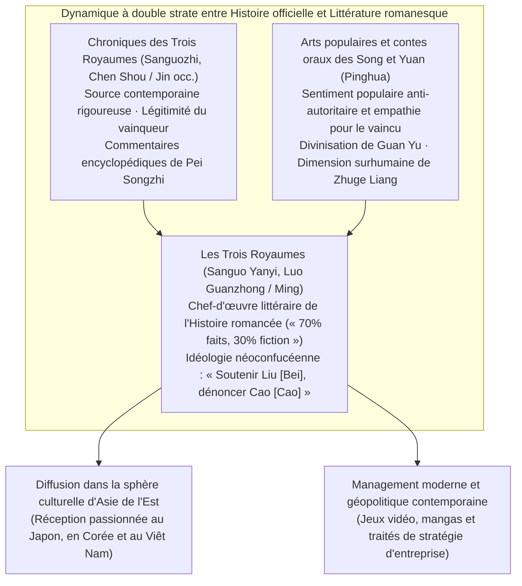
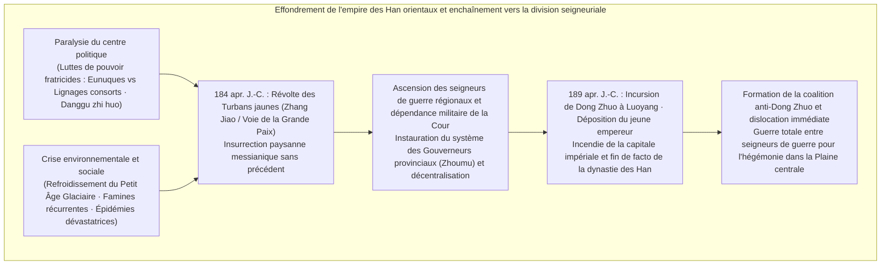
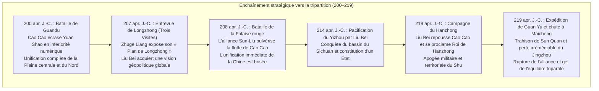
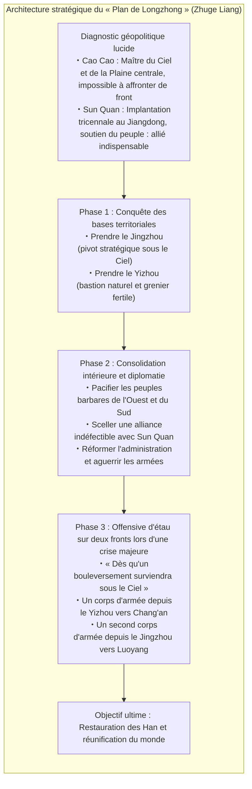
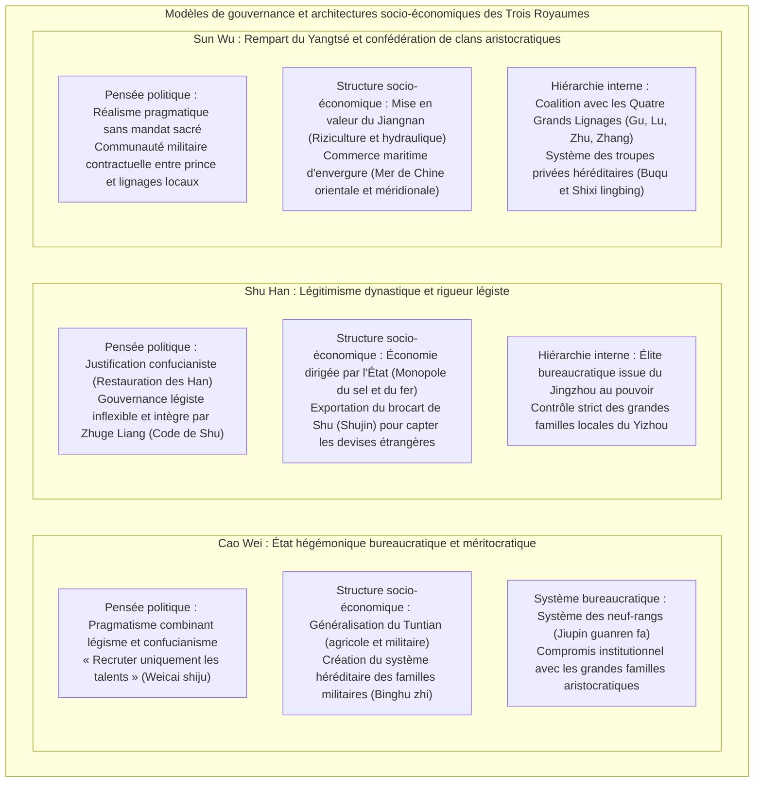

## Introduction : Pourquoi « Les Trois Royaumes » continuent-ils de fasciner l'humanité après plus de 1 800 ans ?

De la rébellion des Turbans jaunes en 184 apr. J.-C. jusqu'à la pacification de l'État de Sun Wu par la dynastie des Jin occidentaux (Western Jin) en 280 apr. J.-C., qui consacra la réunification du monde chinois, s'est écoulé près d'un siècle. Les péripéties, les triomphes et la chute de cette **« époque des Trois Royaumes » (Three Kingdoms period)**, dont le théâtre s'étendit sur l'immensité des plaines orientales du continent eurasiatique, continuent, par-delà un millénaire et huit siècles, de captiver avec une ferveur inaltérée l'imaginaire intellectuel et la passion des peuples d'Asie orientale et du monde entier.

Pourquoi donc, parmi toutes les successions dynastiques qui jalonnent la longue histoire chinoise, les bouleversements de cette période spécifique exercent-ils un champ magnétique culturel d'une telle intensité ?

La raison fondamentale réside dans le fait que l'univers des « Trois Royaumes » repose sur une **double structure inégalée** : d'une part, les **« Chroniques des Trois Royaumes » (*Sanguozhi*, rédigées par Chen Shou et annotées par Pei Songzhi)**, qui constituent la matière historique rigoureuse soumise à une critique scrupuleuse des sources ; d'autre part, le **« Roman des Trois Royaumes » (*Sanguo Yanyi*, attribué à Luo Guanzhong)**, chef-d'œuvre absolu de la fiction historique chinoise, né de l'engouement populaire millénaire, des contes oraux et du théâtre des Song et des Yuan, avant de trouver sa forme monumentale sous la dynastie Ming.



Sur le plan de la réalité historique, l'époque des Trois Royaumes fut une période d'une brutalité inouïe, marquée par l'effondrement des structures de l'empire des Han orientaux, une chute démographique vertigineuse, des dérèglements climatiques accompagnés de famines et le déchaînement ininterrompu de guerres fratricides. Alors que la population recensée atteignait près de 56 millions d'habitants à l'apogée des Han orientaux, elle s'effondra pour n'atteindre qu'environ 8 millions d'âmes à la fin de la période tripartite, en cumulant les registres des trois États du Wei, du Shu et du Wu (même en tenant compte des foyers clandestins dissimulés pour échapper à l'impôt et des masses de réfugiés errants, la dévastation de la trame sociale avait atteint un seuil paroxystique).

Cependant, c'est précisément au cœur de ce vide institutionnel et de cette lutte extrême pour la survie que surgirent, en une succession fulgurante, des **« innovations tactiques et intellectuelles »** et de véritables **« laboratoires de refondation étatique »**, pulvérisant les hiérarchies figées et les autorités traditionnelles.
- Les édits de recrutement méritocratique proclamés par Cao Cao (« recruter uniquement les talents » / *Weicai shiju*) et le système révolutionnaire des colonies agromilitaires (*Tuntian*), qui résolut le problème chronique de l'approvisionnement des armées.
- Le dessein géopolitique grandiose échafaudé par Zhuge Liang, le « Plan de Longzhong » (*Tianxia sanfen zhi ji*), permettant à une petite puissance régionale de tenir tête à un colosse impérial, adossé à un légisme inflexible et intègre.
- La mise en valeur pionnière des terres du Jiangnan entreprise par Sun Quan, abrité derrière le rempart naturel infranchissable du fleuve Yangtsé, préfigurant l'émergence d'un État commercial maritime tourné vers la mer de Chine orientale et la mer de Chine méridionale.

Et par-dessus tout, la tragédie humaine et psychologique tissée par les seigneurs de guerre, les stratèges, les généraux d'élite et les masses anonymes qui traversèrent ce siècle de feu —— le rationalisme froid et la solitude tragique de Cao Cao, la bienveillance acharnée et la ténacité viscérale de Liu Bei, la fierté chevaleresque et la fin pathétique de Guan Yu, le martyre de Zhuge Liang voué jusqu'à son dernier souffle à une cause impossible —— s'est muée en une épopée universelle résonnant bien au-delà des époques et des frontières.

La présente étude se propose de disséquer cette fresque monumentale des « Trois Royaumes ». Loin de se limiter à une énumération anecdotique ou à un simple résumé narratif, elle offre **une radiographie complète sous les angles conjugués de l'historiographie critique, de la pensée politique, de la géopolitique militaire, des institutions socio-économiques et de l'histoire de la réception littéraire**. En distinguant avec lucidité les faits avérés de la geste romanesque, nous explorerons les profondeurs de la pensée stratégique de ceux qui bravèrent l'un des plus grands chaos de l'histoire humaine.

---

## Chapitre 1 : Le crépuscule de la dynastie des Han orientaux et l’aube des seigneurs de guerre (184–200 apr. J.-C.)

L'ouverture de l'ère des Trois Royaumes s'amorça par l'auto-dissolution cataclysmique du grand empire des « Han » (Han occidentaux et Han orientaux), qui avait unifié et cimenté le monde chinois pendant plus de quatre siècles. Comment un État impérial centralisé, doté d'une puissance colossale, a-t-il pu perdre aussi rapidement sa force centripète pour laisser le champ libre à l'émancipation anarchique des potentats locaux et des chefs de guerre régionaux ? À l'origine de cette dislocation se conjuguaient de manière inextricable l'usure des institutions, la corruption endémique au sommet du pouvoir et un dérèglement climatique d'ampleur planétaire.



### 1.1 L'arrogance des eunuques et des lignages consorts, et le « Désastre des interdits partisans » : La faillite structurelle des Han orientaux

La structure politique des Han orientaux (Dong Han : 25–220 apr. J.-C.) s'était enfermée, à partir du milieu de la dynastie, dans un cercle vicieux particulièrement pervers, causé par l'accession répétée au trône d'empereurs montés enfants sur le trône.

Lorsqu'un souverain régnait dans son jeune âge, l'exercice effectif du pouvoir était accaparé par l'impératrice douairière et son clan familial, les **« parents par alliance » (*waiqi*, ou lignages consorts)**. Plus tard, à mesure que l'empereur parvenait à l'âge adulte, désireux de recouvrer l'autorité personnelle confisquée, il s'alliait aux **« eunuques » (*huanguan*)**, les seuls familiers partageant son intimité au cœur des appartements secrets du palais, pour évincer les consorts par les armes. Toutefois, une fois investie de la toute-puissance, la faction des eunuques s'abandonnait à une cupidité sans borne, plaçant parents et créatures à la tête des administrations régionales pour y multiplier concussions, extorsions et despotisme. Dès la génération suivante, un nouveau clan de consorts prenait sa revanche en purgeant les eunuques —— et cette lutte sanglante pour le pouvoir suprême se répétait sans trêve.

Face à ces dérives révoltantes, les hauts fonctionnaires formés à l'orthodoxie confucéenne et les étudiants de l'Académie impériale (*Taixue*) dénoncèrent avec véhémence la turpitude des eunuques. Ils se proclamèrent fièrement le **« Courant pur » (*Qingliu*)**, flétrissant les eunuques et leurs séides sous le terme infamant de **« Courant fangeux » (*Zhuoliu*)**.

Se sentant menacés dans leurs fondements, les chefs eunuques manipulèrent l'empereur pour lancer une vaste chasse aux sorcières, accusant les lettrés du Courant pur de constituer des factions factieuses pour conspirer contre l'État. Ce fut le tragique épisode des deux **« Désastres des interdits partisans » (*Danggu zhi huo*)**, survenus en 166 et 169 apr. J.-C. Des centaines de ministres éminents et de grands lettrés furent exécutés ou périrent sous la torture dans les geôles impériales, tandis que plusieurs milliers d'autres étaient condamnés à l'interdiction perpétuelle de toute charge publique et assignés à résidence.

Cette grande saignée politique porta un coup fatal et irréparable à la légitimité morale de la dynastie des Han. Les lignages de grands propriétaires régionaux (*haozu*) et la classe intellectuelle perdirent toute foi envers le gouvernement central et renoncèrent à soutenir des lois et des institutions corrompues jusqu'à la moelle. Dans ce vide d'autorité morale centrale, les conditions idéales d'une émergence des forces armées régionalisées et sécessionnistes s'étaient inexorablement cristallisées.

### 1.2 Refroidissement climatique, famines, épidémies et la « Révolte des Turbans jaunes »

Aux ravages de la pourriture politique vinrent s'ajouter les soubresauts brutaux de la nature.

Selon les travaux récents de la paléoclimatologie et de la démographie historique, l'Asie de l'Est entrait, entre la fin du IIe siècle et le cours du IIIe siècle, dans la phase initiale d'un cycle de refroidissement global rattaché au **« Petit Âge Glaciaire » (Little Ice Age)**. Des hivers d'une rigueur exceptionnelle alternaient avec des sécheresses estivales et des gelées tardives destructrices, anéantissant la productivité agricole des bassins nourriciers du fleuve Jaune et du fleuve Yangtsé. Par-dessus ces pénuries alimentaires extrêmes, des **pandémies d'une virulence inouïe (vraisemblablement le typhus ou la variole)** frappèrent de plein fouet des populations déjà sévèrement dénutries. Dans son poignant poème *Shuoyi Fu* (Rhapsodie sur l'épidémie), le grand poète de l'ère Jian'an, Cao Zhi, a immortalisé ce spectacle apocalyptique : « Chaque foyer porte le deuil d'un cadavre gisant dans la poussière ; chaque maison résonne de lamentations et de sanglots déchirants. »

C'est au fond de cet abîme de désespoir que surgit un maître taoïste originaire de la commanderie de Julu (dans l'actuelle province du Hebei) : **Zhang Jiao (張角)**.

Zhang Jiao fonda un vaste mouvement religieux syncrétique baptisé la **« Voie de la Grande Paix » (*Taiping Dao*, 太平道)**, mêlant les spéculations philosophiques du Huang-Lao (Huangdi et Laozi) aux croyances magiques et populaires. Il soignait les malades en leur faisant boire de l'eau consacrée contenant les cendres de talismans (*fushui*), tout en leur enjoignant de confesser publiquement leurs péchés. Auprès de centaines de milliers de paysans abandonnés de tous, affamés et décimés par la peste, ce message de salut suscita une ferveur quasi mystique. Zhang Jiao transforma rapidement ses adeptes en un réseau clandestin hautement militarisé, divisant l'ensemble du territoire de l'Empire en 36 districts militaro-religieux appelés **« Fang » (方)**, en vue d'une insurrection générale et synchronisée.

Le mot d'ordre prophétique qui galvanisa les masses est resté célèbre dans toute l'histoire chinoise :
> **« 蒼天已死、黃天當立、歲在甲子、天下大吉 »**  
> (*Le Ciel bleu est déjà mort, le Ciel jaune doit s’élever ; en cette année Jiazi, grande félicité sous le Ciel !*)

Le « Ciel bleu » (symbole de la vertu du Feu des Han) avait épuisé son mandat céleste. Il devait être remplacé par le « Ciel jaune » incarnant la vertu de la Terre. L'année 184 apr. J.-C., première année du cycle sexagésimal sous le signe de *Jiazi*, était désignée comme l'heure sacrée de la révolution.

En février 184, les insurgés arborèrent tous un bandeau jaune sur la tête comme signe de ralliement et se soulevèrent simultanément dans tout l'Empire. Ce fut la terrible **« Révolte des Turbans jaunes » (Yellow Turban Rebellion)**. L'insurrection embrasa le cœur même de l'État : le Hebei, le Henan, le Shandong. Les préfectures furent réduites en cendres, les magistrats furent massacrés ou prirent la fuite, et les armées impériales furent balayées au premier choc.

Prise de panique, la cour impériale dépêcha d'urgence ses généraux les plus compétents —— Huangfu Song (皇甫嵩), Zhu Jun (朱儁) et Lu Zhi (盧植) —— tout en levant précipitamment les interdits partisans pour s'assurer le concours de l'élite des lettrés. En outre, elle autorisa les autorités provinciales à lever des milices d'autodéfense locales. C'est à la faveur de cette contre-offensive que des figures alors obscures telles que Cao Cao, Liu Bei et Sun Jian montèrent sur la scène de l'Histoire en prenant la tête de corps de volontaires ou de troupes auxiliaires de répression.

L'insurrection principale fut brisée avant la fin de l'année 184, en grande partie à cause de la mort prématurée de Zhang Jiao emporté par la maladie, et sous les coups de boutoir des légions de Huangfu Song. Néanmoins, les débris du mouvement se muèrent en de multiples bandes autonomes de guérilleros —— telles que les rebelles du Heishan (Montagnes Noires) ou du Baibo (Vague Blanche) —— qui continuèrent d'ensanglanter le pays pendant des décennies. Désormais incapable d'assurer la sécurité publique par ses propres forces, la cour impériale promulgua en 188 apr. J.-C. une réforme institutionnelle cruciale : **la réintroduction du système des « Gouverneurs provinciaux » (*Zhoumu*, 州牧)**. En concentrant entre les mains d'un seul dignitaire l'autorité militaire, administrative et fiscale suprême d'une province entière, cette mesure fit passer sans transition les gouverneurs du statut de hauts fonctionnaires impériaux à celui de seigneurs de guerre indépendants (*Warlords*), scellant la fragmentation territoriale de l'Empire.

### 1.3 La tyrannie de Dong Zhuo et l'incendie de Luoyang : L'anéantissement de l'ordre ancien

En 189 apr. J.-C., la mort de l'empereur Ling déclencha l'affrontement paroxystique au sein du palais entre le chef des parents consorts, le général en chef He Jin (何進), et la puissante coterie des eunuques dite des « Dix Intendants » (*Shichangshi*). Désireux d'intimider ses rivaux et d'éradiquer définitivement les eunuques, He Jin commit l'imprudence fatale d'appeler à la rescousse les troupes du chef de guerre **Dong Zhuo (董卓)**, qui commandait des contingents redoutables et aguerris composés de cavaliers des tribus non-han sur les marches arides de la province de Liang (Liangzhou, au nord-ouest).

Cependant, avant même que Dong Zhuo n'atteignît les portes de la capitale, les eunuques eurent vent du complot et massacrèrent He Jin au détour d'une galerie du palais. Ivre de fureur à la nouvelle de cet attentat, la jeune garde militaire issue de la haute noblesse, menée par Yuan Shao (袁紹) et Cao Cao, fit irruption en armes dans la cité interdite et perpétra un bain de sang sans précédent, passant au fil de l'épée plus de deux mille eunuques jusqu'au dernier.

C'est au milieu de ce chaos et de cette vacance du pouvoir que Dong Zhuo fit son entrée impériale dans Luoyang. Ce soudard brutal issu des confins barbares imposa sa férule sanglante aux aristocrates et aux lettrés terrifiés. Il déposa sans ménagement le jeune empereur Shao pour introniser son demi-frère cadet, le futur empereur Xian (劉協, Liu Xie), s'arrogea le titre prestigieux de chancelier (*Xiangguo*) et instaura une effroyable dictature militaire.

Les exactions cruelles et le mépris insolent de Dong Zhuo à l'égard de toutes les conventions rituelles constituèrent un outrage intolérable pour l'élite traditionnelle des lettrés. En 190 apr. J.-C., une grande ligue féodale se leva à l'est du défilé de Hangu (Guan Dong) : la **« Coalition contre Dong Zhuo »**, présidée par Yuan Shao. De grands potentats et capitaines d'armée s'y joignirent en masse, au nombre desquels Cao Cao, Sun Jian, Yuan Shu, Qiao Mao et Bao Xin.

Confronté à cette marée d'ennemis, Dong Zhuo répliqua par une effroyable politique de la terre brûlée. Il contraignit des millions d'habitants de Luoyang, métropole raffinée et berceau de la civilisation Han depuis des siècles, à un exode forcé vers l'ancienne capitale occidentale de Chang'an (actuelle Xi'an). Avant de quitter les lieux, ses soudards pillèrent méthodiquement les trésors de l'État, profanèrent et saccagèrent les mausolées des empereurs défunts, et livrèrent aux flammes les palais majestueux, les archives impériales et les quartiers civils. Luoyang, l'une des plus éclatantes cités du monde antique, ne fut plus en quelques jours qu'un champ funeste de cendres et de ruines calcinées.

Comble de dérision, la coalition coalisée au nom du redressement dynastique s'avéra totalement incapable de porter le coup de grâce au tyran. Tétanisés par la puissance de choc des cavaliers de Dong Zhuo, la plupart des chefs de guerre refusèrent d'avancer, préférant passer leur temps en festins dispendieux et en manœuvres sournoises pour s'approprier les commanderies voisines. Lorsque Cao Cao et Sun Jian tentèrent de leur propre chef de poursuivre les fuyards, ils subirent de lourds revers faute de renforts. Minée par les rivalités intestines et les trahisons mutuelles, la coalition s'effondra d'elle-même. Les liens séculaires de l'Empire étaient à jamais rompus : la Chine sombrait dans l'anarchie pure de l'**époque des seigneurs de guerre**.

*(Quant au tyran Dong Zhuo, il périt assassiné à Chang'an en 192 apr. J.-C., victime d'une conspiration ourdie par son propre fils adoptif, le formidable Lu Bu (呂布), de concert avec le ministre Wang Yun. Sa dépouille fut jetée sur la place du marché de Chang'an et exposée à la vindicte populaire, où son cadavre adipeux servit de torche humaine pendant plusieurs jours).*

### 1.4 La lutte pour l'hégémonie dans la Plaine centrale : Grandeur et décadence des prétendants

Réduite à un champ de ruines, la Plaine centrale (*Zhongyuan*, le bassin agricole fertile s'étendant le long du cours moyen et inférieur du fleuve Jaune) devint l'arène impitoyable d'une lutte darwinienne pour la suprématie. Les principaux protagonistes qui se taillèrent des principautés sur les décombres de l'Empire furent les suivants :

- **Yuan Shao (袁紹)** : Issu de la lignée la plus illustre de son temps, célèbre pour ses « quatre générations ayant fourni trois Grands Chanceliers » (*Si shi san gong*). Après avoir écrasé son grand rival du nord, Gongsun Zan, au terme d'une guerre d'usure féroce, il unifia sous sa bannière les quatre grandes provinces du nord du fleuve Jaune (Jizhou, Qingzhou, Youzhou, Bingzhou), forgeant ainsi la machine de guerre la plus formidable de l'époque.
- **Yuan Shu (袁術)** : Cousin (ou demi-frère) de Yuan Shao. Solidement retranché dans le Huainan (nord-ouest du Yangtsé), il parvint à mettre la main sur le Sceau impérial héréditaire (*Chuanguo Yuxi*) rapporté par Sun Jian des ruines de Luoyang. Dévoré par la mégalomanie, il osa se proclamer empereur sous le nom dynastique de Zhongjia (仲家). Cet acte sacrilège le mit au ban de tout le monde chinois ; assiégé de toutes parts, il sombra dans la misère et l'agonie.
- **Sun Ce (孫策)** : Fils aîné du redoutable « Tigre du Jiangdong », Sun Jian. Surnommé le « Petit Hégémon » (*Xiao Bawang*) en référence au héros antique Xiang Yu, doté d'une bravoure martiale surhumaine et d'un charisme magnétique, il conquit en l'espace de quelques années seulement les six commanderies du Jiangdong au sud du bas-Yangtsé après la disparition de son père. Il jeta ainsi en une seule décennie les fondations territoriales inexpugnables du futur royaume de Wu. Mais en l'an 200, alors qu'il préparait une incursion vers le nord, il fut mortellement blessé par des spadassins vengeurs à l'âge de 26 ans seulement.
- **Lu Bu (呂布)** : Proclamé sans égal sous le Ciel par l'adage d'alors : « Parmi les hommes, il y a Lu Bu ; parmi les coursiers, il y a Lièvre rouge ». Guerrier légendaire à la bravoure terrifiante, mais d'une versatilité morale sans limite, il trahit successivement Ding Yuan puis Dong Zhuo avant d'errer sans patrie pour finalement dérober la province de Xuzhou à Liu Bei qui l'avait pourtant accueilli. Encerclé par les forces coalisées de Cao Cao et Liu Bei dans sa forteresse de Xiapi, trahi à son tour par ses propres officiers, il fut capturé et étranglé.
- **Liu Biao (劉表)** : Lettré confucéen réputé, il administra avec sagesse la splendide et opulente province de Jing (Jingzhou, le bassin moyen du Yangtsé). Il ouvrit ses frontières à des dizaines de milliers d'érudits et de paysans fuyant les massacres du Nord, y fit refleurir les études classiques et y maintint la paix pendant près de deux décennies. Cependant, dépourvu de vision stratégique et d'ambition guerrière pour conquérir l'Empire, il resta cantonné dans un rôle stérile de conservateur passif.
- **Liu Bei (劉備, 字 玄徳)** : Prétendant descendre en ligne directe de l'empereur Jing des Han occidentaux, il avait néanmoins grandi dans l'indigence, tissant et vendant des sandales de paille pour subvenir aux besoins de sa mère veuve. Lié par un pacte de dévouement absolu avec Guan Yu et Zhang Fei, il se vit confier la province de Xuzhou par le gouverneur Tao Qian avant d'en être dépouillé par la traîtrise de Lu Bu. Errant sans trêve d'un protecteur à l'autre —— tour à tour vassal de Gongsun Zan, de Cao Cao, de Yuan Shao puis de Liu Biao ——, dépourvu du moindre ancrage territorial fixe pendant près de vingt ans, il jouissait néanmoins d'une immense renommée pan-chinoise en raison de son extraordinaire charisme personnel et de sa fidélité proclamée aux valeurs de bienveillance et de justice (*Renyi*).

### 1.5 L'ascension de Cao Cao et la « tutelle de l'empereur Xian » : L'alliance de la légitimité suprême et du pragmatisme économique

Au milieu de cette pléthore de seigneurs de guerre rivaux, la figure qui s'imposa avec une supériorité stratégique éclatante fut celle de **Cao Cao (曹操, prénom social Mengde 孟徳)**.

Issu d'une famille d'eunuques (son grand-père adoptif était le grand eunuque influent Cao Teng), Cao Cao souffrait d'un déficit d'estime sociale aux yeux de la haute aristocratie incarnée par des dynasties mandarinales comme celle de Yuan Shao. Pourtant, Cao Cao réunissait en sa personne des talents prodigieux et complémentaires : chef de guerre hors pair, homme d'État au réalisme tranchant, et poète d'une sensibilité sublime, comptant parmi les plus grands génies littéraires de l'histoire chinoise.

Le premier coup de maître géopolitique décisif de Cao Cao survint en 196 apr. J.-C. : **l'accueil et la prise sous tutelle de l'empereur Xian** (*Fengtianzi*, 奉天子).

Après s'être enfui de Chang'an pour échapper aux exactions des lieutenants de Dong Zhuo (Li Jue et Guo Si), le jeune empereur errait affamé, en haillons, parmi les décombres calcinés de Luoyang. Suivant l'inspiration visionnaire de son éminent conseiller **Xun Yu (荀彧)**, Cao Cao accourut promptement avec ses troupes disciplinées, assura la protection du monarque et installa la cour impériale dans son propre fief militaire de Xuchang (dans l'actuelle province du Henan).

Par cette initiative politique géniale, Cao Cao s'emparait du plus formidable levier diplomatique et juridique de son époque :
> **« S'appuyer sur le Fils du Ciel pour commander aux seigneurs feudataires » (*Xie tianzi yi ling zhouhou*, 挟天子以令諸侯)**

Pour tous les autres chefs de guerre rivaux, attaquer les armées de Cao Cao revenait désormais à commettre un crime de haute trahison contre le trône impérial légitime. En tant que chef effectif de l'administration impériale (général en chef, puis Grand Chancelier ou *Chengxiang*), Cao Cao pouvait promulguer des décrets scellés du sceau impérial, disqualifier ses compétiteurs en tant que rebelles à la Couronne, et parer chacune de ses campagnes de conquête de l'aura indiscutable d'une « pacification punitive menée par l'armée régulière de l'Empire ».

Conjointement à cette légitimation politique sans égale, Cao Cao engagea une réforme économique structurelle qui révolutionna la gestion financière de la guerre : l'établissement du **système du Tuntian (屯田制, colonies agricoles de peuplement)**, conçu en 196 sous l'impulsion de ses intendants Zao Zhi et Han Hao. Toutes les terres arables abandonnées à la suite des massacres et des fuites de population furent déclarées domaines d'État. Cao Cao y rassembla les foules de réfugiés sans terre, leur fournit des bêtes de somme, des semences et des instruments aratoires étatiques, et organisa le travail de la terre sous une discipline quasi militaire. En échange de l'abandon de 50 à 60 % des récoltes à l'État sous forme de redevance, les paysans du *Tuntian* étaient totalement exemptés du service militaire ordinaire et des corvées seigneuriales arbitraires.

Grâce à cette organisation rationalisée du *Tuntian*, les forces de Cao Cao éradiquèrent définitivement la famine endémique qui paralysait toutes les armées concurrentes de la Plaine centrale. En quelques années, les greniers de Xuchang et de la province de Yan regorgèrent de millions de boisseaux de céréales (*dan*). Solidement campé sur le socle insubmersible de la légitimité politique impériale et d'une souveraineté logistique inattaquable, Cao Cao était prêt à affronter le géant du Nord, Yuan Shao, pour le combat suprême qui allait décider du destin de l'Asie orientale.

---

## Chapitre 2 : Le choc des prétendants et l’avènement de la tripartition (200–219 apr. J.-C.)

Les deux décennies comprises entre 200 et 219 apr. J.-C. constituent l'âge d'or le plus exaltant et le plus dense de toute l'histoire des Trois Royaumes. C'est durant cette période féconde que le chaos primitif des seigneurs de guerre s'est décanté pour donner naissance à la configuration tripartite définitive articulée autour du Wei, du Shu et du Wu.

Trois campagnes titanesques ont scandé cette trajectoire historique : la **bataille de Guandu (200)**, la **bataille de la Falaise rouge (208)**, et les affrontements simultanés pour **le Hanzhong et Fancheng (219)**.



### 2.1 La bataille de Guandu (200 apr. J.-C.) : Quand le renseignement et la logistique permirent à une poignée d'hommes de terrasser un colosse

En l'an 200 apr. J.-C., l'affrontement inévitable pour la domination du nord de la Chine éclata sur les bords du fleuve Jaune : la célèbre **bataille de Guandu (Battle of Guandu)**.

Les deux forces en présence présentaient une dissymétrie effrayante. D'un côté, le maître des quatre provinces septentrionales, **Yuan Shao**, alignait une armée gigantesque forte de 100 000 fantassins d'élite et de 10 000 cavaliers aguerris. De l'autre, **Cao Cao**, malgré le prestige de sa tutelle impériale, ne pouvait mobiliser sur la ligne de front qu'un corps opérationnel d'environ 20 000 à 30 000 soldats. À un contre quatre, la plupart des observateurs contemporains tenaient l'anéantissement de Cao Cao pour une certitude mathématique.

Après avoir franchi le fleuve Jaune vers le sud, les armées de Yuan Shao vinrent heurter les retranchements fortifiés établis par Cao Cao à Guandu (au nord-est de l'actuel district de Zhongmu, dans la province du Henan). La bataille s'enlisa dans une guerre de siège féroce. Yuan Shao fit ériger d'immenses monticules de terre sur lesquels il posta des archers qui faisaient pleuvoir des nuées de flèches dans le camp de Cao Cao, tout en creusant des sapes souterraines pour forcer les murailles. Cao Cao répliqua par l'ingénierie : il fabriqua des trébuchets primitifs (*fashiche*, catapultes lanceuses de pierres) qui pulvérisèrent les tours d'archers adverses et fit creuser d'immenses fossés transversaux pour neutraliser les galeries souterraines.

Toutefois, le prolongement du siège menaçait d'asphyxier le camp de Cao Cao, cruellement démuni face aux réserves inépuisables de son rival. Les approvisionnements étaient au bord de l'épuisement total, la faim et le découragement gagnaient les troupes, et Cao Cao lui-même, assailli par le doute, expédia une missive secrète à Xun Yu resté à Xuchang pour lui faire part de son désir de battre en retraite. La réponse de Xun Yu fut tranchante et sans appel : « Si vous reculez d'un seul pas aujourd'hui, le monde entier basculera dans les mains de Yuan Shao. Les forces de l'ennemi sont étirées au maximum, ses fissures vont bientôt apparaître ; c'est l'instant suprême de tenir bon ! »

C'est alors que survint le basculement décisif, déclenché par une défaillance interne dans le domaine du **renseignement stratégique et de la logistique**.

L'un des principaux stratèges de Yuan Shao, **Xu You (許攸)**, avait conseillé à son seigneur de diviser ses forces pour frapper directement Xuchang laissée sans défense. Rejeté avec mépris par Yuan Shao, et ayant appris par ailleurs que sa propre parentèle venait d'être jetée en prison dans son pays natal pour corruption financière, Xu You, furieux et désespéré, déserta nuitamment pour rejoindre le camp de Cao Cao.

Lorsqu'on annonça à Cao Cao l'arrivée inespérée de son ami d'enfance, le chancelier bondit de sa couche, oubliant même d'enfiler ses souliers et courant pieds nus dans la cour pour l'accueillir à bras ouverts. Xu You lui révéla sur-le-champ le secret le plus précieux de toute la campagne :
> « Tout le ravitaillement de l'armée de Yuan Shao —— plusieurs dizaines de milliers de chariots de céréales —— est entreposé sur ses arrières, au dépôt de **Wuchao (烏巣)**. Le général qui le garde, Chunyu Qiong, est un ivrogne imprévoyant qui néglige la surveillance. Si vous lancez une troupe d'élite de cavalerie légère pour y mettre le feu cette nuit même, l'armée colossale de Yuan Shao s'effondrera d'elle-même en moins de trois jours ! »

Cao Cao prit sa décision sans la moindre hésitation. Prenant personnellement la tête de 5 000 cavaliers légers d'élite, il leur fit arborer les bannières de l'armée de Yuan Shao, noircir leurs visages au charbon de bois et museler leurs montures au moyen de bâtonnets de bois pour éliminer tout hennissement. Se glissant à travers le dispositif de surveillance ennemi sous le manteau de la nuit, ils fondirent sur Wuchao. Au terme d'un assaut d'une furie inouïe, les sentinelles et les gardes de Chunyu Qiong furent taillés en pièces, et l'intégralité des stocks de grains, des fourrages et du matériel logistique de Yuan Shao fut la proie d'un immense brasier qui embrasa l'horizon.

La vision des flammes gigantesques illuminant le ciel de Wuchao jeta l'armée de Yuan Shao dans une panique panique irrépressible. Au même moment, deux de ses plus valeureux généraux, Zhang He (張郃) et Gao Lan, outrés par les calomnies de l'entourage de Yuan Shao, se rendirent avec leurs divisions à Cao Cao. Le front de Yuan Shao s'écroula comme un château de cartes. Totalement désemparé, Yuan Shao ne put fuir vers le nord au-delà du fleuve Jaune qu'en compagnie de son fils aîné Yuan Tan et d'une pitoyable escorte de huit cents cavaliers rescapés.

La bataille de Guandu fut bien plus qu'une brillante victoire militaire. Elle représenta le triomphe éclatant du rationalisme moderne, du mérite individuel, de la fulgurance décisionnelle et de la maîtrise du renseignement et de la logistique incarnés par Cao Cao, sur l'arrogance d'un clan aristocratique obsédé par son lignage séculaire et sourd aux conseils de la compétence. Après la mort de Yuan Shao terrassé par le chagrin et la maladie, Cao Cao liquida méthodiquement ses héritiers désunis, pacifia en 207 les confins septentrionaux en soumettant les redoutables cavaliers nomades Wuhuan lors de la fulgurante campagne du mont Bailang, et réalisa ainsi **l'unification totale et incontestée de tout le nord de la Chine**.

### 2.2 Les errances de Liu Bei et les « Trois Visites à la chaumière » : L'onde de choc géopolitique du Plan de Longzhong

Tandis que le nord s'inclinait devant l'hégémonie invincible de Cao Cao, **Liu Bei**, rejeté de province en province depuis deux décennies, s'était réfugié auprès de Liu Biao dans le Jingzhou. Relégué dans le bourg frontalier obscur de Xinye (dans l'actuel Henan), déjà âgé de plus de quarante ans, il passait ses journées à verser d'amères larmes sur ses cuisses engraissées par l'inactivité (*binrou zhi tan*, la plainte de l'embonpoint des cuisses), déplorant qu'une vie entière se fût écoulée sans qu'il eût accompli la moindre grande œuvre pour l'Empire.

Mais en l'an 207 apr. J.-C., une rencontre historique allait bouleverser de fond en comble le destin de Liu Bei et la trajectoire de l'Empire. Informé de la présence d'un esprit d'exception retiré dans une modeste chaumière au lieu-dit Longzhong, dans la périphérie de Xiangyang, Liu Bei s'y rendit en personne. Cet homme n'était autre qu'un jeune ermite de 27 ans alors totalement inconnu du monde politique : **Zhuge Liang (諸葛亮, prénom social Kongming 孔明)**.

Faisant fi de sa propre ancienneté et de sa dignité royale, Liu Bei se rendit à trois reprises successives devant la modeste masure paysanne pour solliciter humblement l'enseignement du jeune maître. Cet épisode immortel de l'histoire chinoise est désigné sous le nom des **« Trois Visites à la chaumière » (*Sangu zhi li*, 三顧草廬)**. Et c'est au fond de cette humble hutte de paille que Zhuge Liang déroula devant les yeux éblouis de Liu Bei le plan magistral qui allait modeler le destin du siècle : le célèbre **« Plan de Longzhong » (隆中対, *Longzhong Plan*)**.



L'exposé stratégique de Zhuge Liang reposait sur un réalisme géopolitique d'une lucidité absolue :
1. **Une distinction impitoyable entre amis et ennemis** : Cao Cao commande à des centaines de milliers d'hommes, détient la personne sacrée du Fils du Ciel et domine la Plaine centrale ; il est strictement impossible de l'affronter de front en plaine ouverte. Sun Quan, quant à lui, est solidement établi depuis trois générations dans les méandres du Jiangdong ; ses peuples lui sont dévoués et ses généraux sont compétents ; il faut impérativement s'allier à lui comme rempart extérieur et ne jamais faire de lui un ennemi.
2. **La sélection chirurgicale des cibles territoriales à conquérir** : La province de Jing (Jingzhou) est le véritable carrefour de l'Empire : elle communique au nord avec les fleuves Han et Mian, s'étend au sud vers les mers du Sud, s'ouvre à l'est vers les principautés de Wu et Kuaiji, et rejoint à l'ouest les terres de Ba et Shu. C'est le terrain d'action par excellence d'un grand conquérant, et pourtant son maître actuel, Liu Biao, est incapable de la préserver. La province d'益 (Yizhou, le bassin du Sichuan) est protégée par des ceintures montagneuses infranchissables et possède des milliers de lieues de plaines fertiles : c'est un « grenier naturel céleste ». Son gouverneur Liu Zhang y fait preuve d'une faiblesse notoire. Ces deux provinces doivent devenir le sanctuaire inexpugnable sur lequel Liu Bei bâtira sa puissance.
3. **L'assaut libérateur sur deux fronts lors de la rupture de l'ordre adverse** : Une fois les deux provinces conquises, il s'agira de pacifier les minorités montagnardes de l'Ouest et du Sud, de sceller une alliance de fer avec Sun Quan, puis de réformer l'administration et l'armée. Le jour où « un bouleversement éclatera sous le Ciel » (une crise politique majeure ou une révolte populaire dans le Nord de Cao Cao), Liu Bei ordonnera à un grand général de lancer les légions du Jingzhou directement vers Wan et Luoyang, tandis qu'il mènera lui-même le gros des forces de l'Yizhou à travers les défilés du Qinling vers Chang'an. Prises en étau, les populations de l'Empire accourront avec des corbeilles de vivres pour saluer la restauration de la glorieuse dynastie des Han.

Entendant ce chef-d'œuvre de stratégie globale, Liu Bei eut le sentiment que les ténèbres épaisses qui voilaient son horizon venaient de se dissiper en un éclair. Transporté d'enthousiasme, il déclara plus tard à ses proches : « Avoir trouvé Kongming m'est aussi précieux que pour un poisson de trouver l'eau (*Shuiyu zhi jiao*, 水魚の交わり) ». Le mercenaire errant et désespéré qu'était Liu Bei venait, par la grâce de ce grand visionnaire, d'être transfiguré en un authentique fondateur d'État.

### 2.3 La bataille de la Falaise rouge (208 apr. J.-C.) : Le bastion naval du Yangtsé et le point de bascule de l'Empire

À peine le Plan de Longzhong avait-il été formulé qu'à l'été de l'an 208 apr. J.-C., Cao Cao lança vers le sud sa grande expédition avec une armée déclarée de plusieurs centaines de milliers d'hommes pour soumettre l'ensemble du bassin du Yangtsé. Coup du sort funeste : Liu Biao venait de mourir, et son jeune héritier Liu Cong offrit la reddition inconditionnelle de tout le Jingzhou sans tirer une seule flèche. Surpris et désemparé, Liu Bei dut fuir précipitamment vers le sud, escortant une cohue de plus de cent mille civils refusant de se soumettre à Cao Cao. Rejoint à Dangyang par la fameuse « Cavalerie du Tigre et du Léopard » (*Hubaoqi*) lancée à bride abattue par Cao Cao, Liu Bei subit une déroute écrasante au lieu-dit Changban (長坂), ne devant son salut qu'à la fuite éperdue en abandonnant femmes et enfants. (C'est durant cet engagement désespéré que prirent naissance les légendes universelles de la charge héroïque et solitaire de Zhao Yun sauvant le nourrisson Liu Shan, et de Zhang Fei rugissant seul sur le pont de Changban pour stopper net l'avant-garde ennemie).

Réfugié à Xiakou (dans l'actuelle ville de Wuhan), Liu Bei jouait sa survie. Il décida de dépêcher Zhuge Liang en mission diplomatique extraordinaire auprès du jeune maître du Jiangdong, **Sun Quan (孫権)**.

Dans le quartier général de Sun Quan, la panique régnait. La quasi-totalité des grands dignitaires civils, menés par le prestigieux Zhang Zhao, pressaient ardemment Sun Quan de déposer les armes : « Cao Cao est investi du mandat impérial, il dispose d'une masse de plusieurs centaines de milliers d'hommes et vient de capturer toute la flotte du Jingzhou sur le haut-fleuve. Lutter est un suicide pur et simple. »

Mais Zhuge Liang trouva un allié providentiel dans la personne du grand amiral du Jiangdong, le sublime **Zhou Yu (周瑜)**, soutenu par le clairvoyant **Lu Su (魯粛)**. Devant Sun Quan encore hésitant, Zhou Yu déconstruisit impitoyablement le mythe de l'invincibilité de l'armée de Cao Cao, en dégageant quatre vulnérabilités structurelles rédhibitoires :
1. Les troupes de Cao Cao sont composées de fantassins et de cavaliers des plaines du Nord, totalement inexpérimentés et paniqués face aux exigences du combat naval.
2. Les lignes d'approvisionnement sont démesurément étirées, et les bêtes de bât manquent cruellement de fourrage dans ces zones marécageuses.
3. Après une marche forcée de plusieurs centaines de lieues en territoire hostile, les soldats sont épuisés à l'extrême, créant un terrain épidémique foudroyant.
4. L'arrière de Cao Cao dans les provinces du Nord reste exposé aux rébellions potentielles des fidèles de Ma Chao et Han Sui dans le Liangzhou.

Convaincu par cette analyse magistrale, Sun Quan dégaina son épée de parade et trancha d'un coup sec l'angle de sa table d'audience, s'écriant d'une voix tonitruante : « Que quiconque ose encore parler de reddition subisse le même sort que cette table ! » Il confia sur-le-champ le grand commandement à Zhou Yu à la tête de 30 000 marins d'élite, pour opérer leur jonction avec les rescapés de Liu Bei et remonter le fleuve Yangtsé vers l'ouest.

À l'hiver 208, au lieu-dit de la **Falaise rouge (赤壁, *Battle of Red Cliffs*)**, les deux flottes titanesques se trouvèrent face à face sur les flots tumultueux du Yangtsé.

Afin de soulager le mal de mer paralysant ses troupes nordiques, Cao Cao avait commis l'erreur tactique fatale d'amarrer ses vaisseaux de guerre les uns aux autres au moyen de chaînes de fer géantes et de recouvrir l'espace de lourdes madriers de bois pour former une immense plate-forme flottante. Avisant cette formation rigide et inflammable, le lieutenant de Zhou Yu, le vieux général **Huang Gai (黄蓋)**, échafauda la manœuvre qui allait changer le cours de l'Histoire : il fit parvenir à Cao Cao une lettre annonçant sa défection feinte, puis prépara plusieurs dizaines de navires légers d'assaut (*mengchong doujian*) gorgés de roseaux secs, de branchages huileux et de soufre hautement inflammable, dissimulés sous d'épaisses toiles de bâche.

Le soir convenu, un puissant vent du sud-est se leva sur le fleuve. Les brûlots de Huang Gai s'élancèrent à toute allure toutes voiles déployées, feignant de rejoindre la ligne de Cao Cao. À quelques centaines de mètres seulement de la flotte impériale, les marins du Jiangdong mirent simultanément le feu aux cargaisons et sautèrent dans des barques légères d'évacuation. Poussés par la bourrasque, les navires incandescents s'encastrèrent comme des météores dans la forêt de mâts de la flotte enchaînée de Cao Cao. En quelques instants, les chaînes de fer empêchèrent tout dégagement : le feu se propagea de coque en coque avec une vélocité terrifiante, et la surface du grand fleuve Yangtsé se mua en une mer de flammes dantesque. Le brasier s'étendit jusqu'aux campements terrestres dressés le long des rives, consumant hommes, chevaux et vivres.

Traumatisé par l'ampleur du désastre, Cao Cao ordonna la retraite générale. Ses colonnes en déroute s'enfoncèrent dans les marécages pestilentiels du sentier de Huarong (*Huarongdao*), où une multitude de fuyards périrent piétinés dans la boue ou emportés par la fièvre, avant de regagner péniblement le Nord.

La bataille de la Falaise rouge demeure l'une des plus célèbres confrontations navales de l'histoire universelle. Elle **brisa pour toujours le rêve d'une réunification éclair de l'Empire par Cao Cao** et donna corps, de façon irréversible, à la tripartition géopolitique prophétisée par Zhuge Liang à Longzhong.

### 2.4 La conquête du Yizhou et la lutte pour le Hanzhong (211–219 apr. J.-C.) : L'ancrage territorial du Shu Han

Au lendemain du triomphe de la Falaise rouge, Liu Bei s'empressa de pacifier et d'administrer les quatre commanderies méridionales du Jingzhou (Wuling, Changsha, Lingling, Guiyang), obtenant ainsi pour la première fois de sa vie un ancrage territorial autonome. Néanmoins, pour que le Plan de Longzhong s'accomplît, la mainmise sur le deuxième pilier de l'édifice —— la riche et vaste province montagnarde du **Yizhou (le bassin du Sichuan)** —— demeurait un impératif de vie ou de mort.

L'occasion rêvée se présenta en 211 apr. J.-C. Menacé au nord par les ambitions du seigneur théocratique Zhang Lu (chef de la secte des Cinq Boisseaux de Riz dans le bassin de Hanzhong), le gouverneur du Yizhou, Liu Zhang, commit l'imprudence d'inviter son lointain parent Liu Bei à entrer dans sa province avec son armée pour assurer sa protection. Les conseillers de Liu Bei, notamment le brillantissime stratège **Pang Tong (龐統)** et le génie tactique **Fa Zheng (法正)**, pressèrent leur maître de ne pas laisser échapper cette opportunité offerte par le Ciel.

Après de longs cas de conscience morale, Liu Bei se résolut à engager l'offensive contre Liu Zhang en 212. Bien que marquée par la perte tragique de Pang Tong, abattu d'un trait d'arbalète au défilé du Phénix déchu (Luofengpo), la campagne se conclut triomphalement en 214 lorsque les armées de Liu Bei, renforcées par les troupes de Zhuge Liang, Zhang Fei et Zhao Yun venues du Jingzhou, investirent la capitale Chengdu. Liu Zhang capitula sans effusion de sang inutile. Liu Bei s'empara de l'intégralité du Yizhou. Aux côtés de ses frères d'armes historiques se joignaient désormais des guerriers légendaires tels que le fougueux cavalier des confins barbares **Ma Chao (馬超)** et le vaillant vétéran **Huang Zhong (黄忠)** : l'État naissant disposait enfin de son ossature héroïque complète.

En 217 apr. J.-C., Liu Bei engagea la bataille suprême de sa carrière : la campagne pour la possession du **Hanzhong (漢中)**.

Le bassin de Hanzhong, enserré entre les chaînes vertigineuses du Qinling au nord et du Daba au sud, constituait le verrou stratégique absolu de tout le Sichuan. Tant que Cao Cao occupait ce bastion, une armée d'invasion pouvait dévaler vers Chengdu à tout moment : posséder le Hanzhong revenait à desserrer l'étau mortel posé sur la gorge du futur royaume de Shu.

Conduite sur le terrain avec une maestria tactique époustouflante orchestrée par Fa Zheng, la campagne connut son point d'orgue lors de la mémorable bataille du mont Dingjun (219 apr. J.-C.). Surgissant des hauteurs avec une impétuosité prodigieuse, les troupes du vieux général Huang Zhong pulvérisèrent le quartier général adverse et décapitèrent le commandant en chef des armées du Nord en Occident, le redoutable **Xiahou Yuan (夏侯淵)**, cousin et pilier de Cao Cao.

Fou de douleur et de rage, Cao Cao accourut en personne avec une immense armée de secours. Mais Liu Bei, campé au sommet de forteresses de montagne inexpugnables, refusa tout engagement rangé et harcela sans relâche les convois de ravitaillement ennemis à travers les défilés étroits. Incapable de nourrir ses troupes et conscient de l'inutilité de l'effort, Cao Cao prononça à cette occasion son mot de passe désabusé devenu proverbe : « Côtes de poulet » (*Jilei*, 鶏肋 —— « trop coriace pour en tirer de la viande, trop dommage pour être jeté ») et sonna la retraite définitive de ses armées.

À l'automne 219, maître absolu du Hanzhong, Liu Bei se fit proclamer par ses généraux et ses ministres réunis **« Roi de Hanzhong » (*Hanzhong Wang*, 漢中王)**. Le marchand de sandales de jadis venait d'égaler le statut royal du grand fondateur de la dynastie Han, Liu Bang, qui s'était jadis élancé du même Hanzhong pour conquérir l'Empire. La joie était à son comble dans le camp de Liu Bei : la troisième et ultime phase du Plan de Longzhong semblait enfin à portée de main.

### 2.5 La campagne de Guan Yu vers le nord et sa mort à Maicheng : La perte du Jingzhou et la fracture stratégique irrémédiable

Pourtant, c'est au sommet même de cette gloire éclatante que s'abattit la catastrophe irréversible qui allait sceller la perte définitive du grand dessein de restauration impériale. Le détonateur de cette tragédie fut l'offensive unilatérale lancée vers le nord par le protecteur du Jingzhou, le formidable **Guan Yu (関羽, 字 雲長)**.

À l'été 219 apr. J.-C., désireux de coordonner son action avec le triomphe de Liu Bei à Hanzhong, Guan Yu remonta le cours du fleuve Han avec la fine fleur des vétérans du Jingzhou et vint mettre un siège impitoyable devant la forteresse vitale de Fancheng (dans l'actuelle Xiangyang), défendue par le vaillant曹仁 (Cao Ren). C'est alors que des pluies torrentielles d'automne s'abattirent sans discontinuer sur la région, faisant déborder les digues du fleuve Han. Utilisant magistralement sa flottille de combat, Guan Yu encercla les sept armées de secours envoyées par Cao Cao sous le commandement du généralissime Yu Jin (于禁), submergées par les eaux de crue (*Shuiyan Qijun*). Yu Jin dut se rendre avec 30 000 hommes, tandis que le brave général Pang De, refusant d'abjurer son serment à Cao Cao, fut décapité.

Le retentissement de cette victoire fut si titanesque que l'Histoire la consacra sous l'expression : **« Sa renommée fit trembler toute la terre de Huaxia » (*Weizhen Huaxia*, 威震華夏)**. À Luoyang et Xuchang, la panique atteignit un tel degré que Cao Cao envisagea très sérieusement de transférer la capitale impériale plus au nord, au-delà du fleuve Jaune, pour se soustraire à l'assaut foudroyant de Guan Yu.

Cependant, ce triomphe spectaculaire fit éclater au grand jour la contradiction géopolitique mortelle qui minait **l'alliance contre nature entre Liu Bei et Sun Quan**.

Pour Liu Bei et Zhuge Liang, le Jingzhou était le tremplin logistique indispensable à l'invasion du Nord. Pour Sun Quan, en revanche, voir son puissant allié camper sur le moyen Yangtsé représentait une menace mortelle permanente pesant sur les reins de son royaume en aval. Dès la mort du modéré Lu Su, le nouveau chef des armées du Wu, le réaliste **Lu Meng (呂蒙)**, avait averti Sun Quan : « Si Guan Yu écrase définitivement Cao Cao, il se retournera immanquablement contre nous. C'est le moment unique de frapper sur ses arrières et de récupérer l'intégralité du fleuve ! »

Par ailleurs, si Guan Yu était un titan sur le champ de bataille, il était affligé d'une morgue et d'un orgueil insondables, affichant un mépris souverain pour les lettrés et les diplomates. Lorsque Sun Quan lui avait proposé d'unir leurs maisons en mariant son propre fils à la fille de Guan Yu, ce dernier avait insulté l'émissaire avec une violence inouïe : « Comment la fille d'un tigre pourrait-elle épouser le rejeton d'un chien sauvage ?! » En outre, Guan Yu avait humilié et menacé de sanctions de retour de campagne ses propres intendants de garnison restés à l'arrière, Mi Fang (beau-frère de Liu Bei) et Shi Ren, achevant de s'aliéner ses propres arrières.

Exploitant habilement ces failles psychologiques, Cao Cao, conseillé par Sima Yi (司馬懿) et Jiang Ji, noua une alliance militaire secrète avec Sun Quan : si le Wu frappait Guan Yu dans le dos, le Wei reconnaîtrait officiellement la souveraineté légitime de Sun Quan sur toutes les terres au sud du fleuve.

Pour endormir la vigilance du héros, Lu Meng feignit d'être terrassé par une grave maladie et quitta le front, se faisant remplacer par un jeune officier d'état-major encore totalement inconnu : **Lu Xun (陸遜)**. Flatté par les lettres mielleuses et obséquieuses que lui adressait Lu Xun, Guan Yu crut le Wu inoffensif et vida les forteresses de l'arrière de leurs garnisons pour envoyer tous les effectifs assiéger Fancheng.

Le piège se referma avec une précision machiavélique. Fin 219, Lu Meng lança ses commandos d'élite déguisés en marchands civils vêtus de blanc (*Baiyi dujiang*, 白衣渡江, la traversée en vêtements blancs) à bord d'embarcations de commerce banalisées. Ils égorgèrent les veilleurs des tours à signaux le long des berges sans donner l'alarme et investirent sans coup férir la grande forteresse de Jiangling. Écœurés par les rebuffades de Guan Yu, Mi Fang et Shi Ren ouvrirent immédiatement les portes de leurs citadelles et se rendirent à Sun Quan.

Apprenant la perte soudaine de sa base arrière et voyant ses lignes d'approvisionnement coupées, l'armée de Guan Yu se débanda sous l'effet conjugué des contre-attaques des armées du Wei menées par Xu Huang. Isolé, abandonné de tous, Guan Yu ne put se réfugier qu'avec une poignée de fidèles cavaliers dans le petit fortin de Maicheng (麦城). Tentant une ultime percée à travers les sentiers montagneux pour regagner le Sichuan, il tomba dans une embuscade tendue par les généraux de Sun Quan. Capturé avec son fils adoptif Guan Ping, il refusa fièrement de se soumettre et fut exécuté sur place. Sa tête tranchée fut envoyée par Sun Quan à Cao Cao dans un coffret de bois précieux.

La tragédie de Maicheng et **la perte irrémédiable du Jingzhou** portèrent un coup mortel et définitif à l'avenir du Shu Han :
Le pilier fondamental du Plan de Longzhong —— l'offensive simultanée en tenaille depuis le Sichuan et le Jingzhou —— venait d'être anéanti à tout jamais. Privé de la moitié de son potentiel économique et militaire, le Shu se retrouvait désormais emmuré dans les gorges abruptes du Sichuan, réduit au rang de principauté intérieure assiégée de moins d'un million d'âmes. Et la soif inextinguible de vengeance qui allait bientôt consumer Liu Bei pour laver le sang de son frère d'armes allait précipiter l'Empire dans un nouveau gouffre sanglant.

---

## Chapitre 3 : Profils comparés des Trois Royaumes —— Anatomie des institutions, de l'économie et de la puissance militaire

L'ère des Trois Royaumes ne saurait se réduire au récit pittoresque des querelles martiales entre trois grands capitaines. Elle fut avant tout un **formidable laboratoire d'expérimentation socio-politique et institutionnelle**, où trois entités étatiques divergentes, confrontées à des réalités géographiques, démographiques, ethniques et sociologiques profondément contrastées, durent inventer de nouveaux modèles d'organisation pour survivre à une lutte à mort.

Le **Cao Wei (魏)**, titan bureaucratique maître de la Chine du Nord ; le **Shu Han (蜀漢)**, réduit montagnard légiste arc-bouté sur la mémoire des Han ; et le **Sun Wu (孫吳)**, thalassocratie fluviale née d'un compromis avec les aristocraties terriennes du Jiangnan. L'analyse croisée de leurs architectures institutionnelles met en lumière les mutations profondes qui allaient féconder la civilisation chinoise jusqu'à l'aube des temps modernes.



### 3.1 Le Cao Wei : Un empire colossal fondé sur le méritocratie et l'innovation institutionnelle

En 220 apr. J.-C., après la mort de Cao Cao, son héritier légitime **Cao Pi (曹丕, empereur Wen)** contraignit le dernier empereur des Han, Xian Di, à une abdication rituelle formalisée (*shanrang*, 禅譲), et monta sur le trône impérial à Luoyang. La prestigieuse dynastie des Han s'éteignait officiellement après quatre siècles d'existence : l'Empire du **« Wei » (曹魏)** voyait le jour.

L'atout maître du royaume de Wei résidait dans sa **puissance matérielle écrasante (territoire, masse démographique et production céréalière)**, soutenue par une capacité inédite d'innovation institutionnelle affranchie des dogmes surannés.

1. **Le recrutement méritocratique : « Ne promouvoir que le talent » (*Weicai shiju*, 唯才是挙)** :
   Sous les Han, la sélection des fonctionnaires reposait sur le système du *Xiangju lixuan* (recommandation locale), fondé sur des vertus morales telles que la piété filiale (*Xiaolian*). Dans la pratique, ce mécanisme avait dégénéré en un système oligarchique de cooptation consanguine entre grandes familles aristocratiques.
   Cao Cao brisa net cette hypocrisie en publiant en 210, 214 et 217 ses célèbres **Édits de recherche des talents** : « Même si un homme est dénué de piété filiale ou de vertus morales éminentes, pourvu qu'il possède le génie de la stratégie et le sens de l'État, qu'on le présente à mes services ! » Par cette révolution méritocratique, des stratèges hétérodoxes comme Guo Jia, Jia Xu ou Cheng Yu, ainsi que d'anciens généraux ennemis capturés sur le champ de bataille —— Zhang Liao, Xu Huang, Zhang He —— furent promus aux plus hautes charges militaires et civiles sans le moindre préjugé d'origine.

2. **L'enracinement du *Tuntian* et la création du statut héréditaire des familles militaires (*Binghu zhi*, 兵戸制)** :
   Le système des colonies agricoles inauguré par Cao Cao se scinda rapidement en deux branches complémentaires : le *Mintun* (colonies civiles de réfugiés) et le *Juntian* (colonies purement militaires). Sur la ligne de front du Huainan (notamment autour de Shouchun), des centaines de milliers de soldats labouraient la terre en temps de paix et prenaient les armes en cas d'incursion du Wu, assurant sur place une autonomie logistique parfaite.
   Pour pérenniser ses effectifs, le Wei instaura en outre le **système des *Binghu*** : un registre séparé coupant juridiquement les familles de soldats des paysans ordinaires. Le métier des armes devint une charge héréditaire et inaliénable de père en fils, garantissant à l'État un vivier inépuisable et permanent de troupes de métier.

3. **Le système des Neuf Rangs (*Jiupin guanren fa*, 九品官人法)** :
   Promulguée en 220 par Cao Pi sur les conseils du grand juriste aristocrate **Chen Qun (陳羣)**, cette réforme capitale de la fonction publique instaurait dans chaque commanderie des magistrats évaluateurs désignés par le pouvoir central : les « Réviseurs impartiaux » (*Zhongzheng guan*, 中正官). Ces derniers classaient les candidats aux charges publiques en neuf échelons selon leurs compétences et leur réputation, leur ouvrant l'accès à des postes administratifs correspondants.
   Conçu à l'origine comme une transaction politique pragmatique entre le trône impérial et les grandes dynasties de lettrés dont l'Empire avait besoin pour asseoir sa légitimité, le système dévia rapidement sous le contrôle exclusif de ces mêmes lignages nobles. En quelques générations, ainsi que le déplorera l'Histoire sous l'adage célèbre : « Aux rangs supérieurs, nulle famille obscure ; aux rangs inférieurs, nulle lignée noble », ce système devint le terreau institutionnel sur lequel prospéra la toute-puissance de l'aristocratie médiévale sous les Jin et les dynasties du Nord et du Sud.

### 3.2 Le Shu Han : Un bastion montagnard sous le signe du légisme et de la légitimité dynastique

En 221 apr. J.-C., en réponse directe à l'usurpation de Cao Pi qui avait déchu la maison régnante des Han, Liu Bei se fit sacrer empereur dans sa capitale de Chengdu. Revendiquant la continuité pure et ininterrompue de la dynastie impériale légitime, le nom officiel de l'État était tout simplement **« Han »** (l'historiographie le désigne sous le nom de **Shu Han (蜀漢)** ou simplement Shu).

Le talon d'Achille existentiel du Shu Han était son **insignifiance territoriale et démographique alarmante**. Tandis que le Wei dominait plus de 60 % de la population totale du monde chinois (plus de 4,4 millions d'âmes recensées) et régnait sur des plaines à perte de vue, le Shu se trouvait confiné au fond du bassin montagneux du Sichuan et des jungles méridionales inhospitalières du Yunnan. Sa population officielle ne dépassait guère **900 000 à 1 000 000 d'habitants**, avec une armée permanente plafonnant péniblement à 100 000 soldats (soit moins du quart de la puissance brute du Wei).

Pour surmonter cette dissymétrie effrayante et éviter qu'une si petite entité ne fût broyée par son puissant rival, le chancelier et maître absolu des rouages de l'État, Zhuge Liang, appliqua une politique d'une impitoyable rigueur ancrée dans les principes du **légisme confucianisé (*Fajia*)**.

1. **Le règne inflexible de la loi : La promulgation du Code de Shu (*Shu Ke*, 蜀科)** :
   Dans les *Chroniques des Trois Royaumes*, l'historien Chen Shou brosse un éloge dithyrambique de la méthode de gouvernance de Zhuge Liang :
   > « Il fixa les règles et ordonna les statuts, distribua les charges et fit la lumière sur les faits et les mensonges. Il gardait son cœur d'une équité absolue, rendant éclatantes les récompenses et indiscutables les peines. Nul bien ne demeurait sans récompense, nul mal ne restait impuni. »
   En collaboration avec Fa Zheng et Liu Ba, Zhuge Liang rédigea le grand corpus pénal et civil du royaume : le **Code de Shu (*Shu Ke*)**. Aucun favoritisme ne venait fléchir la justice, quel que fût le rang du coupable ; mais inversement, le dévouement du plus humble était infailliblement récompensé. Cette intégrité sans faille suscita l'adhésion fervente des populations qui, loin de se révolter contre la sévérité des lois, vénéraient l'impartialité lumineuse de leur régent.

2. **Une économie dirigée d'État : Le brocart de Shu (*Shujin*) et le monopole du sel et du fer** :
   Enfermée dans ses montagnes et contrainte de financer d'onéreuses campagnes militaires vers le Nord, la principauté devait trouver des ressources financières extraordinaires :
   - **Le monopole d'État sur le brocart de Shu (*Shujin*, 蜀錦)** : Zhuge Liang fit de la confection de cette soie raffinée aux motifs chatoyants un monopole industriel d'État, concentré dans des manufactures publiques gigantesques au cœur de Chengdu (la « Cité du Brocart », Jin Guan Cheng). La réputation du brocart de Shu était telle qu'il devint un produit de luxe indispensable aux cours de ses ennemis mêmes, le Wei et le Wu. Par le truchement de réseaux marchands transfrontaliers et de contrebande tolérée, le Shu exporta massivement ses soieries dans toute la Chine, captant un flux colossal de devises étrangères (or, argent, cuivre, chevaux). Zhuge Liang reconnaissait lucidement : « Si nos magasins d'armes et nos trésors de guerre sont aujourd'hui remplis, nous le devons exclusivement au commerce du brocart ! »
   - **Le monopole du sel de puits et de la sidérurgie** : À l'instar des réformes économiques de l'empereur Wu des Han, Zhuge Liang arracha aux magnats locaux l'exploitation des mines de sel gemme (sel de puits extrait à grande profondeur au Sichuan) et des fonderies de fer pour les ériger en monopoles d'État rigides, assurant une rente fiscale directe au Trésor impérial.

3. **La fracture sourde : Faction du Jingzhou contre notables du Yizhou** :
   Malgré ces succès d'organisation, le Shu Han portait en son sein une faille sociologique inextinguible. L'appareil d'État était monopolisé par les **« émigrés du Jingzhou »** (Zhuge Liang, Jiang Wan, Fei Yi), qui s'étaient arrogé tous les postes décisionnels civils et militaires, maintenant les **« lignages autochtones du Yizhou »** (savants locaux comme Qiao Zhou) sous une surveillance stricte et à l'écart des grands choix impériaux. Cette rancœur sourde des élites terriennes locales, lasses de financer des guerres de reconquête qui ne les concernaient pas, expliquera la démission morale foudroyante qui conduira à la reddition sans combat de 263.

### 3.3 Le Sun Wu : Le bouclier du Yangtsé et la coalition des grands clans régionaux

Fort de son triomphe lors de la destruction de Guan Yu et de sa victoire sur Liu Bei à Yiling, Sun Quan prit le titre de roi de Wu en 222, avant de franchir le pas suprême en 229 en se faisant couronner empereur à Wuchang (avant de fixer sa capitale à Jianye, l'actuelle Nankin). Ce fut la naissance officielle du **royaume de Wu (孫吳, ou Wu oriental / Dong Wu)**.

À l'opposé de la bureaucratie centralisée du Wei ou du dirigisme légiste du Shu, le régime de Sun Wu ne reposait sur aucune grande ambition idéologique sacrée. Sa structure intime était celle d'un **compromis féodal permanent : une confédération militaire entre la dynastie régnante des Sun et la puissante oligarchie des grands lignages terriens du Jiangnan**.

1. **L'équation de pouvoir avec les « Quatre Grands Clans du Jiangdong » (*Jiangdong Sixing*, 江東四姓)** :
   Le sud du Yangtsé était depuis des temps immémoriaux la chasse gardée de quatre immenses clans terriens aristocratiques bénéficiant de réseaux de parentèle gigantesques : les **Gu (顧)**, les **Lu (陸)**, les **Zhu (朱)** et les **Zhang (張)**.
   Si les débuts de la conquête menée par Sun Jian et Sun Ce s'étaient faits dans le sang des aristocrates insoumis, Sun Quan fit preuve d'une souplesse diplomatique prodigieuse. Il maria ses filles et ses sœurs aux héritiers de ces clans et confia le commandement suprême des armées et la chancellerie de l'Empire aux rejetons de ces familles. L'ascension de **Lu Xun** (figure de proue du clan Lu), artisan de la défaite de Guan Yu et vainqueur d'Yiling, illustre parfaitement cette symbiose politique qui garantit la stabilité du régime pendant six décennies.

2. **La militarisation décentralisée : Les troupes privées (*Buqu*, 部曲) et le commandement héréditaire (*Shixi lingbing zhi*)** :
   Le modèle militaire du Wu était unique par son caractère privatif et décentralisé. Les généraux ne commandaient pas simplement des recrues fournies par l'État : ils montaient au front à la tête de leurs propres **« Buqu » (troupes privées, serfs et métayers militarisés attachés à leur terre)**. Lorsqu'un commandant mourait au combat ou de maladie, ses armées, ses officiers et ses terres passaient automatiquement par voie d'héritage à son fils ou à son frère cadet.
   Ce système féodal conférait aux armées du Wu une combativité furieuse en situation défensive, car chaque soldat luttait au coude-à-coude avec ses maîtres pour protéger sa propre maison et ses récoltes du Jiangnan. Revers de la médaille : dès qu'il s'agissait de franchir le Yangtsé pour monter des expéditions de conquête vers le Nord, les aristocrates rechignaient à sacrifier leurs troupes privées pour la gloire exclusive de la dynastie des Sun. C'est la raison structurelle pour laquelle le Sun Wu resta toujours **« redoutable dans la défense de son fleuve, mais d'une impuissance chronique dans l'attaque au-delà »**.

3. **La bonification pionnière du Jiangnan et l'expansion thalassocratique** :
   L'héritage historique le plus durable du royaume de Wu fut la transformation radicale du paysage économique de la Chine du Sud, jusqu'alors considérée comme une terre marécageuse barbare et impaludée :
   - **L'essor de la riziculture et l'intégration des Shanyue** : Les souverains du Wu creusèrent d'immenses canaux de dérivation, asséchèrent les marécages et mirent en place des systèmes d'irrigation modernes qui posèrent le socle du Jiangnan comme futur grenier à riz de toute l'Asie orientale. Par ailleurs, des généraux comme Lu Xun et Zhuge Ke menèrent d'incessantes campagnes de pacification contre les tribus montagnardes aborigènes insoumises, les **Shanyue (山越)**, déportant plus de cent mille guerriers et paysans dans les plaines cultivables pour servir de main-d'œuvre servile et de régiments d'infanterie d'assaut.
   - **Les grandes expéditions navales et le commerce des mers du Sud** : Maîtres absolus des techniques de construction navale, disposant de jonques colossales à plusieurs ponts capables d'embarquer des milliers d'hommes, le Wu se tourna résolument vers la mer. En 230 apr. J.-C., Sun Quan ordonna aux généraux Wei Wen et Zhuge Zhi de mener une armada de dix mille marins à la découverte des contrées insulaires lointaines de **« Yizhou » (夷洲, universellement identifiée par les historiens comme l'île de Taïwan)** et Danzhou —— constituant la première expédition maritime officielle consignée dans les annales impériales chinoises vers Taïwan. Enfin, Sun Quan établit des relations commerciales régulières s'étendant du nord du Viêt Nam (Jiaozhi) jusqu'à la péninsule malaise et les côtes de l'océan Indien, accumulant des richesses fabuleuses en perles, corail, encens et écaille de tortue.

```
【Tableau comparatif exhaustif de la puissance nationale et des institutions des Trois Royaumes (vers 260 apr. J.-C.)】
```

| Critère de comparaison | Cao Wei (魏) | Shu Han (蜀漢) | Sun Wu (孫吳) |
| :--- | :--- | :--- | :--- |
| **Capitale** | Luoyang (洛陽) | Chengdu (成都) | Jianye (建業, actuelle Nankin) |
| **Étendue territoriale** | Plaine centrale, Hebei, Shandong, Shanxi, Shaanxi, Huainan, Liaodong (env. 60 % de l'espace chinois) | Yizhou (bassin du Sichuan, Hanzhong, zones montagneuses du Yunnan et Guizhou) | Yangzhōu, sud du Jingzhou, Jiaozhou (cours moyen et inférieur du Yangtsé, Guangdong, nord du Viêt Nam) |
| **Foyers et population estimés** | **env. 660 000 foyers / 4 400 000 hab.** (env. 60 % de la population globale) | **env. 280 000 foyers / 940 000 hab.** (env. 13 % de la population globale) | **env. 520 000 foyers / 2 300 000 hab.** (env. 27 % de la population globale) |
| **Effectifs militaires permanents** | **env. 400 000 à 500 000 soldats** (infanterie aguerrie du Nord, cavalerie Wuhuan et Xianbei) | **env. 100 000 soldats** (infanterie de montagne, régiments d'arbalétriers Zhuge, gardes aux Oreilles Blanches) | **env. 230 000 soldats** (flotte navale hégémonique du Yangtsé, infanterie de choc Shanyue, troupes privées Buqu) |
| **Idéologie et régime politique** | Synthèse de légisme et de confucianisme pragmatique, méritocratie administrative, État centralisé | Revendication exclusive de la légitimité dynastique des Han, légisme institutionnel absolu (*Shu Ke*) | Coalition de compromis avec les clans aristocratiques locaux, seigneurie militaire contractuelle |
| **Système de recrutement des élites** | **Système des Neuf Rangs (*Jiupin guanren fa*)**, Édits de promotion du seul talent (*Weicai shiju*) | Choix directs et rigoureux de Zhuge Liang, promotions fondées sur la loi pénale et le mérite | Recommandations féodales par les clans aristocratiques, transmissions héréditaires de commandements |
| **Piliers économiques et fiscaux** | Céréaliculture du Nord (blé, millet), **Système du *Tuntian* (civil et militaire)**, monopoles étatiques | Riziculture irriguée du Sichuan, **Brocart de Shu (*Shujin*, exportation)**, sel de puits et fer | Riziculture et hydraulique du Jiangnan, **Grand commerce maritime méridional**, exploitation du sel marin |
| **Atouts géopolitiques majeurs** | Masse démographique écrasante, écrasante supériorité logistique, cavalerie mobile irrésistible | Forteresse naturelle inexpugnable protégée par les murailles rocheuses du Sichuan | Barrière liquide infranchissable du fleuve Yangtsé, supériorité technique absolue en guerre navale |
| **Vulnérabilités structurelles** | Émancipation oligarchique des lignages aristocratiques confisquant l'État (usurpation des Sima) | Étroitesse démographique critique, rancœurs inextinguibles entre la faction du Jingzhou et les indigènes | Pulvérisation féodale du commandement militaire (*Buqu*), inertie offensive systématique hors du fleuve |

---

## Chapitre 4 : Le testament politique de Zhuge Liang et le crépuscule des Trois Royaumes (220–280 apr. J.-C.)

Dans le demi-siècle qui suivit l'enracinement de la tripartition, les figures héroïques de la première génération disparurent successivement de la scène du monde. Ce fut l'ère crépusculaire des Trois Royaumes, où les dures lois des rapports de force matériels et l'épuisement structurel des institutions vinrent inexorablement sceller le sort des nations.

L'axe dramatique de cette période se cristallisa autour de deux dynamiques majeures : d'un côté, le défi tragique des expéditions vers le Nord menées jusqu'à son dernier souffle par le chancelier du Shu Han, **Zhuge Liang (諸葛亮)** ; de l'autre, le coup d'État militaire et l'usurpation méthodique fomentés au cœur de l'hégémon du Nord, le royaume de Wei, par le puissant **clan des Sima (司馬氏)**.

### 4.1 La guerre de représailles de Liu Bei et la bataille de Yiling (222 apr. J.-C.) : Les adieux déchirants de Baidicheng

En 221 apr. J.-C., à peine couronné empereur, Liu Bei prit pour sa première grande décision d'État la résolution irrévocable de lancer son **« expédition punitive vers l'Est » (campagne contre le Sun Wu)**, rejetant avec obstination les suppliques désespérées de Zhuge Liang et de Zhao Yun.

Liu Bei était mû à la fois par la brûlure intime de venger son frère de serment Guan Yu et de laver l'affront de la confiscation du Jingzhou, et par l'angoisse stratégique de devoir impérativement reconquérir ce couloir fluvial sans lequel le Plan de Longzhong demeurait lettre morte. Alors même qu'un nouveau drame venait d'endeuiller ses préparatifs —— l'assassinat de Zhang Fei dans son propre camp par deux de ses officiers mutinés ——, Liu Bei prit personnellement la tête de 40 000 à 50 000 vétérans aguerris, descendit le cours impétueux du Yangtsé et enfonça les lignes de défense du Wu dans un élan irrésistible.

Les premières semaines virent une avance fulgurante des forces du Shu, qui culbutèrent les avant-postes ennemis et s'emparèrent de centaines de lieues le long des rives escarpées du fleuve. Face au péril mortel, Sun Quan remit une nouvelle fois les pleins pouvoirs militaires au brillant jeune stratège **Lu Xun (陸遜)** en le nommant Grand Maréchal (*Dadudu*).

La riposte stratégique de Lu Xun consista en une **« guerre d'usure calculée et méthodique »**.
Encaissant patiemment les coups sans jamais céder aux provocations, Lu Xun s'enferma dans des places fortes inexpugnables et refusa tout engagement décisif pendant des mois entiers. Lorsque survint la canicule écrasante de l'été, l'armée de Liu Bei, contrainte de cheminer le long des défilés étroits des Trois Gorges, commit l'erreur funeste d'établir une chaîne ininterrompue de campements fortifiés sous les frondaisons épaisses des forêts montagneuses, s'étirant sur une longueur insensée de 700 lieues (près de 350 kilomètres) : ce fut le désastreux dispositif des « campements alignés » (*Lianying*, 連営).

C'était précisément le piège mortel qu'attendait Lu Xun.
En juin 222 apr. J.-C., profitant d'un vent violent qui s'engouffrait dans les gorges, Lu Xun ordonna à ses soldats d'allumer d'immenses javelles de paille enduites de poix et lança une **« attaque incendiaire généralisée et foudroyante »** coordonnée sur terre et sur l'eau. Pris au piège dans ce boyau de feu inextinguible, les campements du Shu s'embrasèrent instantanément ; privés de toute issue de secours, des dizaines de milliers de guerriers périrent brûlés vifs ou se précipitèrent dans les ravins rocheux. L'armée de Liu Bei fut littéralement pulvérisée.

Escorté par ses derniers gardes du corps, Liu Bei échappa de justesse à la capture et trouva refuge dans la forteresse de Baidicheng (actuelle cité de Yong'an), sur les marches occidentales des gorges. Ce fut la dramatique **bataille de Yiling (Battle of Yiling)**, qui figure parmi les plus célèbres désastres militaires de l'Asie antique.

Miné par l'humiliation cuisante de cette déroute et terrassé par la maladie, Liu Bei agonisa pendant de longs mois. En avril 223, sentant sa fin approcher, il fit mander Zhuge Liang à son chevet au palais de Baidicheng et lui adressa un testament politique d'une intensité poignante, passé à la postérité sous le nom de **« legs de Baidicheng » (*Baidicheng Tuogu*, 白帝城の託孤)** :
> **« Tes capacités surpassent celles de Cao Pi d'au moins dix fois ; tu sauras à coup sûr rétablir la paix dans l'Empire et accomplir notre grande œuvre d'unification. Si mon fils (Liu Shan) s'avère digne d'être soutenu, aide-le de toutes tes forces ; mais s'il se révèle incapable et sans vertu, prends toi-même la direction de l'État et monte sur le trône ! (*Jun ke ziqu zhi*, 君可自取之). »**

Dans le cadre sacré de la piété rituelle confucéenne, ordonner à un ministre de s'emparer du trône constituait une déclaration inouïe, d'une liberté morale vertigineuse. Bouleversé jusqu'au tréfonds de son être, Zhuge Liang se jeta au pied du lit d'agonie, heurtant le sol de son front jusqu'au sang, et prononça ce serment solennel :
> **« Votre sujet consacrera jusqu'au dernier souffle de ses membres la force qui lui reste ; il observera la loyauté et la pureté jusqu'à la mort, dussé-je y laisser ma vie ! »**

Liu Bei rendit l'âme. Son fils, le jeune et insouciant Liu Shan (劉禅, âgé de 17 ans), monta sur le trône impérial. Désormais seul face au gouffre, portant le deuil d'une armée anéantie et entouré d'ennemis aux frontières, Zhuge Liang chargeait sur ses frêles épaules le poids écrasant de la survie de la dynastie des Han.

### 4.2 L'expédition vers le Sud (« Dompter les cœurs ») et le chef-d'œuvre littéraire de la « Requête avant de partir en campagne » (*Chushi Biao*)

La première urgence politique pour Zhuge Liang fut de **ressouder l'alliance militaire avec le Sun Wu**. Il dépêcha à Jianye un diplomate d'une remarquable subtilité, Deng Zhi (鄧芝), qui persuada Sun Quan que le Wei constituait le danger absolu pour les deux maisons, et que Shu et Wu devaient faire front commun comme les « lèvres et les dents » (*chunzhi*).

Le second défi résidait dans l'embrasement des marches méridionales du Nanzhong (actuelles provinces du Yunnan, Guizhou et sud du Sichuan), où les chefs tribaux et les potentats locaux, profitant de la déroute de Liu Bei, s'étaient révoltés en masse.

Au printemps 225 apr. J.-C., Zhuge Liang prit personnellement la tête du corps expéditionnaire vers le Sud. C'est avant de franchir le fleuve Lu (Yangtsé supérieur) que son conseiller et disciple Ma Su (馬謖) lui soumit une maxime devenue la règle d'or de toutes les guerres contre-insurrectionnelles (COIN) dans la tradition stratégique chinoise :
> **« L'attaque des cœurs est supérieure à l'attaque des cités ; la guerre psychologique est supérieure à la guerre des armes (*Gongxin weishang, gongcheng weixia ; xinzhan weishang, bingzhan weixia*, 攻心為上、攻城為下) ».**

Zhuge Liang appliqua ce précepte à la lettre. S'emparant du grand chef indigène **Meng Huo (孟獲)**, il lui fit visiter le camp impérial et le libéra à chaque capture, jusqu'à ce que son adversaire capitulât de son plein gré (matrice historique du célèbre épisode romanesque des « Sept captures et sept libérations » / *Qizong qiqin*). Ému aux larmes par cette mansuétude royale, Meng Huo jura solennellement : « Monseigneur déploie la majesté du Ciel ; les hommes du Sud ne se révolteront plus jamais ! »

Refusant de laisser une armée d'occupation dans ces contrées inhospitalières, Zhuge Liang confia l'administration locale aux chefs de tribus indigènes ralliés. En pacifiant cette frontière sans verser de sang inutile, il s'assura non seulement la sécurité de ses arrières, mais fit affluer dans les coffres de Chengdu l'or, l'argent, le fer, la laque, le thé, ainsi que de robustes chevaux de guerre et des contingents montagnards d'élite indispensables à l'armée du Shu.

De retour à Chengdu à la fin de 227 apr. J.-C., Zhuge Liang résolut de s'élancer enfin vers le combat de sa vie : **les « Expéditions vers le Nord » (*Beifa*) contre le royaume de Wei**. À la veille de franchir la frontière, il présenta au jeune empereur Liu Shan un mémoire politique qui compte parmi les sommets immortels de la prose classique chinoise : la première **« Requête avant de partir en campagne » (*Qian Chushi Biao*, 前出師表)** :

> « Le feu Souverain n'avait point encore accompli la moitié de sa fondation qu'il s'est éteint au milieu du chemin. Aujourd'hui, l'Empire est divisé en trois, et notre Yizhou est exsangue ; c'est en vérité l'heure la plus critique où se décide la vie ou la mort de notre État... »

Exprimant sa dévotion indéfectible à la mémoire de Liu Bei, exhortant le souverain à faire régner la vertu, à bannir les flatteurs corrompus et à écouter les sages conseillers, ce texte magnifique fit écrire aux générations ultérieures : « Celui qui peut lire le *Chushi Biao* sans verser de larmes est à jamais dénué de piété filiale et de loyauté. »

### 4.3 Les cinq expéditions vers le Nord (228–234 apr. J.-C.) : Une étoile s'éteint dans la plaine de Wuzhang

Entre le printemps 228 et l'automne 234 apr. J.-C., Zhuge Liang lança pas moins de **cinq grandes expéditions vers le Nord (Northern Expeditions)** à travers la muraille rocheuse des monts Qinling.

Pour une modeste principauté montagnarde affrontant un colosse quatre fois plus peuplé, une telle offensive répétée pouvait sembler insensée. Pourtant, Zhuge Liang obéissait à une doctrine de défense active implacable : « Si un petit État se recroqueville frileusement derrière ses montagnes, le fossé de puissance avec le géant ne fera que se creuser chaque jour, et il ne lui restera qu'à attendre passivement sa destruction. Attaquer est l'unique manière de préserver notre survie. »

```
【Les Cinq Expéditions vers le Nord de Zhuge Liang】
・1re expédition (printemps 228) : Offensive fulgurante dans le Longyou (sud du Gansu actuel). Les trois commanderies de Tianshui, Nan'an et Anding se rallient au Shu. Ralliement du jeune et brillant officier Jiang Wei. Cependant, à la bataille de Jieting, Ma Su désobéit aux ordres, s'isole au sommet d'une colline aride et se fait anéantir par le général Zhang He. Zhuge Liang doit sonner la retraite générale et ordonne, la mort dans l'âme, l'exécution de son cher disciple : « Pleurer en faisant décapiter Ma Su » (揮涙斬馬謖, Huilui zhan Ma Su).
・2e expédition (hiver 228) : Siège de la forteresse de Chencang. La garnison du Wei, héroïquement retranchée derrière les fortifications géniales de Hao Zhao, repousse tous les assauts. À court de vivres, l'armée du Shu bat en retraite et abat au passage le général poursuivant Wang Shuang.
・3e expédition (printemps 229) : Conquête méthodique des deux commanderies stratégiques de Wudu et Yinping, définitivement annexées au territoire du Shu.
・4e expédition (printemps 231) : Première utilisation opérationnelle des « Bœufs de bois » (Muniu). Siège du mont Qi et affrontement direct avec le nouveau généralissime du Wei, Sima Yi (prénom social Zhongda). Victoire tactique de Zhuge Liang à Shanggui ; mais sur les arrières, le ministre Li Yan retarde l'acheminement des grains et invente des prétextes frauduleux, forçant Zhuge Liang à rebrousser chemin. Dans la défilé de Mumen, l'arrière-garde du Shu tend une embuscade et abat d'une volée de flèches le vétéran le plus redouté du Wei, Zhang He.
・5e expédition (printemps 234) : Sortie par la vallée de Xiegu avec les « Chevaux fluides » (Liuma). Établissement d'un immense camp retranché dans la plaine de Wuzhang (Wuzhangyuan, province du Shaanxi). Zhuge Liang organise des colonies agricoles de Tuntian au milieu des paysans locaux pour s'installer dans une guerre d'usure permanente en face des lignes de Sima Yi.
```

Le pire ennemi de ces expéditions vers le Nord, bien plus que la vaillance des légions du Wei, résidait dans **l'insurmontable défi logistique du transport des grains à travers les abruptes gorges du Qinling**. Chaque porteur de sac de céréales consommait lui-même la majeure partie de sa charge au cours de son pénible voyage à pied le long des sentiers en corniche suspendus au-dessus des précipices. Pour desserrer ce goulot d'étranglement logistique, Zhuge Liang conçut deux chefs-d'œuvre d'ingénierie mécanique : les **« Bœufs de bois » (*Muniu*, 木牛)** et les **« Chevaux fluides » (*Liuma*, 流馬)**. Il s'agissait selon toute vraisemblance de brouettes et de chariots de portage à engrenages ingénieux et à bras de levier articulés, permettant à un seul homme de hisser sans effort de lourdes charges à travers les défilés rocheux les plus escarpés.

En 234 apr. J.-C., lors de sa cinquième expédition, Zhuge Liang établit son quartier général sur les hauteurs de la **plaine de Wuzhang (Wuzhangyuan)**, au sud de la rivière Wei. Là, il fit cultiver les terres par ses soldats au milieu des paysans indigènes, préparant une présence militaire permanente aux portes de Chang'an.

En face de lui, le maréchal du Wei, **Sima Yi (司馬懿, prénom social Zhongda 仲達)**, redoutant par-dessus tout le génie tactique de son adversaire, s'enferma dans une stratégie de stricte passivité défensive. Verrouillant hermétiquement ses camps fortifiés, il refusa obstinément toute bataille en rase campagne. Lorsque Zhuge Liang, cherchant à le provoquer, lui fit livrer un paquet contenant des parures et des vêtements de femme pour le railler comme un couard tremblant dans son camp, Sima Yi accueillit le présent avec un sourire impassible. Interrogeant l'émissaire du Shu sur les habitudes quotidiennes de son maître, Sima Yi apprit que Zhuge Liang se levait à l'aube, se couchait fort avant dans la nuit, vérifiait en personne toutes les sanctions pénales dépassant vingt coups de bâton, et n'avalait que quelques cuillerées de gruau par repas. Sima Yi murmura alors à ses officiers : « Zhuge Kongming mange fort peu et se surcharge d'un labeur infini ; comment un homme pourrait-il survivre longtemps à un tel régime ? »

La prédiction fut impitoyablement vérifiée. Épuisé par un surmenage surhumain et rongé par l'angoisse de voir son œuvre inachevée, Zhuge Liang vit ses forces décliner. Dans la nuit du 23 août 234, sous la voûte étoilée de la plaine de Wuzhang, le grand chancelier rendit son dernier soupir au milieu de son camp de campagne, à l'âge de 54 ans.

Après son trépas, l'armée du Shu, se conformant scrupuleusement aux instructions secrètes dictées sur son lit de mort, dissimula son deuil et entama une retraite méthodique et silencieuse. Averti du repli, Sima Yi s'élança à bride abattue pour écraser les fuyards ; mais lorsque les bannières du Shu firent subitement volte-face et se rangèrent en bataille au son des tambours, Sima Yi crut que Zhuge Liang avait feint sa propre mort pour lui tendre un piège mortel. Pris de panique, il sonna précipitamment la retraite générale. Cet épisode donna naissance au célèbre proverbe : **« Un Kongming mort met en fuite un Zhongda vivant » (*Si Kongming zou sheng Zhongda*, 死せる孔明、生ける仲達を走らす)**.

Zhuge Liang ne parvint jamais à reconquérir l'ancienne capitale de Chang'an. Cependant, sa pureté morale, son dévouement absolu jusqu'au sacrifice suprême et la brillance de son esprit stratégique conférèrent à sa défaite une grandeur morale éclatante qui éclipsa la gloire matérielle des vainqueurs, hissant sa mémoire au rang d'idéal éthique éternel de toute la civilisation d'Asie orientale.

### 4.4 L'implosion du Cao Wei et l'usurpation du clan Sima

Une fois disparu leur adversaire le plus redouté, les structures politiques de l'empire du Wei furent ébranlées par une sourde révolution de palais.

Après la disparition précoce de Cao Pi puis de son fils l'empereur Ming (Cao Rui), le trône échut en 239 à un enfant de huit ans, Cao Fang. La régence fut confiée conjointement au prince impérial **Cao Shuang (曹爽)** et au vieux maréchal **Sima Yi**.

Ivre d'orgueil, Cao Shuang écarta les grandes lignées aristocratiques, confisqua tous les rouages de l'État pour ses familiers et relégua Sima Yi au rang purement honorifique de Grand Tuteur (*Taifu*). Loin de protester, le vieux Sima Yi feignit une sénilité avancée : tremblant, incapable d'entendre, bavant ses bouillons médicinaux sur sa robe devant les espions ennemis, il endormit totalement la méfiance de la cour.

En janvier 249 apr. J.-C., profitant de ce que Cao Shuang et le jeune empereur s'étaient absentés de la capitale pour visiter les tombeaux impériaux de Gaopingling, Sima Yi, alors âgé de 70 ans, sortit de l'ombre avec la fulgurance d'un rapace. Ce fut l'**« Incident des tombes de Gaoping » (*Gaopingling zhi bian*, 高平陵の変)**. S'emparant des portes de Luoyang avec ses fidèles et les vétérans de l'armée, il fit fermer les arsenaux, promit la vie sauve à Cao Shuang s'il capitulait, puis, sitôt les armes déposées, fit exterminer sans pitié toute la faction de Cao Shuang jusqu'à la troisième génération pour crime de lèse-majesté. Le pouvoir absolu du Wei venait de basculer dans les mains du clan Sima.

À la mort de Sima Yi, ses fils **Sima Shi (司馬師)** puis **Sima Zhao (司馬昭)** affermirent cette mainmise implacable. Les souverains du Wei n'étaient plus que des fantoches terrorisés. En 260 apr. J.-C., l'empereur légitime Cao Mao, révolté par cette tutelle humiliante, s'écria : « Les intentions de Sima Zhao, les passants dans la rue même les connaissent tous ! (*Sima Zhao zhi xin, luren jie zhi*) ». Prenant une épée, le jeune monarque chargea avec ses quelques gardes vers la résidence de Sima Zhao ; il fut massacré en plein jour sous les yeux du peuple par les spadassins du ministre. La dynastie des Cao était morte dans les cœurs.

### 4.5 La chute des Trois Royaumes et l'unification sous les Jin occidentaux (263–280 apr. J.-C.)

Pour parachever la transition dynastique et asseoir sa légitimité par une victoire militaire éclatante, Sima Zhao décida de porter le coup fatal à la plus fragile des principautés : **l'invasion du Shu Han**.

Au Shu, le valeureux disciple de Zhuge Liang, le généralissime **Jiang Wei (姜維)**, s'était obstiné à lancer pas moins de onze expéditions vers le Nord ; mais ces campagnes stériles avaient épuisé les dernières forces d'un pays ruiné. À Chengdu, l'empereur Liu Shan s'abandonnait aux voluptés sous l'influence délétère de son eunuque favori Huang Hao, tandis que les élites locales refusaient tout nouvel effort fiscal.

En 263 apr. J.-C., Sima Zhao mobilisa une armée de 180 000 hommes sous les ordres de Zhong Hui et de **Deng Ai (鄧艾)**. Tandis que Jiang Wei s'enfermait dans la passe imprenable de **Jiange (剣閣)**, clouant sur place les cent mille soldats de Zhong Hui, Deng Ai réalisa une prouesse tactique qui stupéfia les annales militaires mondiales.

Contournant le front par les cimes vertigineuses des **montagnes de Yinping (陰平)** réputées infranchissables pour une armée, Deng Ai guida ses troupes à travers 700 lieues de solitudes rocheuses sans chemin tracé. Pour descendre des falaises à pic, les officiers et les soldats s'enroulèrent dans des couvertures de feutre et se laissèrent rouler dans les abîmes. Surgissant comme des fantômes sur les arrières de Chengdu, Deng Ai tailla en pièces les dernières troupes de réserve à Mianzhu.

Prise de panique, la cour de Chengdu capitula sans livrer bataille, sur les conseils du lettré pacifiste Qiao Zhou. **En 263 apr. J.-C., le royaume de Shu Han s'éteignait après 43 ans d'existence.**

En 265 apr. J.-C., après la disparition de Sima Zhao, son fils aîné **Sima Yan (司馬炎, empereur Wu des Jin)** écarta sans ménagement le dernier empereur du Wei, Cao Huan, et fonda la dynastie des **Jin (西晋, Jin occidentaux)**.

Il ne restait plus que le royaume de Sun Wu. Miné par le despotisme sanguinaire et les débauches sadiques de son quatrième empereur, le tyran **Sun Hao (孫晧)**, le Wu s'était vidé de toute substance morale. En 280 apr. J.-C., l'empereur Wu des Jin déploya une armada formidable de 200 000 hommes sur terre et sur l'eau. Tandis que le maréchal Du Yu balayait les défenses terrestres avec une vélocité foudroyante —— donnant naissance à l'expression « la force qui fend le bambou » (*Poju zhi shi*, 破竹の勢い) ——, l'immense flotte de combat construite au Sichuan par le général **Wang Jun (王濬)** descendit le cours du Yangtsé. Les immenses chaînes de fer immergées que les ingénieurs du Wu avaient tendues en travers des passes du fleuve furent fondues et sectionnées par Wang Jun grâce à de gigantesques radeaux enflammés enduits d'huile de résine. Arrivée sous les remparts de Jianye, la flotte des Jin reçut la reddition sans condition de Sun Hao enchaîné.

**Quatre-vingt-seize ans** après la déflagration des Turbans jaunes de 184, la terre de Chine, déchirée pendant près d'un siècle par les guerres intestines, se retrouvait enfin réunifiée sous le sceptre des Jin occidentaux.

---

## Chapitre 5 : Chroniques officielles (*Sanguozhi*) contre Fiction romanesque (*Sanguo Yanyi*) —— La dissection de l'Histoire et du Mythe

Près de 90 % des représentations que le public contemporain entretient à propos de l'épopée des Trois Royaumes dérivent en ligne directe du célèbre monument littéraire rédigé au début de la dynastie Ming (XIVe siècle) par **Luo Guanzhong (羅貫中)** : le **« Roman des Trois Royaumes » (*Sanguo Yanyi*, 三国志演義)**.

Pourtant, dès que l'on applique le scalpel de la critique historique rigoureuse, un abîme vertigineux se découvre entre la réalité des faits et la transfiguration légendaire. Comme le résumait avec une rare pénétration le grand critique littéraire des Qing, Zhang Xuecheng, par sa célèbre formule **« Sept parts de vérité, trois parts de fiction » (*Qi shi san xu*, 七実三虚)**, le roman a préservé l'ossature générale des événements politiques et militaires, mais a réinventé en profondeur la psychologie, la moralité et les actes des protagonistes pour satisfaire à des exigences d'efficacité dramatique et à une idéologie politique bien précise.

Le présent chapitre met en vis-à-vis la source primaire fondamentale rédigée au IIIe siècle par l'historien **Chen Shou (陳寿)** —— les **« Chroniques des Trois Royaumes » (*Sanguozhi*, 正史『三国志』)** —— et le roman épique de Luo Guanzhong, afin d'élucider la fabrique du mythe et les rouages par lesquels la fiction a supplanté la mémoire de l'Histoire.

### 5.1 Le contexte d'écriture de Chen Shou et les « Annotations » de Pei Songzhi : L'essor de l'historiographie

Chen Shou (233–297 apr. J.-C.), l'auteur des Chroniques officielles, était originaire de la commanderie de Baxi dans l'Yizhou. Magistrat au service du Shu Han, il avait été formé auprès du grand lettré Qiao Zhou, disciple direct de la tradition intellectuelle de Zhuge Liang. Après la chute de son pays en 263, il passa au service des Jin occidentaux et devint historiographe impérial (*Zhuzuo lang*). C'est à titre privé qu'il rédigea son monumental ouvrage comprenant le *Livre des Wei* (30 rouleaux), le *Livre des Shu* (15 rouleaux) et le *Livre des Wu* (20 rouleaux), formant un ensemble de 65 volumes.

La position politique de Chen Shou était particulièrement délicate.
La dynastie des Jin occidentaux tirait sa légitimité de l'abdication formelle consentie par le Wei. Pour Chen Shou, consacrer la souveraineté légitime des Jin exigeait impérativement de reconnaître le **« Wei comme la seule dynastie impériale légitime »**. C'est pourquoi, dans les annales officielles du *Sanguozhi*, seuls les souverains successifs du Wei (Cao Cao, Cao Pi, Cao Rui, etc.) bénéficient du traitement réservé aux Fils du Ciel sous la rubrique des « Annales fondamentales » (*Benji*), tandis que Liu Bei n'est désigné que sous le titre de « Premier Maître » (*Xianzhu*) et Sun Quan sous celui de « Maître du Wu » (*Wuzhu*), relégués formellement au statut de biographies exemplaires (*Liezhuan*) à l'égal de simples vassaux.

Pourtant, Chen Shou ne dissimula jamais son attachement intime et son respect ému pour son ancienne patrie du Shu Han. Il dépeignit Liu Bei avec une noblesse souveraine et consacra à Zhuge Liang un volume entier magnifiant son intégrité, un honneur rarissime pour un ministre dans l'historiographie chinoise. La concision, l'élégance sobre et l'objectivité impartiale de sa plume valurent à Chen Shou d'être célébré aux côtés de Sima Qian (*Shiji*) et de Ban Gu (*Hanshu*) comme l'un des plus grands historiens de la Chine classique.

Néanmoins, la rigueur lapidaire de Chen Shou laissait dans l'ombre une multitude d'événements majeurs et passait sous silence des récits divergents consignés dans d'autres principautés. C'est pourquoi, quelque 130 années plus tard, sous la dynastie des Song du Sud de la période des dynasties du Sud et du Nord, l'empereur Wen ordonna à l'érudit **Pei Songzhi (裴松之, 372–451 apr. J.-C.)** de réunir tous les témoignages disparus pour enrichir le texte primitif.
Pei Songzhi réalisa un travail encyclopédique prodigieux (les célèbres **Annotations de Pei Songzhi**, *Pei Zhu*), compulsant plus de 140 sources documentaires de l'époque aujourd'hui totalement perdues —— mémoires privés, généalogies de familles illustres, recueils d'anecdotes, pamphlets et correspondances secrètes. Le volume textuel de ces notes dépasse de loin la taille du texte d'origine de Chen Shou. En intégrant des voix contradictoires, y compris des démentis formels portés contre certaines assertions de Chen Shou, Pei Songzhi offrit à la postérité une fresque historique d'une résolution et d'une richesse documentaire inestimables.

### 5.2 Pourquoi Liu Bei devint-il le Juste et Cao Cao le Traître ? : L'histoire intellectuelle du mot d'ordre « Soutenir Liu, dénoncer Cao »

L'idéologie absolue qui innerve chaque page du *Roman des Trois Royaumes* se résume en une formule : **« Soutenir Liu, dénoncer Cao » (*Yong Liu Fan Cao*, 擁劉反曹)** —— glorifier Liu Bei comme l'archétype immaculé de la justice et de la légitimité, tout en vouant Cao Cao aux gémonies comme le parangon de la duplicité, du machiavélisme et de l'usurpation sacrilège.
D'où provient cette polarisation manichéenne si tranchée ?

Elle s'enracine au confluent des **traumatismes historiques collectifs** qui ont frappé la nation chinoise des Tang aux Ming :

1. **La culture orale populaire (*Pinghua*) et l'empathie pour les vaincus** :
   Dès la dynastie Tang, des poètes comme Li Shangyin rapportent que dans les ruelles populaires, les enfants écoutaient la bouche bée les conteurs publics de foire : « S'ils entendaient que Liu Bei avait été battu, ils versaient d'abondantes larmes et fronçaient les sourcils ; mais s'ils apprenaient que Cao Cao avait été mis en déroute, ils applaudissaient et trépignaient d'allégresse ». Dans l'inconscient populaire, l'homme de peu qui persévère au nom de la vertu suscite une tendresse fraternelle, tandis que le maître impérieux et arrogant concentre toutes les rancœurs sociales.
2. **Le néoconfucianisme des Song du Sud et le renversement de la légitimité** :
   Le tournant théologique décisif se produisit au XIIe siècle sous les Song du Sud. Chassée du Nord de la Chine par l'invasion des barbares Jin (Jurchen) et repliée dans le bassin méridional du Yangtsé, l'intelligentsia Han avait un besoin existentiel d'une doctrine politique affirmant que la légitimité impériale ne résidait pas dans la possession matérielle de la Plaine centrale, mais dans la pureté de la filiation morale et dynastique.
   Le maître suprême du néoconfucianisme, **Zhu Xi (朱熹)**, formula dans son *Zizhi Tongjian Gangmu* (Abrégé du Miroir universel pour aider à gouverner) un réquisitoire implacable : il renversa le statut officiel du Wei pour proclamer solennellement que **« seul le Shu Han représentait la continuation légitime de la souveraineté chinoise »**. Cao Cao fut dès lors flétri du stigmate infamant d'usurpateur illégitime, tandis que Liu Bei et Zhuge Liang devenaient les champions sacrés de la Rectitude (*Daoyi*).
3. **Le récit national de renaissance sous les Ming** :
   Lorsque les Han secouèrent le joug mongol des Yuan pour fonder la dynastie Ming au XIVe siècle, Luo Guanzhong synthétisa les contes populaires oraux des saltimbanques (*Sanguozhi Pinghua*) et la matière historique savante, forgeant le monument littéraire achevé du *Sanguo Yanyi* comme le grand miroir moral de la loyauté monarchique confucéenne.

### 5.3 Dissection des épisodes les plus emblématiques : La vérité nue derrière la légende

Comment la fiction romanesque a-t-elle métamorphosé la réalité brute des événements ? Analysons quatre épisodes universellement célèbres.

#### ① La réalité du « Serment du Jardin des pêchers »
- **La légende romanesque** : Au premier chapitre du roman, Liu Bei, Guan Yu et Zhang Fei se rencontrent dans une auberge de Zhuojun, se découvrent une communion d'âme et célèbrent dans le verger fleuri de pêchers de Zhang Fei un sacrifice aux esprits du Ciel et de la Terre, jurant : « Bien que nés en des jours différents, nous demandons à mourir en la même année, le même mois et le même jour ! »
- **La réalité historique** : **Aucune trace d'un serment dans un jardin des pêchers n'existe dans les textes d'époque**. La biographie officielle de Guan Yu dans le *Sanguozhi* précise simplement que « Liu Bei partageait sa couche avec Guan Yu et Zhang Fei, et son affection pour eux était semblable à celle qui unit des frères de sang ». Luo Guanzhong a matérialisé cette proximité affective en projetant les rituels de confrérie jurée (*jieyi*) caractéristiques des sociétés secrètes et des guildes urbaines des dynasties Song, Yuan et Ming.

#### ② La déconstruction du mythe de la « Falaise rouge »
La bataille de la Falaise rouge concentre le plus formidable empilement de récits imaginaires du roman.
- **La ruse des bateaux de paille pour dérober des flèches (*Caochuan jiejian*)** : Dans le roman, Zhuge Liang profite d'une nuit de brume épaisse pour envoyer une flottille garnie de mannequins de paille vers les rives de Cao Cao. Tétanisé par la peur d'une attaque surprise, Cao Cao ordonne à ses archers de cribler les ombres de flèches, fournissant ainsi sans coup férir plus de 100 000 traits à Zhuge Liang.  
  $
ightarrow$ **Réalité historique** : Cette ruse n'appartient en rien à Zhuge Liang. Elle s'inspire d'un événement survenu cinq ans plus tard, en 213 apr. J.-C., lors de la bataille de Ruxukou : **Sun Quan** s'étant approché en personne à bord d'un grand navire pour observer les positions ennemies, son bâtiment fut criblé de flèches sur un flanc et commença à gîter dangereusement ; Sun Quan fit alors pivoter le navire pour exposer l'autre flanc aux traits, rétablit l'équilibre et regagna son camp. Luo Guanzhong a purement et simplement subtilisé cet exploit à Sun Quan pour l'attribuer au génie de Zhuge Liang.
- **L'invocation du vent du Sud-Est (*Jiedongfeng*)** : Dans le roman, Zhuge Liang érige un autel aux Sept Étoiles et, vêtu de la robe rituelle d'un prêtre taoïste, conjure magiquement les éléments pour faire souffler la bourrasque indispensable à l'attaque incendiaire.  
  $
ightarrow$ **Réalité historique** : Pure affabulation féerique. Zhuge Liang ne disposait d'aucun pouvoir thaumaturgique ; Zhou Yu et les navigateurs chevronnés du Jiangdong connaissaient parfaitement les lois météorologiques locales du bassin moyen du Yangtsé, où des inversions de température créent au début de l'hiver de brèves sautes de vent temporaires soufflant du sud-est.
- **Le dénigrement jaloux de Zhou Yu face au surhomme Zhuge Liang** : Dans le roman, Zhou Yu est peint comme un jeune général orgueilleux et maladivement envieux du talent de Zhuge Liang, mourant de dépit en crachant du sang avec son fameux cri d'agonie : « Le Ciel ayant déjà fait naître Zhou Yu, pourquoi fallut-il qu'il fît aussi naître Zhuge Liang ?! »  
  $
ightarrow$ **Réalité historique** : Le Zhou Yu authentique de l'Histoire était un esprit d'une magnanimité princière, loué par ses contemporains pour son aménité, sa prestance majestueuse et sa beauté physique sans pareille (*Mei Zhoulang*). La victoire historique de la Falaise rouge lui revient **à 100 %, conjointement avec Huang Gai et Lu Su**. Pendant ce temps, Zhuge Liang n'était qu'un envoyé diplomatique qui, sitôt l'accord d'alliance conclu, était rentré en arrière-garde s'occuper de logistique, sans jamais avoir commandé le moindre navire au combat.
- **La passe de Huarong : Guan Yu épargne Cao Cao** : Dans le roman, posté au débouché des marais pour achever Cao Cao en déroute, Guan Yu, terrassé par le souvenir de la générosité dont Cao Cao l'avait jadis comblé, enfreint les ordres de mission et laisse fuir le tyran au péril de sa propre tête.  
  $
ightarrow$ **Réalité historique** : Épisode totalement inventé. Liu Bei s'élança bien sur les traces de Cao Cao pour mettre le feu aux marais de Huarong, mais il arriva quelques heures trop tard, Cao Cao ayant déjà franchi la passe boueuse avec ses derniers cavaliers.

#### ③ La fable de la « Stratégie de la Cité vide » (*Kongcheng ji*)
- **La légende romanesque** : Après la catastrophe de Jieting, retranché dans la petite cité de Xicheng avec seulement une poignée de serviteurs civils, Zhuge Liang voit surgir l'armée de 150 000 hommes menée par Sima Yi. Loin de fuir, il fait ouvrir en grand les portes de la ville, poste quelques vieillards balayant paisiblement les seuils, et s'installe au sommet des remparts, vêtu d'un manteau de plumes, pour jouer sereinement de la cithare (*guqin*). Décontenancé par ce calme impérial et redoutant une embuscade mortelle de la part d'un stratège réputé pour sa prudence, Sima Yi ordonne une retraite paniquée.
- **La réalité historique** : **Un anachronisme et une fabrication littéraire absolue**. Lors de la première expédition vers le Nord en 228, Sima Yi était en poste à des centaines de lieues de là, dans la province du Henan (à Wancheng), et n'a jamais participé aux opérations du front occidental (les généraux du Wei opposés à Zhuge Liang étaient alors Zhang He et Cao Zhen). Cette fable fut inventée par un admirateur tardif nommé Guo Chong pour exalter Kongming, et Pei Songzhi l'avait déjà méthodiquement démolie dans ses notes critiques comme une absurdité géographique et chronologique manifeste.

#### ④ La divinisation de Guan Yu : Du fier soudard à l'Empereur Céleste (*Guandi*)
Dans le roman, Guan Yu est sanctifié comme le sommet absolu de la bravoure martiale et de la loyauté chevaleresque, immortalisé par des exploits homériques tels que « franchir cinq passes et décapiter six généraux » (*Guo wu guan zhan liu jiang*) ou « se faire racler l'os pour extraire le poison d'une flèche tout en jouant tranquillement aux échecs avec Ma Liang » (*Gua gu liao du*).

L'Histoire authentique reconnaît que Guan Yu était un formidable colosse de guerre capable d'affronter dix mille hommes (*Wanren di*). Mais elle souligne sans fard ses travers psychologiques funestes : d'une morgue insupportable, méprisant ouvertement les lettrés, il s'aliéna ses propres officiers et provoqua par son imprévoyance diplomatique la perte du Jingzhou et l'amputation définitive de l'Empire de Liu Bei.

Toutefois, sa loyauté inébranlable et sa mort sacrificielle et tragique exercèrent une fascination religieuse irrésistible sur les foules. Dès les Song, les dynasties successives lui attribuèrent des titres posthumes de roi, puis d'empereur divin. Sous les Ming et les Qing, il fut officiellement élevé au rang de **Protecteur sacré de l'Empire sous le titre de « Saint Empereur Guan » (*Guan Sheng Di Jun*, 関聖帝君)**. Mieux encore : symbole universel de la foi jurée dans les transactions, il devint pour la diaspora marchande chinoise le **Dieu suprême de la Richesse et des Affaires (*Caishen*, 財神)**, générant un phénomène religieux unique au monde qui voit aujourd'hui encore s'élever des temples de Guandi (*Guandimiao*) dans tous les quartiers chinois de la planète.

```
【Tableau comparatif exhaustif : Faits historiques (Sanguozhi) vs Fiction romanesque (Sanguo Yanyi)】
```

| Épisode / Personnage | Réalité historique du *Sanguozhi* (Chen Shou / Pei Songzhi) | Fictions et dramatisations du *Sanguo Yanyi* (Luo Guanzhong) |
| :--- | :--- | :--- |
| **Le Serment du Jardin des pêchers** | Nul serment formel consigné. « Son affection pour eux était comme celle de frères ». | Cérémonie rituelle sacrée dans un verger de pêchers en fleurs jurant de mourir le même jour. |
| **Lames de Guan Yu et Zhang Fei** | Les armes de l'époque étaient l'épée droite et la lance. La hallebarde fauchard n'apparaît qu'aux Song. | Guan Yu brandit la Lame du Dragon Vert (82 livres) et Zhang Fei la Lance Serpentifère de 18 pieds. |
| **Décapitation de Hua Xiong** | C'est le général Sun Jian qui défait et tue Hua Xiong lors de la bataille de Yangren. | Guan Yu s'élance et rapporte la tête tranchée de Hua Xiong avant même que sa coupe de vin n'ait refroidi. |
| **La ruse de la belle Diaochan** | Les textes notent seulement que Lu Bu avait une liaison clandestine avec une camériste de Dong Zhuo. | Wang Yun utilise sa fille adoptive, la sublime Diaochan, pour manipuler l'amour et la haine de Lu Bu et Dong Zhuo. |
| **Profil psychologique de Cao Cao** | « Homme extraordinaire, génie transcendant les siècles ». Grand légiste et poète éblouissant. | « Sujet loyal en temps de paix, scélérat de génie en temps de désordre ». Tyran fourbe et sadique. |
| **Les Trois Visites à la chaumière** | Liu Bei s'est rendu par trois fois auprès de Zhuge Liang (affirmé dans le *Chushi Biao* historique). | Scène féerique où Liu Bei attend pieusement dans la neige glacée que le jeune maître termine sa sieste. |
| **Commandement de la Falaise rouge** | La victoire appartient intégralement aux amiraux du Wu : Zhou Yu, Huang Gai et Lu Su. | Zhuge Liang orchestre toute la bataille par sa ruse des bateaux de paille et son appel magique au vent d'Est. |
| **La fuite de la passe de Huarong** | Liu Bei arriva trop tard pour intercepter Cao Cao qui s'était déjà extirpé des fondrières. | Guan Yu barre la route mais fond en larmes et laisse passer son ancien bienfaiteur par devoir d'honneur. |
| **La ruse de la Cité vide** | Pure affabulation historique : Sima Yi était alors cantonné à des centaines de lieues sur un autre théâtre. | Zhuge Liang assis au sommet des remparts ouverts jouant de la cithare pour mettre en fuite 150 000 cavaliers. |
| **Testament de Baidicheng** | « Prends toi-même le trône » est authentique : témoignage inouï d'une confiance totale entre monarque et sujet. | Dramatisé comme une manœuvre suprême pour tester la sincérité du ministre devant les autres dignitaires. |
| **Kongming mort chasse Zhongda vivant** | Effrayé par la riposte immédiate et ordonnée de l'arrière-garde du Shu, Sima Yi craint un piège et recule. | Sima Yi prend la fuite, épouvanté à la vue d'une effigie de bois sculptée à l'image exacte de Zhuge Liang. |

---

## Chapitre 6 : Enseignements de doctrine militaire, de géopolitique et de leadership

Si les récits des Trois Royaumes continuent d'être médités à travers les siècles par les stratèges, les chefs d'entreprise et les gouvernants du monde entier, c'est qu'ils forment **le corpus de cas d'école (*Case Studies*) le plus dense et le plus vivant de l'histoire humaine** sur les dynamiques de la prise de décision sous incertitude extrême, les contraintes immuables de la géographie et les typologies du commandement des hommes.

### 6.1 L'art de la guerre de Sunzi en action : Cao Cao, théoricien militaire et maître du pragmatisme

L'action militaire des protagonistes des Trois Royaumes est irriguée de bout en bout par la pensée stratégique du maître antique **Sunzi (Sun Tzu)**. Et nul ne l'a incarnée avec une virtuosité plus foudroyante que **Cao Cao**.

Dans l'Antiquité chinoise, le texte original des Treize Articles de l'Art de la guerre de Sunzi était devenu obscur, altéré par des siècles de gloses confuses. C'est Cao Cao lui-même qui en expurgea les fioritures, en rétablit la concision et y adjoignit des commentaires tirés de son expérience vécue sur les champs de bataille pour composer son immortel traité : **« L'Art de la guerre de Sunzi annoté par le Roi Martial de Wei » (*Weiwu zhu Sunzi*, 魏武注孫子)**. Dans son introduction, Cao Cao écrit avec lucidité : « J'ai lu bien des manuels militaires, mais nul n'égale la profondeur de Sunzi. Pourtant, les anciens glossateurs en ont obscurci le sens ; c'est pourquoi j'en ai dégagé la substantifique moelle pour éclairer la conduite des opérations. »

Trois principes cardinaux résument la doctrine opérationnelle de Cao Cao :
1. **« La guerre est fondée sur la tromperie » (*Bingzhe guidao ye*)** : L'utilisation systématique de l'attaque surprise sur les points vitaux non défendus de l'adversaire, comme lors du raid nocturne sur Wuchao à Guandu ou la marche foudroyante à travers les steppes du mont Bailang.
2. **La primauté absolue du renseignement et des espions** : Ne jamais engager une campagne sans connaître intimement la psychologie du chef ennemi, les dissensions de son état-major et l'état exact de ses dépôts de vivres. Sa capacité immédiate à exploiter les révélations de Xu You illustre cette réactivité intellectuelle sans égale.
3. **La suprématie de la logistique intégrée** : Avec l'instauration des colonies agricoles du *Tuntian*, Cao Cao fit de la production céréalière un instrument de guerre à part entière, comprenant avant tous ses contemporains qu'une armée sans pain s'effondre avant même d'avoir combattu.

### 6.2 Les trois contraintes géopolitiques : Comment le relief a dicté le destin des Trois Royaumes

Comme l'ont magistralement démontré les historiens de la géopolitique orientale, la trajectoire des trois puissances a été prédéterminée de façon inexorable par **l'architecture physique des théâtres géographiques** dans lesquels elles étaient enracinées.

```
【La matrice géopolitique des Trois Royaumes】
```

1. **La Plaine centrale (Cao Wei) : Le cœur démographique et le piège des quatre vents** :
   Le vaste bassin alluvial du fleuve Jaune constitue le berceau historique, économique et démographique de la civilisation chinoise. Maîtriser cette terre garantit à terme une supériorité quantitative insurmontable en ressources fiscales et en conscrits. Revers stratégique majeur : c'est une terre ouverte, dépourvue de frontières naturelles défensives, exposée aux attaques venant simultanément des quatre points cardinaux (« terre des quatre combats », *Si zhan zhi di*). Cao Cao ne put dominer le monde qu'après avoir unifié sous sa botte la totalité de cette plaine immense, transformant cette vulnérabilité initiale en un rouleau compresseur démographique qui finit par étouffer ses rivaux.
2. **Le bassin de Bashu (Shu Han) : La citadelle céleste et la « prison sans issue »** :
   Le Sichuan forme un paradis agronomique autonome protégé par des remparts de montagnes presque inaccessibles (les monts Qinling au nord, les monts Daba et les gorges du Yangtsé à l'est). C'est le sanctuaire défensif le plus imprenable de toute l'Asie. Mais cette forteresse est aussi une prison hermétique : pour s'élancer à l'assaut du monde, les armées doivent franchir des cols vertigineux le long de passerelles de bois accrochées aux parois rocheuses (*zhandao*), ce qui représente un gouffre logistique insurmontable. Quel que fût le génie tactique de Zhuge Liang, la géographie montagnarde brisait inéluctablement ses offensives aux portes mêmes de Chang'an par épuisement des vivres.
3. **Le Jiangnan (Sun Wu) : Le rempart liquide du Yangtsé et l'impuissance de la plaine** :
   Le fleuve Yangtsé constitua un fossé protecteur infranchissable pour les armées de cavalerie du Nord, incapables de manœuvrer sur l'eau. Mais cette spécialisation amphibie condamnait l'armée du Wu dès qu'elle débarquait au nord du fleuve : en terrain plat et sec, ses fantassins marins étaient systématiquement balayés par les charges foudroyantes de la cavalerie lourde du Wei. L'humiliation légendaire subie par Sun Quan à la bataille de Hefei (215 apr. J.-C.), où le général du Wei Zhang Liao pulvérisa avec seulement huit cents cavaliers d'élite une armée de cent mille soldats du Wu, résume cette impuissance organique du Sud à se projeter hors de ses marécages natals.

### 6.3 Comparaison des trois styles de leadership : Cao Cao, Liu Bei et Sun Quan

Les fondateurs des trois royaumes incarnent trois modèles de gouvernance remarquablement contrastés, offrant à la science contemporaine du management des archétypes de direction d'une pertinence éclatante :

```
【Tableau comparatif des styles de leadership des fondateurs】
```

| Dirigeant | Archétype managérial | Forces cardinales et style de commandement | Risques structurels et failles comportementales | Résonance pour les organisations modernes |
| :--- | :--- | :--- | :--- | :--- |
| **Cao Cao** | **Visionnaire méritocratique et disruptif** | Décision éclair, promotion fondée sur les seules compétences objectives (*Weicai shiju*), présence personnelle en première ligne, génie poétique et charisme fascinant. | Paranoïa ombrageuse, susceptibilité aiguë, conflits larvés entre ses intimes et les grandes familles aristocratiques, succession complexe. | L'archétype du grand patron fondateur de la Silicon Valley, dynamiteur des règles traditionnelles et apôtre de l'innovation de rupture. |
| **Liu Bei** | **Leader empathique fondé sur les valeurs et l'empowerment** | Humanité profonde (*Renyi*), écoute respectueuse, délégation totale et confiance inconditionnelle envers ses lieutenants, extraordinaire résilience face aux pires désastres. | Primauté excessive de l'affectivité sur la raison stratégique (l'engrenage fatal de Yiling), lenteur d'institutionnalisation de l'appareil de commandement. | Le dirigeant inspirant fondant sa légitimité sur la sécurité psychologique, la raison d'être (*Purpose*) et l'engagement viscéral des équipes. |
| **Sun Quan** | **Médiateur consensuel et équilibriste des pouvoirs** | Audace remarquable dans la promotion des jeunes talents (Zhou Yu, Lu Xun), pragmatisme géopolitique, arbitrage permanent entre clans rivaux, sang-froid en situation de crise. | Dérive tyrannique et paranoïaque dans sa vieillesse, guerres fratricides de succession non anticipées (*Crise des Deux Palais*), déficit de vision au-delà du statu quo. | Le président de conseil d'administration gérant un écosystème complexe d'actionnaires aux intérêts divergents et maintenant la cohésion d'alliances fragiles. |

### 6.4 L'écosystème des stratèges et le processus de prise de décision collective

L'autre grande fascination qu'exerce l'histoire des Trois Royaumes tient à la richesse phénoménale des **« cerveaux collectifs » (états-majors et cellules de conseil stratégique)** qui entouraient les princes.

À la cour de Cao Cao fonctionnait une véritable fabrique d'intelligence collective : le grand visionnaire politique **Xun Yu** fixait la ligne doctrinale à long terme ; le fulgurant **Guo Jia** débusquait les audaces psychologiques pour emporter les batailles ; le calculateur glacial **Jia Xu** anticipait avec une noirceur lucide les mobiles secrets des cœurs humains ; tandis que des juristes intègres comme **Cui Yan** et **Mao Jie** assuraient la rigueur morale des institutions. Cao Cao ne craignait jamais de susciter la contradiction entre ses experts : il mettait leurs propositions en concurrence sur sa table de travail avant d'assumer seul, en une seconde, l'entière responsabilité du choix final.

Liu Bei, au contraire, avait erré pendant vingt ans précisément parce qu'il s'en remettait exclusivement à ses intuitions et aux prouesses martiales de ses frères d'armes. Son destin changea du jour où il s'en remit au génie universel de **Zhuge Liang**, capable de concevoir à la fois la géopolitique impériale, la codification des lois, la fiscalité industrielle et l'alignement diplomatique. Et lorsqu'il lui adjoignit sur le champ de bataille tactique la virtuosité impitoyable de **Fa Zheng**, il parvint à terrasser les armées de Cao Cao au Hanzhong.

La leçon managériale est universelle : « Le grand leader n'est point celui qui sait tout faire par lui-même, mais celui qui sait s'entourer d'esprits infiniment plus compétents que lui dans chaque spécialité, et qui a la noblesse d'écouter leurs avis sans flatterie. »

---

## Chapitre 7 : Rayonnement dans la sphère culturelle est-asiatique et héritage contemporain

Loin d'être demeurée une simple péripétie de l'histoire chinoise, l'épopée des Trois Royaumes a franchi les mers et les chaînes de montagnes pour féconder en profondeur l'imaginaire, la philosophie morale et la culture populaire de l'ensemble de l'Asie orientale —— au Japon, en Corée et au Viêt Nam —— avant de s'imposer aujourd'hui comme une référence incontournable de la culture mondiale.

### 7.1 La réception passionnée des Trois Royaumes au Japon

La pénétration des récits des Trois Royaumes dans l'archipel japonais remonte à l'aube de l'époque classique. Les annales du *Shoku Nihongi* mentionnent dès 714 apr. J.-C. (époque de Nara) que les textes des *Chroniques des Trois Royaumes* faisaient l'objet de cours magistraux au sein de l'Académie impériale de Heijō-kyō. Durant l'époque de Heian et le Moyen Âge guerrier, la lecture du *Sanguozhi* était une obligation morale pour les aristocrates et les samouraïs ; les chroniques d'armes japonaises comme le *Dit des Heike* (*Heike Monogatari*) et le *Taiheiki* fourmillent d'allusions directes aux stratagèmes de Zhuge Liang et à la vaillance de Guan Yu.

Sous l'époque d'Edo, l'engouement populaire prit une ampleur phénoménale avec la publication entre 1689 et 1692 du **« Sangokushi vulgarisé » (*Tsūzoku Sangokushi*, 通俗三国志)**, traduit et adapté en un style élégant mêlant prose japonaise et syntaxe classique par un moine zen de Kyoto, Konan Bunzan (Hōshima Jukin). L'œuvre devint un succès d'édition retentissant. Les conteurs publics s'en emparèrent pour faire vibrer les théâtres de quartier, tandis que les maîtres de l'estampe *ukiyo-e* —— à l'instar de Katsushika Hokusai et d'Utagawa Kuniyoshi —— rivalisaient d'audace pour immortaliser les exploits surhumains des héros chinois.

À l'époque moderne, l'homme qui modela définitivement la sensibilité japonaise à l'égard de cette épopée fut le grand romancier **Eiji Yoshikawa (吉川英治)**. Son roman-feuilleton **« Sangokushi »**, publié dans la presse quotidienne entre 1939 et 1943, reprit la trame de Luo Guanzhong en l'imprégnant d'une délicatesse psychologique nouvelle, mettant en lumière la mélancolie poétique de Cao Cao, l'amour filial éperdu de Liu Bei pour sa mère et la solitude déchirante de Zhuge Liang sous les étoiles de Wuzhangyuan.

Cette version monumentale de Yoshikawa devint la matrice de l'explosion culturelle et transmédiale qui marqua le Japon d'après-guerre :
- **Le manga monumental de Mitsuteru Yokoyama (1971–1979)** : Une fresque de 60 volumes qui narre avec une clarté limpide l'histoire depuis l'insurrection des Turbans jaunes jusqu'à la mort de Zhuge Liang, devenant la véritable « porte d'entrée pédagogique » pour plusieurs générations de lecteurs nippons.
- **Le théâtre de marionnettes de la NHK (*Ningyōgeki Sangokushi*, 1982–1984)** : Chef-d'œuvre visuel servi par les marionnettes sculptées avec âme par Kihachirō Kawamoto, les voix d'acteurs illustres et la musique envoûtante d'Haruomi Hosono (YMO), qui fascina des millions d'enfants et d'adultes devant leurs postes de télévision.
- **La saga vidéoludique des jeux de stratégie de Koei Tecmo (depuis 1985)** : En permettant aux joueurs d'incarner eux-mêmes les seigneurs de guerre pour bâtir leur propre dynastie par la diplomatie, l'économie et la tactique militaire, cette franchise est devenue un phénomène planétaire, réexporté avec un triomphe colossal en Chine même, à Taïwan et en Corée.

### 7.2 Les leçons universelles pour le monde contemporain : Stratégie d'entreprise et géopolitique

Pourquoi les capitaines d'industrie, les négociateurs internationaux et les spécialistes des sciences sociales continuent-ils de dévorer les récits des Trois Royaumes ? Parce que le monde multipolaire, instable et hautement compétitif du XXIe siècle ressemble trait pour trait à cette époque de turbulences permanentes.

1. **La mécanique froide des alliances stratégiques (*Joint-Ventures*)** :
   L'histoire de l'alliance tumultueuse entre le Shu et le Wu est la plus magistrale mise en garde jamais écrite sur la fragilité des coalitions entre compétiteurs. Tant qu'existe une menace existentielle commune écrasante (le Wei impérial / le quasi-monopoleur de marché), l'alliance est solide. Dès que la menace immédiate recule et que surgit le litige sur le partage du territoire (parts de marché), le partenaire d'hier devient le pire poignard dans le dos.
2. **L'architecture du portefeuille de talents** :
   Comment concilier dans une même organisation des esprits d'un génie indomptable mais aux aspérités explosives (Pang Tong, Fa Zheng, Wei Yan) avec des gestionnaires dévoués mais aux limites intellectuelles évidentes ? Les méthodes d'évaluation méritocratique de Cao Cao et l'impartialité incorruptible de Zhuge Liang forment le socle précurseur de toute politique moderne de gestion des talents (*Talent Acquisition & Governance*).
3. **Le courage du désengagement : Savoir battre en retraite au bon moment** :
   Gagner une bataille est souvent moins difficile que d'admettre la défaite pour couper ses pertes à temps (*Stop-Loss*). La tragédie de Yuan Shao à Guandu, qui s'entêta dans un siège mortel jusqu'à la destruction complète de son empire, s'oppose à la lucidité foudroyante de Cao Cao qui, sitôt ses navires embrasés à la Falaise rouge, tourna casaque sans regret pour préserver ses cadres et consacrer ses forces à la reconstruction de ses arrières.

### 7.3 Épilogue : L'éternelle lueur des âmes qui traversèrent le chaos

Si l'épopée des Trois Royaumes continue de faire battre le cœur des hommes avec la même ferveur après près de deux millénaires, c'est parce qu'elle transcende la froide chronique des conquérants repus pour célébrer avant tout **« l'esthétique lumineuse et déchirante des vaincus »**.

Ceux qui réunifièrent formellement la Chine ne furent ni le génial Cao Cao, ni le magnanime Liu Bei, ni l'audacieux Sun Quan, mais les usurpateurs du clan Sima qui fondèrent la dynastie éphémère des Jin. Et pourtant, dans la mémoire immortelle des peuples, nul ne chante les louanges de Sima Yan. Ce que l'Histoire a gravé dans le marbre de l'admiration universelle, c'est l'obstination désespérée de Liu Bei se relevant de chaque ruine pour l'honneur de sa foi jurée ; c'est la silhouette solitaire de Zhuge Liang guidant ses chariots à travers les brumes glacées du mont Qi pour payer la dette sacrée de son défunt maître ; c'est la grandeur tragique de Cao Cao composant sous la lune des vers sublimes sur la brièveté de la rosée humaine au milieu du fracas des armes.

Comment vivre avec dignité ? Comment porter un idéal plus grand que soi face aux coups aveugles d'un destin hostile ?

Le sang, les larmes et la splendeur intellectuelle des héros qui traversèrent les steppes et les fleuves de la Chine d'il y a 1 800 ans brillent toujours dans la nuit de notre modernité comme un phare inextinguible, rappelant à chacun de nous que la valeur d'une existence humaine ne se mesure point au triomphe passager de la fortune matérielle, mais à la beauté indomptable de l'âme qui a lutté jusqu'au bout pour ce qu'elle croyait juste.

---

```
【Tableau chronologique exhaustif des campagnes militaires et des mutations dynastiques des Trois Royaumes (184–280 apr. J.-C.)】
```

| Année | Campagne ou événement historique majeur | Principales forces belligérantes | Issue / Vainqueur | Portée géopolitique et signification stratégique |
| :---: | :--- | :--- | :---: | :--- |
| **184** | **Révolte des Turbans jaunes** | Armées impériales des Han vs Adeptes de la Voie de la Grande Paix (Zhang Jiao) | Armées impériales | Insurrection messianique paysanne brisant l'Empire ; instauration des gouverneurs militaires (*Zhoumu*) et début de la militarisation féodale. |
| **190** | **Formation de la coalition contre Dong Zhuo** | Seigneurs féodaux coalisés (Yuan Shao, Cao Cao, Sun Jian, etc.) vs Dong Zhuo | Égalité / Indécise | Incendie dévastateur de Luoyang et fuite vers Chang'an ; dislocation de la coalition et ouverture de l'ère anarchique des seigneurs de guerre. |
| **200** | **Bataille de Guandu** | Cao Cao vs Yuan Shao | **Cao Cao** | Destruction des dépôts logistiques de Wuchao ; Cao Cao écrase le colosse du Nord et scelle son hégémonie sur toute la Plaine centrale. |
| **208** | **Bataille de la Falaise rouge** | Flottes coalisées de Sun Quan et Liu Bei vs Flotte d'invasion de Cao Cao | **Alliance Sun-Liu** | Destruction navale par le feu sur le Yangtsé ; anéantissement du dessein de conquête éclair de Cao Cao et concrétisation de la partition en trois. |
| **214** | **Pacification du Yizhou par Liu Bei** | Corps expéditionnaire de Liu Bei vs Gouverneur Liu Zhang | **Liu Bei** | Reddition sans combat de Chengdu ; conquête du riche bassin montagnard du Sichuan et fondation territoriale de la puissance du Shu Han. |
| **219** | **Campagne du Hanzhong et bataille du mont Dingjun** | Armées de Liu Bei (Huang Zhong, Fa Zheng) vs Troupes d'occupation du Wei (Xiahou Yuan, Cao Cao) | **Liu Bei** | Mort au combat de Xiahou Yuan ; repli définitif de Cao Cao (« Côtes de poulet ») ; Liu Bei est couronné Roi de Hanzhong à l'apogée de sa puissance. |
| **219** | **Siège de Fancheng et chute tragique de Guan Yu à Maicheng** | Guan Yu (Jingzhou) vs Troupes du Wei (Cao Ren, Xu Huang) et assaut de revers du Wu (Lu Meng) | **Cao Wei et Sun Wu** | Manœuvre amphibie déguisée de Lu Meng (*Baiyi dujiang*) ; capture et exécution de Guan Yu ; perte définitive du Jingzhou et ruine du Plan de Longzhong. |
| **220** | **Chute des Han orientaux et fondation du royaume de Wei** | Cao Pi (abdication forcée de l'empereur Xian) | **Cao Pi** | Déchéance rituelle du dernier monarque des Han après 400 ans de dynastie ; proclamation de l'empire du Wei et début officiel de l'ère des Trois Royaumes. |
| **221** | **Fondation officielle du Shu Han** | Liu Bei (proclamation impériale à Chengdu) | **Liu Bei** | Revendication de l'héritage légitime ininterrompu de la maison impériale des Han ; adoption de l'ère Zhangwu. |
| **222** | **Bataille de Yiling** | Armée d'invasion de Liu Bei vs Corps de défense du Wu (Lu Xun) | **Sun Wu** | Attaque incendiaire nocturne de Lu Xun calcinant 700 lieues de campements ; anéantissement de l'armée du Shu ; retraite et testament tragique de Liu Bei à Baidicheng. |
| **225** | **Expédition pacificatrice de Zhuge Liang vers le Sud** | Armée impériale du Shu vs Chefs de tribus du Nanzhong (Meng Huo) | **Shu Han** | Application de la doctrine « Dompter les cœurs » (*Gongxin*) et soumission sincère de Meng Huo (sept captures) ; sécurisation des arrières et captation des ressources minières. |
| **228** | **Première expédition vers le Nord et bataille de Jieting** | Armée du Shu (Zhuge Liang, Ma Su) vs Forces de défense du Wei (Zhang He, Cao Zhen) | **Cao Wei** | Désobéissance tactique de Ma Su isolant ses troupes sur les crêtes rocheuses ; déroute de Jieting et retraite générale ; exécution exemplaire de Ma Su en pleurs. |
| **229** | **Proclamation impériale de Sun Quan** | Sun Quan (fondation officielle de l'empire de Wu) | **Sun Quan** | Sacre impérial à Wuchang puis transfert de la capitale à Jianye (Nankin) ; parachèvement de la configuration politique tripartite (trois empereurs simultanés). |
| **234** | **Cinquième expédition vers le Nord et bataille de Wuzhangyuan** | Armée du Shu (Zhuge Liang) vs Armée retranchée du Wei (Sima Yi) | Égalité / Indécise | Guerre de positions et d'usure agricole le long de la rivière Wei ; mort d'épuisement de Zhuge Liang au camp ; repli ordonné de l'armée du Shu (« Kongming mort fait fuir Zhongda vivant »). |
| **249** | **Coup d'État des Tombes de Gaoping** | Sima Yi vs Régent Cao Shuang | **Sima Yi** | Coup de force foudroyant à Luoyang pendant la sortie impériale ; extermination totale du clan Cao Shuang et confiscation définitive de la réalité du pouvoir par les Sima. |
| **263** | **Invasion et anéantissement du royaume de Shu Han** | Armées d'invasion du Wei (Deng Ai, Zhong Hui) vs Armée de Jiang Wei et cour de Chengdu | **Cao Wei (Sima Zhao)** | Franchissement inouï des précipices rocheux de Yinping par Deng Ai ; capitulation inconditionnelle de Liu Shan sans résistance ; fin de l'État du Shu après 43 ans d'histoire. |
| **265** | **Chute du Cao Wei et proclamation des Jin occidentaux** | Sima Yan (abdication forcée du dernier souverain du Wei, Cao Huan) | **Sima Yan** | Avènement de la dynastie des Jin (西晋) sous le sceptre de l'empereur Wu ; fin officielle de l'hégémonie de la maison des Cao. |
| **280** | **Chute du Sun Wu et réunification impériale de la Chine** | Armées combinées terrestres et navales des Jin (Du Yu, Wang Jun) vs Régime tyrannique de Sun Hao | **Jin occidentaux** | Descente foudroyante du fleuve Yangtsé et rupture des chaînes de fer par radeaux enflammés ; reddition de Jianye ; réunification totale de l'Empire 96 ans après 184. |
