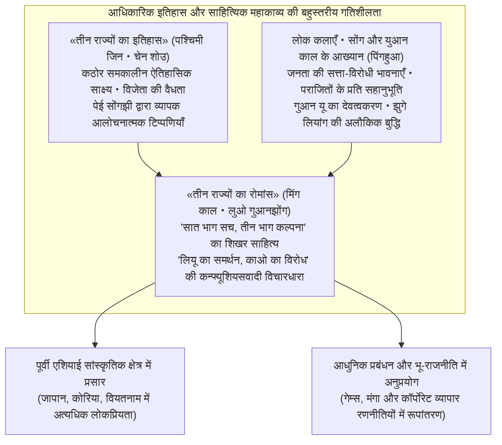
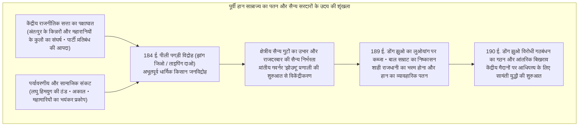
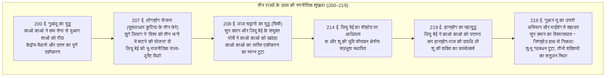
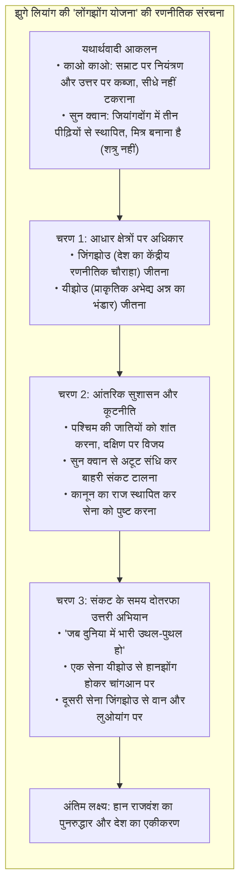
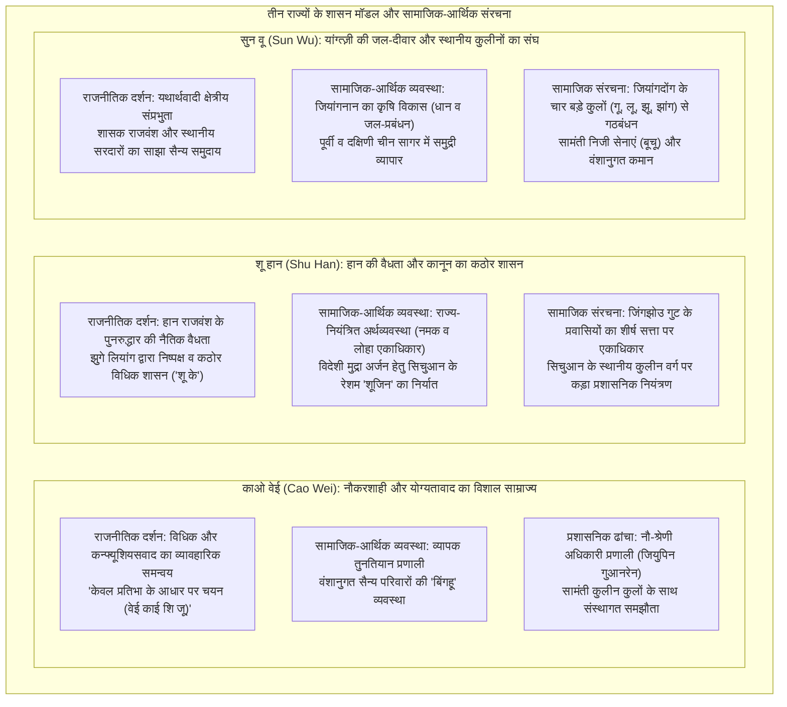

## प्रस्तावना: 1800 वर्षों के बाद भी «तीन राज्यों का काल» मानवता को क्यों सम्मोहित करता है?

ईस्वी सन् 184 में भड़के «पीली पगड़ी विद्रोह» से लेकर ईस्वी सन् 280 में पश्चिमी जिन (Western Jin) द्वारा सुन वू के दमन और देश के एकीकरण तक लगभग एक शताब्दी का समय बीता। यूरेशियाई महाद्वीप के पूर्वी छोर पर स्थित चीन के विशाल भूभाग पर लड़ा गया **«तीन राज्यों का काल» (Three Kingdoms period)** 1800 वर्षों के कालखंड को पार कर आज भी न केवल पूर्वी एशिया, बल्कि संपूर्ण विश्व के लोगों की बौद्धिक कल्पना और जनमानस को गहराई से आकर्षित करता है।

चीनी राजवंशों के अनगिनत उत्थानों और पतनों के बीच केवल इसी उथल-पुथल भरे युग में ऐसा क्या था जिसने इसे इतना चुंबकीय और अमर सांस्कृतिक आकर्षण प्रदान किया?

इसका सबसे बड़ा कारण यह है कि तीन राज्यों की यह दुनिया एक असाधारण «दोहरी संरचना» समेटे हुए है: एक ओर यह **ऐतिहासिक तथ्यों पर आधारित कठोर दस्तावेज़ «तीन राज्यों का आधिकारिक इतिहास» (सानगुओझी - लेखक चेन शोउ, पेई सोंगझी की विस्तृत व्याख्या)** के रूप में विद्यमान है, तो दूसरी ओर यह एक सहस्राब्दी से चली आ रही लोकगाथाओं, नाटकों और मौखिक आख्यानों के संचय से मिंग राजवंश में रचित **सर्वोच्च ऐतिहासिक उपन्यास «तीन राज्यों का रोमांस» (सानगुओ यानयी - लेखक लुओ गुआनझोंग)** के रूप में अमर है।



ऐतिहासिक सत्य के धरातल पर तीन राज्यों का युग पूर्वी हान साम्राज्य के संस्थागत विघटन, जनसंख्या में भारी गिरावट, भीषण ठंड, अकाल और क्रूर युद्धों से भरा एक अत्यंत भयावह दौर था। पूर्वी हान के चरमोत्कर्ष काल में पंजीकृत 5.6 करोड़ की आबादी तीन राज्यों के अंतिम दौर में वेई, शू और वू तीनों को मिलाकर मात्र 80 लाख के आसपास सिमट गई थी (यदि छिपे हुए परिवारों और शरणार्थियों को भी जोड़ लें, तब भी समाज की तबाही चरम सीमा पर थी)।

किंतु इसी संस्थागत शून्यता और अस्तित्व के क्रूरतम संघर्ष के बीच स्थापित रूढ़ियों और सामंती बंधनों को तोड़ते हुए **«रणनीतिक सूझबूझ के नए नवाचार»** और **«राष्ट्र निर्माण के साहसिक प्रयोग»** एक के बाद एक जन्म लेते गए:
- काओ काओ (Cao Cao) द्वारा स्थापित योग्यता-आधारित प्रतिभा चयन नियम («केवल प्रतिभा के आधार पर चयन» / 唯才是挙) और सेना के रसद संकट को हल करने वाली कृषि-सैन्य प्रणाली «तुनतियान» (Tuntian system)।
- झुगे लियांग (Zhuge Liang) द्वारा प्रतिपादित भू-राजनीतिक महायोजना «लोंगझोंग योजना» («दुनिया को तीन भागों में बांटने की रणनीति» / 隆中対), जिसने एक छोटे राज्य को महाबली साम्राज्य से टकराने का सामर्थ्य दिया, और उनका कठोर, निष्पक्ष कानून का शासन।
- सुन क्वान (Sun Quan) द्वारा यांग्त्ज़ी नदी की प्राकृतिक जल-सीमा की आड़ में जियांगनान क्षेत्र का विकास और पूर्वी व दक्षिणी चीन सागर की ओर उन्मुख एक समुद्री व्यापारिक राज्य की नींव।

और सबसे बढ़कर, इस युग के नायकों, रणनीतिकारों, योद्धाओं और आम जनता द्वारा रचित मानवीय भावनाओं का अमर नाटक — काओ काओ का निर्मम यथार्थवाद और अकेलापन, लियू बेई का जमीन से जुड़ा नैतिक संकल्प, दृढ़ता और मानवीय स्नेह, गुआन यू की स्वाभिमानी निष्ठा और त्रासद अंत, तथा झुगे लियांग का एक असंभव लक्ष्य के प्रति आत्मोत्सर्ग — युगों और सीमाओं से परे जाकर मानवीय भावना का शाश्वत महाकाव्य बन गया।

इस विस्तृत लेख में हम तीन राज्यों के इस विशाल परिदृश्य का केवल घटनाओं या कहानियों के रूप में वर्णन नहीं करेंगे, बल्कि **इतिहासशास्त्र, राजनीतिक दर्शन, सैन्य भू-राजनीति, सामाजिक-आर्थिक संस्थाओं और साहित्यिक प्रभाव के सभी आयामों से इसका संपूर्ण एवं गहन विश्लेषण** करेंगे। इतिहास और उपन्यास के अंतर को स्पष्ट करते हुए, हम उथल-पुथल के इस दौर में जीने वालों के विचारों और रणनीतियों की गहराइयों तक पहुंचेंगे।

---

## अध्याय 1: पूर्वी हान राजवंश का पतन और सामंतों का उदय (184–200 ईस्वी)

तीन राज्यों के युग की शुरुआत 400 वर्षों तक चीनी सभ्यता को एक सूत्र में बांधने वाले महान «हान साम्राज्य» (पश्चिमी हान और पूर्वी हान) के आंतरिक विघटन से हुई। एक शक्तिशाली केंद्रीकृत राज्य इतनी तेजी से अपनी शक्ति खोकर क्षेत्रीय सरदारों और सैन्य गुटों के हाथ में कैसे बिखर गया? इस विनाश के मूल में संस्थागत विफलता, सत्ता के शीर्ष पर सड़ांध और वैश्विक जलवायु परिवर्तन की एक जटिल शृंखला सक्रिय थी।



### 1.1 किन्नरों व महारानी के कुलों की मनमानी और «पार्टी प्रतिबंध की आपदा»: हान का ढांचागत पक्षाघात

पूर्वी हान (25–220 ईस्वी) की राजनीतिक संरचना अपने उत्तरार्ध में एक विचित्र दुष्चक्र में फंस गई थी। इसका मूल कारण लगातार नाबालिग बाल सम्राटों का गद्दी पर बैठना था।

जब सम्राट अबोध बालक होता, तो शासन की वास्तविक शक्ति राजमाता (विधवा महारानी) और उनके पैतृक परिवार यानी **«शाही ससुराल पक्ष» (वाईची)** के हाथों में चली जाती। जब सम्राट वयस्क होता, तो अपनी सत्ता पुनः प्राप्त करने के लिए वह महल के भीतरी कमरों में दिन-रात साथ रहने वाले **«किन्नरों» (महल के हिजड़ों)** के साथ मिलकर सैन्य बल से ननिहाल के कुनबे को समाप्त कर देता। किंतु सत्ता पाते ही किन्नर वर्ग घोर भ्रष्टाचार, रिश्वतखोरी और अपने रिश्तेदारों को प्रांतीय पदों पर बैठाकर मनमानी करने लगता। अगले दौर में जब नया बाल सम्राट बैठता, तो नए ससुराल वाले किन्नरों का संहार करते — यह खूनी संघर्ष पीढ़ियों तक अनवरत चलता रहा।

इसके विरुद्ध कन्फ्यूशियसवादी नैतिक मूल्यों में निष्ठा रखने वाले विद्वान नौकरशाहों और शाही विश्वविद्यालय (ताइश्यू) के छात्रों ने किन्नरों के भ्रष्टाचार की तीखी भर्त्सना की। वे स्वयं को «पवित्र धारा» (चिंग लियू) और किन्नरों तथा उनके चाटुकारों को «मलिन धारा» (झुओ लियू) कहते थे।

किंतु संकट भांपकर किन्नरों ने सम्राट को बरगलाया और पवित्र धारा के विद्वानों पर राजद्रोह और गुटबाजी का झूठा आरोप लगाकर उनका क्रूर दमन किया। यह ईस्वी सन् 166 और 169 में हुए दो भीषण **«पार्टी प्रतिबंध के संकट» (दांगगू ची हुओ)** थे। सैकड़ों शीर्ष विद्वान मार डाले गए या जेलों में सड़ गए, और हजारों को आजीवन सरकारी पदों से बहिष्कृत कर दिया गया।

इस दमन ने हान राजवंश को एक प्राणघातक आघात पहुंचाया। स्थानीय कुलीनों और बुद्धिजीवियों का केंद्रीय सत्ता से पूरी तरह विश्वास उठ गया और उन्होंने राज्य के कानून और अधिकार की रक्षा करने की इच्छा खो दी। केंद्र के नैतिक पतन से उत्पन्न इस खालीपन में क्षेत्रीय सशस्त्र शक्तियों के उभरने की जमीन तेजी से तैयार हो गई।

### 1.2 जलवायु शीतलन, अकाल, महामारी और «पीली पगड़ी विद्रोह»

राजनीतिक सड़न पर प्रकृति के भयानक प्रकोप ने आग में घी का काम किया।

पुराजलवायु विज्ञान और ऐतिहासिक जनसांख्यिकी के शोध दर्शाते हैं कि दूसरी शताब्दी के उत्तरार्ध से तीसरी शताब्दी के दौरान पूर्वी एशिया **«लघु हिमयुग» (Little Ice Age)** के शीतलन चक्र के प्रारंभिक चरण में प्रवेश कर चुका था। भयंकर कड़ाके की सर्दियाँ, गर्मियों में सूखा और पाला लगातार पड़ने लगे, जिससे पीली नदी और यांग्त्ज़ी नदी के घाटियों की कृषि व्यवस्था पूरी तरह चरमरा गई। भुखमरी से बेहाल जनता पर भयानक **«महामारियों» (संभवतः टाइफस या चेचक)** का कहर टूटा। जियानआन काल के प्रसिद्ध कवि काओ च्झी ने अपने निबंध «महामारी का वर्णन» में लिखा: «हर घर में लाशों के ढेर पर मातम था, और हर कमरे से दिल दहला देने वाला विलाप गूंज रहा था।»

इस घोर निराशा के अंधकार में हेबेई प्रांत के जुलू जिले के एक ताओवादी चिकित्सक और संत **झांग जिओ (Zhang Jiao)** का उदय हुआ।

झांग जिओ ने पीले सम्राट (हुआंग दी) और लाओत्से के विचारों को लोक मान्यताओं के साथ मिलाकर एक नया धार्मिक संप्रदाय **«ताइपिंग दाओ» (परम शांति का मार्ग)** स्थापित किया। उन्होंने मंत्रपूत जल («फू शुई») पिलाकर रोगियों का इलाज किया और पापों की सार्वजनिक स्वीकारोक्ति का अभियान चलाया, जिससे भुखमरी और बीमारी से त्रस्त लाखों किसान देखते ही देखते उनके अनुयायी बन गए। झांग जिओ ने अपने अनुयायियों को एक सैन्य संगठन में ढाला और पूरे देश को 36 सैन्य प्रशासनिक प्रभागों («फांग») में बांटकर सशस्त्र विद्रोह का जाल बिछाया।

उनका नारा था वह अत्यंत प्रसिद्ध भविष्यवाणी:
> **«蒼天已死、黃天當立、歲在甲子、天下大吉»**  
> (नीला आकाश मर चुका है, पीला आकाश स्थापित होना चाहिए; जियाज़ी वर्ष में, दुनिया में महामंगल होगा!)

हान राजवंश का प्रतीक «नीला आकाश» अपना भाग्य खो चुका था। उसके स्थान पर पृथ्वी के प्रतीक «पीले आकाश» की स्थापना होनी थी। चीनी पंचांग के 60-वर्षीय नए चक्र का आरंभ वर्ष «जियाज़ी» (ईस्वी 184) ही इस महान क्रांति का वर्ष नियत किया गया।

फरवरी 184 ईस्वी में लाखों अनुयायियों ने सिर पर पीला कपड़ा बांधकर एक साथ विद्रोह का बिगुल फूंक दिया। यही प्रसिद्ध **«पीली पगड़ी विद्रोह» (Yellow Turban Rebellion)** था। यह विद्रोह हेबेई, हेनान और शैंडोंग जैसे साम्राज्य के हृदयस्थलों में फैल गया; सरकारी कार्यालय जला दिए गए और अधिकारियों को मार भगाया गया।

घबराए हुए हान राजदरबार ने हुआंगफू सोंग (Huangfu Song), झू जून (Zhu Jun) और लू च्झी (Lu Zhi) जैसे दिग्गज सेनापतियों को तैनात किया, पार्टी प्रतिबंध हटाकर बुद्धिजीवियों का समर्थन मांगा, और काओ काओ, लियू बेई तथा सुन जियान जैसे भावी महानायकों ने स्वयंसेवी दस्तों और शाही सेना के कमांडरों के रूप में इतिहास के मंच पर पहली बार कदम रखा।

वर्ष के भीतर ही झांग जिओ की बीमारी से मृत्यु हो गई और सरकारी सेना के भीषण प्रहारों से विद्रोह का मुख्य बल कुचल दिया गया। किंतु इसके अवशेष «काले पहाड़ के डाकू» और «सफेद लहर के विद्रोही» जैसे स्वतंत्र छापामार गिरोहों में बंटकर पूरे देश में गुरिल्ला युद्ध लड़ते रहे। कानून-व्यवस्था बनाए रखने में पूरी तरह असमर्थ राजदरबार ने 188 ईस्वी में प्रांतीय प्रशासन को अत्यधिक स्वायत्तता देने वाली **«झोउमू (गवर्नर) प्रणाली»** लागू कर दी। प्रांत के सैन्य, प्रशासनिक और वित्तीय अधिकार एक ही व्यक्ति के हाथ में आ जाने से प्रांतीय गवर्नर सीधे स्वतंत्र **«सैन्य सरदारों» (Warlords)** में बदल गए।

### 1.3 डोंग झुओ का आतंक और लुओयांग का विनाश: पुरानी व्यवस्था का ध्वंस

ईस्वी सन् 189 में सम्राट लिंग की मृत्यु के बाद महारानी के भाई सेनापति हे जिन (He Jin) और किन्नरों के गुट «दस परिचारकों» (शीचांगशी) के बीच सत्ता का संघर्ष चरम पर पहुंच गया। हे जिन ने किन्नरों को डराने के लिए उत्तर-पश्चिमी सीमावर्ती क्षेत्र लियांगझोउ से खूंखार विदेशी और चीनी घुड़सवारों की कमान संभालने वाले क्रूर सेनापति **डोंग झुओ (Dong Zhuo)** को सेना सहित राजधानी लुओयांग बुला लिया।

किंतु डोंग झुओ के पहुंचने से ठीक पहले किन्नरों ने षड्यंत्र भांपकर हे जिन को महल में बुलाकर काट डाला। इससे भड़के युआन शاو (Yuan Shao) और काओ काओ जैसे युवा अधिकारियों ने सेना लेकर राजमहल पर धावा बोल दिया और दो हजार से अधिक किन्नरों का नरसंहार कर डाला।

इस अराजकता का लाभ उठाकर डोंग झुओ ने भारी सेना के साथ लुओयांग में प्रवेश किया। इस असभ्य सीमांत सेनापति ने कुलीनों को आतंकित कर दिया, अबोध बाल सम्राट शाओ को गद्दी से उतार दिया और नौ वर्षीय सम्राट शियान (लियू शी) को कठपुतली बनाकर बैठा दिया। उसने स्वयं को «शियांगगुओ» (सर्वोच्च चांसलर) घोषित कर पूरी सत्ता हथिया ली।

डोंग झुओ के खूनी आतंक ने पारंपरिक कुलीन वर्ग को गहरे अपमान में डाल दिया। 190 ईस्वी में युआन शाओ को नेता बनाकर पूर्वी प्रांतों के तमाम सामंतों ने **«डोंग झुओ विरोधी गठबंधन»** का गठन किया। इसमें काओ काओ, सुन जियान, युआन शू, बाओ शिन आदि सरदार शामिल हुए।

गठबंधन के दबाव का सामना करते हुए डोंग झुओ ने एक खौफनाक कदम उठाया: उसने प्राचीन और भव्य राजधानी लुओयांग की लाखों की आबादी को जबरन पश्चिमी राजधानी चांगआन (वर्तमान शीआन) की ओर पैदल खदेड़ दिया, और लुओयांग के महलों, सरकारी दफ्तरों, बस्तियों और पूर्व सम्राटों की कब्रों तक को लूटकर पूरी तरह जला दिया। पूर्वी एशिया का सबसे समृद्ध महानगर एक ही रात में राख के ढेर में बदल गया।

विडंबना यह रही कि डोंग झुओ को हराने के लिए एकजुट हुआ गठबंधन सेनापति की ताकत से डरकर आगे बढ़ने से हिचकिचाता रहा और शराबनोशी तथा जमीन हड़पने के षड्यंत्रों में उलझ गया। अकेले हमला करने वाले काओ काओ और सुन जियान को पराजय का मुंह देखना पड़ा। अंततः गठबंधन आंतरिक कलह से बिखर गया। साम्राज्य की पुरानी व्यवस्था पूरी तरह नष्ट हो गई और **«सामंती अराजकता का खुला युग»** शुरू हो गया।

(अत्याचारी डोंग झुओ स्वयं 192 ईस्वी में चांगआन में अपने ही धर्मपुत्र, अजेय योद्धा लू बू (Lu Bu) और मंत्री वांग युन (Wang Yun) के षड्यंत्र का शिकार होकर मारा गया, और उसकी विशाल चर्बीयुक्त लाश को बाजार में जलाकर तमाशा बनाया गया)।

### 1.4 केंद्रीय मैदानों में आधिपत्य का महासंग्राम: सरदारों का उत्थान और पतन

पुरानी व्यवस्था के राख में बदल जाने के बाद केंद्रीय मैदान (झोंगुआन — पीली नदी की उपजाऊ घाटी) खूनी सामंती टूर्नामेंट का अखाड़ा बन गए। उस समय के प्रमुख शक्ति केंद्र इस प्रकार थे:

- **युआन शाओ (Yuan Shao)**: «चार पीढ़ियों से तीन सर्वोच्च पदों पर रहने वाले» देश के सबसे कुलीन घराने का वारिस। उसने अपने प्रतिद्वंद्वी गोंगसुन ज़ान को हराकर पीली नदी के उत्तर के चार विशाल प्रांतों (जी, चिंग, यू, बिंग) पर पूर्ण नियंत्रण कर तत्कालीन सबसे शक्तिशाली सेना खड़ी की।
- **युआन शू (Yuan Shu)**: युआन शाओ का चचेरा भाई, जो हुइनान में काबिज था। सुन जियान द्वारा लुओयांग से लाई गई शाही मुहर पाकर वह पागलपन में अंधा हो गया और उसने स्वयं को «झोंग» राजवंश का सम्राट घोषित कर दिया, जिसके परिणामस्वरूप सभी सरदारों ने मिलकर उसे नष्ट कर दिया।
- **सुन से (Sun Ce)**: सुन जियान का पराक्रमी ज्येष्ठ पुत्र। «छोटा हेजेमोन» (शियाओ बावांग) कहलाने वाले इस करिश्माई योद्धा ने अपने पिता की मृत्यु के बाद मात्र 20 वर्ष की आयु में कुछ ही वर्षों के भीतर यांग्त्ज़ी के दक्षिण के छह जिलों (जियांगदोंग) को जीतकर भावी सुन वू साम्राज्य की चट्टानी नींव रख दी; किंतु 200 ईस्वी में 26 वर्ष की अल्पायु में गुप्त हत्यारों के तीर से उसकी मृत्यु हो गई।
- **लू बू (Lu Bu)**: जिसके बारे में कहा जाता था: «इंसानों में लू बू, घोड़ों में लाल खरगोश (रेड हेयर)»। युद्ध कला में अद्वितीय, किंतु निष्ठाहीन; उसने डिंग युआन और डोंग झुओ दोनों स्वामियों की हत्या की, लियू बेई से विश्वासघात कर शूझोउ छीना, और अंततः शिआपी में काओ काओ और लियू बेई द्वारा घेरकर मारा गया।
- **लियू बियाओ (Liu Biao)**: एक प्रतिष्ठित विद्वान, जिसने यांग्त्ज़ी की मध्य घाटी (जिंगझोउ) को युद्ध से सुरक्षित रखा, लाखों शरणार्थियों और विद्वानों को शरण दी, किंतु साम्राज्य जीतने की कोई महत्वाकांक्षा न रखने वाला शांतिकामी शासक बना रहा।
- **लियू बेई (Liu Bei)**: हान के पूर्व सम्राट जिंग का वंशज होने का दावा करने वाला, जो निर्धनता के कारण घास के जूते और चटाइयां बुनकर मां का पेट पालता था। गुआन यू और झांग फेई के साथ भ्रातृ-बंधन बांधकर उसने जीवन भर भटकते हुए ताओ चियान, लू बू, काओ काओ, युआन शाओ और लियू बियाओ के यहां शरण ली। भूमिहीन होने के बावजूद अपने अद्वितीय नैतिक आकर्षण और दयालुता के कारण उसका नाम पूरे देश में विख्यात था।

### 1.5 काओ काओ का उदय और «सम्राट को संरक्षण»: वैधता और यथार्थवाद का संगम

इन तमाम सामंतों के बीच असाधारण रणनीतिक दृष्टि के बल पर जो व्यक्ति सबसे आगे निकल आया, वह था **काओ काओ (Cao Cao, उपनाम मेंगदे)**।

काओ काओ एक किन्नर घराने से संबंधित था (उसके दत्तक दादा काओ तेंग एक शक्तिशाली किन्नर थे), इसलिए युआन शाओ जैसे कुलीन सामंत उसे हीन दृष्टि से देखते थे। किंतु काओ काओ एक विलक्षण बहुमुखी प्रतिभा का धनी था — एक कुशल सेनानायक, एक कठोर यथार्थवादी राजनीतिज्ञ और अपने युग का महानतम कवि।

काओ काओ की पहली और निर्णायक रणनीतिक छलांग 196 ईस्वी में **«सम्राट शियान को अपने संरक्षण में लेना» (奉戴)** थी।  
चांगआन से भागकर डोंग झुओ के पूर्व जनरलों के चंगुल से छूटकर भूख से बेहाल खंडहर बने लुओयांग में भटकते युवा सम्राट को काओ काओ ने अपने रणनीतिकार श्यून यू (Xun Yu) की सलाह पर अपने गढ़ श्यूचांग (वर्तमान हेनान प्रांत) में ससम्मान आमंत्रित किया।

इस एक कदम ने काओ काओ को राजनीति का अमोघ अस्त्र थमा दिया:
> **«सम्राट को अपने नियंत्रण में लेकर सामंतों को आज्ञा देना» (挟天子以令諸侯)**

अब किसी भी सामंत द्वारा काओ काओ पर हमला करना सीधे «सम्राट के विरुद्ध राजद्रोह» माना जाने लगा। काओ काओ ने चांसलर के रूप में राजदरबार के आधिकारिक शाही फरमानों का उपयोग कर अपने सभी सैन्य अभियानों को «विद्रोहियों का सरकारी दमन» घोषित करने की नैतिक वैधता प्राप्त कर ली।

इसके साथ ही काओ काओ ने ध्वस्त अर्थव्यवस्था को पटरी पर लाने के लिए युगांतरकारी कदम उठाया — **«तुनतियान प्रणाली» (Tuntian system — सैन्य व नागरिक कृषि बस्तियां)** की स्थापना (196 ईस्वी में जाओ च्झी और हान हाओ की पहल पर)। युद्ध से वीरान पड़ी सरकारी जमीनों पर शरणार्थियों को बसाया गया, उन्हें सरकारी बैल और हल दिए गए। उपज का 50% से 60% लगान के रूप में राज्य को मिलता था, और बदले में किसानों को सैन्य भर्ती से छूट और सुरक्षा दी गई।

इस प्रणाली ने काओ काओ की सेना को अनाज की उस भयानक कमी से हमेशा के लिए मुक्त कर दिया जिसने बाकी सभी सामंतों की कमर तोड़ दी थी। राजनीतिक वैधता (सम्राट का संरक्षण) और ठोस आर्थिक आधार (तुनतियान प्रणाली) दोनों को साधकर काओ काओ उत्तर के महाबली युआन शाओ के साथ अंतिम महायुद्ध की तैयारी में जुट गया।

---

## अध्याय 2: आधिपत्य का महाटकराव और तीन राज्यों का उदय (200–219 ईस्वी)

ईस्वी सन् 200 से 219 तक के लगभग दो दशक तीन राज्यों के इतिहास का स्वर्णिम और सर्वाधिक नाटकीय कालखंड थे, जब सामंती अराजकता सिमटकर तीन महाशक्तियों — «वेई, शू और वू» के त्रिकोणीय संतुलन में बदल गई।

इस युग की दिशा को तीन ऐतिहासिक महायुद्धों ने तय किया — **गुआंदू का युद्ध (200 ई.)**, **लाल चट्टानों का युद्ध / चिबी (208 ई.)**, और **हानझोंग व फानचेंग का संघर्ष (219 ई.)**।



### 2.1 गुआंदू का युद्ध (200 ईस्वी): सूचना तंत्र और रसद पर प्रहार से महादैत्य की पराजय

ईस्वी सन् 200 में उत्तरी चीन के आधिपत्य के लिए प्रसिद्ध **«गुआंदू का युद्ध» (Battle of Guandu)** लड़ा गया।

मुकाबला था 1 लाख पैदल और 10 हजार घुड़सवारों की अजेय सेना लेकर आए उत्तर के स्वामी **युआन शाओ** और मात्र 20 से 30 हजार सैनिकों की कमान संभाल रहे **काओ काओ** के बीच। सेना का अनुपात 1 और 4 का था, और सभी मान रहे थे कि काओ काओ का विनाश निश्चित है।

पीली नदी पार कर युआन शाओ की सेना ने गुआंदू किले (हेनान प्रांत) में काओ काओ की सेना को घेर लिया। युआन शाओ ने ऊंचे मिट्टी के टीले बनाकर तीरों की वर्षा की और सुरंगें खोदीं। काओ काओ ने पत्थर फेंकने वाली तोपों (कैटपल्ट) से मचान तोड़े और खाइयां खोदकर सुरंगें बंद कर दीं।

किंतु लंबा खिंचता घेराव काओ काओ की रसद को लील रहा था। सैनिक भूख से बेहाल थे और स्वयं काओ काओ ने राजधानी में श्यून यू को पत्र लिखकर पीछे हटने की इच्छा जताई। श्यून यू ने प्रेरित करते हुए उत्तर दिया: «यदि आप आज पीछे हटे, तो पूरा देश युआन शाओ की झोली में चला जाएगा। आपको धैर्य रखकर शत्रु की किसी घातक भूल की प्रतीक्षा करनी होगी।»

और वह ऐतिहासिक मोड़ आया **«खुफिया जानकारी और रसद»** के आंतरिक पतन से।

युआन शाओ के प्रमुख सलाहकारों में से एक **श्यू यू (Xu You)** अपने स्वामी से असंतुष्ट हो गया क्योंकि उसने उसकी रणनीति ठुकरा दी थी और उसके परिवार पर भ्रष्टाचार का मुकदमा चल रहा था। निराश होकर श्यू यू रात के अंधेरे में भागकर काओ काओ के शिविर में आ गया।

काओ काओ अपने बचपन के मित्र के आने की खबर सुनकर इतना प्रफुल्लित हुआ कि जूते पहनने तक की सुध न रही और नंगे पांव दौड़कर उसका स्वागत किया। श्यू यू ने सबसे गोपनीय रहस्य उजागर कर दिया:
> «युआन शाओ की सेना का सारा अनाज और गोला-बारूद पीछे **ओउचाओ (Wuchao)** के डिपो में जमा है। वहां का रक्षक चुन्यू चियोंग शराब के नशे में धुत रहता है और सुरक्षा लापरवाह है। यदि आप तुरंत तेज घुड़सवार भेजकर उस डिपो को भस्म कर दें, तो युआन शाओ की लाखों की सेना बिना लड़े ही बिखर जाएगी।»

काओ काओ ने तुरंत निर्णय लिया। उसने स्वयं 5000 चुने हुए घुड़सवारों का नेतृत्व किया, युआन शाओ की सेना के झंडे लगाए, चेहरों पर कालिख पोती, घोड़ों के मुंह में लकड़ी की खपच्चियां दबाईं ताकि हिनहिनाहट न हो, और गश्त को चकमा देकर ओउचाओ पर अचानक धावा बोल दिया। चुन्यू चियोंग की सेना को काटकर उसने अनाज के विशाल भंडारों को राख के ढेर में बदल दिया।

ओउचाओ से उठती गगनचुंबी लपटों को देखकर युआन शाओ की सेना में भगदड़ मच गई। इसके तुरंत बाद उसके पराक्रमी सेनापति झांग हे (Zhang He) और गाओ लान काओ काओ से जा मिले, जिससे पूरा मोर्चा ढह गया। युआन शाओ अपने बड़े बेटे के साथ मात्र 800 घुड़सवारों को लेकर पीली नदी के पार भाग खड़ा हुआ।

गुआंदू की विजय केवल रणक्षेत्र की जीत नहीं थी; यह वंशानुगत कुलीनता के घमंड पर आधुनिक योग्यता, त्वरित निर्णय, सूचना तंत्र और रसद प्रबंधन की शानदार विजय थी। युआन शाओ की जल्द ही मृत्यु हो गई, काओ काओ ने उसके पुत्रों को एक-एक कर समाप्त किया, और 207 ईस्वी तक वूह्वान जनजातियों को वश में करके **संपूर्ण उत्तरी चीन का एकीकरण** पूरा कर लिया।

### 2.2 लियू बेई का भटकाव और «मूसलाधार कुटिया के तीन फेरे»: लोंगझोंग योजना की भू-राजनीतिक क्रांति

जब काओ काओ उत्तर को जीत रहा था, तब दर-दर भटकता **लियू बेई** जिंगझोउ के लियू बियाओ के अधीन शिन्ये नामक सीमांत कस्बे में निष्प्रभावी पड़ा था। वह चालीस पार कर चुका था और एक दिन अपनी जांघों पर चर्बी देखकर रो पड़ा («जांघों की चर्बी पर विलाप»): «पहले मैं दिन-रात घोड़े की पीठ पर रहता था, अब जांघों पर चर्बी चढ़ गई है और बाल सफेद हो रहे हैं, किंतु देश के लिए कुछ न कर सका!»

किंतु 207 ईस्वी में लियू बेई के जीवन और चीन के इतिहास को बदल देने वाला क्षण आया: शियांगयांग के देहात लोंगझोंग की एक घास-फूस की कुटिया में एकांत साधना कर रहे 27 वर्षीय युवा तपस्वी **झुगे लियांग (Zhuge Liang, उपनाम कोंगमिंग)** से उनका साक्षात्कार हुआ।

लियू बेई ने स्वयं तीन बार पैदल चलकर उस कुटिया का दौरा किया और मार्गदर्शन मांगा। यह इतिहास में **«मूसलाधार कुटिया के तीन फेरे» (Three Visits to the Thatched Cottage)** के नाम से अमर हुआ। और उस संकरी झोपड़ी में झुगे लियांग ने लियू बेई के सामने संपूर्ण राष्ट्र के एकीकरण का जो भव्य खाका खींचा, उसे इतिहास में **«लोंगझोंग योजना» (Longzhong Plan / 天下三分の計)** कहा जाता है।



झुगे लियांग की रणनीति कठोर यथार्थवाद पर आधारित थी:
1. **शत्रु और मित्र की स्पष्ट पहचान**: काओ काओ सम्राट को साथ रखकर उत्तर पर राज करता है, उससे सीधे माथा नहीं फोड़ना चाहिए। सुन क्वान जियांगदोंग में तीन पीढ़ियों से गहरे जड़ जमा चुका है, उसे मित्र बनाना चाहिए, शत्रु नहीं।
2. **भूभाग का चयन**: जिंगझोउ उत्तर-दक्षिण और पूर्व-पश्चिम का चौराहा है, किंतु लियू बियाओ इसे नहीं संभाल सकता। यीझोउ (सिचुआन बेसिन) चारों ओर पहाड़ों से घिरा प्राकृतिक किला और अन्न का अक्षय भंडार है, और लियू चांग दुर्बल है। इन दोनों प्रांतों को जीतकर अपनी मजबूत बुनियाद बनाओ।
3. **दोतरफा उत्तरी आक्रमण**: आंतरिक शासन सुदृढ़ कर, दक्षिण की जनजातियों को संतुष्ट कर और सुन क्वान से पक्की संधि कर उस घड़ी की प्रतीक्षा करो जब काओ काओ के राज्य में कोई भारी संकट आए («जब दुनिया में हलचल हो»)। तब एक मुख्य सेना सिचुआन से चांगआन की ओर बढ़े और दूसरी सेना जिंगझोउ से लुओयांग पर धावा बोले। दोनों ओर से घिरी जनता तुम्हारा स्वागत करेगी और हान राजवंश पुनः जीवित हो जाएगा।

यह सुनकर लियू बेई की आंखों के आगे का कुहासा छंट गया। उन्होंने गदगद होकर कहा: «कोंगमिंग का मिलना मेरे लिए वैसा ही है जैसे मछली को पानी मिल गया हो!» एक साधारण भटकता हुआ सरदार अब एक स्पष्ट ऐतिहासिक मिशन से लैस राजनेता बन चुका था।

### 2.3 लाल चट्टानों का युद्ध (208 ईस्वी): यांग्त्ज़ी का जल-दुर्ग और इतिहास का मोड़

लोंगझोंग योजना के तुरंत बाद 208 ईस्वी की गर्मियों में काओ काओ लाखों की विशाल वाहिनी लेकर दक्षिण की ओर बढ़ा। उसी समय लियू बियाओ की मृत्यु हो गई और उसके कायर बेटे लियू सोंग ने बिना लड़े आत्मसमर्पण कर दिया। लियू बेई लाखों शरणार्थियों को लेकर दक्षिण की ओर भागा; चांगबान के युद्ध में काओ काओ के खूंखार घुड़सवारों ने उसे आ घेरा (यहीं झाओ युन द्वारा बालक आ दोउ को बचाने और झांग फेई द्वारा पुल पर दहाड़ने की शौर्यगाथाएं जन्मीं)।

लियू बेई यांग्त्ज़ी के मुहाने शियाकोउ पहुंचे और सुन क्वान से गठबंधन के लिए झुगे लियांग को दूत बनाकर भेजा। सुन क्वान के दरबार में अधिकांश दरबारी त्शांग चाओ के नेतृत्व में आत्मसमर्पण की वकालत कर रहे थे: «काओ काओ के पास लाखों की सेना है, सम्राट उसके साथ है और अब उसने जिंगझोउ की नौसेना भी हथिया ली है। लड़ना आत्महत्या है!»

किंतु झुगे लियांग ने सेनापति **झोउ यू (Zhou Yu)** और निष्ठावान **लू सू (Lu Su)** के साथ मिलकर युद्ध का पक्ष मजबूत किया। झोउ यू ने काओ काओ की सेना की तीन घातक कमजोरियां उजागर कीं:
1. वे उत्तरी घुड़सवार और पैदल सैनिक हैं, जिन्हें नावों पर लड़ना नहीं आता और वे जल-यात्रा से बीमार पड़ते हैं।
2. लंबी यात्रा से थके सैनिकों में महामारी फैलना तय है।
3. घोड़ों के लिए चारे की कमी है और दलदली इलाकों में रसद पहुंचाना असंभव है।

सुन क्वान ने तलवार खींचकर अपनी मेज का कोना काट दिया और गर्जना की: «जो अब आत्मसमर्पण की बात करेगा, उसका हश्र इस मेज जैसा होगा!» उसने झोउ यू को 30,000 की नौसेना देकर लियू बेई के साथ मिलकर पश्चिम की ओर रवाना किया।

सर्दियों में यांग्त्ज़ी नदी के किनारे **लाल चट्टानों (चिबी / Battle of Red Cliffs)** पर दोनों सेनाओं की भिड़ंत हुई।

काओ काओ ने अपने सैनिकों को उल्टी और चक्कर से बचाने के लिए सभी बड़े जहाजों को लोहे की जंजीरों और तख्तों से आपस में बांधकर एक तैरता हुआ विशाल शहर बना दिया था। सुन वू के वयोवृद्ध सेनापति **हुआंग गाई (Huang Gai)** ने यह देखकर अग्नि-आक्रमण की चाल चली। उसने काओ काओ को आत्मसमर्पण का फर्जी पत्र भेजा और सूखी घास, बारूद और तेल से भरी दर्जनों तेज नौकाएं लेकर काओ काओ के बेड़े की ओर बढ़ा।

जैसे ही अनुकूल दक्षिण-पूर्वी हवा बही, हुआंग गाई की नौकाओं ने आग पकड़ ली और वे सीधे काओ काओ के जंजीरों से बंधे जहाजों से जा टकराईं। यांग्त्ज़ी की लहरें देखते ही देखते आग के दहकते समंदर में बदल गईं। लपटें किनारे के शिविरों तक फैल गईं और काओ काओ की सेना का नामोनिशान मिट गया।

काओ काओ बचे-खुचे सैनिकों को लेकर दलदली हुआरोंग मार्ग से किसी तरह जान बचाकर उत्तर की ओर भागा।

लाल चट्टानों का युद्ध चीनी इतिहास का सबसे बड़ा नौसैनिक युद्ध था, जिसने **काओ काओ के पूरे चीन को एक झटके में जीतने के सपने को हमेशा के लिए चकनाचूर कर दिया**। इस विजय ने यांग्त्ज़ी घाटी की सुरक्षा पक्की कर दी और झुगे लियांग की «त्रिकोणीय विभाजन» की भविष्यवाणी को साकार कर दिया।

### 2.4 यीझोउ विजय और हानझोंग का महायुद्ध (211–219 ईस्वी): शू हान का सीमा विस्तार

चिबी की ऐतिहासिक जीत के बाद लियू बेई ने जिंगझोउ के दक्षिणी चार जिलों पर तुरंत अधिकार कर लिया। किंतु लोंगझोंग योजना को पूर्ण करने के लिए पश्चिम के विशाल और समृद्ध **यीझोउ (सिचुआन बेसिन)** को जीतना अनिवार्य था।

211 ईस्वी में यीझोउ के दुर्बल शासक लियू चांग ने उत्तर के धार्मिक नेता झांग लू के भय से लियू बेई को सहायता के लिए आमंत्रित किया। रणनीतिकार पांग तोंग (Pang Tong) और फा चेंग (Fa Zheng) ने लियू बेई को सिचुआन पर कब्जा करने के लिए प्रेरित किया। तीन वर्षों के कठिन पहाड़ी अभियान के बाद (जिसमें पांग तोंग की तीर लगने से मृत्यु हो गई) 214 ईस्वी में राजधानी चेंगदू का घेराव कर लियू बेई ने यीझोउ पर पूर्ण अधिकार कर लिया। उसकी सेना में अनुभवी सेनापति हुआंग झुंग और उत्तर-पश्चिम के खूंखार योद्धा मा चाओ भी शामिल हो गए।

इसके बाद 217 ईस्वी में लियू बेई ने सिचुआन के उत्तरी द्वार **हानझोंग (Hanzhong)** को जीतने का अभियान छेड़ा। हानझोंग चिनलिंग और दाबा पर्वतमाला के बीच स्थित था; जब तक यह वेई के हाथ में रहता, चेंगदू की गर्दन पर तलवार लटकी रहती।

डिंगजुन पर्वत के युद्ध में फा चेंग की चतुर रणनीति के तहत वयोवृद्ध सेनापति हुआंग झुंग ने अचानक चोटी से हमला कर वेई के पश्चिमी सेनापति **शियाहोउ युआन (Xiahou Yuan)** का सिर काट लिया। क्रोधित काओ काओ स्वयं विशाल सेना लेकर हानझोंग पहुंचा, किंतु लियू बेई ने पहाड़ों में छिपकर छापामार युद्ध लड़ा और उसकी रसद काट दी। अंततः हताश होकर काओ काओ को अपना प्रसिद्ध गुप्त शब्द «मुर्गे की पसली» (फेंकने में दुख, खाने में बेस्वाद) कहकर सेना हटानी पड़ी।

शरद 219 ईस्वी में हानझोंग पर पूर्ण विजय प्राप्त कर लियू बेई ने स्वयं को **«हानझोंग का राजा» (King of Hanzhong)** घोषित किया। एक समय घास के जूते बेचने वाला लियू बेई अब काओ काओ के समकक्ष सम्राट पद की दहलीज पर खड़ा था। शू हान की शक्ति अपने चरमोत्कर्ष पर थी।

### 2.5 गुआन यू का उत्तरी अभियान और माईचेंग में शहादत: जिंगझोउ का पतन और महाविनाश

किंतु शक्ति के इस शिखर पर ही एक ऐसी भयानक त्रासदी घटी जिसने शू हान की रीढ़ तोड़ दी; और इसके केंद्र में थे जिंगझोउ के रक्षक महायोद्धा **गुआन यू (Guan Yu)**।

219 ईस्वी में लियू बेई की हानझोंग विजय से उत्साहित होकर गुआन यू ने जिंगझोउ की सेना लेकर उत्तर की ओर कूच किया और वेई के मजबूत गढ़ फानचेंग को घेर लिया। भारी मानसूनी वर्षा और हान नदी की बाढ़ का लाभ उठाकर गुआन यू ने वेई के सेनापति यू जिन की सात सेनाओं को जलमग्न कर दिया, यू जिन को बंदी बनाया और वीर सेनापति पांग दे का सिर कलम कर दिया।

गुआन यू के इस पराक्रम ने **«संपूर्ण चीन को हिलाकर रख दिया» (威震華夏)**। भयभीत होकर काओ काओ अपनी राजधानी श्यूचांग से और उत्तर में स्थानांतरित करने पर गंभीरता से विचार करने लगा।

किंतु इस शानदार विजय ने सहयोगी **सुन क्वान के साथ घातक दरार** पैदा कर दी।  
शू के लिए जिंगझोउ उत्तर पर चढ़ाई का स्प्रिंगबोर्ड था, परंतु सुन क्वान के लिए यांग्त्ज़ी के ऊपरी प्रवाह पर किसी अन्य शक्ति का बैठना उसकी राष्ट्रीय सुरक्षा के लिए एक स्थायी नासूर था। वू के नए प्रधान सेनापति **लू मेंग (Lu Meng)** ने सुन क्वान से गुप्त मंत्रणा की: «यदि गुआन यू ने काओ काओ को हरा दिया, तो अगला नंबर हमारा होगा। हमें तुरंत उसकी पीठ में छुरा घोंपकर जिंगझोउ वापस छीन लेना चाहिए!»

इसके अतिरिक्त गुआन यू स्वभाव से अत्यधिक अहंकारी थे और कुलीनों को तुच्छ समझते थे। जब सुन क्वान ने अपने पुत्र के लिए गुआन यू की पुत्री का हाथ मांगा, तो उन्होंने दूत को दुत्कार दिया: «शेर की बेटी का विवाह कुत्ते के पिल्ले से कैसे हो सकता है?!» साथ ही उन्होंने रसद की देखरेख कर रहे अपने ही अधिकारियों मी फांग और शी रेन को अपमानित कर रखा था।

काओ काओ और सुन क्वान ने गुप्त संधि कर ली। लू मेंग ने बीमारी का बहाना बनाकर कमान एक नौजवान अनजाने सेनापति **लू श्यून (Lu Xun)** को सौंप दी। लू श्यून ने चापलूसी भरे पत्र लिखकर गुआन यू को निश्चिंत कर दिया। गुआन यू ने जिंगझोउ की सारी रक्षक सेना फानचेंग के मोर्चे पर झोंक दी।

तभी लू मेंग के चुने हुए सैनिकों ने सफेद कपड़े (व्यापारियों की वेशभूषा) पहने, साधारण नावों में छिपकर नदी पार की («सफेद कपड़ों में नदी पार करना» / 白衣渡江), पहरेदारों को पकड़ा और बिना एक भी खून की बूंद बहाए जिंगझोउ की राजधानी जियांगलिंग पर कब्जा कर लिया। अपमानित मी फांग और शी रेन ने तुरंत आत्मसमर्पण कर दिया।

पीठ कट जाने से गुआन यू की सेना बिखर गई। वे मुट्ठी भर सैनिकों के साथ माईचेंग के छोटे से किले में घिर गए। पश्चिम में सिचुआन भागने का प्रयास करते हुए वे वू के सैनिकों के जाल में फंस गए। गुआन यू और उनके दत्तक पुत्र गुआन पिंग को बंदी बनाकर मौत के घाट उतार दिया गया, और उनका सिर काओ काओ को भेज दिया गया।

गुआन यू की मृत्यु और **«जिंगझोउ का हाथ से निकल जाना»** शू हान के लिए केवल एक जमीन और सेनापति का खोना नहीं था, बल्कि **एक अपूरणीय भू-राजनीतिक महाविनाश** था। लोंगझोंग योजना का दोतरफा हमला हमेशा के लिए असंभव हो गया और शू हान मात्र 10 लाख की आबादी वाला एक बंद पहाड़ी राज्य बनकर रह गया। और अपने भाई की हत्या के प्रतिशोध की ज्वाला लियू बेई को एक और आत्मघाती युद्ध की ओर ले गई।

---

## अध्याय 3: तीन राज्यों के तीन शासन मॉडल — संस्थाओं, अर्थव्यवस्था और सेना का तुलनात्मक विश्लेषण

तीन राज्यों का काल केवल तीन योद्धाओं का युद्ध नहीं था। यह भिन्न-भिन्न भौगोलिक परिस्थितियों, जनसांख्यिकी और सामाजिक संरचनाओं के बीच **«राज्य शासन के मॉडलों की एक असाधारण सामाजिक प्रयोगशाला»** था।



### 3.1 काओ वेई: संस्थागत नवाचार और योग्यतावाद का महासाम्राज्य

220 ईस्वी में काओ काओ की मृत्यु के बाद उसके बेटे **काओ पी (Cao Pi, सम्राट वेन)** ने हान के अंतिम सम्राट शियान को गद्दी छोड़ने पर विवश किया («शांगरान» — औपचारिक शांतिपूर्ण सत्ता हस्तांतरण)। 400 साल पुराना हान राजवंश समाप्त हुआ और **«वेई साम्राज्य»** का जन्म हुआ।

वेई की सबसे बड़ी विशेषता उसका **विशाल जनसांख्यिकीय व आर्थिक आकार** और रूढ़ियों को तोड़ने वाला **संस्थागत यथार्थवाद** था:

1. **«केवल प्रतिभा के आधार पर चयन» (唯才是挙 — वेई काई शि जू)**:  
   हान काल में अधिकारियों की नियुक्ति «पारिवारिक प्रतिष्ठा और नैतिक चरित्र» (श्याओ लियान) के आधार पर होती थी, जो अंततः कुलीनों की भाई-भतीजावाद प्रणाली बन चुकी थी।  
   काओ काओ ने तीन बार प्रतिभा खोज आदेश जारी कर घोषणा की: «चाहे किसी का चरित्र संदेहास्पद हो या वह माता-पिता का आज्ञाकारी न हो, यदि उसमें युद्ध या शासन की अद्वितीय प्रतिभा है, तो उसे तुरंत पद दो!» इस व्यावहारिक नीति ने गुओ जिया, जिया श्यू, चेंग यू जैसे प्रतिभावान रणनीतिकारों और झांग लियाओ, श्यू हुआंग, झांग हे जैसे शत्रु पक्ष के आत्मसमर्पण करने वाले सेनापतियों को शीर्ष पदों पर बैठाया।

2. **तुनतियान से वंशानुगत सैन्य वर्ग «बिंगहू» की ओर**:  
   किसानों की बस्तियों के साथ-साथ वेई ने अग्रिम मोर्चों पर सैनिकों की आत्मनिर्भर बस्तियां बसाईं। इसके साथ ही सैनिकों के परिवारों को सामान्य जनता से अलग कर **«बिंगहू प्रणाली» (Binghu system)** बनाई; जिसमें बेटे अनिवार्य रूप से सैनिक बनते थे और बेटियां केवल सैन्य परिवारों में ब्याही जाती थीं। इसने 5 लाख की स्थायी व प्रशिक्षित सेना सुनिश्चित की।

3. **«नौ-श्रेणी अधिकारी प्रणाली» (जियुपिन गुआनरेन फा) की स्थापना**:  
   220 ईस्वी में काओ पी के राज्यारोहण के समय कुलीन मंत्री **चेन चुन (Chen Qun)** की सलाह पर यह प्रणाली बनी। हर जिले में निष्पक्ष मूल्यांकनकर्ता («झोंगझेंग») नियुक्त किए गए जो उम्मीदवारों की योग्यता को 1 से 9 श्रेणियों में बांटते थे।  
   यह व्यवस्था सम्राट और शक्तिशाली सामंती कुलीनों के बीच एक समझौता थी। बाद में उच्च पदों पर कुलीनों का एकाधिकार हो गया, जिससे यह कहावत जन्मी: «उच्च श्रेणियों में कोई निर्धन नहीं, और निम्न श्रेणियों में कोई कुलीन नहीं», जिसने आने वाले सदियों के कुलीन वर्गीय समाज की नींव रखी।

### 3.2 शू हान: विधिक निष्ठा पर आधारित लघु नैतिक राज्य

221 ईस्वी में काओ पी द्वारा हान के विनाश के उत्तर में लियू बेई ने चेंगदू में स्वयं को हान का सम्राट घोषित किया (इतिहास में इसे **«शू»** या **«शू हान»** कहा जाता है)।

शू हान की सबसे बड़ी कमजोरी उसकी **जनसांख्यिकीय और भौगोलिक सीमाओं की संकीर्णता** थी। वेई के पास देश की 70% आबादी (44 लाख से अधिक) और विशाल मैदान थे, जबकि शू पहाड़ों में बंद था और उसकी कुल **आबादी मात्र 9 से 10 लाख** तथा सेना लगभग 1 लाख थी (वेई की तुलना में एक-चौथाई)।

इस विषमता से पार पाने के लिए राज्य के वास्तविक संचालक झुगे लियांग ने अत्यंत कठोर **«विधिक शासन» (Legalism)** लागू किया:

1. **कानून का निष्पक्ष और कठोर शासन («शू के»)**:  
   चेन शोउ ने लिखा: «झुगे लियांग ने कानून बनाए, नियम तय किए और पुरस्कार व दंड पूरी निष्पक्षता से दिए। छोटे से छोटे भले काम को पुरस्कृत किया और रत्ती भर बुराई को दंडित किया। कानून कड़ा था, किंतु निष्पक्ष होने के कारण जनता ने सहर्ष सिर झुकाया।» भ्रष्टाचार का नामोनिशान मिटा दिया गया।

2. **राज्य-नियंत्रित अर्थव्यवस्था: रेशम (शूजिन) और नमक एकाधिकार**:  
   उत्तरी अभियानों के भारी खर्च को निकालने के लिए सिचुआन के विश्वप्रसिद्ध **«शूजिन» रेशम** के उत्पादन पर राज्य का एकाधिकार स्थापित किया गया। यह रेशम इतना उत्कृष्ट था कि वेई और वू के शत्रु भी इसे भारी सोना देकर खरीदते थे, जिससे शू को विदेशी मुद्रा और घोड़े मिलते थे। साथ ही गहरे कुओं से निकलने वाले नमक पर भी राज्य का नियंत्रण था।

3. **आंतरिक गुटीय तनाव: जिंगझोउ गुट बनाम सिचुआन के स्थानीय कुलीन**:  
   शू के भीतर एक गहरा तनाव मौजूद था: लियू बेई के साथ बाहर से आए **«जिंगझोउ के प्रवासी अधिकारी»** (झुगे लियांग, जियांग वान, फेई यी) सेना और शासन पर काबिज थे, जबकि सिचुआन के **«स्थानीय रईस और बुद्धिजीवी»** (जैसे चियाओ चोउ) सत्ता से बेदखल महसूस करते थे। इसी असंतोष ने अंततः राज्य के पतन के समय बिना लड़े आत्मसमर्पण का मार्ग खोला।

### 3.3 सुन वू: यांग्त्ज़ी की जल-दीवार और कुलीन परिसंघ

चिबी और जिंगझोउ की जीत के बाद सुन क्वान ने 222 ईस्वी में वू के राजा और 229 ईस्वी में जियान्ये (वर्तमान नानजिंग) में सम्राट का पद संभाला; इस प्रकार **«सुन वू» (पूर्वी वू)** का जन्म हुआ।

सुन वू न तो वेई जैसा केंद्रीकृत साम्राज्य था और न शू जैसा वैचारिक राज्य; यह सम्राट और स्थानीय कुलीन परिवारों का एक **«सामंती परिसंघ»** था:

1. **जियांगदोंग के चार बड़े कुलों से गठबंधन**:  
   दक्षिण में अनादि काल से चार शक्तिशाली कुलीन परिवार राज करते थे: **गू (Gu), लू (Lu), झू (Zhu), और झांग (Zhang)**। सुन क्वान ने उनके साथ वैवाहिक संबंध बनाए और उन्हें सेना व प्रशासन के सर्वोच्च पद सौंपे (जैसे लू श्यून को सर्वोच्च सेनापति और चांसलर बनाया)।

2. **«बूचू» व्यवस्था और सेना का वंशानुगत कमान**:  
   वू के सेनापति सरकारी सैनिकों के बजाय अपने निजी गुलामों और सामंतों की सेना **«बूचू» (Buqu)** लेकर युद्ध में जाते थे। सेनापति की मृत्यु के बाद सेना और जागीर उसके बेटे या भाई को मिल जाती थी।  
   इसने रक्षात्मक युद्धों में अद्वितीय पराक्रम दिया («अपनी जमीन बचाने की लड़ाई»), किंतु उत्तर पर आक्रमण करते समय सामंत अपनी निजी सेना खोने के डर से सुस्त पड़ जाते थे। यही कारण था कि वू हमेशा रक्षा में वज्र और आक्रमण में कमजोर रहा।

3. **दक्षिण का कृषि विकास और समुद्री साम्राज्य की नींव**:  
   सुन वू ने दलदली दक्षिण का व्यापक जल-प्रबंधन किया, जिससे जियांगनान चीन का सबसे उपजाऊ धान क्षेत्र बन गया। विद्रोही पहाड़ी जनजातियों «शानयूए» को हराकर लाखों लोगों को मैदानों में बसाया और सेना में भर्ती किया।  
   230 ईस्वी में सुन क्वान ने 10 हजार सैनिकों का विशाल बेड़ा भेजकर **«यीझोउ» (वर्तमान ताइवान)** और दानझोउ की खोज करवाई — जो चीनी इतिहास में ताइवान का पहला आधिकारिक दस्तावेजी उल्लेख है। वू के व्यापारी जहाज वियतनाम, मलाया और हिंद महासागर तक व्यापार करते थे।

```
【वेई, शू और वू तीनों राज्यों की व्यापक राष्ट्रीय शक्ति तुलना तालिका (लगभग 260 ईस्वी)】
```

| तुलना का बिंदु | काओ वेई (Wei) | शू हान (Shu Han) | सुन वू (Sun Wu) |
| :--- | :--- | :--- | :--- |
| **राजधानी** | लुओयांग (Luoyang) | चेंगदू (Chengdu) | जियान्ये (Jianye: वर्तमान नानजिंग) |
| **भौगोलिक विस्तार** | केंद्रीय मैदान, हेबेई, शैंडोंग, शानशी, शानक्सी, हुइनान, लियाओदोंग (~60% भूभाग) | यीझोउ (सिचुआन बेसिन, हानझोंग, युन्नान व गुइझोउ के पहाड़) | यांग्त्ज़ी की निचली घाटी, दक्षिण जिंगझोउ, गुआंगदोंग, उत्तरी वियतनाम |
| **अनुमानित आबादी** | **~6.6 लाख परिवार / ~44 लाख लोग** (कुल आबादी का लगभग 60%) | **~2.8 लाख परिवार / ~9.4 लाख लोग** (कुल आबादी का लगभग 13%) | **~5.2 लाख परिवार / ~23 लाख लोग** (कुल आबादी का लगभग 27%) |
| **स्थायी सेना** | **~4 से 5 लाख सैनिक** (मैदानी पैदल सेना, वूह्वान व शियानबेई घुड़सवार) | **~1 लाख सैनिक** (पहाड़ी पैदल सेना, स्वचालित धनुर्धर, श्वेत-कर्ण अंगरक्षक) | **~2.3 लाख सैनिक** (यांग्त्ज़ी का अजेय नौसैनिक बेड़ा, शानयूए सैनिक, बूचू) |
| **राजनीतिक व्यवस्था** | विधिक-कन्फ्यूशियस समन्वय, योग्यतावाद, केंद्रीकृत नौकरशाही | हान राजवंश की वैधता, कठोर व निष्पक्ष विधिक शासन («शू के») | सम्राट और स्थानीय कुलीनों का साझा परिसंघ, विकेंद्रीकृत |
| **नियुक्ति प्रणाली** | **नौ-श्रेणी प्रणाली** (मूल्यांकनकर्ता द्वारा), प्रतिभा खोज फरमान | झुगे लियांग का प्रत्यक्ष चयन, नियमों के आधार पर दंड व पुरस्कार | कुलीन परिवारों की सिफारिश, सेना का वंशानुगत कमान |
| **आर्थिक आधार** | उत्तर की गेहूं-बाजरा खेती, **तुनतियान प्रणाली**, नमक-लोहा | सिचुआन का धान, **शूजिन रेशम का सरकारी निर्यात**, कुओं का नमक | जियांगनान की धान खेती, **समुद्री व्यापार**, समुद्री नमक |
| **भू-राजनीतिक लाभ** | विशाल जनसंख्या, अटूट रसद आपूर्ति, गतिशील घुड़सवार सेना | सिचुआन के दुर्गम पहाड़ों का «अभेद्य प्राकृतिक महाकिला» | यांग्त्ज़ी नदी की विशाल जल-सीमा, बेजोड़ नौसैनिक युद्ध क्षमता |
| **संरचनात्मक कमजोरी** | कुलीनों के उभार से सम्राट का कमजोर होना (सिमा कुल का तख्तापलट) | अत्यंत सीमित जनसंख्या, जिंगझोउ और सिचुआन गुटों का आंतरिक तनाव | निजी सेनाओं के कारण सेनापतियों का ढीलापन, आक्रामक युद्धों से विमुखता |

---

## अध्याय 4: झुगे लियांग का संकल्प और तीन राज्यों का अवसान (220–280 ईस्वी)

तीन राज्यों के त्रिकोणीय संतुलन के बाद की आधी सदी वह दौर थी जब प्रथम पीढ़ी के नायक एक-एक कर विदा हो गए, और अंततः संसाधनों की निर्मम हकीकत ने राज्यों के भाग्य का फैसला किया।

इस दौर का मुख्य केंद्र शू हान के चांसलर **झुगे लियांग** के प्राणपण उत्तरी अभियान और वेई साम्राज्य के भीतर **सिमा वंश (Sima clan)** के सैन्य तख्तापलट का नाटक था।

### 4.1 लियू बेई का प्रतिशोध और यीलिंग का महाविनाश (222 ईस्वी): बाइदी का वसीयतनामा

221 ईस्वी में सम्राट बनते ही लियू बेई ने पहला निर्णय लिया — **«सुन वू पर संपूर्ण आक्रमण»**।

भाई गुआन यू की हत्या का प्रतिशोध और जिंगझोउ को पुनः पाने की व्याकुलता ने लियू बेई को अंधा कर दिया था। झुगे लियांग और झांग फेई की चेतावनियों को दरकिनार कर वे आगे बढ़े। अभियान से ठीक पहले झांग फेई को उसके ही मातहतों ने शराब के नशे में मार डाला और वू भाग गए। फिर भी लियू बेई 40 से 50 हजार सैनिकों के साथ यांग्त्ज़ी के रास्ते वू पर टूट पड़े।

शुरुआत में शू की सेना आगे बढ़ती रही। संकट देखकर सुन क्वान ने 39 वर्षीय विद्वान सेनापति **लू श्यून (Lu Xun)** को सर्वोच्च कमान सौंपी।

लू श्यून ने **«कठोर रक्षात्मक युद्ध»** की नीति अपनाई। वह किलों में बंद रहा और कोई सीधा युद्ध नहीं लड़ा। गर्मियों की भीषण तपिश में लियू बेई की सेना नदी किनारे गर्मी न झेल पाने के कारण घने जंगलों में चली गई और 700 ली (350 किमी) लंबी शृंखला में छावनियां बना लीं («शृंखलाबद्ध छावनियां» / लियानयिंग)।

यही वह भूल थी जिसकी लू श्यून प्रतीक्षा कर रहा था।  
जून 222 ईस्वी में अनुकूल तेज हवा की रात लू श्यून ने घास के पूलों और मशालों से शू की छावनियों पर **«भीषण अग्नि-प्रहार»** कर दिया। संकरी पहाड़ी घाटियों में फैली शू की छावनियां धू-धू कर जल उठीं; हजारों सैनिक खाईयों में गिरकर मर गए और पूरी सेना नष्ट हो गई। यही प्रसिद्ध **«यीलिंग का युद्ध» (Battle of Yiling)** था।

लियू बेई किसी तरह जान बचाकर सीमांत किले बाइदीचेंग (योंगआन) पहुंचे। पराजय के सदमे से वे गंभीर रूप से बीमार पड़ गए। अप्रैल 223 ईस्वी में उन्होंने मृत्युशय्या पर झुगे लियांग को बुलाया और इतिहास प्रसिद्ध वसीयत की (**«बाइदीचेंग में अनाथ सौंपना» / 白帝城託孤**):
> **«आपकी प्रतिभा काओ पी से दस गुना श्रेष्ठ है, आप अवश्य राष्ट्र को सुरक्षित कर महान कार्य संपन्न करेंगे। यदि मेरा पुत्र (लियू शान) योग्य हो, तो उसकी सहायता करें। यदि वह अयोग्य और अक्षम निकले, तो आप स्वयं सिंहासन ग्रहण कर देश का शासन संभालें (君可自取之)!»**

एक सम्राट द्वारा अपने प्रधानमंत्री को यह कहना कि अयोग्य पुत्र को हटाकर स्वयं राजा बन जाओ, कन्फ्यूशियसवादी परंपरा में चरम विश्वास का अद्वितीय उदाहरण था। झुगे लियांग ने रोते हुए जमीन पर माथा टेक दिया और लहूलुहान होकर प्रतिज्ञा की:
> **«मैं अपनी पूरी शक्ति लगा दूंगा, निष्ठा और सत्य की मर्यादा निभाऊंगा, और मरते दम तक आपकी सेवा करूंगा!»**

लियू बेई का देहांत हुआ, 17 वर्षीय अबोध लियू शान गद्दी पर बैठा, और इस छोटे से घिरे हुए राज्य का सारा भार झुगे लियांग के कंधों पर आ गया।

### 4.2 झुगे लियांग का दक्षिणी अभियान («हृदयों को जीतना») और अमर «चू शी बियाओ»

झुगे लियांग ने सबसे पहले **सुन वू के साथ संधि का पुनरुद्धार** किया; देंग च्झी को भेजकर सुन क्वान को समझाया कि वेई के सामने शू और वू होंठ और दांत की तरह हैं — एक न रहा तो दूसरा भी मरेगा।

इसके बाद उन्होंने दक्षिण (नानझोंग — युन्नान व गुइझोउ) के विद्रोही जनजातियों को शांत करने का बीड़ा उठाया। 225 ईस्वी में सेना लेकर निकले। इस अवसर पर उनके मित्र मा सू (Ma Su) ने वह अमर सूत्र दिया जो आज भी गुरिल्ला-रोधी युद्ध की सर्वोच्च नीति माना जाता है:
> **«हृदयों को जीतना सर्वोत्तम है, किलों को जीतना निम्नतम है। विचारों की लड़ाई सबसे ऊंची है, हथियारों की लड़ाई सबसे नीचे (攻心為上、攻城為下、心戦為上、兵戦為下).»**

झुगे लियांग ने विद्रोही सरदार **मेंग हुओ (Meng Huo)** को सात बार पकड़ा और सातों बार मुक्त किया («सात बार पकड़ना, सात बार छोड़ना» / 七縦七擒), जब तक कि मेंग हुओ ने रोते हुए घुटने नहीं टेक दिए: «आप साक्षात देव हैं, अब दक्षिण के लोग कभी सिर नहीं उठाएंगे!»

उन्होंने वहां कोई चीनी सेना नहीं रखी और सरदारों को स्वायत्तता दी। बदले में दक्षिण से सोना, चांदी, लोहा, घोड़े और युद्ध सामग्री प्रचुर मात्रा में शू को मिलने लगी।

227 ईस्वी में चेंगदू लौटकर उन्होंने जीवन के परम लक्ष्य **«उत्तरी अभियानों»** की तैयारी की। प्रस्थान से पूर्व युवा सम्राट लियू शान को समर्पित उनका पत्र चीनी साहित्य का सर्वोच्च शिखर माना जाता है — **«उत्तरी अभियान का प्रथम स्मृति-पत्र» (चू शी बियाओ / Qian Chushi Biao)**:
> «स्वर्गीय सम्राट अपने महान संकल्प को पूरा किए बिना ही बीच राह में संसार छोड़ गए। आज विश्व तीन भागों में बंटा है और हमारा यीझोउ अत्यंत निर्बल है। यह वास्तव में राज्य के अस्तित्व का निर्णायक संकटकाल है…»

### 4.3 पांच उत्तरी अभियानों की दास्तान (228–234 ईस्वी): वुझांग के मैदान में बुझा दीपक

228 से 234 ईस्वी के बीच झुगे लियांग ने उत्तर की ओर पांच विशाल **«उत्तरी अभियान» (Northern Expeditions)** किए।

संसाधनों में वेई से बहुत पीछे होने के बावजूद झुगे लियांग की आक्रामक रक्षा नीति थी: «यदि छोटा राज्य चुपचाप बैठा रहा, तो विशाल राज्य से अंतर बढ़ता जाएगा और हम धीरे-धीरे समाप्त हो जाएंगे। आक्रमण ही सर्वोत्तम रक्षा है।»

```
【झुगे लियांग के पांच उत्तरी अभियानों का संक्षिप्त इतिहास】
・पहला अभियान (228 ई. वसंत): लोंगयू पर अचानक हमला। तीन जिले शू के अधीन आए। पराक्रमी सेनापति जियांग वेई मिले। किंतु जिएतिंग के युद्ध में मा सू ने आदेशों की अवहेलना कर पहाड़ी चोटी पर शिविर लगाया और झांग हे से हार गया। पूरी सेना को लौटना पड़ा और झुगे लियांग ने रोते हुए मा सू का सिर कलम किया («आंसुओं के साथ मा सू का वध»)।
・दूसरा अभियान (228 ई. शीत): चेनकांग किले की घेराबंदी। वेई के रक्षक हाओ झाओ ने दृढ़ता से सामना किया; रसद खत्म होने पर शू लौटे और पीछा करने वाले वांग शुआंग को मार गिराया।
・तीसरा अभियान (229 ई. वसंत): सीमांत वुडू और यिनपिंग जिलों पर कब्जा कर शू में मिलाया।
・चौथा अभियान (231 ई. वसंत): यांत्रिक गाड़ियां 'काष्ठ बैल' पहली बार युद्ध में उतारे। चीशान पर सिमा यी को हराया। किंतु पीछे रसद मंत्री ली यान की धोखाधड़ी के कारण लौटना पड़ा; लौटते समय लकड़ी के मार्ग में वेई के प्रसिद्ध सेनापति झांग हे को मार गिराया।
・पांचवां अभियान (234 ई. वसंत): 'प्रवाही अश्व' गाड़ियों के साथ शीगु घाटी से निकले। वेई नदी के दक्षिण वुझांग के मैदान में शिविर लगाया। दीर्घकालिक युद्ध के लिए स्थानीय किसानों के साथ मिलकर खेती शुरू की। सिमा यी से सीधा मुकाबला।
```

झुगे लियांग का सबसे बड़ा शत्रु वेई की सेना नहीं, बल्कि **दुर्गम पहाड़ों में रसद पहुंचाने की भौतिक असंभवता** थी। संकरी लटकती लकड़ी की पगडंडियों («झानदाओ») पर चलने वाले कुली खुद ही सारा अनाज खा जाते थे। इस समस्या को हल करने के लिए उन्होंने **«काष्ठ बैल» (मू नियू)** और **«प्रवाही अश्व» (लियू मा)** नामक यांत्रिक हाथ-गाड़ियां बनाईं।

234 ईस्वी में पांचवें अभियान के दौरान **वुझांग के मैदान (Wuzhang Plains)** पर झुगे लियांग का सामना वेई के चतुर सेनापति **सिमा यी (Sima Yi, उपनाम झोंगदा)** से हुआ।

सिमा यी ने झुगे लियांग की प्रतिभा से डरकर बाहर निकलने से साफ मना कर दिया। झुगे लियांग ने चिढ़ाने के लिए महिलाओं के वस्त्र और जेवर भेजे, पर सिमा यी मुस्कुराकर टाल गया। जब सिमा यी को दूत से पता चला कि झुगे लियांग सुबह से आधी रात तक काम करते हैं, बीस कोड़ों से अधिक की सजा खुद तय करते हैं और दिन में मुट्ठी भर चावल खाते हैं, तो उसने भांप लिया: «झुगे बहुत कम खाते हैं और काम का पहाड़ ढोते हैं, वे अधिक दिन जीवित नहीं रहेंगे!»

यह भविष्यवाणी सच साबित हुई। अत्यधिक मानसिक व शारीरिक थकान से 23 अगस्त 234 ईस्वी की रात वुझांग के सैन्य शिविर में 54 वर्ष की आयु में इस महान प्रतिभा का अंत हो गया।

शू की सेना गुप्त रूप से लौटने लगी। जब सिमा यी को भनक लगी और उसने पीछा किया, तो शू की सेना ने अचानक मुड़कर युद्ध की मुद्रा बना ली। सिमा यी घबरा गया कि कहीं झुगे लियांग जीवित हों और यह कोई चाल हो, और वह उल्टे पांव भाग खड़ा हुआ। यहीं से यह लोकोक्ति बनी: **«मृत झुगे ने जीवित झोंगदा को भगा दिया» (死諸葛走生仲達)**।

### 4.4 काओ वेई का आंतरिक पतन और सिमा वंश का तख्तापलट

झुगे लियांग के जाने के बाद वेई साम्राज्य के भीतर खूनी सत्ता संघर्ष छिड़ गया।

सम्राट मिंग की असामयिक मृत्यु के बाद 8 वर्षीय काओ फांग गद्दी पर बैठा। सत्ता की बागडोर शाही कुल के **काओ शुआंग (Cao Shuang)** और वृद्ध सेनापति **सिमा यी** के हाथ में आई। काओ शुआंग ने सिमा यी को शक्तिहीन पद पर धकेल दिया। सिमा यी ने पागलपन और बीमारी का ढोंग किया — मुंह से लार टपकाई, कानों से बहरा बनने का नाटक किया।

किंतु जनवरी 249 ईस्वी में जब काओ शुआंग सम्राट के साथ पूर्वजों की समाधि गाओपिंग पर पूजा करने गया, 70 वर्षीय सिमा यी ने बिजली की गति से **«गाओपिंग समाधि का तख्तापलट» (Incident at Gaoping Tombs)** कर दिया। उसने राजधानी लुओयांग पर कब्जा किया, काओ शुआंग के पूरे वंश को समाप्त कर दिया और वेई की पूरी सत्ता अपनी मुट्ठी में कर ली।

सिमा यी के बाद सत्ता उसके बेटों **सिमा शी (Sima Shi)** और **सिमा झाओ (Sima Zhao)** के हाथ आई। वेई के सम्राट केवल नाममात्र की कठपुतली बन गए। 260 ईस्वी में अपमान से तंग आकर 19 वर्षीय सम्राट काओ माओ ने कहा: «सिमा झाओ की नीयत सड़क पर चलने वाला हर व्यक्ति जानता है!» (司馬昭之心、路人皆知) और तलवार लेकर महल के रक्षकों के साथ सिमा झाओ के आवास पर धावा बोल दिया, किंतु दिनदहाड़े सड़क पर उसकी हत्या कर दी गई। वेई का अंत निश्चित था।

### 4.5 तीनों राज्यों का अंत और पश्चिमी जिन द्वारा एकीकरण (263–280 ईस्वी)

अपनी गद्दी पक्की करने के लिए सिमा झाओ को एक महान विजय की आवश्यकता थी — और वह लक्ष्य था **«शू हान का विनाश»**।

उस समय शू में सेनापति **जियांग वेई (Jiang Wei)** के ग्यारह असफल उत्तरी अभियानों ने देश को खोखला कर दिया था, और चेंगदू के राजमहल में मूर्ख सम्राट लियू शान भ्रष्ट किन्नर हुआंग हाओ के चंगुल में फंसा था।

263 ईस्वी में वेई की 1.8 लाख सेना ने झोंग हुई और **देंग ऐ (Deng Ai)** के नेतृत्व में हमला किया। जियांग वेई ने अभेद्य पहाड़ी दर्रे **जियांगे (Jiange)** में झोंग हुई की मुख्य सेना को पूरी तरह रोक दिया।

तभी सेनापति देंग ऐ ने सैन्य इतिहास का सबसे साहसी कारनामा कर दिखाया:  
वह सैनिकों को लेकर **«यिनपिंग के दुर्गम बर्फीले पहाड़ों»** के उस रास्ते से निकला जहां कोई सड़क नहीं थी। सैनिक कंबलों में लिपटकर चट्टानों से नीचे लुढ़के और 700 ली के निर्जन जंगलों को पार कर अचानक सिचुआन के पिछले हिस्से में प्रकट हो गए। राजधानी चेंगदू में भगदड़ मच गई। विद्वान चियाओ चोउ के कहने पर सम्राट लियू शान ने बिना एक भी तीर चलाए आत्मसमर्पण कर दिया। **263 ईस्वी में शू हान का 43 वर्ष पुराना इतिहास समाप्त हो गया।**

265 ईस्वी में सिमा झाओ के बेटे **सिमा यान (Sima Yan, सम्राट वू)** ने वेई के अंतिम सम्राट को गद्दी से हटाकर नए राजवंश **«पश्चिमी जिन» (Western Jin)** की स्थापना की।

अब केवल सुन वू बचा था, जहां क्रूर और अत्याचारी सम्राट **सुन हाओ (Sun Hao)** का आतंक चल रहा था। 280 ईस्वी में जिन साम्राज्य ने जल और थल से 2 लाख की विशाल सेना उतारी। सेनापति डू यू थल मार्ग से बांस चीरते हुए आगे बढ़े, जबकि एडमिरल **वांग चुन (Wang Jun)** ने यांग्त्ज़ी नदी में विशाल युद्धपोतों का बेड़ा उतार दिया। वू द्वारा नदी में बिछाई गई लोहे की जंजीरों को जलते हुए लट्ठों से पिघला दिया गया। राजधानी जियान्ये का पतन हुआ और सुन हाओ ने आत्मसमर्पण कर दिया।

पीली पगड़ी विद्रोह से शुरू हुए **96 वर्षों** के भीषण रक्तपात और विभाजन के बाद चीन की धरती पुनः एक छत्र के नीचे आ गई।

---

## अध्याय 5: आधिकारिक इतिहास «सानगुओझी» बनाम महाकाव्य «रोमांस» — सत्य और कल्पना का विश्लेषण

आज आम जनता के मन में तीन राज्यों की जो छवि है, उसका 90% हिस्सा 14वीं शताब्दी के लेखक **लुओ गुआनझोंग (Luo Guanzhong)** द्वारा रचित अमर उपन्यास **«तीन राज्यों का रोमांस» (Romance of the Three Kingdoms / सानगुओ यानयी)** से आता है।

किंतु इतिहास की कसौटी पर परखने पर सत्य और साहित्य में गहरा अंतर दिखाई देता है। जैसा कि छिंग काल के आलोचक झांग श्यूएचेंग ने कहा था: यह उपन्यास **«सात भाग सत्य और तीन भाग कल्पना» (七実三虚)** पर आधारित है।

इस अध्याय में हम पश्चिमी जिन के इतिहासकार **चेन शोउ द्वारा लिखित आधिकारिक इतिहास «सानगुओझी» (पेई सोंगझी की टीका सहित)** और उपन्यास की तुलना करेंगे।

### 5.1 चेन शोउ का लेखन और पेई सोंगझी की ऐतिहासिक टीका

«सानगुओझी» के रचयिता चेन शोउ (233–297 ईस्वी) मूल रूप से शू हान के नागरिक और विद्वान चियाओ चोउ के शिष्य थे। शू के पतन के बाद उन्होंने विजेता पश्चिमी जिन राजवंश की सेवा की और 65 खंडों का यह इतिहास रचा («वेई की पुस्तक» 30, «शू की पुस्तक» 15, «वू की पुस्तक» 20)।

चेन शोउ की स्थिति अत्यंत नाजुक थी:  
पश्चिमी जिन ने सत्ता वेई से प्राप्त की थी; अतः जिन की वैधता सिद्ध करने के लिए उन्हें **«वेई को ही एकमात्र वैध साम्राज्य»** मानना पड़ा। इसलिए उन्होंने केवल वेई के शासकों को सम्राटों की जीवनी («बेनजी») में रखा, जबकि लियू बेई और सुन क्वान को सामान्य जीवनियों («लिएझुआन») में स्थान दिया।

किंतु वे अपने वतन शू के प्रति गहरा अनुराग रखते थे। उन्होंने लियू बेई को गरिमापूर्ण ढंग से चित्रित किया और झुगे लियांग को असाधारण प्रशंसा दी। उनकी संक्षिप्त और सटीक शैली को इतिहासकार सिमा चियान के समकक्ष माना गया।

किंतु अत्यधिक संक्षेप के कारण कई घटनाएं छूट गई थीं। अतः 130 वर्ष बाद विद्वान **पेई सोंगझी (Pei Songzhi, 372–451 ई.)** ने सम्राट के आदेश पर 140 से अधिक तत्कालीन लुप्त स्रोतों को खंगालकर इसमें विस्तृत टिप्पणियां जोड़ीं। पेई सोंगझी की यह टीका मूल पुस्तक से भी बड़ी हो गई और इसने इतिहास को अभूतपूर्व जीवंतता प्रदान की।

### 5.2 लियू बेई नायक और काओ काओ खलनायक क्यों बने? «लियू का समर्थन, काओ का विरोध»

उपन्यास का मूल मंत्र है: **«लियू बेई को सच्चा उत्तराधिकारी मानना और काओ काओ को दुष्ट गद्दार ठहराना» (擁劉反曹)**। यह विभाजन कैसे विकसित हुआ?

1. **लोक कलाओं में शोषितों की सहानुभूति**:  
   तांग कवि ली शांगयिन ने लिखा था कि जब बच्चे गली में कहानी सुनते, तो लियू बेई की हार पर रोते थे और काओ काओ की हार पर तालियां बजाते थे। कमजोर किंतु नैतिक नायक के प्रति जनता की स्वाभाविक सहानुभूति थी।
2. **दक्षिणी सोंग का नव-कन्फ्यूशियसवाद और 'वैधता' का संकट**:  
   12वीं शताब्दी में जब विदेशी जुरचेन (जिन राजवंश) ने उत्तरी चीन छीन लिया और चीनी दरबार को दक्षिण भागना पड़ा (दक्षिणी सोंग), तो उन्हें यह सिद्ध करने के लिए एक दर्शन चाहिए था कि «दक्षिण का छोटा राज्य ही सच्चा चीन है, उत्तर का विशाल हमलावर नहीं»।  
   महान दार्शनिक **झू शी (Zhu Xi)** ने घोषणा की कि **शू हान ही एकमात्र वैध साम्राज्य था** और काओ काओ गद्दार था।
3. **मिंग काल का राष्ट्रीय गौरव**:  
   मंगोलों (युआन) को खदेड़कर स्थापित हुए मिंग राजवंश में लुओ गुआनझोंग ने लोककथाओं और आधिकारिक इतिहास को मिलाकर इस नैतिक महाकाव्य की रचना की।

### 5.3 चार प्रमुख प्रसंगों का ऐतिहासिक विश्लेषण

#### ① आड़ू के बाग में शपथ की हकीकत
- **उपन्यास**: लियू बेई, गुआन यू और झांग फेई आड़ू के खिले हुए बाग में स्वर्ग और पृथ्वी की शपथ लेते हैं: «यद्यपि हम एक दिन नहीं जन्मे, पर ईश्वर करे हम एक ही दिन मरें!»
- **इतिहास**: **ऐसी किसी औपचारिक शपथ का कोई ऐतिहासिक प्रमाण नहीं है**। इतिहास में केवल इतना लिखा है: «लियू बेई उनके साथ एक ही बिस्तर पर सोते थे और उनका प्रेम सगे भाइयों जैसा था।» यह शपथ सोंग-मिंग काल के गुप्त समाजों और भाईचारे की संस्कृति की साहित्यिक उपज है।

#### ② लाल चट्टानों (चिबी) के मिथकों का विखंडन
- **घास की नावों से तीर मांगना (काओचुआन जीजियान)**: उपन्यास में झुगे लियांग कोहरे की रात में घास के पुतलों से भरी नावों से 1 लाख तीर हासिल करते हैं।  
  *ऐतिहासिक सत्य*: यह झुगे लियांग ने नहीं किया था। यह घटना 213 ईस्वी में **सुन क्वान** के साथ घटी थी, जब तीरों के भार से उनकी नाव झुकने लगी तो उन्होंने नाव घुमाकर दूसरी तरफ से संतुलित किया था। उपन्यासकार ने इसे झुगे लियांग के नाम मढ़ दिया।
- **दक्षिण-पूर्वी हवा की तांत्रिक प्रार्थना**:  
  *ऐतिहासिक सत्य*: कोरी कल्पना। यह हवा यांग्त्ज़ी घाटी में सर्दियों के आरंभ में होने वाली एक स्वाभाविक स्थानीय मौसमी घटना थी जिसे नाविक और झोउ यू पहले से जानते थे।
- **झोउ यू की ईर्ष्या**: उपन्यास में झोउ यू को एक जलकुकड़ा और संकीर्ण व्यक्ति दिखाया गया है जो मरते समय रोता है: «यदि तूने झोउ यू को बनाया, तो झुगे लियांग को क्यों बनाया?!»  
  *ऐतिहासिक सत्य*: वास्तविक झोउ यू एक अत्यंत उदार, रूपवान («सुंदर झोउ») और महान चरित्र वाले सेनापति थे। चिबी की जीत 100% **झोउ यू, हुआंग गाई और लू सू की देन** थी। झुगे लियांग उस समय पीछे थे और उन्होंने कोई नौसेना नहीं चलाई थी।
- **हुआरोंग मार्ग पर गुआन यू द्वारा काओ काओ को छोड़ना**:  
  *ऐतिहासिक सत्य*: कल्पना। लियू बेई की सेना बहुत देर से पहुंची थी, तब तक काओ काओ दलदल पार कर चुका था।

#### ③ «खाली किले की चाल» (कोंगचेंगजी) का झूठ
- **उपन्यास**: जिएतिंग की हार के बाद कुछ सौ लोगों के साथ घिरे झुगे लियांग किले के फाटक खोलकर दीवार पर वीणा बजाते हैं और सिमा यी की 1.5 लाख सेना डरकर भाग जाती है।
- **इतिहास**: **पूर्णतः मनगढ़ंत कहानी**। उस समय सिमा यी हेनान प्रांत में तैनात थे, वे युद्ध क्षेत्र में थे ही नहीं। पेई सोंगझी ने इस कथा को पूरी तरह निराधार साबित किया है।

#### ④ गुआन यू का देवत्वकरण: सेनापति से 'सम्राट गुआन' और धन के देवता तक
उपन्यास में गुआन यू को निष्ठा का साक्षात अवतार बनाया गया है («पांच द्वारों को पार कर छह जनरलों को मारना» आदि)।  
इतिहास में वे शूरवीर तो थे, पर घमंडी और अक्खड़ थे जिसके कारण जिंगझोउ खो गया।  
किंतु उनकी शहादत ने जनमानस को छू लिया। सोंग काल से राजाओं ने उन्हें उपाधियां दीं, मिंग काल में वे **«पवित्र सम्राट गुआन» (गुआन दी)** बने, और व्यापारियों ने उन्हें ईमानदारी का प्रतीक मानकर **«धन के देवता» (Cai Shen)** के रूप में पूजा। आज दुनिया भर के चाइनाटाउन में उनके मंदिर हैं।

```
【आधिकारिक इतिहास «सानगुओझी» बनाम उपन्यास «तीन राज्यों का रोमांस» तुलनात्मक तालिका】
```

| प्रसंग / पात्र | आधिकारिक इतिहास (चेन शोउ / पेई सोंगझी) | उपन्यास की साहित्यिक कल्पना (लुओ गुआनझोंग) |
| :--- | :--- | :--- |
| **आड़ू के बाग में शपथ** | भाईचारे के अनुष्ठान का कोई उल्लेख नहीं; भाइयों जैसा गहरा स्नेह था | आड़ू के बाग में एक ही दिन मरने की पवित्र धार्मिक शपथ |
| **हथियार: ड्रैगन ब्लेड व सर्प भाला** | उस समय सीधे खड्ग और भाले थे; बड़े घुमावदार दाव सोंग काल में बने | गुआन यू का 82 जिन का अर्धचंद्राकार खड्ग, झांग फेई का सर्प भाला |
| **गर्म मदिरा ठंडी होने से पहले हुआ शियोंग का वध** | हुआ शियोंग को सुन जियान की सेना ने मारा था | गुआन यू ने प्याले की मदिरा ठंडी होने से पहले उसका सिर काट दिया |
| **दियाओ चान का सौंदर्य षड्यंत्र** | लू बू का डोंग झुओ की एक दासी से प्रेम संबंध था; दियाओ चान नाम नहीं | वांग युन की दत्तक पुत्री दियाओ चान ने दोनों को रूपजाल में फंसाकर लड़ाया |
| **काओ काओ का चरित्र** | «असाधारण महामानव, युगपुरुष», कुशल प्रशासक, महान कवि | «शांति में योग्य सेवक, संकट में धूर्त गद्दार», महाक्रूर खलनायक |
| **कुटिया के तीन फेरे** | लियू बेई तीन बार गए (चू शी बियाओ में दर्ज), झुगे लियांग भी मिलना चाहते थे | लियू बेई बर्फ में घंटों हाथ जोड़कर खड़े रहे जब तक युवक सोकर नहीं उठा |
| **चिबी का वास्तविक नायक** | झोउ यू, हुआंग गाई और लू सू (सुन वू का बेड़ा) | झुगे लियांग (घास की नावों से तीर, हवा बुलाना, झोउ यू को नीचा दिखाना) |
| **हुआरोंग मार्ग पर प्राणदान** | लियू बेई बहुत देर से पहुंचे, काओ काओ पहले ही निकल चुका था | गुआन यू ने पुराने अहसान के कारण रोते हुए काओ काओ को जाने दिया |
| **खाली किले की चाल** | सिमा यी हेनान में थे; घटना पूरी तरह काल्पनिक है | झुगे लियांग ने दीवार पर वीणा बजाकर 1.5 लाख की सेना को भगा दिया |
| **लियू बेई की अंतिम वसीयत** | «आप स्वयं राज संभालें» पूर्ण सत्य है; राजा का मंत्री पर चरम विश्वास | इसे झुगे लियांग की निष्ठा की मनोवैज्ञानिक परीक्षा के रूप में भी दिखाया |
| **मृत झुगे ने जीवित सिमा को भगाया** | शू की सेना व्यवस्थित लौटी; सिमा यी पलटवार के डर से घबराया | झुगे लियांग की लकड़ी की आदमकद मूर्ति देखकर वेई सेना चीखते हुए भागी |

---

## अध्याय 6: सैन्य दर्शन, भू-राजनीति और नेतृत्व के शाश्वत सबक

तीन राज्यों का काल इसलिए अमर है क्योंकि यह आज भी **चरम अनिश्चितता में रणनीतिक निर्णय, भू-राजनीतिक सीमाएं और नेतृत्व के प्रकार** सीखने के लिए मानव इतिहास की सबसे समृद्ध जीवित केस-स्टडी (Case Study) है।

### 6.1 सुन त्ज़ु के «युद्ध की कला» का व्यावहारिक प्रयोग: काओ काओ का सैन्य दर्शन

इस युग की सैन्य रणनीति का आधार प्राचीन विचारक **सुन त्ज़ु (Sun Tzu)** का दर्शन था, और इसके सबसे बड़े प्रयोक्ता **काओ काओ** थे।

काओ काओ ने ही सुन त्ज़ु के 13 अध्यायों को संपादित किया और अपने युद्ध अनुभवों के आधार पर टीका लिखी, जो आज **«वेई के सम्राट वू की सुन त्ज़ु टीका» (魏武注孫子)** के रूप में प्रसिद्ध है।

काओ काओ के तीन बुनियादी सैन्य सिद्धांत थे:
1. **«युद्ध छल का मार्ग है» (兵者詭道也)**: शत्रु पर वहां वार करो जहां वह तैयार न हो (ओउचाओ पर रात का धावा, बाईलैंग पर्वत पर बिजली जैसी चढ़ाई)।
2. **गुप्तचरों और सूचना का सर्वोच्च महत्व**: शत्रु के मनोविज्ञान और रसद का सटीक ज्ञान। श्यू यू की गुप्त सूचना पर तुरंत विश्वास कर दांव लगाना इतिहास बदल गया।
3. **रसद ही विजय की कुंजी है**: तुनतियान प्रणाली से सेना को आत्मनिर्भर बनाना ताकि लंबे युद्ध लड़े जा सकें।

### 6.2 तीन भू-राजनीतिक सीमाएं: भूगोल ने तय किया राज्यों का भाग्य

इतिहासकारों के अनुसार तीनों राज्यों का उत्थान और पतन उनके भौगोलिक परिवेश **(Geopolitics)** द्वारा पहले से निर्धारित था:

```
【तीन राज्यों की भू-राजनीतिक संरचना】
```

1. **केंद्रीय मैदान (वेई): विशाल समतल, कृषि और आबादी का केंद्र**:  
   पीली नदी की घाटी अत्यंत उपजाऊ और घनी आबादी वाली थी; जिसने इस पर कब्जा किया, लंबे युद्ध में उसकी जीत तय थी। किंतु यह चारों ओर से खुला मैदान था («चार युद्धों की भूमि»)। काओ काओ को इसे सुरक्षित करने में बीस वर्ष लगे।
2. **बा और शू (शू): प्राकृतिक स्वर्ग और 'बिना निकास का कारागार'**:  
   सिचुआन बेसिन चारों ओर विशाल पहाड़ों से घिरा एक अभेद्य दुर्ग और समृद्ध अन्न क्षेत्र था। रक्षा के लिए यह सर्वोत्तम था, किंतु बाहर आक्रमण के लिए केवल संकरी लकड़ी की पगडंडियां थीं जहां रसद ढोना असंभव था। झुगे लियांग की सारी प्रतिभा चांगआन के पहले रसद के अभाव में दम तोड़ देती थी।
3. **जियांगनान (वू): यांग्त्ज़ी की जल-दीवार और समुद्री दिशा**:  
   यांग्त्ज़ी नदी उत्तरी घुड़सवारों के लिए अजेय दीवार थी। वू की नौसेना अजेय थी; किंतु जैसे ही वू की सेना नदी पार कर उत्तर के मैदानों में जाती, उत्तरी घुड़सवार उसे रौंद डालते थे (हेफेई का युद्ध, जहां झांग लियाओ ने 800 घुड़सवारों से सुन क्वान की 1 लाख सेना को भगा दिया था)।

### 6.3 तीन महानायकों की नेतृत्व शैलियों की तुलना

काओ काओ, लियू बेई और सुन क्वान ने आधुनिक प्रबंधन के लिए तीन उत्कृष्ट मॉडल प्रस्तुत किए:

```
【तीन राज्यों के नेताओं की नेतृत्व तुलना तालिका】
```

| नेता | नेतृत्व का प्रकार | मुख्य शक्तियां और प्रबंधन शैली | संगठनात्मक कमजोरियां और जोखिम | आधुनिक संगठनों के लिए सबक |
| :--- | :--- | :--- | :--- | :--- |
| **काओ काओ** | **योग्यतावादी・दूरदर्शी (Visionary)** | केवल प्रतिभा को प्राथमिकता, बिजली की गति से निर्णय, स्वयं मोर्चे पर खड़े होना, उच्च कोटि का करिश्मा व कविता | अत्यधिक संदेह, पुराने कुलीन वर्ग से टकराव, उत्तराधिकार तय करने में जटिलता | विघटनकारी नवाचार करने वाला संस्थापक सीईओ; संकट में तीव्र बदलाव के लिए सर्वोत्तम। |
| **लियू बेई** | **सहानुभूतिपूर्ण・अधिकार सौंपने वाला (Empowerment)** | मानवता और नैतिकता, लोगों को जोड़ने का चुंबकीय गुण, सहयोगियों पर अटूट विश्वास और स्वायत्तता, अदम्य जीवटता | अत्यधिक भावुकता (यीलिंग की तबाही), आंतरिक संस्थागत नियमों के निर्माण में देरी | मनोवैज्ञानिक सुरक्षा और साझा विजन से टीम को जोड़ने वाला नेता; शून्य संसाधनों में सर्वश्रेष्ठ। |
| **सुन क्वान** | **मध्यस्थ・संतुलनकारी कूटनीतिज्ञ** | युवाओं पर साहसिक दांव (झोउ यू, लू श्यून), स्थानीय कुलीनों के हितों का संतुलन, व्यावहारिक यथार्थवाद | वृद्धावस्था में अत्यधिक वहम, उत्तराधिकार को लेकर खूनी कलह | विभिन्न साझेदारों के हितों को साधने वाला सर्वसम्मति आधारित नेता; बाजार की रक्षा के लिए उपयुक्त। |

### 6.4 रणनीतिकारों का पारिस्थितिकी तंत्र और निर्णय प्रक्रिया

नेताओं की सफलता उनके थिंक-टैंक (सलाहकारों) पर निर्भर थी।

काओ काओ के पास विशेषज्ञों की पूरी टीम थी: **श्यून यू** ने राज्य की भव्य नीति बनाई; **गुओ जिया** ने रणक्षेत्र में अप्रत्याशित रणनीतियां दीं; **जिया श्यू** ने शत्रु के मनोविज्ञान की निर्मम थाह ली; और **त्सुई यान** ने कानून का राज संभाला। काओ काओ इन सभी को आपस में बहस करने देते थे और फिर तुरंत कड़ा निर्णय लेते थे।

लियू बेई वर्षों तक रणनीतिकार के अभाव में भटकते रहे, जब तक उन्हें **झुगे लियांग** जैसा सर्वगुण संपन्न महाप्रतिभाशाली और **फा चेंग** जैसा चतुर सेनापति नहीं मिल गया।

प्रबंधन का शाश्वत सत्य है: «महान नेता वह नहीं जो सब कुछ जानता हो, बल्कि वह है जो अपने से अधिक बुद्धिमान लोगों को साथ रखे और उनकी कड़वी सलाह सुनने का कान रखे।»

---

## अध्याय 7: पूर्वी एशिया में प्रसार और आधुनिक युग के लिए प्रासंगिकता

तीन राज्यों की यह गाथा चीन की सीमाओं को लांघकर जापान, कोरिया और वियतनाम की सांस्कृतिक चेतना में समा गई।

### 7.1 जापान में «तीन राज्यों» की दीवानगी का इतिहास

जापान में तीन राज्यों का अध्ययन नारा काल से शुरू हुआ; 714 ईस्वी में शाही अकादमी में «सानगुओझी» पर व्याख्यान देने का लिखित प्रमाण है। मध्यकाल में समुराई योद्धाओं ने चीनी नायकों से युद्ध का धर्म सीखा।

एदो काल में बौद्ध भिक्षु कोनान बूनजान ने इसका जापानी अनुवाद **«त्सूजोकू सांगोकुशी» (1689–1692 ई.)** किया, जो इतिहास का सबसे बड़ा बेस्टसेलर बना। होकुसाई जैसे कलाकारों ने इसके नायकों के भव्य चित्र बनाए।

20वीं सदी में विख्यात लेखक **ईजी योशिकावा (Yoshikawa Eiji)** ने समाचार पत्रों में अपना प्रसिद्ध उपन्यास **«सांगोकुशी» (1939–1943 ई.)** लिखा, जिसने पात्रों को गहन मानवीय और मनोवैज्ञानिक रूप दिया।

योशिकावा के उपन्यास ने युद्धोत्तर जापान में एक मीडिया क्रांति ला दी:
- **मित्सुतेरु योकोयामा की 60 खंडों की मंगा कॉमिक्स (1971–1979 ई.)**: जो कई पीढ़ियों की पाठ्यपुस्तक बन गई।
- **एनएचके का कठपुतली नाटक (1982–1984 ई.)**: जिसमें कलाकार किहाचिरो कावामोटो की गुड़ियों ने लाखों दर्शकों को मंत्रमुग्ध किया।
- **कोएई टेकमो (Koei Tecmo) की वीडियो गेम शृंखला (1985 से आज तक)**: जिसने इस इतिहास को आधुनिक डिजिटल दुनिया में अमर कर दिया और इसे वापस चीन व कोरिया में निर्यात किया।

### 7.2 आधुनिक व्यापार और अंतरराष्ट्रीय राजनीति के लिए सबक

1. **रणनीतिक गठबंधनों की निर्मम गतिशीलता**:  
   शू और वू का गठबंधन सिखाता है कि जब तक साझा महाशत्रु (वेई / एकाधिकारवादी कंपनी) रहता है, संधि टिकती है; किंतु बाजार हिस्सेदारी (क्षेत्रीय सीमा) पर टकराते ही कल का मित्र आज का सबसे बड़ा शत्रु बन जाता है।
2. **प्रतिभा पोर्टफोलियो का प्रबंधन**:  
   मुंहफट और जिद्दी प्रतिभाओं (फा चेंग, वेई यान) को कैसे संभालें और निष्ठावान किंतु सीमित क्षमता वाले अधिकारियों को कहां रखें? काओ काओ और झुगे लियांग की नीतियां आधुनिक टैलेंट मैनेजमेंट की नींव हैं।
3. **घाटा काटकर पीछे हटने का साहस (Stop-loss)**:  
   हार स्वीकार कर नुकसान को सीमित करना सबसे कठिन कला है। युआन शाओ ने गुआंदू में जिद की और सब खो दिया, जबकि काओ काओ ने चिबी में हार देखते ही शेष जहाजों को जलाया और भागकर अपनी सल्तनत बचा ली।

### 7.3 उपसंहार: अराजकता के युग में मानवीय चेतना का प्रकाश

तीन राज्यों की गाथा हमारे हृदय को इसलिए नहीं छूती कि यह विजेताओं के वैभव का गान करती है; बल्कि इसलिए छूती है क्योंकि यह **«हार जाने वालों के उदात्त संकल्प और सौंदर्य»** का अमर गान है।

चीन का अंतिम एकीकरण न काओ काओ ने किया, न लियू बेई ने, न सुन क्वान ने; बल्कि छल-कपट से सत्ता हथियाने वाले सिमा वंश के अल्पकालिक जिन राजवंश ने किया। किंतु 1800 वर्षों बाद इतिहास सिमा यान को नहीं, बल्कि धूल से उठकर सत्य के लिए लड़ने वाले लियू बेई को, वुझांग के मैदान में असंभव के लिए प्राण न्योछावर करने वाले झुगे लियांग को, और तलवार की खनक में कविता रचने वाले काओ काओ को याद करता है।

इंसान को कैसे जीना चाहिए? विपत्तियों के सामने अपने संकल्प को कैसे थामना चाहिए?

1800 वर्ष पूर्व चीन के बीहड़ों में बहे उन वीरों के आंसू, लहू और बौद्धिक चमक आज 21वीं सदी की तूफानी लहरों में भी मानवता की राह रोशन करने वाला एक शाश्वत ध्रुवतारा हैं।

---

```
【तीन राज्यों के काल की प्रमुख घटनाओं और युद्धों का ऐतिहासिक कालक्रम (184–280 ईस्वी)】
```

| वर्ष | ऐतिहासिक घटना / युद्ध | प्रमुख विरोधी पक्ष | विजेता | ऐतिहासिक महत्व एवं रणनीतिक परिणाम |
| :---: | :--- | :--- | :---: | :--- |
| **184** | **पीली पगड़ी विद्रोह** | पूर्वी हान शाही सेना बनाम ताइपिंग दाओ (झांग जिओ) | हान दरबार | धार्मिक किसान विद्रोह; प्रांतीय सामंतों का उभार और हान का वास्तविक विघटन |
| **190** | **डोंग झुओ विरोधी गठबंधन** | सामंती संघ (युआन शाओ, काओ काओ) बनाम डोंग झुओ | अनिर्णित | लुओयांग का विनाश व चांगआन पलायन; गठबंधन टूटा, सामंती युद्धों का युग शुरू |
| **200** | **गुआंदू का युद्ध** | काओ काओ बनाम युआन शाओ | **काओ काओ** | ओउचाओ डिपो पर रात का हमला; काओ काओ ने उत्तर चीन पर पूर्ण प्रभुत्व स्थापित किया |
| **208** | **लाल चट्टानों का युद्ध (चिबी)** | सुन क्वान-लियू बेई गठबंधन बनाम काओ काओ | **गठबंधन** | यांग्त्ज़ी पर नौसैनिक अग्नि-प्रहार; काओ काओ की पराजय, 'त्रिकोणीय विभाजन' की नींव |
| **214** | **लियू बेई की यीझोउ विजय** | लियू बेई बनाम लियू चांग | **लियू बेई** | सिचुआन बेसिन पर अधिकार; शू हान राज्य का स्थायी भौगोलिक आधार तैयार हुआ |
| **219** | **डिंगजुन पर्वत व हानझोंग युद्ध** | लियू बेई बनाम काओ काओ (शियाहोउ युआन) | **लियू बेई** | शियाहोउ युआन का वध; लियू बेई 'हानझोंग के राजा' बने, शू का चरमोत्कर्ष |
| **219** | **फानचेंग युद्ध व माईचेंग में शहादत** | गुआन यू बनाम वेई व वू का संयुक्त मोर्चा | **वेई व वू** | लू मेंग द्वारा जिंगझोउ पर कब्जा; गुआन यू की शहादत, शू-वू गठबंधन टूटा |
| **220** | **हान का पतन・वेई की स्थापना** | काओ पी (सम्राट शियान का औपचारिक त्याग) | **काओ पी** | 400 वर्षीय हान राजवंश समाप्त; 'वेई' की स्थापना और तीन राज्यों का औपचारिक आरंभ |
| **221** | **शू हान साम्राज्य की स्थापना** | लियू बेई (चेंगदू में राज्यारोहण) | **लियू बेई** | हान के उत्तराधिकारी के रूप में राज्यारोहण; शासन काल का नाम झांगवू रखा |
| **222** | **यीलिंग का महायुद्ध** | शू (लियू बेई) बनाम वू (लू श्यून) | **सुन वू** | लू श्यून का अग्नि-हमला; शू की सेना नष्ट, लियू बेई बाइदी भागे और देहांत हुआ |
| **225** | **झुगे लियांग का दक्षिणी अभियान** | शू बनाम दक्षिण की जनजातियां (मेंग हुओ) | **शू** | 'हृदयों को जीतना', मेंग हुओ 7 बार बंदी व मुक्त; दक्षिण शांत और रसद सुरक्षित |
| **228** | **प्रथम उत्तरी अभियान・जिएतिंग** | शू (झुगे लियांग) बनाम वेई (झांग हे) | **वेई** | मा सू की भूल से जिएतिंग हारा; शू सेना लौटी, 'आंसुओं के साथ मा सू का वध' |
| **229** | **सुन क्वान का राज्यारोहण** | सुन क्वान (वू साम्राज्य की स्थापना) | **सुन क्वान** | वूचांग में ताजपोशी व जियान्ये राजधानी; तीन सम्राटों का त्रिकोणीय संतुलन पूर्ण |
| **234** | **पांचवां उत्तरी अभियान・वुझांग** | शू (झुगे लियांग) बनाम वेई (सिमा यी) | अनिर्णित | बीमारी से झुगे लियांग का निधन; 'मृत झुगे ने जीवित सिमा को भगा दिया' |
| **249** | **गाओपिंग समाधि का तख्तापलट** | सिमा यी बनाम काओ शुआंग | **सिमा यी** | राजधानी में बिजली जैसा तख्तापलट; काओ वंश समाप्त, सिमा कुल का वेई पर कब्जा |
| **263** | **शू हान का पतन** | वेई (देंग ऐ, झोंग हुई) बनाम शू (लियू शान) | **वेई** | देंग ऐ का यिनपिंग पर्वत पार गुप्त हमला; लियू शान का समर्पण, शू 43 वर्ष में समाप्त |
| **265** | **वेई का पतन・पश्चिमी जिन की स्थापना**| सिमा यान (काओ हुआन का त्याग) | **सिमा यान** | सिमा यी के पौत्र सिमा यान सम्राट बने; 'पश्चिमी जिन' राजवंश की स्थापना |
| **280** | **सुन वू का पतन・चीन का एकीकरण** | जिन (वांग चुन, डू यू) बनाम वू (सुन हाओ) | **पश्चिमी जिन**| जियान्ये का पतन, अत्याचारी सुन हाओ का समर्पण; 96 वर्षों के विभाजन का अंत |
