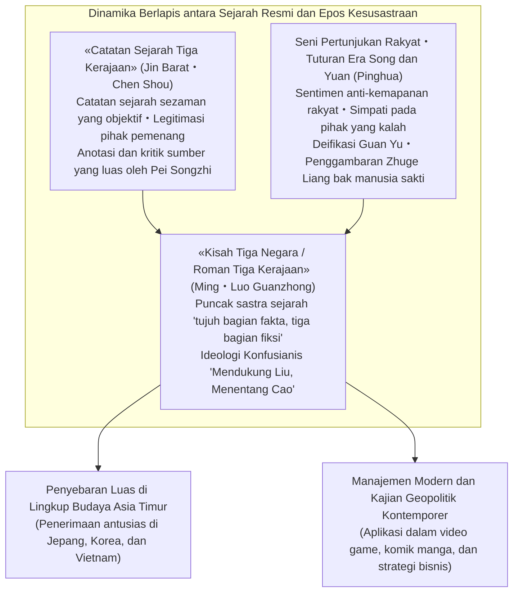
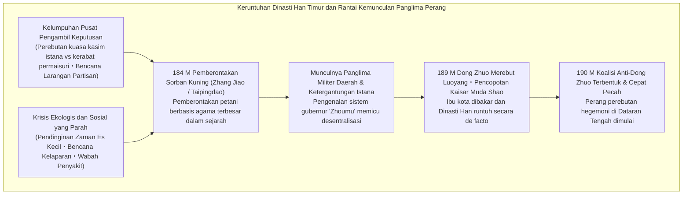
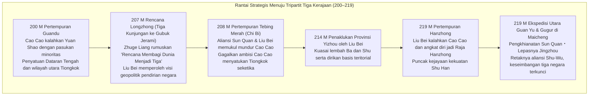
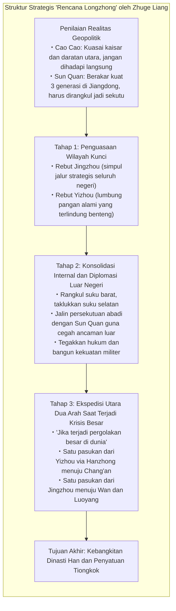
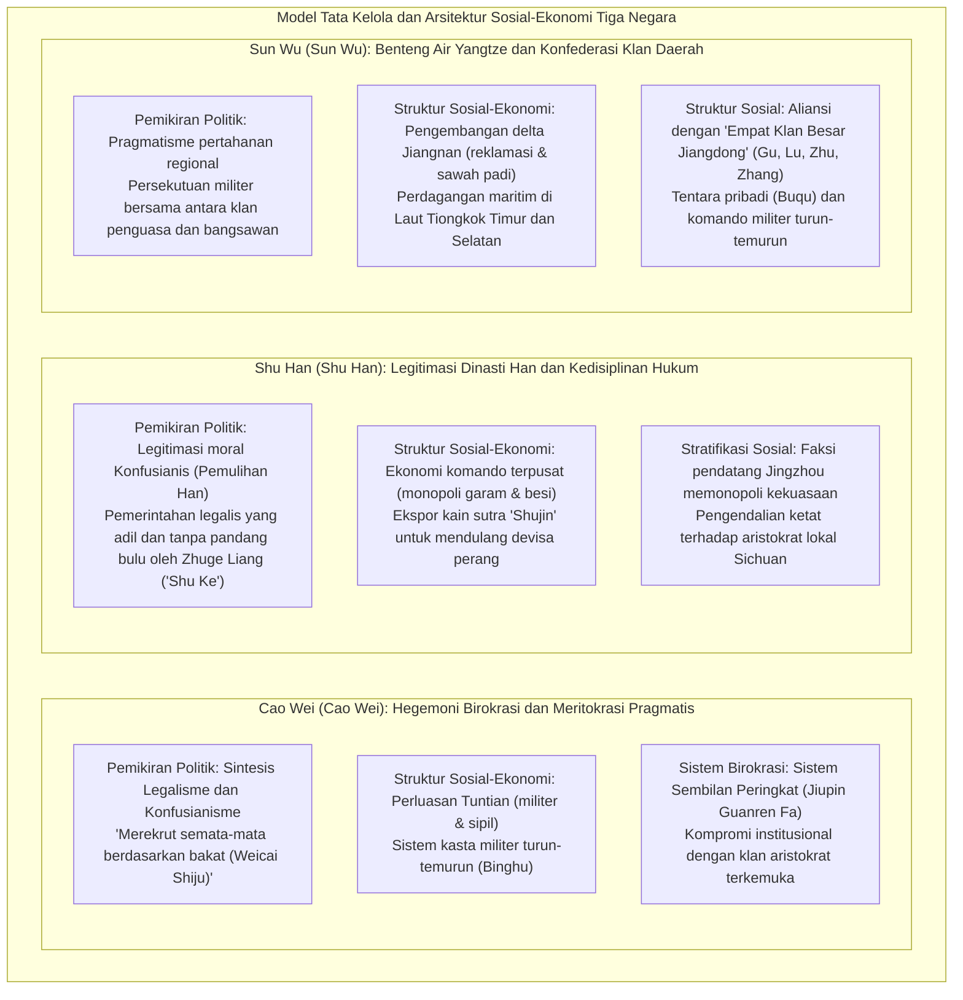

## Pendahuluan: Mengapa «Zaman Tiga Kerajaan» Tetap Memikat Umat Manusia Setelah 1.800 Tahun?

Hampir satu abad membentang antara meletusnya «Pemberontakan Sorban Kuning» pada tahun 184 Masehi hingga keberhasilan Dinasti Jin Barat (Western Jin) menaklukkan Sun Wu dan menyatukan seluruh daratan Tiongkok pada tahun 280 Masehi. Pasang surut dan pergolakan dahsyat **«Zaman Tiga Kerajaan» (Three Kingdoms period / Samkok)**, yang berlangsung di hamparan luas daratan Eurasia timur, telah melampaui rentang waktu 1.800 tahun dan hingga kini terus memikat imajinasi intelektual serta hasrat manusia di seluruh dunia.

Mengapa dari sekian banyak drama pergantian dinasti dalam sejarah panjang Tiongkok, kekacauan pada era inilah yang memancarkan daya tarik magnetis dan pengaruh budaya yang begitu abadi?

Alasan fundamentalnya terletak pada kenyataan bahwa semesta Tiga Kerajaan memiliki «struktur ganda» yang tiada bandingannya: di satu sisi, ia berdiri tegak sebagai **fakta sejarah yang diverifikasi secara kritis dalam catatan resmi «Catatan Sejarah Tiga Kerajaan» (Sanguozhi, karya Chen Shou dengan anotasi dan kompilasi Pei Songzhi)**; di sisi lain, ia abadi sebagai **puncak mahakarya fiksi sejarah dunia, yaitu novel «Kisah Tiga Negara» (Sanguo Yanyi, karya Luo Guanzhong)** pada era Dinasti Ming, yang menyerap antusiasme rakyat jelata, dongeng jalanan, dan drama panggung selama lebih dari seribu tahun.



Sebagai kenyataan historis, Zaman Tiga Kerajaan sesungguhnya adalah zaman yang sangat kelam, kejam, dan berdarah. Runtuhnya tatanan institusional Dinasti Han Timur diiringi dengan anjloknya populasi secara drastis, pendinginan iklim global, bencana kelaparan, dan perang saudara yang berkepanjangan tanpa henti. Populasi terdaftar yang mencapai sekitar 56 juta jiwa pada puncak kejayaan Han Timur merosot tajam menjadi hanya sekitar 8 juta jiwa di penghujung era Tiga Kerajaan jika populasi Wei, Shu, dan Wu digabungkan (bahkan dengan memperhitungkan gelombang pengungsi dan warga yang luput dari sensus, kehancuran sosial masyarakat berada pada titik nadir).

Namun, justru dari kehampaan institusional dan persaingan hidup-mati yang ekstrem inilah lahir **«inovasi strategi kecerdikan»** serta **«eksperimen berani dalam tata kelola negara»** yang meruntuhkan otoritas tradisional dan sekat kasta feodal:
- Kebijakan meritokrasi murni dalam perekrutan pejabat («merekrut semata-mata berdasarkan bakat dan kemampuan» / 唯才是挙) dan sistem koloni pertanian militer «Tuntian» yang digagas Cao Cao (Cao Cao) untuk mengatasi krisis logistik pangan.
- Cetak biru geopolitik agung «Rencana Longzhong» (天下三分之计 / Longzhong Plan) yang dirancang Zhuge Liang (Zhuge Liang), yang memungkinkan sebuah negara kecil di pedalaman menantang hegemoni raksasa, dipadukan dengan supremasi hukum yang tegas dan tanpa kompromi.
- Pembukaan dan reklamasi wilayah selatan Sungai Yangtze (Jiangnan) oleh Sun Quan (Sun Quan) di balik benteng air alami, yang melahirkan embrio negara maritim berorientasi perdagangan laut di Laut Tiongkok Timur dan Selatan.

Dan di atas segalanya, drama psikologis mendalam dari para tokoh yang hidup pada masa itu — rasionalisme dingin dan kesepian mendalam Cao Cao; keteguhan moral, keuletan, dan kebajikan Liu Bei; kesetiaan mutlak dan kebanggaan tragis Guan Yu; serta pengorbanan suci Zhuge Liang demi sebuah cita-cita yang mustahil — telah menjelma menjadi himne universal tentang eksistensi manusia yang melintasi sekat zaman dan bangsa.

Dalam panduan komprehensif ini, kita tidak hanya akan menyajikan ringkasan cerita atau anekdot laga semata, melainkan **membedah panorama agung Tiga Kerajaan secara mendalam dari sudut pandang historiografi, filsafat politik, geopolitik militer, sistem sosial-ekonomi, dan sejarah resepsi budaya**. Dengan menyingkap jurang pemisah antara sejarah resmi dan novel secara objektif, kita akan menyelami kedalaman strategi dan gagasan mereka yang bertarung di tengah zaman kekacauan.

---

## Bab 1: Senjakala Dinasti Han Timur dan Pecahnya Tirani Panglima Perang (184–200 M)

Lonceng pembuka Zaman Tiga Kerajaan berdentang dari kehancuran dramatis imperium akbar «Han» (Han Barat dan Han Timur) yang telah menyatukan dunia Tiongkok selama empat abad. Mengapa sebuah kekaisaran terpusat yang perkasa dapat kehilangan daya rekatnya begitu cepat hingga tercerai-berai menjadi faksi-faksi militer regional? Di balik bencana ini, terjadi perpaduan rumit antara kelelahan institusional, kebobrokan istana, dan perubahan iklim global.



### 1.1 Tirani Kasim Istana, Kerabat Permaisuri, dan «Bencana Larangan Partisan»: Kegagalan Struktural Han

Struktur politik Han Timur (25–220 M) pada paruh keduanya terjebak dalam lingkaran setan yang menghancurkan, yang dipicu oleh bertakhtanya kaisar-kaisar yang masih kanak-kanak secara berturut-turut.

Apabila kaisar masih balita atau anak-anak, kekuasaan nyata otomatis jatuh ke tangan ibu suri dan klan keluarganya yang disebut **«Waiqi» (kerabat pihak permaisuri)**. Namun, ketika sang kaisar beranjak dewasa dan berhasrat merebut kembali kekuasaan pribadinya, ia terpaksa bersekutu dengan para **«kasim istana» (kebiri)** yang mendampingi kesehariannya di kedalaman istana terlarang, untuk melenyapkan klan kerabat permaisuri dengan kekerasan bersenjata. Celakanya, begitu kasim menggenggam kekuasaan, mereka segera menyalahgunakannya demi pengayaan pribadi, menjual jabatan, dan menempatkan kerabat mereka sebagai pejabat daerah yang menindas rakyat. Ketika generasi berikutnya dipimpin oleh kaisar anak-anak yang baru, kerabat permaisuri kembali membalas dendam dengan membantai kasim. Lingkaran pertumpahan darah ini berputar tiada henti.

Melihat kebobrokan moral ini, para birokrat Konfusianis dan mahasiswa Akademi Kekaisaran (Taixue) melancarkan kritik keras terhadap korupsi kasim. Mereka membanggakan diri sebagai «Aliran Jernih» (Qingliu) dan mencemooh faksi kasim sebagai «Aliran Keruh» (Zhuoliu).

Merasa terancam, faksi kasim memanipulasi kaisar dan memfitnah para cendekiawan Aliran Jernih dengan tuduhan membentuk faksi gelap untuk merongrong negara. Hal ini berujung pada pembersihan berdarah yang dikenal sebagai **«Bencana Larangan Partisan» (Danggu zhi huo)** pada tahun 166 dan 169 Masehi. Ratusan pejabat dan intelektual terkemuka dihukum mati atau tewas di penjara, dan ribuan lainnya dicabut hak politiknya seumur hidup.

Pembersihan ini memberikan luka fatal yang tidak dapat disembuhkan bagi Dinasti Han. Kalangan tuan tanah daerah dan kelas terpelajar kehilangan harapan sepenuhnya terhadap pemerintah pusat, serta kehilangan tekad moral untuk membela hukum dan otoritas kekaisaran. Di tengah ruang hampa otoritas moral inilah tanah subur bagi bangkitnya kekuatan bersenjata regional terbentuk dengan cepat.

### 1.2 Pendinginan Iklim, Kelaparan, Wabah, dan «Pemberontakan Sorban Kuning»

Korupsi politik diperparah oleh amukan bencana alam berskala besar.

Penelitian paleoklimatologi dan demografi sejarah menunjukkan bahwa pada paruh kedua abad ke-2 hingga abad ke-3, Asia Timur memasuki fase awal siklus pendinginan global yang dikenal sebagai **«Zaman Es Kecil» (Little Ice Age)**. Musim dingin yang membeku ekstrem serta kekeringan dan embun beku musim panas terjadi berturut-turut, menghancurkan produktivitas pertanian di sepanjang lembah Sungai Kuning dan Sungai Yangtze. Rakyat jelata yang mengalami malnutrisi parah kemudian dihantam oleh **pandemi wabah mematikan** (diduga tifus atau cacar). Penyair era Jian'an, Cao Zhi, mencatat kengerian ini dalam karyanya «Shuo Yi Fu»: «Setiap rumah meratapi mayat sanak saudara yang terbujur kaku, setiap kamar dipenuhi ratapan pilu yang menyayat hati.»

Di tengah keputusasaan tanpa dasar inilah muncul seorang tabib mistikus Tao dari wilayah Julu (sekarang Provinsi Hebei) bernama **Zhang Jiao (Zhang Jiao)**.

Zhang Jiao memadukan ajaran Kaisar Kuning dan Laozi dengan kepercayaan rakyat untuk mendirikan sekte agama baru bernama **«Taipingdao» (Jalan Kedamaian Abadi)**. Dengan membagikan air suci mantera («fushui») untuk menyembuhkan penyakit dan mewajibkan pengakuan dosa di depan umum, ia dengan cepat mengumpulkan ratusan ribu pengikut petani yang putus asa. Zhang Jiao kemudian mengorganisasi para pengikutnya menjadi struktur militer, membagi seluruh negeri menjadi 36 komando militer («Fang»), dan mempersiapkan pemberontakan serentak.

Slogan mereka adalah sebuah ramalan nubuat yang mengguncang kekaisaran:
> **«蒼天已死、黃天當立、歲在甲子、天下大吉»**  
> (Langit Biru telah mati, Langit Kuning harus bangkit; pada tahun Jiazi, kedamaian dan kemakmuran agung menaungi dunia!)

«Langit Biru» yang melambangkan mandat Dinasti Han telah habis peruntungannya. Sebagai gantinya, «Langit Kuning» yang melambangkan unsur tanah yang suci harus ditegakkan. Tahun «Jiazi» (tahun 184 Masehi, awal dari siklus 60 tahun kalender Tionghoa) ditetapkan sebagai tahun revolusi besar.

Pada bulan Februari 184 M, ratusan ribu pengikut mengikatkan kain kuning di kepala mereka dan serentak mengangkat senjata. Inilah **«Pemberontakan Sorban Kuning» (Yellow Turban Rebellion)**. Pemberontakan meletus dahsyat di Hebei, Henan, dan Shandong, meluluhlantakkan jantung kekaisaran; kantor-kantor pemerintah dibakar, para pejabat dibunuh atau melarikan diri.

Istana yang panik segera mengirim jenderal-jenderal kawakan seperti Huangfu Song (Huangfu Song), Zhu Jun (Zhu Jun), dan Lu Zhi (Lu Zhi), mencabut larangan partisan untuk merangkul para sarjana, serta memobilisasi milisi lokal. Pada momen inilah para pemuda gagah berani yang kelak menjadi legenda — Cao Cao, Liu Bei, dan Sun Jian — terjun ke panggung sejarah sebagai komandan pasukan sukarela dan penumpas pemberontak.

Pemberontakan utama berhasil dipadamkan dalam kurun waktu satu tahun, terutama setelah kematian mendadak Zhang Jiao akibat penyakit dan gempuran tentara kekaisaran. Namun, sisa-sisa pemberontak bertransformasi menjadi kelompok gerilya mandiri seperti «Pemberontak Gunung Hitam» dan «Pemberontak Gelombang Putih» yang terus melancarkan perang atrisi. Karena istana tidak lagi mampu membiayai dan mengendalikan keamanan, pada tahun 188 M mereka menerapkan kebijakan fatal: memperkenalkan kembali **«Sistem Gubernur Provinsi» (Zhoumu)**. Penganugerahan wewenang militer, administrasi, dan fiskal penuh kepada seorang gubernur daerah secara otomatis mengubah para pejabat birokrat daerah tersebut menjadi **panglima perang otonom (Warlords)** yang merdeka.

### 1.3 Tirani Dong Zhuo dan Pembumihangusan Luoyang: Runtuhnya Tatanan Lama

Pada tahun 189 M, Kaisar Ling wafat, dan konfrontasi antara kepala kerabat permaisuri He Jin (He Jin) dengan faksi kasim «Sepuluh Kasim Pengiring» (Shichangshi) mencapai klimaksnya. Berniat menggunakan kekuatan militer untuk mengintimidasi para kasim, He Jin mengambil keputusan gegabah dengan memanggil jenderal perbatasan Liangzhou yang berwatak beringas, **Dong Zhuo (Dong Zhuo)**, beserta legiun kavaleri perbatasannya ke ibu kota Luoyang.

Namun, sebelum Dong Zhuo tiba, para kasim mengetahui rencana tersebut, menjebak He Jin di dalam istana, dan memenggal kepalanya. Marah besar atas pembunuhan itu, para perwira muda bangsawan seperti Yuan Shao (Yuan Shao) dan Cao Cao memimpin pasukan menyerbu istana dan membantai lebih dari dua ribu kasim dalam sebuah kudeta berdarah.

Di tengah kekacauan anarki tanpa pemerintahan inilah Dong Zhuo memasuki Luoyang dengan kekuatan militer yang tak tertandingi. Sebagai jenderal perbatasan yang kasar, Dong Zhuo menindas para bangsawan terpelajar dengan senjata, mencopot Kaisar muda Shao dan menggantikannya dengan Kaisar Xian (Liu Xie) yang masih bocah, lalu mengangkat dirinya sendiri sebagai Perdana Menteri Mutlak («Xiangguo») yang memonopoli seluruh urusan negara.

Pemerintahan teror yang kejam dan sewenang-wenang oleh Dong Zhuo menjadi penghinaan yang tak tertahankan bagi para bangsawan feodal. Pada tahun 190 M, para adipati di timur celah Hangu mengangkat Yuan Shao sebagai pemimpin tertinggi dan membentuk **«Koalisi Melawan Dong Zhuo»**. Tokoh-tokoh seperti Cao Cao, Sun Jian, Yuan Shu, Qiao Mao, dan Bao Xin bergabung di bawah panji koalisi ini.

Menghadapi tekanan koalisi, Dong Zhuo mengambil keputusan bumi hangus yang mengerikan: ia memaksa jutaan penduduk Luoyang bermigrasi paksa dengan berjalan kaki ke Chang'an (sekarang Xi'an), lalu menjarah dan membakar istana, kuil leluhur, gedung pemerintahan, rumah warga, hingga membongkar makam kaisar-kaisar terdahulu demi merampok emas. Luoyang, kota metropolitan peradaban terbesar di Asia Timur, rata dengan tanah menjadi abu dalam semalam.

Ironisnya, pasukan koalisi yang mulanya mengusung panji keadilan justru dicekam ketakutan terhadap kedahsyatan kavaleri Dong Zhuo. Mereka menolak maju, malah menghabiskan waktu dengan berpesta pora, saling intrik, dan berebut wilayah. Upaya serangan sendirian oleh Cao Cao dan Sun Jian berujung pada kegagalan karena ketiadaan bantuan. Koalisi akhirnya bubar akibat perselisihan internal. Tatanan imperium lama musnah total, dan era seleksi alam yang kejam dalam **«Zaman Panglima Perang»** pun resmi dimulai.

(Adapun tiran Dong Zhuo sendiri akhirnya dibunuh pada tahun 192 M di Chang'an melalui intrik cerdik menteri Wang Yun (Wang Yun) yang bersekutu dengan putra angkat Dong Zhuo yang tak tertandingi, Lu Bu (Lu Bu); jasadnya yang tambun dibakar lemaknya di tengah pasar sebagai tontonan rakyat).

### 1.4 Perebutan Hegemoni di Dataran Tengah: Pasang Surut Para Panglima Perang

Dataran Tengah (Zhongyuan — daerah lumbung padi di lembah Sungai Kuning) yang telah hancur lebur menjadi arena turnamen gladiator berdarah antar faksi:

- **Yuan Shao (Yuan Shao)**: Berasal dari klan aristokrat paling terkemuka («Empat generasi menduduki Tiga Menteri Utama»). Setelah menghabisi saingannya Gongsun Zan, ia menyatukan empat provinsi utara Sungai Kuning (Ji, Qing, You, Bing) dan membentuk pasukan terkuat pada masanya.
- **Yuan Shu (Yuan Shu)**: Saudara tiri (atau sepupu) Yuan Shao yang menguasai wilayah Huainan. Saat Segel Giok Kekaisaran jatuh ke tangannya, ia termakan delusi keagungan dan memproklamasikan dirinya sebagai kaisar Dinasti Zhong, memicu kepungan dari segala penjuru hingga hancur binasa dalam kelaparan.
- **Sun Ce (Sun Ce)**: Putra sulung Sun Jian sang «Harimau Jiangdong». Dikenal sebagai «Penakluk Muda» (Xiao Bawang) karena keberanian dan karismanya yang luar biasa, ia berhasil menaklukkan enam wilayah komando di selatan Sungai Yangtze (Jiangdong) hanya dalam kurun beberapa tahun, meletakkan fondasi teritorial kokoh bagi Dinasti Wu kelak; namun ia tewas diserang pembunuh gelap pada tahun 200 M di usia 26 tahun.
- **Lu Bu (Lu Bu)**: Panglima perang tak terkalahkan yang dijuluki «Di antara manusia ada Lu Bu, di antara kuda ada Kelinci Merah (Red Hare)». Namun ia tidak memiliki kesetiaan politik; ia mengkhianati Ding Yuan lalu Dong Zhuo, mengembara dan merebut Xuzhou dari Liu Bei, hingga akhirnya dikepung oleh Cao Cao dan Liu Bei di Xiapi dan dieksekusi setelah dikhianati anak buahnya.
- **Liu Biao (Liu Biao)**: Tokoh berwibawa tinggi yang memelihara kedamaian di provinsi Jingzhou yang makmur di Sungai Yangtze tengah. Ia menampung ratusan ribu pengungsi dan cendekiawan, tetapi bersikap pasif tanpa ambisi menyatukan kekaisaran.
- **Liu Bei (Liu Bei)**: Mengklaim sebagai keturunan Kaisar Jing dari Han Barat, namun masa mudanya miskin dan menjual sandal jerami demi menyambung hidup bersama ibunya. Bersama saudara angkatnya Guan Yu dan Zhang Fei, ia terusir dari satu wilayah ke wilayah lain, mengabdi pada Tao Qian, Lu Bu, Cao Cao, Yuan Shao, hingga Liu Biao. Kendati tidak memiliki tanah kekuasaan sendiri, ia sangat tersohor di seantero negeri berkat integritas moral dan daya tarik karismanya yang memikat hati rakyat.

### 1.5 Kebangkitan Cao Cao dan «Mengendalikan Kaisar»: Sintesis Legitimasi dan Realisme

Di tengah belantara panglima perang ini, sosok yang melesat paling tinggi berkat visi strategisnya yang luar biasa adalah **Cao Cao (Cao Cao, nama kehormatan Mengde)**.

Sebagai keturunan adopsi dari kasim istana (kakek angkatnya adalah kasim berkuasa Cao Teng), Cao Cao sempat dipandang sebelah mata oleh aristokrat berdarah biru seperti Yuan Shao. Namun, Cao Cao adalah sosok genius serba bisa: jenderal perang ulung, politisi berdarah dingin yang realistis, sekaligus salah satu penyair terbesar dalam sejarah sastra Tiongkok.

Manuver strategis penentu pertama yang dilakukan Cao Cao adalah **«Menyambut dan Melindungi Kaisar Xian» (196 M)**.  
Kaisar muda yang melarikan diri dari teror para jenderal Dong Zhuo di Chang'an hidup menggelandang dalam kelaparan di reruntuhan Luoyang. Mengikuti saran penasihat geniusnya, Xun Yu (Xun Yu), Cao Cao bergegas membawa pasukannya menjemput kaisar dan memboyongnya ke markasnya di Xuchang (sekarang Provinsi Henan).

Langkah brilian ini memberi Cao Cao kartu truf politik yang mutlak:
> **«Mengendalikan Putra Langit untuk memerintah para bangsawan dan panglima perang» (挟天子以令諸侯)**

Bagi panglima perang mana pun, menyerang Cao Cao kini diartikan sebagai pemberontakan terbuka terhadap kaisar. Sebagai Perdana Menteri («Chengxiang»), Cao Cao berhak mengeluarkan dekret resmi kekaisaran untuk mengecap musuh-musuhnya sebagai pemberontak, dan melegitimasi setiap operasi militernya sebagai «penumpasan pemberontak oleh tentara resmi pemerintah».

Pada saat yang sama, Cao Cao meluncurkan reformasi ekonomi fundamental untuk membangun kembali Dataran Tengah yang luluh lantak: **«Sistem Tuntian» (Koloni Pertanian Militer dan Sipil - Tuntian system)** pada tahun 196 M atas usulan Zao Zhi dan Han Hao. Tanah-tanah terbengkalai disita negara, lalu para pengungsi ditampung dan diberi sapi bajak serta benih untuk bercocok tanam. Sebagai gantinya, negara menarik 50% hingga 60% hasil panen sebagai sewa/pajak, sementara para petani dibebaskan dari wajib militer dan dilindungi.

Melalui sistem Tuntian, pasukan Cao Cao berhasil mengatasi krisis «kekurangan ransum pangan» yang paling menyengsarakan panglima perang lainnya, serta menimbun jutaan gantang gabah di gudang-gudang negara. Dengan mengawinkan legitimasi politik (perlindungan kaisar) dan basis logistik yang solid (sistem Tuntian), Cao Cao kini siap melangkah ke panggung pertarungan penentuan hidup-mati melawan raksasa utara, Yuan Shao.

---

## Bab 2: Benturan Para Raksasa dan Menuju Tripartit Tiga Kerajaan (200–219 M)

Dua dekade dari tahun 200 hingga 219 Masehi adalah masa keemasan paling mendebarkan dan sarat dengan manuver strategi militer dalam sejarah Tiga Kerajaan, di mana kekacauan perang saudara mengerucut menjadi perimbangan tiga kekuatan besar: «Wei, Shu, dan Wu».

Jalan sejarah pada periode ini ditentukan oleh tiga kampanye militer kolosal: **Pertempuran Guandu (200 M)**, **Pertempuran Tebing Merah / Chi Bi (208 M)**, dan **Perebutan Hanzhong serta Fancheng (219 M)**.



### 2.1 Pertempuran Guandu (200 M): Kemenangan Pasukan Minoritas Berkat Serangan Logistik

Pada tahun 200 Masehi, meletuslah pertempuran legendaris **«Pertempuran Guandu» (Battle of Guandu)** demi memperebutkan supremasi atas seluruh wilayah utara Tiongkok.

Pihak yang saling berhadapan adalah **Yuan Shao**, penguasa empat provinsi utara yang memimpin 100.000 infanteri tangguh dan 10.000 kavaleri; melawan **Cao Cao**, yang kendati mengawal kaisar, pasukannya hanya berkisar antara 20.000 hingga 30.000 prajurit. Perbandingan kekuatan militer mencapai satu banding tiga atau empat. Mayoritas analis saat itu meyakini kekalahan Cao Cao tinggal menunggu waktu.

Yuan Shao menyeberangi Sungai Kuning dan mengepung benteng pertahanan Cao Cao di Guandu (timur laut Kabupaten Zhongmou, Henan). Yuan Shao membangun bukit buatan dan menara panah kayu tinggi untuk menghujani perkemahan musuh dengan panah, serta menggali terowongan bawah tanah. Cao Cao membalas secara brilian: ia merancang mesin pelempar batu ketapel («Fa Shi Che») yang menghancurkan menara panah, serta menggali parit pertahanan melintang untuk memotong terowongan.

Kendati demikian, kebuntuan yang berkepanjangan mencekik pasukan Cao Cao yang kalah jumlah dan persediaan. Pangan menipis, tentara kelaparan dan kelelahan, bahkan Cao Cao sendiri sempat goyah dan menulis surat kepada Xun Yu di Xuchang yang menyatakan niatnya untuk mundur. Xun Yu segera membalas dengan tegas: «Mundur sekarang berarti menyerahkan dunia kepada Yuan Shao. Bertahanlah dan nantikan celah kesalahan musuh!»

Titik balik dramatis yang menentukan nasib perang akhirnya tiba melalui runtuhnya sistem **«intelijen dan logistik»** pihak musuh.

Salah satu penasihat kunci Yuan Shao, **Xu You (Xu You)**, membelot ke pihak Cao Cao di tengah malam gelap gulita setelah usulannya ditolak mentah-mentah oleh Yuan Shao dan keluarganya ditangkap karena kasus korupsi.

Mendengar kabar kedatangan sahabat lamanya, Cao Cao begitu gembira hingga berlari keluar menyambutnya tanpa sempat memakai sepatu. Xu You membocorkan rahasia militer yang paling vital:
> «Seluruh persediaan beras dan gandum pasukan Yuan Shao yang berjumlah puluhan ribu kereta ditimbun di pangkalan belakang di **Wuchao (Wuchao)**. Komandannya, Chunyu Qiong (Chunyu Qiong), adalah pemabuk yang lengah. Jika engkau memimpin kavaleri elite menyerang pangkalan itu di malam hari dan membakarnya, pasukan Yuan Shao yang berjumlah ratusan ribu akan runtuh seketika tanpa perlu diperangi!»

Cao Cao segera mengambil keputusan berani. Ia memimpin sendiri 5.000 prajurit kavaleri ringan terpilih, menyamar dengan bendera pasukan Yuan Shao, mencoreng wajah mereka dengan arang, menyumpal mulut kuda dengan bilah kayu agar tidak bersuara, dan menyelinap melewati pos penjagaan musuh menuju Wuchao. Dalam pertempuran malam yang sengit, pasukan Chunyu Qiong dibantai dan seluruh gudang beras serta perbekalan Yuan Shao dibakar habis.

Kobaran api Wuchao yang menerangi langit malam memicu kepanikan luar biasa di kalangan tentara Yuan Shao. Barisan pertahanan mereka hancur seketika saat dua jenderal andalan Yuan Shao, Zhang He (Zhang He) dan Gao Lan, memutuskan menyerah kepada Cao Cao. Yuan Shao bersama putra sulungnya Yuan Tan melarikan diri ke utara Sungai Kuning hanya dengan 800 pengawal berkuda yang tersisa.

Pertempuran Guandu bukan sekadar kemenangan taktis militer biasa, melainkan tonggak keunggulan rasionalisme modern — meritokrasi, kecepatan eksekusi, serta keutamaan intelijen dan logistik — yang berhasil meremukkan aристоkrasi feodal yang lamban dan arogan. Setelah kematian Yuan Shao akibat sakit, Cao Cao menghancurkan klan Yuan satu per satu, dan pada tahun 207 M, setelah menundukkan suku Wuhuan di utara, **berhasil menyatukan seluruh Tiongkok utara secara mutlak**.

### 2.2 Pengembaraan Liu Bei dan «Tiga Kunjungan ke Gubuk Jerami»: Dampak Geopolitik Rencana Longzhong

Saat wilayah utara disatukan oleh keperkasaan Cao Cao, **Liu Bei (Liu Bei)** yang hidup menggelandang menumpang di wilayah Jingzhou di bawah naungan Liu Biao, ditempatkan di kota perbatasan terpencil Xinye. Di usianya yang telah melampaui 40 tahun, ia kerap meratapi nasibnya («Ratapan Lemak Paha»): «Dahulu tubuhku kekar karena tak pernah lepas dari pelana kuda. Kini pahaku berlemak tebal karena menganggur, usiaku bertambah, namun cita-citaku menyelamatkan negeri belum terwujud!»

Namun pada tahun 207 M, terjadilah perjumpaan bersejarah yang mengubah peta peradaban Tiongkok untuk selamanya: pertemuannya dengan seorang pemuda pertapa jenius berusia 27 tahun di gubuk jerami perbukitan Longzhong, Xiangyang, bernama **Zhuge Liang (Zhuge Liang, nama kehormatan Kongming)**.

Liu Bei secara pribadi menunjukkan kerendahan hati yang tulus dengan mengunjungi gubuk pemuda itu sebanyak tiga kali untuk memohon bimbingan. Peristiwa inilah yang diabadikan sebagai **«Tiga Kunjungan ke Gubuk Jerami» (Three Visits to the Thatched Cottage)**. Dan di dalam bilik bersahaja itulah Zhuge Liang memaparkan cetak biru geopolitik agung bagi pendirian negara, yang dikenal sebagai **«Rencana Longzhong» (Longzhong Plan / 隆中対)**.



Intisari rencana yang dipaparkan Zhuge Liang berakar pada realisme politik yang dingin dan tajam:
1. **Pemilahan Jelas Antara Kawan dan Lawan**: Cao Cao menguasai kaisar dan memegang kendali Dataran Tengah, maka pantang dilawan secara frontal. Sun Quan berakar kuat di Jiangdong dan dicintai rakyatnya, maka wajib dijadikan sekutu, bukan musuh.
2. **Penentuan Target Wilayah**: Jingzhou adalah urat nadi perhubungan air dan darat yang menghubungkan utara dan selatan, tetapi Liu Biao tidak punya kapasitas untuk mempertahankannya. Yizhou (Cekungan Sichuan) adalah «lumbung alamiah» yang subur dan dikelilingi benteng pegunungan terjal, sementara Liu Zhang adalah penguasa yang lemah. Rebutlah kedua provinsi ini sebagai pijakan kekuasaan.
3. **Serangan Dua Arah (Penjepit) Saat Krisis Tiba**: Setelah membenahi urusan dalam negeri, menaklukkan suku-suku pedalaman selatan, dan mengikat persekutuan kokoh dengan Sun Quan, tunggulah saat terjadinya krisis suksesi atau kekacauan politik di kubu Cao Cao («jika dunia mengalami perubahan besar»). Pada saat itu, pasukan utama dari Sichuan bergerak maju ke Chang'an, sementara jenderal tepercaya dari Jingzhou memimpin pasukan menusuk ke Luoyang. Rakyat akan menyambut dengan gembira, dan Dinasti Han akan bangkit kembali.

Mendengar rancangan megah ini, Liu Bei merasa bagai kabut tebal yang menyelimuti hidupnya tersingkap seketika, dan berseru: «Aku memiliki Kongming bagaikan ikan yang menemukan air!» Dari seorang komandan tentara sewaan yang terombang-ambing, Liu Bei bertransformasi menjadi pemimpin visioner yang memiliki rancangan pembangunan sebuah negara berdaulat.

### 2.3 Pertempuran Tebing Merah (208 M): Benteng Air Sungai Yangtze dan Titik Balik Sejarah

Pada musim panas tahun 208 M, tak lama setelah Rencana Longzhong digagas, Cao Cao memimpin ratusan ribu tentara bergerak ke selatan. Malang tak dapat ditolak, penguasa Jingzhou Liu Biao wafat, dan putranya Liu Cong langsung menyerah tanpa syarat kepada Cao Cao. Liu Bei terpaksa melarikan diri ke selatan sambil melindungi gelombang ratusan ribu pengungsi; dalam Pertempuran Changban, kavaleri elite «Macan dan Macan Tutul» milik Cao Cao mengejar dan menghancurkan barisan pengungsi (momen di mana aksi heroik Zhao Yun menyelamatkan bayi Liu Shan dan lolongan guntur Zhang Fei di jembatan Changban melegenda).

Liu Bei mengungsi ke Xiakou (sekarang Wuhan) dan mengutus Zhuge Liang ke kubu pemimpin muda Jiangdong, **Sun Quan (Sun Quan)**. Di markas Sun Quan, mayoritas menteri sipil di bawah pimpinan Zhang Zhao mendesak untuk menyerah: «Cao Cao membawa ratusan ribu tentara, memegang dekret kaisar, dan kini merebut armada sungai Jingzhou. Menyerah adalah satu-satunya jalan selamat!»

Namun, Zhuge Liang bersama komandan perang **Zhou Yu (Zhou Yu)** dan menteri bijak **Lu Su (Lu Su)** berhasil membalikkan keadaan. Zhou Yu menguraikan tiga kelemahan fatal pasukan Cao Cao:
1. Pasukan Cao Cao terdiri atas infanteri dan kavaleri utara yang tidak terbiasa dengan pertempuran air dan menderita mabuk laut.
2. Jarak ekspedisi yang amat jauh telah menguras tenaga prajurit, sehingga wabah penyakit tak terelakkan.
3. Pasokan rumput dan pakan kuda sangat terbatas, serta jalur suplai beras di daerah rawa sangat rentan terputus.

Mendengar analisis itu, Sun Quan menghunus pedangnya dan memotong sudut meja seraya berseru: «Barang siapa masih berani menganjurkan menyerah, nasibnya akan sama seperti meja ini!» Ia menyerahkan 30.000 pasukan marinir elite kepada Zhou Yu untuk bergabung dengan pasukan Liu Bei dan berlayar ke hulu Sungai Yangtze.

Pada musim dingin tahun 208 M, di kawasan tebing terjal **Tebing Merah (Chi Bi / Battle of Red Cliffs)** di Sungai Yangtze, bertemulah dua kekuatan raksasa tersebut.

Pasukan Cao Cao, yang tersiksa oleh mabuk laut, merantai kapal-kapal perang mereka satu sama lain dengan rantai besi dan menggelar papan kayu di atasnya agar stabil menyerupai benteng terapung. Melihat formasi ini, wakil komandan Zhou Yu, **Huang Gai (Huang Gai)**, merancang strategi serangan api («muslihat pura-pura menyerah»). Ia mengirim surat penyerahan diri palsu kepada Cao Cao, lalu memimpin puluhan kapal cepat yang dipadati rumput kering dan minyak menuju armada Cao Cao.

Ketika angin tenggara bertiup kencang secara mendadak, kapal-kapal Huang Gai serentak disulut api dan melesat menghujam armada berantai Cao Cao. Rantai besi membuat kapal-kapal raksasa Cao Cao tak dapat bergerak melepaskan diri; api berkobar dahsyat dan dalam sekejap permukaan Sungai Yangtze berubah menjadi lautan api. Angin kencang menerbangkan percikan api ke perkemahan di tepi pantai, meluluhlantakkan kekuatan pasukan Cao Cao dalam skala yang tak pernah terjadi sebelumnya.

Cao Cao terpaksa melarikan diri bersama sisa pasukannya melintasi jalur rawa berlumpur Huarong yang dipenuhi wabah untuk kembali ke utara.

Pertempuran Tebing Merah adalah pertempuran air terbesar dalam sejarah militer Tiongkok, yang **secara permanen mengubur ambisi Cao Cao untuk menyatukan seluruh Tiongkok dalam sekejap**, mengamankan kekuasaan aliansi selatan di lembah Sungai Yangtze, serta mengubah visi «dunia terbagi tiga» menjadi kenyataan politik.

### 2.4 Perebutan Yizhou dan Perang Hanzhong (211–219 M): Berdirinya Shu Han

Setelah kemenangan gemilang di Tebing Merah, Liu Bei dengan cepat mengamankan wilayah selatan Jingzhou dan akhirnya memiliki basis teritorial sendiri. Namun, penyelesaian Rencana Longzhong menuntut penaklukan lumbung pangan raksasa di barat: **Provinsi Yizhou (Cekungan Sichuan)**.

Pada tahun 211 M, gubernur Yizhou, Liu Zhang, meminta bantuan Liu Bei untuk menghadapi ancaman pemimpin Taoisme Zhang Lu di utara. Penasihat Pang Tong (Pang Tong) dan Fa Zheng (Fa Zheng) meyakinkan Liu Bei bahwa ini adalah kesempatan emas yang dikirim surga. Kendati harus kehilangan penasihat brilian Pang Tong yang gugur terkena panah di Lembah Burung Feniks, pada tahun 214 M tentara Liu Bei berhasil mengepung ibu kota Chengdu dan memaksa Liu Zhang menyerah. Liu Bei merekrut jenderal kawakan Huang Zhong (Huang Zhong) dan ksatria kavaleri barat laut Ma Chao (Ma Chao) ke dalam jajaran pasukannya.

Kemudian pada tahun 217 M, Liu Bei melancarkan kampanye untuk merebut gerbang utara Sichuan, yaitu wilayah strategis **Hanzhong (Hanzhong)**. Jika Hanzhong dikuasai Wei, Chengdu akan selalu terancam bahaya serbuan setiap saat.

Dalam Pertempuran Gunung Dingjun (219 M), berkat taktik cermat Fa Zheng, jenderal tua Huang Zhong menyerbu dari puncak bukit dan berhasil menebas komandan tertinggi pasukan Wei di barat, **Xiahou Yuan (Xiahou Yuan)**. Cao Cao yang murka memimpin sendiri pasukan raksasa ke Hanzhong, tetapi Liu Bei memilih bertahan di benteng-benteng gunung dan memutus jalur logistik musuh lewat perang gerilya. Karena kehabisan perbekalan dan menemui jalan buntu, Cao Cao mengumumkan kata sandi malam «Tulang Rusuk Ayam» (dibuang sayang, dimakan tak berdaging) dan terpaksa menarik mundur pasukannya.

Pada musim gugur tahun 219 M, Liu Bei menguasai Hanzhong sepenuhnya dan dinobatkan menjadi **«Raja Hanzhong» (Hanzhong Wang)**. Mantan penjual sandal jerami itu kini berdiri sejajar dengan Cao Cao sebagai penguasa sah. Kekuatan Shu Han mencapai puncak kejayaannya.

### 2.5 Ekspedisi Utara Guan Yu dan Tragedi Maicheng: Lepasnya Jingzhou dan Bencana Strategis

Namun, tepat di puncak kejayaan itulah malapetaka terbesar meletus, yang dipicu oleh ekspedisi tunggal jenderal legendaris penjaga Jingzhou, **Guan Yu (Guan Yu)**.

Pada musim panas tahun 219 M, menyambut kemenangan Liu Bei di Hanzhong, Guan Yu memimpin pasukan Jingzhou menyerbu ke utara dan mengepung pangkalan utama Cao Cao di Fancheng. Memanfaatkan hujan lebat dan meluapnya Sungai Han, Guan Yu menenggelamkan tujuh divisi pasukan bala bantuan Wei pimpinan Yu Jin, menawan sang komandan, serta memenggal jenderal tangguh Pang De yang menolak menyerah.

Kemenangan dahsyat ini **«mengguncang seantero Tiongkok» (威震華夏)** hingga membuat Cao Cao begitu ketakutan dan sempat mempertimbangkan untuk memindahkan ibu kotanya dari Xuchang lebih jauh ke utara.

Namun, kejayaan spektakuler Guan Yu ini justru memperlebar keretakan fatal dengan sekutu mereka, **Sun Quan**.  
Bagi Liu Bei, Jingzhou adalah batu loncatan menuju utara; tetapi bagi Sun Quan, dikuasainya hulu Sungai Yangtze oleh pihak lain adalah ancaman eksistensial bagi pertahanannya. Panglima baru Wu, **Lu Meng (Lu Meng)**, berbisik kepada Sun Quan: «Jika Guan Yu menaklukkan Cao Cao, target berikutnya pastilah negara kita. Inilah saat emas untuk menyerangnya dari belakang dan merebut kembali seluruh Jingzhou!»

Ditambah lagi, kendati memiliki kemampuan bela diri tiada tanding, Guan Yu sangat sombong dan meremehkan para bangsawan serta diplomat. Ketika Sun Quan melamar putri Guan Yu untuk putranya, Guan Yu menolaknya dengan hinaan kasar: «Bagaimana mungkin putri seekor harimau menikah dengan anak anjing?!» Ia juga memperlakukan buruk para pejabat logistiknya sendiri seperti Mi Fang (saudara ipar Liu Bei) dan Shi Ren.

Cao Cao dan Sun Quan diam-diam mengikat pakta militer rahasia. Lu Meng berpura-pura sakit parah dan menyerahkan komando kepada perwira muda yang belum dikenal, **Lu Xun (Lu Xun)**, untuk meninabobokan Guan Yu. Yakin bagian belakangnya aman, Guan Yu memindahkan seluruh pasukan garnisun cadangannya ke garis depan Fancheng.

Pada detik itulah taktik cerdik dilancarkan: pasukan komando Lu Meng menyamar dengan pakaian pedagang berwarna putih, mendayung perahu biasa menyusuri Sungai Yangtze («Menyeberang dengan Jubah Putih» / 白衣渡江), membekuk pos-pos sinyal api, dan merebut ibu kota Jingzhou, Jiangling, tanpa pertumpahan darah. Mi Fang dan Shi Ren langsung menyerah kepada Wu.

Pasukan Guan Yu tercerai-berai seketika setelah mengetahui pangkalan belakang mereka jatuh. Guan Yu terkurung di benteng kecil Maicheng, dan saat mencoba menerobos ke barat menuju Sichuan, ia disergap tentara Wu. Guan Yu beserta putranya Guan Ping ditawan lalu dipenggal, dan kepalanya dikirimkan kepada Cao Cao.

Gugurnya Guan Yu dan **lepasnya Provinsi Jingzhou** merupakan malapetaka geopolitik yang mematikan bagi Shu Han. Skenario penjepit dua arah dalam Rencana Longzhong hancur lebur untuk selamanya; Shu Han kini terisolasi di dalam sangkar pegunungan Sichuan yang sempit dengan populasi kurang dari satu juta jiwa. Dan kobaran amarah Liu Bei atas kematian saudara angkatnya segera menjerumuskan negeri itu ke dalam perang balas dendam yang merusak.

---

## Bab 3: Anatomi Komparatif Tiga Negara — Institusi, Ekonomi, dan Militer

Era Tiga Kerajaan bukan sekadar perang antar tiga panglima, melainkan sebuah **«laboratorium eksperimen tata kelola negara»** yang unik, di mana masing-masing entitas merespons keterbatasan geografis, demografis, dan tatanan sosial dengan model pemerintahan yang sangat berbeda.



### 3.1 Cao Wei: Imperium Raksasa Meritokrasi dan Reformasi Kelembagaan

Pada tahun 220 M, menyusul mangkatnya Cao Cao, putranya **Cao Pi (Cao Pi, Kaisar Wen)** memaksa Kaisar terakhir Han, Kaisar Xian, untuk turun takhta secara damai («Shanrang»), menandai berdirinya kekaisaran **«Wei»**.

Ciri khas Wei adalah keunggulan sumber daya demografis yang masif serta realisme institusional yang berani:

1. **Prinsip «Merekrut Berdasarkan Bakat» (唯才是挙 — Weicai Shiju)**:  
   Menolak sistem rekomendasi moralitas kuno Dinasti Han yang sarat kolusi keluarga bangsawan, Cao Cao tiga kali mengeluarkan dekret pencarian bakat (tahun 210, 214, dan 217 M): «Meskipun seseorang cacat moral atau tidak berbakti, asalkan memiliki keahlian strategi perang dan administrasi, angkatlah dia!» Sikap pragmatis ini merekrut pemikir genius seperti Guo Jia, Jia Xu, Cheng Yu, serta mengangkat jenderal-jenderal musuh yang menyerah seperti Zhang Liao, Xu Huang, dan Zhang He ke posisi komando tertinggi.

2. **Dari «Tuntian» Menuju Kasta Militer Turun-Temurun «Binghu»**:  
   Sistem koloni pertanian diperluas ke pangkalan militer garis depan, memungkinkan pasukan memproduksi makanan mereka sendiri di zona tempur. Selain itu, Wei melembagakan **«Sistem Binghu» (Binghu system)**, yaitu pendaftaran keluarga militer secara terpisah dari rakyat sipil; anak laki-laki diwajibkan menjadi tentara secara turun-temurun dan anak perempuan hanya boleh menikah dengan keluarga prajurit, menjamin ketersediaan tentara reguler terlatih sebanyak 500.000 personel.

3. **Pelembagaan «Sistem Sembilan Peringkat» (Jiupin Guanren Fa)**:  
   Diciptakan oleh menteri Chen Qun (Chen Qun) pada tahun 220 M saat Cao Pi naik takhta. Penilai pejabat daerah («Zhongzheng») ditugaskan menilai bakat dan silsilah calon pejabat ke dalam 9 peringkat.  
   Meskipun pada awalnya ditujukan untuk merekrut bakat terbaik, sistem ini merupakan bentuk kompromi kaisar dengan klan bangsawan besar. Lambat laun para bangsawan memonopoli jabatan penilai, melahirkan pameo: «Tiada rakyat miskin di peringkat atas, tiada bangsawan di peringkat bawah», yang mengokohkan struktur aristokrasi feodal Tiongkok selama berabad-abad kemudian.

### 3.2 Shu Han: Negara Kecil yang Ditegakkan atas Hukum dan Moralitas

Menanggapi kudeta Cao Pi atas Dinasti Han, Liu Bei memproklamasikan dirinya sebagai Kaisar di Chengdu pada tahun 221 M untuk meneruskan garis keturunan kekaisaran Han (secara resmi bernama **«Han»**, dalam historiografi disebut **Shu** atau **Shu Han**).

Kelemahan paling mematikan bagi Shu Han adalah **populasi dan wilayahnya yang teramat kecil**. Dibandingkan Wei yang menguasai 70% populasi Tiongkok (lebih dari 4,4 juta jiwa), Shu terkurung di pegunungan Sichuan dengan populasi terdaftar **hanya sekitar 900.000 hingga 1.000.000 jiwa** dan tentara sekitar 100.000 personel (seperempat kekuatan Wei).

Untuk menutupi ketimpangan masif ini, Zhuge Liang menerapkan kedisiplinan **«Supremasi Hukum» (Legalisme)** yang sangat ketat:

1. **Pemerintahan Hukum yang Adil dan Tanpa Kompromi («Shu Ke»)**:  
   Sejarawan Chen Shou memuji Zhuge Liang: «Ia menegakkan aturan hukum dengan saksama, bersikap tulus dan adil. Kebaikan sekecil apa pun diganjar, dan kejahatan sekecil apa pun dihukum tanpa memandang kasta bangsawan». Karena ketegasan yang adil ini, korupsi diberantas tuntas dan rakyat tunduk dengan penuh rasa hormat.

2. **Ekonomi Terpimpin: Sutra Shujin dan Monopoli Garam-Besi**:  
   Guna mendanai ekspedisi militernya yang mahal, Zhuge Liang memonopoli komoditas unggulan Sichuan: **kain sutra Shujin (Shu brocade)** berkualitas tinggi yang diekspor bahkan ke wilayah musuh di Wei dan Wu untuk meraup emas dan membeli kuda perang, serta menggenjot eksploitasi sumur garam dalam tanah.

3. **Retakan Internal: Faksi Pendatang Jingzhou vs Kaum Bangsawan Lokal**:  
   Pemerintahan Shu Han dirundung ketegangan internal laten: lingkaran kekuasaan tertinggi dipegang oleh segelintir pengungsi elite asal **Provinsi Jingzhou** (Zhuge Liang, Jiang Wan, Fei Yi), sementara kaum intelektual dan tuan tanah **pribumi Yizhou (Sichuan)** dipinggirkan dari keputusan strategis. Keterasingan kaum pribumi inilah yang kelak memicu penyerahan diri secara sukarela saat invasi Wei tiba.

### 3.3 Sun Wu: Benteng Air Yangtze dan Konfederasi Bangsawan Lokal

Berkat kejayaan di Tebing Merah dan direbutnya Jingzhou, Sun Quan menobatkan dirinya sebagai Raja Wu pada 222 M, lalu memproklamasikan diri sebagai Kaisar di Jianye (sekarang Nanjing) pada 229 M; lahirlah negara **«Wu» (Sun Wu / Wu Timur)**.

Karakteristik utama rezim Sun Wu bukanlah negara birokrasi terpusat seperti Wei ataupun negara ideologis seperti Shu, melainkan sebuah **«pemerintahan koalisi aristokrat daerah»** antara klan penguasa (Sun) dan tuan tanah lokal:

1. **Koalisi dengan «Empat Klan Besar Jiangdong»**:  
   Wilayah selatan Yangtze sejak lama dikuasai oleh empat klan aristokrat raksasa: **Gu (Gu), Lu (Lu), Zhu (Zhu), dan Zhang (Zhang)**. Sun Quan bersekutu dengan mereka melalui pernikahan politik dan menyerahkan pos-pos militer serta pemerintahan tertinggi kepada mereka (contohnya Lu Xun yang menjabat sebagai Panglima Tertinggi dan Perdana Menteri).

2. **Sistem Pasukan Pribadi «Buqu» dan Komando Militer Turun-Temurun**:  
   Sistem militer Wu sangat terdesentralisasi; para jenderal memimpin pasukan pribadi mereka sendiri yang disebut **«Buqu»** (pengikut dan budak bersenjata). Jika sang jenderal gugur atau wafat, komando pasukan dan wilayah kekuasaannya langsung diwariskan kepada anak atau saudaranya secara turun-temurun.  
   Sistem ini membuat tentara Wu luar biasa gigih dan tak terkalahkan saat bertahan («membela tanah dan keluarga sendiri»), namun bersikap pasif dan enggan berkorban saat diperintahkan melancarkan ekspedisi ofensif ke utara. Akibatnya, Wu menjadi rezim yang «perkasa dalam pertahanan, rapuh dalam penyerangan».

3. **Reklamasi Jiangnan dan Cikal Bakal Negara Maritim**:  
   Kontribusi historis Sun Wu yang amat monumental adalah reklamasi lahan basah di selatan Yangtze dan pembangunan jaringan irigasi, yang meletakkan dasar bagi Jiangnan untuk bertransformasi menjadi lumbung padi terkaya di Tiongkok. Suku-suku pegunungan Shanyue yang memberontak ditundukkan dan diasimilasikan sebagai petani dan prajurit tangguh.  
   Di bidang kelautan, Sun Quan pada tahun 230 M mengirim armada besar berkekuatan 10.000 pelaut di bawah pimpinan Wei Wen dan Zhuge Zhi untuk menjelajahi kepulauan **«Yizhou» (sekarang Taiwan)** dan Danzhou — catatan resmi kekaisaran pertama dalam sejarah Tiongkok mengenai ekspedisi ke Taiwan. Kapal-kapal dagang Wu berlayar menjangkau Vietnam utara, Semenanjung Malaya, hingga pesisir Samudra Hindia.

```
【Tabel Perbandingan Menyeluruh Kekuatan dan Sistem Tiga Negara (Sekitar 260 M)】
```

| Bidang Komparasi | Cao Wei (Wei) | Shu Han (Shu Han) | Sun Wu (Sun Wu) |
| :--- | :--- | :--- | :--- |
| **Ibu Kota** | Luoyang (Luoyang) | Chengdu (Chengdu) | Jianye (Jianye: sekarang Nanjing) |
| **Cakupan Wilayah** | Dataran Tengah, Hebei, Shandong, Shanxi, Shaanxi, Huainan, Liaodong (~60% Tiongkok) | Yizhou (Cekungan Sichuan, Hanzhong, pegunungan Yunnan dan Guizhou) | Yangzhou, selatan Jingzhou, Jiaozhou (lembah Yangtze, Guangdong, Vietnam utara) |
| **Populasi & Rumah Tangga** | **~660.000 keluarga / ~4,4 juta jiwa** (~60% populasi total) | **~280.000 keluarga / ~940.000 jiwa** (~13% populasi total) | **~520.000 keluarga / ~2,3 juta jiwa** (~27% populasi total) |
| **Tentara Reguler** | **~400.000–500.000 prajurit** (infanteri tangguh utara, kavaleri Wuhuan/Xianbei) | **~100.000 prajurit** (infanteri gunung, pemanah busur silang berulang, pengawal Telinga Putih) | **~230.000 prajurit** (armada marinir Yangtze, tentara Shanyue, pasukan pribadi Buqu) |
| **Ideologi & Sistem Politik** | Sintesis Legalisme-Konfusianisme, meritokrasi, birokrasi terpusat | Legitimasi kekaisaran Han, supremasi hukum yang ketat dan adil («Shu Ke») | Koalisi musyawarah antara klan penguasa dan bangsawan lokal, terdesentralisasi |
| **Sistem Birokrasi** | **Sistem Sembilan Peringkat** (evaluasi oleh Zhongzheng), dekret pencarian bakat | Penunjukan langsung oleh Zhuge Liang, reward dan punishment berbasis hukum | Rekomendasi klan bangsawan, komando militer turun-temurun |
| **Pondasi Ekonomi** | Pertanian gandum/jawawut utara, **sistem Tuntian**, industri garam-besi | Tanaman padi Sichuan, **ekspor sutra Shujin**, garam sumur dalam | Pertanian padi Jiangnan, **perdagangan maritim internasional**, garam laut |
| **Keunggulan Geopolitik** | Populasi raksasa, logistik melimpah, keunggulan kavaleri tempur | Benteng pegunungan Sichuan yang terjal («benteng pertahanan alamiah mutlak») | Rintangan air alami Sungai Yangtze yang luas, keunggulan perang air tak tertandingi |
| **Kelemahan Struktural** | Bangkitnya klan aristokrat yang mengikis wibawa kaisar (kudeta Sima) | Keterbatasan demografi yang parah, gesekan faksi pendatang vs lokal | Keterbelahan komando akibat tentara pribadi, pasif dalam agresi luar negeri |

---

## Bab 4: Wasiat Zhuge Liang dan Senjakala Tiga Negara (220–280 M)

Paruh kedua dari abad Tiga Kerajaan menyaksikan perginya para pahlawan angkatan pertama satu demi satu. Romantisme heroisme meredup di hadapan dinginnya kalkulasi sumber daya dan kelelahan sistemik, membawa era ini ke dalam fase «senjakala Tiga Negara».

Sumbu utama periode ini adalah perjuangan hidup-mati Perdana Menteri Shu Han **Zhuge Liang** dalam melancarkan Ekspedisi Utara, serta pergolakan internal di tubuh kekaisaran Wei yang berujung pada kudeta dan perampasan takhta oleh **klan Sima (Sima clan)**.

### 4.1 Perang Balas Dendam Liu Bei dan Petaka Yiling (222 M): Amanah Terakhir di Baidicheng

Pada tahun 221 M, keputusan strategis pertama yang diambil Liu Bei setelah dinobatkan sebagai kaisar adalah memaksakan **«Ekspedisi Menghukum Sun Wu»**, mengabaikan peringatan keras Zhuge Liang dan Zhao Yun.

Kebutaan emosional untuk membalas dendam atas kematian saudara angkatnya Guan Yu berpadu dengan kepanikan strategis bahwa tanpa Jingzhou, Rencana Longzhong telah mati. Sebelum berangkat, tragedi kembali menimpa saat jenderal Zhang Fei dibunuh secara keji dalam tidur oleh bawahannya sendiri yang membelot ke Wu. Meski demikian, Liu Bei memimpin langsung 40.000 hingga 50.000 prajurit terbaiknya menyusuri Sungai Yangtze dan menyerbu wilayah Wu laksana air bah.

Pada mulanya pasukan Liu Bei menyapu bersih garis pertahanan Wu. Terpojok oleh bahaya besar, Sun Quan menunjuk jenderal muda berwawasan luas, **Lu Xun (Lu Xun)**, sebagai Panglima Tertinggi.

Lu Xun menerapkan strategi **pertahanan ulet dan perang atrisi**. Ia menolak bertempur di lapangan terbuka dan mengurung pasukannya di dalam benteng-benteng kokoh. Saat musim panas tiba dengan hawa panas yang menyengat, tentara Liu Bei tidak tahan berada di tepi sungai yang terik dan memindahkan perkemahan mereka ke tengah rimbunnya hutan pegunungan, membentangkan garis perkemahan bersambung («Lianying») sepanjang 700 li (sekitar 350 km).

Inilah celah fatal yang telah dinanti-nantikan oleh Lu Xun.  
Pada bulan Juni 222 M, memanfaatkan malam dengan hembusan angin badai yang kencang, Lu Xun memerintahkan pasukannya membawa jerami dan obor untuk melancarkan **«serangan api serentak»** dari darat dan air ke barisan perkemahan Shu di hutan. Lereng-lereng gunung berubah seketika menjadi neraka api yang berkobar; ribuan prajurit terlempar ke jurang dan puluhan ribu pasukan Shu binasa dalam **«Pertempuran Yiling» (Battle of Yiling)**.

Liu Bei nyaris kehilangan nyawanya dan mundur ke benteng Baidicheng (Yong'an). Terpukul oleh aib kekalahan dan derita batin, Liu Bei jatuh sakit parah. Pada bulan April 223 M, di ranjang kematiannya di Baidicheng, ia memanggil Zhuge Liang dan mengucapkan wasiat terakhir yang paling mengharukan dalam sejarah (**«Menitipkan Anak Yatim di Baidicheng» / 白帝城託孤**):
> **«Bakat dan kecerdasanmu sepuluh kali lipat melampaui Cao Pi, engkau pasti mampu menenteramkan negara dan menuntaskan cita-cita agung kita. Jika putraku (Liu Shan) layak dibimbing, bimbinglah ia. Namun, jika ia terbukti bodoh dan tak becus memimpin, engkau berhak mengambil alih takhta dan memimpin negeri ini sendiri (君可自取之)!»**

Perkataan seorang kaisar yang mengizinkan perdana menterinya merebut takhta jika sang putra mahkota tidak becus adalah peristiwa luar biasa yang belum pernah terjadi sebelumnya dalam etika Konfusianisme, sebuah manifestasi puncak dari kepercayaan mutlak. Zhuge Liang bersujud sambil menangis hingga dahinya berdarah membentur lantai dan bersumpah:
> **«Hamba berjanji akan mengerahkan segenap daya dan jiwa raga, menjaga kesucian kesetiaan ini hingga nafas terakhir hamba!»**

Liu Bei wafat, putranya yang berusia 17 tahun, Liu Shan (A Dou), naik takhta, dan seluruh beban kelangsungan hidup negara kecil yang terkepung itu jatuh ke pundak Zhuge Liang seorang diri.

### 4.2 Ekspedisi Selatan Zhuge Liang («Menaklukkan Hati») dan Mahakarya «Chu Shi Biao»

Tindakan pertama Zhuge Liang pasca-kematian Liu Bei adalah **memulihkan persekutuan dengan Sun Wu**. Ia mengutus diplomat ulung Deng Zhi untuk meyakinkan Sun Quan bahwa Shu dan Wu ibarat bibir dan gigi; jika salah satu hancur, yang lain pasti menyusul binasa.

Fokus berikutnya adalah menenteramkan pemberontakan suku-suku pedalaman di selatan (Nanzhong: sekarang Yunnan dan Guizhou). Pada tahun 225 M, Zhuge Liang memimpin langsung ekspedisi ke belantara selatan. Pada saat itulah penasihat Ma Su (Ma Su) memberikan nasihat emas yang menjadi prinsip klasik operasi anti-gerilya:
> **«Menaklukkan hati adalah strategi tertinggi, menaklukkan benteng adalah strategi terendah. Memenangkan peperangan pikiran jauh lebih utama daripada peperangan senjata (攻心為上、攻城為下、心戦為上、兵戦為下).»**

Zhuge Liang mempraktikkan ajaran ini dengan menangkap dan melepaskan pemimpin pemberontak **Meng Huo (Meng Huo)** berulang kali hingga tujuh kali («Tujuh Kali Ditangkap, Tujuh Kali Dibebaskan» / 七縦七擒), sampai Meng Huo bersujud sambil menangis: «Paduka adalah titisan surga, kami orang selatan tak akan pernah memberontak lagi!»

Zhuge Liang tidak menempatkan tentara pendudukan di selatan dan memberikan otonomi kepada para kepala suku. Imbalannya, emas, perak, besi, kuda perang, dan prajurit berani dari selatan mengalir deras ke kas negara Shu untuk membiayai angkatan perang.

Sekembalinya ke Chengdu pada 227 M, Zhuge Liang bersiap mewujudkan cita-cita terbesarnya: **«Ekspedisi Utara Menyerang Wei» (Northern Expeditions)**. Menjelang keberangkatannya, ia mempersembahkan surat permohonan resmi kepada Kaisar muda Liu Shan, yang tercatat sebagai salah satu mahakarya sastra terbesar Tiongkok: **«Surat Permohonan Ekspedisi Militer» (Chu Shi Biao / Qian Chushi Biao)**:
> «Mendiang Kaisar mangkat di tengah jalan sebelum merampungkan separuh karya besarnya. Kini dunia terbelah tiga, dan negeri kita Yizhou berada dalam keletihan yang amat sangat. Sungguh, ini adalah saat hidup dan mati yang paling genting…»

### 4.3 Jejak Lima Ekspedisi Utara (228–234 M): Bintang Jatuh di Dataran Wuzhang

Dari musim semi tahun 228 hingga 234 Masehi, Zhuge Liang melancarkan lima kali **«Ekspedisi Utara» (Northern Expeditions)** melintasi puncak-puncak terjal Pegunungan Qinling.

Bagi negara kecil seperti Shu, menyerang raksasa Wei adalah pertaruhan yang sangat berisiko. Namun Zhuge Liang berpegang pada doktrin pertahanan aktif: «Jika negara kecil berdiam diri di dalam benteng, jurang kekuatan dengan negara besar akan semakin melebar dan kita hanya menunggu ajal perlahan-lahan. Menyerang adalah satu-satunya jalan bertahan hidup».

```
【Kronologi Singkat Lima Ekspedisi Utara Zhuge Liang】
・Ekspedisi ke-1 (Musim Semi 228 M): Serangan kilat ke wilayah barat laut (Longyou). Tiga komando menyerah ke Shu. Merekrut jenderal muda Jiang Wei. Namun dalam Pertempuran Jieting, Ma Su melanggar instruksi dan berkemah di puncak bukit terisolasi, dihancurkan oleh Zhang He. Seluruh pasukan terpaksa ditarik mundur, dan Zhuge Liang menghukum mati murid kesayangannya sambil berurai air mata («Mengeksekusi Ma Su Sambil Menangis»).
・Ekspedisi ke-2 (Musim Dingin 228 M): Mengepung benteng Chencang; komandan Wei Hao Zhao bertahan dengan gigih; kehabisan ransum memaksa Shu mundur sembari memanah mati jenderal pengejar Wang Shuang.
・Ekspedisi ke-3 (Musim Semi 229 M): Berhasil merebut dan mencaplok dua wilayah strategis Wudu dan Yinping ke dalam teritorial Shu.
・Ekspedisi ke-4 (Musim Semi 231 M): Menggunakan gerobak mekanis 'Lembu Kayu'. Mengepung Qishan dan mengalahkan Sima Yi di Shanggui. Namun sabotase pengiriman ransum oleh menteri Li Yan memaksa pasukan mundur; dalam penarikan mundur, panah Shu menewaskan jenderal veteran Wei, Zhang He, di ngarai Mumen.
・Ekspedisi ke-5 (Musim Semi 234 M): Membawa gerobak 'Kuda Mengalir' keluar dari Lembah Xiegu. Membangun markas di Dataran Wuzhang di selatan Sungai Wei. Membuka lahan pertanian bersama warga setempat untuk perang atrisi jangka panjang. Berhadapan langsung dengan Sima Yi.
```

Musuh terbesar Zhuge Liang bukanlah keperkasaan prajurit Wei, melainkan **keterbatasan fisik suplai ransum melintasi jalur tebing pegunungan yang curam**. Para pengangkut ransum menghabiskan sendiri sebagian besar makanan mereka di perjalanan di atas jembatan kayu gantung («Zhandao»). Untuk memecahkan hambatan logistik ini, Zhuge Liang menciptakan alat transportasi mekanis inovatif: **«Lembu Kayu» (Muniu)** dan **«Kuda Mengalir» (Liuma)** (kereta dorong roda tunggal dengan mekanisme tuas).

Pada ekspedisi kelima di **Dataran Wuzhang (Wuzhang Plains)** tahun 234 M, Zhuge Liang berhadapan dengan panglima tertinggi Wei yang licik, **Sima Yi (Sima Yi, nama kehormatan Zhongda)**.

Sadar akan kecerdasan Zhuge Liang, Sima Yi memilih taktik bertahan total di dalam benteng dan menolak bertempur. Bahkan ketika Zhuge Liang mengirimkan gaun wanita dan perhiasan untuk mengejeknya sebagai pengecut, Sima Yi menerimanya dengan senyuman dan justru mengorek informasi mengenai kebiasaan hidup Zhuge Liang dari utusan Shu. Mengetahui bahwa Zhuge Liang bangun sebelum fajar, tidur larut malam, menangani sendiri hukuman lebih dari dua puluh cambukan, dan hanya makan sedikit nasi setiap hari, Sima Yi berkata: «Zhuge Kongming makan sedikit namun memikul beban teramat berat, bagaimana mungkin ia bisa bertahan hidup lama?!»

Ramalan itu terbukti nyata. Kelelahan fisik dan beban mental yang ekstrem meremukkan tubuh sang perdana menteri. Pada malam tanggal 23 Agustus 234 M, di dalam tenda militernya di Dataran Wuzhang, Zhuge Liang menghembuskan napas terakhirnya pada usia 54 tahun.

Pasukan Shu mundur secara teratur dengan menyembunyikan kabar kematian sang pemimpin. Ketika Sima Yi menyadari penarikan mundur itu dan mengejar, pasukan Shu tiba-tiba memutar barisan dan bersiap menyerang balik. Menyangka Zhuge Liang masih hidup dan telah memasang jebakan maut, Sima Yi ketakutan dan memerintahkan pasukannya mundur terbirit-birit. Dari sinilah lahir pameo rakyat: **«Zhuge yang telah mati mengusir Zhongda yang masih hidup» (死諸葛走生仲達)**.

### 4.4 Keruntuhan Internal Cao Wei dan Perampasan Kekuasaan oleh Klan Sima

Lenyapnya musuh terbesar membuka jalan bagi terjadinya pergeseran lempeng kekuasaan di dalam istana kekaisaran Cao Wei.

Menyusul wafatnya Kaisar Ming di usia muda, takhta diwariskan kepada Kaisar anak-anak berusia 8 tahun, Cao Fang. Kekuasaan perwalian dipegang bersama oleh pangeran kekaisaran **Cao Shuang (Cao Shuang)** dan jenderal sepuh **Sima Yi**. Cao Shuang menyingkirkan Sima Yi ke jabatan seremonial tanpa kekuasaan nyata («Taifu»). Sima Yi membalas dengan akting berpura-pura pikun: terbaring di ranjang, pura-pura tuli, dan menumpahkan bubur dari mulutnya hingga musuh-musuhnya lengah total.

Pada bulan Januari tahun 249 M, ketika Cao Shuang mengawal kaisar berziarah ke makam kekaisaran di Gaopingling di luar ibu kota, Sima Yi yang berusia 70 tahun melancarkan kudeta kilat yang dikenal sebagai **«Insiden Makam Gaoping» (Incident at Gaoping Tombs)**. Pasukan rahasianya merebut ibu kota Luoyang, membantai seluruh klan Cao Shuang hingga akar-akarnya, dan merebut kendali penuh atas militer dan politik Wei.

Kekuasaan keluarga Sima dilanjutkan oleh putra-putra Sima Yi: **Sima Shi (Sima Shi)** dan **Sima Zhao (Sima Zhao)**. Kaisar-kaisar Wei berubah menjadi boneka tanpa daya. Pada tahun 260 M, Kaisar muda Cao Mao yang putus asa berteriak: «Niat busuk Sima Zhao sudah diketahui oleh setiap pejalan kaki di jalanan!» (司馬昭之心、路人皆知) dan memimpin sendiri pengawalnya dengan pedang untuk menyerbu kediaman Sima Zhao, namun ia ditikam hingga tewas di siang bolong di tengah jalan. Riwayat Dinasti Wei praktis telah tamat.

### 4.5 Runtuhnya Tiga Negara dan Penyatuan Tiongkok oleh Jin Barat (263–280 M)

Demi melegitimasi klaim takhtanya, Sima Zhao membutuhkan sebuah pencapaian militer mahabesar: **«Penaklukan Shu Han»**.

Pada saat itu, negara Shu telah terkuras habis oleh sebelas kali ekspedisi utara yang dilancarkan murid Zhuge Liang, jenderal **Jiang Wei (Jiang Wei)**, sementara istana Chengdu dipenuhi korupsi akibat pengaruh kasim jahat Huang Hao terhadap Kaisar lemah Liu Shan.

Pada tahun 263 M, 180.000 tentara Wei di bawah pimpinan Zhong Hui dan **Deng Ai (Deng Ai)** menyerbu Sichuan. Jiang Wei berhasil menahan laju pasukan utama Zhong Hui di benteng tebing terjal **Jiange (Jiange)**.

Di tengah kebuntuan itu, jenderal Deng Ai melakukan manuver spektakuler yang tercatat sebagai salah satu keajaiban taktik terbesar dalam sejarah militer dunia:  
Deng Ai memimpin pasukan komandonya menerobos rute mustahil melintasi **«puncak-puncak tebing beku Pegunungan Yinping»**. Tanpa jalur jalan sama sekali, para prajurit membungkus tubuh mereka dengan selimut tebal dan meluncur berguling menuruni tebing-tebing batu yang curam, menembus 700 li hutan belantara tak berpenghuni, dan tiba-tiba muncul di belakang garis pertahanan Shu di Jiangyou dan Mianzhu. Setelah menewaskan garnisun terakhir, pasukan Deng Ai tiba di depan pintu gerbang Chengdu. Dilanda kepanikan dan atas bujukan menteri sarjana Qiao Zhou, Kaisar Liu Shan menyerah tanpa perlawanan. **Pada tahun 263 M, Shu Han runtuh setelah berdiri selama 43 tahun.**

Dua tahun kemudian, pada tahun 265 M, putra Sima Zhao, **Sima Yan (Sima Yan, Kaisar Wu)**, memaksa kaisar terakhir Wei untuk turun takhta dan mendirikan dinasti baru: **«Dinasti Jin Barat» (Western Jin)**.

Kini hanya tersisa kerajaan Sun Wu, yang tengah membusuk dari dalam di bawah kekejaman kaisar tiran keempatnya, **Sun Hao (Sun Hao)**. Pada musim dingin tahun 280 M, Jin Barat mengerahkan 200.000 tentara dari enam jurusan: jenderal Du Yu memimpin serbuan darat dengan kecepatan luar biasa («bagaikan membelah bambu»), sementara armada raksasa laksamana **Wang Jun (Wang Jun)** meluncur menyusuri Sungai Yangtze, membakar rantai-rantai besi pertahanan yang dipasang di dasar sungai dengan rakit-rakit obor raksasa. Ibu kota Jianye takluk dan Sun Hao menyerahkan diri dengan tali terikat di lehernya.

Setelah **96 tahun** pertumpahan darah sejak meletusnya Pemberontakan Sorban Kuning pada 184 M, seluruh daratan Tiongkok yang terbelah akhirnya dipersatukan kembali di bawah panji Dinasti Jin Barat.

---

## Bab 5: Catatan Sejarah «Sanguozhi» vs Novel «Kisah Tiga Negara» — Dekonstruksi Antara Fakta dan Fiksi

Sebagian besar pengetahuan masyarakat modern mengenai Zaman Tiga Kerajaan didasarkan pada novel epik abad ke-14 karya **Luo Guanzhong (Luo Guanzhong)**, yaitu **«Kisah Tiga Negara» (Romance of the Three Kingdoms / Sanguo Yanyi)**.

Namun, telaah kritis sejarah membuktikan adanya jurang pemisah yang lebar antara fakta dan sastra. Sebagaimana disimpulkan oleh kritikus Dinasti Qing, Zhang Xuecheng, novel ini disusun dengan formula **«tujuh bagian fakta, tiga bagian fiksi» (七実三虚)**; novel ini mempertahankan kerangka peristiwa historis, namun mendramatisasi kepribadian dan jalannya peristiwa demi kepentingan hiburan dan moralitas Konfusianisme.

Pada bab ini, kita akan membandingkan secara kritis dokumen sejarah resmi abad ke-3 — **«Catatan Sejarah Tiga Kerajaan» (Sanguozhi) karya Chen Shou dengan anotasi Pei Songzhi** — dengan novel Luo Guanzhong.

### 5.1 Historiografi Chen Shou dan Anotasi Pei Songzhi

Penulis sejarah resmi «Sanguozhi», Chen Shou (233–297 M), mulanya adalah pejabat birokrasi Shu Han dan murid dari cendekiawan Qiao Zhou. Setelah negerinya takluk, ia mengabdi pada dinasti pemenang, Jin Barat, sebagai sejarawan kekaisaran, dan menyusun karya agung 65 jilid («Kitab Wei» 30 jilid, «Kitab Shu» 15 jilid, dan «Kitab Wu» 20 jilid).

Posisi Chen Shou sangat dilematis dan sensitif:  
Dinasti Jin Barat menerima mandat kekuasaan melalui suksesi dari Dinasti Wei; dengan demikian, demi mengamankan legitimasi takhta Dinasti Jin, Chen Shou terpaksa menetapkan **«Dinasti Wei sebagai satu-satunya penerus sah mandat kekaisaran Han»**. Oleh karena itu, catatan biografi kaisar («Benji») hanya diberikan kepada penguasa Wei (Cao Cao, Cao Pi), sedangkan riwayat Liu Bei dan Sun Quan ditempatkan sejajar dengan biografi menteri bawahan («Liezhuan»).

Kendati demikian, Chen Shou menyimpan simpati mendalam terhadap tanah kelahirannya, Shu Han. Ia melukiskan Liu Bei dengan keluhuran budi pekerti yang agung, dan mempersembahkan pujian tertinggi bagi Zhuge Liang dengan menjadikannya biografi tersendiri. Gaya penulisannya yang padat, ringkas, dan objektif disetarakan dengan sejarawan besar Sima Qian.

Namun, keringkasan Chen Shou meninggalkan banyak ruang kosong. Sekitar 130 tahun kemudian, kaisar Dinasti Song Selatan memerintahkan cendekiawan **Pei Songzhi (Pei Songzhi, 372–451 M)** untuk menyusun anotasi dan kritik sumber. Pei Songzhi mengumpulkan lebih dari 140 sumber sejarah sezaman yang kini telah hilang — surat-surat, memoar, dan catatan lokal — serta mengutip berbagai versi yang saling bertolak belakang. Anotasi Pei Songzhi jauh lebih tebal daripada naskah asli Chen Shou, menjadikan sejarah Tiga Kerajaan memiliki resolusi dokumenter yang luar biasa kaya.

### 5.2 Mengapa Liu Bei Digambarkan Protagonis dan Cao Cao Antagonis? Sejarah Ideologi «Yong Liu Fan Cao»

Novel karya Luo Guanzhong dikendalikan oleh ideologi mutlak: **«Mendukung Liu Bei sebagai pihak yang benar dan mengutuk Cao Cao sebagai pengkhianat perampas takhta» (擁劉反曹 / Yong Liu Fan Cao)**. Dari manakah polarisasi hitam-putih ini berasal?

Akar ideologis ini lahir dari tiga trauma historis bangsa Tionghoa:

1. **Sastra Rakyat dan Simpati pada Pihak yang Tertindas**:  
   Penyair Dinasti Tang, Li Shangyin, mencatat bahwa anak-anak di jalanan yang mendengarkan dongeng juru cerita akan menangis jika mendengar kabar Liu Bei kalah, dan bertepuk tangan gembira jika mendengar Cao Cao terpukul mundur. Naluri rakyat jelata secara alami memihak pada pejuang kebajikan yang tertindas.
2. **Neo-Konfusianisme Dinasti Song Selatan dan Krisis Legitimasi**:  
   Titik balik krusial terjadi pada abad ke-12 ketika suku nomaden Jurchen (Dinasti Jin) menaklukkan seluruh Tiongkok utara dan merebut ibu kota, memaksa istana Han mengungsi ke selatan Sungai Yangtze (Song Selatan). Para intelektual Song Selatan membutuhkan teori pembenaran moral: «Bagaimana mungkin negara kecil di pengungsian selatan adalah Tiongkok yang sah, sementara penjajah raksasa di utara adalah tidak sah?»  
   Filsuf besar **Zhu Xi (Zhu Xi)** merevisi historiografi dan mendeklarasikan bahwa **Shu Han adalah satu-satunya penerus sah peradaban Tiongkok**, sedangkan Cao Cao adalah perampas takhta yang lalim. Legitimasi bergeser dari kekuasaan teritorial ke arah integritas moral.
3. **Narasi Kebangkitan Kembali Dinasti Ming**:  
   Setelah mengusir penjajah Mongol (Dinasti Yuan) dan mendirikan Dinasti Ming, Luo Guanzhong memadukan etika moralitas kesetiaan Konfusianis dengan dongeng rakyat menjadi roman yang mengukuhkan Liu Bei sebagai personifikasi kebajikan sejati dan Cao Cao sebagai arketipe kelicikan.

### 5.3 Dekonstruksi Empat Mitos Populer Paling Terkenal

Mari kita bedah perbedaan antara fiksi dramatis novel dan fakta dokumen sejarah:

#### ① Sumpah di Kebun Persik (Ikrar Persaudaraan)
- **Dalam Novel**: Liu Bei, Guan Yu, dan Zhang Fei bersumpah di kebun persik mekar di kediaman Zhang Fei: «Meski tidak lahir di hari yang sama, kami memohon mati di hari, bulan, dan tahun yang sama!»
- **Fakta Sejarah**: **Tidak pernah ada catatan mengenai ritual sumpah persaudaraan di kebun persik**. Catatan resmi Guan Yu hanya menyebutkan: «Liu Bei tidur di ranjang yang sama dengan Guan Yu dan Zhang Fei, dan kasih sayang mereka bagaikan saudara kandung». Sumpah persaudaraan adalah fiksi romantis yang mencerminkan budaya perkumpulan rahasia dan persaudaraan rakyat jelata pada era Song dan Ming.

#### ② Mitos-Mitos Pertempuran Tebing Merah (Chi Bi)
- **Meminjam Panah dengan Perahu Berisi Rumput (Caochuan Jiejian)**: Novel menceritakan Zhuge Liang membawa perahu berisi orang-orangan jerami di tengah kabut malam untuk menjebak pasukan Cao Cao melepaskan 100.000 anak panah.  
  *Fakta Sejarah*: Ini bukan strategi Zhuge Liang. Peristiwa ini sesungguhnya dialami oleh **Sun Quan** lima tahun kemudian (213 M) dalam Pertempuran Ruxukou; saat perahu inspeksi Sun Quan dihujani panah hingga miring di satu sisi, ia memerintahkan perahu berputar agar sisi lainnya terkena panah hingga seimbang, lalu berlayar pulang. Penulis novel meminjam insiden ini dan menghadiahkannya kepada Zhuge Liang.
- **Memanggil Angin Tenggara (Jie Dongfeng)**: Penggambaran Zhuge Liang mendirikan altar doa dan menggunakan mantera Taois untuk memanggil angin tenggara.  
  *Fakta Sejarah*: Fiksi mistis murni. Angin tenggara adalah fenomena meteorologi mikro musiman yang lazim terjadi di ngarai Yangtze pada awal musim dingin, yang telah diprediksi secara ilmiah oleh para pelaut lokal dan Zhou Yu.
- **Pengecilan Karakter Zhou Yu**: Penggambaran Zhou Yu sebagai komandan pencemburu yang menjerit sebelum ajal: «Wahai Langit, jika telah melahirkan Yu, mengapa pula melahirkan Liang?!»  
  *Fakta Sejarah*: Zhou Yu di dunia nyata adalah pahlawan berparas tampan («Zhou Yu yang Rupawan»), berjiwa ksatria, lapang dada, dan sangat dihormati. Kemenangan Chi Bi 100% adalah **buah jasa Zhou Yu, Huang Gai, dan Lu Su dari kubu Wu**. Zhuge Liang saat itu bertindak sebagai diplomat di garis belakang dan tidak memimpin kapal perang.
- **Jalur Huarong dan Belas Kasihan Guan Yu**: Guan Yu mencegat Cao Cao yang melarikan diri, lalu membiarkannya lolos karena teringat budi masa lalu.  
  *Fakta Sejarah*: Rekayasa sastra belaka. Pasukan Liu Bei terlambat tiba di Jalur Huarong; saat mereka tiba, Cao Cao telah berhasil lolos dari rawa-rawa berlumpur.

#### ③ Rekayasa «Strategi Benteng Kosong» (Kongchengji)
- **Dalam Novel**: Setelah kekalahan di Jieting, Zhuge Liang yang terkepung di Xicheng hanya bersama segelintir juru tulis membuka lebar gerbang kota dan duduk di atas tembok memainkan kecapi Qin dengan tenang, hingga membuat 150.000 tentara Sima Yi lari ketakutan karena curiga adanya jebakan.
- **Fakta Sejarah**: **Fabrikasi sejarah total**. Pada saat Ekspedisi Pertama, Sima Yi sedang bertugas di Wancheng (Provinsi Henan), ratusan kilometer jauhnya dari medan perang barat laut, dan komandan tentara Wei saat itu adalah Zhang He dan Cao Zhen. Kisah bohong ini dikarang oleh penutur cerita bernama Guo Chong dan telah dibantah tuntas oleh sejarawan Pei Songzhi.

#### ④ Deifikasi Guan Yu: Dari Jenderal Menjadi «Kaisar Perang Suci» dan Dewa Rezeki
Dalam novel, Guan Yu dilukiskan sebagai personifikasi kesetiaan mutlak («menerobos lima pos dan membunuh enam jenderal», mengikis racun dari tulang sambil bermain catur tanpa bius).  
Dalam catatan sejarah, Guan Yu adalah prajurit pemberani yang tangguh, namun wataknya angkuh, pongah, dan menghina bangsawan, yang menyebabkan terlepasnya Jingzhou dan kehancuran negaranya.  
Kendati demikian, kematiannya yang tragis menyentuh nurani rakyat. Dimulai dari era Dinasti Song, kaisar-kaisar menganugerahkan gelar dewa kepadanya, hingga pada era Ming dan Qing ia dinobatkan sebagai pelindung kekaisaran dengan gelar **«Kaisar Suci Guan» (Guan Sheng Di Jun / Guan Di)**. Para saudagar Tionghoa menjadikannya **«Dewa Rezeki dan Bisnis» (Cai Shen)** sebagai simbol integritas dan kesetiaan pada janji dagang, hingga klenteng Guan Di kini berdiri di pecinan seluruh dunia.

```
【Tabel Komparasi Sejarah Resmi (Sanguozhi) vs Fiksi Sastra (Kisah Tiga Negara)】
```

| Peristiwa / Tokoh | Fakta Sejarah Resmi (Chen Shou / Pei Songzhi) | Fiksi Sastra dalam Novel (Luo Guanzhong) |
| :--- | :--- | :--- |
| **Sumpah Kebun Persik** | Tiada catatan upacara resmi; tidur satu ranjang dan saling mengasihi bak saudara | Sumpah sakral di kebun persik mekar untuk mati bersama di hari yang sama |
| **Senjata: Golok Naga & Tombak Ular** | Senjata era itu adalah pedang lurus dan tombak; golok sabit berat baru muncul di era Song | Guan Yu bersenjatakan Golok Naga Seberat 82 Jin, Zhang Fei bersenjatakan Tombak Ular |
| **Memenggal Hua Xiong Sebelum Tuak Dingin** | Hua Xiong tewas dibunuh oleh pasukan Sun Jian dalam Pertempuran Yangren | Guan Yu menebas kepala Hua Xiong dan kembali sebelum cawan tuak hangat mendingin |
| **Muslihat Rantai dan Diaochan** | Lu Bu menjalin asmara terlarang dengan dayang Dong Zhuo; tiada nama Diaochan | Gadis jelita Diaochan memikat ayah-anak angkat hingga saling bunuh atas rancangan Wang Yun |
| **Penggambaran Tokoh Cao Cao** | «Manusia luar biasa, pahlawan penakluk zaman», pembaharu hukum dan penyair besar | «Pejabat cakap di masa damai, penjahat licik di masa kekacauan», tiran berdarah dingin |
| **Tiga Kunjungan ke Gubuk Jerami** | Terjadi secara historis (tercatat di Chu Shi Biao); ada unsur Zhuge Liang mempromosikan diri | Drama puitis: Liu Bei berdiri membeku berjam-jam di tengah salju menanti pemuda tidur |
| **Pahlawan Utama Pertempuran Chi Bi** | Zhou Yu, Huang Gai, dan Lu Su (komando armada perang Sun Wu) | Zhuge Liang (meminjam angin, meminjam panah, merendahkan martabat Zhou Yu) |
| **Jalur Huarong** | Liu Bei tiba terlambat setelah Cao Cao berhasil meloloskan diri dari rawa | Guan Yu mencegat di tebing dan menangis melepaskan musuh demi membalas budi |
| **Strategi Benteng Kosong** | Sima Yi berada di Henan; peristiwa ini adalah rekayasa fiktif sepenuhnya | Zhuge Liang memainkan kecapi di atas gerbang kota dan mengusir 150.000 tentara |
| **Wasiat Liu Bei di Baidicheng** | Ucapan «ambil alih takhta olehmu sendiri» adalah fakta historis; bukti kepercayaan mutlak | Digambarkan sebagai ujian psikologis cerdik kaisar untuk menguji kesetiaan perdana menterinya |
| **Zhuge Mati Usir Zhongda Hidup** | Pasukan Shu mundur dengan disiplin militer rapi hingga membuat Sima Yi takut diserang | Patung kayu seukuran manusia berwajah Zhuge Liang membuat tentara Wei lari terbirit-birit |

---

## Bab 6: Pelajaran Filsafat Militer, Geopolitik, dan Kepemimpinan Kontemporer

Kisah Tiga Kerajaan tetap abadi karena ia berfungsi sebagai **kumpulan studi kasus (Case Study) paling kaya dalam sejarah peradaban manusia** untuk mempelajari pengambilan keputusan di bawah ketidakpastian ekstrem, batasan geopolitik, dan tipologi kepemimpinan.

### 6.1 Praktik «Seni Perang Sun Tzu»: Teori Militer Cao Cao

Di balik seluruh manuver perang pada era ini, berdenyut pemikiran ahli strategi legendaris **Sun Tzu (Sun Tzu)**, dan penerap terbesarnya adalah **Cao Cao**.

Dalam sejarah Tiongkok kuno, Cao Cao-lah yang menghimpun, menyunting, dan memberikan anotasi praktis berdasarkan pengalaman tempurnya terhadap tiga belas bab naskah Sun Tzu yang rumit, melahirkan karya monumental **«Anotasi Kaisar Wu dari Wei atas Sun Tzu» (魏武注孫子)**.

Tiga pilar doktrin militer Cao Cao meliputi:
1. **«Perang Adalah Seni Tipu Daya» (兵者詭道也)**: Menyerang titik terlemah musuh di saat dan tempat yang paling tidak mereka sangka (serbuan malam ke Wuchao, manuver kilat di Gunung Bailangshan).
2. **Prioritas Mutlak Intelijen dan Spionase**: Memahami kondisi psikologis dan jalur suplai musuh. Keputusan cepat mempercayai info pembelot Xu You mengubah jalannya sejarah.
3. **Logistik Berkelanjutan Penentu Kemenangan**: Melembagakan sistem Tuntian untuk memastikan swasembada pangan dalam peperangan jangka panjang.

### 6.2 Tiga Batasan Geopolitik: Bentang Alam Menentukan Takdir Negara

Sebagaimana ditekankan oleh para pakar sejarah geopolitik, pasang surut ketiga negara telah ditentukan oleh arsitektur geografis **(Geopolitics)** wilayah masing-masing:

```
【Struktur Geopolitik Semesta Tiga Kerajaan】
```

1. **Dataran Tengah (Wei): Jantung Demografi Terbuka dan Medan Empat Penjuru**:  
   Lembah Sungai Kuning memiliki tanah aluvial yang subur dan konsentrasi populasi terbesar; siapa pun yang menguasainya memiliki modal mutlak untuk memenangkan perang atrisi jangka panjang. Namun, dataran ini tidak memiliki benteng alam («tanah tempat empat penjuru bertempur»). Cao Cao membutuhkan waktu dua puluh tahun untuk mengamankan wilayah terbuka ini.
2. **Lembah Ba dan Shu (Shu): Benteng Surga Alamiah Sekaligus «Penjara Tanpa Pintu Keluar»**:  
   Cekungan Sichuan yang dikelilingi dinding gunung Qinling dan Daba adalah benteng alamiah yang mandiri dan makmur berkat irigasi Dujiangyan. Sangat mudah dipertahankan, namun hampir mustahil dijadikan pangkalan invasi ofensif ke luar; jalur satu-satunya ke utara hanyalah jembatan kayu gantung yang rapuh. Sehebat apa pun taktik Zhuge Liang, pasokan logistik selalu lumpuh sebelum mencapai Chang'an.
3. **Jiangnan (Wu): Perisai Air Sungai Yangtze dan Pintu Gerbang Laut**:  
   Arus deras Sungai Yangtze menjadi perisai kokoh yang menahan serbuan kavaleri utara. Armada Wu mendominasi sungai dan lautan; namun begitu pasukan Wu menyeberang ke utara untuk bertempur di dataran terbuka, mereka dihancurkan oleh kavaleri lapis baja (trauma Pertempuran Hefei, di mana 800 kavaleri Zhang Liao memporak-porandakan 100.000 tentara Sun Quan).

### 6.3 Analisis Komparatif Tipologi Kepemimpinan Tiga Tokoh Utama

Cao Cao, Liu Bei, dan Sun Quan menampilkan tiga arketipe kepemimpinan klasik yang sangat relevan bagi manajemen modern:

```
【Matriks Perbandingan Karakteristik Kepemimpinan Tiga Pemimpin Utama】
```

| Pemimpin | Tipologi Kepemimpinan | Kekuatan Utama dan Gaya Pengelolaan | Kelemahan dan Risiko Organisasi | Pelajaran bagi Organisasi dan Bisnis Modern |
| :--- | :--- | :--- | :--- | :--- |
| **Cao Cao** | **Meritokratik・Visioner** | Mengutamakan bakat mutlak, pengambilan keputusan secepat kilat, memimpin langsung di garis depan, karismatik dan berjiwa seni | Kecurigaan dan rasa curiga yang berlebihan, konflik dengan aristokrat lama, krisis suksesi | Figur CEO pendiri yang inovatif dan mendisrupsi; sangat cocok untuk transformasi radikal dalam krisis. |
| **Liu Bei** | **Empatik・Pemberdaya (Empowerment)** | Kebajikan moral dan kemanusiaan, karisma mengikat hati, mendelegasikan wewenang penuh kepada bawahan, ketahanan mental baja | Kerap terbawa emosi pribadi dalam keputusan strategis (bencana Yiling), lambat membangun kelembagaan | Pemimpin yang menciptakan rasa aman psikologis dan menginspirasi tim; unggul memimpin tim dengan sumber daya nol. |
| **Sun Quan** | **Mediator・Diplomatis Berimbang** | Berani mengorbitkan bakat muda (Zhou Yu, Lu Xun), piawai menyeimbangkan kepentingan klan lokal, realisme defensif | Paranoia di masa tua, konflik suksesi berdarah antar putra mahkota | Figur manajer konsensus yang piawai mengelola banyak pemangku kepentingan; cocok untuk pertahanan pasar. |

### 6.4 Ekosistem Penasihat dan Proses Pengambilan Keputusan

Keberhasilan para pemimpin Tiga Kerajaan sangat ditentukan oleh kualitas dewan penasihat («Think Tank») mereka.

Markas Cao Cao adalah teladan integrasi multidisiplin: **Xun Yu** merancang arsitektur geopolitik makro; **Guo Jia** menyumbangkan taktik kilat di medan laga; **Jia Xu** membaca psikologi musuh secara dingin; serta **Cui Yan** menegakkan hukum dan integritas. Cao Cao membiarkan para penasihatnya berdebat sengit, lalu mengambil keputusan secara tegas dan memikul tanggung jawab penuh.

Sebaliknya, Liu Bei sempat terkatung-katung selama bertahun-tahun karena hanya mengandalkan keberanian fisik para jenderalnya, hingga ia menemukan kejeniusan serba bisa **Zhuge Liang** yang menata administrasi, hukum, dan diplomasi, serta kelicikan taktis **Fa Zheng** di medan tempur.

Hukum abadi manajemen menyatakan: «Pemimpin hebat bukanlah orang yang paling pintar dalam segala hal, melainkan orang yang mampu mengumpulkan orang-orang yang lebih pintar dari dirinya dan memiliki kerendahan hati untuk mendengarkan serta menjalankan nasihat mereka».

---

## Bab 7: Resepsi Budaya di Asia Timur dan Relevansi Abadi Abad ke-21

Epos Tiga Kerajaan telah melintasi batas-batas geografis Tiongkok dan berakar dalam di sanubari kebudayaan Jepang, Korea, dan Vietnam, menjadi khazanah spiritual yang memperkaya peradaban dunia.

### 7.1 Sejarah Resepsi dan Demam «Samkok» di Jepang

Persentuhan Jepang dengan Tiga Kerajaan telah dimulai sejak zaman Nara; babad «Shoku Nihongi» mencatat bahwa pada tahun 714 Masehi telah diselenggarakan kuliah akademis mengenai «Sanguozhi» di lingkungan istana. Pada era samurai, kisah heroisme ksatria Tiga Kerajaan dikutip dalam epos militer «Kisah Heike» dan «Taiheiki».

Pada zaman Edo, biksu Buddha Konan Bunzan menerjemahkan novel tersebut ke dalam bahasa Jepang berjudul **«Tsūzoku Sangokushi» (1689–1692 M)** yang menjadi karya terlaris sepanjang masa. Pelukis ukiyo-e ternama seperti Hokusai dan Utagawa Kuniyoshi berlomba-lomba melukis figur perkasa para ksatrianya.

Pada abad ke-20, sastrawan besar **Eiji Yoshikawa (Yoshikawa Eiji)** menulis novel bersambung di surat kabar berjudul **«Sangokushi» (1939–1943 M)**, menyuntikkan kedalaman psikologis dan kemanusiaan yang mendekatkannya pada pembaca modern.

Versi Yoshikawa memicu ledakan adaptasi multimedia di era pascaperang:
- **Serial Manga «Sangokushi» karya Mitsuteru Yokoyama (1971–1979 M)**: Komik monumental 60 jilid yang menjadi buku teks pengantar sejarah bagi berbagai generasi di Jepang.
- **Serial Wayang Boneka Televisi NHK (1982–1984 M)**: Mahakarya seniman boneka Kihachiro Kawamoto dengan iringan musik Haruomi Hosono yang memukau jutaan pemirsa.
- **Serial Video Game Strategi «Romance of the Three Kingdoms» karya Koei Tecmo (1985–sekarang)**: Merintis genre simulasi sejarah di industri game global, dan diekspor kembali ke Tiongkok serta Korea.

### 7.2 Pelajaran Universal bagi Dunia Bisnis dan Geopolitik Kontemporer

1. **Realisme Dingin dalam Mengelola Aliansi Strategis (Alliances)**:  
   Pasang surut aliansi Shu-Wu membuktikan bahwa kemitraan bisnis dan persekutuan internasional hanya bertahan selama terdapat musuh bersama yang sangat kuat (Wei / perusahaan monopolis); namun begitu terjadi gesekan kepentingan perebutan pangsa pasar teritorial, sekutu kemarin dapat berubah menjadi pengkhianat paling mematikan.
2. **Manajemen Portofolio Bakat Manusia (Talent Management)**:  
   Bagaimana memimpin individu genius yang memiliki kepribadian sulit (Fa Zheng, Wei Yan, Pang Tong), dan di mana menempatkan bawahan yang setia namun kemampuannya terbatas? Meritokrasi Cao Cao dan ketegasan hukum Zhuge Liang adalah cikal bakal manajemen talenta berbasis risiko modern.
3. **Keberanian Melakukan Cut-Loss (Stop-Loss)**:  
   Seni tersulit dalam strategi adalah mengakui kekalahan untuk membatasi kerugian. Yuan Shao bersikap keras kepala di Guandu hingga kehilangan seluruh pasukannya, sedangkan Cao Cao di Tebing Merah langsung membakar sisa kapalnya dan bergegas mundur ke utara demi menyelamatkan basis kekuasaannya. Keberanian memotong kerugian adalah kunci keselamatan korporasi modern.

### 7.3 Penutup: Kilau Jiwa Manusia di Tengah Gelora Zaman Kekacauan

Kisah Tiga Kerajaan menggetarkan sanubari kita bukan karena ia merayakan kemegahan para pemenang, melainkan karena ia **«mengabadikan keindahan dan keluhuran jiwa mereka yang gugur dalam perjuangan»**.

Penyatuan Tiongkok pada akhirnya tidak diraih oleh Cao Cao, Liu Bei, ataupun Sun Quan; melainkan direbut melalui intrik licik oleh klan Sima yang mendirikan Dinasti Jin Barat yang kelam dan berusia pendek. Namun, dalam memori abadi umat manusia selama 1.800 tahun, tokoh yang dicintai bukanlah kaisar pemenang Sima Yan, melainkan Liu Bei yang bangkit dari debu kemiskinan demi menegakkan kebenaran; Zhuge Liang yang gugur di Dataran Wuzhang demi membela sebuah cita-cita yang mustahil; dan Cao Cao yang melantunkan puisi agung di tengah deru pedang perang.

Bagaimana seharusnya manusia menjalani hidup? Bagaimana kita memelihara tekad di hadapan takdir yang kejam?

Darah, air mata, dan kilau kecerdikan para pahlawan yang berlaga di belantara Tiongkok 1.800 tahun silam adalah lentera abadi yang tak kunjung padam, menerangi jalan hidup umat manusia mengarungi gelombang abad ke-21.

---

```
【Kronik Peristiwa Penting dan Pertempuran Bersejarah Era Tiga Kerajaan (184–280 M)】
```

| Tahun | Peristiwa / Pertempuran | Faksi yang Bertikai | Pihak Pemenang | Signifikansi Historis dan Konsekuensi Strategis |
| :---: | :--- | :--- | :---: | :--- |
| **184** | **Pemberontakan Sorban Kuning** | Tentara Han vs Sekte Taipingdao (Zhang Jiao) | Istana Han | Pemberontakan petani religius; melahirkan panglima militer regional dan meruntuhkan Han |
| **190** | **Pembentukan Koalisi Anti-Dong Zhuo** | Aliansi Adipati (Yuan Shao, Cao Cao) vs Dong Zhuo | Seri | Luoyang dibakar & ibu kota pindah ke Chang'an; koalisi bubar, perang saudara meletus |
| **200** | **Pertempuran Guandu** | Cao Cao vs Yuan Shao | **Cao Cao** | Serbuan malam ke Wuchao; Cao Cao kalahkan pasukan raksasa dan kuasai Tiongkok utara |
| **208** | **Pertempuran Tebing Merah (Chi Bi)** | Aliansi Sun Quan & Liu Bei vs Cao Cao | **Aliansi** | Serangan api di Sungai Yangtze musnahkan armada Cao Cao; fondasi 'Dunia Terbelah Tiga' |
| **214** | **Penaklukan Yizhou oleh Liu Bei** | Liu Bei vs Liu Zhang | **Liu Bei** | Penguasaan Cekungan Sichuan; tuntasnya fondasi teritorial bagi berdirinya Shu Han |
| **219** | **Pertempuran Dingjunshan & Hanzhong** | Liu Bei vs Cao Cao (Xiahou Yuan) | **Liu Bei** | Xiahou Yuan tewas; Liu Bei kalahkan Cao Cao dan dinobatkan sebagai 'Raja Hanzhong' |
| **219** | **Pertempuran Fancheng & Gugurnya Guan Yu** | Guan Yu vs Pasukan Gabungan Wei dan Wu | **Wei & Wu** | Penyerbuan 'Jubah Putih' Lu Meng; Jingzhou jatuh, Guan Yu gugur, aliansi Shu-Wu pecah |
| **220** | **Runtuhnya Han・Berdirinya Dinasti Wei** | Cao Pi (Kaisar Xian turun takhta) | **Cao Pi** | Berakhirnya 400 tahun Dinasti Han; berdirinya Wei, awal resmi era Tiga Kerajaan |
| **221** | **Berdirinya Kekaisaran Shu Han** | Liu Bei (Penobatan Kaisar di Chengdu) | **Liu Bei** | Penobatan penerus sah takhta Han di Chengdu; menggunakan nama era Zhangwu |
| **222** | **Pertempuran Yiling** | Shu (Liu Bei) vs Wu (Lu Xun) | **Sun Wu** | Serangan api Lu Xun hancurkan armada darat Shu; Liu Bei lari ke Baidicheng dan wafat |
| **225** | **Ekspedisi Selatan Zhuge Liang** | Shu vs Suku Nanzhong (Meng Huo) | **Shu** | Taktik 'Menaklukkan Hati', Meng Huo 7 kali ditangkap & dilepas; perbatasan selatan aman |
| **228** | **Ekspedisi Utara ke-1・Pertempuran Jieting** | Shu (Zhuge Liang) vs Wei (Zhang He) | **Wei** | Kecerobohan Ma Su di Jieting; penarikan pasukan Shu, 'Mengeksekusi Ma Su Sambil Menangis' |
| **229** | **Penobatan Sun Quan sebagai Kaisar** | Sun Quan (Pendirian Kekaisaran Wu) | **Sun Quan** | Penobatan di Wuchang & pindah ke Jianye; formasi kaisar tiga negara selesai |
| **234** | **Ekspedisi Utara ke-5・Dataran Wuzhang** | Shu (Zhuge Liang) vs Wei (Sima Yi) | Seri | Zhuge Liang wafat di tenda perang; 'Zhuge yang telah mati mengusir Zhongda yang hidup' |
| **249** | **Insiden Makam Gaoping** | Sima Yi vs Cao Shuang | **Sima Yi** | Kudeta kilat di Luoyang; pembersihan klan Cao, klan Sima kuasai takhta Wei |
| **263** | **Runtuhnya Shu Han** | Wei (Deng Ai, Zhong Hui) vs Shu (Liu Shan) | **Wei** | Manuver mustahil Deng Ai melintasi tebing Yinping; Liu Shan menyerah, Shu tamat (43 thn) |
| **265** | **Runtuhnya Wei・Berdirinya Jin Barat** | Sima Yan (Cao Huan turun takhta) | **Sima Yan** | Cucu Sima Yi merebut takhta Wei; memproklamasikan berdirinya Dinasti Jin Barat |
| **280** | **Runtuhnya Sun Wu・Penyatuan Tiongkok** | Jin (Wang Jun, Du Yu) vs Wu (Sun Hao) | **Jin Barat** | Runtuhnya ibu kota Jianye, tiran Sun Hao menyerah; 96 tahun perpecahan berakhir |
