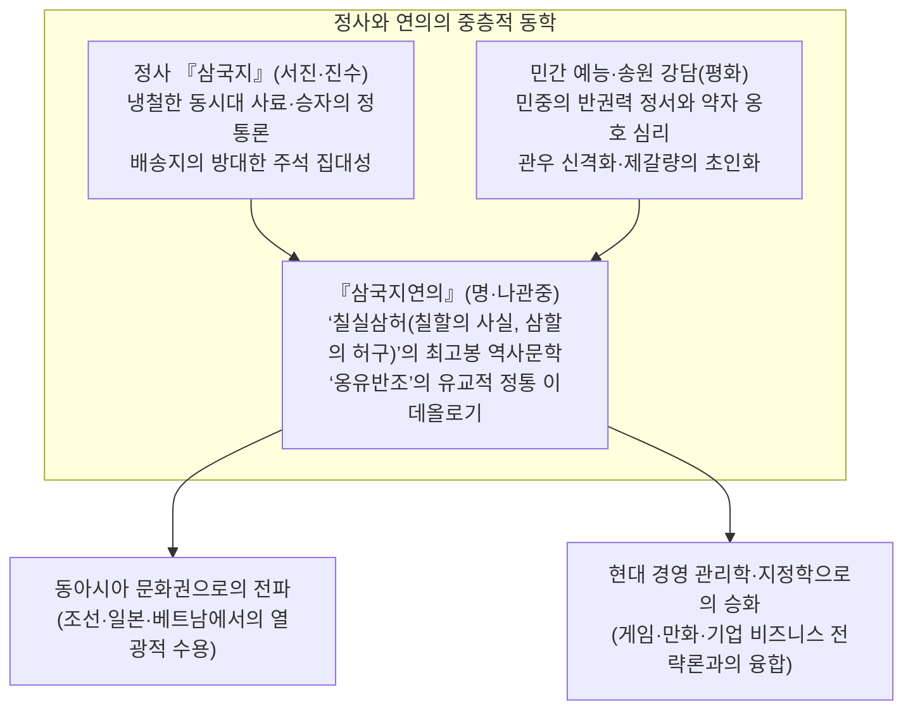
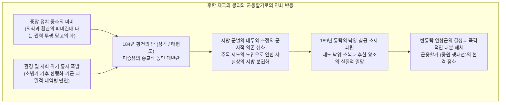
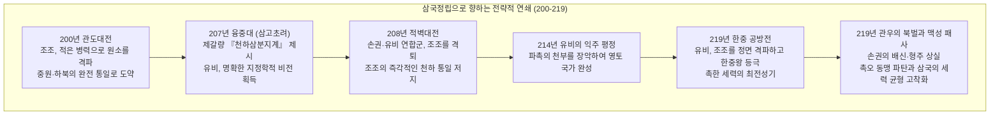
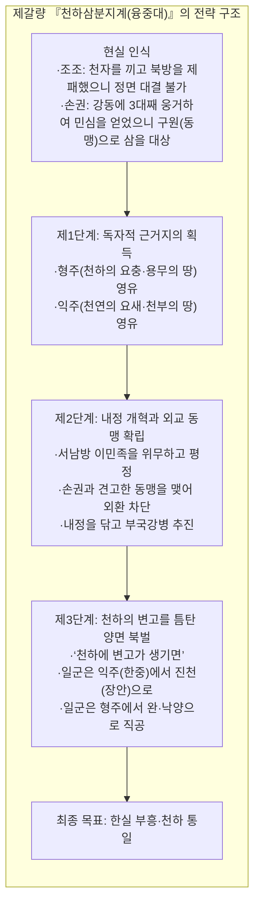
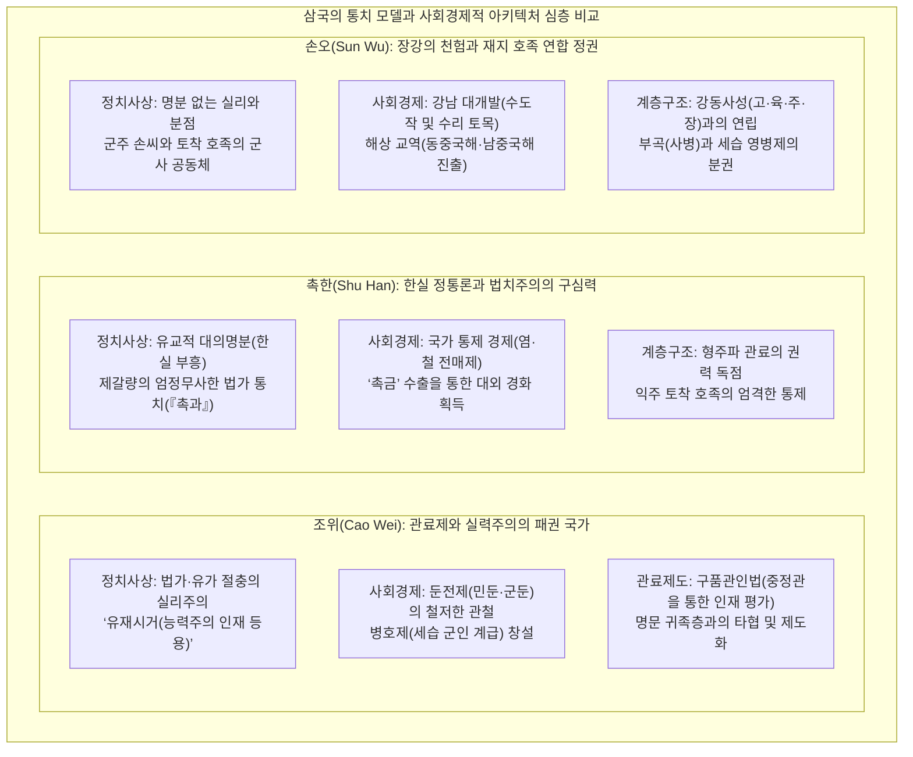

## 서론: 왜 “삼국지”는 1800년의 세월을 넘어 사람들을 끊임없이 매료시키는가

서기 184년 “황건의 난”의 발발부터, 서기 280년 서진(Western Jin)이 손오를 평정하고 천하를 재통일하기까지 약 1세기에 이르는 시간. 유라시아 대륙 동단의 광활한 중원 벌판을 무대로 펼쳐진 **“삼국시대(Three Kingdoms period)”** 의 흥망성쇠는 1800년이라는 시공간을 뛰어넘어 지금도 동아시아뿐만 아니라 전 세계 사람들의 지적 상상력과 뜨거운 열정을 사로잡아 놓아주지 않는다.

수많은 중국 왕조의 교체극 중에서도, 유독 이 시대의 동란만이 어찌하여 이토록 강력하고도 지속적인 문화적 자기장을 뿜어내는 것일까.

그 가장 핵심적인 이유는, “삼국지”라는 세계가 엄격한 사료 비판에 바탕을 둔 **역사적 사실로서의 “정사 『삼국지』(진수 저, 배송지 주)”** 와, 천년에 걸쳐 축적된 민중의 열광과 강담·연극의 퇴적을 거쳐 명대에 결실을 맺은 **동양 최고봉의 역사소설 “『삼국지연의』(나관중 저)”** 라는 유례없는 “이중 구조”를 지니고 있다는 점에 있다.



역사적 사실로서의 삼국시대는 후한 제국의 통치 질서 붕괴에 따른 인구의 괴멸적 급감, 소빙기 기후 한랭화와 기근, 그리고 참혹한 전란이 휘몰아친 살벌한 난세였다. 후한 최전성기에 약 5,600만 명을 헤아리던 국가 등록 호구 인구는, 삼국정립 말기에는 위·촉·오 3국을 합산해도 불과 800만 명 안팎으로 격감했다(호족의 사적 은닉 호구와 유민의 존재를 감안하더라도, 당대 사회의 황폐화와 인구 감소는 극에 달해 있었다).

그러나 이 거대한 제도적 공백과 극한의 생존 경쟁 속에서 기성 권위와 신분 질서의 굴레를 깨부수는 **“지략의 혁신”** 과 **“국가 통치 모델의 거대한 실험”** 이 연이어 탄생했다:
- 조조(Cao Cao)가 제창한 도덕적 위선을 타파한 능력주의 인재 등용령( **“유재시거(唯才是舉)”** )과, 군량 문제를 근본적으로 해결한 **“둔전제(屯田制)”** .
- 제갈량(Zhuge Liang)이 제시한, 약소 세력이 거인을 삼키기 위한 지정학적 그랜드 디자인 **“천하삼분지계(융중대)”** 와 엄정무사한 법가적 법치주의.
- 손권(Sun Quan)이 장강의 천험을 방패 삼아 개척한 강남 대개발과, 동중국해·남중국해를 내다보며 형성한 해양 상업 국가의 맹아.

그리고 무엇보다도, 이 시대를 치열하게 살아낸 군웅, 군사, 맹장, 그리고 이름 없는 민초들이 엮어낸 인간 심리의 극한 드라마 —— 조조의 냉철한 합리주의와 고독, 유비의 흙먼지투성이 인의와 집념, 관우의 고고한 충의와 비극, 제갈량의 보답받지 못한 대의를 향한 숭고한 순직 —— 가 시공과 국경을 초월한 보편적인 인간 찬가로 승화되었기 때문이다.

본고에서는 이 장엄한 “삼국지”의 파노라마를 단순한 에피소드의 나열이나 줄거리 요약에 그치지 않고, **실증 역사학, 정치사상, 군사 지정학, 사회경제 제도, 그리고 동아시아 문화 수용사의 전방위적 시각에서 철저히 해부** 한다. 정사와 연의의 괴리를 객관적으로 짚어내며, 난세를 질주했던 영걸들의 사상과 전략의 심층으로 파고들어 갈 것이다.

---

## 제1장: 후한 왕조의 일몰과 군웅할거의 개막 (184~200년)

삼국시대의 서막은 400년에 걸쳐 중화 세계를 통합해 온 거대 제국 ‘한(전한과 후한)’의 장절한 체제적 자기 붕괴로부터 비롯되었다. 막강한 중앙집권 질서를 자랑하던 제국이 어찌하여 이토록 급속도로 구심력을 상실하고 지방 호족과 군벌들의 난립을 허용하게 되었는가. 그 심층에는 제도적 피로, 권력 중추의 부패, 그리고 지구적 규모의 기후 급변이 복합적으로 얽혀 있었다.



### 1.1 환관·외척의 전횡과 ‘당고의 화’: 후한 제국의 구조적 기능 부전

후한(동한: 서기 25~220년)의 중후기 정치 구조는 극히 기형적인 악순환의 늪에 빠져 있었다. 어린 나이의 황제들이 연이어 즉위했기 때문이었다.

황제가 유아나 소년기일 경우, 정권의 실권은 황태후와 그 친족 집단인 **“외척(外戚)”** 이 틀어쥐었다. 훗날 황제가 성장하면 자신의 친정을 되찾기 위해 구중궁궐 깊은 곳에서 일상을 함께하는 근시인 **“환관(宦官)”** 들과 결탁하여 유혈 정변으로 외척을 주륙했다. 그러나 권력을 장악한 환관 집단이 사리사욕에 눈이 멀어 친인척을 지방관으로 내보내 매관매직과 가혹한 착취를 자행하면, 다음 대의 유제(幼帝) 때에 또다시 새로운 외척 세력이 환관을 탄압했다 —— 이 피비린내 나는 권력 투쟁이 끝없이 반복되었다.

이에 대해 유교적 윤리관과 절의를 숭상하는 관료층과 태학(국립 최고 교육기관)의 청년 유생들은 환관의 타락을 준열히 규탄했다. 그들은 스스로를 도덕적 자긍심을 담아 “청류파(清流派)”라 칭했고, 환관과 그 추종자들을 “탁류파(濁流派)”라고 경멸했다.

하지만 위기감을 느낀 환관 세력은 영제를 움직여 청류파 사대부들에게 “붕당을 결성하여 조정을 비방하고 국정을 어지럽혔다”는 모함을 씌워 철저한 대탄압을 가했다. 이것이 서기 166년과 169년 두 차례에 걸쳐 단행된 **“당고의 화(黨錮之禍)”** 다. 수백 명에 달하는 당대의 명유와 고관들이 처형되거나 옥사했고, 수천 명이 종신 금고(관직 박탈 및 출사 금지) 처분을 받았다.

당고의 화는 후한 왕조에 돌이킬 수 없는 치명상이 되었다. 지방의 지식인 계층과 호족들이 중앙정부에 완전히 환멸을 느끼고 “국가의 법통과 도덕적 권위를 수호하려는 의지”를 송두리째 잃어버렸기 때문이다. 중앙 조정의 권위가 실추된 빈자리에 지방 분권적 무장 세력이 독자적으로 발호할 수 있는 비옥한 토양이 급속히 마련되었다.

### 1.2 기후 한랭화, 기근, 역병과 ‘황건의 난’

정치적 중추의 마비에 쐐기를 박은 것은 대자연의 가혹한 격변이었다.

고기후학과 역사인구학의 연구 성과에 따르면, 2세기 후반에서 3세기에 걸친 동아시아 대륙은 이른바 **“소빙기(Little Ice Age)”** 의 기온 강하 사이클 초기 단계에 진입하고 있었다. 겨울의 혹한과 여름철의 연례적인 한발·냉해가 반복되며 황하 및 장강 유역의 농업 생산력은 궤멸적인 타격을 입었다. 극심한 영양실조로 한계에 내몰린 유민 사회에 설상가상으로 파괴적인 **“대역병(장티푸스 또는 천연두로 추정)”** 팬데믹이 덮쳤다. 건안 연간의 문인 조식(曹植)은 『설역부(說疫賦)』에서 “집집마다 강시(僵尸: 길에 쓰러진 시체)의 아픔이 서려 있고, 방방마다 통곡의 슬픔이 있도다. 문을 닫고 일족이 절멸하는 비극이 잇따랐다”는 생지옥의 참상을 기록했다.

이 절망의 심연 속에서 하북 거록군(현재의 허베이성) 출신의 도사 **장각(Zhang Jiao)** 이 역사의 전면에 부상했다.

장각은 황제(黃帝)와 노자의 사상에 민간 주술 신앙을 결합한 신흥 종교 **“태평도(太平道)”** 를 창시했다. 그는 구절장을 짚고 부수(符水: 주술을 깃들인 물)를 마시게 하여 병을 치료하고 자신의 죄를 뉘우치게 하는 포교 활동을 펼쳤는데, 굶주림과 역병에 신음하던 수십만의 농민들이 순식간에 구름처럼 귀의했다. 장각은 신도들을 군사적 체계로 재편하고 전국의 신자들을 36개의 ‘방(方: 군관구)’으로 조직하여 전국 동시 봉기의 치밀한 준비를 갖추었다.

그들이 내건 깃발의 슬로건은 후세에도 너무나 유명한 도참 예언시였다:
> **“창천이사, 황천당립, 세재갑자, 천하대길”**
> (蒼天已死，黃天當立，歲在甲子，天下大吉 —— 푸른 하늘은 이미 죽었으니 마땅히 노란 하늘이 서야 하리라. 갑자년에 천하가 크게 길하리라)

한나라 왕조의 덕을 상징하는 ‘푸른 하늘(창천)’은 이미 수명이 다했다. 이제 토덕(土德)을 상징하는 새로운 ‘노란 하늘(황천)’이 세워져야 한다. 60간지의 새로운 순환이 시작되는 서기 184년(갑자년)이야말로 구세계를 뒤엎을 성스러운 혁명의 해라는 선언이었다.

서기 184년 2월, 신도들은 노란 두건을 머리에 두르고 일제히 무장 봉기했다. 이것이 바로 **“황건의 난(Yellow Turban Rebellion)”** 이다. 봉기는 하북, 하남, 산동 등 제국의 심장부를 순식간에 집어삼켰으며, 관아는 불타고 관리들은 살해되거나 도주했다.

경악한 조정은 황보숭(Huangfu Song), 주준(Zhu Jun), 노식(Lu Zhi) 등 당대의 명장들을 급파하는 한편, 당고의 금을 해제하여 사대부들의 협력을 요청했다. 이 격렬한 진압전의 와중에 조조, 유비, 손견 등 훗날의 영걸들이 의용군과 토벌군의 지휘관으로 역사의 무대에 화려하게 첫발을 내딛게 되었다.

장각이 봉기 당해에 병사하면서 관군의 맹공 앞에 반란의 주력은 연내에 진압되었다. 그러나 잔당들은 ‘흑산적(黑山賊)’, ‘백파적(白波賊)’ 등의 독립된 유격 도적 집단으로 변모하여 전 국토에서 게릴라전을 이어갔다. 치안을 독자적으로 유지할 능력을 완전히 상실한 한나라 조정은, 서기 188년 지방의 통치 권한을 파격적으로 강화하는 **“주목(州牧) 제도”** 를 전격 도입했다. 주의 군사·행정·재정의 전권을 한 손에 쥔 주목의 탄생은, 지방 장관이 곧바로 독립적인 **“군벌(Warlords)”** 로 탈바꿈하는 결정적인 도화선이 되었다.

### 1.3 동탁의 전횡과 낙양 염상: 구질서의 완전한 붕괴

서기 189년 영제가 붕어하자, 궁중 내에서 대장군 하진(He Jin)이 이끄는 외척 세력과 내시 집단인 ‘십상시(十常侍)’의 갈등이 마침내 최종 파국으로 치달았다. 하진은 환관들을 무력으로 압박하고자 서북 변방 량주에서 이민족을 복속시키며 최정예 군단을 이끌던 거친 군벌 **동탁(Dong Zhuo)** 을 수도 낙양으로 소환했다.

그러나 동탁이 낙양 근교에 도착하기 직전, 음모를 알아챈 환관들에 의해 하진은 궁궐 내에서 암살당했다. 이에 격분한 원소(Yuan Shao)와 조조 등 청년 장교들이 금군을 이끌고 궁궐로 난입하여 2,000명이 넘는 환관들을 닥치는 대로 참살하는 피의 쿠데타를 결행했다.

이 무정부 상태의 대혼란을 틈타 무력으로 낙양에 무혈입성한 자가 바로 동탁이었다. 변방의 포악한 군벌 동탁은 서량 기병의 칼날로 귀족들을 굴복시키고, 소제를 폐위한 뒤 어린 유협(헌제)을 옹립했다. 스스로 ‘상국(相國)’의 자리에 올라 국정을 독점한 동탁은 전대미문의 공포 정치를 펼쳤다.

동탁의 잔혹무도한 폭정은 전통 사대부들에게 씻을 수 없는 굴욕이었다. 서기 190년, 원소를 맹주로 삼아 관동(함곡관 동쪽)의 제후들이 일제히 거병했다. 이것이 **“반동탁 연합군”** 이다. 조조, 손견, 원술, 교모, 포신 등의 군웅들이 대거 깃발을 올렸다.

연합군의 압박에 직면하자 동탁은 상상을 초월하는 초토화 작전을 감행했다. 수백 년 역사를 자랑하던 동아시아 최대의 계획도시 낙양의 백성 수백만 명을 장안(지금의 시안)으로 강제 이주시킨 뒤, 궁전과 관아, 민가는 물론 역대 황제의 능묘까지 모조리 파헤치고 불태워 잿더미로 만든 것이다. 천하의 대제도 낙양은 하룻밤 사이에 폐허로 변했다.

더욱 기막힌 것은, 대의를 내걸고 집결했던 반동탁 연합군이 동탁군의 위세에 겁을 먹고 진격을 주저한 채, 매일같이 주연을 베풀며 땅따먹기 계산에만 골몰했다는 사실이다. 분노한 조조와 손견이 단독으로 추격전을 감행했으나 패배를 맛보아야 했다. 결국 연합군은 동탁을 토벌하지 못한 채 자멸적인 내분으로 공중분해되었다. 구제국의 법통과 도덕적 권위는 여기서 영원히 소멸했고, 완전한 약육강식의 **“군웅할거 시대”** 가 개막되었다.

(한편, 포악을 일삼던 동탁 자신은 서기 192년 장안에서 심복 양아들 **여포(Lu Bu)** 와 사도 왕윤(Wang Yun)의 연환계에 의해 암살당했으며, 그의 시신은 장안 저잣거리에서 배꼽에 심지가 꽂힌 채 돼지처럼 불태워지는 비참한 최후를 맞았다.)

### 1.4 중원의 쟁패전: 군웅의 흥망

구질서가 잿더미로 화한 중원(황하 중하류의 광활한 곡창지대)은 피로 피를 씻는 잔혹한 토너먼트 격투장으로 변모했다. 이 시기 각지에 웅거했던 주요 군웅들의 세력 판도는 다음과 같았다:

- **원소(Yuan Shao)** : 당대 최고 명문가인 **“사세삼공(四世三公: 4대에 걸쳐 최고 관직을 배출한 가문)”** 의 적통. 하북의 패자 공손찬을 격렬한 사투 끝에 멸망시키고 기주·청주·유주·병주의 ‘하북 4주’를 완벽히 장악하여 10만 대군을 거느린 당대 최강의 패권자로 군림했다.
- **원술(Yuan Shu)** : 원소의 종제(혹은 이복동생). 풍요로운 회남에 웅거하며 손견이 낙양 폐허에서 찾아낸 ‘전국옥새’를 손에 넣자 과대망상에 빠져 스스로 황제(국호: 중가)를 참칭했다. 결국 천하의 공적이 되어 사면초가 속에 피를 토하며 몰락했다.
- **손책(Sun Ce)** : ‘강동의 호랑이’ 손堅의 장남으로 **“소패왕(小霸王)”** 이라 불린 천재적 맹장. 부친 사후 원술에게 옥새를 맡기고 빌린 수천 군사로 불과 몇 년 만에 강동 6군을 전격적으로 평정하여 훗날 손오 정권의 확고한 영토적 기반을 닦았다. 그러나 서기 200년, 불과 26세의 나이에 자객의 기습을 받아 비명에 요절했다.
- **여포(Lu Bu)** : **“인중여포, 마중적토(人中呂布，馬中赤兔)”** 로 칭송받던 천하무쌍의 맹장. 그러나 신의가 극히 얕아 정원과 동탁을 차례로 배신했고, 유랑 끝에 유비의 서주를 배은망덕하게 탈취했다. 결국 하비에서 조조·유비 연합군에게 포위되어 수공(水攻)을 당한 끝에 부하들의 배신으로 사로잡혀 처형되었다.
- **유표(Liu Biao)** : 한실 종친이자 명망 높은 한대 명사. 풍요롭고 평화로운 형주를 보전하며 전란을 피해 남하한 수많은 학자와 피난민들을 품어 학문을 진흥시켰다. 그러나 천하를 도모할 야심이 결여된 전형적인 ‘수성(守成)의 인물’에 머물렀다.
- **유비(Liu Bei)** : 한경제의 후손을 자처했으나 어린 시절 돗자리를 짜서 홀어머니를 봉양하던 흙수저 영웅. 관우, 장비와 생사를 함께하는 의형제의 결속을 맺고, 도겸에게 서주를 물려받았으나 여포에게 빼앗긴 뒤 조조, 원소, 유표 밑을 끝없이 떠돌았다. 영토 한 됫박 없는 유랑 군벌이었음에도 불구하고, 독보적인 **“인간적 덕망과 포용력, 불요불굴의 회복탄력성”** 으로 천하에 이름을 떨쳤다.

### 1.5 조조의 대두와 ‘헌제 봉대’: 대의명분과 합리주의의 결합

이 무수한 난세의 군웅들 중에서도 탁월한 전략적 혜안으로 단연 두각을 나타낸 인물이 바로 **조조(Cao Cao, 자는 맹덕)** 였다.

조조는 환관 집안(양조부가 막강한 권세를 누린 대환관 조등) 출신이었기에, 원소와 같은 전통 문벌 귀족층으로부터 출신 성분에 대한 은근한 멸시를 받았다. 그러나 조조는 번뜩이는 군략가이자 냉철한 정치가였으며, 당대 최고봉의 시인(문학가)이기도 했던 다면적 천재였다.

조조가 천하 쟁패에서 일궈낸 최초의 결정적 전략적 도약은 서기 196년의 **“헌제 봉대(奉戴)”** 였다.
장안을 탈출하여 이각과 곽사의 추격을 피해 낙양의 폐허 속에서 굶주림에 허덕이던 가련한 소년 황제 헌제를, 참모 순욱(Xun Yu)의 탁월한 진언에 따라 자신의 근거지인 허창(현재의 허난성 쉬창시)으로 정중히 모셔온 것이다.

이 한 수로써 조조는 정치적으로 무적의 카드를 손에 쥐게 되었다:
> **“천자를 끼고 제후를 호령하다 (挾天子以令諸侯)”**

다른 군벌들에게 조조를 공격하는 행위는 곧 ‘황제에 대한 반역’을 의미하게 되었다. 조조는 조정의 최고 권력자(사공, 대장군, 훗날 승상)로서 국가의 공식 조서를 통해 정적들을 역적으로 규정하고, 자신의 모든 군사 행동을 ‘관군에 의한 반란 토벌’로 정당화할 수 있는 절대적 대의명분을 획득했다.

동시에 조조는 황폐화된 중원의 생산력을 복원하기 위해 획기적인 국가 경제 개혁을 단행했다. 바로 **“둔전제(屯田制)”** 의 전면적 도입이다(196년 조지와 한호의 건의). 전란으로 농민이 도망쳐 황무지가 된 토지를 국가 소유로 편입하고, 몰려든 유민들을 모아 소와 농기구를 대여하여 집단 경작을 시켰다. 수확물의 5~6할을 소작료(세금)로 징수하는 대신, 둔전민에게는 병역과 부역을 면제하고 생계를 보장했다.

이 둔전제를 통해 조조군은 다른 군웅들이 가장 극심하게 겪던 ‘만성적 군량 결핍’을 완벽하게 극복하고 수백만 석의 곡물을 비축하는 데 성공했다. 정치적 대의명분(헌제 봉대)과 현실적·물질적 생산 기반(둔전제)이라는 두 바퀴를 확고히 구축한 조조는, 마침내 하북의 거인 원소와의 천하를 건 건곤일척의 대결장으로 당당히 나아가게 된다.

---

## 제2장: 패권의 격돌과 삼국정립으로 가는 여정 (200~219년)

서기 200년부터 219년에 이르는 약 20년의 세월은, 군웅할거의 카오스 속에서 천하의 판도가 ‘위·촉·오’ 3대 세력으로 압축·정립되어 가는, 삼국지 역사상 가장 드라마틱하고 전략적 밀도가 높았던 황금기였다.

이 시기의 격변을 결정지은 것은 세 차례의 거대한 역사적 결전 —— **“관도대전(200년)”** , **“적벽대전(208년)”** , 그리고 **“한중·번성 공방전(219년)”** 이었다.



### 2.1 관도대전 (200년): 과소한 병력이 거인을 삼킨 정보전과 심리전

서기 200년, 중국 북방의 최고 패권을 둘러싸고 세계 전사상 손꼽히는 불멸의 대격전인 **“관도대전(Battle of Guandu)”** 의 막이 올랐다.

마주 선 양측의 전력 격차는 절망적이었다. 하북 4주를 완전히 석권한 **원소(Yuan Shao)** 는 정예 보병 10만과 기병 1만을 거느린 당대 최강의 거인이었으며, 이에 맞서는 **조조(Cao Cao)** 는 황제를 옹립하고 있었으나 전선에 투입할 수 있는 실제 병력이 불과 2만에서 3만 명 안팎에 지나지 않았다. 병력 차는 무려 3~4배에 달했기에, 객관적인 전력 분석상 조조의 패배는 기정사실로 여겨졌다.

황하를 건너 남하한 원소군에 맞서 조조군이 관도(현재의 허난성 중모현 동북쪽)의 요새에 틀어박혀 결사 항전하면서 전선은 극심한 소모전으로 교착되었다. 원소군은 진지 앞에 높은 토산을 쌓고 망루에서 활을 비 오듯 쏟아부었으며 땅굴을 파서 진내 침투를 꾀했다. 이에 조조는 이동식 투석기인 ‘발석차(벽력거)’를 긴급 제작하여 망루를 박살 냈고, 진지 안쪽에 깊은 참호를 파서 땅굴을 완벽히 차단했다.

그러나 장기화된 대치는 병력과 군량이 절대적으로 열세였던 조조군을 서서히 질식시켜 갔다. 군량이 바닥나고 장병들이 굶주림과 피로로 극한에 도달하자, 조조 자신마저 허창을 지키던 순욱에게 “군사를 물리고 싶다”는 나약한 심경의 비밀 서한을 보낼 정도였다. 이에 순욱은 “지금 물러서면 천하는 원소의 손에 들어갑니다. 공께서 십분의 일의 군세로 적으로 하여금 반년이나 전진하지 못하게 묶어두었으니, 필시 상대에게 치명적 균열이 생길 것입니다. 기필코 버텨내야 합니다”라며 조조를 준열히 질타하고 격려했다.

그리고 마침내 승패를 가르는 극적인 반전의 순간이 찾아왔다. 그것은 **“결정적 군사 기밀 정보와 병참 보급선”** 을 둘러싼 치명적인 배신과 기습이었다.

원소의 핵심 참모 중 한 명이었던 **허유(Xu You)** 는 원소에게 별동대로 허창을 기습하자는 계책을 진언했으나 묵살당했고, 마침 일족이 후방에서 저지른 부정 축재가 발각되어 투옥되자 신변의 위협을 느꼈다. 절망한 허유는 야음을 틈타 조조의 진영으로 전격 투항했다.

어릴 적 죽마고우이기도 했던 허유의 방문 소식을 들은 조조는, 신발을 신을 겨를도 없이 맨발로 뛰어나가 그를 얼싸안았다. 허유는 조조에게 원소군의 아킬레스건을 찔러 넣는 극비 정보를 누설했다:
> “원소군의 모든 군량과 군수물자 수만 수레가 후방의 **오소(烏巢)** 에 집적되어 있소. 수장인 순우경(Chunyu Qiong)은 방심하여 경계를 게을리하고 있소이다. 지금 정예 기병을 이끌고 야습하여 이를 불태워버리면, 원소의 수십만 대군은 싸우지도 않고 사흘 만에 스스로 와해될 것이오!”

조조는 천하의 승부사다운 결단을 내렸다. 원소군의 군기를 내걸고 장병들에게 입에 재갈을 물린 5천의 정예 경기병을 조조 자신이 직접 이끌고, 적의 척후망을 뚫고 오소를 전격 기습했다. 치열한 혈투 끝에 순우경의 수비군을 섬멸하고 원소군의 전 군량을 모조리 잿더미로 태워버렸다.

오소의 하늘을 붉게 물들인 불길을 목격한 원소의 수십만 대군은 걷잡을 수 없는 공황 상태에 빠졌다. 엎친 데 덮친 격으로 원소의 맹장 **장합(Zhang He)** 과 고람이 조조에게 항복하면서 전선은 일거에 붕괴했다. 원소는 장남 원담과 함께 불과 800기의 패잔병만을 이끌고 황하를 건너 북쪽으로 궤주했다.

관도대전은 단순한 전술적 역전승이 아니었다. 명문가의 혈통과 대군에 안주하며 내부의 간언을 묵살하던 원소의 구태의연한 귀족주의에 맞서, 철저한 능력주의, 신속한 의사결정, 그리고 정보와 병참 공급망을 생명선으로 여긴 조조의 근대적 합리주의가 거둔 완전한 승리였다. 조조는 원소의 사후 원씨 일족을 각개격파하고 207년 북방의 오환족까지 평정함으로써, **중국 북방(중원 및 하북)의 완전한 통일** 을 완성했다.

### 2.2 유비의 유전과 ‘삼고초려’: 천하삼분지계의 지정학적 충격

중원과 하북이 조조의 압도적인 무력에 의해 하나둘 평정되어 가는 동안, 천하를 정처 없이 유랑하던 **유비(Liu Bei)** 는 형주의 유표에게 몸을 의탁한 채, 신야(현재의 허난성 난양시)라는 변방의 작은 성에 주둔하고 있었다. 어느덧 나이 40을 훌쩍 넘겨, 말안장을 놓은 지 오래되어 넓적다리에 살이 찐 것을 보고 눈물을 흘리는 **“비육지탄(髀肉之嘆)”** 의 나날이었다.

그러나 서기 207년, 유비의 운명은 물론 중국사의 흐름을 근본적으로 뒤바꿀 세기의 역사적 조우가 이루어진다. 양양 교외의 융중(隆中) 초려에 은둔하고 있던 27세의 무명 청년 **제갈량(Zhuge Liang, 자는 공명)** 과의 만남이었다.

유비는 황실의 종친이라는 신분을 내려놓고 예를 다하여 벽촌의 초가집을 세 번이나 직접 찾아가 가르침을 청했다. 이것이 후세에 영원히 회자되는 **“삼고초려(Three Visits to the Thatched Cottage)”** 다. 그리고 이 좁은 초려 안에서 청년 제갈량이 유비를 위해 장쾌하게 펼쳐 보인 천하 대권의 마스터플랜이 바로 불후의 지정학적 전략론인 **“천하삼분지계(융중대: Longzhong Plan)”** 였다.



제갈량이 설파한 전략의 골자는 철저한 국제정치적 리얼리즘에 뿌리를 두고 있었다:
1. **적과 아군의 냉철한 판별** : 조조는 이미 북방을 통일하고 천자를 끼고 있어 정면 승부를 벌여서는 안 된다. 손권은 강동에 뿌리를 깊게 내리고 있으므로 적으로 돌리지 말고 든든한 동맹으로 삼아야 한다.
2. **영토 획득의 지정학적 타깃** : 형주는 사방으로 통하는 천하의 요충지이나 유표는 지켜낼 그릇이 못 된다. 익주는 사방이 험준한 산맥으로 둘러싸인 천혜의 요새이자 비옥한 천부지토(天府之土)이나 유장은 암우하다. 이 두 주를 탈취하여 독자적인 국가의 주춧돌로 삼아야 한다.
3. **양면 협공을 통한 천하 통일** : 서남방 이민족을 달래고 손권과 굳건한 동맹을 맺은 뒤 내정을 닦아 기회를 엿보다가, “천하에 변고(조조 정권의 내분이나 민심 이반)”가 생기는 순간, 유비는 익주의 주력을 이끌고 진천(장안)으로 북상하고, 신뢰할 만한 대장을 명하여 형주의 군사를 이끌고 완·낙양으로 진격시킨다. 양면에서 협공하면 백성들이 어찌 장군을 환영하지 않겠으며, 한실의 부흥은 성취될 것이다!

이 원대한 구상을 들은 유비는 눈앞을 가리던 짙은 안개가 일순간에 걷히는 충격을 받으며 **“나에게 공명이 있는 것은 물고기가 물을 만난 것과 같다(수어지교: 水魚之交)”** 며 환희했다. 아무런 영토도, 장기적 비전도 없이 그저 전장을 떠돌던 일개 용병대장에 불과했던 유비는, 제갈량이라는 세기의 전략가를 얻음으로써 비로소 뚜렷한 국가 건설의 대의를 품은 **“진정한 정치 지도자”** 로 각성하게 된 것이다.

### 2.3 적벽대전 (208년): 장강의 수상 요새와 천하의 분수령

융중의 계책이 세워진 직후인 서기 208년 여름, 조조는 수십만 대군을 이끌고 노도와 같이 남정을 개시했다. 때마침 형주의 유표가 병사하고 뒤를 이은 유종이 싸우지도 않고 조조에게 항복했다. 도주하던 유비는 당양 장판파에서 조조의 정예 기병 ‘호표기’의 기습을 받아 처자식을 버리고 결사 탈출하는 참패를 겪었다(이 아비규환의 탈출전 속에서 조운의 단기필마 유선 구출과 장비의 장판교 일갈이라는 불멸의 전설이 태어났다).

유비는 하구(현재의 우한시)로 물러나, 장강 하류의 강동을 지배하던 젊은 군주 **손권(Sun Quan)** 과의 연대를 모색했다. 제갈량은 단신으로 손권의 진영에 들어가, 손권의 최측근 도독 **주유(Zhou Yu)** 및 **노숙(Lu Su)** 과 손을 잡고 강동의 주전론을 이끌어내는 탁월한 외교술을 발휘했다.

항복을 권하는 장소 등 강동 문관들의 압도적 여론에 맞서 주유는 조조군의 치명적인 세 가지 약점을 날카롭게 짚어냈다:
1. 북방 출신의 군사들로 이루어져 수상전에 극도로 취약하다는 점.
2. 수천 리를 행군해 온 피로로 인해 습한 남방에서 필연적으로 대역병이 발생할 것이라는 점.
3. 군마의 마초와 식량이 부족하여 장기 보급선을 유지하기 불가능하다는 점.

이에 손권은 칼로 책상의 모서리를 베어내며 “다시 항복을 입에 올리는 자는 이 책상과 같은 처벌을 받을 것이다!”라고 선언했다. 주유를 총사령관으로 삼은 3만의 정예 수군이 유비군과 합류하여 장강을 거슬러 서진했다.

서기 208년 겨울, 장강의 험준한 여울 **적벽(Battle of Red Cliffs)** 에서 조조의 대함대와 손권·유비 연합군이 정면으로 격돌했다.

조조군은 배멀미에 시달리는 북방 병사들을 안정시키기 위해 전함들을 쇠사슬과 널빤지로 단단히 묶어 고정하는 ‘연환선’ 진형을 취하고 있었다. 이를 간파한 주유의 부장 **황개(Huang Gai)** 는 거짓 항복 서한을 보내 방심시킨 뒤, 마른 짚과 기름을 가득 실은 수십 척의 고속 몽충선을 이끌고 조조의 함대로 접근했다.

동남풍의 거센 바람을 탄 화선들은 일제히 불길을 뿜으며 조조의 함대에 돌진했다. 쇠사슬로 묶인 조조의 거함들은 서로 불을 옮겨붙이며 장강 수면을 순식간에 불바다로 만들었다. 강풍을 탄 맹렬한 화염은 강변의 육상 진영까지 집어삼켰고, 조조군은 화염과 역병, 익사의 아비규환 속에서 궤멸적인 타격을 입었다.

조조는 패잔병을 수습하여 진흙탕과 전염병이 창궐하는 화용도를 거쳐 간신히 북방으로 도주했다.

적벽대전은 중국 역사상 최대의 수전이자, **조조의 단숨에 천하를 통일하려던 야망을 영원히 분쇄해 버린 세계사적 대회전** 이었다. 이 승리로 장강 중하류 유역의 안전이 확보되었고, 제갈량이 예견했던 ‘천하삼분’의 지정학적 구도는 되돌릴 수 없는 역사의 필연으로 자리 잡게 되었다.

### 2.4 익주 쟁탈전과 한중 공방전 (211~219년): 촉한의 영토 확정

적벽의 대승 이후, 유비는 형주 남부 4군(무릉·장사·영릉·계양)을 신속히 평정하여 마침내 숙원이었던 독자적 영토를 손에 넣었다. 그러나 천하삼분지계를 완성하기 위해서는 서방의 거대한 곡창지대인 **“익주(사천분지)”** 의 영유가 절대적이었다.

서기 211년, 익주목 유장(Liu Zhang)이 북방 한중의 장로(오두미도의 수장)의 위협에 겁을 먹고, 동종 종친인 유비에게 원군을 요청하는 치명적인 악수를 두었다. 제갈량, 방통(Pang Tong), 법정(Fa Zheng) 등은 “이것이야말로 하늘이 익주를 내리는 기회”라며 입촉을 강력히 권했다.

유비는 결단을 내려 익주 정벌에 나섰다. 군사 방통이 낙봉파에서 전사하는 뼈아픈 희생을 치르면서도, 서기 214년 성도를 포위하고 유장의 항복을 받아내어 익주 전역을 장악했다. 유비의 수하에는 관우, 장비, 조운에 더하여 서량의 맹장 마초(Ma Chao)와 백전노장 황충(Huang Zhong)이 가세하여 최강의 군사 진용이 완성되었다.

이어 서기 217년, 유비는 정권의 명운을 걸고 익주의 북쪽 관문인 요충지 **“한중(Hanzhong)”** 탈환 작전을 감행했다. 한중은 진령산맥과 대파산맥 사이에 자리한 전략 분지로, 이곳을 조조에게 내주고 있는 한 성도의 촉한은 늘 목에 칼이 겨눠진 것과 다름없었다.

한중 공방전에서 유비는 지략가 법정의 절묘한 작전 지휘 아래, 정군산 전투에서 위나라 서방 방면군 총사령관인 명장 **하후연(Xiahou Yuan)** 을 황충의 기습으로 참살하는 대첩을 거두었다. 격노한 조조가 대군을 이끌고 친정에 나섰으나, 유비는 험준한 산악 요새에 웅거하며 철저한 지구전과 유격전으로 맞섰다. 보급선이 끊겨 진퇴양난에 빠진 조조는 유명한 탄식인 **“계륵(鷄肋: 버리기엔 아깝고 먹을 살은 없다)”** 을 남기고 퇴각할 수밖에 없었다.

서기 219년 가을, 한중을 완전히 평정한 유비는 신하들의 추대를 받아 마침내 **“한중왕(漢中王)”** 에 즉위했다. 돗자리 장수에서 시작해 천하를 방랑하던 유비가 마침내 조조와 대등한 왕으로서 천하에 군림하게 된 순간이었다. 촉한 진영의 사기는 하늘을 찔렀고, 천하삼분지계의 최종 목표인 ‘북벌’의 발소리가 성큼 다가온 듯했다.

### 2.5 관우의 북벌과 맥성의 패사: 형주 상실과 전략적 분수령

그러나 정점에 도달한 바로 그 순간, 촉한의 운명을 송두리째 뒤흔들 파멸적인 비극이 터져 나왔다. 발단은 형주의 수비를 도맡고 있던 제일 명장 **관우(Guan Yu)** 의 단독 북벌이었다.

서기 219년, 유비의 한중 제패에 호응하듯 관우는 형주의 주력군을 이끌고 북진하여 조조군의 요충지 번성(현재의 후베이성 샹양시)을 맹렬히 포위했다. 때마침 내린 기록적인 폭우로 한수가 범람하자, 관우는 수공을 펼쳐 번성을 구원하러 온 위나라 명장 우금(Yu Jin)의 7군 3만 병력을 수몰시키고 항복을 받아냈으며 맹장 방덕(Pang De)을 참수했다.

이 **“위진화하(威震華夏: 관우의 위명이 중원을 뒤흔들다)”** 의 대승에 경악한 조조는 수도를 허창에서 하북으로 천도하는 방안까지 심각하게 검토했다.

그러나 관우의 이 눈부신 성공은 동맹자여야 할 **손권과의 지정학적 갈등을 회복 불가능한 파국으로 몰아넣었다** .
형주는 유비에게는 중원 북벌을 위한 도약대였지만, 손권에게는 장강 상류를 타국에 장악당한 ‘국방상의 치명적인 비수’였다. 주유의 사후 도독이 된 **여몽(Lu Meng)** 은 “관우가 번성을 함락시키고 위세를 떨치면 다음으로 집어삼켜질 곳은 바로 우리 오나라입니다. 지금 관우의 뒤통수를 쳐서 형주 전역을 탈환해야 합니다”라고 손권에게 밀주했다.

더욱이 군사적 재능은 탁월했으나 오만불손하고 사대부들을 업신여기던 관우는, 손권이 청해 온 혼담을 **“호랑이의 딸을 어찌 개의 자식에게 주겠는가”** 라며 모욕적으로 거절했고, 남군태수 미방(유비의 처남)과 장군 사인 등을 가혹하게 질책하여 고립을 자초하고 있었다.

사마의(Sima Yi)와 장제의 진언을 받아들인 조조는 손권에게 밀사를 보내 “관우의 배후를 치면 강남의 지배권을 공식 승인하겠다”는 비밀 군사동맹을 체결했다.

여몽은 거짓 병을 핑계로 전선에서 물러나고 무명의 청년 장교 **육손(Lu Xun)** 을 후임으로 세워 관우를 방심시켰다. 번성 공략에 조급해진 관우가 후방 강릉의 수비병마저 전선으로 총동원하자, 여몽은 병사들에게 흰옷(상인의 복장)을 입힌 정예 수군을 장강에 잠입시켜 봉화대를 무혈 기습하고 강릉성을 전격 점령했다( **“백의도강(白衣渡江)”** ). 미방과 사인은 싸우지도 않고 항복했다.

배후를 차단당하고 보급을 잃은 관우군은 하룻밤 사이에 공중분해되었다. 관우는 불과 수십 기를 거느리고 맥성(麥城)에 갇혔다가 서쪽 익주로 탈출하던 중 오나라 복병에게 사로잡혀 아들 관평과 함께 처형당했다. 그의 수급은 조조에게 보내졌다.

관우의 죽음과 **“형주의 완전한 상실”** 은 촉한 정권에게 단순한 장수와 영토의 상실을 넘어선 **치명적인 전략적 붕괴** 를 의미했다.
제갈량이 구상했던 ‘익주와 형주에서의 양면 협공 북벌’ 시나리오는 영원히 실현 불가능해졌으며, 촉은 사천분지에 갇힌 **“인구 100만 미만의 고립된 산악 내륙 약소국”** 으로 전락했다. 그리고 의형제를 잃은 유비의 억누를 수 없는 분노는, 삼국 전체를 집어삼킬 또 다른 파멸의 전쟁(이릉대전)을 향해 치닫게 된다.

---

## 제3장: 삼국 각자의 국가상 —— 제도·경제·군사의 비교 해부

삼국시대란 단순히 세 명의 영웅이 무력으로 패권을 다툰 시대가 아니다. 저마다 전혀 다른 지리적 환경, 인구 규모, 계층 질서, 그리고 통치 이데올로기를 짊어진 세 국가가, 극한의 생존 경쟁 속에서 독자적인 **“국가 통치 모델의 사회적 실험”** 을 치열하게 전개한 대변혁의 시대였다.

화북과 중원의 심장부를 영유한 **“조위(Cao Wei)”** , 사천분지에 고립된 산악 약소국 **“촉한(Shu Han)”** , 그리고 장강 유역의 광활한 습지대를 개척한 **“손오(Sun Wu)”** . 이 3국의 정치 제도, 경제적 생산 기반, 군사 조직, 그리고 통치 이데올로기를 입체적으로 비교 분석함으로써, 삼국지의 동란이 어떻게 후대 위진남북조 시대로 이어지는 중국 사회의 체제 전환기였는지를 비로소 온전히 조망할 수 있다.



### 3.1 조위: 실력주의와 제도 혁신의 거대 제국

서기 220년 조조가 병사하자, 그의 맏아들 **조비(Cao Pi, 위 문제)** 는 후한 헌제에게 양위를 강요하여 형식적인 선양(禪讓) 절차를 밟아 황제에 즉위했다. 이로써 400년을 이어온 한나라 왕조는 공식적으로 멸망하고 **“위(魏)”** 가 성립되었다.

조위의 가장 두드러진 특징은, 삼국 중 단연 압도적인 **“체급의 우위(인구·영토·농업 생산력)”** 와, 낡은 관습을 과감히 파괴한 **“제도적 합리주의”** 에 있었다.

1. **“유재시거(唯才是舉)”와 능력주의 인사관** :
   후한의 유교 사회에서 인재 등용은 ‘향거리선(鄕擧里選)’이라 불리며, 효도와 청렴함이라는 도덕적 평판(효렴)에 의존하고 있었다. 그러나 이는 명문 귀족들이 서로의 자제들을 밀어주고 끌어주는 부패한 문벌 담합 체제로 전락해 있었다.
   조조는 210년, 214년, 217년 세 차례에 걸쳐 파격적인 **“구재령(求才令: 유재시거령)”** 을 반포했다: “도덕적으로 흠결이 있거나 불인불효(不仁不孝)할지라도, 오직 치국과 용병의 재능과 지략이 있는 자를 천거하라.” 이 철저한 능력주의 인사를 통해 곽가(Guo Jia), 가후(Jia Xu), 정욱(Cheng Yu) 같은 파격적인 지모의 귀재들을 중용했고, 장료(Zhang Liao), 서황(Xu Huang), 장합 같은 적국의 항장들까지 편견 없이 전역의 최고 사령관으로 발탁했다.

2. **‘둔전제’에서 ‘병호제’로의 상비군 체계화** :
   조조가 확립한 둔전제는 유민에게 농사를 짓게 하던 ‘민둔’을 넘어, 전선 기지의 군사들이 직접 농사를 지어 자급자족하는 **‘군둔(軍屯)’** 으로 진화했다. 특히 회남(수춘 등)의 대오 전선에서는 대규모 군둔을 통해 수십만 석의 군량을 현지에서 조달하는 보급 물류 혁신을 달성했다. 나아가 위나라는 군인 가문을 일반 농민 호적과 법적으로 분리하여 병역을 대대로 세습시키는 **“병호제(兵戶制)”** 를 도입, 국가가 직접 장악하는 강력한 정규 상비군을 항구적으로 확보했다.

3. **“구품관인법(구품중정제)”의 창설과 귀족화** :
   서기 220년 조비가 제위에 오를 당시, 명문 귀족 출신의 정치가 **진군(Chen Qun)** 의 건의에 따라 도입된 관리 등용 제도다. 각 주와 군에 인재를 평가하는 ‘중정관(中正官)’을 파견하여, 사대부의 가문과 재능, 품행을 1품부터 9품까지 9등급으로 평가해 그에 상응하는 관직을 제수하는 방식이었다.
   이 제도는 혼란했던 관리 선발을 국가의 통제 아래 정상화하려는 의도였으나, 중정관 직책을 대귀족들이 독점하면서 결국 명문가의 기득권을 보장하는 제도로 변질되었다. 후세에 **“상품에 가난한 집안(한문) 없고, 하품에 권세 있는 집안(세족) 없다 (上品無寒門，下品無勢族)”** 는 한탄이 나왔듯이, 위나라에서 서진, 남북조 시대로 이어지는 철저한 **“문벌 귀족제 사회”** 의 공고한 제도적 토대가 되었다.

### 3.2 촉한: 법가 정신에 기초한 정통주의의 소국

관우의 패사로 형주를 빼앗긴 유비는, 서기 221년 조비의 위나라 건국(한나라 멸망)에 맞서 성도에서 황제에 즉위했다. 한나라의 유일한 정통 후계자로서 천하에 호령했기에 공식 국호는 **“한(漢: 역사적으로는 촉 또는 촉한)”** 이다.

촉한의 근본적인 한계는 **“영토와 인구의 극단적인 과소성”** 에 있었다. 위나라가 전 국토의 약 7할에 달하는 인구(440만 명 이상)와 광활한 평야를 차지했던 데 반해, 촉한은 험준한 사천분지와 남방의 험지에 갇혀 호적상 인구가 **불과 약 28만 호 / 약 94만 명** , 군사력은 10만 명 안팎에 불과했다(위나라의 4분의 1에서 5분의 1 수준).

이 압도적인 열세를 딛고 거대한 적국에 삼켜지지 않기 위해, 정권의 실질적 최고 지도자였던 승상 제갈량이 택한 길은 낭만적인 이상주의가 아닌 지극히 엄격하고 냉철한 **“법치주의(법가 사상)”** 였다.

1. **엄정무사한 법의 지배 (『촉과』의 제정)** :
   정사 『삼국지』 제갈량전에서 진수는 제갈량의 통치를 다음과 같이 극찬했다:
   > **“법도를 정비하고 과조(科條)를 갖추었으며, 마음을 공평히 하고 상벌을 명확히 하였다. 작더라도 선행 치고 포상받지 않은 것이 없었고, 미세하더라도 악행 치고 징벌받지 않은 것이 없었다. 온 나라 안이 그를 두려워하면서도 사랑하였으니, 형벌과 정치가 엄준했음에도 원망하는 자가 없었다.”**
   제갈량은 법정 등과 함께 촉한의 기본 법전인 **『촉과(蜀科)』** 를 제정했다. 아무리 건국 공신이라 하더라도 법을 어기면 엄벌에 처했고(이엄의 폐관, 마속의 처형), 비록 신분이 미천해도 능력이 있고 공적이 있으면 발탁했다. 부패와 부정을 철저히 척결한 청렴결백한 공직 사회를 구축함으로써, 백성들은 엄격한 법치 속에서도 공평무사함에 절대적인 신뢰를 보냈다.

2. **국가 통제 경제: 촉금과 염철 전매제** :
   산악 지대에 갇힌 소국이 장기적인 대규모 북벌 군비를 충당하기 위해 제갈량은 산업 구조 혁신을 단행했다.
   - **‘촉금(蜀錦)’의 국가 독점 수출** : 사천의 최고급 비단인 ‘촉금’ 생산을 관영 공장(금관성)에서 엄격히 집중 관리했다. 촉금의 독보적인 품질과 화려함은 적국인 위나라와 오나라의 귀족층에게도 최고의 사치품으로 열광적인 인기를 끌었으며, 적국과의 암시장 및 민간 교역을 통해 촉한으로 막대한 금·은·구리 등의 경화(硬貨)를 벌어들였다. 제갈량 스스로도 “지금 군수 물자가 채워지는 것은 오로지 비단 덕분이다”라고 술회할 정도였다.
   - **염·철 전매제** : 전한 무제의 전시 경제 정책을 본떠 소금(정염)과 철의 생산 및 유통을 민간 호족에게서 완전히 회수하여 국가 전매로 전환했다. 이를 통해 지방 호족의 경제적 독자성을 거세하고 국가 재정을 강력히 일원화했다.

3. **지배 구조의 내재적 모순: 형주파 외래 정권 vs 익주 토착 호족** :
   그러나 촉한의 내부에는 항상 심각한 불안의 불씨가 도사리고 있었다. 유비를 따라 외부에서 들어온 소수파인 **“형주 출신 관료들(제갈량, 장완, 비의 등)”** 이 조정과 군의 핵심을 독점했고, 다수파인 **“익주 토착 호족 및 사대부(초주 등)”** 는 정치적으로 철저히 배제되고 감시를 받았다. 이 해묵은 내부 갈등은 훗날 북벌이 장기화되며 국력이 소진되자 급속도로 표면화되었고, 촉한 멸망 시 토착 관료들이 한목소리로 “무혈 항복”을 주도하는 결정적 원인이 되었다.

### 3.3 손오: 장강의 천험과 재지 호족 연합 정권

적벽의 승리와 관우 토벌을 통해 장강 중하류(양주·형주 남부·교주)의 방대한 수계를 손에 넣은 손권은, 서기 222년 ‘오왕’을 칭했고 229년에는 무창(훗날 건업: 현재의 난징시)에서 황제에 즉위했다. **“오(손오 / 동오)”** 의 탄생이다.

손오 정권의 본질은 조위와 같은 강력한 중앙집권 관료 국가도, 촉한과 같은 법통 중심의 일당독재형 전시 체제도 아니었다. 군주(손씨 일족)와 강남에 뿌리내린 거대 호족들이 타협과 합의를 통해 공존하는 **“군주·호족 연합 정권”** 이었다.

1. **‘강동사성(江東四姓)’과의 연립정권 방정식** :
   강동 땅에는 오래전부터 막강한 토지와 혈연 네트워크를 자랑하는 4대 명문 호족 **“고(顧)·육(陸)·주(朱)·장(張)”** 씨가 군림하고 있었다.
   외래 무장 집단이었던 손견·손책 부자는 초기에 이들 호족을 무력으로 탄압하여 큰 반발을 샀으나, 손권은 탁월한 정치적 균형 감각을 발휘하여 호족 자제들을 군과 조정의 고관으로 대거 등용하고 중첩된 혼인 관계를 맺었다. 특히 육씨 가문의 영수인 **육손(Lu Xun)** 을 대도독과 승상에 기용함으로써 손오 정권의 내부적 안정성을 완성했다.

2. **“부곡(部曲)”과 “세습영병제”의 분권적 한계** :
   손오의 군사 제도는 매우 독특한 사병적·분권적 성격을 띠고 있었다. 장수들은 국가로부터 징집병을 지급받는 데 그치지 않고, 가문의 사병이자 예속민인 **“부곡(部曲)”** 을 이끌고 전장에 나섰다. 장수가 전사하거나 병사하면 그 부대와 봉토는 아들이나 친동생에게 그대로 세습되었다( **세습영병제** ).
   이 제도는 자기 고향과 가문의 재산을 지키는 방어전에서는 무서운 결속력과 전투력을 발휘했으나, 막상 타국을 정벌하는 북벌 원정에 나서면 호족 장수들이 자기 사병의 손실을 극도로 두려워하여 소극적으로 일관하는 치명적 한계를 안고 있었다. 손오가 역사 내내 **“지키는 데는 강하나, 쳐들어가는 데는 무력한”** 체질을 벗어나지 못했던 구조적 원인이 바로 여기에 있었다.

3. **강남 대개발과 해양 제국의 서막** :
   손오가 동아시아 역사에 남긴 위대한 공적은, 미개척의 습지대였던 강남을 비옥한 곡창지대로 변모시킨 대규모 개간 사업과 해양 진출이었다:
   - **수도작 토목과 ‘산월(山越)’의 통합** : 늪지대 개간과 관개 수로 정비를 통해 훗날 강남이 중국 제일의 곡창지대로 도약할 기틀을 놓았다. 또한 험준한 산악 요새에 웅거하며 저항하던 토착 이민족 **“산월”** 을 육손과 제갈각 등이 평정하여, 수십만 명의 인구를 평야로 이주시켜 농경 노동력과 최정예 병사로 흡수했다.
   - **해상 탐험과 남해 무역** : 우수한 조선 기술과 수군력을 바탕으로, 손권은 서기 230년 장군 위온과 제갈직에게 1만 명의 장병을 딸려 대규모 선단을 파견, **“이주(夷洲: 현재의 대만)”** 와 단주를 탐험하게 했다(중국 정사에서 대만에 관군을 공식 파견한 최초의 기록). 나아가 현재의 베트남 북부(교지)를 거쳐 말레이반도와 인도양 연안 국가들과의 해상 실크로드 무역을 전개하여 막대한 국제 무역 부를 축적했다.

```
【위·촉·오 삼국의 종합 국력 및 제도 비교표 (서기 260년 전후 기준)】
```

| 비교 항목 | 조위 (Cao Wei) | 촉한 (Shu Han) | 손오 (Sun Wu) |
| :--- | :--- | :--- | :--- |
| **법정 수도** | 낙양 (Luoyang) | 성도 (Chengdu) | 건업 (Jianye: 현 난징) |
| **영토 범위** | 중원, 하북, 산동, 산서, 섬서, 회남, 요동 (전 국토의 약 60%) | 익주 전역 (사천분지, 한중, 운남·귀주 등 서남부 산악지대) | 양주, 형주 남부, 교주 (장강 중하류, 광동, 광서, 베트남 북부) |
| **추정 호수·인구** | **약 66만 호 / 약 440만 명** (삼국 전체 인구의 약 60%) | **약 28만 호 / 약 94만 명** (삼국 전체 인구의 약 13%) | **약 52만 호 / 약 230만 명** (삼국 전체 인구의 약 27%) |
| **상비 군사력** | **약 40만~50만 명** (정예 중원 보기병, 오환·선비 기병) | **약 10만 명** (산악 정예 보병, 연노병, 백이병) | **약 23만 명** (무적의 장강 수군, 산월병, 세습 사병 부곡) |
| **통치 사상·체제** | 법가·유가 절충, 철저한 능력주의, 고도 집권 관료제 | 한실 정통주의 이데올로기, 엄격하고 공평한 법치주의(『촉과』) | 재지 호족과의 연립 합의제, 분권적 군신 공동체 |
| **주요 인사 선발 제도** | **구품관인법** (중정관에 의한 9등급 평가), 유재시거령 | 제갈량 승상부 중심의 엄격한 발탁, 법령에 따른 엄정한 상벌 | 강동 호족 추천제, 세습영병제, 문벌 세습 |
| **기간 경제 기반** | 화북의 밭농사·맥작, **둔전제 (민둔 및 군둔)** , 관염 및 제철 | 사천분지의 수도작, **촉금 관영 수출 (금관성)** , 암염(정염) | 강남의 벼농사 간척 개발, **해양 남해 무역** , 제염업 |
| **지정학적 강점** | 압도적인 인구와 농업 생산력, 강력한 기병 기동력 | 험준한 검문관과 산악 요새에 둘러싸인 ‘천연의 난공불락 방어선’ | 수만 리 장강의 거대한 천연 수벽, 압도적인 수상 전함 기술 |
| **구조적 치명적 약점** | 명문 귀족의 대두로 황권이 형해화되며 사마씨의 찬탈 허용 | 인구와 국력의 극단적 과소성, 형주파와 익주파의 해묵은 내홍 | 호족 사병 세습제로 인한 결속력 부족, 대외 원정(북벌)의 구조적 한계 |

---

## 제4장: 제갈량의 유발과 삼국의 황혼 (220~280년)

삼국정립의 정립이 확고해진 후반 반세기는, 천하를 호령하던 건국 영웅들이 차례로 세상을 떠나고, 냉혹한 국력의 격차와 체제의 피로가 국가의 명운을 집어삼키는 ‘삼국의 황혼’기였다.

이 시기의 역사를 관통하는 핵심 축은, 촉한의 승상 **제갈량(Zhuge Liang)** 이 목숨을 바쳐 감행한 비장한 북벌과, 중원의 패자 조위의 내부에서 은밀히 진행된 **사마씨 일족(Sima clan)** 의 군사 쿠데타 및 황위 찬탈의 드라마였다.

### 4.1 유비의 복수전과 이릉대전 (222년): 백제성 탁고

서기 221년, 황제에 즉위한 유비의 첫 번째 국가적 최고 의사결정은 제갈량과 조운 등의 필사적인 간언을 물리치고 강행된 **“동정(손오 토벌전)”** 이었다.

의동생 관우를 잃고 형주를 빼앗긴 개인적 원통함과, 《천하삼분지계》를 복원하기 위해서는 형주를 되찾아야만 한다는 전략적 초조감이 노구의 유비를 지배했다. 원정에 앞서 장비(Zhang Fei)마저 부하의 배신으로 암살당하는 참극을 겪었음에도, 유비는 친히 4만에서 5만에 달하는 정예군을 이끌고 장강 삼협을 내려가 노도와 같이 오나라 영내로 침공했다.

초기 전황은 촉군의 압도적인 승세로 전개되어, 오나라의 전선 기지를 차례로 무너뜨리고 수백 리에 달하는 장강 협곡을 점령했다. 위기에 처한 손권은 다시 한번 결단을 내려, 서른아홉 살의 젊은 지장 **육손(Lu Xun)** 을 대도독으로 임명하고 전선의 전권을 위임했다.

육손이 취한 전략은 철저한 **“후발제인(後發制人)의 지구전”** 이었다.
그는 촉군의 맹공을 험준한 요새에 웅거하여 완강히 받아넘기며 결코 성문을 열고 나가지 않았다. 여름의 극심한 폭염이 닥쳐오자, 장강 협곡을 따라 진을 쳤던 유비군은 더위를 피하고자 나무가 울창한 산림을 따라 700리(약 350km)에 걸쳐 진지를 길게 늘어세우는 치명적인 배치를 취했다. 이것이 바로 악명 높은 ‘연영(連營)’이다.

이것이야말로 육손이 수개월 동안 피를 말리며 기다려온 결정적 빈틈이었다.
서기 222년 6월, 거센 바람이 불어닥치던 밤, 육손은 전군에 짚단과 횃불을 들려 수륙 양면에서 유비군의 연영을 향해 **“맹렬한 동시 화공”** 을 퍼부었다. 좁은 산길에 줄지어 있던 촉군의 진영은 순식간에 불바다로 변했고, 퇴로가 끊긴 장병들은 골짜기로 굴러떨어져 수만 군세가 궤멸했다.

유비는 측근들의 결사적인 호위를 받으며 간신히 사지를 탈출하여 장강 어귀의 요새 백제성(영안)으로 몸을 피했다. 이것이 세계 전사상 유명한 **“이릉대전(Battle of Yiling)”** 이다.

대패의 충격과 화병으로 자리에 누운 유비는 이듬해인 서기 223년 4월, 백제성의 병상으로 제갈량을 불러 역사에 길이 남을 감동적인 유언을 남겼다. 이것이 바로 **“백제성 탁고(託孤)”** 다:
> **“그대의 재능은 조비보다 열 배나 뛰어나니, 반드시 나라를 안정시키고 대업(천하 통일)을 완수할 것이오. 만약 내 아들(유선)이 보필할 만하거든 보필하고, 만약 내 아들이 재능이 없어 보필할 만하지 않거든, 그대가 스스로 나라를 취하여 다스리시오 (君可自取之).”**

유교 사회에서 황제가 신하에게 “아들이 부족하거든 그대가 스스로 황제가 되라”고 고한 것은 전대미문의 파격적인 신뢰의 표명이었다. 제갈량은 눈물을 흘리며 엎드려 머리를 바닥에 찧어 피를 흘리며 맹세했다:
> **“신, 감히 고굉의 힘을 다하고 충정의 절개를 바쳐 죽음에 이를 때까지 변치 않겠나이다!”**

유비는 눈을 감았고, 열일곱 살의 암우한 후주 유선(Liu Shan)이 즉위했다. 주력군을 잃고 사방이 적에게 둘러싸인 절망적인 약소국 촉한의 모든 무거운 멍에가, 오롯이 제갈량의 가녀린 두 어깨에 지워진 것이다.

### 4.2 제갈량의 남정(‘공심위상’)과 명문 『출사표』

유비 사후, 제갈량이 가장 먼저 착수한 과제는 파탄 난 **“손오와의 동맹 복원”** 이었다. 등지를 오나라로 파견하여 손권에게 “위나라의 위협에 맞서기 위해서는 촉과 오가 입술과 이빨처럼 의지해야 한다”고 설득하여 동맹을 성공적으로 재체결했다.

다음 과제는 유비의 패전을 틈타 대규모 반란을 일으킨 남방 이민족 지역(남중: 현재의 윈난성·구이저우성·쓰촨성 남부)의 평정이었다.
서기 225년, 제갈량은 친히 군사를 이끌고 남정에 나섰다. 이때 참모 마속(Ma Su)이 제갈량에게 올린 진언은 동양 군사 심리전의 최고 명언으로 꼽힌다:
> **“무릇 용병의 도리는 마음을 공격하는 것이 상책이고 성을 공격하는 것은 하책이며, 심리전이 상책이고 군사전은 하책입니다. 바라건대 공께서는 그들의 마음을 굴복시키소서 (攻心為上，攻城為下；心戰為上，兵戰為下).”**

제갈량은 이 원칙을 충실히 실행했다. 반란군의 수괴인 호족 **맹획(Meng Huo)** 을 사로잡을 때마다 진영을 구경시켜 준 뒤 순순히 석방하여, 진심으로 승복할 때까지 싸우게 했다(『연의』의 ‘칠종칠금: 7번 잡고 7번 놓아주다’ 설화의 원형). 맹획은 마침내 일곱 번째로 잡히자 무릎을 꿇고 눈물을 흘리며 심복했다: “공은 참으로 하늘의 위엄이시니, 남방 사람들은 다시는 배반하지 않겠습니다!”

제갈량은 남중에 한족 군대를 주둔시키지 않고 현지 추장들에게 자치를 맡기는 관용 통치를 폈다. 이를 통해 배후의 위협을 제거했을 뿐 아니라, 남중의 풍부한 금, 은, 철, 칠, 차, 그리고 명마와 정예 병력(무당비군)을 촉한의 핵심 국가 재원으로 확보하는 데 성공했다.

남정을 마치고 성도로 귀환한 서기 227년, 제갈량은 마침내 생애 최대의 숙원이었던 **“북벌(위나라 정벌)”** 을 결행하기로 결심한다. 군사를 이끌고 한중으로 북상하기에 앞서, 어린 황제 유선에게 올린 상소문이 바로 한문 문학의 최고봉으로 추앙받는 **『출사표(전출사표: Qian Chushi Biao)』** 다:

> “선제께서 창업을 절반도 이루지 못하시고 중도에 붕어하셨으며, 이제 천하는 셋으로 나뉘고 익주는 피폐해졌으니, 이는 실로 국가의 위급존망지추입니다…… 신은 본래 미천한 베옷을 입고 남양에서 밭을 갈며 난세에 목숨을 구차히 보전하려 하였을 뿐, 제후에게 영달을 구하지 않았습니다. 선제께서는 신을 비루하게 여기지 않으시고, 몸을 굽혀 세 번이나 신의 초려를 찾아오셨습니다…… 이에 군사가 패배한 때에 중임을 맡고, 위태로운 환란 속에서 명을 받든 지가 어느덧 21년이 되었습니다!”

선제 유비에 대한 절절한 은혜와 충성, 조정의 기강 확립과 인재 등용의 요체를 눈물로 호소한 이 명문은, 후세에 “『출사표』를 읽고 눈물을 흘리지 않는 자는 신하로서 충성스럽지 못한 자”라는 격찬을 받았다.

### 4.3 북벌의 궤적 (228~234년): 오장원에 별이 지다

서기 228년 봄부터 234년에 이르기까지, 제갈량은 통산 5차례에 걸친 대규모 **“북벌(Northern Expeditions)”** 을 감행했다.

험준한 진령산맥을 넘어 위나라의 심장부인 장안을 치는 북벌은, 국력과 병력에서 5배나 뒤처지는 촉한에게 극히 무모해 보이는 모험이었다. 그러나 제갈량은 “약소국이 성 안에 안주하면 국력 격차는 날로 벌어질 뿐이며, 앉아서 멸망을 기다리느니 공격이야말로 최대의 방어”라는 공세적 방어 철학을 굽히지 않았다.

```
【제갈량의 5차에 걸친 북벌 궤적】
· 제1차 북벌 (228년 봄): 농우(감숙성 남부)로 전격 침공. 천수·남안·안정 3군이 촉에 항복. 명장 강유 획득. 그러나 마속이 가정 전투에서 지시를 어기고 산 위에 진을 쳤다가 장합에게 포위되어 참패. 전군 철수 불가피, 제갈량은 ‘눈물을 머금고 마속을 참형에 처함 (읍참마속)’.
· 제2차 북벌 (228년 겨울): 진창성을 포위했으나, 위나라 수장 학소의 철벽 방어에 막혀 군량이 다해 퇴각. 추격해 온 위나라 맹장 왕쌍을 참살.
· 제3차 북벌 (229년 봄): 무도와 음평 2군을 공취하여 촉한의 영토로 편입.
· 제4차 북벌 (231년 봄): ‘목우’를 실전 투입. 기산을 포위하고 위의 총사령관 사마의(사마중달)와 직접 대결. 상규에서 위군을 대파했으나, 후방에서 이엄이 군량 수송 지연을 은폐하기 위해 거짓 조서를 꾸며 회군하게 됨. 추격해 온 위의 명장 장합을 목문도에서 활로 사살.
· 제5차 북벌 (234년 봄): ‘유마’를 투입하여 사곡에서 출격. 위수 남안의 오장원(섬서성 보계시 기산현)에 포진하고, 둔전을 펼쳐 장기전 태세 확립. 사마의와 결전 대치.
```

북벌의 가장 가혹한 적은 위나라 군대보다도 **“험준한 잔도를 통과해야 하는 물리적 군량 보급의 한계”** 였다. 촉군 병사는 한 명이 짐을 나르기 위해 도중에 자신이 싣고 가는 식량의 절반을 먹어 치워야 했다. 이 치명적인 병참 병목을 타개하기 위해 제갈량은 독창적인 수송 장비인 **“목우(木牛)”** 와 **“流馬(유마)”** 를 발명하여 실전에 투입했다. 험준한 산악 외길에서도 효율적으로 짐을 운반할 수 있는 특수한 1륜 수레 및 연동 기계 장치였던 것으로 전해진다.

서기 234년 제5차 북벌에서 제갈량은 위수 남쪽 **오장원(Wuzhang Plains)** 에 거대한 진을 치고, 병사들에게 현지 백성과 섞여 농사를 짓게 함으로써 반영구적인 자급자족 보급망을 구축했다.

이에 맞선 위나라의 군사령관 **사마의(Sima Yi, 자는 중달)** 는 제갈량의 지모를 두려워하여 철저한 ‘부전(不戰)·지구 전략’으로 일관했다. 진영의 문을 굳게 닫고 결코 싸움에 응하지 않았으며, 제갈량이 도발을 위해 ‘여인의 옷과 머리장식’을 보내 겁쟁이라고 모욕해도 빙그레 웃으며 넘겼다. 사마의는 촉의 사신에게 제갈량의 일상을 묻다가 “제갈공은 아침 일찍 일어나 밤늦게 자며, 곤장 스무 대 이상의 벌은 직접 결재하고, 식사는 하루 몇 홉에 불과하다”는 말을 듣자마자 간파했다: “제갈공명이 먹는 것은 적고 일은 번잡하니, 어찌 오래 살 수 있겠는가!”

그 비극적인 예언은 현실이 되었다. 극심한 과로와 심신의 소진으로 제갈량의 육신은 한계에 도달했고, 234년 8월 23일 밤, 차가운 바람이 감돌던 오장원의 군진 속에서 조용히 숨을 거두었다. 향년 54세였다.

제갈량의 사후, 촉군은 유언에 따라 상을 숨긴 채 질서정연하게 퇴각을 시작했다. 공명의 사망을 눈치채고 추격해 오던 사마의는, 촉군이 돌연 깃발을 돌려 반격 태세를 취하자 공명이 살아있다고 오인하여 혼비백산 전군을 퇴각시켰다. 여기서 **“죽은 공명이 산 중달을 달아나게 하다 (死諸葛走生仲達)”** 라는 천고의 고사가 탄생했다.

제갈량은 중원을 수복하여 한실을 되살리겠다는 평생의 꿈을 끝내 이루지 못했다. 그러나 그의 지극한 성심과 청렴결백, 그리고 불가능에 맞선 불굴의 지략은, 패배자임에도 불구하고 승자들을 압도하는 숭고한 빛을 발하며 동양인의 가슴속에 영원한 도덕적 이상향으로 아로새겨졌다.

### 4.4 조위의 내부 붕괴와 사마씨의 찬탈

제갈량이라는 일생일대의 숙적이 사라지자, 이번에는 중원의 조위 제국 내부에서 거대한 권력 지각변동이 폭발했다.

문제 조비의 사후 조예(명제)마저 요절하자, 불과 여덟 살의 조방이 황위에 올랐다. 조정은 황족의 대표인 대장군 **조상(Cao Shuang)** 과 백전노장 태위 **사마의** 두 사람에게 보정을 맡겼다.

그러나 조상은 중원의 원로 귀족들을 배제하고 자기 심복들로 권력을 독점하며 호화 사치를 일삼았고, 사마의를 실권 없는 명예직인 ‘태부’로 밀어냈다. 사마의는 이에 맞서지 않고 십 년간 칩거하며, 약을 먹을 때 손을 떨며 가슴에 흘리고 귀가 먹은 척하는 치매 연기를 펼쳐 조상 일파를 완벽히 방심시켰다.

서기 249년 정월, 조상 형제가 어린 황제 조방을 모시고 낙양 교외의 고평릉으로 성묘를 나간 틈을 타, 70세의 노장 사마의가 낙양성에서 전격 쿠데타를 일으켰다. 이것이 **“고평릉의 변(Incident at Gaoping Tombs)”** 이다. 사마의는 낙양의 궁성과 무기고를 장악하고 낙수를 가리켜 맹세하며 조상에게 관작과 재산을 보장하겠다고 투항을 권고했다. 그러나 조상이 무기를 내려놓자마자 사마의는 맹세를 뒤엎고 조상과 그 일파를 모반 대역죄로 몰아 삼족을 멸문시켰다. 조위의 군사와 정치 실권은 완전히 사마씨의 손으로 넘어갔다.

사마의 사후, 권력은 장남 **사마사(Sima Shi)** 와 차남 **사마소(Sima Zhao)** 에게 세습되었다. 조위의 황실은 허수아비로 전락했다. 서기 260년, 치욕을 견디지 못한 황제 고귀향공 조모가 **“사마소의 마음은 길 가는 사람도 다 알고 있다 (司馬昭之心，路人皆知: 누구나 제위를 찬탈하려는 야심을 안다)”** 고 외치며 시종과 어림군 수백 명을 이끌고 사마소의 저택으로 돌진했으나, 사마소의 부하 성제에게 대낮 궁문 앞에서 무참히 시해당하는 참극이 벌어졌다. 위나라 왕조의 명운은 사실상 여기서 끝장났다.

### 4.5 삼국의 멸망과 서진에 의한 천하 통일 (263~280년)

사마소는 황제 자리를 넘겨받기 위한 대의명분으로 천하를 뒤흔들 압도적인 군공을 필요로 했다. 그것이 바로 **“촉한의 완전한 토벌”** 이었다.

당시 촉한에서는 제갈량의 유지와 병법을 계승한 애제자 **강유(Jiang Wei)** 가 11차례에 걸쳐 집념의 북벌을 거듭하고 있었으나, 잦은 원정은 피폐한 촉의 국력을 결정적으로 고갈시키고 있었다. 조정에서는 후주 유선이 환관 황호(Huang Hao)를 총애하여 정치가 썩어 들어갔고 민심은 이반해 있었다.

서기 263년, 사마소는 종회(Zhong Hui)와 **등애(Deng Ai)** 에게 명하여 18만 대군으로 촉한을 전면 침공하게 했다. 강유는 천혜의 요새인 **검각(Jiange)** 에 웅거하여 종회의 주력 10만 군사를 완벽하게 저지했다.

여기서 중국 전사상 최고의 기적으로 불리는 신출귀몰한 기습 작전을 결행한 이가 바로 별동대를 이끌던 노장 등애였다.
등애는 길이 없는 천길 낭떠러지로 이루어진 **“음평(Yinping)의 험로”** 를 택했다. 병사들에게 모포를 둘러매고 절벽을 굴러떨어지게 하며 700리의 험준한 무인지대를 돌파하여, 촉한의 배후인 강유와 면죽에 홀연히 신병(神兵)처럼 출현한 것이다. 수비군이 격파당하자 성도의 조정은 극심한 공황에 빠졌고, 초주(Qiao Zhou) 등 항복파 관료들의 설득에 넘어간 후주 유선은 단 한 번도 싸워보지 않은 채 성문을 열고 항복했다. **서기 263년, 촉한은 43년의 역사를 끝으로 막을 내렸다.**

이듬해 사마소가 죽고 뒤를 이은 적장자 **사마염(Sima Yan, 진 무제)** 은 265년 위의 마지막 황제 조환에게 선양을 받아 국호를 **“진(서진: Western Jin)”** 으로 개칭했다.

홀로 남은 손오는 잔혹한 폭군으로 악명 높은 4대 황제 **손호(Sun Hao)** 의 폭정으로 내부 붕괴가 극에 달해 있었다. 서기 280년, 서진의 무제 사마염은 수륙 20만 대군을 발동했다. 명장 두예(Du Yu)가 육로를 파죽지세로 진격했고(‘파죽지세’의 어원), 익주에서 거대한 전함들을 건조한 **왕준(Wang Jun)** 의 대함대가 장강을 타고 물밀듯이 내려왔다. 오나라 군대가 장강에 쳐놓은 거대한 쇠사슬 방어선도, 왕준이 불붙은 거대한 뗏목으로 녹여 끊어버리고 건업에 입성했다. 손호는 항복했다.

서기 184년 황건의 난으로부터 헤아려 **96년 만에** , 삼국으로 나뉘어 서로를 집어삼키던 분열의 중국 천하는 마침내 서진에 의해 다시 하나로 통합되었다.

---

## 제5장: 정사 『삼국지』 vs 『삼국지연의』 —— 허구와 사실의 괴리

오늘날 현대인들이 친숙하게 알고 있는 “삼국지” 이야기의 거의 9할은, 14세기 원말명초의 문호 **나관중(Luo Guanzhong)** 이 집대성한 역사소설 **『삼국지연의(Romance of the Three Kingdoms)』** 에 바탕을 두고 있다.

그러나 냉엄한 역사학의 메스를 들이대면, 거기에는 실로 놀라운 ‘허구와 사실의 단절’이 가로놓여 있다. 청대의 저명한 사학자 장학성(章學誠)이 **“칠실삼허(七實三虛: 7할의 역사적 사실과 3할의 문학적 허구)”** 라고 갈파했듯이, 『연의』는 역사의 굵직한 뼈대는 지키면서도 극적인 엔터테인먼트성과 뚜렷한 정치적 이데올로기에 따라 역사적 인물상을 파격적으로 재구성하고 윤색했다.

본 장에서는 서진의 사관 **진수(Chen Shou)** 가 기록한 냉철한 1차 사료 **정사 『삼국지』** 와 나관중의 『연의』를 입체적으로 대조하여, 어떻게 허구가 역사의 실체를 덮어쓰며 민중의 뇌리에 각인되었는가의 메커니즘을 낱낱이 해부한다.

### 5.1 진수의 집필 배경과 배송지의 ‘주’: 역사 서술의 성립

정사 『삼국지』를 저술한 진수(서기 233~297년)는 본래 촉한에서 벼슬을 지낸 관료 출신으로, 제갈량의 수제자이자 촉의 대학자였던 초주(譙周)의 문하생이었다. 263년 촉한이 멸망한 후, 승자인 서진 왕조에 출사하여 저작랑(국가 역사 편찬관)으로 근무하며 『위서』 30권, 『촉서』 15권, 『오서』 20권, 총 65권으로 이루어진 『삼국지』를 개인적으로 편찬했다.

진수가 처했던 정치적 입지는 지극히 미묘하고 복잡했다.
서진 왕조는 조위의 선양을 받아 세워진 정권이었다. 따라서 서진 황실의 정통성을 옹호하기 위해서는, 제도상 **“조위를 천하의 유일한 정통 왕조”** 로 공인할 수밖에 없었다. 이 때문에 정사에서 황제의 전기에 해당하는 ‘본기(本紀)’가 세워진 것은 위나라의 역대 군주(조조, 조비, 조예 등)뿐이며, 유비는 ‘선주전’, 손권은 ‘오주전’으로 분류되어 형식상 신하의 열전 취급에 만족해야 했다.

그러나 진수는 멸망한 모국 촉한에 대한 따뜻한 애정을 숨기지 않았다. 유비를 한실의 정통 계승자로서의 품격을 갖춘 인물로 정성스레 묘사했고, 특히 제갈량에 대해서는 유례없는 찬사를 바치며 단독 권을 배정했다. 군더더기 없는 간결하고 엄정한 필치는 사마천의 『사기』, 반고의 『한서』와 어깨를 나란히 하는 ‘양사(良史)’로 공인받았다.

그러나 진수의 서술은 지나치게 간결하여 누락된 사건이 많았고, 타국의 기록과 모순되는 부분도 적지 않았다. 그리하여 약 130년 뒤 남조 송(유송)의 문제(文帝) 시절, 당대의 석학 **배송지(Pei Songzhi, 372~451년)** 가 칙명을 받아 당시 현존하던 140여 종의 일실된 동시대 사료, 야사, 개인 전기, 문집 등을 샅샅이 수집하여 방대한 주석을 덧붙였다( **“배송지 주”** ). 이 주석의 글자 수는 진수의 원문을 세 배나 압도할 정도로 방대했으며, 상반된 기록과 생생한 증언들을 가감 없이 병기함으로써 삼국지의 역사적 디테일은 기적과도 같은 풍성한 해상도를 획득하게 되었다.

### 5.2 왜 유비는 선역, 조조는 악역이 되었는가: ‘옹유반조’의 사상사

『삼국지연의』 전체를 지배하는 절대적인 정치철학이자 정서적 축은 바로 **“옹유반조(擁劉反曹: 유비를 옹호하여 정통으로 삼고, 조조를 역적으로 탄핵함)”** 의 이데올로기다. 왜 이토록 극단적인 권선징악의 도식이 완성되었는가.

그 배후에는 당대에서 송대, 그리고 명대에 이르는 **“중국 사회의 역사적 트라우마와 민중 심리”** 가 깊숙이 자리하고 있다.

1. **민간 강담(평화)과 약자에 대한 ‘판관비호’의 열광** :
   만당의 대시인 이상은(李商隱)의 시에는, 저잣거리의 아이들이 강담사의 삼국지 이야기를 들으며 “유현덕이 패배했다는 대목을 들으면 눈살을 찌푸리며 우는 자가 있고, 조조가 패배했다는 말을 들으면 손뼉을 치며 기뻐 날뛰었다”는 생생한 기록이 나온다. 온갖 고난을 겪으면서도 백성을 아끼며 이상에 몸을 바친 언더독 유비에게 민중이 감정을 이입하고, 막강한 권력자로서 냉혹하게 백성을 징발하던 조조를 미워하는 정서는 민간 설화 속에서 자연발생적으로 싹텄다.
2. **남송 주자학의 성립과 ‘정통론’의 대역전** :
   결정적인 분수령은 12세기 남송(Southern Song) 시대에 찾아왔다. 북방의 중원 고토를 여진족의 ‘금(金)’나라에 빼앗기고 강남으로 쫓겨 내려온 한족 지식인들은, “중원을 상실한 채 남쪽으로 피난 온 약소 정권(남송)이야말로 중화의 유일한 정통”이라는 강력한 사상적 이론 무장을 절실히 필요로 했다.
   성리학의 집대성자 **주희(주자)** 는 『자치통감강목』에서 기존 사마광의 위나라 정통론을 정면으로 뒤엎고, **“촉한이야말로 천하의 유일한 합법 정통”** 이라고 선언했다. 중원을 불법 점거한 조조는 군주를 시해한 ‘찬탈자·역적’이며, 한나라 황통을 이어받아 서남쪽에서 북벌을 외친 유비와 제갈량이야말로 ‘대의의 수호자’로 재정의된 것이다.
3. **명대 한족 부흥의 민족적 내러티브** :
   몽골 제국(원나라)의 이민족 지배를 뒤엎고 한족 왕조를 재건한 명나라 초기, 나관중은 민간의 평화 대본과 주자학의 정통 사상을 절묘하게 버무려, “대의와 충절의 유비 vs 간교하고 잔인한 찬탈자 조조”라는 웅장한 문학적 대서사시로 『삼국지연의』를 완성해 냈다.

### 5.3 대표적 에피소드의 허실 해부

소설 『연의』가 창작해 낸 수많은 드라마틱한 명장면들은 실제 역사적 사실과 어떻게 다른가. 대표적인 사례들을 실증적으로 검증한다.

#### ① “도원결의(桃園結義)”의 역사적 진실
- **연의의 묘사** : 제1회에서 유비, 관우, 장비 세 사람이 장비의 집 뒤뜰 복숭아꽃이 만발한 동산에서 소와 말을 잡아 천지신명께 제사를 올리고, “태어난 날은 다르나 한날한시에 죽기를 원한다”며 의형제의 맹세를 맺는 삼국지의 상징적인 오프닝.
- **정사의 실태** : 도원에서 결의형제를 맺었다는 기록은 정사 『삼국지』 어디에도 **전혀 존재하지 않는다** . 관우전에 “유비가 관우·장비와 한 침상에서 함께 잤으니 그 은애가 형제와 같았다”는 구절이 있을 뿐이다. 엄격한 주종 관계였던 세 사람의 각별한 유대를, 송·원대 이후 민간 사회에 널리 퍼진 비밀결사의 ‘의형제(결의)’ 문화에 투영하여 극적으로 창작한 것이다.

#### ② “적벽대전”을 둘러싼 허구의 해체
적벽대전은 『연의』에서 가장 많은 문학적 과장과 창작이 집중된 하이라이트다:
- **초선차전(草船借箭: 짚단 배로 화살을 빌리다)** : 제갈량이 안개 낀 새벽, 짚단을 실은 배 20척을 이끌고 조조의 수채로 접근하여 북을 치며 도발, 의심 많은 조조군으로부터 10만 대의 화살을 거저 얻어왔다는 통쾌한 에피소드.  
  $	o$ **역사적 진실** : 제갈량의 지략이 아니다. 수년 뒤인 서기 213년 유수구 전투에서 **손권** 이 직접 커다란 전함에 올라 조조군을 정찰하던 중, 화살을 배 한쪽에 너무 많이 맞아 배가 기울어지자 배를 180도 돌려 반대쪽에도 화살을 맞게 하여 수평을 맞춰 복귀했다는 실화를, 나관중이 제갈량의 신출귀몰한 지혜로 둔갑시켜 배치한 것이다.
- **제동풍(借東風: 제갈량의 바람 부르기)** : 제갈량이 칠성단을 쌓고 도사의 옷을 입고 제사를 지내 화공에 필요한 동남풍을 주술의 힘으로 불러일으켰다는 기괴한 묘사.  
  $	o$ **역사적 진실** : 완전한 허구. 제갈량에게 초자연적 마술 능력은 없었으며, 장강 중류의 초겨울에 지형적 영향으로 일시 발생하는 기상학적 역전 현상(남동풍)을 현지 지리에 밝았던 주유와 황개가 노련하게 예측하고 활용했을 뿐이다.
- **주유의 왜소화와 공명의 신격화** : 소설에서 주유는 제갈량의 재능을 병적으로 시기하여 사사건건 그를 해치려 들다가, 결국 “하늘은 이미 주유를 낳았으면서 어찌하여 제갈량까지 낳았단 말인가! (既生瑜，何生亮)”라며 피를 토하고 요절하는 옹졸한 악당으로 격하된다.  
  $	o$ **역사적 진실** : 정사 속의 주유는 용모가 빼어나고(미주랑) 도량이 바다처럼 넓어 당대 만인의 칭송을 받던 대영웅이었다. 적벽대전의 승리는 **사실상 100% 주유, 황개, 노숙 등 손오 진영의 찬란한 공적** 이며, 당시의 제갈량은 동맹을 성사시킨 후 강하의 후방 보급을 맡고 있었을 뿐 최전선에서 군을 지휘한 적이 없다.
- **화용도에서 관우가 조조를 놓아주다** : 패주하던 조조를 매복하고 있던 관우가, 과거 조조에게 입었던 두터운 은혜를 차마 잊지 못해 군법에 의해 참수당할 것을 각오하고 눈물로 조조를 놓아주었다는 눈물겨운 장면.  
  $	o$ **역사적 진실** : 완전한 문학적 창작. 정사에서는 유비가 직접 군사를 이끌고 화용도로 추격했으나 불을 놓는 타이밍이 한발 늦어 조조가 이미 진흙탕을 빠져나간 뒤였다.

#### ③ “공성계(空城計)”의 완전한 허구
- **연의의 묘사** : 가정 전투 패전 후, 불과 2,500명의 노약자만 데리고 서성현에 머물던 제갈량이 사마의가 이끄는 15만 대군을 맞이하자, 성문을 활짝 열고 노인 몇 명에게 비를 들고 길을 쓸게 한 뒤, 자신은 성루 위에서 학창의를 입고 향을 피우며 유유히 거문고를 탔다. 공명의 평생 신중함을 잘 아는 사마의가 매복을 두려워하여 군사를 물렸다는 전설적인 심리전.
- **역사적 진실** : **백 퍼센트 날조된 허구** . 제1차 북벌 당시 사마의는 천 리나 떨어진 완(허난성 남양)에 주둔하고 있었으며, 서북부 관중이나 농우 전선에는 발도 디디지 않았다(당시 촉군을 막아낸 위나라 장수는 조진과 장합이었다). 배송지 역시 주석에서 곽충(郭沖)이라는 자가 제갈량을 띄우기 위해 지어낸 이 설화를 문헌적 모순을 들어 통렬히 논파했다.

#### ④ 관우의 신격화: 맹장에서 “관성제군”과 “무재신”으로
소설 속 관우는 단순한 무장을 넘어선 ‘충절과 의리의 절대적 화신’으로 그려진다: ‘오관참육장(유비의 처자를 호위하며 천 리 길을 달려 조조의 다섯 관문을 돌파하고 여섯 장수를 베다)’, ‘괄골요독(뼈를 긁어내 화살독을 제거하는 수술을 받으면서도 태연히 고기를 씹고 바둑을 두다)’.

정사 속의 관우는 만인을 당해낼 용장이었음은 분명하나, 성품이 거만하고 사대부를 멸시하여 부하들의 배신을 초래했고, 본인의 오판으로 형주를 잃어 촉한을 멸망의 길로 이끈 무거운 책임자이기도 하다.

그러나 그의 ‘장엄한 비극적 최후’와 ‘변치 않는 충의’는 민중의 심금을 울리며 종교적 숭배의 대상이 되었다. 송나라 이후 역대 황제들로부터 왕과 황제, 신의 칭호를 추증받았고, 명·청대에 이르러서는 마침내 문성(文聖) 공자와 대등한 국가 최고의 무신(武神) **“관성제군(關聖帝君)”** 으로 공인되었다. 더욱이 신의와 계약을 목숨처럼 여기는 상인들의 수호신( **“무재신: 재물의 신”** )으로 추앙받으며 전 세계 차이나타운마다 관제묘가 세워지는 등, 일개 무장이 인류 문명사상 유례없는 범세계적 신격으로 승화되는 기적을 낳았다.

```
【정사 『삼국지』 vs 『삼국지연의』 주요 에피소드 및 인물상 대비표】
```

| 항목 / 사건 | 정사 『삼국지』(진수 저·배송지 주)의 사실 | 『삼국지연의』(나관중 저)의 각색 및 문학적 허구 |
| :--- | :--- | :--- |
| **도원결의** | 결의 의식 기록 없음. “은애가 형제와 같았다”는 주종 관계 | 복숭아꽃 동산에서 소와 말을 잡아 천지에 맹세하고 의형제 결의 |
| **청룡언월도와 장팔사모** | 한대의 실전 무기는 환수도(직도)와 창. 대도는 송대 이후 출현 | 관우는 82근 청룡언월도를, 장비는 장팔사모를 휘두름 |
| **온주참화웅** | 손견이 양인의 전투에서 위나라 화웅을 야전에서 베어냄 | 관우가 식지 않은 따뜻한 술잔을 두고 나가 순식간에 화웅을 참살 |
| **초선의 연환계** | 여포가 동탁의 시녀와 사사로이 밀통하며 발각될까 두려워함 | 왕윤의 양녀인 절세미녀 초선이 미인계와 연환계로 부자를 이간질 |
| **조조의 역사적 인물상** | “비상한 인물이요 세상을 뛰어넘은 걸물”. 탁월한 정치가이자 위대한 시인 | “치세의 능신이요 난세의 간웅”. 잔혹무도하고 표독스러운 백면 악한 |
| **삼고초려** | 유비가 3번 초려를 찾아감(『출사표』 증언). 제갈량 자선설도 병존 | 3번째 방문에서 낮잠을 자는 공명을 눈 속에서 하염없이 기다림 |
| **적벽대전의 주역** | 주유, 황개, 노숙 등 손오의 지휘부가 전세를 주도하여 대승 | 제갈량의 신출귀몰한 도술(초선차전·제동풍)이 승리를 가져왔다고 윤색 |
| **적벽 후 화용도** | 유비가 추격하여 불을 놓았으나 조조는 이미 사지를 탈출함 | 관우가 옛 은혜에 얽매여 군령을 어기고 눈물로 조조를 놓아줌 |
| **공성계** | 제1차 북벌 당시 사마의는 수백 리 밖 완성에 주둔하여 완전한 날조 | 공명이 성문을 열고 거문고를 타며 15만 위군을 심리전으로 격퇴 |
| **백제성 유비의 탁고** | “그대가 스스로 취하라”는 군신의 절대적 신뢰의 발로 (역사적 실화) | 공명의 충성심을 시험하려는 군주의 고도의 정치적 계산으로 해석되기도 함 |
| **사제갈주생중달** | 촉군의 반전 공세에 기습을 의심한 사마의가 황급히 퇴각함 | 제갈량과 똑같이 생긴 정교한 나무 조각상을 보고 사마의가 기겁하여 도주 |

---

## 제6장: 군사사상·지정학·리더십의 교훈

삼국지가 시공과 국경을 초월하여 끝없이 읽히는 가장 결정적인 이유는, 극한의 위기 상황 속에서 인간이 마주하는 **“전략적 의사결정”, “지정학적 조건의 구속력”** , 그리고 **“리더십의 다양한 유형학”** 을 배울 수 있는 인류 역사상 유례없는 생생한 케이스 스터디(사례 연구)의 보고이기 때문이다.

현대의 경영학, 조직행동론, 그리고 국제정치학의 시각에서 삼국지가 남긴 보편적 교훈을 심층 분석한다.

### 6.1 『손자병법』의 실천: 조조의 군사이론과 지략의 극치

삼국시대의 치열한 군사 행동 밑바탕에는 춘추시대 병성 손무가 저술한 병학의 고전 **『손자(Sun Tzu)』** 의 사상이 도도히 흐르고 있었다. 그리고 이 고전을 현실 전장에서 가장 탁월하게 구현해 낸 최고의 주인공이 바로 **조조** 였다.

고대 중국에서 난해하고 흩어져 있던 『손자병법』 13편의 텍스트를 체계적으로 교감·편집하고, 자신의 풍부한 실전 경험에 입각한 정밀한 주석을 달아 오늘날 전해지는 형태로 정착시킨 인물이 다름 아닌 조조의 저작 **『위무주손자(魏武注孫子: 손자약해)』** 였다. 조조는 서문에서 “내가 수많은 병서를 읽었으나 손자의 책이 가장 깊다. 그러나 옛 주석에는 오류가 많아 그 요체를 추려 주석을 짓는다”라고 밝혔다.

조조가 실전에서 증명한 군사 교훈의 정수는 다음의 세 가지로 압축된다:
1. **“병이란 속임수다 (兵者，詭道也: 기만과 기습의 미학)”** : 관도대전에서의 오소 야간 기습이나 북정 오환에서의 백랑산 전격전처럼, 적이 전혀 예상하지 못한 시간과 공간에서 허점을 찌르는 기습을 결행했다.
2. **“정보(간첩)의 절대적 가치”** : 적의 내분, 지휘관의 심리적 결함, 군량 집적 장소를 정확히 파악한 뒤 작전을 수립했다. 허유의 첩보를 듣자마자 의심을 버리고 단숨에 결단을 내린 실행력이 대표적이다.
3. **“병참을 장악하는 자가 최후에 승리한다”** : 둔전제와 병호제를 통해 식량과 병력 자급망을 완비함으로써, 장기적인 국가 총력전을 견뎌낼 수 있는 막강한 보급 공급망을 구축했다.

### 6.2 지정학적 3대 제약: 지형이 결정한 삼국의 명운

역사지리학자들이 지적하듯, 삼국 세력의 흥망성쇠는 각 정권이 딛고 선 **“지정학적 공간 구조(Geopolitics)”** 에 의해 상당 부분 운명 지어져 있었다:

```
【삼국시대 지정학적 지형 구조 3대 법칙】
```

1. **중원 및 화북 평원 (조위): 압도적인 농업과 인구의 무게중심** :
   황하 중하류 평야는 비옥한 토지와 거대한 인구를 품고 있어, 이곳을 장악하는 자가 경제학적·인구통계학적으로 절대적인 패권을 쥐게 된다. 그러나 사방에 자연 장애물이 없어 사방에서 공격을 받는 ‘사전지지(四戰之地)’다. 조조는 이 사방이 트인 평원을 하나로 묶어 통일함으로써, 장기적인 소모전에서 주변 변방 세력을 체급으로 질식시킬 수 있는 절대적 기본 체급을 확보했다.
2. **파촉 천부의 땅 (촉한): 천연의 난공불락 요새이자 “출구 없는 지리적 감옥”** :
   사천분지는 진령산맥과 대파산맥 등 험준한 산악으로 첩첩이 둘러싸인 천혜의 요새였고, 내부는 도강언의 혜택을 받은 비옥한 곡창지대였다. 방어에는 더할 나위 없는 요새였으나, 밖으로 쳐들어가기 위해서는 깎아지른 절벽에 나무를 덧댄 잔도(棧道)를 통과해야만 했기에 군량 보급이 절망적인 장벽이 되었다. 제갈량이 아무리 신묘한 계책을 짜내고 목우유마를 발명했어도 끝내 장안의 문턱에서 식량이 다해 회군해야 했던 것은, 산악 지정학이 그어놓은 냉혹한 물리적 한계 때문이었다.
3. **강남 수망 수계 (손오): 만 리 장강 수벽과 “북방 기병에 대한 평원 취약성”** :
   장강이라는 거대한 수상 방벽은 북방 기병 군단의 남하를 철벽같이 막아냈다. 오나라의 함선 건조 기술과 수군 전술은 천하무적이었으나, 강을 건너 북쪽 평야로 상륙하는 순간 북방 기병의 압도적인 돌파력 앞에 맥없이 무너졌다(합비 전투에서 장료의 800기 결사대에 손권의 10만 대군이 참패한 ‘장료 트라우마’가 이를 웅변한다).

### 6.3 3대 지도자의 리더십 유형 비교

위·촉·오의 세 군주는 조직을 통솔하고 인재를 다루는 방식에서 저마다 확연히 다른 리더십 유형을 보여주었다. 이는 현대 경영학과 리더십 이론에도 깊은 통찰을 제공한다.

```
【삼국 최고 통솔자 리더십 특성 심층 비교표】
```

| 지도자 | 리더십 유형 | 핵심 강점 및 통솔 스타일 | 조직 관리상 잠재 리스크 | 현대 기업 및 경영 조직에 대한 시사점 |
| :--- | :--- | :--- | :--- | :--- |
| **조조** | **능력주의·비저너리 혁신형** | 철저한 실력 중심 인사(구재령), 초스피드 의사결정, 전방 직접 지휘, 시적 감성과 카리스마 | 다의적인 의심증, 조씨 종친과 중원 귀족 간의 암투, 후계 구도 설정의 난항 | 파괴적 혁신을 이끄는 창업형 CEO. 속도와 실력 위주의 과감한 조직 개편에 최적. |
| **유비** | **공감·임파워먼트 임파워형** | 인의와 신의의 도덕적 감화력, 부하에 대한 전폭적 신뢰와 권한 위임, 백절불굴의 회복탄력성 | 사적인 감정에 휘둘리기 쉬움(이릉의 오판), 조직의 제도화 및 법제 정비 지연 | 사명감과 비전으로 사람을 끌어모으는 심리적 안정감 중시 리더. 역경 속 팀 빌딩에 탁월. |
| **손권** | **조정·실리주의 연합형** | 젊은 파격 인재 등용(주유·육손), 토착 호족 간의 정교한 이해관계 조율, 수성의 리얼리즘 | 말년의 극단적 의심과 후계자 다툼 방치(이궁의 변), 대외 팽창 구심력 결여 | 이해관계자들의 갈등을 조율하는 합의형 전문경영인. 기존 시장 방어 및 다자간 제휴에 적합. |

### 6.4 참모·군사의 생태계와 조직의 의사결정

삼국지의 또 다른 백미는 군주 곁에서 천하의 판도를 읽어내던 **“군사·참모(브레인 트러스트)들의 지적 생태계”** 였다.

조조 진영의 참모진은 그야말로 현대의 전략 컨설팅 펌을 방불케 했다: 국가 대전략의 큰 그림을 설계한 **순욱** , 전장에서 신출귀몰한 단기 전술을 내놓은 **곽가** , 인간의 본성과 어두운 심리를 꿰뚫어 본 백발백중의 모략가 **가후** , 그리고 엄정한 법도와 청렴함으로 공직 사회를 정비한 **최염** 과 **모개** . 조조는 이 다양한 성향의 참모들에게 경쟁적으로 복수의 대안을 제시하게 한 뒤, 최고 지휘관 본인의 책임 아래 신속하고 과감하게 최선의 안을 채택했다.

반면 유비는 오랜 세월 군사를 두지 못하고 자신의 직관과 관우·장비의 무력에만 의존했기에 끝없는 패배와 유랑을 면치 못했다. 그러나 **제갈량** 이라는 ‘전략·외교·내정을 총괄하는 세기의 만능 천재’를 영입함으로써 단숨에 비약적인 도약을 이뤄냈다. 나아가 입촉 이후 실전 군사 참모로 **법정(Fa Zheng)** 을 얻어 제갈량의 신중함을 보완함으로써 마침내 한중에서 조조를 정면으로 물리칠 수 있었다.

“탁월한 리더는 자기보다 뛰어난 전문가들을 모으고, 그들의 쓴소리와 간언을 경청할 줄 아는 열린 귀를 가진 자다.” 이 조직 원리는 시대를 막론하고 조직의 성패를 가르는 불변의 진리다.

---

## 제7장: 동아시아 문화권으로의 전파와 현대적 유산

삼국지의 장대한 대서사시는 중국이라는 지리적 경계를 훌쩍 뛰어넘어, 한국(한반도), 일본, 베트남 등 동아시아 문화권 전역의 핏줄 속에 깊숙이 스며들며 각 민족의 집단적 정신문화, 도덕관, 그리고 대중오락의 마르지 않는 원천이 되었다.

### 7.1 일본에서의 ‘삼국지’ 열광적 수용사

일본에서 삼국지가 수용된 역사는 8세기 나라(奈良) 시대로 거슬러 올라간다. 일본의 관찬 정사인 『속일본기』에는 서기 714년 대학료(국립 관료 양성소)에서 정사 『삼국지』를 정식 교과목으로 강의했다는 기록이 전한다. 헤이안 시대의 귀족들 역시 높은 교양의 징표로 정사를 탐독했으며, 중세 군기문학의 쌍벽인 『헤이케 모노가타리』와 『태평기』의 합전 묘사에는 삼국지의 고사와 한시 인용이 물밀듯이 등장한다.

에도 시대에 이르러 겐로쿠 연간(17세기 후반), 교토의 선승 호난 분잔(湖南文山, 에지마 기)이 『삼국지연의』를 유려한 화한혼효문(일본 고어와 한문이 어우러진 문체)으로 번역한 **『통속삼국지(通俗三國志, 1689~1692년 간행)』** 가 출간되면서 전 열도를 뒤흔드는 초대형 베스트셀러가 되었다. 삼국지 이야기는 저잣거리 조닌(상인 계층) 사이에서 강담과 라쿠고의 단골 레퍼토리로 폭발적인 인기를 끌었고, 가쓰시카 호쿠사이와 우타가와 구니요시 등 당대 최고봉의 우키요에 화가들이 앞다투어 용맹한 삼국지 무장들의 다채색 판화(니시키에)를 쏟아냈다.

근대 이후 현대 일본인들의 ‘삼국지관’을 확고부동하게 정립한 결정판은, 국민 작가 **요시카와 에이지(Yoshikawa Eiji)** 가 1939년부터 1943년까지 신문에 연재한 소설 **『삼국지』** 였다. 요시카와는 나관중의 원작을 존중하면서도 일본인의 정서에 맞추어 인간미 넘치는 심리 묘사를 부여했다. 조조를 고뇌하는 천재 시인의 영혼으로 입체화하고, 유비의 어머니에 대한 지극한 효성, 제갈량의 가슴 시린 우수(憂愁)를 격조 높은 문장으로 빚어냈다.

이 요시카와 삼국지의 탄탄한 토양 위에서, 전후 일본의 대중문화 속에서는 세계적으로 유례없는 미디어믹스의 대폭발이 일어났다:
- **요코야마 미쓰테루의 만화 『삼국지』 (1971~1979년 연재)** : 전 60권에 달하는 장편 대작. 도원결의부터 제갈량의 오장원 서거까지를 담백하고 충실하게 그려내어 수천만 부가 팔려 나갔으며, 일본의 수 세대에 걸쳐 ‘삼국지의 입문서이자 국민 교과서’가 되었다.
- **NHK 『인형극 삼국지』 (1982~1984년 방영)** : 세계적인 인형 예술가 가와모토 기하치로가 혼을 불어넣은 정교한 인형 예술과, 정상급 성우들의 열연, 그리고 세계적인 음악가 호소노 하루오미의 신비로운 신시사이저 오리지널 사운드트랙이 결합하여 어린이부터 어른까지 온 가족을 브라운관 앞으로 끌어당겼다.
- **코에이 테크모의 역사 시뮬레이션 게임 『삼국지』 시리즈 (1985년~현재)** : 플레이어가 직접 군주가 되어 인재를 등용하고 천하 통일을 도모하는 획기적인 게임 시스템은, 일본을 넘어 한국, 중국, 대만으로 역수출되며 디지털 시대의 글로벌 삼국지 붐을 40년 넘게 이끌고 있다.

### 7.2 현대 비즈니스와 지정학에 통하는 보편적 지혜

왜 21세기 최첨단 인공지능 시대를 살아가는 현대의 글로벌 비즈니스 리더와 전략가들은 지금도 삼국지를 머리맡에 두고 읽는가. 그것은 현대의 냉혹한 글로벌 시장과 국가 간 각축전이, 삼국지가 묘사하는 ‘극도의 불확실성으로 가득 찬 난세’의 본질과 완벽하게 궤를 같이하기 때문이다:

1. **전략적 얼라이언스(동맹)의 냉혹한 동학** :
   촉오 동맹의 체결, 파탄, 혈전, 그리고 재결합의 역사는 현대 기업 간 제휴나 국제정치 동맹의 살아있는 교과서다. “혼자서는 대적할 수 없는 거대한 공통의 적(조위 / 독점적 공룡 기업)”이 존재하는 동안에는 굳건히 손을 잡지만, 영토(시장 점유율이나 핵심 특허권)를 둘러싼 이해관계가 정면충돌하는 순간, 어제의 가장 든든했던 벗이 등에 칼을 꽂는 가장 치명적인 배신자로 돌변한다.
2. **인재 포트폴리오의 설계와 관리** :
   탁월한 천재성이 번뜩이지만 성격이 모나고 다루기 힘든 특이형 인재(법정의 뒤끝과 보복, 위연의 과감한 독단, 방통의 급진성)를 어떻게 적재적소에 배치하여 성과를 낼 것인가? 또 충성심은 깊으나 능력에 명확한 한계가 있는 평범한 참모들을 어떻게 통어할 것인가? 조조의 실용주의적 ‘유재시거’와 제갈량의 엄정한 성과 평가(KPI) 시스템은 현대 탤런트 매니지먼트의 원형이다.
3. **손절매와 철수의 결단력 (위기관리의 미학)** :
   승리를 쟁취하는 것보다 수배는 어려운 것이, ‘패배를 직감했을 때 피해를 최소화하며 깔끔하게 발을 빼는 손절매(Stop-loss)’의 용기다. 관도대전에서 우유부단하게 미련을 떨다 퇴로를 놓쳐 10만 주력을 모조리 잃고 패망한 원소와, 적벽에서 대세가 기운 것을 알아차리자마자 미련 없이 배를 불사르고 도주하여 북방 본국의 전열을 수습한 조조의 차이는, 현대의 기업 구조조정과 투자 회수의 성패를 가르는 뼈아픈 교훈이다.

### 7.3 결어: 난세를 치열하게 살아낸 인간들의 빛망울

삼국지의 이야기가 1800년의 세월을 뚫고 여전히 우리의 심장을 뛰게 만드는 진정한 까닭은, 그것이 최후 승자의 오만한 전승기념비가 아니라, 오히려 **“비극적인 운명 앞에서도 신념을 굽히지 않고 스러져간 자들의 숭고한 미학과 절의”** 를 그 어떤 사서보다도 뜨겁게 증언하고 있기 때문이다.

천하를 최종 통일한 영예는 조조도, 유비도, 손권도 아닌, 막판에 음모와 정변으로 권력을 가로챈 사마씨의 서진 왕조에게 돌아갔다. 그러나 인류의 기억과 역사의 심판대 위에서 사람들이 세세를 이어가며 사랑하고 눈물 흘리는 주인공은 위엄 있게 황제관을 쓴 사마염이 아니다. 폐허의 바닥에서 인의의 깃발을 들고 일어섰던 유비이며, 보답받지 못할 길임을 알면서도 오장원의 차가운 별빛 아래 마지막 숨을 바친 제갈공명이며, 거친 풍운 속에서 시정(詩情)과 패도를 호방하게 질주했던 조조다.

유한한 목숨을 부여받은 인간은 가혹한 난세 속에서 과연 어떻게 살아야 하며, 어떻게 뜻을 품고, 부조리한 운명에 어떻게 맞서 싸워야 하는가 ——.

1800년 전 대륙의 거친 비바람 속을 내달렸던 영걸들이 흘린 뜨거운 피와 눈물, 그리고 밤하늘을 가르던 지모의 찬란한 빛망울은, 격동하는 21세기의 미로를 헤쳐 나가는 우리들의 발밑을 환하게 비추어 주는 결코 꺼지지 않는 영원한 등불인 것이다.

---

```
【삼국시대 주요 전역 및 정변 크로니클 총람 (184년~280년)】
```

| 연도 | 주요 전역 및 역사적 대사건 | 주요 교전 및 대치 세력 | 최종 승자 | 역사적 의의 및 전략적 귀결 |
| :---: | :--- | :--- | :---: | :--- |
| **184** | **황건의 난** | 후한 조정 관군 vs 태평도 (장각) | 조정 관군 | 전국적 종교 농민 반란. 조정의 군사 의존으로 지방 군벌(주목)이 대두하며 후한 붕괴 촉발 |
| **190** | **반동탁 연합군 결성** | 관동 제후 연합 (원소, 조조 등) vs 동탁 | 무승부 (연합군 자멸) | 동탁의 낙양 소복 및 장안 천도. 연합군 와해로 본격적인 군웅할거 난세 돌입 |
| **200** | **관도대전** | 조조 vs 원소 | **조조** | 조조가 오소 기습으로 원소의 주력을 대파, 중국 북방과 중원의 패권을 확립하는 결정타 |
| **208** | **적벽대전** | 손권·유비 연합군 vs 조조 | **손유 연합군** | 장강 수상 화공으로 조조 대함대 궤멸. 조조의 천하 통일 좌절, ‘천하삼분’의 지형 형성 |
| **214** | **유비의 익주 평정** | 유비 vs 유장 | **유비** | 성도 포위로 유장의 항복을 받아내어, 사천분지 천부를 장악하고 촉한의 영토 기반 완성 |
| **219** | **정군산·한중 공방전** | 유비 vs 조조 (하후연) | **유비** | 황충이 하후연을 참수. 유비가 조조의 대군을 몰아내고 당당히 ‘한중왕’에 등극 |
| **219** | **번성 전투와 맥성의 패사** | 관우 vs 조조·손권 배신 연합 | **조위·손오** | 관우의 수몰칠군 위진화하, 여몽의 백의도강 기습. 관우 참수 및 형주 상실, 촉오 동맹 파탄 |
| **220** | **후한 멸망·조위 건국** | 조비 (헌제에게 선양 강요) | **조비** | 헌제 폐위로 400년 한나라 공식 멸망. 조위 왕조 성립으로 삼국시대의 법적 개막 |
| **221** | **촉한 소열제 즉위** | 유비 (성도에서 황제 즉위) | **유비** | 한실의 적통 계승을 선포하며 성도에서 황제 즉위. 연호를 장무로 개원, 촉한 성립 |
| **222** | **이릉대전 (효정 전투)** | 촉한 (유비) vs 손오 (육손) | **손오** | 육손의 700리 연영 화공으로 촉군 주력 궤멸. 유비 백제성 피신 후 탁고를 남기고 붕어 |
| **225** | **제갈량의 남중 평정** | 촉한 관군 vs 남중 이민족 (맹획) | **촉한** | ‘공심위상’으로 맹획을 7번 잡아 7번 풀어주어 심복시킴. 남방 안정 및 북벌 군비·병력 확보 |
| **228** | **제1차 북벌·가정 전투** | 촉한 (제갈량) vs 조위 (장합) | **조위** | 마속의 독단으로 가정 요충지 상실. 촉군 전면 철수, 제갈량 ‘읍참마속’ 결행 |
| **229** | **손권의 황제 즉위** | 손권 (손오 건국) | **손권** | 무창에서 즉위 후 건업 천도. 위·촉·오 세 황제가 대등하게 정립하는 ‘삼국정립’ 완성 |
| **234** | **제5차 북벌·오장원 전투** | 촉한 (제갈량) vs 조위 (사마의) | 무승부 (전략적 대치) | 오장원 둔전 중 제갈량 진중 과로사. 사제갈주생중달의 일화를 남기고 촉군 전원 철수 |
| **249** | **고평릉의 변** | 사마의 vs 조상 | **사마의** | 70세 사마의의 전격 쿠데타로 조상 일파 숙청. 사마씨 일족이 조위의 군정 실권 완전 장악 |
| **263** | **촉한의 멸망** | 조위 (등애·종회) vs 촉한 (강유·유선) | **조위** | 등애의 700리 음평 절벽 돌파 기습. 후주 유선의 무혈 항복으로 촉한 43년 만에 멸망 |
| **265** | **조위 멸망·서진 건국** | 사마염 (위제 조환에게 선양) | **사마염** | 사마소의 아들 사마염이 황제에 즉위. 국호를 ‘진(서진)’으로 고치고 통일의 막바지 박차 |
| **280** | **손오 멸망·천하 대통일** | 서진 (왕준·두예) vs 손오 (손호) | **서진** | 진군이 파죽지세로 건업을 함락하고 폭군 손호 항복. 96년에 걸친 대동란 종결 및 천하 재통일 |
