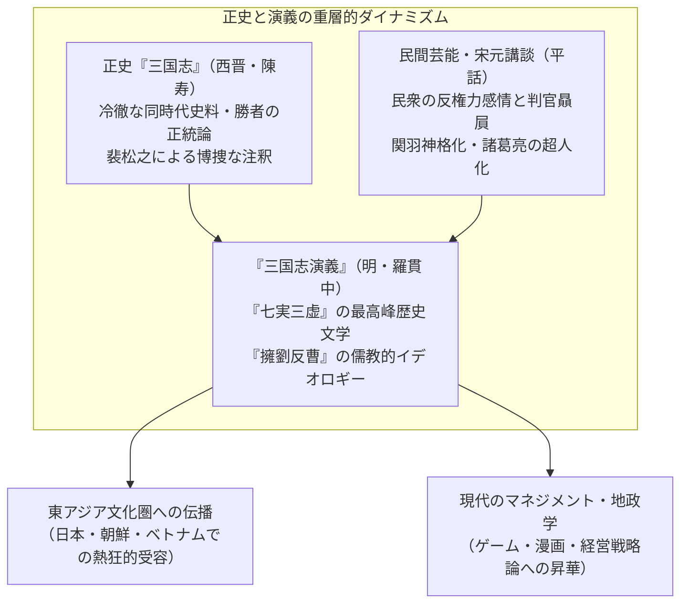
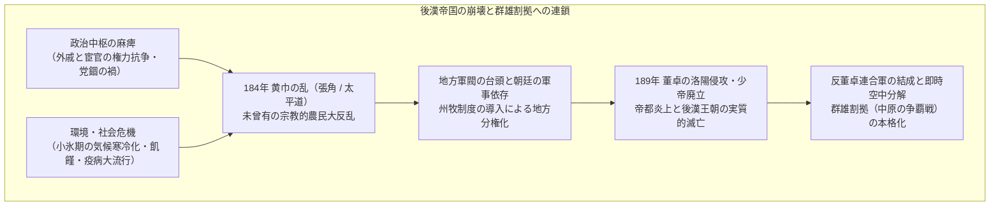
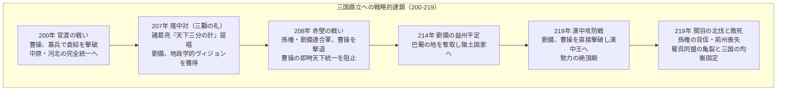
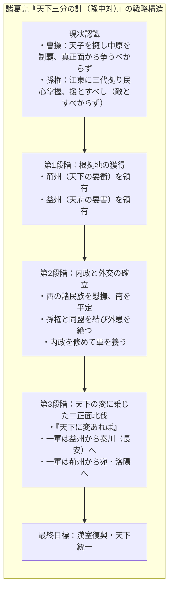
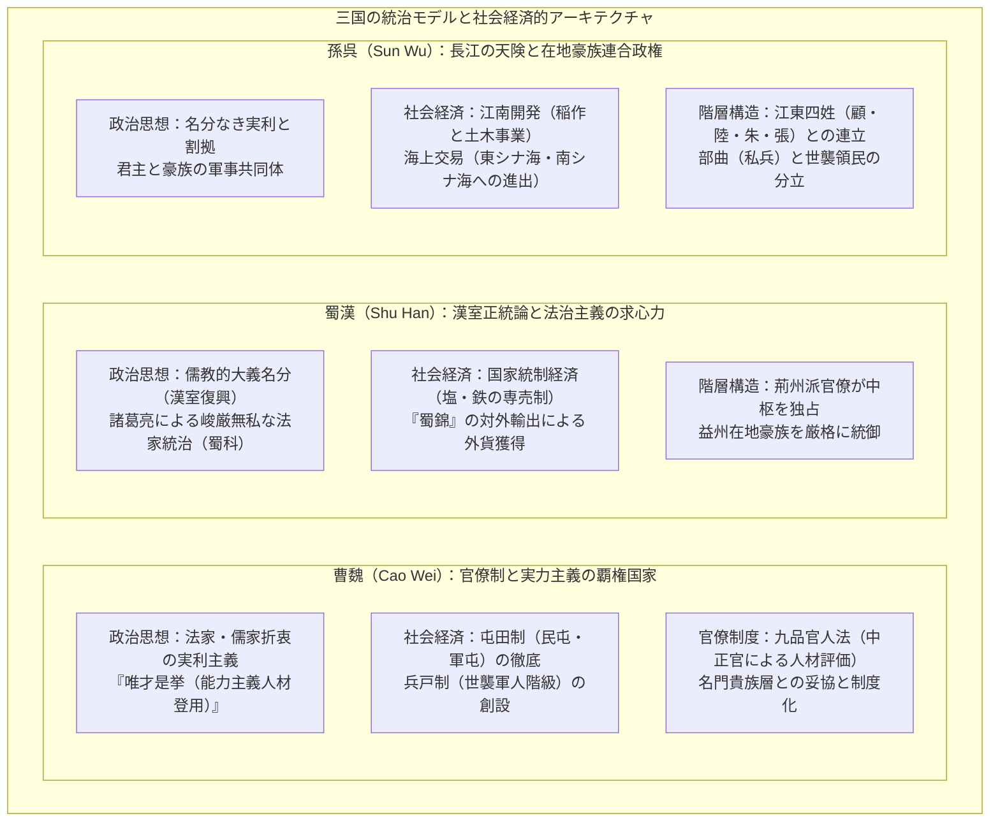

## 序論：なぜ「三国志」は1800年を超えて人々を魅了し続けるのか

西暦184年の「黄巾の乱」から、西暦280年に西晋（Western Jin）が孫呉を平定して天下を統一するまでのおよそ1世紀。ユーラシア大陸東端の広大な中国原野を舞台に繰り広げられた **「三国時代（Three Kingdoms period）」** の興亡は、1800年の時空を超え、いまなお東アジアのみならず世界中の人々の知的想像力と情熱を捉えて離さない。

なぜ、数ある中国王朝の交代劇の中で、この時代の動乱だけがこれほどまでに強烈な文化的磁場を放ち続けているのか。

その最大の理由は、「三国志」という世界が、厳密な史料批判に裏打ちされた **歴史事実としての「正史『三国志』」（陳寿 著、裴松之 注）** と、千年にわたる民衆の熱狂と講談・演劇の堆積を経て明代に結実した **最高峰の歴史小説「『三国志演義』（羅貫中 著）」** という、類を見ない「二重構造」を持っている点にある。



歴史的事実としての三国時代は、後漢帝国の秩序崩壊に伴う人口の激減、寒冷化と飢饉、そして過酷な戦乱が吹き荒れた殺伐たる乱世であった。後漢最盛期に約5,600万人を数えた登録人口は、三国鼎立の末期には魏・蜀・呉の3国を合算しても800万人前後にまで激減したとされる（隠匿戸口や流民の存在を考慮しても、社会の荒廃は極限に達していた）。

しかし、この制度的空白と極限の生存競争の中から、既成の権威や身分秩序を打ち破る **「知略の革新」** と **「国家構想の実験」** が次々と生まれた。
- 曹操（Cao Cao）が創出した能力至上主義の人材登用令（唯才是挙）と、兵糧問題を解決した「屯田制」。
- 諸葛亮（Zhuge Liang）が掲げた、小国が大国を呑むための地政学的グランドデザイン「天下三分の計（隆中対）」と、厳正無私な法治主義。
- 孫権（Sun Quan）が長江の天険を盾に切り拓いた江南開発と、東シナ海・南シナ海を見据えた海洋商業国家の胎動。

そして何より、この時代を生きた群雄、軍師、武将、名もなき民衆たちが織りなした人間心理の極限劇 —— 曹操の冷徹な合理主義と孤独、劉備の泥臭い仁義と執念、関羽の誇り高き忠義と悲劇、諸葛亮の報われぬ大義への殉職 —— が、時代や国境を超えた普遍的な人間賛歌として昇華されたのである。

本稿では、この「三国志」の壮大なパノラマを、単なるエピソードの羅列やあらすじ紹介にとどまらず、 **歴史学、政治思想、軍事地政学、社会経済制度、そして文学受容史の全方位から徹底解剖** する。正史と演義の乖離を客観的に見極めつつ、乱世を駆け抜けた者たちの思想と戦略の深層に迫っていく。

---

## 第1章：後漢王朝の落日と群雄割拠の幕開け（184〜200年）

三国時代の幕開けは、400年にわたって中華世界を統合してきた大帝国「漢（前漢・後漢）」の壮絶な自己崩壊から始まった。強大な中央集権国家がなぜ急速に求心力を失い、地方豪族や軍閥の割拠を許すに至ったのか。その深層には、制度疲労、権力中枢の腐敗、そして地球規模の気候変動が複雑に絡み合っていた。



### 1.1 宦官・外戚の専横と「党錮の禍」：後漢帝国の構造的機能不全

後漢（東漢: 25〜220年）の政治構造は、その中盤以降、極めて特異な悪循環に陥っていた。幼少の皇帝が相次いで即位したためである。

皇帝が幼少であれば、政権の実権は皇太后とその一族である **「外戚（がいせき）」** が掌握する。やがて皇帝が成長すると、自らの親政を取り戻すため、宮廷の奥深くで日常を共にする **「宦官（かんがん）」** と結託して外戚を武力で排除する。しかし、権力を握った宦官集団が私利私欲に走り、親族を地方官に就けて収賄と暴政を極めると、次の代には再び外戚が宦官を弾圧する —— この血塗られた権力闘争が延々と繰り返された。

これに対し、儒教的倫理観を信奉する官僚層や太学（国立大学）の学生たちは、宦官の腐敗を厳しく糾弾した。彼らは自らを「清流派（せいりゅうは）」と誇称し、宦官とその追随者を「濁流派（だくりゅうは）」と蔑んだ。

しかし、危機感を募らせた宦官勢力は皇帝を動かし、清流派の士大夫たちに「朋党を組んで国政を乱した」との冤罪を着せ、徹底的な大弾圧を加えた。これが西暦166年と169年の2度にわたる **「党錮の禍（とうこのか）」** である。何百人もの高官や知識人が処刑・獄死し、数千人が終身禁錮（官職追放）処分に処された。

この弾圧は、後漢王朝にとって取り返しのつかない致命傷となった。地方の豪族層や知識人階級が中央政府に完全に絶望し、「国家の法や権威を守る気概」を失ってしまったのである。中央の道徳的権威が失墜した空間に、地方分権的な武装勢力が台頭する土壌が急速に形成されていった。

### 1.2 気候寒冷化、飢饉、疫病と「黄巾の乱」

政治の腐敗に追い打ちをかけたのが、自然界の激変であった。

古気候学や歴史人口学の研究によれば、2世紀後半から3世紀にかけての東アジアは、いわゆる **「小氷期（Little Ice Age）」** の寒冷化サイクルの初期段階に突入していた。冬の厳冬化と夏の干魃・冷害が連年発生し、黄河・長江流域の農業生産力は壊滅的な打撃を受けた。さらに、飢餓によって栄養状態が悪化した民衆を、壊滅的な **「疫病（チフスや天然痘と推測される）」** のパンデミックが直撃した。建安年間の文人・曹植が記した『説疫賦』には、「家ごとに僵尸（きょうし: 行き倒れの死体）の痛みを抱き、室ごとに号泣の哀あり」という地獄絵図が記録されている。

この絶望の淵に現れたのが、河北の鉅鹿郡（現在の河北省）出身の道士・ **張角（Zhang Jiao）** であった。

張角は、黄帝と老子の思想に民間信仰を融合させた新興宗教 **「太平道（たいへいどう）」** を創始した。呪術的な符水（ふすい: 祈祷した水）を飲ませて病人を治療し、自らの罪を告白させる布教活動を展開したところ、病と飢えに苦しむ数十万の農民信者が瞬く間に帰依した。張角は信徒を軍事組織に改編し、全国を36の「方（ほう: 軍管区）」に分割して一斉蜂起の準備を整えた。

スローガンとして掲げられたのが、極めて有名な予言詩である。
> **「蒼天已死、黃天當立、歲在甲子、天下大吉」** 
> （蒼天すでに死す、黄天まさに立つべし、歳は甲子に在りて、天下大吉）

後漢王朝の徳を示す「青空（蒼天）」はすでに命運尽きた。これに代わり、土徳を象徴する「黄色い天（黄天）」が打ち立てられねばならない。干支が「甲子（かっし: 新たな60年周期の起点）」となる西暦184年こそが、革命の年である ——。

184年2月、信徒たちは黄色い頭巾を目印として一斉に武装蜂起した。これが **「黄巾の乱（Yellow Turban Rebellion）」** である。蜂起は河北、河南、山東など帝国の心臓部に飛び火し、官衙は焼き払われ、官吏は逃亡・虐殺された。

驚愕した朝廷は、皇甫嵩（Huangfu Song）、朱儁（Zhu Jun）、盧植（Lu Zhi）ら名将を派遣するとともに、党錮の禁を解除して士大夫層の協力を要請。さらに、曹操、劉備、孫堅といった後の英傑たちが義勇軍や討伐軍の隊長として歴史の表舞台に躍り出ることとなった。

乱そのものは、年内に張角が病死したこともあり、官軍の猛攻によって主力は鎮圧された。しかし、残党は「黒山賊」や「白波賊」といった独立した匪賊集団と化して全土でゲリラ戦を継続。もはや自力で治安を維持できなくなった朝廷は、西暦188年、地方の統治権限を大幅に強化する **「州牧（しゅうぼく）制度」** を導入した。州の軍事・行政・財政の全権を一握に握る州牧の誕生は、地方長官がそのまま独立した「軍閥（Warlords）」へと変貌する決定的な引き金となったのである。

### 1.3 董卓の専横と洛陽炎上：旧秩序の完全崩壊

西暦189年、霊帝が崩御すると、宮廷内で外戚の首領・何進（He Jin）と宦官集団「十常侍」の対立が最終局面に突入した。何進は地方軍閥の軍事力を威嚇に利用しようと、西北辺境の涼州で異民族を束ねて精強な軍団を率いていた **董卓（Dong Zhuo）** を首都・洛陽へと召喚した。

しかし、董卓が洛陽近郊に到着する直前、計画を察知した宦官たちによって何進は暗殺される。これに激怒した名門出身の青年将校・袁紹（Yuan Shao）や曹操らが宮中に乱入し、2,000人を超える宦官を皆殺しにするという流血のクーデターが決行された。

この無政府状態の混乱に乗じて洛陽に進駐したのが、軍事力で圧倒する董卓であった。辺境の野卑な軍閥であった董卓は、名門貴族たちを武力で威圧し、幼少の少帝を廃位して献帝（劉協）を擁立。自らは「相国（しょうこく）」に就任して朝政を独占した。

董卓の残虐非道な恐怖政治は、伝統的な士大夫たちの耐え難い屈辱となった。西暦190年、袁紹を盟主として、関東（函谷関以東）の諸侯が一斉に決起した。これが **「反董卓連合軍」** である。曹操、孫堅、袁術、橋瑁、鮑信ら群雄がこれに加わった。

連合軍の圧力に対し、董卓は恐るべき焦土作戦を決断する。何百年もの歴史を誇る大帝都・洛陽の民衆数百万人を長安（現在の西安）へ強制移住させ、宮殿、官衙、民家、歴代皇帝の陵墓に至るまでことごとく略奪・放火して焼き払ったのである。東アジア最大の文明都市・洛陽は、一夜にして瓦礫の灰燼へと帰した。

さらに皮肉なことに、大義を掲げて結集したはずの反董卓連合軍は、董卓軍の強大さを恐れて進軍を躊躇し、酒宴と領地分捕りの腹の探り合いに終始した。怒った曹操や孫堅が単独で追撃を仕掛けるも敗北。連合軍は董卓を討ち果たすことなく、内紛によって瓦解した。旧帝国の秩序はここに完全に消滅し、弱肉強食の **「群雄割拠時代」** が幕を開けたのである。

（なお、暴虐を極めた董卓自身は、西暦192年、長安において腹心の養子・呂布（Lu Bu）と司徒・王允（Wang Yun）の謀計によって暗殺され、その遺体は長安の市場で豚のように晒された。）

### 1.4 中原の争覇戦：群雄の興亡

旧秩序が灰燼に帰した中原（ちゅうげん: 黄河中下流域の穀倉地帯）は、血で血を洗うトーナメント戦の修羅場と化した。各地方に割拠した主な群雄の勢力図は以下の通りであった。

- **袁紹（Yuan Shao）** : 「四世三公（4代にわたり最高官職を輩出した家柄）」を誇る当代随一の名門。河北の覇者・公孫瓚を激戦の末に滅ぼし、冀州・青州・幽州・并州の「河北4州」を完全制圧して最強の軍団を形成。
- **袁術（Yuan Shu）** : 袁紹の従弟（または異母弟）。淮南（揚州北西部）に拠り、孫堅が洛陽から持ち帰った「伝国璽（皇帝の玉璽）」を手に入れると、誇大妄想に駆られて自ら皇帝（仲家）を僭称。四面楚歌に陥り自滅していく。
- **孫策（Sun Ce）** : 「江東の虎」孫堅の長男。「小覇王」と称される圧倒的な武勇とカリスマで、父の死後、わずか数年で江東（長江下流域南岸）の6郡を電撃的に平定。後の孫呉政権の強固な領土的基盤を一代で築き上げるが、西暦200年、刺客の襲撃を受けて26歳の若さで非業の死を遂げる。
- **呂布（Lu Bu）** : 「人中の呂布、馬中の赤兎」と謳われた天下無双の猛将。しかし信義に薄く、丁原、董卓を次々と裏切り、流浪の末に徐州を劉備から奪取。曹操と劉備の連合軍に下邳で包囲され、部下の裏切りによって処刑される。
- **劉表（Liu Biao）** : 名士の評判高く、風光明媚で豊かな荊州（長江中流域）を保全。戦火を逃れた無数の学者や流民を受け入れ、学問を振興して平穏を維持したが、積極的な天下取りの野心を持たぬ「守成の徒」にとどまった。
- **劉備（Liu Bei）** : 前漢の景帝の子孫を称するも、若年期は草鞋売りをして母を養った叩き上げの英雄。関羽、張飛と義兄弟の結束を結び、陶謙から徐州を譲られるも呂布に奪われ、曹操、袁紹、劉表のもとを流浪し続ける。領土を持たない流浪の軍閥でありながら、その類稀な「人間的求心力」によって天下に名を知られていた。

### 1.5 曹操の台頭と「献帝奉戴」：大義名分と合理主義の結合

この無数の群雄の中で、抜きん出た戦略眼をもって頭角を現したのが **曹操（Cao Cao, 字は孟徳）** であった。

曹操は宦官の家系（養祖父が権勢を誇った大宦官・曹騰）の出身であり、袁紹のような伝統的貴族層からは出自を低く見られていた。しかし曹操は、卓越した軍略家、冷徹な政治家、そして当代最高峰の文学者（詩人）という多面的な天才であった。

曹操の最初の決定的な戦略的跳躍は、西暦196年の **「献帝奉戴（ほうたい）」** である。
長安を脱出し、董卓の残党（李傕・郭汜）から逃れて飢餓と困窮の中で洛陽の廃墟をさまよっていた若き皇帝・献帝を、軍師・荀彧（Xun Yu）の献策に従って保護し、自らの根拠地である許昌（現在の河南省許昌市）へと迎え入れたのである。

この一手により、曹操は政治的に無敵のカードを手に入れた。
> **「天子を挟（さしはさ）みて諸侯に令す（挟天子以令諸侯）」**

他の軍閥にとっては、曹操を攻撃することは「皇帝に対する反逆」を意味するようになった。曹操は朝廷の最高権力者（大将軍、後に丞相）として、国家の公式な詔勅を用いて敵対勢力を逆賊と断じ、自らの軍事行動をすべて「官軍による逆賊討伐」として正当化できる絶対的な大義名分を手に入れたのである。

同時に曹操は、崩壊した中原を立て直すための画期的な経済改革に着手する。それが **「屯田制（とんでんせい）」** の導入である（196年、棗祇・韓浩らの提言）。戦乱で耕作者を失った広大な荒廃地を国有地とし、流入した難民を募って農具と牛を貸与して開墾させた。収穫の5割〜6割を小作料（税）として国家が徴収する代わりに、農民には兵役を免除し生活を保障した。

この屯田制により、曹操軍は他勢力が最も苦しんでいた「兵糧の欠乏」を完全に克服し、数百万石に及ぶ穀物を備蓄することに成功した。政治的大義（献帝奉戴）と、現実的・物質的な生産基盤（屯田制）を両輪として確立した曹操は、いよいよ北方の大巨人・袁紹との天下分け目の決戦へと向かっていく。

---

## 第2章：覇権の激突と三国鼎立への道程（200〜219年）

西暦200年から219年に至る約20年間は、群雄割拠の混沌の中から、天下の版図が「魏・蜀・呉」の3大勢力へと集約されていく、三国志の歴史において最も劇的で戦略密度の高い黄金の時代であった。

この時代の推移を決定づけたのは、3つの巨大な戦役 —— **「官渡の戦い（200年）」** 、 **「赤壁の戦い（208年）」** 、そして **「漢中・樊城の攻防（219年）」** であった。



### 2.1 官渡の戦い（200年）：寡兵が巨人を呑み込んだ情報戦

西暦200年、中国北方の覇権を巡り、歴史上名高い決戦 **「官渡の戦い（Battle of Guandu）」** の火蓋が切られた。

対峙したのは、河北4州を完全制圧し、精鋭歩兵10万、騎兵1万を擁する当代最強の巨人・ **袁紹（Yuan Shao）** と、天子を擁するも兵力わずか2万から3万足らずの **曹操（Cao Cao）** であった。兵力差は実に3倍から4倍。客観的な軍事力から見れば、曹操の敗北は必至と見られていた。

戦いは、黄河を渡河して南下した袁紹軍に対し、曹操軍が官渡（現在の河南省中牟県北東）の要塞に籠城して持久戦を展開する形で膠着した。袁紹軍は土山を築いて櫓から矢を浴びせ、坑道を掘って城内へ侵入を試みたが、曹操は投石機（発石車）を開発して櫓を破壊し、塹壕を掘って坑道を遮断した。

しかし、長引く対峙は、兵力と兵糧に劣る曹操軍を徐々に窒息させていった。曹操軍の食糧は尽きかけ、将兵は飢えと疲労で極限状態に陥り、曹操自身も許昌の留守を預かる荀彧に「退却したい」と弱音の手紙を送るほどであった。荀彧は「いま退けば天下は袁紹のものとなる。相手の綻びを待つべし」と曹操を叱咤激励した。

そして、勝敗を決定づける劇的な転換点が訪れる。それは **「情報と兵站」** をめぐる内部崩壊であった。

袁紹の参謀の一人であった **許攸（Xu You）** は、袁紹に軍を二手に分けて許昌を奇襲する策を進言したが容れられず、折から一族の不正蓄財が発覚して袁紹の怒りを買った。絶望した許攸は、夜陰に乗じて曹操陣営へと投降した。

曹操は幼馴染みでもあった許攸の来訪を聞くや、履物を履くのも忘れて素足のまま飛び出して出迎えたとされる。許攸は曹操に決定的な機密情報を漏洩した。
> 「袁紹軍の兵糧数万車は、すべて後方の **烏巣（うそう）** に集積されている。守将の淳于瓊（Chunyu Qiong）は油断して防備を怠っている。いま精鋭騎兵をもって夜襲をかけ、これを焼き払えば、袁紹の数十万の大軍は戦わずして自壊するであろう。」

曹操は即座に決断した。自ら袁紹軍の軍旗を掲げた精鋭5,000の軽騎兵を率い、顔に墨を塗り、馬の口に木片を噛ませて音を消し、敵の哨戒線をすり抜けて烏巣を急襲した。淳于瓊の軍を激戦の末に殲滅し、袁紹軍の全兵糧と資材をことごとく焼き尽くした。

天を焦がす烏巣の炎を見た袁紹軍は、大恐慌に陥った。さらに袁紹の猛将・張郃（Zhang He）と高覧が曹操に降伏したことで戦線は一挙に崩壊。袁紹は長男の袁譚とともに、わずか800騎の手勢とともに黄河を北へと敗走した。

官渡の戦いは、単なる戦闘の勝利にとどまらない。名門の血筋と兵力の多寡に頼り、内部の諫言に耳を貸さなかった袁紹の貴族主義に対し、能力主義、迅速な意思決定、そして情報と兵站を最優先した曹操の近代的な合理主義が圧勝した、古代軍事史上の金字塔であった。曹操はその後、袁紹の病死を経て袁氏一族を各個撃破し、207年には北方の烏桓族まで平定して、 **中国北部（中原および河北）の完全統一** を成し遂げたのである。

### 2.2 劉備の流転と「三顧の礼」：天下三分の計の地政学的衝撃

中原が曹操の圧倒的な武力によって統一されていく中、天下を流浪し続けていた **劉備（Liu Bei）** は、荊州の劉表を頼り、新野（しんや: 河南省南陽市）という辺境の小城に駐屯していた。すでに40歳を過ぎ、「髀肉の嘆（ひにくのたん: 戦場から遠ざかり、太ももに贅肉がついたことを嘆く）」を漏らす日々であった。

しかし、西暦207年、劉備の運命、そして中国の歴史を根本から変える歴史的会遇が訪れる。襄陽の郊外・隆中（りゅうちゅう）の草庵に隠棲していた27歳の無名の青年・ **諸葛亮（Zhuge Liang, 字は孔明）** との出会いである。

劉備は自ら礼を尽くし、若き諸葛亮の庵を3度訪ねて教えを乞うた。これが名高い **「三顧の礼（Three Visits to the Thatched Cottage）」** である。そして、この狭い草庵の中で、諸葛亮が劉備のために開陳した天下統一へのグランドデザインこそが、不朽の地政学的戦略論 **「天下三分の計（隆中対: Longzhong Plan）」** であった。



諸葛亮が説いた戦略の骨子は、徹底的なリアリズムに貫かれていた。
1. **敵と味方の冷徹な峻別** : 曹操は天子を擁して中原を制しており、正面衝突してはならない。孫権は江東に深く根を張っており、味方として提携すべきであり、敵にしてはならない。
2. **領土獲得の標的選定** : 荊州は北は漢・沔に通じ、南は南海を極め、東は呉・会に通じ、西は巴・蜀に通じる「天下の要衝（用武の国）」である。しかし劉表にはこれを保つ能力がない。益州は周囲を険峻な山脈に囲まれ、沃野千里を誇る「天然の天府（要害）」であるが、劉璋は暗愚である。この2州を奪取して自らの足場とせよ。
3. **二正面作戦による北伐** : 内政を整え、南西の異民族を手なづけ、孫権と強固な同盟を結んだ上で、「天下に変事（曹操政権の内紛や民心の離反）」が起きた瞬間、益州（漢中）から長安へ主力軍を北上させ、同時に荊州からも将軍に命じて洛陽へ進撃させる。挟撃された民衆は必ずや劉備を歓迎し、漢室の復興は成るであろう。

この構想を聞いた劉備は、自らの目の前に立ち込めていた霧が一気に晴れ渡るのを感じ、「予に孔明あるは、なお魚に水あるがごとし（水魚の交わり）」と歓喜した。領土も明確な戦略目標も持たぬ単なる傭兵隊長に過ぎなかった劉備は、諸葛亮という類稀なグランドストラテジストを得たことで、初めて「国家を建設する指導者」へと覚醒したのである。

### 2.3 赤壁の戦い（208年）：長江の水上要塞と天下の分水嶺

天下三分の計が提示された直後の西暦208年夏、曹操は自ら数十万の大軍を率いて南征を開始した。折悪しく荊州の劉表が病死し、後を継いだ次男の劉琮（Liu Cong）は戦わずして曹操に降伏。劉備は南へと逃亡し、当陽・長坂（ちょうはん）において曹操の精鋭騎兵「虎豹騎」に追いつかれ、妻子を捨てて命からがら逃げ延びる大敗を喫した（この逃走戦の中で、趙雲の単騎主君救出や張飛の一騎当千の長坂橋の伝説が生まれた）。

劉備は夏口（現在の武漢市）に逃れ、長江下流の江東を支配する若き指導者・ **孫権（Sun Quan）** との提携を模索した。諸葛亮は単身、孫権の陣営へと赴き、孫権を補佐する都督・ **周瑜（Zhou Yu）** や重臣・ **魯粛（Lu Su）** と連携して、主戦論へと導く見事な外交交渉を展開した。

孫権の重臣たちの多くは「曹操は数十万の大軍を率い、天子を擁しており、長江の水軍すら手に入れた。降伏するほかない」と主張していた。しかし周瑜は曹操軍の致命的な弱点を喝破した。
1. 北方の騎兵主体の軍であり、水上戦に全く不慣れであること。
2. 長距離遠征により兵馬が極度に疲弊し、疫病の発生が避けられないこと。
3. 馬の飼料が不足し、糧道の維持が極めて困難であること。

意を決した孫権は、自らの剣で机の角を切り落とし、「これ以上、降伏を口にする者はこの机と同じ処分にする」と宣言。周瑜を総司令官とする3万の精鋭水軍を劉備軍と合流させ、長江を遡って西進させた。

西暦208年冬、長江の難所・ **赤壁（Battle of Red Cliffs）** において、曹操軍と孫権・劉備連合軍が激突した。

曹操軍は船酔いに苦しむ北方兵のために、軍船同士を鉄鎖と板で連結して揺れを止める陣形をとっていた。これを見た周瑜の副将・ **黄蓋（Huang Gai）** は、「偽りの降伏」を申し出る書簡を曹操に送り、枯草や油を満載した高速火船数十隻を率いて曹操艦隊へと接近した。

追い風（東南の強風）に乗った火船群は一斉に点火され、猛烈なスピードで曹操の連結艦隊へと突入した。鉄鎖で固定された曹操の巨船群は互いに燃え移り、長江の川面は瞬く間に火の海と化した。風に乗った火炎は岸辺の陣営にまで燃え広がり、曹操軍は未曾有の壊滅的打撃を受けた。

曹操は残存兵力をまとめ、泥濘と疫病が蔓延する華容道を通って辛うじて北方へと逃走した。

赤壁の戦いは、中国史上最大の水上決戦であり、 **曹操による電撃的な天下統一の野望を永遠に打ち砕いた世界史的会戦** であった。この勝利によって長江中下流域の支配権は確保され、諸葛亮が予見した「天下三分」の前提条件が現実のものとなったのである。

### 2.4 益州争奪戦と漢中攻防戦（211〜219年）：蜀漢の領土確定

赤壁の勝利の後、劉備は荊州南部（武陵・長沙・零陵・桂陽）を速やかに平定し、長年渇望していた独自の領土を手に入れた。しかし、天下三分の計を完成させるためには、西方の巨大な沃野・ **「益州（四川盆地）」** の領有が不可避であった。

西暦211年、益州の牧・劉璋（Liu Zhang）が、北方で勢力を伸ばす張魯（五斗米道の指導者）の脅威に対抗するため、同じ漢の宗室である劉備に援軍を要請した。諸葛亮、龐統（Pang Tong）、法正（Fa Zheng）らは、「これこそ天が益州を授ける機会である」と劉備に領土奪取を進言した。

劉備は葛藤の末に益州侵攻を決断。名軍師・龐統が落鳳坡で戦死するなどの痛手を受けながらも、西暦214年、州都・成都を包囲し、劉璋を降伏させて益州全土を掌握した。劉備軍の陣営には、関羽、張飛、趙雲に加え、神威と称された涼州の豪傑・馬超（Ma Chao）や老将・黄忠（Huang Zhong）が加わり、最高潮の陣容が整った。

そして西暦217年、劉備は自らの覇権を賭け、益州の北の玄関口である要衝・ **「漢中（Hanzhong）」** の奪取作戦を発動した。漢中は秦嶺山脈と大巴山脈に挟まれた盆地であり、ここを魏に抑えられている限り、成都は常に喉元に刃を突きつけられているに等しかった。

漢中攻防戦において、劉備は法正の巧緻な作戦指揮の下、定軍山の戦いにおいて魏の西方方面軍総司令官であった名将・ **夏侯淵（Xiahou Yuan）** を黄忠の奇襲によって討ち取った。激怒した曹操自らが大軍を率いて漢中に親征してきたが、劉備は険阻な山岳要塞に拠って徹底的なゲリラ戦・持久戦を展開。補給線を断たれた曹操は、かの有名な言葉「鶏肋（けいろく: 捨てるには惜しいが、食べるほどの肉もない）」を吐いて撤退を余儀なくされた。

西暦219年秋、劉備は漢中を完全制圧し、群臣の推戴を受けて **「漢中王」** に即位した。草鞋売りから身を起こし、天下を流浪し続けた劉備が、ついに曹操と対等な王として中原に覇を唱えた瞬間であった。蜀漢陣営の士気は最高潮に達し、天下三分の計の最終段階である「北伐」の足音が現実味を帯びて聞こえ始めていた。

### 2.5 関羽の北伐と麦城の敗死：荊州喪失と戦略的分水嶺

しかし、頂点を極めたまさにその瞬間、蜀漢の運命を根底から覆す破滅的な悲劇が幕を開ける。発端は、荊州の守備を一手に任されていた名将・ **関羽（Guan Yu）** の単独北伐であった。

西暦219年、劉備の漢中制圧に呼応するように、関羽は荊州の軍団を率いて北上し、曹操軍の重要拠点・樊城（はんじょう: 現在の湖北省襄陽市）を包囲した。折からの豪雨と漢水の氾濫を利用した関羽は、魏の救援軍を率いた于禁（Yu Jin）の七軍を水没させて降伏させ、猛将・龐徳（Pang De）を斬首した。

この **「威震華夏（関羽の威名が中原を震撼させる）」** と称された大勝利に、曹操は恐怖し、一時は首都を許昌から北の河北へ遷都することすら真剣に検討したとされる。

しかし、この関羽の華々しい成功は、同盟者であるはずの **孫権との致命的な亀裂** を表面化させた。
荊州は、劉備にとっては「天下三分の計」の跳躍台であったが、孫権にとっては長江上流を他国に握られているという「国防上の絶対的な脅威」であった。魯粛の死後、呉の都督となった **呂蒙（Lu Meng）** は、「関羽が曹操を破れば、次に呑み込まれるのは我が呉である。いま関羽の背後を突き、荊州全土を奪還すべし」と孫権に密奏した。

さらに、軍事的能力は傑出しながらも傲岸不遜で士大夫を見下す性格であった関羽は、孫権からの婚姻の申し入れを「虎の娘を犬の子にやれるか」と罵倒して拒絶し、さらに味方であるはずの南郡太守・麋芳（劉備の義兄弟）や士仁らを冷遇して孤立していた。

司馬懿（Sima Yi）と蒋済の献策を受けた曹操は、孫権に密使を送り、「関羽の背後を討てば、江南の支配権を公式に認める」との秘密軍事同盟を締結した。

呂蒙は病気と称して前線を退き、無名の若き青年将校・ **陸遜（Lu Xun）** を後任に据えて関羽を油断させた。関羽が樊城包囲のために後方の守備兵を前線へ総動員した隙を突き、呂蒙は白衣（商人の衣服）を着せた精鋭水軍を長江に潜入させ、烽火台の守備兵を奇襲して無血で江陵を占領した（「白衣渡江」）。麋芳と士仁は戦わずして孫権に降伏した。

背後を断たれ、補給を失った関羽軍は一瞬にして崩壊した。関羽はわずかな手勢とともに麦城（ばくじょう）に籠城したが、包囲を破って西の益州へ脱出する途上、呉の伏兵によって捕縛され、息子の関平とともに処刑された。その首級は曹操のもとへと送られた。

関羽の死と **「荊州の喪失」** は、蜀漢政権にとって単なる領土と名将の喪失にとどまらない、 **致命的な戦略的破滅** を意味した。
諸葛亮が描いた「天下三分の計」の根幹であった「益州と荊州からの二正面挟撃」というシナリオは永久に不可能となり、蜀は険阻な四川盆地に閉じ込められた「人口わずか100万足らずの山岳内陸国家」へと転落したのである。そして、義兄弟を殺された劉備の激情は、やがて三国を巻き込むさらなる破滅の戦火（夷陵の戦い）へと向かっていく。

---

## 第3章：三国それぞれの国家像 —— 制度・経済・軍事の比較解剖

三国時代とは、単に3人の英雄が武力で覇権を争った時代ではない。それぞれが全く異なる地理的条件、人口構成、階層秩序、そして政治イデオロギーを抱え、極限の生存競争の中で独自の **「国家統治モデルの社会実験」** を繰り広げた時代であった。

華北・中原を領有した **「曹魏（Wei）」** 、四川盆地に孤立した小国 **「蜀漢（Shu Han）」** 、そして長江流域の湿地帯を開拓した **「孫呉（Wu）」** 。この3国の制度、経済基盤、軍事組織、統治イデオロギーを比較分析することで、三国志の動乱がいかに近代へと続く中国社会の変革期であったかが浮き彫りとなる。



### 3.1 曹魏：実力主義と制度革新の巨大帝国

西暦220年、曹操が病死すると、嫡男の **曹丕（Cao Pi, 文帝）** は後漢の献帝に迫って帝位を禅譲（武力を背景とした形式的な平和的譲位）させ、皇帝に即位した。ここに名実ともに400年の漢王朝は滅亡し、 **「魏」** が成立した。

魏の最大の特徴は、三国の中で群を抜く **「圧倒的な国力（人口・領土・農業生産力）」** と、既成の秩序を恐れずに打ち破った **「制度的リアリズム」** にあった。

1. **「唯才是挙（ゆいざいぜきょ）」と能力主義人事** :
   後漢の儒教社会では、人材登用は「郷挙里選（きょうきょりせん）」と呼ばれ、親孝行や清廉潔白といった道徳的評判（孝廉）に基づいて推薦されていた。しかしこれは名門貴族同士が互いの子弟を推薦し合う談合システムに堕落していた。
   曹操は210年、214年、217年の3度にわたり **「求才令（唯才是挙令）」** を発布。「不仁不孝（道徳的に傷があろうとも）、ただ才能と知略がある者を選抜せよ」と宣言した。この徹底した実力主義により、郭嘉（Guo Jia）、賈詡（Jia Xu）、程昱（Cheng Yu）といった異色の知謀の士や、張遼（Zhang Liao）、徐晃（Xu Huang）、張郃といった敵方の降将を偏見なく最高司令官に抜擢した。

2. **「屯田制」から「兵戸制」への軍事組織化** :
   曹操が確立した屯田制は、難民に農業を行わせる「民屯」から、前線基地の兵士に自活させる「軍屯」へと進化し、淮南（寿春など）の対呉前線において数十万石の兵糧を現地調達するロジスティクスを完成させた。さらに魏は、軍人の家系を一般農民と法的に切り離し、兵役を世襲させる **「兵戸制（へいこせい）」** を導入。安定した常備軍の確保に成功した。

3. **「九品官人法（きゅうひんかんじんほう）」の創設** :
   西暦220年、曹丕が帝位に就く際、大貴族出身の政治家・ **陳羣（Chen Qun）** の建言によって導入された官吏登用制度である（「九品中正法」とも呼ばれる）。各州郡に「中正官（ちゅうせいかん）」という評価官を配置し、現地の人物の才能と品行を1品から9品までの9段階に等級づけ、それに応じた官職を授与する仕組みであった。
   この制度は、能力主義を取り入れつつも、地方の名門貴族（豪族層）の人材評価権を国家が公認する妥協の産物であった。やがて中正官を大貴族が独占するようになると、「上品に寒門（身分の低い家）なく、下品に勢族（名門貴族）なし」と嘆かれたように、魏から西晋、さらには南北朝時代へと続く **「貴族制社会」** の揺るぎない制度的基盤へと転化していった。

### 3.2 蜀漢：法家精神に基づく正統主義の小国

関羽の敗死によって荊州を奪われた劉備は、西暦221年、曹丕の魏王朝建国（漢の滅亡）に対抗し、成都において自ら皇帝に即位した。「漢」の正統な後継者として天下に号令したため、正式な国号は **「漢（歴史上は蜀、または蜀漢と呼ぶ）」** である。

蜀漢の根本的なアキレス腱は、その **「人口と領土の圧倒的な過小性」** であった。魏が全土の約7割の人口（400万人以上）と広大な平原を領有していたのに対し、蜀は険阻な四川盆地と南方の密林地帯に押し込められ、戸籍上の人口は **わずか約90万〜100万人** 、兵力は10万前後に過ぎなかった（魏の3分の1から4分の1以下）。

この圧倒的な劣勢を覆し、小国が大国に飲み込まれないために、政権の実質的な最高執行官となった諸葛亮が採用したのが、極めて厳格な **「法治主義（法家思想）」** であった。

1. **厳正無私な法の支配（『蜀科』の制定）** :
   正史『三国志』諸葛亮伝において、陳寿は諸葛亮の統治を以下のように絶賛している。
   > **「法度を整え、科条を具え、権制を司り、情偽を尽くす。心を公平にし、賞罰を明らかにす。善として顕われざるはなく、悪として除かれざるはなし。」**
   諸葛亮は法正らとともに蜀の基本法典 **『蜀科（しょくか）』** を制定。どんなに身分の高い功臣であっても法を犯せば厳罰に処し、逆に身分が低くとも功績があれば必ず抜擢した。汚職や不正を徹底的に排除した清廉な官僚組織を築き上げたことで、民衆は「法が厳しいこと」に不満を抱くどころか、その公平無私な態度に心から服従した。

2. **国家管理経済：蜀錦と塩鉄専売制** :
   山岳地帯に閉ざされた蜀が北伐の莫大な軍費を賄うため、諸葛亮は経済の構造改革を断行した。
   - **蜀錦（しょっきん）の振興** : 四川特産の極めて高品質な絹織物「蜀錦」の生産を官営工場（錦官城）で集中管理した。蜀錦の美しさと品質は魏や呉でも高級品として渇望され、敵国であるはずの魏に対しても密貿易や商人を通じて輸出され、巨額の外貨（金・銀・銅・物資）を蜀にもたらした。諸葛亮自身、「いま軍需が満たされているのは、ひとえに錦のおかげである」と語っている。
   - **塩・鉄の専売制** : 前漢の武帝の経済政策に倣い、製塩と製鉄を民間の豪族から取り上げて完全な国家専売制とした。これにより、在地豪族の経済的独立性を削ぎ、国家財政を一元化した。

3. **支配構造の矛盾：荊州派 vs 益州在地派** :
   しかし、蜀漢政権の内部には常に深刻な火種が燻っていた。劉備とともに外から入ってきた少数派の **「荊州出身者（諸葛亮、蒋琬、費禕らの中枢官僚）」** が政権と軍の中枢を独占し、土着の多数派である **「益州在地豪族（譙周などの知識人層）」** を政治的に疎外・統制していた点である。この内部亀裂は、後に北伐の行き詰まりとともに深まり、蜀漢滅亡の際の無血開城の引き金となっていく。

### 3.3 孫呉：長江の天険と在地豪族連合政権

赤壁の勝利と関羽の討伐によって長江中下流域（揚州・荊州・交州）の広大な水系を手に入れた孫権は、西暦222年に「呉王」を称し、229年には武昌（後に建業: 現在の南京市）において皇帝に即位した。 **「呉（孫呉 / 東呉）」** の誕生である。

孫呉政権の本質は、曹魏のような官僚的集権国家でも、蜀漢のようなイデオロギー的一党独裁国家でもなく、君主（孫氏）と在地の大豪族層が妥協と合議によって共存する **「豪族連合政権」** であった。

1. **江東四姓（こうとうしせい）との連立方程式** :
   江東（江南）の地には、古くから強大な経済力と血縁ネットワークを誇る四大名門豪族 **「顧（こ）・陸（りく）・朱（しゅ）・張（ちょう）」** が君臨していた。
   外来の軍閥であった孫氏一族（孫堅・孫策）は、当初これらの豪族を武力で弾圧して反発を買ったが、孫権は極めて柔軟な政治的バランス感覚を発揮し、豪族の子弟を高官や将軍に登用して姻戚関係を結んだ。特に陸遜（陸氏の代表）を最高司令官（大都督、丞相）に据えたことは、孫呉政権の基盤を磐石なものとした。

2. **「部曲（ぶきょく）」と「世襲領兵制」の分権構造** :
   孫呉の軍事制度は、極めて独特な分権的色彩を帯びていた。将軍たちは国家から兵を支給されるだけでなく、自らの私兵集団である **「部曲（私兵・私有民）」** を率いて戦場に赴いた。将軍が戦死・病死すると、その軍団と領地は子や弟へと世襲された（世襲領兵制）。
   この制度は、防衛戦においては「自分たちの土地と家族を守る」ために無類の強さと結束力を発揮したが、いざ他国へ侵略・北伐を行おうとすると、豪族たちが自らの私兵を失うリスクを恐れて消極的になるという構造的限界を内包していた。孫呉が終始「守るに強く、攻めるに脆い」政権であった最大の理由がここにある。

3. **江南の開発と海洋帝国の萌芽** :
   孫呉の歴史的功績として見逃せないのが、未開の湿地帯であった江南の急速な農業開発と、海洋への進出である。
   - **稲作土木と異民族（山越）の統合** : 湿地帯の干拓と灌漑水路網の整備を進め、江南を中国随一の穀倉地帯へと変貌させる基礎を築いた。また、険阻な山岳地帯に拠って反抗していた先住異民族 **「山越（さんえつ）」** を陸遜や諸葛恪らが平定し、数十万の人口を平野に移住させて農業労働者および精強な兵力として組み入れた。
   - **海上探検と南海交易** : 長江の水軍力と優れた造船技術を背景に、孫権は西暦230年、将軍の衛温・諸葛直に命じて1万の兵を乗せた大船団を派遣し、 **「夷洲（いしゅう: 現在の台湾）」** および「亶洲」を探検させた（中国正史における台湾への最初の公式派遣記録）。さらに現在のベトナム北部（交趾）からマレー半島、インド洋沿岸諸国との海上交易を展開し、莫大な富を蓄積した。

```
【魏・蜀・呉 三国の総合国力・制度比較表（西暦260年前後）】
```

| 比較項目 | 曹魏（Wei） | 蜀漢（Shu Han） | 孫呉（Sun Wu） |
| :--- | :--- | :--- | :--- |
| **首都** | 洛陽（Luoyang） | 成都（Chengdu） | 建業（Jianye: 現・南京） |
| **領土範囲** | 中原、河北、山東、山西、陝西、淮南、遼東（全土の約60%） | 益州（四川盆地、漢中、雲南・貴州の南部山岳地帯） | 揚州、荊州南部、交州（長江中下流域、広東、ベトナム北部） |
| **推定戸数・人口** | **約66万戸 / 約440万人** （全人口の約60%） | **約28万戸 / 約94万人** （全人口の約13%） | **約52万戸 / 約230万人** （全人口の約27%） |
| **常備兵力** | **約40万〜50万人** （精強な中原歩騎兵、烏桓・鮮卑騎兵） | **約10万人** （山岳歩兵、連弩兵、白耳兵） | **約23万人** （無敵の長江水軍、山越兵、私兵部曲） |
| **政治思想・体制** | 法家・儒家折衷、能力主義、集権的官僚制 | 漢室正統イデオロギー、厳正な法治主義（蜀科） | 在地豪族との連立合議制、分権的君臣共同体 |
| **主要人事制度** | **九品官人法** （中正官による9等級制）、求才令 | 諸葛亮の親政による抜擢、科条に基づく賞罰 | 豪族推薦、世襲領兵制、門閥による世襲 |
| **基幹経済基盤** | 華北の畑作・麦作、 **屯田制（民屯・軍屯）** 、塩鉄 | 四川盆地の稲作、 **蜀錦（官営絹織物輸出）** 、井塩 | 江南の稲作・干拓開発、 **海上南海貿易** 、製塩 |
| **地政学的強み** | 圧倒的な人口規模、兵站補給力、機動力ある騎兵 | 四川の険阻な山岳による「絶対防衛の天然要塞」 | 長江の巨大な天然水防線、卓越した水上戦闘力 |
| **構造的弱点** | 名門貴族の台頭による皇帝権力の形骸化（司馬氏の簒奪） | 人口・国力の極端な過小性、荊州派と益州派の内紛 | 豪族の私兵制による求心力不足、対外遠征の消極性 |

---

## 第4章：諸葛亮の遺志と三国の黄昏（220〜280年）

三国鼎立が完成した後の後半世紀は、英雄たちが次々と世を去り、冷酷な現実の力関係と制度の疲弊が国家の命運を呑み込んでいく「三国の黄昏」の時代であった。

この時代の中心軸となったのは、蜀漢の宰相・ **諸葛亮（Zhuge Liang）** の生涯を賭けた北伐への挑戦と、中原の覇者・魏の内部で進行した **司馬氏（Sima clan）** による軍事クーデターと簒奪のドラマであった。

### 4.1 劉備の復讐戦と夷陵の戦い（222年）：白帝城の孤託

西暦221年、皇帝に即位した劉備の最初の国家的意思決定は、諸葛亮や趙雲らの必死の諫言を退けて強行された **「東征（孫呉討伐戦）」** であった。

義弟・関羽を殺され、荊州を奪われた恨みを晴らすという私情と、天下三分の計を取り戻すためには荊州を再奪取するしかないという戦略的焦燥が劉備を突き動かしていた。折から、遠征に先立って張飛（Zhang Fei）が部下の裏切りによって暗殺されるという悲劇に見舞われながらも、劉備は自ら4万から5万の精鋭軍を率いて長江を下り、怒涛の勢いで呉領へと侵攻した。

初期の戦況は劉備軍が圧倒し、呉の前線基地を次々と破って数百里に及ぶ長江沿岸を占領した。孫権は危機に瀕し、再び若き知将・ **陸遜（Lu Xun）** を大都督（総司令官）に任命して前線の全権を委託した。

陸遜がとった戦略は、徹底した **「焦眉の持久戦」** であった。
蜀軍の猛攻を頑強に受け流して要害に籠城し、決して打って出ようとはしなかった。夏の酷暑が到来すると、長江の峡谷沿いに陣を敷いた劉備軍は、暑さを避けるために木々の生い茂る山林沿いに700里（約350km）にわたって陣地を連ねる「連営（れんえい）」を敷いた。

これこそが、陸遜が待ち望んでいた致命的な隙であった。
西暦222年6月、長風が吹き抜けた夜、陸遜は全軍に藁の束と松明を持たせ、水陸両面から劉備軍の連営に対して **「猛烈な火計（一斉放火）」** を浴びせた。狭い山道に連なっていた蜀の陣営は一瞬にして火の海と化し、退路を断たれた将兵は谷底に追い落とされ、数万の軍勢が壊滅した。

劉備は側近に守られて辛うじて戦場を脱出し、長江沿いの要塞・白帝城（永安）へと逃げ延びた。これが世界戦史に名高い **「夷陵の戦い（Battle of Yiling）」** である。

大敗の痛手と心労から病に倒れた劉備は、翌223年4月、白帝城の寝台に諸葛亮を呼び寄せ、歴史に残る感動的な遺言を遺した。これが **「白帝城の孤託（託孤: たくこ）」** である。
> **「君の才能は曹丕の十倍あり、必ずや国を安んじ、大事（天下統一）を大成するであろう。もし我が子（劉禅）が補佐するに足る器であれば、これを補佐せよ。もし我が子が不才にして補佐するに足らぬ者であれば、君が自らこれに代わって国を治めよ（君可自取之）。」**

臣下に対して「自ら帝位を奪って皇帝になれ」と遺言することは、儒教社会において前代未聞の破格の言葉であった。諸葛亮は涙を流して床に平伏し、頭を血がにじむほど打ち付けて誓った。
> **「臣、敢えて股肱（ここう）の力を尽くし、忠貞の節を致し、これに死するに継ぐなからんや（私は死ぬまで忠義を尽くし、臣下としての節操を守り抜きます）。」**

劉備は崩御し、17歳の暗愚な後主・劉禅（Liu Shan）が即位した。国の主力を失い、周辺を敵に囲まれた絶望的な小国・蜀漢の重荷が、すべて諸葛亮の細い双肩にのしかかったのである。

### 4.2 諸葛亮の南征（「攻心為上」）と名文『出師の表』

劉備の死後、諸葛亮が最初に着手したのは、破綻した **「孫呉との同盟復活」** であった。鄧芝を呉へ派遣し、孫権に対し「魏の脅威に対抗するには蜀呉が唇歯（しんし: 唇と歯のように互いに支え合う関係）となるしかない」と説得して軍事同盟を再締結した。

次なる課題は、劉備の敗戦に乗じて反乱を起こした南方の異民族地域（南中: 現在の雲南省・貴州省・四川省南部）の平定であった。
西暦225年、諸葛亮は自ら軍を率いて南征を開始した。このとき、盟友の参謀・馬謖（Ma Su）が諸葛亮に進言した言葉は、東洋の対反乱作戦（COIN）の最高の名言として知られる。
> **「心を用兵の攻めとするは上策、城を攻めるは下策。心を服せしむるを上策とし、兵を戦わしむるを下策とす（攻心為上、攻城為下、心戦為上、兵戦為下）。」**

諸葛亮はこの教えを実践した。反乱の首領であった豪族・ **孟獲（Meng Huo）** を生け捕りにするたびに陣営を案内して釈放し、心服するまで戦わせた（『演義』における「七縦七擒: 7度捕らえて7度許す」の伝説的エピソードの原形）。孟獲はついに「公は天威なり、南人再び叛かず」と涙を流して心服した。

諸葛亮は南中に漢民族の軍隊を駐屯させず、現地の首領に自治を委ねる寛容な統治を敷いた。これにより、背後の脅威を取り除くだけでなく、南中の金、銀、鉄、漆、茶、そして精強な軍馬や兵力を蜀の国家財源として確保することに成功したのである。

南征を終えて成都に帰還した西暦227年、諸葛亮はいよいよ生涯の悲願であった **「北伐（魏の討伐）」** に打って出る決断を下す。北へ軍を進めるにあたり、若き皇帝・劉禅に奉った上奏文が、漢文文学の最高峰と称される **『出師の表（すいしのひょう: Qian Chushi Biao）』** である。

> 「先帝、創業いまだ半ばならずして、中道に崩殂（ほうそ）せり。今、天下三分し、益州は疲弊せり。これ誠に危急存亡の秋（とき）なり……」

先帝・劉備への熱い恩義、自らの忠誠の誓い、そして朝廷の引き締めと人材登用の要諦を綴ったこの名文は、後世「『出師の表』を読んで涙を流さない者は、人の子として忠ならざる者である」と評された。

### 4.3 北伐の軌跡（228〜234年）：五丈原に星墜つ

西暦228年春から234年にかけて、諸葛亮は計5回に及ぶ大規模な **「北伐（Northern Expeditions）」** を敢行した。

険阻な秦嶺山脈を越えて魏の長安を突く北伐は、兵力と国力において圧倒的に劣る蜀にとって、極めて困難な冒険であった。しかし諸葛亮は、「小国が内に安住していれば、大国との国力差は開く一方であり、いずれ座して滅びを待つのみである。攻めることこそが最大の防御である」という攻勢防衛の戦略哲学を貫いた。

```
【諸葛亮の五次にわたる北伐の軌跡】
・第1次北伐（228年春）：隴右（甘粛省南部）に電撃侵攻。天水・南安・安定の3郡が蜀に降伏。姜維を獲得。しかし、馬謖が街亭の戦いで命令に背いて山頂に布陣し、張郃に包囲されて大敗。諸葛亮は全軍撤退を余儀なくされ、「泣いて馬謖を斬る（揮涙斬馬謖）」。
・第2次北伐（228年冬）：陳倉城を包囲するも、魏の守将・郝昭の強固な防衛に阻まれ、食糧が尽きて撤退。追撃してきた王双を討ち取る。
・第3次北伐（229年春）：武都・陰平の2郡を攻め取り、蜀の領土に編入。
・第4次北伐（231年春）：木牛（輸送車）を実戦投入。祁山を包囲し、魏の総司令官・司馬懿（仲達）と直接対決。上邽で魏軍を撃破するも、後方で李厳の兵糧補給が遅延・捏造され、無念の撤退。追撃した魏の名将・張郃を木門道で射殺。
・第5次北伐（234年春）：流馬を投入し、斜谷から出撃。五丈原（陝西省宝鶏市岐山県）に布陣し、屯田を行って長期戦を志向。司馬懿と対峙。
```

北伐の最大の敵は、魏軍の強大さ以上に、 **「険阻な山岳地帯を通じた兵糧補給の物理的限界」** であった。蜀の兵士は1人が荷物を運ぶために、道中で自らその食糧の大半を消費してしまう。このロジスティクスのボトルネックを解消するため、諸葛亮は画期的な輸送機器である **「木牛（もくぎゅう）」** と **「流馬（りゅうま）」** を発明・配備した。これは山岳の隘路でも効率よく荷物を運搬できる特殊な一輪車・手押し車（または機械的歯車装置）であったと考えられている。

西暦234年、第5次北伐において、諸葛亮は魏水（渭水）の南岸・ **五丈原（Wuzhang Plains）** に広大な陣を敷き、兵士に現地の農民と混じって屯田を行わせ、半永久的な補給態勢を確立した。

対する魏の軍師・ **司馬懿（Sima Yi, 仲達）** は、諸葛亮の知略を恐れ、徹底した「不戦・持久戦略」に徹した。陣門を固く閉ざして決して打って出ようとはせず、諸葛亮が挑発のために「女ものの衣服や首飾り」を送り届けて臆病者と侮辱しても、微笑んで受け流した。司馬懿は蜀の使者から「諸葛亮は朝早くから夜遅くまで働き、罰は二十叩き以上なら自ら決裁し、食事は数合しか口にしていない」という日常を聞き出すと、「諸葛孔明、食少なく事煩わし、其れ能く久からんや（孔明は長く生きられないだろう）」と見抜いた。

その予言は現実となった。過労と心労によって諸葛亮の肉体は限界に達し、234年8月23日夜、五丈原の軍陣の中で静かに息を引き取った。享年54。

諸葛亮の死後、蜀軍は遺言に従って喪を伏せ、整然と退却を開始した。諸葛亮の死を察知して追撃してきた司馬懿は、蜀軍が突然反転して攻勢に出てくると、諸葛亮が生きていると錯覚して恐怖し、慌てて全軍を撤退させた。ここから「 **死せる孔明、生ける仲達を走らす** 」という故事が生まれた。

諸葛亮は中原を回復する夢を果たせなかった。しかし、その至誠、清廉、そして知略は、敗北者でありながら勝者を凌ぐ光彩を放ち、東洋人の道徳的理想像として不滅の存在となったのである。

### 4.4 曹魏の内部崩壊と司馬氏の簒奪

諸葛亮という最大の強敵が消え去った後、今度は中原の曹魏帝国の内部で、巨大な権力地殻変動が勃発した。

曹丕の死後、曹叡（明帝）が若くして崩御すると、わずか8歳の曹芳（斉王）が即位。政権の補佐役（後見人）として、皇族の筆頭である **曹爽（Cao Shuang）** と、宿将・ **司馬懿** が任命された。

曹爽は名門豪族層を排除し、身内の側近たちで権力を独占して贅沢を極め、司馬懿を実権のない「太傅（名誉職）」へと棚上げした。司馬懿はこれに対抗せず、重い病気のふり（耳が聞こえず、薬を口からこぼす痴呆の演技）をして自邸に引きこもり、敵を完全に油断させた。

西暦249年正月、曹爽一派が皇帝・曹芳を奉じて洛陽郊外の高平陵へ墓参に出かけた瞬間、70歳の司馬懿は突如として蜂起した。これが **「高平陵の変（Incident at Gaoping Tombs）」** である。司馬懿は洛陽の宮城を電撃的に占拠し、曹爽一派を国家反逆罪で一族皆殺しに処して、魏の軍事・政治の実権を完全に掌握した。

司馬懿の死後、その権力は長男の **司馬師（Sima Shi）** 、次男の **司馬昭（Sima Zhao）** へと継承された。曹魏の皇室は完全に傀儡と化し、西暦260年には、屈辱に耐えかねた皇帝・曹髦（Cao Mao）が「司馬昭の心は、路傍の人も皆知る（司馬昭之心、路人皆知: 誰の目にも帝位簒奪が明白である）」と叫び、宮殿の護衛兵を率いて自ら司馬昭の邸宅へ斬り込んだが、司馬昭の配下によって白昼堂々惨殺されるという前代未聞の悲劇が発生した。魏王朝の命運は完全に尽きていた。

### 4.5 三国の滅亡と西晋による天下統一（263〜280年）

司馬昭は帝位禅譲の総仕上げとして、最大の軍事的功績を求めた。それが **「蜀漢の討伐」** であった。

当時、蜀では諸葛亮の後を継いだ愛弟子・ **姜維（Jiang Wei）** が計11回に及ぶ執念の北伐を繰り返していたが、度重なる遠征は疲弊した蜀の国力を決定的に枯渇させていた。朝廷では後主・劉禅が宦官の黄皓（Huang Hao）を寵愛して政治は腐敗し、民心は離反していた。

西暦263年、司馬昭は鍾会（Zhong Hui）と **鄧艾（Deng Ai）** に命じ、18万の大軍で蜀へ侵攻させた。姜維は難攻不落の要塞・ **剣閣（けんかく）** に立て籠もり、鍾会の主力10万余りを完全に釘付けにした。

ここで、中国戦史上の奇蹟と呼ばれる乾坤一擲の奇襲作戦を決行したのが、別動隊を率いる鄧艾であった。
鄧艾は、道のない断崖絶壁が連なる **「陰平（いんぺい）の山岳地帯」** を選択。兵士たちに毛布にくるまって絶壁を転がり落ちさせ、700里の無人地帯を踏破して、蜀の背後である江油・綿竹へと突如として出現したのである。守備軍を撃破された成都の朝廷はパニックに陥り、降伏派の官僚・譙周（Qiao Zhou）の進言を受けた劉禅は、一度も戦うことなく降伏。 **西暦263年、蜀漢は43年の歴史に幕を閉じた。**

翌265年、司馬昭の死を受けて跡を継いだ嫡男の **司馬炎（Sima Yan, 武帝）** は、魏の最後の皇帝・曹奐から禅譲を受け、国号を **「晋（西晋: Western Jin）」** と改めた。

残された孫呉は、暴君として名高い第四代皇帝・ **孫晧（Sun Hao）** の苛政によって内部崩壊を深めていた。西暦280年、晋の武帝・司馬炎は水陸20万の大軍を発動。名将・杜預（Du Yu）が陸路を破竹の勢いで進撃し（「破竹の勢い」の語源）、益州で巨大な戦艦群を建造した **王濬（Wang Jun）** の水軍が長江を下った。呉軍が長江に張り巡らせた鉄鎖の防衛線も、王濬が巨大な松明の筏で焼き切って突破され、都の建業は陥落。孫晧は降伏した。

西暦184年の黄巾の乱から数えて **96年目** 。三国に分かれて相食んだ中国全土は、ついに西晋によって再統一されたのである。

---

## 第5章：正史『三国志』 vs 『三国志演義』 —— 虚構と史実の乖離

現代人が親しんでいる「三国志」の物語のほぼ9割は、明代初期（14世紀）に **羅貫中（Luo Guanzhong）** が編纂した歴史小説 **『三国志演義（Romance of the Three Kingdoms）』** に基づいている。

しかし、歴史学のメスを入れると、そこには驚くべき「虚実の断絶」が存在する。明代の文学評論家・章学誠が **「七実三虚（7割の史実と3割の虚構）」** と評したように、『演義』は事実の骨格を保ちつつも、劇的なエンターテインメント性と特定の政治思想によって、歴史上の人物像を大胆に再構築（改変）しているのである。

本章では、西晋の **陳寿（Chen Shou）** が記した冷徹な第一級史料 **正史『三国志』** と、羅貫中の『演義』を徹底比較し、いかにして「虚構が史実を上書きしていったのか」のメカニズムを解剖する。

### 5.1 陳寿の執筆背景と裴松之の「注」：歴史叙述の成立

正史『三国志』を著した陳寿（233〜297年）は、もともと蜀漢に仕えた官僚であり、諸葛亮の愛弟子であった譙周の門下生であった。蜀の滅亡後、勝者である西晋に仕え、著作郎（歴史編纂官）として『魏書』30巻、『蜀書』15巻、『呉書』20巻、計65巻からなる『三国志』を私撰した。

陳寿の置かれた立場は極めて複雑であった。
西晋は、魏の禅譲を受けて成立した王朝である。したがって、西晋の正統性を擁護するためには、 **「魏を天子の正統王朝」** と位置づけざるを得なかった。そのため、正史において皇帝の本紀（伝記）が立てられているのは魏の歴代君主（曹操・曹丕ら）のみであり、劉備は「先主伝」、孫権は「呉主伝」として、形式上は魏の臣下に準じる「列伝」の扱いに甘んじている。

しかし陳寿は、故国である蜀漢への敬愛を隠さなかった。劉備を漢室の正統後継者として気品高く描き、とりわけ諸葛亮に対しては最大の賛辞を捧げて単独の巻を与えた。簡潔にして無駄のないその筆致は、司馬遷の『史記』、班固の『漢書』に匹敵する「良史」と称賛された。

だが、陳寿の記述はあまりに簡潔すぎて省略が多く、他国の記録との矛盾も散見された。そこで約130年後の南朝宋の時代、文帝の命を受けた学者・ **裴松之（Pei Songzhi, 372〜451年）** が、現存しない140種以上もの同時代の異説・記録・民間伝承を博捜して注釈を施した（ **裴松之注** ）。この注釈の文章量は、陳寿の本文を遥かに上回る膨大なものであり、多様な視点からの生々しい証言（時には陳寿の記述を真っ向から否定する批判）を記録したことで、三国志の歴史的解像度は奇跡的な豊かさを獲得することとなった。

### 5.2 なぜ劉備は善玉、曹操は悪玉となったのか：「擁劉反曹」の思想史

『三国志演義』を支配する絶対的なイデオロギーは、 **「擁劉反曹（ようりゅうはんそう: 劉備を擁護して正統とし、曹操を逆賊として弾劾する）」** である。なぜこのような明確な勧善懲悪の図式が完成したのか。

その背景には、唐代から宋代、そして明代に至る **「中国社会の歴史的トラウマ」** が深く関わっている。

1. **民衆芸能（平話）と「判官贔屓」の熱狂** :
   唐代の詩人・李商隠の詩には、子供たちが講釈師の三国志の語りを聞き、「劉備が敗れたと聞けば涙を流し、曹操が敗れたと聞けば手を叩いて喜んだ」という記録がある。敗北しながらも理想に殉じた不屈の弱者・劉備に民衆が感情移入し、強大な権力者・曹操を憎む心理は、民間芸能の中で自然発生的に醸成されていった。
2. **南宋の朱子学と「正統論」の逆転** :
   決定的な転換点は、12世紀の南宋（Southern Song）時代に訪れた。中国北方を異民族である女真族の「金（Jin）」に奪われ、江南に追いつめられた漢民族の知識人たちは、「中原を奪われた弱小国家（南宋）こそが中華の正統である」という理論武装を必要とした。
   大儒・ **朱熹（朱子）** は『資治通鑑綱目』において、従来の魏正統論を真っ向から否定し、 **「蜀漢こそが天下の正統である」** と宣言した。中原を不法占拠した曹操は「簒奪者・逆賊」であり、漢の皇統を継いで四川から北伐を挑んだ劉備と諸葛亮こそが「大義の擁護者」であると位置づけられたのである。
3. **明代の漢民族復興ナラティブ** :
   元代（モンゴル帝国）の異民族支配を覆して漢民族王朝を再興した明代初期、羅貫中は民間の講談本（『三国志平話』）と正史を巧みに融合させ、「大義と忠義の劉備 vs 狡猾で冷酷な簒奪者・曹操」という壮大な文学的ドラマとして『三国志演義』を結実させたのである。

### 5.3 代表的エピソードの虚実解剖

『演義』が創作したドラマチックなエピソードの数々は、歴史事実とどのように異なっているのか。代表的な事例を検証する。

#### ① 「桃園の誓い（義兄弟の契り）」の実態
- **演義** : 劉備、関羽、張飛の3人が、張飛の自宅の裏庭にある桃の花が咲き乱れる園で天地神明に祈り、「生まれた日は違えど、願わくは同年同月同日に死せん」と義兄弟の契りを結ぶ、三国志の象徴的プロローグ。
- **正史** : 桃園で義兄弟の契りを結んだという記述は **一切存在しない** 。正史関羽伝には「劉備が関羽・張飛と寝床を共にし、その恩愛は兄弟のようであった」とあるのみ。親密な主従関係を、宋代以降の秘密結社や民衆社会の「義兄弟（結義）」の文化を投影して劇的に創作したものである。

#### ② 「赤壁の戦い」における神話の解体
赤壁の戦いは、『演義』において最も創作と誇張が集中したクライマックスである。
- **草船借箭（そうせんしゃくせん: 草船で矢を借りる）** : 諸葛亮が濃霧の夜、藁人形を積んだ船で曹操陣営に近づき、疑心暗鬼になった曹操軍から10万本以上の矢を射掛けさせて奪い取る痛快なエピソード。  
  $	o$ **史実** : 諸葛亮の策ではない。数年後の西暦213年、濡須口の戦いにおいて **孫権** が自ら偵察船に乗って曹操軍を視察した際、矢を片舷に大量に射込まれて船が傾いたため、船を反転させて反対側の舷にも矢を受けさせてバランスを取り直して帰還したという実話に基づき、作者が諸葛亮の知略として移植・脚色したものである。
- **借東風（とうふうをかりる: 諸葛亮の風呼びの祈祷）** : 諸葛亮が七星壇を築き、道士の衣をまとって祈祷し、火計に必要な東南の風を神力で呼び寄せるオカルト的描写。  
  $	o$ **史実** : 完全なフィクション。諸葛亮に魔術の能力はなく、長江中流域の初冬に局所的に発生する気象学的逆転現象（フェーン現象等による一時的な南東風）を周瑜らが予測・利用したに過ぎない。
- **周瑜の矮小化と諸葛亮の神格化** : 『演義』では、周瑜は諸葛亮の才能に激しい嫉妬を燃やし、「天はすでに周瑜を生みながら、なぜ諸葛亮をも生んだのか！（既生瑜、何生亮）」と血を吐いて憤死する狭量な人物として描かれる。  
  $	o$ **史実** : 正史の周瑜は、容姿端麗（美周郎）で雅量に富み、誰からも敬愛された器の大きい大英雄であった。赤壁の勝利はほぼ100%、 **周瑜、黄蓋、魯粛ら孫呉陣営の功績** であり、当時の諸葛亮は外交官として同盟をまとめた後は後方支援に回っており、前線で軍を指揮した事実はない。
- **華容道（関羽が曹操を見逃す）** : 敗走する曹操を待ち伏せた関羽が、かつて受けた恩義（曹操に客将として厚遇された過去）に報いるため、軍法会議で死罪になるのを覚悟で曹操を見逃す涙のドラマ。  
  $	o$ **史実** : 完全な創作。正史では劉備軍が華容道に追撃を仕掛けたが、火を放つのが一歩遅く、曹操はすでに泥沼を脱出した後であった。

#### ③ 「空城の計（くうじょうのけい）」の虚構
- **演義** : 街亭の敗戦後、手勢わずか数千の西城にいた諸葛亮が、司馬懿率いる15万の大軍に包囲された際、城門を大きく開け放ち、自らは城楼の上で優雅に琴を弾いてみせた。伏兵を恐れた慎重な司馬懿は「孔明は生涯、危険な橋を渡らない男だ」と深読みして退却したという伝説的奇策。
- **史実** : **完全な創作（歴史的捏造）** 。第1次北伐当時、司馬懿は遠く離れた宛城（河南省）に駐屯しており、関中・隴右の戦場には赴いてすらいなかった（対峙していた魏の将軍は張郃と曹真）。郭沖という人物が諸葛亮を顕彰するために語った俗説を裴松之が「虚構である」と徹底論破している。

#### ④ 関羽の神格化：猛将から「関聖帝君（関帝）」へ
関羽は『演義』において、単なる猛将を超えた「義理と信義の絶対的権化」として描かれる。
「過五関斬六将（劉備の妻を守って千里を走り、曹操の5つの関所を突破して6人の将軍を斬る）」や、「刮骨療毒（骨を削って矢毒を取り除く手術中も、平然と酒を飲み碁を打ち続けた）」といったエピソードが熱狂的に語り継がれた。

正史における関羽は、確かに万人の敵と恐れられた勇将（万人敵）であったが、性格は剛情・傲慢であり、士大夫を軽蔑したため部下に背かれ、自らの判断ミスで荊州を失って蜀を破滅へと追いやった責任者でもある。

しかし、その「悲劇的な最期」と「揺るぎなき忠義」は民衆の宗教的崇拝の対象となった。宋代以降、歴代王朝から神号（王、帝、神）を追贈され、明清代にはついに国家の守護神 **「関聖帝君（関帝）」** として祀られるに至った。さらに、信義を重んじる商人の守護神（ **「財神（商売の神）」** ）として華僑社会を通じて世界中に拡散し、世界各国のチャイナタウンに関帝廟が建立されるという、一人の武将の神格化としては世界史上類を見ない宗教現象を生み出したのである。

```
【正史『三国志』 vs 『三国志演義』 主要エピソード・人物対比一覧表】
```

| 項目 / エピソード | 正史『三国志』（陳寿・裴松之注）の史実 | 『三国志演義』（羅貫中）の脚色・文学的虚構 |
| :--- | :--- | :--- |
| **桃園の誓い** | 義兄弟の儀式の記録なし。「恩愛は兄弟のごとし」 | 桃の園で天地に誓い、義兄弟の契りを結ぶ |
| **青龍偃月刀・丈八蛇矛** | 当時は直刀・長槍が主流。大刀は宋代以降の武器 | 関羽（82斤の青龍偃月刀）、張飛（丈八蛇矛）を振るう |
| **温酒斬華雄** | 孫堅が陽人の戦いで華雄を討ち取る | 関羽が酒が冷めぬ間に華雄の首を刎ねる |
| **三貂蝉の連環計** | 呂布が董卓の侍女と密通していた記録のみ | 王允の養女・貂蝉が美女連環の計で二人を離間 |
| **曹操の人物像** | 「非常の人、超世の傑」。法治と詩情の偉大な天才 | 「治世の能臣、乱世の奸雄」。残忍極まりない悪玉 |
| **三顧の礼** | 劉備が3度訪ねた（『出師の表』）。諸葛亮自薦説もあり | 3度目の訪問で昼寝中の諸葛亮を雪の中で待ち続ける名場面 |
| **赤壁の戦いの主役** | 周瑜、黄蓋、魯粛ら孫呉陣営が主導 | 諸葛亮の知謀（草船借箭・借東風）が勝利を導いたと改変 |
| **赤壁後の華容道** | 劉備が追撃したが一歩遅く曹操は脱出 | 関羽が過去の恩義から曹操を涙ながらに見逃す |
| **空城の計** | 街亭の戦い時、司馬懿は現場におらず完全な創作 | 諸葛亮が城門を開放して琴を弾き、15万の軍を退却させる |
| **劉備の白帝城遺言** | 「君自ら取れ」は史実。君臣の究極の信頼の表明 | 諸葛亮の忠誠心を試す君主の心理戦という側面も強調 |
| **死せる孔明走生仲達** | 蜀軍の反転攻勢に驚いた司馬懿が慌てて退却 | 諸葛亮そっくりの木像を見て司馬懿が肝を冷やす |

---

## 第6章：軍事思想・地政学・リーダーシップの教訓

三国志が時代や国境を超えて読み継がれる最大の理由は、極限状況における **「戦略的意思決定」「地政学的制約」「リーダーシップの類型」** を学ぶための、人類史上類を見ない生きたケーススタディ（事例研究）の宝庫だからである。

現代の経営学、組織論、国際政治学の視点から、三国志が遺した普遍的教訓を解剖する。

### 6.1 『孫子』の兵法の実践：曹操の軍事理論と知略の極致

三国時代の軍事行動の根底には、春秋時代の名著 **『孫子（Sun Tzu）』** の思想が脈打っていた。そして、その最高の体現者こそが **曹操** であった。

古代中国において、難解であった『孫子』十三篇のテキストを整理・編集し、自らの実戦経験に基づく注釈を付して今日伝わる形に定着させたのは、他ならぬ曹操の手による **『魏武注孫子（ぎぶちゅうそんし）』** である。曹操は序文で「私は多くの兵書を読んできたが、孫子の書が最も深い。しかし古い解説には誤りが多いため、その要義を削って注釈を施した」と述べている。

曹操の軍事教訓の真髄は、以下の3点に集約される。
1. **「兵とは詭道なり（欺瞞と奇襲）」** : 官渡の戦いにおける烏巣夜襲や、白狼山の戦いにおける電撃戦に見られるように、敵の意表を突き、準備の整っていない急所を痛撃する。
2. **「情報（間諜）の絶対重視」** : 敵の心理状態、内部矛盾、兵糧の集積場所を正確に把握した上で作戦を立案する。許攸の情報を信じて直ちに行動した決断力が好例である。
3. **「兵站（ロジスティクス）を制する者が勝つ」** : 屯田制によって食糧生産を自己完結させ、長期戦に耐えうる補給線を構築した。

### 6.2 地政学的三大制約：地形が決定した三国の命運

歴史学者・日原利国らが指摘するように、三国時代の興亡は、各勢力が根拠地とした土地の **「地政学的構造（Geopolitics）」** によってあらかじめ大きく運命づけられていた。

```
【三国時代の地政学的構造】
```

1. **中原（魏）：圧倒的平原と農業・人口の重心** :
   黄河中下流域の華北平原は、肥沃な土壌と膨大な人口を擁し、ここを抑えた者が経済的・人口統計学的に覇権を握る。しかし、山や大河の障壁がないため防衛が難しく、四方から攻撃を受ける「四戦の地」である。曹操はこの平原を統一したことで、長期戦において他国を圧殺する絶対的優位を獲得した。
2. **巴蜀（蜀）：天府の要害と「出口なき牢獄」** :
   四川盆地は周囲を急峻な山脈（秦嶺山脈・大巴山脈）に囲まれた天然の要害であり、内部は水利に富む豊かな穀倉地帯（都江堰の恩恵）であった。守るにはこれ以上ない堅固な要塞であったが、外へ打って出るには「桟道（崖に木材を渡した細道）」を通らねばならず、兵站補給が絶望的な障壁となった。諸葛亮がいくら知略を尽くしても、長安の手前で補給が尽きて撤退せざるを得なかったのは、この山岳地政学の冷徹な限界であった。
3. **江南（呉）：長江の水防線と「海洋への逃走路」** :
   長江という巨大な水上防壁は、北方の騎兵部隊の南下を鉄壁の守りで阻んだ。呉の軍船技術と水軍戦術は他国を圧倒していたが、長江を渡って北の平原へ侵攻すると、騎兵の機動力に敗れ去る運命にあった（合肥の戦いにおいて、張遼の800の騎兵に孫権の10万の大軍が打ち破られた「合肥のトラウマ」が象徴的である）。

### 6.3 3大指導者のリーダーシップ類型比較

魏・蜀・呉の3人の指導者は、それぞれ全く異なるアプローチで組織を統率した。現代の経営マネジメントにおけるリーダーシップ類型として、極めて示唆に富む。

```
【三国指導者のリーダーシップ特性比較】
```

| 指導者 | リーダーシップ類型 | 主な強み・統率スタイル | 組織的弱点・リスク | 現代の企業・組織への示唆 |
| :--- | :--- | :--- | :--- | :--- |
| **曹操** | **能力主義・ビジョナリー型** | 冷徹な実力重視人事（求才令）、圧倒的なスピード決断、自ら最前線で指揮、詩情とカリスマ | 猜疑心の強さ、身内と名門貴族の対立、後継者指名の難渋 | 破壊的イノベーションを主導するカリスマ創業経営者。スピードと実力重視の組織変革に最適。 |
| **劉備** | **共感力・エンパワーメント型** | 仁義と信義、人間的魅力（徳）、部下への全幅の信頼と権限委譲、不撓不屈のレジリエンス | 情に流されやすい（夷陵の暴走）、自前組織の制度化の遅れ | 共感とビジョンで人を巻き込む心理的安全性重視のリーダー。逆境に強いチームビルディング。 |
| **孫権** | **調停・バランス外交型** | 若手人材の大胆抜擢（周瑜・陸遜）、在地豪族の利害調整、守成のリアリズム、卓越した危機管理 | 晩年の猜疑心と後継者争い（二宮の変）、遠征への求心力不足 | ステークホルダーの利害を調整する合議型経営者。既存市場の防衛や多国籍アライアンスに適合。 |

### 6.4 参謀・軍師の生態系と組織の意思決定

三国志のもう一つの醍醐味は、指導者を支えた **「参謀・軍師（顧問・ブレイン）」** たちの活躍である。

曹操の陣営には、戦略のグランドデザインを描く **荀彧** 、戦場での電撃的奇策を進言する **郭嘉** 、人間の裏の裏を読み切る冷酷な謀略家・ **賈詡** 、内政と法令を整える **崔琰** や **毛玠** など、多士済々のスペシャリストが揃っていた。曹操はこれらの参謀たちを競わせ、複数の異なる選択肢を机上に並べさせた上で、自らの責任において瞬時に決断を下した。

一方、劉備は長年にわたり軍師を持たず、自らの直感と関羽・張飛の武力に依存していたため流浪を余儀なくされたが、 **諸葛亮** という「戦略・内政・外交を一手に担える万能の天才」を得たことで一挙に飛躍した。さらに実戦の軍事参謀として **法正（Fa Zheng）** を得たことで、漢中攻防戦において曹操を直接撃破することに成功した。

「有能なトップは、自分より優秀な専門家を配下に集め、その諫言を聴く耳を持つ」という原則は、いつの時代も組織の盛衰を分ける絶対的真理である。

---

## 第7章：東アジア文化圏への伝播と現代への遺産

三国志の物語は、中国の国境を越え、日本、朝鮮半島、ベトナムなど東アジア全域に深く浸透し、それぞれの民族の精神文化、倫理観、そして大衆娯楽の血肉となっていった。

### 7.1 日本における「三国志」の熱狂的受容史

日本における三国志の受容は、奈良時代に遡る。『続日本紀』には、西暦714年、大学の寮において『三国志』が講義された記録がある。平安時代の貴族たちも教養として正史を読み、軍記物語（『平家物語』や『太平記』）の合戦描写や武将の心理描写には、三国志の故事や漢詩が大量に引用されている。

江戸時代に入ると、元禄年間に京都の禅僧・湖南文山（江島樹）が『三国志演義』を流麗な和漢混淆文に翻訳した **『通俗三国志』（1689〜1692年刊行）** が空前の大ベストセラーとなった。町人の間で講談や読本として大流行し、葛飾北斎や歌川国芳ら浮世絵師が勇壮な三国志武将の錦絵を競って描いた。

近代以降、日本人の三国志観を決定づけたのが、 **吉川英治（Yoshikawa Eiji）** が1939年から1943年にかけて新聞連載した小説 **『三国志』** である。吉川は羅貫中の原典を尊重しつつ、日本人の心情に合わせて人間味あふれる心理描写を加え、曹操の詩人としての魂や、劉備の母への孝行、諸葛亮の憂愁を格調高い筆致で描いた。

この吉川三国志をベースとして、戦後の日本文化の中で驚異的なメディアミックスが爆発した。
- **横山光輝の漫画『三国志』（1971〜1979年連載）** : 全60巻に及ぶ長編大作。劉備の挙兵から諸葛亮の死までを描き、日本の複数の世代にとって「三国志の入門書・教科書」となった。
- **NHK『人形劇 三国志』（1982〜1984年放送）** : 川本喜八郎の魂を込めた精巧な人形と、島本須美、石橋蓮司ら名優の声、細野晴臣の音楽が融合し、子供から大人までをテレビの前に釘付けにした。
- **コーエーテクモの歴史シミュレーションゲーム『三國志』シリーズ（1985年〜現在）** : プレイヤー自らが君主となって天下統一を目指す画期的なゲームシステムは、日本のみならず中国、台湾、韓国へ逆輸入され、世界的な三国志ブームを牽引し続けている。

### 7.2 現代のビジネス・地政学に通じる普遍的知恵

なぜ現代のビジネスパーソンやリーダーたちは、いまなお三国志を愛読するのか。それは、現代のグローバル市場や組織間競争が、まさに三国志の描く「不確実性に満ちた乱世」そのものだからである。

1. **アライアンス（同盟）の冷徹な力学** :
   蜀呉同盟の結成と崩壊の歴史は、現代の企業提携や国際関係の生きた教科書である。「共通の強大な敵（魏 / 独占的大企業）」が存在する間は強固に結ばれるが、領土（市場シェア）をめぐる利害が衝突した瞬間、昨日までの友が最も危険な背信者となる。
2. **人材ポートフォリオの設計** :
   天才肌の尖った才能（法正、魏延、龐統）をどうマネジメントするか、忠誠心は高いが能力の限界がある人材（劉禅政権の官僚たち）をどう配置するか。曹操の能力至上主義と諸葛亮の厳正な評価制度は、現代の人事評価制度（タレントマネジメント）の原点である。
3. **撤退の決断力（引き際の美学とリスク管理）** :
   勝つこと以上に難しいのが、「負け戦における損切り（ロスカット）」である。官渡の戦いで引き際を誤って全軍を失った袁紹と、赤壁で敗北を悟るや即座に船を捨てて逃走し本国の再建に集中した曹操の差は、現代の投資や事業撤退の教訓に直結している。

### 7.3 結語：乱世を生き抜いた人間たちの光芒

三国志の物語が私たちの胸を打つのは、それが単なる勝者の栄光の記録ではなく、むしろ **「敗北していった者たちの美学と志」** を余すところなく描き切っているからである。

天下統一を果たしたのは、曹操でも、劉備でも、孫権でもなく、後から狡猾に権力を簒奪した司馬氏の西晋であった。しかし、歴史の記憶において人々が永遠に愛し、語り継ぐのは、勝者となった司馬炎ではなく、焦土のバラックから義を掲げて立ち上がった劉備であり、報われぬと知りながら五丈原に散った諸葛亮であり、自らの信じる詩情と覇道に生きた曹操である。

人間は、いかに生き、いかに志を抱き、不条理な運命といかに闘うべきか ——。

1800年前の中国原野を疾駆した英傑たちの流した血と涙、そして知謀の光芒は、激動の21世紀を生きる私たちの行く手を照らす、色褪せることのない永遠の灯火なのである。

---

```
【三国時代 主要戦役・政変クロニクル総覧（184年〜280年）】
```

| 年 | 戦役・歴史的事件 | 主要交戦勢力 | 勝者 | 歴史的意義・戦略的帰結 |
| :---: | :--- | :--- | :---: | :--- |
| **184** | **黄巾の乱** | 後漢朝廷軍 vs 太平道（張角） | 朝廷 | 宗教的農民反乱。地方軍閥（州牧）が台頭し後漢の実質的崩壊へ |
| **190** | **反董卓連合軍の結成** | 諸侯連合（袁紹・曹操等） vs 董卓 | 引き分け | 洛陽炎上と長安遷都。連合軍瓦解により群雄割拠が本格化 |
| **200** | **官渡の戦い** | 曹操 vs 袁紹 | **曹操** | 烏巣急襲により曹操が寡兵で大勝。中国北方の覇権を確立 |
| **208** | **赤壁の戦い** | 孫権・劉備連合軍 vs 曹操 | **連合軍** | 長江の水上火計で曹操軍壊滅。曹操の天下統一阻止、「天下三分」の契機 |
| **214** | **劉備の益州平定** | 劉備 vs 劉璋 | **劉備** | 四川盆地を制圧し、蜀漢政権の領土的基盤が完成 |
| **219** | **定軍山・漢中攻防戦** | 劉備 vs 曹操（夏侯淵） | **劉備** | 夏侯淵敗死。劉備が曹操を破り「漢中王」に即位 |
| **219** | **樊城の戦い・麦城の敗死** | 関羽 vs 曹操・孫権連合軍 | **魏・呉** | 呂蒙の白衣渡江により荊州陥落。関羽処刑。蜀呉同盟崩壊 |
| **220** | **後漢滅亡・魏の建国** | 曹丕（献帝から禅譲） | **曹丕** | 献帝廃位により後漢滅亡。「魏」が成立し三国時代が正式に開始 |
| **221** | **蜀漢の建国** | 劉備（皇帝即位） | **劉備** | 漢の正統後継者として成都で即位。年号を章武とする |
| **222** | **夷陵の戦い** | 蜀（劉備） vs 呉（陸遜） | **孫呉** | 陸遜の火計により蜀軍壊滅。劉備は白帝城に逃れて病没（孤託） |
| **225** | **諸葛亮の南征** | 蜀 vs 南蛮諸部族（孟獲） | **蜀** | 「攻心為上」による心服（七縦七擒）。南中平定と北伐の軍費確保 |
| **228** | **第1次北伐・街亭の戦い** | 蜀（諸葛亮） vs 魏（張郃） | **魏** | 馬謖の独断により要衝・街亭を失陥。蜀軍全軍撤退、「泣いて馬謖を斬る」 |
| **229** | **孫権の皇帝即位** | 孫権（呉の建国） | **孫権** | 武昌で即位し建業へ遷都。魏・蜀・呉の皇帝が並立する「三国鼎立」完成 |
| **234** | **第5次北伐・五丈原の戦い** | 蜀（諸葛亮） vs 魏（司馬懿） | 引き分け | 五丈原で対峙中、諸葛亮が陣中で病没。「死せる孔明走生仲達」 |
| **249** | **高平陵の変** | 司馬懿 vs 曹爽 | **司馬懿** | 電撃クーデターにより曹爽一派粛清。司馬氏が魏の実権を掌握 |
| **263** | **蜀漢の滅亡** | 魏（鄧艾・鍾会） vs 蜀（姜維・劉禅） | **魏** | 鄧艾の陰平絶壁越え奇襲。劉禅降伏により蜀漢滅亡（43年で幕） |
| **265** | **魏の滅亡・西晋の建国** | 司馬炎（曹奐から禅譲） | **司馬炎** | 司馬懿の孫・司馬炎が皇帝に即位。国号を「晋（西晋）」とする |
| **280** | **孫呉の滅亡・天下統一** | 晋（王濬・杜預） vs 呉（孫晧） | **西晋** | 破竹の勢いで建業陥落。孫晧降伏。96年におよぶ動乱の終結と天下統一 |
