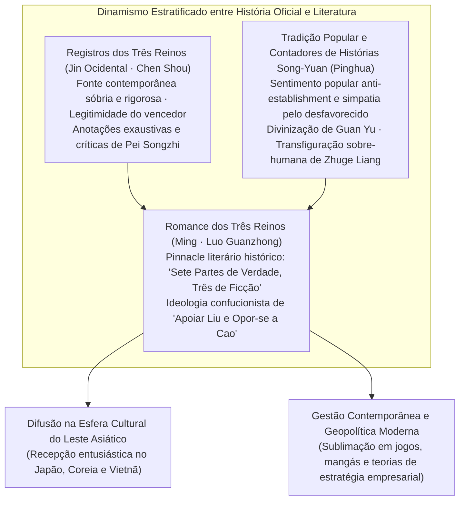
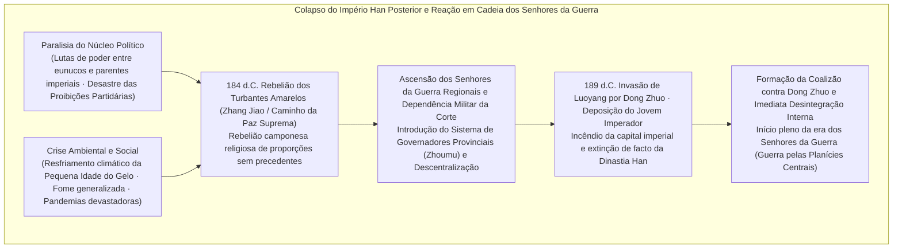
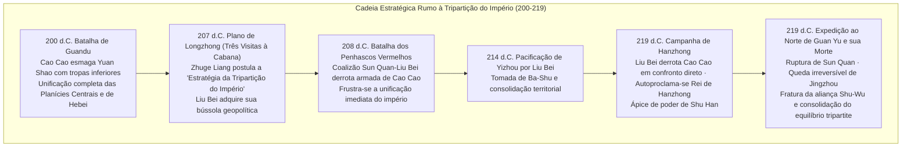
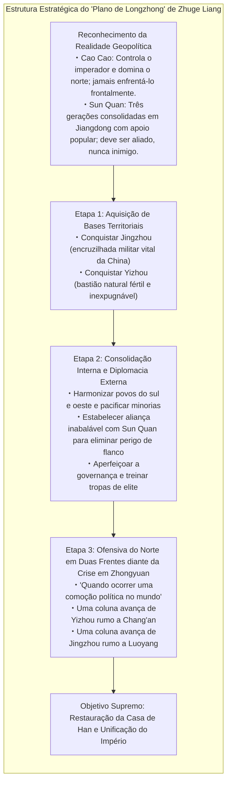
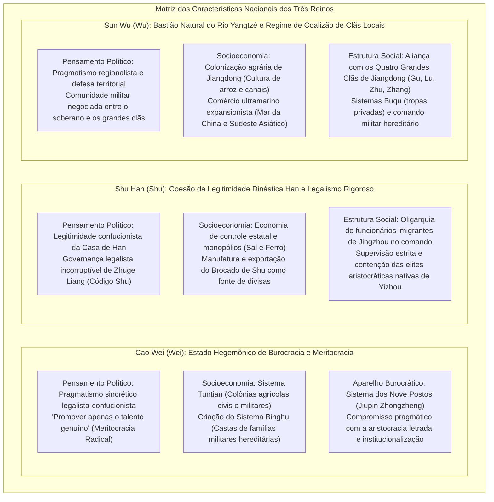

## Introdução: Por que os «Três Reinos» Continuam a Fascinar a Humanidade após Mais de 1.800 Anos?

Desde a eclosão da «Rebelião dos Turbantes Amarelos» em 184 d.C. até a pacificação definitiva de Sun Wu pela Dinastia Jin Ocidental (Western Jin) em 280 d.C., completando a unificação de todo o império, transcorreu aproximadamente um século. O épico de ascensão e queda da **«Era dos Três Reinos» (Three Kingdoms period)**, desenrolado nas vastas planícies e desfiladeiros do extremo oriental da Eurásia, atravessou mais de 1.800 anos de história e continua a capturar de forma indelével a imaginação intelectual e a paixão fervorosa não apenas do Leste Asiático, mas de entusiastas e estudiosos em escala global.

Por que, em meio às inúmeras transições dinásticas e convulsões bélicas que pontilham a milenar história chinesa, exatamente as turbulências deste período exercem um campo magnético cultural tão avassalador e duradouro?

A razão primordial reside no fato de que o universo dos «Três Reinos» ostenta uma fascinante e incomparável «estrutura dual»: de um lado, os fatos históricos comprovados por rigorosa crítica historiográfica, cristalizados nos **«Registros dos Três Reinos» (*Sanguozhi*, escritos por Chen Shou, com as monumentais anotações críticas de Pei Songzhi)**, a história oficial; de outro lado, a obra-prima absoluta da literatura histórica chinesa, o **«Romance dos Três Reinos» (*Sanguo Yanyi*, atribuído a Luo Guanzhong)**, forjado ao longo de um milênio de entusiasmo popular, teatro folclórico e tradição oral acumulada até desabrochar na Dinastia Ming.



Como realidade estritamente histórica, o período dos Três Reinos foi uma era sombria e impiedosa de catástrofe demográfica, decorrente do colapso da ordem institucional do Império Han Posterior, do resfriamento climático global, de fomes cíclicas devastadoras e de conflitos armados endêmicos. A população recenseada nos registros imperiais, que atingira cerca de 56 milhões de habitantes no auge do Han Posterior, despencou de forma vertiginosa para algo em torno de 8 milhões somando-se os três reinos de Wei, Shu e Wu nas décadas finais da tripartição (mesmo levando em consideração a proliferação de domicílios ocultos e massas de refugiados errantes, a desolação socioeconômica alcançou patamares extremos).

Contudo, foi exatamente a partir desse vácuo institucional e dessa luta desesperada pela sobrevivência mais elementar que brotaram sucessivas **«inovações de estratégia intelectual»** e audaciosas **«experiências de refundação estatal»**, capazes de despedaçar as hierarquias estamentais petrificadas e a autoridade tradicional estabelecida:
- Os editos de recrutamento meritocrático proclamados por Cao Cao (*Wei cai shi ju* — «promover apenas o talento genuíno») e a implementação pioneira do sistema agrário de subsistência militar (*Tuntian*), que solucionou de forma engenhosa o perene flagelo do abastecimento bélico.
- O grandioso plano geopolítico formulado por Zhuge Liang — a célebre «Estratégia da Tripartição do Império» (*Longzhong Dui*) —, desenhado para permitir que um estado pequeno e periférico desafiasse gigantes hegemônicos, alicerçado em uma governança legalista de estrita e incorruptível imparcialidade.
- A ousada exploração e desenvolvimento da bacia do Rio Yangtzé liderada por Sun Quan sob a proteção de seu monumental fosso aquático natural, lançando as sementes pioneiras de uma nação comercial e marítima voltada para o Mar da China Oriental e o Mar do Sul da China.

Acima de tudo, os profundos dramas da psicologia humana tecidos pelos senhores da guerra, estrategistas geniais, generais destemidos e massas anônimas que atravessaram essa tempestade — a fria racionalidade e a comovente solidão de Cao Cao; a lealdade obstinada, rústica e apaixonada de Liu Bei; o orgulho inabalável, a honra cavalheiresca e o trágico destino de Guan Yu; e o heroico sacrifício de Zhuge Liang, imolando-se por uma causa grandiosa que sabia de antemão ser inalcançável — transcenderam épocas, fronteiras e línguas para se converterem em um sublime e universal hino à condição humana.

O presente ensaio se propõe a dissecar esse grandioso panorama dos «Três Reinos» para muito além do mero inventário anedótico ou resumo narrativo, oferecendo uma **análise exaustiva a partir das múltiplas lentes da historiografia crítica, do pensamento político, da geopolítica militar, dos sistemas socioeconômicos e da história da recepção literária**. Ao discernir objetivamente as fraturas entre os fatos históricos documentados e as fantasias da ficção popular, desvendaremos os alicerces profundos do pensamento, da estratégia e das paixões daqueles que cavalgaram em meio ao caos da era da desordem.

---

## Capítulo 1: O Ocaso da Dinastia Han Posterior e a Eclosão dos Senhores da Guerra (184–200 d.C.)

A gênese da Era dos Três Reinos teve como estopim o colapso cataclísmico do colossal Império Han (Han Anterior e Han Posterior), que unificara e sustentara a civilização chinesa ao longo de quatro séculos gloriosos. Por que uma superpotência imperial altamente centralizada perdeu sua força centrípeta de forma tão fulminante, permitindo a fragmentação do território e a emergência tirânica de clãs armados e senhores da guerra regionais? Nas raízes desse colapso entrelaçavam-se a fadiga institucional crônica, a corrupção virulenta no coração da corte e abruptas transformações climáticas de escala planetária.



### 1.1 A Tirania de Eunucos e Parentes Imperiais e as «Proibições Partidárias»: A Disfunção Estrutural do Império Han

A estrutura política da Dinastia Han Posterior (Han Oriental: 25–220 d.C.) precipitou-se, a partir de meados de sua trajetória, em um círculo vicioso singularmente autodestrutivo, gerado pela sucessão contínua de imperadores entronizados ainda na mais tenra infância.

Enquanto o imperador era menor de idade, as rédeas da administração imperial eram usurpadas pela imperatriz-viúva e pelos nobres de seu clã materno — a facção dos **«parentes imperiais externos» (*Waiqi*)**. Conforme o soberano crescia e atingia a juventude, em sua ânsia de recuperar a autoridade imperial autônoma, conspirava secretamente com os **«eunucos» (*Huanguan*)**, os servos castrados que compartilhavam intimamente seu cotidiano no interior dos palácios proibidos, para eliminar fisicamente o clã dos parentes maternos por meio de golpes palacianos sangrentos. Contudo, assim que os eunucos conquistavam o controle do governo, entregavam-se a uma desenfreada cupidez pessoal, instalando seus parentes e apaniguados nos cargos administrativos provinciais para extorquir a população com extorsão e tirania. Na geração seguinte, um novo imperador infante subia ao trono e o clã materno voltava a expurgar violentamente os eunucos — uma interminável carnificina palaciana repetida geração após geração.

Em oposição a esse cenário degradante, os funcionários burocráticos leais à moral confucionista e os estudantes universitários da Academia Imperial (*Taixue*) insurgiram-se contra a podridão moral dos eunucos. Orgulhosamente autodenominavam-se a **«Corrente Pura» (*Qingliu*)**, enquanto desprezavam os eunucos e seus bajuladores como a **«Corrente Turva» (*Zhuoliu*)**.

Sentindo o perigo iminente de sua derrocada, a poderosa facção dos eunucos manipulou o imperador, acusando os letrados confucionistas de «formarem facções subversivas (*pengdang*) para desestabilizar as instituições do Estado». Desencadeou-se então uma feroz onda de perseguição política em duas etapas monumentais, nos anos de 166 e 169 d.C., conhecida na história como o **«Desastre das Proibições Partidárias» (*Danggu zhi huo*)**. Centenas de altos funcionários, eruditos e letrados exemplares foram sumariamente executados ou pereceram nos cárceres imperiais sob tortura atroz, enquanto milhares foram condenados à cassação perpétua de seus direitos civis e ao banimento oficial.

Este expurgo implacável representou uma ferida mortal e incurável para a legitimidade da Dinastia Han. Os grandes proprietários de terras provinciais e as elites intelectuais letradas perderam toda e qualquer esperança de redenção do governo central, desfazendo-se por completo da lealdade patriótica em defender as leis e a dignidade do trono imperial. No vazio provocado pela perda de autoridade moral da corte de Luoyang, estavam lançadas as bases para que forças armadas de caráter privatista e regionalista brotassem irresistivelmente por todas as províncias do império.

### 1.2 Resfriamento Climático, Fome, Epidemias e a «Rebelião dos Turbantes Amarelos»

Para agravar fatalmente a decomposição política, a natureza desferiu golpes inclementes sobre o império.

Investigações recentes nos campos da paleoclimatologia e da demografia histórica demonstram que, entre a segunda metade do século II e o século III d.C., o Leste Asiático penetrou na fase inicial de um ciclo severo de resfriamento, identificado como a **«Pequena Idade do Gelo» (Little Ice Age)**. Invernos siberianos de rigores sem precedentes alternavam-se com verões marcados por secas prolongadas e geadas fora de época, desferindo golpes devastadores contra a produtividade agrícola nas bacias hidrográficas dos rios Amarelo e Yangtzé. Debilitadas pela desnutrição extrema e pela fome crônica, as populações rurais tornaram-se presas fáceis de catastróficas **epidemias virulentas (presumivelmente febre tifoide, tifo exantemático e varíola)** que varreram as cidades e vilarejos. O renomado poeta da era Jian'an, Cao Zhi, registrou essa paisagem dantesca em sua pungente elegia *Shuo Yi Fu*: «Em cada lar erguia-se o lamento atroz dos cadáveres insepultos; em cada aposento ecoava o pranto desesperado do luto».

Foi em meio a esse abismo de desespero popular que emergiu a figura mística de **Zhang Jiao (Zhang Jiao)**, curandeiro e mestre taoísta oriundo da comarca de Julu (atual província de Hebei).

Zhang Jiao fundou uma nova e influente vertente religiosa popular denominada **«O Caminho da Paz Suprema» (*Taiping Dao*)**, fundindo ensinamentos do lendário Imperador Amarelo e de Laozi com rituais de feitiçaria camponesa. Praticava a cura milagrosa de enfermos através da ingestão de águas abençoadas com cinzas de encantamentos talismânicos (*fushui*), exigindo dos doentes a confissão pública e arrependimento de seus pecados. Em uma sociedade devastada pela peste e pelo abandono estatal, centenas de milhares de camponeses converteram-se cega e devotamente à sua doutrina. Zhang Jiao transformou com genialidade essa massa de fiéis em uma formidável organização militar, dividindo seus seguidores em 36 divisões operacionais denominadas *Fang* (distritos militares), preparando minuciosamente uma insurreição simultânea em escala nacional.

O brado profético e escatológico que serviu de estandarte revolucionário ecoou com força telúrica:
> **«Cangtian yi si, Huangtian dang li, sui zai jiazi, tianxia daji»**  
> （蒼天已死、黃天當立、歲在甲子、天下大吉）  
> *(«O Céu Azul já pereceu; o Céu Amarelo deve erguer-se. No ano cíclico de Jiazi, haverá suprema ventura sob os céus!»)*

O «Céu Azul», que simbolizava a virtude e o mandato cósmico da outrora resplandecente Dinastia Han, havia esgotado irrevogavelmente sua legitimidade moral. Em seu lugar, impunha-se erguer o «Céu Amarelo», representante do elemento Terra que, pelo ciclo dos Cinco Elementos, sucederia ao Fogo dos Han. O ano de 184 d.C., marco de início do novo ciclo sexagenário fundamental (*Jiazi*), representava o instante exato e providencial para a revolução escatológica universal.

Em fevereiro de 184 d.C., os devotos insurgiram-se em armas simultaneamente em múltiplas províncias, cobrindo as cabeças com turbantes amarelos como sinal de reconhecimento e fidelidade mística. Eclodia a **«Rebelião dos Turbantes Amarelos» (Yellow Turban Rebellion)**. As chamas da insurreição consumiram rapidamente o coração produtivo do império — Hebei, Henan e Shandong. Secretarias administrativas foram reduzidas a cinzas, arsenais foram saqueados e magistrados imperiais massacrados ou postos em fuga desordenada.

Tomada de pânico absoluto, a corte imperial mobilizou seus generais mais reputados — Huangfu Song, Zhu Jun e Lu Zhi — e, diante do perigo existencial, decretou a anistia geral dos intelectuais e eruditos perseguidos no Desastre das Proibições Partidárias, convocando a cooperação desesperada dos clãs aristocráticos locais. Foi no contexto dessa brutal mobilização militar que jovens líderes que viriam a esculpir o destino da era — tais como Cao Cao, Liu Bei e Sun Jian — entraram definitivamente no grande palco da história como comandantes de forças imperiais ou líderes de milícias voluntárias de elite.

Embora o núcleo da rebelião tenha sido derrotado no mesmo ano, acelerado pela morte por doença de Zhang Jiao sob o avanço fulminante das tropas veteranas de Huangfu Song, as ramificações rebeldes fragmentaram-se em bandos armados autônomos como os bandidos de Heishan (Montanha Negra) e Baibo (Onda Branca), perpetuando uma impiedosa guerra de guerrilha por todo o país. Totalmente incapaz de restaurar a segurança com seus próprios recursos, a corte imperial promulgou em 188 d.C. o **«Sistema de Governadores Provinciais» (*Zhoumu*)**, transferindo poderes discricionários supremos — abrangendo comando militar, jurisdição civil e arrecadação fiscal autônoma — para os governadores de cada província. A criação dos *Zhoumu* constituiu o gatilho decisivo que transformou altos magistrados provinciais em **autênticos senhores da guerra (*Warlords*) independentes**, selando o desmembramento irremediável do Estado unificado.

### 1.3 A Tirania de Dong Zhuo e o Incêndio de Luoyang: O Colapso Irreversível da Antiga Ordem

No ano de 189 d.C., com a morte do Imperador Ling, o conflito visceral entre o líder dos parentes imperiais maternos, o General-em-Chefe He Jin (He Jin), e a poderosa oligarquia dos eunucos palacianos, conhecida como os «Dez Atendentes» (*Shi Changshi*), atingiu seu ápice catastrófico. Com o propósito imprudente de coagir os eunucos e intimidar a oposição da corte imperial mediante a exibição de força bruta militar, He Jin ordenou que **Dong Zhuo (Dong Zhuo)**, um general rude e impiedoso que comandava cavaleiros nômades e tropas calejadas nas fronteiras inóspitas de Liangzhou, marchasse em direção à capital imperial, Luoyang.

Entretanto, instantes antes de Dong Zhuo atingir os arredores da cidade, os eunucos descobriram a conspiração e assassinaram He Jin no interior do palácio imperial. Enfurecidos pela traição, jovens oficiais militares de famílias nobres tradicionais, encabeçados por Yuan Shao (Yuan Shao) e Cao Cao, invadiram os complexos palacianos à frente de suas tropas, promovendo um sangrento golpe de Estado que culminou no massacre indiscriminado de mais de 2.000 eunucos.

Foi aproveitando-se desse vácuo institucional e do caos anárquico absoluto que Dong Zhuo adentrou Luoyang, dominando a capital imperial graças ao poderio avassalador de seus veteranos da fronteira. Visto com desdém como um bárbaro inculto pela nobreza da corte, Dong Zhuo subjugou os nobres aristocratas pelo terror das espadas, destronou arbitrariamente o jovem Imperador Shao e colocou no trono seu irmão mais novo, o Imperador Xian (Liu Xie). Assumindo pessoalmente o título de Primeiro-Ministro Supremo (*Xiangguo*), Dong Zhuo passou a governar com tirania despótica, desrespeitando todas as tradições sagradas da dinastia.

O reinado de terror sangrento e arbitrário imposto por Dong Zhuo transformou-se em uma humilhação insuportável para os nobres e funcionários confucionistas. No ano de 190 d.C., proclamando Yuan Shao como seu líder e comandante supremo, nobres, magistrados e generais a leste do desfiladeiro de Hangu (*Guandong*) sublevaram-se em massa em uma grande confederação bélica: nascia a **«Coalizão contra Dong Zhuo»**. Figuras monumentais como Cao Cao, Sun Jian, Yuan Shu, Qiao Mao e Bao Xin uniram suas forças sob os mesmos estandartes.

Encurralado pelo avanço dessa coalizão, Dong Zhuo tomou a decisão drástica e nefasta de adotar uma política de terra arrasada de proporções inéditas. Forçou milhões de civis da resplandecente capital Luoyang a marchar compulsoriamente a pé em direção à antiga capital Chang'an (atual Xi'an), semeando estradas com incontáveis cadáveres de famintos e exaustos. Em seguida, saqueou sistematicamente palácios, arquivos imperiais, templos e as tumbas sagradas dos ancestrais da Dinastia Han, ateando fogo a toda a cidade de Luoyang. A mais monumental metrópole civilizada do Leste Asiático, orgulho de quatro séculos de império, foi reduzida da noite para o dia a uma desolada montanha de escombros e cinzas fumegantes.

Para cúmulo da ironia histórica, a pretensa Coalizão contra Dong Zhuo, congregada sob o manto sagrado da justiça imperial, revelou-se covarde e fragmentada. Aterrorizados pelo poderio militar das hostes de cavalaria de Dong Zhuo, os senhores regionais recusaram-se a cruzar os desfiladeiros montanhosos, preferindo entregar-se a intermináveis banquetes opulentos e a conspirações mesquinhas para anexar os territórios vizinhos uns dos outros. Tomados de justa indignação, Cao Cao e Sun Jian avançaram sozinhos para combater o tirano, sofrendo reveses perigosos sem o socorro dos demais aliados. Sem jamais haver desferido um golpe mortal contra Dong Zhuo, a coalizão dissolveu-se em ódios mútuos e guerras fratricidas. A ordem imperial clássica estava aniquilada para sempre, dando início à sangrenta era da **«Proliferação dos Senhores da Guerra» (*Qunxiong Gequ*)**, onde a única lei válida era a implacável sobrevivência do mais forte.

*(O déspota Dong Zhuo, que levara o terror ao paroxismo, encontrou um fim condigno com suas atrocidades em 192 d.C. em Chang'an, sendo traído e assassinado por seu próprio filho adotivo e temível guerreiro, Lu Bu [Lu Bu], em conluio com o Ministro da Justiça Wang Yun [Wang Yun]. O cadáver obeso do tirano foi exposto em praça pública no mercado da cidade com uma tocha cravada em seu umbigo, queimando durante dias em gordura humana.)*

### 1.4 As Batalhas pela Hegemonia nas Planícies Centrais: Ascensão e Queda dos Senhores da Guerra

Com a ordem imperial em ruínas, as Planícies Centrais (*Zhongyuan* — a rica bacia agrícola do curso médio e inferior do Rio Amarelo) converteram-se em uma arena brutal de extermínio recíproco e combate total. O mosaico de forças dos principais senhores da guerra que disputavam os despojos do império configurava-se da seguinte forma:

- **Yuan Shao (Yuan Shao)**: Herdeiro de uma das linhagens mais nobres e prestigiadas do império, ostentando o título glorioso de «Quatro Gerações de Três Excelências» (*Si shi san gong* — família que fornecera os mais altos ministros da corte por quatro gerações ininterruptas). Após uma guerra prolongada e impiedosa, exterminou seu rival nortista Gongsun Zan, estabelecendo domínio absoluto sobre as quatro províncias estratégicas ao norte do Rio Amarelo (Jizhou, Qingzhou, Youzhou e Bingzhou) e forjando o mais poderoso contingente bélico de sua época.
- **Yuan Shu (Yuan Shu)**: Primo (ou meio-irmão mais novo) de Yuan Shao. Enraizado na estratégica região de Huainan (noroeste da província de Yangzhou), tomou posse do «Selo Imperial de Jade» (*Chuanguo Xi*), transportado por Sun Jian a partir das ruínas de Luoyang. Cego por delírios megalômanos de grandeza celestial, proclamou-se prematuramente Imperador da nova dinastia Zhongjia, caindo no repúdio universal de todos os líderes da China e conduzindo suas forças à ruína prematura em meio ao isolamento absoluto.
- **Sun Ce (Sun Ce)**: Primogênito do lendário «Tigre de Jiangdong», Sun Jian. Dono de uma bravura marcial arrebatadora e de um magnetismo pessoal carismático que lhe valeram a alcunha lendária de «Pequeno Conquistador» (*Xiao Ba Wang*). Após a trágica morte de seu pai em combate, pacificou com rapidez relâmpago as seis comarcas ao sul do curso inferior do Rio Yangtzé (a região de Jiangdong) em um intervalo de poucos anos, lançando de forma pessoal as bases territoriais inexpugnáveis do futuro reino de Sun Wu. Entretanto, em 200 d.C., aos 26 anos de idade, teve sua vida ceifada tragicamente em uma emboscada perpetrada por assassinos vingativos.
- **Lu Bu (Lu Bu)**: O guerreiro marcial mais temido de sua geração, reverenciado no ditado célebre: «Entre os homens, Lu Bu; entre os corcéis, Lebre Vermelha» (*Ren zhong Lü Bu, ma zhong Chi Tu*). Não obstante sua destreza bélica incomparável, era cronicamente desprovido de lealdade moral e visão estratégica, assassinando sucessivamente seus mestres e benfeitores, Ding Yuan e Dong Zhuo. Após sucessivas andanças e traições, apoderou-se traiçoeiramente da província de Xuzhou das mãos de Liu Bei, que lhe concedera asilo. Cercado em Xiapi pelas forças conjuntas de Cao Cao e Liu Bei, acabou traído por seus próprios generais exaustos e pereceu no cadafalso sob a corda do carrasco.
- **Liu Biao (Liu Biao)**: Notável expoente da elite letrada tradicional, governava a próspera e fértil província de Jingzhou (bacia média do Rio Yangtzé). Abrigou centenas de milhares de eruditos, sábios e camponeses refugiados que fugiam dos horrores das guerras das Planícies Centrais, promovendo a erudição confucionista e preservando uma paz invejável em seus domínios. Contudo, carecia de apetite audacioso e ambição unificadora, limitando-se ao papel estrito de um protetor passivo de seu território (*shoucheng zhi tu*).
- **Liu Bei (Liu Bei)**: Embora reivindicasse descendência imperial da estirpe do Imperador Jing do Han Anterior, Liu Bei fora forçado em sua juventude proletária a tecer esteiras de palha e vender sandálias caseiras para sustentar sua mãe viúva. Unindo seu destino ao de Guan Yu e Zhang Fei por meio de laços de lealdade inquebrantáveis, recebeu a comarca de Xuzhou das mãos de Tao Qian, perdeu-a em seguida para Lu Bu e passou décadas errando como general hóspede nas cortes de Cao Cao, Yuan Shao e Liu Biao. Apesar de não possuir uma base territorial estável durante a maior parte de sua vida, gozava de um prestígio incomparável em todo o império graças à sua prodigiosa capacidade de atrair corações com sua retidão ética (*Ren*) e seu carisma humano magnético.

### 1.5 A Ascensão de Cao Cao e o «Resgate do Imperador Xian»: A Síntese entre Legitimidade Política e Pragmatismo Racional

Dentre a multidão caótica de senhores da guerra que dilaceravam as províncias, aquele que emergiu soberano graças a uma visão estratégica inigualável e a uma audácia sem paralelo foi **Cao Cao (Cao Cao, de nome de cortesia Mengde)**.

Descendente indireto de uma influente linhagem de eunucos — seu avô adotivo, Cao Teng, fora um eunuco graduado que exercera imenso poder palaciano —, Cao Cao era desdenhado pelas velhas famílias aristocráticas como a de Yuan Shao por sua origem «impura». Todavia, Cao Cao congregava em si a estatura polivalente de um gênio militar insuperável, um estadista de racionalismo gélido e clarividente e, simultaneamente, o mais brilhante poeta literário de sua geração.

O primeiro grande salto estratégico decisivo de sua carreira ocorreu em 196 d.C., com a **«Acolhida Imperial ao Imperador Xian» (*Fengdai Xiandi*)**.

O jovem soberano legítimo da Dinastia Han conseguira fugir das garras dos tenentes brutais de Dong Zhuo (Li Jue e Guo Si) em Chang'an, perambulando esquálido, faminto e em trapos pelas cinzas desoladas da devastada Luoyang. Agindo com prontidão exemplar sob o conselho de seu clarividente estrategista **Xun Yu (Xun Yu)**, Cao Cao resgatou o soberano e o cortejo imperial, transferindo a sede da corte para sua própria fortaleza em Xuchang (atual cidade de Xuchang, província de Henan).

Com esse único lance de mestre político, Cao Cao colocou em suas mãos uma carta estratégica praticamente invencível:
> **«Controlar o Filho do Céu para comandar os senhores feudais» (*Xie tianzi yi ling zhuhou*)**

A partir daquele instante, qualquer agressão militar desferida contra as forças de Cao Cao deixava de ser um confronto entre chefes militares rivais para converter-se formalmente em um «crime de lesa-majestade e traição imperdoável contra o Filho do Céu». Investido como Comandante Supremo do Exército (*Da Jiangjun*) e posteriormente como Primeiro-Ministro (*Chengxiang*), Cao Cao passou a emitir decretos imperiais selados em nome do trono, qualificando seus opositores políticos de rebeldes e sediciosos e legitimando todas as suas operações bélicas como missões pacificadoras sancionadas pela sagrada Dinastia Han.

Paralelamente à consolidação dessa primazia política, Cao Cao deu início a uma reforma socioeconômica estrutural que revolucionaria o poderio de suas bases: a introdução do **«Sistema Tuntian» (*Tuntianzhi* — colônias agrícolas de subsistência)**, instituído em 196 d.C. a partir das propostas inovadoras de seus conselheiros Zao Zhi e Han Hao. As imensas extensões de terras agrícolas abandonadas e devastadas pelas guerras nas Planícies Centrais foram encampadas como patrimônio do Estado. Massas de camponeses desprovidos de lar e refugiados desamparados foram assentados nessas terras públicas, recebendo do governo bois de tração, arados e sementes para o cultivo. Em contrapartida, os colonos entregavam ao Estado cerca de 50% a 60% da colheita agrícola como tributo/renda da terra, ficando em compensação integralmente isentos de corveias extraordinárias e recrutamentos militares forçados.

Por intermédio desse sistema agrário altamente disciplinado, as forças de Cao Cao superaram em definitivo a maior e mais angustiante fraqueza que assolava todos os exércitos da época: a fome crônica e a escassez de rações de campanha. A produção estatal gerou excedentes de milhões de alqueires de grãos (*shi*), preenchendo celeiros militares estratégicos. Tendo fundido de forma brilhante a legitimidade institucional da causa imperial (*Fengdai Xiandi*) com uma base material econômica sólida e auto-sustentável (*Tuntian*), Cao Cao encontrava-se plenamente aparelhado para travar a batalha épica pelo domínio absoluto do mundo chinês contra o formidável colosso do norte: Yuan Shao.

---

## Capítulo 2: O Choque pela Hegemonia e a Marcha Rumo à Tripartição do Império (200–219 d.C.)

As duas décadas transcorridas entre os anos de 200 e 219 d.C. constituem o período áureo e de maior densidade dramática em toda a crônica dos Três Reinos. Foi nesse intervalo que o caos amorfo da multidão de senhores da guerra condensou-se finalmente no equilíbrio geopolítico tripartite definitivo entre os três grandes poderes: **Cao Wei**, **Shu Han** e **Sun Wu**.

A marcha dessa transição histórica foi pautada e decidida por três campanhas bélicas monumentais: a **«Batalha de Guandu» (200 d.C.)**, a **«Batalha dos Penhascos Vermelhos» (208 d.C.)** e as **«Campanhas de Hanzhong e Fancheng» (219 d.C.)**.



### 2.1 A Batalha de Guandu (200 d.C.): A Guerra de Inteligência em que o Exército Menor Devorou o Gigante

No ano de 200 d.C., os destinos de toda a China setentrional colidiram de frente na histórica e memorável **«Batalha de Guandu» (Battle of Guandu)**.

No teatro de operações perfilavam-se, de um lado, o titã hegemônico indiscutível da época, **Yuan Shao (Yuan Shao)**, ostentando o controle pleno das quatro ricas províncias ao norte do Rio Amarelo e marchando para o sul à frente de uma força formidável de 100.000 infantes selecionados e 10.000 cavaleiros pesados; do outro lado encontrava-se **Cao Cao (Cao Cao)**, guardião do imperador, mas dispondo de um efetivo numericamente modesto de apenas 20.000 a 30.000 combatentes. A disparidade de forças era de pelo menos três a quatro para um. Pelos cálculos militares objetivos da época, a derrocada e o aniquilamento de Cao Cao eram tidos como favas contadas.

O confronto converteu-se em uma extenuante e sangrenta guerra de atrito quando o exército de Yuan Shao transpôs o Rio Amarelo e foi detido pelas linhas fortificadas que Cao Cao ergueu em Guandu (a nordeste do atual condado de Zhongmu, província de Henan). As tropas de Yuan Shao ergueram colinas artificiais de terra para fazer chover densas nuvens de flechas do alto de torres sobre as trincheiras de Cao Cao, enquanto escavavam galerias subterrâneas para invadir o acampamento adversário. Cao Cao respondeu com engenhosidade técnica revolucionária: construiu catapultas móveis com contra-ataque mecânico (*Fashiche* — apelidadas de «Carros do Trovão») que pulverizaram as torres de flechas inimigas, e escavou profundas trincheiras transversais de intercepção que neutralizaram as galerias de minagem.

Entretanto, o arrastar dos meses colocou as forças de Cao Cao à beira da asfixia logística absoluta. Com rações racionadas até o último grão, tropas e oficiais à beira da estafa e do esgotamento físico, o próprio Cao Cao vacilou, chegando a redigir uma carta confidencial ao fiel Xun Yu, que guardava a retaguarda em Xuchang, ponderando a possibilidade de ordenar a retirada geral. Xun Yu rebateu de pronto com firmeza categórica: «Se recuardes um único passo agora, o império inteiro cairá nas mãos de Yuan Shao. Yuan Shao pode ter recursos abundantes, mas é indeciso e incapaz de aproveitar as oportunidades; seu comando já apresenta fissuras profundas. Aguentai com firmeza e esperai pela fratura interna do adversário!»

A virada prodigiosa que selou o destino da campanha não tardou a manifestar-se, e seu fulcro residiu exatamente no colapso interno dos **«sistemas de informação e inteligência bélica»**.

Um dos principais assessores estratégicos de Yuan Shao, **Xu You (Xu You)**, havia proposto um plano audacioso de dividir as forças do exército em duas colunas para lançar um ataque surpresa à capital indefesa de Xuchang. Seu conselho fora sumariamente desdenhado por Yuan Shao e, quase ao mesmo tempo, familiares de Xu You em Ye foram detidos pelas autoridades por enriquecimento ilícito e extorsão. Percebendo que sua vida corria perigo iminente diante da fúria de seu senhor, Xu You abandonou o acampamento de Yuan Shao sob a calada da noite e desertou para as linhas de Cao Cao.

Ao receber a notícia de que seu velho amigo de juventude chegara ao seu acampamento, Cao Cao ficou tão tomado de júbilo e assombro que correu para fora de sua tenda descalço, sem sequer calçar as sandálias, para recebê-lo de braços abertos. Xu You revelou a Cao Cao o segredo militar mais precioso de toda a campanha:
> «Os mantimentos vitais de Yuan Shao — dezenas de milhares de carretas abarrotadas de cereais e forragem — encontram-se todos concentrados no depósito de retaguarda em **Wuchao (Wuchao)**. O general encarregado de sua guarda, Chunyu Qiong, entrega-se ao álcool e descura da vigilância. Se destacardes cavaleiros de elite sob a escuridão da noite para cair de surpresa sobre o local e queimar seus celeiros, o colosso de cem mil homens de Yuan Shao se desagregará em poucos dias, derrotado pela própria fome sem necessidade de combate!»

Cao Cao não hesitou um único segundo. Assumindo pessoalmente a liderança da vanguarda, selecionou 5.000 cavaleiros de elite mascarados sob os estandartes capturados do próprio exército de Yuan Shao, com os rostos tisnados de fuligem e os cavalos amordaçados com bastões de madeira entre as mandíbulas para abafar qualquer relincho. Esgueirando-se silenciosamente pelas rotas secundárias e iludindo as patrulhas inimigas, Cao Cao desabou com fúria implacável sobre Wuchao ao amanhecer. Em um combate desesperado e selvagem, trucidou as forças de Chunyu Qiong e ateou fogo a todos os depósitos de grãos, forragem e suprimentos do exército de Yuan Shao.

As chamas gigantescas de Wuchao, erguendo-se aos céus e visíveis a dezenas de quilômetros de distância, desencadearam pânico incontrolável nas hostes de Yuan Shao em Guandu. Quando os temíveis generais de Yuan Shao, Zhang He (Zhang He) e Gao Lan, conscientes de que seriam responsabilizados pelas intrigas da corte, renderam-se formalmente com suas divisões a Cao Cao, a frente de batalha desmoronou em debandada geral. O orgulhoso Yuan Shao viu-se forçado a fugir a galope desesperado para o norte do Rio Amarelo ao lado de seu primogênito Yuan Tan, escoltado por apenas 800 cavaleiros remanescentes.

A Batalha de Guandu não foi meramente uma vitória militar esplêndida; ela assinalou o triunfo inequívoco do pragmatismo institucional, da meritocracia estrita, da velocidade de decisão e da primazia da inteligência bélica e da logística — encarnados na liderança racionalista de Cao Cao — sobre o aristocratismo petrificado, a soberba genealógica e a paralisia deliberativa de Yuan Shao. Nos anos seguintes à morte amarga de Yuan Shao por doença em 202 d.C., Cao Cao eliminou metódica e individualmente os herdeiros do clã Yuan e, após pacificar com uma marcha fulminante os cavaleiros nômades Wuhuan na lendária Batalha da Montanha do Lobo Branco em 207 d.C., concluiu a **unificação absoluta de todo o norte da China (as Planícies Centrais e Hebei)**.

### 2.2 As Andanças de Liu Bei e as «Três Visitas à Cabana de Palha»: O Impacto Geopolítico do Plano de Longzhong

Enquanto Cao Cao unificava sob seu punho de ferro o norte chinês, **Liu Bei (Liu Bei)**, o eterno herói errante desprovido de base própria, refugiara-se sob a hospitalidade do governador Liu Biao na província de Jingzhou, sendo designado para guarnecer o modesto posto fronteiriço de Xinye (atual cidade de Nanyang, província de Henan). Já com mais de 40 anos de idade, Liu Bei passava seus dias em profunda melancolia, soltando suspiros amargos ao constatar que suas coxas ganhavam gordura por haver passado anos distante dos lombos de combate — o célebre «Lamento das Coxas Roladas» (*Birou zhi tan*).

Todavia, no outono do ano de 207 d.C., operou-se o encontro predestinado que haveria de alterar para sempre a trajetória biográfica de Liu Bei e as próprias placas tectônicas da história chinesa. Esse encontro deu-se com um jovem e desconhecido eremita de 27 anos que vivia recluso em uma rústica choupana de palha em Longzhong, nas cercanias de Xiangyang: **Zhuge Liang (Zhuge Liang, de nome de cortesia Kongming)**.

Reconhecendo a grandeza do gênio adormecido, Liu Bei despiu-se de qualquer orgulho mundano, rumando pessoalmente à choupana campestre do jovem por três vezes consecutivas a fim de suplicar sua instrução e conselho. Este episódio imorredouro ficou consagrado na posteridade como as **«Três Visitas à Cabana de Palha» (Three Visits to the Thatched Cottage)**. E foi no interior daquele recinto humilde que Zhuge Liang desdobrou perante os olhos de Liu Bei o plano diretor mais brilhante, lúcido e duradouro de toda a história militar chinesa: a monumental **«Estratégia da Tripartição do Império» (*Longzhong Dui* / Plano de Longzhong)**.



O núcleo estratégico exposto por Zhuge Liang primava por um realismo geopolítico rigoroso e sem ilusões:
1. **Identificação implacável de amigos e adversários**: Cao Cao já controlava as Planícies Centrais com legitimidade imperial e milhões de súditos; contender frontalmente com ele no campo aberto do norte seria suicídio imediato. Sun Quan ocupava com profundidade e legitimidade dinástica as barreiras fluviais de Jiangdong, tendo o afeto de suas gentes; com ele só cabia negociar uma aliança inquebrantável, jamais tomá-lo por adversário.
2. **Seleção cirúrgica dos alvos de expansão territorial**: Jingzhou é a encruzilhada de todo o império — conectando-se ao norte pelos rios Han e Mian, ao sul até os limites marítimos, a leste com os reinos de Wu e Yue e a oeste com os desfiladeiros de Ba e Shu. Contudo, seu senhor Liu Biao carece da rijeza de ânimo necessária para defendê-la. Yizhou (a Bacia de Sichuan), por sua vez, é um palácio natural circundado por muralhas montanhosas quase intransponíveis, ostentando milhares de léguas de terras férteis e ricas; contudo, seu governante Liu Zhang é inepto e pusilânime. Liu Bei deveria apoderar-se estrategicamente dessas duas vastas províncias para edificar seus próprios alicerces de Estado.
3. **Expedição ao norte em pinça dupla coordenada no momento de ruptura institucional**: Após consolidar as finanças internas, subjugar diplomaticamente as minorias não Han dos flancos sul e ocidental e cimentar a aliança militar com Sun Quan, cumpria aguardar o advento de uma «comoção de grande porte no centro do império» (tais como crises dinásticas na sucessão de Cao Cao ou sublevações populares nas Planícies Centrais). Naquele momento exato, uma coluna principal marcharia das montanhas de Yizhou (Hanzhong) em direção aos vales de Chang'an, enquanto um general de elite avançaria concomitantemente de Jingzhou em direção aos eixos vitais de Wan e Luoyang. Apanhado de surpresa em um torniquete estratégico em duas frentes, o povo receberia Liu Bei com cestos de arroz e ânforas de bebida, e a ressurreição da sagrada Dinastia Han estaria definitivamente consumada.

Ao escutar essa límpida e grandiosa explanação, Liu Bei sentiu como se as densas brumas que haviam obscurecido seus quarenta anos de andanças erráticas se dissipassem subitamente sob a luz radiante do sol. Tomado de êxtase incontido, proclamou aos quatro ventos: «Ter encontrado Kongming é para mim exatamente o mesmo que um peixe que reencontra a água (*Shui yu zhi jiao*)!». De mero capitão mercenário errante sem território ou rumo definido, Liu Bei renasceu naquele instante como o **estadista com visão arquitetônica e fundador de um futuro império**, graças ao gênio geopolítico transcendente de Zhuge Liang.

### 2.3 A Batalha dos Penhascos Vermelhos (208 d.C.): A Fortaleza Fluvial do Yangtzé e o Divisor de Águas do Império

Poucos meses após a formulação do Plano de Longzhong, no verão de 208 d.C., o destino do império precipitou-se em uma tempestade irresistível. Tendo concluído a pacificação do norte, Cao Cao desceu pessoalmente para o sul à frente de uma armada e de um exército estimados pela propaganda oficial em «800.000 combatentes» (historicamente em torno de 200.000 a 250.000 homens).

Como golpe do azar, Liu Biao sucumbiu à doença naquele preciso momento, e seu filho caçula e sucessor, Liu Cong, rendeu-se vergonhosamente a Cao Cao sem desferir um único golpe. Apanhado de surpresa, Liu Bei foi forçado a fugir desordenadamente para o sul, escoltando centenas de milhares de civis aterrorizados que se recusavam a ficar sob o jugo de Cao Cao. Na planície de Dangyang-Changban, a cavalaria de elite de Cao Cao — os temíveis «Cavaleiros Tigre e Leopardo» (*Hubaoqi*) — alcançou os fugitivos. Liu Bei sofreu uma derrota estarrecedora, tendo que abandonar sua própria esposa e filho para salvar a própria vida em meio à debandada (um dos momentos mais dramáticos da saga, imortalizado na tradição pela carga heroica de Zhao Yun adentrando sozinho as hostes inimigas para resgatar o bebê Liu Shan, e pelo brado solitário de Zhang Fei desbaratando vanguardas sobre a Ponte de Changban).

Liu Bei conseguiu reagrupar suas forças remanescentes em Xiakou (atual cidade de Wuhan), e buscou estabelecer contato diplomático urgente com o jovem governante de Jiangdong, **Sun Quan (Sun Quan)**. Zhuge Liang viajou desacompanhado até o quartel-general de Sun Quan e, unindo-se ao generalíssimo **Zhou Yu (Zhou Yu)** e ao sábio conselheiro **Lu Su (Lu Su)**, desdobrou uma primorosa campanha de persuasão dialética para incitar Sun Quan à resistência armada obstinada.

Na corte de Jiangdong, a esmagadora maioria dos altos funcionários e nobres cortesãos capitaneados por Zhang Zhao capitulava covardemente perante as ameaças epistolares de Cao Cao, bradando em coro: «Cao Cao comanda centenas de milhares de guerreiros, controla o próprio Filho do Céu e adquiriu a esquadra fluvial de Jingzhou; a única opção viável é a rendição incondicional!». Todavia, Zhou Yu desmontou ponto por ponto a suposta invencibilidade das hostes de Cao Cao com uma fria lucidez militar:
1. O exército de Cao Cao é composto essencialmente por cavaleiros e infantes das planícies do norte, desprovidos de qualquer experiência real de combate sobre águas correntes.
2. A marcha forçada por milhares de quilômetros impôs um desgaste físico intolerável a cavalos e homens; em breve as frentes serão varridas por surtos pandêmicos de peste e disenteria.
3. Não há forragem nem pastagens suficientes para os corcéis nortistas nos pântanos do sul, tornando a manutenção das linhas de suprimento logístico virtualmente insustentável ao longo do tempo.

Encorajado pela convicção ardente de Zhou Yu, Sun Quan sacou de sua espada ceremonial e decepou com um golpe furioso a quina de sua mesa de audiências, proclamando perante seus nobres aterrorizados: «Qualquer oficial que ouse pronunciar novamente a palavra rendição terá a cabeça decepada com o mesmo destino desta mesa!». Nomeando Zhou Yu como Comandante Supremo à frente de uma frota de elite de 30.000 veteranos navais, Sun Quan ordenou que as forças de Jiangdong subissem as correntes do Rio Yangtzé e se fundissem com os remanescentes de Liu Bei.

No inverno de 208 d.C., os dois mundos colidiram com fragor titânico na curva do rio conhecida como os **«Penhascos Vermelhos» (Battle of Red Cliffs / Chibi)**.

Apanhados por náuseas e enjoo marítimo generalizado que debilitavam seus infantes, os comandantes navais de Cao Cao cometeram o grave erro de acorrentar as gigantescas embarcações umas às outras com correntes de ferro e tábuas transversais, com o intuito de neutralizar o balanço das ondas. Ao contemplar a imensa massa de navios imóveis, o veterano capitão naval de Zhou Yu, **Huang Gai (Huang Gai)**, concebeu o ardil supremo da campanha: enviou uma missiva forjada propondo sua rendição pessoal a Cao Cao e, sob esse pretexto, conduziu dezenas de embarcações ligeiras e velozes abarrotadas de palha seca, caniços ensopados em azeite combustível e pólvora primária em direção à imensa muralha flutuante da esquadra de Cao Cao.

Quando a flotilha de Huang Gai alcançou a distância de impacto, os navegadores de Jiangdong atearam fogo às embarcações de palha e saltaram para botes de resgate. Impulsionadas por um repentino e impetuoso vendaval soprando do sudeste, as naus em chamas arremeteram como dardos incandescentes contra os flancos da armada nortista. Trancafiadas pelas correntes de ferro, as dezenas de milhares de embarcações de Cao Cao não puderam manobrar nem se desvencilhar do incêndio; o fogo propagou-se de proa a popa com voracidade incontrolável, transformando a superfície do grandioso Rio Yangtzé em um inferno líquido de chamas crepitantes. Os ventos levaram labaredas até os próprios acampamentos e paióis instalados nas margens rochosas, e as hostes imperiais entraram em um pânico histérico e incontrolável.

Derrotado de forma irrecorrível, Cao Cao reuniu os generais e cavaleiros sobreviventes e empreendeu uma desastrosa fuga em retirada pelas trilhas lodosas e pantanosas do desfiladeiro de Huarong, dizimado pela disenteria e pela fome, conseguindo a duras penas retornar às suas bases do norte.

A Batalha dos Penhascos Vermelhos ergue-se na história universal como uma das maiores batalhas navais de todos os tempos. Sua consequência transcendente foi haver **destroçado para sempre as ambições de Cao Cao de unificar a China com um único golpe fulminante**. A vitória assegurou de forma irremovível o domínio de Sun Quan sobre o curso inferior e médio do Yangtzé, abrindo as portas para que a visionária profecia de Zhuge Liang sobre a «Tripartição do Império» se concretizasse como a nova realidade geopolítica incontornável da civilização chinesa.

### 2.4 A Conquista de Yizhou e as Campanhas de Hanzhong (211–219 d.C.): A Consolidação Territorial de Shu Han

Nos anos imediatos após o triunfo nos Penhascos Vermelhos, Liu Bei ocupou com rapidez e destreza as comarcas ao sul de Jingzhou (Wuling, Changsha, Lingling e Guiyang), conquistando finalmente a base territorial e os recursos tributários com que sonhara por décadas. Contudo, para coroar de forma plena as metas postuladas no Plano de Longzhong, tornava-se imperativo estender seus domínios sobre o colossal celeiro montanhoso do oeste: a província de **«Yizhou» (a Bacia de Sichuan)**.

No ano de 211 d.C., o governador de Yizhou, Liu Zhang (Liu Zhang), acossado pelo perigo crescente das hostes de Zhang Lu (líder da seita taoísta dos Cinco Alqueires de Arroz em Hanzhong) e temendo uma eventual invasão de Cao Cao, cometeu o desatino de solicitar socorro militar ao seu primo dinástico distante, Liu Bei. Os mais brilhantes conselheiros de Liu Bei — Zhuge Liang, Pang Tong (Pang Tong) e o recém-chegado gênio local Fa Zheng (Fa Zheng) — foram unânimes em adverti-lo: «Esta é a oportunidade irrepetível outorgada pelos Céus para apoderar-se de Yizhou; se a recusardes agora, ela cairá fatalmente nas mãos de terceiros».

Após intensos dilemas morais e relutâncias íntimas em trair um parente imperial, Liu Bei deu início à expedição de anexação de Yizhou. Muito embora a campanha tenha cobrado um tributo caríssimo com a perda irreparável de seu renomado estrategista Pang Tong, morto em uma emboscada na colina do Fênix Caído (*Luofengpo*), as forças de Liu Bei cercaram a capital provincial de Chengdu em 214 d.C. Diante do cerco inevitável, Liu Zhang capitulou solenemente para poupar sua população dos horrores de um assalto final. Com essa conquista formidável, Liu Bei arrebatou o controle absoluto de todo o território de Ba-Shu. Ao núcleo veterano de seus generais de confiança — Guan Yu, Zhang Fei e Zhao Yun — somaram-se guerreiros de estatura lendária como o intrépido general da cavalaria nômade de Liangzhou, Ma Chao (Ma Chao), e o infatigável veterano arqueiro Huang Zhong (Huang Zhong). O tabuleiro de Shu encontrava-se configurado em seu esplendor máximo.

No ano de 217 d.C., apostando todo o prestígio de sua dinastia, Liu Bei desencadeou a grande ofensiva para arrancar das mãos de Wei o controle de **«Hanzhong» (Hanzhong)**, o portal setentrional de entrada para a bacia de Yizhou. Aninhada estrategicamente entre as impenetráveis cordilheiras de Qinling e Daba, Hanzhong funcionava como o escudo protetor indispensável de Sichuan: enquanto essa região permanecesse ocupada pelas forças de Wei, uma adaga estaria permanentemente apontada para a garganta de Chengdu.

Durante as ferozes campanhas de Hanzhong, sob a regência operacional primorosa e audaz do estrategista Fa Zheng, as forças de Shu conquistaram um triunfo transcendental na Batalha do Monte Dingjun: o velho general Huang Zhong desceu com ímpeto irresistível de uma colina elevada em uma manobra de assalto fulminante, decapitando pessoalmente o venerado generalíssimo e comandante de todas as forças ocidentais de Wei, **Xiahou Yuan (Xiahou Yuan)**. Aflito e furioso com o desastre, o próprio Cao Cao marchou pessoalmente à frente de um colossal exército de socorro para retomar a província; contudo, Liu Bei postou-se em posições fortificadas inexpugnáveis nas gargantas montanhosas, recusando qualquer combate campal e submetendo as linhas de abastecimento de Cao Cao a uma implacável guerra de guerrilha e desgaste. Vendo seus cavalos e soldados perecerem pela fome nas ravinas sem conseguir forçar uma batalha decisiva, Cao Cao pronunciou a sua famosa máxima amarga: «Costelas de galinha (*Jile*) — sem carne substancial para saborear, mas doloroso demais de deitar fora», ordenando finalmente a retirada total de suas tropas.

No outono de 219 d.C., com a posse absoluta e inconteste de Hanzhong, Liu Bei foi formalmente aclamado por seus generais e ministros como **«Rei de Hanzhong» (*Hanzhong Wang*)**. Aquele mesmo plebeu descalço que começara a vida tecendo esteiras de palha erguera-se finalmente como monarca coroado, ombreando em dignidade régia e estatura política com o próprio Cao Cao. A moral de todo o bloco de Shu Han atingira o zênite absoluto; parecia que a terceira e definitiva fase do Plano de Longzhong — a grande expedição simultânea para restaurar o trono Han — estava prestes a ressoar triunfante por todo o mundo civilizado.

### 2.5 A Expedição ao Norte de Guan Yu e a Tragédia em Maicheng: A Perda de Jingzhou como Ponto de Inflexão Estratégico

Contudo, foi exatamente no zênite do triunfo que um raio devastador desabou sobre o destino de Shu Han, selando seu futuro em uma tragédia sem precedentes. O catalisador dessa reviravolta fatal foi a arrojada ofensiva isolada desferida ao norte pelo general supremo encarregado da guarda de Jingzhou: o lendário **Guan Yu (Guan Yu)**.

No verão de 219 d.C., em coordenação com a vitória arrebatadora de Liu Bei em Hanzhong, Guan Yu mobilizou o grosso das divisões de elite de Jingzhou e marchou para o norte pelo Rio Han, cercando a estratégica fortaleza de Fancheng (atual Xiangyang, província de Hubei), defendida desesperadamente pelo general de Wei, Cao Ren. Coincidindo com a estação de chuvas torrenciais de outono, as águas do Rio Han transbordaram de seus leitos em uma colossal enchente. Guan Yu utilizou com maestria tática a força das águas fluviais: tripulando flotilhas armadas, submergiu e aniquilou completamente os «Sete Exércitos» de reforço comandados pelo generalíssimo veterano de Wei, Yu Jin (Yu Jin), forçando-o a render-se incondicionalmente com 30.000 combatentes e decapitando pessoalmente o feroz e indomável general Pang De (Pang De).

Esta vitória assombrosa gerou uma comoção que ecoou por todo o império, sintetizada na crônica imorredoura: **«Sua autoridade estremeceu o coração da China Central» (*Wei zhen Huaxia*)**. O pavor espalhou-se de tal modo pelos gabinetes da corte de Xuchang que o próprio Cao Cao chegou a ponderar com gravidade a possibilidade de transferir às pressas a capital imperial para longe, recuando para o norte de Hebei a fim de escapar ao raio de ação das tropas de Guan Yu.

Todavia, esse triunfo ofuscante fez irromper à superfície a **fratura geopolítica fatal existente com seu suposto aliado: Sun Quan**.

Para Liu Bei e Zhuge Liang, Jingzhou era o trampolim sagrado e a plataforma de lançamento indispensável para desferir o golpe de pinça preconizado no Plano de Longzhong. Para Sun Quan, entretanto, o fato de o curso superior do Rio Yangtzé estar guarnecido pelas tropas temíveis de um líder militar formidável e arrogante como Guan Yu constituía um pesadelo geopolítico insuportável e uma «ameaça existencial permanente à segurança nacional de Jiangdong». Após o falecimento do conciliador diplomata Lu Su, o novo generalíssimo de Sun Wu, **Lu Meng (Lu Meng)**, advertira confidencialmente seu soberano: «Se Guan Yu esmagar Cao Cao no norte, o próximo alvo a ser devorado pelo seu apetite seremos nós. Devemos aproveitar agora que ele está absorvido no cerco a Fancheng para assaltar sua retaguarda e reaver cada palmo da terra sagrada de Jingzhou!».

Para agravar irremediavelmente a situação, a despeito de sua bravura e genialidade militar incontestes, Guan Yu ostentava um temperamento extremamente soberbo, irascível e elitista, devotando um indisfarçável desprezo para com burocratas e diplomatas. Quando Sun Quan enviara anteriormente embaixadores para propor um casamento diplomático entre seu próprio filho e a filha de Guan Yu, o general de Shu escorraçara os emissários com insultos brutais: «Como poderia a nobre filha de um tigre condescender em desposar o filhote de um cão?!». Paralelamente, Guan Yu alienara seus próprios oficiais encarregados da logística de retaguarda — o Administrador de Nanjun, Mi Fang (cunhado do próprio Liu Bei), e o general Shi Ren —, ameaçando-os de punição sumária e execução caso as provisões de campanha sofressem atrasos.

Aconselhado pelos seus astutos ministros Sima Yi (Sima Yi) e Jiang Ji, Cao Cao vislumbrou a oportunidade dourada e despachou diplomatas secretos até a corte de Sun Quan, selando uma aliança militar secreta com termos explícitos: caso Sun Quan assaltasse a retaguarda desguarnecida de Guan Yu, o Reino de Wei reconheceria de jure o domínio perpétuo de Wu sobre todas as terras ao sul do Yangtzé.

A execução do ardil de Sun Wu primou por uma frieza cirúrgica. Lu Meng anunciou que se encontrava gravemente doente e retirou-se ostensivamente das linhas de frente, colocando em seu lugar um jovem e totalmente desconhecido oficial de 37 anos: **Lu Xun (Lu Xun)**. Iludido pelas cartas cheias de humildade e lisonjas derramadas que Lu Xun lhe remetera, Guan Yu presumiu que a fronteira de Jiangdong estava em mãos inofensivas e cometeu o erro fatal de desguarnecer as fortalezas de retaguarda de Jingzhou, transferindo cada sentinela disponível para intensificar o assédio aos muros de Fancheng.

Aproveitando-se dessa brecha catastrófica, Lu Meng lançou a famosa operação de camuflagem naval conhecida como a **«Travessia em Vestes Brancas» (*Baiyi dujiang*)**: soldados de elite vestidos como simples mercadores e plebeus ocultaram suas armaduras no fundo de barcaças mercantis, navegaram silenciosamente pelo Yangtzé e degolaram de surpresa as guarnições das torres de sinalização de fogueiras instaladas nas margens. As fortalezas-chave de Jiangling e Gong'an caíram sem resistência armada; os aterrorizados Mi Fang e Shi Ren capitularam incondicionalmente a Sun Quan e abriram os portões das cidades.

Ao tomar conhecimento de que sua base vital de retaguarda fora tomada e as famílias de seus soldados estavam sob custódia benevolente do adversário, o exército de Guan Yu desagregou-se instantaneamente sob o peso de deserções em massa. Com um punhado de dezenas de cavaleiros remanescentes, Guan Yu recolheu-se aos muros indefesos da fortaleza de Maicheng. Tentando escapar sob a escuridão da noite por veredas montanhosas para atingir os desfiladeiros de Yizhou, Guan Yu e seu filho Guan Ping caíram em uma emboscada minuciosamente tecida pelas tropas de Sun Wu em Zhangxiang, sendo capturados e sumariamente executados por ordem de Sun Quan. A cabeça decepada do formidável guerreiro foi encaixotada em uma urna de madeira nobre e enviada por Sun Quan a Luoyang, com o propósito de imputar formalmente a Cao Cao a culpa pela sua morte.

A tragédia de Maicheng e a **«perda definitiva de Jingzhou»** representaram para Shu Han muito mais do que a morte dolorosa de seu maior general ou a cessão de províncias agrícolas: representaram a **pulverização irrevogável de toda a sua espinha dorsal estratégica**.

O alicerce nuclear concebido no Plano de Longzhong de Zhuge Liang — a ofensiva em pinça coordenada avançando concomitantemente de Sichuan e Jingzhou — tornou-se para sempre uma quimera irrealizável. Privado de sua saída fluvial para o coração da China, Shu Han viu-se confinado e asfixiado no interior da bacia montanhosa de Sichuan, degradado a um **pequeno Estado insular e periférico de montanha, com uma população diminuta que mal roçava um milhão de habitantes**. E, para selar a tragédia, a fúria cega e o luto desesperado de Liu Bei pela execução de seu irmão de juramento haveriam de arrastar os reinos para uma nova e calamitosa fogueira de aniquilação mútua: a vindoura Batalha de Yiling.

---

## Capítulo 3: Os Modelos Estatais dos Três Reinos — Anatomia Comparada de Instituições, Economia e Forças Armadas

A Era dos Três Reinos não constituiu meramente um palco sangrento em que três líderes carismáticos chocaram seus exércitos pela posse de coroas e palácios. Acima de tudo, foi um laboratório histórico de excepcional fertilidade, onde três entidades políticas dotadas de condições geográficas, demográficas, sociológicas e ideológicas radicalmente díspares foram forçadas a conduzir audaciosas **«experiências sociais de engenharia e governança estatal»** no limiar extremo da sobrevivência.

O vasto império burocrático de **«Cao Wei»**, assentado nas férteis planícies e na colossal população do norte; o pequeno reduto ideológico e legalista de **«Shu Han»**, isolado no labirinto montanhoso da Bacia de Sichuan; e a confederação aristocrática e comercial de **«Sun Wu»**, protegida pelos meandros e pelas barreiras fluviais do Rio Yangtzé. A dissecação comparada de suas engrenagens estatais, bases produtivas, hierarquias sociais e doutrinas de legitimidade revela de que maneira essa conflagração atuou como a ponte transformadora fundamental que conduziu a China da antiguidade clássica imperial rumo às estruturas aristocráticas e burocráticas da era medieval.



### 3.1 Cao Wei: O Vasto Império da Meritocracia e da Inovação Institucional

No ano de 220 d.C., com a morte de Cao Cao em Luoyang, seu filho primogênito e herdeiro político, **Cao Pi (Cao Pi, o Imperador Wen de Wei)**, deu o passo formal que seu pai sempre evitara: forçou o Imperador Xian da Dinastia Han a formalizar a «abdicação virtuosa» (*Shanshang* — a cerimônia formal de cessão pacífica da coroa sob coerção militar irresistível), ascendendo solenemente ao trono como primeiro Imperador de **«Wei»**. O milenar mandato de quatrocentos anos da gloriosa Dinastia Han estava formalmente extinto perante o mundo.

A marca distintiva que conferiu a Cao Wei sua supremacia inconteste ao longo de todo o conflito residiu em seu **«poderio nacional esmagador (demografia, extensão territorial e produtividade agrária)»**, consubstanciado por um **«realismo institucional revolucionário»** que não temeu quebrar os tabus éticos fossilizados do passado.

1. **A Doutrina Meritocrática de «Promover Apenas o Talento» (*Wei cai shi ju*)**:
   Durante o Han Posterior, o recrutamento de magistrados para a burocracia do Estado operava através do sistema consuetudinário de «Recomendação Local» (*Xiangju lixuan*), onde indivíduos eram alçados a cargos públicos com base em sua reputação de piedade filial e retidão moral incorruptível (*Xiaolian*). Contudo, com o transcorrer dos séculos, esse mecanismo degradara-se em um conluio mafioso entre clãs nobres e famílias aristocráticas, que trocavam recomendações mútuas entre seus próprios filhos desqualificados.
   Em frontal ruptura com essa hipocrisia, Cao Cao promulgou seus revolucionários **«Editos de Busca por Talentos» (*Qiu cai ling* / *Wei cai shi ju ling*)** nos anos de 210, 214 e 217 d.C. Sob o lema categórico de que «mesmo aquele marcado pela pecha de imoralidade ou impiedade filial (*bu ren bu xiao*), desde que possua inteligência brilhante e competência estratégica incomum, deve ser aproveitado pelo Estado», Cao Cao abriu as portas da burocracia governamental e dos comandos de divisão para indivíduos de extrações subalternas ou moralmente controversas. Foi essa impiedosa meritocracia técnica que lhe permitiu incorporar e extrair o brilho de estrategistas heterodoxos e controversos como Guo Jia (Guo Jia), Jia Xu (Jia Xu) e Cheng Yu (Cheng Yu), além de promover a postos de generalato supremo generais capturados nos campos de batalha de senhores rivais, como os venerados Zhang Liao (Zhang Liao), Xu Huang (Xu Huang) e Zhang He.

2. **A Evolução de «Tuntian» para o «Sistema Binghu» (*Binghuzhi*)**:
   O sistema de colônias agrárias (*Tuntian*), inicialmente desenhado para assentar refugiados na produção de cereais (*Minyun*), evoluiu nos anos de Wei para o formato das colônias militares de fronteira (*Juntun*). Nas regiões críticas ao longo do Rio Huai (como as imensas fortalezas agrárias de Shouchun), tropas regulares alternavam turnos de guarda com cultivo agrícola em larga escala, gerando autossuficiência logística completa na linha de frente contra o Reino de Wu. Concomitantemente, para estancar a evasão e a deserção das forças de campanha, o Estado de Wei instituiu formalmente o **«Sistema Binghu» (*Binghu* — Famílias Militares Hereditárias)**: famílias inteiras de soldados eram registradas em censos marciais autônomos apartados da população civil comum, tornando a obrigação do serviço militar um fardo perpétuo e transmissível de pai para filho de forma hereditária, assegurando uma infantaria e cavalaria profissionais permanentes ao império.

3. **A Instituição do «Sistema dos Nove Postos» (*Jiupin Guanren Fa*)**:
   No outono de 220 d.C., para preparar sua ascensão imperial e granjear o endosso político da aristocracia letrada tradicional, Cao Pi acolheu a formulação jurídica formulada pelo erudito nobre **Chen Qun (Chen Qun)**, promulgando o inovador **«Sistema dos Nove Postos» (*Jiupin Zhongzheng Fa*)**. A lei estipulava a designação de um magistrado avaliador, denominado Oficial de Correção (*Zhongzheng Guan*), para cada província e comarca do império; cabia a esse magistrado examinar a conduta moral, a linhagem genealógica e o talento prático das personalidades locais, classificando-as em uma escala hierárquica estrita de 1 a 9 categorias para efeito de nomeação em cargos burocráticos imperiais.
   Esse sistema configurou um histórico compromisso de coexistência entre a coroa autocrática e os interesses dos clãs aristocráticos latifundiários. Contudo, assim que as famílias nobres conquistaram o monopólio exclusivo dos postos de Juiz Corretor, a meritocracia degenerou na famosa lamentação da Dinastia Jin: «Nos postos superiores não há homens de famílias humildes; nos postos inferiores não há filhos de famílias nobres» (*Shang pin wu han men, xia pin wu shi zu*). Wei criava assim, paradoxalmente, a engrenagem institucional que alimentaria a ascensão vertiginosa da aristocracia medieval que viria a culminar no golpe de Estado e na usurpação do clã Sima.

### 3.2 Shu Han: O Pequeno Estado de Legitimidade Imperial Baseado no Espírito Legalista

Ao tomar conhecimento em Chengdu de que Cao Pi destronara o Imperador Xian e autoproclamara o Império Wei, Liu Bei reuniu seus ministros e generais e ascendeu ao trono imperial em maio de 221 d.C., proclamando-se o único herdeiro sagrado e continuador legítimo da Casa Dinástica de Han. Por essa razão intransigente, a designação oficial e constitucional daquele Estado era simplesmente **«Han» (historicamente designado como Shu, ou Shu Han)**.

O calcanhar de Aquiles intransponível que marcou toda a existência de Shu Han foi a **«extrema e desproporcional pequenez de seu território e de seu contingente demográfico»**. Enquanto o colossal Império Wei controlava quase 70% de toda a massa populacional chinesa (com mais de 4,4 milhões de habitantes recenseados) e dominava as ricas e infindáveis planícies agrícolas do norte, Shu Han encontrava-se enclausurado no círculo montanhoso da Bacia de Sichuan e nas selvas tropicais do sul, dispondo de uma população censitária registrada de **apenas 900.000 a 1 milhão de habitantes** e um exército permanente que mal alcançava 100.000 soldados (equivalente a um terço ou um quarto dos efetivos de Wei).

Para reverter essa assimetria desoladora e impedir que um pequeno Estado fosse gradualmente asfixiado e devorado pelas massas do império dominante, o homem que assumiu o comando executivo absoluto e as rédeas vitais da nação — o Primeiro-Ministro Zhuge Liang — implementou com mão de ferro um modelo estatal alicerçado no mais intransigente e refinado **«Legalismo Governamental» (*Fajia*)**.

1. **O Império da Lei Imparcial e o «Código Shu» (*Shuke*)**:
   Na biografia oficial de Zhuge Liang contida nos *Registros dos Três Reinos*, o historiador Chen Shou legou um retrato deslumbrante e minucioso da excelência de sua governança legalista:
   > **«Estabeleceu normas e procedimentos claros, formulou códigos minuciosos, exerceu o poder com moderação e descortinou a verdade dos fatos com profundeza. Agia com justiça absoluta em seu íntimo e aplicava recompensas e punições com límpida transparência. Sob sua égide, jamais uma virtude ou mérito deixou de ser publicamente recompensado, e jamais um crime ou delito deixou de ser severamente expurgado.»**
   Zhuge Liang redigiu, em conjunto com Fa Zheng e juristas eminentes, o código penal e administrativo fundamental do reino: o **«Código Shu» (*Shuke*)**. Sob essa lei magna, nenhum nobre, veterano de guerra ou cortesão influente estava imune à punição implacável em caso de infração legal; inversamente, o plebeu mais humilde era imediatamente guindado a postos de honra caso demonstrasse dedicação e bravura nos serviços públicos. Ao expurgar de forma incorruptível a prevaricação, o peculato e a lassidão dos tribunais, os magistrados de Zhuge Liang conquistaram tamanha reverência ética que a população de Sichuan, longe de murmurar contra a severidade dos códigos, abraçou a autoridade da lei com orgulho e submissão voluntária inconteste.

2. **A Economia Dirigida pelo Estado: O «Brocado de Shu» e o Monopólio do Sal e Ferro**:
   Confinado nas gargantas montanhosas do sudoeste, Zhuge Liang compreendeu que para sustentar o custo bélico astronômico de suas consecutivas expedições militares ao norte tornava-se compulsório orquestrar uma revolução em sua matriz econômica e na captação de divisas estrangeiras:
   - **Fomento e Monopólio Estatal do Brocado de Shu (*Shujin*)**: O tecido de seda multicor finamente bordado na Bacia de Sichuan possuía uma reputação de beleza e requinte incomparável em toda a Ásia Oriental. Zhuge Liang concentrou toda a tecelagem sob uma monumental fábrica estatal supervisionada pelo governo (sediada na chamada Cidade do Oficial do Brocado — *Jinguancheng*). O Brocado de Shu transformou-se em um artigo de luxo suntuoso de altíssima cotação nos mercados aristocráticos de Wei e Wu; comercializado através de complexas rotas mercantis e contrabando autorizado, o brocado atraiu para os cofres públicos de Chengdu um fluxo maciço de ouro, prata e tecidos do próprio território inimigo. O próprio Zhuge Liang confessou em correspondências oficiais: «O armamento e a subsistência de nossas forças expedicionárias atuais dependem vital e exclusivamente dos rendimentos obtidos com nosso brocado!».
   - **Monopólio Governamental das Minas de Sal e Ferro**: Inspirando-se nas reformas financeiras de Sang Hongyang sob o reinado do Imperador Wu do Han Anterior, Zhuge Liang retirou das mãos das famílias nobres locais a exploração dos ricos poços de salmoura subterrânea (*Jingshuai*) e das fundições de ferro de Sichuan, convertendo-os em monopólios exclusivos do tesouro estatal. Essa centralização econômica esvaziou a independência financeira dos clãs aristocráticos nativos e abasteceu o exército com armamentos de ponta e reservas monetárias.

3. **A Fratura Interna Estrutural: A Facção de Jingzhou vs. A Aristocracia Nativa de Yizhou**:
   Não obstante a excelência administrativa de Zhuge Liang, Shu Han abrigava no âmago de seu tecido político uma fissura sociológica potencialmente explosiva. O aparelho governamental e os comandos militares supremos eram monopolizados com ciúme pelos membros minoritários da **«Facção Imigrante de Jingzhou» (os colaboradores íntimos trazidos por Liu Bei e Zhuge Liang, como Jiang Wan, Fei Yi e Yang Yi)**. Em contrapartida, as grandes famílias latifundiárias locais e os intelectuais autóctones da **«Facção Nativa de Yizhou» (capitaneados por eruditos como Qiao Zhou)** encontravam-se politicamente marginalizados e submetidos a uma vigilância tributária implacável. Esse ressentimento latente dos nativos de Sichuan contra o esforço bélico contínuo das expedições ao norte haveria de aprofundar-se fatalmente com o passar das décadas, operando como o fator primordial que precipitou a rendição incondicional de Chengdu em 263 d.C.

### 3.3 Sun Wu: O Bastião Natural do Yangtzé e o Regime de Coalizão com os Clãs Aristocráticos Locais

Consolidando seu domínio pleno sobre o curso médio e inferior do Rio Yangtzé (abrangendo as imensas províncias de Yangzhou, Jingzhou e Jiaozhou) após os triunfos decisivos nos Penhascos Vermelhos e na campanha contra Guan Yu, Sun Quan proclamou-se inicialmente «Rei de Wu» em 222 d.C., para em seguida ascender formalmente ao trono imperial em 229 d.C., estabelecendo sua corte imperial em Wuchang e transferindo-a logo depois para a suntuosa Jianye (atual Nanjing). Nascia oficialmente o império de **«Wu» (Sun Wu / Wu Oriental)**.

A natureza orgânica do regime de Sun Wu diferia de forma substancial tanto da autocracia burocrática centralizada de Cao Wei quanto do Estado legalista e ideológico de Shu Han: Wu era, em sua essência mais profunda, um **«Regime de Coalizão Aristocrática Regional»**, onde a autoridade da casa dinástica reinante (o clã Sun) exercia o poder através de um contínuo e delicado equilíbrio de compromissos, casamentos diplomáticos e partilha de poder com os grandes clãs latifundiários nativos de Jiangdong.

1. **A Equação Política com os «Quatro Grandes Clãs de Jiangdong» (*Jiangdong Sixing*)**:
   Nas terras ricas e pantanosas de Jiangdong pontificavam desde séculos remotos quatro formidáveis clãs aristocráticos que dispunham de poder econômico, laços de sangue e redes de apadrinhamento incomparáveis: os clãs **Gu (Gu), Lu (Lu), Zhu (Zhu) e Zhang (Zhang)**.
   Originalmente, quando os generais militares Sun Jian e Sun Ce penetraram pela primeira vez na região como conquistadores externos, tentaram subjugar a ferro e fogo essas elites locais, gerando revoltas e ódios profundos. Todavia, dotado de uma flexibilidade diplomática incomparável, Sun Quan inverteu essa política destrutiva: integrou os jovens nobres desses quatro clãs aos mais altos postos do Conselho de Estado e das divisões do exército, amarrando suas linhagens através de casamentos consanguíneos com a própria família imperial. A elevação de Lu Xun (expoente máximo do clã Lu) ao posto supremo de Comandante-em-Chefe (*Da Dudu*) e posteriormente a Primeiro-Ministro (*Chengxiang*) operou como o cimento indissolúvel que garantiu a estabilidade e a sobrevivência do Estado de Wu.

2. **O Sistema Descentralizado de «Comando Militar Hereditário» (*Shixi Lingbing Zhi*) e os «Buqu»**:
   O dispositivo bélico de Sun Wu distinguia-se por uma feição privatista e descentralizada única em sua época. Os generais do exército de Wu não comandavam meramente tropas arregimentadas e mantidas pelo tesouro do imperador; cada comandante comparecia aos campos de batalha à frente de suas próprias milícias privadas e servos armados, denominados historicamente **«Buqu» (tropas particulares / vassalos domésticos)**. Quando um general falecia de doença ou perecia no cumprimento do dever marcial, seu regimento de tropas, suas armaduras, suas terras senhoriais e suas armas não retornavam ao Estado: eram herdados de forma compulsória e hereditária por seu filho, irmão ou herdeiro de sangue (**Sistema de Comando Militar Hereditário — *Shixi Lingbing Zhi*)**.
   Essa estrutura corporativa concedia aos exércitos de Jiangdong uma ferocidade e uma capacidade de resistência inauditas em batalhas defensivas, pois oficiais e soldados não lutavam por uma coroa distante, mas pela defesa física direta de seus próprios lares, clãs e propriedades agrícolas. Em contrapartida, essa mesma descentralização revelava-se uma fraqueza paralisante sempre que Sun Wu tentava organizar campanhas de invasão ofensiva ao norte contra Wei: receosos de perder suas tropas privadas e desgastar seu patrimônio familiar em terras estranhas, os aristocratas mostravam-se apáticos e temerosos perante o avanço. Essa condicionante sociológica explica por que Sun Wu revelou-se ao longo de seis décadas uma superpotência virtualmente inexpugnável na defesa de suas fronteiras fluviais, mas cronicamente ineficaz e frágil em todas as suas tentativas ofensivas em terra firme.

3. **A Colonização Agrária de Jiangdong e os Primórdios do Império Marítimo Comercial**:
   O legado de maior relevância histórica universal forjado por Sun Wu residiu na pioneira transformação agrária dos pântanos inóspitos de Jiangdong e na sua audaciosa abertura às rotas de navegação transoceânicas:
   - **Engenharia Hidráulica e Assimilação das Minorias Shanyue**: Wu conduziu vastas obras públicas de drenagem de zonas úmidas, abertura de canais de navegação interior e consolidação de diques agrícolas, convertendo a bacia do baixo Yangtzé no centro produtivo de arroz mais dinâmico da China medieval. Paralelamente, generais como Lu Xun e Zhuge Ke combateram e pacificaram as bravas e esquivas tribos montanhesas nativas — os **«Shanyue» (Shanyue)** —, reassentando centenas de milhares de indígenas nas planícies agrícolas como colonos aráveis e incorporando seus jovens guerreiros como as tropas de infantaria mais duras e respeitadas de seus regimentos de choque.
   - **Explorações Oceânicas e a Rota Comercial Marítima do Sul**: Alavancado por sua incomparável tecnologia naval e por flotilhas capazes de navegar em alto-mar, Sun Quan ordenou em 230 d.C. que os almirantes Wei Wen e Zhuge Zhi partissem à frente de uma poderosa esquadra tripulada por 10.000 marinheiros e soldados para explorar o arquipélago ultramarino de **«Yizhou» (atual Ilha de Taiwan)** e «Danzhou» — constituindo o primeiríssimo registro documental oficial de navegação de um Estado chinês em direção a Taiwan. Simultaneamente, os navios de Wu desbravaram rotas comerciais regulares cruzando o Mar do Sul da China, conectando a foz de Jiaozhi (atual norte do Vietnã) às cortes da Península Malaia e às rotas transoceânicas da Índia, acumulando imensos tesouros de pérolas, incensos, marfim e especiarias tropicais.

```
【Quadro Comparativo Global de Força Nacional e Instituições dos Três Reinos (c. 260 d.C.)】
```

| Parâmetro de Comparação | Cao Wei (Wei) | Shu Han (Shu) | Sun Wu (Wu) |
| :--- | :--- | :--- | :--- |
| **Capital do Império** | Luoyang (Luoyang) | Chengdu (Chengdu) | Jianye (atual Nanjing) |
| **Extensão e Limites Territoriais** | Planícies Centrais, Hebei, Shandong, Shanxi, Shaanxi, Huainan, Liaodong (~60% da China) | Yizhou (Bacia de Sichuan, Hanzhong, platôs montanhosos de Yunnan e Guizhou) | Yangzhou, curso médio e inferior do Yangtzé, Jiaozhou (Guangdong e norte do Vietnã) |
| **Censo Populacional Estimado** | **~660.000 domicílios / ~4.400.000 habitantes** (~60% do total da China) | **~280.000 domicílios / ~940.000 habitantes** (~13% do total da China) | **~520.000 domicílios / ~2.300.000 habitantes** (~27% do total da China) |
| **Efetivo Militar Permanente** | **~400.000 a 500.000 soldados** (Infantaria e cavalaria nortista pesada, auxiliares Wuhuan/Xianbei) | **~100.000 soldados** (Infantaria alpina de choque, corpos de besteiros de repetição, guardas de Baier) | **~230.000 combatentes** (Invencível armada fluvial do Yangtzé, fuzileiros Shanyue, milícias Buqu) |
| **Doutrina Política e Regime** | Sincretismo legalista-confucionista, meritocracia pragmática, burocracia centralizada | Legitimidade ortodoxa da Casa de Han, estrita legalidade institucional (*Shuke*) | Coalizão negociada com magnatas de Jiangdong, corporativismo militar descentralizado |
| **Sistema Central de Recrutamento** | **Sistema dos Nove Postos** (*Jiupin Zhongzheng*), Decretos de Busca por Talentos (*Qiu cai ling*) | Escolha direta e pessoal sob Zhuge Liang, promoções e punições estritas por mérito legal | Indicação aristocrática dos clãs locais, comandos hereditários (*Shixi Lingbing*), nobreza estamental |
| **Pilares da Matriz Econômica** | Agricultura cerealífera de trigo e painço do norte, **Sistema Tuntian (civil e militar)**, sal e ferro | Cultura de arroz da Bacia de Sichuan, **Brocado de Shu (exportação de sedas estatais)**, sal de poço | Cultura intensiva de arroz irrigado de Jiangdong, **comércio marítimo transoceânico**, salinas marinhas |
| **Vantagem Geopolítica Chave** | Gigantismo demográfico absoluto, formidável base logística de celeiros e cavalaria ágil | Fosso montanhoso inexpugnável das cordilheiras de Sichuan: «fortaleza natural impenetrável» | Barreira fluvial colossal e intransponível do Yangtzé, maestria em guerra e manobra naval |
| **Vulnerabilidade Estrutural Crônica** | Ascensão dos clãs nobres enfraquecendo o trono (conduzindo à usurpação militar dos Sima) | Asfixia demográfica e territorial extrema, cisão interna insolúvel entre Jingzhou e Yizhou | Autonomia excessiva das tropas privadas dos clãs nobres (*Buqu*), aversão a campanhas ofensivas externas |

---

## Capítulo 4: O Legado de Zhuge Liang e o Crepúsculo dos Três Reinos (220–280 d.C.)

A segunda metade do século, inaugurada com a consolidação da tripartição tripartite do império, testemunhou o desaparecimento sucessivo da geração de heróis fundadores. Foi a era dolorosa e sombria do «Crepúsculo dos Três Reinos», onde a crua disparidade de poder material e o esgotamento institucional devoraram implacavelmente as ilusões românticas da juventude dos generais.

O eixo dinâmico deste período foi marcado pela heroica e trágica obstinação do Primeiro-Ministro de Shu Han, **Zhuge Liang (Zhuge Liang)**, que dedicou cada sopro de sua existência às ofensivas de invasão ao norte, confrontado pelo drama interno que dilacerou a potência dominante de Cao Wei: a conspiração palaciana, o golpe militar e a usurpação do trono conduzidos pelo ardiloso **clã Sima (Sima clan)**.

### 4.1 A Guerra de Vingança de Liu Bei e a Batalha de Yiling (222 d.C.): A Tutela do Pavilhão de Baidi

No verão de 221 d.C., a primeiríssima decisão de Estado tomada por Liu Bei imediatamente após ascender ao trono imperial foi a deflagração de uma ofensiva punitiva total contra o Reino de Sun Wu: a **«Expedição ao Leste» (*Dongzheng*)**, levada a cabo a despeito das mais desesperadas súplicas e advertências em contrário proferidas por Zhuge Liang e Zhao Yun.

Liu Bei era impelido tanto pelo dever moral privado e pela dor lacerante de vingar o assassinato de seu irmão de juramento Guan Yu quanto pela urgência geopolítica incontornável de reconquistar a bacia de Jingzhou, sem a qual o Plano de Longzhong jazia irremediavelmente sepultado. Para cumular sua tragédia íntima, nas vésperas da partida das tropas, seu outro irmão de armas, o feroz general Zhang Fei (Zhang Fei), foi assassinado no próprio leito por seus oficiais subordinados Fan Qiang e Zhang Da, que deceparam sua cabeça e fugiram pelo rio para entregá-la como salvo-conduto a Sun Wu. Tomado de justa fúria, Liu Bei assumiu pessoalmente o comando de um formidável exército de 40.000 a 50.000 veteranos de Sichuan, descendo em fúria pelas gargantas do Yangtzé e irrompendo pelas fronteiras de Wu.

No estágio inicial da invasão, as divisões de Liu Bei avançaram com ímpeto avassalador, aniquilando postos avançados e ocupando centenas de quilômetros de margens fluviais. Aterrorizado perante a catástrofe, Sun Quan apelou novamente ao gênio estratégico do jovem erudito **Lu Xun (Lu Xun)**, investindo-o com poderes ditatoriais como Grande Comandante-em-Chefe (*Da Dudu*).

A resposta tática concebida por Lu Xun consistiu em uma **«guerra de atrito e recuo sistemático»**.
Ciente da fúria implacável que movia o exército de Shu, Lu Xun recolheu suas tropas para o interior de gargantas e desfiladeiros fortificados, recusando terminantemente qualquer confronto em campo aberto, suportando com estoicismo meses de provocações e insultos. Quando o verão sufocante e úmido abateu-se sobre as gargantas do Yangtzé, as tropas de Liu Bei, asfixiadas pelo calor escaldante no leito rochoso do desfiladeiro, cometeram o erro crasso de abandonar as margens fluviais para acampar na sombra fresca das florestas serranas, dispersando suas forças em uma cadeia contínua de paliçadas de madeira estendida por mais de 700 li (cerca de 350 quilômetros) — o fatal dispositivo dos «Acampamentos Encadeados» (*Lianying*).

Aguardando pacientemente por essa vulnerabilidade terminal, Lu Xun desferiu seu golpe no momento exato.
Na noite de junho de 222 d.C., sob o sopro de uma tempestade de ventos secos, Lu Xun ordenou que cada soldado de suas divisões empunhasse archotes de resina e fardos de palha seca, desencadeando um **«ataque de fogo coordenado por terra e água»** contra as paliçadas de Liu Bei. Em questão de minutos, a densa floresta montanhosa converteu-se em uma fornalha crepitante; encurralados pelo fogo e desprovidos de rotas de fuga nas gargantas estreitas, dezenas de milhares de soldados de elite de Shu pereceram carbonizados ou foram empurrados para os abismos rochosos, consumando a aniquilação quase total do exército invasor.

Escoltado por um punhado de guardas de honra que formaram uma barreira desesperada com suas vidas, Liu Bei escapou com vida por milagre, refugiando-se na fortaleza fronteiriça do Pavilhão de Baidi (Yong'an). Foi a retumbante **«Batalha de Yiling» (Battle of Yiling)**.

Quebrado fisicamente pelo desastre militar e atormentado pelo remorso de haver destruído os frutos de três décadas de lutas, Liu Bei caiu gravemente enfermo. Em abril de 223 d.C., sentindo a aproximação da morte no leito de Baidi, convocou Zhuge Liang de Chengdu para ditar-lhe um dos mais comoventes testamentos políticos de toda a história: a **«Tutela Órfã do Pavilhão de Baidi» (*Baidi Tuogu*)**:
> **«Vosso talento e inteligência superam os de Cao Pi em mais de dez vezes; vós haveis de trazer a paz ao império e consumar a grande obra da unificação. Se meu herdeiro (Liu Shan) for digno de vosso auxílio, auxiliai-o com lealdade; se ele for inepto e desprovido de virtude, vós mesmo podereis ascender ao trono e governar o império como soberano (Jun ke zi qu zhi).»**

Na milenar ética confucionista, jamais um imperador dinástico outorgara expressamente a um primeiro-ministro o direito de depor seu próprio filho e assumir a coroa imperial. Tomado de profunda comoção, Zhuge Liang atirou-se ao chão em prantos, batendo a fronte contra as tábuas até sangrar, prestando seu juramento sagrado:
> **«Este vosso servo haverá de consagrar até o último vigor de seus membros, manterá a mais pura lealdade e integridade e perseverará nesta missão sagrada até o instante de seu último suspiro!»**

Liu Bei expirou, e seu indolente filho de 17 anos, o jovem Liu Shan (Liu Shan), foi entronizado em Chengdu. Desprovido de seu exército veterano, com seus maiores generais mortos e cercado por inimigos colossais em todas as fronteiras, o peso estarrecedor da sobrevivência de Shu Han desabou inteiramente sobre os ombros austeros e solitários de Zhuge Liang.

### 4.2 As Campanhas ao Sul de Zhuge Liang («Conquistar Corações é Supremo») e o Célebre Memorial *Chushi Biao*

A primeira iniciativa diplomática urgente executada por Zhuge Liang após o sepultamento de Liu Bei foi a **«restauração incondicional da aliança estratégica com Sun Wu»**. Despachou o talentoso embaixador Deng Zhi para a corte de Jianye a fim de demonstrar a Sun Quan que Shu e Wu eram interdependentes como «os lábios e os dentes» (*chun chi xiang yi*): se os lábios fossem extirpados pelo colosso de Wei, os dentes congelariam irremediavelmente. Compreendendo a lucidez desse axioma geopolítico, Sun Quan celebrou formalmente a reconciliação e o pacto defensivo mútuo.

Pacificada a fronteira oriental, Zhuge Liang voltou suas atenções para o sul conflagrado. Aproveitando-se da derrota em Yiling, as tribos e chefias étnicas da região montanhosa de Nanzhong (atuais províncias de Yunnan, Guizhou e sul de Sichuan) haviam deflagrado uma insurreição generalizada.
Na primavera de 225 d.C., Zhuge Liang assumiu o comando das forças de Shu e penetrou nas selvas pestilentas do sul. Foi nessa ocasião que seu brilhante conselheiro militar, **Ma Su (Ma Su)**, ofereceu a Zhuge Liang a mais refinada diretriz de guerra contra-insurgente de toda a história asiática:
> **«Gong xin wei shang, gong cheng wei xia; xin zhan wei shang, bing zhan wei xia.»**  
> （攻心為上、攻城為下、心戦為上、兵戦為下）  
> *(«Conquistar os corações é a estratégia suprema; assaltar fortalezas de muralha é a inferior. A guerra travada nas mentes é a suprema; a guerra desferida pelas espadas é a inferior.»)*

Zhuge Liang transformou essa sabedoria em método prático. Capturando repetidas vezes o temido líder da confederação tribal nativa, o régulo **Meng Huo (Meng Huo)**, Zhuge Liang convidava-o a inspecionar seus arsenais e soltava-o em seguida para que lutasse novamente, repetindo o ciclo até que o guerreiro fosse subjugado em sua própria consciência ética — o célebre núcleo histórico do lendário episódio dos «Sete Cativos e Sete Perdões» (*Qiqin qizong*). Rendido em lágrimas perante a nobreza e generosidade do Primeiro-Ministro, Meng Huo prostrou-se de joelhos e bradou comovido: «Vossa Excelência encarna a majestade dos Céus; as gentes do sul jamais voltarão a empunhar armas contra a Casa de Han!».

Com perspicácia admirável, Zhuge Liang não manteve guarnições militares Han de ocupação em Nanzhong nem impôs magistrados forasteiros, delegando a governança aos próprios chefes nativos leais. Com esse ato de magnanimidade, não apenas exterminou qualquer perigo de retaguarda, como transformou Nanzhong em um inesgotável manancial de recursos preciosos para Shu: minas de ouro, prata, ferro, lacas, ervas medicinais, e contingentes formidáveis de corcéis de guerra e temíveis arqueiros indígenas que foram incorporados às divisões de vanguarda do império.

Ao regressar em triunfo a Chengdu no inverno de 227 d.C., tendo assegurado as finanças públicas e apaziguado as fronteiras, Zhuge Liang decidiu que chegara o momento supremo de sua existência: lançar as **«Expedições ao Norte» (*Beifa*)** para esmagar os usurpadores de Wei e recuperar as antigas capitais imperiais. Nas vésperas de partir com o exército em direção ao norte, apresentou ao jovem imperador Liu Shan o monumento máximo da prosa clássica chinesa: o **«Memorial da Primeira Expedição ao Norte» (*Qian Chushi Biao*)**.

> «O falecido imperador partiu antes de ver completada metade de sua grande fundação; hoje o império encontra-se tripartido e Yizhou acha-se exausta e empobrecida. Esta é, em verdade, a hora crítica de vida ou morte em que se decide a subsistência de nosso Estado...»

Transbordante de sincera gratidão pela acolhida fraterna de Liu Bei, reafirmando seu juramento de fidelidade cega e advertindo o jovem soberano sobre a arte da prudência moral e da escolha criteriosa de ministros probos, este texto sublime enterneceu os corações de cem gerações de leitores, cunhando o aforismo imortal: «Aquele que lê o *Chushi Biao* sem verter lágrimas é desprovido da virtude da lealdade filial».

### 4.3 A Epopeia das Expedições ao Norte (228–234 d.C.): A Queda da Estrela nas Planícies de Wuzhang

Entre a primavera de 228 d.C. e o outono de 234 d.C., Zhuge Liang desencadeou pessoalmente uma série épica de cinco monumentais **«Expedições ao Norte» (Northern Expeditions)**.

Lançar sucessivas invasões atravessando as vertigens intransponíveis da Cordilheira de Qinling para desafiar o colosso de Wei em seu próprio coração era uma aposta militar de audácia desesperada para um reino pequeno como Shu. Todavia, a doutrina militar de Zhuge Liang alicerçava-se em uma lúcida e trágica filosofia de defesa ativa: «Se um pequeno Estado periférico encastelar-se complacentemente no interior de suas fronteiras, o abismo demográfico e material que o separa do grande império apenas se aprofundará com o passar dos anos, restando-lhe unicamente aguardar a asfixia lenta e a aniquilação inevitável. Atacar o inimigo sem trégua constitui a única e verdadeira defesa para a nossa sobrevivência!».

```
【Crônica das Cinco Expedições ao Norte Lideradas por Zhuge Liang】
・1ª Expedição (Primavera de 228 d.C.): Invasão relâmpago da região de Longyou (sul de Gansu). Três comarcas inteiras (Tianshui, Nan'an e Anding) rebelam-se contra Wei e acolhem Shu. Incorporação do jovem estrategista Jiang Wei. Todavia, Ma Su desobedece as ordens estritas de Zhuge Liang na Batalha de Jieting, acampando no topo de uma colina desprovida de água, sendo cercado e aniquilado pelo general Zhang He. Zhuge Liang é forçado à retirada geral e ordena, em prantos copiosos, a execução de seu dileto pupilo: o célebre episódio de «Executar Ma Su em Lágrimas» (Huilui zhan Ma Su).
・2ª Expedição (Inverno de 228 d.C.): Cerco à praça-forte de Chencang. A fortaleza é defendida com heroísmo obstinado pelo comandante de Wei, Hao Zhao. Esgotados os mantimentos, as tropas de Shu retiram-se em ordem, emboscando e matando o general perseguidor Wang Shuang.
・3ª Expedição (Primavera de 229 d.C.): Manobra relâmpago que captura as comarcas estratégicas de Wudu e Yinping, integrando-as em definitivo ao mapa territorial de Shu Han.
・4ª Expedição (Primavera de 231 d.C.): Estreia operacional dos «Bois de Madeira» (carros mecânicos de tração). Cerco ao Monte Qishan e confronto tático direto com o Comandante Supremo de Wei, Sima Yi. Shu inflige pesadas baixas a Wei nos campos de Shanggui; contudo, na retaguarda, o ministro Li Yan atrasa o envio de rações e forja ordens imperiais, forçando uma nova e amarga retirada. Na manobra de recuo, as tropas de Zhuge Liang emboscam no desfiladeiro de Mumen o mais temido veterano de Wei, Zhang He, abatendo-o com uma saraivada de flechas.
・5ª Expedição (Primavera de 234 d.C.): Emprego pioneiro dos «Cavalos Deslizantes». Avanço pelo Desfiladeiro de Xie e estabelecimento do acampamento geral nas Planícies de Wuzhang (condado de Qishan, província de Shaanxi). Implantação de colônias Tuntian entremeadas com os camponeses locais para assegurar logística perene, travando um duelo mortal de atrito psicológico com Sima Yi.
```

O maior e mais impiedoso inimigo que frustrou as ambições de Zhuge Liang não foi o poderio dos exércitos de Wei, mas sim o **«limite físico intransponível imposto pela logística através de desfiladeiros montanhosos vertiginosos»**. Nas veredas escarpadas das montanhas de Qinling, um único soldado carregador consumia a maior parte dos cereais que transportava apenas para manter a própria subsistência durante a ida e volta da marcha. Para mitigar esse estrangulamento desesperador, Zhuge Liang concebeu e construiu engenhos mecânicos revolucionários de transporte: os lendários **«Bois de Madeira» (*Muniu*)** e **«Cavalos Deslizantes» (*Liuma*)** — veículos monociclos e carrinhos de mão articulados dotados de travas e alavancas mecânicas especialmente calibradas para superar rampas íngremes e caminhos estreitos com esforço humano mínimo.

Na primavera de 234 d.C., durante a Quinta Expedição, Zhuge Liang estendeu suas divisões na margem sul do Rio Wei, sobre a imensa mesa elevada das **Planícies de Wuzhang (Wuzhang Plains)**. Convicto de que as campanhas anteriores haviam naufragado pela carência de mantimentos, ordenou que seus soldados cultivassem a terra lado a lado com os lavradores nativos, estabelecendo um dispositivo de sustentação logística auto-suficiente para uma guerra prolongada.

Diante dele, o generalíssimo supremo de Wei, **Sima Yi (Sima Yi, de nome de cortesia Zhongda)**, aterrorizado pelo gênio tático de Zhuge Liang, adotou uma inabalável «estratégia de recusa de batalha e contenção passiva». Trancou-se hermeticamente atrás de suas muralhas de terra e recusou qualquer combate aberto. Mesmo quando Zhuge Liang, em uma tentativa desesperada de provocá-lo a sair para a planície, enviou emissários presenteando-o solenemente com **«vestes, lenços e adornos femininos»** para tachá-lo publicamente de covarde efeminado, Sima Yi suportou a ultrajante zombaria com um sorriso frio e impassível. Interrogando sutilmente os arautos de Shu sobre a rotina de seu mestre, Sima Yi soube que Zhuge Liang acordava na calada da noite, trabalhava até a madrugada, inspecionava pessoalmente qualquer punição que envolvesse mais de vinte chicotadas e alimentava-se apenas de uns poucos punhados de arroz por dia. Sima Yi sentenciou com gélida clarividência: «Zhuge Kongming dorme pouco, come quase nada e carrega sobre si uma montanha de afazeres; como poderia seu corpo resistir por muito tempo?».

O vaticínio cumpriu-se com dolorosa precisão. Consumido pela exaustão física absoluta e pela insuportável angústia moral de ver sua causa inconclusa, o corpo de Zhuge Liang entrou em colapso. Na noite fria de 23 de agosto de 234 d.C., sob a luz bruxuleante das lâmpadas de sua tenda militar em Wuzhangyuan, o Primeiro-Ministro expirou serenamente seu último suspiro, aos 54 anos de idade.

Seguindo à risca as instruções póstumas deixadas por Zhuge Liang, os comandantes de Shu ocultaram seu falecimento e iniciaram uma retirada meticulosamente ordenada e silenciosa pelas montanhas. Alertado por sentinelas e deduzindo que o grande líder morrera, Sima Yi ordenou a perseguição imediata com todas as suas forças de cavalaria; todavia, assim que os estandartes de Wei se aproximaram da retaguarda de Shu, o general Yang Yi mandou soar os tambores de guerra e manobrou as fileiras de Shu em uma virada fulminante com lanças e arcos armados para o contra-ataque. Aterrorizado pela possibilidade de haver caído em mais uma armadilha fatal do arqui-inimigo e julgando que Zhuge Liang ainda estava vivo, Sima Yi entrou em pânico e ordenou a debandada precipitada de seu próprio exército. Deste episódio brotou o célebre ditado popular que ecoou por todo o império: **«O Kongming morto pôs em fuga o Zhongda vivo!» (*Si Kongming zou sheng Zhongda*)**.

Zhuge Liang não logrou concretizar seu sublime sonho de unificar a China e restaurar o esplendor da Casa de Han. Contudo, sua pureza ética imaculada, sua lealdade incorruptível até o sacrifício supremo e sua prodigiosa sabedoria converteram sua memória histórica em um triunfo moral eterno, ofuscando para sempre o brilho material dos próprios vencedores militares para erigir-se como o mais sublime modelo de virtude pública de toda a civilização do Leste Asiático.

### 4.4 O Colapso Interno de Cao Wei e a Usurpação do Clã Sima

Com o desaparecimento do titânico Zhuge Liang dos campos de batalha, as tensões existenciais deslocaram-se com violência sísmica para o próprio seio do poder imperial de Cao Wei nas Planícies Centrais.

Com a morte prematura do talentoso Imperador Ming (Cao Rui), o trono foi ocupado em 239 d.C. por uma criança de apenas oito anos, o Imperador Fei (Cao Fang). Como regentes do império foram nomeados conjuntamente o arrogante príncipe imperial **Cao Shuang (Cao Shuang)** e o veterano patriarca militar **Sima Yi**.

Embriagado pela soberba, Cao Shuang cercou o trono com seus próprios comparsas bajuladores, marginalizou os clãs letrados nobres e despojou Sima Yi de todo o comando militar ativo, relegando-o ao posto honorífico e inócuo de Grande Tutor Imperial (*Taifu*). Diante do golpe político, Sima Yi recolheu-se aos seus aposentos e fingiu-se de ancião decrépito e senil: quando emissários de Cao Shuang o visitaram para espioná-lo, viram um velho trêmulo, incapaz de segurar uma tigela de sopa e derramando o caldo pelo peito, fingindo surdez absoluta. Cao Shuang concluiu que o velho militar estava à beira da cova e baixou totalmente a guarda.

Na manhã de janeiro de 249 d.C., aproveitando-se do instante em que Cao Shuang e seus irmãos acompanhavam o jovem imperador em uma procissão religiosa aos túmulos imperiais de Gaoping, nos arredores de Luoyang, o leão adormecido de 70 anos despertou com fúria devastadora: era o **«Incidente dos Túmulos de Gaoping» (*Gaopingling zhi bian*)**. Sima Yi mobilizou secretamente veteranos armados leais e tropas privadas (*buqu*), ocupou de assalto os palácios e arsenais da capital, fechou os portões da cidade e declarou Cao Shuang traidor do império. Confiando em juramentos perjuros de clemência formulados por Sima Yi junto ao Rio Luo, Cao Shuang rendeu-se tolamente; Sima Yi quebrou suas promessas de imediato, exterminando Cao Shuang e cada membro de seus três ramos familiares sob a lâmina do carrasco e apoderando-se de forma absoluta e irrecorrível do leme político e militar de Wei.

Após o falecimento de Sima Yi em 251 d.C., o poder despótico foi transferido a seus filhos implacáveis: primeiro ao primogênito **Sima Shi (Sima Shi)** e, após sua morte, ao temível irmão caçula **Sima Zhao (Sima Zhao)**. Os imperadores da linhagem imperial Cao foram convertidos em meros fantasmas manipuláveis em palácios vigiados. No ano de 260 d.C., incapaz de suportar a humilhação cotidiana, o jovem e altivo Imperador Cao Mao bradou em desespero a célebre frase: «O coração ambicioso de Sima Zhao é de tal modo descarado que até os transeuntes nas ruas o conhecem perfeitamente (*Sima Zhao zhi xin, lu ren jie zhi*)!». Empunhando sua espada e liderando pessoalmente guardas palacianos em direção à residência do ministro rebelde, o imperador foi cercado e assassinado a sangue-frio em plena luz do dia pelos capitães de Sima Zhao. A dinastia dos fundadores de Wei estava ferida de morte perante a história.

### 4.5 A Queda dos Três Reinos e a Reunificação sob a Dinastia Jin Ocidental (263–280 d.C.)

Para consolidar as bases de sua iminente usurpação imperial e cercar sua linhagem de glória marcial indiscutível, Sima Zhao necessitava de um troféu bélico de proporções colossais. Esse alvo escolhido a dedo foi a **«Aniquilação Final de Shu Han»**.

Àquela altura, Shu encontrava-se em estado deplorável de exaustão nacional. O valoroso discípulo e herdeiro militar de Zhuge Liang, o general supremo **Jiang Wei (Jiang Wei)**, conduzira ao longo dos anos uma série obsessiva de onze incursões ofensivas ao norte; porém, a carência crônica de recursos sangrara o tesouro de Chengdu até a última gota. Na corte corrupta de Chengdu, o indolente imperador Liu Shan entregara-se ao hedonismo, dominado pela bajulação nefasta do eunuco palaciano Huang Hao (Huang Hao), enquanto a população rural gemia sob tributos extorsivos e as elites letradas nativas clamavam pelo fim da dinastia forasteira.

No outono de 263 d.C., Sima Zhao despachou uma formidável força expedicionária de 180.000 homens dividida em duas colunas, sob os comandos de Zhong Hui (Zhong Hui) e **Deng Ai (Deng Ai)**. Antecipando a invasão, Jiang Wei recolheu suas divisões e encastelou-se na lendária fortaleza inexpugnável do **Desfiladeiro de Jiange (Jiange Pass)**, erguida entre paredões de rocha basáltica verticais, detendo e paralisando completamente o avanço da força principal de mais de 100.000 soldados de Zhong Hui.

Foi nesse momento de impasse que o general septuagenário Deng Ai executou uma das manobras de assalto anfíbio terrestre mais audaciosas e estarrecedoras de toda a história bélica universal: a **«Marcha pelos Precipícios de Yinping»**.
Desprezando as rotas conhecidas e guarnecidas, Deng Ai conduziu uma coluna de choque de veteranos pelas cordilheiras selvagens e desprovidas de estradas do maciço montanhoso de Yinping. Transpondo mais de 700 li de florestas virgens e desfiladeiros vertiginosos, diante de abismos onde as mulas e cavalos tombavam no vazio, o próprio general e seus soldados envolveram seus corpos em mantas de feltro e acolchoados e rolaram deliberadamente pelas encostas dos precipícios rochosos abaixo, irrompendo como espectros caídos dos céus na retaguarda completamente indefesa de Shu, nas planícies de Jiangyou e Mianzhu.

Após esmagar a última e desesperada linha defensiva liderada pelo filho de Zhuge Liang, Zhuge Zhan (Zhuge Zhan), que pereceu heroicamente no campo de batalha, as vanguardas de Deng Ai postaram-se a poucos quilômetros dos muros de Chengdu. O pânico paralisou os gabinetes imperiais. Sob o conselho enfático do influente letrado nativo de Sichuan, Qiao Zhou (Qiao Zhou), que advertiu sobre a futilidade da resistência armada, o Imperador Liu Shan amarrou as próprias mãos com cordas e entregou as chaves dos arquivos imperiais sem travar um único combate. **No inverno de 263 d.C., após apenas 43 anos de existência soberana, o Império de Shu Han encerrava formalmente sua trajetória na história.**

No ano seguinte, em 265 d.C., com a morte de Sima Zhao, seu primogênito **Sima Yan (Sima Yan, o Imperador Wu de Jin)** removeu o último títere do trono de Wei, o Imperador Cao Huan, formalizando o rito da abdicação e refundando o império sob a nova dinastia: **«Jin» (Jin Ocidental: Western Jin)**.

Restava apenas o isolado império de Sun Wu ao sul do Rio Yangtzé. Contudo, Wu encontrava-se em adiantado estado de putrefação política interna, esmagado pela tirania atroz, paranoia homicida e extravagâncias sanguinárias de seu quarto soberano, o imperador déspota **Sun Hao (Sun Hao)**.

No inverno de 279 d.C., o Imperador Wu de Jin ordenou a invasão total de Wu mediante a mobilização coordenada de mais de 200.000 combatentes avançando por seis rotas convergentes de terra e água. Pelo continente, as colunas do general letrado Du Yu avançaram com velocidade tão fulminante e irresistível que deram origem ao célebre provérbio **«Com o ímpeto de rachar bambus» (*Poju zhi shi*)** — onde a lâmina, ao hender os primeiros nós da cana, parte o restante do talo espontaneamente sem encontrar resistência. Pelas águas majestosas do Yangtzé desceu a monumental esquadra construída secretamente em Sichuan pelo almirante **Wang Jun (Wang Jun)**: verdadeiras fortalezas flutuantes de vários andares de altura (*Louchuan*), capazes de transportar milhares de legionários armados. As gigantescas correntes e traves de ferro forjado que Sun Hao estendera submersas de uma margem à outra do rio para dilacerar o fundo das embarcações inimigas foram derretidas e destruídas por Wang Jun mediante o emprego de colossais balsas flutuantes empilhadas com archotes de graxa e óleo incandescente que desceram queimando as correntes.

Em maio de 280 d.C., a armada vitoriosa de Wang Jun fundeou perante os muros da capital imperial de Jianye. Desprovido de qualquer apoio popular ou exércitos dispostos a morrer por sua tirania, Sun Hao amarrou-se com cordas de cânhamo, conduziu um ataúde funerário e capitulou incondicionalmente perante os generais de Jin.

Decorridos **96 anos** desde a eclosão da Rebelião dos Turbantes Amarelos em 184 d.C., a terra da China, sangrada por quase um século de batalhas fratricidas, divisões irreconciliáveis e turbilhões heróicos, encontrava-se finalmente reunificada sob a coroa imperial da Dinastia Jin Ocidental.

---

## Capítulo 5: Registros Históricos (*Sanguozhi*) vs Ficção Literária (*Sanguo Yanyi*) —— A Ruptura entre Fato e Mito

Quase noventa por cento de todo o imaginário e das narrativas consagradas que o público contemporâneo associa à epopeia dos «Três Reinos» não provêm de compêndios historiográficos estritos, mas sim do monumento literário escrito no alvorecer da Dinastia Ming (século XIV) por **Luo Guanzhong (Luo Guanzhong)**: o romance épico **«Romance dos Três Reinos» (*Sanguo Yanyi*)**.

Todavia, quando submetemos essa monumental tapeçaria estética ao rigoroso bisturi da moderna ciência historiográfica, descortina-se um abismo formidável e fascinante entre a realidade crua dos fatos e os embelezamentos da arte poética. Conforme a luminosa síntese postulada pelo ilustre crítico literário da era Qing, Zhang Xuecheng: a obra-prima de Luo Guanzhong constitui uma urdidura magistral de **«Sete Partes de Realidade e Três Partes de Ficção» (*Qi shi san xu*)**. Conservando o esqueleto cronológico dos grandes eventos da época, a ficção reformulou de forma radical a estatura psicológica, as motivações éticas e as proezas individuais de seus atores em função de imperativos de entretenimento popular e de doutrinação política confucionista.

Neste capítulo, cotejaremos a fria e sóbria narrativa dos fatos documentados pelo historiador contemporâneo **Chen Shou (Chen Shou)** nos **Registros Oficiais dos Três Reinos (*Sanguozhi*)** com os artifícios ficcionais de Luo Guanzhong, desvendando as engrenagens sociopolíticas através das quais o mito literário acabou sobrepondo-se e reescrevendo a memória da história real.

### 5.1 O Contexto de Escrita de Chen Shou e as Notas Críticas de Pei Songzhi: A Constituição da Narrativa Histórica

O autor dos *Registros dos Três Reinos*, Chen Shou (233–297 d.C.), era originário da província de Sichuan e iniciara sua carreira pública como magistrado e bibliotecário na corte de Shu Han, sendo discípulo dileto do prestigiado erudito Qiao Zhou. Após a queda de seu país natal e a incorporação à corte imperial vitoriosa da Dinastia Jin Ocidental em Luoyang, Chen Shou foi investido no cargo de Historiador e Redator Imperial (*Zhuozuolang*), redigindo em caráter privado e oficial uma colossal crônica de 65 volumes dividida em três partes fundamentais: os *Livros de Wei* (30 volumes), os *Livros de Shu* (15 volumes) e os *Livros de Wu* (20 volumes).

A posição institucional e política em que Chen Shou se encontrava era extraordinariamente delicada e perigosa.
A Dinastia Jin dos soberanos Sima fora erigida formalmente através do recebimento da coroa imperial cedida pela Dinastia Wei por meio do ritual solene da abdicação (*Shanshang*). Consequentemente, para validar perante o mundo a legitimidade inquestionável do império reinante de Jin, tornava-se compulsório para Chen Shou consagrar **«Wei como a única e legítima dinastia sucessora do mandato imperial dos Han»**. Por essa razão constitucional inegociável, nos registros de Chen Shou apenas os soberanos de Wei (a começar por Cao Cao e Cao Pi) receberam o estatuto sagrado de «Anais Imperiais» (*Benji*), cabendo a Liu Bei o título rebaixado de «Biografia do Antigo Soberano» (*Xianzhu Zhuan*) e a Sun Quan o de «Biografia do Soberano de Wu» (*Wuzhu Zhuan*), situados formalmente na categoria de «Biografias Coletivas» (*Liezhuan*), como se fossem vassalos da corte central.

Não obstante essa camisa de força imperial, Chen Shou preservou um amor e um respeito indisfarçáveis pela dignidade de sua pátria derrotada de Shu Han. Descreveu Liu Bei com os traços nobres de um monarca de integridade virtuosa inatacável e dedicou a Zhuge Liang uma biografia exclusiva de louvor transcendente, legando um retrato de sua governança legalista que resplandeceu através dos milênios. A prosa de Chen Shou — concisa, austera, desprovida de adjetivos supérfluos e rigorosa em sua verificação fática — foi aclamada por historiadores posteriores como uma «História Perfeita e Sóbria» (*Liangshi*), ombreando em prestígio com as obras fundadoras de Sima Qian (*Shiji*) e Ban Gu (*Hanshu*).

Todavia, exatamente por sua sobriedade gélida, o texto original de Chen Shou pecou pelo excesso de omissões sucintas e por contradições cronológicas pontuais. Por esse motivo, cerca de 130 anos mais tarde, durante a Dinastia Song do Sul (do período das Seis Dinastias), o Imperador Wen encomendou ao venerado letrado **Pei Songzhi (Pei Songzhi, 372–451 d.C.)** a monumental tarefa de coligir e anotar a obra de Chen Shou. A pesquisa filológica conduzida por Pei Songzhi foi um prodígio de erudição universal: resgatou mais de 140 crônicas, cartas secretas, memórias familiares e arquivos da época dos Três Reinos que já se encontravam à beira do esquecimento total, inserindo-os meticulosamente como notas explicativas (**«Anotações de Pei Songzhi» — *Pei Songzhi Zhu*)**. O volume das notas de Pei Songzhi ultrapassou em mais do triplo a extensão do texto original de Chen Shou. Ao registrar versões antagônicas, testemunhos contraditórios e críticas severas contra os próprios julgamentos de Chen Shou, Pei Songzhi dotou a crônica dos Três Reinos de uma riqueza documental e de uma profundidade polifônica sem paralelos em qualquer outra dinastia da história mundial.

### 5.2 Por que Liu Bei se Tornou o Santo e Cao Cao o Vilão: A História Intelectual do Paradigma «Apoiar Liu e Opor-se a Cao»

O postulado ideológico supremo e inegociável que rege cada linha dramática do *Romance dos Três Reinos* é a doutrina moral do **«Yong Liu Fan Cao» (Apoiar Liu e Opor-se a Cao)**: a exaltação irrestrita de Liu Bei e Shu Han como os únicos e sacrossantos defensores da legitimidade moral e da virtude dinástica, contraposta à execração implacável de Cao Cao e Wei como tiranos usurpadores, pérfidos e desumanos.

Como e por que essa dicotomia moral maniqueísta se cristalizou de forma tão profunda na alma da civilização chinesa?
A gênese dessa metamorfose ideológica encontra-se intimamente ligada aos **«traumas históricos e existenciais experimentados pela sociedade chinesa»** ao longo das dinastias Tang, Song e Ming:

1. **A Tradição dos Contadores Populares (*Pinghua*) e a Simpatia pelo Herói Trágico**:
   Já na lírica poética da era Tang (século IX), versos célebres do poeta Li Shangyin registravam com encanto como as crianças que se apinhavam nas esquinas das feiras urbanas para ouvir as preleções dos contadores populares de histórias dos Três Reinos rompiam em pranto desesperado quando o narrador anunciava a derrota de Liu Bei, e batiam palmas em alvoroço radiante quando escutavam que Cao Cao fora desbaratado. O sentimento popular das massas plebeias espontaneamente identificava-se com o herói rústico, leal e resiliente que, a despeito de sua origem humilde e de seus fracassos materiais constantes, lutava obstinadamente em nome da justiça ética; em contrapartida, projetava seu ódio contra o governante hegemônico onipotente e calculista que encarnava o terror das leis estatais e da taxação do império.
2. **A Teoria Neoconfucionista da Legitimidade Dinástica no Sul da Dinastia Song**:
   O ponto de inflexão filosófico determinante operou-se no século XII, com a invasão da China setentrional pelos cavaleiros nômades Jurchen da Dinastia Jin e a consequente fuga humilhante da corte da Dinastia Song para o sul do Yangtzé (o período da Dinastia Song do Sul). Acorrentados aos pantanais meridionais e tendo perdido o controle das veneradas Planícies Centrais para os «bárbaros», os intelectuais e filósofos confucionistas necessitavam de uma couraça ideológica imperativa para sustentar que a legitimidade legítima da soberania universal residia na virtude moral de sua pequena corte sulista, e não no controle geográfico da bacia do Rio Amarelo.
   Foi o eminente filósofo e formulador do Neoconfucionismo, **Zhu Xi (Mestre Zhu)**, quem em sua obra magna *Zizhi Tongjian Gangmu* (纲目) subverteu em definitivo a velha ortodoxia histórica que legitimava Wei: Zhu Xi proclamou categoricamente que **«Shu Han representava a única e indiscutível sucessão ortodoxa legítima do Mandato do Céu»**. O hegemônico Cao Cao, que usurpara o poder das mãos do imperador legítimo, foi rebaixado ao opróbrio eterno de um criminoso golpista; em contrapartida, Liu Bei e Zhuge Liang, que ergueram a espada nas montanhas do sudoeste para recuperar a honra imperial perdida, foram elevados ao altar dos santos defensores da Retidão Cósmica.
3. **A Reconstrução Étnica e Nacionalista da Dinastia Ming**:
   No século XIV, tendo a civilização chinesa acabado de se libertar de um século de ocupação e humilhação sob o jugo do Império Mongol (Dinastia Yuan) por meio da espada redentora do Imperador Hongwu, o fundador da Dinastia Ming, Luo Guanzhong coligiu as narrativas orais e as peças de teatro para refundir a saga histórica. Luo Guanzhong transformou o conflito dos Três Reinos em uma monumental parábola da luta do Bem absoluto contra o Mal moral: a ode gloriosa à fidelidade jurada e à retidão confucionista de Liu Bei contra a perfídia despótica do usurpador Cao Cao.

### 5.3 Desmistificação Crítica dos Episódios Emblemáticos

De que maneira as mais icônicas e emocionantes passagens que encantam leitores e cinéfilos em todo o mundo se distanciam dos fatos históricos minuciosamente atestados pelas fontes contemporâneas? Procedamos à análise crítica de quatro episódios estruturantes da lenda.

#### ① A Realidade por trás do «Juramento do Jardim dos Pêssegos»
- **No Romance (*Yanyi*)**: Liu Bei, Guan Yu e Zhang Fei encontram-se em uma taberna de Zhuoxian, retiram-se para o pomar de pêssegos em flor nos fundos da propriedade campestre de Zhang Fei, imolam um novilho preto e um corcel branco, queimam incenso e juram solenemente perante o Céu e a Terra: «Embora não tenhamos nascido no mesmo dia, no mesmo mês e no mesmo ano, suplicamos morrer no mesmo dia, no mesmo mês e no mesmo ano!». Constitui o prólogo mitológico e o coração ético de toda a saga.
- **Na História Real (*Sanguozhi*)**: **Não existe qualquer registro documental da existência de uma cerimônia formal de juramento de fraternidade em um jardim de pêssegos.** A biografia oficial de Guan Yu escrita por Chen Shou limita-se a constatar com sobriedade: «Liu Bei dormia no mesmo leito e compartilhava a mesma esteira com Guan Yu e Zhang Fei, e a afeição e intimidade que os uniam eram em tudo idênticas às de verdadeiros irmãos de sangue». A cena poética do jardim de pêssegos foi um artefato dramático forjado no teatro das eras Song e Yuan, projetando retrospectivamente sobre os heróis antigos os rituais de consagração e fraternidade adotados pelas sociedades secretas e corporações de ofício do submundo popular medieval.

#### ② A Desconstrução dos Mitos da «Batalha dos Penhascos Vermelhos»
A épica campanha de Chibi condensa o maior número de enxertos mitológicos e deformações biográficas de toda a literatura clássica:
- **O Estragema dos Barcos de Palha para Empréstimo de Flechas (*Caoxuan jiejian*)**: O Romance descreve Zhuge Liang navegando na calada da noite sob nevoeiro cerrado em vinte barcaças guarnecidas com bonecos de palha contra as frotas de Cao Cao, recolhendo e furtando mais de 100.000 flechas disparadas pelos arqueiros apavorados de Wei.  
  $	o$ **A Verdade Histórica**: Este episódio jamais ocorreu em Chibi e **não teve Zhuge Liang como protagonista**. O evento real sucedeu cinco anos mais tarde, em 213 d.C., durante a Batalha de Ruxukou, tendo como protagonista o próprio **Sun Quan**. Ao navegar em um navio de reconhecimento para inspecionar os acampamentos de Cao Cao, a embarcação de Sun Quan foi atingida por uma saraivada tão pesada de flechas que começou a adernar sob o peso das hastes fincadas em seu casco; Sun Quan ordenou calmamente que o timoneiro fizesse o navio girar 180 graus para expor a outra amurada às flechas inimigas, reequilibrando a navegação antes de retornar vitorioso às suas bases. O romancista simplesmente usurpou o feito engenhoso de Sun Quan para adornar a aura do jovem Zhuge Liang.
- **A Invocação dos Ventos do Sudeste pelo Altar das Sete Estrelas (*Jie Dongfeng*)**: Zhuge Liang é retratado envergando túnicas de eremita taoísta, subindo ao topo de um altar escalonado e recorrendo a encantamentos xamânicos para invocar por milagre os ventos propícios do sudeste indispensáveis para o ataque de fogo.  
  $	o$ **A Verdade Histórica**: Ficção pura e fabulosa. Zhuge Liang não detinha dons sobrenaturais sobre a natureza; os generais de Jiangdong — navegadores calejados da bacia do Yangtzé — simplesmente possuíam profundo conhecimento empírico dos ciclos climatológicos locais, sabendo antecipar as inversões térmicas sazonais passageiras que deflagram correntes de ar do sudeste no início do inverno fluvial.
- **O Apequenamento de Zhou Yu e a Onipotência Teatral de Zhuge Liang**: No Romance, Zhou Yu é caricaturado como um comandante histérico, invejoso e doentio, consumido pelo rancor contra a genialidade de Zhuge Liang até cuspir sangue e expirar soltando seu último lamento: «Se os Céus já deram nascimento a Zhou Yu, por que houveram de criar também Zhuge Liang?! (*Ji sheng Yu, he sheng Liang*)».  
  $	o$ **A Verdade Histórica**: O verdadeiro Zhou Yu dos registros de Chen Shou era um gigante histórico de formidável elegância, magnanimidade generosa e estatura moral celebrada por contemporâneos e adversários («O Belo Zhoulang» — *Mei Zhoulang*). O triunfo monumental nos Penhascos Vermelhos foi **integralmente concebido, liderado e executado pelos generais e almirantes de Sun Wu: Zhou Yu, Huang Gai e Lu Su**. Durante as semanas da batalha fluvial, Zhuge Liang atuava estritamente como diplomata de ligação nos gabinetes de retaguarda, jamais tendo exercido qualquer comando tático naval nas linhas de frente de Chibi.
- **A Emboscada e a Piedade no Desfiladeiro de Huarong**: Guan Yu posta-se à espera do fugitivo Cao Cao nas fozes de Huarong e, comovido pelas lembranças da hospitalidade e do carinho com que fora tratado pelo líder no passado, desobedece às ordens de batalha e abre alas para que Cao Cao escape com vida.  
  $	o$ **A Verdade Histórica**: Fabulação puramente dramática. As fontes históricas confirmam que Liu Bei de fato enviou tropas para interceptar a rota de fuga em Huarong; contudo, quando os destacamentos de infantaria de Shu chegaram aos pântanos e atearam fogo aos caniços, Cao Cao e sua escolta já haviam transposto o lodaçal com sucesso há horas.

#### ③ A Ficção Estratégica do «Estragema da Cidade Vazia» (*Kongcheng Ji*)
- **No Romance (*Yanyi*)**: Trancafiado no interior da fortaleza indefesa de Xicheng após a catástrofe de Jieting, dispondo de apenas um punhado de sentinelas idosos, Zhuge Liang manda escancarar todos os portões da muralha, veste uma túnica cerimonial e sobe à torre mais alta para dedilhar serenamente sua cítara (*guqin*), acompanhado por dois pequenos acólitos queimando incenso. Acreditando que o recinto ocultava uma colossal e mortal emboscada em seu interior («Pois Kongming é homem de prudência imaculada que jamais assume riscos»), o apavorado Sima Yi ordena a retirada desabalada de seus 150.000 guerreiros de Wei.
- **Na História Real (*Sanguozhi*)**: **Trata-se de uma ficção literária desprovida de qualquer vestígio de veracidade factual.** No ano de 228 d.C., durante a Primeira Expedição ao Norte, Sima Yi encontrava-se destacado como governador militar a centenas de quilômetros de distância dali, guarnecendo a praça de Wan (atual Nanyang, Henan), não tendo pisado nos teatros operacionais de Longyou e Guanzhong (onde as forças de Wei foram capitaneadas por Cao Zhen e Zhang He). O historiador Pei Songzhi dedicou um longo escólio analítico a desmascarar essa lenda como um disparate cronológico absurdo inventado por propagandistas tardios.

#### ④ A Divinização de Guan Yu: De General Feroz a Imperador Santo e Deus dos Negócios
Guan Yu transcendeu as páginas do Romance para metamorfosear-se em um dos mais assombrosos fenômenos sociorreligiosos de toda a história humana.
Nas páginas literárias de Luo Guanzhong, ele personifica a apoteose da lealdade incorruptível: cavalga mil léguas solitário escoltando as esposas de Liu Bei, trespassando cinco postos de controle e decepando seis generais de Cao Cao (*Guo wu guan zhan liu jiang*); suporta a cirurgia de raspagem do veneno no osso do braço (*Guagu liaodu*) entretido em jogar xadrez sem demonstrar uma única contração de dor.

Na realidade documental dos *Registros*, muito embora fosse aclamado como um «guerreiro capaz de enfrentar dez mil adversários» (*Wan ren di*), Guan Yu padecia de falhas trágicas de personalidade: sua arrogância aristocrática desmedida e seu desdém humilhante para com diplomatas e subordinados geraram o isolamento político absoluto que redundou na traição de seus próprios generais de retaguarda e na desastrosa perda de Jingzhou, selando a ruína estratégica de seu próprio país.

Contudo, foi precisamente o contraste lancinante entre sua lealdade inabalável e o seu trágico fim sangrento que incendiou a imaginação religiosa das massas camponesas. A partir da Dinastia Song, sucessivos imperadores cumularam sua memória com títulos póstumos cada vez mais sagrados: de Marquês a Rei, e de Rei a Deus. Sob as dinastias Ming e Qing, foi formalmente canonizado como a suprema divindade tutelar do Império e Protetor da Virtude Cósmica: o **«Imperador Santo Guan» (*Guan Sheng Di Jun*)**. Concomitantemente, as poderosas guildas mercantis de Shanxi e os comerciantes chineses adotaram-no como a divindade patrona suprema dos negócios, do comércio e da palavra empenhada — o **«Deus da Riqueza e da Honra Mercantil» (*Caishen*)**. Espalhando-se pelas rotas da diáspora ultramarina chinesa por todos os continentes do globo, Guan Yu é reverenciado até os dias de hoje em imponentes templos e altares em Macau, Hong Kong, Singapura, São Francisco, Yokohama e São Paulo — uma transfiguração cultural que não encontra paralelo na biografia de nenhum outro guerreiro mortal do mundo antigo.

```
【Quadro Comparativo Crítico: Fatos Documentados no Sanguozhi vs. Criação Literária no Sanguo Yanyi】
```

| Matéria / Episódio Clássico | Fato Documentado na História Oficial (*Sanguozhi* de Chen Shou / Pei Songzhi) | Deformação Dramática e Ficção Poética no *Romance dos Três Reinos* |
| :--- | :--- | :--- |
| **O Juramento do Jardim dos Pêssegos** | Inexistência de cerimônia de irmandade formal; apenas fraternidade íntima de cama e mesa. | Voto místico no pomar florido sacrificando novilho e corcel: «morrer no mesmo dia». |
| **A Lança Serpente e a Espada Crescente** | Armas de haste e espadas retas (*Zhibodao*); alabardas monumentais surgiram apenas na era Song. | Guan Yu empunha a Lança do Dragão Verde de 82 libras; Zhang Fei brande a Lança Serpente. |
| **O Duelo com Hua Xiong sob Vinho Quente** | O valoroso Sun Jian desbarata as forças de Dong Zhuo em Yangren e decapita Hua Xiong. | Guan Yu oferece-se perante os príncipes e corta a cabeça de Hua Xiong antes que o vinho esfrie. |
| **O Ardiloso Laço das Beldades (*Diaochan*)** | Lu Bu mantinha relações secretas com uma camareira de Dong Zhuo; sem conspirações poéticas. | Wang Yun arquiteta o estratagema das beldades usando a donzela Diaochan para dividir pai e filho. |
| **A Estatura Moral de Cao Cao** | Estadista extraordinário e mestre literário: «Homem extraordinário, gênio que superou sua era». | Estigmatizado como «Ministro capaz em tempos de paz, vilão traiçoeiro na desordem (*Jianxiong*)». |
| **As Três Visitas à Cabana de Palha** | Liu Bei visitou Longzhong três vezes (*Chushi Biao*); há também fontes que sugerem iniciativa de Zhuge Liang. | Visitas dramáticas sob nevascas suportando o sono do mestre; veneração quase mística do sábio. |
| **Os Protagonistas dos Penhascos Vermelhos** | Triunfo absoluto planejado e executado pela liderança de Sun Wu (Zhou Yu, Huang Gai e Lu Su). | A vitória é atribuída quase exclusivamente aos ardis sobrenaturais e estratagemas de Zhuge Liang. |
| **O Desfiladeiro de Huarong** | Liu Bei liderou a perseguição pessoalmente, mas chegou tarde e Cao Cao já havia cruzado o lamaçal. | Guan Yu embosca Cao Cao mas, em prantos pela amizade antiga, viola ordens e poupa sua vida. |
| **O Estragema da Cidade Vazia** | Invenção desmentida por Pei Songzhi; Sima Yi estava a centenas de quilômetros de distância em Wan. | Zhuge Liang dedilha sua cítara no topo do portal escancarado e afugenta 150.000 soldados de Wei. |
| **O Testamento do Pavilhão de Baidi** | «Vós mesmo assumi o trono» é fato comprovado; demonstração inaudita de confiança e dignidade. | Interpretado na tradição como sofisticado teste psicológico de lealdade para acorrentar o ministro. |
| **O Kongming Morto Afugenta Zhongda Vivo** | O exército de Shu virou suas linhas em ordem e assustou Sima Yi, que temeu uma contra-ofensiva. | Sima Yi foge em pânico absoluto ao deparar-se com uma estátua de madeira de Zhuge Liang em uma carruagem. |

---

## Capítulo 6: Doutrina Militar, Geopolítica e Lições de Liderança

O motivo perene que assegura aos «Três Reinos» sua vitalidade imorredoura muito além do Leste Asiático e das fronteiras cronológicas reside no fato de este período constituir um dos mais ricos, complexos e refinados **bancos de estudos de caso (*Case Studies*) sobre liderança humana, gestão de crises e tomada de decisão estratégica em ambientes de extrema incerteza** jamais registrados pelos anais da humanidade.

Analisaremos a seguir os fundamentos da teoria militar, das condicionantes territoriais e dos perfis de liderança que ditaram a sorte das três grandes nações.

### 6.1 A Prática da *Arte da Guerra* de Sun Tzu: A Teoria Militar de Cao Cao e o Auge da Astúcia Estratégica

No alicerce do pensamento estratégico que norteou as operações da era dos Três Reinos pulsava a sabedoria imorredoura de **Sun Tzu (*Sunzi Bingfa*)**, legado monumental da era dos Reinos Combatentes. E o maior expoente de sua aplicação viva foi incontestavelmente **Cao Cao**.

Na história chinesa, a fixação do texto canônico dos treze capítulos de Sun Tzu na forma definitiva com que chegou à modernidade deve-se a ninguém menos que o próprio Cao Cao, que compilou, revisou e anotou a obra clássica sob o título **«Comentários de Wei Wu sobre Sun Tzu» (*Weiwu Zhu Sunzi*)**. Em seu célebre prefácio, Cao Cao declarou: «Examinei com cuidado inúmeros tratados de arte militar ao longo de minha existência, mas nenhum alcança a profundeza das proposições de Sun Wu. Contudo, como as anotações antigas estavam repletas de obscuridades e erros, extraí seu âmago e elaborei este comentário crítico à luz de minhas próprias batalhas».

O pensamento militar de Cao Cao traduziu-se em três pilares fundamentais de comando:
1. **A Guerra como Arte da Dissimulação (*Bingzhe guidao ye*)**: Conforme demonstrado no ataque fulminante aos celeiros de Wuchao em Guandu e na manobra relâmpago que dizimou os nômades Wuhuan na Batalha da Montanha do Lobo Branco, Cao Cao priorizava desferir golpes mortais onde o inimigo não o esperava, iludindo-o sobre seus verdadeiros objetivos.
2. **Primazia Absoluta da Informação e Espionagem (*Yongjian*)**: Jamais ordenava marchas cegas sem antes decifrar minuciosamente a psicologia íntima dos comandantes adversários, suas dissensões internas e suas vulnerabilidades logísticas. O acolhimento descalço de Xu You e a execução imediata de seu plano secreto ilustram a coragem de agir impulsionado por informações de inteligência de alta qualidade.
3. **Logística como Eixo Vital da Estratégia**: Antecipando o axioma napoleônico de que um exército marcha sobre seu estômago, instituiu o sistema agromilitar Tuntian, assegurando que suas tropas gerassem seu próprio sustento e neutralizando o desgaste perene das longas linhas de abastecimento.

### 6.2 Os Três Grandes Condicionantes Geopolíticos: O Destino Esculpido pela Topografia

Conforme ressaltam destacados historiadores das relações internacionais, a dinâmica de equilíbrio e a queda final dos Três Reinos estavam antecipadamente condicionadas pelas matrizes geográficas e espaciais que serviram de berço a cada um dos impérios:

```
【Estrutura Geopolítica Tripartite do Território Chinês】
```

1. **As Planícies Centrais de Zhongyuan (Cao Wei) — O Centro Demográfico de «Quatro Frentes de Guerra»**:
   A monumental bacia aluvial dos cursos médio e inferior do Rio Amarelo concentrava solos excepcionalmente férteis e a esmagadora maioria da população civil do continente. Aquele que conquistasse esse coração geopolítico assegurava, a médio e longo prazo, uma vantagem demográfica e econômica incontornável. Todavia, a ausência de fossos montanhosos intransponíveis transformava Zhongyuan em uma terra aberta a invasões por todos os lados — a clássica «Terra de Quatro Guerras» (*Sizhan zhi di*). Ao consolidar essa planície sob um único comando, Cao Cao transformou esse espaço no colosso industrial e militar que acabaria por devorar as periferias.
2. **A Bacia de Ba-Shu (Shu Han) — O Bastião Sagrado e a «Prisão sem Saída»**:
   O território de Sichuan assemelhava-se a um cofre inexpugnável: protegido por cordilheiras ciclópicas e abençoado pelas águas e celeiros milenares irrigados pelo sistema de Dujiangyan. Enquanto se mantivesse na defensiva, Shu era uma praça-forte praticamente inexpugnável contra invasões externas. Contudo, para projetar seu poder militar rumo às Planícies Centrais, o exército de Shu via-se obrigado a cruzar veredas suspensas em abismos rochosos de madeira (*Zhandao*), onde o esforço de abastecer os combatentes tornava-se logisticamente proibitivo. Não importava quão brilhantes fossem as concepções operacionais de Zhuge Liang: suas expedições sucumbiram repetidas vezes no limiar dos celeiros de Chang'an porque o fosso de montanhas que protegia Shu atuava simultaneamente como uma impiedosa jaula que estrangulava sua projeção de poder.
3. **Jiangdong e a Foz do Yangtzé (Sun Wu) — O Fosso Líquido e a Barreira dos Corcéis**:
   O grandioso e impetuoso curso do Rio Yangtzé erguia-se como uma monumental muralha líquida natural que os cavaleiros das estepes do norte eram incapazes de transpor. A frota e a tecnologia de guerra naval de Sun Wu reinavam soberanas no ambiente lacustre e fluvial. Todavia, no instante em que as forças de Jiangdong transpuseram as margens do grande rio para marchar pelas planícies abertas do norte, revelaram-se tragicamente impotentes perante a manobra da cavalaria pesada de Wei — drama eternizado no traumático desastre de Hefei, onde 800 cavaleiros comandados por Zhang Liao desbarataram e puseram em fuga desordenada um contingente de 100.000 guerreiros capitaneados pessoalmente por Sun Quan.

### 6.3 Tipologia Comparada de Liderança entre os Três Grandes Fundadores

Os líderes supremos que forjaram a era dos Três Reinos encarnavam três arquétipos de comando organizacional absolutamente contrastantes, oferecendo lições de valor inestimável para a moderna ciência da administração e da psicologia corporativa:

```
【Matriz Comparativa dos Estilos de Liderança dos Fundadores】
```

| Líder Supremo | Tipo de Liderança | Principais Forças e Estilo de Comando | Vulnerabilidades Organizacionais e Riscos | Implicações para Gestão e Organizações Modernas |
| :--- | :--- | :--- | :--- | :--- |
| **Cao Cao** | **Meritocrático e Visionário** | Fria primazia da competência técnica (*Wei cai shi ju*), velocidade fulminante de decisão, comando ativo na vanguarda, brilhantismo intelectual e poesia. | Paranoia e desconfiança crônica, fricção permanente com as velhas aristocracias, dilemas graves na sucessão dinástica. | O CEO fundador disruptivo: excelente para orquestrar transformações radicais, quebrar paradigmas obsoletos e atrair talentos altamente competitivos. |
| **Liu Bei** | **Empático e Capacitador (*Empowerment*)** | Virtude humanitária (*Ren*), resiliência psicológica indômita, capacidade mágica de inspirar devoção cega, delegação total de autoridade aos subordinados. | Vulnerabilidade emocional às afeições íntimas (o desastre passional de Yiling), lentidão crônica na formalização institucional. | O líder servidor que catalisa a segurança psicológica e a coesão orgânica: ideal para conduzir equipes em cenários de extrema adversidade e escassez. |
| **Sun Quan** | **Mediador e Diplomata de Consenso** | Ousadia em promover jovens talentos desconhecidos (Zhou Yu, Lu Xun), pragmatismo territorial, gestão equilibrada de crises e composição de interesses. | Paranoia senil na velhice com expurgo de sucessores (*Incidente das Duas Casas*), apatia em campanhas de expansão externa. | O gestor de coalizões e governança corporativa: altamente eficaz para harmonizar os interesses conflitantes de múltiplos *stakeholders* e proteger fatias de mercado consolidadas. |

### 6.4 O Ecossistema de Estrategistas e a Tomada de Decisão Organizacional

A fascinação perene dos Três Reinos advém igualmente do formidável ecossistema de **«estrategistas, conselheiros e intelectuais de gabinete» (*Moushi*)** que cercavam os generais em combate.

Na corte de Cao Cao operava uma verdadeira constelação de especialistas complementares: **Xun Yu** desenhava os grandes alinhamentos geopolíticos de longo prazo; **Guo Jia** previa com intuição cirúrgica os impulsos psicológicos dos comandantes inimigos no campo de batalha; **Jia Xu** oferecia cálculos de maquiavelismo frio e pragmático para a sobrevivência em crises palacianas; enquanto juristas e administradores austeros como **Cui Yan** e **Mao Jie** zelavam pela retidão das leis e pelo combate à corrupção. Cao Cao colocava essas mentes brilhantes em concorrência dialética mútua, escutando múltiplos pareceres técnicos divergentes perante sua mesa antes de assumir pessoalmente a responsabilidade final da decisão executiva com velocidade relâmpago.

Em contraste, Liu Bei passou as duas primeiras décadas de sua carreira perambulando como general errante exatamente por depender exclusivamente de seus instintos passionais e da força marcial de Guan Yu e Zhang Fei, na ausência de um núcleo deliberativo profissional. Foi apenas quando agregou a estatura monumental de **Zhuge Liang** — capaz de congregar em um só homem a diplomacia transnacional, as finanças de Estado e a grande estratégia territorial — e a perspicácia tática audaz de **Fa Zheng** nos campos de batalha de Hanzhong que sua facção foi alçada à condição de potência soberana.

O axioma universal consagrado pela era dos Três Reinos permanece inalterável através dos séculos: a excelência de um grande líder mede-se pela sua coragem em cercar-se de especialistas muito mais talentosos e sábios do que ele próprio, cultivando a nobreza de espírito necessária para escutar suas verdades incômodas.

---

## Capítulo 7: Difusão na Esfera Cultural do Leste Asiático e o Legado Contemporâneo

A saga dos Três Reinos há muito rompeu as fronteiras geográficas da China para fincar raízes profundas na alma de nações vizinhas como o Japão, a Coreia e o Vietnã, entranhando-se em seus costumes populares, arquétipos éticos e manifestações artísticas.

### 7.1 A História da Recepção Entusiástica dos «Três Reinos» no Japão

A assimilação da literatura dos Três Reinos pelo Japão remonta à era clássica de Nara. Nos anais oficiais do *Shoku Nihongi*, registra-se solenemente que no ano de 714 d.C. eram ministradas lições acadêmicas sobre os *Registros dos Três Reinos* aos nobres na Universidade Imperial da corte de Heijo-kyo. Durante os períodos Heian e Kamakura, os épicos guerreiros samurais — tais como o *Heike Monogatari* e o *Taiheiki* — colheram em profusão tropos, comparações marciais e máximas de cavalaria extraídas diretamente das façanhas de Guan Yu, Zhang Fei e Zhuge Liang.

No alvorecer do Período Edo, durante a era Genroku, o monge budista zen Konan Bunzan (pseudônimo do erudito Ejima Kichibei) verteu o texto clássico de Luo Guanzhong para uma fluida e elegante prosa vernácula mista nipo-chinesa sob o título **«Tsūzoku Sangokushi» (*Crônica Popular dos Três Reinos*, publicada entre 1689 e 1692)**. A obra tornou-se um fenômeno editorial espetacular: recitada nas praças públicas por contadores de histórias (*kodan*) e adaptada para o teatro Kabuki e Bunraku, inspirou mestres imortais da xilogravura *Ukiyo-e* como Katsushika Hokusai e Utagawa Kuniyoshi a produzirem séries resplandecentes retratando os combates e a têmpera dos guerreiros da era.

Já no século XX, o paradigma definitivo que moldou a percepção estética dos japoneses sobre a saga foi a monumental adaptação romanesca lavrada pelo grande escritor **Eiji Yoshikawa (Yoshikawa Eiji)**, publicada em capítulos diários de jornal entre os anos de 1939 e 1943. Yoshikawa respeitou a ossatura original do épico chinês, mas infundiu nela uma profunda sensibilidade lírica e psicológica japonesa, destacando o tormento existencial e a alma de poeta de Cao Cao, a devoção filial de Liu Bei à sua mãe tecelã e a sublime melancolia poética de Zhuge Liang.

A partir da obra-prima de Yoshikawa desdobrou-se no pós-guerra uma extraordinária explosão de releituras transmídia:
- **O Mangá «Sangokushi» de Mitsuteru Yokoyama (serializado entre 1971 e 1979)**: Uma epopeia em quadrinhos em 60 volumes que narra desde a insurreição dos Turbantes Amarelos até a morte de Zhuge Liang, convertendo-se em um manual formador de ética e história para múltiplas gerações no Japão.
- **A Série de Marionetes «Sangokushi» da NHK (transmitida entre 1982 e 1984)**: A deslumbrante arte das marionetes entalhadas à mão pelo mestre Kihachiro Kawamoto, unida à expressividade dramática de grandes atores teatrais e à trilha sonora etérea composta por Haruomi Hosono (membro do Yellow Magic Orchestra), prendeu milhões de espectadores de todas as idades perante a televisão.
- **A Série de Jogos Eletrônicos de Simulação Histórica «Romance of the Three Kingdoms» da Koei Tecmo (1985 até o presente)**: Ao colocar o jogador no papel direto de um senhor feudal encarregado de administrar colheitas, recrutar generais e conduzir táticas militares em um tabuleiro geopolítico complexo, esta franquia pioneira conquistou legiões de entusiastas no Japão e foi reexportada com imenso furor de volta para a China, Taiwan e Coreia do Sul, mantendo a chama dos Três Reinos vibrante no coração das novas gerações digitais.

### 7.2 Sabedoria Universal Aplicada aos Negócios Contemporâneos e à Geopolítica

Por que estadistas, executivos corporativos e pensadores modernos continuam a devorar as lições dos Três Reinos em pleno século XXI? A resposta é evidente: porque a arena hipercompetitiva dos mercados globais e as tensões geopolíticas internacionais espelham exatamente a instabilidade e a incerteza daquele século de desordem.

1. **A Fria Dinâmica das Alianças Estratégicas**:
   A trajetória de união, desconfiança e ruptura mútua entre Shu Han e Sun Wu funciona como um compêndio primoroso sobre acordos de cooperação interempresarial e tratados diplomáticos multilaterais: enquanto persistir um rival dominante comum (o monopólio esmagador de Wei), a cooperação mútua é imperativa; contudo, no instante em que as ambições sobre mercados vitais (a soberania compartilhada sobre Jingzhou) entram em atrito, o aliado mais cordial transforma-se instantaneamente na ameaça mais letal de sua retaguarda.
2. **A Arquitetura de Portfólios de Talentos**:
   Como harmonizar a genialidade heterodoxa e difícil de personalidades extravagantes (como Fa Zheng ou Pang Tong) com a administração metódica e austera dos processos cotidianos de burocratas leais? O sincretismo meritocrático de Cao Cao e a intransigente transparência jurídica de Zhuge Liang constituem os primórdios remotos do moderno gerenciamento de recursos humanos e governança corporativa (*Talent Management*).
3. **A Sabedoria da Retirada e a Gestão de Riscos (*Loss-Cutting*)**:
   Mais árduo do que saber vencer é saber reconhecer o momento exato de ordenar a retirada para evitar a aniquilação total. O contraste entre Yuan Shao, que por orgulho e vacilação teimou em prolongar o confronto em Guandu até perder todas as suas reservas estratégicas, e Cao Cao, que, ao vislumbrar a derrota inevitável nos Penhascos Vermelhos, mandou queimar os navios avariados sem hesitação para salvar a vida de seus generais e concentrar-se na recomposição de seu território central, oferece lições cruciais de controle de danos para investimentos financeiros e decisões corporativas críticas.

### 7.3 Conclusão: A Radiância dos Homens que Viveram em Tempos Turbulentos

Se a narrativa dos Três Reinos continua a comover profundamente as cordas mais íntimas de nossa sensibilidade humana, é porque suas páginas não celebram meramente a empáfia arrogante dos conquistadores triunfantes. Pelo contrário: ela desdobra com comovente nobreza **a estética inquebrantável e a pureza de ideais daqueles que tombaram na luta contra a fatalidade do destino**.

A unificação final da China não foi selada pelas mãos heroicas de Cao Cao, nem pela virtude cavalheiresca de Liu Bei, nem pela diplomacia pragmática de Sun Quan: ela foi colhida e usurpada pela fria sagacidade e pelo cálculo conspiratório do clã Sima da Dinastia Jin. Todavia, na memória afetiva indelével de cem gerações, os vultos reverenciados com carinho imorredouro não são os imperadores triunfantes da dinastia vitoriosa, mas sim o herói rústico Liu Bei, que ergueu seu brado de justiça a partir da esteira de palha e da miséria descalça; o Primeiro-Ministro Zhuge Liang, que tombou serenamente nas brumas frias de Wuzhangyuan servindo a uma causa sagrada que ele sabia de antemão estar condenada pela força dos números; e o líder audacioso Cao Cao, que cavalgou a tempestade declamando poesias magistrais sob a luz da lua antes da batalha.

Como deve um ser humano conduzir sua vida perante a tempestade dos tempos? Como abraçar um ideal sublime e combater com serenidade perante as engrenagens implacáveis do absurdo e da finitude?

O sangue, as lágrimas e o fulgor intelectual daqueles heróis extraordinários que cavalgaram há 1.800 anos pelas planícies do extremo oriente erguem-se como um archote perpétuo e inextinguível, iluminando os passos de nossa própria travessia em meio às incertezas do século XXI.

---

```
【Cronologia Histórica Geral das Grandes Campanhas e Convulsões Políticas dos Três Reinos (184–280 d.C.)】
```

| Ano | Batalha ou Acontecimento Histórico Crucial | Principais Forças em Conflito | Vencedor | Significado Histórico e Consequência Estratégica Fundamental |
| :---: | :--- | :--- | :---: | :--- |
| **184** | **Rebelião dos Turbantes Amarelos** | Exército Imperial Han vs. Seita Taoísta Taiping Dao (Zhang Jiao) | **Corte Han** | Eclosão de revolta camponesa messiânica. Emergência dos senhores da guerra (*Zhoumu*) e ruína prática do Han. |
| **190** | **Formação da Coalizão contra Dong Zhuo** | Senhores Feudais Aliados (Yuan Shao, Cao Cao, etc.) vs. Dong Zhuo | **Empate** | Incêndio de Luoyang e transferência para Chang'an. Ruptura da coalizão e deflagração da anarquia bélica regional. |
| **200** | **Batalha de Guandu** | Cao Cao vs. Yuan Shao | **Cao Cao** | Incursão surpresa em Wuchao; vitória de um exército menor sobre um gigante. Consolidação da hegemonia do norte. |
| **208** | **Batalha dos Penhascos Vermelhos** | Coalizão Sun Quan-Liu Bei vs. Cao Cao | **Coalizão** | Destruição pelo fogo da esquadra de Cao Cao no Yangtzé. Frustra-se a unificação imediata; marco da tripartição. |
| **214** | **Pacificação de Yizhou por Liu Bei** | Liu Bei vs. Liu Zhang | **Liu Bei** | Conquista da fértil Bacia de Sichuan; consolidação territorial definitiva dos alicerces de Shu Han. |
| **219** | **Campanhas de Hanzhong e Monte Dingjun** | Liu Bei vs. Cao Cao (Xiahou Yuan) | **Liu Bei** | Morte de Xiahou Yuan. Liu Bei derrota Cao Cao em combate direto e ascende solenemente a «Rei de Hanzhong». |
| **219** | **Batalha de Fancheng e Queda de Maicheng** | Guan Yu vs. Forças Conjuntas de Cao Cao e Sun Quan | **Wei e Wu** | Travessia em vestes brancas de Lu Meng; captura de Jingzhou e execução de Guan Yu. Pulverização do Plano de Longzhong. |
| **220** | **Queda do Han e Fundação de Cao Wei** | Cao Pi (abdicação forçada do Imperador Xian) | **Cao Pi** | Extinção de jure dos quatrocentos anos da Dinastia Han. Proclamação de Wei; início formal da Era dos Três Reinos. |
| **221** | **Fundação do Império de Shu Han** | Liu Bei (ascensão ao trono imperial) | **Liu Bei** | Entronização em Chengdu como sucessor sagrado da linhagem dinástica de Han. Proclamação da era Zhangwu. |
| **222** | **Batalha de Yiling** | Shu Han (Liu Bei) vs. Sun Wu (Lu Xun) | **Sun Wu** | Aniquilação das tropas de Shu pelo ataque de fogo de Lu Xun. Refúgio de Liu Bei em Baidi e histórico testamento a Zhuge Liang. |
| **225** | **Campanhas ao Sul de Zhuge Liang** | Shu Han vs. Confederação Tribal de Nanzhong (Meng Huo) | **Shu Han** | Pacificação psicológica (*Gong xin wei shang*) e submissão de Meng Huo. Mobilização de riquezas para as campanhas do norte. |
| **228** | **1ª Expedição ao Norte e Batalha de Jieting** | Shu Han (Zhuge Liang) vs. Cao Wei (Zhang He) | **Cao Wei** | Desobediência tática de Ma Su causa a perda da encruzilhada de Jieting. Retirada geral e «Execução de Ma Su em Lágrimas». |
| **229** | **Coroação Imperial de Sun Quan** | Sun Quan (Fundação oficial do Império de Wu) | **Sun Quan** | Ascensão imperial em Wuchang e mudança para Jianye. Concretização solene da tríplice coroação tripartite (*Sanguo Dingli*). |
| **234** | **5ª Expedição ao Norte e Batalha de Wuzhangyuan** | Shu Han (Zhuge Liang) vs. Cao Wei (Sima Yi) | **Empate** | Longo duelo de desgaste nas margens do Rio Wei. Zhuge Liang tomba por doença no acampamento: «Kongming afugenta Zhongda». |
| **249** | **Incidente dos Túmulos de Gaoping** | Sima Yi vs. Cao Shuang | **Sima Yi** | Golpe militar fulminante em Luoyang; aniquilação do clã imperial de Cao Shuang. O clã Sima usurpa o controle de Wei. |
| **263** | **Aniquilação do Império de Shu Han** | Cao Wei (Deng Ai e Zhong Hui) vs. Shu Han (Jiang Wei e Liu Shan) | **Cao Wei** | Marcha inacreditável de Deng Ai pelas escarpas de Yinping. Rendição pacífica de Liu Shan; extinção de Shu após 43 anos. |
| **265** | **Extinção de Wei e Fundação de Jin Ocidental** | Sima Yan (abdicação forçada de Cao Huan) | **Sima Yan** | O neto de Sima Yi destrona o último soberano de Wei e proclama-se Imperador de Jin (Jin Ocidental). |
| **280** | **Queda de Sun Wu e Unificação sob Jin** | Dinastia Jin (Wang Jun e Du Yu) vs. Sun Wu (Sun Hao) | **Jin Ocidental** | Avanço simultâneo por terra e água com o «ímpeto de rachar bambus». Rendição de Sun Hao e fim de 96 anos de guerras. |
