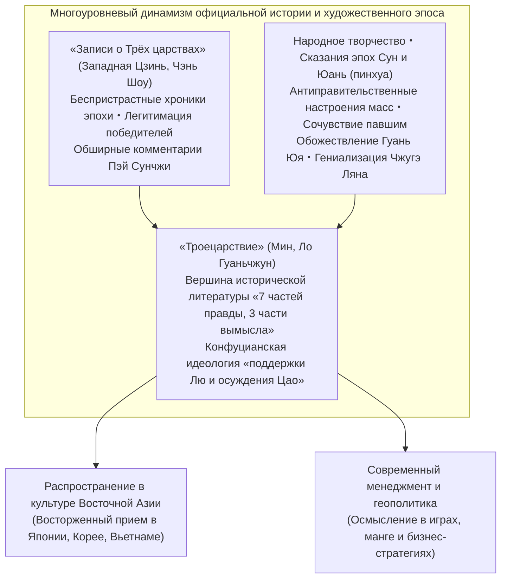
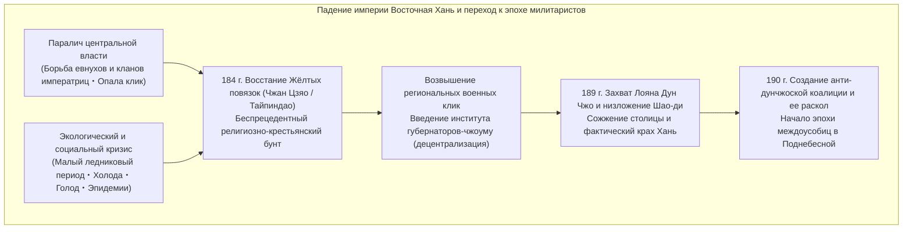
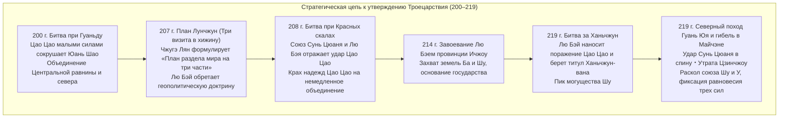
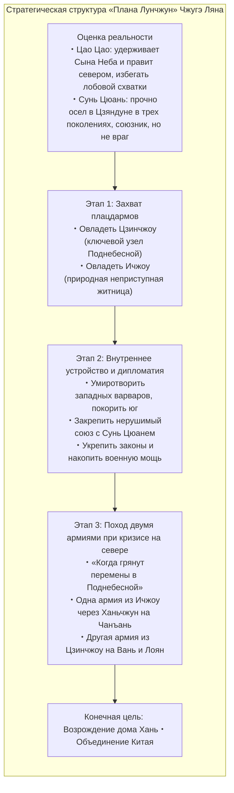
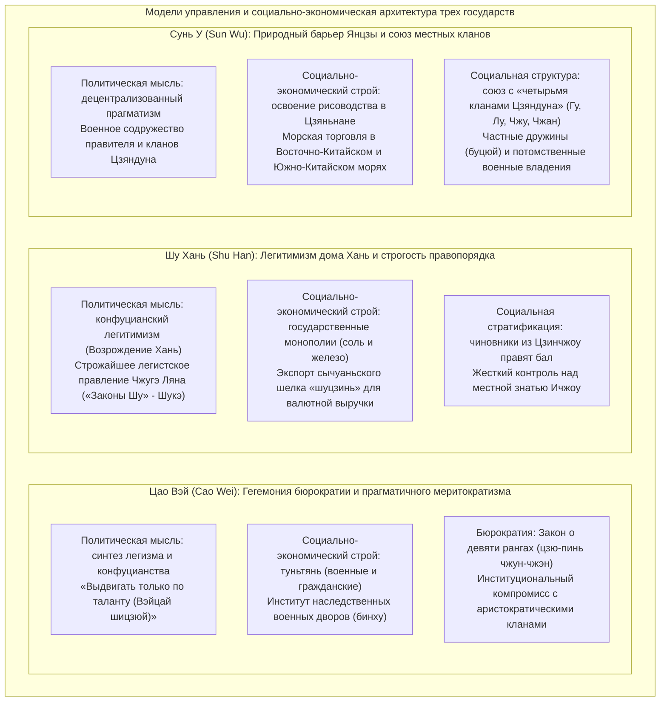

## Введение: почему эпоха Троецарствия продолжает очаровывать человечество спустя 1800 лет

Почти столетие разделяет 184 год нашей эры, когда вспыхнуло «Восстание Жёлтых повязок», и 280 год, когда империя Западная Цзинь (Western Jin) покорила царство Сунь У и окончательно объединила Поднебесную. Бурные взлеты и падения **«эпохи Троецарствия» (Three Kingdoms period)**, развернувшиеся на бескрайних просторах восточной Евразии, преодолели пропасть в 1800 лет и по сей день безраздельно владеют интеллектуальным воображением и страстями людей не только в Восточной Азии, но и во всем мире.

Почему среди бесчисленных династических смут в истории Китая именно потрясения этого века излучают столь мощное культурное притяжение?

Главная причина кроется в уникальной «двойственной структуре» мира Троецарствия. Он существует одновременно как **строгий исторический факт в официальной хронике «Записи о Трёх царствах» («Сань-го чжи», автор Чэнь Шоу, комментарии Пэй Сунчжи)**, основанной на критическом анализе первоисточников, и как **вершина исторической беллетристики — роман «Троецарствие» («Саньго яньи», автор Ло Гуаньчжун)** эпохи Мин, вобравший в себя тысячелетний восторг народных масс, наслоения уличных сказов и театральных драм.



В качестве исторической реальности эпоха Троецарствия представляла собой мрачное и беспощадное лихолетье. Крах институционального порядка Восточной Хань сопровождался резким сокращением населения, климатическим похолоданием, голодом и опустошительными военными пожарищами. Если в период расцвета Восточной Хань численность зарегистрированного населения достигала примерно 56 миллионов человек, то к концу эпохи противостояния трех государств совокупное население Вэй, Шу и У сократилось примерно до 8 миллионов (даже с учетом беженцев и уклонившихся от податных списков разорение общества достигло критического предела).

Однако именно в условиях институционального вакуума и жесточайшей борьбы за выживание родились **«инновации стратегической мысли»** и **«смелые эксперименты государственного строительства»**, сокрушившие закостеневшие авторитеты и сословные рамки:
- Разработанный Цао Цао (Cao Cao) меритократический принцип назначения кадров исключительно по способностям («Выдвигать только по таланту» / 唯才是挙) и система военных поселений «туньтянь», разрешившая хронический кризис снабжения армии.
- Выдвинутый Чжугэ Ляном (Zhuge Liang) геополитический генеральный план «Лунчжун» («План раздела мира на три части» / 隆中対), позволивший малому государству бросить вызов гиганту, в сочетании с неподкупным, строжайшим легизмом.
- Освоение богатого региона Цзяннань Сунь Цюанем (Sun Quan), опиравшимся на естественную преграду реки Янцзы, и зарождение морской торговой державы, устремленной к Восточно-Китайскому и Южно-Китайскому морям.

И превыше всего — накал человеческих страстей и столкновение психологем, разыгранных полководцами, стратегами, властителями и безвестными массами: ледяной рационализм и глубинное одиночество Цао Цао; несгибаемое благородство, упорство и верность долгу Лю Бэя; гордая преданность и трагическая гибель Гуань Юя; подвижническое служение обреченному идеалу Чжугэ Ляна. Все это превратило хронику эпохи в универсальный гимн человеческому духу, неподвластный векам и границам.

В данной статье грандиозная панорама Троецарствия не просто пересказывается в виде набора эпизодов и занимательных фабул, но **подвергается всестороннему фундаментальному анатомированию через призму историографии, политической мысли, военной геополитики, социально-экономических институтов и истории рецепции**. Тщательно отделяя историческую правду от литературного вымысла, мы проникнем в сокровенные глубины стратегии и мировоззрения тех, кто промчался сквозь пламя смутного времени.

---

## Глава 1: Закат династии Поздняя Хань и начало эпохи милитаристов (184–200 гг.)

Начало эпохи Троецарствия ознаменовалось драматическим саморазрушением великой империи Хань (Западная и Восточная Хань), объединявшей китайский мир на протяжении четырех столетий. Почему могущественное централизованное государство стремительно утратило объединяющую силу и допустило раскол на провинциальные военные клики? В основе этой катастрофы лежало сплетение институционального кризиса, разложения правящей верхушки и глобальных климатических потрясений.



### 1.1 Произвол евнухов и родни императриц, «Опала клик»: структурная дисфункция Ханьской империи

Политическая система Восточной Хань (Дун Хань, 25–220 гг.) во второй половине своего существования попала в порочный круг. Причиной стало то, что на престол один за другим восходили малолетние императоры.

Когда государь ребенок, реальная власть неизбежно переходит в руки вдовствующей императрицы и ее могущественного клана — **«вайци» (внешней родни императора)**. Однако по мере взросления правитель, стремясь вернуть себе полноту власти, вступал в тайный сговор с **«евнухами» (хуаньгуань)**, делившими с ним повседневную жизнь в глубинах запретного дворца, и силой уничтожал родню матери. Захватив власть, клика евнухов предавалась безудержному стяжательству, назначая родственников на провинциальные посты, погрязая во взяточничестве и жестокости. Тогда при следующем несовершеннолетнем императоре новые внешние родственники вновь учиняли расправу над евнухами. Эта кровавая карусель власти повторялась без конца.

В противовес этому конфуцианское чиновничество и студенты императорской академии Тайсюэ открыто и яростно обличали пороки дворцовых кастратов. Они гордо называли себя «Чистым течением» (Цинлю), клеймя евнухов и их прихлебателей как «Мутное течение» (Чжолю).

Однако евнухи нанесли упреждающий удар. Манипулируя императором, они обвинили ученых мужей «Чистого течения» в организации крамольных клик и заговоре против трона. Развернулись беспощадные репрессии — **«Опала клик» (Данго чжи хо)** 166 и 169 годов. Сотни сановников и интеллектуалов были казнены или замучены в застенках, а тысячи подвергнуты пожизненному поражению в правах с запретом занимать государственные должности.

Этот террор нанес Ханьской династии непоправимый смертельный удар. Провинциальная знать и класс интеллектуалов окончательно разочаровались в правящем доме, утратив волю защищать авторитет и законы центрального правительства. В образовавшемся вакууме верховной моральной власти стремительно созрела почва для появления вооруженных региональных сепаратистов.

### 1.2 Климатическое похолодание, голод, мор и «Восстание Жёлтых повязок»

Удары политического кризиса усугубились грандиозными природными катаклизмами.

Согласно данным палеоклиматологии и исторической демографии, во второй половине II и в III веках Восточная Азия вступила в начальную фазу циклических холодов так называемого **«Малого ледникового периода» (Little Ice Age)**. Череда суровых бесснежных зим, летних засух и заморозков нанесла колоссальный ущерб сельскому хозяйству в бассейнах рек Хуанхэ и Янцзы. Истощенные голодом народные массы пали жертвой сокрушительных пандемий (предположительно сыпного тифа или оспы). Поэт эпохи Цзяньань Цао Чжи в «Описании мора» («Шо и фу») оставил леденящее душу свидетельство: «В каждом доме оплакивали трупы сородичей, в каждой горнице раздавались безутешные рыдания».

В эту бездну народного отчаяния ступил даосский проповедник из округа Цзюйлу (современная провинция Хэбэй) по имени **Чжан Цзяо (Zhang Jiao)**.

Сплавив идеи Жёлтого императора (Хуан-ди) и Лао-цзы с народными верованиями, Чжан Цзяо создал религиозное движение **«Тайпиндао» (Учение Великого Равноденствия / Спокойствия)**. Исцеляя больных заговоренной водой («фушуй») и призывая грешников к публичному покаянию, он за считанные годы привлек сотни тысяч отчаявшихся крестьян. Чжан Цзяо преобразовал религиозную паству в боевую структуру, разделив Поднебесную на 36 «фанов» (военных округов), и начал подготовку к масштабному восстанию.

Боевым лозунгом секты стало знаменитое апокалиптическое четверостишие:
> **«蒼天已死、黃天當立、歲在甲子、天下大吉»**  
> (Синее Небо мертво, Жёлтое Небо должно восстать; в год цзяцзы наступит великое счастье Поднебесной!)

«Синее Небо», олицетворявшее династическую добродетель Хань, исчерпало свой мандат. На смену ему должно прийти «Жёлтое Небо», символ стихии Земли. А год «цзяцзы» (184 год н. э., знаменующий начало нового 60-летнего цикла восточного календаря) должен стать годом очистительной революции.

В феврале 184 года сотни тысяч повстанцев повязали головы жёлтыми платками и подняли восстание. Так началось **«Восстание Жёлтых повязок» (Yellow Turban Rebellion)**. Мятеж молниеносно охватил ключевые провинции империи — Хэбэй, Хэнань, Шаньдун. Государственные управы предавались огню, а чиновники бежали или безжалостно истреблялись.

Ошеломленный ханьский двор направил на подавление мятежа выдающихся полководцев Хуанфу Суна (Huangfu Song), Чжу Цзюня (Zhu Jun) и Лу Чжи (Lu Zhi), одновременно сняв запреты «Опалы клик», чтобы привлечь на свою сторону благородное сословие. В это же время во главе карательных частей и ополчений на историческую арену впервые вышли молодые герои будущей эпохи — Цао Цао, Лю Бэй и Сунь Цзянь.

Само восстание в основном было подавлено в течение года, чему способствовала внезапная смерть Чжан Цзяо от болезни и яростный натиск императорских войск. Однако уцелевшие отряды разбились на автономные шайки («разбойники Чёрных гор», «разбойники Белой волны») и продолжали партизанскую войну по всей стране. Не имея сил поддерживать правопорядок из столицы, императорский двор в 188 году пошел на фатальный шаг — учредил **систему губернаторов-чжоуму (Regional Governors)**. Передача всей полноты военной, гражданской и фискальной власти в руки глав провинций привела к тому, что региональные наместники мгновенно превратились в независимых феодальных правителей — **милитаристов (Warlords)**.

### 1.3 Произвол Дун Чжо и сожжение Лояна: окончательный крах старого порядка

В 189 году после кончины императора Лин-ди противостояние между предводителем клана императрицы Хэ Цзинем (He Jin) и влиятельной кликой евнухов «Десять постоянных侍» (Шичанши) подошло к кульминации. Стремясь запугать дворцовую камарилью военной силой, Хэ Цзинь вызвал к столице Лояну грозного военачальника **Дун Чжо (Dong Zhuo)**, командовавшего отборными пограничными частями в северо-западном регионе Лянчжоу.

Однако прежде чем войска Дун Чжо подошли к столице, евнухи прознали о замысле и заманили Хэ Цзиня во дворец, где безжалостно обезглавили его. В ярости молодые офицеры аристократического происхождения Юань Шао (Yuan Shao) и Цао Цао ворвались во дворец во главе гвардии и устроили кровавую резню, перебив свыше двух тысяч евнухов.

В обстановке полного паралича власти в пылающий Лоян вступил Дун Чжо. Опираясь на свирепую пограничную кавалерию, грубый вояка подчинил своей воле утонченную знать, низложил юного императора Шао-ди и возвел на престол покорного Сянь-ди (Лю Се). Объявив себя чэнсяном (канцлером), Дун Чжо узурпировал всю государственную власть.

Кровавый произвол и тирания Дун Чжо стали невыносимым унижением для имперской элиты. В 190 году под предводительством Юань Шао правители областей к востоку от заставы Ханьгу объединились в **«Коалицию против Дун Чжо»**. Под знамена восстания встали Цао Цао, Сунь Цзянь, Юань Шу, Цяо Мао, Бао Синь и другие вожди.

Столкнувшись с натиском коалиции, Дун Чжо решился на чудовищную тактику выжженной земли. Он насильно согнал миллионы жителей древней столицы Лояна и погнал их пешком в западную столицу Чанъань (ныне Сиань), а сам Лоян — с его великолепными дворцами, храмами, архивами и гробницами прежних императоров — предал тотальному разграблению и сожжению. Крупнейший цивилизационный мегаполис Восточной Азии в одночасье превратился в груду пепла.

Ирония судьбы заключалась в том, что благородная коалиция распалась столь же стремительно, как и возникла. Страшась боевой мощи кавалерии Дун Чжо, князья остановили продвижение, погрязнув в бесконечных пирах, интригах и дележе земель. Одиночные попытки Цао Цао и Сунь Цзяня развить наступление завершились поражением из-за отсутствия поддержки. Коалиция развалилась от внутренних раздоров. Древний имперский порядок рухнул навсегда — наступила эпоха откровенного закона джунглей, **время феодальной раздробленности**.

(Сам деспот Дун Чжо правил недолго: в 192 году в Чанъане он пал жертвой заговора своего приемного сына, непревзойденного воина Люй Бу (Lu Bu), и сановника Ван Юня (Wang Yun), а его тучный труп был брошен на поругание на рыночной площади).

### 1.4 Борьба за Центральную равнину: взлет и падение военачальников

Превратившаяся в руины Центральная равнина (Чжунъюань — плодородные земли бассейна Хуанхэ) стала ареной беспощадного гладиаторского турнира между полевыми командирами:

- **Юань Шао (Yuan Shao)**: представитель самого родовитого клана Поднебесной («четыре поколения, три высших сановника»). Сокрушив своего соперника Гунсунь Цзаня, он объединил под своей властью четыре богатейшие провинции к северу от Хуанхэ (Цзичжоу, Цинчжоу, Ючжоу, Бинчжоу) и создал самую могучую армию той эпохи.
- **Юань Шу (Yuan Shu)**: двоюродный (по другим источникам, сводный) брат Юань Шао, обосновавшийся в районе Хуайнань. Заполучив императорскую нефритовую печать, брошенную в колодец при бегстве из Лояна, он в приступе мании величия провозгласил себя императором династии Чжун, оказался в кольце врагов и бесславно погиб от голода и лишений.
- **Сунь Цэ (Sun Ce)**: старший сын «цзяндуского тигра» Сунь Цзяня. Известный как «Маленький гегемон» (Сяо Баван), он обладал исключительным полководческим даром и харизмой. За несколько лет молниеносных походов он подчинил шесть округов к югу от Янцзы (Цзяндун), заложив нерушимый территориальный фундамент будущего царства У. Однако в 200 году в возрасте 26 лет он пал жертвой наемных убийц.
- **Люй Бу (Lu Bu)**: могучий воин, о котором говорили: «Среди людей — Люй Бу, среди коней — Красный Заяц». Однако, будучи лишен верности и политической дальновидности, он предавал своих покровителей — Дин Юаня, затем Дун Чжо, блуждал по стране и вероломно отнял провинцию Сюйчжоу у приютившего его Лю Бэя. В конце концов он был осажден войсками Цао Цао и Лю Бэя в Сяпи и казнен после измены собственных подчиненных.
- **Лю Бяо (Liu Biao)**: ученый-конфуцианец высокой репутации, сохранявший мир и стабильность в богатой провинции Цзинчжоу на Средней Янцзы. Он дал кров сотням тысяч беженцев и выдающимся интеллектуалам, но оставался пассивным правителем оборонительного плана, не имея амбиций объединить Китай.
- **Лю Бэй (Liu Bei)**: выходец из обедневшей боковой ветви императорского дома Хань, в юности плел и продавал соломенные сандалии, чтобы прокормить мать. Скрепив нерушимый союз с побратимами Гуань Юем и Чжан Фэем, он получил провинцию Сюйчжоу от умирающего Тао Цяня, но вскоре потерял ее из-за коварства Люй Бу. Годами он скитался, служа Цао Цао, Юань Шао и Лю Бяо. Не имея собственной территории, он тем не менее пользовался колоссальным авторитетом благодаря своей несгибаемой воле и притягательной человечности.

### 1.5 Возвышение Цао Цао и формула «Удерживать императора»: сплав легитимности и прагматизма

Среди десятков соперничавших вождей фигурой совершенно иного масштаба оказался **Цао Цао (Cao Cao, второе имя Мэндэ)**.

Будучи приемным внуком могущественного евнуха Цао Тэна, Цао Цао вызывал снисходительное презрение у родовитой аристократии калибра Юань Шао. Однако Цао Цао сочетал в себе гений выдающегося полководца, трезвый расчет государственного деятеля и утонченный талант крупнейшего поэта своей эпохи.

Первым решающим стратегическим прорывом Цао Цао стала **«встреча и защита императора Сянь-ди» (196 г.)**.  
Юный монарх, бежавший из Чанъаня от генералов Ли Цзюэ и Го Сы, голодал и бедствовал среди пепелищ Лояна. Вняв совету своего гениального советника Сюнь Юя (Xun Yu), Цао Цао прибыл в Лоян, взял государя под защиту и перевез двор в свою цитадель Сюйчан (ныне город Сюйчан провинции Хэнань).

Этот шаг принес Цао Цао абсолютный козырь в политической борьбе:
> **«Удерживать Сына Неба, чтобы повелевать князьями» (挟天子以令諸侯)**

Отныне любое нападение на Цао Цао трактовалось как государственная измена императору. Заняв высшие посты генералиссимуса, а затем первого министра (чэнсяна), Цао Цао получил возможность отдавать приказы от имени Сына Неба, объявляя своих противников вне закона и превращая любые военные походы в священные карательные операции законной власти.

Одновременно Цао Цао осуществил фундаментальную экономическую реформу для возрождения разоренной Центральной равнины — учредил **систему «туньтянь» (Tuntian system — система военных и гражданских поселений)** в 196 году по предложению Цзао Чжи и Хань Хао. Пустующие и заброшенные войной государственные земли заселялись беженцами, которым казна предоставляла волов, плуги и семена. Взамен крестьяне отдавали казне 50–60% урожая в качестве арендной платы, но освобождались от воинской повинности и произвола местных помещиков.

Благодаря системе туньтянь армия Цао Цао навсегда решила острейшую проблему нехватки провианта, накопив миллионы мешков зерна в стратегических амбарах. Опираясь на нерушимую политическую легитимность и надежную материально-техническую базу, Цао Цао приготовился к схватке не на жизнь, а на смерть с северным гигантом Юань Шао.

---

## Глава 2: Столкновение титанов и путь к Троецарствию (200–219 гг.)

Два десятилетия с 200 по 219 год стали золотым веком эпохи Троецарствия, наполненным наивысшим стратегическим драматизмом. В пламени грандиозных сражений хаос раздробленности выкристаллизовался в противостояние трех держав — «Вэй, Шу и У».

Эту эпоху определили три колоссальные военные кампании: **битва при Гуаньду (200 г.)**, **битва при Красных скалах (Чиби, 208 г.)** и **сражения за Ханьчжун и крепость Фаньчэн (219 г.)**.



### 2.1 Битва при Гуаньду (200 г.): триумф военной разведки и разгром великана

В 200 году разразилась битва при Гуаньду — решающее столкновение за гегемонию над северным Китаем.

Силы противников были несопоставимы. Властелин севера **Юань Шао** вел 100 000 отборной пехоты и 10 000 всадников. Армия **Цао Цао** насчитывала от силы 20 000–30 000 воинов. Разница в численности составляла три-четыре раза в пользу Юань Шао, и большинство современников считали поражение Цао Цао неизбежным.

Форсировав Хуанхэ, войска Юань Шао осадили укрепленный лагерь Цао Цао в Гуаньду (к северо-востоку от уезда Чжунмоу провинции Хэнань). Юань Шао возвел насыпные холмы с высокими деревянными башнями, осыпая лагерь врага градом стрел, и повел подземные подкопы. Цао Цао парировал удары: изобрел метательные машины (камнеметы «фашичэ»), сокрушившие башни, и прорыл глубокие рвы, отсекавшие подкопы.

Однако затяжная позиционная война неумолимо истощала силы Цао Цао. Запасы продовольствия подошли к концу, воины валились с ног от голода и цинги, а сам Цао Цао в минуту отчаяния написал письмо Сюнь Юю в Сюйчан, признаваясь, что хочет отступить. Сюнь Юй ответил пламенным посланием: «Отступить сейчас — значит отдать Поднебесную Юань Шао. Нужно держаться до конца и ждать роковой ошибки врага».

И этот переломный момент настал благодаря внутреннему краху неприятеля в сфере **«разведки и логистики»**.

Один из ведущих советников Юань Шао, **Сюй Ю (Xu You)**, предложил смелый план — разделить армию и ударить по беззащитному Сюйчану. Юань Шао отверг план, а вскоре пришло известие, что родня Сюй Ю арестована за казнокрадство. Поняв, что ему грозит казнь, оскорбленный Сюй Ю под покровом ночи перебежал в лагерь Цао Цао.

Узнав о прибытии старого друга детства, Цао Цао так обрадовался, что выбежал навстречу босиком, не успев надеть туфли. Сюй Ю раскрыл бесценную тайну:
> «Все запасы зерна армии Юань Шао — десятки тысяч повозок — складированы на тыловой базе в **Учао (Wuchao)**. Охраняет ее беспечный генерал Чуньюй Цюн (Chunyu Qiong), который беспробудно пьет. Если вы отборной конницей нанесете внезапный ночной удар и сожжете запасы, несметная армия Юань Шао рухнет сама собой без боя».

Цао Цао принял молниеносное решение. Возглавив 5 000 отборных всадников, несущих знаки войск Юань Шао, с зачерненными лицами и с деревянными кляпами в зубах лошадей для бесшумности, он просочился сквозь вражеские дозоры к Учао. В жестоком ночном бою гарнизон Чуньюй Цюна был вырезан, а все запасы зерна и фуража превращены в гигантский костер.

Зарево пылающего Учао повергло войско Юань Шао в неописуемую панику. Когда же ведущие военачальники Юань Шао — Чжан Хэ (Zhang He) и Гао Лань — перешли на сторону Цао Цао, фронт рассыпался как карточный домик. Юань Шао со старшим сыном Юань Танем бежал за Хуанхэ всего с 800 всадниками конвоя.

Победа при Гуаньду стала триумфом современного военного рационализма: меритократия, быстрота решений, приоритет разведки и логистики сокрушили сословное чванство и нерешительность аристократического клана Юаней. После скорой смерти Юань Шао Цао Цао методично разгромил его сыновей и к 207 году, разбив кочевников ухуань в походе на гору Байланшань, **полностью объединил Северный Китай**.

### 2.2 Скитания Лю Бэя и «Три визита в хижину»: геополитический переворот плана Лунчжун

Пока Цао Цао мечом объединял север, скиталец **Лю Бэй** нашел приют у Лю Бяо в Цзинчжоу, где нес гарнизонную службу в захолустном городке Синье. Ему было уже под пятьдесят, и однажды, выйдя из покоев, он заплакал, заметив жир на бедрах: «Прежде я не сходил с седла, и тело мое было сухим. Ныне же бедра заросли жиром, годы уходят, а я так ничего и не свершил!» («сетование о полноте бедер» / 髀肉之嘆).

Но в 207 году произошла судьбоносная встреча, изменившая ход китайской истории. В горной глуши Лунчжун близ Сянъяна Лю Бэй разыскал 27-летнего безвестного ученого — **Чжугэ Ляна (Zhuge Liang, второе имя Кунмин)**.

Лю Бэй лично трижды посетил уединенную соломенную хижину юноши, выказывая глубочайшее почтение. Этот эпизод вошел в историю как **«Три визита в хижину» (Three Visits to the Thatched Cottage)**. И в этой бедной обители молодой стратег развернул перед Лю Бэем бессмертный геополитический трактат — **«План Лунчжун» (Longzhong Plan / 天下三分の計)**.



Суть концепции Чжугэ Ляна отличалась кристальным политическим реализмом:
1. **Трезвое разграничение врагов и союзников**: Цао Цао держит в руках императора и контролирует ресурсы севера — лобовое столкновение с ним гибельно. Сунь Цюань прочно правит в трех поколениях в Цзяндуне и пользуется любовью народа — с ним необходимо дружить и заключать нерушимый союз, но ни в коем случае не враждовать.
2. **Выбор стратегических территорий**: Провинция Цзинчжоу — перекресток речных и сухопутных путей всей Поднебесной, но Лю Бяо не удержит ее. Провинция Ичжоу (Сычуаньская котловина) — «житница Небес», защищенная неприступными хребтами, а ее правитель Лю Чжан слаб и нерешителен. Эти два региона надлежит забрать себе.
3. **Клещи Северного похода**: Наведя порядок внутри, умиротворив южные племена и связав Сунь Цюаня прочным договором, дождаться смуты на севере («когда наступят перемены в Поднебесной»). В этот миг главная армия двинется из Сычуани на Чанъань, а вторая армия из Цзинчжоу ударит по Лояну. Зажатый в клещи народ встретит войска Лю Бэя с корзинами риса и кувшинами вина, и династия Хань будет возрождена.

Выслушав этот грандиозный план, Лю Бэй воскликнул: «Обрести Кунмина для меня — все равно что рыбе найти воду!» Обычный командир наемников превратился в великого государственного деятеля, вооруженного ясной исторической миссией.

### 2.3 Битва при Красных скалах (208 г.): водная цитадель Янцзы и водораздел эпохи

Летом 208 года, едва объединив север, Цао Цао повел колоссальную армию на юг. В этот критический момент Лю Бяо скончался, а его преемник Лю Цун без боя сдался завоевателю. Лю Бэй бежал на юг, прикрывая толпы мирных жителей. В битве при Чанбане отборная конница Цао Цао («Тигриная и леопардовая кавалерия») настигла беглецов; Лю Бэй едва спасся, бросив обоз (именно здесь родились легенды о подвиге Чжао Юня, спасшего младенца А Доу, и громовом оке Чжан Фэя на мосту Чанбаньцяо).

Лю Бэй укрылся в Сякоу (ныне Ухань) и отправил Чжугэ Ляна послом в Цзяндун к молодому правителю **Сунь Цюаню (Sun Quan)**. В ставке Сунь Цюаня большинство сановников во главе с Чжан Чжао требовали капитуляции: «Цао Цао ведет несметные полчища, держит императора и теперь захватил флот Цзинчжоу. Сопротивление безумно!»

Однако Чжугэ Лян нашел союзников в лице командующего флотом **Чжоу Юя (Zhou Yu)** и мудрого сановника **Лу Су (Lu Su)**. Чжоу Юй блестяще вскрыл фатальные слабости грозной армии Цао Цао:
1. Ее костяк — северная конница и пехота, абсолютно непривычные к воде и страдающие от морской болезни.
2. Растянутые коммуникации и изнурение переходом неизбежно породят свирепые эпидемии.
3. Лошадям не хватит фуража в озерном крае, а снабжение зерном висит на волоске.

Разрубив угол деревянного стола мечом, Сунь Цюань провозгласил: «Кто еще посмеет говорить о сдаче — разделит участь этого стола!» Он выделил Чжоу Юю 30 000 отборных речных бойцов, соединившихся с войсками Лю Бэя.

Зимой 208 года у утесов **Красных скал (Чиби / Battle of Red Cliffs)** на реке Янцзы разыгралась величайшая речная битва мировой истории.

Флот Цао Цао, страдавший от качки, сковал корабли железными цепями и настелил доски, превратив суда в сплошной плавучий лагерь. Заметив это, старый адмирал Сунь У **Хуан Гай (Huang Gai)** предложил план огненной атаки. Направив Цао Цао поддельное письмо о сдаче, Хуан Гай повел навстречу врагу флотилию легких штурмовых катеров «мэнчун», до краев нагруженных сухим тростником, хворостом и пропитанных рыбьим жиром.

Когда подул сильный юго-восточный ветер, корабли Хуан Гая внезапно взметнули факелы и на полной скорости врезались в скованные корабли Цао Цао. Огонь мгновенно перекинулся по цепям с борта на борт; воды Янцзы превратились в ревущий океан пламени. Огненная буря перекинулась на береговые лагеря, уничтожив все тылы и обозы.

Оставив армию на произвол судьбы, Цао Цао с горсткой всадников спасся бегством по грязной и топкой тропе Хуажун, где тысячи его солдат утонули в болоте или умерли от тифа.

Победа при Красных скалах навеки похоронила надежды Цао Цао на быстрое объединение Китая. Она закрепила бассейн Янцзы за коалицией южан и материализовала «раздел мира на три части», предсказанный Чжугэ Ляном.

### 2.4 Война за Ичжоу и битва за Ханьчжун (211–219 гг.): оформление границ Шу Хань

После триумфа при Чиби Лю Бэй стремительно занял четыре южных округа Цзинчжоу, обретя долгожданную территориальную опору. Однако для воплощения плана Лунчжун требовалось завладеть гигантской сычуаньской житницей — **провинцией Ичжоу**.

В 211 году правитель Ичжоу Лю Чжан, напуганный возвышением даосского теократа Чжан Лу на севере, сам пригласил соплеменника Лю Бэя войти с войсками в Сычуань для обороны. Советники Пан Тон (Pang Tong) и Фа Чжэн (Fa Zheng) убедили Лю Бэя воспользоваться шансом. После трех лет тяжелой горной кампании (в которой при Лофэнпо пал благородный стратег Пан Тон) в 214 году пала столица Чэнду, и Лю Чжан капитулировал. Под знамена Лю Бэя встали грозные воины: ветеран Хуан Чжун (Huang Zhong) и знаменитый кавалерийский вождь северо-запада Ма Чао (Ma Chao).

В 217 году Лю Бэй начал решительную кампанию за овладение стратегическими воротами Сычуани — **Ханьчжуном (Hanzhong)**. Этот горный оазис между хребтами Циньлин и Даба был щитом Сычуани: пока Ханьчжун оставался у Вэй, меч врага был занесен над самым сердцем Чэнду.

В ходе битвы на горе Динцзюньшань (219 г.) старый генерал Хуан Чжун стремительным ударом с высоты сокрушил и обезглавил главнокомандующего войсками Вэй на западе **Сяхоу Юаня (Xiahou Yuan)**. Разъяренный Цао Цао лично привел на выручку огромную армию, но Лю Бэй уклонялся от генерального сражения на равнине, методично перерезая линии снабжения врага в горах. Измученный голодом и тупиком, Цао Цао произнес знаменитый ночной пароль: «Куриные ребрышки» (Цзилэ — бросить жалко, а есть нечего) и приказал отступать.

Осенью 219 года Лю Бэй полностью занял Ханьчжун и торжественно провозгласил себя **«Ханьчжун-ваном» (правителем Ханьчжуна)**. Бывший продавец соломенных сандалий стал государем, на равных бросившим вызов Цао Цао. Власть Шу достигла своего зенита.

### 2.5 Северный поход Гуань Юя и трагедия в Майчэне: утрата Цзинчжоу и стратегическая катастрофа

Однако на вершине славы Шу постиг смертельный удар, перечеркнувший все плоды многолетних трудов. Катастрофу спровоцировал дерзкий одиночный поход легендарного полководца **Гуань Юя (Guan Yu)**.

Летом 219 года, стремясь поддержать триумф Лю Бэя в Ханьчжуне, Гуань Юй двинул гарнизон Цзинчжоу на север и осадил ключевую твердыню Цао Цао — город Фаньчэн (ныне Сянъян). Когда начались проливные осенние дожди и река Ханьшуй вышла из берегов, Гуань Юй затопил подошедшую армию подкрепления Вэй под началом Юй Цзиня: семь армий пошли ко дну, генерал Пань Дэ был обезглавлен за отказ покориться, а Юй Цзинь сдался в плен.

Слава Гуань Юя **«потрясла всю Поднебесную» (Вэй чжэнь Хуася)**. В панике Цао Цао даже всерьез обсуждал эвакуацию столицы из Сюйчана дальше на север.

Но этот ослепительный успех обнажил смертельную трещину в отношениях с союзным **Сунь Цюанем**.  
Для Лю Бэя Цзинчжоу был плацдармом для броска на север, но для Сунь Цюаня нахождение верхнего течения Янцзы в чужих руках представляло перманентную угрозу национальной безопасности. Новый главнокомандующий У **Люй Мэн (Lu Meng)** тайно доложил государю: «Если Гуань Юй одолеет Цао Цао, следующим он проглотит наше царство У. Сейчас лучший момент ударить ему в спину и забрать весь Цзинчжоу!»

К тому же Гуань Юй, при всей своей доблести, отличался безмерной спесью и презирал аристократов. Когда Сунь Цюань предложил скрепить дружбу браком своих детей, Гуань Юй грубо прогнал сватов, бросив: «Как может дочь тигра выйти за щенка собаки?!» Более того, он постоянно третировал своих тыловых комендантов Ми Фана (шурина Лю Бэя) и Ши Жэня.

Получив секретное предложение от Цао Цао о союзе, Сунь Цюань согласился нанести удар в спину. Люй Мэн притворился больным и передал пост неизвестному молодому офицеру **Лу Сюню (Lu Xun)**, усыпившему бдительность Гуань Юя льстивыми письмами. Решив, что угрозы с тыла нет, Гуань Юй снял резервы и бросил их на штурм Фаньчэна.

В этот момент спецназ Люй Мэна, переодетый в белые одежды мирных купцов, на лодках поднялся по Янцзы («Переправа в белых одеждах» / 白衣渡江), снял дозоры на сигнальных вышках и без единого выстрела захватил столицу Цзинчжоу — город Цзянлин. Оскорбленные коменданты Ми Фан и Ши Жэнь немедленно сдались.

Узнав о потере тыла, армия Гуань Юя растаяла за считанные дни. С горсткой верных телохранителей он укрылся в крошечной крепости Майчэн, попытался пробиться на запад в Сычуань, но попал в засаду войск У. Гуань Юй и его приемный сын Гуань Пин были схвачены и обезглавлены, а отсеченная голова великого воина была отослана Цао Цао.

Гибель Гуань Юя и **утрата провинции Цзинчжоу** стали непоправимой геополитической катастрофой для Шу Хань. Заложенный в плане Лунчжун сценарий удара с двух направлений (клещей) рухнул навсегда. Шу оказалось заперто в сычуаньском горном мешке с населением менее миллиона человек. А слепая жажда мести за побратима толкнула Лю Бэя в новую пропасть.

---

## Глава 3: Три модели государственности — анатомия институтов, экономики и армий

Эпоха Троецарствия была не просто военным противоборством трех монархов. Это было грандиозное поле **«социально-политических экспериментов»**, где три государства, существовавшие в совершенно различных географических, демографических и сословных условиях, создали принципиально несхожие модели выживания и управления.



### 3.1 Цао Вэй: гигантская империя институциональных инноваций и меритократии

В 220 году после смерти Цао Цао его наследник **Цао Пи (Cao Pi, император Вэнь-ди)** вынудил последнего ханьского императора Сянь-ди отречься от престола («добровольная передача власти» — шаньжан). Ханьская династия пала официально, уступив место империи **Вэй**.

Отличительными чертами Вэй были колоссальная ресурсная мощь и беспрецедентный институциональный реализм:

1. **«Выдвигать только по таланту» (唯才是挙 — Вэйцай шицзюй)**:  
   В эпоху Хань чиновников набирали через систему местных рекомендаций «сянцзюй лишэнь», оценивавшую сыновнюю почтительность и безупречную конфуцианскую мораль («сяолянь»). На практике это вылилось в семейный сговор аристократов, продвигавших бездарных отпрысков.  
   Цао Цао трижды — в 210, 214 и 217 годах — издавал указы о поиске талантов: «Пусть человек порочен и не чтит родителей, но если он владеет военным искусством или талантом управления — выдвигайте его!» Этот циничный прагматизм позволил собрать плеяду блистательных советников неблагородного происхождения (Го Цзя, Цзя Сюй, Чэн Юй) и сделать высшими полководцами пленных генералов врага (Чжан Ляо, Сюй Хун, Чжан Хэ).

2. **От «туньтянь» к касте потомственных военных «бинху»**:  
   Гражданские поселения переросли в систему прифронтовых военных колоний («цзюньтунь»), где солдаты снабжали себя сами. Чтобы армия не зависела от крестьянских наборов, Вэй создало наследственное военное сословие — систему дворов **«бинху» (Binghu system)**. Военные семьи регистрировались в особых списках: сыновья обязаны были служить солдатами, а дочери выходить замуж только за военных. Это гарантировало постоянную армию полумиллионного состава.

3. **Учреждение «Закона о девяти рангах» (Цзю-пинь гуаньжэнь фа)**:  
   Введенный в 220 году сановником Чэнь Цюнем (Chen Qun) закон учредил в каждой области должность аттестатора («чжунчжэн»), который делил местных кандидатов на девять категорий в зависимости от их способностей и родословной. Это был компромисс между троном и могущественной региональной аристократией. Постепенно экзаменаторы оказались в руках знати, что породило горькую поговорку: «В высших рангах нет сыновей из бедных хижин, в низших рангах нет сыновей из знатных домов», заложив основы кастового аристократического общества будущих веков.

### 3.2 Шу Хань: идеологический легитимизм и суровый диктат закона

В ответ на узурпацию трона Цао Пи Лю Бэй в 221 году в Чэнду провозгласил себя императором, законным продолжателем династии Хань (в историографии государство называется **Шу** или **Шу Хань**).

Ахиллесовой пятой Шу была **демографическая и территориальная слабость**. Если Вэй владело 70% населения Китая (свыше 4,4 миллиона человек), то Шу ютилось в сычуаньских ущельях, насчитывая **всего около 900 000–1 000 000 жителей** и армию в 100 000 бойцов.

Чтобы малая держава могла выстоять против титана, канцлер Чжугэ Лян выстроил режим жесточайшей государственной дисциплины и законности:

1. **Неподкупное торжество закона («Уложение Шу» / Шукэ)**:  
   Историк Чэнь Шоу писал о правлении Чжугэ Ляна: «Он установил законы и статьи, ввел четкие правила и судил беспристрастно. Награждал за малейшее добро и карал за малейшее зло, не взирая на знатность». Несмотря на суровость законов «Шукэ», в народе царил порядок, а чиновники не смели брать взяток.

2. **Государственная монополия: сычуаньский шелк и соль**:  
   Для финансирования северных походов Чжугэ Лян монополизировал добычу соли из глубоких скважин и наладил государственное производство знаменитого шелка **«шуцзинь» (Shu brocade)**. Ткани Шу славились такой красотой, что их скупали даже заклятые враги в Вэй и У, обеспечивая горное царство драгоценным золотом и лошадьми для армии.

3. **Скрытый раскол: «партия Цзинчжоу» против сычуаньской знати**:  
   Во властной верхушке Шу тлел опасный конфликт. Все командные высоты в армии и правительстве занимали пришельцы с востока — соратники Лю Бэя из провинции Цзинчжоу (Чжугэ Лян, Цзян Вань, Фэй И), тогда как местная сычуаньская аристократия (такие мыслители, как Цяо Чжоу) была отстранена от принятия решений. Это внутреннее отчуждение проявится через сорок лет, предопределив падение царства.

### 3.3 Сунь У: водная твердыня Янцзы и конфедерация кланов

Опираясь на победу при Чиби и ликвидацию Гуань Юя, Сунь Цюань в 222 году принял титул У-вана, а в 229 году в Цзянье (ныне Нанкин) короновался императором царства **У (Сунь У / Восточная У)**.

Сунь У не было ни централизованной империей, как Вэй, ни идеократией, как Шу. Это была **«аристократическая конфедерация»**, где монарх делил власть с могущественными местными магнатами:

1. **Коалиция с «четырьмя великими кланами Цзяндуна»**:  
   В землях к югу от Янцзы веками безраздельно правили четыре фамилии: **Гу (Gu), Лу (Lu), Чжу (Zhu) и Чжан (Zhang)**. Сунь Цюань породнился с ними через браки и отдал им высшие военные посты (ярчайший пример — Лу Сюнь, ставший главнокомандующим и канцлером).

2. **Система «буцюй» и потомственное командование войсками**:  
   Полководцы У приводили на войну не государственных призывников, а собственные частные дружины — крепостных воинов **«буцюй»**. После смерти военачальника его личная армия и пожалованные земли переходили по наследству сыну или брату.  
   Такая система делала армию У непобедимой в обороне («каждый дрался за свою землю и дом»), но делала ее крайне слабой и безынициативной в наступательных походах на север, где магнаты не желали губить своих людей ради далеких целей монарха.

3. **Колонизация юга и истоки морской державы**:  
   Сунь У внесло гигантский вклад в освоение диких плавней Южного Китая: осушались болота, строились дамбы, и Цзяннань превратился в главную рисовую житницу Азии. Сопротивлявшиеся горные племена «шаньюэ» были покорены, а их молодежь зачислена в пехоту.  
   Кроме того, опираясь на великолепные верфи, Сунь Цюань в 230 году отправил 10-тысячную морскую экспедицию генералов Вэй Вэня и Чжугэ Чжи к островам **«Ичжоу» (ныне Тайвань)** и Даньчжоу — первое официальное плавание китайцев к берегам Тайваня, зафиксированное в летописях. Торговые караваны У ходили в Индокитай, Малайю и Индийский океан.

```
【Сравнительная таблица комплексного потенциала царств Вэй, Шу и У (ок. 260 г. н. э.)】
```

| Параметр сравнения | Цао Вэй (Wei) | Шу Хань (Shu Han) | Сунь У (Sun Wu) |
| :--- | :--- | :--- | :--- |
| **Столица** | Лоян (Luoyang) | Чэнду (Chengdu) | Цзянье (Jianye: совр. Нанкин) |
| **Территория** | Центральная равнина, Хэбэй, Шаньдун, Шаньси, Шэньси, Хуайнань, Ляодун (~60% Китая) | Ичжоу (Сычуаньская котловина, Ханьчжун, горы Юньнани и Гуйчжоу) | Янчжоу, юг Цзинчжоу, Цзяочжоу (бассейн Янцзы, Гуандун, север Вьетнама) |
| **Население и дворы** | **~660 000 дворов / ~4 400 000 чел.** (~60% населения Китая) | **~280 000 дворов / ~940 000 чел.** (~13% населения Китая) | **~520 000 дворов / ~2 300 000 чел.** (~27% населения Китая) |
| **Регулярная армия** | **~400 000–500 000 чел.** (тяжелая пехота севера, конница ухуань и сяньби) | **~100 000 чел.** (горная пехота, стрелки из скорострельных арбалетов, гвардия «байэр») | **~230 000 чел.** (непобедимый флот Янцзы, пехота шаньюэ, дружины буцюй) |
| **Идеология и строй** | Сплав легизма и конфуцианства, меритократия, централизованный бюрократизм | Конфуцианский легитимизм Хань, строжайший легизм («Шукэ») | Аристократическая коалиция монарха и кланов, децентрализация |
| **Кадровая система** | **Закон о девяти рангах** (аттестация чжунчжэн), указы о талантах | Личное назначение Чжугэ Ляном, строгое воздаяние по закону | Рекомендации кланов, потомственное командование войсками |
| **Экономическая база** | Земледелие севера (пшеница, просо), **поселения туньтянь**, соль и железо | Рисоводство Сычуани, **экспорт шелка шуцзинь**, соляные скважины | Заливное рисоводство Цзяннани, **морская внешняя торговля**, морская соль |
| **Геополитический плюс** | Огромные людские резервы, мощная логистика, ударная конница | Неприступные горы Сычуани («природная крепость») | Непреодолимая водная преграда Янцзы, абсолютное превосходство на воде |
| **Структурная слабость** | Засилье родовой знати, ослабившее трон (предпосылка узурпации Сыма) | Катастрофическая нехватка людей, скрытый раскол цзинчжоусцев и сычуаньцев | Сепаратизм кланов и дружин буцюй, пассивность в наступательных войнах |

---

## Глава 4: Завет Чжугэ Ляна и сумерки трех государств (220–280 гг.)

Во второй половине века Троецарствия великие герои первого поколения один за другим сошли со сцены. На смену романтическим порывам пришли холодная усталость институтов, истощение ресурсов и неотвратимая логика демографического превосходства.

Осевой драмой этой эпохи стала отчаянная попытка канцлера Шу **Чжугэ Ляна** сломить судьбу в Северных походах и внутренняя трансформация царства Вэй, завершившаяся переворотом клана **Сыма (Sima clan)**.

### 4.1 Месть Лю Бэя и битва при Илине (222 г.): трагедия в Белом городе

В 221 году, едва взойдя на трон, Лю Бэй отдал роковой приказ — начать **тотальную войну против Сунь У**.

Слепая скорбь по убитому Гуань Юю смешалась со стратегическим расчетом: без возврата Цзинчжоу план возрождения Хань был мертв. Несмотря на отчаянные мольбы Чжугэ Ляна и Чжао Юня не начинать междоусобицу, Лю Бэй лично повел 50-тысячную армию вниз по Янцзы. Перед самым выходом в поход армию потрясло новое горе: озверевший от пьянства Чжан Фэй был зарезан во сне собственными офицерами, бежавшими в У.

Поначалу войска Лю Бэя сминали заслоны противника, продвинувшись на сотни верст вглубь вражеской земли. В панике Сунь Цюань назначил главнокомандующим 39-летнего ученого генерала **Лу Сюня (Lu Xun)**.

Лу Сюнь применил тактику **глубокой изматывающей обороны**. Он заперся в крепостях, категорически запретив вступать в открытый бой. Когда наступил июльский зной, измученные жарой солдаты Лю Бэя не смогли оставаться на открытом берегу и разбили лагеря в густых лесах, растянув цепь укреплений («линейный лагерь» / ляньин) вдоль ущелий Янцзы на 700 ли (350 км).

Этого момента и ждал Лу Сюнь.  
В июне 222 года, улучив ночь с попутным ураганным ветром, войска У снопами подожгли лесные засеки Шу. **Огненный смерч** поглотил всю растянутую армию Лю Бэя: зажатые в узких горных теснинах полки сгорали заживо или срывались в пропасти. Армия Шу перестала существовать.

Едва избежав гибели, Лю Бэй укрылся в пограничной крепости Байдичэн (город Белого императора). Здесь в апреле 223 года, разбитый душевным горем и лихорадкой, умирающий государь призвал Чжугэ Ляна и произнес историческое завещание (**«Поручение сироты в Байдичэне» / 白帝城託孤**):
> **«Твой талант в десять раз превосходит дарования Цао Пи. Ты непременно умиротворишь государство и довершишь великое дело. Если мой сын (Лю Шань) достоин поддержки — поддержи его. Если же он окажется бесталанен и не способен править — возьми трон себе и сам управляй страной (君可自取之)!»**

В конфуцианском мире повеление монарха первому министру занять престол вместо родного сына было неслыханным актом предельного доверия. Чжугэ Лян упал на колени, разбивая лоб о каменный пол до крови, и поклялся:
> **«Я приложу все силы слуги, сохраню чистоту верности до последнего вздоха и умру на посту!»**

Лю Бэй скончался. На престол взошел 17-летний простодушный Лю Шань (А Доу). Вся тяжесть спасения крошечного царства легла на плечи Чжугэ Ляна.

### 4.2 Южный поход Чжугэ Ляна («Покорение сердец») и бессмертное «Прошение о походе»

Первым делом Чжугэ Лян восстановил разрушенный союз с Сунь У, направив дипломата Дэн Чжи, убедившего Сунь Цюаня, что царства Вэй и У подобны губам и зубам: падет Шу — следующей погибнет У.

Затем настала очередь мятежного юга (области Наньчжун — Юньнань и Гуйчжоу). В 225 году Чжугэ Лян лично повел карательный корпус в тропические джунгли. Перед походом его друг и советник Ма Су (Ma Su) сформулировал золотой закон противопартизанской войны:
> **«Покорение сердец — высшая стратегия, взятие крепостей — низшая. Война умов — превыше всего, война мечей — на последнем месте (攻心為上、攻城為下、心戦為上、兵戦為下).»**

Чжугэ Лян неукоснительно следовал этому завету. Захватив в плен вождя местных племен **Мэн Хо (Meng Huo)**, он не стал казнить бунтовщика, а показал лагерь и отпустил. Это повторялось семь раз («Семь раз пленить, семь раз отпустить» / 七縦七擒), пока потрясенный Мэн Хо со слезами не преклонил колени: «Вы — посланник Небес! Вовеки наш народ больше не восстанет!»

Чжугэ Лян не оставил на юге китайских гарнизонов, предоставив вождям автономию. В обмен в казну Чэнду потекли золото, серебро, железо, боевые кони, лак и чай, ставшие финансовой основой армии.

Вернувшись в Чэнду в 227 году, Чжугэ Лян приготовился к главной миссии своей жизни — **Северным экспедициям**. Отправляясь в поход, он вручил молодому государю величайший памятник древней словесности — **«Первое прошение о походе» (Цянь Чу ши бяо / 前出師の表)**:
> «Покойный император не успел завершить великое дело, умерев на полпути. Ныне Поднебесная разделена натрое, а наш край Сычуань истощен. Воистину, настал час смертельной опасности…»

### 4.3 Пять Северных походов (228–234 гг.): падение звезды на равнинах Учжан

С весны 228 по осень 234 года Чжугэ Лян предпринял пять масштабных **Северных походов (Northern Expeditions)** через заоблачные перевалы Циньлина.

Шансы на победу у малого царства были призрачны. Но Чжугэ Лян следовал концепции активной наступательной обороны: «Если сидеть сложа руки, разрыв в силах с Вэй будет лишь нарастать с каждым годом, и нас ждет медленная смерть. Наступление — единственное спасение».

```
【Хроника пяти Северных походов Чжугэ Ляна】
・1-й поход (весна 228 г.): внезапный удар по правому флангу Вэй (Лунъю). Три округа перешли на сторону Шу. Обретен полководец Цзян Вэй. Однако назначенный Чжугэ Ляном командующий авангардом Ма Су нарушил диспозицию и занял вершину горы в битве при Цзетин, где был окружен Чжан Хэ и разбит наголову. Поход сорван, Чжугэ Лян отступил и со слезами казнил любимого ученика («Казнь Ма Су со слезами»).
・2-й поход (зима 228 г.): осада крепости Чэньцан. Комендант Вэй Хао Чжао стойко держал оборону; исчерпав провиант, Шу отступило, убив генерала преследования Ван Шуана.
・3-й поход (весна 229 г.): заняты и присоединены к Шу стратегические пограничные округа Уду и Иньпин.
・4-й поход (весна 231 г.): впервые применены механические повозки «деревянные волы». Битва у горы Цишань и разгром войск Сыма И при Шангуй. Однако из-за саботажа поставок зерна чиновником Ли Янем армия вернулась; при отходе стрелки Шу застрелили в ущелье Мумэньдао знаменитого генерала Вэй Чжан Хэ.
・5-й поход (весна 234 г.): выход через ущелье Сегу с механическими повозками «бегущие кони». Лагерь разбит на равнинах Учжан к югу от реки Вэйшуй. Развернуты военные поселения для многолетней осады. Противостояние с Сыма И.
```

Главным врагом Чжугэ Ляна были не солдаты Вэй, а **непроходимая высокогорная логистика**. Чтобы доставить один мешок зерна по висячим деревянным мосткам над пропастями («чжаньдао»), носильщик съедал в пути десять мешков. Для преодоления кризиса Чжугэ Лян создал механические тележки — **«деревянных волов» (муню) и «бегущих коней» (люма)** (прообразы горных одноколесных тачек с системой рычагов).

Во время 5-го похода на равнине **Учжан (Wuzhang Plains)** Чжугэ Лян встретился с новым полководцем Вэй — хитроумным **Сыма И (Sima Yi, второе имя Чжунда)**.

Зная гений Чжугэ Ляна, Сыма И наглухо заперся в лагере. Он терпел любые насмешки: даже когда Чжугэ Лян прислал ему женское платье и головной убор, намекая на трусость, Сыма И надел наряд и с улыбкой расспросил посланника о распорядке дня Кунмина. Узнав, что канцлер встает до рассвета, ложится за полночь, лично разбирает дела с наказанием свыше двадцати палок и съедает едва горсть риса в день, Сыма И констатировал: «Чжугэ ест мало, а взвалил на себя слишком много. Долго он не протянет».

Предсказание сбылось. Организм канцлера сгорел от истощения. В ночь на 23 августа 234 года в военном шатре на равнинах Учжан величайший ум эпохи угас. Ему было всего 54 года.

Войска Шу начали отход в глубокой тайне. Заметив движение, Сыма И бросился в погоню, но когда армия Шу внезапно развернулась в боевой порядок, готовая к контратаке, Сыма И решил, что Чжугэ Лян жив и устроил ловушку, в ужасе приказав трубить отступление. Отсюда родилась народная поговорка: **«Мертвый Чжугэ обращает в бегство живого Чжунда» (死諸葛走生仲達)**.

### 4.4 Внутреннее перерождение Цао Вэй и узурпация рода Сыма

С уходом Чжугэ Ляна баланс сил окончательно качнулся в пользу Вэй, но внутри самого государства разразилась яростная олигархическая борьба.

После смерти императора Мин-ди регентами при 8-летнем правителе Цао Фане стали вождь императорского клана **Цао Шуан (Cao Shuang)** и престарелый фельдмаршал **Сыма И**. Цао Шуан оттеснил Сыма И на почетную, но бессильную должность тайфу и сосредоточил власть в руках своих фаворитов. Сыма И ответил гениальным притворством: слег в постель, пускал слюни, притворился глухим и безумным стариком, проливавшим кашу на грудь.

В январе 249 года, когда Цао Шуан с малолетним императором выехал из Лояна на родовые гробницы Гаопинлин, 70-летний Сыма И мгновенно сбросил маску немощи. Вспыхнул **«Инцидент у гробниц Гаопинлин» (Incident at Gaoping Tombs)**. Взяв под контроль гвардию и арсеналы, Сыма И захватил столицу, поклялся на реке Лошуй сохранить жизнь Цао Шуану в случае сдачи, а затем вероломно истребил весь его клан до седьмого колена.

Власть над Вэй перешла к сыновьям Сыма И — **Сыма Ши (Sima Shi)** и **Сыма Чжао (Sima Zhao)**. Императоры превратились в бессловесных марионеток. В 260 году доведенный до отчаяния 19-летний император Цао Мао вскричал: «Помыслы Сыма Чжао известны любому прохожему на улице!» («сыма чжао чжи синь, лужэнь цзе чжи») и с мечом во главе нескольких слуг ринулся на штурм дворца наместника, но был заколот гвардейцами прямо на мостовой. Дни дома Цао были сочтены.

### 4.5 Гибель трех государств и объединение Китая династией Западная Цзинь (263–280 гг.)

Чтобы увенчать триумф своего рода короной, Сыма Чжао решил сокрушить ослабленное царство **Шу**.

К этому времени преемник Чжугэ Ляна, генерал **Цзян Вэй (Jiang Wei)**, измотал страну одиннадцатью бесплодными походами на север. При дворе в Чэнду царило разложение: беспечный император Лю Шань доверился коварному евнуху Хуан Хао.

В 263 году 180-тысячная армия Вэй под командованием Чжун Хэя (Zhong Hui) и **Дэн Эя (Deng Ai)** вторглась в Сычуань. Цзян Вэй занял неприступную цитадель **Цзяньгэ (Jiange)**, намертво сковав стотысячную группировку Чжун Хэя в ущелье.

Тогда Дэн Эй совершил безумный подвиг, вошедший в анналы мирового военного искусства. Он повел отборный корпус через непроходимые ледяные пики **хребта Иньпин**. По нагромождениям скал, заворачиваясь в войлочные одеяла и скатываясь с отвесных обрывов, его воины преодолели 700 ли диких дебрей и внезапно вынырнули в тылу у Цзянъю и Мяньчжу. Разбив последний заслон Чжугэ Чжаня (сына Чжугэ Ляна), Дэн Эй подошел к Чэнду. Поддавшись панике и уговорам чиновника-коллаборациониста Цяо Чжоу, император Лю Шань без боя открыл ворота. **В 263 году царство Шу пало, просуществовав 43 года.**

В 265 году сын Сыма Чжао, **Сыма Янь (Sima Yan, император У-ди)**, официально низложил последнего правителя Вэй Цао Хуаня и основал новую династию — **Западная Цзинь (Western Jin)**.

Оставалось покорить царство У, где свирепствовал кровожадный деспот **Сунь Хао (Sun Hao)**. Зимой 280 года полмиллиона воинов Цзинь атаковали У с шести направлений. Армия полководца Ду Юя стремительно катилась по суше («как бамбук раскалывается под ножом» — источник идиомы «с сокрушительной силой»), а адмирал **Ван Цзюнь (Wang Jun)** повел вниз по Янцзы армаду гигантских многопалубных кораблей. Натянутые через фарватер железные цепи были расплавлены пылающими смоляными плотами цзиньцев. Столица Цзянье пала, Сунь Хао сдался в плен с веревкой на шее.

Спустя **96 лет** после восстания Жёлтых повязок расколотый на куски китайский мир был вновь сцементирован под властью единого скипетра.

---

## Глава 5: Хроника «Сань-го чжи» против эпоса «Троецарствие» — деконструкция мифа и факта

Почти девяносто процентов представлений современного человека о Троецарствии сформированы романом **«Троецарствие» (Romance of the Three Kingdoms / «Саньго яньи»)**, созданным в XIV веке минским литератором **Ло Гуаньчжуном (Luo Guanzhong)**.

Однако между художественным эпосом и историческими реалиями лежит глубокая мировоззренческая пропасть. Как сформулировал выдающийся критик эпохи Цин Чжан Сюэчэн, ткань романа представляет собой **«семь частей факта и три части вымысла» (七実三虚)**. Ради занимательности сюжета и этической назидательности автор радикально переосмыслил исторические образы.

В этой главе мы сравним суровый документ III века — **официальную хронику «Записи о Трёх царствах» Чэнь Шоу (с комментариями Пэй Сунчжи)** — и минский роман, проследив механизм рождения бессмертного литературного мифа.

### 5.1 Историографический контекст Чэнь Шоу и комментарии Пэй Сунчжи

Создатель «Сань-го чжи» Чэнь Шоу (233–297 гг.) был уроженцем Сычуани, служил чиновником в Шу Хань и учился у философа Цяо Чжоу. После падения родины он поступил на службу к победителям — в империю Западная Цзинь, где занял пост придворного историографа. Его труд состоит из 65 свитков («Книга Вэй» — 30, «Книга Шу» — 15, «Книга У» — 20).

Чэнь Шоу находился в крайне деликатном идеологическом положении.  
Западная Цзинь унаследовала трон от Вэй через церемонию передачи мандата Неба. Следовательно, чтобы защитить легитимность правящей династии Цзинь, Чэнь Шоу был обязан признать **«царство Вэй единственным законным носителем имперского мандата»**. Именно поэтому статус императорских анналов («бэньцзи») в его труде отведен только правителям Вэй (Цао Цао, Цао Пи), тогда как жизнеописания Лю Бэя («Сяньчжу чжуань») и Сунь Цюаня («Учжу чжуань») помещены в разряд обычных биографий вассалов («лечжуань»).

Но в сердце Чэнь Шоу хранил сыновнюю скорбь о павшем Шу. Он очертил образ Лю Бэя с безграничной теплотой, а Чжугэ Ляну посвятил беспрецедентную похвальную оду. За лаконичность и строгость историки ставили Чэнь Шоу в один ряд с Сыма Цянем и Бань Гу.

Однако лаконизм автора оставил множество белых пятен. Поэтому спустя 130 лет император Южной династии Сун Вэнь-ди приказал ученому **Пэй Сунчжи (Pei Songzhi, 372–451 гг.)** составить комментарии. Пэй Сунчжи проделал титаническую работу: он собрал свидетельства более чем 140 утраченных ныне хроник, писем, мемуаров и легенд, цитируя взаимоисключающие версии событий. Текст комментариев Пэй Сунчжи в разы превзошел по объему исходный текст Чэнь Шоу, превратив «Сань-го чжи» в бесценную энциклопедию эпохи.

### 5.2 Истоки идеологемы «Поддерживать Лю, клеймить Цао» (Юн Лю Фань Цао)

Стержнем романа Ло Гуаньчжуна является абсолютная догма: **«Поддерживать Лю Бэя как законного праведника и проклинать Цао Цао как узурпатора» (擁劉反曹)**. Откуда возникла эта жесткая черно-белая поляризация?

Она стала итогом трех исторических травм китайской цивилизации:

1. **Низовая городская культура и сочувствие побежденным**:  
   Танский поэт Ли Шанъинь в стихах упоминал, как дети на улицах слушали уличных сказителей: «Услышав, что Лю Бэй разбит, дети плакали навзрыд; когда же слышали о поражении Цао Цао — громко хлопали в ладоши и смеялись». Естественная симпатия простого народа к благородному аутсайдеру породила фольклорный культ Лю Бэя задолго до создания романа.
2. **Неоконфуцианство Южной Сун и поиск легитимности**:  
   Поворотной точкой стал XII век. Когда кочевники чжурчжэни (империя Цзинь) захватили весь Северный Китай и сожгли Кайфын, китайский двор бежал на юг за Янцзы (Южная Сун). Южносунским интеллектуалам срочно требовалось идеологическое обоснование: «Почему законным Китаем является карликовое государство на юге, а не огромная империя завоевателей на севере?»  
   Великий философ **Чжу Си (Zhu Xi)** в трактате «Цзычжи тунцзянь ганму» переписал историю: он объявил, что **именно Шу Хань было единственным законным преемником империи Хань**, а Цао Цао — кровавый мятежник. Моральный долг возобладал над голой территорией.
3. **Минский нарратив национального реванша**:  
   После изгнания монголов династии Юань и воцарения династии Мин Ло Гуаньчжун соединил неоконфуцианскую этику верности с народными драмами, создав шедевр, где Лю Бэй стал иконой конфуцианского долга, а Цао Цао — архетипом коварного злодея.

### 5.3 Анатомия четырех знаменитых мифов

Разберем, как соотносятся с исторической правдой популярнейшие сюжеты:

#### ① Клятва в Персиковом саду
- **В романе**: Лю Бэй, Гуань Юй и Чжан Фэй приносят священную клятву Небу и Земле в цветущем персиковом саду Чжан Фэя: «Хоть родились мы не в один день, молим умереть в один день и один час».
- **В истории**: Никакой клятвы в саду не было. В летописи сказано лишь: «Лю Бэй спал на одной постели с Гуань Юем и Чжан Фэем, и их взаимная любовь походила на братскую». Клятва — романтическое наслоение традиций тайных обществ (триад) и побратимства времен династий Сун и Мин.

#### ② Мифы битвы при Красных скалах
- **Стрелы с соломенных лодок (Цаочуань цзецзянь)**: В романе Чжугэ Лян в туманную ночь подводит к лагерю Цао Цао лодки с соломенными чучелами и «одалживает» 100 000 вражеских стрел.  
  *Исторический факт*: Это подвиг **Сунь Цюаня**, совершенный пятью годами позже (213 г.) в битве при Жуйсюкоу. Лодку осматривавшего позиции Сунь Цюаня так густо утыкали стрелы с одного борта, что она накренилась; тогда государь приказал развернуть судно другим бортом под стрелы, выровнял баланс и спокойно уплыл. Ло Гуаньчжун приписал эту находчивость Чжугэ Ляну.
- **Молитва о юго-восточном ветре (Цзе дунфэн)**: Чжугэ Лян на жертвеннике Семи звезд в даосском облачении вызывает чарами нужный ветер.  
  *Исторический факт*: Чистая мистика. Изменение ветра было естественным микроклиматическим феноменом, характерным для ущелий Янцзы в начале зимы, о котором прекрасно знали местные рыбаки и Чжоу Юй.
- **Принижение Чжоу Юя**: В романе блестящий адмирал Чжоу Юй изображен завистливым глупцом, кричащим перед смертью: «Если Небо породило Юя, зачем оно породило Ляна?!»  
  *Исторический факт*: Реальный Чжоу Юй был великодушным, благородным и всеми любимым героем громадного масштаба. Победа при Чиби на 100% принадлежит **Чжоу Юю, Хуан Гаю и Лу Су**. Чжугэ Лян находился в глубоком тылу и флотом не командовал.
- **Засада на тропе Хуажун**: Гуань Юй из благородства отпускает бегущего Цао Цао, помня былые милости.  
  *Исторический факт*: Вымысел. Войска Лю Бэя опоздали на тропу Хуажун — Цао Цао успел уйти до того, как они подожгли болото.

#### ③ «Стратагема пустой крепости» (Кунчэнцзи)
- **В романе**: Оставшись в Сичэне с горсткой писарей против 150 000 воинов Сыма И, Чжугэ Лян распахивает ворота и играет на лютне цинь на стене. Подозревая засаду, Сыма И бежит.
- **В истории**: **Абсолютная фальсификация**. Во время 1-го похода Сыма И находился за сотни километров от театра военных действий — в уезде Ваньсянь (Хэнань), воюя с Мэн Да. Войсками Вэй на западе командовали Чжан Хэ и Цао Чжэнь. Этот фейк придумал сказитель Го Чун, и Пэй Сунчжи в комментариях доказал его полную абсурдность.

#### ④ Обожествление Гуань Юя: от генерала до Бога Богатства
Гуань Юй в романе — абсолютное воплощение верности. Подвиги «пройти пять застав и сразить шесть генералов» или удаление яда из кости без наркоза за партией в го создали ему ореол полубога.  
В реальности Гуань Юй был отважным воином, но из-за своей непомерной спеси погубил доверенную ему провинцию и подставил царство под удар.  
Однако его трагическая гибель потрясла народную душу. С эпохи Сун императоры осыпали его посмертными титулами, в эпоху Мин провозгласили небесным владыкой **«Гуань Шэн Ди Цзюнем» (Святым императором Гуанем)**, а купцы возвели его в ранг **Бога Богатства (Цайшэнь)** как гаранта честности и верности купеческому слову. Храмы Гуань-ди сегодня стоят по всему земному шару.

```
【Сводная таблица сопоставления ключевых сюжетов «Сань-го чжи» и романа «Троецарствие»】
```

| Эпизод / Образ | Исторический факт «Сань-го чжи» (Чэнь Шоу / Пэй Сунчжи) | Литературный вымысел «Троецарствия» (Ло Гуаньчжун) |
| :--- | :--- | :--- |
| **Клятва в Персиковом саду** | Ритуала побратимства не зафиксировано; жили дружно, «как братья» | Клятва в цветущем саду умереть в один день перед Небом и Землей |
| **Оружие: серповидный клинок и копье-змея** | В III в. воевали прямыми мечами и пиками; тяжелые глефы появились при Сун | Клинок Гуань Юя «Зеленый дракон» (82 цзиня), змеевидное копье Чжан Фэя |
| **Убийство Хуа Сюна за чашей вина** | Хуа Сюн убит воинами Сунь Цзяня в битве при Янжэне | Гуань Юй сносит голову Хуа Сюну, пока не остыла чаша подогретого вина |
| **Красавица Дяочань и заговор** | Люй Бу сошелся со служанкой Дун Чжо; имени Дяочань в летописи нет | Воспитанница Ван Юня Дяочань виртуозно стравливает отца и сына |
| **Образ Цао Цао** | «Необыкновенный муж, герой вне своего века», законодатель и поэт | «Способный слуга в мирное время, коварный злодей в смуту», исчадие зла |
| **Три визита в хижину** | Имели место (упомянуты в «Чу ши бяо»), хотя был и элемент самопрезентации | Поэтическая драма: Лю Бэй часами мокнет под снегом, пока юноша спит |
| **Главный герой битвы при Чиби** | Чжоу Юй, Хуан Гай и Лу Су (флот царства У) | Чжугэ Лян (колдовской ветер, соломенные лодки, высмеивание Чжоу Юя) |
| **Тропа Хуажун** | Лю Бэй вывел полки поздно, когда Цао Цао уже благополучно выбрался из трясины | Гуань Юй преграждает путь и рыдает, отпуская благодетеля |
| **Стратагема пустой крепости** | Сыма И находился в Хэнани; эпизод полностью выдуман от начала до конца | Чжугэ Лян играет на лютне на воротах и обращает 150-тысячную рать в бегство |
| **Завещание Лю Бэя в Байдичэне** | Слова «возьми трон себе» подлинны; высший акт доверия государя | В романе добавлен оттенок тайной проверки преданности Чжугэ Ляна |
| **Мертвый Чжугэ обращает живого Сыма** | Отход Шу был образцово организован, Сыма И испугался контратаки | Солдаты Вэй в ужасе бегут при виде деревянной резной статуи Чжугэ Ляна |

---

## Глава 6: Уроки военной мысли, геополитики и лидерства

Неугасающая популярность Троецарствия объясняется тем, что оно служит **величайшим в истории человечества сборником живых кейс-стади** по стратегическому анализу, геополитическим барьерам и типам лидерства в условиях экстремальной неопределенности.

### 6.1 Практика «Искусства войны» Сунь-цзы: военная доктрина Цао Цао

В основе военных решений эпохи лежало бессмертное учение **Сунь-цзы (Sun Tzu)**. И его главным интерпретатором выступил **Цао Цао**.

Именно Цао Цао отредактировал туманные тринадцать глав древнего трактата и снабдил их собственными комментариями из реального боевого опыта — так родилась книга **«Сунь-цзы с комментариями вэйского У-ди» (Вэйу чжу Сунь-цзы)**, дошедшая до наших дней. Во введении он писал: «Многие читали Сунь-цзы, но мало кто постиг глубину. Я отсек ложные толкования и оставил суть».

Три краеугольных камня полководческого искусства Цао Цао:
1. **«Война — это путь обмана» (兵者詭道也)**: сокрушительный удар по уязвимой точке врага, когда тот меньше всего ожидает (ночной налет на Учао, стремительный рейд на гору Байланшань).
2. **Абсолютный приоритет агентурной разведки**: знание психологии противника и его логистики. Моментальное доверие к информации перебежчика Сюй Ю решило судьбу Китая.
3. **Логистика — мать победы**: введение туньтянь сделало снабжение непрерывным, превратив армию в самодостаточный механизм.

### 6.2 Три геополитических императива: ландшафт как судьба

Взлет и падение трех царств были предопределены **географическими контурами (Geopolitics)** их цитаделей:

```
【Геополитическая структура пространства Троецарствия】
```

1. **Центральная равнина (Вэй): демографический центр и открытый перекресток**:  
   Бассейн Хуанхэ обладал плодороднейшим лессовым черноземом и колоссальным населением. Тот, кто владел равниной, обладал неизбежным ресурсом для победы в войне на истощение. Однако равнина лишена природных барьеров — это «земля четырех битв», уязвимая для ударов со всех сторон. Цао Цао потребовалось двадцать лет жесточайших войн, чтобы сцементировать этот открытый плацдарм.
2. **Земли Ба и Шу (Шу): природный сейф и тупиковая темница**:  
   Сычуань, укрытая кольцом циклопических хребтов Циньлин и Даба, была самодостаточным раем благодаря ирригации Дуцзянъянь. Ее было легко защищать, но из нее было практически невозможно наступать. Единственными артериями на север были шаткие деревянные помосты над пропастями. Сколько бы гениальных планов ни чертил Чжугэ Лян, физический барьер логистики разбивал наступательный потенциал на подступах к Чанъани.
3. **Цзяннань (У): водный щит Янцзы и морской рубеж**:  
   Грандиозный барьер бурной реки Янцзы служил непробиваемой броней против конницы севера. Флот У был хозяином рек и морей. Но как только полководцы У переправлялись на северный берег Янцзы, их пехоту в открытом поле разносила тяжелая вэйская конница (психологическая травма битвы при Хэфэе, где 800 всадников Чжан Ляо обратили в паническое бегство 100-тысячную армию Сунь Цюаня).

### 6.3 Сравнительный анализ трех моделей лидерства

Цао Цао, Лю Бэй и Сунь Цюань олицетворяли три классических архетипа высшего руководства:

```
【Сравнительная матрица типов лидерства правителей Троецарствия】
```

| Лидер | Архетип лидерства | Ключевые сильные стороны и стиль руководства | Системные слабости и риски | Уроки для современного менеджмента |
| :--- | :--- | :--- | :--- | :--- |
| **Цао Цао** | **Меритократ・Визионер** | Абсолютный приоритет таланта, молниеносные решения, личное присутствие на острие атаки, харизма и поэтический дар | Чрезмерная подозрительность, конфликты с родовой элитой, кризис преемственности | Харизматичный основатель-инноватор. Идеален для взрывной трансформации в условиях кризиса. |
| **Лю Бэй** | **Эмпат・Вдохновитель** | Человеколюбие, верность долгу, предельное доверие команде и делегирование полномочий, феноменальная жизнестойкость | Подвержен эмоциям во вред стратегии (катастрофа Илина), запоздалая институционализация | Лидер высокой психологической безопасности. Гений сплочения команд в условиях краха ресурсов. |
| **Сунь Цюань** | **Медиатор・Дипломат** | Смелое выдвижение молодежи (Чжоу Юй, Лу Сюнь), филигранный баланс интересов кланов, оборонительный реализм | Старческая паранойя, кровавые чистки в споре за престолонаследие | Модератор сложных коалиций. Идеален для защиты рынка и удержания активов среди стейкхолдеров. |

### 6.4 Экосистема советников и процесс принятия решений

Успех правителей Троецарствия определялся качеством их «мозговых центров».

Штаб Цао Цао поражал разнообразием компетенций: **Сюнь Юй** создавал глобальные доктрины развития государства; **Го Цзя** предлагал дерзкие тактические гамбиты прямо на поле боя; **Цзя Сюй** просчитывал самые циничные и безошибочные ходы в психологии врагов; **Цуй Янь** и **Мао Цзе** держали железную законность. Цао Цао сталкивал мнения советников в открытых дебатах, выслушивал диаметрально противоположные оценки и мгновенно брал персональную ответственность за финальное решение.

Лю Бэй годами терпел поражения, полагаясь лишь на отвагу побратимов, пока не обрел институционального гения — **Чжугэ Ляна**, закрывшего государственное планирование, право и дипломатию, а затем полевого тактика **Фа Чжэна**, подсказавшего победу при Ханьчжуне.

Вечный закон менеджмента гласит: «Великий лидер — не тот, кто знает все ответы сам, а тот, кто окружает себя людьми умнее себя и умеет слышать их горькую правду».

---

## Глава 7: Культурное наследие и эхо сквозь века

Эпопея Троецарствия давно перешагнула границы Китая, глубоко укоренившись в культурном коде Японии, Кореи, Вьетнама и распространившись по планете как непреходящая сокровищница человеческого духа.

### 7.1 Рецепция Троецарствия в Японии

Знакомство Японии с Троецарствием началось еще в эпоху Нара: летопись «Сёку Нихонги» сообщает, что уже в 714 году в придворной академии читались лекции по «Сань-го чжи». В эпоху самураев авторы «Повести о доме Тайра» и «Тайхэйки» черпали в подвигах героев Китая образцы воинской доблести.

В эпоху Эдо буддийский монах Конан Бундзан создал шедевр — перевод романа на японский язык **«Цудзоку Сангокуси» (1689–1692 гг.)**, ставший грандиозным бестселлером. Великие художники укиё-э Кацусика Хокусай и Утагава Куниёси соревновались в создании гравюр с могучими богатырями Троецарствия.

В XX веке писатель **Эйдзи Ёсикава (Yoshikawa Eiji)** опубликовал в газетах роман **«Сангокуси» (1939–1943 гг.)**, очеловечив персонажей и наполнив образы Цао Цао, Лю Бэя и Чжугэ Ляна глубоким психологизмом.

На основе версии Ёсикавы в послевоенной Японии произошел колоссальный медиа-взрыв:
- **Манга Мицутэру Ёкоямы «Сангокуси» (1971–1979 гг.)**: грандиозная 60-томная графическая эпопея, ставшая хрестоматией для нескольких поколений читателей.
- **Кукольный сериал NHK «Сангокуси» (1982–1984 гг.)**: шедевр мастера-кукольника Кихатиро Кавамото с музыкой Харуоми Хосоно.
- **Серия видеоигр «Romance of the Three Kingdoms» компании Koei Tecmo (1985 — по наст. вр.)**: революционные пошаговые исторические стратегии, завоевавшие геймеров по всему миру и экспортированные обратно в Китай и Корею.

### 7.2 Универсальные уроки для современного бизнеса и геополитики

Почему современные топ-менеджеры и геополитики штудируют уроки Троецарствия? Потому что турбулентность глобального рынка XXI века поразительно напоминает штормы смутного времени:

1. **Ледяная логика стратегических альянсов**:  
   История союза Шу и У показывает законы совместных предприятий и международных блоков: союз крепок, пока есть общий смертельный враг (Вэй / корпорация-монополист), но в миг столкновения за долю рынка вчерашний брат становится опаснейшим предателем.
2. **Управление сложным кадровым портфелем**:  
   Как управлять колючими гениями с тяжелым характером (Вэй Янь, Фа Чжэн) и куда ставить честных, но бесталанных исполнителей? Меритократия Цао Цао и кадровая юстиция Чжугэ Ляна — истоки современного риск-ориентированного талантоведения (Talent Management).
3. **Мужество фиксации убытков (Stop-loss)**:  
   Труднейшее искусство стратегии — умение вовремя признать поражение. Юань Шао при Гуаньду упорствовал до полного краха, тогда как Цао Цао при Чиби мгновенно сжег остатки судов и бросился на север восстанавливать базу. Умение сбросить балласт спасает корпорации от банкротства.

### 7.3 Заключение: неугасимый свет душ мятежного века

История Троецарствия переворачивает душу вовсе не тем, что славит парадный триумф победителей. Напротив — она воспевает **«величие и благородство тех, кто потерпел крушение»**.

Китай объединил не Цао Цао, не Лю Бэй и не Сунь Цюань. Власть хитростью и вероломством пожал клан Сыма, основавший серую и недолговечную империю Западная Цзинь. Но в народной памяти вот уже две тысячи лет живут не императоры Сыма, а Лю Бэй, поднявшийся из пыли с верой в долг; Чжугэ Лян, сгоревший за безнадежное дело на осеннем ветру Учжана; и Цао Цао, слагавший стихи под звон боевых мечей.

Как прожить жизнь? Как сохранить верность идеалу перед лицом неотвратимой гибели?

Кровь, слезы и сияние мысли героев древнего Китая остаются негасимым маяком, освещающим тернистый путь человечества сквозь бури XXI века.

---

```
【Хронологическая таблица важнейших битв и переворотов эпохи Троецарствия (184–280 гг.)】
```

| Год | Событие / Битва | Противоборствующие стороны | Победитель | Историческое значение и стратегический итог |
| :---: | :--- | :--- | :---: | :--- |
| **184** | **Восстание Жёлтых повязок** | Армия Хань vs сектанты Тайпиндао (Чжан Цзяо) | Хань | Религиозный бунт крестьян; возвышение милитаристов и децентрализация |
| **190** | **Коалиция против Дун Чжо** | Союз князей (Юань Шао, Цао Цао и др.) vs Дун Чжо | Ничья | Сожжение Лояна, перенос столицы в Чанъань; распад союза, начало междоусобиц |
| **200** | **Битва при Гуаньду** | Цао Цао vs Юань Шао | **Цао Цао** | Ночной рейд на Учао; Цао Цао малыми силами завоевывает гегемонию на севере |
| **208** | **Битва при Красных скалах** | Союз Сунь Цюаня и Лю Бэя vs Цао Цао | **Союзники** | Огненная атака на Янцзы; сокрушение флота Цао Цао, закладка Троецарствия |
| **214** | **Завоевание Ичжоу Лю Бэем** | Лю Бэй vs Лю Чжан | **Лю Бэй** | Овладение Сычуаньской котловиной; оформление территориальной базы Шу |
| **219** | **Битва за Ханьчжун** | Лю Бэй vs Цао Цао (Сяхоу Юань) | **Лю Бэй** | Разгром Сяхоу Юаня; Лю Бэй становится «Ханьчжун-ваном», пик могущества Шу |
| **219** | **Битва при Фаньчэне / Майчэн** | Гуань Юй vs союз Вэй и У | **Вэй и У** | Рейд Люй Мэна в белых одеждах; потеря Цзинчжоу, казнь Гуань Юя, раскол союза |
| **220** | **Падение Хань・Основание Вэй** | Цао Пи (отречение Сянь-ди) | **Цао Пи** | Низложение династии Хань; провозглашение Вэй, официальный старт эпохи |
| **221** | **Основание Шу Хань** | Лю Бэй (коронация в Чэнду) | **Лю Бэй** | Коронация преемника дома Хань; принятие девиза правления Чжанъу |
| **222** | **Битва при Илине** | Шу (Лю Бэй) vs У (Лу Сюнь) | **Сунь У** | Огненный разгром лагерей Шу; бегство Лю Бэя в Байдичэн и смерть |
| **225** | **Южный поход Чжугэ Ляна** | Шу vs вожди Наньчжуна (Мэн Хо) | **Шу** | «Покорение сердец», 7 пленений Мэн Хо; умиротворение тыла и приток ресурсов |
| **228** | **1-й Северный поход・Цзетин** | Шу (Чжугэ Лян) vs Вэй (Чжан Хэ) | **Вэй** | Поражение Ма Су при Цзетине; отступление Шу, «Казнь Ма Су со слезами» |
| **229** | **Коронация Сунь Цюаня** | Сунь Цюань (основание царства У) | **Сунь Цюань** | Перенос столицы в Цзянье; окончательное оформление триумвирата империй |
| **234** | **5-й Северный поход・Учжан** | Шу (Чжугэ Лян) vs Вэй (Сыма И) | Ничья | Кончина Чжугэ Ляна от истощения; «Мертвый Чжугэ обращает живого Сыма» |
| **249** | **Инцидент у Гаопинлин** | Сыма И vs Цао Шуан | **Сыма И** | Молниеносный переворот в Лояне; истребление клана Цао, триумф рода Сыма |
| **263** | **Падение Шу Хань** | Вэй (Дэн Эй, Чжун Хэй) vs Шу (Лю Шань) | **Вэй** | Переход Дэн Эя через пики Иньпин; капитуляция Лю Шаня, гибель Шу |
| **265** | **Падение Вэй・Основание Цзинь** | Сыма Янь (отречение Цао Хуаня) | **Сыма Янь** | Внук Сыма И свергает Вэй; провозглашение династии Западная Цзинь |
| **280** | **Падение У・Объединение Китая** | Цзинь (Ван Цзюнь, Ду Юй) vs У (Сунь Хао) | **Зап. Цзинь** | Взятие Цзянье, сдача тирана Сунь Хао; конец 96-летней эпохи смуты |
