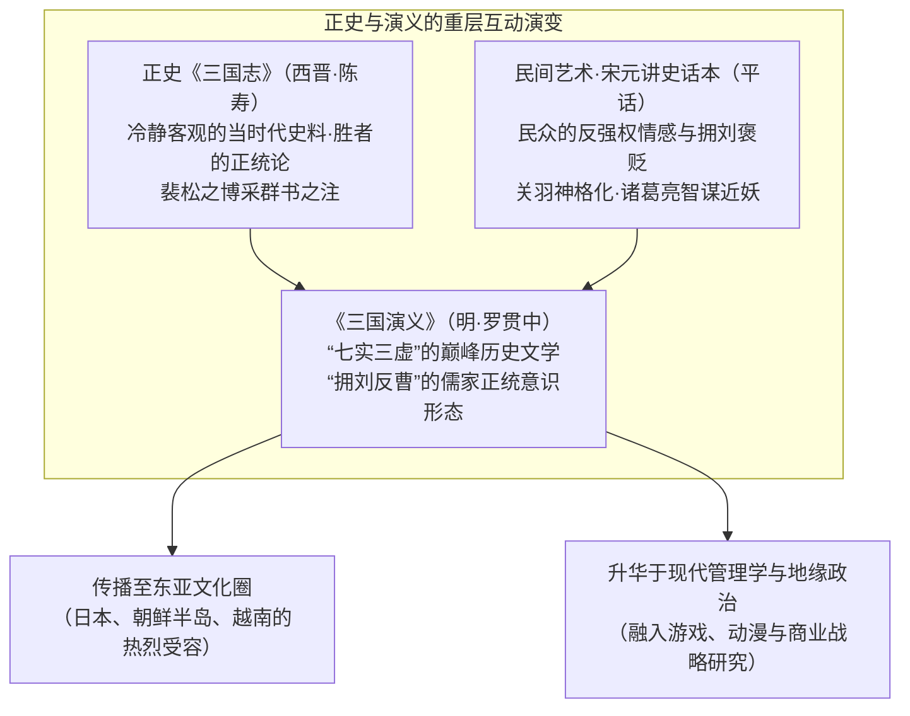
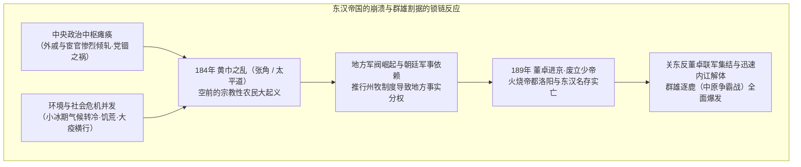
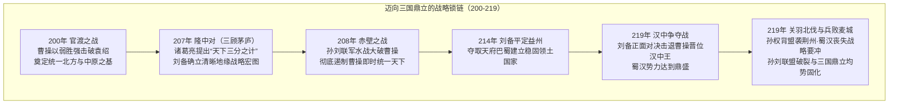
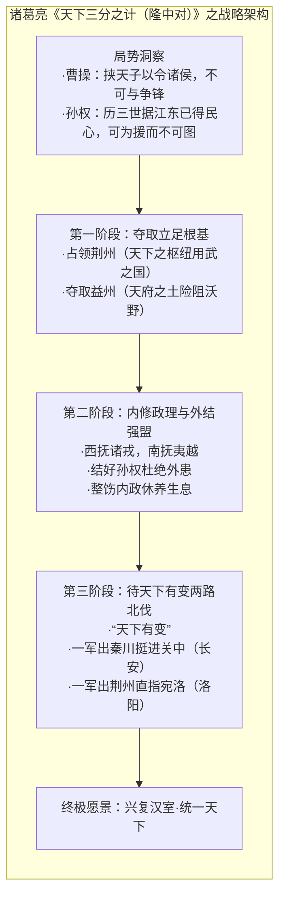
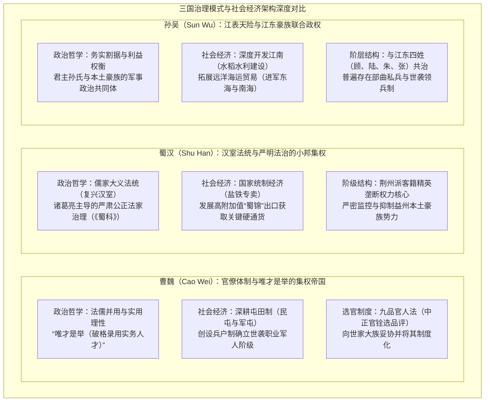

## 序论：为何“三国志”历经1800余年仍令人心驰神往

从公元184年的“黄巾之乱”爆发，到公元280年西晋（Western Jin）平定孙吴、一统天下，历时将近一个世纪。在欧亚大陆东端广袤的华夏原野上，这场属于 **“三国时代（Three Kingdoms period）”** 的兴衰更迭大戏，跨越了1800年的漫长时空，至今依旧牢牢吸引着东亚乃至全球无数读者的求知欲、想象力与澎湃激情。

在中国汗牛充栋的历代王朝更迭史中，为何偏偏唯独这个时代的动荡大分裂，能够释放出如此历久弥新、摄人心魄的文化磁场？

其最核心的根源在于，“三国”这一独特的文化语境，兼具了由严谨实证史料构筑的 **历史实态“正史《三国志》”（西晋·陈寿 著，刘宋·裴松之 注）** ，以及历经千年民间说唱评话层累堆叠、最终于明代蔚为大观的 **历史演义小说巅峰“《三国演义》（罗贯中 著）”** 这两重极为罕见的“重层双轨结构”。



就历史事实而言，三国时代是伴随东汉帝国旧秩序彻底瓦解而来的惨烈乱世，期间伴随着人口的雪崩式锐减、小冰期的酷寒气候、频繁肆虐的饥荒与白骨蔽野的惨烈战乱。在东汉最鼎盛时期，全国官方编户人口曾达到约5600万人；然而到了三国鼎立后期，将魏、蜀、吴三国的户籍人口相加，也仅剩下约800万人左右（即便考虑到隐匿户口、地方豪强荫庇以及流民的存在，当时的社会凋敝与人口锐减也已达触目惊心的极端程度）。

然而，正是在这种旧有制度崩塌的权力真空与极端残酷的生存竞争中，冲破陈规陋习与身份门第桎梏的 **“智谋之革新”** 与 **“国家治理模式之实验”** 得以如雨后春笋般接连诞生：
- 曹操（Cao Cao）打破儒家道德虚名、首开能力至上主义的求贤令（“唯才是举”），并推行从根本上解决大军军粮问题的“屯田制”。
- 诸葛亮（Zhuge Liang）为弱小势力吞食庞然大物所量身定制的地缘战略总蓝图“天下三分之计（隆中对）”，以及令行禁止、严肃无私的法家治术。
- 孙权（Sun Quan）凭借长江天险屏障所开拓的江南大开发，以及面向东海与南海构建海洋商业秩序的早期探索。

更为关键的是，活跃于这一时代的群雄霸主、参谋军师、当世名将与无名草莽们所共同演绎的人性心理终极博弈 —— 曹操冷彻的实用理性与深沉孤独、刘备颠沛流离中的仁义坚守与百折不挠、关羽傲视群雄的孤高忠义与壮烈悲剧、诸葛亮明知不可为而为之的鞠躬尽瘁 —— 最终超越了具体的时代与国界，升华为全人类精神谱系中震撼心灵的永恒赞歌。

本文将全景式展开“三国志”这一波澜壮阔的历史画卷。我们不仅停留在对历史轶事与文学情节的浮泛罗列，而是 **从实证史学、政治思想、军事地缘学、社会经济制度以及跨文化受容史等多维全视角展开彻底解剖** 。在客观厘清正史实态与文学演义之断层的同时，深入探究那些纵横驰骋于大乱世之中的英雄们的思想底色与战略精髓。

---

## 第1章：东汉王朝的落日与群雄割据的揭幕（184～200年）

三国时代的开端，源于统治华夏世界长达四百年之久的大汉帝国（西汉与东汉）壮烈的体制性自我崩解。一个曾经拥有高度中央集权的大一统帝国，为何会在极短的时间内丧失政治向心力，并最终沦落至地方豪强林立、军阀割据混战的深渊？若探究其深层脉络，乃是制度疲态、中枢政治腐败以及全球尺度的剧烈气候突变相互交织作用的必然苦果。



### 1.1 宦官与外戚专权及“党锢之祸”：东汉帝国的体制性机能衰竭

东汉王朝（公元25～220年）的中后朝政治格局，陷入了一种近乎无法解脱的致命恶性循环。其根本症结在于幼冲皇帝的接连即位。

当新登基的皇帝尚在襁褓或年幼无知之时，朝廷大权自然落入皇太后及其娘家族人 —— 即 **“外戚”** 集团的手中。待到幼帝渐次成年，为了夺回属于自己的君主亲政实权，往往只能转而依附深居内宫、朝夕陪伴服侍自己的贴身内侍 —— 即 **“宦官”** ，借助其近水楼台之便发动宫廷政变，以血腥武力清洗外戚家族。然而，一朝得势的宦官集团很快便大肆培植私党、任人唯亲，其姻亲党羽在地方州郡搜刮民脂民膏、无恶不作；于是到了下一任幼帝即位时，新一轮的外戚势力又会再度举起屠刀清洗宦官 —— 这场浸透鲜血的权力拉锯战在洛阳宫廷内周而复始地上演。

面对朝纲败坏与公器私用，恪守儒家纲常名教的朝廷士大夫官僚与太学（最高国立学府）中的三万青年学子，发起了声势浩大的抗议与抨击。他们以道德节操自矜，自命为“清流派”，而将横暴贪婪的宦官及其附庸轻蔑地斥为“浊流派”。

然而，深感权力受到威胁的宦官集团先发制人，进谗言操纵皇帝，给这批清流士大夫扣上了“结党营私、诽谤朝廷、动摇国本”的莫须有罪名，展开了残酷无情的全方位政治清算。这就是在公元166年与169年两度发生的 **“党锢之祸”** 。数以百计的名儒重臣遭受处决或瘐死狱中，数千名太学生与名士被判处终身禁锢（剥夺政治权利并永不叙用）。

党锢之祸对东汉政权造成了不可逆转的毁灭性打击。广大的地方豪族阶层与知识精英群体对洛阳中央政府彻底丧失了信心与归属感，昔日维系国家统一的道德法统与制度威信荡然无存。当中央朝廷在士人心目中失去正当性之时，地方豪强武装化与区域军阀割据的土壤已然彻底成熟。

### 1.2 气候寒冷化、饥荒、大疫与“黄巾之乱”

在政治机能全面瘫痪的同时，大自然环境的剧烈变迁则给予了黎民百姓致命一击。

根据历史古气候学与历史人口学的最新实证研究，公元2世纪后半叶至3世纪的东亚大陆，正步入地质历史上著名的 **“小冰期（Little Ice Age）”** 降温周期初期。冬季极寒与夏季连年不绝的特大干旱、霜冻交替肆虐，黄河与长江流域的农耕生产力遭遇了毁灭性重创。极度营养不良、在饥荒线上挣扎求生的流民群体，旋即成为恶性烈性传染病 **“大疫（现代推测为斑疹伤寒或天花）”** 的肆虐温床。建安文人曹植在其名篇《说疫赋》中留下了惨绝人寰的写实记录：“家家有僵尸之痛，室室有号泣之哀。或阖门而殪，或覆族而丧。”

正是在这一人间地狱般的绝望深渊中，来自河北钜鹿郡的道家方士 **张角（Zhang Jiao）** 登上了历史舞台。

张角糅合了黄帝、老子的黄老思想与民间巫觋信仰，创立了极具组织力的新兴宗教 **“太平道”** 。他手持九节杖，以符水（念咒祈祷的神水）为人治病，引导百姓叩头悔过，在深受病痛与饥寒折磨的北方流民社会中获得了狂热的宗教崇拜。短短十余年间，数以十万计的贫苦农人纷纷皈依。张角顺势将信众改编为军事化体制，在全国设立了三十六“方（相当于军事管辖区）”，大方万余人，小方六七千人，密谋在全国范围内同步发动武装起义。

起义的核心宣传口号，便是那首惊天动地的政治谶纬诗：
> **“苍天已死，黄天当立，岁在甲子，天下大吉”** 

汉室属火德，汉朝天子所象征的清平世界（“苍天”）已然气数断绝；取而代之的，应当是顺应土德的“黄色之天（黄天）”。而恰逢六十年干支纪年崭新循环起点的“甲子年” —— 即公元184年，正是推翻旧世界、建立大同盛世的神圣革命之年。

公元184年2月，起义信徒头裹黄色头巾，在北方各州郡揭竿而起，史称 **“黄巾之乱（Yellow Turban Rebellion）”** 。风暴以摧枯拉朽之势席卷河北、河南、山东等帝国的核心腹地，起义军焚烧官衙府库，杀戮贪官污吏，京师洛阳为之震动。

惊恐万状的汉灵帝朝廷急忙派遣皇甫嵩（Huangfu Song）、朱儁（Zhu Jun）、卢植（Lu Zhi）等宿将领精兵分路征剿，同时下诏大赦党人、解除党锢，以求挽回士大夫阶层的支持。在这场生死存亡的平乱战火中，曹操、刘备、孙坚等日后叱咤风云的乱世枭雄，均以讨伐军将领或地方义勇军首领的身份，首次登上了历史的大舞台。

尽管起义的主力部队随着张角于同年病故而在官军的残酷反扑下迅速瓦解，但其余部并未彻底消亡，而是化整为零，演化为“黑山贼”、“白波贼”等数以十万计的独立武装盗匪集团，在华夏各地持续进行长期的游击战。面对彻底失去治安控制能力的天下大乱，东汉朝廷于公元188年采纳了宗室刘焉的建议，正式推行 **“州牧制度”** —— 改刺史为州牧，赋予其统揽一州军政大权与财政征税权的绝对支配力。这一政策本意是为了强化平叛效率，然而州牧集军事与行政大权于一身，直接导致地方长官就地蜕变为完全独立自主的 **“军阀（Warlords）”** ，帝国的统一架构由此彻底碎裂。

### 1.3 董卓专政与洛阳化为焦土：旧秩序的彻底崩塌

公元189年，汉灵帝驾崩，内宫中大将军何进（He Jin）所代表的外戚势力与以“十常侍”为首的宦官集团爆发了你死我活的终极决战。为了彻底根除宦官势力，何进不顾名士劝阻，秘密引诱驻扎在西北凉州边陲、统领强悍西凉铁骑的豪强军阀 **董卓（Dong Zhuo）** 带兵进逼洛阳。

然而在董卓大军抵达近郊之前，密谋泄露，何进在入宫时惨遭宦官伏杀。此举激起了袁绍（Yuan Shao）与曹操等洛阳禁军青年将领的狂怒，他们率领兵士撞开宫门，对内廷展开了无差别的血腥屠戮，斩杀宦官两千余人，皇宫内外血流成河。

在洛阳陷入群龙无首的绝对权力真空之际，董卓率领如狼似虎的西凉精锐铁骑从容开进洛阳城。这位兼具边陲粗鄙与狡黠残忍的关陇军阀，以刺刀彻底威慑了洛阳的名门贵胄，悍然废黜少帝刘辩，改立年幼的刘协为帝（即汉献帝），自封为“相国”，赞拜不名、入朝不趋、剑履上殿，将东汉朝政独揽于股掌之间。

董卓的倒行逆施与残暴恐怖统治，成为了传统中原士大夫阶层无法忍受的奇耻大辱。公元190年，袁绍被推举为盟主，关东（函谷关以东）诸郡太守与刺史纷纷起兵响应，组成了声势浩大的 **“反董卓联合军”** ，曹操、孙坚、袁术、桥瑁、鲍信等一方诸侯尽皆参与其中。

面对关东联军的合围压力，董卓作出了一个令人发指的焦土抉择。他强行驱赶大帝都洛阳城内数百万人众迁往关中长安，沿途死者枕藉；同时下令纵火将洛阳数百年来积淀的宏伟宫殿、官衙宗庙、民居市肆悉数化为灰烬，甚至大肆挖掘历代汉帝陵寝盗取金玉。这座曾经代表东亚古典文明巅峰的百万人口大都市，在数日之内彻底化作瓦砾荒烟。

更为讽刺的是，关东联军各路诸侯虽号称匡扶汉室，实则各怀鬼胎，畏惧西凉军之凶悍裹足不前，整日在酸枣大营置酒高会、盘算兼并私利。曹操与孙坚虽义愤填膺独自引兵西进追击，却终因寡不敌众遭遇惨败。最终，反董联军在互相猜忌与地盘争夺中自行分崩离析。旧帝国赖以维系的中央法统与政治权威在这一刻彻底灰飞烟灭，弱肉强食、纯凭枪杆子说话的 **“群雄割据时代”** 正式撕下了最后一片温情脉脉的面纱。

（至于不可一世的暴君董卓本人，则在公元192年的长安宫廷政变中，被司徒王允与其心腹养子 **吕布（Lu Bu）** 设连环计刺杀殒命，其尸体被弃于长安市曹点燃肚脐点灯，残暴一生落得遗臭万年。）

### 1.4 中原逐鹿：各路群雄的兴衰浮沉

在旧秩序化为瓦砾焦土之后，沃野千里的中原（黄河中下游农业核心区）彻底蜕变为各路枭雄相互残杀的修罗场。在这场你死我活的锦标赛中，主要的割据势力格局如下：

- **袁绍（Yuan Shao）** ：出自汉末第一名门“汝南袁氏”，享有 **“四世三公”** 的崇高政治声望与庞大士大夫门生人脉。他以邺城为大本营，在残酷的北方争夺中彻底消灭了白马义从的主人公孙瓒，一举全据冀州、青州、幽州、并州等“河北四州”，麾下坐拥十万步卒、万余精骑，成为当时全天下无可匹敌的绝对霸主。
- **袁术（Yuan Shu）** ：袁绍之从弟（一说异母弟），盘踞淮南富庶之地。在偶然得到孙坚从洛阳废墟中搜获的“传国玉玺”后，政治野心极度膨胀，竟冒天下之大不韪在寿春公然僭越称帝（国号“仲家”）。此举瞬间使其陷入天下公敌的万劫不复之境，最终在四面楚歌中呕血而亡。
- **孙策（Sun Ce）** ：“江东之虎”孙坚的长子，人称 **“小霸王”** 。在其父意外战死后，孙策以传国玉玺向袁术借兵数千南渡长江，凭借无与伦比的骁勇战力和卓越的战略领袖魅力，在短短数年间以秋风扫落叶之势平定江东六郡（吴郡、会稽、丹阳、豫章、庐陵、庐江），为日后的孙吴帝国打下了坚如磐石的立国根基。然而在公元200年，年仅26岁的孙策在外出狩猎时遭遇仇家刺客暗算，伤重不治英年早逝。
- **吕布（Lu Bu）** ：号称 **“人中吕布，马中赤兔”** 的天下第一猛将。其人弓马娴熟、武艺绝伦，却唯利是图、朝秦暮楚，先后背叛弑杀了义父丁原与董卓，辗转流亡于诸侯之间。他趁刘备与袁术交战之机反客为主窃取徐州，最终在公元199年于下邳被曹操与刘备联军决水灌城围困，因部将反叛被俘，在白门楼被曹操下令缢杀。
- **刘表（Liu Biao）** ：身为“八俊”之一的当世名士、汉室宗亲。他单骑入宜城，凭借荆楚大族蒯氏、蔡氏的支持坐保富庶辽阔的荆州九郡。在北方战火纷飞的年代，刘表保境安民，招纳庇护了数十万避难的中原士民与学者，开办学堂弦歌不辍；然而他性格多疑、坐观成败，缺乏席卷天下的进取雄心，终究只是一个“守户之犬”。
- **刘备（Liu Bei）** ：自称汉景帝之子中山靖王刘胜之后，早年却贫无立锥之地，沦落至织席贩履以奉养母亲。然而刘备少有大志，与关羽、张飞誓同生死。他先后受陶谦让徐州，却又屡次被吕布所夺，终其前半生，先后依附于公孙瓒、陶谦、曹操、袁绍、刘表等人，虽如丧家之犬般四处流亡飘零，却凭借其超凡卓绝的 **“人格魅力、仁德信义与坚韧不拔的意志”** ，赢得了海内士庶乃至敌手的高度敬重。

### 1.5 曹操的崛起与“奉迎天子”：政治大义与实用主义的结合

在无数竞逐天下的割据军阀之中，展现出超越时代的战略远见与惊人政治手腕的，正是 **曹操（Cao Cao，字孟德）** 。

曹操出身于宦官家庭（其生父曹嵩乃是大宦官曹腾的养子），这一出身在自命清高的传统名门世族（如汝南袁氏、弘农杨氏）眼中颇受轻蔑。然而，曹操是一位集非凡的军事战略家、冷酷的政治现实主义者以及汉末建安文学最杰出的诗人于一身的旷世奇才。

曹操在兼并中原的进程中，做出的第一个具有历史分水岭意义的战略决断，便是在公元196年的 **“奉迎天子（挟天子以令诸侯）”** 。
当时，汉献帝在西凉残部李傕、郭汜的火并仇杀中历经九死一生逃出长安，在洛阳断壁残垣中衣不蔽体、食不果腹。曹操敏锐地采纳了战略智囊荀彧（Xun Yu）的远见卓识，力排众议引兵进驻洛阳，正式护送献帝迁都至自己的势力腹地 —— 许昌（今河南许昌）。

这一关键布局，使曹操在政治棋局上瞬间确立了无懈可击的制高点：
> **“奉天子以令不臣，修耕植以畜军资”** （《三国志·魏书·毛玠传》）

自此之后，任何军阀对抗曹操，便在法统意义上直接沦为“叛逆大汉皇帝”的乱臣贼子。曹操身为汉帝国的录尚书事、司空与大将军（后官至丞相），得以堂而皇之地借用天子名义签发全国性的官方诏书，将自己兼并割据势力的征讨行动全部包装为“朝廷官军平定逆党叛乱”，从而赢得了天下士大夫与民心向背的政治大义名分。

与这一政治顶层设计并行的，是曹操为了挽救中原崩溃的农业经济而实施的一项具有划时代意义的经济体制改革 —— **“屯田制”** 的大规模推行（公元196年，由枣祗、韩浩等人倡议确立）。

连年战乱使得中原地区田亩荒芜、人烟断绝。曹操下令将无主的抛荒土地收归国有，招募四处流亡的饥民，由国家统一配给耕牛、农具与种子进行集中开垦，史称 **“民屯”** 。在收益分配上，使用官牛者官六民四，使用私牛者官民对半。作为交换，屯田农户被正式编入独立的“屯田籍”，免除一切杂税徭役与地方兵役。

屯田制的实施取得了立竿见影的奇迹般成效。它使曹操集团不仅迅速安置了数十万嗷嗷待哺的流民、恢复了中原腹地的社会生产，更从根本上解决了当时困扰所有诸侯的致命死穴 —— “军粮匮乏”。短短数年间，“得谷数百万斛，征伐四方，无运粮之劳”，曹操的大军从此拥有了源源不断的战略粮食储备。

至此，在政治大义（奉迎天子）与物质生产基础（屯田制）的双轮驱动之下，实力大备的曹操已然昂首迈向了与北方超级巨人袁绍争夺天下最高支配权的决战擂台。

---

## 第2章：争霸交锋与迈向三国鼎立之历程（200～219年）

从公元200年至219年的短短二十年间，是整个三国历史上战略博弈密度最高、最为波澜壮阔的黄金岁月。天下大势在这一阶段从群雄逐鹿的混沌血战中，急剧收敛、凝结并最终定型为魏、蜀、吴三大政权的鼎足鼎立。

推动这一时代版图剧烈重构的，是三场具有决定性意义的空前战役 —— **“官渡之战（200年）”** 、 **“赤壁之战（208年）”** 以及 **“汉中与樊城之战（219年）”** 。



### 2.1 官渡之战（200年）：以弱胜强的大规模情报战与心理战

公元200年，围绕中国北方的至高霸权，古代军事史上最具教科书意义的生死决战 —— **“官渡之战（Battle of Guandu）”** 正式爆发。

在黄河两岸对峙的双方，实力对比悬殊至极。占据河北四州的北方霸主 **袁绍（Yuan Shao）** ，统领十万步兵主力与一万强悍骑兵，粮草山积、辎重连绵；而迎战的 **曹操（Cao Cao）** 虽奉戴天子，但实际能够投入前线的野战兵力仅有两三万人。兵力相差三至四倍，在当时绝大多数世家大族与谋士眼中，曹操的覆灭几成定局。

战局初期，袁绍大军渡过黄河南下，曹操军依托官渡（今河南中牟东北）筑垒固守，双方陷入了极为惨烈的拉锯战。袁绍军构筑高耸土山，在望楼上以强弩密集俯射曹营，又挖掘地道试图潜入曹军堡垒；曹操则展现出卓越的工程战术应变力，迅速制造了被称为“发石车（霹雳车）”的重型投石机轰塌袁军望楼，并开挖深长壕沟成功截断了地道。

然而，长期的僵持消耗使得兵力薄弱且粮饷匮乏的曹操军渐渐濒临绝境。军粮见底、士卒伤疲交加，军心浮动到了极点。曹操甚至一度在极度动摇中密信留守许昌的荀彧，表达了想要弃守撤军的退意。荀彧复信严正劝谏：“眼下正是天下用智之时。公以十分之一的弱势扼守要冲，画地而守已逾半年，袁绍必将露出致命破绽，此时绝不可退，退则全盘皆输！”

就在战局命悬一线的千钧一发之际，打破死局的决定性转折点终于降临 —— 这是一场关于 **“绝密军事情报与后勤命脉”** 的致命反转。

袁绍阵营的重要谋士 **许攸（Xu You）** 因向袁绍献分兵袭许昌之计未被采纳，加之其族人在后方贪赃枉法被审配逮捕下狱，在惊怒绝望之下，许攸于夤夜私逃叛投曹操大营。

得知少年同窗许攸来投，曹操欣喜若狂，甚至“跣足出迎（光着脚跑出营门迎接）”，抚掌大笑。许攸落座后直奔核心，向曹操道出了袁绍军致命的阿喀琉斯之踵：
> “袁绍大军的全部粮草与军械辎重，万余车粮食皆屯聚于后方的 **乌巢（Wuchao）** 。守将淳于琼嗜酒无备、防卫松懈。若此刻挑选精骑奇袭放火烧之，不过三日，袁绍数十万之众不战自乱矣！”

曹操展现了顶级统帅的惊人魄力。他当机立断，亲率五千精锐轻骑，将士尽皆佩戴袁军旗号，人衔枚、马缚口，趁夜幕潜行绕过袁绍前线严密的斥候封锁线，直扑乌巢。在一场殊死血战中，曹军斩杀淳于琼，将乌巢屯聚的亿万粮草尽数付之一炬。

望着乌巢方向冲天而起的滚滚火光与漫天烈焰，袁绍数十万大军瞬间陷入了灭顶般的全面恐慌。更为致命的是，袁绍派往前线攻打曹操坚垒的猛将 **张郃（Zhang He）** 与高览见大势已去，愤而倒戈向曹操投降。袁军阵线彻底崩溃，袁绍与其长子袁谭仅率八百骑兵仓皇涉水北渡黄河溃逃。

官渡之战绝非仅仅是一场战术上的以少胜多。它标志着：依靠崇高门第出身与庞大兵力优势、内部却刚愎自用且倾轧不断的袁绍贵族门阀集团，在注重真才实学、决策神速、将情报与后勤供应链视为第一要务的曹操近代式实用主义面前遭遇了彻底的降维打击。此后，曹操趁袁绍病亡之机分化瓦解袁氏残党，更于公元207年北征乌桓登白狼山建功，从而彻底达成了 **中国北方（中原与河北）的完全统一** 。

### 2.2 刘备的流转与“三顾茅庐”：天下三分之计的地缘战略震撼

在中原与北方大地被曹操强悍无匹的铁血兵锋逐步荡平之际，半生颠沛流离的 **刘备（Liu Bei）** 则寄居在荆州刘表麾下，被安置于边境小城新野（今河南南阳），日复一日地空耗岁月。年过四旬的刘备在一次如厕时抚摸自己的大腿，不禁黯然泪下，发出了那声千古喟叹 —— **“髀肉之叹”** （叹息自己髀肉复生、功业未就）。

然而在公元207年，彻底扭转刘备一生轨迹乃至整个中国历史走向的伟大邂逅轰然降临。刘备经名士司马徽、徐庶的极力推荐，得知在襄阳隆中隐居躬耕着一位年仅27岁的旷世卧龙 —— **诸葛亮（Zhuge Liang，字孔明）** 。

刘备不顾宗室贵胄之尊，放下身段亲赴荒野草庐，三度登门求教。这就是家喻户晓的 **“三顾茅庐（Three Visits to the Thatched Cottage）”** 。正是在这间简陋幽僻的茅庐之中，诸葛亮为刘备抽丝剥茧、全景式开陈了一幅恢弘深邃的帝国崛起大棋局 —— 这便是彪炳史册的千古地缘战略宏图 **“天下三分之计（隆中对: Longzhong Plan）”** 。



诸葛亮为刘备量身打造的这一战略架构，完全建立在严酷清醒的国际政治地缘现实主义基础之上：
1. **敌友阵营的清醒研判** ：曹操已平定北方、挟天子以令诸侯，占据绝对政治与军事实质优势，此不可与争锋；孙权历经父兄三世经营，深得江东民心民望，此可用为强援，而万不可图谋吞并。
2. **战略根基的明确锁定** ：荆州北据汉沔、利尽南海、东连吴会、西通巴蜀，乃是“天下用武之国”，然而刘表守不住这片膏腴之地；益州四周群山险阻、沃野千里，乃高祖建立汉业的“天然天府之土”，而其主刘璋昏庸暗弱。唯有先行取得荆、益二州作为立国根基，方能在乱世立足。
3. **两路出击的北伐机制** ：在内政修明、安抚西南少数民族、并与东吴结成坚不可摧的外交同盟之后，耐心静待“天下有变”（北方出现内乱或重大战略动荡）。一旦良机降临，命一上将率荆州之军直指宛城与洛阳，而刘备则亲率益州大军出秦川挺进关中。天下百姓必将箪食壶浆以迎将军，则大汉江山中兴可期！

听闻此计，刘备只觉拨云见日、茅塞顿开，由衷赞叹道： **“孤之有孔明，犹鱼之有水也！”** 此前只知在战场上盲目厮杀、颠沛流离的流浪佣兵首领刘备，在获得了诸葛亮这位旷古绝今的宏观战略架构大师之后，终于完成了从一名纯粹的草莽武夫向具有明确国家建构蓝图的 **“政治领袖”** 的根本蜕变。

### 2.3 赤壁之战（208年）：长江水上天堑与天下运势的分水岭

隆中战略蓝图刚刚描绘完毕，历史的狂暴风雨便接踵而至。公元208年秋，荡平北方的曹操亲统大军数十万大举南下，意欲一战席卷江南。恰在此时荆州牧刘表病逝，继位的次子刘琮不战而降，曹操几乎兵不血刃接收了整个荆襄水师与重镇江陵。

仓皇南撤的刘备在当阳长坂坡被曹操五千昼夜兼程三百里的精锐“虎豹骑”追及，遭遇全线溃败，妻离子散（此役诞生了赵云于乱军之中舍命单骑救主刘禅，以及张飞横矛立马断后长坂桥的当阳神话）。

刘备收拢残兵退守江夏夏口（今湖北武汉），派诸葛亮出使柴桑，会见江东新主 **孙权（Sun Quan）** 。面对江东张昭等多数文官力主开门迎降曹操的庞大投降派压力，年轻的诸葛亮与江东主战派核心统帅 **周瑜（Zhou Yu）** 、重臣 **鲁肃（Lu Su）** 紧密联手，向孙权全面陈清了曹操大军看似庞大实则虚弱的致命命门：
1. 曹军乃北方陆战之卒，千里奔波，根本不习长江水战；
2. 长途远征劳师袭远，且深入湿热的南方水泽，军中必然爆发毁灭性大疫；
3. 北方马匹严重缺乏饲料草料，漫长补给线极易陷入崩溃。

被彻底激发出昂扬斗志的孙权，拔出佩剑猛斩案角厉声喝道：“诸将吏敢复有言当迎操者，与此案同！”随即正式任命周瑜为大都督，统帅三万东吴水军精锐与刘备所部并肩溯江而上迎战曹军。

公元208年隆冬，震古烁今的 **“赤壁之战（Battle of Red Cliffs）”** 在长江赤壁要隘正式打响。

曹操大军因北方士卒饱受长江风浪颠簸呕吐之苦，将数以千计的战船首尾相连，以粗大铁锁与木板相钉固结，号称“连环战船”。东吴副都督老将 **黄盖（Huang Gai）** 敏锐识破此举蕴含的毁灭性破绽，乃向曹操递送伪降书，并密备满载干燥芦苇薪柴、灌注膏油易燃之物的轻便蒙冲斗舰数十艘，借机直插曹军水寨。

当这支火船先锋在东南大风的呼啸助推下接近曹营时，黄盖下令全线举火。烈焰腾空而起的几十艘火船以不可阻挡的速度狠狠撞向曹军水寨。被铁链锁死、动弹不得的曹军巨大连环战舰彼此引燃，浩荡的长江水面在刹那间化作烈焰翻滚的无间火海。风助火势，烈火迅速蔓延至曹军沿江连绵数十里的陆上营寨，遮天蔽日的浓烟与大火将夜空烧得通红，曹军在水火夹击与烈性瘟疫中死伤枕藉、土崩瓦解。

曹操在惨败之下，只能引残兵败将狼狈穿越泥泞遍地、尸骨横陈的华容道，仓皇逃回北方。

赤壁之战不仅是中国军事史上最辉煌的水陆协同以弱胜强的大战，更是 **彻底粉碎了曹操企图一战吞并海内之狂妄野心的世界史级关键转折** 。它成功保全了长江中下游的半壁江山，使得诸葛亮在《隆中对》中预言的“天下三分”地缘格局，从一纸假想战略彻底转化为无法逆转的历史现实。

### 2.4 益州争夺战与汉中攻防战（211～219年）：蜀汉疆土之确立

赤壁战后，刘备集团如猛虎出柙，迅速收服荆南四郡（武陵、长沙、零陵、桂阳），终于在天下博弈的棋盘上拥有了梦寐以求的独立地盘。然而若要将《隆中对》的大蓝图推向极致，吞并西方的超级天府沃土 —— **“益州（四川盆地）”** 便成为了无法绕过的历史必然。

公元211年，益州牧刘璋（Liu Zhang）畏惧北方割据汉中的张鲁（五斗米道首领）以及曹操西征的巨大军事威慑，做出了“开门揖盗”的致命误判 —— 邀请同为汉室宗亲的刘备率兵入蜀助剿张鲁。诸葛亮、庞统（Pang Tong）与深知益州虚实的法正（Fa Zheng）力劝刘备抓住千载难逢之良机夺取益州。

刘备虽历经短暂的道德煎熬，终究下定决心挥戈攻蜀。尽管在此期间遭遇了顶级军师庞统中流矢殒命落凤坡的惨痛代价，但历经数年征战，诸葛亮、张飞、赵云分路入川增援，大军最终于公元214年将成都团团合围。刘璋见大势已去，开城出降。至此，刘备彻底将益州沃野尽收囊中。在刘备的文武阵容中，不仅拥有关羽、张飞、赵云等生死兄弟，更有威震西陲凉州的骁将马超（Ma Chao）与老当益壮的名将黄忠（Huang Zhong），可谓猛将如云、谋士如雨，阵容达到了历史鼎盛。

公元217年，刘备发起了一场决定政权终极生死存亡的浩大战略攻坚 —— **“汉中争夺战”** 。汉中乃是卡在秦岭与大巴山脉之间的战略盆地与咽喉命门，若汉中被曹魏长期控制，成都的蜀汉政权便犹如被人将利刃顶在咽喉之上，日夜寝食难安。

在这场历时两年的血腥攻防战中，刘备在首席军事参谋法正的奇谋帷幄之下，于定军山之战中由老将黄忠突袭斩杀了曹魏关陇方面军最高统帅、名扬天下的征西将军 **夏侯渊（Xiahou Yuan）** ，使魏军全线震动崩溃。曹操虽震怒之下亲率大军入汉中争夺，但刘备敛兵据险、深沟高垒，展开了极致的持久战与游击袭扰。补给困难、进退两难的曹操最终只能留下一声著名的叹息 —— **“鸡肋”** （食之无肉，弃之有味），饮恨撤出汉中。

公元219年秋，彻底光复汉中全境的刘备，在群臣将士的盛大劝进下，正式晋位 **“汉中王”** 。从当年一个织席贩履的穷苦遗胄，到历经三十年九死一生的血战流亡，刘备终于挺起脊梁，作为与北方曹操平起平坐的王者向天下发号施令。蜀汉势力的声威在这一刻攀升至最高峰，《隆中对》的最终阶段 —— “出秦川与荆州北伐”似乎已然指日可待。

### 2.5 关羽北伐与败走麦城：痛失荆州与战略格局的分水岭

然而，极盛的欢呼背后，往往潜伏着万劫不复的深渊。就在蜀汉阵营达到巅峰的同一时刻，一场毁灭性的战略悲剧在大意中轰然降临。悲剧的源头，正是独镇荆州全军的主将 —— **关羽（Guan Yu）** 的孤军北伐。

公元219年，为配合刘备汉中胜利的战略策应，关羽率领荆州主力精锐大举北进，将曹魏中原南部重镇樊城（今湖北襄阳樊城）团团合围。恰逢秋季霖雨连绵汉水暴涨，关羽借水势决堤，不可思议地全歼并俘虏了曹魏名将于禁（Yu Jin）率领增援的“七军”三万精锐，并在两军阵前毅然斩杀了誓死不降的猛将庞德（Pang De）。

这就是震撼中国历史的 **“威震华夏”** 。面对关羽如天神下凡般的席卷之势，惊恐万状的曹操甚至召集重臣，一度严肃动议将帝国都城从许昌向北迁往黄河以北的河北避其锋芒。

然而，正是关羽这辉煌至极的胜利，彻底引爆了盟友 **孙权集团最深沉的恐惧与地缘绝望** 。

荆州对于刘备集团而言，是落实隆中两路出击的战略起跳板；但对于偏安江南的孙权而言，长达千里、扼守长江上游的整个荆州掌握在强横的关羽手中，等于国防咽喉全被别国卡死。周瑜之后继任都督的 **吕蒙（Lu Meng）** 敏锐地向孙权密奏：“关羽若彻底攻破曹操得志，回过头来必定图谋我江东！此刻正是其全军压在前线、后方空虚之时，应当趁机直捣其腹心，彻底夺回荆州全境！”

与此同时，关羽虽具备万夫不当之勇，但性格刚愎自用、傲慢蔑视士大夫。当孙权遣使为子求娶关羽之女时，关羽非但不念盟谊，反而破口辱骂 **“虎女安肯嫁犬子”** ，使孙权颜面扫地、怒不可遏；此外，关羽在军中更是残酷威逼南郡太守麋芳（刘备的小舅子）与将军士仁，致使荆州后方守臣人人自危。

在曹魏谋士司马懿（Sima Yi）与蒋济的纵横捭阖之下，曹操向孙权递去了结盟的橄榄枝，承诺将江南合法统治权全面许诺孙权，换取东吴从背后袭击关羽。

吕蒙设计“托病还建业”，换上名不见经传的青年才俊 **陆逊（Lu Xun）** 接替防务，以极尽谦卑之词写信麻痹关羽。关羽果然中计，放松警惕将后方江陵所有的防备守军全数抽调至樊城前线。

公元219年冬，吕蒙统领精锐水师，将兵士全数伪装成商贾模样，摇橹潜入长江，神不知鬼不觉地拔除了江防所有烽火台，无血进占江陵大本营，史称 **“白衣渡江”** 。早对关羽积怨已久的麋芳与士仁开城投降。

后路全断、军心大乱的关羽大军在一夜之间彻底作鸟兽散。关羽仅率残兵数十骑被困孤城麦城（今湖北当阳东南），在突围西奔巴蜀的绝境中遭遇东吴伏兵擒获。孙权见关羽誓死不降，下令在临沮将其与长子关平一同处决，并将关羽的首级以木盒盛装快马送予曹操。

关羽之死与 **“荆州之彻底沦陷”** ，带给蜀汉政权的绝非仅是损失一块地盘与一位顶级统帅，而是 **宣告了《隆中对》宏伟地缘大战略的永久破产与夭折** 。

从益州与荆州同时出兵合击中原的双轨北伐已永远成为镜花水月。蜀汉彻底被压缩并锁死在蜀道难于上青天的闭塞四川盆地之内，沦落为一个人口仅有百万内陆山地弱国。而刘备在痛失挚爱义弟与半壁江山的血海深仇面前，即将被滔天的悲愤推向一场更具毁灭性的三国终极风暴 —— 夷陵之战。

---

## 第3章：三国各自的国家形态 —— 制度、经济与军事的比较剖析

三国时代绝不仅仅是三位枭雄凭借个人武力角逐天下的浪漫演义，更是魏、蜀、吴三大政权在各自截然不同的地理环境、人口规模、阶层结构与意识形态约束下，在极端残酷的生存竞争中展开的一场场深刻的 **“国家制度与社会治理模式的综合实验”** 。

坐拥中原华夏腹地的 **“曹魏（Wei）”** 、闭锁于西南崇山峻岭间的 **“蜀汉（Shu Han）”** ，以及依托浩荡长江天堑深耕水泽的 **“孙吴（Wu）”** 。通过对这三国在政治制度、经济命脉、军事组织以及统治法统层面的立体解剖，方能真正洞察三国历史何以成为中国封建中古时代向魏晋南北朝制度嬗变的关键枢纽。



### 3.1 曹魏：唯才是举与制度创新的庞大帝国

公元220年曹操病逝于洛阳，其世子 **曹丕（Cao Pi，魏文帝）** 凭借强大的军事后盾与政治谋划，迅速迫使汉献帝刘协交出传国玉玺与皇位，举行了历史性的“禅让”仪式。享国四百余年的大汉王朝至此在法统上正式终结，国号大 **“魏”** 宣告建立。

在三国鼎立的版图之中，曹魏所展现的最核心优势在于其 **“压倒性的绝对综合国力（包括人口、耕地面积与物产资源）”** ，以及勇于打破传统腐朽桎梏的 **“制度重构魄力”** ：

1. **“唯才是举”与打破门第的实务人事观** ：
   在两汉传统的儒家政治下，官员选拔完全依赖“乡举里选（察举制）”，以“孝廉”、“茂才”等道德风评作为晋升唯一门槛。这一制度在汉末早已彻底变质为世家豪门相互标榜、垄断仕途的政治分赃特权。
   曹操在公元210年、214年与217年三次断然下达著名的 **《求贤令》（唯才是举令）** ，公开石破天惊地宣告：“若必廉士而后可用，则齐桓其何以霸世！……今天下得无有至德之人放在民间，及负污辱之名，见笑之徒，或不仁不孝而有治国用兵之术者？各衰其所知，勿有所遗。”这一极具革命性的用人观彻底打破了虚伪的道德绑架，使得郭嘉（Guo Jia）、贾诩（Jia Xu）、程昱（Cheng Yu）等行事不拘礼法却具通天彻地之能的顶级策士得以重用；更使张辽（Zhang Liao）、徐晃（Xu Huang）、张郃等敌对阵营的降将得以跃升为独当一面的战区最高统帅。

2. **从“屯田制”到“兵户制”的常备军体制化** ：
   由曹操肇始的屯田制，在曹魏立国后进一步从安置难民的“民屯”深化为前线守备部队的 **“军屯”** 。尤其在淮南与襄樊的对吴对蜀最前线，大规模军屯使得大军实现了“且耕且守”，无需劳师千里向边境运粮，极大减轻了国家财政负担。此外，曹魏在法制上将职业军人阶层从普通编户齐民中剥离，创设了军籍世袭、待遇独立的 **“兵户制”** ，从而建立了一支随时可调动、受国家绝对掌控的职业常备野战军。

3. **“九品官人法（九品中正制）”的创制与贵族化演变** ：
   公元220年曹丕代汉登基之时，为了换取以司马氏、陈氏、崔氏等中原顶级世家大族对新王朝法统的政治支持，采纳了吏部尚书 **陈羣（Chen Qun）** 的建言，正式创立了 **“九品官人法”** （亦称九品中正制）。
   该制度在各州郡设立掌管人才品评的“中正官”，综合人物的家世出身与行状才干，将士人划分为一品至九品共九个等级（一品基本虚设，二品为极贵之“上品”），朝廷据此等级任命相应层级的官爵。这一制度在推行初期成功恢复了国家选官机制的秩序，但由于中正官很快被各大门阀家族所垄断，最终无可避免地沦为了门阀贵族巩固自身特权的制度护城河，演变出后世西晋与南北朝时期所谓 **“上品无寒门，下品无势族”** 的固化贵族阶级社会。

### 3.2 蜀汉：秉持法家精神与正统大义的西南小邦

由于关羽兵败痛失荆州，刘备为了延续汉室正朔、对抗曹丕代汉建魏的非法僭越，于公元221年在成都正式即皇帝位。为昭示自身作为两汉四百年基业的唯一合法继承人，其正式国号自始至终皆为 **“汉”** （史称蜀汉或蜀）。

然而，横亘在蜀汉政权面前的残酷现实，是其 **“疆域与人口规模的极度弱小”** 。与坐拥天下七成人口（四百万人以上）的中原曹魏相比，蜀汉退守益州一隅与南方蛮荒瘴疠之地，全国在册编户户口 **仅约二十八万户、人口不过九十四万人** ，常备正规兵力仅维持在十万人上下（魏国的四分之一至五分之一）。

面对如此悬殊的国力死局，作为蜀汉政权实际最高行政执政长官的丞相诸葛亮，断然抛弃了浮夸的儒家空谈，转而采取了极其强悍冷彻的 **“法家治术（法治主义）”** 强国路线。

1. **以法治蜀与严肃无私的制度统御（《蜀科》的颁行）** ：
   正史《三国志·诸葛亮传》中，西晋史家陈寿对诸葛亮的治蜀政绩给予了登峰造极的高度评价：
   > **“科条具备，权制以开，情伪尽达。心平而理明，善无微而不赏，恶无纤而不贬。庶事精炼，物理其本，循名责实，虚伪不齿。终于邦域之内，咸畏而爱之，刑政虽峻而无怨者。”**
   诸葛亮亲自与法正、李严、伊籍、刘巴共同制定了蜀汉立国根本法典 **《蜀科》** 。他打破汉末巴蜀豪族横行无忌、兼并土地的放任风气，无论是何等勋旧重臣，触犯律法皆绝不宽贷（如李严、廖立之废黜，马谡之被斩）；而凡有寸功于国者，纵使出身寒微亦破格提拔。这种清廉、严明、透明且一视同仁的现代式法治作风，赢得了蜀中百姓深沉的敬畏与由衷爱戴。

2. **国家高度垄断统制经济：蜀锦专营与盐铁专卖** ：
   为了支撑常年跨越崇山峻岭艰苦北伐所需的庞大军事开支，诸葛亮对蜀汉经济展开了彻底的国家管制化改造：
   - **“蜀锦”的国家垄断与创汇工业** ：四川成都自古以产织锦名扬天下。诸葛亮在成都设立专管机构（锦官城），由官府严格把控蚕桑养殖、织造工序与质量标准。由于蜀锦工艺登峰造极，魏、吴两国的王公贵族竞相高价求购，甚至与敌国曹魏之间形成了规模庞大的走私与民间通商网络。蜀锦的对外输出为蜀汉赚取了数以万计的黄金、白银、铜币与战略物资，诸葛亮曾直言不讳：“今民贫国虚，决敌之资，唯仰锦耳。”
   - **盐铁全面收归官办专卖** ：效仿汉武帝时期的财政战时体制，将四川盆地利润丰厚的井盐提炼与冶铁产业从地方豪强手中全部收归国家专卖，彻底铲除了地方豪族的经济独立割据倾向，完成了小国体制下战时经济资源的高度中央集权。

3. **统治集团的深层结构性断层：荆州客籍集团 vs 益州土著豪族** ：
   然而，蜀汉政治架构内部自始至终埋藏着一颗难以拆除的定时炸弹：以刘备、诸葛亮、蒋琬、费祎为核心的 **“荆州客籍官僚外来政权”** 牢牢垄断了朝廷的核心军政要职，而人数占绝大多数的 **“益州本土世家大族”** （以谯周为代表的本土士族）则长期受到政治边缘化与严密防范。这一深层次的地缘政治与阶层利益裂痕，随着数度北伐的劳师无功而不断加剧，最终为四十年后蜀汉末期益州本土派官员集体主导“不战而降”埋下了致命伏笔。

### 3.3 孙吴：长江天险与江东豪族联合政权

在赤壁挫败曹操、又袭杀关羽彻底吞并荆州全境之后，孙权全据了扬州、荆州中南部以及交州的广袤水系。公元222年孙权受曹丕封为“吴王”，并最终于公元229年在武昌（后迁都建业，今江苏南京）正式登基称帝，国号 **“吴”** （史称孙吴或东吴）。

孙吴政权的本质特征，既不同于曹魏高度成熟的集权官僚帝国，亦不同于蜀汉法统至上的战时法治小国，而是一个由君主（孙氏宗族）与南方盘根错节的本土顶级豪门所共同组成的 **“君主与江东豪族联合政权”** 。

1. **与“江东四姓”共治天下的政治同盟** ：
   在三吴与江东故地，自古盘踞着以 **“顾、陆、朱、张”** 为首的四大世家豪族（“江东四姓”）。他们不仅拥有广袤无垠的庄园田产，更在宗族乡里中拥有极高的门望声誉。
   作为淮泗外来军阀的孙坚、孙策父子早年曾以铁腕手段暴力镇压江东本土豪强，造成了严重的血腥仇杀。而深谙政治妥协平衡术的孙权掌权后，迅速改弦更张，主动采取“通婚联姻与政权分享”的共治路线。孙权将吴郡陆氏的核心领袖 **陆逊（Lu Xun）** 拔擢为全国最高军事大都督、后拜为丞相，使江东豪族全面融入孙吴的核心决策层，形成了“孙氏政权与江东豪族荣辱与共”的利益联合体。

2. **“部曲私兵制”与“世袭领兵制”的松散分权构架** ：
   与曹魏国家统一调配军户的中央常备军不同，孙吴的军事制度具有极其鲜明的分权宗族色彩。孙吴的列位将领奔赴沙场，其麾下的作战骨干往往是由自家宗族子弟、依附农民与家奴构成的私兵武装 —— **“部曲”** 。
   朝廷授予将军官职的同时，往往划拨一块封地（复客或奉邑）由其征收赋税赡养私兵；若统帅战死或病故，其所属的部曲军队与军官职位，依法由其亲生儿子或亲弟世袭继承（即 **“世袭领兵制”** ）。
   这一制度使得孙吴在本土防卫作战中展现出极其可怕的凝聚力 —— 将士们是为了保卫自己的身家性命与世袭私产而与敌拼死血战；然而一旦孙权企图集结大军北伐中原，豪族大将们因顾虑自身私兵的战损折耗往往互相观望、出工不出力。这就是孙吴在整个三国时代始终呈现 **“外战外行、内保内行”** 独特战争态势的制度根源。

3. **江南的大规模农业拓荒与面向海洋的大航海先声** ：
   在整个中国历史发展的宏观坐标系中，孙吴王朝留下的最不可磨灭的深远贡献，在于其开创了中国经济重心由黄河流域向长江流域转移的“江南大开发”：
   - **水稻水利灌溉与“山越”的编户同化** ：通过大兴农田水利、排干泽地沼泽，使得昔日“地广人稀、饭稻羹鱼”的江南湿地逐步蜕变为稻麦丰盈的富庶粮仓。与此同时，陆逊、诸葛恪等统帅深入浙西与皖南崇山峻岭，彻底平定了顽抗数代、依托险阻的山地土著武装 **“山越”** ，将数十万山越人口强行迁徙出山，安置于平原沃土转化为国家编民，其中精壮者数十万被编入吴军精锐，极大充实了江南的劳动力与兵源。
   - **经略东海与远洋南海海上贸易** ：凭借领先欧亚的精湛水师造船工业与海航战舰技术，公元230年，孙权派遣将军卫温、诸葛直统领载有万余名将士的大型远洋船队出海远航，成功航抵并巡弋了 **“夷洲（即今中国台湾）”** 与亶洲，写下了中国正史中央王朝跨海开拓经略台湾的最早官方文献实录。同时，孙吴船队以交趾（今越南北部）为跳板，远涉中南半岛、马六甲海峡乃至南亚印度洋沿岸，开辟了繁荣的海上丝绸之路商贸航线。

```
【魏·蜀·吴 三国综合国力与制度深度对比表（公元260年前后）】
```

| 对比维度 | 曹魏（Cao Wei） | 蜀汉（Shu Han） | 孙吴（Sun Wu） |
| :--- | :--- | :--- | :--- |
| **法定首都** | 洛阳（Luoyang） | 成都（Chengdu） | 建业（Jianye: 今江苏南京） |
| **疆域版图范围** | 中原、河北、山东、山西、陕西、淮南、辽东（占全天下约60%面积） | 益州全境（四川盆地、汉中、云南、贵州及川西南部高原） | 扬州、荆州南部、交州（长江中下游平原、浙江、福建、两广、越南北部） |
| **官方编户户数·人口** | **约66万户 / 约440万人** （占三国官方总人口约60%） | **约28万户 / 约94万人** （占三国官方总人口约13%） | **约52万户 / 约230万人** （占三国官方总人口约27%） |
| **常备军事兵力** | **约40万～50万人** （精锐中原步骑兵、乌桓与鲜卑突骑） | **约10万人** （精锐山地突击步兵、连弩兵、白毦兵） | **约23万人** （无敌长江楼船水师、山越精兵、世袭部曲） |
| **核心政治思想·政体** | 崇尚法儒杂糅与功利实用主义，高度集权官僚帝国体制 | 恪守汉室正统大义名分，推行严明公正之法家法治（《蜀科》） | 君主与江东门阀豪族联合执政，分权式利益均沾共同体 |
| **核心官员选拔制度** | **九品官人法** （州郡中正官评定九等门第才德）、唯才是举求贤令 | 诸葛亮丞相府严加拔擢、循名责实、依科律严明考课赏罚 | 依赖江东四姓等豪强门生荐举、部曲与兵权父子世袭 |
| **支柱经济与物质命脉** | 华北旱作麦粮生产、 **屯田制（民屯与军屯体系）** 、北方官盐与冶铁 | 天府都江堰水稻农业、 **官办蜀锦出口创汇（锦官城）** 、西南天然井盐 | 江南水网围垦开发与水稻种植、 **远洋海运及南海香料珍珠商贸** 、海盐 |
| **核心地缘地势优势** | 坐拥天下人口与粮食绝对重心，关东平原回旋空间广阔，骑兵机动无敌 | 四川盆地剑门蜀道天险阻绝，“一夫当关万夫莫开”之天然防卫绝地 | 万里长江滚滚水堑屏障，北方铁骑难渡，独霸南方内河与近海制海权 |
| **体制性脆弱致命短板** | 中正官被世家大族垄断导致皇权渐次架空，最终酿成司马氏兵变夺权 | 人口基数与战略资源极度匮乏，荆州客籍派与益州本土派暗流汹涌 | 宗族私兵世袭领兵制导致将领各自保全私利，对外北伐严重缺乏向心力 |

---

## 第4章：诸葛亮的遗志与三国的暮年黄昏（220～280年）

在三国鼎立的均势彻底固化之后的后半个世纪，那些叱咤风云的开国英雄们相继退出了历史舞台，取而代之的，是冷酷无情的现实国力差距与体制疲劳对国家命运的吞噬。

贯穿这一“三国黄昏”时期的核心双重主线，其一是蜀汉丞相 **诸葛亮（Zhuge Liang）** 抱定“鞠躬尽瘁，死而后已”的钢铁意志所展开的悲壮北伐；其二则是中原霸主曹魏政权内部由 **司马氏家族（Sima clan）** 所悄然推展的军事政变与皇权篡夺悲喜剧。

### 4.1 刘备的复仇之役与夷陵之战（222年）：白帝城托孤

公元221年，刚刚在成都称帝的刘备做出了其登基之后的首个最高国家战略决断 —— 悍然不顾诸葛亮、赵云等核心重臣的泣血苦谏，举倾国之兵发起旨在彻底讨灭孙吴政权的 **“东征伐吴之役”** 。

失去结义生死兄弟关羽的个人滔天痛楚，与丢失荆州导致《隆中对》战略腰斩的地缘焦躁，将年过六旬的刘备彻底吞没。祸不单行的是，大军誓师前夕，另一位结义兄弟张飞（Zhang Fei）又在阆中营中因暴虐士卒遭部将范强、张达刺杀，身首异处。然而被悲恸彻底激怒的刘备已无法止步，他亲统四五万蜀汉百战精锐顺长江三峡而下，以排山倒海之势杀入东吴境内。

战役初期，刘备军势如破竹，连拔吴军多处关隘，长驱直入占领沿江数百里峡谷要地。危急关头，孙权再度力排众议，任命年仅三十九岁的镇西将军 **陆逊（Lu Xun）** 为大都督，全权节制前线各路吴军。

面对蜀军汹涌澎湃的进攻锐气，陆逊展现出惊人的定力与坚忍，采取了极致的 **“后发制人·持久消耗战略”** 。
他严令吴军诸将坚守险要城寨，任凭蜀军百般辱骂挑战，绝不轻出浪战。时值盛夏，长江三峡深山中酷热难耐、瘟疫渐生。为了避开难当的酷暑，缺乏大兵团平原会战经验的刘备做出了极其致命的阵法布置 —— 依傍茂密山林树荫，在长江南岸狭长峡谷中将大军营寨首尾相连绵延达七百里之遥，结成著名的“连营”。

这正是陆逊苦熬数月等待的致命死穴。
公元222年6月的一个狂风大作之夜，陆逊严令全军将士各持一束茅草与引火之物，自水陆两路对刘备七百里连营实施 **“全面火攻奇袭”** 。顺风呼啸的滔天烈火瞬间将蜀汉各营烧成一片连绵火海，彼此无法相顾。退路被断的蜀军在崇山峡谷中自相践踏、坠崖投水，数万百战精锐在顷刻间灰飞烟灭，将领督邮死伤无数。

刘备在精锐侍卫的拼死护卫下仓皇突围，万幸逃入长江要隘白帝城（今重庆奉节）。这就是古代战史上最具转折意义的陆战巅峰之一 —— **“夷陵之战（Battle of Yiling）”** 。

惨败的重创、将士全歼的自责与急火攻心，使得老迈的刘备在白帝城彻底病入膏肓。公元223年4月，刘备将丞相诸葛亮从成都紧急召至白帝城病榻前，留下了那段震撼千古的绝唱遗嘱 —— **“白帝城托孤”** ：
> **“君才十倍曹丕，必能安国，终定大事。若嗣子可辅，辅之；如其不才，君可自取！”**

在一个极度讲求君臣父子纲常的东方封建皇权社会，一位开国帝王竟在临终之际坦然对臣子言明“如嗣子不才君可自取（你可自行取而代之称帝）”，此等信任与器量古今未有。闻听此言，诸葛亮泪流满面、以头抢地叩首至额头渗血，泣血立誓：
> **“臣敢竭股肱之力，效忠贞之节，继之以死！”**

一代枭雄刘备就此长辞人世，年仅十七岁、资质平庸的后主刘禅（Liu Shan）在成都即位。蜀汉元气大伤、精兵尽丧、四周强敌环伺，复兴大汉江山的全部万钧重担，从此全数压在了诸葛亮一人那瘦削的双肩之上。

### 4.2 诸葛亮南征（“攻心为上”）与千古名篇《出师表》

主少国疑、大败初定，诸葛亮执掌丞相大权后的第一着妙棋，便是遣使邓芝出访东吴，向孙权讲明“唇齿相依”的存亡之道，成功打破坚冰，全面 **“修复了蜀吴军政同盟”** 。

紧接着，诸葛亮必须腾出手来彻底拔除腹心之患 —— 刘备夷陵兵败后在南中地区（今云南、贵州及四川南部）由豪强雍闿、高定与蛮夷部落掀起的全面大叛乱。
公元225年，诸葛亮亲率大军深入瘴疠遍布的南中平叛。誓师之际，参军马谡（Ma Su）向诸葛亮进献了一段闪烁着军事心理战旷世智慧的名言：
> **“夫用兵之道，攻心为上，攻城为下；心战为上，兵战为下。愿公服其心而已。”**

诸葛亮对这一战略精髓心领神会并贯彻始终。在生擒南蛮核心首领 **孟获（Meng Huo）** 之后，诸葛亮并不杀戮，而是带其检阅蜀军营阵后从容将其释放，听凭其招兵买马再战。历经“七擒七纵”的反复较量，当孟获第七次被生擒时，终于跪倒在地、感激涕零地由衷服输：“公，天威也！南人决不再反矣！”

在彻底平定南中之后，诸葛亮采取了极为高明的“不留兵、不留官”的民族羁縻自治方略，委任当地少数民族渠帅自我治理。这一卓越的战后和解不仅消除了蜀汉的后顾之忧，更为蜀汉源源不断地输送了南中的黄金、白银、良马、丹漆与极其勇猛善战的“无当飞军”少数民族精锐步卒，为北伐提供了关键的兵资血脉。

公元227年，后方安定、兵精粮足的诸葛亮终于下定决心，正式开启其毕生终极宿愿 —— **“大举北伐曹魏”** 。在提兵移驻汉中前线之际，诸葛亮向后主刘禅递呈了那篇千古流芳的抒情表文典范 —— **《出师表（前出师表）》** ：
> “先帝创业未半而中道崩殂，今天下三分，益州疲弊，此诚危急存亡之秋也……臣本布衣，躬耕于南阳，苟全性命于乱世，不求闻达于诸侯。先帝不以臣卑鄙，猥自枉屈，三顾臣于草庐之中……受任于败军之际，奉命于危难之间，尔来二十有一年矣！”

字字泣血、句句含泪。后世学者由衷感叹：“读《出师表》而不落泪者，其人必不忠！”

### 4.3 浩荡北伐的轨迹（228～234年）：陨星坠落五丈原

从公元228年春至234年秋，诸葛亮以惊天地泣鬼神的坚韧意志，接连发起了五次旷日持久的大规模 **“北伐曹魏（Northern Expeditions）”** 。

在敌我双方国力对比达到四比一甚至五比一的绝对劣势之下，诸葛亮为何偏要执拗地倾全国之力攻打强盛的北方大帝国？正是在《后出师表》中，诸葛亮道出了其震撼人心的攻势战略防御哲学：“汉贼不两立，王业不偏安！……以先帝之明，量臣之才，固知臣伐贼，才弱敌强也。然不伐贼，王业亦亡；惟坐而待亡，孰与伐之？”小国若画地自限、贪图苟安，与大国的国力鸿沟只会越拉越大，最终必然坐以待毙；唯有持续发动积极进取的战略进攻，方能在运动战中制造破绽、谋求死中求活。

```
【诸葛亮五次北伐全景轨迹考】
·第一次北伐（228年春）：出其不意大出祁山，天水、南安、安定三郡望风归附，收得大将姜维。然而命马谡守街亭，马谡违规舍水扎营被魏将张郃大破失守，全军被迫撤回汉中。诸葛亮斩马谡自贬三等，“挥泪斩马谡”。
·第二次北伐（228年冬）：出散关围攻陈仓二十余日，遭遇曹魏名将郝昭以火箭、滚木筑造的铜墙铁壁阻击，粮尽而退，斩杀追击之魏将王双。
·第三次北伐（229年春）：派遣陈式成功攻占武都、阴平二郡，遏制氐、羌各部，稳固蜀汉西北边防屏障。
·第四次北伐（231年春）：首次投入划时代运输工具“木牛”，再出祁山，于上邽割麦并正面击破司马懿大军。后因大雨连绵导致李严运粮不济伪造圣旨召回，蜀军被迫撤军，在木门道伏弩射杀曹魏名将张郃。
·第五次北伐（234年春）：投入“流马”，率十万大军出斜谷，进驻渭水南岸之五丈原（今陕西宝鸡岐山县）。诸葛亮在此立足屯田，决心与司马懿展开三年以上的大规模长期战。
```

阻遏蜀军北伐的最大梦魇，从来不是曹魏大军的刀剑，而是 **“横亘在关中与汉中之间那艰险至极的秦岭崇山峻岭与后勤运粮物理极限”** 。蜀军兵士往往有一半的人力需要消耗在漫长的悬崖栈道上运粮，往往尚未抵达前线粮草已在半路吃尽。为了破解这道物流魔咒，诸葛亮展现出卓越的工程发明智慧，制造出了名垂青史的 **“木牛”** 与 **“流马”** —— 专为极其狭隘的山道栈道量身定制的单轮手推车及联动机械装置，极大提升了山区长途运输效率。

公元234年，诸葛亮在 **五丈原（Wuzhang Plains）** 依渭水扎下连营，令将士与关中百姓“杂耕于野、军民相安”，彻底摆脱了粮荒瓶颈。

面对诸葛亮展现出的压倒性军阵威慑，曹魏军政统帅 **司马懿（Sima Yi，字仲达）** 选择了最极端的深沟高垒“不战之策”。任凭诸葛亮如何布阵挑战，司马懿坚闭营门不出；即便诸葛亮派使者送去妇女所用的裙裾首饰（巾帼之赠）百般羞辱其怯懦如女子，司马懿亦泰然受之，反而和颜悦色地向蜀汉使者探询诸葛亮平日的起居劳作：“诸葛公寝食如何？事物烦简如何？”当得知孔明“夙兴夜寐，罚二十以上皆亲览，食不过数升”时，司马懿断然断言：“孔明食少事烦，其能久乎！”

这句残酷的预言不幸言中。由于经年累月的事必躬亲与心力交瘁，诸葛亮的身体彻底垮掉了。公元234年8月23日深夜，秋风萧瑟的五丈原军帐之中，这位鞠躬尽瘁的一代名相溘然长逝，享年仅五十四岁。

临终前诸葛亮缜密布置撤军方略，全军密不发丧、整肃退兵。待司马懿察觉追赶时，蜀军突然回旗反击、擂鼓整肃，司马懿疑心孔明未死有埋伏，惊骇之下仓皇勒马撤退。由此在民间留下了那句千古戏谑之语 —— **“死诸葛走生仲达”** 。

诸葛亮未能达成光复汉室、还于旧都的壮志。然而，他那光明磊落的操守、冰清玉洁的廉洁以及知其不可而为之的献身精神，使其光芒彻底压倒了同时代所有功成名就的胜者，成为了东方文明殿堂中一座万古仰止的最高人格丰碑。

### 4.4 曹魏的内部崩溃与司马氏的篡夺

诸葛亮这位生平最强劲敌的离世，并未带给曹魏帝国真正的和平，相反，魏国核心政局随即陷入了空前激烈的内部权力地震与篡夺风暴。

魏明帝曹叡英年早逝后，年仅八岁的幼帝曹芳即位。朝廷指定由宗室代表大将军 **曹爽（Cao Shuang）** 与四朝宿将太尉 **司马懿** 共同辅政。

曹爽上台后大肆排挤中原元老世家大族，将权力收拢于何晏、丁谧等亲信手中，骄奢淫逸、僭越无度；并明升暗降将司马懿排挤为无兵权的“太傅”。面对政治迫害，老谋深算的司马懿选择了长达十年的伪装隐忍 —— 他托病闭门谢客，在曹爽派人窥探时装出一副耳聋眼花、两手颤抖喝粥流胸、不久于人世的痴呆病态，彻底麻痹了曹爽集团。

公元249年正月，趁曹爽兄弟护送幼帝曹芳离开洛阳前往城外祭扫高平陵之机，七十岁高龄的司马懿在洛阳城内暴起发动武装政变，史称 **“高平陵之变（Incident at Gaoping Tombs）”** 。司马懿迅速关闭城门，夺取洛阳武库，并指洛水为誓许诺保全曹爽爵禄富贵。然而待曹爽交出兵权投降后，司马懿翻脸无情，以谋反大逆之罪将曹爽及其心腹党羽尽数夷灭三族，曹魏军政大权自此彻底被司马氏家族独揽。

司马懿死后，其长子 **司马师（Sima Shi）** 、次子 **司马昭（Sima Zhao）** 相继掌权，曹氏皇族彻底沦为提线木偶。公元260年，不堪受辱的魏帝高贵乡公曹髦拔剑发出了那句载入史册的呐喊 —— **“司马昭之心，路人所知也！”** 曹髦亲率数百宫廷童仆侍卫驾车冲向司马昭相府，却在皇宫宫门前被司马昭心腹成济在光天化日之下弑杀于车前。曹魏王朝的气数在这一刻已然彻底散尽。

### 4.5 三国的灭亡与西晋一统天下（263～280年）

司马昭在彻底取代曹魏皇权称帝之前，急需建立一件无可动摇的盖世军功以堵天下悠悠之口 —— 那便是 **“彻底消灭西南的蜀汉”** 。

彼时的蜀汉，后主刘禅宠信宦官黄皓，朝政日益昏聩腐败；诸葛亮的入室亲传弟子 **姜维（Jiang Wei）** 虽先后发动了十一次矢志不渝的悲壮北伐，却因蜀中民力枯竭、朝中奸佞阻挠而收效甚微，国力已然濒临绝境。

公元263年，司马昭命镇西将军钟会（Zhong Hui）与征西将军 **邓艾（Deng Ai）** 兵分三路，统领十八万大军泰山压顶般南征伐蜀。姜维以惊人的战术指挥，退守至天险难越、峭壁千仞的 **“剑阁（Jiange）”** ，将钟会十万主力大军死死阻截在绝壁之外，魏军粮道断绝几乎意欲退兵。

就在战局胶着的关头，老将邓艾做出了中国古代战史上堪称奇迹的神来之笔 ——
邓艾挑选精锐士卒，兵行绝险，毅然率部踏上了断崖耸立、毫无道路可寻的 **“阴平绝险（Yinping）”** 。在长达七百里的无人荒山野岭中，邓艾身先士卒裹着毛毡滚下千丈悬崖，将士攀藤附葛历尽九死一生，神兵天降般奇迹般出现在了蜀汉纵深腹地江油与绵竹，一举斩杀诸葛亮之子诸葛瞻父子。

面对突然逼近成都城下的邓艾神兵，早已厌战的成都朝廷陷入崩溃般的恐慌。在益州本土派学者谯周（Qiao Zhou）等人的力劝下，后主刘禅自缚出城面缚请降。 **公元263年，享国四十三年的蜀汉政权正式覆灭。**

公元265年，司马昭病故，其长子 **司马炎（Sima Yan，晋武帝）** 依样画葫芦迫使魏帝曹奂禅让帝位，正式改国号为 **“晋”** （史称西晋），曹魏寿终正寝。

而最后的偏安政权孙吴，则在末帝 **孙晧（Sun Hao）** 极其残暴嗜杀的暴虐统治下陷入了全面的分崩离析。公元280年，西晋武帝司马炎起水陆大军二十万分六路大举伐吴。名将杜预自襄阳出师势如破竹（成语“破竹之势”之典故），而益州水军统帅 **王濬（Wang Jun）** 率领由数万工匠在四川打造的巨无霸战舰群顺流直下，以巨型松脂大筏顺江漂流将东吴横截长江的巨大熔铁锁链全数烧断消融。晋军巨舰兵临建业城下，孙晧面缚舆榇出降。

从公元184年的黄巾起义算起，历经 **长达九十六年** 的惨烈割据征伐，山河破碎、群雄并起的三国纷争时代，最终伴随着孙吴的覆亡与西晋的崛起，重新复归于大一统的华夏版图之中。

---

## 第5章：正史《三国志》vs《三国演义》 —— 虚构与史实的鸿沟

当代全球读者所熟知津津乐道的三国人物与传奇故事，有九成以上实际上源自十四世纪元末明初小说巨匠 **罗贯中（Luo Guanzhong）** 所编撰的长篇历史章回小说 **《三国演义（Romance of the Three Kingdoms）》** 。

然而，若以严肃的现代实证史学之解剖刀加以审视，其间存在着令人震撼的“虚构与史实断层”。正如清代著名史家章学诚在《文史通义》中所下的精确断语 —— **“七分实事，三分虚构（七实三虚）”** 。《三国演义》在整体上严格维系了正史的历史大框架与政治地理轨迹，却在具体的战役细节、人物心理、道德阵营甚至时间线索上，进行了极具戏剧张力的大胆艺术重塑与文学虚构。

本章将通过全面对勘西晋史家 **陈寿（Chen Shou）** 笔下的第一手实录史料 **正史《三国志》** 与罗贯中的《三国演义》，彻底剖析那场“文学虚构如何一步步覆盖乃至取代真实历史”的思想演变密码。

### 5.1 陈寿的作史背景与裴松之注：实录史书的奠定与重层展开

正史《三国志》的作者陈寿（公元233～297年），早年在故国蜀汉担任观阁令史，乃是诸葛亮入室弟子、大经学家谯周的得意门生。蜀汉覆亡后，陈寿入仕新朝西晋，任职著作郎（国家级史官），在极为严酷的政治风口之下，私撰完成了涵盖《魏书》三十卷、《蜀书》十五卷、《吴书》二十卷、合共六十五卷的浩瀚巨著《三国志》。

陈寿执笔时的政治处境极其微妙复杂：
西晋王朝乃是受曹魏禅让而立国。因此，为了维系当朝西晋天子皇位的合法法统，陈寿在全书体例上 **不得不将“曹魏奉为唯一的天子正统正朔王朝”** 。正因如此，全书中唯有曹魏历代帝王（曹操追尊为武帝、曹丕、曹叡等）享有至高无上的“本纪”体例；而蜀汉昭烈帝刘备仅被称为“先主传”，孙权被称为“吴主传”，在形式编目上屈居于列传序列。

然而，作为前蜀汉臣民的陈寿，内心深处对故土与汉室始终怀有深沉的温情与敬意。他在字里行间处处流露出对刘备仁德风范的推崇，更给予蜀相诸葛亮单独立传并附录集目录的破格礼遇，盛赞诸葛亮为“识治之良才，管萧之亚匹”。其笔致古朴典雅、叙事严谨精当，在古代史学界赢得了比肩司马迁《史记》与班固《汉书》的“前四史良史”极高盛誉。

然而陈寿治史崇尚简括，加之蜀汉不设史官导致文献多有阙漏，正史叙事难免有失之太简之憾。时隔约130年之后的南朝刘宋元嘉年间，宋文帝认为陈寿之书“太简，有不尽者”，遂诏令朝廷重臣史家 **裴松之（Pei Songzhi，372～451年）** 为《三国志》作全方位注疏，这便是史学丰碑 **“裴松之注（裴注）”** 。

裴松之博览群书，搜罗了东汉末年及三国西晋时期早已失传的百四十余种杂史、家传、别传、起居注与野史笔记，以极为严谨的文献互证态度，不仅详实补缀了海量人物轶事与军政战况，更敢于在注中直斥陈寿原书之误。裴松之注的字数甚至三倍于陈寿原书文本。正是由于裴注那令人惊叹的博大胸怀与客观存疑精神，三国历史才得以保留下如此多维立体、生动鲜活而未曾湮灭于岁月的浩瀚历史细节。

### 5.2 为何刘备成正派、曹操化反派：“拥刘反曹”的千年思想史

支配《三国演义》整部巨作的核心灵魂与政治纲领，无疑是毫不妥协的 **“拥刘反曹（崇尚刘备为仁义天命正统，贬斥曹操为欺天逆贼）”** 意识形态。这一强烈的忠奸善恶二元对立，并非罗贯中的凭空独创，而是唐、宋、元、明千年来 **“中国主流思想界与底层民众文化心理长期互动沉积”** 的历史产物：

1. **民间讲史（平话）与草根阶层的“弱者同情”** ：
   晚唐著名诗人李商隐在《骄儿诗》中生动记录了当时的街巷市井百态：“或谑张飞胡，或笑邓艾吃……闻刘玄德败，频蹙眉，有出涕者；闻曹操败，即喜唱，快称善。”在终年饱受官府赋税盘剥与藩镇战乱蹂躏的底层平民心中，出身织席贩履、流浪奔波却始终温厚爱民的刘备，成为了草根百姓最理想的道德寄托；而雄踞中原、法纪严峻且动辄屠城（如徐州之屠）的权势者曹操，则自然成为了官僚强权与暴政的象征化身。
2. **南宋朱子理学与“正统论”的惊天逆转** ：
   “拥刘反曹”从民间朴素情感跃升为国家绝对主流意识形态的转折点，发生于十二世纪的南宋时期。北宋遭遇“靖康之耻”，华夏故土与中原沦入女真族大金帝国之手，宋室被迫南渡偏安临安（杭州）。
   面对“丢了中原祖地，偏安江南的弱小政权是否还是华夏正统”的终极合法性危机，理学集大成者 **朱熹（朱子）** 在其名著《资治通鉴纲目》中，掀起了一场震撼的思想革命 —— 断然推翻了司马光《资治通鉴》中以曹魏为正统的传统史观， **公然宣布“蜀汉刘备才是全天下唯一的华夏大一统合法正统”** ！在朱熹的理论构建中，占据中原的曹操乃是名副其实的窃国弑君之逆贼，唯有身在西南、矢志北伐光复旧都的蜀汉，才秉承了大义天命。这一论断迅速成为元代、明代科举考试与士大夫价值取向的金科玉律。
3. **明初汉家天下复兴的政治隐喻** ：
   在历经蒙古大元帝国近百年的异族统治之后，朱元璋建立明朝、驱逐鞑虏。元末明初的罗贯中将深植于民间的《三国志平话》与朱子理学的正统大义融会贯通，将“兴复汉室、驱除奸雄”的民族情感投射于刘备与诸葛亮君臣身上，从而完成了这部将“拥刘反曹”推向神圣化巅峰的文学长卷。

### 5.3 经典历史叙事的虚实大起底

在《三国演义》那些广为流传、脍炙人口的高潮桥段中，究竟哪些属于后人附会的文学艺术虚构？我们选取最具代表性的四组核心母题进行深度考证：

#### ① “桃园三结义”的历史本相
- **演义描写** ：第一回中刘备、关羽、张飞于张飞庄后盛开的桃花丛中，备下乌牛白马祭告天地，立下“不求同年同月同日生，但愿同年同月同日死”的千古誓言，成为全书江湖义气与忠烈宿命的神圣序曲。
- **正史实态** ：正史《三国志·关羽传》与《张飞传》中， **完全没有任何“桃园结义”或祭天盟誓的记载** 。史书仅记载：“先主与二人寝则同床，恩若兄弟。而稠人广坐，侍立终日，随先主周旋，不避艰险。”刘、关、张本质上是极度亲密默契的君臣上下级关系；将这种患难深情升华为宗教性“结拜义兄弟”，乃是宋元以降民间江湖行会、秘密结社文化反哺于文学创造的产物。

#### ② 赤壁之战系列神话的还原与解构
赤壁之战是全书艺术虚构与战术夸张最为密集的章节，几乎全盘将东吴君臣的功业移花接木于诸葛亮一身：
- **草船借箭** ：演义中孔明立下军令状，于浓雾笼罩的黎明驾二十艘草人扎船逼近曹营，擂鼓呐喊，诱使曹操多疑曹军放箭十万余支满载而归。  
  $	o$ **史实考证** ：此计与诸葛亮毫无瓜葛。正史发生于数年后的公元213年濡须口之役， **孙权** 乘大船亲自刺探曹军，曹军乱箭齐发导致战船一侧中箭过重发生倾斜，孙权下令掉转船头使另一侧受箭，待两侧重量平衡后方才从容返航。小说家将孙权的胆魄与急智挪借至诸葛亮名下。
- **借东风（七星坛祭风）** ：孔明筑坛祭天借东风的神怪桥段纯属道教色彩的文学虚构。初冬的赤壁长江水域，受秦巴山地与江汉平原地貌温差影响，往往在冷空气南下前夕发生局部的锋前倒槽天气，周瑜、黄盖长期在此操练水师，精准捕捉并利用了这一自然界的气象反常现象。
- **周瑜的严重矮化与孔明的多智近妖** ：演义将周瑜描绘为心胸狭隘、屡屡暗算孔明不成，最终仰天悲呼“既生瑜，何生亮”咳血而亡的嫉妒狂徒。  
  $	o$ **史实考证** ：真实的周瑜在正史中“性度恢廓，大率得人”，被刘备、蒋干、程普由衷盛赞为万人倾倒的“美周郎”。赤壁之战在战役决策与实际临阵指挥上， **几乎百分之百是周瑜、黄盖、鲁肃等东吴名将建立的绝世功勋** 。彼时的诸葛亮在促成孙刘联盟后主要驻守后方负责江夏的后勤防务，从未在赤壁前线指挥过吴军主力。
- **华容道关羽私放曹操** ：关羽在华容道因念及当年曹操厚待旧恩，违背军令伏兵放走曹操的煽情大戏，在正史中纯属虚构。真实历史中刘备确实率军追至华容道放火，但曹军早已踩踏泥泞穿越脱身，刘备终究慢了一步。

#### ③ “空城计”的彻底虚构
- **演义描写** ：马谡失街亭后，诸葛亮身边仅有二千五百名老弱残兵滞留西城县。面对司马懿统领的十五万魏军大兵压境，孔明大开四门，仅令数十老卒洒扫街道，自己则领二童子端坐于城楼之上，焚香抚琴泰然自若。深谙孔明一生谨慎的司马懿疑心重兵埋伏，吓得勒马全军退兵。
- **史实考证** ： **纯属子虚乌有的历史架空** 。在诸葛亮第一次北伐失街亭之时，曹魏统帅司马懿官拜宛城都督，远在千里之外的河南宛城与荆襄前线驻防，负责抵御关中与陇右蜀军的乃是大将军曹真与张郃，司马懿当时根本从未抵达西北战场！此段故事源自晋人郭冲所撰旨在美化孔明的荒诞野史，早在裴松之作注时便已被以极度严谨的考据痛斥为“无稽之谈”。

#### ④ 关羽的神格化历程：从万人敌勇将到“关圣帝君”与“武财神”
在演义的生花妙笔之下，关羽被赋予了超越凡俗肉身的圣洁光环：“过五关斩六将”、“水淹七军”、“刮骨疗毒（手术割骨去毒箭时从容饮酒弈棋）”。

正史中的关羽确实拥有“万人敌”之神勇，却也深具性格缺陷，傲慢轻敌、刚愎自用，最终铸成丢失荆州的千古遗恨。

然而，正是这种“极度英雄主义与壮烈悲剧宿命”的极致撞击，赢得了民间信仰的狂热共鸣。自宋代徽宗册封其为“忠惠公”、“义勇武安王”始，历经明神宗敕封为“三界伏魔大帝神威远震天尊关圣帝君”，清代更被尊为与文圣孔子齐名的帝国至尊“武圣”。不仅如此，因关羽一生最重信义契约，明清商业繁荣的晋商与徽商将其奉为天下商贾共同庇佑神 —— **“武财神”** 。伴随着近代华人下南洋与全球华侨网络的扩散，全世界各地的唐人街皆矗立起香火鼎盛的关帝庙，成就了世界宗教文化史上独一无二的由一员凡俗武将被全民神圣化的罕见文化奇观。

```
【正史《三国志》vs《三国演义》主要历史事件与人物形象深度对照表】
```

| 考证维度 / 著名事件 | 正史《三国志》（陈寿著·裴松之注）记载之史实 | 《三国演义》（罗贯中著）艺术加工与文学虚构 |
| :--- | :--- | :--- |
| **桃园三结义** | 无盟誓结拜记载，“恩若兄弟，寝则同床” | 桃园设乌牛白马祭天地，立生死结义誓言 |
| **青龙偃月刀与丈八蛇矛** | 汉代实战兵刃为环首直刀与长矛，宋代方出现偃月大刀 | 关羽操八十二斤青龙偃月刀，张飞横丈八蛇矛 |
| **温酒斩华雄** | 乃江东猛虎孙坚在阳人城之战中野战斩杀华雄 | 关羽在各路诸侯震惊中，于热酒未凉前斩提华雄首级 |
| **连环计与貂蝉诛董卓** | 吕布与董卓之随身贴身侍婢私通畏惧败露 | 司徒王允以养女倾国美女貂蝉设美人连环计离间父子 |
| **曹操之历史真实人格** | “非常之人，超世之杰”，卓越政治家、法治统帅与旷世诗人 | “治世之能臣，乱世之奸雄”，极度残忍狡诈之白脸奸贼 |
| **三顾茅庐** | 刘备三次亲访草庐求贤，《出师表》亦有确证；亦存孔明自荐异说 | 三顾草庐，隆冬踏雪访贤，孔明高卧昼寝刘备立雪等候 |
| **赤壁水战之核心主角** | 周瑜、黄盖、鲁肃统率江东水军精锐全面主导指挥 | 演义移花接木，归功于诸葛亮草船借箭、借东风与神机妙算 |
| **华容道义释曹操** | 刘备追击稍慢一步，曹操已穿越泥泞脱困逃脱 | 关羽立军令状把守要冲，感念昔日恩情垂泪放走曹操 |
| **空城计退司马懿** | 第一次北伐时司马懿远在河南宛城防区，绝无此事 | 孔明城头抚琴焚香，神机妙算吓退司马懿十五万精锐大军 |
| **白帝城刘备托孤** | “君可自取”乃帝王之肺腑实录，展现君臣极度互信之至高境界 | 凸显刘备试探孔明忠心之权谋术数，充斥帝王心术机锋 |
| **死诸葛走生仲达** | 蜀军整肃反旗擂鼓，司马懿疑有伏兵畏惧撤军 | 蜀军推出诸葛亮逼真木雕坐像，司马懿魂飞魄散仓皇逃窜 |

---

## 第6章：军事思想、地缘政治与领导力启示

三国志之所以历经千年风云依旧跨越时空被全球各界反复研读，其最深沉的魅力，在于它提供了一座无与伦比的、关于极端危机境遇下 **“最高战略决断”、“地缘地势铁律约束”** 以及 **“领袖统御领导力范式”** 的鲜活案例库。

若从现代管理学、组织行为学与国际地缘战略学的高维视角加以审视，三国纷争所遗留下的宝贵精神遗产依然闪烁着永恒的光芒。

### 6.1 《孙子兵法》的极致实践：曹操的军事理论体系与谋略巅峰

贯穿整个三国时代军事冲突最底层的思想母体，无疑是春秋末期兵圣孙武所著的兵学圣经 **《孙子兵法（Sun Tzu）》** 。而将这部兵学宝典在战场实践中推演至登峰造极之境的代表人物，首推 **曹操** 。

在漫长悠久的中国兵学编纂史上，原本晦涩难懂、篇章散佚的《孙子兵法》十三篇，之所以能够以今天清晰严整的面貌定型传世，核心功绩正是曹操亲自校勘编撰并撰写实战注解的开山鼻祖之作 —— **《魏武注孙子（孙子略解）》** 。曹操在自序中直言不讳地指出：“吾观兵书战策多矣，孙武所著深矣……但旧说舛错，未尽其旨，故省略繁文，摘其精微，作为此注。”

曹操在实战中将孙子兵法的兵道哲学凝结为三大核心支柱：
1. **“兵者，诡道也（奇正相生与攻其不备）”** ：官渡之役中的轻骑奔袭乌巢、征乌桓之战中的千里奔袭白狼山，皆是深谙“出其不意，攻其不备”战略精髓的神来之笔。
2. **“知彼知己者，百战不殆（军事情报之至高价值）”** ：曹操对敌我双方的内部矛盾、心理破绽与粮秣补给线路具有极度敏锐的战略嗅觉。在得知许攸来投的第一时间毫不犹豫采纳其密报，展现了顶级统帅雷霆万钧的决策魄力。
3. **“军无粮食则亡（现代兵站补给供应链思维）”** ：通过推行屯田制与兵户制，从体制底层彻底理顺了粮食自主生产机制，构建起足以承受长期拉锯总体战的战略保障线。

### 6.2 地缘政治的三大铁律：山川地理如何注定三国兴衰

正如著名历史地缘学家所深刻洞察的那样，三国政权的盛衰存亡与最终归宿，在极大程度上受制于其势力所依托的 **“地缘政治地理结构（Geopolitics）”** 的客观物理铁律：

```
【三国时代地缘政治空间结构三元律】
```

1. **中原与华北平原（曹魏）：无可替代的人口与农业战略重心** ：
   黄河中下游沃野千里，自古是华夏农耕文明与人口规模的绝对心脏地带。谁能够全据这片平原，谁就在长期总体战中占据了无法被撼动的经济与人力资源绝对基本盘。然而平原无险可守，乃是四面受敌的“四战之地”。曹操率先完成对中原平原的统一与整合，赋予了曹魏政权足以在长期拉锯消耗战中最终拖垮蚕食任何边陲对手的绝对战略资本。
2. **巴蜀天府之国（蜀汉）：“天然坚固的避风要塞”与“无路可出的地理囚笼”** ：
   四川盆地四周被巍峨险峻的秦岭、大巴山与横断山脉死死环抱，内部又有都江堰水利工程哺育的沃野千里，构成了进可攻退可守的天然防卫堡垒。然而，这种地势是一把极其残酷的双刃剑：守之有余而攻之极难。蜀军大军北伐中原必须跋涉千里攀爬极其艰险脆弱的绝壁栈道，粮食补给线极度漫长狭窄。诸葛亮虽智绝天下、发明木牛流马，终究无法逾越秦岭险峰这一道物理维度的地缘天堑，数度北伐最终皆被“运粮不济”这一地理魔咒生生锁死。
3. **江南水网水系（孙吴）：横跨千里的长江水防线与“无法北上扩张的骑兵劣势”** ：
   波涛万里的长江巨堑，对于缺少大规模水师战舰的北方中原骑兵而言是难以逾越的雷池。然而，孙吴水军在江面水网虽纵横无敌，一旦将士舍舟登陆北上中原，面对北方骁勇善战的重甲骑兵集团便瞬间丧失了机动战力。合肥战役中曹魏名将张辽仅率八百勇士突击便大破孙权十万步卒大军、“威震逍遥津”的惨烈教训，正是南方水上之师难以逐鹿中原平原地貌的地缘宿命写照。

### 6.3 三大开国统帅的领导力类型全景比对

魏、蜀、吴三国的开国掌舵人，在治国带兵与组织建设上展现出了三种迥异却各自璀璨的领导力范式，为当代商业组织与政治领导科学提供了极富洞见的对标样本。

```
【三国核心统帅领导力特质比对表】
```

| 统帅姓名 | 领导力核心类型 | 主要优势与统御风格 | 组织管理隐患与风险 | 对现代企业与组织之启示 |
| :--- | :--- | :--- | :--- | :--- |
| **曹操** | **能力主义·愿景创新型（Visionary）** | 彻底崇尚唯才是举、决断力极其神速、亲临前线统御、兼具诗人领袖浪漫魅力 | 生性多疑、曹氏宗亲与中原门阀暗斗不休、权力交接接班人规划曲折 | 适合推动组织颠覆性创新的开拓型创始CEO。以速度为生命线，强调实战功绩导向。 |
| **刘备** | **共情赋能·使命驱动型（Empowerment）** | 恪守仁义信义、具备震撼人心的人格道德感染力、对核心下属全权信任托付、极具百折不挠的抗挫力 | 极易受私人情感驱动导致战略非理性冒进（夷陵之溃）、组织法制化建设滞后 | 依靠崇高共同愿景与极高心理安全感聚拢人才的同理心领袖。极擅打逆风局的团队凝聚。 |
| **孙权** | **利益调停·务实平衡型（Consensus-builder）** | 极具胆魄破格拔擢青年才俊（任用周瑜、鲁逊）、在本土各大豪族间游刃有余、守成务实、卓越危机管理 | 晚年性格大变猜忌重臣、酿成皇子夺嫡内耗（南鲁之争 / 二宫之变）、对外扩张乏力 | 擅于在庞大复杂利益相关者中寻找最大公约数的协调型总裁。精于存量市场深耕与多元联盟。 |

### 6.4 谋士军师的生态链与组织决策机制

三国鼎立的另一处巅峰看点，在于君主身旁星汉灿烂的 **“顶级参谋智囊团队（军师 / 顾问生态圈）”** 。

曹操麾下的谋臣团堪称群星璀璨的智力超级航母：负责总体战略顶层设计的王佐之才 **荀彧** 、精于战场临机诡道奇策的鬼才 **郭嘉** 、冷酷洞穿人性至暗角落的算无遗策者 **贾诩** ，以及整饬法度选拔廉洁士人的 **崔琰** 与 **毛玠** 。曹操对待谋士从不独信一人，而是有意让具有不同价值取向的谋士就同一战略难题提出针锋相对的备选方案，在多方辩驳碰撞中由统帅本人迅速拍板定夺。

与之相对，早年的刘备由于缺乏宏观战略规划导师，仅凭一腔热血与关张万人之勇在天下到处碰壁；直至登门三顾迎奉 **诸葛亮** 入幕，刘备集团才迎来了能够总揽战略愿景、行政内政与涉外联盟的一体化全能大管家。而入川之后得到的实战谋主 **法正（Fa Zheng）** ，其奇谋诡道弥补了诸葛亮治军持重的短板，正是诸葛亮主内后勤、法正主外军事的精密分工，才铸就了汉中决胜的大捷。

“卓越的最高领导者并非全知全能的超人，而是懂得在身边聚集远比自己精深的专业智囊，并拥有虚心接纳逆耳忠言的宏大胸襟。”这一铁律在三国的兴亡盛衰中得到了颠扑不破的终极验证。

---

## 第7章：在东亚文化圈的传播演变与对现代世界的启示

三国志的壮阔史诗早已跨越了华夏文明的地理版图，深植于日本、朝鲜半岛以及越南等整个东亚文化圈的血脉之中，沉淀为各民族共同的精神食粮、道德楷模与大众通俗娱乐的源头活水。

### 7.1 “三国志”在日本的跨时代狂热受容史

“三国志”东渡日本的历史可一路溯源至公元八世纪的奈良时代。日本官方正史《续日本纪》明确记载，早在公元714年，奈良朝廷的大学寮便已正式开设《三国志》的讲授课程。平安时代的日本公卿贵族无不以通读正史《三国志》为学养底色；而在后世著名的军记物语《平家物语》与《太平记》中，武将的血战决斗与心理博弈随处可见对三国人物典故与汉诗名句的大段化用引用。

进入江户时代后，元禄年间京都禅僧湖南文山（江岛树）耗时数年，将《三国演义》以极具文采的日文和汉和合体翻译为长达数十卷的 **《通俗三国志》（1689～1692年刊行）** ，旋即成为席卷全日本列岛的现象级超级畅销书。三国故事随之深入町人市民街巷，成为讲谈、落语与浮世绘锦绘的热门母题，浮世绘巨匠葛饰北斋与歌川国芳纷纷挥毫，创作出无数气势磅礴的三国名将浮世绘锦绘版画。

迈入近代之后，彻底奠定现代日本社会大众“三国观”的里程碑式巨著，乃是由国民大作家 **吉川英治（Yoshikawa Eiji）** 于1939年至1943年间在报纸上连载的历史宏篇小说 **《三国志》** 。吉川英治在严格恪守罗贯中原著脉络的同时，融入了细腻深沉的大和心性与现代心理学刻画，赋予了曹操以旷世诗人的深沉灵魂，细腻铺陈了刘备对母亲的深挚孝道，以及诸葛亮在逆境中那抹令人心碎的忧患深情。

在吉川三国志的深厚滋养之下，战后的日本大众流行文化迎来了一场跨越半个世纪的惊人媒介大爆炸：
- **横山光辉经典连环画巨作《三国志》（1971～1979年连载）** ：全书共六十卷之巨，全景再现从桃园结义至孔明陨落五丈原的史诗长卷，发行数千万册，成为战后日本数代少年了解三国历史的启蒙“国民教科书”。
- **NHK《木偶人偶剧·三国志》（1982～1984年放送）** ：融合木偶大师川本喜八郎倾注灵魂的绝美造像艺术，配以岛本须美、石桥莲司等声优大咖的精彩配音以及先锋音乐大师细野晴臣的电影级原声配乐，让全日本千万家庭在电视机前为之如痴如醉。
- **光荣特库摩（KOEI TECMO）历史模拟游戏《三国志》系列（1985年延续至今）** ：由襟川阳一创立的开创性历史策略SLG游戏，让玩家亲临天下扮演君主运筹帷幄统一中原，不仅在日本经久不衰，更逆向输出回中国大陆、台湾与韩国，持续引爆全球数字化时代的三国文化狂潮。

### 7.2 贯通当代商业管理与地缘博弈的普遍智慧

为何步入高科技信息化时代的现代商业领袖、创业者与管理专家，依然对这部古代史诗爱不释手？其根本原因在于，当代瞬息万变的全球化市场博弈与跨国战略竞争，与三国所处的“极度不确定之乱世”有着惊人相似的底层竞争逻辑：

1. **战略同盟机制的冷酷现实力学** ：
   蜀吴同盟从结盟、破裂、血战再到重修旧好的反复曲折，堪称国际关系现实主义与现代企业战略投资合作的经典活教材。“拥有一个无法独自对抗的共同超级强敌（中原曹魏 / 垄断性行业巨头）”是同盟存在的前提；然而一旦涉及生死核心利益（荆州地盘 / 市场份额与专利主权）的分配冲突，昨日最亲密的盟友瞬间便会化身为在背后捅出致命一刀的最危险敌人。
2. **人才资本的多样性投资组合管理** ：
   如何驾驭那些才华横溢却性格桀骜刺头的特异型奇才（如法正之睚眦必报、魏延之勇猛弄险、庞统之急功近利）？又如何妥善处置那些忠诚有加却才具平平的庸常附庸？曹操“唯才是举”对实务能力的大胆包容，与诸葛亮“依科检校”的现代考课KPI机制，皆是现代人力资源人才库矩阵（Talent Management）的智慧先河。
3. **关键战略转折点的止损断腕魄力** ：
   在战略博弈中，往往比“如何取胜”更难的，是“在遭遇败局之时如何果断止损（Stop-loss）”。官渡之战中优柔寡断、犹豫不决最终断送河北十万主力的袁绍，与赤壁兵败之际一旦察觉战局无法挽回便立即决绝焚毁残船狼狈突围、将损失降到最低迅速回归北方经营基本盘的曹操，两相对照，正是企业面对市场逆境时从容出局以求东山再起的最高危机管理范本。

### 7.3 结语：穿透乱世长夜的凡人星芒

三国的故事之所以在历经一千八百年岁月淘洗后依旧能够深深打动全人类的心灵，正是因为它从来不是一部单纯为最终胜者歌功颂德的冰冷账册，而是一曲将 **“失败者在命运狂澜中的崇高气节、美学追求与执着信念”** 刻画得淋漓尽致的生命挽歌。

最终扫灭群雄、一统天下的，既非曹操，亦非刘备或孙权，而是笑到最后、以阴谋机变窃取权柄的司马氏西晋王朝。然而在人类文明的集体记忆与情感寄托中，人们跨越世代所深深缅怀铭记的，绝非那位登上帝位的西晋司马炎，而是在草莽白手起家却终生矢志匡扶正义的刘备，是明知天命不可违却毅然燃尽生命的诸葛孔明，是横槊赋诗、气吞山河的魏武曹操，是威震华夏、宁死不屈的关云长。

大千世界，凡俗肉身该如何面对命运的残酷不公？面对漫漫历史长夜，微末凡人该如何怀抱赤诚之志坚守到底？

一千八百年前驰骋在苍茫华夏原野之上的英杰们所流淌的滚烫热血、热泪与智谋星芒，如同一盏盏穿越千年迷雾而永不熄灭的炽热明灯，依旧在深深照耀并激励着生存在激荡二十一世纪的我们，昂首走向属于自己的未竟征程。

---

```
【三国时代重大战役与政变编年总览（184年～280年）】
```

| 发生年份 | 重大战役与历史历史事件 | 主要交战与博弈阵营 | 最终胜者 | 历史意义与深远地缘影响 |
| :---: | :--- | :--- | :---: | :--- |
| **184** | **黄巾之乱** | 东汉朝廷中央军 vs 太平道信徒（张角） | 朝廷官军 | 爆发全国性宗教农民大起义，导致东汉朝廷被迫分权，地方军阀（州牧）就地崛起 |
| **190** | **反董卓关东联军誓师** | 关东诸侯联军（袁绍、曹操等） vs 董卓 | 不分胜负（联军内讧解体） | 董卓焚毁洛阳西迁长安，关东联军自相残杀，天下正式堕入群雄逐鹿大乱世 |
| **200** | **官渡之战** | 曹操 vs 袁绍 | **曹操** | 曹操奇袭乌巢焚粮，以弱胜强粉碎袁绍主力，奠定统一北方中原之绝对基石 |
| **208** | **赤壁之战** | 孙权与刘备联军 vs 曹操 | **孙刘联军** | 周瑜黄盖火烧连环战船，曹操即刻一统海内之图谋彻底化为泡影，天下三分之势初成 |
| **214** | **刘备平定夺取益州** | 刘备 vs 刘璋 | **刘备** | 攻陷成都包围刘璋，刘备彻底将天府四川盆地据为己有，完成蜀汉立国疆土构建 |
| **219** | **定军山与汉中争夺战** | 刘备 vs 曹操（夏侯渊） | **刘备** | 黄忠阵斩夏侯渊，刘备正面对决逼退曹操亲征，正式登基加冕为“汉中王” |
| **219** | **樊城之役与麦城之败** | 关羽 vs 曹魏与孙吴反叛同盟 | **魏·吴** | 关羽水淹七军威震华夏，吕蒙白衣渡江偷袭荆州，关羽遇害，蜀汉彻底丧失战略要冲 |
| **220** | **东汉灭亡·曹魏建立** | 曹丕（迫受汉献帝禅让即位） | **曹丕** | 汉献帝退位，延续四百年之大汉王朝正式终结，曹魏立国，三国时代法定揭幕 |
| **221** | **蜀汉昭烈帝即位** | 刘备（在成都登基称帝） | **刘备** | 以汉室合法继承人自居，承续两汉四百年大统正朔，改元章武，建立蜀汉帝国 |
| **222** | **夷陵之战（猇亭之役）** | 蜀汉（刘备） vs 孙吴（陆逊） | **孙吴** | 陆逊火烧连营七百里彻底全歼蜀军主力，刘备退守白帝城托孤崩逝，两国均势锁定 |
| **225** | **诸葛亮率军南征平叛** | 蜀汉中央军 vs 南中少数民族各部（孟获） | **蜀汉** | 贯彻“攻心为上”降服孟获（七擒七纵），彻底稳定大后方并获得军饷北伐兵源 |
| **228** | **第一次北伐·街亭之战** | 蜀汉（诸葛亮） vs 曹魏（张郃） | **曹魏** | 马谡违规失街亭致使陇右三郡得而复失，蜀军全线撤退，诸葛亮“挥泪斩马谡” |
| **229** | **孙权称帝建立孙吴** | 孙权（在武昌登基称帝） | **孙权** | 孙权建国改元并迁都建业，魏、蜀、吴三国皇帝平起平坐之“三国鼎立”最终大成 |
| **234** | **第五次北伐·五丈原之战** | 蜀汉（诸葛亮） vs 曹魏（司马懿） | 战略相持（不分胜负） | 诸葛亮渭南屯田，与司马懿对峙百日，诸葛亮阵中劳瘁逝世，蜀军全师而退 |
| **249** | **高平陵之变** | 司马懿 vs 曹爽 | **司马懿** | 司马懿趁祭陵发动突袭政变夷灭曹爽三族，曹魏军政大权彻底尽归司马氏家族掌握 |
| **263** | **蜀汉政权覆亡** | 曹魏（邓艾·钟会） vs 蜀汉（姜维·刘禅） | **曹魏** | 邓艾裹毡翻越阴平绝险突袭绵竹，后主刘禅不战出降，享国四十三年之蜀汉灭亡 |
| **265** | **曹魏覆亡·西晋建立** | 司马炎（迫受魏帝曹奂禅让即位） | **司马炎** | 司马昭之子司马炎登基废魏建晋，西晋王朝诞生，开启统一全天下的最后步伐 |
| **280** | **孙吴覆亡·天下大一统** | 西晋（王濬·杜预） vs 孙吴（孙晧） | **西晋** | 晋军水陆并发破竹之势进逼建业，暴君孙晧投降，历经九十六年分裂后华夏重归统一 |
