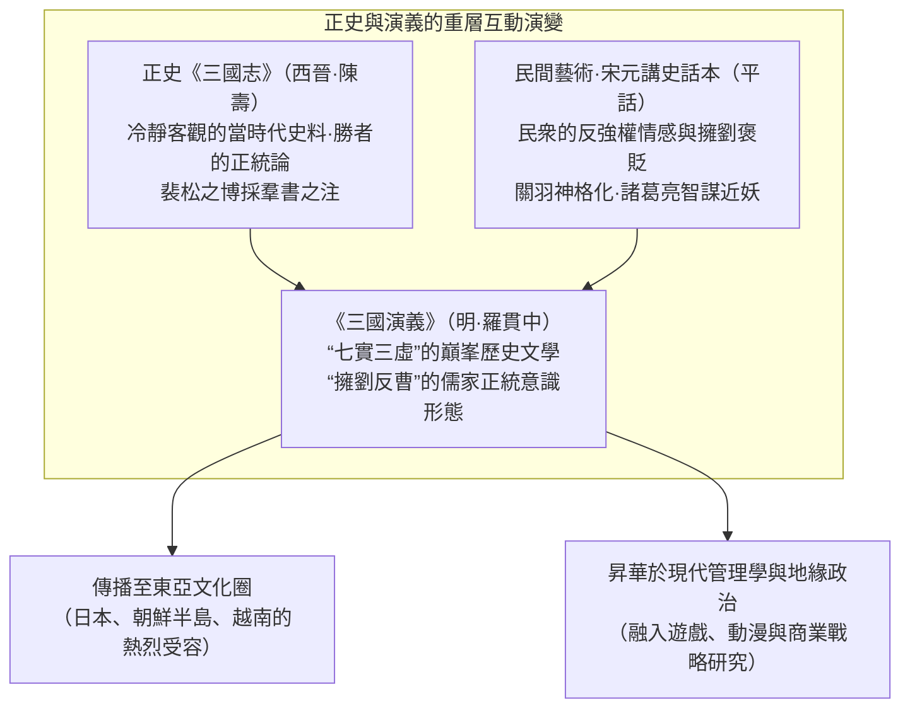
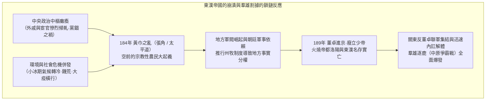
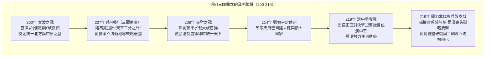
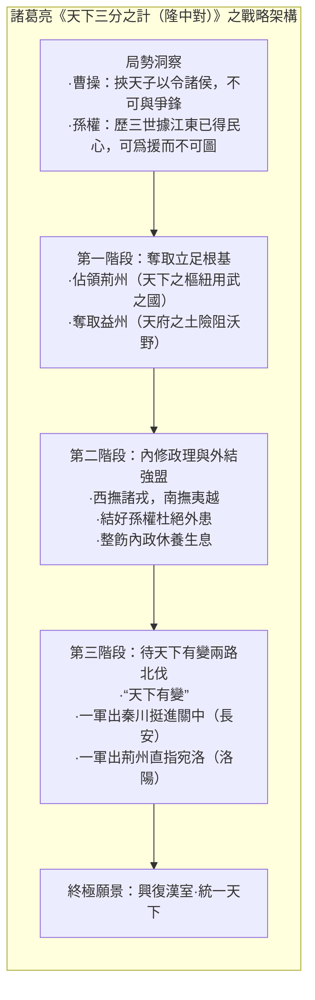
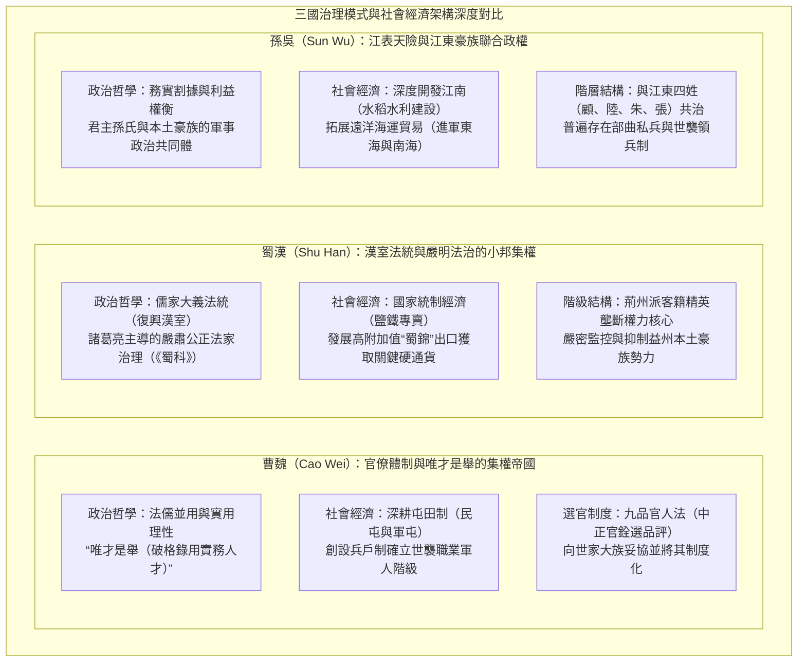

## 序論：爲何“三國志”歷經1800餘年仍令人心馳神往

從公元184年的“黃巾之亂”爆發，到公元280年西晉（Western Jin）平定孫吳、一統天下，歷時將近一個世紀。在歐亞大陸東端廣袤的華夏原野上，這場屬於 **“三國時代（Three Kingdoms period）”** 的興衰更迭大戲，跨越了1800年的漫長時空，至今依舊牢牢吸引着東亞乃至全球無數讀者的求知慾、想像力與澎湃激情。

在中國汗牛充棟的歷代王朝更迭史中，爲何偏偏唯獨這個時代的動盪大分裂，能夠釋放出如此歷久彌新、攝人心魄的文化磁場？

其最核心的根源在於，“三國”這一獨特的文化語境，兼具了由嚴謹實證史料構築的 **歷史實態“正史《三國志》”（西晉·陳壽 著，劉宋·裴松之 注）** ，以及歷經千年民間說唱評話層累堆疊、最終於明代蔚爲大觀的 **歷史演義小說巔峯“《三國演義》（羅貫中 著）”** 這兩重極爲罕見的“重層雙軌結構”。



就歷史事實而言，三國時代是伴隨東漢帝國舊秩序徹底瓦解而來的慘烈亂世，期間伴隨着人口的雪崩式銳減、小冰期的酷寒氣候、頻繁肆虐的饑荒與白骨蔽野的慘烈戰亂。在東漢最鼎盛時期，全國官方編戶人口曾達到約5600萬人；然而到了三國鼎立後期，將魏、蜀、吳三國的戶籍人口相加，也僅剩下約800萬人左右（即便考慮到隱匿戶口、地方豪強廕庇以及流民的存在，當時的社會凋敝與人口銳減也已達觸目驚心的極端程度）。

然而，正是在這種舊有制度崩塌的權力真空與極端殘酷的生存競爭中，衝破陳規陋習與身份門第桎梏的 **“智謀之革新”** 與 **“國家治理模式之實驗”** 得以如雨後春筍般接連誕生：
- 曹操（Cao Cao）打破儒家道德虛名、首開能力至上主義的求賢令（“唯才是舉”），並推行從根本上解決大軍軍糧問題的“屯田制”。
- 諸葛亮（Zhuge Liang）爲弱小勢力吞食龐然大物所量身定製的地緣戰略總藍圖“天下三分之計（隆中對）”，以及令行禁止、嚴肅無私的法家治術。
- 孫權（Sun Quan）憑藉長江天險屏障所開拓的江南大開發，以及面向東海與南海構建海洋商業秩序的早期探索。

更爲關鍵的是，活躍於這一時代的羣雄霸主、參謀軍師、當世名將與無名草莽們所共同演繹的人性心理終極博弈 —— 曹操冷徹的實用理性與深沉孤獨、劉備顛沛流離中的仁義堅守與百折不撓、關羽傲視羣雄的孤高忠義與壯烈悲劇、諸葛亮明知不可爲而爲之的鞠躬盡瘁 —— 最終超越了具體的時代與國界，昇華爲全人類精神譜系中震撼心靈的永恆讚歌。

本文將全景式展開“三國志”這一波瀾壯闊的歷史畫卷。我們不僅停留在對歷史軼事與文學情節的浮泛羅列，而是 **從實證史學、政治思想、軍事地緣學、社會經濟制度以及跨文化受容史等多維全視角展開徹底解剖** 。在客觀釐清正史實態與文學演義之斷層的同時，深入探究那些縱橫馳騁於大亂世之中的英雄們的思想底色與戰略精髓。

---

## 第1章：東漢王朝的落日與羣雄割據的揭幕（184～200年）

三國時代的開端，源於統治華夏世界長達四百年之久的大漢帝國（西漢與東漢）壯烈的體制性自我崩解。一個曾經擁有高度中央集權的大一統帝國，爲何會在極短的時間內喪失政治向心力，並最終淪落至地方豪強林立、軍閥割據混戰的深淵？若探究其深層脈絡，乃是制度疲態、中樞政治腐敗以及全球尺度的劇烈氣候突變相互交織作用的必然苦果。



### 1.1 宦官與外戚專權及“黨錮之禍”：東漢帝國的體制性機能衰竭

東漢王朝（公元25～220年）的中後朝政治格局，陷入了一種近乎無法解脫的致命惡性循環。其根本癥結在於幼衝皇帝的接連即位。

當新登基的皇帝尚在襁褓或年幼無知之時，朝廷大權自然落入皇太后及其孃家族人 —— 即 **“外戚”** 集團的手中。待到幼帝漸次成年，爲了奪回屬於自己的君主親政實權，往往只能轉而依附深居內宮、朝夕陪伴服侍自己的貼身內侍 —— 即 **“宦官”** ，藉助其近水樓臺之便發動宮廷政變，以血腥武力清洗外戚家族。然而，一朝得勢的宦官集團很快便大肆培植私黨、任人唯親，其姻親黨羽在地方州郡搜刮民脂民膏、無惡不作；於是到了下一任幼帝即位時，新一輪的外戚勢力又會再度舉起屠刀清洗宦官 —— 這場浸透鮮血的權力拉鋸戰在洛陽宮廷內周而復始地上演。

面對朝綱敗壞與公器私用，恪守儒家綱常名教的朝廷士大夫官僚與太學（最高國立學府）中的三萬青年學子，發起了聲勢浩大的抗議與抨擊。他們以道德節操自矜，自命爲“清流派”，而將橫暴貪婪的宦官及其附庸輕蔑地斥爲“濁流派”。

然而，深感權力受到威脅的宦官集團先發制人，進讒言操縱皇帝，給這批清流士大夫扣上了“結黨營私、誹謗朝廷、動搖國本”的莫須有罪名，展開了殘酷無情的全方位政治清算。這就是在公元166年與169年兩度發生的 **“黨錮之禍”** 。數以百計的名儒重臣遭受處決或瘐死獄中，數千名太學生與名士被判處終身禁錮（剝奪政治權利並永不敘用）。

黨錮之禍對東漢政權造成了不可逆轉的毀滅性打擊。廣大的地方豪族階層與知識精英羣體對洛陽中央政府徹底喪失了信心與歸屬感，昔日維繫國家統一的道德法統與制度威信蕩然無存。當中央朝廷在士人心目中失去正當性之時，地方豪強武裝化與區域軍閥割據的土壤已然徹底成熟。

### 1.2 氣候寒冷化、饑荒、大疫與“黃巾之亂”

在政治機能全面癱瘓的同時，大自然環境的劇烈變遷則給予了黎民百姓致命一擊。

根據歷史古氣候學與歷史人口學的最新實證研究，公元2世紀後半葉至3世紀的東亞大陸，正步入地質歷史上著名的 **“小冰期（Little Ice Age）”** 降溫週期初期。冬季極寒與夏季連年不絕的特大幹旱、霜凍交替肆虐，黃河與長江流域的農耕生產力遭遇了毀滅性重創。極度營養不良、在饑荒線上掙扎求生的流民羣體，旋即成爲惡性烈性傳染病 **“大疫（現代推測爲斑疹傷寒或天花）”** 的肆虐溫牀。建安文人曹植在其名篇《說疫賦》中留下了慘絕人寰的寫實記錄：“家家有殭屍之痛，室室有號泣之哀。或闔門而殪，或覆族而喪。”

正是在這一人間地獄般的絕望深淵中，來自河北鉅鹿郡的道家方士 **張角（Zhang Jiao）** 登上了歷史舞臺。

張角糅合了黃帝、老子的黃老思想與民間巫覡信仰，創立了極具組織力的新興宗教 **“太平道”** 。他手持九節杖，以符水（唸咒祈禱的神水）爲人治病，引導百姓叩頭悔過，在深受病痛與飢寒折磨的北方流民社會中獲得了狂熱的宗教崇拜。短短十餘年間，數以十萬計的貧苦農人紛紛皈依。張角順勢將信衆改編爲軍事化體制，在全國設立了三十六“方（相當於軍事管轄區）”，大方萬餘人，小方六七千人，密謀在全國範圍內同步發動武裝起義。

起義的核心宣傳口號，便是那首驚天動地的政治讖緯詩：
> **“蒼天已死，黃天當立，歲在甲子，天下大吉”** 

漢室屬火德，漢朝天子所象徵的清平世界（“蒼天”）已然氣數斷絕；取而代之的，應當是順應土德的“黃色之天（黃天）”。而恰逢六十年干支紀年嶄新循環起點的“甲子年” —— 即公元184年，正是推翻舊世界、建立大同盛世的神聖革命之年。

公元184年2月，起義信徒頭裹黃色頭巾，在北方各州郡揭竿而起，史稱 **“黃巾之亂（Yellow Turban Rebellion）”** 。風暴以摧枯拉朽之勢席捲河北、河南、山東等帝國的核心腹地，起義軍焚燒官衙府庫，殺戮貪官污吏，京師洛陽爲之震動。

驚恐萬狀的漢靈帝朝廷急忙派遣皇甫嵩（Huangfu Song）、朱儁（Zhu Jun）、盧植（Lu Zhi）等宿將領精兵分路征剿，同時下詔大赦黨人、解除黨錮，以求挽回士大夫階層的支持。在這場生死存亡的平亂戰火中，曹操、劉備、孫堅等日後叱吒風雲的亂世梟雄，均以討伐軍將領或地方義勇軍首領的身份，首次登上了歷史的大舞臺。

儘管起義的主力部隊隨着張角於同年病故而在官軍的殘酷反撲下迅速瓦解，但其餘部並未徹底消亡，而是化整爲零，演化爲“黑山賊”、“白波賊”等數以十萬計的獨立武裝盜匪集團，在華夏各地持續進行長期的游擊戰。面對徹底失去治安控制能力的天下大亂，東漢朝廷於公元188年採納了宗室劉焉的建議，正式推行 **“州牧制度”** —— 改刺史爲州牧，賦予其統攬一州軍政大權與財政徵稅權的絕對支配力。這一政策本意是爲了強化平叛效率，然而州牧集軍事與行政大權於一身，直接導致地方長官就地蛻變爲完全獨立自主的 **“軍閥（Warlords）”** ，帝國的統一架構由此徹底碎裂。

### 1.3 董卓專政與洛陽化爲焦土：舊秩序的徹底崩塌

公元189年，漢靈帝駕崩，內宮中大將軍何進（He Jin）所代表的外戚勢力與以“十常侍”爲首的宦官集團爆發了你死我活的終極決戰。爲了徹底根除宦官勢力，何進不顧名士勸阻，祕密引誘駐紮在西北涼州邊陲、統領強悍西涼鐵騎的豪強軍閥 **董卓（Dong Zhuo）** 帶兵進逼洛陽。

然而在董卓大軍抵達近郊之前，密謀泄露，何進在入宮時慘遭宦官伏殺。此舉激起了袁紹（Yuan Shao）與曹操等洛陽禁軍青年將領的狂怒，他們率領兵士撞開宮門，對內廷展開了無差別的血腥屠戮，斬殺宦官兩千餘人，皇宮內外血流成河。

在洛陽陷入羣龍無首的絕對權力真空之際，董卓率領如狼似虎的西涼精銳鐵騎從容開進洛陽城。這位兼具邊陲粗鄙與狡黠殘忍的關隴軍閥，以刺刀徹底威懾了洛陽的名門貴胄，悍然廢黜少帝劉辯，改立年幼的劉協爲帝（即漢獻帝），自封爲“相國”，贊拜不名、入朝不趨、劍履上殿，將東漢朝政獨攬於股掌之間。

董卓的倒行逆施與殘暴恐怖統治，成爲了傳統中原士大夫階層無法忍受的奇恥大辱。公元190年，袁紹被推舉爲盟主，關東（函谷關以東）諸郡太守與刺史紛紛起兵響應，組成了聲勢浩大的 **“反董卓聯合軍”** ，曹操、孫堅、袁術、橋瑁、鮑信等一方諸侯盡皆參與其中。

面對關東聯軍的合圍壓力，董卓作出了一個令人髮指的焦土抉擇。他強行驅趕大帝都洛陽城內數百萬人衆遷往關中長安，沿途死者枕藉；同時下令縱火將洛陽數百年來積澱的宏偉宮殿、官衙宗廟、民居市肆悉數化爲灰燼，甚至大肆挖掘歷代漢帝陵寢盜取金玉。這座曾經代表東亞古典文明巔峯的百萬人口大都市，在數日之內徹底化作瓦礫荒煙。

更爲諷刺的是，關東聯軍各路諸侯雖號稱匡扶漢室，實則各懷鬼胎，畏懼西涼軍之兇悍裹足不前，整日在酸棗大營置酒高會、盤算兼併私利。曹操與孫堅雖義憤填膺獨自引兵西進追擊，卻終因寡不敵衆遭遇慘敗。最終，反董聯軍在互相猜忌與地盤爭奪中自行分崩離析。舊帝國賴以維繫的中央法統與政治權威在這一刻徹底灰飛煙滅，弱肉強食、純憑槍桿子說話的 **“羣雄割據時代”** 正式撕下了最後一片溫情脈脈的面紗。

（至於不可一世的暴君董卓本人，則在公元192年的長安宮廷政變中，被司徒王允與其心腹養子 **呂布（Lu Bu）** 設連環計刺殺殞命，其屍體被棄於長安市曹點燃肚臍點燈，殘暴一生落得遺臭萬年。）

### 1.4 中原逐鹿：各路羣雄的興衰浮沉

在舊秩序化爲瓦礫焦土之後，沃野千里的中原（黃河中下游農業核心區）徹底蛻變爲各路梟雄相互殘殺的修羅場。在這場你死我活的錦標賽中，主要的割據勢力格局如下：

- **袁紹（Yuan Shao）** ：出自漢末第一名門“汝南袁氏”，享有 **“四世三公”** 的崇高政治聲望與龐大士大夫門生人脈。他以鄴城爲大本營，在殘酷的北方爭奪中徹底消滅了白馬義從的主人公孫瓚，一舉全據冀州、青州、幽州、幷州等“河北四州”，麾下坐擁十萬步卒、萬餘精騎，成爲當時全天下無可匹敵的絕對霸主。
- **袁術（Yuan Shu）** ：袁紹之從弟（一說異母弟），盤踞淮南富庶之地。在偶然得到孫堅從洛陽廢墟中搜獲的“傳國玉璽”後，政治野心極度膨脹，竟冒天下之大不韙在壽春公然僭越稱帝（國號“仲家”）。此舉瞬間使其陷入天下公敵的萬劫不復之境，最終在四面楚歌中嘔血而亡。
- **孫策（Sun Ce）** ：“江東之虎”孫堅的長子，人稱 **“小霸王”** 。在其父意外戰死後，孫策以傳國玉璽向袁術借兵數千南渡長江，憑藉無與倫比的驍勇戰力和卓越的戰略領袖魅力，在短短數年間以秋風掃落葉之勢平定江東六郡（吳郡、會稽、丹陽、豫章、廬陵、廬江），爲日後的孫吳帝國打下了堅如磐石的立國根基。然而在公元200年，年僅26歲的孫策在外出狩獵時遭遇仇家刺客暗算，傷重不治英年早逝。
- **呂布（Lu Bu）** ：號稱 **“人中呂布，馬中赤兔”** 的天下第一猛將。其人弓馬嫺熟、武藝絕倫，卻唯利是圖、朝秦暮楚，先後背叛弒殺了義父丁原與董卓，輾轉流亡於諸侯之間。他趁劉備與袁術交戰之機反客爲主竊取徐州，最終在公元199年於下邳被曹操與劉備聯軍決水灌城圍困，因部將反叛被俘，在白門樓被曹操下令縊殺。
- **劉表（Liu Biao）** ：身爲“八俊”之一的當世名士、漢室宗親。他單騎入宜城，憑藉荊楚大族蒯氏、蔡氏的支持坐保富庶遼闊的荊州九郡。在北方戰火紛飛的年代，劉表保境安民，招納庇護了數十萬避難的中原士民與學者，開辦學堂絃歌不輟；然而他性格多疑、坐觀成敗，缺乏席捲天下的進取雄心，終究只是一個“守戶之犬”。
- **劉備（Liu Bei）** ：自稱漢景帝之子中山靖王劉勝之後，早年卻貧無立錐之地，淪落至織蓆販履以奉養母親。然而劉備少有大志，與關羽、張飛誓同生死。他先後受陶謙讓徐州，卻又屢次被呂布所奪，終其前半生，先後依附於公孫瓚、陶謙、曹操、袁紹、劉表等人，雖如喪家之犬般四處流亡飄零，卻憑藉其超凡卓絕的 **“人格魅力、仁德信義與堅韌不拔的意志”** ，贏得了海內士庶乃至敵手的高度敬重。

### 1.5 曹操的崛起與“奉迎天子”：政治大義與實用主義的結合

在無數競逐天下的割據軍閥之中，展現出超越時代的戰略遠見與驚人政治手腕的，正是 **曹操（Cao Cao，字孟德）** 。

曹操出身於宦官家庭（其生父曹嵩乃是大宦官曹騰的養子），這一齣身在自命清高的傳統名門世族（如汝南袁氏、弘農楊氏）眼中頗受輕蔑。然而，曹操是一位集非凡的軍事戰略家、冷酷的政治現實主義者以及漢末建安文學最傑出的詩人於一身的曠世奇才。

曹操在兼併中原的進程中，做出的第一個具有歷史分水嶺意義的戰略決斷，便是在公元196年的 **“奉迎天子（挾天子以令諸侯）”** 。
當時，漢獻帝在西涼殘部李傕、郭汜的火併仇殺中歷經九死一生逃出長安，在洛陽斷壁殘垣中衣不蔽體、食不果腹。曹操敏銳地採納了戰略智囊荀彧（Xun Yu）的遠見卓識，力排衆議引兵進駐洛陽，正式護送獻帝遷都至自己的勢力腹地 —— 許昌（今河南許昌）。

這一關鍵佈局，使曹操在政治棋局上瞬間確立了無懈可擊的制高點：
> **“奉天子以令不臣，修耕植以畜軍資”** （《三國志·魏書·毛玠傳》）

自此之後，任何軍閥對抗曹操，便在法統意義上直接淪爲“叛逆大漢皇帝”的亂臣賊子。曹操身爲漢帝國的錄尚書事、司空與大將軍（後官至丞相），得以堂而皇之地借用天子名義簽發全國性的官方詔書，將自己兼併割據勢力的征討行動全部包裝爲“朝廷官軍平定逆黨叛亂”，從而贏得了天下士大夫與民心向背的政治大義名分。

與這一政治頂層設計並行的，是曹操爲了挽救中原崩潰的農業經濟而實施的一項具有劃時代意義的經濟體制改革 —— **“屯田制”** 的大規模推行（公元196年，由棗祗、韓浩等人倡議確立）。

連年戰亂使得中原地區田畝荒蕪、人煙斷絕。曹操下令將無主的拋荒土地收歸國有，招募四處流亡的饑民，由國家統一配給耕牛、農具與種子進行集中開墾，史稱 **“民屯”** 。在收益分配上，使用官牛者官六民四，使用私牛者官民對半。作爲交換，屯田農戶被正式編入獨立的“屯田籍”，免除一切雜稅徭役與地方兵役。

屯田制的實施取得了立竿見影的奇蹟般成效。它使曹操集團不僅迅速安置了數十萬嗷嗷待哺的流民、恢復了中原腹地的社會生產，更從根本上解決了當時困擾所有諸侯的致命死穴 —— “軍糧匱乏”。短短數年間，“得谷數百萬斛，征伐四方，無運糧之勞”，曹操的大軍從此擁有了源源不斷的戰略糧食儲備。

至此，在政治大義（奉迎天子）與物質生產基礎（屯田制）的雙輪驅動之下，實力大備的曹操已然昂首邁向了與北方超級巨人袁紹爭奪天下最高支配權的決戰擂臺。

---

## 第2章：爭霸交鋒與邁向三國鼎立之歷程（200～219年）

從公元200年至219年的短短二十年間，是整個三國曆史上戰略博弈密度最高、最爲波瀾壯闊的黃金歲月。天下大勢在這一階段從羣雄逐鹿的混沌血戰中，急劇收斂、凝結並最終定型爲魏、蜀、吳三大政權的鼎足鼎立。

推動這一時代版圖劇烈重構的，是三場具有決定性意義的空前戰役 —— **“官渡之戰（200年）”** 、 **“赤壁之戰（208年）”** 以及 **“漢中與樊城之戰（219年）”** 。



### 2.1 官渡之戰（200年）：以弱勝強的大規模情報戰與心理戰

公元200年，圍繞中國北方的至高霸權，古代軍事史上最具教科書意義的生死決戰 —— **“官渡之戰（Battle of Guandu）”** 正式爆發。

在黃河兩岸對峙的雙方，實力對比懸殊至極。佔據河北四州的北方霸主 **袁紹（Yuan Shao）** ，統領十萬步兵主力與一萬強悍騎兵，糧草山積、輜重連綿；而迎戰的 **曹操（Cao Cao）** 雖奉戴天子，但實際能夠投入前線的野戰兵力僅有兩三萬人。兵力相差三至四倍，在當時絕大多數世家大族與謀士眼中，曹操的覆滅幾成定局。

戰局初期，袁紹大軍渡過黃河南下，曹操軍依託官渡（今河南中牟東北）築壘固守，雙方陷入了極爲慘烈的拉鋸戰。袁紹軍構築高聳土山，在望樓上以強弩密集俯射曹營，又挖掘地道試圖潛入曹軍堡壘；曹操則展現出卓越的工程戰術應變力，迅速製造了被稱爲“發石車（霹靂車）”的重型投石機轟塌袁軍望樓，並開挖深長壕溝成功截斷了地道。

然而，長期的僵持消耗使得兵力薄弱且糧餉匱乏的曹操軍漸漸瀕臨絕境。軍糧見底、士卒傷疲交加，軍心浮動到了極點。曹操甚至一度在極度動搖中密信留守許昌的荀彧，表達了想要棄守撤軍的退意。荀彧覆信嚴正勸諫：“眼下正是天下用智之時。公以十分之一的弱勢扼守要衝，畫地而守已逾半年，袁紹必將露出致命破綻，此時絕不可退，退則全盤皆輸！”

就在戰局命懸一線的千鈞一髮之際，打破死局的決定性轉折點終於降臨 —— 這是一場關於 **“絕密軍事情報與後勤命脈”** 的致命反轉。

袁紹陣營的重要謀士 **許攸（Xu You）** 因向袁紹獻分兵襲許昌之計未被採納，加之其族人在後方貪贓枉法被審配逮捕下獄，在驚怒絕望之下，許攸於夤夜私逃叛投曹操大營。

得知少年同窗許攸來投，曹操欣喜若狂，甚至“跣足出迎（光着腳跑出營門迎接）”，撫掌大笑。許攸落座後直奔核心，向曹操道出了袁紹軍致命的阿喀琉斯之踵：
> “袁紹大軍的全部糧草與軍械輜重，萬餘車糧食皆屯聚於後方的 **烏巢（Wuchao）** 。守將淳于瓊嗜酒無備、防衛鬆懈。若此刻挑選精騎奇襲放火燒之，不過三日，袁紹數十萬之衆不戰自亂矣！”

曹操展現了頂級統帥的驚人魄力。他當機立斷，親率五千精銳輕騎，將士盡皆佩戴袁軍旗號，人銜枚、馬縛口，趁夜幕潛行繞過袁紹前線嚴密的斥候封鎖線，直撲烏巢。在一場殊死血戰中，曹軍斬殺淳于瓊，將烏巢屯聚的億萬糧草盡數付之一炬。

望着烏巢方向沖天而起的滾滾火光與漫天烈焰，袁紹數十萬大軍瞬間陷入了滅頂般的全面恐慌。更爲致命的是，袁紹派往前線攻打曹操堅壘的猛將 **張郃（Zhang He）** 與高覽見大勢已去，憤而倒戈向曹操投降。袁軍陣線徹底崩潰，袁紹與其長子袁譚僅率八百騎兵倉皇涉水北渡黃河潰逃。

官渡之戰絕非僅僅是一場戰術上的以少勝多。它標誌着：依靠崇高門第出身與龐大兵力優勢、內部卻剛愎自用且傾軋不斷的袁紹貴族門閥集團，在注重真才實學、決策神速、將情報與後勤供應鏈視爲第一要務的曹操近代式實用主義面前遭遇了徹底的降維打擊。此後，曹操趁袁紹病亡之機分化瓦解袁氏殘黨，更於公元207年北征烏桓登白狼山建功，從而徹底達成了 **中國北方（中原與河北）的完全統一** 。

### 2.2 劉備的流轉與“三顧茅廬”：天下三分之計的地緣戰略震撼

在中原與北方大地被曹操強悍無匹的鐵血兵鋒逐步蕩平之際，半生顛沛流離的 **劉備（Liu Bei）** 則寄居在荊州劉表麾下，被安置於邊境小城新野（今河南南陽），日復一日地空耗歲月。年過四旬的劉備在一次如廁時撫摸自己的大腿，不禁黯然淚下，發出了那聲千古喟嘆 —— **“髀肉之嘆”** （嘆息自己髀肉復生、功業未就）。

然而在公元207年，徹底扭轉劉備一生軌跡乃至整個中國歷史走向的偉大邂逅轟然降臨。劉備經名士司馬徽、徐庶的極力推薦，得知在襄陽隆中隱居躬耕着一位年僅27歲的曠世臥龍 —— **諸葛亮（Zhuge Liang，字孔明）** 。

劉備不顧宗室貴胄之尊，放下身段親赴荒野草廬，三度登門求教。這就是家喻戶曉的 **“三顧茅廬（Three Visits to the Thatched Cottage）”** 。正是在這間簡陋幽僻的茅廬之中，諸葛亮爲劉備抽絲剝繭、全景式開陳了一幅恢弘深邃的帝國崛起大棋局 —— 這便是彪炳史冊的千古地緣戰略宏圖 **“天下三分之計（隆中對: Longzhong Plan）”** 。



諸葛亮爲劉備量身打造的這一戰略架構，完全建立在嚴酷清醒的國際政治地緣現實主義基礎之上：
1. **敵友陣營的清醒研判** ：曹操已平定北方、挾天子以令諸侯，佔據絕對政治與軍事實質優勢，此不可與爭鋒；孫權歷經父兄三世經營，深得江東民心民望，此可用爲強援，而萬不可圖謀吞併。
2. **戰略根基的明確鎖定** ：荊州北據漢沔、利盡南海、東連吳會、西通巴蜀，乃是“天下用武之國”，然而劉表守不住這片膏腴之地；益州四周羣山險阻、沃野千里，乃高祖建立漢業的“天然天府之土”，而其主劉璋昏庸闇弱。唯有先行取得荊、益二州作爲立國根基，方能在亂世立足。
3. **兩路出擊的北伐機制** ：在內政修明、安撫西南少數民族、並與東吳結成堅不可摧的外交同盟之後，耐心靜待“天下有變”（北方出現內亂或重大戰略動盪）。一旦良機降臨，命一上將率荊州之軍直指宛城與洛陽，而劉備則親率益州大軍出秦川挺進關中。天下百姓必將簞食壺漿以迎將軍，則大漢江山中興可期！

聽聞此計，劉備只覺撥雲見日、茅塞頓開，由衷讚歎道： **“孤之有孔明，猶魚之有水也！”** 此前只知在戰場上盲目廝殺、顛沛流離的流浪傭兵首領劉備，在獲得了諸葛亮這位曠古絕今的宏觀戰略架構大師之後，終於完成了從一名純粹的草莽武夫向具有明確國家建構藍圖的 **“政治領袖”** 的根本蛻變。

### 2.3 赤壁之戰（208年）：長江水上天塹與天下運勢的分水嶺

隆中戰略藍圖剛剛描繪完畢，歷史的狂暴風雨便接踵而至。公元208年秋，蕩平北方的曹操親統大軍數十萬大舉南下，意欲一戰席捲江南。恰在此時荊州牧劉表病逝，繼位的次子劉琮不戰而降，曹操幾乎兵不血刃接收了整個荊襄水師與重鎮江陵。

倉皇南撤的劉備在當陽長坂坡被曹操五千晝夜兼程三百里的精銳“虎豹騎”追及，遭遇全線潰敗，妻離子散（此役誕生了趙雲於亂軍之中捨命單騎救主劉禪，以及張飛橫矛立馬斷後長坂橋的當陽神話）。

劉備收攏殘兵退守江夏夏口（今湖北武漢），派諸葛亮出使柴桑，會見江東新主 **孫權（Sun Quan）** 。面對江東張昭等多數文官力主開門迎降曹操的龐大投降派壓力，年輕的諸葛亮與江東主戰派核心統帥 **周瑜（Zhou Yu）** 、重臣 **魯肅（Lu Su）** 緊密聯手，向孫權全面陳清了曹操大軍看似龐大實則虛弱的致命命門：
1. 曹軍乃北方陸戰之卒，千里奔波，根本不習長江水戰；
2. 長途遠征勞師襲遠，且深入溼熱的南方水澤，軍中必然爆發毀滅性大疫；
3. 北方馬匹嚴重缺乏飼料草料，漫長補給線極易陷入崩潰。

被徹底激發出昂揚鬥志的孫權，拔出佩劍猛斬案角厲聲喝道：“諸將吏敢復有言當迎操者，與此案同！”隨即正式任命周瑜爲大都督，統帥三萬東吳水軍精銳與劉備所部並肩溯江而上迎戰曹軍。

公元208年隆冬，震古爍今的 **“赤壁之戰（Battle of Red Cliffs）”** 在長江赤壁要隘正式打響。

曹操大軍因北方士卒飽受長江風浪顛簸嘔吐之苦，將數以千計的戰船首尾相連，以粗大鐵鎖與木板相釘固結，號稱“連環戰船”。東吳副都督老將 **黃蓋（Huang Gai）** 敏銳識破此舉蘊含的毀滅性破綻，乃向曹操遞送僞降書，並密備滿載乾燥蘆葦薪柴、灌注膏油易燃之物的輕便蒙衝鬥艦數十艘，藉機直插曹軍水寨。

當這支火船先鋒在東南大風的呼嘯助推下接近曹營時，黃蓋下令全線舉火。烈焰騰空而起的幾十艘火船以不可阻擋的速度狠狠撞向曹軍水寨。被鐵鏈鎖死、動彈不得的曹軍巨大連環戰艦彼此引燃，浩蕩的長江水面在剎那間化作烈焰翻滾的無間火海。風助火勢，烈火迅速蔓延至曹軍沿江連綿數十里的陸上營寨，遮天蔽日的濃煙與大火將夜空燒得通紅，曹軍在水火夾擊與烈性瘟疫中死傷枕藉、土崩瓦解。

曹操在慘敗之下，只能引殘兵敗將狼狽穿越泥濘遍地、屍骨橫陳的華容道，倉皇逃回北方。

赤壁之戰不僅是中國軍事史上最輝煌的水陸協同以弱勝強的大戰，更是 **徹底粉碎了曹操企圖一戰吞併海內之狂妄野心的世界史級關鍵轉折** 。它成功保全了長江中下游的半壁江山，使得諸葛亮在《隆中對》中預言的“天下三分”地緣格局，從一紙假想戰略徹底轉化爲無法逆轉的歷史現實。

### 2.4 益州爭奪戰與漢中攻防戰（211～219年）：蜀漢疆土之確立

赤壁戰後，劉備集團如猛虎出柙，迅速收服荊南四郡（武陵、長沙、零陵、桂陽），終於在天下博弈的棋盤上擁有了夢寐以求的獨立地盤。然而若要將《隆中對》的大藍圖推向極致，吞併西方的超級天府沃土 —— **“益州（四川盆地）”** 便成爲了無法繞過的歷史必然。

公元211年，益州牧劉璋（Liu Zhang）畏懼北方割據漢中的張魯（五斗米道首領）以及曹操西征的巨大軍事威懾，做出了“開門揖盜”的致命誤判 —— 邀請同爲漢室宗親的劉備率兵入蜀助剿張魯。諸葛亮、龐統（Pang Tong）與深知益州虛實的法正（Fa Zheng）力勸劉備抓住千載難逢之良機奪取益州。

劉備雖歷經短暫的道德煎熬，終究下定決心揮戈攻蜀。儘管在此期間遭遇了頂級軍師龐統中流矢殞命落鳳坡的慘痛代價，但歷經數年征戰，諸葛亮、張飛、趙雲分路入川增援，大軍最終於公元214年將成都團團合圍。劉璋見大勢已去，開城出降。至此，劉備徹底將益州沃野盡收囊中。在劉備的文武陣容中，不僅擁有關羽、張飛、趙雲等生死兄弟，更有威震西陲涼州的驍將馬超（Ma Chao）與老當益壯的名將黃忠（Huang Zhong），可謂猛將如雲、謀士如雨，陣容達到了歷史鼎盛。

公元217年，劉備發起了一場決定政權終極生死存亡的浩大戰略攻堅 —— **“漢中爭奪戰”** 。漢中乃是卡在秦嶺與大巴山脈之間的戰略盆地與咽喉命門，若漢中被曹魏長期控制，成都的蜀漢政權便猶如被人將利刃頂在咽喉之上，日夜寢食難安。

在這場歷時兩年的血腥攻防戰中，劉備在首席軍事參謀法正的奇謀帷幄之下，於定軍山之戰中由老將黃忠突襲斬殺了曹魏關隴方面軍最高統帥、名揚天下的征西將軍 **夏侯淵（Xiahou Yuan）** ，使魏軍全線震動崩潰。曹操雖震怒之下親率大軍入漢中爭奪，但劉備斂兵據險、深溝高壘，展開了極致的持久戰與游擊襲擾。補給困難、進退兩難的曹操最終只能留下一聲著名的嘆息 —— **“雞肋”** （食之無肉，棄之有味），飲恨撤出漢中。

公元219年秋，徹底光復漢中全境的劉備，在羣臣將士的盛大勸進下，正式晉位 **“漢中王”** 。從當年一個織蓆販履的窮苦遺胄，到歷經三十年九死一生的血戰流亡，劉備終於挺起脊樑，作爲與北方曹操平起平坐的王者向天下發號施令。蜀漢勢力的聲威在這一刻攀升至最高峯，《隆中對》的最終階段 —— “出秦川與荊州北伐”似乎已然指日可待。

### 2.5 關羽北伐與敗走麥城：痛失荊州與戰略格局的分水嶺

然而，極盛的歡呼背後，往往潛伏着萬劫不復的深淵。就在蜀漢陣營達到巔峯的同一時刻，一場毀滅性的戰略悲劇在大意中轟然降臨。悲劇的源頭，正是獨鎮荊州全軍的主將 —— **關羽（Guan Yu）** 的孤軍北伐。

公元219年，爲配合劉備漢中勝利的戰略策應，關羽率領荊州主力精銳大舉北進，將曹魏中原南部重鎮樊城（今湖北襄陽樊城）團團合圍。恰逢秋季霖雨連綿漢水暴漲，關羽借水勢決堤，不可思議地全殲並俘虜了曹魏名將於禁（Yu Jin）率領增援的“七軍”三萬精銳，並在兩軍陣前毅然斬殺了誓死不降的猛將龐德（Pang De）。

這就是震撼中國歷史的 **“威震華夏”** 。面對關羽如天神下凡般的席捲之勢，驚恐萬狀的曹操甚至召集重臣，一度嚴肅動議將帝國都城從許昌向北遷往黃河以北的河北避其鋒芒。

然而，正是關羽這輝煌至極的勝利，徹底引爆了盟友 **孫權集團最深沉的恐懼與地緣絕望** 。

荊州對於劉備集團而言，是落實隆中兩路出擊的戰略起跳板；但對於偏安江南的孫權而言，長達千里、扼守長江上游的整個荊州掌握在強橫的關羽手中，等於國防咽喉全被別國卡死。周瑜之後繼任都督的 **呂蒙（Lu Meng）** 敏銳地向孫權密奏：“關羽若徹底攻破曹操得志，回過頭來必定圖謀我江東！此刻正是其全軍壓在前線、後方空虛之時，應當趁機直搗其腹心，徹底奪回荊州全境！”

與此同時，關羽雖具備萬夫不當之勇，但性格剛愎自用、傲慢蔑視士大夫。當孫權遣使爲子求娶關羽之女時，關羽非但不念盟誼，反而破口辱罵 **“虎女安肯嫁犬子”** ，使孫權顏面掃地、怒不可遏；此外，關羽在軍中更是殘酷威逼南郡太守麋芳（劉備的小舅子）與將軍士仁，致使荊州後方守臣人人自危。

在曹魏謀士司馬懿（Sima Yi）與蔣濟的縱橫捭闔之下，曹操向孫權遞去了結盟的橄欖枝，承諾將江南合法統治權全面許諾孫權，換取東吳從背後襲擊關羽。

呂蒙設計“託病還建業”，換上名不見經傳的青年才俊 **陸遜（Lu Xun）** 接替防務，以極盡謙卑之詞寫信麻痹關羽。關羽果然中計，放鬆警惕將後方江陵所有的防備守軍全數抽調至樊城前線。

公元219年冬，呂蒙統領精銳水師，將兵士全數僞裝成商賈模樣，搖櫓潛入長江，神不知鬼不覺地拔除了江防所有烽火臺，無血進佔江陵大本營，史稱 **“白衣渡江”** 。早對關羽積怨已久的麋芳與士仁開城投降。

後路全斷、軍心大亂的關羽大軍在一夜之間徹底作鳥獸散。關羽僅率殘兵數十騎被困孤城麥城（今湖北當陽東南），在突圍西奔巴蜀的絕境中遭遇東吳伏兵擒獲。孫權見關羽誓死不降，下令在臨沮將其與長子關平一同處決，並將關羽的首級以木盒盛裝快馬送予曹操。

關羽之死與 **“荊州之徹底淪陷”** ，帶給蜀漢政權的絕非僅是損失一塊地盤與一位頂級統帥，而是 **宣告了《隆中對》宏偉地緣大戰略的永久破產與夭折** 。

從益州與荊州同時出兵合擊中原的雙軌北伐已永遠成爲鏡花水月。蜀漢徹底被壓縮並鎖死在蜀道難於上青天的閉塞四川盆地之內，淪落爲一個人口僅有百萬內陸山地弱國。而劉備在痛失摯愛義弟與半壁江山的血海深仇面前，即將被滔天的悲憤推向一場更具毀滅性的三國終極風暴 —— 夷陵之戰。

---

## 第3章：三國各自的國家形態 —— 制度、經濟與軍事的比較剖析

三國時代絕不僅僅是三位梟雄憑藉個人武力角逐天下的浪漫演義，更是魏、蜀、吳三大政權在各自截然不同的地理環境、人口規模、階層結構與意識形態約束下，在極端殘酷的生存競爭中展開的一場場深刻的 **“國家制度與社會治理模式的綜合實驗”** 。

坐擁中原華夏腹地的 **“曹魏（Wei）”** 、閉鎖於西南崇山峻嶺間的 **“蜀漢（Shu Han）”** ，以及依託浩蕩長江天塹深耕水澤的 **“孫吳（Wu）”** 。通過對這三國在政治制度、經濟命脈、軍事組織以及統治法統層面的立體解剖，方能真正洞察三國曆史何以成爲中國封建中古時代向魏晉南北朝制度嬗變的關鍵樞紐。



### 3.1 曹魏：唯才是舉與制度創新的龐大帝國

公元220年曹操病逝於洛陽，其世子 **曹丕（Cao Pi，魏文帝）** 憑藉強大的軍事後盾與政治謀劃，迅速迫使漢獻帝劉協交出傳國玉璽與皇位，舉行了歷史性的“禪讓”儀式。享國四百餘年的大漢王朝至此在法統上正式終結，國號大 **“魏”** 宣告建立。

在三國鼎立的版圖之中，曹魏所展現的最核心優勢在於其 **“壓倒性的絕對綜合國力（包括人口、耕地面積與物產資源）”** ，以及勇於打破傳統腐朽桎梏的 **“制度重構魄力”** ：

1. **“唯才是舉”與打破門第的實務人事觀** ：
   在兩漢傳統的儒家政治下，官員選拔完全依賴“鄉舉里選（察舉制）”，以“孝廉”、“茂才”等道德風評作爲晉升唯一門檻。這一制度在漢末早已徹底變質爲世家豪門相互標榜、壟斷仕途的政治分贓特權。
   曹操在公元210年、214年與217年三次斷然下達著名的 **《求賢令》（唯才是舉令）** ，公開石破天驚地宣告：“若必廉士而後可用，則齊桓其何以霸世！……今天下得無有至德之人放在民間，及負污辱之名，見笑之徒，或不仁不孝而有治國用兵之術者？各衰其所知，勿有所遺。”這一極具革命性的用人觀徹底打破了虛僞的道德綁架，使得郭嘉（Guo Jia）、賈詡（Jia Xu）、程昱（Cheng Yu）等行事不拘禮法卻具通天徹地之能的頂級策士得以重用；更使張遼（Zhang Liao）、徐晃（Xu Huang）、張郃等敵對陣營的降將得以躍升爲獨當一面的戰區最高統帥。

2. **從“屯田制”到“兵戶制”的常備軍體制化** ：
   由曹操肇始的屯田制，在曹魏立國後進一步從安置難民的“民屯”深化爲前線守備部隊的 **“軍屯”** 。尤其在淮南與襄樊的對吳對蜀最前線，大規模軍屯使得大軍實現了“且耕且守”，無需勞師千里向邊境運糧，極大減輕了國家財政負擔。此外，曹魏在法制上將職業軍人階層從普通編戶齊民中剝離，創設了軍籍世襲、待遇獨立的 **“兵戶制”** ，從而建立了一支隨時可調動、受國家絕對掌控的職業常備野戰軍。

3. **“九品官人法（九品中正制）”的創制與貴族化演變** ：
   公元220年曹丕代漢登基之時，爲了換取以司馬氏、陳氏、崔氏等中原頂級世家大族對新王朝法統的政治支持，採納了吏部尚書 **陳羣（Chen Qun）** 的建言，正式創立了 **“九品官人法”** （亦稱九品中正制）。
   該制度在各州郡設立掌管人才品評的“中正官”，綜合人物的家世出身與行狀才幹，將士人劃分爲一品至九品共九個等級（一品基本虛設，二品爲極貴之“上品”），朝廷據此等級任命相應層級的官爵。這一制度在推行初期成功恢復了國家選官機制的秩序，但由於中正官很快被各大門閥家族所壟斷，最終無可避免地淪爲了門閥貴族鞏固自身特權的制度護城河，演變出後世西晉與南北朝時期所謂 **“上品無寒門，下品無勢族”** 的固化貴族階級社會。

### 3.2 蜀漢：秉持法家精神與正統大義的西南小邦

由於關羽兵敗痛失荊州，劉備爲了延續漢室正朔、對抗曹丕代漢建魏的非法僭越，於公元221年在成都正式即皇帝位。爲昭示自身作爲兩漢四百年基業的唯一合法繼承人，其正式國號自始至終皆爲 **“漢”** （史稱蜀漢或蜀）。

然而，橫亙在蜀漢政權面前的殘酷現實，是其 **“疆域與人口規模的極度弱小”** 。與坐擁天下七成人口（四百萬人以上）的中原曹魏相比，蜀漢退守益州一隅與南方蠻荒瘴癘之地，全國在冊編戶戶口 **僅約二十八萬戶、人口不過九十四萬人** ，常備正規兵力僅維持在十萬人上下（魏國的四分之一至五分之一）。

面對如此懸殊的國力死局，作爲蜀漢政權實際最高行政執政長官的丞相諸葛亮，斷然拋棄了浮誇的儒家空談，轉而採取了極其強悍冷徹的 **“法家治術（法治主義）”** 強國路線。

1. **以法治蜀與嚴肅無私的制度統御（《蜀科》的頒行）** ：
   正史《三國志·諸葛亮傳》中，西晉史家陳壽對諸葛亮的治蜀政績給予了登峯造極的高度評價：
   > **“科條具備，權制以開，情僞盡達。心平而理明，善無微而不賞，惡無纖而不貶。庶事精煉，物理其本，循名責實，虛僞不齒。終於邦域之內，鹹畏而愛之，刑政雖峻而無怨者。”**
   諸葛亮親自與法正、李嚴、伊籍、劉巴共同制定了蜀漢立國根本法典 **《蜀科》** 。他打破漢末巴蜀豪族橫行無忌、兼併土地的放任風氣，無論是何等勳舊重臣，觸犯律法皆絕不寬貸（如李嚴、廖立之廢黜，馬謖之被斬）；而凡有寸功於國者，縱使出身寒微亦破格提拔。這種清廉、嚴明、透明且一視同仁的現代式法治作風，贏得了蜀中百姓深沉的敬畏與由衷愛戴。

2. **國家高度壟斷統制經濟：蜀錦專營與鹽鐵專賣** ：
   爲了支撐常年跨越崇山峻嶺艱苦北伐所需的龐大軍事開支，諸葛亮對蜀漢經濟展開了徹底的國家管制化改造：
   - **“蜀錦”的國家壟斷與創匯工業** ：四川成都自古以產織錦名揚天下。諸葛亮在成都設立專管機構（錦官城），由官府嚴格把控蠶桑養殖、織造工序與質量標準。由於蜀錦工藝登峯造極，魏、吳兩國的王公貴族競相高價求購，甚至與敵國曹魏之間形成了規模龐大的走私與民間通商網絡。蜀錦的對外輸出爲蜀漢賺取了數以萬計的黃金、白銀、銅幣與戰略物資，諸葛亮曾直言不諱：“今民貧國虛，決敵之資，唯仰錦耳。”
   - **鹽鐵全面收歸官辦專賣** ：效仿漢武帝時期的財政戰時體制，將四川盆地利潤豐厚的井鹽提煉與冶鐵產業從地方豪強手中全部收歸國家專賣，徹底剷除了地方豪族的經濟獨立割據傾向，完成了小國體制下戰時經濟資源的高度中央集權。

3. **統治集團的深層結構性斷層：荊州客籍集團 vs 益州土著豪族** ：
   然而，蜀漢政治架構內部自始至終埋藏着一顆難以拆除的定時炸彈：以劉備、諸葛亮、蔣琬、費禕爲核心的 **“荊州客籍官僚外來政權”** 牢牢壟斷了朝廷的核心軍政要職，而人數佔絕大多數的 **“益州本土世家大族”** （以譙周爲代表的本土士族）則長期受到政治邊緣化與嚴密防範。這一深層次的地緣政治與階層利益裂痕，隨着數度北伐的勞師無功而不斷加劇，最終爲四十年後蜀漢末期益州本土派官員集體主導“不戰而降”埋下了致命伏筆。

### 3.3 孫吳：長江天險與江東豪族聯合政權

在赤壁挫敗曹操、又襲殺關羽徹底吞併荊州全境之後，孫權全據了揚州、荊州中南部以及交州的廣袤水系。公元222年孫權受曹丕封爲“吳王”，並最終於公元229年在武昌（後遷都建業，今江蘇南京）正式登基稱帝，國號 **“吳”** （史稱孫吳或東吳）。

孫吳政權的本質特徵，既不同於曹魏高度成熟的集權官僚帝國，亦不同於蜀漢法統至上的戰時法治小國，而是一個由君主（孫氏宗族）與南方盤根錯節的本土頂級豪門所共同組成的 **“君主與江東豪族聯合政權”** 。

1. **與“江東四姓”共治天下的政治同盟** ：
   在三吳與江東故地，自古盤踞着以 **“顧、陸、朱、張”** 爲首的四大世家豪族（“江東四姓”）。他們不僅擁有廣袤無垠的莊園田產，更在宗族鄉里中擁有極高的門望聲譽。
   作爲淮泗外來軍閥的孫堅、孫策父子早年曾以鐵腕手段暴力鎮壓江東本土豪強，造成了嚴重的血腥仇殺。而深諳政治妥協平衡術的孫權掌權後，迅速改弦更張，主動採取“通婚聯姻與政權分享”的共治路線。孫權將吳郡陸氏的核心領袖 **陸遜（Lu Xun）** 拔擢爲全國最高軍事大都督、後拜爲丞相，使江東豪族全面融入孫吳的核心決策層，形成了“孫氏政權與江東豪族榮辱與共”的利益聯合體。

2. **“部曲私兵制”與“世襲領兵制”的鬆散分權構架** ：
   與曹魏國家統一調配軍戶的中央常備軍不同，孫吳的軍事制度具有極其鮮明的分權宗族色彩。孫吳的列位將領奔赴沙場，其麾下的作戰骨幹往往是由自家宗族子弟、依附農民與家奴構成的私兵武裝 —— **“部曲”** 。
   朝廷授予將軍官職的同時，往往劃撥一塊封地（復客或奉邑）由其徵收賦稅贍養私兵；若統帥戰死或病故，其所屬的部曲軍隊與軍官職位，依法由其親生兒子或親弟世襲繼承（即 **“世襲領兵制”** ）。
   這一制度使得孫吳在本土防衛作戰中展現出極其可怕的凝聚力 —— 將士們是爲了保衛自己的身家性命與世襲私產而與敵拼死血戰；然而一旦孫權企圖集結大軍北伐中原，豪族大將們因顧慮自身私兵的戰損折耗往往互相觀望、出工不出力。這就是孫吳在整個三國時代始終呈現 **“外戰外行、內保內行”** 獨特戰爭態勢的制度根源。

3. **江南的大規模農業拓荒與面向海洋的大航海先聲** ：
   在整個中國歷史發展的宏觀座標系中，孫吳王朝留下的最不可磨滅的深遠貢獻，在於其開創了中國經濟重心由黃河流域向長江流域轉移的“江南大開發”：
   - **水稻水利灌溉與“山越”的編戶同化** ：通過大興農田水利、排幹澤地沼澤，使得昔日“地廣人稀、飯稻羹魚”的江南溼地逐步蛻變爲稻麥豐盈的富庶糧倉。與此同時，陸遜、諸葛恪等統帥深入浙西與皖南崇山峻嶺，徹底平定了頑抗數代、依託險阻的山地土著武裝 **“山越”** ，將數十萬山越人口強行遷徙出山，安置於平原沃土轉化爲國家編民，其中精壯者數十萬被編入吳軍精銳，極大充實了江南的勞動力與兵源。
   - **經略東海與遠洋南海海上貿易** ：憑藉領先歐亞的精湛水師造船工業與海航戰艦技術，公元230年，孫權派遣將軍衛溫、諸葛直統領載有萬餘名將士的大型遠洋船隊出海遠航，成功航抵並巡弋了 **“夷洲（即今中國臺灣）”** 與亶洲，寫下了中國正史中央王朝跨海開拓經略臺灣的最早官方文獻實錄。同時，孫吳船隊以交趾（今越南北部）爲跳板，遠涉中南半島、馬六甲海峽乃至南亞印度洋沿岸，開闢了繁榮的海上絲綢之路商貿航線。

```
【魏·蜀·吳 三國綜合國力與制度深度對比表（公元260年前後）】
```

| 對比維度 | 曹魏（Cao Wei） | 蜀漢（Shu Han） | 孫吳（Sun Wu） |
| :--- | :--- | :--- | :--- |
| **法定首都** | 洛陽（Luoyang） | 成都（Chengdu） | 建業（Jianye: 今江蘇南京） |
| **疆域版圖範圍** | 中原、河北、山東、山西、陝西、淮南、遼東（佔全天下約60%面積） | 益州全境（四川盆地、漢中、雲南、貴州及川西南部高原） | 揚州、荊州南部、交州（長江中下游平原、浙江、福建、兩廣、越南北部） |
| **官方編戶戶數·人口** | **約66萬戶 / 約440萬人** （佔三國官方總人口約60%） | **約28萬戶 / 約94萬人** （佔三國官方總人口約13%） | **約52萬戶 / 約230萬人** （佔三國官方總人口約27%） |
| **常備軍事兵力** | **約40萬～50萬人** （精銳中原步騎兵、烏桓與鮮卑突騎） | **約10萬人** （精銳山地突擊步兵、連弩兵、白毦兵） | **約23萬人** （無敵長江樓船水師、山越精兵、世襲部曲） |
| **核心政治思想·政體** | 崇尚法儒雜糅與功利實用主義，高度集權官僚帝國體制 | 恪守漢室正統大義名分，推行嚴明公正之法家法治（《蜀科》） | 君主與江東門閥豪族聯合執政，分權式利益均沾共同體 |
| **核心官員選拔制度** | **九品官人法** （州郡中正官評定九等門第才德）、唯才是舉求賢令 | 諸葛亮丞相府嚴加拔擢、循名責實、依科律嚴明考課賞罰 | 依賴江東四姓等豪強門生薦舉、部曲與兵權父子世襲 |
| **支柱經濟與物質命脈** | 華北旱作麥糧生產、 **屯田制（民屯與軍屯體系）** 、北方官鹽與冶鐵 | 天府都江堰水稻農業、 **官辦蜀錦出口創匯（錦官城）** 、西南天然井鹽 | 江南水網圍墾開發與水稻種植、 **遠洋海運及南海香料珍珠商貿** 、海鹽 |
| **核心地緣地勢優勢** | 坐擁天下人口與糧食絕對重心，關東平原迴旋空間廣闊，騎兵機動無敵 | 四川盆地劍門蜀道天險阻絕，“一夫當關萬夫莫開”之天然防衛絕地 | 萬里長江滾滾水塹屏障，北方鐵騎難渡，獨霸南方內河與近海制海權 |
| **體制性脆弱致命短板** | 中正官被世家大族壟斷導致皇權漸次架空，最終釀成司馬氏兵變奪權 | 人口基數與戰略資源極度匱乏，荊州客籍派與益州本土派暗流洶湧 | 宗族私兵世襲領兵制導致將領各自保全私利，對外北伐嚴重缺乏向心力 |

---

## 第4章：諸葛亮的遺志與三國的暮年黃昏（220～280年）

在三國鼎立的均勢徹底固化之後的後半個世紀，那些叱吒風雲的開國英雄們相繼退出了歷史舞臺，取而代之的，是冷酷無情的現實國力差距與體制疲勞對國家命運的吞噬。

貫穿這一“三國黃昏”時期的核心雙重主線，其一是蜀漢丞相 **諸葛亮（Zhuge Liang）** 抱定“鞠躬盡瘁，死而後已”的鋼鐵意志所展開的悲壯北伐；其二則是中原霸主曹魏政權內部由 **司馬氏家族（Sima clan）** 所悄然推展的軍事政變與皇權篡奪悲喜劇。

### 4.1 劉備的復仇之役與夷陵之戰（222年）：白帝城託孤

公元221年，剛剛在成都稱帝的劉備做出了其登基之後的首個最高國家戰略決斷 —— 悍然不顧諸葛亮、趙雲等核心重臣的泣血苦諫，舉傾國之兵發起旨在徹底討滅孫吳政權的 **“東征伐吳之役”** 。

失去結義生死兄弟關羽的個人滔天痛楚，與丟失荊州導致《隆中對》戰略腰斬的地緣焦躁，將年過六旬的劉備徹底吞沒。禍不單行的是，大軍誓師前夕，另一位結義兄弟張飛（Zhang Fei）又在閬中營中因暴虐士卒遭部將范強、張達刺殺，身首異處。然而被悲慟徹底激怒的劉備已無法止步，他親統四五萬蜀漢百戰精銳順長江三峽而下，以排山倒海之勢殺入東吳境內。

戰役初期，劉備軍勢如破竹，連拔吳軍多處關隘，長驅直入佔領沿江數百里峽谷要地。危急關頭，孫權再度力排衆議，任命年僅三十九歲的鎮西將軍 **陸遜（Lu Xun）** 爲大都督，全權節制前線各路吳軍。

面對蜀軍洶湧澎湃的進攻銳氣，陸遜展現出驚人的定力與堅忍，採取了極致的 **“後發制人·持久消耗戰略”** 。
他嚴令吳軍諸將堅守險要城寨，任憑蜀軍百般辱罵挑戰，絕不輕出浪戰。時值盛夏，長江三峽深山中酷熱難耐、瘟疫漸生。爲了避開難當的酷暑，缺乏大兵團平原會戰經驗的劉備做出了極其致命的陣法佈置 —— 依傍茂密山林樹蔭，在長江南岸狹長峽谷中將大軍營寨首尾相連綿延達七百里之遙，結成著名的“連營”。

這正是陸遜苦熬數月等待的致命死穴。
公元222年6月的一個狂風大作之夜，陸遜嚴令全軍將士各持一束茅草與引火之物，自水陸兩路對劉備七百里連營實施 **“全面火攻奇襲”** 。順風呼嘯的滔天烈火瞬間將蜀漢各營燒成一片連綿火海，彼此無法相顧。退路被斷的蜀軍在崇山峽谷中自相踐踏、墜崖投水，數萬百戰精銳在頃刻間灰飛煙滅，將領督郵死傷無數。

劉備在精銳侍衛的拼死護衛下倉皇突圍，萬幸逃入長江要隘白帝城（今重慶奉節）。這就是古代戰史上最具轉折意義的陸戰巔峯之一 —— **“夷陵之戰（Battle of Yiling）”** 。

慘敗的重創、將士全殲的自責與急火攻心，使得老邁的劉備在白帝城徹底病入膏肓。公元223年4月，劉備將丞相諸葛亮從成都緊急召至白帝城病榻前，留下了那段震撼千古的絕唱遺囑 —— **“白帝城託孤”** ：
> **“君才十倍曹丕，必能安國，終定大事。若嗣子可輔，輔之；如其不才，君可自取！”**

在一個極度講求君臣父子綱常的東方封建皇權社會，一位開國帝王竟在臨終之際坦然對臣子言明“如嗣子不才君可自取（你可自行取而代之稱帝）”，此等信任與器量古今未有。聞聽此言，諸葛亮淚流滿面、以頭搶地叩首至額頭滲血，泣血立誓：
> **“臣敢竭股肱之力，效忠貞之節，繼之以死！”**

一代梟雄劉備就此長辭人世，年僅十七歲、資質平庸的後主劉禪（Liu Shan）在成都即位。蜀漢元氣大傷、精兵盡喪、四周強敵環伺，復興大漢江山的全部萬鈞重擔，從此全數壓在了諸葛亮一人那瘦削的雙肩之上。

### 4.2 諸葛亮南征（“攻心爲上”）與千古名篇《出師表》

主少國疑、大敗初定，諸葛亮執掌丞相大權後的第一着妙棋，便是遣使鄧芝出訪東吳，向孫權講明“脣齒相依”的存亡之道，成功打破堅冰，全面 **“修復了蜀吳軍政同盟”** 。

緊接着，諸葛亮必須騰出手來徹底拔除腹心之患 —— 劉備夷陵兵敗後在南中地區（今雲南、貴州及四川南部）由豪強雍闓、高定與蠻夷部落掀起的全面大叛亂。
公元225年，諸葛亮親率大軍深入瘴癘遍佈的南中平叛。誓師之際，參軍馬謖（Ma Su）向諸葛亮進獻了一段閃爍着軍事心理戰曠世智慧的名言：
> **“夫用兵之道，攻心爲上，攻城爲下；心戰爲上，兵戰爲下。願公服其心而已。”**

諸葛亮對這一戰略精髓心領神會並貫徹始終。在生擒南蠻核心首領 **孟獲（Meng Huo）** 之後，諸葛亮並不殺戮，而是帶其檢閱蜀軍營陣後從容將其釋放，聽憑其招兵買馬再戰。歷經“七擒七縱”的反覆較量，當孟獲第七次被生擒時，終於跪倒在地、感激涕零地由衷服輸：“公，天威也！南人決不再反矣！”

在徹底平定南中之後，諸葛亮採取了極爲高明的“不留兵、不留官”的民族羈縻自治方略，委任當地少數民族渠帥自我治理。這一卓越的戰後和解不僅消除了蜀漢的後顧之憂，更爲蜀漢源源不斷地輸送了南中的黃金、白銀、良馬、丹漆與極其勇猛善戰的“無當飛軍”少數民族精銳步卒，爲北伐提供了關鍵的兵資血脈。

公元227年，後方安定、兵精糧足的諸葛亮終於下定決心，正式開啓其畢生終極宿願 —— **“大舉北伐曹魏”** 。在提兵移駐漢中前線之際，諸葛亮向後主劉禪遞呈了那篇千古流芳的抒情表文典範 —— **《出師表（前出師表）》** ：
> “先帝創業未半而中道崩殂，今天下三分，益州疲弊，此誠危急存亡之秋也……臣本布衣，躬耕於南陽，苟全性命於亂世，不求聞達於諸侯。先帝不以臣卑鄙，猥自枉屈，三顧臣於草廬之中……受任於敗軍之際，奉命於危難之間，爾來二十有一年矣！”

字字泣血、句句含淚。後世學者由衷感嘆：“讀《出師表》而不落淚者，其人必不忠！”

### 4.3 浩蕩北伐的軌跡（228～234年）：隕星墜落五丈原

從公元228年春至234年秋，諸葛亮以驚天地泣鬼神的堅韌意志，接連發起了五次曠日持久的大規模 **“北伐曹魏（Northern Expeditions）”** 。

在敵我雙方國力對比達到四比一甚至五比一的絕對劣勢之下，諸葛亮爲何偏要執拗地傾全國之力攻打強盛的北方大帝國？正是在《後出師表》中，諸葛亮道出了其震撼人心的攻勢戰略防禦哲學：“漢賊不兩立，王業不偏安！……以先帝之明，量臣之才，固知臣伐賊，才弱敵強也。然不伐賊，王業亦亡；惟坐而待亡，孰與伐之？”小國若畫地自限、貪圖苟安，與大國的國力鴻溝只會越拉越大，最終必然坐以待斃；唯有持續發動積極進取的戰略進攻，方能在運動戰中製造破綻、謀求死中求活。

```
【諸葛亮五次北伐全景軌跡考】
·第一次北伐（228年春）：出其不意大出祁山，天水、南安、安定三郡望風歸附，收得大將姜維。然而命馬謖守街亭，馬謖違規舍水紮營被魏將張郃大破失守，全軍被迫撤回漢中。諸葛亮斬馬謖自貶三等，“揮淚斬馬謖”。
·第二次北伐（228年冬）：出散關圍攻陳倉二十餘日，遭遇曹魏名將郝昭以火箭、滾木築造的銅牆鐵壁阻擊，糧盡而退，斬殺追擊之魏將王雙。
·第三次北伐（229年春）：派遣陳式成功攻佔武都、陰平二郡，遏制氐、羌各部，穩固蜀漢西北邊防屏障。
·第四次北伐（231年春）：首次投入劃時代運輸工具“木牛”，再出祁山，於上邽割麥並正面擊破司馬懿大軍。後因大雨連綿導致李嚴運糧不濟僞造聖旨召回，蜀軍被迫撤軍，在木門道伏弩射殺曹魏名將張郃。
·第五次北伐（234年春）：投入“流馬”，率十萬大軍出斜谷，進駐渭水南岸之五丈原（今陝西寶雞岐山縣）。諸葛亮在此立足屯田，決心與司馬懿展開三年以上的大規模長期戰。
```

阻遏蜀軍北伐的最大夢魘，從來不是曹魏大軍的刀劍，而是 **“橫亙在關中與漢中之間那艱險至極的秦嶺崇山峻嶺與後勤運糧物理極限”** 。蜀軍兵士往往有一半的人力需要消耗在漫長的懸崖棧道上運糧，往往尚未抵達前線糧草已在半路喫盡。爲了破解這道物流魔咒，諸葛亮展現出卓越的工程發明智慧，製造出了名垂青史的 **“木牛”** 與 **“流馬”** —— 專爲極其狹隘的山道棧道量身定製的單輪手推車及聯動機械裝置，極大提升了山區長途運輸效率。

公元234年，諸葛亮在 **五丈原（Wuzhang Plains）** 依渭水紮下連營，令將士與關中百姓“雜耕於野、軍民相安”，徹底擺脫了糧荒瓶頸。

面對諸葛亮展現出的壓倒性軍陣威懾，曹魏軍政統帥 **司馬懿（Sima Yi，字仲達）** 選擇了最極端的深溝高壘“不戰之策”。任憑諸葛亮如何佈陣挑戰，司馬懿堅閉營門不出；即便諸葛亮派使者送去婦女所用的裙裾首飾（巾幗之贈）百般羞辱其怯懦如女子，司馬懿亦泰然受之，反而和顏悅色地向蜀漢使者探詢諸葛亮平日的起居勞作：“諸葛公寢食如何？事物煩簡如何？”當得知孔明“夙興夜寐，罰二十以上皆親覽，食不過數升”時，司馬懿斷然斷言：“孔明食少事煩，其能久乎！”

這句殘酷的預言不幸言中。由於經年累月的事必躬親與心力交瘁，諸葛亮的身體徹底垮掉了。公元234年8月23日深夜，秋風蕭瑟的五丈原軍帳之中，這位鞠躬盡瘁的一代名相溘然長逝，享年僅五十四歲。

臨終前諸葛亮縝密佈置撤軍方略，全軍密不發喪、整肅退兵。待司馬懿察覺追趕時，蜀軍突然回旗反擊、擂鼓整肅，司馬懿疑心孔明未死有埋伏，驚駭之下倉皇勒馬撤退。由此在民間留下了那句千古戲謔之語 —— **“死諸葛走生仲達”** 。

諸葛亮未能達成光復漢室、還於舊都的壯志。然而，他那光明磊落的操守、冰清玉潔的廉潔以及知其不可而爲之的獻身精神，使其光芒徹底壓倒了同時代所有功成名就的勝者，成爲了東方文明殿堂中一座萬古仰止的最高人格豐碑。

### 4.4 曹魏的內部崩潰與司馬氏的篡奪

諸葛亮這位生平最強勁敵的離世，並未帶給曹魏帝國真正的和平，相反，魏國核心政局隨即陷入了空前激烈的內部權力地震與篡奪風暴。

魏明帝曹叡英年早逝後，年僅八歲的幼帝曹芳即位。朝廷指定由宗室代表大將軍 **曹爽（Cao Shuang）** 與四朝宿將太尉 **司馬懿** 共同輔政。

曹爽上臺後大肆排擠中原元老世家大族，將權力收攏於何晏、丁謐等親信手中，驕奢淫逸、僭越無度；並明升暗降將司馬懿排擠爲無兵權的“太傅”。面對政治迫害，老謀深算的司馬懿選擇了長達十年的僞裝隱忍 —— 他託病閉門謝客，在曹爽派人窺探時裝出一副耳聾眼花、兩手顫抖喝粥流胸、不久於人世的癡呆病態，徹底麻痹了曹爽集團。

公元249年正月，趁曹爽兄弟護送幼帝曹芳離開洛陽前往城外祭掃高平陵之機，七十歲高齡的司馬懿在洛陽城內暴起發動武裝政變，史稱 **“高平陵之變（Incident at Gaoping Tombs）”** 。司馬懿迅速關閉城門，奪取洛陽武庫，並指洛水爲誓許諾保全曹爽爵祿富貴。然而待曹爽交出兵權投降後，司馬懿翻臉無情，以謀反大逆之罪將曹爽及其心腹黨羽盡數夷滅三族，曹魏軍政大權自此徹底被司馬氏家族獨攬。

司馬懿死後，其長子 **司馬師（Sima Shi）** 、次子 **司馬昭（Sima Zhao）** 相繼掌權，曹氏皇族徹底淪爲提線木偶。公元260年，不堪受辱的魏帝高貴鄉公曹髦拔劍發出了那句載入史冊的吶喊 —— **“司馬昭之心，路人所知也！”** 曹髦親率數百宮廷童僕侍衛駕車衝向司馬昭相府，卻在皇宮宮門前被司馬昭心腹成濟在光天化日之下弒殺於車前。曹魏王朝的氣數在這一刻已然徹底散盡。

### 4.5 三國的滅亡與西晉一統天下（263～280年）

司馬昭在徹底取代曹魏皇權稱帝之前，急需建立一件無可動搖的蓋世軍功以堵天下悠悠之口 —— 那便是 **“徹底消滅西南的蜀漢”** 。

彼時的蜀漢，後主劉禪寵信宦官黃皓，朝政日益昏聵腐敗；諸葛亮的入室親傳弟子 **姜維（Jiang Wei）** 雖先後發動了十一次矢志不渝的悲壯北伐，卻因蜀中民力枯竭、朝中奸佞阻撓而收效甚微，國力已然瀕臨絕境。

公元263年，司馬昭命鎮西將軍鍾會（Zhong Hui）與征西將軍 **鄧艾（Deng Ai）** 兵分三路，統領十八萬大軍泰山壓頂般南征伐蜀。姜維以驚人的戰術指揮，退守至天險難越、峭壁千仞的 **“劍閣（Jiange）”** ，將鍾會十萬主力大軍死死阻截在絕壁之外，魏軍糧道斷絕幾乎意欲退兵。

就在戰局膠着的關頭，老將鄧艾做出了中國古代戰史上堪稱奇蹟的神來之筆 ——
鄧艾挑選精銳士卒，兵行絕險，毅然率部踏上了斷崖聳立、毫無道路可尋的 **“陰平絕險（Yinping）”** 。在長達七百里的無人荒山野嶺中，鄧艾身先士卒裹着毛氈滾下千丈懸崖，將士攀藤附葛歷盡九死一生，神兵天降般奇蹟般出現在了蜀漢縱深腹地江油與綿竹，一舉斬殺諸葛亮之子諸葛瞻父子。

面對突然逼近成都城下的鄧艾神兵，早已厭戰的成都朝廷陷入崩潰般的恐慌。在益州本土派學者譙周（Qiao Zhou）等人的力勸下，後主劉禪自縛出城面縛請降。 **公元263年，享國四十三年的蜀漢政權正式覆滅。**

公元265年，司馬昭病故，其長子 **司馬炎（Sima Yan，晉武帝）** 依樣畫葫蘆迫使魏帝曹奐禪讓帝位，正式改國號爲 **“晉”** （史稱西晉），曹魏壽終正寢。

而最後的偏安政權孫吳，則在末帝 **孫晧（Sun Hao）** 極其殘暴嗜殺的暴虐統治下陷入了全面的分崩離析。公元280年，西晉武帝司馬炎起水陸大軍二十萬分六路大舉伐吳。名將杜預自襄陽出師勢如破竹（成語“破竹之勢”之典故），而益州水軍統帥 **王濬（Wang Jun）** 率領由數萬工匠在四川打造的巨無霸戰艦羣順流直下，以巨型松脂大筏順江漂流將東吳橫截長江的巨大熔鐵鎖鏈全數燒斷消融。晉軍鉅艦兵臨建業城下，孫晧面縛輿櫬出降。

從公元184年的黃巾起義算起，歷經 **長達九十六年** 的慘烈割據征伐，山河破碎、羣雄並起的三國紛爭時代，最終伴隨着孫吳的覆亡與西晉的崛起，重新復歸於大一統的華夏版圖之中。

---

## 第5章：正史《三國志》vs《三國演義》 —— 虛構與史實的鴻溝

當代全球讀者所熟知津津樂道的三國人物與傳奇故事，有九成以上實際上源自十四世紀元末明初小說巨匠 **羅貫中（Luo Guanzhong）** 所編撰的長篇歷史章回小說 **《三國演義（Romance of the Three Kingdoms）》** 。

然而，若以嚴肅的現代實證史學之解剖刀加以審視，其間存在着令人震撼的“虛構與史實斷層”。正如清代著名史家章學誠在《文史通義》中所下的精確斷語 —— **“七分實事，三分虛構（七實三虛）”** 。《三國演義》在整體上嚴格維繫了正史的歷史大框架與政治地理軌跡，卻在具體的戰役細節、人物心理、道德陣營甚至時間線索上，進行了極具戲劇張力的大膽藝術重塑與文學虛構。

本章將通過全面對勘西晉史家 **陳壽（Chen Shou）** 筆下的第一手實錄史料 **正史《三國志》** 與羅貫中的《三國演義》，徹底剖析那場“文學虛構如何一步步覆蓋乃至取代真實歷史”的思想演變密碼。

### 5.1 陳壽的作史背景與裴松之注：實錄史書的奠定與重層展開

正史《三國志》的作者陳壽（公元233～297年），早年在故國蜀漢擔任觀閣令史，乃是諸葛亮入室弟子、大經學家譙周的得意門生。蜀漢覆亡後，陳壽入仕新朝西晉，任職著作郎（國家級史官），在極爲嚴酷的政治風口之下，私撰完成了涵蓋《魏書》三十卷、《蜀書》十五卷、《吳書》二十卷、合共六十五卷的浩瀚鉅著《三國志》。

陳壽執筆時的政治處境極其微妙複雜：
西晉王朝乃是受曹魏禪讓而立國。因此，爲了維繫當朝西晉天子皇位的合法法統，陳壽在全書體例上 **不得不將“曹魏奉爲唯一的天子正統正朔王朝”** 。正因如此，全書中唯有曹魏歷代帝王（曹操追尊爲武帝、曹丕、曹叡等）享有至高無上的“本紀”體例；而蜀漢昭烈帝劉備僅被稱爲“先主傳”，孫權被稱爲“吳主傳”，在形式編目上屈居於列傳序列。

然而，作爲前蜀漢臣民的陳壽，內心深處對故土與漢室始終懷有深沉的溫情與敬意。他在字裏行間處處流露出對劉備仁德風範的推崇，更給予蜀相諸葛亮單獨立傳並附錄集目錄的破格禮遇，盛讚諸葛亮爲“識治之良才，管蕭之亞匹”。其筆致古樸典雅、敘事嚴謹精當，在古代史學界贏得了比肩司馬遷《史記》與班固《漢書》的“前四史良史”極高盛譽。

然而陳壽治史崇尚簡括，加之蜀漢不設史官導致文獻多有闕漏，正史敘事難免有失之太簡之憾。時隔約130年之後的南朝劉宋元嘉年間，宋文帝認爲陳壽之書“太簡，有不盡者”，遂詔令朝廷重臣史家 **裴松之（Pei Songzhi，372～451年）** 爲《三國志》作全方位註疏，這便是史學豐碑 **“裴松之注（裴注）”** 。

裴松之博覽羣書，蒐羅了東漢末年及三國西晉時期早已失傳的百四十餘種雜史、家傳、別傳、起居注與野史筆記，以極爲嚴謹的文獻互證態度，不僅詳實補綴了海量人物軼事與軍政戰況，更敢於在注中直斥陳壽原書之誤。裴松之注的字數甚至三倍於陳壽原書文本。正是由於裴注那令人驚歎的博大胸懷與客觀存疑精神，三國曆史才得以保留下如此多維立體、生動鮮活而未曾湮滅於歲月的浩瀚歷史細節。

### 5.2 爲何劉備成正派、曹操化反派：“擁劉反曹”的千年思想史

支配《三國演義》整部鉅作的核心靈魂與政治綱領，無疑是毫不妥協的 **“擁劉反曹（崇尚劉備爲仁義天命正統，貶斥曹操爲欺天逆賊）”** 意識形態。這一強烈的忠奸善惡二元對立，並非羅貫中的憑空獨創，而是唐、宋、元、明千年來 **“中國主流思想界與底層民衆文化心理長期互動沉積”** 的歷史產物：

1. **民間講史（平話）與草根階層的“弱者同情”** ：
   晚唐著名詩人李商隱在《驕兒詩》中生動記錄了當時的街巷市井百態：“或謔張飛胡，或笑鄧艾喫……聞劉玄德敗，頻蹙眉，有出涕者；聞曹操敗，即喜唱，快稱善。”在終年飽受官府賦稅盤剝與藩鎮戰亂蹂躪的底層平民心中，出身織蓆販履、流浪奔波卻始終溫厚愛民的劉備，成爲了草根百姓最理想的道德寄託；而雄踞中原、法紀嚴峻且動輒屠城（如徐州之屠）的權勢者曹操，則自然成爲了官僚強權與暴政的象徵化身。
2. **南宋朱子理學與“正統論”的驚天逆轉** ：
   “擁劉反曹”從民間樸素情感躍升爲國家絕對主流意識形態的轉折點，發生於十二世紀的南宋時期。北宋遭遇“靖康之恥”，華夏故土與中原淪入女真族大金帝國之手，宋室被迫南渡偏安臨安（杭州）。
   面對“丟了中原祖地，偏安江南的弱小政權是否還是華夏正統”的終極合法性危機，理學集大成者 **朱熹（朱子）** 在其名著《資治通鑑綱目》中，掀起了一場震撼的思想革命 —— 斷然推翻了司馬光《資治通鑑》中以曹魏爲正統的傳統史觀， **公然宣佈“蜀漢劉備纔是全天下唯一的華夏大一統合法正統”** ！在朱熹的理論構建中，佔據中原的曹操乃是名副其實的竊國弒君之逆賊，唯有身在西南、矢志北伐光復舊都的蜀漢，才秉承了大義天命。這一論斷迅速成爲元代、明代科舉考試與士大夫價值取向的金科玉律。
3. **明初漢家天下復興的政治隱喻** ：
   在歷經蒙古大元帝國近百年的異族統治之後，朱元璋建立明朝、驅逐韃虜。元末明初的羅貫中將深植於民間的《三國志平話》與朱子理學的正統大義融會貫通，將“興復漢室、驅除奸雄”的民族情感投射於劉備與諸葛亮君臣身上，從而完成了這部將“擁劉反曹”推向神聖化巔峯的文學長卷。

### 5.3 經典歷史敘事的虛實大起底

在《三國演義》那些廣爲流傳、膾炙人口的高潮橋段中，究竟哪些屬於後人附會的文學藝術虛構？我們選取最具代表性的四組核心母題進行深度考證：

#### ① “桃園三結義”的歷史本相
- **演義描寫** ：第一回中劉備、關羽、張飛於張飛莊後盛開的桃花叢中，備下烏牛白馬祭告天地，立下“不求同年同月同日生，但願同年同月同日死”的千古誓言，成爲全書江湖義氣與忠烈宿命的神聖序曲。
- **正史實態** ：正史《三國志·關羽傳》與《張飛傳》中， **完全沒有任何“桃園結義”或祭天盟誓的記載** 。史書僅記載：“先主與二人寢則同牀，恩若兄弟。而稠人廣坐，侍立終日，隨先主周旋，不避艱險。”劉、關、張本質上是極度親密默契的君臣上下級關係；將這種患難深情昇華爲宗教性“結拜義兄弟”，乃是宋元以降民間江湖行會、祕密結社文化反哺於文學創造的產物。

#### ② 赤壁之戰系列神話的還原與解構
赤壁之戰是全書藝術虛構與戰術誇張最爲密集的章節，幾乎全盤將東吳君臣的功業移花接木於諸葛亮一身：
- **草船借箭** ：演義中孔明立下軍令狀，於濃霧籠罩的黎明駕二十艘草人扎船逼近曹營，擂鼓吶喊，誘使曹操多疑曹軍放箭十萬餘支滿載而歸。  
  $	o$ **史實考證** ：此計與諸葛亮毫無瓜葛。正史發生於數年後的公元213年濡須口之役， **孫權** 乘大船親自刺探曹軍，曹軍亂箭齊發導致戰船一側中箭過重發生傾斜，孫權下令掉轉船頭使另一側受箭，待兩側重量平衡後方才從容返航。小說家將孫權的膽魄與急智挪借至諸葛亮名下。
- **借東風（七星壇祭風）** ：孔明築壇祭天借東風的神怪橋段純屬道教色彩的文學虛構。初冬的赤壁長江水域，受秦巴山地與江漢平原地貌溫差影響，往往在冷空氣南下前夕發生局部的鋒前倒槽天氣，周瑜、黃蓋長期在此操練水師，精準捕捉並利用了這一自然界的氣象反常現象。
- **周瑜的嚴重矮化與孔明的多智近妖** ：演義將周瑜描繪爲心胸狹隘、屢屢暗算孔明不成，最終仰天悲呼“既生瑜，何生亮”咳血而亡的嫉妒狂徒。  
  $	o$ **史實考證** ：真實的周瑜在正史中“性度恢廓，大率得人”，被劉備、蔣幹、程普由衷盛讚爲萬人傾倒的“美周郎”。赤壁之戰在戰役決策與實際臨陣指揮上， **幾乎百分之百是周瑜、黃蓋、魯肅等東吳名將建立的絕世功勳** 。彼時的諸葛亮在促成孫劉聯盟後主要駐守後方負責江夏的後勤防務，從未在赤壁前線指揮過吳軍主力。
- **華容道關羽私放曹操** ：關羽在華容道因念及當年曹操厚待舊恩，違背軍令伏兵放走曹操的煽情大戲，在正史中純屬虛構。真實歷史中劉備確實率軍追至華容道放火，但曹軍早已踩踏泥濘穿越脫身，劉備終究慢了一步。

#### ③ “空城計”的徹底虛構
- **演義描寫** ：馬謖失街亭後，諸葛亮身邊僅有二千五百名老弱殘兵滯留西城縣。面對司馬懿統領的十五萬魏軍大兵壓境，孔明大開四門，僅令數十老卒灑掃街道，自己則領二童子端坐於城樓之上，焚香撫琴泰然自若。深諳孔明一生謹慎的司馬懿疑心重兵埋伏，嚇得勒馬全軍退兵。
- **史實考證** ： **純屬子虛烏有的歷史架空** 。在諸葛亮第一次北伐失街亭之時，曹魏統帥司馬懿官拜宛城都督，遠在千里之外的河南宛城與荊襄前線駐防，負責抵禦關中與隴右蜀軍的乃是大將軍曹真與張郃，司馬懿當時根本從未抵達西北戰場！此段故事源自晉人郭衝所撰旨在美化孔明的荒誕野史，早在裴松之作注時便已被以極度嚴謹的考據痛斥爲“無稽之談”。

#### ④ 關羽的神格化歷程：從萬人敵勇將到“關聖帝君”與“武財神”
在演義的生花妙筆之下，關羽被賦予了超越凡俗肉身的聖潔光環：“過五關斬六將”、“水淹七軍”、“刮骨療毒（手術割骨去毒箭時從容飲酒弈棋）”。

正史中的關羽確實擁有“萬人敵”之神勇，卻也深具性格缺陷，傲慢輕敵、剛愎自用，最終鑄成丟失荊州的千古遺恨。

然而，正是這種“極度英雄主義與壯烈悲劇宿命”的極致撞擊，贏得了民間信仰的狂熱共鳴。自宋代徽宗冊封其爲“忠惠公”、“義勇武安王”始，歷經明神宗敕封爲“三界伏魔大帝神威遠震天尊關聖帝君”，清代更被尊爲與文聖孔子齊名的帝國至尊“武聖”。不僅如此，因關羽一生最重信義契約，明清商業繁榮的晉商與徽商將其奉爲天下商賈共同庇佑神 —— **“武財神”** 。伴隨着近代華人下南洋與全球華僑網絡的擴散，全世界各地的唐人街皆矗立起香火鼎盛的關帝廟，成就了世界宗教文化史上獨一無二的由一員凡俗武將被全民神聖化的罕見文化奇觀。

```
【正史《三國志》vs《三國演義》主要歷史事件與人物形象深度對照表】
```

| 考證維度 / 著名事件 | 正史《三國志》（陳壽著·裴松之注）記載之史實 | 《三國演義》（羅貫中著）藝術加工與文學虛構 |
| :--- | :--- | :--- |
| **桃園三結義** | 無盟誓結拜記載，“恩若兄弟，寢則同牀” | 桃園設烏牛白馬祭天地，立生死結義誓言 |
| **青龍偃月刀與丈八蛇矛** | 漢代實戰兵刃爲環首直刀與長矛，宋代方出現偃月大刀 | 關羽操八十二斤青龍偃月刀，張飛橫丈八蛇矛 |
| **溫酒斬華雄** | 乃江東猛虎孫堅在陽人城之戰中野戰斬殺華雄 | 關羽在各路諸侯震驚中，於熱酒未涼前斬提華雄首級 |
| **連環計與貂蟬誅董卓** | 呂布與董卓之隨身貼身侍婢私通畏懼敗露 | 司徒王允以養女傾國美女貂蟬設美人連環計離間父子 |
| **曹操之歷史真實人格** | “非常之人，超世之傑”，卓越政治家、法治統帥與曠世詩人 | “治世之能臣，亂世之奸雄”，極度殘忍狡詐之白臉奸賊 |
| **三顧茅廬** | 劉備三次親訪草廬求賢，《出師表》亦有確證；亦存孔明自薦異說 | 三顧草廬，隆冬踏雪訪賢，孔明高臥晝寢劉備立雪等候 |
| **赤壁水戰之核心主角** | 周瑜、黃蓋、魯肅統率江東水軍精銳全面主導指揮 | 演義移花接木，歸功於諸葛亮草船借箭、借東風與神機妙算 |
| **華容道義釋曹操** | 劉備追擊稍慢一步，曹操已穿越泥濘脫困逃脫 | 關羽立軍令狀把守要衝，感念昔日恩情垂淚放走曹操 |
| **空城計退司馬懿** | 第一次北伐時司馬懿遠在河南宛城防區，絕無此事 | 孔明城頭撫琴焚香，神機妙算嚇退司馬懿十五萬精銳大軍 |
| **白帝城劉備託孤** | “君可自取”乃帝王之肺腑實錄，展現君臣極度互信之至高境界 | 凸顯劉備試探孔明忠心之權謀術數，充斥帝王心術機鋒 |
| **死諸葛走生仲達** | 蜀軍整肅反旗擂鼓，司馬懿疑有伏兵畏懼撤軍 | 蜀軍推出諸葛亮逼真木雕坐像，司馬懿魂飛魄散倉皇逃竄 |

---

## 第6章：軍事思想、地緣政治與領導力啓示

三國志之所以歷經千年風雲依舊跨越時空被全球各界反覆研讀，其最深沉的魅力，在於它提供了一座無與倫比的、關於極端危機境遇下 **“最高戰略決斷”、“地緣地勢鐵律約束”** 以及 **“領袖統御領導力範式”** 的鮮活案例庫。

若從現代管理學、組織行爲學與國際地緣戰略學的高維視角加以審視，三國紛爭所遺留下的寶貴精神遺產依然閃爍着永恆的光芒。

### 6.1 《孫子兵法》的極致實踐：曹操的軍事理論體系與謀略巔峯

貫穿整個三國時代軍事衝突最底層的思想母體，無疑是春秋末期兵聖孫武所著的兵學聖經 **《孫子兵法（Sun Tzu）》** 。而將這部兵學寶典在戰場實踐中推演至登峯造極之境的代表人物，首推 **曹操** 。

在漫長悠久的中國兵學編纂史上，原本晦澀難懂、篇章散佚的《孫子兵法》十三篇，之所以能夠以今天清晰嚴整的面貌定型傳世，核心功績正是曹操親自校勘編撰並撰寫實戰註解的開山鼻祖之作 —— **《魏武注孫子（孫子略解）》** 。曹操在自序中直言不諱地指出：“吾觀兵書戰策多矣，孫武所著深矣……但舊說舛錯，未盡其旨，故省略繁文，摘其精微，作爲此注。”

曹操在實戰中將孫子兵法的兵道哲學凝結爲三大核心支柱：
1. **“兵者，詭道也（奇正相生與攻其不備）”** ：官渡之役中的輕騎奔襲烏巢、徵烏桓之戰中的千里奔襲白狼山，皆是深諳“出其不意，攻其不備”戰略精髓的神來之筆。
2. **“知彼知己者，百戰不殆（軍事情報之至高價值）”** ：曹操對敵我雙方的內部矛盾、心理破綻與糧秣補給線路具有極度敏銳的戰略嗅覺。在得知許攸來投的第一時間毫不猶豫採納其密報，展現了頂級統帥雷霆萬鈞的決策魄力。
3. **“軍無糧食則亡（現代兵站補給供應鏈思維）”** ：通過推行屯田制與兵戶制，從體制底層徹底理順了糧食自主生產機制，構建起足以承受長期拉鋸總體戰的戰略保障線。

### 6.2 地緣政治的三大鐵律：山川地理如何註定三國興衰

正如著名歷史地緣學家所深刻洞察的那樣，三國政權的盛衰存亡與最終歸宿，在極大程度上受制於其勢力所依託的 **“地緣政治地理結構（Geopolitics）”** 的客觀物理鐵律：

```
【三國時代地緣政治空間結構三元律】
```

1. **中原與華北平原（曹魏）：無可替代的人口與農業戰略重心** ：
   黃河中下游沃野千里，自古是華夏農耕文明與人口規模的絕對心臟地帶。誰能夠全據這片平原，誰就在長期總體戰中佔據了無法被撼動的經濟與人力資源絕對基本盤。然而平原無險可守，乃是四面受敵的“四戰之地”。曹操率先完成對中原平原的統一與整合，賦予了曹魏政權足以在長期拉鋸消耗戰中最終拖垮蠶食任何邊陲對手的絕對戰略資本。
2. **巴蜀天府之國（蜀漢）：“天然堅固的避風要塞”與“無路可出的地理囚籠”** ：
   四川盆地四周被巍峨險峻的秦嶺、大巴山與橫斷山脈死死環抱，內部又有都江堰水利工程哺育的沃野千里，構成了進可攻退可守的天然防衛堡壘。然而，這種地勢是一把極其殘酷的雙刃劍：守之有餘而攻之極難。蜀軍大軍北伐中原必須跋涉千里攀爬極其艱險脆弱的絕壁棧道，糧食補給線極度漫長狹窄。諸葛亮雖智絕天下、發明木牛流馬，終究無法逾越秦嶺險峯這一道物理維度的地緣天塹，數度北伐最終皆被“運糧不濟”這一地理魔咒生生鎖死。
3. **江南水網水系（孫吳）：橫跨千里的長江水防線與“無法北上擴張的騎兵劣勢”** ：
   波濤萬里的長江巨塹，對於缺少大規模水師戰艦的北方中原騎兵而言是難以逾越的雷池。然而，孫吳水軍在江面水網雖縱橫無敵，一旦將士舍舟登陸北上中原，面對北方驍勇善戰的重甲騎兵集團便瞬間喪失了機動戰力。合肥戰役中曹魏名將張遼僅率八百勇士突擊便大破孫權十萬步卒大軍、“威震逍遙津”的慘烈教訓，正是南方水上之師難以逐鹿中原平原地貌的地緣宿命寫照。

### 6.3 三大開國統帥的領導力類型全景比對

魏、蜀、吳三國的開國掌舵人，在治國帶兵與組織建設上展現出了三種迥異卻各自璀璨的領導力範式，爲當代商業組織與政治領導科學提供了極富洞見的對標樣本。

```
【三國核心統帥領導力特質比對錶】
```

| 統帥姓名 | 領導力核心類型 | 主要優勢與統御風格 | 組織管理隱患與風險 | 對現代企業與組織之啓示 |
| :--- | :--- | :--- | :--- | :--- |
| **曹操** | **能力主義·願景創新型（Visionary）** | 徹底崇尚唯才是舉、決斷力極其神速、親臨前線統御、兼具詩人領袖浪漫魅力 | 生性多疑、曹氏宗親與中原門閥暗鬥不休、權力交接接班人規劃曲折 | 適合推動組織顛覆性創新的開拓型創始CEO。以速度爲生命線，強調實戰功績導向。 |
| **劉備** | **共情賦能·使命驅動型（Empowerment）** | 恪守仁義信義、具備震撼人心的人格道德感染力、對核心下屬全權信任託付、極具百折不撓的抗挫力 | 極易受私人情感驅動導致戰略非理性冒進（夷陵之潰）、組織法制化建設滯後 | 依靠崇高共同願景與極高心理安全感聚攏人才的同理心領袖。極擅打逆風局的團隊凝聚。 |
| **孫權** | **利益調停·務實平衡型（Consensus-builder）** | 極具膽魄破格拔擢青年才俊（任用周瑜、魯遜）、在本土各大豪族間遊刃有餘、守成務實、卓越危機管理 | 晚年性格大變猜忌重臣、釀成皇子奪嫡內耗（南魯之爭 / 二宮之變）、對外擴張乏力 | 擅於在龐大複雜利益相關者中尋找最大公約數的協調型總裁。精於存量市場深耕與多元聯盟。 |

### 6.4 謀士軍師的生態鏈與組織決策機制

三國鼎立的另一處巔峯看點，在於君主身旁星漢燦爛的 **“頂級參謀智囊團隊（軍師 / 顧問生態圈）”** 。

曹操麾下的謀臣團堪稱羣星璀璨的智力超級航母：負責總體戰略頂層設計的王佐之才 **荀彧** 、精於戰場臨機詭道奇策的鬼才 **郭嘉** 、冷酷洞穿人性至暗角落的算無遺策者 **賈詡** ，以及整飭法度選拔廉潔士人的 **崔琰** 與 **毛玠** 。曹操對待謀士從不獨信一人，而是有意讓具有不同價值取向的謀士就同一戰略難題提出針鋒相對的備選方案，在多方辯駁碰撞中由統帥本人迅速拍板定奪。

與之相對，早年的劉備由於缺乏宏觀戰略規劃導師，僅憑一腔熱血與關張萬人之勇在天下到處碰壁；直至登門三顧迎奉 **諸葛亮** 入幕，劉備集團才迎來了能夠總攬戰略願景、行政內政與涉外聯盟的一體化全能大管家。而入川之後得到的實戰謀主 **法正（Fa Zheng）** ，其奇謀詭道彌補了諸葛亮治軍持重的短板，正是諸葛亮主內後勤、法正主外軍事的精密分工，才鑄就了漢中決勝的大捷。

“卓越的最高領導者並非全知全能的超人，而是懂得在身邊聚集遠比自己精深的專業智囊，並擁有虛心接納逆耳忠言的宏大胸襟。”這一鐵律在三國的興亡盛衰中得到了顛撲不破的終極驗證。

---

## 第7章：在東亞文化圈的傳播演變與對現代世界的啓示

三國志的壯闊史詩早已跨越了華夏文明的地理版圖，深植於日本、朝鮮半島以及越南等整個東亞文化圈的血脈之中，沉澱爲各民族共同的精神食糧、道德楷模與大衆通俗娛樂的源頭活水。

### 7.1 “三國志”在日本的跨時代狂熱受容史

“三國志”東渡日本的歷史可一路溯源至公元八世紀的奈良時代。日本官方正史《續日本紀》明確記載，早在公元714年，奈良朝廷的大學寮便已正式開設《三國志》的講授課程。平安時代的日本公卿貴族無不以通讀正史《三國志》爲學養底色；而在後世著名的軍記物語《平家物語》與《太平記》中，武將的血戰決鬥與心理博弈隨處可見對三國人物典故與漢詩名句的大段化用引用。

進入江戶時代後，元祿年間京都禪僧湖南文山（江島樹）耗時數年，將《三國演義》以極具文采的日文和漢和合體翻譯爲長達數十卷的 **《通俗三國志》（1689～1692年刊行）** ，旋即成爲席捲全日本列島的現象級超級暢銷書。三國故事隨之深入町人市民街巷，成爲講談、落語與浮世繪錦繪的熱門母題，浮世繪巨匠葛飾北齋與歌川國芳紛紛揮毫，創作出無數氣勢磅礴的三國名將浮世繪錦繪版畫。

邁入近代之後，徹底奠定現代日本社會大衆“三國觀”的里程碑式鉅著，乃是由國民大作家 **吉川英治（Yoshikawa Eiji）** 於1939年至1943年間在報紙上連載的歷史宏篇小說 **《三國志》** 。吉川英治在嚴格恪守羅貫中原著脈絡的同時，融入了細膩深沉的大和心性與現代心理學刻畫，賦予了曹操以曠世詩人的深沉靈魂，細膩鋪陳了劉備對母親的深摯孝道，以及諸葛亮在逆境中那抹令人心碎的憂患深情。

在吉川三國志的深厚滋養之下，戰後的日本大衆流行文化迎來了一場跨越半個世紀的驚人媒介大爆炸：
- **橫山光輝經典連環畫鉅作《三國志》（1971～1979年連載）** ：全書共六十卷之巨，全景再現從桃園結義至孔明隕落五丈原的史詩長卷，發行數千萬冊，成爲戰後日本數代少年瞭解三國曆史的啓蒙“國民教科書”。
- **NHK《木偶人偶劇·三國志》（1982～1984年放送）** ：融合木偶大師川本喜八郎傾注靈魂的絕美造像藝術，配以島本須美、石橋蓮司等聲優大咖的精彩配音以及先鋒音樂大師細野晴臣的電影級原聲配樂，讓全日本千萬家庭在電視機前爲之如癡如醉。
- **光榮特庫摩（KOEI TECMO）歷史模擬遊戲《三國志》系列（1985年延續至今）** ：由襟川陽一創立的開創性歷史策略SLG遊戲，讓玩家親臨天下扮演君主運籌帷幄統一中原，不僅在日本經久不衰，更逆向輸出回中國大陸、臺灣與韓國，持續引爆全球數字化時代的三國文化狂潮。

### 7.2 貫通當代商業管理與地緣博弈的普遍智慧

爲何步入高科技信息化時代的現代商業領袖、創業者與管理專家，依然對這部古代史詩愛不釋手？其根本原因在於，當代瞬息萬變的全球化市場博弈與跨國戰略競爭，與三國所處的“極度不確定之亂世”有着驚人相似的底層競爭邏輯：

1. **戰略同盟機制的冷酷現實力學** ：
   蜀吳同盟從結盟、破裂、血戰再到重修舊好的反覆曲折，堪稱國際關係現實主義與現代企業戰略投資合作的經典活教材。“擁有一個無法獨自對抗的共同超級強敵（中原曹魏 / 壟斷性行業巨頭）”是同盟存在的前提；然而一旦涉及生死核心利益（荊州地盤 / 市場份額與專利主權）的分配衝突，昨日最親密的盟友瞬間便會化身爲在背後捅出致命一刀的最危險敵人。
2. **人才資本的多樣性投資組合管理** ：
   如何駕馭那些才華橫溢卻性格桀驁刺頭的特異型奇才（如法正之睚眥必報、魏延之勇猛弄險、龐統之急功近利）？又如何妥善處置那些忠誠有加卻纔具平平的庸常附庸？曹操“唯才是舉”對實務能力的大膽包容，與諸葛亮“依科檢校”的現代考課KPI機制，皆是現代人力資源人才庫矩陣（Talent Management）的智慧先河。
3. **關鍵戰略轉折點的止損斷腕魄力** ：
   在戰略博弈中，往往比“如何取勝”更難的，是“在遭遇敗局之時如何果斷止損（Stop-loss）”。官渡之戰中優柔寡斷、猶豫不決最終斷送河北十萬主力的袁紹，與赤壁兵敗之際一旦察覺戰局無法挽回便立即決絕焚燬殘船狼狽突圍、將損失降到最低迅速回歸北方經營基本盤的曹操，兩相對照，正是企業面對市場逆境時從容出局以求東山再起的最高危機管理範本。

### 7.3 結語：穿透亂世長夜的凡人星芒

三國的故事之所以在歷經一千八百年歲月淘洗後依舊能夠深深打動全人類的心靈，正是因爲它從來不是一部單純爲最終勝者歌功頌德的冰冷賬冊，而是一曲將 **“失敗者在命運狂瀾中的崇高氣節、美學追求與執着信念”** 刻畫得淋漓盡致的生命輓歌。

最終掃滅羣雄、一統天下的，既非曹操，亦非劉備或孫權，而是笑到最後、以陰謀機變竊取權柄的司馬氏西晉王朝。然而在人類文明的集體記憶與情感寄託中，人們跨越世代所深深緬懷銘記的，絕非那位登上帝位的西晉司馬炎，而是在草莽白手起家卻終生矢志匡扶正義的劉備，是明知天命不可違卻毅然燃盡生命的諸葛孔明，是橫槊賦詩、氣吞山河的魏武曹操，是威震華夏、寧死不屈的關雲長。

大千世界，凡俗肉身該如何面對命運的殘酷不公？面對漫漫歷史長夜，微末凡人該如何懷抱赤誠之志堅守到底？

一千八百年前馳騁在蒼茫華夏原野之上的英傑們所流淌的滾燙熱血、熱淚與智謀星芒，如同一盞盞穿越千年迷霧而永不熄滅的熾熱明燈，依舊在深深照耀並激勵着生存在激盪二十一世紀的我們，昂首走向屬於自己的未竟征程。

---

```
【三國時代重大戰役與政變編年總覽（184年～280年）】
```

| 發生年份 | 重大戰役與歷史歷史事件 | 主要交戰與博弈陣營 | 最終勝者 | 歷史意義與深遠地緣影響 |
| :---: | :--- | :--- | :---: | :--- |
| **184** | **黃巾之亂** | 東漢朝廷中央軍 vs 太平道信徒（張角） | 朝廷官軍 | 爆發全國性宗教農民大起義，導致東漢朝廷被迫分權，地方軍閥（州牧）就地崛起 |
| **190** | **反董卓關東聯軍誓師** | 關東諸侯聯軍（袁紹、曹操等） vs 董卓 | 不分勝負（聯軍內訌解體） | 董卓焚燬洛陽西遷長安，關東聯軍自相殘殺，天下正式墮入羣雄逐鹿大亂世 |
| **200** | **官渡之戰** | 曹操 vs 袁紹 | **曹操** | 曹操奇襲烏巢焚糧，以弱勝強粉碎袁紹主力，奠定統一北方中原之絕對基石 |
| **208** | **赤壁之戰** | 孫權與劉備聯軍 vs 曹操 | **孫劉聯軍** | 周瑜黃蓋火燒連環戰船，曹操即刻一統海內之圖謀徹底化爲泡影，天下三分之勢初成 |
| **214** | **劉備平定奪取益州** | 劉備 vs 劉璋 | **劉備** | 攻陷成都包圍劉璋，劉備徹底將天府四川盆地據爲己有，完成蜀漢立國疆土構建 |
| **219** | **定軍山與漢中爭奪戰** | 劉備 vs 曹操（夏侯淵） | **劉備** | 黃忠陣斬夏侯淵，劉備正面對決逼退曹操親征，正式登基加冕爲“漢中王” |
| **219** | **樊城之役與麥城之敗** | 關羽 vs 曹魏與孫吳反叛同盟 | **魏·吳** | 關羽水淹七軍威震華夏，呂蒙白衣渡江偷襲荊州，關羽遇害，蜀漢徹底喪失戰略要衝 |
| **220** | **東漢滅亡·曹魏建立** | 曹丕（迫受漢獻帝禪讓即位） | **曹丕** | 漢獻帝退位，延續四百年之大漢王朝正式終結，曹魏立國，三國時代法定揭幕 |
| **221** | **蜀漢昭烈帝即位** | 劉備（在成都登基稱帝） | **劉備** | 以漢室合法繼承人自居，承續兩漢四百年大統正朔，改元章武，建立蜀漢帝國 |
| **222** | **夷陵之戰（猇亭之役）** | 蜀漢（劉備） vs 孫吳（陸遜） | **孫吳** | 陸遜火燒連營七百里徹底全殲蜀軍主力，劉備退守白帝城託孤崩逝，兩國均勢鎖定 |
| **225** | **諸葛亮率軍南征平叛** | 蜀漢中央軍 vs 南中少數民族各部（孟獲） | **蜀漢** | 貫徹“攻心爲上”降服孟獲（七擒七縱），徹底穩定大後方並獲得軍餉北伐兵源 |
| **228** | **第一次北伐·街亭之戰** | 蜀漢（諸葛亮） vs 曹魏（張郃） | **曹魏** | 馬謖違規失街亭致使隴右三郡得而復失，蜀軍全線撤退，諸葛亮“揮淚斬馬謖” |
| **229** | **孫權稱帝建立孫吳** | 孫權（在武昌登基稱帝） | **孫權** | 孫權建國改元並遷都建業，魏、蜀、吳三國皇帝平起平坐之“三國鼎立”最終大成 |
| **234** | **第五次北伐·五丈原之戰** | 蜀漢（諸葛亮） vs 曹魏（司馬懿） | 戰略相持（不分勝負） | 諸葛亮渭南屯田，與司馬懿對峙百日，諸葛亮陣中勞瘁逝世，蜀軍全師而退 |
| **249** | **高平陵之變** | 司馬懿 vs 曹爽 | **司馬懿** | 司馬懿趁祭陵發動突襲政變夷滅曹爽三族，曹魏軍政大權徹底盡歸司馬氏家族掌握 |
| **263** | **蜀漢政權覆亡** | 曹魏（鄧艾·鍾會） vs 蜀漢（姜維·劉禪） | **曹魏** | 鄧艾裹氈翻越陰平絕險突襲綿竹，後主劉禪不戰出降，享國四十三年之蜀漢滅亡 |
| **265** | **曹魏覆亡·西晉建立** | 司馬炎（迫受魏帝曹奐禪讓即位） | **司馬炎** | 司馬昭之子司馬炎登基廢魏建晉，西晉王朝誕生，開啓統一全天下的最後步伐 |
| **280** | **孫吳覆亡·天下大一統** | 西晉（王濬·杜預） vs 孫吳（孫晧） | **西晉** | 晉軍水陸併發破竹之勢進逼建業，暴君孫晧投降，歷經九十六年分裂後華夏重歸統一 |
