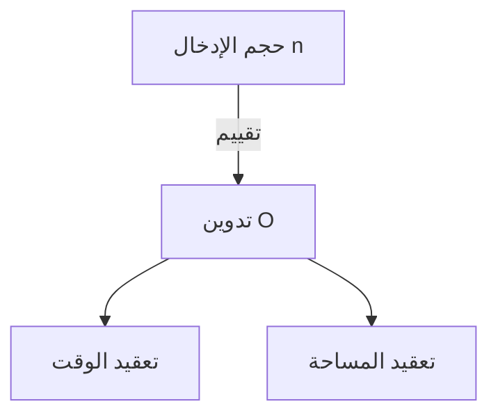

# مقدمة

عند تعلم البرمجة، من المهم جدًا فهم كفاءة الخوارزميات. المفهوم الذي يظهر دائمًا في هذه الحالة هو ** التعقيد ** (Complexity). في هذه المقالة، سنشرح بالتفصيل من أساسيات تعقيد الوقت والمساحة، إلى شرح مفصل لتدوين O (تدوين Big O)، ورؤى عميقة مع أمثلة عملية، في حجم يقارب 20 ألف حرف.

# ما هو التعقيد

التعقيد هو مقياس لتقييم أداء الخوارزمية. يمكن تقسيم التعقيد بشكل عام إلى النوعين التاليين:

1. ** تعقيد الوقت ** (Time Complexity)
2. ** تعقيد المساحة ** (Space Complexity)

## 1. تعقيد الوقت

تعقيد الوقت هو مقياس يمثل "الوقت" أو "عدد الخطوات" اللازمة للخوارزمية لإكمال تنفيذها.

## 2. تعقيد المساحة

تعقيد المساحة هو مقياس يمثل "مساحة الذاكرة" اللازمة للخوارزمية لإكمال تنفيذها.

# ما هو تدوين O (تدوين Big O)

تدوين O (Big O Notation) هو تدوين رياضي يوضح الحد الأعلى لمعدل الزيادة في التعقيد عندما يصبح حجم الإدخال $n$ كبيرًا بما يكفي.

$$
O(f(n)) = \{ g(n) \mid \text{يوجد ثابت موجب } c, n_0 \text{ بحيث لجميع } n \ge n_0 \text{ يتحقق } 0 \le g(n) \le c f(n) \}
$$

## القواعد الأساسية لتدوين O

1. ** تجاهل الثوابت ** : $O(2n)$ يصبح $O(n)$.
2. ** الاحتفاظ بالمصطلح ذي التأثير الأكبر فقط ** : $O(n^2 + n)$ يصبح $O(n^2)$.



# تعقيدات الوقت النموذجية وأمثلة بلغة بايثون

من هنا، دعونا نلقي نظرة على شروحات مفصلة وأمثلة تعليمات برمجية بلغة بايثون لفئات تدوين O النموذجية.

## 1. O(1) : وقت ثابت (Constant Time)

خوارزمية يكتمل فيها المعالجة دائمًا في عدد ثابت من الخطوات، بغض النظر عن حجم الإدخال $n$.

```python
def get_first_element(arr):
    # الحصول على العنصر الأول من المصفوفة فقط، لذا فهو O(1)
    return arr[0] if arr else None
```

## 2. O(log n) : وقت لوغاريتمي (Logarithmic Time)

يزداد وقت التنفيذ مع زيادة حجم الإدخال $n$، لكن وتيرة هذه الزيادة بطيئة جدًا. المثال النموذجي هو البحث الثنائي.

```python
def binary_search(arr, target):
    left, right = 0, len(arr) - 1
    while left <= right:
        mid = (left + right) // 2
        if arr[mid] == target:
            return mid
        elif arr[mid] < target:
            left = mid + 1
        else:
            right = mid - 1
    return -1
```

## 3. O(n) : وقت خطي (Linear Time)

خوارزمية يزداد فيها وقت التنفيذ بشكل متناسب مع حجم الإدخال $n$.

```python
def linear_search(arr, target):
    for i in range(len(arr)):
        if arr[i] == target:
            return i
    return -1
```

## 4. O(n log n) : وقت شبه خطي (Linearithmic Time)

هو حاصل ضرب O(n) و O(log n). العديد من خوارزميات الفرز المقارن الفعالة (مثل فرز الدمج، الفرز السريع، وفرز الكومة) تمتلك هذا التعقيد.

```python
def merge_sort(arr):
    if len(arr) <= 1:
        return arr
    mid = len(arr) // 2
    left = merge_sort(arr[:mid])
    right = merge_sort(arr[mid:])
    return merge(left, right)

def merge(left, right):
    result = []
    i = j = 0
    while i < len(left) and j < len(right):
        if left[i] < right[j]:
            result.append(left[i])
            i += 1
        else:
            result.append(right[j])
            j += 1
    result.extend(left[i:])
    result.extend(right[j:])
    return result
```

## 5. O(n^2) : وقت تربيعي (Quadratic Time)

يزداد وقت التنفيذ بشكل متناسب مع مربع حجم الإدخال $n$. تنطبق هذه الحالة على خوارزميات الفرز البسيطة مثل فرز الفقاعة وفرز الإدراج.

```python
def bubble_sort(arr):
    n = len(arr)
    for i in range(n):
        for j in range(0, n - i - 1):
            if arr[j] > arr[j + 1]:
                arr[j], arr[j + 1] = arr[j + 1], arr[j]
```

## 6. O(2^n) : وقت أسي (Exponential Time)

يتضاعف وقت التنفيذ في كل مرة يزداد فيها حجم الإدخال $n$ بمقدار 1. تنطبق هذه الحالة على التطبيق العودي البسيط لتسلسل فيبوناتشي.

```python
def fibonacci_recursive(n):
    if n <= 1:
        return n
    return fibonacci_recursive(n - 1) + fibonacci_recursive(n - 2)
```

## 7. O(n!) : وقت عاملي (Factorial Time)

يزداد وقت التنفيذ بشكل متناسب مع مضروب حجم الإدخال. تنطبق هذه الحالة على البحث الشامل (القوة الغاشمة) لمشكلة بائع المتجول.

```python
import itertools

def traveling_salesperson_brute_force(distances):
    n = len(distances)
    cities = list(range(n))
    min_path = float('inf')
    
    for perm in itertools.permutations(cities):
        current_path = 0
        for i in range(n - 1):
            current_path += distances[perm[i]][perm[i+1]]
        current_path += distances[perm[-1]][perm[0]] # العودة
        if current_path < min_path:
            min_path = current_path
            
    return min_path
```

# هياكل البيانات والتعقيد

| هيكل البيانات | الوصول | البحث | الإدراج | الحذف | تعقيد المساحة |
|---|---|---|---|---|---|
| Array | $O(1)$ | $O(n)$ | $O(n)$ | $O(n)$ | $O(n)$ |
| Linked List | $O(n)$ | $O(n)$ | $O(1)$ | $O(1)$ | $O(n)$ |
| [Hash Table](https://kenji.blog/ar/p/search-algorithms-linear-binary-hash-table-principles/) | - | $O(1)$ | $O(1)$ | $O(1)$ | $O(n)$ |
| BST | $O(\log n)$ | $O(\log n)$ | $O(\log n)$ | $O(\log n)$ | $O(n)$ |

# خوارزميات الفرز والتعقيد

| الخوارزمية | الأفضل | المتوسط | الأسوأ | تعقيد المساحة |
|---|---|---|---|---|
| Bubble Sort | $O(n)$ | $O(n^2)$ | $O(n^2)$ | $O(1)$ |
| Merge Sort | $O(n \log n)$ | $O(n \log n)$ | $O(n \log n)$ | $O(n)$ |
| Quick Sort | $O(n \log n)$ | $O(n \log n)$ | $O(n^2)$ | $O(\log n)$ |


# مقدمة

عند تعلم البرمجة، من المهم جدًا فهم كفاءة الخوارزميات. المفهوم الذي يظهر دائمًا في هذه الحالة هو ** التعقيد ** (Complexity). في هذه المقالة، سنشرح بالتفصيل من أساسيات تعقيد الوقت والمساحة، إلى شرح مفصل لتدوين O (تدوين Big O)، ورؤى عميقة مع أمثلة عملية، في حجم يقارب 20 ألف حرف.

# ما هو التعقيد

التعقيد هو مقياس لتقييم أداء الخوارزمية. يمكن تقسيم التعقيد بشكل عام إلى النوعين التاليين:

1. ** تعقيد الوقت ** (Time Complexity)
2. ** تعقيد المساحة ** (Space Complexity)

## 7. O(n!) : وقت عاملي (Factorial Time)

يزداد وقت التنفيذ بشكل متناسب مع مضروب حجم الإدخال. تنطبق هذه الحالة على البحث الشامل (القوة الغاشمة) لمشكلة بائع المتجول.

```python
import itertools

def traveling_salesperson_brute_force(distances):
    n = len(distances)
    cities = list(range(n))
    min_path = float('inf')
    
    for perm in itertools.permutations(cities):
        current_path = 0
        for i in range(n - 1):
            current_path += distances[perm[i]][perm[i+1]]
        current_path += distances[perm[-1]][perm[0]] # العودة
        if current_path < min_path:
            min_path = current_path
            
    return min_path
```

# هياكل البيانات والتعقيد

| هيكل البيانات | الوصول | البحث | الإدراج | الحذف | تعقيد المساحة |
|---|---|---|---|---|---|
| Array | $O(1)$ | $O(n)$ | $O(n)$ | $O(n)$ | $O(n)$ |
| Linked List | $O(n)$ | $O(n)$ | $O(1)$ | $O(1)$ | $O(n)$ |
| [Hash Table](https://kenji.blog/ar/p/search-algorithms-linear-binary-hash-table-principles/) | - | $O(1)$ | $O(1)$ | $O(1)$ | $O(n)$ |
| BST | $O(\log n)$ | $O(\log n)$ | $O(\log n)$ | $O(\log n)$ | $O(n)$ |

# خوارزميات الفرز والتعقيد

| الخوارزمية | الأفضل | المتوسط | الأسوأ | تعقيد المساحة |
|---|---|---|---|---|
| Bubble Sort | $O(n)$ | $O(n^2)$ | $O(n^2)$ | $O(1)$ |
| Merge Sort | $O(n \log n)$ | $O(n \log n)$ | $O(n \log n)$ | $O(n)$ |
| Quick Sort | $O(n \log n)$ | $O(n \log n)$ | $O(n^2)$ | $O(\log n)$ |
