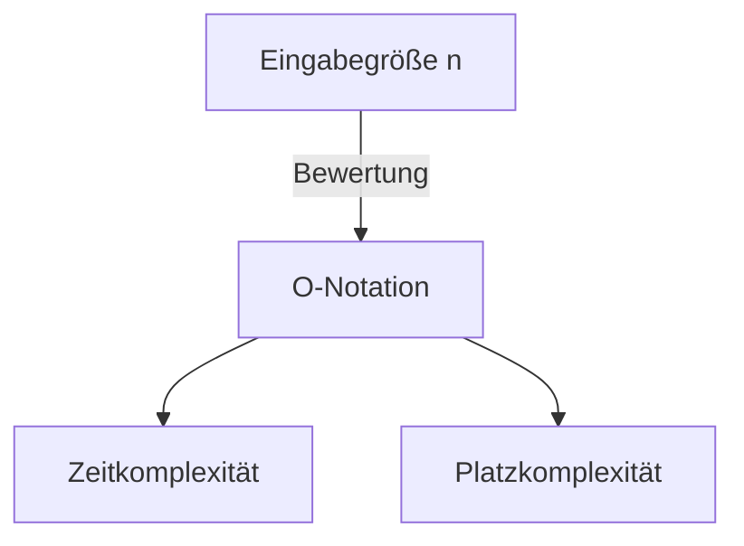

# Einführung

Beim Erlernen der Programmierung ist es sehr wichtig, die Effizienz von Algorithmen zu verstehen. Ein Konzept, das dabei immer auftaucht, ist die **Komplexität** (Complexity). In diesem Artikel werden wir die Grundlagen der Zeit- und Platzkomplexität, detaillierte Erklärungen zur O-Notation (Big-O-Notation) sowie tiefe Einblicke mit konkreten Beispielen in einem Umfang von etwa 20.000 Zeichen ausführlich erläutern.

# Was ist Komplexität?

Die Komplexität ist ein Maßstab zur Bewertung der Leistung eines Algorithmus. Sie lässt sich grob in die folgenden zwei Kategorien unterteilen:

1. **Zeitkomplexität** (Time Complexity)
2. **Platzkomplexität** (Space Complexity)

## 1. Zeitkomplexität

Die Zeitkomplexität ist ein Maßstab, der die "Zeit" oder die "Anzahl der Schritte" angibt, die ein Algorithmus benötigt, um seine Ausführung abzuschließen.

## 2. Platzkomplexität

Die Platzkomplexität ist ein Maßstab, der den "Speicherplatz" angibt, den ein Algorithmus benötigt, um seine Ausführung abzuschließen.

# Was ist die O-Notation (Big-O-Notation)?

Die O-Notation (Big O Notation) ist eine mathematische Notation, die die obere Schranke für die Wachstumsrate der Komplexität angibt, wenn die Eingabegröße $n$ ausreichend groß wird.

$$
O(f(n)) = \{ g(n) \mid \text{Es existieren positive Konstanten } c, n_0 \text{, sodass für alle } n \ge n_0 \text{ gilt: } 0 \le g(n) \le c f(n) \}
$$

## Grundregeln der O-Notation

1. **Ignorieren von Konstanten** : $O(2n)$ wird zu $O(n)$.
2. **Nur den dominanten Term beibehalten** : $O(n^2 + n)$ wird zu $O(n^2)$.



# Typische Zeitkomplexitäten und Beispiele in Python

Im Folgenden betrachten wir detaillierte Erklärungen und Python-Codebeispiele für die typischen Klassen der O-Notation.

## 1. O(1) : Konstante Zeit (Constant Time)

Ein Algorithmus, dessen Verarbeitung unabhängig von der Eingabegröße $n$ immer in einer konstanten Anzahl von Schritten abgeschlossen wird.

```python
def get_first_element(arr):
    # Da nur das erste Element des Arrays abgerufen wird, ist es O(1)
    return arr[0] if arr else None
```

## 2. O(log n) : Logarithmische Zeit (Logarithmic Time)

Mit zunehmender Eingabegröße $n$ steigt die Ausführungszeit, aber das Wachstum ist sehr langsam. Ein typisches Beispiel ist die binäre Suche.

```python
def binary_search(arr, target):
    left, right = 0, len(arr) - 1
    while left <= right:
        mid = (left + right) // 2
        if arr[mid] == target:
            return mid
        elif arr[mid] < target:
            left = mid + 1
        else:
            right = mid - 1
    return -1
```

## 3. O(n) : Lineare Zeit (Linear Time)

Ein Algorithmus, dessen Ausführungszeit proportional zur Eingabegröße $n$ steigt.

```python
def linear_search(arr, target):
    for i in range(len(arr)):
        if arr[i] == target:
            return i
    return -1
```

## 4. O(n log n) : Quasilineare Zeit (Linearithmic Time)

Das Produkt aus O(n) und O(log n). Viele effiziente vergleichsbasierte Sortieralgorithmen (Mergesort, Quicksort, Heapsort usw.) haben diese Komplexität.

```python
def merge_sort(arr):
    if len(arr) <= 1:
        return arr
    mid = len(arr) // 2
    left = merge_sort(arr[:mid])
    right = merge_sort(arr[mid:])
    return merge(left, right)

def merge(left, right):
    result = []
    i = j = 0
    while i < len(left) and j < len(right):
        if left[i] < right[j]:
            result.append(left[i])
            i += 1
        else:
            result.append(right[j])
            j += 1
    result.extend(left[i:])
    result.extend(right[j:])
    return result
```

## 5. O(n^2) : Quadratische Zeit (Quadratic Time)

Die Ausführungszeit steigt proportional zum Quadrat der Eingabegröße $n$. Einfache Sortieralgorithmen wie Bubblesort oder Insertionsort fallen in diese Kategorie.

```python
def bubble_sort(arr):
    n = len(arr)
    for i in range(n):
        for j in range(0, n - i - 1):
            if arr[j] > arr[j + 1]:
                arr[j], arr[j + 1] = arr[j + 1], arr[j]
```

## 6. O(2^n) : Exponentielle Zeit (Exponential Time)

Für jede Erhöhung der Eingabegröße $n$ um 1 verdoppelt sich die Ausführungszeit. Eine einfache rekursive Implementierung der Fibonacci-Folge ist ein Beispiel dafür.

```python
def fibonacci_recursive(n):
    if n <= 1:
        return n
    return fibonacci_recursive(n - 1) + fibonacci_recursive(n - 2)
```

## 7. O(n!) : Fakultätszeit (Factorial Time)

Die Ausführungszeit steigt proportional zur Fakultät der Eingabegröße. Die vollständige Suche (Brute-Force) für das Problem des Handlungsreisenden ist ein solches Beispiel.

```python
import itertools

def traveling_salesperson_brute_force(distances):
    n = len(distances)
    cities = list(range(n))
    min_path = float('inf')
    
    for perm in itertools.permutations(cities):
        current_path = 0
        for i in range(n - 1):
            current_path += distances[perm[i]][perm[i+1]]
        current_path += distances[perm[-1]][perm[0]] # Zurückkehren
        if current_path < min_path:
            min_path = current_path
            
    return min_path
```

# Datenstrukturen und Komplexität

| Datenstruktur | Zugriff | Suche | Einfügen | Löschen | Platzkomplexität |
|---|---|---|---|---|---|
| Array | $O(1)$ | $O(n)$ | $O(n)$ | $O(n)$ | $O(n)$ |
| Linked List | $O(n)$ | $O(n)$ | $O(1)$ | $O(1)$ | $O(n)$ |
| [Hash Table](https://kenji.blog/de/p/search-algorithms-linear-binary-hash-table-principles/) | - | $O(1)$ | $O(1)$ | $O(1)$ | $O(n)$ |
| BST | $O(\log n)$ | $O(\log n)$ | $O(\log n)$ | $O(\log n)$ | $O(n)$ |

# Sortieralgorithmen und Komplexität

| Algorithmus | Bester Fall | Durchschnitt | Schlechtester Fall | Platzkomplexität |
|---|---|---|---|---|
| Bubble Sort | $O(n)$ | $O(n^2)$ | $O(n^2)$ | $O(1)$ |
| Merge Sort | $O(n \log n)$ | $O(n \log n)$ | $O(n \log n)$ | $O(n)$ |
| Quick Sort | $O(n \log n)$ | $O(n \log n)$ | $O(n^2)$ | $O(\log n)$ |

# Einführung

Beim Erlernen der Programmierung ist es sehr wichtig, die Effizienz von Algorithmen zu verstehen. Ein Konzept, das dabei immer auftaucht, ist die **Komplexität** (Complexity). In diesem Artikel werden wir die Grundlagen der Zeit- und Platzkomplexität, detaillierte Erklärungen zur O-Notation (Big-O-Notation) sowie tiefe Einblicke mit konkreten Beispielen in einem Umfang von etwa 20.000 Zeichen ausführlich erläutern.

# Was ist Komplexität?

Die Komplexität ist ein Maßstab zur Bewertung der Leistung eines Algorithmus. Sie lässt sich grob in die folgenden zwei Kategorien unterteilen:

1. **Zeitkomplexität** (Time Complexity)
2. **Platzkomplexität** (Space Complexity)

## 1. Zeitkomplexität

Die Zeitkomplexität ist ein Maßstab, der die "Zeit" oder die "Anzahl der Schritte" angibt, die ein Algorithmus benötigt, um seine Ausführung abzuschließen.

## 2. Platzkomplexität

Die Platzkomplexität ist ein Maßstab, der den "Speicherplatz" angibt, den ein Algorithmus benötigt, um seine Ausführung abzuschließen.

# Was ist die O-Notation (Big-O-Notation)?

Die O-Notation (Big O Notation) ist eine mathematische Notation, die die obere Schranke für die Wachstumsrate der Komplexität angibt, wenn die Eingabegröße $n$ ausreichend groß wird.

$$
O(f(n)) = \{ g(n) \mid \text{Es existieren positive Konstanten } c, n_0 \text{, sodass für alle } n \ge n_0 \text{ gilt: } 0 \le g(n) \le c f(n) \}
$$

## Grundregeln der O-Notation

1. **Ignorieren von Konstanten** : $O(2n)$ wird zu $O(n)$.
2. **Nur den dominanten Term beibehalten** : $O(n^2 + n)$ wird zu $O(n^2)$.


# Typische Zeitkomplexitäten und Beispiele in Python

Im Folgenden betrachten wir detaillierte Erklärungen und Python-Codebeispiele für die typischen Klassen der O-Notation.

## 1. O(1) : Konstante Zeit (Constant Time)

Ein Algorithmus, dessen Verarbeitung unabhängig von der Eingabegröße $n$ immer in einer konstanten Anzahl von Schritten abgeschlossen wird.

```python
def get_first_element(arr):
    # Da nur das erste Element des Arrays abgerufen wird, ist es O(1)
    return arr[0] if arr else None
```

## 2. O(log n) : Logarithmische Zeit (Logarithmic Time)

Mit zunehmender Eingabegröße $n$ steigt die Ausführungszeit, aber das Wachstum ist sehr langsam. Ein typisches Beispiel ist die binäre Suche.

```python
def binary_search(arr, target):
    left, right = 0, len(arr) - 1
    while left <= right:
        mid = (left + right) // 2
        if arr[mid] == target:
            return mid
        elif arr[mid] < target:
            left = mid + 1
        else:
            right = mid - 1
    return -1
```

## 3. O(n) : Lineare Zeit (Linear Time)

Ein Algorithmus, dessen Ausführungszeit proportional zur Eingabegröße $n$ steigt.

```python
def linear_search(arr, target):
    for i in range(len(arr)):
        if arr[i] == target:
            return i
    return -1
```

## 4. O(n log n) : Quasilineare Zeit (Linearithmic Time)

Das Produkt aus O(n) und O(log n). Viele effiziente vergleichsbasierte Sortieralgorithmen (Mergesort, Quicksort, Heapsort usw.) haben diese Komplexität.

```python
def merge_sort(arr):
    if len(arr) <= 1:
        return arr
    mid = len(arr) // 2
    left = merge_sort(arr[:mid])
    right = merge_sort(arr[mid:])
    return merge(left, right)

def merge(left, right):
    result = []
    i = j = 0
    while i < len(left) and j < len(right):
        if left[i] < right[j]:
            result.append(left[i])
            i += 1
        else:
            result.append(right[j])
            j += 1
    result.extend(left[i:])
    result.extend(right[j:])
    return result
```

## 5. O(n^2) : Quadratische Zeit (Quadratic Time)

Die Ausführungszeit steigt proportional zum Quadrat der Eingabegröße $n$. Einfache Sortieralgorithmen wie Bubblesort oder Insertionsort fallen in diese Kategorie.

```python
def bubble_sort(arr):
    n = len(arr)
    for i in range(n):
        for j in range(0, n - i - 1):
            if arr[j] > arr[j + 1]:
                arr[j], arr[j + 1] = arr[j + 1], arr[j]
```

## 6. O(2^n) : Exponentielle Zeit (Exponential Time)

Für jede Erhöhung der Eingabegröße $n$ um 1 verdoppelt sich die Ausführungszeit. Eine einfache rekursive Implementierung der Fibonacci-Folge ist ein Beispiel dafür.

```python
def fibonacci_recursive(n):
    if n <= 1:
        return n
    return fibonacci_recursive(n - 1) + fibonacci_recursive(n - 2)
```

## 7. O(n!) : Fakultätszeit (Factorial Time)

Die Ausführungszeit steigt proportional zur Fakultät der Eingabegröße. Die vollständige Suche (Brute-Force) für das Problem des Handlungsreisenden ist ein solches Beispiel.

```python
import itertools

def traveling_salesperson_brute_force(distances):
    n = len(distances)
    cities = list(range(n))
    min_path = float('inf')
    
    for perm in itertools.permutations(cities):
        current_path = 0
        for i in range(n - 1):
            current_path += distances[perm[i]][perm[i+1]]
        current_path += distances[perm[-1]][perm[0]] # Zurückkehren
        if current_path < min_path:
            min_path = current_path
            
    return min_path
```

# Datenstrukturen und Komplexität

| Datenstruktur | Zugriff | Suche | Einfügen | Löschen | Platzkomplexität |
|---|---|---|---|---|---|
| Array | $O(1)$ | $O(n)$ | $O(n)$ | $O(n)$ | $O(n)$ |
| Linked List | $O(n)$ | $O(n)$ | $O(1)$ | $O(1)$ | $O(n)$ |
| [Hash Table](https://kenji.blog/de/p/search-algorithms-linear-binary-hash-table-principles/) | - | $O(1)$ | $O(1)$ | $O(1)$ | $O(n)$ |
| BST | $O(\log n)$ | $O(\log n)$ | $O(\log n)$ | $O(\log n)$ | $O(n)$ |

# Sortieralgorithmen und Komplexität

| Algorithmus | Bester Fall | Durchschnitt | Schlechtester Fall | Platzkomplexität |
|---|---|---|---|---|
| Bubble Sort | $O(n)$ | $O(n^2)$ | $O(n^2)$ | $O(1)$ |
| Merge Sort | $O(n \log n)$ | $O(n \log n)$ | $O(n \log n)$ | $O(n)$ |
| Quick Sort | $O(n \log n)$ | $O(n \log n)$ | $O(n^2)$ | $O(\log n)$ |

# Einführung

Beim Erlernen der Programmierung ist es sehr wichtig, die Effizienz von Algorithmen zu verstehen. Ein Konzept, das dabei immer auftaucht, ist die **Komplexität** (Complexity). In diesem Artikel werden wir die Grundlagen der Zeit- und Platzkomplexität, detaillierte Erklärungen zur O-Notation (Big-O-Notation) sowie tiefe Einblicke mit konkreten Beispielen in einem Umfang von etwa 20.000 Zeichen ausführlich erläutern.

# Was ist Komplexität?

Die Komplexität ist ein Maßstab zur Bewertung der Leistung eines Algorithmus. Sie lässt sich grob in die folgenden zwei Kategorien unterteilen:

1. **Zeitkomplexität** (Time Complexity)
2. **Platzkomplexität** (Space Complexity)

## 1. Zeitkomplexität

Die Zeitkomplexität ist ein Maßstab, der die "Zeit" oder die "Anzahl der Schritte" angibt, die ein Algorithmus benötigt, um seine Ausführung abzuschließen.

## 2. Platzkomplexität

Die Platzkomplexität ist ein Maßstab, der den "Speicherplatz" angibt, den ein Algorithmus benötigt, um seine Ausführung abzuschließen.

# Was ist die O-Notation (Big-O-Notation)?

Die O-Notation (Big O Notation) ist eine mathematische Notation, die die obere Schranke für die Wachstumsrate der Komplexität angibt, wenn die Eingabegröße $n$ ausreichend groß wird.

$$
O(f(n)) = \{ g(n) \mid \text{Es existieren positive Konstanten } c, n_0 \text{, sodass für alle } n \ge n_0 \text{ gilt: } 0 \le g(n) \le c f(n) \}
$$

## Grundregeln der O-Notation

1. **Ignorieren von Konstanten** : $O(2n)$ wird zu $O(n)$.
2. **Nur den dominanten Term beibehalten** : $O(n^2 + n)$ wird zu $O(n^2)$.


# Typische Zeitkomplexitäten und Beispiele in Python

Im Folgenden betrachten wir detaillierte Erklärungen und Python-Codebeispiele für die typischen Klassen der O-Notation.

## 1. O(1) : Konstante Zeit (Constant Time)

Ein Algorithmus, dessen Verarbeitung unabhängig von der Eingabegröße $n$ immer in einer konstanten Anzahl von Schritten abgeschlossen wird.

```python
def get_first_element(arr):
    # Da nur das erste Element des Arrays abgerufen wird, ist es O(1)
    return arr[0] if arr else None
```

## 2. O(log n) : Logarithmische Zeit (Logarithmic Time)

Mit zunehmender Eingabegröße $n$ steigt die Ausführungszeit, aber das Wachstum ist sehr langsam. Ein typisches Beispiel ist die binäre Suche.

```python
def binary_search(arr, target):
    left, right = 0, len(arr) - 1
    while left <= right:
        mid = (left + right) // 2
        if arr[mid] == target:
            return mid
        elif arr[mid] < target:
            left = mid + 1
        else:
            right = mid - 1
    return -1
```

## 3. O(n) : Lineare Zeit (Linear Time)

Ein Algorithmus, dessen Ausführungszeit proportional zur Eingabegröße $n$ steigt.

```python
def linear_search(arr, target):
    for i in range(len(arr)):
        if arr[i] == target:
            return i
    return -1
```

## 4. O(n log n) : Quasilineare Zeit (Linearithmic Time)

Das Produkt aus O(n) und O(log n). Viele effiziente vergleichsbasierte Sortieralgorithmen (Mergesort, Quicksort, Heapsort usw.) haben diese Komplexität.

```python
def merge_sort(arr):
    if len(arr) <= 1:
        return arr
    mid = len(arr) // 2
    left = merge_sort(arr[:mid])
    right = merge_sort(arr[mid:])
    return merge(left, right)

def merge(left, right):
    result = []
    i = j = 0
    while i < len(left) and j < len(right):
        if left[i] < right[j]:
            result.append(left[i])
            i += 1
        else:
            result.append(right[j])
            j += 1
    result.extend(left[i:])
    result.extend(right[j:])
    return result
```

## 5. O(n^2) : Quadratische Zeit (Quadratic Time)

Die Ausführungszeit steigt proportional zum Quadrat der Eingabegröße $n$. Einfache Sortieralgorithmen wie Bubblesort oder Insertionsort fallen in diese Kategorie.

```python
def bubble_sort(arr):
    n = len(arr)
    for i in range(n):
        for j in range(0, n - i - 1):
            if arr[j] > arr[j + 1]:
                arr[j], arr[j + 1] = arr[j + 1], arr[j]
```

## 6. O(2^n) : Exponentielle Zeit (Exponential Time)

Für jede Erhöhung der Eingabegröße $n$ um 1 verdoppelt sich die Ausführungszeit. Eine einfache rekursive Implementierung der Fibonacci-Folge ist ein Beispiel dafür.

```python
def fibonacci_recursive(n):
    if n <= 1:
        return n
    return fibonacci_recursive(n - 1) + fibonacci_recursive(n - 2)
```

## 7. O(n!) : Fakultätszeit (Factorial Time)

Die Ausführungszeit steigt proportional zur Fakultät der Eingabegröße. Die vollständige Suche (Brute-Force) für das Problem des Handlungsreisenden ist ein solches Beispiel.

```python
import itertools

def traveling_salesperson_brute_force(distances):
    n = len(distances)
    cities = list(range(n))
    min_path = float('inf')
    
    for perm in itertools.permutations(cities):
        current_path = 0
        for i in range(n - 1):
            current_path += distances[perm[i]][perm[i+1]]
        current_path += distances[perm[-1]][perm[0]] # Zurückkehren
        if current_path < min_path:
            min_path = current_path
            
    return min_path
```

# Datenstrukturen und Komplexität

| Datenstruktur | Zugriff | Suche | Einfügen | Löschen | Platzkomplexität |
|---|---|---|---|---|---|
| Array | $O(1)$ | $O(n)$ | $O(n)$ | $O(n)$ | $O(n)$ |
| Linked List | $O(n)$ | $O(n)$ | $O(1)$ | $O(1)$ | $O(n)$ |
| [Hash Table](https://kenji.blog/de/p/search-algorithms-linear-binary-hash-table-principles/) | - | $O(1)$ | $O(1)$ | $O(1)$ | $O(n)$ |
| BST | $O(\log n)$ | $O(\log n)$ | $O(\log n)$ | $O(\log n)$ | $O(n)$ |

# Sortieralgorithmen und Komplexität

| Algorithmus | Bester Fall | Durchschnitt | Schlechtester Fall | Platzkomplexität |
|---|---|---|---|---|
| Bubble Sort | $O(n)$ | $O(n^2)$ | $O(n^2)$ | $O(1)$ |
| Merge Sort | $O(n \log n)$ | $O(n \log n)$ | $O(n \log n)$ | $O(n)$ |
| Quick Sort | $O(n \log n)$ | $O(n \log n)$ | $O(n^2)$ | $O(\log n)$ |

# Einführung

Beim Erlernen der Programmierung ist es sehr wichtig, die Effizienz von Algorithmen zu verstehen. Ein Konzept, das dabei immer auftaucht, ist die **Komplexität** (Complexity). In diesem Artikel werden wir die Grundlagen der Zeit- und Platzkomplexität, detaillierte Erklärungen zur O-Notation (Big-O-Notation) sowie tiefe Einblicke mit konkreten Beispielen in einem Umfang von etwa 20.000 Zeichen ausführlich erläutern.

# Was ist Komplexität?

Die Komplexität ist ein Maßstab zur Bewertung der Leistung eines Algorithmus. Sie lässt sich grob in die folgenden zwei Kategorien unterteilen:

1. **Zeitkomplexität** (Time Complexity)
2. **Platzkomplexität** (Space Complexity)

## 1. Zeitkomplexität

Die Zeitkomplexität ist ein Maßstab, der die "Zeit" oder die "Anzahl der Schritte" angibt, die ein Algorithmus benötigt, um seine Ausführung abzuschließen.

## 2. Platzkomplexität

Die Platzkomplexität ist ein Maßstab, der den "Speicherplatz" angibt, den ein Algorithmus benötigt, um seine Ausführung abzuschließen.

# Was ist die O-Notation (Big-O-Notation)?

Die O-Notation (Big O Notation) ist eine mathematische Notation, die die obere Schranke für die Wachstumsrate der Komplexität angibt, wenn die Eingabegröße $n$ ausreichend groß wird.

$$
O(f(n)) = \{ g(n) \mid \text{Es existieren positive Konstanten } c, n_0 \text{, sodass für alle } n \ge n_0 \text{ gilt: } 0 \le g(n) \le c f(n) \}
$$

## Grundregeln der O-Notation

1. **Ignorieren von Konstanten** : $O(2n)$ wird zu $O(n)$.
2. **Nur den dominanten Term beibehalten** : $O(n^2 + n)$ wird zu $O(n^2)$.


# Typische Zeitkomplexitäten und Beispiele in Python

Im Folgenden betrachten wir detaillierte Erklärungen und Python-Codebeispiele für die typischen Klassen der O-Notation.

## 1. O(1) : Konstante Zeit (Constant Time)

Ein Algorithmus, dessen Verarbeitung unabhängig von der Eingabegröße $n$ immer in einer konstanten Anzahl von Schritten abgeschlossen wird.

```python
def get_first_element(arr):
    # Da nur das erste Element des Arrays abgerufen wird, ist es O(1)
    return arr[0] if arr else None
```

## 2. O(log n) : Logarithmische Zeit (Logarithmic Time)

Mit zunehmender Eingabegröße $n$ steigt die Ausführungszeit, aber das Wachstum ist sehr langsam. Ein typisches Beispiel ist die binäre Suche.

```python
def binary_search(arr, target):
    left, right = 0, len(arr) - 1
    while left <= right:
        mid = (left + right) // 2
        if arr[mid] == target:
            return mid
        elif arr[mid] < target:
            left = mid + 1
        else:
            right = mid - 1
    return -1
```

## 3. O(n) : Lineare Zeit (Linear Time)

Ein Algorithmus, dessen Ausführungszeit proportional zur Eingabegröße $n$ steigt.

```python
def linear_search(arr, target):
    for i in range(len(arr)):
        if arr[i] == target:
            return i
    return -1
```

## 4. O(n log n) : Quasilineare Zeit (Linearithmic Time)

Das Produkt aus O(n) und O(log n). Viele effiziente vergleichsbasierte Sortieralgorithmen (Mergesort, Quicksort, Heapsort usw.) haben diese Komplexität.

```python
def merge_sort(arr):
    if len(arr) <= 1:
        return arr
    mid = len(arr) // 2
    left = merge_sort(arr[:mid])
    right = merge_sort(arr[mid:])
    return merge(left, right)

def merge(left, right):
    result = []
    i = j = 0
    while i < len(left) and j < len(right):
        if left[i] < right[j]:
            result.append(left[i])
            i += 1
        else:
            result.append(right[j])
            j += 1
    result.extend(left[i:])
    result.extend(right[j:])
    return result
```

## 5. O(n^2) : Quadratische Zeit (Quadratic Time)

Die Ausführungszeit steigt proportional zum Quadrat der Eingabegröße $n$. Einfache Sortieralgorithmen wie Bubblesort oder Insertionsort fallen in diese Kategorie.

```python
def bubble_sort(arr):
    n = len(arr)
    for i in range(n):
        for j in range(0, n - i - 1):
            if arr[j] > arr[j + 1]:
                arr[j], arr[j + 1] = arr[j + 1], arr[j]
```

## 6. O(2^n) : Exponentielle Zeit (Exponential Time)

Für jede Erhöhung der Eingabegröße $n$ um 1 verdoppelt sich die Ausführungszeit. Eine einfache rekursive Implementierung der Fibonacci-Folge ist ein Beispiel dafür.

```python
def fibonacci_recursive(n):
    if n <= 1:
        return n
    return fibonacci_recursive(n - 1) + fibonacci_recursive(n - 2)
```

## 7. O(n!) : Fakultätszeit (Factorial Time)

Die Ausführungszeit steigt proportional zur Fakultät der Eingabegröße. Die vollständige Suche (Brute-Force) für das Problem des Handlungsreisenden ist ein solches Beispiel.

```python
import itertools

def traveling_salesperson_brute_force(distances):
    n = len(distances)
    cities = list(range(n))
    min_path = float('inf')
    
    for perm in itertools.permutations(cities):
        current_path = 0
        for i in range(n - 1):
            current_path += distances[perm[i]][perm[i+1]]
        current_path += distances[perm[-1]][perm[0]] # Zurückkehren
        if current_path < min_path:
            min_path = current_path
            
    return min_path
```

# Datenstrukturen und Komplexität

| Datenstruktur | Zugriff | Suche | Einfügen | Löschen | Platzkomplexität |
|---|---|---|---|---|---|
| Array | $O(1)$ | $O(n)$ | $O(n)$ | $O(n)$ | $O(n)$ |
| Linked List | $O(n)$ | $O(n)$ | $O(1)$ | $O(1)$ | $O(n)$ |
| [Hash Table](https://kenji.blog/de/p/search-algorithms-linear-binary-hash-table-principles/) | - | $O(1)$ | $O(1)$ | $O(1)$ | $O(n)$ |
| BST | $O(\log n)$ | $O(\log n)$ | $O(\log n)$ | $O(\log n)$ | $O(n)$ |

# Sortieralgorithmen und Komplexität

| Algorithmus | Bester Fall | Durchschnitt | Schlechtester Fall | Platzkomplexität |
|---|---|---|---|---|
| Bubble Sort | $O(n)$ | $O(n^2)$ | $O(n^2)$ | $O(1)$ |
| Merge Sort | $O(n \log n)$ | $O(n \log n)$ | $O(n \log n)$ | $O(n)$ |
| Quick Sort | $O(n \log n)$ | $O(n \log n)$ | $O(n^2)$ | $O(\log n)$ |

# Einführung

Beim Erlernen der Programmierung ist es sehr wichtig, die Effizienz von Algorithmen zu verstehen. Ein Konzept, das dabei immer auftaucht, ist die **Komplexität** (Complexity). In diesem Artikel werden wir die Grundlagen der Zeit- und Platzkomplexität, detaillierte Erklärungen zur O-Notation (Big-O-Notation) sowie tiefe Einblicke mit konkreten Beispielen in einem Umfang von etwa 20.000 Zeichen ausführlich erläutern.

# Was ist Komplexität?

Die Komplexität ist ein Maßstab zur Bewertung der Leistung eines Algorithmus. Sie lässt sich grob in die folgenden zwei Kategorien unterteilen:

1. **Zeitkomplexität** (Time Complexity)
2. **Platzkomplexität** (Space Complexity)

## 1. Zeitkomplexität

Die Zeitkomplexität ist ein Maßstab, der die "Zeit" oder die "Anzahl der Schritte" angibt, die ein Algorithmus benötigt, um seine Ausführung abzuschließen.

## 2. Platzkomplexität

Die Platzkomplexität ist ein Maßstab, der den "Speicherplatz" angibt, den ein Algorithmus benötigt, um seine Ausführung abzuschließen.

# Was ist die O-Notation (Big-O-Notation)?

Die O-Notation (Big O Notation) ist eine mathematische Notation, die die obere Schranke für die Wachstumsrate der Komplexität angibt, wenn die Eingabegröße $n$ ausreichend groß wird.

$$
O(f(n)) = \{ g(n) \mid \text{Es existieren positive Konstanten } c, n_0 \text{, sodass für alle } n \ge n_0 \text{ gilt: } 0 \le g(n) \le c f(n) \}
$$

## Grundregeln der O-Notation

1. **Ignorieren von Konstanten** : $O(2n)$ wird zu $O(n)$.
2. **Nur den dominanten Term beibehalten** : $O(n^2 + n)$ wird zu $O(n^2)$.


# Typische Zeitkomplexitäten und Beispiele in Python

Im Folgenden betrachten wir detaillierte Erklärungen und Python-Codebeispiele für die typischen Klassen der O-Notation.

## 1. O(1) : Konstante Zeit (Constant Time)

Ein Algorithmus, dessen Verarbeitung unabhängig von der Eingabegröße $n$ immer in einer konstanten Anzahl von Schritten abgeschlossen wird.

```python
def get_first_element(arr):
    # Da nur das erste Element des Arrays abgerufen wird, ist es O(1)
    return arr[0] if arr else None
```

## 2. O(log n) : Logarithmische Zeit (Logarithmic Time)

Mit zunehmender Eingabegröße $n$ steigt die Ausführungszeit, aber das Wachstum ist sehr langsam. Ein typisches Beispiel ist die binäre Suche.

```python
def binary_search(arr, target):
    left, right = 0, len(arr) - 1
    while left <= right:
        mid = (left + right) // 2
        if arr[mid] == target:
            return mid
        elif arr[mid] < target:
            left = mid + 1
        else:
            right = mid - 1
    return -1
```

## 3. O(n) : Lineare Zeit (Linear Time)

Ein Algorithmus, dessen Ausführungszeit proportional zur Eingabegröße $n$ steigt.

```python
def linear_search(arr, target):
    for i in range(len(arr)):
        if arr[i] == target:
            return i
    return -1
```

## 4. O(n log n) : Quasilineare Zeit (Linearithmic Time)

Das Produkt aus O(n) und O(log n). Viele effiziente vergleichsbasierte Sortieralgorithmen (Mergesort, Quicksort, Heapsort usw.) haben diese Komplexität.

```python
def merge_sort(arr):
    if len(arr) <= 1:
        return arr
    mid = len(arr) // 2
    left = merge_sort(arr[:mid])
    right = merge_sort(arr[mid:])
    return merge(left, right)

def merge(left, right):
    result = []
    i = j = 0
    while i < len(left) and j < len(right):
        if left[i] < right[j]:
            result.append(left[i])
            i += 1
        else:
            result.append(right[j])
            j += 1
    result.extend(left[i:])
    result.extend(right[j:])
    return result
```

## 5. O(n^2) : Quadratische Zeit (Quadratic Time)

Die Ausführungszeit steigt proportional zum Quadrat der Eingabegröße $n$. Einfache Sortieralgorithmen wie Bubblesort oder Insertionsort fallen in diese Kategorie.

```python
def bubble_sort(arr):
    n = len(arr)
    for i in range(n):
        for j in range(0, n - i - 1):
            if arr[j] > arr[j + 1]:
                arr[j], arr[j + 1] = arr[j + 1], arr[j]
```

## 6. O(2^n) : Exponentielle Zeit (Exponential Time)

Für jede Erhöhung der Eingabegröße $n$ um 1 verdoppelt sich die Ausführungszeit. Eine einfache rekursive Implementierung der Fibonacci-Folge ist ein Beispiel dafür.

```python
def fibonacci_recursive(n):
    if n <= 1:
        return n
    return fibonacci_recursive(n - 1) + fibonacci_recursive(n - 2)
```

## 7. O(n!) : Fakultätszeit (Factorial Time)

Die Ausführungszeit steigt proportional zur Fakultät der Eingabegröße. Die vollständige Suche (Brute-Force) für das Problem des Handlungsreisenden ist ein solches Beispiel.

```python
import itertools

def traveling_salesperson_brute_force(distances):
    n = len(distances)
    cities = list(range(n))
    min_path = float('inf')
    
    for perm in itertools.permutations(cities):
        current_path = 0
        for i in range(n - 1):
            current_path += distances[perm[i]][perm[i+1]]
        current_path += distances[perm[-1]][perm[0]] # Zurückkehren
        if current_path < min_path:
            min_path = current_path
            
    return min_path
```

# Datenstrukturen und Komplexität

| Datenstruktur | Zugriff | Suche | Einfügen | Löschen | Platzkomplexität |
|---|---|---|---|---|---|
| Array | $O(1)$ | $O(n)$ | $O(n)$ | $O(n)$ | $O(n)$ |
| Linked List | $O(n)$ | $O(n)$ | $O(1)$ | $O(1)$ | $O(n)$ |
| [Hash Table](https://kenji.blog/de/p/search-algorithms-linear-binary-hash-table-principles/) | - | $O(1)$ | $O(1)$ | $O(1)$ | $O(n)$ |
| BST | $O(\log n)$ | $O(\log n)$ | $O(\log n)$ | $O(\log n)$ | $O(n)$ |

# Sortieralgorithmen und Komplexität

| Algorithmus | Bester Fall | Durchschnitt | Schlechtester Fall | Platzkomplexität |
|---|---|---|---|---|
| Bubble Sort | $O(n)$ | $O(n^2)$ | $O(n^2)$ | $O(1)$ |
| Merge Sort | $O(n \log n)$ | $O(n \log n)$ | $O(n \log n)$ | $O(n)$ |
| Quick Sort | $O(n \log n)$ | $O(n \log n)$ | $O(n^2)$ | $O(\log n)$ |

# Einführung

Beim Erlernen der Programmierung ist es sehr wichtig, die Effizienz von Algorithmen zu verstehen. Ein Konzept, das dabei immer auftaucht, ist die **Komplexität** (Complexity). In diesem Artikel werden wir die Grundlagen der Zeit- und Platzkomplexität, detaillierte Erklärungen zur O-Notation (Big-O-Notation) sowie tiefe Einblicke mit konkreten Beispielen in einem Umfang von etwa 20.000 Zeichen ausführlich erläutern.

# Was ist Komplexität?

Die Komplexität ist ein Maßstab zur Bewertung der Leistung eines Algorithmus. Sie lässt sich grob in die folgenden zwei Kategorien unterteilen:

1. **Zeitkomplexität** (Time Complexity)
2. **Platzkomplexität** (Space Complexity)

## 1. Zeitkomplexität

Die Zeitkomplexität ist ein Maßstab, der die "Zeit" oder die "Anzahl der Schritte" angibt, die ein Algorithmus benötigt, um seine Ausführung abzuschließen.

## 2. Platzkomplexität

Die Platzkomplexität ist ein Maßstab, der den "Speicherplatz" angibt, den ein Algorithmus benötigt, um seine Ausführung abzuschließen.

# Was ist die O-Notation (Big-O-Notation)?

Die O-Notation (Big O Notation) ist eine mathematische Notation, die die obere Schranke für die Wachstumsrate der Komplexität angibt, wenn die Eingabegröße $n$ ausreichend groß wird.

$$
O(f(n)) = \{ g(n) \mid \text{Es existieren positive Konstanten } c, n_0 \text{, sodass für alle } n \ge n_0 \text{ gilt: } 0 \le g(n) \le c f(n) \}
$$

## Grundregeln der O-Notation

1. **Ignorieren von Konstanten** : $O(2n)$ wird zu $O(n)$.
2. **Nur den dominanten Term beibehalten** : $O(n^2 + n)$ wird zu $O(n^2)$.


# Typische Zeitkomplexitäten und Beispiele in Python

Im Folgenden betrachten wir detaillierte Erklärungen und Python-Codebeispiele für die typischen Klassen der O-Notation.

## 1. O(1) : Konstante Zeit (Constant Time)

Ein Algorithmus, dessen Verarbeitung unabhängig von der Eingabegröße $n$ immer in einer konstanten Anzahl von Schritten abgeschlossen wird.

```python
def get_first_element(arr):
    # Da nur das erste Element des Arrays abgerufen wird, ist es O(1)
    return arr[0] if arr else None
```

## 2. O(log n) : Logarithmische Zeit (Logarithmic Time)

Mit zunehmender Eingabegröße $n$ steigt die Ausführungszeit, aber das Wachstum ist sehr langsam. Ein typisches Beispiel ist die binäre Suche.

```python
def binary_search(arr, target):
    left, right = 0, len(arr) - 1
    while left <= right:
        mid = (left + right) // 2
        if arr[mid] == target:
            return mid
        elif arr[mid] < target:
            left = mid + 1
        else:
            right = mid - 1
    return -1
```

## 3. O(n) : Lineare Zeit (Linear Time)

Ein Algorithmus, dessen Ausführungszeit proportional zur Eingabegröße $n$ steigt.

```python
def linear_search(arr, target):
    for i in range(len(arr)):
        if arr[i] == target:
            return i
    return -1
```

## 4. O(n log n) : Quasilineare Zeit (Linearithmic Time)

Das Produkt aus O(n) und O(log n). Viele effiziente vergleichsbasierte Sortieralgorithmen (Mergesort, Quicksort, Heapsort usw.) haben diese Komplexität.

```python
def merge_sort(arr):
    if len(arr) <= 1:
        return arr
    mid = len(arr) // 2
    left = merge_sort(arr[:mid])
    right = merge_sort(arr[mid:])
    return merge(left, right)

def merge(left, right):
    result = []
    i = j = 0
    while i < len(left) and j < len(right):
        if left[i] < right[j]:
            result.append(left[i])
            i += 1
        else:
            result.append(right[j])
            j += 1
    result.extend(left[i:])
    result.extend(right[j:])
    return result
```

## 5. O(n^2) : Quadratische Zeit (Quadratic Time)

Die Ausführungszeit steigt proportional zum Quadrat der Eingabegröße $n$. Einfache Sortieralgorithmen wie Bubblesort oder Insertionsort fallen in diese Kategorie.

```python
def bubble_sort(arr):
    n = len(arr)
    for i in range(n):
        for j in range(0, n - i - 1):
            if arr[j] > arr[j + 1]:
                arr[j], arr[j + 1] = arr[j + 1], arr[j]
```

## 6. O(2^n) : Exponentielle Zeit (Exponential Time)

Für jede Erhöhung der Eingabegröße $n$ um 1 verdoppelt sich die Ausführungszeit. Eine einfache rekursive Implementierung der Fibonacci-Folge ist ein Beispiel dafür.

```python
def fibonacci_recursive(n):
    if n <= 1:
        return n
    return fibonacci_recursive(n - 1) + fibonacci_recursive(n - 2)
```

## 7. O(n!) : Fakultätszeit (Factorial Time)

Die Ausführungszeit steigt proportional zur Fakultät der Eingabegröße. Die vollständige Suche (Brute-Force) für das Problem des Handlungsreisenden ist ein solches Beispiel.

```python
import itertools

def traveling_salesperson_brute_force(distances):
    n = len(distances)
    cities = list(range(n))
    min_path = float('inf')
    
    for perm in itertools.permutations(cities):
        current_path = 0
        for i in range(n - 1):
            current_path += distances[perm[i]][perm[i+1]]
        current_path += distances[perm[-1]][perm[0]] # Zurückkehren
        if current_path < min_path:
            min_path = current_path
            
    return min_path
```

# Datenstrukturen und Komplexität

| Datenstruktur | Zugriff | Suche | Einfügen | Löschen | Platzkomplexität |
|---|---|---|---|---|---|
| Array | $O(1)$ | $O(n)$ | $O(n)$ | $O(n)$ | $O(n)$ |
| Linked List | $O(n)$ | $O(n)$ | $O(1)$ | $O(1)$ | $O(n)$ |
| [Hash Table](https://kenji.blog/de/p/search-algorithms-linear-binary-hash-table-principles/) | - | $O(1)$ | $O(1)$ | $O(1)$ | $O(n)$ |
| BST | $O(\log n)$ | $O(\log n)$ | $O(\log n)$ | $O(\log n)$ | $O(n)$ |

# Sortieralgorithmen und Komplexität

| Algorithmus | Bester Fall | Durchschnitt | Schlechtester Fall | Platzkomplexität |
|---|---|---|---|---|
| Bubble Sort | $O(n)$ | $O(n^2)$ | $O(n^2)$ | $O(1)$ |
| Merge Sort | $O(n \log n)$ | $O(n \log n)$ | $O(n \log n)$ | $O(n)$ |
| Quick Sort | $O(n \log n)$ | $O(n \log n)$ | $O(n^2)$ | $O(\log n)$ |

# Einführung

Beim Erlernen der Programmierung ist es sehr wichtig, die Effizienz von Algorithmen zu verstehen. Ein Konzept, das dabei immer auftaucht, ist die **Komplexität** (Complexity). In diesem Artikel werden wir die Grundlagen der Zeit- und Platzkomplexität, detaillierte Erklärungen zur O-Notation (Big-O-Notation) sowie tiefe Einblicke mit konkreten Beispielen in einem Umfang von etwa 20.000 Zeichen ausführlich erläutern.

# Was ist Komplexität?

Die Komplexität ist ein Maßstab zur Bewertung der Leistung eines Algorithmus. Sie lässt sich grob in die folgenden zwei Kategorien unterteilen:

1. **Zeitkomplexität** (Time Complexity)
2. **Platzkomplexität** (Space Complexity)

## 1. Zeitkomplexität

Die Zeitkomplexität ist ein Maßstab, der die "Zeit" oder die "Anzahl der Schritte" angibt, die ein Algorithmus benötigt, um seine Ausführung abzuschließen.

## 2. Platzkomplexität

Die Platzkomplexität ist ein Maßstab, der den "Speicherplatz" angibt, den ein Algorithmus benötigt, um seine Ausführung abzuschließen.

# Was ist die O-Notation (Big-O-Notation)?

Die O-Notation (Big O Notation) ist eine mathematische Notation, die die obere Schranke für die Wachstumsrate der Komplexität angibt, wenn die Eingabegröße $n$ ausreichend groß wird.

$$
O(f(n)) = \{ g(n) \mid \text{Es existieren positive Konstanten } c, n_0 \text{, sodass für alle } n \ge n_0 \text{ gilt: } 0 \le g(n) \le c f(n) \}
$$

## Grundregeln der O-Notation

1. **Ignorieren von Konstanten** : $O(2n)$ wird zu $O(n)$.
2. **Nur den dominanten Term beibehalten** : $O(n^2 + n)$ wird zu $O(n^2)$.


# Typische Zeitkomplexitäten und Beispiele in Python

Im Folgenden betrachten wir detaillierte Erklärungen und Python-Codebeispiele für die typischen Klassen der O-Notation.

## 1. O(1) : Konstante Zeit (Constant Time)

Ein Algorithmus, dessen Verarbeitung unabhängig von der Eingabegröße $n$ immer in einer konstanten Anzahl von Schritten abgeschlossen wird.

```python
def get_first_element(arr):
    # Da nur das erste Element des Arrays abgerufen wird, ist es O(1)
    return arr[0] if arr else None
```

## 2. O(log n) : Logarithmische Zeit (Logarithmic Time)

Mit zunehmender Eingabegröße $n$ steigt die Ausführungszeit, aber das Wachstum ist sehr langsam. Ein typisches Beispiel ist die binäre Suche.

```python
def binary_search(arr, target):
    left, right = 0, len(arr) - 1
    while left <= right:
        mid = (left + right) // 2
        if arr[mid] == target:
            return mid
        elif arr[mid] < target:
            left = mid + 1
        else:
            right = mid - 1
    return -1
```

## 3. O(n) : Lineare Zeit (Linear Time)

Ein Algorithmus, dessen Ausführungszeit proportional zur Eingabegröße $n$ steigt.

```python
def linear_search(arr, target):
    for i in range(len(arr)):
        if arr[i] == target:
            return i
    return -1
```

## 4. O(n log n) : Quasilineare Zeit (Linearithmic Time)

Das Produkt aus O(n) und O(log n). Viele effiziente vergleichsbasierte Sortieralgorithmen (Mergesort, Quicksort, Heapsort usw.) haben diese Komplexität.

```python
def merge_sort(arr):
    if len(arr) <= 1:
        return arr
    mid = len(arr) // 2
    left = merge_sort(arr[:mid])
    right = merge_sort(arr[mid:])
    return merge(left, right)

def merge(left, right):
    result = []
    i = j = 0
    while i < len(left) and j < len(right):
        if left[i] < right[j]:
            result.append(left[i])
            i += 1
        else:
            result.append(right[j])
            j += 1
    result.extend(left[i:])
    result.extend(right[j:])
    return result
```

## 5. O(n^2) : Quadratische Zeit (Quadratic Time)

Die Ausführungszeit steigt proportional zum Quadrat der Eingabegröße $n$. Einfache Sortieralgorithmen wie Bubblesort oder Insertionsort fallen in diese Kategorie.

```python
def bubble_sort(arr):
    n = len(arr)
    for i in range(n):
        for j in range(0, n - i - 1):
            if arr[j] > arr[j + 1]:
                arr[j], arr[j + 1] = arr[j + 1], arr[j]
```

## 6. O(2^n) : Exponentielle Zeit (Exponential Time)

Für jede Erhöhung der Eingabegröße $n$ um 1 verdoppelt sich die Ausführungszeit. Eine einfache rekursive Implementierung der Fibonacci-Folge ist ein Beispiel dafür.

```python
def fibonacci_recursive(n):
    if n <= 1:
        return n
    return fibonacci_recursive(n - 1) + fibonacci_recursive(n - 2)
```

## 7. O(n!) : Fakultätszeit (Factorial Time)

Die Ausführungszeit steigt proportional zur Fakultät der Eingabegröße. Die vollständige Suche (Brute-Force) für das Problem des Handlungsreisenden ist ein solches Beispiel.

```python
import itertools

def traveling_salesperson_brute_force(distances):
    n = len(distances)
    cities = list(range(n))
    min_path = float('inf')
    
    for perm in itertools.permutations(cities):
        current_path = 0
        for i in range(n - 1):
            current_path += distances[perm[i]][perm[i+1]]
        current_path += distances[perm[-1]][perm[0]] # Zurückkehren
        if current_path < min_path:
            min_path = current_path
            
    return min_path
```

# Datenstrukturen und Komplexität

| Datenstruktur | Zugriff | Suche | Einfügen | Löschen | Platzkomplexität |
|---|---|---|---|---|---|
| Array | $O(1)$ | $O(n)$ | $O(n)$ | $O(n)$ | $O(n)$ |
| Linked List | $O(n)$ | $O(n)$ | $O(1)$ | $O(1)$ | $O(n)$ |
| [Hash Table](https://kenji.blog/de/p/search-algorithms-linear-binary-hash-table-principles/) | - | $O(1)$ | $O(1)$ | $O(1)$ | $O(n)$ |
| BST | $O(\log n)$ | $O(\log n)$ | $O(\log n)$ | $O(\log n)$ | $O(n)$ |

# Sortieralgorithmen und Komplexität

| Algorithmus | Bester Fall | Durchschnitt | Schlechtester Fall | Platzkomplexität |
|---|---|---|---|---|
| Bubble Sort | $O(n)$ | $O(n^2)$ | $O(n^2)$ | $O(1)$ |
| Merge Sort | $O(n \log n)$ | $O(n \log n)$ | $O(n \log n)$ | $O(n)$ |
| Quick Sort | $O(n \log n)$ | $O(n \log n)$ | $O(n^2)$ | $O(\log n)$ |

# Einführung

Beim Erlernen der Programmierung ist es sehr wichtig, die Effizienz von Algorithmen zu verstehen. Ein Konzept, das dabei immer auftaucht, ist die **Komplexität** (Complexity). In diesem Artikel werden wir die Grundlagen der Zeit- und Platzkomplexität, detaillierte Erklärungen zur O-Notation (Big-O-Notation) sowie tiefe Einblicke mit konkreten Beispielen in einem Umfang von etwa 20.000 Zeichen ausführlich erläutern.

# Was ist Komplexität?

Die Komplexität ist ein Maßstab zur Bewertung der Leistung eines Algorithmus. Sie lässt sich grob in die folgenden zwei Kategorien unterteilen:

1. **Zeitkomplexität** (Time Complexity)
2. **Platzkomplexität** (Space Complexity)

## 1. Zeitkomplexität

Die Zeitkomplexität ist ein Maßstab, der die "Zeit" oder die "Anzahl der Schritte" angibt, die ein Algorithmus benötigt, um seine Ausführung abzuschließen.

## 2. Platzkomplexität

Die Platzkomplexität ist ein Maßstab, der den "Speicherplatz" angibt, den ein Algorithmus benötigt, um seine Ausführung abzuschließen.

# Was ist die O-Notation (Big-O-Notation)?

Die O-Notation (Big O Notation) ist eine mathematische Notation, die die obere Schranke für die Wachstumsrate der Komplexität angibt, wenn die Eingabegröße $n$ ausreichend groß wird.

$$
O(f(n)) = \{ g(n) \mid \text{Es existieren positive Konstanten } c, n_0 \text{, sodass für alle } n \ge n_0 \text{ gilt: } 0 \le g(n) \le c f(n) \}
$$

## Grundregeln der O-Notation

1. **Ignorieren von Konstanten** : $O(2n)$ wird zu $O(n)$.
2. **Nur den dominanten Term beibehalten** : $O(n^2 + n)$ wird zu $O(n^2)$.


# Typische Zeitkomplexitäten und Beispiele in Python

Im Folgenden betrachten wir detaillierte Erklärungen und Python-Codebeispiele für die typischen Klassen der O-Notation.

## 1. O(1) : Konstante Zeit (Constant Time)

Ein Algorithmus, dessen Verarbeitung unabhängig von der Eingabegröße $n$ immer in einer konstanten Anzahl von Schritten abgeschlossen wird.

```python
def get_first_element(arr):
    # Da nur das erste Element des Arrays abgerufen wird, ist es O(1)
    return arr[0] if arr else None
```

## 2. O(log n) : Logarithmische Zeit (Logarithmic Time)

Mit zunehmender Eingabegröße $n$ steigt die Ausführungszeit, aber das Wachstum ist sehr langsam. Ein typisches Beispiel ist die binäre Suche.

```python
def binary_search(arr, target):
    left, right = 0, len(arr) - 1
    while left <= right:
        mid = (left + right) // 2
        if arr[mid] == target:
            return mid
        elif arr[mid] < target:
            left = mid + 1
        else:
            right = mid - 1
    return -1
```

## 3. O(n) : Lineare Zeit (Linear Time)

Ein Algorithmus, dessen Ausführungszeit proportional zur Eingabegröße $n$ steigt.

```python
def linear_search(arr, target):
    for i in range(len(arr)):
        if arr[i] == target:
            return i
    return -1
```

## 4. O(n log n) : Quasilineare Zeit (Linearithmic Time)

Das Produkt aus O(n) und O(log n). Viele effiziente vergleichsbasierte Sortieralgorithmen (Mergesort, Quicksort, Heapsort usw.) haben diese Komplexität.

```python
def merge_sort(arr):
    if len(arr) <= 1:
        return arr
    mid = len(arr) // 2
    left = merge_sort(arr[:mid])
    right = merge_sort(arr[mid:])
    return merge(left, right)

def merge(left, right):
    result = []
    i = j = 0
    while i < len(left) and j < len(right):
        if left[i] < right[j]:
            result.append(left[i])
            i += 1
        else:
            result.append(right[j])
            j += 1
    result.extend(left[i:])
    result.extend(right[j:])
    return result
```

## 5. O(n^2) : Quadratische Zeit (Quadratic Time)

Die Ausführungszeit steigt proportional zum Quadrat der Eingabegröße $n$. Einfache Sortieralgorithmen wie Bubblesort oder Insertionsort fallen in diese Kategorie.

```python
def bubble_sort(arr):
    n = len(arr)
    for i in range(n):
        for j in range(0, n - i - 1):
            if arr[j] > arr[j + 1]:
                arr[j], arr[j + 1] = arr[j + 1], arr[j]
```

## 6. O(2^n) : Exponentielle Zeit (Exponential Time)

Für jede Erhöhung der Eingabegröße $n$ um 1 verdoppelt sich die Ausführungszeit. Eine einfache rekursive Implementierung der Fibonacci-Folge ist ein Beispiel dafür.

```python
def fibonacci_recursive(n):
    if n <= 1:
        return n
    return fibonacci_recursive(n - 1) + fibonacci_recursive(n - 2)
```

## 7. O(n!) : Fakultätszeit (Factorial Time)

Die Ausführungszeit steigt proportional zur Fakultät der Eingabegröße. Die vollständige Suche (Brute-Force) für das Problem des Handlungsreisenden ist ein solches Beispiel.

```python
import itertools

def traveling_salesperson_brute_force(distances):
    n = len(distances)
    cities = list(range(n))
    min_path = float('inf')
    
    for perm in itertools.permutations(cities):
        current_path = 0
        for i in range(n - 1):
            current_path += distances[perm[i]][perm[i+1]]
        current_path += distances[perm[-1]][perm[0]] # Zurückkehren
        if current_path < min_path:
            min_path = current_path
            
    return min_path
```

# Datenstrukturen und Komplexität

| Datenstruktur | Zugriff | Suche | Einfügen | Löschen | Platzkomplexität |
|---|---|---|---|---|---|
| Array | $O(1)$ | $O(n)$ | $O(n)$ | $O(n)$ | $O(n)$ |
| Linked List | $O(n)$ | $O(n)$ | $O(1)$ | $O(1)$ | $O(n)$ |
| [Hash Table](https://kenji.blog/de/p/search-algorithms-linear-binary-hash-table-principles/) | - | $O(1)$ | $O(1)$ | $O(1)$ | $O(n)$ |
| BST | $O(\log n)$ | $O(\log n)$ | $O(\log n)$ | $O(\log n)$ | $O(n)$ |

# Sortieralgorithmen und Komplexität

| Algorithmus | Bester Fall | Durchschnitt | Schlechtester Fall | Platzkomplexität |
|---|---|---|---|---|
| Bubble Sort | $O(n)$ | $O(n^2)$ | $O(n^2)$ | $O(1)$ |
| Merge Sort | $O(n \log n)$ | $O(n \log n)$ | $O(n \log n)$ | $O(n)$ |
| Quick Sort | $O(n \log n)$ | $O(n \log n)$ | $O(n^2)$ | $O(\log n)$ |
