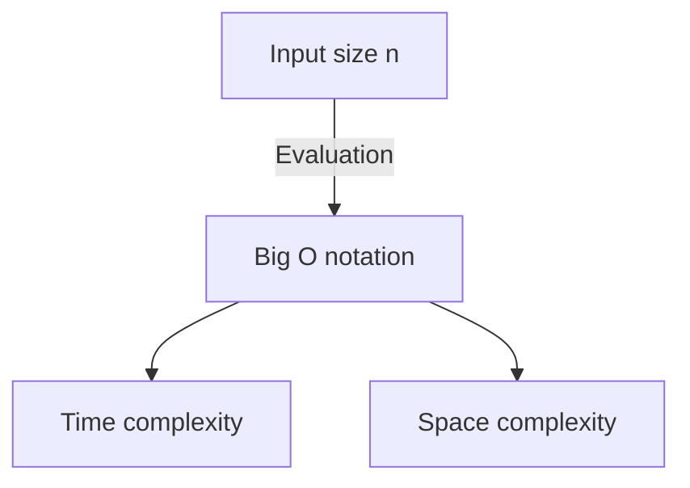

# Introduction

When learning programming, it is very important to understand the efficiency of algorithms. The concept of **complexity** always comes up. In this article, we will thoroughly explain everything from the basics of time complexity and space complexity to a detailed explanation of Big O notation, and deep insights with real examples, in a volume of about 20,000 characters.

# What is Complexity?

Complexity is an indicator used to evaluate the performance of an algorithm. Complexity is broadly divided into the following two types:

1. **Time Complexity** (Time Complexity)
2. **Space Complexity** (Space Complexity)

## 1. Time Complexity

Time complexity is an indicator that represents the "time" or "number of steps" required for an algorithm to complete its execution.

## 2. Space Complexity

Space complexity is an indicator that represents the "memory space" required for an algorithm to complete its execution.

# What is Big O Notation?

Big O notation (Big O Notation) is a mathematical notation that indicates the upper bound of the rate of increase in complexity when the input size $n becomes sufficiently large.

$$
O(f(n)) = \{ g(n) \mid \text{There exist positive constants } c, n_0 \text{ such that for all } n \ge n_0, 0 \le g(n) \le c f(n) \}
$$

## Basic Rules of Big O Notation

1. **Ignore constant terms**: $O(2n) becomes $O(n).
2. **Keep only the most dominant term**: $O(n^2 + n) becomes $O(n^2).

# Common Time Complexities and Real Examples in Python

From here, let's look at detailed explanations and Python code examples for common classes of Big O notation.

## 1. O(1) : Constant Time (Constant Time)

This is an algorithm where the processing always completes in a constant number of steps, regardless of the input size $n.

`python
def get_first_element(arr):
    # O(1) because it just gets the first element of the array
    return arr[0] if arr else None
`

## 2. O(log n) : Logarithmic Time (Logarithmic Time)

As the input size $n increases, the execution time increases, but the pace of increase is very slow. A typical example is binary search.

`python
def binary_search(arr, target):
    left, right = 0, len(arr) - 1
    while left <= right:
        mid = (left + right) // 2
        if arr[mid] == target:
            return mid
        elif arr[mid] < target:
            left = mid + 1
        else:
            right = mid - 1
    return -1
`

## 3. O(n) : Linear Time (Linear Time)

This is an algorithm where the execution time increases proportionally to the input size $n.

`python
def linear_search(arr, target):
    for i in range(len(arr)):
        if arr[i] == target:
            return i
    return -1
`

## 4. O(n log n) : Linearithmic Time (Linearithmic Time)

This is the product of O(n) and O(log n). Many efficient comparison sorting algorithms (merge sort, quick sort, heap sort, etc.) have this complexity.

`python
def merge_sort(arr):
    if len(arr) <= 1:
        return arr
    mid = len(arr) // 2
    left = merge_sort(arr[:mid])
    right = merge_sort(arr[mid:])
    return merge(left, right)

def merge(left, right):
    result = []
    i = j = 0
    while i < len(left) and j < len(right):
        if left[i] < right[j]:
            result.append(left[i])
            i += 1
        else:
            result.append(right[j])
            j += 1
    result.extend(left[i:])
    result.extend(right[j:])
    return result
`

## 5. O(n^2) : Quadratic Time (Quadratic Time)

The execution time increases in proportion to the square of the input size $n. Simple sorting algorithms like bubble sort and insertion sort fall into this category.

`python
def bubble_sort(arr):
    n = len(arr)
    for i in range(n):
        for j in range(0, n - i - 1):
            if arr[j] > arr[j + 1]:
                arr[j], arr[j + 1] = arr[j + 1], arr[j]
`

## 6. O(2^n) : Exponential Time (Exponential Time)

The execution time doubles every time the input size $n increases by 1. A simple recursive implementation of the Fibonacci sequence falls into this category.

`python
def fibonacci_recursive(n):
    if n <= 1:
        return n
    return fibonacci_recursive(n - 1) + fibonacci_recursive(n - 2)
`

## 7. O(n!) : Factorial Time (Factorial Time)

The execution time increases in proportion to the factorial of the input size. A full search (brute-force) for the traveling salesperson problem falls into this category.

`python
import itertools

def traveling_salesperson_brute_force(distances):
    n = len(distances)
    cities = list(range(n))
    min_path = float('inf')
    
    for perm in itertools.permutations(cities):
        current_path = 0
        for i in range(n - 1):
            current_path += distances[perm[i]][perm[i+1]]
        current_path += distances[perm[-1]][perm[0]] # Return
        if current_path < min_path:
            min_path = current_path
            
    return min_path
`

# Data Structures and Complexity

| Data Structure | Access | Search | Insertion | Deletion | Space Complexity |
|---|---|---|---|---|---|
| Array | $O(1) | $O(n) | $O(n) | $O(n) | $O(n) |
| Linked List | $O(n) | $O(n) | $O(1) | $O(1) | $O(n) |
| [Hash Table](https://kenji.blog/en/p/search-algorithms-linear-binary-hash-table-principles/) | - | $O(1) | $O(1) | $O(1) | $O(n) |
| BST | $O(\log n) | $O(\log n) | $O(\log n) | $O(\log n) | $O(n) |

# [Sorting Algorithm](https://kenji.blog/en/p/sorting-algorithms-visualized-bubble-quick-merge/)s and Complexity

| Algorithm | Best | Average | Worst | Space Complexity |
|---|---|---|---|---|
| Bubble Sort | $O(n) | $O(n^2) | $O(n^2) | $O(1) |
| Merge Sort | $O(n \log n) | $O(n \log n) | $O(n \log n) | $O(n) |
| Quick Sort | $O(n \log n) | $O(n \log n) | $O(n^2) | $O(\log n) |
# Introduction

When learning programming, it is very important to understand the efficiency of algorithms. The concept of **complexity** always comes up. In this article, we will thoroughly explain everything from the basics of time complexity and space complexity to a detailed explanation of Big O notation, and deep insights with real examples, in a volume of about 20,000 characters.

# What is Complexity?

Complexity is an indicator used to evaluate the performance of an algorithm. Complexity is broadly divided into the following two types:

1. **Time Complexity** (Time Complexity)
2. **Space Complexity** (Space Complexity)

## 7. O(n!) : Factorial Time (Factorial Time)

The execution time increases in proportion to the factorial of the input size. A full search (brute-force) for the traveling salesperson problem falls into this category.

`python
import itertools

def traveling_salesperson_brute_force(distances):
    n = len(distances)
    cities = list(range(n))
    min_path = float('inf')
    
    for perm in itertools.permutations(cities):
        current_path = 0
        for i in range(n - 1):
            current_path += distances[perm[i]][perm[i+1]]
        current_path += distances[perm[-1]][perm[0]] # Return
        if current_path < min_path:
            min_path = current_path
            
    return min_path
`

# Data Structures and Complexity

| Data Structure | Access | Search | Insertion | Deletion | Space Complexity |
|---|---|---|---|---|---|
| Array | $O(1) | $O(n) | $O(n) | $O(n) | $O(n) |
| Linked List | $O(n) | $O(n) | $O(1) | $O(1) | $O(n) |
| [Hash Table](https://kenji.blog/en/p/search-algorithms-linear-binary-hash-table-principles/) | - | $O(1) | $O(1) | $O(1) | $O(n) |
| BST | $O(\log n) | $O(\log n) | $O(\log n) | $O(\log n) | $O(n) |

# [Sorting Algorithm](https://kenji.blog/en/p/sorting-algorithms-visualized-bubble-quick-merge/)s and Complexity

| Algorithm | Best | Average | Worst | Space Complexity |
|---|---|---|---|---|
| Bubble Sort | $O(n) | $O(n^2) | $O(n^2) | $O(1) |
| Merge Sort | $O(n \log n) | $O(n \log n) | $O(n \log n) | $O(n) |
| Quick Sort | $O(n \log n) | $O(n \log n) | $O(n^2) | $O(\log n) |
