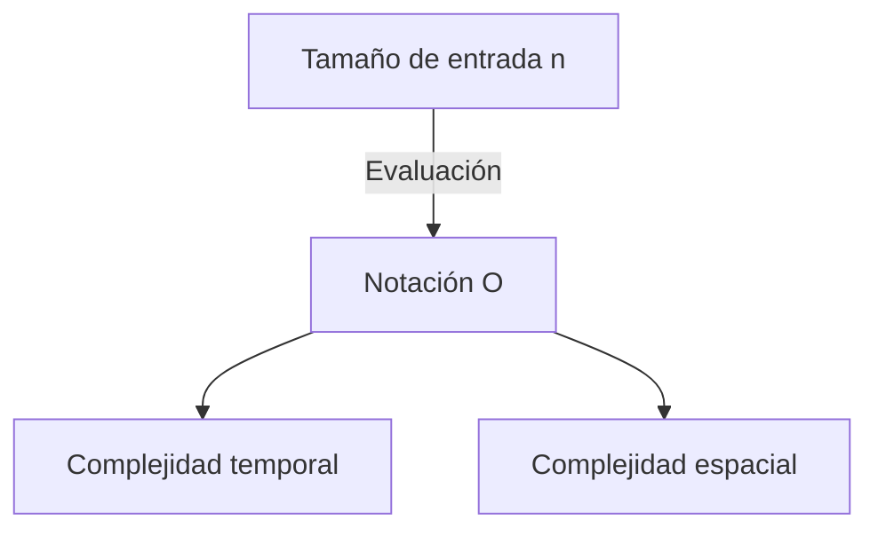

# Introducción

Al aprender programación, es muy importante comprender la eficiencia de los algoritmos. En ese contexto, siempre aparece el concepto de ** complejidad ** (Complexity). En este artículo, explicaremos detalladamente desde los fundamentos de la complejidad temporal y la complejidad espacial, hasta una explicación detallada de la notación O (notación Big O), y reflexiones profundas con ejemplos prácticos, en un volumen de aproximadamente 20.000 caracteres.

# ¿Qué es la complejidad?

La complejidad es un indicador para evaluar el rendimiento de un algoritmo. La complejidad se puede dividir a grandes rasgos en las siguientes dos:

1. ** Complejidad temporal ** (Time Complexity)
2. ** Complejidad espacial ** (Space Complexity)

## 1. Complejidad temporal

La complejidad temporal es un indicador que representa el "tiempo" o la "cantidad de pasos" necesarios para que un algoritmo complete su ejecución.

## 2. Complejidad espacial

La complejidad espacial es un indicador que representa el "espacio de memoria" necesario para que un algoritmo complete su ejecución.

# ¿Qué es la notación O (notación Big O)?

La notación O (Big O Notation) es una notación matemática que muestra el límite superior de la tasa de aumento de la complejidad cuando el tamaño de la entrada $n$ se vuelve suficientemente grande.

$$
O(f(n)) = \{ g(n) \mid \text{Existen constantes positivas } c, n_0 \text{ tales que para todo } n \ge n_0 \text{ se cumple } 0 \le g(n) \le c f(n) \}
$$

## Reglas básicas de la notación O

1. ** Ignorar términos constantes ** : $O(2n)$ se convierte en $O(n)$.
2. ** Conservar solo el término con mayor impacto ** : $O(n^2 + n)$ se convierte en $O(n^2)$.



# Complejidades temporales representativas y ejemplos prácticos en Python

A partir de aquí, veamos una explicación detallada y ejemplos de código en Python sobre las clases representativas de la notación O.

## 1. O(1) : Tiempo constante (Constant Time)

Es un algoritmo cuyo procesamiento se completa en una cantidad de pasos siempre constante, independientemente del tamaño de la entrada $n$.

```python
def get_first_element(arr):
    # Como solo obtiene el primer elemento del arreglo, es O(1)
    return arr[0] if arr else None
```

## 2. O(log n) : Tiempo logarítmico (Logarithmic Time)

A medida que el tamaño de la entrada $n$ aumenta, el tiempo de ejecución aumenta, pero el ritmo de aumento es muy gradual. Un ejemplo representativo es la búsqueda binaria.

```python
def binary_search(arr, target):
    left, right = 0, len(arr) - 1
    while left <= right:
        mid = (left + right) // 2
        if arr[mid] == target:
            return mid
        elif arr[mid] < target:
            left = mid + 1
        else:
            right = mid - 1
    return -1
```

## 3. O(n) : Tiempo lineal (Linear Time)

Es un algoritmo donde el tiempo de ejecución aumenta proporcionalmente al tamaño de la entrada $n$.

```python
def linear_search(arr, target):
    for i in range(len(arr)):
        if arr[i] == target:
            return i
    return -1
```

## 4. O(n log n) : Tiempo cuasilineal (Linearithmic Time)

Es el producto de O(n) y O(log n). Muchos algoritmos de ordenamiento eficientes basados en comparaciones (Merge Sort, Quick Sort, [Heap](https://kenji.blog/es/p/c-language-pointers-memory-management-stack-heap/) Sort, etc.) tienen esta complejidad.

```python
def merge_sort(arr):
    if len(arr) <= 1:
        return arr
    mid = len(arr) // 2
    left = merge_sort(arr[:mid])
    right = merge_sort(arr[mid:])
    return merge(left, right)

def merge(left, right):
    result = []
    i = j = 0
    while i < len(left) and j < len(right):
        if left[i] < right[j]:
            result.append(left[i])
            i += 1
        else:
            result.append(right[j])
            j += 1
    result.extend(left[i:])
    result.extend(right[j:])
    return result
```

## 5. O(n^2) : Tiempo cuadrático (Quadratic Time)

El tiempo de ejecución aumenta proporcionalmente al cuadrado del tamaño de la entrada $n$. Corresponde a algoritmos de ordenamiento simples como Bubble Sort y Insertion Sort.

```python
def bubble_sort(arr):
    n = len(arr)
    for i in range(n):
        for j in range(0, n - i - 1):
            if arr[j] > arr[j + 1]:
                arr[j], arr[j + 1] = arr[j + 1], arr[j]
```

## 6. O(2^n) : Tiempo exponencial (Exponential Time)

Cada vez que el tamaño de la entrada $n$ aumenta en 1, el tiempo de ejecución se duplica. Un ejemplo es la implementación recursiva simple de la secuencia de Fibonacci.

```python
def fibonacci_recursive(n):
    if n <= 1:
        return n
    return fibonacci_recursive(n - 1) + fibonacci_recursive(n - 2)
```

## 7. O(n!) : Tiempo factorial (Factorial Time)

El tiempo de ejecución aumenta proporcionalmente al factorial del tamaño de la entrada. Un ejemplo es la búsqueda exhaustiva (fuerza bruta) del problema del agente viajero.

```python
import itertools

def traveling_salesperson_brute_force(distances):
    n = len(distances)
    cities = list(range(n))
    min_path = float('inf')
    
    for perm in itertools.permutations(cities):
        current_path = 0
        for i in range(n - 1):
            current_path += distances[perm[i]][perm[i+1]]
        current_path += distances[perm[-1]][perm[0]] # Volver
        if current_path < min_path:
            min_path = current_path
            
    return min_path
```

# Estructuras de datos y complejidad

| Estructura de datos | Acceso | Búsqueda | Inserción | Eliminación | Complejidad espacial |
|---|---|---|---|---|---|
| Array | $O(1)$ | $O(n)$ | $O(n)$ | $O(n)$ | $O(n)$ |
| Linked List | $O(n)$ | $O(n)$ | $O(1)$ | $O(1)$ | $O(n)$ |
| [Hash Table](https://kenji.blog/es/p/search-algorithms-linear-binary-hash-table-principles/) | - | $O(1)$ | $O(1)$ | $O(1)$ | $O(n)$ |
| BST | $O(\log n)$ | $O(\log n)$ | $O(\log n)$ | $O(\log n)$ | $O(n)$ |

# Algoritmos de ordenamiento y complejidad

| Algoritmo | Mejor caso | Caso promedio | Peor caso | Complejidad espacial |
|---|---|---|---|---|
| Bubble Sort | $O(n)$ | $O(n^2)$ | $O(n^2)$ | $O(1)$ |
| Merge Sort | $O(n \log n)$ | $O(n \log n)$ | $O(n \log n)$ | $O(n)$ |
| Quick Sort | $O(n \log n)$ | $O(n \log n)$ | $O(n^2)$ | $O(\log n)$ |

# Introducción

Al aprender programación, es muy importante comprender la eficiencia de los algoritmos. En ese contexto, siempre aparece el concepto de ** complejidad ** (Complexity). En este artículo, explicaremos detalladamente desde los fundamentos de la complejidad temporal y la complejidad espacial, hasta una explicación detallada de la notación O (notación Big O), y reflexiones profundas con ejemplos prácticos, en un volumen de aproximadamente 20.000 caracteres.

# ¿Qué es la complejidad?

La complejidad es un indicador para evaluar el rendimiento de un algoritmo. La complejidad se puede dividir a grandes rasgos en las siguientes dos:

1. ** Complejidad temporal ** (Time Complexity)
2. ** Complejidad espacial ** (Space Complexity)

## 7. O(n!) : Tiempo factorial (Factorial Time)

El tiempo de ejecución aumenta proporcionalmente al factorial del tamaño de la entrada. Un ejemplo es la búsqueda exhaustiva (fuerza bruta) del problema del agente viajero.

```python
import itertools

def traveling_salesperson_brute_force(distances):
    n = len(distances)
    cities = list(range(n))
    min_path = float('inf')
    
    for perm in itertools.permutations(cities):
        current_path = 0
        for i in range(n - 1):
            current_path += distances[perm[i]][perm[i+1]]
        current_path += distances[perm[-1]][perm[0]] # Volver
        if current_path < min_path:
            min_path = current_path
            
    return min_path
```

# Estructuras de datos y complejidad

| Estructura de datos | Acceso | Búsqueda | Inserción | Eliminación | Complejidad espacial |
|---|---|---|---|---|---|
| Array | $O(1)$ | $O(n)$ | $O(n)$ | $O(n)$ | $O(n)$ |
| Linked List | $O(n)$ | $O(n)$ | $O(1)$ | $O(1)$ | $O(n)$ |
| [Hash Table](https://kenji.blog/es/p/search-algorithms-linear-binary-hash-table-principles/) | - | $O(1)$ | $O(1)$ | $O(1)$ | $O(n)$ |
| BST | $O(\log n)$ | $O(\log n)$ | $O(\log n)$ | $O(\log n)$ | $O(n)$ |

# Algoritmos de ordenamiento y complejidad

| Algoritmo | Mejor caso | Caso promedio | Peor caso | Complejidad espacial |
|---|---|---|---|---|
| Bubble Sort | $O(n)$ | $O(n^2)$ | $O(n^2)$ | $O(1)$ |
| Merge Sort | $O(n \log n)$ | $O(n \log n)$ | $O(n \log n)$ | $O(n)$ |
| Quick Sort | $O(n \log n)$ | $O(n \log n)$ | $O(n^2)$ | $O(\log n)$ |

