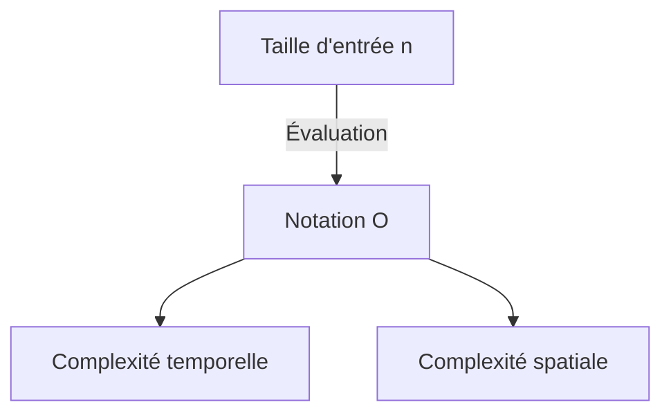

# Introduction

Lors de l'apprentissage de la programmation, il est extrêmement important de comprendre l'efficacité des algorithmes. Le concept de ** complexité ** (Complexity) apparaît invariablement dans ce contexte. Cet article explique en détail les bases de la complexité temporelle et spatiale, avec une explication approfondie de la notation O (notation Big O) et des considérations approfondies avec des exemples concrets, dans un volume d'environ 20 000 caractères.

# Qu'est-ce que la complexité ?

La complexité est un indicateur permettant d'évaluer les performances d'un algorithme. La complexité se divise principalement en deux catégories :

1. ** Complexité temporelle ** (Time Complexity)
2. ** Complexité spatiale ** (Space Complexity)

## 1. Complexité temporelle

La complexité temporelle est un indicateur représentant le « temps » ou le « nombre d'étapes » nécessaire pour qu'un algorithme termine son exécution.

## 2. Complexité spatiale

La complexité spatiale est un indicateur représentant « l'espace mémoire » nécessaire pour qu'un algorithme termine son exécution.

# Qu'est-ce que la notation O (notation Big O) ?

La notation O (Big O Notation) est une notation mathématique indiquant la limite supérieure du taux d'augmentation de la complexité lorsque la taille de l'entrée $n$ devient suffisamment grande.

$$
O(f(n)) = \{ g(n) \mid 	ext{il existe une constante positive } c, n_0 	ext{ telle que pour tout } n \ge n_0 	ext{, on a } 0 \le g(n) \le c f(n) \}
$$

## Règles de base de la notation O

1. ** Ignorer les termes constants ** : $O(2n)$ devient $O(n)$.
2. ** Ne conserver que le terme ayant le plus grand impact ** : $O(n^2 + n)$ devient $O(n^2)$.



# Exemples de complexités temporelles représentatives en Python

À partir de là, examinons les explications détaillées et des exemples de code en Python pour les classes de notation O représentatives.

## 1. O(1) : Temps constant (Constant Time)

Il s'agit d'un algorithme dont le traitement se termine toujours en un nombre constant d'étapes, indépendamment de la taille de l'entrée $n$.

```python
def get_first_element(arr):
    # On obtient juste le premier élément du tableau donc O(1)
    return arr[0] if arr else None
```

## 2. O(log n) : Temps logarithmique (Logarithmic Time)

À mesure que la taille de l'entrée $n$ augmente, le temps d'exécution augmente, mais le rythme de cette augmentation est très lent. Un exemple typique est la recherche dichotomique.

```python
def binary_search(arr, target):
    left, right = 0, len(arr) - 1
    while left <= right:
        mid = (left + right) // 2
        if arr[mid] == target:
            return mid
        elif arr[mid] < target:
            left = mid + 1
        else:
            right = mid - 1
    return -1
```

## 3. O(n) : Temps linéaire (Linear Time)

C'est un algorithme dont le temps d'exécution augmente proportionnellement à la taille de l'entrée $n$.

```python
def linear_search(arr, target):
    for i in range(len(arr)):
        if arr[i] == target:
            return i
    return -1
```

## 4. O(n log n) : Temps quasi-linéaire (Linearithmic Time)

C'est le produit de O(n) et O(log n). De nombreux algorithmes de tri par comparaison efficaces (tri fusion, tri rapide, tri par tas, etc.) possèdent cette complexité.

```python
def merge_sort(arr):
    if len(arr) <= 1:
        return arr
    mid = len(arr) // 2
    left = merge_sort(arr[:mid])
    right = merge_sort(arr[mid:])
    return merge(left, right)

def merge(left, right):
    result = []
    i = j = 0
    while i < len(left) and j < len(right):
        if left[i] < right[j]:
            result.append(left[i])
            i += 1
        else:
            result.append(right[j])
            j += 1
    result.extend(left[i:])
    result.extend(right[j:])
    return result
```

## 5. O(n^2) : Temps quadratique (Quadratic Time)

Le temps d'exécution augmente proportionnellement au carré de la taille de l'entrée $n$. Les algorithmes de tri simples, tels que le tri à bulles et le tri par insertion, entrent dans cette catégorie.

```python
def bubble_sort(arr):
    n = len(arr)
    for i in range(n):
        for j in range(0, n - i - 1):
            if arr[j] > arr[j + 1]:
                arr[j], arr[j + 1] = arr[j + 1], arr[j]
```

## 6. O(2^n) : Temps exponentiel (Exponential Time)

Chaque fois que la taille de l'entrée $n$ augmente de 1, le temps d'exécution double. Une implémentation récursive simple de la suite de Fibonacci en est un exemple.

```python
def fibonacci_recursive(n):
    if n <= 1:
        return n
    return fibonacci_recursive(n - 1) + fibonacci_recursive(n - 2)
```

## 7. O(n!) : Temps factoriel (Factorial Time)

Le temps d'exécution augmente proportionnellement à la factorielle de la taille de l'entrée. La recherche exhaustive (force brute) pour le problème du voyageur de commerce en est un exemple.

```python
import itertools

def traveling_salesperson_brute_force(distances):
    n = len(distances)
    cities = list(range(n))
    min_path = float('inf')
    
    for perm in itertools.permutations(cities):
        current_path = 0
        for i in range(n - 1):
            current_path += distances[perm[i]][perm[i+1]]
        current_path += distances[perm[-1]][perm[0]] # Retourner
        if current_path < min_path:
            min_path = current_path
            
    return min_path
```

# Structures de données et complexités

| Structure de données | Accès | Recherche | Insertion | Suppression | Complexité spatiale |
|---|---|---|---|---|---|
| Array | $O(1)$ | $O(n)$ | $O(n)$ | $O(n)$ | $O(n)$ |
| Linked List | $O(n)$ | $O(n)$ | $O(1)$ | $O(1)$ | $O(n)$ |
| [Hash Table](https://kenji.blog/fr/p/search-algorithms-linear-binary-hash-table-principles/) | - | $O(1)$ | $O(1)$ | $O(1)$ | $O(n)$ |
| BST | $O(\log n)$ | $O(\log n)$ | $O(\log n)$ | $O(\log n)$ | $O(n)$ |

# Algorithmes de tri et complexités

| Algorithme | Meilleur cas | Cas moyen | Pire cas | Complexité spatiale |
|---|---|---|---|---|
| Bubble Sort | $O(n)$ | $O(n^2)$ | $O(n^2)$ | $O(1)$ |
| Merge Sort | $O(n \log n)$ | $O(n \log n)$ | $O(n \log n)$ | $O(n)$ |
| Quick Sort | $O(n \log n)$ | $O(n \log n)$ | $O(n^2)$ | $O(\log n)$ |


# Introduction

Lors de l'apprentissage de la programmation, il est extrêmement important de comprendre l'efficacité des algorithmes. Le concept de ** complexité ** (Complexity) apparaît invariablement dans ce contexte. Cet article explique en détail les bases de la complexité temporelle et spatiale, avec une explication approfondie de la notation O (notation Big O) et des considérations approfondies avec des exemples concrets, dans un volume d'environ 20 000 caractères.

# Qu'est-ce que la complexité ?

La complexité est un indicateur permettant d'évaluer les performances d'un algorithme. La complexité se divise principalement en deux catégories :

1. ** Complexité temporelle ** (Time Complexity)
2. ** Complexité spatiale ** (Space Complexity)

## 7. O(n!) : Temps factoriel (Factorial Time)

Le temps d'exécution augmente proportionnellement à la factorielle de la taille de l'entrée. La recherche exhaustive (force brute) pour le problème du voyageur de commerce en est un exemple.

```python
import itertools

def traveling_salesperson_brute_force(distances):
    n = len(distances)
    cities = list(range(n))
    min_path = float('inf')
    
    for perm in itertools.permutations(cities):
        current_path = 0
        for i in range(n - 1):
            current_path += distances[perm[i]][perm[i+1]]
        current_path += distances[perm[-1]][perm[0]] # Retourner
        if current_path < min_path:
            min_path = current_path
            
    return min_path
```

# Structures de données et complexités

| Structure de données | Accès | Recherche | Insertion | Suppression | Complexité spatiale |
|---|---|---|---|---|---|
| Array | $O(1)$ | $O(n)$ | $O(n)$ | $O(n)$ | $O(n)$ |
| Linked List | $O(n)$ | $O(n)$ | $O(1)$ | $O(1)$ | $O(n)$ |
| [Hash Table](https://kenji.blog/fr/p/search-algorithms-linear-binary-hash-table-principles/) | - | $O(1)$ | $O(1)$ | $O(1)$ | $O(n)$ |
| BST | $O(\log n)$ | $O(\log n)$ | $O(\log n)$ | $O(\log n)$ | $O(n)$ |

# Algorithmes de tri et complexités

| Algorithme | Meilleur cas | Cas moyen | Pire cas | Complexité spatiale |
|---|---|---|---|---|
| Bubble Sort | $O(n)$ | $O(n^2)$ | $O(n^2)$ | $O(1)$ |
| Merge Sort | $O(n \log n)$ | $O(n \log n)$ | $O(n \log n)$ | $O(n)$ |
| Quick Sort | $O(n \log n)$ | $O(n \log n)$ | $O(n^2)$ | $O(\log n)$ |


