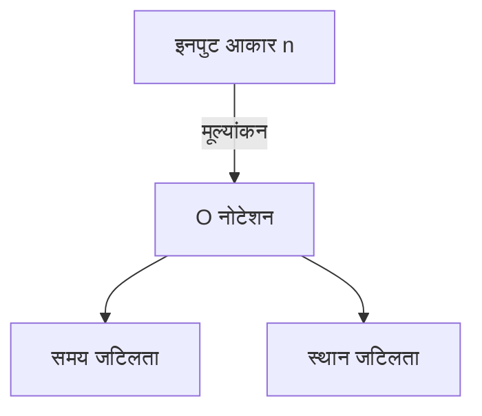

# परिचय

प्रोग्रामिंग सीखते समय, एल्गोरिदम की दक्षता को समझना बहुत महत्वपूर्ण है। इसमें ** जटिलता ** (Complexity) की अवधारणा हमेशा सामने आती है। इस लेख में, हम समय जटिलता और स्थान जटिलता की मूल बातों से लेकर, O नोटेशन (Big O Notation) की विस्तृत व्याख्या और उदाहरणों के साथ गहरी समझ तक, लगभग 20,000 वर्णों में गहराई से चर्चा करेंगे।

# जटिलता क्या है

एल्गोरिदम के प्रदर्शन का मूल्यांकन करने के लिए जटिलता एक मीट्रिक है। जटिलता को मुख्य रूप से निम्नलिखित 2 भागों में विभाजित किया जा सकता है।

1. ** समय जटिलता ** (Time Complexity)
2. ** स्थान जटिलता ** (Space Complexity)

## 1. समय जटिलता

समय जटिलता एक मीट्रिक है जो एल्गोरिदम को पूरा होने में लगने वाले "समय" या "चरणों की संख्या" को दर्शाती है।

## 2. स्थान जटिलता

स्थान जटिलता एक मीट्रिक है जो एल्गोरिदम को पूरा होने में लगने वाले "मेमोरी स्थान" को दर्शाती है।

# O नोटेशन (बिग ओ नोटेशन) क्या है

O नोटेशन (Big O Notation) एक गणितीय नोटेशन है जो इनपुट आकार $n$ के पर्याप्त रूप से बड़ा होने पर जटिलता में वृद्धि दर की ऊपरी सीमा को दर्शाता है।

$$
O(f(n)) = \{ g(n) \mid \text{कुछ धनात्मक स्थिरांक } c, n_0 \text{ मौजूद हैं, और सभी } n \ge n_0 \text{ के लिए } 0 \le g(n) \le c f(n) \text{ को पूरा करते हैं} \}
$$

## O नोटेशन के मूल नियम

1. ** स्थिरांक पदों को अनदेखा करना ** : $O(2n)$, $O(n)$ हो जाता है।
2. ** केवल सबसे प्रभावशाली पद को रखना ** : $O(n^2 + n)$, $O(n^2)$ हो जाता है।



# विशिष्ट समय जटिलताएं और Python के साथ उदाहरण

यहां से, आइए विशिष्ट O नोटेशन वर्गों के बारे में विस्तृत व्याख्या और Python कोड उदाहरण देखें।

## 1. O(1) : निरंतर समय (Constant Time)

यह एक ऐसा एल्गोरिदम है जो इनपुट आकार $n$ की परवाह किए बिना हमेशा एक निश्चित संख्या में चरणों में पूरा होता है।

```python
def get_first_element(arr):
    # केवल सरणी का पहला तत्व प्राप्त कर रहे हैं इसलिए O(1)
    return arr[0] if arr else None
```

## 2. O(log n) : लघुगणकीय समय (Logarithmic Time)

जैसे-जैसे इनपुट आकार $n$ बढ़ता है, निष्पादन का समय भी बढ़ता है, लेकिन वृद्धि की दर बहुत धीमी होती है। इसका एक विशिष्ट उदाहरण बाइनरी सर्च है।

```python
def binary_search(arr, target):
    left, right = 0, len(arr) - 1
    while left <= right:
        mid = (left + right) // 2
        if arr[mid] == target:
            return mid
        elif arr[mid] < target:
            left = mid + 1
        else:
            right = mid - 1
    return -1
```

## 3. O(n) : रैखिक समय (Linear Time)

यह एक एल्गोरिदम है जिसमें निष्पादन का समय इनपुट आकार $n$ के अनुपात में बढ़ता है।

```python
def linear_search(arr, target):
    for i in range(len(arr)):
        if arr[i] == target:
            return i
    return -1
```

## 4. O(n log n) : अर्ध-रैखिक समय (Linearithmic Time)

यह O(n) और O(log n) का गुणनफल है। कई कुशल तुलनात्मक छँटाई एल्गोरिदम (मर्ज सॉर्ट, क्विक सॉर्ट, हीप सॉर्ट आदि) में यह जटिलता होती है।

```python
def merge_sort(arr):
    if len(arr) <= 1:
        return arr
    mid = len(arr) // 2
    left = merge_sort(arr[:mid])
    right = merge_sort(arr[mid:])
    return merge(left, right)

def merge(left, right):
    result = []
    i = j = 0
    while i < len(left) and j < len(right):
        if left[i] < right[j]:
            result.append(left[i])
            i += 1
        else:
            result.append(right[j])
            j += 1
    result.extend(left[i:])
    result.extend(right[j:])
    return result
```

## 5. O(n^2) : द्विघाती समय (Quadratic Time)

निष्पादन का समय इनपुट आकार $n$ के वर्ग के अनुपात में बढ़ता है। बबल सॉर्ट और इंसर्शन सॉर्ट जैसे सरल छँटाई एल्गोरिदम इसके अंतर्गत आते हैं।

```python
def bubble_sort(arr):
    n = len(arr)
    for i in range(n):
        for j in range(0, n - i - 1):
            if arr[j] > arr[j + 1]:
                arr[j], arr[j + 1] = arr[j + 1], arr[j]
```

## 6. O(2^n) : घातांकीय समय (Exponential Time)

प्रत्येक बार जब इनपुट आकार $n$ 1 से बढ़ता है, तो निष्पादन का समय दोगुना हो जाता है। फाइबोनैचि अनुक्रम का सरल पुनरावर्ती कार्यान्वयन इसके अंतर्गत आता है।

```python
def fibonacci_recursive(n):
    if n <= 1:
        return n
    return fibonacci_recursive(n - 1) + fibonacci_recursive(n - 2)
```

## 7. O(n!) : फैक्टोरियल समय (Factorial Time)

निष्पादन का समय इनपुट आकार के फैक्टोरियल के अनुपात में बढ़ता है। ट्रैवलिंग सेल्समैन समस्या की संपूर्ण खोज (ब्रूट फोर्स) इसके अंतर्गत आती है।

```python
import itertools

def traveling_salesperson_brute_force(distances):
    n = len(distances)
    cities = list(range(n))
    min_path = float('inf')
    
    for perm in itertools.permutations(cities):
        current_path = 0
        for i in range(n - 1):
            current_path += distances[perm[i]][perm[i+1]]
        current_path += distances[perm[-1]][perm[0]] # वापस आएं
        if current_path < min_path:
            min_path = current_path
            
    return min_path
```

# डेटा संरचनाएं और जटिलता

| डेटा संरचना | एक्सेस | खोज | इन्सर्ट | डिलीट | स्थान जटिलता |
|---|---|---|---|---|---|
| Array | $O(1)$ | $O(n)$ | $O(n)$ | $O(n)$ | $O(n)$ |
| Linked List | $O(n)$ | $O(n)$ | $O(1)$ | $O(1)$ | $O(n)$ |
| [Hash Table](https://kenji.blog/hi/p/search-algorithms-linear-binary-hash-table-principles/) | - | $O(1)$ | $O(1)$ | $O(1)$ | $O(n)$ |
| BST | $O(\log n)$ | $O(\log n)$ | $O(\log n)$ | $O(\log n)$ | $O(n)$ |

# छँटाई एल्गोरिदम और जटिलता

| एल्गोरिदम | सबसे अच्छा | औसत | सबसे खराब | स्थान जटिलता |
|---|---|---|---|---|
| Bubble Sort | $O(n)$ | $O(n^2)$ | $O(n^2)$ | $O(1)$ |
| Merge Sort | $O(n \log n)$ | $O(n \log n)$ | $O(n \log n)$ | $O(n)$ |
| Quick Sort | $O(n \log n)$ | $O(n \log n)$ | $O(n^2)$ | $O(\log n)$ |
