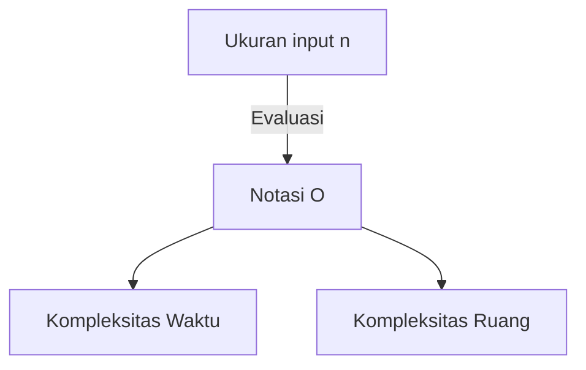

# Pengantar

Dalam mempelajari pemrograman, memahami efisiensi algoritma sangatlah penting. Konsep yang selalu muncul dalam hal ini adalah **kompleksitas** (Complexity). Artikel ini akan membahas secara menyeluruh mulai dari dasar-dasar kompleksitas waktu dan ruang, penjelasan rinci tentang notasi O (notasi Big O), hingga observasi mendalam dengan contoh nyata, dengan volume sekitar 20 ribu karakter.

# Apa itu Kompleksitas?

Kompleksitas adalah indikator untuk mengevaluasi kinerja algoritma. Secara garis besar, kompleksitas dibagi menjadi 2:

1. **Kompleksitas Waktu** (Time Complexity)
2. **Kompleksitas Ruang** (Space Complexity)

## 1. Kompleksitas Waktu

Kompleksitas waktu adalah indikator yang menunjukkan "waktu" atau "jumlah langkah" yang diperlukan algoritma untuk menyelesaikan eksekusinya.

## 2. Kompleksitas Ruang

Kompleksitas ruang adalah indikator yang menunjukkan "ruang memori" yang diperlukan algoritma untuk menyelesaikan eksekusinya.

# Apa itu Notasi O (Notasi Big-O)?

Notasi O (Big O Notation) adalah notasi matematis yang menunjukkan batas atas laju pertumbuhan kompleksitas ketika ukuran input $n$ menjadi cukup besar.

$$
O(f(n)) = \{ g(n) \mid \text{Terdapat konstanta positif } c, n_0 \text{, sehingga untuk semua } n \ge n_0 \text{ memenuhi } 0 \le g(n) \le c f(n) \}
$$

## Aturan Dasar Notasi O

1. **Mengabaikan Konstanta** : $O(2n)$ menjadi $O(n)$.
2. **Hanya Menyimpan Suku Paling Berpengaruh** : $O(n^2 + n)$ menjadi $O(n^2)$.



# Kompleksitas Waktu Representatif dan Contoh di Python

Selanjutnya, mari kita lihat penjelasan rinci dan contoh kode Python untuk kelas notasi O yang representatif.

## 1. O(1) : Waktu Konstan (Constant Time)

Algoritma ini selalu selesai dalam jumlah langkah yang tetap, berapapun ukuran input $n$.

```python
def get_first_element(arr):
    # Hanya mengambil elemen pertama dari array sehingga O(1)
    return arr[0] if arr else None
```

## 2. O(log n) : Waktu Logaritmik (Logarithmic Time)

Waktu eksekusi meningkat seiring bertambahnya ukuran input $n$, tetapi kecepatan peningkatannya sangat lambat. Contoh umumnya adalah pencarian biner (binary search).

```python
def binary_search(arr, target):
    left, right = 0, len(arr) - 1
    while left <= right:
        mid = (left + right) // 2
        if arr[mid] == target:
            return mid
        elif arr[mid] < target:
            left = mid + 1
        else:
            right = mid - 1
    return -1
```

## 3. O(n) : Waktu Linear (Linear Time)

Algoritma di mana waktu eksekusinya meningkat sebanding dengan ukuran input $n$.

```python
def linear_search(arr, target):
    for i in range(len(arr)):
        if arr[i] == target:
            return i
    return -1
```

## 4. O(n log n) : Waktu Kuasi-linear (Linearithmic Time)

Hasil kali antara O(n) dan O(log n). Banyak algoritma pengurutan perbandingan yang efisien (seperti merge sort, quick sort, heap sort) memiliki kompleksitas ini.

```python
def merge_sort(arr):
    if len(arr) <= 1:
        return arr
    mid = len(arr) // 2
    left = merge_sort(arr[:mid])
    right = merge_sort(arr[mid:])
    return merge(left, right)

def merge(left, right):
    result = []
    i = j = 0
    while i < len(left) and j < len(right):
        if left[i] < right[j]:
            result.append(left[i])
            i += 1
        else:
            result.append(right[j])
            j += 1
    result.extend(left[i:])
    result.extend(right[j:])
    return result
```

## 5. O(n^2) : Waktu Kuadratik (Quadratic Time)

Waktu eksekusi meningkat sebanding dengan kuadrat dari ukuran input $n$. Algoritma pengurutan sederhana seperti bubble sort dan insertion sort termasuk dalam kategori ini.

```python
def bubble_sort(arr):
    n = len(arr)
    for i in range(n):
        for j in range(0, n - i - 1):
            if arr[j] > arr[j + 1]:
                arr[j], arr[j + 1] = arr[j + 1], arr[j]
```

## 6. O(2^n) : Waktu Eksponensial (Exponential Time)

Setiap kali ukuran input $n$ bertambah 1, waktu eksekusinya menjadi 2 kali lipat. Contoh dari ini adalah implementasi rekursif sederhana dari deret Fibonacci.

```python
def fibonacci_recursive(n):
    if n <= 1:
        return n
    return fibonacci_recursive(n - 1) + fibonacci_recursive(n - 2)
```

## 7. O(n!) : Waktu Faktorial (Factorial Time)

Waktu eksekusi meningkat sebanding dengan faktorial ukuran input. Pencarian lengkap (brute force) pada masalah pedagang keliling (traveling salesperson problem) termasuk dalam kategori ini.

```python
import itertools

def traveling_salesperson_brute_force(distances):
    n = len(distances)
    cities = list(range(n))
    min_path = float('inf')
    
    for perm in itertools.permutations(cities):
        current_path = 0
        for i in range(n - 1):
            current_path += distances[perm[i]][perm[i+1]]
        current_path += distances[perm[-1]][perm[0]] # Kembali
        if current_path < min_path:
            min_path = current_path
            
    return min_path
```

# Struktur Data dan Kompleksitas

| Struktur Data | Akses | Pencarian | Penyisipan | Penghapusan | Kompleksitas Ruang |
|---|---|---|---|---|---|
| Array | $O(1)$ | $O(n)$ | $O(n)$ | $O(n)$ | $O(n)$ |
| Linked List | $O(n)$ | $O(n)$ | $O(1)$ | $O(1)$ | $O(n)$ |
| [Hash Table](https://kenji.blog/id/p/search-algorithms-linear-binary-hash-table-principles/) | - | $O(1)$ | $O(1)$ | $O(1)$ | $O(n)$ |
| BST | $O(\log n)$ | $O(\log n)$ | $O(\log n)$ | $O(\log n)$ | $O(n)$ |

# Algoritma Pengurutan dan Kompleksitas

| Algoritma | Terbaik | Rata-rata | Terburuk | Kompleksitas Ruang |
|---|---|---|---|---|
| Bubble Sort | $O(n)$ | $O(n^2)$ | $O(n^2)$ | $O(1)$ |
| Merge Sort | $O(n \log n)$ | $O(n \log n)$ | $O(n \log n)$ | $O(n)$ |
| Quick Sort | $O(n \log n)$ | $O(n \log n)$ | $O(n^2)$ | $O(\log n)$ |
