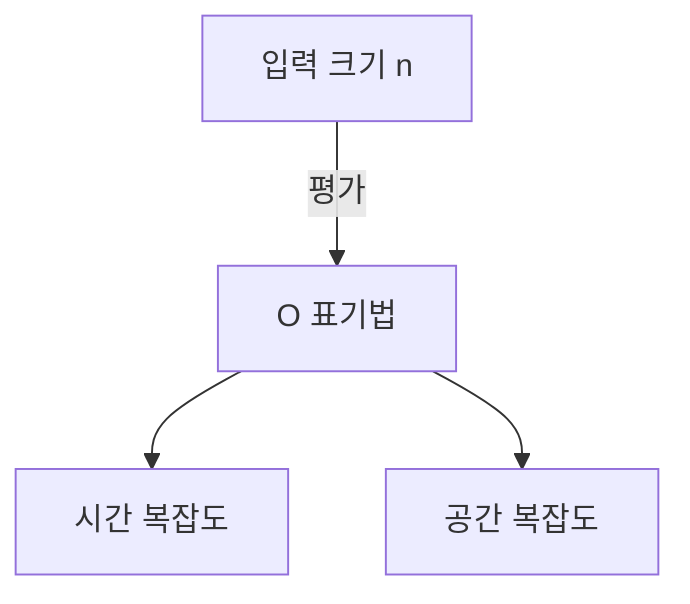

# 들어가며

프로그래밍을 배울 때, 알고리즘의 효율성을 이해하는 것은 매우 중요합니다. 그때 반드시 등장하는 것이 ** 복잡도 ** (Complexity)라는 개념입니다. 이 글에서는 시간 복잡도와 공간 복잡도의 기초부터 O 표기법(빅오 표기법)의 상세한 해설, 그리고 실례를 곁들인 깊은 고찰까지, 약 2만 자 분량으로 철저히 해설합니다.

# 복잡도란 무엇인가

알고리즘의 성능을 평가하기 위한 지표가 복잡도입니다. 복잡도에는 크게 나누어 다음 두 가지가 존재합니다.

1. ** 시간 복잡도 ** (Time Complexity)
2. ** 공간 복잡도 ** (Space Complexity)

## 1. 시간 복잡도

시간 복잡도란, 알고리즘이 실행을 완료할 때까지 필요한 '시간' 혹은 '단계 수'를 나타내는 지표입니다.

## 2. 공간 복잡도

공간 복잡도란, 알고리즘이 실행을 완료할 때까지 필요한 '메모리 공간'을 나타내는 지표입니다.

# O 표기법(빅오 표기법)이란

O 표기법(Big O Notation)은 입력 크기 $n$이 충분히 커졌을 때, 복잡도 증가율의 상한을 나타내는 수학적 표기법입니다.

$$
O(f(n)) = \{ g(n) \mid \text{어떤 양의 상수 } c, n_0 \text{ 가 존재하고, 모든 } n \ge n_0 \text{ 에 대해 } 0 \le g(n) \le c f(n) \text{ 을 만족함} \}
$$

## O 표기법의 기본 규칙

1. ** 상수항 무시 ** : $O(2n)$ 은 $O(n)$ 이 됩니다.
2. ** 가장 영향이 큰 항만 남김 ** : $O(n^2 + n)$ 은 $O(n^2)$ 이 됩니다.



# 대표적인 시간 복잡도와 Python을 통한 실례

지금부터는 대표적인 O 표기법 클래스에 대해 상세한 해설과 Python 코드 예제를 살펴보겠습니다.

## 1. O(1) : 상수 시간 (Constant Time)

입력 크기 $n$과 관계없이, 항상 일정한 단계 수로 처리가 완료되는 알고리즘입니다.

```python
def get_first_element(arr):
    # 배열의 첫 번째 요소를 가져오기만 하므로 O(1)
    return arr[0] if arr else None
```

## 2. O(log n) : 로그 시간 (Logarithmic Time)

입력 크기 $n$이 늘어남에 따라 실행 시간이 증가하지만, 그 증가 속도가 매우 완만합니다. 대표적인 예는 이진 탐색입니다.

```python
def binary_search(arr, target):
    left, right = 0, len(arr) - 1
    while left <= right:
        mid = (left + right) // 2
        if arr[mid] == target:
            return mid
        elif arr[mid] < target:
            left = mid + 1
        else:
            right = mid - 1
    return -1
```

## 3. O(n) : 선형 시간 (Linear Time)

입력 크기 $n$에 비례하여 실행 시간이 증가하는 알고리즘입니다.

```python
def linear_search(arr, target):
    for i in range(len(arr)):
        if arr[i] == target:
            return i
    return -1
```

## 4. O(n log n) : 선형 로그 시간 (Linearithmic Time)

O(n)과 O(log n)의 곱입니다. 많은 효율적인 비교 정렬 알고리즘(병합 정렬, 퀵 정렬, 힙 정렬 등)이 이 복잡도를 가집니다.

```python
def merge_sort(arr):
    if len(arr) <= 1:
        return arr
    mid = len(arr) // 2
    left = merge_sort(arr[:mid])
    right = merge_sort(arr[mid:])
    return merge(left, right)

def merge(left, right):
    result = []
    i = j = 0
    while i < len(left) and j < len(right):
        if left[i] < right[j]:
            result.append(left[i])
            i += 1
        else:
            result.append(right[j])
            j += 1
    result.extend(left[i:])
    result.extend(right[j:])
    return result
```

## 5. O(n^2) : 이차 시간 (Quadratic Time)

입력 크기 $n$의 제곱에 비례하여 실행 시간이 증가합니다. 버블 정렬이나 삽입 정렬 등의 단순한 정렬 알고리즘이 해당합니다.

```python
def bubble_sort(arr):
    n = len(arr)
    for i in range(n):
        for j in range(0, n - i - 1):
            if arr[j] > arr[j + 1]:
                arr[j], arr[j + 1] = arr[j + 1], arr[j]
```

## 6. O(2^n) : 지수 시간 (Exponential Time)

입력 크기 $n$이 1 늘어날 때마다 실행 시간이 2배가 됩니다. 피보나치 수열의 단순한 재귀 구현 등이 해당합니다.

```python
def fibonacci_recursive(n):
    if n <= 1:
        return n
    return fibonacci_recursive(n - 1) + fibonacci_recursive(n - 2)
```

## 7. O(n!) : 팩토리얼 시간 (Factorial Time)

입력 크기의 팩토리얼에 비례하여 실행 시간이 증가합니다. 순회 외판원 문제의 완전 탐색(브루트 포스) 등이 해당합니다.

```python
import itertools

def traveling_salesperson_brute_force(distances):
    n = len(distances)
    cities = list(range(n))
    min_path = float('inf')
    
    for perm in itertools.permutations(cities):
        current_path = 0
        for i in range(n - 1):
            current_path += distances[perm[i]][perm[i+1]]
        current_path += distances[perm[-1]][perm[0]] # 돌아오기
        if current_path < min_path:
            min_path = current_path
            
    return min_path
```

# 데이터 구조와 복잡도

| 데이터 구조 | 접근 | 검색 | 삽입 | 삭제 | 공간 복잡도 |
|---|---|---|---|---|---|
| Array | $O(1)$ | $O(n)$ | $O(n)$ | $O(n)$ | $O(n)$ |
| Linked List | $O(n)$ | $O(n)$ | $O(1)$ | $O(1)$ | $O(n)$ |
| [Hash Table](https://kenji.blog/ko/p/search-algorithms-linear-binary-hash-table-principles/) | - | $O(1)$ | $O(1)$ | $O(1)$ | $O(n)$ |
| BST | $O(\log n)$ | $O(\log n)$ | $O(\log n)$ | $O(\log n)$ | $O(n)$ |

# 정렬 알고리즘과 복잡도

| 알고리즘 | 최선 | 평균 | 최악 | 공간 복잡도 |
|---|---|---|---|---|
| Bubble Sort | $O(n)$ | $O(n^2)$ | $O(n^2)$ | $O(1)$ |
| Merge Sort | $O(n \log n)$ | $O(n \log n)$ | $O(n \log n)$ | $O(n)$ |
| Quick Sort | $O(n \log n)$ | $O(n \log n)$ | $O(n^2)$ | $O(\log n)$ |

# 들어가며

프로그래밍을 배울 때, 알고리즘의 효율성을 이해하는 것은 매우 중요합니다. 그때 반드시 등장하는 것이 ** 복잡도 ** (Complexity)라는 개념입니다. 이 글에서는 시간 복잡도와 공간 복잡도의 기초부터 O 표기법(빅오 표기법)의 상세한 해설, 그리고 실례를 곁들인 깊은 고찰까지, 약 2만 자 분량으로 철저히 해설합니다.

# 복잡도란 무엇인가

알고리즘의 성능을 평가하기 위한 지표가 복잡도입니다. 복잡도에는 크게 나누어 다음 두 가지가 존재합니다.

1. ** 시간 복잡도 ** (Time Complexity)
2. ** 공간 복잡도 ** (Space Complexity)

## 1. 시간 복잡도

시간 복잡도란, 알고리즘이 실행을 완료할 때까지 필요한 '시간' 혹은 '단계 수'를 나타내는 지표입니다.

## 2. 공간 복잡도

공간 복잡도란, 알고리즘이 실행을 완료할 때까지 필요한 '메모리 공간'을 나타내는 지표입니다.

# O 표기법(빅오 표기법)이란

O 표기법(Big O Notation)은 입력 크기 $n$이 충분히 커졌을 때, 복잡도 증가율의 상한을 나타내는 수학적 표기법입니다.

$$
O(f(n)) = \{ g(n) \mid \text{어떤 양의 상수 } c, n_0 \text{ 가 존재하고, 모든 } n \ge n_0 \text{ 에 대해 } 0 \le g(n) \le c f(n) \text{ 을 만족함} \}
$$

## O 표기법의 기본 규칙

1. ** 상수항 무시 ** : $O(2n)$ 은 $O(n)$ 이 됩니다.
2. ** 가장 영향이 큰 항만 남김 ** : $O(n^2 + n)$ 은 $O(n^2)$ 이 됩니다.


# 대표적인 시간 복잡도와 Python을 통한 실례

지금부터는 대표적인 O 표기법 클래스에 대해 상세한 해설과 Python 코드 예제를 살펴보겠습니다.

## 1. O(1) : 상수 시간 (Constant Time)

입력 크기 $n$과 관계없이, 항상 일정한 단계 수로 처리가 완료되는 알고리즘입니다.

```python
def get_first_element(arr):
    # 배열의 첫 번째 요소를 가져오기만 하므로 O(1)
    return arr[0] if arr else None
```

## 2. O(log n) : 로그 시간 (Logarithmic Time)

입력 크기 $n$이 늘어남에 따라 실행 시간이 증가하지만, 그 증가 속도가 매우 완만합니다. 대표적인 예는 이진 탐색입니다.

```python
def binary_search(arr, target):
    left, right = 0, len(arr) - 1
    while left <= right:
        mid = (left + right) // 2
        if arr[mid] == target:
            return mid
        elif arr[mid] < target:
            left = mid + 1
        else:
            right = mid - 1
    return -1
```

## 3. O(n) : 선형 시간 (Linear Time)

입력 크기 $n$에 비례하여 실행 시간이 증가하는 알고리즘입니다.

```python
def linear_search(arr, target):
    for i in range(len(arr)):
        if arr[i] == target:
            return i
    return -1
```

## 4. O(n log n) : 선형 로그 시간 (Linearithmic Time)

O(n)과 O(log n)의 곱입니다. 많은 효율적인 비교 정렬 알고리즘(병합 정렬, 퀵 정렬, 힙 정렬 등)이 이 복잡도를 가집니다.

```python
def merge_sort(arr):
    if len(arr) <= 1:
        return arr
    mid = len(arr) // 2
    left = merge_sort(arr[:mid])
    right = merge_sort(arr[mid:])
    return merge(left, right)

def merge(left, right):
    result = []
    i = j = 0
    while i < len(left) and j < len(right):
        if left[i] < right[j]:
            result.append(left[i])
            i += 1
        else:
            result.append(right[j])
            j += 1
    result.extend(left[i:])
    result.extend(right[j:])
    return result
```

## 5. O(n^2) : 이차 시간 (Quadratic Time)

입력 크기 $n$의 제곱에 비례하여 실행 시간이 증가합니다. 버블 정렬이나 삽입 정렬 등의 단순한 정렬 알고리즘이 해당합니다.

```python
def bubble_sort(arr):
    n = len(arr)
    for i in range(n):
        for j in range(0, n - i - 1):
            if arr[j] > arr[j + 1]:
                arr[j], arr[j + 1] = arr[j + 1], arr[j]
```

## 6. O(2^n) : 지수 시간 (Exponential Time)

입력 크기 $n$이 1 늘어날 때마다 실행 시간이 2배가 됩니다. 피보나치 수열의 단순한 재귀 구현 등이 해당합니다.

```python
def fibonacci_recursive(n):
    if n <= 1:
        return n
    return fibonacci_recursive(n - 1) + fibonacci_recursive(n - 2)
```

## 7. O(n!) : 팩토리얼 시간 (Factorial Time)

입력 크기의 팩토리얼에 비례하여 실행 시간이 증가합니다. 순회 외판원 문제의 완전 탐색(브루트 포스) 등이 해당합니다.

```python
import itertools

def traveling_salesperson_brute_force(distances):
    n = len(distances)
    cities = list(range(n))
    min_path = float('inf')
    
    for perm in itertools.permutations(cities):
        current_path = 0
        for i in range(n - 1):
            current_path += distances[perm[i]][perm[i+1]]
        current_path += distances[perm[-1]][perm[0]] # 돌아오기
        if current_path < min_path:
            min_path = current_path
            
    return min_path
```

# 데이터 구조와 복잡도

| 데이터 구조 | 접근 | 검색 | 삽입 | 삭제 | 공간 복잡도 |
|---|---|---|---|---|---|
| Array | $O(1)$ | $O(n)$ | $O(n)$ | $O(n)$ | $O(n)$ |
| Linked List | $O(n)$ | $O(n)$ | $O(1)$ | $O(1)$ | $O(n)$ |
| [Hash Table](https://kenji.blog/ko/p/search-algorithms-linear-binary-hash-table-principles/) | - | $O(1)$ | $O(1)$ | $O(1)$ | $O(n)$ |
| BST | $O(\log n)$ | $O(\log n)$ | $O(\log n)$ | $O(\log n)$ | $O(n)$ |

# 정렬 알고리즘과 복잡도

| 알고리즘 | 최선 | 평균 | 최악 | 공간 복잡도 |
|---|---|---|---|---|
| Bubble Sort | $O(n)$ | $O(n^2)$ | $O(n^2)$ | $O(1)$ |
| Merge Sort | $O(n \log n)$ | $O(n \log n)$ | $O(n \log n)$ | $O(n)$ |
| Quick Sort | $O(n \log n)$ | $O(n \log n)$ | $O(n^2)$ | $O(\log n)$ |

# 들어가며

프로그래밍을 배울 때, 알고리즘의 효율성을 이해하는 것은 매우 중요합니다. 그때 반드시 등장하는 것이 ** 복잡도 ** (Complexity)라는 개념입니다. 이 글에서는 시간 복잡도와 공간 복잡도의 기초부터 O 표기법(빅오 표기법)의 상세한 해설, 그리고 실례를 곁들인 깊은 고찰까지, 약 2만 자 분량으로 철저히 해설합니다.

# 복잡도란 무엇인가

알고리즘의 성능을 평가하기 위한 지표가 복잡도입니다. 복잡도에는 크게 나누어 다음 두 가지가 존재합니다.

1. ** 시간 복잡도 ** (Time Complexity)
2. ** 공간 복잡도 ** (Space Complexity)

## 1. 시간 복잡도

시간 복잡도란, 알고리즘이 실행을 완료할 때까지 필요한 '시간' 혹은 '단계 수'를 나타내는 지표입니다.

## 2. 공간 복잡도

공간 복잡도란, 알고리즘이 실행을 완료할 때까지 필요한 '메모리 공간'을 나타내는 지표입니다.

# O 표기법(빅오 표기법)이란

O 표기법(Big O Notation)은 입력 크기 $n$이 충분히 커졌을 때, 복잡도 증가율의 상한을 나타내는 수학적 표기법입니다.

$$
O(f(n)) = \{ g(n) \mid \text{어떤 양의 상수 } c, n_0 \text{ 가 존재하고, 모든 } n \ge n_0 \text{ 에 대해 } 0 \le g(n) \le c f(n) \text{ 을 만족함} \}
$$

## O 표기법의 기본 규칙

1. ** 상수항 무시 ** : $O(2n)$ 은 $O(n)$ 이 됩니다.
2. ** 가장 영향이 큰 항만 남김 ** : $O(n^2 + n)$ 은 $O(n^2)$ 이 됩니다.


# 대표적인 시간 복잡도와 Python을 통한 실례

지금부터는 대표적인 O 표기법 클래스에 대해 상세한 해설과 Python 코드 예제를 살펴보겠습니다.

## 1. O(1) : 상수 시간 (Constant Time)

입력 크기 $n$과 관계없이, 항상 일정한 단계 수로 처리가 완료되는 알고리즘입니다.

```python
def get_first_element(arr):
    # 배열의 첫 번째 요소를 가져오기만 하므로 O(1)
    return arr[0] if arr else None
```

## 2. O(log n) : 로그 시간 (Logarithmic Time)

입력 크기 $n$이 늘어남에 따라 실행 시간이 증가하지만, 그 증가 속도가 매우 완만합니다. 대표적인 예는 이진 탐색입니다.

```python
def binary_search(arr, target):
    left, right = 0, len(arr) - 1
    while left <= right:
        mid = (left + right) // 2
        if arr[mid] == target:
            return mid
        elif arr[mid] < target:
            left = mid + 1
        else:
            right = mid - 1
    return -1
```

## 3. O(n) : 선형 시간 (Linear Time)

입력 크기 $n$에 비례하여 실행 시간이 증가하는 알고리즘입니다.

```python
def linear_search(arr, target):
    for i in range(len(arr)):
        if arr[i] == target:
            return i
    return -1
```

## 4. O(n log n) : 선형 로그 시간 (Linearithmic Time)

O(n)과 O(log n)의 곱입니다. 많은 효율적인 비교 정렬 알고리즘(병합 정렬, 퀵 정렬, 힙 정렬 등)이 이 복잡도를 가집니다.

```python
def merge_sort(arr):
    if len(arr) <= 1:
        return arr
    mid = len(arr) // 2
    left = merge_sort(arr[:mid])
    right = merge_sort(arr[mid:])
    return merge(left, right)

def merge(left, right):
    result = []
    i = j = 0
    while i < len(left) and j < len(right):
        if left[i] < right[j]:
            result.append(left[i])
            i += 1
        else:
            result.append(right[j])
            j += 1
    result.extend(left[i:])
    result.extend(right[j:])
    return result
```

## 5. O(n^2) : 이차 시간 (Quadratic Time)

입력 크기 $n$의 제곱에 비례하여 실행 시간이 증가합니다. 버블 정렬이나 삽입 정렬 등의 단순한 정렬 알고리즘이 해당합니다.

```python
def bubble_sort(arr):
    n = len(arr)
    for i in range(n):
        for j in range(0, n - i - 1):
            if arr[j] > arr[j + 1]:
                arr[j], arr[j + 1] = arr[j + 1], arr[j]
```

## 6. O(2^n) : 지수 시간 (Exponential Time)

입력 크기 $n$이 1 늘어날 때마다 실행 시간이 2배가 됩니다. 피보나치 수열의 단순한 재귀 구현 등이 해당합니다.

```python
def fibonacci_recursive(n):
    if n <= 1:
        return n
    return fibonacci_recursive(n - 1) + fibonacci_recursive(n - 2)
```

## 7. O(n!) : 팩토리얼 시간 (Factorial Time)

입력 크기의 팩토리얼에 비례하여 실행 시간이 증가합니다. 순회 외판원 문제의 완전 탐색(브루트 포스) 등이 해당합니다.

```python
import itertools

def traveling_salesperson_brute_force(distances):
    n = len(distances)
    cities = list(range(n))
    min_path = float('inf')
    
    for perm in itertools.permutations(cities):
        current_path = 0
        for i in range(n - 1):
            current_path += distances[perm[i]][perm[i+1]]
        current_path += distances[perm[-1]][perm[0]] # 돌아오기
        if current_path < min_path:
            min_path = current_path
            
    return min_path
```

# 데이터 구조와 복잡도

| 데이터 구조 | 접근 | 검색 | 삽입 | 삭제 | 공간 복잡도 |
|---|---|---|---|---|---|
| Array | $O(1)$ | $O(n)$ | $O(n)$ | $O(n)$ | $O(n)$ |
| Linked List | $O(n)$ | $O(n)$ | $O(1)$ | $O(1)$ | $O(n)$ |
| [Hash Table](https://kenji.blog/ko/p/search-algorithms-linear-binary-hash-table-principles/) | - | $O(1)$ | $O(1)$ | $O(1)$ | $O(n)$ |
| BST | $O(\log n)$ | $O(\log n)$ | $O(\log n)$ | $O(\log n)$ | $O(n)$ |

# 정렬 알고리즘과 복잡도

| 알고리즘 | 최선 | 평균 | 최악 | 공간 복잡도 |
|---|---|---|---|---|
| Bubble Sort | $O(n)$ | $O(n^2)$ | $O(n^2)$ | $O(1)$ |
| Merge Sort | $O(n \log n)$ | $O(n \log n)$ | $O(n \log n)$ | $O(n)$ |
| Quick Sort | $O(n \log n)$ | $O(n \log n)$ | $O(n^2)$ | $O(\log n)$ |

# 들어가며

프로그래밍을 배울 때, 알고리즘의 효율성을 이해하는 것은 매우 중요합니다. 그때 반드시 등장하는 것이 ** 복잡도 ** (Complexity)라는 개념입니다. 이 글에서는 시간 복잡도와 공간 복잡도의 기초부터 O 표기법(빅오 표기법)의 상세한 해설, 그리고 실례를 곁들인 깊은 고찰까지, 약 2만 자 분량으로 철저히 해설합니다.

# 복잡도란 무엇인가

알고리즘의 성능을 평가하기 위한 지표가 복잡도입니다. 복잡도에는 크게 나누어 다음 두 가지가 존재합니다.

1. ** 시간 복잡도 ** (Time Complexity)
2. ** 공간 복잡도 ** (Space Complexity)

## 1. 시간 복잡도

시간 복잡도란, 알고리즘이 실행을 완료할 때까지 필요한 '시간' 혹은 '단계 수'를 나타내는 지표입니다.

## 2. 공간 복잡도

공간 복잡도란, 알고리즘이 실행을 완료할 때까지 필요한 '메모리 공간'을 나타내는 지표입니다.

# O 표기법(빅오 표기법)이란

O 표기법(Big O Notation)은 입력 크기 $n$이 충분히 커졌을 때, 복잡도 증가율의 상한을 나타내는 수학적 표기법입니다.

$$
O(f(n)) = \{ g(n) \mid \text{어떤 양의 상수 } c, n_0 \text{ 가 존재하고, 모든 } n \ge n_0 \text{ 에 대해 } 0 \le g(n) \le c f(n) \text{ 을 만족함} \}
$$

## O 표기법의 기본 규칙

1. ** 상수항 무시 ** : $O(2n)$ 은 $O(n)$ 이 됩니다.
2. ** 가장 영향이 큰 항만 남김 ** : $O(n^2 + n)$ 은 $O(n^2)$ 이 됩니다.


# 대표적인 시간 복잡도와 Python을 통한 실례

지금부터는 대표적인 O 표기법 클래스에 대해 상세한 해설과 Python 코드 예제를 살펴보겠습니다.

## 1. O(1) : 상수 시간 (Constant Time)

입력 크기 $n$과 관계없이, 항상 일정한 단계 수로 처리가 완료되는 알고리즘입니다.

```python
def get_first_element(arr):
    # 배열의 첫 번째 요소를 가져오기만 하므로 O(1)
    return arr[0] if arr else None
```

## 2. O(log n) : 로그 시간 (Logarithmic Time)

입력 크기 $n$이 늘어남에 따라 실행 시간이 증가하지만, 그 증가 속도가 매우 완만합니다. 대표적인 예는 이진 탐색입니다.

```python
def binary_search(arr, target):
    left, right = 0, len(arr) - 1
    while left <= right:
        mid = (left + right) // 2
        if arr[mid] == target:
            return mid
        elif arr[mid] < target:
            left = mid + 1
        else:
            right = mid - 1
    return -1
```

## 3. O(n) : 선형 시간 (Linear Time)

입력 크기 $n$에 비례하여 실행 시간이 증가하는 알고리즘입니다.

```python
def linear_search(arr, target):
    for i in range(len(arr)):
        if arr[i] == target:
            return i
    return -1
```

## 4. O(n log n) : 선형 로그 시간 (Linearithmic Time)

O(n)과 O(log n)의 곱입니다. 많은 효율적인 비교 정렬 알고리즘(병합 정렬, 퀵 정렬, 힙 정렬 등)이 이 복잡도를 가집니다.

```python
def merge_sort(arr):
    if len(arr) <= 1:
        return arr
    mid = len(arr) // 2
    left = merge_sort(arr[:mid])
    right = merge_sort(arr[mid:])
    return merge(left, right)

def merge(left, right):
    result = []
    i = j = 0
    while i < len(left) and j < len(right):
        if left[i] < right[j]:
            result.append(left[i])
            i += 1
        else:
            result.append(right[j])
            j += 1
    result.extend(left[i:])
    result.extend(right[j:])
    return result
```

## 5. O(n^2) : 이차 시간 (Quadratic Time)

입력 크기 $n$의 제곱에 비례하여 실행 시간이 증가합니다. 버블 정렬이나 삽입 정렬 등의 단순한 정렬 알고리즘이 해당합니다.

```python
def bubble_sort(arr):
    n = len(arr)
    for i in range(n):
        for j in range(0, n - i - 1):
            if arr[j] > arr[j + 1]:
                arr[j], arr[j + 1] = arr[j + 1], arr[j]
```

## 6. O(2^n) : 지수 시간 (Exponential Time)

입력 크기 $n$이 1 늘어날 때마다 실행 시간이 2배가 됩니다. 피보나치 수열의 단순한 재귀 구현 등이 해당합니다.

```python
def fibonacci_recursive(n):
    if n <= 1:
        return n
    return fibonacci_recursive(n - 1) + fibonacci_recursive(n - 2)
```

## 7. O(n!) : 팩토리얼 시간 (Factorial Time)

입력 크기의 팩토리얼에 비례하여 실행 시간이 증가합니다. 순회 외판원 문제의 완전 탐색(브루트 포스) 등이 해당합니다.

```python
import itertools

def traveling_salesperson_brute_force(distances):
    n = len(distances)
    cities = list(range(n))
    min_path = float('inf')
    
    for perm in itertools.permutations(cities):
        current_path = 0
        for i in range(n - 1):
            current_path += distances[perm[i]][perm[i+1]]
        current_path += distances[perm[-1]][perm[0]] # 돌아오기
        if current_path < min_path:
            min_path = current_path
            
    return min_path
```

# 데이터 구조와 복잡도

| 데이터 구조 | 접근 | 검색 | 삽입 | 삭제 | 공간 복잡도 |
|---|---|---|---|---|---|
| Array | $O(1)$ | $O(n)$ | $O(n)$ | $O(n)$ | $O(n)$ |
| Linked List | $O(n)$ | $O(n)$ | $O(1)$ | $O(1)$ | $O(n)$ |
| [Hash Table](https://kenji.blog/ko/p/search-algorithms-linear-binary-hash-table-principles/) | - | $O(1)$ | $O(1)$ | $O(1)$ | $O(n)$ |
| BST | $O(\log n)$ | $O(\log n)$ | $O(\log n)$ | $O(\log n)$ | $O(n)$ |

# 정렬 알고리즘과 복잡도

| 알고리즘 | 최선 | 평균 | 최악 | 공간 복잡도 |
|---|---|---|---|---|
| Bubble Sort | $O(n)$ | $O(n^2)$ | $O(n^2)$ | $O(1)$ |
| Merge Sort | $O(n \log n)$ | $O(n \log n)$ | $O(n \log n)$ | $O(n)$ |
| Quick Sort | $O(n \log n)$ | $O(n \log n)$ | $O(n^2)$ | $O(\log n)$ |

# 들어가며

프로그래밍을 배울 때, 알고리즘의 효율성을 이해하는 것은 매우 중요합니다. 그때 반드시 등장하는 것이 ** 복잡도 ** (Complexity)라는 개념입니다. 이 글에서는 시간 복잡도와 공간 복잡도의 기초부터 O 표기법(빅오 표기법)의 상세한 해설, 그리고 실례를 곁들인 깊은 고찰까지, 약 2만 자 분량으로 철저히 해설합니다.

# 복잡도란 무엇인가

알고리즘의 성능을 평가하기 위한 지표가 복잡도입니다. 복잡도에는 크게 나누어 다음 두 가지가 존재합니다.

1. ** 시간 복잡도 ** (Time Complexity)
2. ** 공간 복잡도 ** (Space Complexity)

## 1. 시간 복잡도

시간 복잡도란, 알고리즘이 실행을 완료할 때까지 필요한 '시간' 혹은 '단계 수'를 나타내는 지표입니다.

## 2. 공간 복잡도

공간 복잡도란, 알고리즘이 실행을 완료할 때까지 필요한 '메모리 공간'을 나타내는 지표입니다.

# O 표기법(빅오 표기법)이란

O 표기법(Big O Notation)은 입력 크기 $n$이 충분히 커졌을 때, 복잡도 증가율의 상한을 나타내는 수학적 표기법입니다.

$$
O(f(n)) = \{ g(n) \mid \text{어떤 양의 상수 } c, n_0 \text{ 가 존재하고, 모든 } n \ge n_0 \text{ 에 대해 } 0 \le g(n) \le c f(n) \text{ 을 만족함} \}
$$

## O 표기법의 기본 규칙

1. ** 상수항 무시 ** : $O(2n)$ 은 $O(n)$ 이 됩니다.
2. ** 가장 영향이 큰 항만 남김 ** : $O(n^2 + n)$ 은 $O(n^2)$ 이 됩니다.


# 대표적인 시간 복잡도와 Python을 통한 실례

지금부터는 대표적인 O 표기법 클래스에 대해 상세한 해설과 Python 코드 예제를 살펴보겠습니다.

## 1. O(1) : 상수 시간 (Constant Time)

입력 크기 $n$과 관계없이, 항상 일정한 단계 수로 처리가 완료되는 알고리즘입니다.

```python
def get_first_element(arr):
    # 배열의 첫 번째 요소를 가져오기만 하므로 O(1)
    return arr[0] if arr else None
```

## 2. O(log n) : 로그 시간 (Logarithmic Time)

입력 크기 $n$이 늘어남에 따라 실행 시간이 증가하지만, 그 증가 속도가 매우 완만합니다. 대표적인 예는 이진 탐색입니다.

```python
def binary_search(arr, target):
    left, right = 0, len(arr) - 1
    while left <= right:
        mid = (left + right) // 2
        if arr[mid] == target:
            return mid
        elif arr[mid] < target:
            left = mid + 1
        else:
            right = mid - 1
    return -1
```

## 3. O(n) : 선형 시간 (Linear Time)

입력 크기 $n$에 비례하여 실행 시간이 증가하는 알고리즘입니다.

```python
def linear_search(arr, target):
    for i in range(len(arr)):
        if arr[i] == target:
            return i
    return -1
```

## 4. O(n log n) : 선형 로그 시간 (Linearithmic Time)

O(n)과 O(log n)의 곱입니다. 많은 효율적인 비교 정렬 알고리즘(병합 정렬, 퀵 정렬, 힙 정렬 등)이 이 복잡도를 가집니다.

```python
def merge_sort(arr):
    if len(arr) <= 1:
        return arr
    mid = len(arr) // 2
    left = merge_sort(arr[:mid])
    right = merge_sort(arr[mid:])
    return merge(left, right)

def merge(left, right):
    result = []
    i = j = 0
    while i < len(left) and j < len(right):
        if left[i] < right[j]:
            result.append(left[i])
            i += 1
        else:
            result.append(right[j])
            j += 1
    result.extend(left[i:])
    result.extend(right[j:])
    return result
```

## 5. O(n^2) : 이차 시간 (Quadratic Time)

입력 크기 $n$의 제곱에 비례하여 실행 시간이 증가합니다. 버블 정렬이나 삽입 정렬 등의 단순한 정렬 알고리즘이 해당합니다.

```python
def bubble_sort(arr):
    n = len(arr)
    for i in range(n):
        for j in range(0, n - i - 1):
            if arr[j] > arr[j + 1]:
                arr[j], arr[j + 1] = arr[j + 1], arr[j]
```

## 6. O(2^n) : 지수 시간 (Exponential Time)

입력 크기 $n$이 1 늘어날 때마다 실행 시간이 2배가 됩니다. 피보나치 수열의 단순한 재귀 구현 등이 해당합니다.

```python
def fibonacci_recursive(n):
    if n <= 1:
        return n
    return fibonacci_recursive(n - 1) + fibonacci_recursive(n - 2)
```

## 7. O(n!) : 팩토리얼 시간 (Factorial Time)

입력 크기의 팩토리얼에 비례하여 실행 시간이 증가합니다. 순회 외판원 문제의 완전 탐색(브루트 포스) 등이 해당합니다.

```python
import itertools

def traveling_salesperson_brute_force(distances):
    n = len(distances)
    cities = list(range(n))
    min_path = float('inf')
    
    for perm in itertools.permutations(cities):
        current_path = 0
        for i in range(n - 1):
            current_path += distances[perm[i]][perm[i+1]]
        current_path += distances[perm[-1]][perm[0]] # 돌아오기
        if current_path < min_path:
            min_path = current_path
            
    return min_path
```

# 데이터 구조와 복잡도

| 데이터 구조 | 접근 | 검색 | 삽입 | 삭제 | 공간 복잡도 |
|---|---|---|---|---|---|
| Array | $O(1)$ | $O(n)$ | $O(n)$ | $O(n)$ | $O(n)$ |
| Linked List | $O(n)$ | $O(n)$ | $O(1)$ | $O(1)$ | $O(n)$ |
| [Hash Table](https://kenji.blog/ko/p/search-algorithms-linear-binary-hash-table-principles/) | - | $O(1)$ | $O(1)$ | $O(1)$ | $O(n)$ |
| BST | $O(\log n)$ | $O(\log n)$ | $O(\log n)$ | $O(\log n)$ | $O(n)$ |

# 정렬 알고리즘과 복잡도

| 알고리즘 | 최선 | 평균 | 최악 | 공간 복잡도 |
|---|---|---|---|---|
| Bubble Sort | $O(n)$ | $O(n^2)$ | $O(n^2)$ | $O(1)$ |
| Merge Sort | $O(n \log n)$ | $O(n \log n)$ | $O(n \log n)$ | $O(n)$ |
| Quick Sort | $O(n \log n)$ | $O(n \log n)$ | $O(n^2)$ | $O(\log n)$ |

# 들어가며

프로그래밍을 배울 때, 알고리즘의 효율성을 이해하는 것은 매우 중요합니다. 그때 반드시 등장하는 것이 ** 복잡도 ** (Complexity)라는 개념입니다. 이 글에서는 시간 복잡도와 공간 복잡도의 기초부터 O 표기법(빅오 표기법)의 상세한 해설, 그리고 실례를 곁들인 깊은 고찰까지, 약 2만 자 분량으로 철저히 해설합니다.

# 복잡도란 무엇인가

알고리즘의 성능을 평가하기 위한 지표가 복잡도입니다. 복잡도에는 크게 나누어 다음 두 가지가 존재합니다.

1. ** 시간 복잡도 ** (Time Complexity)
2. ** 공간 복잡도 ** (Space Complexity)

## 1. 시간 복잡도

시간 복잡도란, 알고리즘이 실행을 완료할 때까지 필요한 '시간' 혹은 '단계 수'를 나타내는 지표입니다.

## 2. 공간 복잡도

공간 복잡도란, 알고리즘이 실행을 완료할 때까지 필요한 '메모리 공간'을 나타내는 지표입니다.

# O 표기법(빅오 표기법)이란

O 표기법(Big O Notation)은 입력 크기 $n$이 충분히 커졌을 때, 복잡도 증가율의 상한을 나타내는 수학적 표기법입니다.

$$
O(f(n)) = \{ g(n) \mid \text{어떤 양의 상수 } c, n_0 \text{ 가 존재하고, 모든 } n \ge n_0 \text{ 에 대해 } 0 \le g(n) \le c f(n) \text{ 을 만족함} \}
$$

## O 표기법의 기본 규칙

1. ** 상수항 무시 ** : $O(2n)$ 은 $O(n)$ 이 됩니다.
2. ** 가장 영향이 큰 항만 남김 ** : $O(n^2 + n)$ 은 $O(n^2)$ 이 됩니다.


# 대표적인 시간 복잡도와 Python을 통한 실례

지금부터는 대표적인 O 표기법 클래스에 대해 상세한 해설과 Python 코드 예제를 살펴보겠습니다.

## 1. O(1) : 상수 시간 (Constant Time)

입력 크기 $n$과 관계없이, 항상 일정한 단계 수로 처리가 완료되는 알고리즘입니다.

```python
def get_first_element(arr):
    # 배열의 첫 번째 요소를 가져오기만 하므로 O(1)
    return arr[0] if arr else None
```

## 2. O(log n) : 로그 시간 (Logarithmic Time)

입력 크기 $n$이 늘어남에 따라 실행 시간이 증가하지만, 그 증가 속도가 매우 완만합니다. 대표적인 예는 이진 탐색입니다.

```python
def binary_search(arr, target):
    left, right = 0, len(arr) - 1
    while left <= right:
        mid = (left + right) // 2
        if arr[mid] == target:
            return mid
        elif arr[mid] < target:
            left = mid + 1
        else:
            right = mid - 1
    return -1
```

## 3. O(n) : 선형 시간 (Linear Time)

입력 크기 $n$에 비례하여 실행 시간이 증가하는 알고리즘입니다.

```python
def linear_search(arr, target):
    for i in range(len(arr)):
        if arr[i] == target:
            return i
    return -1
```

## 4. O(n log n) : 선형 로그 시간 (Linearithmic Time)

O(n)과 O(log n)의 곱입니다. 많은 효율적인 비교 정렬 알고리즘(병합 정렬, 퀵 정렬, 힙 정렬 등)이 이 복잡도를 가집니다.

```python
def merge_sort(arr):
    if len(arr) <= 1:
        return arr
    mid = len(arr) // 2
    left = merge_sort(arr[:mid])
    right = merge_sort(arr[mid:])
    return merge(left, right)

def merge(left, right):
    result = []
    i = j = 0
    while i < len(left) and j < len(right):
        if left[i] < right[j]:
            result.append(left[i])
            i += 1
        else:
            result.append(right[j])
            j += 1
    result.extend(left[i:])
    result.extend(right[j:])
    return result
```

## 5. O(n^2) : 이차 시간 (Quadratic Time)

입력 크기 $n$의 제곱에 비례하여 실행 시간이 증가합니다. 버블 정렬이나 삽입 정렬 등의 단순한 정렬 알고리즘이 해당합니다.

```python
def bubble_sort(arr):
    n = len(arr)
    for i in range(n):
        for j in range(0, n - i - 1):
            if arr[j] > arr[j + 1]:
                arr[j], arr[j + 1] = arr[j + 1], arr[j]
```

## 6. O(2^n) : 지수 시간 (Exponential Time)

입력 크기 $n$이 1 늘어날 때마다 실행 시간이 2배가 됩니다. 피보나치 수열의 단순한 재귀 구현 등이 해당합니다.

```python
def fibonacci_recursive(n):
    if n <= 1:
        return n
    return fibonacci_recursive(n - 1) + fibonacci_recursive(n - 2)
```

## 7. O(n!) : 팩토리얼 시간 (Factorial Time)

입력 크기의 팩토리얼에 비례하여 실행 시간이 증가합니다. 순회 외판원 문제의 완전 탐색(브루트 포스) 등이 해당합니다.

```python
import itertools

def traveling_salesperson_brute_force(distances):
    n = len(distances)
    cities = list(range(n))
    min_path = float('inf')
    
    for perm in itertools.permutations(cities):
        current_path = 0
        for i in range(n - 1):
            current_path += distances[perm[i]][perm[i+1]]
        current_path += distances[perm[-1]][perm[0]] # 돌아오기
        if current_path < min_path:
            min_path = current_path
            
    return min_path
```

# 데이터 구조와 복잡도

| 데이터 구조 | 접근 | 검색 | 삽입 | 삭제 | 공간 복잡도 |
|---|---|---|---|---|---|
| Array | $O(1)$ | $O(n)$ | $O(n)$ | $O(n)$ | $O(n)$ |
| Linked List | $O(n)$ | $O(n)$ | $O(1)$ | $O(1)$ | $O(n)$ |
| [Hash Table](https://kenji.blog/ko/p/search-algorithms-linear-binary-hash-table-principles/) | - | $O(1)$ | $O(1)$ | $O(1)$ | $O(n)$ |
| BST | $O(\log n)$ | $O(\log n)$ | $O(\log n)$ | $O(\log n)$ | $O(n)$ |

# 정렬 알고리즘과 복잡도

| 알고리즘 | 최선 | 평균 | 최악 | 공간 복잡도 |
|---|---|---|---|---|
| Bubble Sort | $O(n)$ | $O(n^2)$ | $O(n^2)$ | $O(1)$ |
| Merge Sort | $O(n \log n)$ | $O(n \log n)$ | $O(n \log n)$ | $O(n)$ |
| Quick Sort | $O(n \log n)$ | $O(n \log n)$ | $O(n^2)$ | $O(\log n)$ |

# 들어가며

프로그래밍을 배울 때, 알고리즘의 효율성을 이해하는 것은 매우 중요합니다. 그때 반드시 등장하는 것이 ** 복잡도 ** (Complexity)라는 개념입니다. 이 글에서는 시간 복잡도와 공간 복잡도의 기초부터 O 표기법(빅오 표기법)의 상세한 해설, 그리고 실례를 곁들인 깊은 고찰까지, 약 2만 자 분량으로 철저히 해설합니다.

# 복잡도란 무엇인가

알고리즘의 성능을 평가하기 위한 지표가 복잡도입니다. 복잡도에는 크게 나누어 다음 두 가지가 존재합니다.

1. ** 시간 복잡도 ** (Time Complexity)
2. ** 공간 복잡도 ** (Space Complexity)

## 1. 시간 복잡도

시간 복잡도란, 알고리즘이 실행을 완료할 때까지 필요한 '시간' 혹은 '단계 수'를 나타내는 지표입니다.

## 2. 공간 복잡도

공간 복잡도란, 알고리즘이 실행을 완료할 때까지 필요한 '메모리 공간'을 나타내는 지표입니다.

# O 표기법(빅오 표기법)이란

O 표기법(Big O Notation)은 입력 크기 $n$이 충분히 커졌을 때, 복잡도 증가율의 상한을 나타내는 수학적 표기법입니다.

$$
O(f(n)) = \{ g(n) \mid \text{어떤 양의 상수 } c, n_0 \text{ 가 존재하고, 모든 } n \ge n_0 \text{ 에 대해 } 0 \le g(n) \le c f(n) \text{ 을 만족함} \}
$$

## O 표기법의 기본 규칙

1. ** 상수항 무시 ** : $O(2n)$ 은 $O(n)$ 이 됩니다.
2. ** 가장 영향이 큰 항만 남김 ** : $O(n^2 + n)$ 은 $O(n^2)$ 이 됩니다.


# 대표적인 시간 복잡도와 Python을 통한 실례

지금부터는 대표적인 O 표기법 클래스에 대해 상세한 해설과 Python 코드 예제를 살펴보겠습니다.

## 1. O(1) : 상수 시간 (Constant Time)

입력 크기 $n$과 관계없이, 항상 일정한 단계 수로 처리가 완료되는 알고리즘입니다.

```python
def get_first_element(arr):
    # 배열의 첫 번째 요소를 가져오기만 하므로 O(1)
    return arr[0] if arr else None
```

## 2. O(log n) : 로그 시간 (Logarithmic Time)

입력 크기 $n$이 늘어남에 따라 실행 시간이 증가하지만, 그 증가 속도가 매우 완만합니다. 대표적인 예는 이진 탐색입니다.

```python
def binary_search(arr, target):
    left, right = 0, len(arr) - 1
    while left <= right:
        mid = (left + right) // 2
        if arr[mid] == target:
            return mid
        elif arr[mid] < target:
            left = mid + 1
        else:
            right = mid - 1
    return -1
```

## 3. O(n) : 선형 시간 (Linear Time)

입력 크기 $n$에 비례하여 실행 시간이 증가하는 알고리즘입니다.

```python
def linear_search(arr, target):
    for i in range(len(arr)):
        if arr[i] == target:
            return i
    return -1
```

## 4. O(n log n) : 선형 로그 시간 (Linearithmic Time)

O(n)과 O(log n)의 곱입니다. 많은 효율적인 비교 정렬 알고리즘(병합 정렬, 퀵 정렬, 힙 정렬 등)이 이 복잡도를 가집니다.

```python
def merge_sort(arr):
    if len(arr) <= 1:
        return arr
    mid = len(arr) // 2
    left = merge_sort(arr[:mid])
    right = merge_sort(arr[mid:])
    return merge(left, right)

def merge(left, right):
    result = []
    i = j = 0
    while i < len(left) and j < len(right):
        if left[i] < right[j]:
            result.append(left[i])
            i += 1
        else:
            result.append(right[j])
            j += 1
    result.extend(left[i:])
    result.extend(right[j:])
    return result
```

## 5. O(n^2) : 이차 시간 (Quadratic Time)

입력 크기 $n$의 제곱에 비례하여 실행 시간이 증가합니다. 버블 정렬이나 삽입 정렬 등의 단순한 정렬 알고리즘이 해당합니다.

```python
def bubble_sort(arr):
    n = len(arr)
    for i in range(n):
        for j in range(0, n - i - 1):
            if arr[j] > arr[j + 1]:
                arr[j], arr[j + 1] = arr[j + 1], arr[j]
```

## 6. O(2^n) : 지수 시간 (Exponential Time)

입력 크기 $n$이 1 늘어날 때마다 실행 시간이 2배가 됩니다. 피보나치 수열의 단순한 재귀 구현 등이 해당합니다.

```python
def fibonacci_recursive(n):
    if n <= 1:
        return n
    return fibonacci_recursive(n - 1) + fibonacci_recursive(n - 2)
```

## 7. O(n!) : 팩토리얼 시간 (Factorial Time)

입력 크기의 팩토리얼에 비례하여 실행 시간이 증가합니다. 순회 외판원 문제의 완전 탐색(브루트 포스) 등이 해당합니다.

```python
import itertools

def traveling_salesperson_brute_force(distances):
    n = len(distances)
    cities = list(range(n))
    min_path = float('inf')
    
    for perm in itertools.permutations(cities):
        current_path = 0
        for i in range(n - 1):
            current_path += distances[perm[i]][perm[i+1]]
        current_path += distances[perm[-1]][perm[0]] # 돌아오기
        if current_path < min_path:
            min_path = current_path
            
    return min_path
```

# 데이터 구조와 복잡도

| 데이터 구조 | 접근 | 검색 | 삽입 | 삭제 | 공간 복잡도 |
|---|---|---|---|---|---|
| Array | $O(1)$ | $O(n)$ | $O(n)$ | $O(n)$ | $O(n)$ |
| Linked List | $O(n)$ | $O(n)$ | $O(1)$ | $O(1)$ | $O(n)$ |
| [Hash Table](https://kenji.blog/ko/p/search-algorithms-linear-binary-hash-table-principles/) | - | $O(1)$ | $O(1)$ | $O(1)$ | $O(n)$ |
| BST | $O(\log n)$ | $O(\log n)$ | $O(\log n)$ | $O(\log n)$ | $O(n)$ |

# 정렬 알고리즘과 복잡도

| 알고리즘 | 최선 | 평균 | 최악 | 공간 복잡도 |
|---|---|---|---|---|
| Bubble Sort | $O(n)$ | $O(n^2)$ | $O(n^2)$ | $O(1)$ |
| Merge Sort | $O(n \log n)$ | $O(n \log n)$ | $O(n \log n)$ | $O(n)$ |
| Quick Sort | $O(n \log n)$ | $O(n \log n)$ | $O(n^2)$ | $O(\log n)$ |

# 들어가며

프로그래밍을 배울 때, 알고리즘의 효율성을 이해하는 것은 매우 중요합니다. 그때 반드시 등장하는 것이 ** 복잡도 ** (Complexity)라는 개념입니다. 이 글에서는 시간 복잡도와 공간 복잡도의 기초부터 O 표기법(빅오 표기법)의 상세한 해설, 그리고 실례를 곁들인 깊은 고찰까지, 약 2만 자 분량으로 철저히 해설합니다.

# 복잡도란 무엇인가

알고리즘의 성능을 평가하기 위한 지표가 복잡도입니다. 복잡도에는 크게 나누어 다음 두 가지가 존재합니다.

1. ** 시간 복잡도 ** (Time Complexity)
2. ** 공간 복잡도 ** (Space Complexity)

## 1. 시간 복잡도

시간 복잡도란, 알고리즘이 실행을 완료할 때까지 필요한 '시간' 혹은 '단계 수'를 나타내는 지표입니다.

## 2. 공간 복잡도

공간 복잡도란, 알고리즘이 실행을 완료할 때까지 필요한 '메모리 공간'을 나타내는 지표입니다.

# O 표기법(빅오 표기법)이란

O 표기법(Big O Notation)은 입력 크기 $n$이 충분히 커졌을 때, 복잡도 증가율의 상한을 나타내는 수학적 표기법입니다.

$$
O(f(n)) = \{ g(n) \mid \text{어떤 양의 상수 } c, n_0 \text{ 가 존재하고, 모든 } n \ge n_0 \text{ 에 대해 } 0 \le g(n) \le c f(n) \text{ 을 만족함} \}
$$

## O 표기법의 기본 규칙

1. ** 상수항 무시 ** : $O(2n)$ 은 $O(n)$ 이 됩니다.
2. ** 가장 영향이 큰 항만 남김 ** : $O(n^2 + n)$ 은 $O(n^2)$ 이 됩니다.


# 대표적인 시간 복잡도와 Python을 통한 실례

지금부터는 대표적인 O 표기법 클래스에 대해 상세한 해설과 Python 코드 예제를 살펴보겠습니다.

## 1. O(1) : 상수 시간 (Constant Time)

입력 크기 $n$과 관계없이, 항상 일정한 단계 수로 처리가 완료되는 알고리즘입니다.

```python
def get_first_element(arr):
    # 배열의 첫 번째 요소를 가져오기만 하므로 O(1)
    return arr[0] if arr else None
```

## 2. O(log n) : 로그 시간 (Logarithmic Time)

입력 크기 $n$이 늘어남에 따라 실행 시간이 증가하지만, 그 증가 속도가 매우 완만합니다. 대표적인 예는 이진 탐색입니다.

```python
def binary_search(arr, target):
    left, right = 0, len(arr) - 1
    while left <= right:
        mid = (left + right) // 2
        if arr[mid] == target:
            return mid
        elif arr[mid] < target:
            left = mid + 1
        else:
            right = mid - 1
    return -1
```

## 3. O(n) : 선형 시간 (Linear Time)

입력 크기 $n$에 비례하여 실행 시간이 증가하는 알고리즘입니다.

```python
def linear_search(arr, target):
    for i in range(len(arr)):
        if arr[i] == target:
            return i
    return -1
```

## 4. O(n log n) : 선형 로그 시간 (Linearithmic Time)

O(n)과 O(log n)의 곱입니다. 많은 효율적인 비교 정렬 알고리즘(병합 정렬, 퀵 정렬, 힙 정렬 등)이 이 복잡도를 가집니다.

```python
def merge_sort(arr):
    if len(arr) <= 1:
        return arr
    mid = len(arr) // 2
    left = merge_sort(arr[:mid])
    right = merge_sort(arr[mid:])
    return merge(left, right)

def merge(left, right):
    result = []
    i = j = 0
    while i < len(left) and j < len(right):
        if left[i] < right[j]:
            result.append(left[i])
            i += 1
        else:
            result.append(right[j])
            j += 1
    result.extend(left[i:])
    result.extend(right[j:])
    return result
```

## 5. O(n^2) : 이차 시간 (Quadratic Time)

입력 크기 $n$의 제곱에 비례하여 실행 시간이 증가합니다. 버블 정렬이나 삽입 정렬 등의 단순한 정렬 알고리즘이 해당합니다.

```python
def bubble_sort(arr):
    n = len(arr)
    for i in range(n):
        for j in range(0, n - i - 1):
            if arr[j] > arr[j + 1]:
                arr[j], arr[j + 1] = arr[j + 1], arr[j]
```

## 6. O(2^n) : 지수 시간 (Exponential Time)

입력 크기 $n$이 1 늘어날 때마다 실행 시간이 2배가 됩니다. 피보나치 수열의 단순한 재귀 구현 등이 해당합니다.

```python
def fibonacci_recursive(n):
    if n <= 1:
        return n
    return fibonacci_recursive(n - 1) + fibonacci_recursive(n - 2)
```

## 7. O(n!) : 팩토리얼 시간 (Factorial Time)

입력 크기의 팩토리얼에 비례하여 실행 시간이 증가합니다. 순회 외판원 문제의 완전 탐색(브루트 포스) 등이 해당합니다.

```python
import itertools

def traveling_salesperson_brute_force(distances):
    n = len(distances)
    cities = list(range(n))
    min_path = float('inf')
    
    for perm in itertools.permutations(cities):
        current_path = 0
        for i in range(n - 1):
            current_path += distances[perm[i]][perm[i+1]]
        current_path += distances[perm[-1]][perm[0]] # 돌아오기
        if current_path < min_path:
            min_path = current_path
            
    return min_path
```

# 데이터 구조와 복잡도

| 데이터 구조 | 접근 | 검색 | 삽입 | 삭제 | 공간 복잡도 |
|---|---|---|---|---|---|
| Array | $O(1)$ | $O(n)$ | $O(n)$ | $O(n)$ | $O(n)$ |
| Linked List | $O(n)$ | $O(n)$ | $O(1)$ | $O(1)$ | $O(n)$ |
| [Hash Table](https://kenji.blog/ko/p/search-algorithms-linear-binary-hash-table-principles/) | - | $O(1)$ | $O(1)$ | $O(1)$ | $O(n)$ |
| BST | $O(\log n)$ | $O(\log n)$ | $O(\log n)$ | $O(\log n)$ | $O(n)$ |

# 정렬 알고리즘과 복잡도

| 알고리즘 | 최선 | 평균 | 최악 | 공간 복잡도 |
|---|---|---|---|---|
| Bubble Sort | $O(n)$ | $O(n^2)$ | $O(n^2)$ | $O(1)$ |
| Merge Sort | $O(n \log n)$ | $O(n \log n)$ | $O(n \log n)$ | $O(n)$ |
| Quick Sort | $O(n \log n)$ | $O(n \log n)$ | $O(n^2)$ | $O(\log n)$ |

