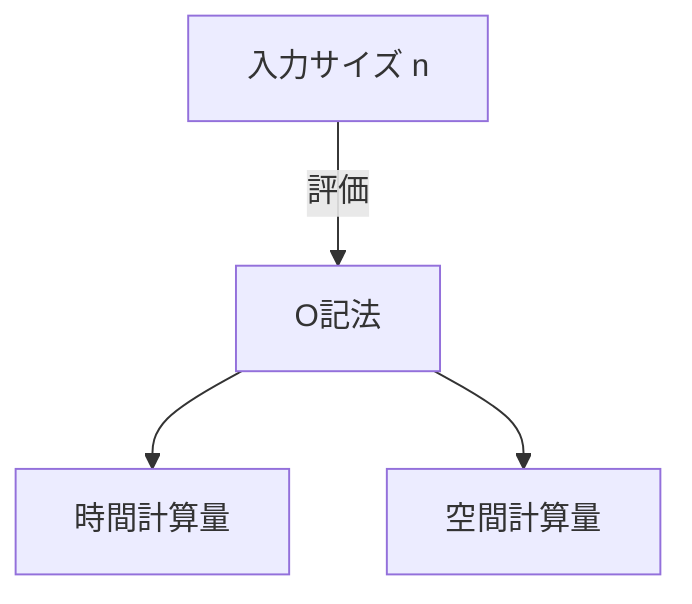

# はじめに

プログラミングを学ぶ上で、アルゴリズムの効率性を理解することは非常に重要です。その際に必ず登場するのが ** 計算量 ** （Complexity）という概念です。この記事では、時間計算量と空間計算量の基礎から、O記法（ビッグオー記法）の詳細な解説、そして実例を交えた深い考察まで、約2万文字のボリュームで徹底的に解説します。

# 計算量とは何か

アルゴリズムの性能を評価するための指標が計算量です。計算量には大きく分けて以下の2つが存在します。

1. ** 時間計算量 ** (Time Complexity)
2. ** 空間計算量 ** (Space Complexity)

## 1. 時間計算量

時間計算量とは、アルゴリズムが実行を完了するまでに必要な「時間」あるいは「ステップ数」を表す指標です。

## 2. 空間計算量

空間計算量とは、アルゴリズムが実行を完了するまでに必要な「メモリ空間」を表す指標です。

# O記法（ビッグオー記法）とは

O記法（Big O Notation）は、入力サイズ $n$ が十分に大きくなったときの、計算量の増加の割合の上限を示す数学的な記法です。

$$
O(f(n)) = \{ g(n) \mid \text{ある正の定数 } c, n_0 \text{ が存在し、すべての } n \ge n_0 \text{ に対して } 0 \le g(n) \le c f(n) \text{ を満たす} \}
$$

## O記法の基本的なルール

1. ** 定数項の無視 ** : $O(2n)$ は $O(n)$ になります。
2. ** 最も影響の大きい項のみを残す ** : $O(n^2 + n)$ は $O(n^2)$ になります。



# 代表的な時間計算量とPythonによる実例

ここからは、代表的なO記法のクラスについて、詳細な解説とPythonのコード例を見ていきましょう。

## 1. O(1) : 定数時間 (Constant Time)

入力サイズ $n$ に関わらず、常に一定のステップ数で処理が完了するアルゴリズムです。

```python
def get_first_element(arr):
    # 配列の最初の要素を取得するだけなので O(1)
    return arr[0] if arr else None
```

## 2. O(log n) : 対数時間 (Logarithmic Time)

入力サイズ $n$ が増えるにつれて、実行時間が増加しますが、その増加のペースは非常に緩やかです。代表的な例は[二分探索](https://kenji.blog/p/search-algorithms-linear-binary-hash-table-principles/)です。

```python
def binary_search(arr, target):
    left, right = 0, len(arr) - 1
    while left <= right:
        mid = (left + right) // 2
        if arr[mid] == target:
            return mid
        elif arr[mid] < target:
            left = mid + 1
        else:
            right = mid - 1
    return -1
```

## 3. O(n) : 線形時間 (Linear Time)

入力サイズ $n$ に比例して実行時間が増加するアルゴリズムです。

```python
def linear_search(arr, target):
    for i in range(len(arr)):
        if arr[i] == target:
            return i
    return -1
```

## 4. O(n log n) : 準線形時間 (Linearithmic Time)

O(n) と O(log n) の積です。多くの効率的な比較[ソートアルゴリズム](https://kenji.blog/p/sorting-algorithms-visualized-bubble-quick-merge/)（マージソート、クイックソート、[ヒープ](https://kenji.blog/p/c-language-pointers-memory-management-stack-heap/)ソートなど）がこの計算量を持ちます。

```python
def merge_sort(arr):
    if len(arr) <= 1:
        return arr
    mid = len(arr) // 2
    left = merge_sort(arr[:mid])
    right = merge_sort(arr[mid:])
    return merge(left, right)

def merge(left, right):
    result = []
    i = j = 0
    while i < len(left) and j < len(right):
        if left[i] < right[j]:
            result.append(left[i])
            i += 1
        else:
            result.append(right[j])
            j += 1
    result.extend(left[i:])
    result.extend(right[j:])
    return result
```

## 5. O(n^2) : 二乗時間 (Quadratic Time)

入力サイズ $n$ の2乗に比例して実行時間が増加します。[バブルソート](https://kenji.blog/p/sorting-algorithms-visualized-bubble-quick-merge/)や挿入ソートなどの単純な[ソートアルゴリズム](https://kenji.blog/p/sorting-algorithms-visualized-bubble-quick-merge/)が該当します。

```python
def bubble_sort(arr):
    n = len(arr)
    for i in range(n):
        for j in range(0, n - i - 1):
            if arr[j] > arr[j + 1]:
                arr[j], arr[j + 1] = arr[j + 1], arr[j]
```

## 6. O(2^n) : 指数時間 (Exponential Time)

入力サイズ $n$ が1増えるごとに、実行時間が2倍になります。[フィボナッチ数列](https://kenji.blog/p/dynamic-programming-dp-introduction-knapsack-fibonacci/)の単純な再帰実装などが該当します。

```python
def fibonacci_recursive(n):
    if n <= 1:
        return n
    return fibonacci_recursive(n - 1) + fibonacci_recursive(n - 2)
```

## 7. O(n!) : 階乗時間 (Factorial Time)

入力サイズの階乗に比例して実行時間が増加します。巡回セールスマン問題の全探索（ブルートフォース）などが該当します。

```python
import itertools

def traveling_salesperson_brute_force(distances):
    n = len(distances)
    cities = list(range(n))
    min_path = float('inf')
    
    for perm in itertools.permutations(cities):
        current_path = 0
        for i in range(n - 1):
            current_path += distances[perm[i]][perm[i+1]]
        current_path += distances[perm[-1]][perm[0]] # 戻る
        if current_path < min_path:
            min_path = current_path
            
    return min_path
```

# データ構造と計算量

| データ構造 | アクセス | 検索 | 挿入 | 削除 | 空間計算量 |
|---|---|---|---|---|---|
| Array | $O(1)$ | $O(n)$ | $O(n)$ | $O(n)$ | $O(n)$ |
| Linked List | $O(n)$ | $O(n)$ | $O(1)$ | $O(1)$ | $O(n)$ |
| [Hash Table](https://kenji.blog/p/search-algorithms-linear-binary-hash-table-principles/) | - | $O(1)$ | $O(1)$ | $O(1)$ | $O(n)$ |
| BST | $O(\log n)$ | $O(\log n)$ | $O(\log n)$ | $O(\log n)$ | $O(n)$ |

# [ソートアルゴリズム](https://kenji.blog/p/sorting-algorithms-visualized-bubble-quick-merge/)と計算量

| アルゴリズム | 最良 | 平均 | 最悪 | 空間計算量 |
|---|---|---|---|---|
| Bubble Sort | $O(n)$ | $O(n^2)$ | $O(n^2)$ | $O(1)$ |
| Merge Sort | $O(n \log n)$ | $O(n \log n)$ | $O(n \log n)$ | $O(n)$ |
| Quick Sort | $O(n \log n)$ | $O(n \log n)$ | $O(n^2)$ | $O(\log n)$ |


# はじめに

プログラミングを学ぶ上で、アルゴリズムの効率性を理解することは非常に重要です。その際に必ず登場するのが ** 計算量 ** （Complexity）という概念です。この記事では、時間計算量と空間計算量の基礎から、O記法（ビッグオー記法）の詳細な解説、そして実例を交えた深い考察まで、約2万文字のボリュームで徹底的に解説します。

# 計算量とは何か

アルゴリズムの性能を評価するための指標が計算量です。計算量には大きく分けて以下の2つが存在します。

1. ** 時間計算量 ** (Time Complexity)
2. ** 空間計算量 ** (Space Complexity)

## 7. O(n!) : 階乗時間 (Factorial Time)

入力サイズの階乗に比例して実行時間が増加します。巡回セールスマン問題の全探索（ブルートフォース）などが該当します。

```python
import itertools

def traveling_salesperson_brute_force(distances):
    n = len(distances)
    cities = list(range(n))
    min_path = float('inf')
    
    for perm in itertools.permutations(cities):
        current_path = 0
        for i in range(n - 1):
            current_path += distances[perm[i]][perm[i+1]]
        current_path += distances[perm[-1]][perm[0]] # 戻る
        if current_path < min_path:
            min_path = current_path
            
    return min_path
```

# データ構造と計算量

| データ構造 | アクセス | 検索 | 挿入 | 削除 | 空間計算量 |
|---|---|---|---|---|---|
| Array | $O(1)$ | $O(n)$ | $O(n)$ | $O(n)$ | $O(n)$ |
| Linked List | $O(n)$ | $O(n)$ | $O(1)$ | $O(1)$ | $O(n)$ |
| [Hash Table](https://kenji.blog/p/search-algorithms-linear-binary-hash-table-principles/) | - | $O(1)$ | $O(1)$ | $O(1)$ | $O(n)$ |
| BST | $O(\log n)$ | $O(\log n)$ | $O(\log n)$ | $O(\log n)$ | $O(n)$ |

# [ソートアルゴリズム](https://kenji.blog/p/sorting-algorithms-visualized-bubble-quick-merge/)と計算量

| アルゴリズム | 最良 | 平均 | 最悪 | 空間計算量 |
|---|---|---|---|---|
| Bubble Sort | $O(n)$ | $O(n^2)$ | $O(n^2)$ | $O(1)$ |
| Merge Sort | $O(n \log n)$ | $O(n \log n)$ | $O(n \log n)$ | $O(n)$ |
| Quick Sort | $O(n \log n)$ | $O(n \log n)$ | $O(n^2)$ | $O(\log n)$ |

