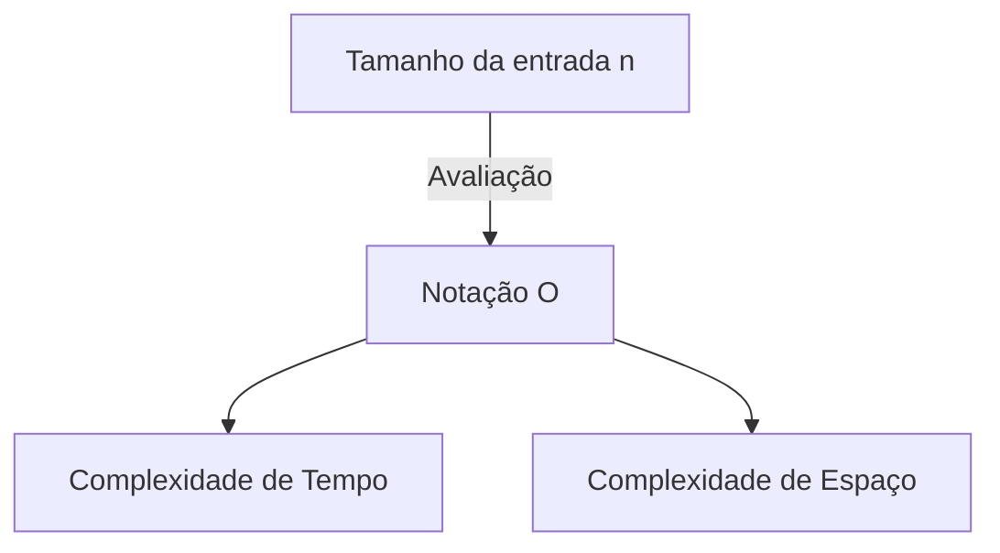

# Introdução

Ao aprender a programar, entender a eficiência dos algoritmos é muito importante. Nesse momento, o conceito de ** complexidade ** (Complexity) inevitavelmente aparece. Neste artigo, explicaremos exaustivamente os fundamentos da complexidade de tempo e de espaço, uma explicação detalhada da notação O (Big O Notation) e considerações profundas com exemplos práticos, em um volume de cerca de 20.000 caracteres.

# O que é complexidade

A métrica para avaliar o desempenho de um algoritmo é a complexidade. A complexidade pode ser dividida principalmente nas duas seguintes:

1. ** Complexidade de Tempo ** (Time Complexity)
2. ** Complexidade de Espaço ** (Space Complexity)

## 1. Complexidade de Tempo

A complexidade de tempo é uma métrica que representa o "tempo" ou "número de passos" necessários até que a execução de um algoritmo seja concluída.

## 2. Complexidade de Espaço

A complexidade de espaço é uma métrica que representa o "espaço de memória" necessário até que a execução de um algoritmo seja concluída.

# O que é a Notação O (Big O Notation)

A notação O (Big O Notation) é uma notação matemática que indica o limite superior da taxa de aumento da complexidade quando o tamanho da entrada $n$ se torna suficientemente grande.

$$
O(f(n)) = \{ g(n) \mid \text{Existem constantes positivas } c, n_0 \text{ tais que para todo } n \ge n_0 \text{ satisfaz } 0 \le g(n) \le c f(n) \}
$$

## Regras básicas da Notação O

1. ** Ignorar termos constantes ** : $O(2n)$ se torna $O(n)$.
2. ** Manter apenas o termo de maior impacto ** : $O(n^2 + n)$ se torna $O(n^2)$.



# Principais Complexidades de Tempo e Exemplos em Python

A partir daqui, vamos ver explicações detalhadas e exemplos de código em Python para as principais classes da notação O.

## 1. O(1) : Tempo Constante (Constant Time)

É um algoritmo no qual o processamento é concluído em um número constante de passos, independentemente do tamanho da entrada $n$.

```python
def get_first_element(arr):
    # Apenas obtém o primeiro elemento do array, então é O(1)
    return arr[0] if arr else None
```

## 2. O(log n) : Tempo Logarítmico (Logarithmic Time)

À medida que o tamanho da entrada $n$ aumenta, o tempo de execução também aumenta, mas o ritmo desse aumento é muito lento. Um exemplo típico é a busca binária.

```python
def binary_search(arr, target):
    left, right = 0, len(arr) - 1
    while left <= right:
        mid = (left + right) // 2
        if arr[mid] == target:
            return mid
        elif arr[mid] < target:
            left = mid + 1
        else:
            right = mid - 1
    return -1
```

## 3. O(n) : Tempo Linear (Linear Time)

É um algoritmo em que o tempo de execução aumenta proporcionalmente ao tamanho da entrada $n$.

```python
def linear_search(arr, target):
    for i in range(len(arr)):
        if arr[i] == target:
            return i
    return -1
```

## 4. O(n log n) : Tempo Linearítmico (Linearithmic Time)

É o produto de O(n) e O(log n). Muitos algoritmos de ordenação por comparação eficientes (Merge Sort, Quick Sort, Heap Sort, etc.) possuem essa complexidade.

```python
def merge_sort(arr):
    if len(arr) <= 1:
        return arr
    mid = len(arr) // 2
    left = merge_sort(arr[:mid])
    right = merge_sort(arr[mid:])
    return merge(left, right)

def merge(left, right):
    result = []
    i = j = 0
    while i < len(left) and j < len(right):
        if left[i] < right[j]:
            result.append(left[i])
            i += 1
        else:
            result.append(right[j])
            j += 1
    result.extend(left[i:])
    result.extend(right[j:])
    return result
```

## 5. O(n^2) : Tempo Quadrático (Quadratic Time)

O tempo de execução aumenta proporcionalmente ao quadrado do tamanho da entrada $n$. Algoritmos de ordenação simples, como Bubble Sort e Insertion Sort, enquadram-se aqui.

```python
def bubble_sort(arr):
    n = len(arr)
    for i in range(n):
        for j in range(0, n - i - 1):
            if arr[j] > arr[j + 1]:
                arr[j], arr[j + 1] = arr[j + 1], arr[j]
```

## 6. O(2^n) : Tempo Exponencial (Exponential Time)

Para cada aumento de 1 no tamanho da entrada $n$, o tempo de execução dobra. Uma implementação recursiva simples da sequência de Fibonacci é um exemplo.

```python
def fibonacci_recursive(n):
    if n <= 1:
        return n
    return fibonacci_recursive(n - 1) + fibonacci_recursive(n - 2)
```

## 7. O(n!) : Tempo Fatorial (Factorial Time)

O tempo de execução aumenta proporcionalmente ao fatorial do tamanho da entrada. A busca exaustiva (força bruta) do problema do caixeiro viajante se enquadra aqui.

```python
import itertools

def traveling_salesperson_brute_force(distances):
    n = len(distances)
    cities = list(range(n))
    min_path = float('inf')
    
    for perm in itertools.permutations(cities):
        current_path = 0
        for i in range(n - 1):
            current_path += distances[perm[i]][perm[i+1]]
        current_path += distances[perm[-1]][perm[0]] # Retorna
        if current_path < min_path:
            min_path = current_path
            
    return min_path
```

# Estruturas de Dados e Complexidade

| Estrutura de Dados | Acesso | Busca | Inserção | Remoção | Complexidade de Espaço |
|---|---|---|---|---|---|
| Array | $O(1)$ | $O(n)$ | $O(n)$ | $O(n)$ | $O(n)$ |
| Linked List | $O(n)$ | $O(n)$ | $O(1)$ | $O(1)$ | $O(n)$ |
| [Hash Table](https://kenji.blog/pt/p/search-algorithms-linear-binary-hash-table-principles/) | - | $O(1)$ | $O(1)$ | $O(1)$ | $O(n)$ |
| BST | $O(\log n)$ | $O(\log n)$ | $O(\log n)$ | $O(\log n)$ | $O(n)$ |

# Algoritmos de Ordenação e Complexidade

| Algoritmo | Melhor | Médio | Pior | Complexidade de Espaço |
|---|---|---|---|---|
| Bubble Sort | $O(n)$ | $O(n^2)$ | $O(n^2)$ | $O(1)$ |
| Merge Sort | $O(n \log n)$ | $O(n \log n)$ | $O(n \log n)$ | $O(n)$ |
| Quick Sort | $O(n \log n)$ | $O(n \log n)$ | $O(n^2)$ | $O(\log n)$ |
