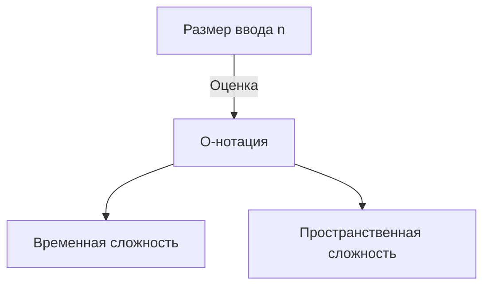

# Введение

При изучении программирования очень важно понимать эффективность алгоритмов. При этом всегда возникает понятие **Сложность** (Complexity). В этой статье мы подробно рассмотрим основы временной и пространственной сложности, детально объясним О-нотацию (Big O notation) и проведем глубокий анализ с примерами, в объеме около 20 тысяч символов.

# Что такое сложность

Сложность — это показатель, используемый для оценки производительности алгоритма. Сложность можно разделить на две основные категории:

1. **Временная сложность** (Time Complexity)
2. **Пространственная сложность** (Space Complexity)

## 1. Временная сложность

Временная сложность — это показатель, который отражает «время» или «количество шагов», необходимое алгоритму для завершения выполнения.

## 2. Пространственная сложность

Пространственная сложность — это показатель, который отражает объем «памяти», необходимый алгоритму для завершения выполнения.

# Что такое О-нотация (Big O notation)

О-нотация (Big O Notation) — это математическая нотация, которая описывает верхнюю границу скорости роста сложности алгоритма при достаточно большом размере входных данных $n$.

$$
O(f(n)) = \{ g(n) \mid \text{существуют положительные константы } c, n_0 \text{ такие, что для всех } n \ge n_0 \text{ выполняется } 0 \le g(n) \le c f(n) \}
$$

## Основные правила О-нотации

1. **Игнорирование констант** : $O(2n)$ становится $O(n)$.
2. **Сохранение только самого значимого слагаемого** : $O(n^2 + n)$ становится $O(n^2)$.



# Основные виды временной сложности и примеры на Python

Далее мы подробно рассмотрим основные классы О-нотации и приведем примеры кода на Python.

## 1. O(1) : Константное время (Constant Time)

Алгоритм завершает работу за фиксированное количество шагов независимо от размера входных данных $n$.

```python
def get_first_element(arr):
    # Мы только получаем первый элемент массива, поэтому O(1)
    return arr[0] if arr else None
```

## 2. O(log n) : Логарифмическое время (Logarithmic Time)

С увеличением размера входных данных $n$ время выполнения увеличивается, но темп роста очень медленный. Типичный пример — бинарный поиск.

```python
def binary_search(arr, target):
    left, right = 0, len(arr) - 1
    while left <= right:
        mid = (left + right) // 2
        if arr[mid] == target:
            return mid
        elif arr[mid] < target:
            left = mid + 1
        else:
            right = mid - 1
    return -1
```

## 3. O(n) : Линейное время (Linear Time)

Время выполнения алгоритма увеличивается пропорционально размеру входных данных $n$.

```python
def linear_search(arr, target):
    for i in range(len(arr)):
        if arr[i] == target:
            return i
    return -1
```

## 4. O(n log n) : Линейно-логарифмическое время (Linearithmic Time)

Произведение O(n) и O(log n). Такую сложность имеют многие эффективные алгоритмы сортировки сравнением (сортировка слиянием, быстрая сортировка, пирамидальная сортировка и др.).

```python
def merge_sort(arr):
    if len(arr) <= 1:
        return arr
    mid = len(arr) // 2
    left = merge_sort(arr[:mid])
    right = merge_sort(arr[mid:])
    return merge(left, right)

def merge(left, right):
    result = []
    i = j = 0
    while i < len(left) and j < len(right):
        if left[i] < right[j]:
            result.append(left[i])
            i += 1
        else:
            result.append(right[j])
            j += 1
    result.extend(left[i:])
    result.extend(right[j:])
    return result
```

## 5. O(n^2) : Квадратичное время (Quadratic Time)

Время выполнения увеличивается пропорционально квадрату размера входных данных $n$. К этой категории относятся простые алгоритмы сортировки, такие как сортировка пузырьком или сортировка вставками.

```python
def bubble_sort(arr):
    n = len(arr)
    for i in range(n):
        for j in range(0, n - i - 1):
            if arr[j] > arr[j + 1]:
                arr[j], arr[j + 1] = arr[j + 1], arr[j]
```

## 6. O(2^n) : Экспоненциальное время (Exponential Time)

С каждым увеличением размера входных данных $n$ на 1, время выполнения удваивается. Примером служит простая рекурсивная реализация чисел Фибоначчи.

```python
def fibonacci_recursive(n):
    if n <= 1:
        return n
    return fibonacci_recursive(n - 1) + fibonacci_recursive(n - 2)
```

## 7. O(n!) : Факториальное время (Factorial Time)

Время выполнения увеличивается пропорционально факториалу размера входных данных. Примером является полный перебор (brute-force) для задачи коммивояжера.

```python
import itertools

def traveling_salesperson_brute_force(distances):
    n = len(distances)
    cities = list(range(n))
    min_path = float('inf')
    
    for perm in itertools.permutations(cities):
        current_path = 0
        for i in range(n - 1):
            current_path += distances[perm[i]][perm[i+1]]
        current_path += distances[perm[-1]][perm[0]] # возврат
        if current_path < min_path:
            min_path = current_path
            
    return min_path
```

# Структуры данных и их сложность

| Структура данных | Доступ | Поиск | Вставка | Удаление | Пространственная сложность |
|---|---|---|---|---|---|
| Array | $O(1)$ | $O(n)$ | $O(n)$ | $O(n)$ | $O(n)$ |
| Linked List | $O(n)$ | $O(n)$ | $O(1)$ | $O(1)$ | $O(n)$ |
| [Hash Table](https://kenji.blog/ru/p/search-algorithms-linear-binary-hash-table-principles/) | - | $O(1)$ | $O(1)$ | $O(1)$ | $O(n)$ |
| BST | $O(\log n)$ | $O(\log n)$ | $O(\log n)$ | $O(\log n)$ | $O(n)$ |

# Алгоритмы сортировки и их сложность

| Алгоритм | Лучший | В среднем | Худший | Пространственная сложность |
|---|---|---|---|---|
| Bubble Sort | $O(n)$ | $O(n^2)$ | $O(n^2)$ | $O(1)$ |
| Merge Sort | $O(n \log n)$ | $O(n \log n)$ | $O(n \log n)$ | $O(n)$ |
| Quick Sort | $O(n \log n)$ | $O(n \log n)$ | $O(n^2)$ | $O(\log n)$ |


# Введение

При изучении программирования очень важно понимать эффективность алгоритмов. При этом всегда возникает понятие **Сложность** (Complexity). В этой статье мы подробно рассмотрим основы временной и пространственной сложности, детально объясним О-нотацию (Big O notation) и проведем глубокий анализ с примерами, в объеме около 20 тысяч символов.

# Что такое сложность

Сложность — это показатель, используемый для оценки производительности алгоритма. Сложность можно разделить на две основные категории:

1. **Временная сложность** (Time Complexity)
2. **Пространственная сложность** (Space Complexity)

## 7. O(n!) : Факториальное время (Factorial Time)

Время выполнения увеличивается пропорционально факториалу размера входных данных. Примером является полный перебор (brute-force) для задачи коммивояжера.

```python
import itertools

def traveling_salesperson_brute_force(distances):
    n = len(distances)
    cities = list(range(n))
    min_path = float('inf')
    
    for perm in itertools.permutations(cities):
        current_path = 0
        for i in range(n - 1):
            current_path += distances[perm[i]][perm[i+1]]
        current_path += distances[perm[-1]][perm[0]] # возврат
        if current_path < min_path:
            min_path = current_path
            
    return min_path
```

# Структуры данных и их сложность

| Структура данных | Доступ | Поиск | Вставка | Удаление | Пространственная сложность |
|---|---|---|---|---|---|
| Array | $O(1)$ | $O(n)$ | $O(n)$ | $O(n)$ | $O(n)$ |
| Linked List | $O(n)$ | $O(n)$ | $O(1)$ | $O(1)$ | $O(n)$ |
| [Hash Table](https://kenji.blog/ru/p/search-algorithms-linear-binary-hash-table-principles/) | - | $O(1)$ | $O(1)$ | $O(1)$ | $O(n)$ |
| BST | $O(\log n)$ | $O(\log n)$ | $O(\log n)$ | $O(\log n)$ | $O(n)$ |

# Алгоритмы сортировки и их сложность

| Алгоритм | Лучший | В среднем | Худший | Пространственная сложность |
|---|---|---|---|---|
| Bubble Sort | $O(n)$ | $O(n^2)$ | $O(n^2)$ | $O(1)$ |
| Merge Sort | $O(n \log n)$ | $O(n \log n)$ | $O(n \log n)$ | $O(n)$ |
| Quick Sort | $O(n \log n)$ | $O(n \log n)$ | $O(n^2)$ | $O(\log n)$ |
