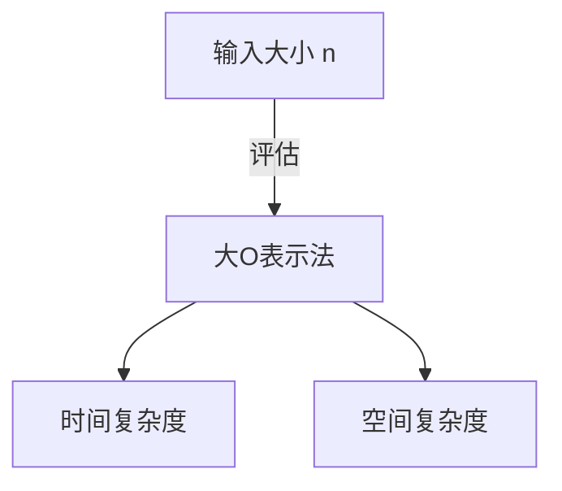

# 前言

在学习编程的过程中，理解算法的效率是非常重要的。此时必然会接触到一个概念，那就是 ** 复杂度 ** （Complexity）。本文将从时间复杂度和空间复杂度的基础开始，详细讲解大O表示法，并结合实例进行深入探讨，内容丰富，长达约2万字，为您彻底解析。

# 什么是复杂度

用于评估算法性能的指标就是复杂度。复杂度大致可分为以下两种：

1. ** 时间复杂度 ** (Time Complexity)
2. ** 空间复杂度 ** (Space Complexity)

## 1. 时间复杂度

时间复杂度是表示算法完成执行所需的“时间”或“步数”的指标。

## 2. 空间复杂度

空间复杂度是表示算法完成执行所需的“内存空间”的指标。

# 什么是大O表示法

大O表示法（Big O Notation）是一种数学记号，用于表示当输入大小 $n$ 足够大时，复杂度增长率的上限。

$$
O(f(n)) = \{ g(n) \mid \text{存在某个正常数 } c, n_0 \text{，使得对于所有的 } n \ge n_0 \text{，满足 } 0 \le g(n) \le c f(n) \}
$$

## 大O表示法的基本规则

1. ** 忽略常数项 ** ：$O(2n)$ 会变成 $O(n)$。
2. ** 只保留影响最大的项 ** ：$O(n^2 + n)$ 会变成 $O(n^2)$。



# 代表性的时间复杂度与Python实例

接下来，我们将针对代表性的大O表示法分类，进行详细讲解并查看Python代码示例。

## 1. O(1) : 常数时间 (Constant Time)

无论输入大小 $n$ 是多少，始终在固定的步数内完成处理的算法。

```python
def get_first_element(arr):
    # 只是获取数组的第一个元素，所以是 O(1)
    return arr[0] if arr else None
```

## 2. O(log n) : 对数时间 (Logarithmic Time)

随着输入大小 $n$ 的增加，执行时间也会增加，但其增加的速度非常缓慢。典型的例子是二分查找。

```python
def binary_search(arr, target):
    left, right = 0, len(arr) - 1
    while left <= right:
        mid = (left + right) // 2
        if arr[mid] == target:
            return mid
        elif arr[mid] < target:
            left = mid + 1
        else:
            right = mid - 1
    return -1
```

## 3. O(n) : 线性时间 (Linear Time)

执行时间与输入大小 $n$ 成正比增加的算法。

```python
def linear_search(arr, target):
    for i in range(len(arr)):
        if arr[i] == target:
            return i
    return -1
```

## 4. O(n log n) : 线性对数时间 (Linearithmic Time)

O(n) 和 O(log n) 的乘积。许多高效的比较排序算法（归并排序、快速排序、堆排序等）都具有这种复杂度。

```python
def merge_sort(arr):
    if len(arr) <= 1:
        return arr
    mid = len(arr) // 2
    left = merge_sort(arr[:mid])
    right = merge_sort(arr[mid:])
    return merge(left, right)

def merge(left, right):
    result = []
    i = j = 0
    while i < len(left) and j < len(right):
        if left[i] < right[j]:
            result.append(left[i])
            i += 1
        else:
            result.append(right[j])
            j += 1
    result.extend(left[i:])
    result.extend(right[j:])
    return result
```

## 5. O(n^2) : 平方时间 (Quadratic Time)

执行时间与输入大小 $n$ 的平方成正比增加。冒泡排序和插入排序等简单的排序算法属于此类。

```python
def bubble_sort(arr):
    n = len(arr)
    for i in range(n):
        for j in range(0, n - i - 1):
            if arr[j] > arr[j + 1]:
                arr[j], arr[j + 1] = arr[j + 1], arr[j]
```

## 6. O(2^n) : 指数时间 (Exponential Time)

输入大小 $n$ 每增加1，执行时间就会翻倍。斐波那契数列的简单递归实现等属于此类。

```python
def fibonacci_recursive(n):
    if n <= 1:
        return n
    return fibonacci_recursive(n - 1) + fibonacci_recursive(n - 2)
```

## 7. O(n!) : 阶乘时间 (Factorial Time)

执行时间与输入大小的阶乘成正比增加。旅行商问题的全搜索（暴力破解）等属于此类。

```python
import itertools

def traveling_salesperson_brute_force(distances):
    n = len(distances)
    cities = list(range(n))
    min_path = float('inf')
    
    for perm in itertools.permutations(cities):
        current_path = 0
        for i in range(n - 1):
            current_path += distances[perm[i]][perm[i+1]]
        current_path += distances[perm[-1]][perm[0]] # 返回
        if current_path < min_path:
            min_path = current_path
            
    return min_path
```

# 数据结构与复杂度

| 数据结构 | 访问 | 搜索 | 插入 | 删除 | 空间复杂度 |
|---|---|---|---|---|---|
| Array | $O(1)$ | $O(n)$ | $O(n)$ | $O(n)$ | $O(n)$ |
| Linked List | $O(n)$ | $O(n)$ | $O(1)$ | $O(1)$ | $O(n)$ |
| [Hash Table](https://kenji.blog/zh-cn/p/search-algorithms-linear-binary-hash-table-principles/) | - | $O(1)$ | $O(1)$ | $O(1)$ | $O(n)$ |
| BST | $O(\log n)$ | $O(\log n)$ | $O(\log n)$ | $O(\log n)$ | $O(n)$ |

# 排序算法与复杂度

| 算法 | 最好 | 平均 | 最坏 | 空间复杂度 |
|---|---|---|---|---|
| Bubble Sort | $O(n)$ | $O(n^2)$ | $O(n^2)$ | $O(1)$ |
| Merge Sort | $O(n \log n)$ | $O(n \log n)$ | $O(n \log n)$ | $O(n)$ |
| Quick Sort | $O(n \log n)$ | $O(n \log n)$ | $O(n^2)$ | $O(\log n)$ |

# 前言

在学习编程的过程中，理解算法的效率是非常重要的。此时必然会接触到一个概念，那就是 ** 复杂度 ** （Complexity）。本文将从时间复杂度和空间复杂度的基础开始，详细讲解大O表示法，并结合实例进行深入探讨，内容丰富，长达约2万字，为您彻底解析。

# 什么是复杂度

用于评估算法性能的指标就是复杂度。复杂度大致可分为以下两种：

1. ** 时间复杂度 ** (Time Complexity)
2. ** 空间复杂度 ** (Space Complexity)

## 1. 时间复杂度

时间复杂度是表示算法完成执行所需的“时间”或“步数”的指标。

## 1. 时间复杂度

时间复杂度是表示算法完成执行所需的“时间”或“步数”的指标。

## 1. 时间复杂度

时间复杂度是表示算法完成执行所需的“时间”或“步数”的指标。

## 1. 时间复杂度

时间复杂度是表示算法完成执行所需的“时间”或“步数”的指标。

## 1. 时间复杂度

时间复杂度是表示算法完成执行所需的“时间”或“步数”的指标。

## 1. 时间复杂度

时间复杂度是表示算法完成执行所需的“时间”或“步数”的指标。

## 1. 时间复杂度

时间复杂度是表示算法完成执行所需的“时间”或“步数”的指标。

## 7. O(n!) : 阶乘时间 (Factorial Time)

执行时间与输入大小的阶乘成正比增加。旅行商问题的全搜索（暴力破解）等属于此类。

```python
import itertools

def traveling_salesperson_brute_force(distances):
    n = len(distances)
    cities = list(range(n))
    min_path = float('inf')
    
    for perm in itertools.permutations(cities):
        current_path = 0
        for i in range(n - 1):
            current_path += distances[perm[i]][perm[i+1]]
        current_path += distances[perm[-1]][perm[0]] # 返回
        if current_path < min_path:
            min_path = current_path
            
    return min_path
```

# 数据结构与复杂度

| 数据结构 | 访问 | 搜索 | 插入 | 删除 | 空间复杂度 |
|---|---|---|---|---|---|
| Array | $O(1)$ | $O(n)$ | $O(n)$ | $O(n)$ | $O(n)$ |
| Linked List | $O(n)$ | $O(n)$ | $O(1)$ | $O(1)$ | $O(n)$ |
| [Hash Table](https://kenji.blog/zh-cn/p/search-algorithms-linear-binary-hash-table-principles/) | - | $O(1)$ | $O(1)$ | $O(1)$ | $O(n)$ |
| BST | $O(\log n)$ | $O(\log n)$ | $O(\log n)$ | $O(\log n)$ | $O(n)$ |

# 排序算法与复杂度

| 算法 | 最好 | 平均 | 最坏 | 空间复杂度 |
|---|---|---|---|---|
| Bubble Sort | $O(n)$ | $O(n^2)$ | $O(n^2)$ | $O(1)$ |
| Merge Sort | $O(n \log n)$ | $O(n \log n)$ | $O(n \log n)$ | $O(n)$ |
| Quick Sort | $O(n \log n)$ | $O(n \log n)$ | $O(n^2)$ | $O(\log n)$ |
